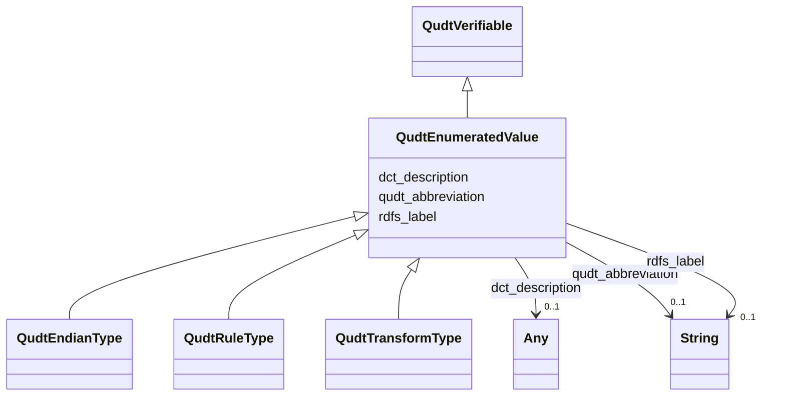

# Class: Enumerated Value (qudt_EnumeratedValue)


_<p>This class is for all enumerated and/or coded values.  For example, it contains the dimension objects that are the basis elements in some abstract vector space associated with a quantity kind system. Another use is for the base dimensions for quantity systems. Each quantity kind system that defines a base set has a corresponding ordered enumeration whose elements are the dimension objects for the base quantity kinds. The order of the dimensions in the enumeration determines the canonical order of the basis elements in the corresponding abstract vector space.</p>
␊
␊<p>An enumeration is a set of literals from which a single value is selected. Each literal can have a tag as an integer within a standard encoding appropriate to the range of integer values. Consistency of enumeration types will allow them, and the enumerated values, to be referred to unambiguously either through symbolic name or encoding. Enumerated values are also controlled vocabularies and as such need to be standardized. Without this consistency enumeration literals can be stated differently and result in  data conflicts and misinterpretations.</p>
␊
␊<p>The tags are a set of positive whole numbers, not necessarily contiguous and having no numerical significance, each corresponding to the associated literal identifier. An order attribute can also be given on the enumeration elements. An enumeration can itself be a member of an enumeration. This allows enumerations to be enumerated in a selection. Enumerations are also subclasses of Scalar Datatype. This allows them to be used as the reference of a datatype specification.</p>_


This class occurs 1 times.


URI: [qudt:EnumeratedValue](http://qudt.org/schema/qudt/EnumeratedValue)





## Inheritance
* [QudtVerifiable](../classes/QudtVerifiable.md)
    * **QudtEnumeratedValue**
        * [QudtEndianType](../classes/QudtEndianType.md)
        * [QudtRuleType](../classes/QudtRuleType.md)
        * [QudtTransformType](../classes/QudtTransformType.md)


## Slots

| Name | Cardinality and Range | Description | Inheritance | Occurrences |
| ---  | --- | --- | --- | --- |
| [qudt_abbreviation](../slots/qudt_abbreviation.md) | 0..1 <br/> [xsd:string](http://www.w3.org/2001/XMLSchema#string) | An abbreviation for a unit is a short ASCII string that is used in place of t... <br/>  | direct | 1 |
| [dct_description](../slots/dct_description.md) | 0..1 <br/> [RdfHTML](../types/RdfHTML.md)&nbsp;or&nbsp;<br />[xsd:string](http://www.w3.org/2001/XMLSchema#string) | No slot (predicate) description specified <br/>  | direct | 1 |
| [rdfs_label](../slots/rdfs_label.md) | 0..1 <br/> [xsd:string](http://www.w3.org/2001/XMLSchema#string) | No slot (predicate) description specified <br/>  | direct | 1 |


## Usages

| used by | used in | type | used |
| ---  | --- | --- | --- |
| [CosoDetectQuantityValue](../classes/CosoDetectQuantityValue.md) | [qudt_enumeratedValue](../slots/qudt_enumeratedValue.md) | range | [QudtEnumeratedValue](../classes/QudtEnumeratedValue.md) |
| [CosoNonDetectQuantityValue](../classes/CosoNonDetectQuantityValue.md) | [qudt_enumeratedValue](../slots/qudt_enumeratedValue.md) | range | [QudtEnumeratedValue](../classes/QudtEnumeratedValue.md) |


## LinkML Source

<!-- TODO: investigate https://stackoverflow.com/questions/37606292/how-to-create-tabbed-code-blocks-in-mkdocs-or-sphinx -->

### Direct

<details>

```yaml
name: qudt_EnumeratedValue
conforms_to: No schema conformance document specified
annotations:
  count:
    tag: count
    value: 1
description: "<p>This class is for all enumerated and/or coded values.  For example,\
  \ it contains the dimension objects that are the basis elements in some abstract\
  \ vector space associated with a quantity kind system. Another use is for the base\
  \ dimensions for quantity systems. Each quantity kind system that defines a base\
  \ set has a corresponding ordered enumeration whose elements are the dimension objects\
  \ for the base quantity kinds. The order of the dimensions in the enumeration determines\
  \ the canonical order of the basis elements in the corresponding abstract vector\
  \ space.</p>\r␊\r␊<p>An enumeration is a set of literals from which a single value\
  \ is selected. Each literal can have a tag as an integer within a standard encoding\
  \ appropriate to the range of integer values. Consistency of enumeration types will\
  \ allow them, and the enumerated values, to be referred to unambiguously either\
  \ through symbolic name or encoding. Enumerated values are also controlled vocabularies\
  \ and as such need to be standardized. Without this consistency enumeration literals\
  \ can be stated differently and result in  data conflicts and misinterpretations.</p>\r\
  ␊\r␊<p>The tags are a set of positive whole numbers, not necessarily contiguous\
  \ and having no numerical significance, each corresponding to the associated literal\
  \ identifier. An order attribute can also be given on the enumeration elements.\
  \ An enumeration can itself be a member of an enumeration. This allows enumerations\
  \ to be enumerated in a selection. Enumerations are also subclasses of Scalar Datatype.\
  \ This allows them to be used as the reference of a datatype specification.</p>"
title: Enumerated Value
from_schema: sawgraph-kg
source: http://qudt.org/2.1/schema/qudt
rank: 1000
is_a: qudt_Verifiable
slots:
- qudt_abbreviation
- dct_description
- rdfs_label
slot_usage:
  dct_description:
    name: dct_description
    annotations:
      string:
        tag: string
        value: 1
  qudt_abbreviation:
    name: qudt_abbreviation
    annotations:
      string:
        tag: string
        value: 1
  rdfs_label:
    name: rdfs_label
    annotations:
      string:
        tag: string
        value: 1
class_uri: qudt:EnumeratedValue

```
</details>

### Induced

<details>

```yaml
name: qudt_EnumeratedValue
conforms_to: No schema conformance document specified
annotations:
  count:
    tag: count
    value: 1
description: "<p>This class is for all enumerated and/or coded values.  For example,\
  \ it contains the dimension objects that are the basis elements in some abstract\
  \ vector space associated with a quantity kind system. Another use is for the base\
  \ dimensions for quantity systems. Each quantity kind system that defines a base\
  \ set has a corresponding ordered enumeration whose elements are the dimension objects\
  \ for the base quantity kinds. The order of the dimensions in the enumeration determines\
  \ the canonical order of the basis elements in the corresponding abstract vector\
  \ space.</p>\r␊\r␊<p>An enumeration is a set of literals from which a single value\
  \ is selected. Each literal can have a tag as an integer within a standard encoding\
  \ appropriate to the range of integer values. Consistency of enumeration types will\
  \ allow them, and the enumerated values, to be referred to unambiguously either\
  \ through symbolic name or encoding. Enumerated values are also controlled vocabularies\
  \ and as such need to be standardized. Without this consistency enumeration literals\
  \ can be stated differently and result in  data conflicts and misinterpretations.</p>\r\
  ␊\r␊<p>The tags are a set of positive whole numbers, not necessarily contiguous\
  \ and having no numerical significance, each corresponding to the associated literal\
  \ identifier. An order attribute can also be given on the enumeration elements.\
  \ An enumeration can itself be a member of an enumeration. This allows enumerations\
  \ to be enumerated in a selection. Enumerations are also subclasses of Scalar Datatype.\
  \ This allows them to be used as the reference of a datatype specification.</p>"
title: Enumerated Value
from_schema: sawgraph-kg
source: http://qudt.org/2.1/schema/qudt
rank: 1000
is_a: qudt_Verifiable
slot_usage:
  dct_description:
    name: dct_description
    annotations:
      string:
        tag: string
        value: 1
  qudt_abbreviation:
    name: qudt_abbreviation
    annotations:
      string:
        tag: string
        value: 1
  rdfs_label:
    name: rdfs_label
    annotations:
      string:
        tag: string
        value: 1
attributes:
  qudt_abbreviation:
    name: qudt_abbreviation
    annotations:
      string:
        tag: string
        value: 1
    description: An abbreviation for a unit is a short ASCII string that is used in
      place of the full name for the unit in contexts where non-ASCII characters would
      be problematic, or where using the abbreviation will enhance readability. When
      a power of abase unit needs to be expressed, such as squares this can be done
      using abbreviations rather than symbols. For example, <em>sq ft</em> means <em>square
      foot</em>, and <em>cu ft</em> means <em>cubic foot</em>.
    title: abbreviation
    examples:
    - object:
        example_object: ND
        example_object_type: string
        example_predicate: qudt:abbreviation
        example_subject: coso:non-detect
        example_subject_type: qudt_EnumeratedValue
    from_schema: sawgraph-kg
    source: http://qudt.org/2.1/schema/qudt
    rank: 1000
    slot_uri: qudt:abbreviation
    alias: qudt_abbreviation
    owner: qudt_EnumeratedValue
    domain_of:
    - qudt_EnumeratedValue
    range: string
  dct_description:
    name: dct_description
    annotations:
      string:
        tag: string
        value: 1
    description: No slot (predicate) description specified
    title: No slot (predicate) name specified
    examples:
    - object:
        example_object: mass ratio as 0.000000001-fold of the SI base unit kilogram
          divided by the SI base unit kilogram
        example_object_type: rdf_HTML
        example_predicate: dct:description
        example_subject: http://qudt.org/vocab/unit/MicroGM-PER-KiloGM
        example_subject_type: qudt_Unit
    - object:
        example_object: Non-Detect Value
        example_object_type: string
        example_predicate: dct:description
        example_subject: coso:non-detect
        example_subject_type: qudt_EnumeratedValue
    from_schema: sawgraph-kg
    rank: 1000
    slot_uri: dct:description
    alias: dct_description
    owner: qudt_EnumeratedValue
    domain_of:
    - qudt_CardinalityType
    - qudt_EnumeratedValue
    - qudt_Unit
    - vaem_#GraphMetaData
    - vaem_#Party
    range: Any
    any_of:
    - range: rdf_HTML
    - range: string
  rdfs_label:
    name: rdfs_label
    annotations:
      string:
        tag: string
        value: 1
    description: No slot (predicate) description specified
    examples:
    - object:
        example_object: Microgram per Kilogram
        example_object_type: string
        example_predicate: rdfs:label
        example_subject: http://qudt.org/vocab/unit/MicroGM-PER-KiloGM
        example_subject_type: qudt_Unit
    - object:
        example_object: AB
        example_object_type: string
        example_predicate: rdfs:label
        example_subject: me_egad_data:AB
        example_subject_type: prov_Agent
    - object:
        example_object: COMPOUND IS FOUND IN THE ASSOCIATED METHOD BLANK (ORGANIC)
          OR THE REPORTED VALUE WAS LESS THAN THE REPORTING LIMIT BUT GREATER THAN
          OR EQUAL TO THE IDL. (INORGANIC)
        example_object_type: string
        example_predicate: rdfs:label
        example_subject: me_egad_data:concentrationQualifier.B
        example_subject_type: owl_NamedIndividual
    - object:
        example_object: ALPHA ANALYTICAL LAB - WESTBOROUGH, MA
        example_object_type: string
        example_predicate: rdfs:label
        example_subject: me_egad_data:organization.lab.AA
        example_subject_type: prov_Organization
    - object:
        example_object: EGAD PFAS measurements for sample EP001
        example_object_type: string
        example_predicate: rdfs:label
        example_subject: me_egad_data:result.101365P.NA.20130507.1763231
        example_subject_type: me_egad_EGAD-SinglePFAS-Concentration
    - object:
        example_object: EGAD PFAS measurements for sample EP001
        example_object_type: string
        example_predicate: rdfs:label
        example_subject: me_egad_data:result.101365P.NA.20130507.DEP18010
        example_subject_type: me_egad_EGAD-AggregatePFAS-Concentration
    - object:
        example_object: EGAD sample BETH WILLIAMS ACF
        example_object_type: string
        example_predicate: rdfs:label
        example_subject: me_egad_data:sample.AAL210144001R.20210112
        example_subject_type: me_egad_EGAD-Sample
    - object:
        example_object: EGAD sample point 100410
        example_object_type: string
        example_predicate: rdfs:label
        example_subject: me_egad_data:samplePoint.100410
        example_subject_type: me_egad_EGAD-SamplePoint
    - object:
        example_object: EGAD sampled feature associated with sample point 100410
        example_object_type: string
        example_predicate: rdfs:label
        example_subject: me_egad_data:sampledFeature.100410
        example_subject_type: me_egad_EGAD-SampledFeature
    - object:
        example_object: MAINE ARMY NATIONAL GUARD - BANGOR RANGE
        example_object_type: string
        example_predicate: rdfs:label
        example_subject: me_egad_data:site.100843
        example_subject_type: me_egad_EGAD-Site
    - object:
        example_object: FARMINGTON VILLAGE CORPORATION
        example_object_type: string
        example_predicate: rdfs:label
        example_subject: me_egad_data:site.131980
        example_subject_type: me_egad_EGAD-PFAS-Site
    - object:
        example_object: Single Contamiant Concentration Quantity
        example_object_type: string
        example_predicate: rdfs:label
        example_subject: coso:SingleContaminantConcentrationQuantityKind
        example_subject_type: coso_ContaminantConcentrationQuantityKind
    - object:
        example_object: Non-Detect
        example_object_type: string
        example_predicate: rdfs:label
        example_subject: coso:non-detect
        example_subject_type: qudt_EnumeratedValue
    - object:
        example_object: Enumerated Quantity
        example_object_type: string
        example_predicate: rdfs:label
        example_subject: qudt:EnumeratedQuantity
        example_subject_type: None
    - object:
        example_object: EGAD PFAS observation for sample BETH WILLIAMS ACF
        example_object_type: string
        example_predicate: rdfs:label
        example_subject: me_egad_data:observation.AAL210144001R.20210112.1763231
        example_subject_type: me_egad_EGAD-PFAS-Observation
    from_schema: sawgraph-kg
    rank: 1000
    slot_uri: rdfs:label
    alias: rdfs_label
    owner: qudt_EnumeratedValue
    domain_of:
    - owl_NamedIndividual
    - owl_OntologyProperty
    - qudt_AspectClass
    - qudt_BitEncodingType
    - qudt_BooleanEncodingType
    - qudt_ByteEncodingType
    - qudt_CardinalityType
    - qudt_CharEncodingType
    - qudt_DateTimeStringEncodingType
    - qudt_EndianType
    - qudt_EnumeratedValue
    - qudt_FloatingPointEncodingType
    - qudt_IntegerEncodingType
    - qudt_OrderedType
    - qudt_SignednessType
    - qudt_Unit
    - vaem_#CatalogEntry
    - vaem_#GraphMetaData
    - vaem_#Party
    - coso_ContaminantConcentrationQuantityKind
    - coso_ContaminantVolumeQuantityKind
    - coso_Substance
    - coso_SubstanceCollection
    - me_egad_EGAD-AggregatePFAS-Concentration
    - me_egad_EGAD-AnalysisMethod
    - me_egad_EGAD-ConcentrationQualifier
    - me_egad_EGAD-PFAS-Observation
    - me_egad_EGAD-PFAS-ParameterName
    - me_egad_EGAD-PFAS-Site
    - me_egad_EGAD-ResultType
    - me_egad_EGAD-Sample
    - me_egad_EGAD-SampleCollectionMethod
    - me_egad_EGAD-SampleDetailedLocation
    - me_egad_EGAD-SampleMaterialType
    - me_egad_EGAD-SampleMaterialTypeQualifier
    - me_egad_EGAD-SamplePoint
    - me_egad_EGAD-SamplePointType
    - me_egad_EGAD-SampleTreatmentStatus
    - me_egad_EGAD-SampledFeature
    - me_egad_EGAD-SinglePFAS-Concentration
    - me_egad_EGAD-Site
    - me_egad_EGAD-SiteType
    - me_egad_EGAD-ValidationLevel
    - prov_Agent
    - prov_Organization
    range: string
class_uri: qudt:EnumeratedValue

```
</details>