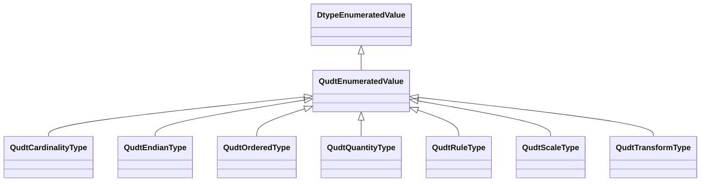

# Class: Enumerated Value (qudt_EnumeratedValue)


_<p>This class is for all enumerated and/or coded values.  For example, it contains the dimension objects that are the basis elements in some abstract vector space associated with a quantity kind system. Another use is for the base dimensions for quantity systems. Each quantity kind system that defines a base set has a corresponding ordered enumeration whose elements are the dimension objects for the base quantity kinds. The order of the dimensions in the enumeration determines the canonical order of the basis elements in the corresponding abstract vector space.</p>␊␊<p>An enumeration is a set of literals from which a single value is selected. Each literal can have a tag as an integer within a standard encoding appropriate to the range of integer values. Consistency of enumeration types will allow them, and the enumerated values, to be referred to unambiguously either through symbolic name or encoding. Enumerated values are also controlled vocabularies and as such need to be standardized. Without this consistency enumeration literals can be stated differently and result in  data conflicts and misinterpretations.</p>␊␊<p>The tags are a set of positive whole numbers, not necessarily contiguous and having no numerical significance, each corresponding to the associated literal identifier. An order attribute can also be given on the enumeration elements. An enumeration can itself be a member of an enumeration. This allows enumerations to be enumerated in a selection. Enumerations are also subclasses of Scalar Datatype. This allows them to be used as the reference of a datatype specification.</p>_


This class occurs 1 times.


URI: [qudt:EnumeratedValue](http://qudt.org/schema/qudt/EnumeratedValue)





## Inheritance
* [OwlThing](../classes/OwlThing.md)
    * [DtypeEnumeratedValue](../classes/DtypeEnumeratedValue.md)
        * **QudtEnumeratedValue**
            * [QudtCardinalityType](../classes/QudtCardinalityType.md)
            * [QudtEndianType](../classes/QudtEndianType.md)
            * [QudtOrderedType](../classes/QudtOrderedType.md)
            * [QudtQuantityType](../classes/QudtQuantityType.md)
            * [QudtRuleType](../classes/QudtRuleType.md)
            * [QudtScaleType](../classes/QudtScaleType.md)
            * [QudtTransformType](../classes/QudtTransformType.md)


## Slots

| Name | Cardinality and Range | Description | Inheritance | Occurrences |
| ---  | --- | --- | --- | --- |


## Usages

| used by | used in | type | used |
| ---  | --- | --- | --- |
| [CosoDetectQuantityValue](../classes/CosoDetectQuantityValue.md) | [qudt_enumeratedValue](../slots/qudt_enumeratedValue.md) | range | [QudtEnumeratedValue](../classes/QudtEnumeratedValue.md) |
| [CosoNonDetectQuantityValue](../classes/CosoNonDetectQuantityValue.md) | [qudt_enumeratedValue](../slots/qudt_enumeratedValue.md) | range | [QudtEnumeratedValue](../classes/QudtEnumeratedValue.md) |
| [HttpW3id.orgSawgraphV1Me-egad#EGAD-AggregatePFAS-Concentration](../classes/HttpW3id.orgSawgraphV1Me-egad#EGAD-AggregatePFAS-Concentration.md) | [coso_measurementValue](../slots/coso_measurementValue.md) | any_of[range] | [QudtEnumeratedValue](../classes/QudtEnumeratedValue.md) |
| [HttpW3id.orgSawgraphV1Me-egad#EGAD-SinglePFAS-Concentration](../classes/HttpW3id.orgSawgraphV1Me-egad#EGAD-SinglePFAS-Concentration.md) | [coso_measurementValue](../slots/coso_measurementValue.md) | any_of[range] | [QudtEnumeratedValue](../classes/QudtEnumeratedValue.md) |
| [MeEgadEGAD-AggregatePFAS-Concentration](../classes/MeEgadEGAD-AggregatePFAS-Concentration.md) | [coso_measurementValue](../slots/coso_measurementValue.md) | any_of[range] | [QudtEnumeratedValue](../classes/QudtEnumeratedValue.md) |
| [MeEgadEGAD-SinglePFAS-Concentration](../classes/MeEgadEGAD-SinglePFAS-Concentration.md) | [coso_measurementValue](../slots/coso_measurementValue.md) | any_of[range] | [QudtEnumeratedValue](../classes/QudtEnumeratedValue.md) |


## LinkML Source

<!-- TODO: investigate https://stackoverflow.com/questions/37606292/how-to-create-tabbed-code-blocks-in-mkdocs-or-sphinx -->

### Direct

<details>

```yaml
name: qudt_EnumeratedValue
description: <p>This class is for all enumerated and/or coded values.  For example,
  it contains the dimension objects that are the basis elements in some abstract vector
  space associated with a quantity kind system. Another use is for the base dimensions
  for quantity systems. Each quantity kind system that defines a base set has a corresponding
  ordered enumeration whose elements are the dimension objects for the base quantity
  kinds. The order of the dimensions in the enumeration determines the canonical order
  of the basis elements in the corresponding abstract vector space.</p>␊␊<p>An enumeration
  is a set of literals from which a single value is selected. Each literal can have
  a tag as an integer within a standard encoding appropriate to the range of integer
  values. Consistency of enumeration types will allow them, and the enumerated values,
  to be referred to unambiguously either through symbolic name or encoding. Enumerated
  values are also controlled vocabularies and as such need to be standardized. Without
  this consistency enumeration literals can be stated differently and result in  data
  conflicts and misinterpretations.</p>␊␊<p>The tags are a set of positive whole numbers,
  not necessarily contiguous and having no numerical significance, each corresponding
  to the associated literal identifier. An order attribute can also be given on the
  enumeration elements. An enumeration can itself be a member of an enumeration. This
  allows enumerations to be enumerated in a selection. Enumerations are also subclasses
  of Scalar Datatype. This allows them to be used as the reference of a datatype specification.</p>
title: Enumerated Value
from_schema: okns:qudt
source: http://qudt.org/schema/qudt
is_a: dtype_EnumeratedValue
class_uri: qudt:EnumeratedValue

```
</details>

### Induced

<details>

```yaml
name: qudt_EnumeratedValue
description: <p>This class is for all enumerated and/or coded values.  For example,
  it contains the dimension objects that are the basis elements in some abstract vector
  space associated with a quantity kind system. Another use is for the base dimensions
  for quantity systems. Each quantity kind system that defines a base set has a corresponding
  ordered enumeration whose elements are the dimension objects for the base quantity
  kinds. The order of the dimensions in the enumeration determines the canonical order
  of the basis elements in the corresponding abstract vector space.</p>␊␊<p>An enumeration
  is a set of literals from which a single value is selected. Each literal can have
  a tag as an integer within a standard encoding appropriate to the range of integer
  values. Consistency of enumeration types will allow them, and the enumerated values,
  to be referred to unambiguously either through symbolic name or encoding. Enumerated
  values are also controlled vocabularies and as such need to be standardized. Without
  this consistency enumeration literals can be stated differently and result in  data
  conflicts and misinterpretations.</p>␊␊<p>The tags are a set of positive whole numbers,
  not necessarily contiguous and having no numerical significance, each corresponding
  to the associated literal identifier. An order attribute can also be given on the
  enumeration elements. An enumeration can itself be a member of an enumeration. This
  allows enumerations to be enumerated in a selection. Enumerations are also subclasses
  of Scalar Datatype. This allows them to be used as the reference of a datatype specification.</p>
title: Enumerated Value
from_schema: okns:qudt
source: http://qudt.org/schema/qudt
is_a: dtype_EnumeratedValue
class_uri: qudt:EnumeratedValue

```
</details>