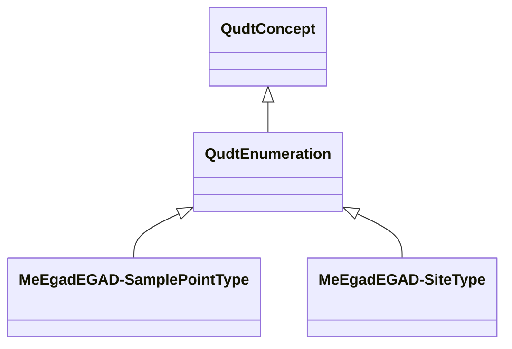

# Class: Enumeration (qudt_Enumeration)


_<p>An enumeration is a set of literals from which a single value is selected. Each literal can have a tag as an integer within a standard encoding appropriate to the range of integer values. Consistency of enumeration types will allow them, and the enumerated values, to be referred to unambiguously either through symbolic name or encoding. Enumerated values are also controlled vocabularies and as such need to be standardized. Without this consistency enumeration literals can be stated differently and result in  data conflicts and misinterpretations.</p>
␊
␊<p>The tags are a set of positive whole numbers, not necessarily contiguous and having no numerical significance, each corresponding to the associated literal identifier. An order attribute can also be given on the enumeration elements. An enumeration can itself be a member of an enumeration. This allows enumerations to be enumerated in a selection. Enumerations are also subclasses of <em>Scalar Datatype</em>. This allows them to be used as the reference of a datatype specification.</p>_


URI: [qudt:Enumeration](http://qudt.org/schema/qudt/Enumeration)





## Inheritance
* [QudtConcept](../classes/QudtConcept.md)
    * **QudtEnumeration**
        * [MeEgadEGAD-SamplePointType](../classes/MeEgadEGAD-SamplePointType.md)
        * [MeEgadEGAD-SiteType](../classes/MeEgadEGAD-SiteType.md)


## Slots

| Name | Cardinality and Range | Description | Inheritance | Occurrences |
| ---  | --- | --- | --- | --- |


## LinkML Source

<!-- TODO: investigate https://stackoverflow.com/questions/37606292/how-to-create-tabbed-code-blocks-in-mkdocs-or-sphinx -->

### Direct

<details>

```yaml
name: qudt_Enumeration
conforms_to: No schema conformance document specified
description: "<p>An enumeration is a set of literals from which a single value is\
  \ selected. Each literal can have a tag as an integer within a standard encoding\
  \ appropriate to the range of integer values. Consistency of enumeration types will\
  \ allow them, and the enumerated values, to be referred to unambiguously either\
  \ through symbolic name or encoding. Enumerated values are also controlled vocabularies\
  \ and as such need to be standardized. Without this consistency enumeration literals\
  \ can be stated differently and result in  data conflicts and misinterpretations.</p>\r\
  ␊\r␊<p>The tags are a set of positive whole numbers, not necessarily contiguous\
  \ and having no numerical significance, each corresponding to the associated literal\
  \ identifier. An order attribute can also be given on the enumeration elements.\
  \ An enumeration can itself be a member of an enumeration. This allows enumerations\
  \ to be enumerated in a selection. Enumerations are also subclasses of <em>Scalar\
  \ Datatype</em>. This allows them to be used as the reference of a datatype specification.</p>"
title: Enumeration
from_schema: sawgraph-kg
source: http://qudt.org/2.1/schema/qudt
rank: 1000
is_a: qudt_Concept
class_uri: qudt:Enumeration

```
</details>

### Induced

<details>

```yaml
name: qudt_Enumeration
conforms_to: No schema conformance document specified
description: "<p>An enumeration is a set of literals from which a single value is\
  \ selected. Each literal can have a tag as an integer within a standard encoding\
  \ appropriate to the range of integer values. Consistency of enumeration types will\
  \ allow them, and the enumerated values, to be referred to unambiguously either\
  \ through symbolic name or encoding. Enumerated values are also controlled vocabularies\
  \ and as such need to be standardized. Without this consistency enumeration literals\
  \ can be stated differently and result in  data conflicts and misinterpretations.</p>\r\
  ␊\r␊<p>The tags are a set of positive whole numbers, not necessarily contiguous\
  \ and having no numerical significance, each corresponding to the associated literal\
  \ identifier. An order attribute can also be given on the enumeration elements.\
  \ An enumeration can itself be a member of an enumeration. This allows enumerations\
  \ to be enumerated in a selection. Enumerations are also subclasses of <em>Scalar\
  \ Datatype</em>. This allows them to be used as the reference of a datatype specification.</p>"
title: Enumeration
from_schema: sawgraph-kg
source: http://qudt.org/2.1/schema/qudt
rank: 1000
is_a: qudt_Concept
class_uri: qudt:Enumeration

```
</details>