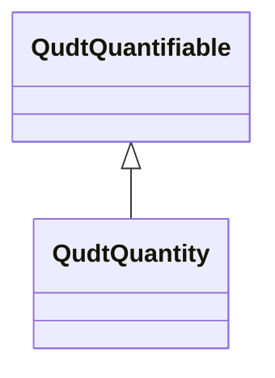

# Class: Quantity (qudt_Quantity)


_<p class="lm-para">A <b>quantity</b> is the measurement of an observable property of a particular object, event, or physical system. 
␊  A quantity is always associated with the context of measurement (i.e. the thing measured, the measured value, the accuracy of measurement, etc.) whereas the 
␊  underlying <b>quantity kind</b> is independent of any particular measurement. Thus, length is a quantity kind while the height of a rocket is a specific 
␊  quantity of length; its magnitude that may be expressed in meters, feet, inches, etc. Examples of physical quantities include physical constants, such as 
␊  the speed of light in a vacuum, Planck's constant, the electric permittivity of free space, and the fine structure constant. </p>
␊<p class="lm-para">In other words, quantities are quantifiable aspects of the world, such as the duration of a movie, the distance between two points, 
␊velocity of a car, the pressure of the atmosphere, and a person's weight; and units are used to describe their numerical measure.</p> 
␊<p class="lm-para">Many <b>quantity kinds</b> are related to each other by various physical laws, and as a result, the associated units of some quantity 
␊kinds can be expressed as products (or ratios) of powers of other quantity kinds (e.g., momentum is mass times velocity and velocity is defined as distance 
␊divided by time). In this way, some quantities can be calculated from other measured quantities using their associations to the quantity kinds in these 
␊expressions. These quantity kind relationships are also discussed in dimensional analysis. Those that cannot be so expressed can be regarded 
␊as "fundamental" in this sense.</p>
␊<p class="lm-para">A quantity is distinguished from a "quantity kind" in that the former carries a value and the latter is a type specifier.</p>_


URI: [qudt:Quantity](http://qudt.org/schema/qudt/Quantity)





## Inheritance
* [QudtQuantifiable](../classes/QudtQuantifiable.md)
    * **QudtQuantity**


## Slots

| Name | Cardinality and Range | Description | Inheritance | Occurrences |
| ---  | --- | --- | --- | --- |


## LinkML Source

<!-- TODO: investigate https://stackoverflow.com/questions/37606292/how-to-create-tabbed-code-blocks-in-mkdocs-or-sphinx -->

### Direct

<details>

```yaml
name: qudt_Quantity
conforms_to: No schema conformance document specified
description: "<p class=\"lm-para\">A <b>quantity</b> is the measurement of an observable\
  \ property of a particular object, event, or physical system. \r␊  A quantity is\
  \ always associated with the context of measurement (i.e. the thing measured, the\
  \ measured value, the accuracy of measurement, etc.) whereas the \r␊  underlying\
  \ <b>quantity kind</b> is independent of any particular measurement. Thus, length\
  \ is a quantity kind while the height of a rocket is a specific \r␊  quantity of\
  \ length; its magnitude that may be expressed in meters, feet, inches, etc. Examples\
  \ of physical quantities include physical constants, such as \r␊  the speed of light\
  \ in a vacuum, Planck's constant, the electric permittivity of free space, and the\
  \ fine structure constant. </p>\r␊<p class=\"lm-para\">In other words, quantities\
  \ are quantifiable aspects of the world, such as the duration of a movie, the distance\
  \ between two points, \r␊velocity of a car, the pressure of the atmosphere, and\
  \ a person's weight; and units are used to describe their numerical measure.</p>\
  \ \r␊<p class=\"lm-para\">Many <b>quantity kinds</b> are related to each other by\
  \ various physical laws, and as a result, the associated units of some quantity\
  \ \r␊kinds can be expressed as products (or ratios) of powers of other quantity\
  \ kinds (e.g., momentum is mass times velocity and velocity is defined as distance\
  \ \r␊divided by time). In this way, some quantities can be calculated from other\
  \ measured quantities using their associations to the quantity kinds in these \r\
  ␊expressions. These quantity kind relationships are also discussed in dimensional\
  \ analysis. Those that cannot be so expressed can be regarded \r␊as \"fundamental\"\
  \ in this sense.</p>\r␊<p class=\"lm-para\">A quantity is distinguished from a \"\
  quantity kind\" in that the former carries a value and the latter is a type specifier.</p>"
title: Quantity
from_schema: sawgraph-kg
source: http://qudt.org/2.1/schema/qudt
rank: 1000
is_a: qudt_Quantifiable
class_uri: qudt:Quantity

```
</details>

### Induced

<details>

```yaml
name: qudt_Quantity
conforms_to: No schema conformance document specified
description: "<p class=\"lm-para\">A <b>quantity</b> is the measurement of an observable\
  \ property of a particular object, event, or physical system. \r␊  A quantity is\
  \ always associated with the context of measurement (i.e. the thing measured, the\
  \ measured value, the accuracy of measurement, etc.) whereas the \r␊  underlying\
  \ <b>quantity kind</b> is independent of any particular measurement. Thus, length\
  \ is a quantity kind while the height of a rocket is a specific \r␊  quantity of\
  \ length; its magnitude that may be expressed in meters, feet, inches, etc. Examples\
  \ of physical quantities include physical constants, such as \r␊  the speed of light\
  \ in a vacuum, Planck's constant, the electric permittivity of free space, and the\
  \ fine structure constant. </p>\r␊<p class=\"lm-para\">In other words, quantities\
  \ are quantifiable aspects of the world, such as the duration of a movie, the distance\
  \ between two points, \r␊velocity of a car, the pressure of the atmosphere, and\
  \ a person's weight; and units are used to describe their numerical measure.</p>\
  \ \r␊<p class=\"lm-para\">Many <b>quantity kinds</b> are related to each other by\
  \ various physical laws, and as a result, the associated units of some quantity\
  \ \r␊kinds can be expressed as products (or ratios) of powers of other quantity\
  \ kinds (e.g., momentum is mass times velocity and velocity is defined as distance\
  \ \r␊divided by time). In this way, some quantities can be calculated from other\
  \ measured quantities using their associations to the quantity kinds in these \r\
  ␊expressions. These quantity kind relationships are also discussed in dimensional\
  \ analysis. Those that cannot be so expressed can be regarded \r␊as \"fundamental\"\
  \ in this sense.</p>\r␊<p class=\"lm-para\">A quantity is distinguished from a \"\
  quantity kind\" in that the former carries a value and the latter is a type specifier.</p>"
title: Quantity
from_schema: sawgraph-kg
source: http://qudt.org/2.1/schema/qudt
rank: 1000
is_a: qudt_Quantifiable
class_uri: qudt:Quantity

```
</details>