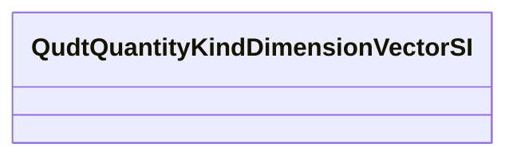

# Class: No class (entity type) name specified (qudt_QuantityKindDimensionVector_SI)


_No class (type) description specified_


URI: [qudt:QuantityKindDimensionVector_SI](http://qudt.org/schema/qudt/QuantityKindDimensionVector_SI)





<!-- no inheritance hierarchy -->


## Slots

| Name | Cardinality and Range | Description | Inheritance | Occurrences |
| ---  | --- | --- | --- | --- |


## LinkML Source

<!-- TODO: investigate https://stackoverflow.com/questions/37606292/how-to-create-tabbed-code-blocks-in-mkdocs-or-sphinx -->

### Direct

<details>

```yaml
name: qudt_QuantityKindDimensionVector_SI
conforms_to: No schema conformance document specified
description: No class (type) description specified
title: No class (entity type) name specified
from_schema: sawgraph-kg
rank: 1000
class_uri: qudt:QuantityKindDimensionVector_SI

```
</details>

### Induced

<details>

```yaml
name: qudt_QuantityKindDimensionVector_SI
conforms_to: No schema conformance document specified
description: No class (type) description specified
title: No class (entity type) name specified
from_schema: sawgraph-kg
rank: 1000
class_uri: qudt:QuantityKindDimensionVector_SI

```
</details>