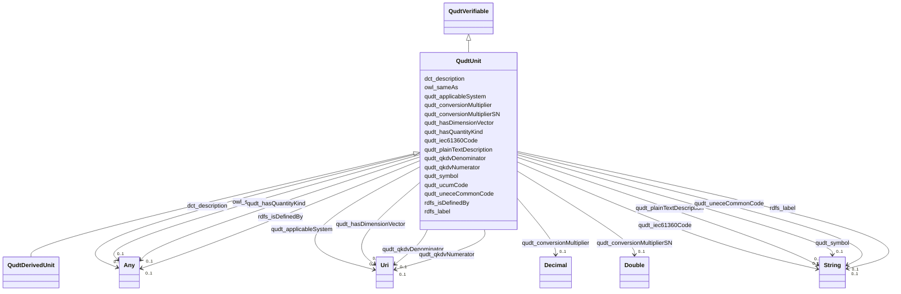

# Class: Unit (qudt_Unit)


_A unit of measure, or unit, is a particular quantity value that has been chosen as a scale for measuring other quantities the same kind (more generally of equivalent dimension). For example, the meter is a quantity of length that has been rigorously defined and standardized by the BIPM (International Board of Weights and Measures). Any measurement of the length can be expressed as a number multiplied by the unit meter. More formally, the value of a physical quantity Q with respect to a unit (U) is expressed as the scalar multiple of a real number (n) and U, as  $Q = nU$._


This class occurs 8 times.


URI: [qudt:Unit](http://qudt.org/schema/qudt/Unit)





## Inheritance
* [QudtVerifiable](../classes/QudtVerifiable.md)
    * **QudtUnit**
        * [QudtDerivedUnit](../classes/QudtDerivedUnit.md)


## Slots

| Name | Cardinality and Range | Description | Inheritance | Occurrences |
| ---  | --- | --- | --- | --- |
| [qudt_ucumCode](../slots/qudt_ucumCode.md) | 0..1 <br/> [QudtUCUMcs](../types/QudtUCUMcs.md) | No slot (predicate) description specified <br/>  | direct | 11 |
| [qudt_qkdvDenominator](../slots/qudt_qkdvDenominator.md) | 0..1 <br/> [xsd:anyURI](http://www.w3.org/2001/XMLSchema#anyURI) | No slot (predicate) description specified <br/>  | direct | 1 |
| [qudt_hasDimensionVector](../slots/qudt_hasDimensionVector.md) | 0..1 <br/> [xsd:anyURI](http://www.w3.org/2001/XMLSchema#anyURI) | No slot (predicate) description specified <br/>  | direct | 5 |
| [qudt_uneceCommonCode](../slots/qudt_uneceCommonCode.md) | 0..1 <br/> [xsd:string](http://www.w3.org/2001/XMLSchema#string) | No slot (predicate) description specified <br/>  | direct | 3 |
| [qudt_conversionMultiplier](../slots/qudt_conversionMultiplier.md) | 0..1 <br/> [xsd:decimal](http://www.w3.org/2001/XMLSchema#decimal) | No slot (predicate) description specified <br/>  | direct | 5 |
| [qudt_hasQuantityKind](../slots/qudt_hasQuantityKind.md) | 0..1 <br/> [OwlNamedIndividual](../classes/OwlNamedIndividual.md)&nbsp;or&nbsp;<br />[QudtQuantityKind](../classes/QudtQuantityKind.md)&nbsp;or&nbsp;<br />[xsd:anyURI](http://www.w3.org/2001/XMLSchema#anyURI)&nbsp;or&nbsp;<br />[CosoContaminantConcentrationQuantityKind](../classes/CosoContaminantConcentrationQuantityKind.md) | No slot (predicate) description specified <br/>  | direct | 13 |
| [rdfs_label](../slots/rdfs_label.md) | 0..1 <br/> [xsd:string](http://www.w3.org/2001/XMLSchema#string) | No slot (predicate) description specified <br/>  | direct | 14 |
| [dct_description](../slots/dct_description.md) | 0..1 <br/> [RdfHTML](../types/RdfHTML.md)&nbsp;or&nbsp;<br />[xsd:string](http://www.w3.org/2001/XMLSchema#string) | No slot (predicate) description specified <br/>  | direct | 4 |
| [qudt_qkdvNumerator](../slots/qudt_qkdvNumerator.md) | 0..1 <br/> [xsd:anyURI](http://www.w3.org/2001/XMLSchema#anyURI) | No slot (predicate) description specified <br/>  | direct | 1 |
| [qudt_conversionMultiplierSN](../slots/qudt_conversionMultiplierSN.md) | 0..1 <br/> [xsd:double](http://www.w3.org/2001/XMLSchema#double) | No slot (predicate) description specified <br/>  | direct | 5 |
| [rdfs_isDefinedBy](../slots/rdfs_isDefinedBy.md) | 0..1 <br/> [OwlOntology](../classes/OwlOntology.md)&nbsp;or&nbsp;<br />[xsd:anyURI](http://www.w3.org/2001/XMLSchema#anyURI) | No slot (predicate) description specified <br/>  | direct | 6 |
| [qudt_applicableSystem](../slots/qudt_applicableSystem.md) | 0..1 <br/> [xsd:anyURI](http://www.w3.org/2001/XMLSchema#anyURI) | No slot (predicate) description specified <br/>  | direct | 20 |
| [qudt_plainTextDescription](../slots/qudt_plainTextDescription.md) | 0..1 <br/> [xsd:string](http://www.w3.org/2001/XMLSchema#string) | No slot (predicate) description specified <br/>  | direct | 3 |
| [owl_sameAs](../slots/owl_sameAs.md) | 0..1 <br/> [QudtUnit](../classes/QudtUnit.md)&nbsp;or&nbsp;<br />[xsd:anyURI](http://www.w3.org/2001/XMLSchema#anyURI) | No slot (predicate) description specified <br/>  | direct | 1 |
| [qudt_symbol](../slots/qudt_symbol.md) | 0..1 <br/> [xsd:string](http://www.w3.org/2001/XMLSchema#string) | No slot (predicate) description specified <br/>  | direct | 6 |
| [qudt_iec61360Code](../slots/qudt_iec61360Code.md) | 0..1 <br/> [xsd:string](http://www.w3.org/2001/XMLSchema#string) | No slot (predicate) description specified <br/>  | direct | 3 |


## Usages

| used by | used in | type | used |
| ---  | --- | --- | --- |
| [QudtDerivedUnit](../classes/QudtDerivedUnit.md) | [owl_sameAs](../slots/owl_sameAs.md) | any_of[range] | [QudtUnit](../classes/QudtUnit.md) |
| [QudtUnit](../classes/QudtUnit.md) | [owl_sameAs](../slots/owl_sameAs.md) | any_of[range] | [QudtUnit](../classes/QudtUnit.md) |
| [CosoDetectQuantityValue](../classes/CosoDetectQuantityValue.md) | [qudt_hasUnit](../slots/qudt_hasUnit.md) | range | [QudtUnit](../classes/QudtUnit.md) |
| [CosoNonDetectQuantityValue](../classes/CosoNonDetectQuantityValue.md) | [qudt_hasUnit](../slots/qudt_hasUnit.md) | range | [QudtUnit](../classes/QudtUnit.md) |
| [MeEgadEGAD-PFAS-Site](../classes/MeEgadEGAD-PFAS-Site.md) | [owl_sameAs](../slots/owl_sameAs.md) | any_of[range] | [QudtUnit](../classes/QudtUnit.md) |
| [MeEgadEGAD-Site](../classes/MeEgadEGAD-Site.md) | [owl_sameAs](../slots/owl_sameAs.md) | any_of[range] | [QudtUnit](../classes/QudtUnit.md) |


## LinkML Source

<!-- TODO: investigate https://stackoverflow.com/questions/37606292/how-to-create-tabbed-code-blocks-in-mkdocs-or-sphinx -->

### Direct

<details>

```yaml
name: qudt_Unit
conforms_to: No schema conformance document specified
annotations:
  count:
    tag: count
    value: 8
description: A unit of measure, or unit, is a particular quantity value that has been
  chosen as a scale for measuring other quantities the same kind (more generally of
  equivalent dimension). For example, the meter is a quantity of length that has been
  rigorously defined and standardized by the BIPM (International Board of Weights
  and Measures). Any measurement of the length can be expressed as a number multiplied
  by the unit meter. More formally, the value of a physical quantity Q with respect
  to a unit (U) is expressed as the scalar multiple of a real number (n) and U, as  $Q
  = nU$.
title: Unit
from_schema: sawgraph-kg
source: http://qudt.org/2.1/schema/qudt
rank: 1000
is_a: qudt_Verifiable
slots:
- qudt_ucumCode
- qudt_qkdvDenominator
- qudt_hasDimensionVector
- qudt_uneceCommonCode
- qudt_conversionMultiplier
- qudt_hasQuantityKind
- rdfs_label
- dct_description
- qudt_qkdvNumerator
- qudt_conversionMultiplierSN
- rdfs_isDefinedBy
- qudt_applicableSystem
- qudt_plainTextDescription
- owl_sameAs
- qudt_symbol
- qudt_iec61360Code
slot_usage:
  dct_description:
    name: dct_description
    annotations:
      rdf_HTML:
        tag: rdf_HTML
        value: 4
  owl_sameAs:
    name: owl_sameAs
    annotations:
      qudt_Unit:
        tag: qudt_Unit
        value: 1
  qudt_applicableSystem:
    name: qudt_applicableSystem
    annotations:
      uri:
        tag: uri
        value: 20
  qudt_conversionMultiplier:
    name: qudt_conversionMultiplier
    annotations:
      decimal:
        tag: decimal
        value: 5
  qudt_conversionMultiplierSN:
    name: qudt_conversionMultiplierSN
    annotations:
      double:
        tag: double
        value: 5
  qudt_hasDimensionVector:
    name: qudt_hasDimensionVector
    annotations:
      uri:
        tag: uri
        value: 5
  qudt_hasQuantityKind:
    name: qudt_hasQuantityKind
    annotations:
      uri:
        tag: uri
        value: 13
  qudt_iec61360Code:
    name: qudt_iec61360Code
    annotations:
      string:
        tag: string
        value: 3
  qudt_plainTextDescription:
    name: qudt_plainTextDescription
    annotations:
      string:
        tag: string
        value: 3
  qudt_qkdvDenominator:
    name: qudt_qkdvDenominator
    annotations:
      uri:
        tag: uri
        value: 1
  qudt_qkdvNumerator:
    name: qudt_qkdvNumerator
    annotations:
      uri:
        tag: uri
        value: 1
  qudt_symbol:
    name: qudt_symbol
    annotations:
      string:
        tag: string
        value: 6
  qudt_ucumCode:
    name: qudt_ucumCode
    annotations:
      qudt_UCUMcs:
        tag: qudt_UCUMcs
        value: 11
  qudt_uneceCommonCode:
    name: qudt_uneceCommonCode
    annotations:
      string:
        tag: string
        value: 3
  rdfs_isDefinedBy:
    name: rdfs_isDefinedBy
    annotations:
      owl_Ontology:
        tag: owl_Ontology
        value: 2
      uri:
        tag: uri
        value: 4
  rdfs_label:
    name: rdfs_label
    annotations:
      string:
        tag: string
        value: 14
class_uri: qudt:Unit

```
</details>

### Induced

<details>

```yaml
name: qudt_Unit
conforms_to: No schema conformance document specified
annotations:
  count:
    tag: count
    value: 8
description: A unit of measure, or unit, is a particular quantity value that has been
  chosen as a scale for measuring other quantities the same kind (more generally of
  equivalent dimension). For example, the meter is a quantity of length that has been
  rigorously defined and standardized by the BIPM (International Board of Weights
  and Measures). Any measurement of the length can be expressed as a number multiplied
  by the unit meter. More formally, the value of a physical quantity Q with respect
  to a unit (U) is expressed as the scalar multiple of a real number (n) and U, as  $Q
  = nU$.
title: Unit
from_schema: sawgraph-kg
source: http://qudt.org/2.1/schema/qudt
rank: 1000
is_a: qudt_Verifiable
slot_usage:
  dct_description:
    name: dct_description
    annotations:
      rdf_HTML:
        tag: rdf_HTML
        value: 4
  owl_sameAs:
    name: owl_sameAs
    annotations:
      qudt_Unit:
        tag: qudt_Unit
        value: 1
  qudt_applicableSystem:
    name: qudt_applicableSystem
    annotations:
      uri:
        tag: uri
        value: 20
  qudt_conversionMultiplier:
    name: qudt_conversionMultiplier
    annotations:
      decimal:
        tag: decimal
        value: 5
  qudt_conversionMultiplierSN:
    name: qudt_conversionMultiplierSN
    annotations:
      double:
        tag: double
        value: 5
  qudt_hasDimensionVector:
    name: qudt_hasDimensionVector
    annotations:
      uri:
        tag: uri
        value: 5
  qudt_hasQuantityKind:
    name: qudt_hasQuantityKind
    annotations:
      uri:
        tag: uri
        value: 13
  qudt_iec61360Code:
    name: qudt_iec61360Code
    annotations:
      string:
        tag: string
        value: 3
  qudt_plainTextDescription:
    name: qudt_plainTextDescription
    annotations:
      string:
        tag: string
        value: 3
  qudt_qkdvDenominator:
    name: qudt_qkdvDenominator
    annotations:
      uri:
        tag: uri
        value: 1
  qudt_qkdvNumerator:
    name: qudt_qkdvNumerator
    annotations:
      uri:
        tag: uri
        value: 1
  qudt_symbol:
    name: qudt_symbol
    annotations:
      string:
        tag: string
        value: 6
  qudt_ucumCode:
    name: qudt_ucumCode
    annotations:
      qudt_UCUMcs:
        tag: qudt_UCUMcs
        value: 11
  qudt_uneceCommonCode:
    name: qudt_uneceCommonCode
    annotations:
      string:
        tag: string
        value: 3
  rdfs_isDefinedBy:
    name: rdfs_isDefinedBy
    annotations:
      owl_Ontology:
        tag: owl_Ontology
        value: 2
      uri:
        tag: uri
        value: 4
  rdfs_label:
    name: rdfs_label
    annotations:
      string:
        tag: string
        value: 14
attributes:
  qudt_ucumCode:
    name: qudt_ucumCode
    annotations:
      qudt_UCUMcs:
        tag: qudt_UCUMcs
        value: 11
    description: No slot (predicate) description specified
    examples:
    - object:
        example_object: ug.kg-1
        example_object_type: qudt_UCUMcs
        example_predicate: qudt:ucumCode
        example_subject: http://qudt.org/vocab/unit/MicroGM-PER-KiloGM
        example_subject_type: qudt_Unit
    from_schema: sawgraph-kg
    rank: 1000
    slot_uri: qudt:ucumCode
    alias: qudt_ucumCode
    owner: qudt_Unit
    domain_of:
    - qudt_Unit
    range: qudt_UCUMcs
  qudt_qkdvDenominator:
    name: qudt_qkdvDenominator
    annotations:
      uri:
        tag: uri
        value: 1
    description: No slot (predicate) description specified
    examples:
    - object:
        example_object: http://qudt.org/vocab/dimensionvector/A0E0L0I0M1H0T0D0
        example_object_type: uri
        example_predicate: qudt:qkdvDenominator
        example_subject: http://qudt.org/vocab/unit/MicroGM-PER-KiloGM
        example_subject_type: qudt_Unit
    from_schema: sawgraph-kg
    rank: 1000
    slot_uri: qudt:qkdvDenominator
    alias: qudt_qkdvDenominator
    owner: qudt_Unit
    domain_of:
    - qudt_Unit
    range: uri
  qudt_hasDimensionVector:
    name: qudt_hasDimensionVector
    annotations:
      uri:
        tag: uri
        value: 5
    description: No slot (predicate) description specified
    examples:
    - object:
        example_object: http://qudt.org/vocab/dimensionvector/A0E0L0I0M0H0T0D1
        example_object_type: uri
        example_predicate: qudt:hasDimensionVector
        example_subject: http://qudt.org/vocab/unit/MicroGM-PER-KiloGM
        example_subject_type: qudt_Unit
    from_schema: sawgraph-kg
    rank: 1000
    slot_uri: qudt:hasDimensionVector
    alias: qudt_hasDimensionVector
    owner: qudt_Unit
    domain_of:
    - qudt_Unit
    range: uri
  qudt_uneceCommonCode:
    name: qudt_uneceCommonCode
    annotations:
      string:
        tag: string
        value: 3
    description: No slot (predicate) description specified
    examples:
    - object:
        example_object: J33
        example_object_type: string
        example_predicate: qudt:uneceCommonCode
        example_subject: http://qudt.org/vocab/unit/MicroGM-PER-KiloGM
        example_subject_type: qudt_Unit
    from_schema: sawgraph-kg
    rank: 1000
    slot_uri: qudt:uneceCommonCode
    alias: qudt_uneceCommonCode
    owner: qudt_Unit
    domain_of:
    - qudt_Unit
    range: string
  qudt_conversionMultiplier:
    name: qudt_conversionMultiplier
    annotations:
      decimal:
        tag: decimal
        value: 5
    description: No slot (predicate) description specified
    examples:
    - object:
        example_object: '0.000000001'
        example_object_type: decimal
        example_predicate: qudt:conversionMultiplier
        example_subject: http://qudt.org/vocab/unit/MicroGM-PER-KiloGM
        example_subject_type: qudt_Unit
    from_schema: sawgraph-kg
    rank: 1000
    slot_uri: qudt:conversionMultiplier
    alias: qudt_conversionMultiplier
    owner: qudt_Unit
    domain_of:
    - qudt_Unit
    range: decimal
  qudt_hasQuantityKind:
    name: qudt_hasQuantityKind
    annotations:
      uri:
        tag: uri
        value: 13
    description: No slot (predicate) description specified
    title: has quantity kind
    examples:
    - object:
        example_object: http://qudt.org/vocab/quantitykind/MassRatio
        example_object_type: uri
        example_predicate: qudt:hasQuantityKind
        example_subject: http://qudt.org/vocab/unit/MicroGM-PER-KiloGM
        example_subject_type: qudt_Unit
    - object:
        example_object: coso:SingleContaminantConcentrationQuantityKind
        example_object_type: owl_NamedIndividual
        example_predicate: qudt:hasQuantityKind
        example_subject: me_egad_data:result.101365P.NA.20130507.1763231
        example_subject_type: me_egad_EGAD-SinglePFAS-Concentration
    - object:
        example_object: coso:SingleContaminantConcentrationQuantityKind
        example_object_type: coso_ContaminantConcentrationQuantityKind
        example_predicate: qudt:hasQuantityKind
        example_subject: me_egad_data:result.101365P.NA.20130507.1763231
        example_subject_type: me_egad_EGAD-SinglePFAS-Concentration
    - object:
        example_object: coso:AggregateContaminantConcentrationQuantityKind
        example_object_type: uri
        example_predicate: qudt:hasQuantityKind
        example_subject: me_egad_data:result.101365P.NA.20130507.DEP18010
        example_subject_type: me_egad_EGAD-AggregatePFAS-Concentration
    from_schema: sawgraph-kg
    source: http://qudt.org/2.1/schema/qudt
    rank: 1000
    slot_uri: qudt:hasQuantityKind
    alias: qudt_hasQuantityKind
    owner: qudt_Unit
    domain_of:
    - qudt_Unit
    - me_egad_EGAD-AggregatePFAS-Concentration
    - me_egad_EGAD-SinglePFAS-Concentration
    range: Any
    any_of:
    - range: owl_NamedIndividual
    - range: qudt_QuantityKind
    - range: uri
    - range: coso_ContaminantConcentrationQuantityKind
  rdfs_label:
    name: rdfs_label
    annotations:
      string:
        tag: string
        value: 14
    description: No slot (predicate) description specified
    examples:
    - object:
        example_object: Microgram per Kilogram
        example_object_type: string
        example_predicate: rdfs:label
        example_subject: http://qudt.org/vocab/unit/MicroGM-PER-KiloGM
        example_subject_type: qudt_Unit
    - object:
        example_object: AB
        example_object_type: string
        example_predicate: rdfs:label
        example_subject: me_egad_data:AB
        example_subject_type: prov_Agent
    - object:
        example_object: COMPOUND IS FOUND IN THE ASSOCIATED METHOD BLANK (ORGANIC)
          OR THE REPORTED VALUE WAS LESS THAN THE REPORTING LIMIT BUT GREATER THAN
          OR EQUAL TO THE IDL. (INORGANIC)
        example_object_type: string
        example_predicate: rdfs:label
        example_subject: me_egad_data:concentrationQualifier.B
        example_subject_type: owl_NamedIndividual
    - object:
        example_object: ALPHA ANALYTICAL LAB - WESTBOROUGH, MA
        example_object_type: string
        example_predicate: rdfs:label
        example_subject: me_egad_data:organization.lab.AA
        example_subject_type: prov_Organization
    - object:
        example_object: EGAD PFAS measurements for sample EP001
        example_object_type: string
        example_predicate: rdfs:label
        example_subject: me_egad_data:result.101365P.NA.20130507.1763231
        example_subject_type: me_egad_EGAD-SinglePFAS-Concentration
    - object:
        example_object: EGAD PFAS measurements for sample EP001
        example_object_type: string
        example_predicate: rdfs:label
        example_subject: me_egad_data:result.101365P.NA.20130507.DEP18010
        example_subject_type: me_egad_EGAD-AggregatePFAS-Concentration
    - object:
        example_object: EGAD sample BETH WILLIAMS ACF
        example_object_type: string
        example_predicate: rdfs:label
        example_subject: me_egad_data:sample.AAL210144001R.20210112
        example_subject_type: me_egad_EGAD-Sample
    - object:
        example_object: EGAD sample point 100410
        example_object_type: string
        example_predicate: rdfs:label
        example_subject: me_egad_data:samplePoint.100410
        example_subject_type: me_egad_EGAD-SamplePoint
    - object:
        example_object: EGAD sampled feature associated with sample point 100410
        example_object_type: string
        example_predicate: rdfs:label
        example_subject: me_egad_data:sampledFeature.100410
        example_subject_type: me_egad_EGAD-SampledFeature
    - object:
        example_object: MAINE ARMY NATIONAL GUARD - BANGOR RANGE
        example_object_type: string
        example_predicate: rdfs:label
        example_subject: me_egad_data:site.100843
        example_subject_type: me_egad_EGAD-Site
    - object:
        example_object: FARMINGTON VILLAGE CORPORATION
        example_object_type: string
        example_predicate: rdfs:label
        example_subject: me_egad_data:site.131980
        example_subject_type: me_egad_EGAD-PFAS-Site
    - object:
        example_object: Single Contamiant Concentration Quantity
        example_object_type: string
        example_predicate: rdfs:label
        example_subject: coso:SingleContaminantConcentrationQuantityKind
        example_subject_type: coso_ContaminantConcentrationQuantityKind
    - object:
        example_object: Non-Detect
        example_object_type: string
        example_predicate: rdfs:label
        example_subject: coso:non-detect
        example_subject_type: qudt_EnumeratedValue
    - object:
        example_object: Enumerated Quantity
        example_object_type: string
        example_predicate: rdfs:label
        example_subject: qudt:EnumeratedQuantity
        example_subject_type: None
    - object:
        example_object: EGAD PFAS observation for sample BETH WILLIAMS ACF
        example_object_type: string
        example_predicate: rdfs:label
        example_subject: me_egad_data:observation.AAL210144001R.20210112.1763231
        example_subject_type: me_egad_EGAD-PFAS-Observation
    from_schema: sawgraph-kg
    rank: 1000
    slot_uri: rdfs:label
    alias: rdfs_label
    owner: qudt_Unit
    domain_of:
    - owl_NamedIndividual
    - owl_OntologyProperty
    - qudt_AspectClass
    - qudt_BitEncodingType
    - qudt_BooleanEncodingType
    - qudt_ByteEncodingType
    - qudt_CardinalityType
    - qudt_CharEncodingType
    - qudt_DateTimeStringEncodingType
    - qudt_EndianType
    - qudt_EnumeratedValue
    - qudt_FloatingPointEncodingType
    - qudt_IntegerEncodingType
    - qudt_OrderedType
    - qudt_SignednessType
    - qudt_Unit
    - vaem_#CatalogEntry
    - vaem_#GraphMetaData
    - vaem_#Party
    - coso_ContaminantConcentrationQuantityKind
    - coso_ContaminantVolumeQuantityKind
    - coso_Substance
    - coso_SubstanceCollection
    - me_egad_EGAD-AggregatePFAS-Concentration
    - me_egad_EGAD-AnalysisMethod
    - me_egad_EGAD-ConcentrationQualifier
    - me_egad_EGAD-PFAS-Observation
    - me_egad_EGAD-PFAS-ParameterName
    - me_egad_EGAD-PFAS-Site
    - me_egad_EGAD-ResultType
    - me_egad_EGAD-Sample
    - me_egad_EGAD-SampleCollectionMethod
    - me_egad_EGAD-SampleDetailedLocation
    - me_egad_EGAD-SampleMaterialType
    - me_egad_EGAD-SampleMaterialTypeQualifier
    - me_egad_EGAD-SamplePoint
    - me_egad_EGAD-SamplePointType
    - me_egad_EGAD-SampleTreatmentStatus
    - me_egad_EGAD-SampledFeature
    - me_egad_EGAD-SinglePFAS-Concentration
    - me_egad_EGAD-Site
    - me_egad_EGAD-SiteType
    - me_egad_EGAD-ValidationLevel
    - prov_Agent
    - prov_Organization
    range: string
  dct_description:
    name: dct_description
    annotations:
      rdf_HTML:
        tag: rdf_HTML
        value: 4
    description: No slot (predicate) description specified
    title: No slot (predicate) name specified
    examples:
    - object:
        example_object: mass ratio as 0.000000001-fold of the SI base unit kilogram
          divided by the SI base unit kilogram
        example_object_type: rdf_HTML
        example_predicate: dct:description
        example_subject: http://qudt.org/vocab/unit/MicroGM-PER-KiloGM
        example_subject_type: qudt_Unit
    - object:
        example_object: Non-Detect Value
        example_object_type: string
        example_predicate: dct:description
        example_subject: coso:non-detect
        example_subject_type: qudt_EnumeratedValue
    from_schema: sawgraph-kg
    rank: 1000
    slot_uri: dct:description
    alias: dct_description
    owner: qudt_Unit
    domain_of:
    - qudt_CardinalityType
    - qudt_EnumeratedValue
    - qudt_Unit
    - vaem_#GraphMetaData
    - vaem_#Party
    range: Any
    any_of:
    - range: rdf_HTML
    - range: string
  qudt_qkdvNumerator:
    name: qudt_qkdvNumerator
    annotations:
      uri:
        tag: uri
        value: 1
    description: No slot (predicate) description specified
    examples:
    - object:
        example_object: http://qudt.org/vocab/dimensionvector/A0E0L0I0M1H0T0D0
        example_object_type: uri
        example_predicate: qudt:qkdvNumerator
        example_subject: http://qudt.org/vocab/unit/MicroGM-PER-KiloGM
        example_subject_type: qudt_Unit
    from_schema: sawgraph-kg
    rank: 1000
    slot_uri: qudt:qkdvNumerator
    alias: qudt_qkdvNumerator
    owner: qudt_Unit
    domain_of:
    - qudt_Unit
    range: uri
  qudt_conversionMultiplierSN:
    name: qudt_conversionMultiplierSN
    annotations:
      double:
        tag: double
        value: 5
    description: No slot (predicate) description specified
    examples:
    - object:
        example_object: 1e-09
        example_object_type: double
        example_predicate: qudt:conversionMultiplierSN
        example_subject: http://qudt.org/vocab/unit/MicroGM-PER-KiloGM
        example_subject_type: qudt_Unit
    from_schema: sawgraph-kg
    rank: 1000
    slot_uri: qudt:conversionMultiplierSN
    alias: qudt_conversionMultiplierSN
    owner: qudt_Unit
    domain_of:
    - qudt_Unit
    range: double
  rdfs_isDefinedBy:
    name: rdfs_isDefinedBy
    annotations:
      owl_Ontology:
        tag: owl_Ontology
        value: 2
      uri:
        tag: uri
        value: 4
    description: No slot (predicate) description specified
    examples:
    - object:
        example_object: http://qudt.org/vocab/unit
        example_object_type: uri
        example_predicate: rdfs:isDefinedBy
        example_subject: http://qudt.org/vocab/unit/MicroGM-PER-KiloGM
        example_subject_type: qudt_Unit
    - object:
        example_object: http://qudt.org/2.1/vocab/unit
        example_object_type: owl_Ontology
        example_predicate: rdfs:isDefinedBy
        example_subject: http://qudt.org/vocab/unit/NanoGM-PER-L
        example_subject_type: qudt_Unit
    from_schema: sawgraph-kg
    rank: 1000
    slot_uri: rdfs:isDefinedBy
    alias: rdfs_isDefinedBy
    owner: qudt_Unit
    domain_of:
    - owl_OntologyProperty
    - qudt_AspectClass
    - qudt_BitEncodingType
    - qudt_BooleanEncodingType
    - qudt_ByteEncodingType
    - qudt_CardinalityType
    - qudt_CharEncodingType
    - qudt_DateTimeStringEncodingType
    - qudt_EndianType
    - qudt_FloatingPointEncodingType
    - qudt_IntegerEncodingType
    - qudt_OrderedType
    - qudt_SignednessType
    - qudt_Unit
    - vaem_#CatalogEntry
    - vaem_#GraphMetaData
    - vaem_#Party
    range: Any
    any_of:
    - range: owl_Ontology
    - range: uri
  qudt_applicableSystem:
    name: qudt_applicableSystem
    annotations:
      uri:
        tag: uri
        value: 20
    description: No slot (predicate) description specified
    examples:
    - object:
        example_object: http://qudt.org/vocab/sou/CGS
        example_object_type: uri
        example_predicate: qudt:applicableSystem
        example_subject: http://qudt.org/vocab/unit/MicroGM-PER-KiloGM
        example_subject_type: qudt_Unit
    from_schema: sawgraph-kg
    rank: 1000
    slot_uri: qudt:applicableSystem
    alias: qudt_applicableSystem
    owner: qudt_Unit
    domain_of:
    - qudt_Unit
    range: uri
  qudt_plainTextDescription:
    name: qudt_plainTextDescription
    annotations:
      string:
        tag: string
        value: 3
    description: No slot (predicate) description specified
    examples:
    - object:
        example_object: mass ratio as 0.000000001-fold of the SI base unit kilogram
          divided by the SI base unit kilogram
        example_object_type: string
        example_predicate: qudt:plainTextDescription
        example_subject: http://qudt.org/vocab/unit/MicroGM-PER-KiloGM
        example_subject_type: qudt_Unit
    from_schema: sawgraph-kg
    rank: 1000
    slot_uri: qudt:plainTextDescription
    alias: qudt_plainTextDescription
    owner: qudt_Unit
    domain_of:
    - qudt_OrderedType
    - qudt_Unit
    range: string
  owl_sameAs:
    name: owl_sameAs
    annotations:
      qudt_Unit:
        tag: qudt_Unit
        value: 1
    description: No slot (predicate) description specified
    examples:
    - object:
        example_object: http://qudt.org/vocab/unit/PERCENT
        example_object_type: qudt_Unit
        example_predicate: owl:sameAs
        example_subject: http://qudt.org/vocab/unit/PERCENT
        example_subject_type: qudt_Unit
    - object:
        example_object: http://geoconnex.us/ref/pws/ME0002893
        example_object_type: uri
        example_predicate: owl:sameAs
        example_subject: me_egad_data:site.124837
        example_subject_type: me_egad_EGAD-Site
    - object:
        example_object: http://geoconnex.us/ref/pws/ME0090540
        example_object_type: uri
        example_predicate: owl:sameAs
        example_subject: me_egad_data:site.131980
        example_subject_type: me_egad_EGAD-PFAS-Site
    from_schema: sawgraph-kg
    rank: 1000
    slot_uri: owl:sameAs
    alias: owl_sameAs
    owner: qudt_Unit
    domain_of:
    - qudt_Unit
    - me_egad_EGAD-PFAS-Site
    - me_egad_EGAD-Site
    range: Any
    any_of:
    - range: qudt_Unit
    - range: uri
  qudt_symbol:
    name: qudt_symbol
    annotations:
      string:
        tag: string
        value: 6
    description: No slot (predicate) description specified
    examples:
    - object:
        example_object: μg/kg
        example_object_type: string
        example_predicate: qudt:symbol
        example_subject: http://qudt.org/vocab/unit/MicroGM-PER-KiloGM
        example_subject_type: qudt_Unit
    from_schema: sawgraph-kg
    rank: 1000
    slot_uri: qudt:symbol
    alias: qudt_symbol
    owner: qudt_Unit
    domain_of:
    - qudt_Unit
    range: string
  qudt_iec61360Code:
    name: qudt_iec61360Code
    annotations:
      string:
        tag: string
        value: 3
    description: No slot (predicate) description specified
    examples:
    - object:
        example_object: 0112/2///62720#UAA083
        example_object_type: string
        example_predicate: qudt:iec61360Code
        example_subject: http://qudt.org/vocab/unit/MicroGM-PER-KiloGM
        example_subject_type: qudt_Unit
    from_schema: sawgraph-kg
    rank: 1000
    slot_uri: qudt:iec61360Code
    alias: qudt_iec61360Code
    owner: qudt_Unit
    domain_of:
    - qudt_Unit
    range: string
class_uri: qudt:Unit

```
</details>