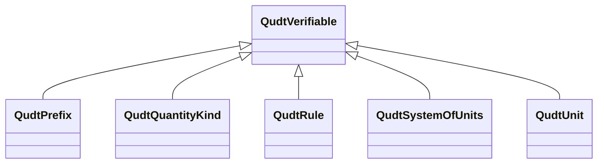

# Class: No class (entity type) name specified -- this class is noted as a superclass of another class in this graph but has not itself been defined. (qudt_Verifiable)


This class occurs 1 times.


URI: [qudt:Verifiable](http://qudt.org/schema/qudt/Verifiable)





## Inheritance
* **QudtVerifiable**
    * [QudtPrefix](../classes/QudtPrefix.md)
    * [QudtQuantityKind](../classes/QudtQuantityKind.md)
    * [QudtRule](../classes/QudtRule.md)
    * [QudtSystemOfUnits](../classes/QudtSystemOfUnits.md)
    * [QudtUnit](../classes/QudtUnit.md)


## Slots

| Name | Cardinality and Range | Description | Inheritance | Occurrences |
| ---  | --- | --- | --- | --- |


## Usages

| used by | used in | type | used |
| ---  | --- | --- | --- |
| [HttpW3id.orgSawgraphV1Me-egad#EGAD-AggregatePFAS-Concentration](../classes/HttpW3id.orgSawgraphV1Me-egad#EGAD-AggregatePFAS-Concentration.md) | [coso_measurementValue](../slots/coso_measurementValue.md) | any_of[range] | [QudtVerifiable](../classes/QudtVerifiable.md) |
| [HttpW3id.orgSawgraphV1Me-egad#EGAD-SinglePFAS-Concentration](../classes/HttpW3id.orgSawgraphV1Me-egad#EGAD-SinglePFAS-Concentration.md) | [coso_measurementValue](../slots/coso_measurementValue.md) | any_of[range] | [QudtVerifiable](../classes/QudtVerifiable.md) |
| [MeEgadEGAD-AggregatePFAS-Concentration](../classes/MeEgadEGAD-AggregatePFAS-Concentration.md) | [coso_measurementValue](../slots/coso_measurementValue.md) | any_of[range] | [QudtVerifiable](../classes/QudtVerifiable.md) |
| [MeEgadEGAD-SinglePFAS-Concentration](../classes/MeEgadEGAD-SinglePFAS-Concentration.md) | [coso_measurementValue](../slots/coso_measurementValue.md) | any_of[range] | [QudtVerifiable](../classes/QudtVerifiable.md) |


## LinkML Source

<!-- TODO: investigate https://stackoverflow.com/questions/37606292/how-to-create-tabbed-code-blocks-in-mkdocs-or-sphinx -->

### Direct

<details>

```yaml
name: qudt_Verifiable
title: No class (entity type) name specified -- this class is noted as a superclass
  of another class in this graph but has not itself been defined.
from_schema: okns:qudt
class_uri: qudt:Verifiable

```
</details>

### Induced

<details>

```yaml
name: qudt_Verifiable
title: No class (entity type) name specified -- this class is noted as a superclass
  of another class in this graph but has not itself been defined.
from_schema: okns:qudt
class_uri: qudt:Verifiable

```
</details>