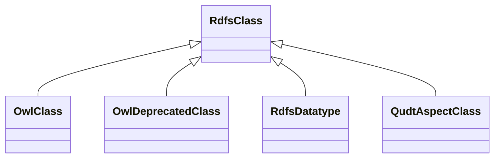

# Class: No class (entity type) name specified (rdfs_Class)


_No class (type) description specified_


URI: [rdfs:Class](http://www.w3.org/2000/01/rdf-schema#Class)





## Inheritance
* **RdfsClass**
    * [OwlClass](../classes/OwlClass.md)
    * [OwlDeprecatedClass](../classes/OwlDeprecatedClass.md)
    * [RdfsDatatype](../classes/RdfsDatatype.md)
    * [QudtAspectClass](../classes/QudtAspectClass.md)


## Slots

| Name | Cardinality and Range | Description | Inheritance | Occurrences |
| ---  | --- | --- | --- | --- |


## Usages

| used by | used in | type | used |
| ---  | --- | --- | --- |
| [OwlRestriction](../classes/OwlRestriction.md) | [owl_allValuesFrom](../slots/owl_allValuesFrom.md) | any_of[range] | [RdfsClass](../classes/RdfsClass.md) |
| [QudtAspectClass](../classes/QudtAspectClass.md) | [rdfs_subClassOf](../slots/rdfs_subClassOf.md) | domain | [RdfsClass](../classes/RdfsClass.md) |
| [QudtAspectClass](../classes/QudtAspectClass.md) | [rdfs_subClassOf](../slots/rdfs_subClassOf.md) | range | [RdfsClass](../classes/RdfsClass.md) |


## LinkML Source

<!-- TODO: investigate https://stackoverflow.com/questions/37606292/how-to-create-tabbed-code-blocks-in-mkdocs-or-sphinx -->

### Direct

<details>

```yaml
name: rdfs_Class
conforms_to: No schema conformance document specified
description: No class (type) description specified
title: No class (entity type) name specified
from_schema: sawgraph-kg
rank: 1000
class_uri: rdfs:Class

```
</details>

### Induced

<details>

```yaml
name: rdfs_Class
conforms_to: No schema conformance document specified
description: No class (type) description specified
title: No class (entity type) name specified
from_schema: sawgraph-kg
rank: 1000
class_uri: rdfs:Class

```
</details>