# Class: No class (entity type) name specified -- this class is noted as a superclass of another class in this graph but has not itself been defined. (rdfs_Literal)


_No class (type) description specified_


URI: [rdfs:Literal](http://www.w3.org/2000/01/rdf-schema#Literal)

```mermaid
 classDiagram
    class RdfsLiteral
    click RdfsLiteral href "../RdfsLiteral"
      RdfsLiteral <|-- OwlRational
        click OwlRational href "../OwlRational"
      RdfsLiteral <|-- OwlReal
        click OwlReal href "../OwlReal"
      RdfsLiteral <|-- RdfPlainLiteral
        click RdfPlainLiteral href "../RdfPlainLiteral"
      RdfsLiteral <|-- RdfXMLLiteral
        click RdfXMLLiteral href "../RdfXMLLiteral"
      RdfsLiteral <|-- XsdNCName
        click XsdNCName href "../XsdNCName"
      RdfsLiteral <|-- XsdNMTOKEN
        click XsdNMTOKEN href "../XsdNMTOKEN"
      RdfsLiteral <|-- XsdName
        click XsdName href "../XsdName"
      RdfsLiteral <|-- XsdAnyURI
        click XsdAnyURI href "../XsdAnyURI"
      RdfsLiteral <|-- XsdBase64Binary
        click XsdBase64Binary href "../XsdBase64Binary"
      RdfsLiteral <|-- XsdBoolean
        click XsdBoolean href "../XsdBoolean"
      RdfsLiteral <|-- XsdByte
        click XsdByte href "../XsdByte"
      RdfsLiteral <|-- XsdDateTime
        click XsdDateTime href "../XsdDateTime"
      RdfsLiteral <|-- XsdDateTimeStamp
        click XsdDateTimeStamp href "../XsdDateTimeStamp"
      RdfsLiteral <|-- XsdDecimal
        click XsdDecimal href "../XsdDecimal"
      RdfsLiteral <|-- XsdDouble
        click XsdDouble href "../XsdDouble"
      RdfsLiteral <|-- XsdFloat
        click XsdFloat href "../XsdFloat"
      RdfsLiteral <|-- XsdHexBinary
        click XsdHexBinary href "../XsdHexBinary"
      RdfsLiteral <|-- XsdInt
        click XsdInt href "../XsdInt"
      RdfsLiteral <|-- XsdInteger
        click XsdInteger href "../XsdInteger"
      RdfsLiteral <|-- XsdLanguage
        click XsdLanguage href "../XsdLanguage"
      RdfsLiteral <|-- XsdLong
        click XsdLong href "../XsdLong"
      RdfsLiteral <|-- XsdNegativeInteger
        click XsdNegativeInteger href "../XsdNegativeInteger"
      RdfsLiteral <|-- XsdNonNegativeInteger
        click XsdNonNegativeInteger href "../XsdNonNegativeInteger"
      RdfsLiteral <|-- XsdNonPositiveInteger
        click XsdNonPositiveInteger href "../XsdNonPositiveInteger"
      RdfsLiteral <|-- XsdNormalizedString
        click XsdNormalizedString href "../XsdNormalizedString"
      RdfsLiteral <|-- XsdPositiveInteger
        click XsdPositiveInteger href "../XsdPositiveInteger"
      RdfsLiteral <|-- XsdShort
        click XsdShort href "../XsdShort"
      RdfsLiteral <|-- XsdString
        click XsdString href "../XsdString"
      RdfsLiteral <|-- XsdToken
        click XsdToken href "../XsdToken"
      RdfsLiteral <|-- XsdUnsignedByte
        click XsdUnsignedByte href "../XsdUnsignedByte"
      RdfsLiteral <|-- XsdUnsignedInt
        click XsdUnsignedInt href "../XsdUnsignedInt"
      RdfsLiteral <|-- XsdUnsignedLong
        click XsdUnsignedLong href "../XsdUnsignedLong"
      RdfsLiteral <|-- XsdUnsignedShort
        click XsdUnsignedShort href "../XsdUnsignedShort"
      
      
```





## Inheritance
* **RdfsLiteral**
    * [OwlRational](../classes/OwlRational.md)
    * [OwlReal](../classes/OwlReal.md)
    * [RdfPlainLiteral](../classes/RdfPlainLiteral.md)
    * [RdfXMLLiteral](../classes/RdfXMLLiteral.md)
    * [XsdNCName](../classes/XsdNCName.md)
    * [XsdNMTOKEN](../classes/XsdNMTOKEN.md)
    * [XsdName](../classes/XsdName.md)
    * [XsdAnyURI](../classes/XsdAnyURI.md)
    * [XsdBase64Binary](../classes/XsdBase64Binary.md)
    * [XsdBoolean](../classes/XsdBoolean.md)
    * [XsdByte](../classes/XsdByte.md)
    * [XsdDateTime](../classes/XsdDateTime.md)
    * [XsdDateTimeStamp](../classes/XsdDateTimeStamp.md)
    * [XsdDecimal](../classes/XsdDecimal.md)
    * [XsdDouble](../classes/XsdDouble.md)
    * [XsdFloat](../classes/XsdFloat.md)
    * [XsdHexBinary](../classes/XsdHexBinary.md)
    * [XsdInt](../classes/XsdInt.md)
    * [XsdInteger](../classes/XsdInteger.md)
    * [XsdLanguage](../classes/XsdLanguage.md)
    * [XsdLong](../classes/XsdLong.md)
    * [XsdNegativeInteger](../classes/XsdNegativeInteger.md)
    * [XsdNonNegativeInteger](../classes/XsdNonNegativeInteger.md)
    * [XsdNonPositiveInteger](../classes/XsdNonPositiveInteger.md)
    * [XsdNormalizedString](../classes/XsdNormalizedString.md)
    * [XsdPositiveInteger](../classes/XsdPositiveInteger.md)
    * [XsdShort](../classes/XsdShort.md)
    * [XsdString](../classes/XsdString.md)
    * [XsdToken](../classes/XsdToken.md)
    * [XsdUnsignedByte](../classes/XsdUnsignedByte.md)
    * [XsdUnsignedInt](../classes/XsdUnsignedInt.md)
    * [XsdUnsignedLong](../classes/XsdUnsignedLong.md)
    * [XsdUnsignedShort](../classes/XsdUnsignedShort.md)


## Slots

| Name | Cardinality and Range | Description | Inheritance | Occurrences |
| ---  | --- | --- | --- | --- |


## Usages

| used by | used in | type | used |
| ---  | --- | --- | --- |
| [OwlNamedIndividual](../classes/OwlNamedIndividual.md) | [rdfs_label](../slots/rdfs_label.md) | any_of[range] | [RdfsLiteral](../classes/RdfsLiteral.md) |
| [OwlNamedIndividual](../classes/OwlNamedIndividual.md) | [qudt_abbreviation](../slots/qudt_abbreviation.md) | any_of[range] | [RdfsLiteral](../classes/RdfsLiteral.md) |
| [OwlNothing](../classes/OwlNothing.md) | [rdfs_label](../slots/rdfs_label.md) | any_of[range] | [RdfsLiteral](../classes/RdfsLiteral.md) |
| [OwlRestriction](../classes/OwlRestriction.md) | [owl_maxCardinality](../slots/owl_maxCardinality.md) | any_of[range] | [RdfsLiteral](../classes/RdfsLiteral.md) |
| [OwlRestriction](../classes/OwlRestriction.md) | [owl_minCardinality](../slots/owl_minCardinality.md) | any_of[range] | [RdfsLiteral](../classes/RdfsLiteral.md) |
| [OwlThing](../classes/OwlThing.md) | [qudt_abbreviation](../slots/qudt_abbreviation.md) | any_of[range] | [RdfsLiteral](../classes/RdfsLiteral.md) |
| [OwlThing](../classes/OwlThing.md) | [rdfs_label](../slots/rdfs_label.md) | any_of[range] | [RdfsLiteral](../classes/RdfsLiteral.md) |
| [QudtAspectClass](../classes/QudtAspectClass.md) | [rdfs_comment](../slots/rdfs_comment.md) | range | [RdfsLiteral](../classes/RdfsLiteral.md) |
| [QudtAspectClass](../classes/QudtAspectClass.md) | [rdfs_label](../slots/rdfs_label.md) | any_of[range] | [RdfsLiteral](../classes/RdfsLiteral.md) |
| [QudtBitEncodingType](../classes/QudtBitEncodingType.md) | [rdfs_label](../slots/rdfs_label.md) | any_of[range] | [RdfsLiteral](../classes/RdfsLiteral.md) |
| [QudtBooleanEncodingType](../classes/QudtBooleanEncodingType.md) | [rdfs_label](../slots/rdfs_label.md) | any_of[range] | [RdfsLiteral](../classes/RdfsLiteral.md) |
| [QudtByteEncodingType](../classes/QudtByteEncodingType.md) | [rdfs_label](../slots/rdfs_label.md) | any_of[range] | [RdfsLiteral](../classes/RdfsLiteral.md) |
| [QudtCharEncodingType](../classes/QudtCharEncodingType.md) | [rdfs_label](../slots/rdfs_label.md) | any_of[range] | [RdfsLiteral](../classes/RdfsLiteral.md) |
| [QudtConcept](../classes/QudtConcept.md) | [qudt_abbreviation](../slots/qudt_abbreviation.md) | any_of[range] | [RdfsLiteral](../classes/RdfsLiteral.md) |
| [QudtConcept](../classes/QudtConcept.md) | [rdfs_label](../slots/rdfs_label.md) | any_of[range] | [RdfsLiteral](../classes/RdfsLiteral.md) |
| [QudtDatatype](../classes/QudtDatatype.md) | [qudt_abbreviation](../slots/qudt_abbreviation.md) | any_of[range] | [RdfsLiteral](../classes/RdfsLiteral.md) |
| [QudtDatatype](../classes/QudtDatatype.md) | [rdfs_label](../slots/rdfs_label.md) | any_of[range] | [RdfsLiteral](../classes/RdfsLiteral.md) |
| [QudtDateTimeStringEncodingType](../classes/QudtDateTimeStringEncodingType.md) | [rdfs_label](../slots/rdfs_label.md) | any_of[range] | [RdfsLiteral](../classes/RdfsLiteral.md) |
| [QudtDerivedUnit](../classes/QudtDerivedUnit.md) | [rdfs_label](../slots/rdfs_label.md) | any_of[range] | [RdfsLiteral](../classes/RdfsLiteral.md) |
| [QudtDerivedUnit](../classes/QudtDerivedUnit.md) | [qudt_abbreviation](../slots/qudt_abbreviation.md) | any_of[range] | [RdfsLiteral](../classes/RdfsLiteral.md) |
| [QudtDiscipline](../classes/QudtDiscipline.md) | [qudt_abbreviation](../slots/qudt_abbreviation.md) | any_of[range] | [RdfsLiteral](../classes/RdfsLiteral.md) |
| [QudtDiscipline](../classes/QudtDiscipline.md) | [rdfs_label](../slots/rdfs_label.md) | any_of[range] | [RdfsLiteral](../classes/RdfsLiteral.md) |
| [QudtEndianType](../classes/QudtEndianType.md) | [rdfs_label](../slots/rdfs_label.md) | any_of[range] | [RdfsLiteral](../classes/RdfsLiteral.md) |
| [QudtEndianType](../classes/QudtEndianType.md) | [qudt_abbreviation](../slots/qudt_abbreviation.md) | any_of[range] | [RdfsLiteral](../classes/RdfsLiteral.md) |
| [QudtEnumeratedValue](../classes/QudtEnumeratedValue.md) | [qudt_abbreviation](../slots/qudt_abbreviation.md) | any_of[range] | [RdfsLiteral](../classes/RdfsLiteral.md) |
| [QudtEnumeratedValue](../classes/QudtEnumeratedValue.md) | [rdfs_label](../slots/rdfs_label.md) | any_of[range] | [RdfsLiteral](../classes/RdfsLiteral.md) |
| [QudtEnumeration](../classes/QudtEnumeration.md) | [rdfs_label](../slots/rdfs_label.md) | any_of[range] | [RdfsLiteral](../classes/RdfsLiteral.md) |
| [QudtEnumeration](../classes/QudtEnumeration.md) | [qudt_abbreviation](../slots/qudt_abbreviation.md) | any_of[range] | [RdfsLiteral](../classes/RdfsLiteral.md) |
| [QudtFloatingPointEncodingType](../classes/QudtFloatingPointEncodingType.md) | [rdfs_label](../slots/rdfs_label.md) | any_of[range] | [RdfsLiteral](../classes/RdfsLiteral.md) |
| [QudtIntegerEncodingType](../classes/QudtIntegerEncodingType.md) | [rdfs_label](../slots/rdfs_label.md) | any_of[range] | [RdfsLiteral](../classes/RdfsLiteral.md) |
| [QudtMathsFunctionType](../classes/QudtMathsFunctionType.md) | [qudt_abbreviation](../slots/qudt_abbreviation.md) | any_of[range] | [RdfsLiteral](../classes/RdfsLiteral.md) |
| [QudtMathsFunctionType](../classes/QudtMathsFunctionType.md) | [rdfs_label](../slots/rdfs_label.md) | any_of[range] | [RdfsLiteral](../classes/RdfsLiteral.md) |
| [QudtQuantifiable](../classes/QudtQuantifiable.md) | [rdfs_label](../slots/rdfs_label.md) | any_of[range] | [RdfsLiteral](../classes/RdfsLiteral.md) |
| [QudtQuantity](../classes/QudtQuantity.md) | [rdfs_label](../slots/rdfs_label.md) | any_of[range] | [RdfsLiteral](../classes/RdfsLiteral.md) |
| [QudtQuantity](../classes/QudtQuantity.md) | [qudt_abbreviation](../slots/qudt_abbreviation.md) | any_of[range] | [RdfsLiteral](../classes/RdfsLiteral.md) |
| [QudtQuantityKind](../classes/QudtQuantityKind.md) | [rdfs_label](../slots/rdfs_label.md) | any_of[range] | [RdfsLiteral](../classes/RdfsLiteral.md) |
| [QudtQuantityKind](../classes/QudtQuantityKind.md) | [qudt_abbreviation](../slots/qudt_abbreviation.md) | any_of[range] | [RdfsLiteral](../classes/RdfsLiteral.md) |
| [QudtQuantityValue](../classes/QudtQuantityValue.md) | [qudt_abbreviation](../slots/qudt_abbreviation.md) | any_of[range] | [RdfsLiteral](../classes/RdfsLiteral.md) |
| [QudtQuantityValue](../classes/QudtQuantityValue.md) | [rdfs_label](../slots/rdfs_label.md) | any_of[range] | [RdfsLiteral](../classes/RdfsLiteral.md) |
| [QudtRuleType](../classes/QudtRuleType.md) | [qudt_abbreviation](../slots/qudt_abbreviation.md) | any_of[range] | [RdfsLiteral](../classes/RdfsLiteral.md) |
| [QudtRuleType](../classes/QudtRuleType.md) | [rdfs_label](../slots/rdfs_label.md) | any_of[range] | [RdfsLiteral](../classes/RdfsLiteral.md) |
| [QudtSignednessType](../classes/QudtSignednessType.md) | [rdfs_label](../slots/rdfs_label.md) | any_of[range] | [RdfsLiteral](../classes/RdfsLiteral.md) |
| [QudtSymbol](../classes/QudtSymbol.md) | [qudt_abbreviation](../slots/qudt_abbreviation.md) | any_of[range] | [RdfsLiteral](../classes/RdfsLiteral.md) |
| [QudtSymbol](../classes/QudtSymbol.md) | [rdfs_label](../slots/rdfs_label.md) | any_of[range] | [RdfsLiteral](../classes/RdfsLiteral.md) |
| [QudtTransformType](../classes/QudtTransformType.md) | [qudt_abbreviation](../slots/qudt_abbreviation.md) | any_of[range] | [RdfsLiteral](../classes/RdfsLiteral.md) |
| [QudtTransformType](../classes/QudtTransformType.md) | [rdfs_label](../slots/rdfs_label.md) | any_of[range] | [RdfsLiteral](../classes/RdfsLiteral.md) |
| [QudtUnit](../classes/QudtUnit.md) | [rdfs_label](../slots/rdfs_label.md) | any_of[range] | [RdfsLiteral](../classes/RdfsLiteral.md) |
| [QudtUnit](../classes/QudtUnit.md) | [qudt_abbreviation](../slots/qudt_abbreviation.md) | any_of[range] | [RdfsLiteral](../classes/RdfsLiteral.md) |
| [QudtVerifiable](../classes/QudtVerifiable.md) | [qudt_abbreviation](../slots/qudt_abbreviation.md) | any_of[range] | [RdfsLiteral](../classes/RdfsLiteral.md) |
| [QudtVerifiable](../classes/QudtVerifiable.md) | [rdfs_label](../slots/rdfs_label.md) | any_of[range] | [RdfsLiteral](../classes/RdfsLiteral.md) |
| [Vaem#CatalogEntry](../classes/Vaem#CatalogEntry.md) | [rdfs_label](../slots/rdfs_label.md) | any_of[range] | [RdfsLiteral](../classes/RdfsLiteral.md) |
| [Vaem#GraphMetaData](../classes/Vaem#GraphMetaData.md) | [rdfs_label](../slots/rdfs_label.md) | any_of[range] | [RdfsLiteral](../classes/RdfsLiteral.md) |
| [Vaem#Party](../classes/Vaem#Party.md) | [rdfs_label](../slots/rdfs_label.md) | any_of[range] | [RdfsLiteral](../classes/RdfsLiteral.md) |
| [B006560071c8e13d0cfb224acef80b7d5](../classes/B006560071c8e13d0cfb224acef80b7d5.md) | [qudt_abbreviation](../slots/qudt_abbreviation.md) | any_of[range] | [RdfsLiteral](../classes/RdfsLiteral.md) |
| [B006560071c8e13d0cfb224acef80b7d5](../classes/B006560071c8e13d0cfb224acef80b7d5.md) | [rdfs_label](../slots/rdfs_label.md) | any_of[range] | [RdfsLiteral](../classes/RdfsLiteral.md) |
| [B031f4709082b8fd395b0a7a42ca24e0e](../classes/B031f4709082b8fd395b0a7a42ca24e0e.md) | [qudt_abbreviation](../slots/qudt_abbreviation.md) | any_of[range] | [RdfsLiteral](../classes/RdfsLiteral.md) |
| [B031f4709082b8fd395b0a7a42ca24e0e](../classes/B031f4709082b8fd395b0a7a42ca24e0e.md) | [rdfs_label](../slots/rdfs_label.md) | any_of[range] | [RdfsLiteral](../classes/RdfsLiteral.md) |
| [B05e44ef0dae70e2dd72c89f36a1473fe](../classes/B05e44ef0dae70e2dd72c89f36a1473fe.md) | [rdfs_label](../slots/rdfs_label.md) | any_of[range] | [RdfsLiteral](../classes/RdfsLiteral.md) |
| [B05e44ef0dae70e2dd72c89f36a1473fe](../classes/B05e44ef0dae70e2dd72c89f36a1473fe.md) | [qudt_abbreviation](../slots/qudt_abbreviation.md) | any_of[range] | [RdfsLiteral](../classes/RdfsLiteral.md) |
| [B06945e371c65d137066f33e51a15fc88](../classes/B06945e371c65d137066f33e51a15fc88.md) | [rdfs_label](../slots/rdfs_label.md) | any_of[range] | [RdfsLiteral](../classes/RdfsLiteral.md) |
| [B06945e371c65d137066f33e51a15fc88](../classes/B06945e371c65d137066f33e51a15fc88.md) | [qudt_abbreviation](../slots/qudt_abbreviation.md) | any_of[range] | [RdfsLiteral](../classes/RdfsLiteral.md) |
| [B09aad887077f56524a134d1a40bd7caa](../classes/B09aad887077f56524a134d1a40bd7caa.md) | [rdfs_label](../slots/rdfs_label.md) | any_of[range] | [RdfsLiteral](../classes/RdfsLiteral.md) |
| [B09aad887077f56524a134d1a40bd7caa](../classes/B09aad887077f56524a134d1a40bd7caa.md) | [qudt_abbreviation](../slots/qudt_abbreviation.md) | any_of[range] | [RdfsLiteral](../classes/RdfsLiteral.md) |
| [B0a84b9bdeb47e945c269cf50f7ab964d](../classes/B0a84b9bdeb47e945c269cf50f7ab964d.md) | [qudt_abbreviation](../slots/qudt_abbreviation.md) | any_of[range] | [RdfsLiteral](../classes/RdfsLiteral.md) |
| [B0a84b9bdeb47e945c269cf50f7ab964d](../classes/B0a84b9bdeb47e945c269cf50f7ab964d.md) | [rdfs_label](../slots/rdfs_label.md) | any_of[range] | [RdfsLiteral](../classes/RdfsLiteral.md) |
| [B0ec50ed72490f52ac3672a1e7857f5bc](../classes/B0ec50ed72490f52ac3672a1e7857f5bc.md) | [rdfs_label](../slots/rdfs_label.md) | any_of[range] | [RdfsLiteral](../classes/RdfsLiteral.md) |
| [B0ec50ed72490f52ac3672a1e7857f5bc](../classes/B0ec50ed72490f52ac3672a1e7857f5bc.md) | [qudt_abbreviation](../slots/qudt_abbreviation.md) | any_of[range] | [RdfsLiteral](../classes/RdfsLiteral.md) |
| [B1ec2fb807fea9c1bd025ce9f9a44be32](../classes/B1ec2fb807fea9c1bd025ce9f9a44be32.md) | [rdfs_label](../slots/rdfs_label.md) | any_of[range] | [RdfsLiteral](../classes/RdfsLiteral.md) |
| [B1ec2fb807fea9c1bd025ce9f9a44be32](../classes/B1ec2fb807fea9c1bd025ce9f9a44be32.md) | [qudt_abbreviation](../slots/qudt_abbreviation.md) | any_of[range] | [RdfsLiteral](../classes/RdfsLiteral.md) |
| [B1f076b6912d64fb8de40fd5bf49bf226](../classes/B1f076b6912d64fb8de40fd5bf49bf226.md) | [rdfs_label](../slots/rdfs_label.md) | any_of[range] | [RdfsLiteral](../classes/RdfsLiteral.md) |
| [B1f076b6912d64fb8de40fd5bf49bf226](../classes/B1f076b6912d64fb8de40fd5bf49bf226.md) | [qudt_abbreviation](../slots/qudt_abbreviation.md) | any_of[range] | [RdfsLiteral](../classes/RdfsLiteral.md) |
| [B208cce2958b0b6528c5e5d8145c6578d](../classes/B208cce2958b0b6528c5e5d8145c6578d.md) | [qudt_abbreviation](../slots/qudt_abbreviation.md) | any_of[range] | [RdfsLiteral](../classes/RdfsLiteral.md) |
| [B208cce2958b0b6528c5e5d8145c6578d](../classes/B208cce2958b0b6528c5e5d8145c6578d.md) | [rdfs_label](../slots/rdfs_label.md) | any_of[range] | [RdfsLiteral](../classes/RdfsLiteral.md) |
| [B23b71ba786a9087768d90a9895a157fb](../classes/B23b71ba786a9087768d90a9895a157fb.md) | [qudt_abbreviation](../slots/qudt_abbreviation.md) | any_of[range] | [RdfsLiteral](../classes/RdfsLiteral.md) |
| [B23b71ba786a9087768d90a9895a157fb](../classes/B23b71ba786a9087768d90a9895a157fb.md) | [rdfs_label](../slots/rdfs_label.md) | any_of[range] | [RdfsLiteral](../classes/RdfsLiteral.md) |
| [B2e82ec95fdc5573f9d05e591a4644e03](../classes/B2e82ec95fdc5573f9d05e591a4644e03.md) | [qudt_abbreviation](../slots/qudt_abbreviation.md) | any_of[range] | [RdfsLiteral](../classes/RdfsLiteral.md) |
| [B2e82ec95fdc5573f9d05e591a4644e03](../classes/B2e82ec95fdc5573f9d05e591a4644e03.md) | [rdfs_label](../slots/rdfs_label.md) | any_of[range] | [RdfsLiteral](../classes/RdfsLiteral.md) |
| [B33a4bff87e63dbebb7e68ae4f6624bed](../classes/B33a4bff87e63dbebb7e68ae4f6624bed.md) | [rdfs_label](../slots/rdfs_label.md) | any_of[range] | [RdfsLiteral](../classes/RdfsLiteral.md) |
| [B33a4bff87e63dbebb7e68ae4f6624bed](../classes/B33a4bff87e63dbebb7e68ae4f6624bed.md) | [qudt_abbreviation](../slots/qudt_abbreviation.md) | any_of[range] | [RdfsLiteral](../classes/RdfsLiteral.md) |
| [B350ea24db131fe436ada5793055ac224](../classes/B350ea24db131fe436ada5793055ac224.md) | [qudt_abbreviation](../slots/qudt_abbreviation.md) | any_of[range] | [RdfsLiteral](../classes/RdfsLiteral.md) |
| [B350ea24db131fe436ada5793055ac224](../classes/B350ea24db131fe436ada5793055ac224.md) | [rdfs_label](../slots/rdfs_label.md) | any_of[range] | [RdfsLiteral](../classes/RdfsLiteral.md) |
| [B35dd872c46bbac02f1b1999558dc2e7a](../classes/B35dd872c46bbac02f1b1999558dc2e7a.md) | [rdfs_label](../slots/rdfs_label.md) | any_of[range] | [RdfsLiteral](../classes/RdfsLiteral.md) |
| [B35dd872c46bbac02f1b1999558dc2e7a](../classes/B35dd872c46bbac02f1b1999558dc2e7a.md) | [qudt_abbreviation](../slots/qudt_abbreviation.md) | any_of[range] | [RdfsLiteral](../classes/RdfsLiteral.md) |
| [B3996198628e8debde20be7d2bfd72451](../classes/B3996198628e8debde20be7d2bfd72451.md) | [rdfs_label](../slots/rdfs_label.md) | any_of[range] | [RdfsLiteral](../classes/RdfsLiteral.md) |
| [B3996198628e8debde20be7d2bfd72451](../classes/B3996198628e8debde20be7d2bfd72451.md) | [qudt_abbreviation](../slots/qudt_abbreviation.md) | any_of[range] | [RdfsLiteral](../classes/RdfsLiteral.md) |
| [B4988d800b6a457b8e9d23239a25a722c](../classes/B4988d800b6a457b8e9d23239a25a722c.md) | [rdfs_label](../slots/rdfs_label.md) | any_of[range] | [RdfsLiteral](../classes/RdfsLiteral.md) |
| [B4988d800b6a457b8e9d23239a25a722c](../classes/B4988d800b6a457b8e9d23239a25a722c.md) | [qudt_abbreviation](../slots/qudt_abbreviation.md) | any_of[range] | [RdfsLiteral](../classes/RdfsLiteral.md) |
| [B4e073dc105a18a558c067923597f0dcf](../classes/B4e073dc105a18a558c067923597f0dcf.md) | [qudt_abbreviation](../slots/qudt_abbreviation.md) | any_of[range] | [RdfsLiteral](../classes/RdfsLiteral.md) |
| [B4e073dc105a18a558c067923597f0dcf](../classes/B4e073dc105a18a558c067923597f0dcf.md) | [rdfs_label](../slots/rdfs_label.md) | any_of[range] | [RdfsLiteral](../classes/RdfsLiteral.md) |
| [B4f0e79d63147e2e6dacf649c0ae23375](../classes/B4f0e79d63147e2e6dacf649c0ae23375.md) | [rdfs_label](../slots/rdfs_label.md) | any_of[range] | [RdfsLiteral](../classes/RdfsLiteral.md) |
| [B4f0e79d63147e2e6dacf649c0ae23375](../classes/B4f0e79d63147e2e6dacf649c0ae23375.md) | [qudt_abbreviation](../slots/qudt_abbreviation.md) | any_of[range] | [RdfsLiteral](../classes/RdfsLiteral.md) |
| [B52937cc8dbb22057fb5a128068caae3e](../classes/B52937cc8dbb22057fb5a128068caae3e.md) | [rdfs_label](../slots/rdfs_label.md) | any_of[range] | [RdfsLiteral](../classes/RdfsLiteral.md) |
| [B52937cc8dbb22057fb5a128068caae3e](../classes/B52937cc8dbb22057fb5a128068caae3e.md) | [qudt_abbreviation](../slots/qudt_abbreviation.md) | any_of[range] | [RdfsLiteral](../classes/RdfsLiteral.md) |
| [B54e27a7ad0f2a017400bf40f12905ea7](../classes/B54e27a7ad0f2a017400bf40f12905ea7.md) | [qudt_abbreviation](../slots/qudt_abbreviation.md) | any_of[range] | [RdfsLiteral](../classes/RdfsLiteral.md) |
| [B54e27a7ad0f2a017400bf40f12905ea7](../classes/B54e27a7ad0f2a017400bf40f12905ea7.md) | [rdfs_label](../slots/rdfs_label.md) | any_of[range] | [RdfsLiteral](../classes/RdfsLiteral.md) |
| [B56a2cea6d406b97b5706b7dded4290e9](../classes/B56a2cea6d406b97b5706b7dded4290e9.md) | [rdfs_label](../slots/rdfs_label.md) | any_of[range] | [RdfsLiteral](../classes/RdfsLiteral.md) |
| [B56a2cea6d406b97b5706b7dded4290e9](../classes/B56a2cea6d406b97b5706b7dded4290e9.md) | [qudt_abbreviation](../slots/qudt_abbreviation.md) | any_of[range] | [RdfsLiteral](../classes/RdfsLiteral.md) |
| [B5a8009d185c57bf4c45da4a0fdd16bd9](../classes/B5a8009d185c57bf4c45da4a0fdd16bd9.md) | [rdfs_label](../slots/rdfs_label.md) | any_of[range] | [RdfsLiteral](../classes/RdfsLiteral.md) |
| [B5a8009d185c57bf4c45da4a0fdd16bd9](../classes/B5a8009d185c57bf4c45da4a0fdd16bd9.md) | [qudt_abbreviation](../slots/qudt_abbreviation.md) | any_of[range] | [RdfsLiteral](../classes/RdfsLiteral.md) |
| [B5afd40c6b94aba1f13de2c658f11378a](../classes/B5afd40c6b94aba1f13de2c658f11378a.md) | [qudt_abbreviation](../slots/qudt_abbreviation.md) | any_of[range] | [RdfsLiteral](../classes/RdfsLiteral.md) |
| [B5afd40c6b94aba1f13de2c658f11378a](../classes/B5afd40c6b94aba1f13de2c658f11378a.md) | [rdfs_label](../slots/rdfs_label.md) | any_of[range] | [RdfsLiteral](../classes/RdfsLiteral.md) |
| [B62a33823d247298450a38812782f97f5](../classes/B62a33823d247298450a38812782f97f5.md) | [qudt_abbreviation](../slots/qudt_abbreviation.md) | any_of[range] | [RdfsLiteral](../classes/RdfsLiteral.md) |
| [B62a33823d247298450a38812782f97f5](../classes/B62a33823d247298450a38812782f97f5.md) | [rdfs_label](../slots/rdfs_label.md) | any_of[range] | [RdfsLiteral](../classes/RdfsLiteral.md) |
| [B62f4ca32bee89335c5f2cde8750f0952](../classes/B62f4ca32bee89335c5f2cde8750f0952.md) | [rdfs_label](../slots/rdfs_label.md) | any_of[range] | [RdfsLiteral](../classes/RdfsLiteral.md) |
| [B62f4ca32bee89335c5f2cde8750f0952](../classes/B62f4ca32bee89335c5f2cde8750f0952.md) | [qudt_abbreviation](../slots/qudt_abbreviation.md) | any_of[range] | [RdfsLiteral](../classes/RdfsLiteral.md) |
| [B67799f02f12f9e598057cf6c5606db0d](../classes/B67799f02f12f9e598057cf6c5606db0d.md) | [rdfs_label](../slots/rdfs_label.md) | any_of[range] | [RdfsLiteral](../classes/RdfsLiteral.md) |
| [B67799f02f12f9e598057cf6c5606db0d](../classes/B67799f02f12f9e598057cf6c5606db0d.md) | [qudt_abbreviation](../slots/qudt_abbreviation.md) | any_of[range] | [RdfsLiteral](../classes/RdfsLiteral.md) |
| [B68e17206ad4607f0f881044840c41c4f](../classes/B68e17206ad4607f0f881044840c41c4f.md) | [qudt_abbreviation](../slots/qudt_abbreviation.md) | any_of[range] | [RdfsLiteral](../classes/RdfsLiteral.md) |
| [B68e17206ad4607f0f881044840c41c4f](../classes/B68e17206ad4607f0f881044840c41c4f.md) | [rdfs_label](../slots/rdfs_label.md) | any_of[range] | [RdfsLiteral](../classes/RdfsLiteral.md) |
| [B6a083ad1e13123eed8aa0ae4938403b6](../classes/B6a083ad1e13123eed8aa0ae4938403b6.md) | [qudt_abbreviation](../slots/qudt_abbreviation.md) | any_of[range] | [RdfsLiteral](../classes/RdfsLiteral.md) |
| [B6a083ad1e13123eed8aa0ae4938403b6](../classes/B6a083ad1e13123eed8aa0ae4938403b6.md) | [rdfs_label](../slots/rdfs_label.md) | any_of[range] | [RdfsLiteral](../classes/RdfsLiteral.md) |
| [B7562df68ecb21c16369015b4829049e8](../classes/B7562df68ecb21c16369015b4829049e8.md) | [rdfs_label](../slots/rdfs_label.md) | any_of[range] | [RdfsLiteral](../classes/RdfsLiteral.md) |
| [B7562df68ecb21c16369015b4829049e8](../classes/B7562df68ecb21c16369015b4829049e8.md) | [qudt_abbreviation](../slots/qudt_abbreviation.md) | any_of[range] | [RdfsLiteral](../classes/RdfsLiteral.md) |
| [B759a060b1552f5afbc0077c0116a05d8](../classes/B759a060b1552f5afbc0077c0116a05d8.md) | [rdfs_label](../slots/rdfs_label.md) | any_of[range] | [RdfsLiteral](../classes/RdfsLiteral.md) |
| [B759a060b1552f5afbc0077c0116a05d8](../classes/B759a060b1552f5afbc0077c0116a05d8.md) | [qudt_abbreviation](../slots/qudt_abbreviation.md) | any_of[range] | [RdfsLiteral](../classes/RdfsLiteral.md) |
| [B7f743940eb366fa70db0e72f92c486ae](../classes/B7f743940eb366fa70db0e72f92c486ae.md) | [rdfs_label](../slots/rdfs_label.md) | any_of[range] | [RdfsLiteral](../classes/RdfsLiteral.md) |
| [B7f743940eb366fa70db0e72f92c486ae](../classes/B7f743940eb366fa70db0e72f92c486ae.md) | [qudt_abbreviation](../slots/qudt_abbreviation.md) | any_of[range] | [RdfsLiteral](../classes/RdfsLiteral.md) |
| [B83cd416c76244b666544da84186161ee](../classes/B83cd416c76244b666544da84186161ee.md) | [rdfs_label](../slots/rdfs_label.md) | any_of[range] | [RdfsLiteral](../classes/RdfsLiteral.md) |
| [B83cd416c76244b666544da84186161ee](../classes/B83cd416c76244b666544da84186161ee.md) | [qudt_abbreviation](../slots/qudt_abbreviation.md) | any_of[range] | [RdfsLiteral](../classes/RdfsLiteral.md) |
| [B83d4a0eeef762831e26378a7377f71e7](../classes/B83d4a0eeef762831e26378a7377f71e7.md) | [qudt_abbreviation](../slots/qudt_abbreviation.md) | any_of[range] | [RdfsLiteral](../classes/RdfsLiteral.md) |
| [B83d4a0eeef762831e26378a7377f71e7](../classes/B83d4a0eeef762831e26378a7377f71e7.md) | [rdfs_label](../slots/rdfs_label.md) | any_of[range] | [RdfsLiteral](../classes/RdfsLiteral.md) |
| [B840c556fd61bcb53542ea2197ac60aa9](../classes/B840c556fd61bcb53542ea2197ac60aa9.md) | [qudt_abbreviation](../slots/qudt_abbreviation.md) | any_of[range] | [RdfsLiteral](../classes/RdfsLiteral.md) |
| [B840c556fd61bcb53542ea2197ac60aa9](../classes/B840c556fd61bcb53542ea2197ac60aa9.md) | [rdfs_label](../slots/rdfs_label.md) | any_of[range] | [RdfsLiteral](../classes/RdfsLiteral.md) |
| [B91d76961c9f8ddbd60f889ceeaa2b40e](../classes/B91d76961c9f8ddbd60f889ceeaa2b40e.md) | [rdfs_label](../slots/rdfs_label.md) | any_of[range] | [RdfsLiteral](../classes/RdfsLiteral.md) |
| [B91d76961c9f8ddbd60f889ceeaa2b40e](../classes/B91d76961c9f8ddbd60f889ceeaa2b40e.md) | [qudt_abbreviation](../slots/qudt_abbreviation.md) | any_of[range] | [RdfsLiteral](../classes/RdfsLiteral.md) |
| [B9416863afef47838f397f708f628e129](../classes/B9416863afef47838f397f708f628e129.md) | [rdfs_label](../slots/rdfs_label.md) | any_of[range] | [RdfsLiteral](../classes/RdfsLiteral.md) |
| [B9416863afef47838f397f708f628e129](../classes/B9416863afef47838f397f708f628e129.md) | [qudt_abbreviation](../slots/qudt_abbreviation.md) | any_of[range] | [RdfsLiteral](../classes/RdfsLiteral.md) |
| [B9647143c38c2eb22c9764bae62e0e1bf](../classes/B9647143c38c2eb22c9764bae62e0e1bf.md) | [rdfs_label](../slots/rdfs_label.md) | any_of[range] | [RdfsLiteral](../classes/RdfsLiteral.md) |
| [B9647143c38c2eb22c9764bae62e0e1bf](../classes/B9647143c38c2eb22c9764bae62e0e1bf.md) | [qudt_abbreviation](../slots/qudt_abbreviation.md) | any_of[range] | [RdfsLiteral](../classes/RdfsLiteral.md) |
| [Ba265b6e5375ebb0aadae09c47f43d655](../classes/Ba265b6e5375ebb0aadae09c47f43d655.md) | [rdfs_label](../slots/rdfs_label.md) | any_of[range] | [RdfsLiteral](../classes/RdfsLiteral.md) |
| [Ba265b6e5375ebb0aadae09c47f43d655](../classes/Ba265b6e5375ebb0aadae09c47f43d655.md) | [qudt_abbreviation](../slots/qudt_abbreviation.md) | any_of[range] | [RdfsLiteral](../classes/RdfsLiteral.md) |
| [Ba696c0237fbf24c0b1bf71a1c42f57dd](../classes/Ba696c0237fbf24c0b1bf71a1c42f57dd.md) | [qudt_abbreviation](../slots/qudt_abbreviation.md) | any_of[range] | [RdfsLiteral](../classes/RdfsLiteral.md) |
| [Ba696c0237fbf24c0b1bf71a1c42f57dd](../classes/Ba696c0237fbf24c0b1bf71a1c42f57dd.md) | [rdfs_label](../slots/rdfs_label.md) | any_of[range] | [RdfsLiteral](../classes/RdfsLiteral.md) |
| [Badedf2d5daa6297871dc3e5a2fe50510](../classes/Badedf2d5daa6297871dc3e5a2fe50510.md) | [rdfs_label](../slots/rdfs_label.md) | any_of[range] | [RdfsLiteral](../classes/RdfsLiteral.md) |
| [Badedf2d5daa6297871dc3e5a2fe50510](../classes/Badedf2d5daa6297871dc3e5a2fe50510.md) | [qudt_abbreviation](../slots/qudt_abbreviation.md) | any_of[range] | [RdfsLiteral](../classes/RdfsLiteral.md) |
| [Baee1e1036c9c300a20d18c9a77ed4baa](../classes/Baee1e1036c9c300a20d18c9a77ed4baa.md) | [rdfs_label](../slots/rdfs_label.md) | any_of[range] | [RdfsLiteral](../classes/RdfsLiteral.md) |
| [Baee1e1036c9c300a20d18c9a77ed4baa](../classes/Baee1e1036c9c300a20d18c9a77ed4baa.md) | [qudt_abbreviation](../slots/qudt_abbreviation.md) | any_of[range] | [RdfsLiteral](../classes/RdfsLiteral.md) |
| [Bb3b966a83ead8099fc1d9350e1c85c2d](../classes/Bb3b966a83ead8099fc1d9350e1c85c2d.md) | [rdfs_label](../slots/rdfs_label.md) | any_of[range] | [RdfsLiteral](../classes/RdfsLiteral.md) |
| [Bb3b966a83ead8099fc1d9350e1c85c2d](../classes/Bb3b966a83ead8099fc1d9350e1c85c2d.md) | [qudt_abbreviation](../slots/qudt_abbreviation.md) | any_of[range] | [RdfsLiteral](../classes/RdfsLiteral.md) |
| [Bb9e7c7534aa5d13f4067c5278593fc34](../classes/Bb9e7c7534aa5d13f4067c5278593fc34.md) | [qudt_abbreviation](../slots/qudt_abbreviation.md) | any_of[range] | [RdfsLiteral](../classes/RdfsLiteral.md) |
| [Bb9e7c7534aa5d13f4067c5278593fc34](../classes/Bb9e7c7534aa5d13f4067c5278593fc34.md) | [rdfs_label](../slots/rdfs_label.md) | any_of[range] | [RdfsLiteral](../classes/RdfsLiteral.md) |
| [Bc2ad66c8645d30f8bc2834eab721cb6b](../classes/Bc2ad66c8645d30f8bc2834eab721cb6b.md) | [qudt_abbreviation](../slots/qudt_abbreviation.md) | any_of[range] | [RdfsLiteral](../classes/RdfsLiteral.md) |
| [Bc2ad66c8645d30f8bc2834eab721cb6b](../classes/Bc2ad66c8645d30f8bc2834eab721cb6b.md) | [rdfs_label](../slots/rdfs_label.md) | any_of[range] | [RdfsLiteral](../classes/RdfsLiteral.md) |
| [Bc61095527952bb22dc6c72bcea5e2015](../classes/Bc61095527952bb22dc6c72bcea5e2015.md) | [rdfs_label](../slots/rdfs_label.md) | any_of[range] | [RdfsLiteral](../classes/RdfsLiteral.md) |
| [Bc61095527952bb22dc6c72bcea5e2015](../classes/Bc61095527952bb22dc6c72bcea5e2015.md) | [qudt_abbreviation](../slots/qudt_abbreviation.md) | any_of[range] | [RdfsLiteral](../classes/RdfsLiteral.md) |
| [Bc61726e4df6d53655e7a7348513c3069](../classes/Bc61726e4df6d53655e7a7348513c3069.md) | [rdfs_label](../slots/rdfs_label.md) | any_of[range] | [RdfsLiteral](../classes/RdfsLiteral.md) |
| [Bc61726e4df6d53655e7a7348513c3069](../classes/Bc61726e4df6d53655e7a7348513c3069.md) | [qudt_abbreviation](../slots/qudt_abbreviation.md) | any_of[range] | [RdfsLiteral](../classes/RdfsLiteral.md) |
| [Bc7ae4ff7a896ebd1b9bbd0a982032af7](../classes/Bc7ae4ff7a896ebd1b9bbd0a982032af7.md) | [qudt_abbreviation](../slots/qudt_abbreviation.md) | any_of[range] | [RdfsLiteral](../classes/RdfsLiteral.md) |
| [Bc7ae4ff7a896ebd1b9bbd0a982032af7](../classes/Bc7ae4ff7a896ebd1b9bbd0a982032af7.md) | [rdfs_label](../slots/rdfs_label.md) | any_of[range] | [RdfsLiteral](../classes/RdfsLiteral.md) |
| [Bcc8ed61f20db00dad98ecb1f45323a36](../classes/Bcc8ed61f20db00dad98ecb1f45323a36.md) | [qudt_abbreviation](../slots/qudt_abbreviation.md) | any_of[range] | [RdfsLiteral](../classes/RdfsLiteral.md) |
| [Bcc8ed61f20db00dad98ecb1f45323a36](../classes/Bcc8ed61f20db00dad98ecb1f45323a36.md) | [rdfs_label](../slots/rdfs_label.md) | any_of[range] | [RdfsLiteral](../classes/RdfsLiteral.md) |
| [Bcdf33b4fe74cf5bd488c01b88536fbc4](../classes/Bcdf33b4fe74cf5bd488c01b88536fbc4.md) | [qudt_abbreviation](../slots/qudt_abbreviation.md) | any_of[range] | [RdfsLiteral](../classes/RdfsLiteral.md) |
| [Bcdf33b4fe74cf5bd488c01b88536fbc4](../classes/Bcdf33b4fe74cf5bd488c01b88536fbc4.md) | [rdfs_label](../slots/rdfs_label.md) | any_of[range] | [RdfsLiteral](../classes/RdfsLiteral.md) |
| [Bd2cb89944394492862955024a10bc9b2](../classes/Bd2cb89944394492862955024a10bc9b2.md) | [qudt_abbreviation](../slots/qudt_abbreviation.md) | any_of[range] | [RdfsLiteral](../classes/RdfsLiteral.md) |
| [Bd2cb89944394492862955024a10bc9b2](../classes/Bd2cb89944394492862955024a10bc9b2.md) | [rdfs_label](../slots/rdfs_label.md) | any_of[range] | [RdfsLiteral](../classes/RdfsLiteral.md) |
| [Bd4c82b4e72756dd07838e3ed64fc01d3](../classes/Bd4c82b4e72756dd07838e3ed64fc01d3.md) | [rdfs_label](../slots/rdfs_label.md) | any_of[range] | [RdfsLiteral](../classes/RdfsLiteral.md) |
| [Bd4c82b4e72756dd07838e3ed64fc01d3](../classes/Bd4c82b4e72756dd07838e3ed64fc01d3.md) | [qudt_abbreviation](../slots/qudt_abbreviation.md) | any_of[range] | [RdfsLiteral](../classes/RdfsLiteral.md) |
| [Bd7ac0dbb4a69dd5b498c4fd86dffe2cc](../classes/Bd7ac0dbb4a69dd5b498c4fd86dffe2cc.md) | [rdfs_label](../slots/rdfs_label.md) | any_of[range] | [RdfsLiteral](../classes/RdfsLiteral.md) |
| [Bd7ac0dbb4a69dd5b498c4fd86dffe2cc](../classes/Bd7ac0dbb4a69dd5b498c4fd86dffe2cc.md) | [qudt_abbreviation](../slots/qudt_abbreviation.md) | any_of[range] | [RdfsLiteral](../classes/RdfsLiteral.md) |
| [Bd82d59dfe322d0239d857ed8bdb33e3f](../classes/Bd82d59dfe322d0239d857ed8bdb33e3f.md) | [rdfs_label](../slots/rdfs_label.md) | any_of[range] | [RdfsLiteral](../classes/RdfsLiteral.md) |
| [Bd82d59dfe322d0239d857ed8bdb33e3f](../classes/Bd82d59dfe322d0239d857ed8bdb33e3f.md) | [qudt_abbreviation](../slots/qudt_abbreviation.md) | any_of[range] | [RdfsLiteral](../classes/RdfsLiteral.md) |
| [Bdb6944567f83d61b12154bb798e56a73](../classes/Bdb6944567f83d61b12154bb798e56a73.md) | [qudt_abbreviation](../slots/qudt_abbreviation.md) | any_of[range] | [RdfsLiteral](../classes/RdfsLiteral.md) |
| [Bdb6944567f83d61b12154bb798e56a73](../classes/Bdb6944567f83d61b12154bb798e56a73.md) | [rdfs_label](../slots/rdfs_label.md) | any_of[range] | [RdfsLiteral](../classes/RdfsLiteral.md) |
| [Bdd4fc09703ba7068bd657def8b28558d](../classes/Bdd4fc09703ba7068bd657def8b28558d.md) | [qudt_abbreviation](../slots/qudt_abbreviation.md) | any_of[range] | [RdfsLiteral](../classes/RdfsLiteral.md) |
| [Bdd4fc09703ba7068bd657def8b28558d](../classes/Bdd4fc09703ba7068bd657def8b28558d.md) | [rdfs_label](../slots/rdfs_label.md) | any_of[range] | [RdfsLiteral](../classes/RdfsLiteral.md) |
| [Be27c59ce83ee86d507f22cbe2cfb2312](../classes/Be27c59ce83ee86d507f22cbe2cfb2312.md) | [qudt_abbreviation](../slots/qudt_abbreviation.md) | any_of[range] | [RdfsLiteral](../classes/RdfsLiteral.md) |
| [Be27c59ce83ee86d507f22cbe2cfb2312](../classes/Be27c59ce83ee86d507f22cbe2cfb2312.md) | [rdfs_label](../slots/rdfs_label.md) | any_of[range] | [RdfsLiteral](../classes/RdfsLiteral.md) |
| [Be2c88f2a392c478b7dd00ad2fe5624e0](../classes/Be2c88f2a392c478b7dd00ad2fe5624e0.md) | [rdfs_label](../slots/rdfs_label.md) | any_of[range] | [RdfsLiteral](../classes/RdfsLiteral.md) |
| [Be2c88f2a392c478b7dd00ad2fe5624e0](../classes/Be2c88f2a392c478b7dd00ad2fe5624e0.md) | [qudt_abbreviation](../slots/qudt_abbreviation.md) | any_of[range] | [RdfsLiteral](../classes/RdfsLiteral.md) |
| [Be49fab2c67d8cc380d54a6132f08f932](../classes/Be49fab2c67d8cc380d54a6132f08f932.md) | [qudt_abbreviation](../slots/qudt_abbreviation.md) | any_of[range] | [RdfsLiteral](../classes/RdfsLiteral.md) |
| [Be49fab2c67d8cc380d54a6132f08f932](../classes/Be49fab2c67d8cc380d54a6132f08f932.md) | [rdfs_label](../slots/rdfs_label.md) | any_of[range] | [RdfsLiteral](../classes/RdfsLiteral.md) |
| [Be77f95b3df7489ec3a00781058957f6e](../classes/Be77f95b3df7489ec3a00781058957f6e.md) | [qudt_abbreviation](../slots/qudt_abbreviation.md) | any_of[range] | [RdfsLiteral](../classes/RdfsLiteral.md) |
| [Be77f95b3df7489ec3a00781058957f6e](../classes/Be77f95b3df7489ec3a00781058957f6e.md) | [rdfs_label](../slots/rdfs_label.md) | any_of[range] | [RdfsLiteral](../classes/RdfsLiteral.md) |
| [Bec4199b5ebcddd742b4aaf5f25e4e0bf](../classes/Bec4199b5ebcddd742b4aaf5f25e4e0bf.md) | [qudt_abbreviation](../slots/qudt_abbreviation.md) | any_of[range] | [RdfsLiteral](../classes/RdfsLiteral.md) |
| [Bec4199b5ebcddd742b4aaf5f25e4e0bf](../classes/Bec4199b5ebcddd742b4aaf5f25e4e0bf.md) | [rdfs_label](../slots/rdfs_label.md) | any_of[range] | [RdfsLiteral](../classes/RdfsLiteral.md) |
| [Bf18cfef7abd2b808d3e5a50da0b1bde7](../classes/Bf18cfef7abd2b808d3e5a50da0b1bde7.md) | [qudt_abbreviation](../slots/qudt_abbreviation.md) | any_of[range] | [RdfsLiteral](../classes/RdfsLiteral.md) |
| [Bf18cfef7abd2b808d3e5a50da0b1bde7](../classes/Bf18cfef7abd2b808d3e5a50da0b1bde7.md) | [rdfs_label](../slots/rdfs_label.md) | any_of[range] | [RdfsLiteral](../classes/RdfsLiteral.md) |
| [Bf26292944c6ab4d33d63f6b9bafd777c](../classes/Bf26292944c6ab4d33d63f6b9bafd777c.md) | [qudt_abbreviation](../slots/qudt_abbreviation.md) | any_of[range] | [RdfsLiteral](../classes/RdfsLiteral.md) |
| [Bf26292944c6ab4d33d63f6b9bafd777c](../classes/Bf26292944c6ab4d33d63f6b9bafd777c.md) | [rdfs_label](../slots/rdfs_label.md) | any_of[range] | [RdfsLiteral](../classes/RdfsLiteral.md) |
| [CosoAggregateContaminantMeasurement](../classes/CosoAggregateContaminantMeasurement.md) | [rdfs_label](../slots/rdfs_label.md) | any_of[range] | [RdfsLiteral](../classes/RdfsLiteral.md) |
| [CosoAnalysisMethod](../classes/CosoAnalysisMethod.md) | [rdfs_label](../slots/rdfs_label.md) | any_of[range] | [RdfsLiteral](../classes/RdfsLiteral.md) |
| [CosoContaminantAbsoluteMeasurement](../classes/CosoContaminantAbsoluteMeasurement.md) | [rdfs_label](../slots/rdfs_label.md) | any_of[range] | [RdfsLiteral](../classes/RdfsLiteral.md) |
| [CosoContaminantAbsoluteQuantityKind](../classes/CosoContaminantAbsoluteQuantityKind.md) | [rdfs_label](../slots/rdfs_label.md) | any_of[range] | [RdfsLiteral](../classes/RdfsLiteral.md) |
| [CosoContaminantConcentrationQuantityKind](../classes/CosoContaminantConcentrationQuantityKind.md) | [rdfs_label](../slots/rdfs_label.md) | any_of[range] | [RdfsLiteral](../classes/RdfsLiteral.md) |
| [CosoContaminantMassQuantityKind](../classes/CosoContaminantMassQuantityKind.md) | [rdfs_label](../slots/rdfs_label.md) | any_of[range] | [RdfsLiteral](../classes/RdfsLiteral.md) |
| [CosoContaminantMeasurement](../classes/CosoContaminantMeasurement.md) | [rdfs_label](../slots/rdfs_label.md) | any_of[range] | [RdfsLiteral](../classes/RdfsLiteral.md) |
| [CosoContaminantObservation](../classes/CosoContaminantObservation.md) | [rdfs_label](../slots/rdfs_label.md) | any_of[range] | [RdfsLiteral](../classes/RdfsLiteral.md) |
| [CosoContaminantRelativeMeasurement](../classes/CosoContaminantRelativeMeasurement.md) | [rdfs_label](../slots/rdfs_label.md) | any_of[range] | [RdfsLiteral](../classes/RdfsLiteral.md) |
| [CosoContaminantRelativeQuantityKind](../classes/CosoContaminantRelativeQuantityKind.md) | [rdfs_label](../slots/rdfs_label.md) | any_of[range] | [RdfsLiteral](../classes/RdfsLiteral.md) |
| [CosoContaminantReleaseObservation](../classes/CosoContaminantReleaseObservation.md) | [rdfs_label](../slots/rdfs_label.md) | any_of[range] | [RdfsLiteral](../classes/RdfsLiteral.md) |
| [CosoContaminantSampleObservation](../classes/CosoContaminantSampleObservation.md) | [rdfs_label](../slots/rdfs_label.md) | any_of[range] | [RdfsLiteral](../classes/RdfsLiteral.md) |
| [CosoContaminantVolumeQuantityKind](../classes/CosoContaminantVolumeQuantityKind.md) | [rdfs_label](../slots/rdfs_label.md) | any_of[range] | [RdfsLiteral](../classes/RdfsLiteral.md) |
| [CosoContaminationProperty](../classes/CosoContaminationProperty.md) | [rdfs_label](../slots/rdfs_label.md) | any_of[range] | [RdfsLiteral](../classes/RdfsLiteral.md) |
| [CosoDetectQuantityValue](../classes/CosoDetectQuantityValue.md) | [qudt_abbreviation](../slots/qudt_abbreviation.md) | any_of[range] | [RdfsLiteral](../classes/RdfsLiteral.md) |
| [CosoDetectQuantityValue](../classes/CosoDetectQuantityValue.md) | [rdfs_label](../slots/rdfs_label.md) | any_of[range] | [RdfsLiteral](../classes/RdfsLiteral.md) |
| [CosoFeature](../classes/CosoFeature.md) | [rdfs_label](../slots/rdfs_label.md) | any_of[range] | [RdfsLiteral](../classes/RdfsLiteral.md) |
| [CosoMaterialSample](../classes/CosoMaterialSample.md) | [rdfs_label](../slots/rdfs_label.md) | any_of[range] | [RdfsLiteral](../classes/RdfsLiteral.md) |
| [CosoMonitoredFeature](../classes/CosoMonitoredFeature.md) | [rdfs_label](../slots/rdfs_label.md) | any_of[range] | [RdfsLiteral](../classes/RdfsLiteral.md) |
| [CosoNonDetectQuantityValue](../classes/CosoNonDetectQuantityValue.md) | [qudt_abbreviation](../slots/qudt_abbreviation.md) | any_of[range] | [RdfsLiteral](../classes/RdfsLiteral.md) |
| [CosoNonDetectQuantityValue](../classes/CosoNonDetectQuantityValue.md) | [rdfs_label](../slots/rdfs_label.md) | any_of[range] | [RdfsLiteral](../classes/RdfsLiteral.md) |
| [CosoObservationAnnotation](../classes/CosoObservationAnnotation.md) | [rdfs_label](../slots/rdfs_label.md) | any_of[range] | [RdfsLiteral](../classes/RdfsLiteral.md) |
| [CosoPoint](../classes/CosoPoint.md) | [rdfs_label](../slots/rdfs_label.md) | any_of[range] | [RdfsLiteral](../classes/RdfsLiteral.md) |
| [CosoReleasePoint](../classes/CosoReleasePoint.md) | [rdfs_label](../slots/rdfs_label.md) | any_of[range] | [RdfsLiteral](../classes/RdfsLiteral.md) |
| [CosoResultQualifier](../classes/CosoResultQualifier.md) | [rdfs_label](../slots/rdfs_label.md) | any_of[range] | [RdfsLiteral](../classes/RdfsLiteral.md) |
| [CosoSampleAnnotation](../classes/CosoSampleAnnotation.md) | [rdfs_label](../slots/rdfs_label.md) | any_of[range] | [RdfsLiteral](../classes/RdfsLiteral.md) |
| [CosoSampleMaterialType](../classes/CosoSampleMaterialType.md) | [rdfs_label](../slots/rdfs_label.md) | any_of[range] | [RdfsLiteral](../classes/RdfsLiteral.md) |
| [CosoSamplePoint](../classes/CosoSamplePoint.md) | [rdfs_label](../slots/rdfs_label.md) | any_of[range] | [RdfsLiteral](../classes/RdfsLiteral.md) |
| [CosoSampledFeature](../classes/CosoSampledFeature.md) | [rdfs_label](../slots/rdfs_label.md) | any_of[range] | [RdfsLiteral](../classes/RdfsLiteral.md) |
| [CosoSingleContaminantMeasurement](../classes/CosoSingleContaminantMeasurement.md) | [rdfs_label](../slots/rdfs_label.md) | any_of[range] | [RdfsLiteral](../classes/RdfsLiteral.md) |
| [CosoSubstance](../classes/CosoSubstance.md) | [rdfs_label](../slots/rdfs_label.md) | any_of[range] | [RdfsLiteral](../classes/RdfsLiteral.md) |
| [CosoSubstanceCollection](../classes/CosoSubstanceCollection.md) | [rdfs_label](../slots/rdfs_label.md) | any_of[range] | [RdfsLiteral](../classes/RdfsLiteral.md) |
| [CosoSubstanceCollection](../classes/CosoSubstanceCollection.md) | [qudt_abbreviation](../slots/qudt_abbreviation.md) | any_of[range] | [RdfsLiteral](../classes/RdfsLiteral.md) |
| [GeoFeature](../classes/GeoFeature.md) | [rdfs_label](../slots/rdfs_label.md) | any_of[range] | [RdfsLiteral](../classes/RdfsLiteral.md) |
| [GeoGeometry](../classes/GeoGeometry.md) | [qudt_abbreviation](../slots/qudt_abbreviation.md) | any_of[range] | [RdfsLiteral](../classes/RdfsLiteral.md) |
| [GeoGeometry](../classes/GeoGeometry.md) | [rdfs_label](../slots/rdfs_label.md) | any_of[range] | [RdfsLiteral](../classes/RdfsLiteral.md) |
| [GeoSpatialObject](../classes/GeoSpatialObject.md) | [rdfs_label](../slots/rdfs_label.md) | any_of[range] | [RdfsLiteral](../classes/RdfsLiteral.md) |
| [KwgoAdministrativeRegion](../classes/KwgoAdministrativeRegion.md) | [qudt_abbreviation](../slots/qudt_abbreviation.md) | any_of[range] | [RdfsLiteral](../classes/RdfsLiteral.md) |
| [KwgoAdministrativeRegion](../classes/KwgoAdministrativeRegion.md) | [rdfs_label](../slots/rdfs_label.md) | any_of[range] | [RdfsLiteral](../classes/RdfsLiteral.md) |
| [KwgoAdministrativeRegion0](../classes/KwgoAdministrativeRegion0.md) | [qudt_abbreviation](../slots/qudt_abbreviation.md) | any_of[range] | [RdfsLiteral](../classes/RdfsLiteral.md) |
| [KwgoAdministrativeRegion0](../classes/KwgoAdministrativeRegion0.md) | [rdfs_label](../slots/rdfs_label.md) | any_of[range] | [RdfsLiteral](../classes/RdfsLiteral.md) |
| [KwgoAdministrativeRegion1](../classes/KwgoAdministrativeRegion1.md) | [qudt_abbreviation](../slots/qudt_abbreviation.md) | any_of[range] | [RdfsLiteral](../classes/RdfsLiteral.md) |
| [KwgoAdministrativeRegion1](../classes/KwgoAdministrativeRegion1.md) | [rdfs_label](../slots/rdfs_label.md) | any_of[range] | [RdfsLiteral](../classes/RdfsLiteral.md) |
| [KwgoAdministrativeRegion2](../classes/KwgoAdministrativeRegion2.md) | [qudt_abbreviation](../slots/qudt_abbreviation.md) | any_of[range] | [RdfsLiteral](../classes/RdfsLiteral.md) |
| [KwgoAdministrativeRegion2](../classes/KwgoAdministrativeRegion2.md) | [rdfs_label](../slots/rdfs_label.md) | any_of[range] | [RdfsLiteral](../classes/RdfsLiteral.md) |
| [KwgoAdministrativeRegion3](../classes/KwgoAdministrativeRegion3.md) | [qudt_abbreviation](../slots/qudt_abbreviation.md) | any_of[range] | [RdfsLiteral](../classes/RdfsLiteral.md) |
| [KwgoAdministrativeRegion3](../classes/KwgoAdministrativeRegion3.md) | [rdfs_label](../slots/rdfs_label.md) | any_of[range] | [RdfsLiteral](../classes/RdfsLiteral.md) |
| [KwgoAdministrativeRegion4](../classes/KwgoAdministrativeRegion4.md) | [qudt_abbreviation](../slots/qudt_abbreviation.md) | any_of[range] | [RdfsLiteral](../classes/RdfsLiteral.md) |
| [KwgoAdministrativeRegion4](../classes/KwgoAdministrativeRegion4.md) | [rdfs_label](../slots/rdfs_label.md) | any_of[range] | [RdfsLiteral](../classes/RdfsLiteral.md) |
| [KwgoAdministrativeRegion5](../classes/KwgoAdministrativeRegion5.md) | [qudt_abbreviation](../slots/qudt_abbreviation.md) | any_of[range] | [RdfsLiteral](../classes/RdfsLiteral.md) |
| [KwgoAdministrativeRegion5](../classes/KwgoAdministrativeRegion5.md) | [rdfs_label](../slots/rdfs_label.md) | any_of[range] | [RdfsLiteral](../classes/RdfsLiteral.md) |
| [KwgoAdministrativeRegion6](../classes/KwgoAdministrativeRegion6.md) | [qudt_abbreviation](../slots/qudt_abbreviation.md) | any_of[range] | [RdfsLiteral](../classes/RdfsLiteral.md) |
| [KwgoAdministrativeRegion6](../classes/KwgoAdministrativeRegion6.md) | [rdfs_label](../slots/rdfs_label.md) | any_of[range] | [RdfsLiteral](../classes/RdfsLiteral.md) |
| [KwgoCell](../classes/KwgoCell.md) | [qudt_abbreviation](../slots/qudt_abbreviation.md) | any_of[range] | [RdfsLiteral](../classes/RdfsLiteral.md) |
| [KwgoCell](../classes/KwgoCell.md) | [rdfs_label](../slots/rdfs_label.md) | any_of[range] | [RdfsLiteral](../classes/RdfsLiteral.md) |
| [KwgoRoadSegment](../classes/KwgoRoadSegment.md) | [qudt_abbreviation](../slots/qudt_abbreviation.md) | any_of[range] | [RdfsLiteral](../classes/RdfsLiteral.md) |
| [KwgoRoadSegment](../classes/KwgoRoadSegment.md) | [rdfs_label](../slots/rdfs_label.md) | any_of[range] | [RdfsLiteral](../classes/RdfsLiteral.md) |
| [KwgoS2Cell](../classes/KwgoS2Cell.md) | [qudt_abbreviation](../slots/qudt_abbreviation.md) | any_of[range] | [RdfsLiteral](../classes/RdfsLiteral.md) |
| [KwgoS2Cell](../classes/KwgoS2Cell.md) | [rdfs_label](../slots/rdfs_label.md) | any_of[range] | [RdfsLiteral](../classes/RdfsLiteral.md) |
| [KwgoS2CellLevel13](../classes/KwgoS2CellLevel13.md) | [qudt_abbreviation](../slots/qudt_abbreviation.md) | any_of[range] | [RdfsLiteral](../classes/RdfsLiteral.md) |
| [KwgoS2CellLevel13](../classes/KwgoS2CellLevel13.md) | [rdfs_label](../slots/rdfs_label.md) | any_of[range] | [RdfsLiteral](../classes/RdfsLiteral.md) |
| [KwgoStatisticalArea](../classes/KwgoStatisticalArea.md) | [qudt_abbreviation](../slots/qudt_abbreviation.md) | any_of[range] | [RdfsLiteral](../classes/RdfsLiteral.md) |
| [KwgoStatisticalArea](../classes/KwgoStatisticalArea.md) | [rdfs_label](../slots/rdfs_label.md) | any_of[range] | [RdfsLiteral](../classes/RdfsLiteral.md) |
| [KwgoZipCodeArea](../classes/KwgoZipCodeArea.md) | [qudt_abbreviation](../slots/qudt_abbreviation.md) | any_of[range] | [RdfsLiteral](../classes/RdfsLiteral.md) |
| [KwgoZipCodeArea](../classes/KwgoZipCodeArea.md) | [rdfs_label](../slots/rdfs_label.md) | any_of[range] | [RdfsLiteral](../classes/RdfsLiteral.md) |
| [MeEgadEGAD-AggregatePFAS-Concentration](../classes/MeEgadEGAD-AggregatePFAS-Concentration.md) | [rdfs_label](../slots/rdfs_label.md) | any_of[range] | [RdfsLiteral](../classes/RdfsLiteral.md) |
| [MeEgadEGAD-AnalysisMethod](../classes/MeEgadEGAD-AnalysisMethod.md) | [rdfs_label](../slots/rdfs_label.md) | any_of[range] | [RdfsLiteral](../classes/RdfsLiteral.md) |
| [MeEgadEGAD-ConcentrationQualifier](../classes/MeEgadEGAD-ConcentrationQualifier.md) | [rdfs_label](../slots/rdfs_label.md) | any_of[range] | [RdfsLiteral](../classes/RdfsLiteral.md) |
| [MeEgadEGAD-ConcentrationQualifier](../classes/MeEgadEGAD-ConcentrationQualifier.md) | [qudt_abbreviation](../slots/qudt_abbreviation.md) | any_of[range] | [RdfsLiteral](../classes/RdfsLiteral.md) |
| [MeEgadEGAD-MethodDetectionLimit](../classes/MeEgadEGAD-MethodDetectionLimit.md) | [qudt_abbreviation](../slots/qudt_abbreviation.md) | any_of[range] | [RdfsLiteral](../classes/RdfsLiteral.md) |
| [MeEgadEGAD-MethodDetectionLimit](../classes/MeEgadEGAD-MethodDetectionLimit.md) | [rdfs_label](../slots/rdfs_label.md) | any_of[range] | [RdfsLiteral](../classes/RdfsLiteral.md) |
| [MeEgadEGAD-PFAS-Observation](../classes/MeEgadEGAD-PFAS-Observation.md) | [rdfs_label](../slots/rdfs_label.md) | any_of[range] | [RdfsLiteral](../classes/RdfsLiteral.md) |
| [MeEgadEGAD-PFAS-ParameterName](../classes/MeEgadEGAD-PFAS-ParameterName.md) | [rdfs_label](../slots/rdfs_label.md) | any_of[range] | [RdfsLiteral](../classes/RdfsLiteral.md) |
| [MeEgadEGAD-PFAS-ParameterName](../classes/MeEgadEGAD-PFAS-ParameterName.md) | [qudt_abbreviation](../slots/qudt_abbreviation.md) | any_of[range] | [RdfsLiteral](../classes/RdfsLiteral.md) |
| [MeEgadEGAD-PFAS-Site](../classes/MeEgadEGAD-PFAS-Site.md) | [rdfs_label](../slots/rdfs_label.md) | any_of[range] | [RdfsLiteral](../classes/RdfsLiteral.md) |
| [MeEgadEGAD-ReportingLimit](../classes/MeEgadEGAD-ReportingLimit.md) | [qudt_abbreviation](../slots/qudt_abbreviation.md) | any_of[range] | [RdfsLiteral](../classes/RdfsLiteral.md) |
| [MeEgadEGAD-ReportingLimit](../classes/MeEgadEGAD-ReportingLimit.md) | [rdfs_label](../slots/rdfs_label.md) | any_of[range] | [RdfsLiteral](../classes/RdfsLiteral.md) |
| [MeEgadEGAD-ResultType](../classes/MeEgadEGAD-ResultType.md) | [rdfs_label](../slots/rdfs_label.md) | any_of[range] | [RdfsLiteral](../classes/RdfsLiteral.md) |
| [MeEgadEGAD-ResultType](../classes/MeEgadEGAD-ResultType.md) | [qudt_abbreviation](../slots/qudt_abbreviation.md) | any_of[range] | [RdfsLiteral](../classes/RdfsLiteral.md) |
| [MeEgadEGAD-Sample](../classes/MeEgadEGAD-Sample.md) | [rdfs_label](../slots/rdfs_label.md) | any_of[range] | [RdfsLiteral](../classes/RdfsLiteral.md) |
| [MeEgadEGAD-SampleCollectionMethod](../classes/MeEgadEGAD-SampleCollectionMethod.md) | [rdfs_label](../slots/rdfs_label.md) | any_of[range] | [RdfsLiteral](../classes/RdfsLiteral.md) |
| [MeEgadEGAD-SampleCollectionMethod](../classes/MeEgadEGAD-SampleCollectionMethod.md) | [qudt_abbreviation](../slots/qudt_abbreviation.md) | any_of[range] | [RdfsLiteral](../classes/RdfsLiteral.md) |
| [MeEgadEGAD-SampleDetailedLocation](../classes/MeEgadEGAD-SampleDetailedLocation.md) | [rdfs_label](../slots/rdfs_label.md) | any_of[range] | [RdfsLiteral](../classes/RdfsLiteral.md) |
| [MeEgadEGAD-SampleDetailedLocation](../classes/MeEgadEGAD-SampleDetailedLocation.md) | [qudt_abbreviation](../slots/qudt_abbreviation.md) | any_of[range] | [RdfsLiteral](../classes/RdfsLiteral.md) |
| [MeEgadEGAD-SampleMaterialType](../classes/MeEgadEGAD-SampleMaterialType.md) | [rdfs_label](../slots/rdfs_label.md) | any_of[range] | [RdfsLiteral](../classes/RdfsLiteral.md) |
| [MeEgadEGAD-SampleMaterialType](../classes/MeEgadEGAD-SampleMaterialType.md) | [qudt_abbreviation](../slots/qudt_abbreviation.md) | any_of[range] | [RdfsLiteral](../classes/RdfsLiteral.md) |
| [MeEgadEGAD-SampleMaterialTypeQualifier](../classes/MeEgadEGAD-SampleMaterialTypeQualifier.md) | [rdfs_label](../slots/rdfs_label.md) | any_of[range] | [RdfsLiteral](../classes/RdfsLiteral.md) |
| [MeEgadEGAD-SampleMaterialTypeQualifier](../classes/MeEgadEGAD-SampleMaterialTypeQualifier.md) | [qudt_abbreviation](../slots/qudt_abbreviation.md) | any_of[range] | [RdfsLiteral](../classes/RdfsLiteral.md) |
| [MeEgadEGAD-SamplePoint](../classes/MeEgadEGAD-SamplePoint.md) | [rdfs_label](../slots/rdfs_label.md) | any_of[range] | [RdfsLiteral](../classes/RdfsLiteral.md) |
| [MeEgadEGAD-SamplePointType](../classes/MeEgadEGAD-SamplePointType.md) | [rdfs_label](../slots/rdfs_label.md) | any_of[range] | [RdfsLiteral](../classes/RdfsLiteral.md) |
| [MeEgadEGAD-SamplePointType](../classes/MeEgadEGAD-SamplePointType.md) | [qudt_abbreviation](../slots/qudt_abbreviation.md) | any_of[range] | [RdfsLiteral](../classes/RdfsLiteral.md) |
| [MeEgadEGAD-SampleTreatmentStatus](../classes/MeEgadEGAD-SampleTreatmentStatus.md) | [rdfs_label](../slots/rdfs_label.md) | any_of[range] | [RdfsLiteral](../classes/RdfsLiteral.md) |
| [MeEgadEGAD-SampleTreatmentStatus](../classes/MeEgadEGAD-SampleTreatmentStatus.md) | [qudt_abbreviation](../slots/qudt_abbreviation.md) | any_of[range] | [RdfsLiteral](../classes/RdfsLiteral.md) |
| [MeEgadEGAD-SampledFeature](../classes/MeEgadEGAD-SampledFeature.md) | [rdfs_label](../slots/rdfs_label.md) | any_of[range] | [RdfsLiteral](../classes/RdfsLiteral.md) |
| [MeEgadEGAD-SinglePFAS-Concentration](../classes/MeEgadEGAD-SinglePFAS-Concentration.md) | [rdfs_label](../slots/rdfs_label.md) | any_of[range] | [RdfsLiteral](../classes/RdfsLiteral.md) |
| [MeEgadEGAD-Site](../classes/MeEgadEGAD-Site.md) | [rdfs_label](../slots/rdfs_label.md) | any_of[range] | [RdfsLiteral](../classes/RdfsLiteral.md) |
| [MeEgadEGAD-SiteType](../classes/MeEgadEGAD-SiteType.md) | [rdfs_label](../slots/rdfs_label.md) | any_of[range] | [RdfsLiteral](../classes/RdfsLiteral.md) |
| [MeEgadEGAD-SiteType](../classes/MeEgadEGAD-SiteType.md) | [qudt_abbreviation](../slots/qudt_abbreviation.md) | any_of[range] | [RdfsLiteral](../classes/RdfsLiteral.md) |
| [MeEgadEGAD-ValidationLevel](../classes/MeEgadEGAD-ValidationLevel.md) | [rdfs_label](../slots/rdfs_label.md) | any_of[range] | [RdfsLiteral](../classes/RdfsLiteral.md) |
| [MeEgadEGAD-ValidationLevel](../classes/MeEgadEGAD-ValidationLevel.md) | [qudt_abbreviation](../slots/qudt_abbreviation.md) | any_of[range] | [RdfsLiteral](../classes/RdfsLiteral.md) |
| [ProvAgent](../classes/ProvAgent.md) | [rdfs_label](../slots/rdfs_label.md) | any_of[range] | [RdfsLiteral](../classes/RdfsLiteral.md) |
| [ProvOrganization](../classes/ProvOrganization.md) | [rdfs_label](../slots/rdfs_label.md) | any_of[range] | [RdfsLiteral](../classes/RdfsLiteral.md) |
| [QudtEnumeratedQuantity](../classes/QudtEnumeratedQuantity.md) | [qudt_abbreviation](../slots/qudt_abbreviation.md) | any_of[range] | [RdfsLiteral](../classes/RdfsLiteral.md) |
| [QudtEnumeratedQuantity](../classes/QudtEnumeratedQuantity.md) | [rdfs_label](../slots/rdfs_label.md) | any_of[range] | [RdfsLiteral](../classes/RdfsLiteral.md) |
| [SosaFeatureOfInterest](../classes/SosaFeatureOfInterest.md) | [rdfs_label](../slots/rdfs_label.md) | any_of[range] | [RdfsLiteral](../classes/RdfsLiteral.md) |
| [SosaObservation](../classes/SosaObservation.md) | [rdfs_label](../slots/rdfs_label.md) | any_of[range] | [RdfsLiteral](../classes/RdfsLiteral.md) |
| [SosaProcedure](../classes/SosaProcedure.md) | [rdfs_label](../slots/rdfs_label.md) | any_of[range] | [RdfsLiteral](../classes/RdfsLiteral.md) |
| [SosaProperty](../classes/SosaProperty.md) | [rdfs_label](../slots/rdfs_label.md) | any_of[range] | [RdfsLiteral](../classes/RdfsLiteral.md) |
| [SosaResult](../classes/SosaResult.md) | [rdfs_label](../slots/rdfs_label.md) | any_of[range] | [RdfsLiteral](../classes/RdfsLiteral.md) |
| [SosaSample](../classes/SosaSample.md) | [rdfs_label](../slots/rdfs_label.md) | any_of[range] | [RdfsLiteral](../classes/RdfsLiteral.md) |
| [StadDatapoint](../classes/StadDatapoint.md) | [rdfs_label](../slots/rdfs_label.md) | any_of[range] | [RdfsLiteral](../classes/RdfsLiteral.md) |
| [StadQualityKind](../classes/StadQualityKind.md) | [rdfs_label](../slots/rdfs_label.md) | any_of[range] | [RdfsLiteral](../classes/RdfsLiteral.md) |
| [StadQualityKind](../classes/StadQualityKind.md) | [qudt_abbreviation](../slots/qudt_abbreviation.md) | any_of[range] | [RdfsLiteral](../classes/RdfsLiteral.md) |
| [StadQuantity](../classes/StadQuantity.md) | [rdfs_label](../slots/rdfs_label.md) | any_of[range] | [RdfsLiteral](../classes/RdfsLiteral.md) |
| [StadQuantity](../classes/StadQuantity.md) | [qudt_abbreviation](../slots/qudt_abbreviation.md) | any_of[range] | [RdfsLiteral](../classes/RdfsLiteral.md) |
| [StadSingleData](../classes/StadSingleData.md) | [rdfs_label](../slots/rdfs_label.md) | any_of[range] | [RdfsLiteral](../classes/RdfsLiteral.md) |
| [StadSingleData](../classes/StadSingleData.md) | [qudt_abbreviation](../slots/qudt_abbreviation.md) | any_of[range] | [RdfsLiteral](../classes/RdfsLiteral.md) |
| [StadStatisticalAggregateData](../classes/StadStatisticalAggregateData.md) | [rdfs_label](../slots/rdfs_label.md) | any_of[range] | [RdfsLiteral](../classes/RdfsLiteral.md) |
| [StadStatisticalAggregateData](../classes/StadStatisticalAggregateData.md) | [qudt_abbreviation](../slots/qudt_abbreviation.md) | any_of[range] | [RdfsLiteral](../classes/RdfsLiteral.md) |
| [StadStatisticalQuantityKind](../classes/StadStatisticalQuantityKind.md) | [qudt_abbreviation](../slots/qudt_abbreviation.md) | any_of[range] | [RdfsLiteral](../classes/RdfsLiteral.md) |
| [StadStatisticalQuantityKind](../classes/StadStatisticalQuantityKind.md) | [rdfs_label](../slots/rdfs_label.md) | any_of[range] | [RdfsLiteral](../classes/RdfsLiteral.md) |


## LinkML Source

<!-- TODO: investigate https://stackoverflow.com/questions/37606292/how-to-create-tabbed-code-blocks-in-mkdocs-or-sphinx -->

### Direct

<details>

```yaml
name: rdfs_Literal
conforms_to: No schema conformance document specified
description: No class (type) description specified
title: No class (entity type) name specified -- this class is noted as a superclass
  of another class in this graph but has not itself been defined.
from_schema: sawgraph-kg
rank: 1000
class_uri: rdfs:Literal

```
</details>

### Induced

<details>

```yaml
name: rdfs_Literal
conforms_to: No schema conformance document specified
description: No class (type) description specified
title: No class (entity type) name specified -- this class is noted as a superclass
  of another class in this graph but has not itself been defined.
from_schema: sawgraph-kg
rank: 1000
class_uri: rdfs:Literal

```
</details>