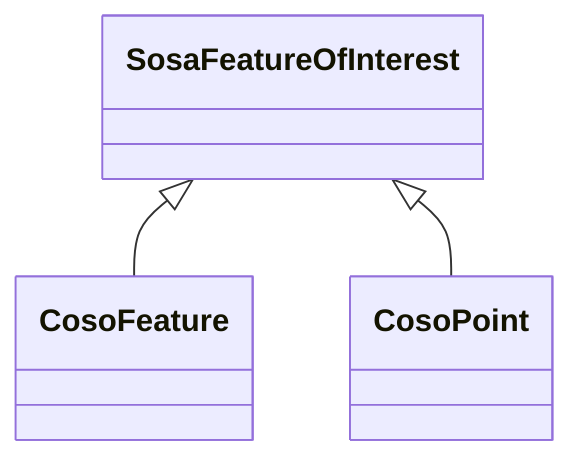

# Class: No class (entity type) name specified -- this class is noted as a superclass of another class in this graph but has not itself been defined. (sosa_FeatureOfInterest)


_No class (type) description specified_


URI: [sosa:FeatureOfInterest](http://www.w3.org/ns/sosa/FeatureOfInterest)





## Inheritance
* **SosaFeatureOfInterest**
    * [CosoFeature](../classes/CosoFeature.md)
    * [CosoPoint](../classes/CosoPoint.md)


## Slots

| Name | Cardinality and Range | Description | Inheritance | Occurrences |
| ---  | --- | --- | --- | --- |


## LinkML Source

<!-- TODO: investigate https://stackoverflow.com/questions/37606292/how-to-create-tabbed-code-blocks-in-mkdocs-or-sphinx -->

### Direct

<details>

```yaml
name: sosa_FeatureOfInterest
conforms_to: No schema conformance document specified
description: No class (type) description specified
title: No class (entity type) name specified -- this class is noted as a superclass
  of another class in this graph but has not itself been defined.
from_schema: sawgraph-kg
rank: 1000
class_uri: sosa:FeatureOfInterest

```
</details>

### Induced

<details>

```yaml
name: sosa_FeatureOfInterest
conforms_to: No schema conformance document specified
description: No class (type) description specified
title: No class (entity type) name specified -- this class is noted as a superclass
  of another class in this graph but has not itself been defined.
from_schema: sawgraph-kg
rank: 1000
class_uri: sosa:FeatureOfInterest

```
</details>