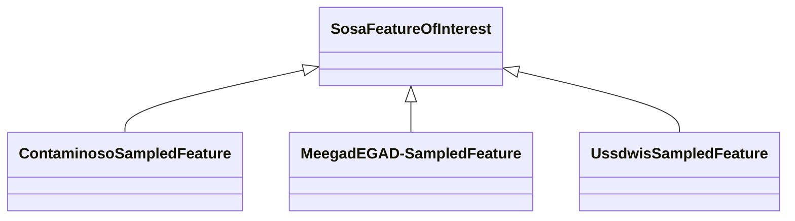

# Class: TODO -- what's a good name for this class (type)? (sosa_FeatureOfInterest)


_No type description provided_


URI: [sosa:FeatureOfInterest](http://www.w3.org/ns/sosa/FeatureOfInterest)





## Inheritance
* **SosaFeatureOfInterest**
    * [ContaminosoSampledFeature](../classes/ContaminosoSampledFeature.md)
    * [MeegadEGAD-SampledFeature](../classes/MeegadEGAD-SampledFeature.md)
    * [UssdwisSampledFeature](../classes/UssdwisSampledFeature.md)


## Slots

| Name | Cardinality and Range | Description | Inheritance |
| ---  | --- | --- | --- |


## TODOs

* TODO -- Todos for this class go here
* or you can delete the todos
* if you think the class is perfect.

## Identifier and Mapping Information


### Schema Source


* from schema: sawgraph-kg


## Mappings

| Mapping Type | Mapped Value |
| ---  | ---  |
| self | sosa:FeatureOfInterest |
| native | sawgraph-kg/:SosaFeatureOfInterest |


## LinkML Source

<!-- TODO: investigate https://stackoverflow.com/questions/37606292/how-to-create-tabbed-code-blocks-in-mkdocs-or-sphinx -->

### Direct

<details>
```yaml
name: sosa_FeatureOfInterest
description: No type description provided
title: TODO -- what's a good name for this class (type)?
todos:
- TODO -- Todos for this class go here
- or you can delete the todos
- if you think the class is perfect.
notes:
- Class with 8196 occurences.
from_schema: sawgraph-kg
rank: 1000
class_uri: sosa:FeatureOfInterest

```
</details>

### Induced

<details>
```yaml
name: sosa_FeatureOfInterest
description: No type description provided
title: TODO -- what's a good name for this class (type)?
todos:
- TODO -- Todos for this class go here
- or you can delete the todos
- if you think the class is perfect.
notes:
- Class with 8196 occurences.
from_schema: sawgraph-kg
rank: 1000
class_uri: sosa:FeatureOfInterest

```
</details>