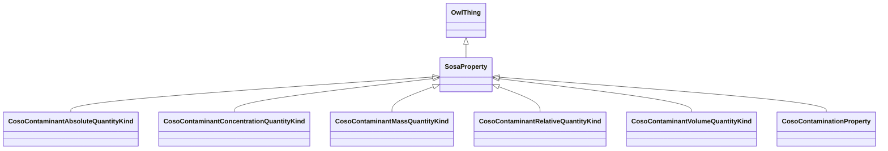

# Class: No class (entity type) name specified -- this class is noted as a superclass of another class in this graph but has not itself been defined. (sosa_Property)


URI: [sosa:Property](http://www.w3.org/ns/sosa/Property)





## Inheritance
* [OwlThing](../classes/OwlThing.md)
    * **SosaProperty**
        * [CosoContaminantAbsoluteQuantityKind](../classes/CosoContaminantAbsoluteQuantityKind.md)
        * [CosoContaminantConcentrationQuantityKind](../classes/CosoContaminantConcentrationQuantityKind.md)
        * [CosoContaminantMassQuantityKind](../classes/CosoContaminantMassQuantityKind.md)
        * [CosoContaminantRelativeQuantityKind](../classes/CosoContaminantRelativeQuantityKind.md)
        * [CosoContaminantVolumeQuantityKind](../classes/CosoContaminantVolumeQuantityKind.md)
        * [CosoContaminationProperty](../classes/CosoContaminationProperty.md)


## Slots

| Name | Cardinality and Range | Description | Inheritance | Occurrences |
| ---  | --- | --- | --- | --- |


## Usages

| used by | used in | type | used |
| ---  | --- | --- | --- |
| [HttpW3id.orgSawgraphV1Me-egad#EGAD-PFAS-Observation](../classes/HttpW3id.orgSawgraphV1Me-egad#EGAD-PFAS-Observation.md) | [coso_observedProperty](../slots/coso_observedProperty.md) | any_of[range] | [SosaProperty](../classes/SosaProperty.md) |
| [HttpW3id.orgSawgraphV1Us-wqp#Observation](../classes/HttpW3id.orgSawgraphV1Us-wqp#Observation.md) | [coso_observedProperty](../slots/coso_observedProperty.md) | any_of[range] | [SosaProperty](../classes/SosaProperty.md) |


## LinkML Source

<!-- TODO: investigate https://stackoverflow.com/questions/37606292/how-to-create-tabbed-code-blocks-in-mkdocs-or-sphinx -->

### Direct

<details>

```yaml
name: sosa_Property
title: No class (entity type) name specified -- this class is noted as a superclass
  of another class in this graph but has not itself been defined.
from_schema: okns:sawgraph-kg
rank: 1000
is_a: owl_Thing
class_uri: sosa:Property

```
</details>

### Induced

<details>

```yaml
name: sosa_Property
title: No class (entity type) name specified -- this class is noted as a superclass
  of another class in this graph but has not itself been defined.
from_schema: okns:sawgraph-kg
rank: 1000
is_a: owl_Thing
class_uri: sosa:Property

```
</details>