# Class: No class (entity type) name specified -- this class is noted as a superclass of another class in this graph but has not itself been defined. (sosa_Result)


_No class (type) description specified_


This class occurs 576763 times.


URI: [sosa:Result](http://www.w3.org/ns/sosa/Result)

```mermaid
 classDiagram
    class SosaResult
    click SosaResult href "../SosaResult"
      SosaResult <|-- CosoContaminantAbsoluteMeasurement
        click CosoContaminantAbsoluteMeasurement href "../CosoContaminantAbsoluteMeasurement"
      SosaResult <|-- MeEgadEGAD-AggregatePFAS-Concentration
        click MeEgadEGAD-AggregatePFAS-Concentration href "../MeEgadEGAD-AggregatePFAS-Concentration"
      SosaResult <|-- MeEgadEGAD-SinglePFAS-Concentration
        click MeEgadEGAD-SinglePFAS-Concentration href "../MeEgadEGAD-SinglePFAS-Concentration"
      
      SosaResult : coso_measurementUnit
        
          
    
    
    SosaResult --> "0..1" Any : coso_measurementUnit
    click Any href "../Any"

        
      SosaResult : coso_measurementValue
        
          
    
    
    SosaResult --> "0..1" Any : coso_measurementValue
    click Any href "../Any"

        
      SosaResult : coso_resultAnnotation
        
          
    
    
    SosaResult --> "0..1" Any : coso_resultAnnotation
    click Any href "../Any"

        
      SosaResult : me_egad_labQualifier
        
          
    
    
    SosaResult --> "0..1" Any : me_egad_labQualifier
    click Any href "../Any"

        
      SosaResult : me_egad_methodDetectionLimit
        
          
    
    
    SosaResult --> "0..1" Any : me_egad_methodDetectionLimit
    click Any href "../Any"

        
      SosaResult : me_egad_reportingLimit
        
          
    
    
    SosaResult --> "0..1" Any : me_egad_reportingLimit
    click Any href "../Any"

        
      SosaResult : me_egad_validationLevel
        
          
    
    
    SosaResult --> "0..1" Any : me_egad_validationLevel
    click Any href "../Any"

        
      SosaResult : me_egad_validationQualifier
        
          
    
    
    SosaResult --> "0..1" Any : me_egad_validationQualifier
    click Any href "../Any"

        
      SosaResult : owl_sameAs
        
          
    
    
    SosaResult --> "0..1" Any : owl_sameAs
    click Any href "../Any"

        
      SosaResult : qudt_hasQuantityKind
        
          
    
    
    SosaResult --> "0..1" Any : qudt_hasQuantityKind
    click Any href "../Any"

        
      SosaResult : qudt_quantityValue
        
          
    
    
    SosaResult --> "0..1" Any : qudt_quantityValue
    click Any href "../Any"

        
      SosaResult : rdfs_label
        
          
    
    
    SosaResult --> "0..1" Any : rdfs_label
    click Any href "../Any"

        
      
```





## Inheritance
* **SosaResult**
    * [CosoContaminantAbsoluteMeasurement](../classes/CosoContaminantAbsoluteMeasurement.md)
    * [MeEgadEGAD-AggregatePFAS-Concentration](../classes/MeEgadEGAD-AggregatePFAS-Concentration.md)
    * [MeEgadEGAD-SinglePFAS-Concentration](../classes/MeEgadEGAD-SinglePFAS-Concentration.md)


## Slots

| Name | Cardinality and Range | Description | Inheritance | Occurrences |
| ---  | --- | --- | --- | --- |
| [owl_sameAs](../slots/owl_sameAs.md) | 0..1 <br/> [MeEgadEGAD-PFAS-ParameterName](../classes/MeEgadEGAD-PFAS-ParameterName.md)&nbsp;or&nbsp;<br />[SosaProcedure](../classes/SosaProcedure.md)&nbsp;or&nbsp;<br />[CosoQuantityValue](../classes/CosoQuantityValue.md)&nbsp;or&nbsp;<br />[B33a4bff87e63dbebb7e68ae4f6624bed](../classes/B33a4bff87e63dbebb7e68ae4f6624bed.md)&nbsp;or&nbsp;<br />[MeEgadEGAD-ConcentrationQualifier](../classes/MeEgadEGAD-ConcentrationQualifier.md)&nbsp;or&nbsp;<br />[B759a060b1552f5afbc0077c0116a05d8](../classes/B759a060b1552f5afbc0077c0116a05d8.md)&nbsp;or&nbsp;<br />[MeEgadEGAD-ReportingLimit](../classes/MeEgadEGAD-ReportingLimit.md)&nbsp;or&nbsp;<br />[B1ec2fb807fea9c1bd025ce9f9a44be32](../classes/B1ec2fb807fea9c1bd025ce9f9a44be32.md)&nbsp;or&nbsp;<br />[QudtQuantity](../classes/QudtQuantity.md)&nbsp;or&nbsp;<br />[StadQuantity](../classes/StadQuantity.md)&nbsp;or&nbsp;<br />[KwgoAdministrativeRegion2](../classes/KwgoAdministrativeRegion2.md)&nbsp;or&nbsp;<br />[B91d76961c9f8ddbd60f889ceeaa2b40e](../classes/B91d76961c9f8ddbd60f889ceeaa2b40e.md)&nbsp;or&nbsp;<br />[Bd4c82b4e72756dd07838e3ed64fc01d3](../classes/Bd4c82b4e72756dd07838e3ed64fc01d3.md)&nbsp;or&nbsp;<br />[MeEgadEGAD-AnalysisMethod](../classes/MeEgadEGAD-AnalysisMethod.md)&nbsp;or&nbsp;<br />[Baee1e1036c9c300a20d18c9a77ed4baa](../classes/Baee1e1036c9c300a20d18c9a77ed4baa.md)&nbsp;or&nbsp;<br />[CosoSingleContaminantMeasurement](../classes/CosoSingleContaminantMeasurement.md)&nbsp;or&nbsp;<br />[CosoAggregateContaminantMeasurement](../classes/CosoAggregateContaminantMeasurement.md)&nbsp;or&nbsp;<br />[B0ec50ed72490f52ac3672a1e7857f5bc](../classes/B0ec50ed72490f52ac3672a1e7857f5bc.md)&nbsp;or&nbsp;<br />[StadDatapoint](../classes/StadDatapoint.md)&nbsp;or&nbsp;<br />[B5a8009d185c57bf4c45da4a0fdd16bd9](../classes/B5a8009d185c57bf4c45da4a0fdd16bd9.md)&nbsp;or&nbsp;<br />[Bc2ad66c8645d30f8bc2834eab721cb6b](../classes/Bc2ad66c8645d30f8bc2834eab721cb6b.md)&nbsp;or&nbsp;<br />[ProvAgent](../classes/ProvAgent.md)&nbsp;or&nbsp;<br />[CosoPoint](../classes/CosoPoint.md)&nbsp;or&nbsp;<br />[B52937cc8dbb22057fb5a128068caae3e](../classes/B52937cc8dbb22057fb5a128068caae3e.md)&nbsp;or&nbsp;<br />[CosoFeature](../classes/CosoFeature.md)&nbsp;or&nbsp;<br />[Badedf2d5daa6297871dc3e5a2fe50510](../classes/Badedf2d5daa6297871dc3e5a2fe50510.md)&nbsp;or&nbsp;<br />[QudtEnumeration](../classes/QudtEnumeration.md)&nbsp;or&nbsp;<br />[MeEgadEGAD-Site](../classes/MeEgadEGAD-Site.md)&nbsp;or&nbsp;<br />[B62f4ca32bee89335c5f2cde8750f0952](../classes/B62f4ca32bee89335c5f2cde8750f0952.md)&nbsp;or&nbsp;<br />[StadStatisticalAggregateData](../classes/StadStatisticalAggregateData.md)&nbsp;or&nbsp;<br />[CosoAnalysisMethod](../classes/CosoAnalysisMethod.md)&nbsp;or&nbsp;<br />[MeEgadEGAD-ValidationLevel](../classes/MeEgadEGAD-ValidationLevel.md)&nbsp;or&nbsp;<br />[MeEgadEGAD-PFAS-Observation](../classes/MeEgadEGAD-PFAS-Observation.md)&nbsp;or&nbsp;<br />[CosoQuantitationLimit](../classes/CosoQuantitationLimit.md)&nbsp;or&nbsp;<br />[QudtVerifiable](../classes/QudtVerifiable.md)&nbsp;or&nbsp;<br />[StadDataValue](../classes/StadDataValue.md)&nbsp;or&nbsp;<br />[KwgoS2Cell](../classes/KwgoS2Cell.md)&nbsp;or&nbsp;<br />[B56a2cea6d406b97b5706b7dded4290e9](../classes/B56a2cea6d406b97b5706b7dded4290e9.md)&nbsp;or&nbsp;<br />[QudtQuantityValue](../classes/QudtQuantityValue.md)&nbsp;or&nbsp;<br />[CosoContaminantAbsoluteQuantityKind](../classes/CosoContaminantAbsoluteQuantityKind.md)&nbsp;or&nbsp;<br />[KwgoAdministrativeRegion](../classes/KwgoAdministrativeRegion.md)&nbsp;or&nbsp;<br />[OwlThing](../classes/OwlThing.md)&nbsp;or&nbsp;<br />[CosoResultQualifier](../classes/CosoResultQualifier.md)&nbsp;or&nbsp;<br />[CosoSubstanceCollection](../classes/CosoSubstanceCollection.md)&nbsp;or&nbsp;<br />[StadStatisticalQuantityKind](../classes/StadStatisticalQuantityKind.md)&nbsp;or&nbsp;<br />[CosoContaminantConcentrationQuantityKind](../classes/CosoContaminantConcentrationQuantityKind.md)&nbsp;or&nbsp;<br />[CosoNonDetectQuantityValue](../classes/CosoNonDetectQuantityValue.md)&nbsp;or&nbsp;<br />[B67799f02f12f9e598057cf6c5606db0d](../classes/B67799f02f12f9e598057cf6c5606db0d.md)&nbsp;or&nbsp;<br />[B9416863afef47838f397f708f628e129](../classes/B9416863afef47838f397f708f628e129.md)&nbsp;or&nbsp;<br />[MeEgadEGAD-ResultType](../classes/MeEgadEGAD-ResultType.md)&nbsp;or&nbsp;<br />[B9647143c38c2eb22c9764bae62e0e1bf](../classes/B9647143c38c2eb22c9764bae62e0e1bf.md)&nbsp;or&nbsp;<br />[CosoContaminantObservation](../classes/CosoContaminantObservation.md)&nbsp;or&nbsp;<br />[Be77f95b3df7489ec3a00781058957f6e](../classes/Be77f95b3df7489ec3a00781058957f6e.md)&nbsp;or&nbsp;<br />[KwgoRegion](../classes/KwgoRegion.md)&nbsp;or&nbsp;<br />[B1f076b6912d64fb8de40fd5bf49bf226](../classes/B1f076b6912d64fb8de40fd5bf49bf226.md)&nbsp;or&nbsp;<br />[B7f743940eb366fa70db0e72f92c486ae](../classes/B7f743940eb366fa70db0e72f92c486ae.md)&nbsp;or&nbsp;<br />[MeEgadEGAD-SamplePoint](../classes/MeEgadEGAD-SamplePoint.md)&nbsp;or&nbsp;<br />[Be49fab2c67d8cc380d54a6132f08f932](../classes/Be49fab2c67d8cc380d54a6132f08f932.md)&nbsp;or&nbsp;<br />[GeoGeometry](../classes/GeoGeometry.md)&nbsp;or&nbsp;<br />[QudtEnumeratedValue](../classes/QudtEnumeratedValue.md)&nbsp;or&nbsp;<br />[GeoSpatialObject](../classes/GeoSpatialObject.md)&nbsp;or&nbsp;<br />[CosoContaminantMeasurement](../classes/CosoContaminantMeasurement.md)&nbsp;or&nbsp;<br />[MeEgadEGAD-SamplePointType](../classes/MeEgadEGAD-SamplePointType.md)&nbsp;or&nbsp;<br />[B09aad887077f56524a134d1a40bd7caa](../classes/B09aad887077f56524a134d1a40bd7caa.md)&nbsp;or&nbsp;<br />[B3996198628e8debde20be7d2bfd72451](../classes/B3996198628e8debde20be7d2bfd72451.md)&nbsp;or&nbsp;<br />[MeEgadEGAD-AggregatePFAS-Concentration](../classes/MeEgadEGAD-AggregatePFAS-Concentration.md)&nbsp;or&nbsp;<br />[SosaProperty](../classes/SosaProperty.md)&nbsp;or&nbsp;<br />[MeEgadEGAD-SampleCollectionMethod](../classes/MeEgadEGAD-SampleCollectionMethod.md)&nbsp;or&nbsp;<br />[B54e27a7ad0f2a017400bf40f12905ea7](../classes/B54e27a7ad0f2a017400bf40f12905ea7.md)&nbsp;or&nbsp;<br />[RdfList](../classes/RdfList.md)&nbsp;or&nbsp;<br />[CosoContaminantRelativeMeasurement](../classes/CosoContaminantRelativeMeasurement.md)&nbsp;or&nbsp;<br />[Bc61095527952bb22dc6c72bcea5e2015](../classes/Bc61095527952bb22dc6c72bcea5e2015.md)&nbsp;or&nbsp;<br />[MeEgadEGAD-Sample](../classes/MeEgadEGAD-Sample.md)&nbsp;or&nbsp;<br />[SosaResult](../classes/SosaResult.md)&nbsp;or&nbsp;<br />[CosoSampleAnnotation](../classes/CosoSampleAnnotation.md)&nbsp;or&nbsp;<br />[MeEgadEGAD-PFAS-Site](../classes/MeEgadEGAD-PFAS-Site.md)&nbsp;or&nbsp;<br />[B05e44ef0dae70e2dd72c89f36a1473fe](../classes/B05e44ef0dae70e2dd72c89f36a1473fe.md)&nbsp;or&nbsp;<br />[CosoContaminantVolumeQuantityKind](../classes/CosoContaminantVolumeQuantityKind.md)&nbsp;or&nbsp;<br />[QudtConcept](../classes/QudtConcept.md)&nbsp;or&nbsp;<br />[MeEgadEGAD-SinglePFAS-Concentration](../classes/MeEgadEGAD-SinglePFAS-Concentration.md)&nbsp;or&nbsp;<br />[CosoMaterialSample](../classes/CosoMaterialSample.md)&nbsp;or&nbsp;<br />[CosoSampledFeature](../classes/CosoSampledFeature.md)&nbsp;or&nbsp;<br />[KwgoS2CellLevel13](../classes/KwgoS2CellLevel13.md)&nbsp;or&nbsp;<br />[Ba265b6e5375ebb0aadae09c47f43d655](../classes/Ba265b6e5375ebb0aadae09c47f43d655.md)&nbsp;or&nbsp;<br />[CosoContaminantSampleObservation](../classes/CosoContaminantSampleObservation.md)&nbsp;or&nbsp;<br />[Bf18cfef7abd2b808d3e5a50da0b1bde7](../classes/Bf18cfef7abd2b808d3e5a50da0b1bde7.md)&nbsp;or&nbsp;<br />[CosoDetectionLimit](../classes/CosoDetectionLimit.md)&nbsp;or&nbsp;<br />[SosaSample](../classes/SosaSample.md)&nbsp;or&nbsp;<br />[MeEgadEGAD-MethodDetectionLimit](../classes/MeEgadEGAD-MethodDetectionLimit.md)&nbsp;or&nbsp;<br />[B06945e371c65d137066f33e51a15fc88](../classes/B06945e371c65d137066f33e51a15fc88.md)&nbsp;or&nbsp;<br />[MeEgadEGAD-SiteType](../classes/MeEgadEGAD-SiteType.md)&nbsp;or&nbsp;<br />[CosoContaminantRelativeQuantityKind](../classes/CosoContaminantRelativeQuantityKind.md)&nbsp;or&nbsp;<br />[CosoSamplePoint](../classes/CosoSamplePoint.md)&nbsp;or&nbsp;<br />[KwgoAdministrativeRegion3](../classes/KwgoAdministrativeRegion3.md)&nbsp;or&nbsp;<br />[SosaFeatureOfInterest](../classes/SosaFeatureOfInterest.md)&nbsp;or&nbsp;<br />[B4988d800b6a457b8e9d23239a25a722c](../classes/B4988d800b6a457b8e9d23239a25a722c.md)&nbsp;or&nbsp;<br />[CosoContaminationProperty](../classes/CosoContaminationProperty.md)&nbsp;or&nbsp;<br />[MeEgadEGAD-SampledFeature](../classes/MeEgadEGAD-SampledFeature.md)&nbsp;or&nbsp;<br />[B7562df68ecb21c16369015b4829049e8](../classes/B7562df68ecb21c16369015b4829049e8.md)&nbsp;or&nbsp;<br />[Bc61726e4df6d53655e7a7348513c3069](../classes/Bc61726e4df6d53655e7a7348513c3069.md)&nbsp;or&nbsp;<br />[MeEgadEGAD-SampleTreatmentStatus](../classes/MeEgadEGAD-SampleTreatmentStatus.md)&nbsp;or&nbsp;<br />[StadSingleData](../classes/StadSingleData.md)&nbsp;or&nbsp;<br />[MeEgadEGAD-SampleMaterialType](../classes/MeEgadEGAD-SampleMaterialType.md)&nbsp;or&nbsp;<br />[B83cd416c76244b666544da84186161ee](../classes/B83cd416c76244b666544da84186161ee.md)&nbsp;or&nbsp;<br />[ProvOrganization](../classes/ProvOrganization.md)&nbsp;or&nbsp;<br />[CosoObservationAnnotation](../classes/CosoObservationAnnotation.md)&nbsp;or&nbsp;<br />[CosoSubstance](../classes/CosoSubstance.md)&nbsp;or&nbsp;<br />[CosoDetectQuantityValue](../classes/CosoDetectQuantityValue.md)&nbsp;or&nbsp;<br />[B4f0e79d63147e2e6dacf649c0ae23375](../classes/B4f0e79d63147e2e6dacf649c0ae23375.md)&nbsp;or&nbsp;<br />[CosoSampleMaterialType](../classes/CosoSampleMaterialType.md)&nbsp;or&nbsp;<br />[QudtQuantifiable](../classes/QudtQuantifiable.md)&nbsp;or&nbsp;<br />[OwlNamedIndividual](../classes/OwlNamedIndividual.md)&nbsp;or&nbsp;<br />[SosaObservation](../classes/SosaObservation.md)&nbsp;or&nbsp;<br />[KwgoCell](../classes/KwgoCell.md)&nbsp;or&nbsp;<br />[QudtUnit](../classes/QudtUnit.md)&nbsp;or&nbsp;<br />[GeoFeature](../classes/GeoFeature.md)&nbsp;or&nbsp;<br />[KwgoAdministrativeRegion1](../classes/KwgoAdministrativeRegion1.md)&nbsp;or&nbsp;<br />[Bb3b966a83ead8099fc1d9350e1c85c2d](../classes/Bb3b966a83ead8099fc1d9350e1c85c2d.md)&nbsp;or&nbsp;<br />[Bd82d59dfe322d0239d857ed8bdb33e3f](../classes/Bd82d59dfe322d0239d857ed8bdb33e3f.md)&nbsp;or&nbsp;<br />[Bd2cb89944394492862955024a10bc9b2](../classes/Bd2cb89944394492862955024a10bc9b2.md)&nbsp;or&nbsp;<br />[Sf#Point](../classes/Sf#Point.md)&nbsp;or&nbsp;<br />[StadQualityKind](../classes/StadQualityKind.md)&nbsp;or&nbsp;<br />[B35dd872c46bbac02f1b1999558dc2e7a](../classes/B35dd872c46bbac02f1b1999558dc2e7a.md)&nbsp;or&nbsp;<br />[Bd7ac0dbb4a69dd5b498c4fd86dffe2cc](../classes/Bd7ac0dbb4a69dd5b498c4fd86dffe2cc.md)&nbsp;or&nbsp;<br />[MeEgadEGAD-SampleDetailedLocation](../classes/MeEgadEGAD-SampleDetailedLocation.md)&nbsp;or&nbsp;<br />[MeEgadEGAD-SampleMaterialTypeQualifier](../classes/MeEgadEGAD-SampleMaterialTypeQualifier.md)&nbsp;or&nbsp;<br />[QudtQuantityKind](../classes/QudtQuantityKind.md)&nbsp;or&nbsp;<br />[Be2c88f2a392c478b7dd00ad2fe5624e0](../classes/Be2c88f2a392c478b7dd00ad2fe5624e0.md) | No slot (predicate) description specified <br/>  | direct | 9804971 |
| [qudt_hasQuantityKind](../slots/qudt_hasQuantityKind.md) | 0..1 <br/> [B33a4bff87e63dbebb7e68ae4f6624bed](../classes/B33a4bff87e63dbebb7e68ae4f6624bed.md)&nbsp;or&nbsp;<br />[OwlThing](../classes/OwlThing.md)&nbsp;or&nbsp;<br />[B1ec2fb807fea9c1bd025ce9f9a44be32](../classes/B1ec2fb807fea9c1bd025ce9f9a44be32.md)&nbsp;or&nbsp;<br />[B91d76961c9f8ddbd60f889ceeaa2b40e](../classes/B91d76961c9f8ddbd60f889ceeaa2b40e.md)&nbsp;or&nbsp;<br />[CosoContaminantConcentrationQuantityKind](../classes/CosoContaminantConcentrationQuantityKind.md)&nbsp;or&nbsp;<br />[Baee1e1036c9c300a20d18c9a77ed4baa](../classes/Baee1e1036c9c300a20d18c9a77ed4baa.md)&nbsp;or&nbsp;<br />[OwlNamedIndividual](../classes/OwlNamedIndividual.md)&nbsp;or&nbsp;<br />[B5a8009d185c57bf4c45da4a0fdd16bd9](../classes/B5a8009d185c57bf4c45da4a0fdd16bd9.md)&nbsp;or&nbsp;<br />[B9647143c38c2eb22c9764bae62e0e1bf](../classes/B9647143c38c2eb22c9764bae62e0e1bf.md)&nbsp;or&nbsp;<br />[Badedf2d5daa6297871dc3e5a2fe50510](../classes/Badedf2d5daa6297871dc3e5a2fe50510.md)&nbsp;or&nbsp;<br />[B1f076b6912d64fb8de40fd5bf49bf226](../classes/B1f076b6912d64fb8de40fd5bf49bf226.md)&nbsp;or&nbsp;<br />[B06945e371c65d137066f33e51a15fc88](../classes/B06945e371c65d137066f33e51a15fc88.md)&nbsp;or&nbsp;<br />[CosoContaminantRelativeQuantityKind](../classes/CosoContaminantRelativeQuantityKind.md)&nbsp;or&nbsp;<br />[B09aad887077f56524a134d1a40bd7caa](../classes/B09aad887077f56524a134d1a40bd7caa.md)&nbsp;or&nbsp;<br />[SosaProperty](../classes/SosaProperty.md)&nbsp;or&nbsp;<br />[B4988d800b6a457b8e9d23239a25a722c](../classes/B4988d800b6a457b8e9d23239a25a722c.md)&nbsp;or&nbsp;<br />[CosoContaminationProperty](../classes/CosoContaminationProperty.md)&nbsp;or&nbsp;<br />[StadQualityKind](../classes/StadQualityKind.md)&nbsp;or&nbsp;<br />[Bd7ac0dbb4a69dd5b498c4fd86dffe2cc](../classes/Bd7ac0dbb4a69dd5b498c4fd86dffe2cc.md)&nbsp;or&nbsp;<br />[B7562df68ecb21c16369015b4829049e8](../classes/B7562df68ecb21c16369015b4829049e8.md)&nbsp;or&nbsp;<br />[Bc61726e4df6d53655e7a7348513c3069](../classes/Bc61726e4df6d53655e7a7348513c3069.md)&nbsp;or&nbsp;<br />[QudtQuantityKind](../classes/QudtQuantityKind.md)&nbsp;or&nbsp;<br />[Be2c88f2a392c478b7dd00ad2fe5624e0](../classes/Be2c88f2a392c478b7dd00ad2fe5624e0.md) | No slot (predicate) description specified <br/>  | direct | 13077164 |
| [coso_measurementUnit](../slots/coso_measurementUnit.md) | 0..1 <br/> [QudtConcept](../classes/QudtConcept.md)&nbsp;or&nbsp;<br />[B62f4ca32bee89335c5f2cde8750f0952](../classes/B62f4ca32bee89335c5f2cde8750f0952.md)&nbsp;or&nbsp;<br />[QudtVerifiable](../classes/QudtVerifiable.md)&nbsp;or&nbsp;<br />[B7f743940eb366fa70db0e72f92c486ae](../classes/B7f743940eb366fa70db0e72f92c486ae.md)&nbsp;or&nbsp;<br />[OwlThing](../classes/OwlThing.md)&nbsp;or&nbsp;<br />[B3996198628e8debde20be7d2bfd72451](../classes/B3996198628e8debde20be7d2bfd72451.md)&nbsp;or&nbsp;<br />[B83cd416c76244b666544da84186161ee](../classes/B83cd416c76244b666544da84186161ee.md)&nbsp;or&nbsp;<br />[Ba265b6e5375ebb0aadae09c47f43d655](../classes/Ba265b6e5375ebb0aadae09c47f43d655.md)&nbsp;or&nbsp;<br />[QudtUnit](../classes/QudtUnit.md)&nbsp;or&nbsp;<br />[B52937cc8dbb22057fb5a128068caae3e](../classes/B52937cc8dbb22057fb5a128068caae3e.md) | The unit of measurement the describes the result <br/>  | direct | 1425570 |
| [me_egad_validationQualifier](../slots/me_egad_validationQualifier.md) | 0..1 <br/> [QudtConcept](../classes/QudtConcept.md)&nbsp;or&nbsp;<br />[B35dd872c46bbac02f1b1999558dc2e7a](../classes/B35dd872c46bbac02f1b1999558dc2e7a.md)&nbsp;or&nbsp;<br />[MeEgadEGAD-ConcentrationQualifier](../classes/MeEgadEGAD-ConcentrationQualifier.md)&nbsp;or&nbsp;<br />[CosoResultQualifier](../classes/CosoResultQualifier.md)&nbsp;or&nbsp;<br />[OwlNamedIndividual](../classes/OwlNamedIndividual.md)&nbsp;or&nbsp;<br />[B67799f02f12f9e598057cf6c5606db0d](../classes/B67799f02f12f9e598057cf6c5606db0d.md)&nbsp;or&nbsp;<br />[B9416863afef47838f397f708f628e129](../classes/B9416863afef47838f397f708f628e129.md)&nbsp;or&nbsp;<br />[OwlThing](../classes/OwlThing.md)&nbsp;or&nbsp;<br />[B56a2cea6d406b97b5706b7dded4290e9](../classes/B56a2cea6d406b97b5706b7dded4290e9.md)&nbsp;or&nbsp;<br />[B4f0e79d63147e2e6dacf649c0ae23375](../classes/B4f0e79d63147e2e6dacf649c0ae23375.md)&nbsp;or&nbsp;<br />[QudtEnumeration](../classes/QudtEnumeration.md) | No slot (predicate) description specified <br/>  | direct | 5563776 |
| [me_egad_methodDetectionLimit](../slots/me_egad_methodDetectionLimit.md) | 0..1 <br/> [QudtConcept](../classes/QudtConcept.md)&nbsp;or&nbsp;<br />[MeEgadEGAD-MethodDetectionLimit](../classes/MeEgadEGAD-MethodDetectionLimit.md)&nbsp;or&nbsp;<br />[QudtQuantifiable](../classes/QudtQuantifiable.md)&nbsp;or&nbsp;<br />[CosoResultQualifier](../classes/CosoResultQualifier.md)&nbsp;or&nbsp;<br />[OwlThing](../classes/OwlThing.md)&nbsp;or&nbsp;<br />[QudtQuantity](../classes/QudtQuantity.md)&nbsp;or&nbsp;<br />[B0ec50ed72490f52ac3672a1e7857f5bc](../classes/B0ec50ed72490f52ac3672a1e7857f5bc.md)&nbsp;or&nbsp;<br />[StadDatapoint](../classes/StadDatapoint.md)&nbsp;or&nbsp;<br />[CosoDetectionLimit](../classes/CosoDetectionLimit.md)&nbsp;or&nbsp;<br />[Bd4c82b4e72756dd07838e3ed64fc01d3](../classes/Bd4c82b4e72756dd07838e3ed64fc01d3.md)&nbsp;or&nbsp;<br />[Bc61095527952bb22dc6c72bcea5e2015](../classes/Bc61095527952bb22dc6c72bcea5e2015.md)&nbsp;or&nbsp;<br />[Bb3b966a83ead8099fc1d9350e1c85c2d](../classes/Bb3b966a83ead8099fc1d9350e1c85c2d.md) | No slot (predicate) description specified <br/>  | direct | 6932784 |
| [coso_measurementValue](../slots/coso_measurementValue.md) | 0..1 <br/> [QudtConcept](../classes/QudtConcept.md)&nbsp;or&nbsp;<br />[QudtVerifiable](../classes/QudtVerifiable.md)&nbsp;or&nbsp;<br />[B54e27a7ad0f2a017400bf40f12905ea7](../classes/B54e27a7ad0f2a017400bf40f12905ea7.md)&nbsp;or&nbsp;<br />[OwlThing](../classes/OwlThing.md)&nbsp;or&nbsp;<br />[xsd:decimal](http://www.w3.org/2001/XMLSchema#decimal)&nbsp;or&nbsp;<br />[Be49fab2c67d8cc380d54a6132f08f932](../classes/Be49fab2c67d8cc380d54a6132f08f932.md)&nbsp;or&nbsp;<br />[QudtEnumeratedValue](../classes/QudtEnumeratedValue.md)&nbsp;or&nbsp;<br />[xsd:double](http://www.w3.org/2001/XMLSchema#double)&nbsp;or&nbsp;<br />[Bc2ad66c8645d30f8bc2834eab721cb6b](../classes/Bc2ad66c8645d30f8bc2834eab721cb6b.md)&nbsp;or&nbsp;<br />[Bd2cb89944394492862955024a10bc9b2](../classes/Bd2cb89944394492862955024a10bc9b2.md) | The numeric value or enumerated value that quantifies or qualifies the result <br/>  | direct | 3480016 |
| [me_egad_labQualifier](../slots/me_egad_labQualifier.md) | 0..1 <br/> [QudtConcept](../classes/QudtConcept.md)&nbsp;or&nbsp;<br />[B35dd872c46bbac02f1b1999558dc2e7a](../classes/B35dd872c46bbac02f1b1999558dc2e7a.md)&nbsp;or&nbsp;<br />[MeEgadEGAD-ConcentrationQualifier](../classes/MeEgadEGAD-ConcentrationQualifier.md)&nbsp;or&nbsp;<br />[CosoResultQualifier](../classes/CosoResultQualifier.md)&nbsp;or&nbsp;<br />[OwlNamedIndividual](../classes/OwlNamedIndividual.md)&nbsp;or&nbsp;<br />[B67799f02f12f9e598057cf6c5606db0d](../classes/B67799f02f12f9e598057cf6c5606db0d.md)&nbsp;or&nbsp;<br />[B9416863afef47838f397f708f628e129](../classes/B9416863afef47838f397f708f628e129.md)&nbsp;or&nbsp;<br />[OwlThing](../classes/OwlThing.md)&nbsp;or&nbsp;<br />[B56a2cea6d406b97b5706b7dded4290e9](../classes/B56a2cea6d406b97b5706b7dded4290e9.md)&nbsp;or&nbsp;<br />[B4f0e79d63147e2e6dacf649c0ae23375](../classes/B4f0e79d63147e2e6dacf649c0ae23375.md)&nbsp;or&nbsp;<br />[QudtEnumeration](../classes/QudtEnumeration.md) | No slot (predicate) description specified <br/>  | direct | 5379550 |
| [me_egad_reportingLimit](../slots/me_egad_reportingLimit.md) | 0..1 <br/> [QudtConcept](../classes/QudtConcept.md)&nbsp;or&nbsp;<br />[CosoQuantitationLimit](../classes/CosoQuantitationLimit.md)&nbsp;or&nbsp;<br />[MeEgadEGAD-ReportingLimit](../classes/MeEgadEGAD-ReportingLimit.md)&nbsp;or&nbsp;<br />[QudtQuantifiable](../classes/QudtQuantifiable.md)&nbsp;or&nbsp;<br />[CosoResultQualifier](../classes/CosoResultQualifier.md)&nbsp;or&nbsp;<br />[OwlThing](../classes/OwlThing.md)&nbsp;or&nbsp;<br />[QudtQuantity](../classes/QudtQuantity.md)&nbsp;or&nbsp;<br />[B0ec50ed72490f52ac3672a1e7857f5bc](../classes/B0ec50ed72490f52ac3672a1e7857f5bc.md)&nbsp;or&nbsp;<br />[StadDatapoint](../classes/StadDatapoint.md)&nbsp;or&nbsp;<br />[Bd4c82b4e72756dd07838e3ed64fc01d3](../classes/Bd4c82b4e72756dd07838e3ed64fc01d3.md)&nbsp;or&nbsp;<br />[Bc61095527952bb22dc6c72bcea5e2015](../classes/Bc61095527952bb22dc6c72bcea5e2015.md)&nbsp;or&nbsp;<br />[Bb3b966a83ead8099fc1d9350e1c85c2d](../classes/Bb3b966a83ead8099fc1d9350e1c85c2d.md) | No slot (predicate) description specified <br/>  | direct | 6950988 |
| [qudt_quantityValue](../slots/qudt_quantityValue.md) | 0..1 <br/> [QudtConcept](../classes/QudtConcept.md)&nbsp;or&nbsp;<br />[Be77f95b3df7489ec3a00781058957f6e](../classes/Be77f95b3df7489ec3a00781058957f6e.md)&nbsp;or&nbsp;<br />[CosoQuantityValue](../classes/CosoQuantityValue.md)&nbsp;or&nbsp;<br />[CosoNonDetectQuantityValue](../classes/CosoNonDetectQuantityValue.md)&nbsp;or&nbsp;<br />[QudtQuantifiable](../classes/QudtQuantifiable.md)&nbsp;or&nbsp;<br />[OwlThing](../classes/OwlThing.md)&nbsp;or&nbsp;<br />[StadDataValue](../classes/StadDataValue.md)&nbsp;or&nbsp;<br />[CosoDetectQuantityValue](../classes/CosoDetectQuantityValue.md)&nbsp;or&nbsp;<br />[Bf18cfef7abd2b808d3e5a50da0b1bde7](../classes/Bf18cfef7abd2b808d3e5a50da0b1bde7.md)&nbsp;or&nbsp;<br />[QudtQuantityValue](../classes/QudtQuantityValue.md) | No slot (predicate) description specified <br/>  | direct | 5191283 |
| [me_egad_validationLevel](../slots/me_egad_validationLevel.md) | 0..1 <br/> [QudtConcept](../classes/QudtConcept.md)&nbsp;or&nbsp;<br />[B35dd872c46bbac02f1b1999558dc2e7a](../classes/B35dd872c46bbac02f1b1999558dc2e7a.md)&nbsp;or&nbsp;<br />[CosoResultQualifier](../classes/CosoResultQualifier.md)&nbsp;or&nbsp;<br />[OwlThing](../classes/OwlThing.md)&nbsp;or&nbsp;<br />[OwlNamedIndividual](../classes/OwlNamedIndividual.md)&nbsp;or&nbsp;<br />[B67799f02f12f9e598057cf6c5606db0d](../classes/B67799f02f12f9e598057cf6c5606db0d.md)&nbsp;or&nbsp;<br />[B9416863afef47838f397f708f628e129](../classes/B9416863afef47838f397f708f628e129.md)&nbsp;or&nbsp;<br />[B56a2cea6d406b97b5706b7dded4290e9](../classes/B56a2cea6d406b97b5706b7dded4290e9.md)&nbsp;or&nbsp;<br />[B4f0e79d63147e2e6dacf649c0ae23375](../classes/B4f0e79d63147e2e6dacf649c0ae23375.md)&nbsp;or&nbsp;<br />[MeEgadEGAD-ValidationLevel](../classes/MeEgadEGAD-ValidationLevel.md)&nbsp;or&nbsp;<br />[QudtEnumeration](../classes/QudtEnumeration.md) | No slot (predicate) description specified <br/>  | direct | 6231309 |
| [coso_resultAnnotation](../slots/coso_resultAnnotation.md) | 0..1 <br/> [MeEgadEGAD-ReportingLimit](../classes/MeEgadEGAD-ReportingLimit.md)&nbsp;or&nbsp;<br />[MeEgadEGAD-ConcentrationQualifier](../classes/MeEgadEGAD-ConcentrationQualifier.md)&nbsp;or&nbsp;<br />[CosoResultQualifier](../classes/CosoResultQualifier.md)&nbsp;or&nbsp;<br />[OwlThing](../classes/OwlThing.md)&nbsp;or&nbsp;<br />[QudtQuantity](../classes/QudtQuantity.md)&nbsp;or&nbsp;<br />[Bd4c82b4e72756dd07838e3ed64fc01d3](../classes/Bd4c82b4e72756dd07838e3ed64fc01d3.md)&nbsp;or&nbsp;<br />[B4f0e79d63147e2e6dacf649c0ae23375](../classes/B4f0e79d63147e2e6dacf649c0ae23375.md)&nbsp;or&nbsp;<br />[QudtConcept](../classes/QudtConcept.md)&nbsp;or&nbsp;<br />[QudtQuantifiable](../classes/QudtQuantifiable.md)&nbsp;or&nbsp;<br />[OwlNamedIndividual](../classes/OwlNamedIndividual.md)&nbsp;or&nbsp;<br />[B67799f02f12f9e598057cf6c5606db0d](../classes/B67799f02f12f9e598057cf6c5606db0d.md)&nbsp;or&nbsp;<br />[B9416863afef47838f397f708f628e129](../classes/B9416863afef47838f397f708f628e129.md)&nbsp;or&nbsp;<br />[B0ec50ed72490f52ac3672a1e7857f5bc](../classes/B0ec50ed72490f52ac3672a1e7857f5bc.md)&nbsp;or&nbsp;<br />[StadDatapoint](../classes/StadDatapoint.md)&nbsp;or&nbsp;<br />[CosoDetectionLimit](../classes/CosoDetectionLimit.md)&nbsp;or&nbsp;<br />[QudtEnumeration](../classes/QudtEnumeration.md)&nbsp;or&nbsp;<br />[MeEgadEGAD-MethodDetectionLimit](../classes/MeEgadEGAD-MethodDetectionLimit.md)&nbsp;or&nbsp;<br />[Bb3b966a83ead8099fc1d9350e1c85c2d](../classes/Bb3b966a83ead8099fc1d9350e1c85c2d.md)&nbsp;or&nbsp;<br />[MeEgadEGAD-ValidationLevel](../classes/MeEgadEGAD-ValidationLevel.md)&nbsp;or&nbsp;<br />[CosoQuantitationLimit](../classes/CosoQuantitationLimit.md)&nbsp;or&nbsp;<br />[B35dd872c46bbac02f1b1999558dc2e7a](../classes/B35dd872c46bbac02f1b1999558dc2e7a.md)&nbsp;or&nbsp;<br />[Bc61095527952bb22dc6c72bcea5e2015](../classes/Bc61095527952bb22dc6c72bcea5e2015.md)&nbsp;or&nbsp;<br />[B56a2cea6d406b97b5706b7dded4290e9](../classes/B56a2cea6d406b97b5706b7dded4290e9.md) | No slot (predicate) description specified <br/>  | direct | 26725661 |
| [rdfs_label](../slots/rdfs_label.md) | 0..1 <br/> [xsd:string](http://www.w3.org/2001/XMLSchema#string)&nbsp;or&nbsp;<br />[RdfsLiteral](../classes/RdfsLiteral.md) | No slot (predicate) description specified <br/>  | direct |  |


## Usages

| used by | used in | type | used |
| ---  | --- | --- | --- |
| [OwlNamedIndividual](../classes/OwlNamedIndividual.md) | [owl_sameAs](../slots/owl_sameAs.md) | any_of[range] | [SosaResult](../classes/SosaResult.md) |
| [OwlNamedIndividual](../classes/OwlNamedIndividual.md) | [sosa_hasResult](../slots/sosa_hasResult.md) | any_of[range] | [SosaResult](../classes/SosaResult.md) |
| [OwlNamedIndividual](../classes/OwlNamedIndividual.md) | [qudt_valueQuantity](../slots/qudt_valueQuantity.md) | any_of[range] | [SosaResult](../classes/SosaResult.md) |
| [OwlNamedIndividual](../classes/OwlNamedIndividual.md) | [coso_hasResult](../slots/coso_hasResult.md) | any_of[range] | [SosaResult](../classes/SosaResult.md) |
| [OwlNothing](../classes/OwlNothing.md) | [owl_sameAs](../slots/owl_sameAs.md) | any_of[range] | [SosaResult](../classes/SosaResult.md) |
| [OwlThing](../classes/OwlThing.md) | [sosa_hasResult](../slots/sosa_hasResult.md) | any_of[range] | [SosaResult](../classes/SosaResult.md) |
| [OwlThing](../classes/OwlThing.md) | [qudt_valueQuantity](../slots/qudt_valueQuantity.md) | any_of[range] | [SosaResult](../classes/SosaResult.md) |
| [OwlThing](../classes/OwlThing.md) | [owl_sameAs](../slots/owl_sameAs.md) | any_of[range] | [SosaResult](../classes/SosaResult.md) |
| [OwlThing](../classes/OwlThing.md) | [coso_hasResult](../slots/coso_hasResult.md) | any_of[range] | [SosaResult](../classes/SosaResult.md) |
| [RdfList](../classes/RdfList.md) | [owl_sameAs](../slots/owl_sameAs.md) | any_of[range] | [SosaResult](../classes/SosaResult.md) |
| [QudtConcept](../classes/QudtConcept.md) | [qudt_valueQuantity](../slots/qudt_valueQuantity.md) | any_of[range] | [SosaResult](../classes/SosaResult.md) |
| [QudtConcept](../classes/QudtConcept.md) | [owl_sameAs](../slots/owl_sameAs.md) | any_of[range] | [SosaResult](../classes/SosaResult.md) |
| [QudtDatatype](../classes/QudtDatatype.md) | [sosa_hasResult](../slots/sosa_hasResult.md) | any_of[range] | [SosaResult](../classes/SosaResult.md) |
| [QudtDatatype](../classes/QudtDatatype.md) | [qudt_valueQuantity](../slots/qudt_valueQuantity.md) | any_of[range] | [SosaResult](../classes/SosaResult.md) |
| [QudtDatatype](../classes/QudtDatatype.md) | [owl_sameAs](../slots/owl_sameAs.md) | any_of[range] | [SosaResult](../classes/SosaResult.md) |
| [QudtDatatype](../classes/QudtDatatype.md) | [coso_hasResult](../slots/coso_hasResult.md) | any_of[range] | [SosaResult](../classes/SosaResult.md) |
| [QudtDerivedUnit](../classes/QudtDerivedUnit.md) | [owl_sameAs](../slots/owl_sameAs.md) | any_of[range] | [SosaResult](../classes/SosaResult.md) |
| [QudtDerivedUnit](../classes/QudtDerivedUnit.md) | [sosa_hasResult](../slots/sosa_hasResult.md) | any_of[range] | [SosaResult](../classes/SosaResult.md) |
| [QudtDerivedUnit](../classes/QudtDerivedUnit.md) | [qudt_valueQuantity](../slots/qudt_valueQuantity.md) | any_of[range] | [SosaResult](../classes/SosaResult.md) |
| [QudtDerivedUnit](../classes/QudtDerivedUnit.md) | [coso_hasResult](../slots/coso_hasResult.md) | any_of[range] | [SosaResult](../classes/SosaResult.md) |
| [QudtDiscipline](../classes/QudtDiscipline.md) | [qudt_valueQuantity](../slots/qudt_valueQuantity.md) | any_of[range] | [SosaResult](../classes/SosaResult.md) |
| [QudtDiscipline](../classes/QudtDiscipline.md) | [owl_sameAs](../slots/owl_sameAs.md) | any_of[range] | [SosaResult](../classes/SosaResult.md) |
| [QudtEndianType](../classes/QudtEndianType.md) | [owl_sameAs](../slots/owl_sameAs.md) | any_of[range] | [SosaResult](../classes/SosaResult.md) |
| [QudtEndianType](../classes/QudtEndianType.md) | [sosa_hasResult](../slots/sosa_hasResult.md) | any_of[range] | [SosaResult](../classes/SosaResult.md) |
| [QudtEndianType](../classes/QudtEndianType.md) | [qudt_valueQuantity](../slots/qudt_valueQuantity.md) | any_of[range] | [SosaResult](../classes/SosaResult.md) |
| [QudtEndianType](../classes/QudtEndianType.md) | [coso_hasResult](../slots/coso_hasResult.md) | any_of[range] | [SosaResult](../classes/SosaResult.md) |
| [QudtEnumeratedValue](../classes/QudtEnumeratedValue.md) | [owl_sameAs](../slots/owl_sameAs.md) | any_of[range] | [SosaResult](../classes/SosaResult.md) |
| [QudtEnumeratedValue](../classes/QudtEnumeratedValue.md) | [sosa_hasResult](../slots/sosa_hasResult.md) | any_of[range] | [SosaResult](../classes/SosaResult.md) |
| [QudtEnumeratedValue](../classes/QudtEnumeratedValue.md) | [qudt_valueQuantity](../slots/qudt_valueQuantity.md) | any_of[range] | [SosaResult](../classes/SosaResult.md) |
| [QudtEnumeratedValue](../classes/QudtEnumeratedValue.md) | [coso_hasResult](../slots/coso_hasResult.md) | any_of[range] | [SosaResult](../classes/SosaResult.md) |
| [QudtEnumeration](../classes/QudtEnumeration.md) | [owl_sameAs](../slots/owl_sameAs.md) | any_of[range] | [SosaResult](../classes/SosaResult.md) |
| [QudtEnumeration](../classes/QudtEnumeration.md) | [sosa_hasResult](../slots/sosa_hasResult.md) | any_of[range] | [SosaResult](../classes/SosaResult.md) |
| [QudtEnumeration](../classes/QudtEnumeration.md) | [qudt_valueQuantity](../slots/qudt_valueQuantity.md) | any_of[range] | [SosaResult](../classes/SosaResult.md) |
| [QudtEnumeration](../classes/QudtEnumeration.md) | [coso_hasResult](../slots/coso_hasResult.md) | any_of[range] | [SosaResult](../classes/SosaResult.md) |
| [QudtMathsFunctionType](../classes/QudtMathsFunctionType.md) | [qudt_valueQuantity](../slots/qudt_valueQuantity.md) | any_of[range] | [SosaResult](../classes/SosaResult.md) |
| [QudtMathsFunctionType](../classes/QudtMathsFunctionType.md) | [owl_sameAs](../slots/owl_sameAs.md) | any_of[range] | [SosaResult](../classes/SosaResult.md) |
| [QudtQuantifiable](../classes/QudtQuantifiable.md) | [owl_sameAs](../slots/owl_sameAs.md) | any_of[range] | [SosaResult](../classes/SosaResult.md) |
| [QudtQuantifiable](../classes/QudtQuantifiable.md) | [qudt_valueQuantity](../slots/qudt_valueQuantity.md) | any_of[range] | [SosaResult](../classes/SosaResult.md) |
| [QudtQuantity](../classes/QudtQuantity.md) | [owl_sameAs](../slots/owl_sameAs.md) | any_of[range] | [SosaResult](../classes/SosaResult.md) |
| [QudtQuantity](../classes/QudtQuantity.md) | [sosa_hasResult](../slots/sosa_hasResult.md) | any_of[range] | [SosaResult](../classes/SosaResult.md) |
| [QudtQuantity](../classes/QudtQuantity.md) | [qudt_valueQuantity](../slots/qudt_valueQuantity.md) | any_of[range] | [SosaResult](../classes/SosaResult.md) |
| [QudtQuantity](../classes/QudtQuantity.md) | [coso_hasResult](../slots/coso_hasResult.md) | any_of[range] | [SosaResult](../classes/SosaResult.md) |
| [QudtQuantityKind](../classes/QudtQuantityKind.md) | [owl_sameAs](../slots/owl_sameAs.md) | any_of[range] | [SosaResult](../classes/SosaResult.md) |
| [QudtQuantityKind](../classes/QudtQuantityKind.md) | [sosa_hasResult](../slots/sosa_hasResult.md) | any_of[range] | [SosaResult](../classes/SosaResult.md) |
| [QudtQuantityKind](../classes/QudtQuantityKind.md) | [qudt_valueQuantity](../slots/qudt_valueQuantity.md) | any_of[range] | [SosaResult](../classes/SosaResult.md) |
| [QudtQuantityKind](../classes/QudtQuantityKind.md) | [coso_hasResult](../slots/coso_hasResult.md) | any_of[range] | [SosaResult](../classes/SosaResult.md) |
| [QudtQuantityValue](../classes/QudtQuantityValue.md) | [owl_sameAs](../slots/owl_sameAs.md) | any_of[range] | [SosaResult](../classes/SosaResult.md) |
| [QudtQuantityValue](../classes/QudtQuantityValue.md) | [qudt_valueQuantity](../slots/qudt_valueQuantity.md) | any_of[range] | [SosaResult](../classes/SosaResult.md) |
| [QudtQuantityValue](../classes/QudtQuantityValue.md) | [sosa_hasResult](../slots/sosa_hasResult.md) | any_of[range] | [SosaResult](../classes/SosaResult.md) |
| [QudtQuantityValue](../classes/QudtQuantityValue.md) | [coso_hasResult](../slots/coso_hasResult.md) | any_of[range] | [SosaResult](../classes/SosaResult.md) |
| [QudtRuleType](../classes/QudtRuleType.md) | [owl_sameAs](../slots/owl_sameAs.md) | any_of[range] | [SosaResult](../classes/SosaResult.md) |
| [QudtRuleType](../classes/QudtRuleType.md) | [sosa_hasResult](../slots/sosa_hasResult.md) | any_of[range] | [SosaResult](../classes/SosaResult.md) |
| [QudtRuleType](../classes/QudtRuleType.md) | [qudt_valueQuantity](../slots/qudt_valueQuantity.md) | any_of[range] | [SosaResult](../classes/SosaResult.md) |
| [QudtRuleType](../classes/QudtRuleType.md) | [coso_hasResult](../slots/coso_hasResult.md) | any_of[range] | [SosaResult](../classes/SosaResult.md) |
| [QudtSymbol](../classes/QudtSymbol.md) | [qudt_valueQuantity](../slots/qudt_valueQuantity.md) | any_of[range] | [SosaResult](../classes/SosaResult.md) |
| [QudtSymbol](../classes/QudtSymbol.md) | [owl_sameAs](../slots/owl_sameAs.md) | any_of[range] | [SosaResult](../classes/SosaResult.md) |
| [QudtTransformType](../classes/QudtTransformType.md) | [owl_sameAs](../slots/owl_sameAs.md) | any_of[range] | [SosaResult](../classes/SosaResult.md) |
| [QudtTransformType](../classes/QudtTransformType.md) | [sosa_hasResult](../slots/sosa_hasResult.md) | any_of[range] | [SosaResult](../classes/SosaResult.md) |
| [QudtTransformType](../classes/QudtTransformType.md) | [qudt_valueQuantity](../slots/qudt_valueQuantity.md) | any_of[range] | [SosaResult](../classes/SosaResult.md) |
| [QudtTransformType](../classes/QudtTransformType.md) | [coso_hasResult](../slots/coso_hasResult.md) | any_of[range] | [SosaResult](../classes/SosaResult.md) |
| [QudtUnit](../classes/QudtUnit.md) | [owl_sameAs](../slots/owl_sameAs.md) | any_of[range] | [SosaResult](../classes/SosaResult.md) |
| [QudtUnit](../classes/QudtUnit.md) | [sosa_hasResult](../slots/sosa_hasResult.md) | any_of[range] | [SosaResult](../classes/SosaResult.md) |
| [QudtUnit](../classes/QudtUnit.md) | [qudt_valueQuantity](../slots/qudt_valueQuantity.md) | any_of[range] | [SosaResult](../classes/SosaResult.md) |
| [QudtUnit](../classes/QudtUnit.md) | [coso_hasResult](../slots/coso_hasResult.md) | any_of[range] | [SosaResult](../classes/SosaResult.md) |
| [QudtVerifiable](../classes/QudtVerifiable.md) | [owl_sameAs](../slots/owl_sameAs.md) | any_of[range] | [SosaResult](../classes/SosaResult.md) |
| [B006560071c8e13d0cfb224acef80b7d5](../classes/B006560071c8e13d0cfb224acef80b7d5.md) | [sosa_hasResult](../slots/sosa_hasResult.md) | any_of[range] | [SosaResult](../classes/SosaResult.md) |
| [B006560071c8e13d0cfb224acef80b7d5](../classes/B006560071c8e13d0cfb224acef80b7d5.md) | [qudt_valueQuantity](../slots/qudt_valueQuantity.md) | any_of[range] | [SosaResult](../classes/SosaResult.md) |
| [B006560071c8e13d0cfb224acef80b7d5](../classes/B006560071c8e13d0cfb224acef80b7d5.md) | [owl_sameAs](../slots/owl_sameAs.md) | any_of[range] | [SosaResult](../classes/SosaResult.md) |
| [B006560071c8e13d0cfb224acef80b7d5](../classes/B006560071c8e13d0cfb224acef80b7d5.md) | [coso_hasResult](../slots/coso_hasResult.md) | any_of[range] | [SosaResult](../classes/SosaResult.md) |
| [B031f4709082b8fd395b0a7a42ca24e0e](../classes/B031f4709082b8fd395b0a7a42ca24e0e.md) | [sosa_hasResult](../slots/sosa_hasResult.md) | any_of[range] | [SosaResult](../classes/SosaResult.md) |
| [B031f4709082b8fd395b0a7a42ca24e0e](../classes/B031f4709082b8fd395b0a7a42ca24e0e.md) | [qudt_valueQuantity](../slots/qudt_valueQuantity.md) | any_of[range] | [SosaResult](../classes/SosaResult.md) |
| [B031f4709082b8fd395b0a7a42ca24e0e](../classes/B031f4709082b8fd395b0a7a42ca24e0e.md) | [owl_sameAs](../slots/owl_sameAs.md) | any_of[range] | [SosaResult](../classes/SosaResult.md) |
| [B031f4709082b8fd395b0a7a42ca24e0e](../classes/B031f4709082b8fd395b0a7a42ca24e0e.md) | [coso_hasResult](../slots/coso_hasResult.md) | any_of[range] | [SosaResult](../classes/SosaResult.md) |
| [B05e44ef0dae70e2dd72c89f36a1473fe](../classes/B05e44ef0dae70e2dd72c89f36a1473fe.md) | [owl_sameAs](../slots/owl_sameAs.md) | any_of[range] | [SosaResult](../classes/SosaResult.md) |
| [B05e44ef0dae70e2dd72c89f36a1473fe](../classes/B05e44ef0dae70e2dd72c89f36a1473fe.md) | [sosa_hasResult](../slots/sosa_hasResult.md) | any_of[range] | [SosaResult](../classes/SosaResult.md) |
| [B05e44ef0dae70e2dd72c89f36a1473fe](../classes/B05e44ef0dae70e2dd72c89f36a1473fe.md) | [qudt_valueQuantity](../slots/qudt_valueQuantity.md) | any_of[range] | [SosaResult](../classes/SosaResult.md) |
| [B05e44ef0dae70e2dd72c89f36a1473fe](../classes/B05e44ef0dae70e2dd72c89f36a1473fe.md) | [coso_hasResult](../slots/coso_hasResult.md) | any_of[range] | [SosaResult](../classes/SosaResult.md) |
| [B06945e371c65d137066f33e51a15fc88](../classes/B06945e371c65d137066f33e51a15fc88.md) | [owl_sameAs](../slots/owl_sameAs.md) | any_of[range] | [SosaResult](../classes/SosaResult.md) |
| [B06945e371c65d137066f33e51a15fc88](../classes/B06945e371c65d137066f33e51a15fc88.md) | [sosa_hasResult](../slots/sosa_hasResult.md) | any_of[range] | [SosaResult](../classes/SosaResult.md) |
| [B06945e371c65d137066f33e51a15fc88](../classes/B06945e371c65d137066f33e51a15fc88.md) | [qudt_valueQuantity](../slots/qudt_valueQuantity.md) | any_of[range] | [SosaResult](../classes/SosaResult.md) |
| [B06945e371c65d137066f33e51a15fc88](../classes/B06945e371c65d137066f33e51a15fc88.md) | [coso_hasResult](../slots/coso_hasResult.md) | any_of[range] | [SosaResult](../classes/SosaResult.md) |
| [B09aad887077f56524a134d1a40bd7caa](../classes/B09aad887077f56524a134d1a40bd7caa.md) | [owl_sameAs](../slots/owl_sameAs.md) | any_of[range] | [SosaResult](../classes/SosaResult.md) |
| [B09aad887077f56524a134d1a40bd7caa](../classes/B09aad887077f56524a134d1a40bd7caa.md) | [sosa_hasResult](../slots/sosa_hasResult.md) | any_of[range] | [SosaResult](../classes/SosaResult.md) |
| [B09aad887077f56524a134d1a40bd7caa](../classes/B09aad887077f56524a134d1a40bd7caa.md) | [qudt_valueQuantity](../slots/qudt_valueQuantity.md) | any_of[range] | [SosaResult](../classes/SosaResult.md) |
| [B09aad887077f56524a134d1a40bd7caa](../classes/B09aad887077f56524a134d1a40bd7caa.md) | [coso_hasResult](../slots/coso_hasResult.md) | any_of[range] | [SosaResult](../classes/SosaResult.md) |
| [B0a84b9bdeb47e945c269cf50f7ab964d](../classes/B0a84b9bdeb47e945c269cf50f7ab964d.md) | [sosa_hasResult](../slots/sosa_hasResult.md) | any_of[range] | [SosaResult](../classes/SosaResult.md) |
| [B0a84b9bdeb47e945c269cf50f7ab964d](../classes/B0a84b9bdeb47e945c269cf50f7ab964d.md) | [qudt_valueQuantity](../slots/qudt_valueQuantity.md) | any_of[range] | [SosaResult](../classes/SosaResult.md) |
| [B0a84b9bdeb47e945c269cf50f7ab964d](../classes/B0a84b9bdeb47e945c269cf50f7ab964d.md) | [owl_sameAs](../slots/owl_sameAs.md) | any_of[range] | [SosaResult](../classes/SosaResult.md) |
| [B0a84b9bdeb47e945c269cf50f7ab964d](../classes/B0a84b9bdeb47e945c269cf50f7ab964d.md) | [coso_hasResult](../slots/coso_hasResult.md) | any_of[range] | [SosaResult](../classes/SosaResult.md) |
| [B0ec50ed72490f52ac3672a1e7857f5bc](../classes/B0ec50ed72490f52ac3672a1e7857f5bc.md) | [owl_sameAs](../slots/owl_sameAs.md) | any_of[range] | [SosaResult](../classes/SosaResult.md) |
| [B0ec50ed72490f52ac3672a1e7857f5bc](../classes/B0ec50ed72490f52ac3672a1e7857f5bc.md) | [sosa_hasResult](../slots/sosa_hasResult.md) | any_of[range] | [SosaResult](../classes/SosaResult.md) |
| [B0ec50ed72490f52ac3672a1e7857f5bc](../classes/B0ec50ed72490f52ac3672a1e7857f5bc.md) | [qudt_valueQuantity](../slots/qudt_valueQuantity.md) | any_of[range] | [SosaResult](../classes/SosaResult.md) |
| [B0ec50ed72490f52ac3672a1e7857f5bc](../classes/B0ec50ed72490f52ac3672a1e7857f5bc.md) | [coso_hasResult](../slots/coso_hasResult.md) | any_of[range] | [SosaResult](../classes/SosaResult.md) |
| [B1ec2fb807fea9c1bd025ce9f9a44be32](../classes/B1ec2fb807fea9c1bd025ce9f9a44be32.md) | [owl_sameAs](../slots/owl_sameAs.md) | any_of[range] | [SosaResult](../classes/SosaResult.md) |
| [B1ec2fb807fea9c1bd025ce9f9a44be32](../classes/B1ec2fb807fea9c1bd025ce9f9a44be32.md) | [sosa_hasResult](../slots/sosa_hasResult.md) | any_of[range] | [SosaResult](../classes/SosaResult.md) |
| [B1ec2fb807fea9c1bd025ce9f9a44be32](../classes/B1ec2fb807fea9c1bd025ce9f9a44be32.md) | [qudt_valueQuantity](../slots/qudt_valueQuantity.md) | any_of[range] | [SosaResult](../classes/SosaResult.md) |
| [B1ec2fb807fea9c1bd025ce9f9a44be32](../classes/B1ec2fb807fea9c1bd025ce9f9a44be32.md) | [coso_hasResult](../slots/coso_hasResult.md) | any_of[range] | [SosaResult](../classes/SosaResult.md) |
| [B1f076b6912d64fb8de40fd5bf49bf226](../classes/B1f076b6912d64fb8de40fd5bf49bf226.md) | [owl_sameAs](../slots/owl_sameAs.md) | any_of[range] | [SosaResult](../classes/SosaResult.md) |
| [B1f076b6912d64fb8de40fd5bf49bf226](../classes/B1f076b6912d64fb8de40fd5bf49bf226.md) | [sosa_hasResult](../slots/sosa_hasResult.md) | any_of[range] | [SosaResult](../classes/SosaResult.md) |
| [B1f076b6912d64fb8de40fd5bf49bf226](../classes/B1f076b6912d64fb8de40fd5bf49bf226.md) | [qudt_valueQuantity](../slots/qudt_valueQuantity.md) | any_of[range] | [SosaResult](../classes/SosaResult.md) |
| [B1f076b6912d64fb8de40fd5bf49bf226](../classes/B1f076b6912d64fb8de40fd5bf49bf226.md) | [coso_hasResult](../slots/coso_hasResult.md) | any_of[range] | [SosaResult](../classes/SosaResult.md) |
| [B208cce2958b0b6528c5e5d8145c6578d](../classes/B208cce2958b0b6528c5e5d8145c6578d.md) | [sosa_hasResult](../slots/sosa_hasResult.md) | any_of[range] | [SosaResult](../classes/SosaResult.md) |
| [B208cce2958b0b6528c5e5d8145c6578d](../classes/B208cce2958b0b6528c5e5d8145c6578d.md) | [qudt_valueQuantity](../slots/qudt_valueQuantity.md) | any_of[range] | [SosaResult](../classes/SosaResult.md) |
| [B208cce2958b0b6528c5e5d8145c6578d](../classes/B208cce2958b0b6528c5e5d8145c6578d.md) | [owl_sameAs](../slots/owl_sameAs.md) | any_of[range] | [SosaResult](../classes/SosaResult.md) |
| [B208cce2958b0b6528c5e5d8145c6578d](../classes/B208cce2958b0b6528c5e5d8145c6578d.md) | [coso_hasResult](../slots/coso_hasResult.md) | any_of[range] | [SosaResult](../classes/SosaResult.md) |
| [B23b71ba786a9087768d90a9895a157fb](../classes/B23b71ba786a9087768d90a9895a157fb.md) | [sosa_hasResult](../slots/sosa_hasResult.md) | any_of[range] | [SosaResult](../classes/SosaResult.md) |
| [B23b71ba786a9087768d90a9895a157fb](../classes/B23b71ba786a9087768d90a9895a157fb.md) | [qudt_valueQuantity](../slots/qudt_valueQuantity.md) | any_of[range] | [SosaResult](../classes/SosaResult.md) |
| [B23b71ba786a9087768d90a9895a157fb](../classes/B23b71ba786a9087768d90a9895a157fb.md) | [owl_sameAs](../slots/owl_sameAs.md) | any_of[range] | [SosaResult](../classes/SosaResult.md) |
| [B23b71ba786a9087768d90a9895a157fb](../classes/B23b71ba786a9087768d90a9895a157fb.md) | [coso_hasResult](../slots/coso_hasResult.md) | any_of[range] | [SosaResult](../classes/SosaResult.md) |
| [B2e82ec95fdc5573f9d05e591a4644e03](../classes/B2e82ec95fdc5573f9d05e591a4644e03.md) | [sosa_hasResult](../slots/sosa_hasResult.md) | any_of[range] | [SosaResult](../classes/SosaResult.md) |
| [B2e82ec95fdc5573f9d05e591a4644e03](../classes/B2e82ec95fdc5573f9d05e591a4644e03.md) | [qudt_valueQuantity](../slots/qudt_valueQuantity.md) | any_of[range] | [SosaResult](../classes/SosaResult.md) |
| [B2e82ec95fdc5573f9d05e591a4644e03](../classes/B2e82ec95fdc5573f9d05e591a4644e03.md) | [owl_sameAs](../slots/owl_sameAs.md) | any_of[range] | [SosaResult](../classes/SosaResult.md) |
| [B2e82ec95fdc5573f9d05e591a4644e03](../classes/B2e82ec95fdc5573f9d05e591a4644e03.md) | [coso_hasResult](../slots/coso_hasResult.md) | any_of[range] | [SosaResult](../classes/SosaResult.md) |
| [B33a4bff87e63dbebb7e68ae4f6624bed](../classes/B33a4bff87e63dbebb7e68ae4f6624bed.md) | [owl_sameAs](../slots/owl_sameAs.md) | any_of[range] | [SosaResult](../classes/SosaResult.md) |
| [B33a4bff87e63dbebb7e68ae4f6624bed](../classes/B33a4bff87e63dbebb7e68ae4f6624bed.md) | [sosa_hasResult](../slots/sosa_hasResult.md) | any_of[range] | [SosaResult](../classes/SosaResult.md) |
| [B33a4bff87e63dbebb7e68ae4f6624bed](../classes/B33a4bff87e63dbebb7e68ae4f6624bed.md) | [qudt_valueQuantity](../slots/qudt_valueQuantity.md) | any_of[range] | [SosaResult](../classes/SosaResult.md) |
| [B33a4bff87e63dbebb7e68ae4f6624bed](../classes/B33a4bff87e63dbebb7e68ae4f6624bed.md) | [coso_hasResult](../slots/coso_hasResult.md) | any_of[range] | [SosaResult](../classes/SosaResult.md) |
| [B350ea24db131fe436ada5793055ac224](../classes/B350ea24db131fe436ada5793055ac224.md) | [sosa_hasResult](../slots/sosa_hasResult.md) | any_of[range] | [SosaResult](../classes/SosaResult.md) |
| [B350ea24db131fe436ada5793055ac224](../classes/B350ea24db131fe436ada5793055ac224.md) | [qudt_valueQuantity](../slots/qudt_valueQuantity.md) | any_of[range] | [SosaResult](../classes/SosaResult.md) |
| [B350ea24db131fe436ada5793055ac224](../classes/B350ea24db131fe436ada5793055ac224.md) | [owl_sameAs](../slots/owl_sameAs.md) | any_of[range] | [SosaResult](../classes/SosaResult.md) |
| [B350ea24db131fe436ada5793055ac224](../classes/B350ea24db131fe436ada5793055ac224.md) | [coso_hasResult](../slots/coso_hasResult.md) | any_of[range] | [SosaResult](../classes/SosaResult.md) |
| [B35dd872c46bbac02f1b1999558dc2e7a](../classes/B35dd872c46bbac02f1b1999558dc2e7a.md) | [owl_sameAs](../slots/owl_sameAs.md) | any_of[range] | [SosaResult](../classes/SosaResult.md) |
| [B35dd872c46bbac02f1b1999558dc2e7a](../classes/B35dd872c46bbac02f1b1999558dc2e7a.md) | [sosa_hasResult](../slots/sosa_hasResult.md) | any_of[range] | [SosaResult](../classes/SosaResult.md) |
| [B35dd872c46bbac02f1b1999558dc2e7a](../classes/B35dd872c46bbac02f1b1999558dc2e7a.md) | [qudt_valueQuantity](../slots/qudt_valueQuantity.md) | any_of[range] | [SosaResult](../classes/SosaResult.md) |
| [B35dd872c46bbac02f1b1999558dc2e7a](../classes/B35dd872c46bbac02f1b1999558dc2e7a.md) | [coso_hasResult](../slots/coso_hasResult.md) | any_of[range] | [SosaResult](../classes/SosaResult.md) |
| [B3996198628e8debde20be7d2bfd72451](../classes/B3996198628e8debde20be7d2bfd72451.md) | [owl_sameAs](../slots/owl_sameAs.md) | any_of[range] | [SosaResult](../classes/SosaResult.md) |
| [B3996198628e8debde20be7d2bfd72451](../classes/B3996198628e8debde20be7d2bfd72451.md) | [sosa_hasResult](../slots/sosa_hasResult.md) | any_of[range] | [SosaResult](../classes/SosaResult.md) |
| [B3996198628e8debde20be7d2bfd72451](../classes/B3996198628e8debde20be7d2bfd72451.md) | [qudt_valueQuantity](../slots/qudt_valueQuantity.md) | any_of[range] | [SosaResult](../classes/SosaResult.md) |
| [B3996198628e8debde20be7d2bfd72451](../classes/B3996198628e8debde20be7d2bfd72451.md) | [coso_hasResult](../slots/coso_hasResult.md) | any_of[range] | [SosaResult](../classes/SosaResult.md) |
| [B4988d800b6a457b8e9d23239a25a722c](../classes/B4988d800b6a457b8e9d23239a25a722c.md) | [owl_sameAs](../slots/owl_sameAs.md) | any_of[range] | [SosaResult](../classes/SosaResult.md) |
| [B4988d800b6a457b8e9d23239a25a722c](../classes/B4988d800b6a457b8e9d23239a25a722c.md) | [sosa_hasResult](../slots/sosa_hasResult.md) | any_of[range] | [SosaResult](../classes/SosaResult.md) |
| [B4988d800b6a457b8e9d23239a25a722c](../classes/B4988d800b6a457b8e9d23239a25a722c.md) | [qudt_valueQuantity](../slots/qudt_valueQuantity.md) | any_of[range] | [SosaResult](../classes/SosaResult.md) |
| [B4988d800b6a457b8e9d23239a25a722c](../classes/B4988d800b6a457b8e9d23239a25a722c.md) | [coso_hasResult](../slots/coso_hasResult.md) | any_of[range] | [SosaResult](../classes/SosaResult.md) |
| [B4e073dc105a18a558c067923597f0dcf](../classes/B4e073dc105a18a558c067923597f0dcf.md) | [sosa_hasResult](../slots/sosa_hasResult.md) | any_of[range] | [SosaResult](../classes/SosaResult.md) |
| [B4e073dc105a18a558c067923597f0dcf](../classes/B4e073dc105a18a558c067923597f0dcf.md) | [qudt_valueQuantity](../slots/qudt_valueQuantity.md) | any_of[range] | [SosaResult](../classes/SosaResult.md) |
| [B4e073dc105a18a558c067923597f0dcf](../classes/B4e073dc105a18a558c067923597f0dcf.md) | [owl_sameAs](../slots/owl_sameAs.md) | any_of[range] | [SosaResult](../classes/SosaResult.md) |
| [B4e073dc105a18a558c067923597f0dcf](../classes/B4e073dc105a18a558c067923597f0dcf.md) | [coso_hasResult](../slots/coso_hasResult.md) | any_of[range] | [SosaResult](../classes/SosaResult.md) |
| [B4f0e79d63147e2e6dacf649c0ae23375](../classes/B4f0e79d63147e2e6dacf649c0ae23375.md) | [owl_sameAs](../slots/owl_sameAs.md) | any_of[range] | [SosaResult](../classes/SosaResult.md) |
| [B4f0e79d63147e2e6dacf649c0ae23375](../classes/B4f0e79d63147e2e6dacf649c0ae23375.md) | [sosa_hasResult](../slots/sosa_hasResult.md) | any_of[range] | [SosaResult](../classes/SosaResult.md) |
| [B4f0e79d63147e2e6dacf649c0ae23375](../classes/B4f0e79d63147e2e6dacf649c0ae23375.md) | [qudt_valueQuantity](../slots/qudt_valueQuantity.md) | any_of[range] | [SosaResult](../classes/SosaResult.md) |
| [B4f0e79d63147e2e6dacf649c0ae23375](../classes/B4f0e79d63147e2e6dacf649c0ae23375.md) | [coso_hasResult](../slots/coso_hasResult.md) | any_of[range] | [SosaResult](../classes/SosaResult.md) |
| [B52937cc8dbb22057fb5a128068caae3e](../classes/B52937cc8dbb22057fb5a128068caae3e.md) | [owl_sameAs](../slots/owl_sameAs.md) | any_of[range] | [SosaResult](../classes/SosaResult.md) |
| [B52937cc8dbb22057fb5a128068caae3e](../classes/B52937cc8dbb22057fb5a128068caae3e.md) | [sosa_hasResult](../slots/sosa_hasResult.md) | any_of[range] | [SosaResult](../classes/SosaResult.md) |
| [B52937cc8dbb22057fb5a128068caae3e](../classes/B52937cc8dbb22057fb5a128068caae3e.md) | [qudt_valueQuantity](../slots/qudt_valueQuantity.md) | any_of[range] | [SosaResult](../classes/SosaResult.md) |
| [B52937cc8dbb22057fb5a128068caae3e](../classes/B52937cc8dbb22057fb5a128068caae3e.md) | [coso_hasResult](../slots/coso_hasResult.md) | any_of[range] | [SosaResult](../classes/SosaResult.md) |
| [B54e27a7ad0f2a017400bf40f12905ea7](../classes/B54e27a7ad0f2a017400bf40f12905ea7.md) | [owl_sameAs](../slots/owl_sameAs.md) | any_of[range] | [SosaResult](../classes/SosaResult.md) |
| [B54e27a7ad0f2a017400bf40f12905ea7](../classes/B54e27a7ad0f2a017400bf40f12905ea7.md) | [sosa_hasResult](../slots/sosa_hasResult.md) | any_of[range] | [SosaResult](../classes/SosaResult.md) |
| [B54e27a7ad0f2a017400bf40f12905ea7](../classes/B54e27a7ad0f2a017400bf40f12905ea7.md) | [qudt_valueQuantity](../slots/qudt_valueQuantity.md) | any_of[range] | [SosaResult](../classes/SosaResult.md) |
| [B54e27a7ad0f2a017400bf40f12905ea7](../classes/B54e27a7ad0f2a017400bf40f12905ea7.md) | [coso_hasResult](../slots/coso_hasResult.md) | any_of[range] | [SosaResult](../classes/SosaResult.md) |
| [B56a2cea6d406b97b5706b7dded4290e9](../classes/B56a2cea6d406b97b5706b7dded4290e9.md) | [owl_sameAs](../slots/owl_sameAs.md) | any_of[range] | [SosaResult](../classes/SosaResult.md) |
| [B56a2cea6d406b97b5706b7dded4290e9](../classes/B56a2cea6d406b97b5706b7dded4290e9.md) | [sosa_hasResult](../slots/sosa_hasResult.md) | any_of[range] | [SosaResult](../classes/SosaResult.md) |
| [B56a2cea6d406b97b5706b7dded4290e9](../classes/B56a2cea6d406b97b5706b7dded4290e9.md) | [qudt_valueQuantity](../slots/qudt_valueQuantity.md) | any_of[range] | [SosaResult](../classes/SosaResult.md) |
| [B56a2cea6d406b97b5706b7dded4290e9](../classes/B56a2cea6d406b97b5706b7dded4290e9.md) | [coso_hasResult](../slots/coso_hasResult.md) | any_of[range] | [SosaResult](../classes/SosaResult.md) |
| [B5a8009d185c57bf4c45da4a0fdd16bd9](../classes/B5a8009d185c57bf4c45da4a0fdd16bd9.md) | [owl_sameAs](../slots/owl_sameAs.md) | any_of[range] | [SosaResult](../classes/SosaResult.md) |
| [B5a8009d185c57bf4c45da4a0fdd16bd9](../classes/B5a8009d185c57bf4c45da4a0fdd16bd9.md) | [sosa_hasResult](../slots/sosa_hasResult.md) | any_of[range] | [SosaResult](../classes/SosaResult.md) |
| [B5a8009d185c57bf4c45da4a0fdd16bd9](../classes/B5a8009d185c57bf4c45da4a0fdd16bd9.md) | [qudt_valueQuantity](../slots/qudt_valueQuantity.md) | any_of[range] | [SosaResult](../classes/SosaResult.md) |
| [B5a8009d185c57bf4c45da4a0fdd16bd9](../classes/B5a8009d185c57bf4c45da4a0fdd16bd9.md) | [coso_hasResult](../slots/coso_hasResult.md) | any_of[range] | [SosaResult](../classes/SosaResult.md) |
| [B5afd40c6b94aba1f13de2c658f11378a](../classes/B5afd40c6b94aba1f13de2c658f11378a.md) | [sosa_hasResult](../slots/sosa_hasResult.md) | any_of[range] | [SosaResult](../classes/SosaResult.md) |
| [B5afd40c6b94aba1f13de2c658f11378a](../classes/B5afd40c6b94aba1f13de2c658f11378a.md) | [qudt_valueQuantity](../slots/qudt_valueQuantity.md) | any_of[range] | [SosaResult](../classes/SosaResult.md) |
| [B5afd40c6b94aba1f13de2c658f11378a](../classes/B5afd40c6b94aba1f13de2c658f11378a.md) | [owl_sameAs](../slots/owl_sameAs.md) | any_of[range] | [SosaResult](../classes/SosaResult.md) |
| [B5afd40c6b94aba1f13de2c658f11378a](../classes/B5afd40c6b94aba1f13de2c658f11378a.md) | [coso_hasResult](../slots/coso_hasResult.md) | any_of[range] | [SosaResult](../classes/SosaResult.md) |
| [B62a33823d247298450a38812782f97f5](../classes/B62a33823d247298450a38812782f97f5.md) | [sosa_hasResult](../slots/sosa_hasResult.md) | any_of[range] | [SosaResult](../classes/SosaResult.md) |
| [B62a33823d247298450a38812782f97f5](../classes/B62a33823d247298450a38812782f97f5.md) | [qudt_valueQuantity](../slots/qudt_valueQuantity.md) | any_of[range] | [SosaResult](../classes/SosaResult.md) |
| [B62a33823d247298450a38812782f97f5](../classes/B62a33823d247298450a38812782f97f5.md) | [owl_sameAs](../slots/owl_sameAs.md) | any_of[range] | [SosaResult](../classes/SosaResult.md) |
| [B62a33823d247298450a38812782f97f5](../classes/B62a33823d247298450a38812782f97f5.md) | [coso_hasResult](../slots/coso_hasResult.md) | any_of[range] | [SosaResult](../classes/SosaResult.md) |
| [B62f4ca32bee89335c5f2cde8750f0952](../classes/B62f4ca32bee89335c5f2cde8750f0952.md) | [owl_sameAs](../slots/owl_sameAs.md) | any_of[range] | [SosaResult](../classes/SosaResult.md) |
| [B62f4ca32bee89335c5f2cde8750f0952](../classes/B62f4ca32bee89335c5f2cde8750f0952.md) | [sosa_hasResult](../slots/sosa_hasResult.md) | any_of[range] | [SosaResult](../classes/SosaResult.md) |
| [B62f4ca32bee89335c5f2cde8750f0952](../classes/B62f4ca32bee89335c5f2cde8750f0952.md) | [qudt_valueQuantity](../slots/qudt_valueQuantity.md) | any_of[range] | [SosaResult](../classes/SosaResult.md) |
| [B62f4ca32bee89335c5f2cde8750f0952](../classes/B62f4ca32bee89335c5f2cde8750f0952.md) | [coso_hasResult](../slots/coso_hasResult.md) | any_of[range] | [SosaResult](../classes/SosaResult.md) |
| [B67799f02f12f9e598057cf6c5606db0d](../classes/B67799f02f12f9e598057cf6c5606db0d.md) | [owl_sameAs](../slots/owl_sameAs.md) | any_of[range] | [SosaResult](../classes/SosaResult.md) |
| [B67799f02f12f9e598057cf6c5606db0d](../classes/B67799f02f12f9e598057cf6c5606db0d.md) | [sosa_hasResult](../slots/sosa_hasResult.md) | any_of[range] | [SosaResult](../classes/SosaResult.md) |
| [B67799f02f12f9e598057cf6c5606db0d](../classes/B67799f02f12f9e598057cf6c5606db0d.md) | [qudt_valueQuantity](../slots/qudt_valueQuantity.md) | any_of[range] | [SosaResult](../classes/SosaResult.md) |
| [B67799f02f12f9e598057cf6c5606db0d](../classes/B67799f02f12f9e598057cf6c5606db0d.md) | [coso_hasResult](../slots/coso_hasResult.md) | any_of[range] | [SosaResult](../classes/SosaResult.md) |
| [B68e17206ad4607f0f881044840c41c4f](../classes/B68e17206ad4607f0f881044840c41c4f.md) | [sosa_hasResult](../slots/sosa_hasResult.md) | any_of[range] | [SosaResult](../classes/SosaResult.md) |
| [B68e17206ad4607f0f881044840c41c4f](../classes/B68e17206ad4607f0f881044840c41c4f.md) | [qudt_valueQuantity](../slots/qudt_valueQuantity.md) | any_of[range] | [SosaResult](../classes/SosaResult.md) |
| [B68e17206ad4607f0f881044840c41c4f](../classes/B68e17206ad4607f0f881044840c41c4f.md) | [owl_sameAs](../slots/owl_sameAs.md) | any_of[range] | [SosaResult](../classes/SosaResult.md) |
| [B68e17206ad4607f0f881044840c41c4f](../classes/B68e17206ad4607f0f881044840c41c4f.md) | [coso_hasResult](../slots/coso_hasResult.md) | any_of[range] | [SosaResult](../classes/SosaResult.md) |
| [B6a083ad1e13123eed8aa0ae4938403b6](../classes/B6a083ad1e13123eed8aa0ae4938403b6.md) | [sosa_hasResult](../slots/sosa_hasResult.md) | any_of[range] | [SosaResult](../classes/SosaResult.md) |
| [B6a083ad1e13123eed8aa0ae4938403b6](../classes/B6a083ad1e13123eed8aa0ae4938403b6.md) | [qudt_valueQuantity](../slots/qudt_valueQuantity.md) | any_of[range] | [SosaResult](../classes/SosaResult.md) |
| [B6a083ad1e13123eed8aa0ae4938403b6](../classes/B6a083ad1e13123eed8aa0ae4938403b6.md) | [owl_sameAs](../slots/owl_sameAs.md) | any_of[range] | [SosaResult](../classes/SosaResult.md) |
| [B6a083ad1e13123eed8aa0ae4938403b6](../classes/B6a083ad1e13123eed8aa0ae4938403b6.md) | [coso_hasResult](../slots/coso_hasResult.md) | any_of[range] | [SosaResult](../classes/SosaResult.md) |
| [B7562df68ecb21c16369015b4829049e8](../classes/B7562df68ecb21c16369015b4829049e8.md) | [owl_sameAs](../slots/owl_sameAs.md) | any_of[range] | [SosaResult](../classes/SosaResult.md) |
| [B7562df68ecb21c16369015b4829049e8](../classes/B7562df68ecb21c16369015b4829049e8.md) | [sosa_hasResult](../slots/sosa_hasResult.md) | any_of[range] | [SosaResult](../classes/SosaResult.md) |
| [B7562df68ecb21c16369015b4829049e8](../classes/B7562df68ecb21c16369015b4829049e8.md) | [qudt_valueQuantity](../slots/qudt_valueQuantity.md) | any_of[range] | [SosaResult](../classes/SosaResult.md) |
| [B7562df68ecb21c16369015b4829049e8](../classes/B7562df68ecb21c16369015b4829049e8.md) | [coso_hasResult](../slots/coso_hasResult.md) | any_of[range] | [SosaResult](../classes/SosaResult.md) |
| [B759a060b1552f5afbc0077c0116a05d8](../classes/B759a060b1552f5afbc0077c0116a05d8.md) | [owl_sameAs](../slots/owl_sameAs.md) | any_of[range] | [SosaResult](../classes/SosaResult.md) |
| [B759a060b1552f5afbc0077c0116a05d8](../classes/B759a060b1552f5afbc0077c0116a05d8.md) | [sosa_hasResult](../slots/sosa_hasResult.md) | any_of[range] | [SosaResult](../classes/SosaResult.md) |
| [B759a060b1552f5afbc0077c0116a05d8](../classes/B759a060b1552f5afbc0077c0116a05d8.md) | [qudt_valueQuantity](../slots/qudt_valueQuantity.md) | any_of[range] | [SosaResult](../classes/SosaResult.md) |
| [B759a060b1552f5afbc0077c0116a05d8](../classes/B759a060b1552f5afbc0077c0116a05d8.md) | [coso_hasResult](../slots/coso_hasResult.md) | any_of[range] | [SosaResult](../classes/SosaResult.md) |
| [B7f743940eb366fa70db0e72f92c486ae](../classes/B7f743940eb366fa70db0e72f92c486ae.md) | [owl_sameAs](../slots/owl_sameAs.md) | any_of[range] | [SosaResult](../classes/SosaResult.md) |
| [B7f743940eb366fa70db0e72f92c486ae](../classes/B7f743940eb366fa70db0e72f92c486ae.md) | [sosa_hasResult](../slots/sosa_hasResult.md) | any_of[range] | [SosaResult](../classes/SosaResult.md) |
| [B7f743940eb366fa70db0e72f92c486ae](../classes/B7f743940eb366fa70db0e72f92c486ae.md) | [qudt_valueQuantity](../slots/qudt_valueQuantity.md) | any_of[range] | [SosaResult](../classes/SosaResult.md) |
| [B7f743940eb366fa70db0e72f92c486ae](../classes/B7f743940eb366fa70db0e72f92c486ae.md) | [coso_hasResult](../slots/coso_hasResult.md) | any_of[range] | [SosaResult](../classes/SosaResult.md) |
| [B83cd416c76244b666544da84186161ee](../classes/B83cd416c76244b666544da84186161ee.md) | [owl_sameAs](../slots/owl_sameAs.md) | any_of[range] | [SosaResult](../classes/SosaResult.md) |
| [B83cd416c76244b666544da84186161ee](../classes/B83cd416c76244b666544da84186161ee.md) | [sosa_hasResult](../slots/sosa_hasResult.md) | any_of[range] | [SosaResult](../classes/SosaResult.md) |
| [B83cd416c76244b666544da84186161ee](../classes/B83cd416c76244b666544da84186161ee.md) | [qudt_valueQuantity](../slots/qudt_valueQuantity.md) | any_of[range] | [SosaResult](../classes/SosaResult.md) |
| [B83cd416c76244b666544da84186161ee](../classes/B83cd416c76244b666544da84186161ee.md) | [coso_hasResult](../slots/coso_hasResult.md) | any_of[range] | [SosaResult](../classes/SosaResult.md) |
| [B83d4a0eeef762831e26378a7377f71e7](../classes/B83d4a0eeef762831e26378a7377f71e7.md) | [sosa_hasResult](../slots/sosa_hasResult.md) | any_of[range] | [SosaResult](../classes/SosaResult.md) |
| [B83d4a0eeef762831e26378a7377f71e7](../classes/B83d4a0eeef762831e26378a7377f71e7.md) | [qudt_valueQuantity](../slots/qudt_valueQuantity.md) | any_of[range] | [SosaResult](../classes/SosaResult.md) |
| [B83d4a0eeef762831e26378a7377f71e7](../classes/B83d4a0eeef762831e26378a7377f71e7.md) | [owl_sameAs](../slots/owl_sameAs.md) | any_of[range] | [SosaResult](../classes/SosaResult.md) |
| [B83d4a0eeef762831e26378a7377f71e7](../classes/B83d4a0eeef762831e26378a7377f71e7.md) | [coso_hasResult](../slots/coso_hasResult.md) | any_of[range] | [SosaResult](../classes/SosaResult.md) |
| [B840c556fd61bcb53542ea2197ac60aa9](../classes/B840c556fd61bcb53542ea2197ac60aa9.md) | [sosa_hasResult](../slots/sosa_hasResult.md) | any_of[range] | [SosaResult](../classes/SosaResult.md) |
| [B840c556fd61bcb53542ea2197ac60aa9](../classes/B840c556fd61bcb53542ea2197ac60aa9.md) | [qudt_valueQuantity](../slots/qudt_valueQuantity.md) | any_of[range] | [SosaResult](../classes/SosaResult.md) |
| [B840c556fd61bcb53542ea2197ac60aa9](../classes/B840c556fd61bcb53542ea2197ac60aa9.md) | [owl_sameAs](../slots/owl_sameAs.md) | any_of[range] | [SosaResult](../classes/SosaResult.md) |
| [B840c556fd61bcb53542ea2197ac60aa9](../classes/B840c556fd61bcb53542ea2197ac60aa9.md) | [coso_hasResult](../slots/coso_hasResult.md) | any_of[range] | [SosaResult](../classes/SosaResult.md) |
| [B91d76961c9f8ddbd60f889ceeaa2b40e](../classes/B91d76961c9f8ddbd60f889ceeaa2b40e.md) | [owl_sameAs](../slots/owl_sameAs.md) | any_of[range] | [SosaResult](../classes/SosaResult.md) |
| [B91d76961c9f8ddbd60f889ceeaa2b40e](../classes/B91d76961c9f8ddbd60f889ceeaa2b40e.md) | [sosa_hasResult](../slots/sosa_hasResult.md) | any_of[range] | [SosaResult](../classes/SosaResult.md) |
| [B91d76961c9f8ddbd60f889ceeaa2b40e](../classes/B91d76961c9f8ddbd60f889ceeaa2b40e.md) | [qudt_valueQuantity](../slots/qudt_valueQuantity.md) | any_of[range] | [SosaResult](../classes/SosaResult.md) |
| [B91d76961c9f8ddbd60f889ceeaa2b40e](../classes/B91d76961c9f8ddbd60f889ceeaa2b40e.md) | [coso_hasResult](../slots/coso_hasResult.md) | any_of[range] | [SosaResult](../classes/SosaResult.md) |
| [B9416863afef47838f397f708f628e129](../classes/B9416863afef47838f397f708f628e129.md) | [owl_sameAs](../slots/owl_sameAs.md) | any_of[range] | [SosaResult](../classes/SosaResult.md) |
| [B9416863afef47838f397f708f628e129](../classes/B9416863afef47838f397f708f628e129.md) | [sosa_hasResult](../slots/sosa_hasResult.md) | any_of[range] | [SosaResult](../classes/SosaResult.md) |
| [B9416863afef47838f397f708f628e129](../classes/B9416863afef47838f397f708f628e129.md) | [qudt_valueQuantity](../slots/qudt_valueQuantity.md) | any_of[range] | [SosaResult](../classes/SosaResult.md) |
| [B9416863afef47838f397f708f628e129](../classes/B9416863afef47838f397f708f628e129.md) | [coso_hasResult](../slots/coso_hasResult.md) | any_of[range] | [SosaResult](../classes/SosaResult.md) |
| [B9647143c38c2eb22c9764bae62e0e1bf](../classes/B9647143c38c2eb22c9764bae62e0e1bf.md) | [owl_sameAs](../slots/owl_sameAs.md) | any_of[range] | [SosaResult](../classes/SosaResult.md) |
| [B9647143c38c2eb22c9764bae62e0e1bf](../classes/B9647143c38c2eb22c9764bae62e0e1bf.md) | [sosa_hasResult](../slots/sosa_hasResult.md) | any_of[range] | [SosaResult](../classes/SosaResult.md) |
| [B9647143c38c2eb22c9764bae62e0e1bf](../classes/B9647143c38c2eb22c9764bae62e0e1bf.md) | [qudt_valueQuantity](../slots/qudt_valueQuantity.md) | any_of[range] | [SosaResult](../classes/SosaResult.md) |
| [B9647143c38c2eb22c9764bae62e0e1bf](../classes/B9647143c38c2eb22c9764bae62e0e1bf.md) | [coso_hasResult](../slots/coso_hasResult.md) | any_of[range] | [SosaResult](../classes/SosaResult.md) |
| [Ba265b6e5375ebb0aadae09c47f43d655](../classes/Ba265b6e5375ebb0aadae09c47f43d655.md) | [owl_sameAs](../slots/owl_sameAs.md) | any_of[range] | [SosaResult](../classes/SosaResult.md) |
| [Ba265b6e5375ebb0aadae09c47f43d655](../classes/Ba265b6e5375ebb0aadae09c47f43d655.md) | [sosa_hasResult](../slots/sosa_hasResult.md) | any_of[range] | [SosaResult](../classes/SosaResult.md) |
| [Ba265b6e5375ebb0aadae09c47f43d655](../classes/Ba265b6e5375ebb0aadae09c47f43d655.md) | [qudt_valueQuantity](../slots/qudt_valueQuantity.md) | any_of[range] | [SosaResult](../classes/SosaResult.md) |
| [Ba265b6e5375ebb0aadae09c47f43d655](../classes/Ba265b6e5375ebb0aadae09c47f43d655.md) | [coso_hasResult](../slots/coso_hasResult.md) | any_of[range] | [SosaResult](../classes/SosaResult.md) |
| [Ba696c0237fbf24c0b1bf71a1c42f57dd](../classes/Ba696c0237fbf24c0b1bf71a1c42f57dd.md) | [sosa_hasResult](../slots/sosa_hasResult.md) | any_of[range] | [SosaResult](../classes/SosaResult.md) |
| [Ba696c0237fbf24c0b1bf71a1c42f57dd](../classes/Ba696c0237fbf24c0b1bf71a1c42f57dd.md) | [qudt_valueQuantity](../slots/qudt_valueQuantity.md) | any_of[range] | [SosaResult](../classes/SosaResult.md) |
| [Ba696c0237fbf24c0b1bf71a1c42f57dd](../classes/Ba696c0237fbf24c0b1bf71a1c42f57dd.md) | [owl_sameAs](../slots/owl_sameAs.md) | any_of[range] | [SosaResult](../classes/SosaResult.md) |
| [Ba696c0237fbf24c0b1bf71a1c42f57dd](../classes/Ba696c0237fbf24c0b1bf71a1c42f57dd.md) | [coso_hasResult](../slots/coso_hasResult.md) | any_of[range] | [SosaResult](../classes/SosaResult.md) |
| [Badedf2d5daa6297871dc3e5a2fe50510](../classes/Badedf2d5daa6297871dc3e5a2fe50510.md) | [owl_sameAs](../slots/owl_sameAs.md) | any_of[range] | [SosaResult](../classes/SosaResult.md) |
| [Badedf2d5daa6297871dc3e5a2fe50510](../classes/Badedf2d5daa6297871dc3e5a2fe50510.md) | [sosa_hasResult](../slots/sosa_hasResult.md) | any_of[range] | [SosaResult](../classes/SosaResult.md) |
| [Badedf2d5daa6297871dc3e5a2fe50510](../classes/Badedf2d5daa6297871dc3e5a2fe50510.md) | [qudt_valueQuantity](../slots/qudt_valueQuantity.md) | any_of[range] | [SosaResult](../classes/SosaResult.md) |
| [Badedf2d5daa6297871dc3e5a2fe50510](../classes/Badedf2d5daa6297871dc3e5a2fe50510.md) | [coso_hasResult](../slots/coso_hasResult.md) | any_of[range] | [SosaResult](../classes/SosaResult.md) |
| [Baee1e1036c9c300a20d18c9a77ed4baa](../classes/Baee1e1036c9c300a20d18c9a77ed4baa.md) | [owl_sameAs](../slots/owl_sameAs.md) | any_of[range] | [SosaResult](../classes/SosaResult.md) |
| [Baee1e1036c9c300a20d18c9a77ed4baa](../classes/Baee1e1036c9c300a20d18c9a77ed4baa.md) | [sosa_hasResult](../slots/sosa_hasResult.md) | any_of[range] | [SosaResult](../classes/SosaResult.md) |
| [Baee1e1036c9c300a20d18c9a77ed4baa](../classes/Baee1e1036c9c300a20d18c9a77ed4baa.md) | [qudt_valueQuantity](../slots/qudt_valueQuantity.md) | any_of[range] | [SosaResult](../classes/SosaResult.md) |
| [Baee1e1036c9c300a20d18c9a77ed4baa](../classes/Baee1e1036c9c300a20d18c9a77ed4baa.md) | [coso_hasResult](../slots/coso_hasResult.md) | any_of[range] | [SosaResult](../classes/SosaResult.md) |
| [Bb3b966a83ead8099fc1d9350e1c85c2d](../classes/Bb3b966a83ead8099fc1d9350e1c85c2d.md) | [owl_sameAs](../slots/owl_sameAs.md) | any_of[range] | [SosaResult](../classes/SosaResult.md) |
| [Bb3b966a83ead8099fc1d9350e1c85c2d](../classes/Bb3b966a83ead8099fc1d9350e1c85c2d.md) | [sosa_hasResult](../slots/sosa_hasResult.md) | any_of[range] | [SosaResult](../classes/SosaResult.md) |
| [Bb3b966a83ead8099fc1d9350e1c85c2d](../classes/Bb3b966a83ead8099fc1d9350e1c85c2d.md) | [qudt_valueQuantity](../slots/qudt_valueQuantity.md) | any_of[range] | [SosaResult](../classes/SosaResult.md) |
| [Bb3b966a83ead8099fc1d9350e1c85c2d](../classes/Bb3b966a83ead8099fc1d9350e1c85c2d.md) | [coso_hasResult](../slots/coso_hasResult.md) | any_of[range] | [SosaResult](../classes/SosaResult.md) |
| [Bb9e7c7534aa5d13f4067c5278593fc34](../classes/Bb9e7c7534aa5d13f4067c5278593fc34.md) | [sosa_hasResult](../slots/sosa_hasResult.md) | any_of[range] | [SosaResult](../classes/SosaResult.md) |
| [Bb9e7c7534aa5d13f4067c5278593fc34](../classes/Bb9e7c7534aa5d13f4067c5278593fc34.md) | [qudt_valueQuantity](../slots/qudt_valueQuantity.md) | any_of[range] | [SosaResult](../classes/SosaResult.md) |
| [Bb9e7c7534aa5d13f4067c5278593fc34](../classes/Bb9e7c7534aa5d13f4067c5278593fc34.md) | [owl_sameAs](../slots/owl_sameAs.md) | any_of[range] | [SosaResult](../classes/SosaResult.md) |
| [Bb9e7c7534aa5d13f4067c5278593fc34](../classes/Bb9e7c7534aa5d13f4067c5278593fc34.md) | [coso_hasResult](../slots/coso_hasResult.md) | any_of[range] | [SosaResult](../classes/SosaResult.md) |
| [Bc2ad66c8645d30f8bc2834eab721cb6b](../classes/Bc2ad66c8645d30f8bc2834eab721cb6b.md) | [owl_sameAs](../slots/owl_sameAs.md) | any_of[range] | [SosaResult](../classes/SosaResult.md) |
| [Bc2ad66c8645d30f8bc2834eab721cb6b](../classes/Bc2ad66c8645d30f8bc2834eab721cb6b.md) | [sosa_hasResult](../slots/sosa_hasResult.md) | any_of[range] | [SosaResult](../classes/SosaResult.md) |
| [Bc2ad66c8645d30f8bc2834eab721cb6b](../classes/Bc2ad66c8645d30f8bc2834eab721cb6b.md) | [qudt_valueQuantity](../slots/qudt_valueQuantity.md) | any_of[range] | [SosaResult](../classes/SosaResult.md) |
| [Bc2ad66c8645d30f8bc2834eab721cb6b](../classes/Bc2ad66c8645d30f8bc2834eab721cb6b.md) | [coso_hasResult](../slots/coso_hasResult.md) | any_of[range] | [SosaResult](../classes/SosaResult.md) |
| [Bc61095527952bb22dc6c72bcea5e2015](../classes/Bc61095527952bb22dc6c72bcea5e2015.md) | [owl_sameAs](../slots/owl_sameAs.md) | any_of[range] | [SosaResult](../classes/SosaResult.md) |
| [Bc61095527952bb22dc6c72bcea5e2015](../classes/Bc61095527952bb22dc6c72bcea5e2015.md) | [sosa_hasResult](../slots/sosa_hasResult.md) | any_of[range] | [SosaResult](../classes/SosaResult.md) |
| [Bc61095527952bb22dc6c72bcea5e2015](../classes/Bc61095527952bb22dc6c72bcea5e2015.md) | [qudt_valueQuantity](../slots/qudt_valueQuantity.md) | any_of[range] | [SosaResult](../classes/SosaResult.md) |
| [Bc61095527952bb22dc6c72bcea5e2015](../classes/Bc61095527952bb22dc6c72bcea5e2015.md) | [coso_hasResult](../slots/coso_hasResult.md) | any_of[range] | [SosaResult](../classes/SosaResult.md) |
| [Bc61726e4df6d53655e7a7348513c3069](../classes/Bc61726e4df6d53655e7a7348513c3069.md) | [owl_sameAs](../slots/owl_sameAs.md) | any_of[range] | [SosaResult](../classes/SosaResult.md) |
| [Bc61726e4df6d53655e7a7348513c3069](../classes/Bc61726e4df6d53655e7a7348513c3069.md) | [sosa_hasResult](../slots/sosa_hasResult.md) | any_of[range] | [SosaResult](../classes/SosaResult.md) |
| [Bc61726e4df6d53655e7a7348513c3069](../classes/Bc61726e4df6d53655e7a7348513c3069.md) | [qudt_valueQuantity](../slots/qudt_valueQuantity.md) | any_of[range] | [SosaResult](../classes/SosaResult.md) |
| [Bc61726e4df6d53655e7a7348513c3069](../classes/Bc61726e4df6d53655e7a7348513c3069.md) | [coso_hasResult](../slots/coso_hasResult.md) | any_of[range] | [SosaResult](../classes/SosaResult.md) |
| [Bc7ae4ff7a896ebd1b9bbd0a982032af7](../classes/Bc7ae4ff7a896ebd1b9bbd0a982032af7.md) | [sosa_hasResult](../slots/sosa_hasResult.md) | any_of[range] | [SosaResult](../classes/SosaResult.md) |
| [Bc7ae4ff7a896ebd1b9bbd0a982032af7](../classes/Bc7ae4ff7a896ebd1b9bbd0a982032af7.md) | [qudt_valueQuantity](../slots/qudt_valueQuantity.md) | any_of[range] | [SosaResult](../classes/SosaResult.md) |
| [Bc7ae4ff7a896ebd1b9bbd0a982032af7](../classes/Bc7ae4ff7a896ebd1b9bbd0a982032af7.md) | [owl_sameAs](../slots/owl_sameAs.md) | any_of[range] | [SosaResult](../classes/SosaResult.md) |
| [Bc7ae4ff7a896ebd1b9bbd0a982032af7](../classes/Bc7ae4ff7a896ebd1b9bbd0a982032af7.md) | [coso_hasResult](../slots/coso_hasResult.md) | any_of[range] | [SosaResult](../classes/SosaResult.md) |
| [Bcc8ed61f20db00dad98ecb1f45323a36](../classes/Bcc8ed61f20db00dad98ecb1f45323a36.md) | [sosa_hasResult](../slots/sosa_hasResult.md) | any_of[range] | [SosaResult](../classes/SosaResult.md) |
| [Bcc8ed61f20db00dad98ecb1f45323a36](../classes/Bcc8ed61f20db00dad98ecb1f45323a36.md) | [qudt_valueQuantity](../slots/qudt_valueQuantity.md) | any_of[range] | [SosaResult](../classes/SosaResult.md) |
| [Bcc8ed61f20db00dad98ecb1f45323a36](../classes/Bcc8ed61f20db00dad98ecb1f45323a36.md) | [owl_sameAs](../slots/owl_sameAs.md) | any_of[range] | [SosaResult](../classes/SosaResult.md) |
| [Bcc8ed61f20db00dad98ecb1f45323a36](../classes/Bcc8ed61f20db00dad98ecb1f45323a36.md) | [coso_hasResult](../slots/coso_hasResult.md) | any_of[range] | [SosaResult](../classes/SosaResult.md) |
| [Bcdf33b4fe74cf5bd488c01b88536fbc4](../classes/Bcdf33b4fe74cf5bd488c01b88536fbc4.md) | [sosa_hasResult](../slots/sosa_hasResult.md) | any_of[range] | [SosaResult](../classes/SosaResult.md) |
| [Bcdf33b4fe74cf5bd488c01b88536fbc4](../classes/Bcdf33b4fe74cf5bd488c01b88536fbc4.md) | [qudt_valueQuantity](../slots/qudt_valueQuantity.md) | any_of[range] | [SosaResult](../classes/SosaResult.md) |
| [Bcdf33b4fe74cf5bd488c01b88536fbc4](../classes/Bcdf33b4fe74cf5bd488c01b88536fbc4.md) | [owl_sameAs](../slots/owl_sameAs.md) | any_of[range] | [SosaResult](../classes/SosaResult.md) |
| [Bcdf33b4fe74cf5bd488c01b88536fbc4](../classes/Bcdf33b4fe74cf5bd488c01b88536fbc4.md) | [coso_hasResult](../slots/coso_hasResult.md) | any_of[range] | [SosaResult](../classes/SosaResult.md) |
| [Bd2cb89944394492862955024a10bc9b2](../classes/Bd2cb89944394492862955024a10bc9b2.md) | [owl_sameAs](../slots/owl_sameAs.md) | any_of[range] | [SosaResult](../classes/SosaResult.md) |
| [Bd2cb89944394492862955024a10bc9b2](../classes/Bd2cb89944394492862955024a10bc9b2.md) | [sosa_hasResult](../slots/sosa_hasResult.md) | any_of[range] | [SosaResult](../classes/SosaResult.md) |
| [Bd2cb89944394492862955024a10bc9b2](../classes/Bd2cb89944394492862955024a10bc9b2.md) | [qudt_valueQuantity](../slots/qudt_valueQuantity.md) | any_of[range] | [SosaResult](../classes/SosaResult.md) |
| [Bd2cb89944394492862955024a10bc9b2](../classes/Bd2cb89944394492862955024a10bc9b2.md) | [coso_hasResult](../slots/coso_hasResult.md) | any_of[range] | [SosaResult](../classes/SosaResult.md) |
| [Bd4c82b4e72756dd07838e3ed64fc01d3](../classes/Bd4c82b4e72756dd07838e3ed64fc01d3.md) | [owl_sameAs](../slots/owl_sameAs.md) | any_of[range] | [SosaResult](../classes/SosaResult.md) |
| [Bd4c82b4e72756dd07838e3ed64fc01d3](../classes/Bd4c82b4e72756dd07838e3ed64fc01d3.md) | [sosa_hasResult](../slots/sosa_hasResult.md) | any_of[range] | [SosaResult](../classes/SosaResult.md) |
| [Bd4c82b4e72756dd07838e3ed64fc01d3](../classes/Bd4c82b4e72756dd07838e3ed64fc01d3.md) | [qudt_valueQuantity](../slots/qudt_valueQuantity.md) | any_of[range] | [SosaResult](../classes/SosaResult.md) |
| [Bd4c82b4e72756dd07838e3ed64fc01d3](../classes/Bd4c82b4e72756dd07838e3ed64fc01d3.md) | [coso_hasResult](../slots/coso_hasResult.md) | any_of[range] | [SosaResult](../classes/SosaResult.md) |
| [Bd7ac0dbb4a69dd5b498c4fd86dffe2cc](../classes/Bd7ac0dbb4a69dd5b498c4fd86dffe2cc.md) | [owl_sameAs](../slots/owl_sameAs.md) | any_of[range] | [SosaResult](../classes/SosaResult.md) |
| [Bd7ac0dbb4a69dd5b498c4fd86dffe2cc](../classes/Bd7ac0dbb4a69dd5b498c4fd86dffe2cc.md) | [sosa_hasResult](../slots/sosa_hasResult.md) | any_of[range] | [SosaResult](../classes/SosaResult.md) |
| [Bd7ac0dbb4a69dd5b498c4fd86dffe2cc](../classes/Bd7ac0dbb4a69dd5b498c4fd86dffe2cc.md) | [qudt_valueQuantity](../slots/qudt_valueQuantity.md) | any_of[range] | [SosaResult](../classes/SosaResult.md) |
| [Bd7ac0dbb4a69dd5b498c4fd86dffe2cc](../classes/Bd7ac0dbb4a69dd5b498c4fd86dffe2cc.md) | [coso_hasResult](../slots/coso_hasResult.md) | any_of[range] | [SosaResult](../classes/SosaResult.md) |
| [Bd82d59dfe322d0239d857ed8bdb33e3f](../classes/Bd82d59dfe322d0239d857ed8bdb33e3f.md) | [owl_sameAs](../slots/owl_sameAs.md) | any_of[range] | [SosaResult](../classes/SosaResult.md) |
| [Bd82d59dfe322d0239d857ed8bdb33e3f](../classes/Bd82d59dfe322d0239d857ed8bdb33e3f.md) | [sosa_hasResult](../slots/sosa_hasResult.md) | any_of[range] | [SosaResult](../classes/SosaResult.md) |
| [Bd82d59dfe322d0239d857ed8bdb33e3f](../classes/Bd82d59dfe322d0239d857ed8bdb33e3f.md) | [qudt_valueQuantity](../slots/qudt_valueQuantity.md) | any_of[range] | [SosaResult](../classes/SosaResult.md) |
| [Bd82d59dfe322d0239d857ed8bdb33e3f](../classes/Bd82d59dfe322d0239d857ed8bdb33e3f.md) | [coso_hasResult](../slots/coso_hasResult.md) | any_of[range] | [SosaResult](../classes/SosaResult.md) |
| [Bdb6944567f83d61b12154bb798e56a73](../classes/Bdb6944567f83d61b12154bb798e56a73.md) | [sosa_hasResult](../slots/sosa_hasResult.md) | any_of[range] | [SosaResult](../classes/SosaResult.md) |
| [Bdb6944567f83d61b12154bb798e56a73](../classes/Bdb6944567f83d61b12154bb798e56a73.md) | [qudt_valueQuantity](../slots/qudt_valueQuantity.md) | any_of[range] | [SosaResult](../classes/SosaResult.md) |
| [Bdb6944567f83d61b12154bb798e56a73](../classes/Bdb6944567f83d61b12154bb798e56a73.md) | [owl_sameAs](../slots/owl_sameAs.md) | any_of[range] | [SosaResult](../classes/SosaResult.md) |
| [Bdb6944567f83d61b12154bb798e56a73](../classes/Bdb6944567f83d61b12154bb798e56a73.md) | [coso_hasResult](../slots/coso_hasResult.md) | any_of[range] | [SosaResult](../classes/SosaResult.md) |
| [Bdd4fc09703ba7068bd657def8b28558d](../classes/Bdd4fc09703ba7068bd657def8b28558d.md) | [sosa_hasResult](../slots/sosa_hasResult.md) | any_of[range] | [SosaResult](../classes/SosaResult.md) |
| [Bdd4fc09703ba7068bd657def8b28558d](../classes/Bdd4fc09703ba7068bd657def8b28558d.md) | [qudt_valueQuantity](../slots/qudt_valueQuantity.md) | any_of[range] | [SosaResult](../classes/SosaResult.md) |
| [Bdd4fc09703ba7068bd657def8b28558d](../classes/Bdd4fc09703ba7068bd657def8b28558d.md) | [owl_sameAs](../slots/owl_sameAs.md) | any_of[range] | [SosaResult](../classes/SosaResult.md) |
| [Bdd4fc09703ba7068bd657def8b28558d](../classes/Bdd4fc09703ba7068bd657def8b28558d.md) | [coso_hasResult](../slots/coso_hasResult.md) | any_of[range] | [SosaResult](../classes/SosaResult.md) |
| [Be27c59ce83ee86d507f22cbe2cfb2312](../classes/Be27c59ce83ee86d507f22cbe2cfb2312.md) | [sosa_hasResult](../slots/sosa_hasResult.md) | any_of[range] | [SosaResult](../classes/SosaResult.md) |
| [Be27c59ce83ee86d507f22cbe2cfb2312](../classes/Be27c59ce83ee86d507f22cbe2cfb2312.md) | [qudt_valueQuantity](../slots/qudt_valueQuantity.md) | any_of[range] | [SosaResult](../classes/SosaResult.md) |
| [Be27c59ce83ee86d507f22cbe2cfb2312](../classes/Be27c59ce83ee86d507f22cbe2cfb2312.md) | [owl_sameAs](../slots/owl_sameAs.md) | any_of[range] | [SosaResult](../classes/SosaResult.md) |
| [Be27c59ce83ee86d507f22cbe2cfb2312](../classes/Be27c59ce83ee86d507f22cbe2cfb2312.md) | [coso_hasResult](../slots/coso_hasResult.md) | any_of[range] | [SosaResult](../classes/SosaResult.md) |
| [Be2c88f2a392c478b7dd00ad2fe5624e0](../classes/Be2c88f2a392c478b7dd00ad2fe5624e0.md) | [owl_sameAs](../slots/owl_sameAs.md) | any_of[range] | [SosaResult](../classes/SosaResult.md) |
| [Be2c88f2a392c478b7dd00ad2fe5624e0](../classes/Be2c88f2a392c478b7dd00ad2fe5624e0.md) | [sosa_hasResult](../slots/sosa_hasResult.md) | any_of[range] | [SosaResult](../classes/SosaResult.md) |
| [Be2c88f2a392c478b7dd00ad2fe5624e0](../classes/Be2c88f2a392c478b7dd00ad2fe5624e0.md) | [qudt_valueQuantity](../slots/qudt_valueQuantity.md) | any_of[range] | [SosaResult](../classes/SosaResult.md) |
| [Be2c88f2a392c478b7dd00ad2fe5624e0](../classes/Be2c88f2a392c478b7dd00ad2fe5624e0.md) | [coso_hasResult](../slots/coso_hasResult.md) | any_of[range] | [SosaResult](../classes/SosaResult.md) |
| [Be49fab2c67d8cc380d54a6132f08f932](../classes/Be49fab2c67d8cc380d54a6132f08f932.md) | [owl_sameAs](../slots/owl_sameAs.md) | any_of[range] | [SosaResult](../classes/SosaResult.md) |
| [Be49fab2c67d8cc380d54a6132f08f932](../classes/Be49fab2c67d8cc380d54a6132f08f932.md) | [sosa_hasResult](../slots/sosa_hasResult.md) | any_of[range] | [SosaResult](../classes/SosaResult.md) |
| [Be49fab2c67d8cc380d54a6132f08f932](../classes/Be49fab2c67d8cc380d54a6132f08f932.md) | [qudt_valueQuantity](../slots/qudt_valueQuantity.md) | any_of[range] | [SosaResult](../classes/SosaResult.md) |
| [Be49fab2c67d8cc380d54a6132f08f932](../classes/Be49fab2c67d8cc380d54a6132f08f932.md) | [coso_hasResult](../slots/coso_hasResult.md) | any_of[range] | [SosaResult](../classes/SosaResult.md) |
| [Be77f95b3df7489ec3a00781058957f6e](../classes/Be77f95b3df7489ec3a00781058957f6e.md) | [owl_sameAs](../slots/owl_sameAs.md) | any_of[range] | [SosaResult](../classes/SosaResult.md) |
| [Be77f95b3df7489ec3a00781058957f6e](../classes/Be77f95b3df7489ec3a00781058957f6e.md) | [qudt_valueQuantity](../slots/qudt_valueQuantity.md) | any_of[range] | [SosaResult](../classes/SosaResult.md) |
| [Be77f95b3df7489ec3a00781058957f6e](../classes/Be77f95b3df7489ec3a00781058957f6e.md) | [sosa_hasResult](../slots/sosa_hasResult.md) | any_of[range] | [SosaResult](../classes/SosaResult.md) |
| [Be77f95b3df7489ec3a00781058957f6e](../classes/Be77f95b3df7489ec3a00781058957f6e.md) | [coso_hasResult](../slots/coso_hasResult.md) | any_of[range] | [SosaResult](../classes/SosaResult.md) |
| [Bec4199b5ebcddd742b4aaf5f25e4e0bf](../classes/Bec4199b5ebcddd742b4aaf5f25e4e0bf.md) | [sosa_hasResult](../slots/sosa_hasResult.md) | any_of[range] | [SosaResult](../classes/SosaResult.md) |
| [Bec4199b5ebcddd742b4aaf5f25e4e0bf](../classes/Bec4199b5ebcddd742b4aaf5f25e4e0bf.md) | [qudt_valueQuantity](../slots/qudt_valueQuantity.md) | any_of[range] | [SosaResult](../classes/SosaResult.md) |
| [Bec4199b5ebcddd742b4aaf5f25e4e0bf](../classes/Bec4199b5ebcddd742b4aaf5f25e4e0bf.md) | [owl_sameAs](../slots/owl_sameAs.md) | any_of[range] | [SosaResult](../classes/SosaResult.md) |
| [Bec4199b5ebcddd742b4aaf5f25e4e0bf](../classes/Bec4199b5ebcddd742b4aaf5f25e4e0bf.md) | [coso_hasResult](../slots/coso_hasResult.md) | any_of[range] | [SosaResult](../classes/SosaResult.md) |
| [Bf18cfef7abd2b808d3e5a50da0b1bde7](../classes/Bf18cfef7abd2b808d3e5a50da0b1bde7.md) | [owl_sameAs](../slots/owl_sameAs.md) | any_of[range] | [SosaResult](../classes/SosaResult.md) |
| [Bf18cfef7abd2b808d3e5a50da0b1bde7](../classes/Bf18cfef7abd2b808d3e5a50da0b1bde7.md) | [qudt_valueQuantity](../slots/qudt_valueQuantity.md) | any_of[range] | [SosaResult](../classes/SosaResult.md) |
| [Bf18cfef7abd2b808d3e5a50da0b1bde7](../classes/Bf18cfef7abd2b808d3e5a50da0b1bde7.md) | [sosa_hasResult](../slots/sosa_hasResult.md) | any_of[range] | [SosaResult](../classes/SosaResult.md) |
| [Bf18cfef7abd2b808d3e5a50da0b1bde7](../classes/Bf18cfef7abd2b808d3e5a50da0b1bde7.md) | [coso_hasResult](../slots/coso_hasResult.md) | any_of[range] | [SosaResult](../classes/SosaResult.md) |
| [Bf26292944c6ab4d33d63f6b9bafd777c](../classes/Bf26292944c6ab4d33d63f6b9bafd777c.md) | [sosa_hasResult](../slots/sosa_hasResult.md) | any_of[range] | [SosaResult](../classes/SosaResult.md) |
| [Bf26292944c6ab4d33d63f6b9bafd777c](../classes/Bf26292944c6ab4d33d63f6b9bafd777c.md) | [qudt_valueQuantity](../slots/qudt_valueQuantity.md) | any_of[range] | [SosaResult](../classes/SosaResult.md) |
| [Bf26292944c6ab4d33d63f6b9bafd777c](../classes/Bf26292944c6ab4d33d63f6b9bafd777c.md) | [owl_sameAs](../slots/owl_sameAs.md) | any_of[range] | [SosaResult](../classes/SosaResult.md) |
| [Bf26292944c6ab4d33d63f6b9bafd777c](../classes/Bf26292944c6ab4d33d63f6b9bafd777c.md) | [coso_hasResult](../slots/coso_hasResult.md) | any_of[range] | [SosaResult](../classes/SosaResult.md) |
| [CosoAggregateContaminantMeasurement](../classes/CosoAggregateContaminantMeasurement.md) | [owl_sameAs](../slots/owl_sameAs.md) | any_of[range] | [SosaResult](../classes/SosaResult.md) |
| [CosoAnalysisMethod](../classes/CosoAnalysisMethod.md) | [owl_sameAs](../slots/owl_sameAs.md) | any_of[range] | [SosaResult](../classes/SosaResult.md) |
| [CosoContaminantAbsoluteMeasurement](../classes/CosoContaminantAbsoluteMeasurement.md) | [owl_sameAs](../slots/owl_sameAs.md) | any_of[range] | [SosaResult](../classes/SosaResult.md) |
| [CosoContaminantAbsoluteQuantityKind](../classes/CosoContaminantAbsoluteQuantityKind.md) | [owl_sameAs](../slots/owl_sameAs.md) | any_of[range] | [SosaResult](../classes/SosaResult.md) |
| [CosoContaminantConcentrationQuantityKind](../classes/CosoContaminantConcentrationQuantityKind.md) | [owl_sameAs](../slots/owl_sameAs.md) | any_of[range] | [SosaResult](../classes/SosaResult.md) |
| [CosoContaminantMassQuantityKind](../classes/CosoContaminantMassQuantityKind.md) | [owl_sameAs](../slots/owl_sameAs.md) | any_of[range] | [SosaResult](../classes/SosaResult.md) |
| [CosoContaminantMeasurement](../classes/CosoContaminantMeasurement.md) | [owl_sameAs](../slots/owl_sameAs.md) | any_of[range] | [SosaResult](../classes/SosaResult.md) |
| [CosoContaminantObservation](../classes/CosoContaminantObservation.md) | [owl_sameAs](../slots/owl_sameAs.md) | any_of[range] | [SosaResult](../classes/SosaResult.md) |
| [CosoContaminantObservation](../classes/CosoContaminantObservation.md) | [sosa_hasResult](../slots/sosa_hasResult.md) | any_of[range] | [SosaResult](../classes/SosaResult.md) |
| [CosoContaminantObservation](../classes/CosoContaminantObservation.md) | [coso_hasResult](../slots/coso_hasResult.md) | any_of[range] | [SosaResult](../classes/SosaResult.md) |
| [CosoContaminantRelativeMeasurement](../classes/CosoContaminantRelativeMeasurement.md) | [owl_sameAs](../slots/owl_sameAs.md) | any_of[range] | [SosaResult](../classes/SosaResult.md) |
| [CosoContaminantRelativeQuantityKind](../classes/CosoContaminantRelativeQuantityKind.md) | [owl_sameAs](../slots/owl_sameAs.md) | any_of[range] | [SosaResult](../classes/SosaResult.md) |
| [CosoContaminantReleaseObservation](../classes/CosoContaminantReleaseObservation.md) | [owl_sameAs](../slots/owl_sameAs.md) | any_of[range] | [SosaResult](../classes/SosaResult.md) |
| [CosoContaminantReleaseObservation](../classes/CosoContaminantReleaseObservation.md) | [sosa_hasResult](../slots/sosa_hasResult.md) | any_of[range] | [SosaResult](../classes/SosaResult.md) |
| [CosoContaminantReleaseObservation](../classes/CosoContaminantReleaseObservation.md) | [coso_hasResult](../slots/coso_hasResult.md) | any_of[range] | [SosaResult](../classes/SosaResult.md) |
| [CosoContaminantSampleObservation](../classes/CosoContaminantSampleObservation.md) | [owl_sameAs](../slots/owl_sameAs.md) | any_of[range] | [SosaResult](../classes/SosaResult.md) |
| [CosoContaminantSampleObservation](../classes/CosoContaminantSampleObservation.md) | [sosa_hasResult](../slots/sosa_hasResult.md) | any_of[range] | [SosaResult](../classes/SosaResult.md) |
| [CosoContaminantSampleObservation](../classes/CosoContaminantSampleObservation.md) | [coso_hasResult](../slots/coso_hasResult.md) | any_of[range] | [SosaResult](../classes/SosaResult.md) |
| [CosoContaminantVolumeQuantityKind](../classes/CosoContaminantVolumeQuantityKind.md) | [owl_sameAs](../slots/owl_sameAs.md) | any_of[range] | [SosaResult](../classes/SosaResult.md) |
| [CosoContaminationProperty](../classes/CosoContaminationProperty.md) | [owl_sameAs](../slots/owl_sameAs.md) | any_of[range] | [SosaResult](../classes/SosaResult.md) |
| [CosoDetectQuantityValue](../classes/CosoDetectQuantityValue.md) | [owl_sameAs](../slots/owl_sameAs.md) | any_of[range] | [SosaResult](../classes/SosaResult.md) |
| [CosoDetectQuantityValue](../classes/CosoDetectQuantityValue.md) | [qudt_valueQuantity](../slots/qudt_valueQuantity.md) | any_of[range] | [SosaResult](../classes/SosaResult.md) |
| [CosoDetectQuantityValue](../classes/CosoDetectQuantityValue.md) | [sosa_hasResult](../slots/sosa_hasResult.md) | any_of[range] | [SosaResult](../classes/SosaResult.md) |
| [CosoDetectQuantityValue](../classes/CosoDetectQuantityValue.md) | [coso_hasResult](../slots/coso_hasResult.md) | any_of[range] | [SosaResult](../classes/SosaResult.md) |
| [CosoDetectionLimit](../classes/CosoDetectionLimit.md) | [owl_sameAs](../slots/owl_sameAs.md) | any_of[range] | [SosaResult](../classes/SosaResult.md) |
| [CosoFeature](../classes/CosoFeature.md) | [owl_sameAs](../slots/owl_sameAs.md) | any_of[range] | [SosaResult](../classes/SosaResult.md) |
| [CosoMaterialSample](../classes/CosoMaterialSample.md) | [owl_sameAs](../slots/owl_sameAs.md) | any_of[range] | [SosaResult](../classes/SosaResult.md) |
| [CosoMonitoredFeature](../classes/CosoMonitoredFeature.md) | [owl_sameAs](../slots/owl_sameAs.md) | any_of[range] | [SosaResult](../classes/SosaResult.md) |
| [CosoNonDetectQuantityValue](../classes/CosoNonDetectQuantityValue.md) | [owl_sameAs](../slots/owl_sameAs.md) | any_of[range] | [SosaResult](../classes/SosaResult.md) |
| [CosoNonDetectQuantityValue](../classes/CosoNonDetectQuantityValue.md) | [qudt_valueQuantity](../slots/qudt_valueQuantity.md) | any_of[range] | [SosaResult](../classes/SosaResult.md) |
| [CosoNonDetectQuantityValue](../classes/CosoNonDetectQuantityValue.md) | [sosa_hasResult](../slots/sosa_hasResult.md) | any_of[range] | [SosaResult](../classes/SosaResult.md) |
| [CosoNonDetectQuantityValue](../classes/CosoNonDetectQuantityValue.md) | [coso_hasResult](../slots/coso_hasResult.md) | any_of[range] | [SosaResult](../classes/SosaResult.md) |
| [CosoObservationAnnotation](../classes/CosoObservationAnnotation.md) | [owl_sameAs](../slots/owl_sameAs.md) | any_of[range] | [SosaResult](../classes/SosaResult.md) |
| [CosoPoint](../classes/CosoPoint.md) | [owl_sameAs](../slots/owl_sameAs.md) | any_of[range] | [SosaResult](../classes/SosaResult.md) |
| [CosoQuantitationLimit](../classes/CosoQuantitationLimit.md) | [owl_sameAs](../slots/owl_sameAs.md) | any_of[range] | [SosaResult](../classes/SosaResult.md) |
| [CosoQuantityValue](../classes/CosoQuantityValue.md) | [owl_sameAs](../slots/owl_sameAs.md) | any_of[range] | [SosaResult](../classes/SosaResult.md) |
| [CosoQuantityValue](../classes/CosoQuantityValue.md) | [qudt_valueQuantity](../slots/qudt_valueQuantity.md) | any_of[range] | [SosaResult](../classes/SosaResult.md) |
| [CosoReleasePoint](../classes/CosoReleasePoint.md) | [owl_sameAs](../slots/owl_sameAs.md) | any_of[range] | [SosaResult](../classes/SosaResult.md) |
| [CosoResultQualifier](../classes/CosoResultQualifier.md) | [owl_sameAs](../slots/owl_sameAs.md) | any_of[range] | [SosaResult](../classes/SosaResult.md) |
| [CosoSampleAnnotation](../classes/CosoSampleAnnotation.md) | [owl_sameAs](../slots/owl_sameAs.md) | any_of[range] | [SosaResult](../classes/SosaResult.md) |
| [CosoSampleMaterialType](../classes/CosoSampleMaterialType.md) | [owl_sameAs](../slots/owl_sameAs.md) | any_of[range] | [SosaResult](../classes/SosaResult.md) |
| [CosoSamplePoint](../classes/CosoSamplePoint.md) | [owl_sameAs](../slots/owl_sameAs.md) | any_of[range] | [SosaResult](../classes/SosaResult.md) |
| [CosoSampledFeature](../classes/CosoSampledFeature.md) | [owl_sameAs](../slots/owl_sameAs.md) | any_of[range] | [SosaResult](../classes/SosaResult.md) |
| [CosoSingleContaminantMeasurement](../classes/CosoSingleContaminantMeasurement.md) | [owl_sameAs](../slots/owl_sameAs.md) | any_of[range] | [SosaResult](../classes/SosaResult.md) |
| [CosoSubstance](../classes/CosoSubstance.md) | [owl_sameAs](../slots/owl_sameAs.md) | any_of[range] | [SosaResult](../classes/SosaResult.md) |
| [CosoSubstanceCollection](../classes/CosoSubstanceCollection.md) | [owl_sameAs](../slots/owl_sameAs.md) | any_of[range] | [SosaResult](../classes/SosaResult.md) |
| [CosoSubstanceCollection](../classes/CosoSubstanceCollection.md) | [sosa_hasResult](../slots/sosa_hasResult.md) | any_of[range] | [SosaResult](../classes/SosaResult.md) |
| [CosoSubstanceCollection](../classes/CosoSubstanceCollection.md) | [qudt_valueQuantity](../slots/qudt_valueQuantity.md) | any_of[range] | [SosaResult](../classes/SosaResult.md) |
| [CosoSubstanceCollection](../classes/CosoSubstanceCollection.md) | [coso_hasResult](../slots/coso_hasResult.md) | any_of[range] | [SosaResult](../classes/SosaResult.md) |
| [GeoFeature](../classes/GeoFeature.md) | [owl_sameAs](../slots/owl_sameAs.md) | any_of[range] | [SosaResult](../classes/SosaResult.md) |
| [GeoGeometry](../classes/GeoGeometry.md) | [owl_sameAs](../slots/owl_sameAs.md) | any_of[range] | [SosaResult](../classes/SosaResult.md) |
| [GeoGeometry](../classes/GeoGeometry.md) | [sosa_hasResult](../slots/sosa_hasResult.md) | any_of[range] | [SosaResult](../classes/SosaResult.md) |
| [GeoGeometry](../classes/GeoGeometry.md) | [qudt_valueQuantity](../slots/qudt_valueQuantity.md) | any_of[range] | [SosaResult](../classes/SosaResult.md) |
| [GeoGeometry](../classes/GeoGeometry.md) | [coso_hasResult](../slots/coso_hasResult.md) | any_of[range] | [SosaResult](../classes/SosaResult.md) |
| [GeoSpatialObject](../classes/GeoSpatialObject.md) | [owl_sameAs](../slots/owl_sameAs.md) | any_of[range] | [SosaResult](../classes/SosaResult.md) |
| [KwgoAdministrativeRegion](../classes/KwgoAdministrativeRegion.md) | [owl_sameAs](../slots/owl_sameAs.md) | any_of[range] | [SosaResult](../classes/SosaResult.md) |
| [KwgoAdministrativeRegion](../classes/KwgoAdministrativeRegion.md) | [sosa_hasResult](../slots/sosa_hasResult.md) | any_of[range] | [SosaResult](../classes/SosaResult.md) |
| [KwgoAdministrativeRegion](../classes/KwgoAdministrativeRegion.md) | [qudt_valueQuantity](../slots/qudt_valueQuantity.md) | any_of[range] | [SosaResult](../classes/SosaResult.md) |
| [KwgoAdministrativeRegion](../classes/KwgoAdministrativeRegion.md) | [coso_hasResult](../slots/coso_hasResult.md) | any_of[range] | [SosaResult](../classes/SosaResult.md) |
| [KwgoAdministrativeRegion0](../classes/KwgoAdministrativeRegion0.md) | [sosa_hasResult](../slots/sosa_hasResult.md) | any_of[range] | [SosaResult](../classes/SosaResult.md) |
| [KwgoAdministrativeRegion0](../classes/KwgoAdministrativeRegion0.md) | [qudt_valueQuantity](../slots/qudt_valueQuantity.md) | any_of[range] | [SosaResult](../classes/SosaResult.md) |
| [KwgoAdministrativeRegion0](../classes/KwgoAdministrativeRegion0.md) | [owl_sameAs](../slots/owl_sameAs.md) | any_of[range] | [SosaResult](../classes/SosaResult.md) |
| [KwgoAdministrativeRegion0](../classes/KwgoAdministrativeRegion0.md) | [coso_hasResult](../slots/coso_hasResult.md) | any_of[range] | [SosaResult](../classes/SosaResult.md) |
| [KwgoAdministrativeRegion1](../classes/KwgoAdministrativeRegion1.md) | [owl_sameAs](../slots/owl_sameAs.md) | any_of[range] | [SosaResult](../classes/SosaResult.md) |
| [KwgoAdministrativeRegion1](../classes/KwgoAdministrativeRegion1.md) | [sosa_hasResult](../slots/sosa_hasResult.md) | any_of[range] | [SosaResult](../classes/SosaResult.md) |
| [KwgoAdministrativeRegion1](../classes/KwgoAdministrativeRegion1.md) | [qudt_valueQuantity](../slots/qudt_valueQuantity.md) | any_of[range] | [SosaResult](../classes/SosaResult.md) |
| [KwgoAdministrativeRegion1](../classes/KwgoAdministrativeRegion1.md) | [coso_hasResult](../slots/coso_hasResult.md) | any_of[range] | [SosaResult](../classes/SosaResult.md) |
| [KwgoAdministrativeRegion2](../classes/KwgoAdministrativeRegion2.md) | [owl_sameAs](../slots/owl_sameAs.md) | any_of[range] | [SosaResult](../classes/SosaResult.md) |
| [KwgoAdministrativeRegion2](../classes/KwgoAdministrativeRegion2.md) | [sosa_hasResult](../slots/sosa_hasResult.md) | any_of[range] | [SosaResult](../classes/SosaResult.md) |
| [KwgoAdministrativeRegion2](../classes/KwgoAdministrativeRegion2.md) | [qudt_valueQuantity](../slots/qudt_valueQuantity.md) | any_of[range] | [SosaResult](../classes/SosaResult.md) |
| [KwgoAdministrativeRegion2](../classes/KwgoAdministrativeRegion2.md) | [coso_hasResult](../slots/coso_hasResult.md) | any_of[range] | [SosaResult](../classes/SosaResult.md) |
| [KwgoAdministrativeRegion3](../classes/KwgoAdministrativeRegion3.md) | [owl_sameAs](../slots/owl_sameAs.md) | any_of[range] | [SosaResult](../classes/SosaResult.md) |
| [KwgoAdministrativeRegion3](../classes/KwgoAdministrativeRegion3.md) | [sosa_hasResult](../slots/sosa_hasResult.md) | any_of[range] | [SosaResult](../classes/SosaResult.md) |
| [KwgoAdministrativeRegion3](../classes/KwgoAdministrativeRegion3.md) | [qudt_valueQuantity](../slots/qudt_valueQuantity.md) | any_of[range] | [SosaResult](../classes/SosaResult.md) |
| [KwgoAdministrativeRegion3](../classes/KwgoAdministrativeRegion3.md) | [coso_hasResult](../slots/coso_hasResult.md) | any_of[range] | [SosaResult](../classes/SosaResult.md) |
| [KwgoAdministrativeRegion4](../classes/KwgoAdministrativeRegion4.md) | [sosa_hasResult](../slots/sosa_hasResult.md) | any_of[range] | [SosaResult](../classes/SosaResult.md) |
| [KwgoAdministrativeRegion4](../classes/KwgoAdministrativeRegion4.md) | [qudt_valueQuantity](../slots/qudt_valueQuantity.md) | any_of[range] | [SosaResult](../classes/SosaResult.md) |
| [KwgoAdministrativeRegion4](../classes/KwgoAdministrativeRegion4.md) | [owl_sameAs](../slots/owl_sameAs.md) | any_of[range] | [SosaResult](../classes/SosaResult.md) |
| [KwgoAdministrativeRegion4](../classes/KwgoAdministrativeRegion4.md) | [coso_hasResult](../slots/coso_hasResult.md) | any_of[range] | [SosaResult](../classes/SosaResult.md) |
| [KwgoAdministrativeRegion5](../classes/KwgoAdministrativeRegion5.md) | [sosa_hasResult](../slots/sosa_hasResult.md) | any_of[range] | [SosaResult](../classes/SosaResult.md) |
| [KwgoAdministrativeRegion5](../classes/KwgoAdministrativeRegion5.md) | [qudt_valueQuantity](../slots/qudt_valueQuantity.md) | any_of[range] | [SosaResult](../classes/SosaResult.md) |
| [KwgoAdministrativeRegion5](../classes/KwgoAdministrativeRegion5.md) | [owl_sameAs](../slots/owl_sameAs.md) | any_of[range] | [SosaResult](../classes/SosaResult.md) |
| [KwgoAdministrativeRegion5](../classes/KwgoAdministrativeRegion5.md) | [coso_hasResult](../slots/coso_hasResult.md) | any_of[range] | [SosaResult](../classes/SosaResult.md) |
| [KwgoAdministrativeRegion6](../classes/KwgoAdministrativeRegion6.md) | [sosa_hasResult](../slots/sosa_hasResult.md) | any_of[range] | [SosaResult](../classes/SosaResult.md) |
| [KwgoAdministrativeRegion6](../classes/KwgoAdministrativeRegion6.md) | [qudt_valueQuantity](../slots/qudt_valueQuantity.md) | any_of[range] | [SosaResult](../classes/SosaResult.md) |
| [KwgoAdministrativeRegion6](../classes/KwgoAdministrativeRegion6.md) | [owl_sameAs](../slots/owl_sameAs.md) | any_of[range] | [SosaResult](../classes/SosaResult.md) |
| [KwgoAdministrativeRegion6](../classes/KwgoAdministrativeRegion6.md) | [coso_hasResult](../slots/coso_hasResult.md) | any_of[range] | [SosaResult](../classes/SosaResult.md) |
| [KwgoCell](../classes/KwgoCell.md) | [owl_sameAs](../slots/owl_sameAs.md) | any_of[range] | [SosaResult](../classes/SosaResult.md) |
| [KwgoCell](../classes/KwgoCell.md) | [sosa_hasResult](../slots/sosa_hasResult.md) | any_of[range] | [SosaResult](../classes/SosaResult.md) |
| [KwgoCell](../classes/KwgoCell.md) | [qudt_valueQuantity](../slots/qudt_valueQuantity.md) | any_of[range] | [SosaResult](../classes/SosaResult.md) |
| [KwgoCell](../classes/KwgoCell.md) | [coso_hasResult](../slots/coso_hasResult.md) | any_of[range] | [SosaResult](../classes/SosaResult.md) |
| [KwgoRegion](../classes/KwgoRegion.md) | [owl_sameAs](../slots/owl_sameAs.md) | any_of[range] | [SosaResult](../classes/SosaResult.md) |
| [KwgoRoadSegment](../classes/KwgoRoadSegment.md) | [sosa_hasResult](../slots/sosa_hasResult.md) | any_of[range] | [SosaResult](../classes/SosaResult.md) |
| [KwgoRoadSegment](../classes/KwgoRoadSegment.md) | [qudt_valueQuantity](../slots/qudt_valueQuantity.md) | any_of[range] | [SosaResult](../classes/SosaResult.md) |
| [KwgoRoadSegment](../classes/KwgoRoadSegment.md) | [owl_sameAs](../slots/owl_sameAs.md) | any_of[range] | [SosaResult](../classes/SosaResult.md) |
| [KwgoRoadSegment](../classes/KwgoRoadSegment.md) | [coso_hasResult](../slots/coso_hasResult.md) | any_of[range] | [SosaResult](../classes/SosaResult.md) |
| [KwgoS2Cell](../classes/KwgoS2Cell.md) | [owl_sameAs](../slots/owl_sameAs.md) | any_of[range] | [SosaResult](../classes/SosaResult.md) |
| [KwgoS2Cell](../classes/KwgoS2Cell.md) | [sosa_hasResult](../slots/sosa_hasResult.md) | any_of[range] | [SosaResult](../classes/SosaResult.md) |
| [KwgoS2Cell](../classes/KwgoS2Cell.md) | [qudt_valueQuantity](../slots/qudt_valueQuantity.md) | any_of[range] | [SosaResult](../classes/SosaResult.md) |
| [KwgoS2Cell](../classes/KwgoS2Cell.md) | [coso_hasResult](../slots/coso_hasResult.md) | any_of[range] | [SosaResult](../classes/SosaResult.md) |
| [KwgoS2CellLevel13](../classes/KwgoS2CellLevel13.md) | [owl_sameAs](../slots/owl_sameAs.md) | any_of[range] | [SosaResult](../classes/SosaResult.md) |
| [KwgoS2CellLevel13](../classes/KwgoS2CellLevel13.md) | [sosa_hasResult](../slots/sosa_hasResult.md) | any_of[range] | [SosaResult](../classes/SosaResult.md) |
| [KwgoS2CellLevel13](../classes/KwgoS2CellLevel13.md) | [qudt_valueQuantity](../slots/qudt_valueQuantity.md) | any_of[range] | [SosaResult](../classes/SosaResult.md) |
| [KwgoS2CellLevel13](../classes/KwgoS2CellLevel13.md) | [coso_hasResult](../slots/coso_hasResult.md) | any_of[range] | [SosaResult](../classes/SosaResult.md) |
| [KwgoStatisticalArea](../classes/KwgoStatisticalArea.md) | [sosa_hasResult](../slots/sosa_hasResult.md) | any_of[range] | [SosaResult](../classes/SosaResult.md) |
| [KwgoStatisticalArea](../classes/KwgoStatisticalArea.md) | [qudt_valueQuantity](../slots/qudt_valueQuantity.md) | any_of[range] | [SosaResult](../classes/SosaResult.md) |
| [KwgoStatisticalArea](../classes/KwgoStatisticalArea.md) | [owl_sameAs](../slots/owl_sameAs.md) | any_of[range] | [SosaResult](../classes/SosaResult.md) |
| [KwgoStatisticalArea](../classes/KwgoStatisticalArea.md) | [coso_hasResult](../slots/coso_hasResult.md) | any_of[range] | [SosaResult](../classes/SosaResult.md) |
| [KwgoZipCodeArea](../classes/KwgoZipCodeArea.md) | [sosa_hasResult](../slots/sosa_hasResult.md) | any_of[range] | [SosaResult](../classes/SosaResult.md) |
| [KwgoZipCodeArea](../classes/KwgoZipCodeArea.md) | [qudt_valueQuantity](../slots/qudt_valueQuantity.md) | any_of[range] | [SosaResult](../classes/SosaResult.md) |
| [KwgoZipCodeArea](../classes/KwgoZipCodeArea.md) | [owl_sameAs](../slots/owl_sameAs.md) | any_of[range] | [SosaResult](../classes/SosaResult.md) |
| [KwgoZipCodeArea](../classes/KwgoZipCodeArea.md) | [coso_hasResult](../slots/coso_hasResult.md) | any_of[range] | [SosaResult](../classes/SosaResult.md) |
| [MeEgadEGAD-AggregatePFAS-Concentration](../classes/MeEgadEGAD-AggregatePFAS-Concentration.md) | [owl_sameAs](../slots/owl_sameAs.md) | any_of[range] | [SosaResult](../classes/SosaResult.md) |
| [MeEgadEGAD-AnalysisMethod](../classes/MeEgadEGAD-AnalysisMethod.md) | [owl_sameAs](../slots/owl_sameAs.md) | any_of[range] | [SosaResult](../classes/SosaResult.md) |
| [MeEgadEGAD-ConcentrationQualifier](../classes/MeEgadEGAD-ConcentrationQualifier.md) | [owl_sameAs](../slots/owl_sameAs.md) | any_of[range] | [SosaResult](../classes/SosaResult.md) |
| [MeEgadEGAD-ConcentrationQualifier](../classes/MeEgadEGAD-ConcentrationQualifier.md) | [sosa_hasResult](../slots/sosa_hasResult.md) | any_of[range] | [SosaResult](../classes/SosaResult.md) |
| [MeEgadEGAD-ConcentrationQualifier](../classes/MeEgadEGAD-ConcentrationQualifier.md) | [qudt_valueQuantity](../slots/qudt_valueQuantity.md) | any_of[range] | [SosaResult](../classes/SosaResult.md) |
| [MeEgadEGAD-ConcentrationQualifier](../classes/MeEgadEGAD-ConcentrationQualifier.md) | [coso_hasResult](../slots/coso_hasResult.md) | any_of[range] | [SosaResult](../classes/SosaResult.md) |
| [MeEgadEGAD-MethodDetectionLimit](../classes/MeEgadEGAD-MethodDetectionLimit.md) | [owl_sameAs](../slots/owl_sameAs.md) | any_of[range] | [SosaResult](../classes/SosaResult.md) |
| [MeEgadEGAD-MethodDetectionLimit](../classes/MeEgadEGAD-MethodDetectionLimit.md) | [sosa_hasResult](../slots/sosa_hasResult.md) | any_of[range] | [SosaResult](../classes/SosaResult.md) |
| [MeEgadEGAD-MethodDetectionLimit](../classes/MeEgadEGAD-MethodDetectionLimit.md) | [qudt_valueQuantity](../slots/qudt_valueQuantity.md) | any_of[range] | [SosaResult](../classes/SosaResult.md) |
| [MeEgadEGAD-MethodDetectionLimit](../classes/MeEgadEGAD-MethodDetectionLimit.md) | [coso_hasResult](../slots/coso_hasResult.md) | any_of[range] | [SosaResult](../classes/SosaResult.md) |
| [MeEgadEGAD-PFAS-Observation](../classes/MeEgadEGAD-PFAS-Observation.md) | [owl_sameAs](../slots/owl_sameAs.md) | any_of[range] | [SosaResult](../classes/SosaResult.md) |
| [MeEgadEGAD-PFAS-Observation](../classes/MeEgadEGAD-PFAS-Observation.md) | [sosa_hasResult](../slots/sosa_hasResult.md) | any_of[range] | [SosaResult](../classes/SosaResult.md) |
| [MeEgadEGAD-PFAS-Observation](../classes/MeEgadEGAD-PFAS-Observation.md) | [coso_hasResult](../slots/coso_hasResult.md) | any_of[range] | [SosaResult](../classes/SosaResult.md) |
| [MeEgadEGAD-PFAS-ParameterName](../classes/MeEgadEGAD-PFAS-ParameterName.md) | [owl_sameAs](../slots/owl_sameAs.md) | any_of[range] | [SosaResult](../classes/SosaResult.md) |
| [MeEgadEGAD-PFAS-ParameterName](../classes/MeEgadEGAD-PFAS-ParameterName.md) | [sosa_hasResult](../slots/sosa_hasResult.md) | any_of[range] | [SosaResult](../classes/SosaResult.md) |
| [MeEgadEGAD-PFAS-ParameterName](../classes/MeEgadEGAD-PFAS-ParameterName.md) | [qudt_valueQuantity](../slots/qudt_valueQuantity.md) | any_of[range] | [SosaResult](../classes/SosaResult.md) |
| [MeEgadEGAD-PFAS-ParameterName](../classes/MeEgadEGAD-PFAS-ParameterName.md) | [coso_hasResult](../slots/coso_hasResult.md) | any_of[range] | [SosaResult](../classes/SosaResult.md) |
| [MeEgadEGAD-PFAS-Site](../classes/MeEgadEGAD-PFAS-Site.md) | [owl_sameAs](../slots/owl_sameAs.md) | any_of[range] | [SosaResult](../classes/SosaResult.md) |
| [MeEgadEGAD-ReportingLimit](../classes/MeEgadEGAD-ReportingLimit.md) | [owl_sameAs](../slots/owl_sameAs.md) | any_of[range] | [SosaResult](../classes/SosaResult.md) |
| [MeEgadEGAD-ReportingLimit](../classes/MeEgadEGAD-ReportingLimit.md) | [sosa_hasResult](../slots/sosa_hasResult.md) | any_of[range] | [SosaResult](../classes/SosaResult.md) |
| [MeEgadEGAD-ReportingLimit](../classes/MeEgadEGAD-ReportingLimit.md) | [qudt_valueQuantity](../slots/qudt_valueQuantity.md) | any_of[range] | [SosaResult](../classes/SosaResult.md) |
| [MeEgadEGAD-ReportingLimit](../classes/MeEgadEGAD-ReportingLimit.md) | [coso_hasResult](../slots/coso_hasResult.md) | any_of[range] | [SosaResult](../classes/SosaResult.md) |
| [MeEgadEGAD-ResultType](../classes/MeEgadEGAD-ResultType.md) | [owl_sameAs](../slots/owl_sameAs.md) | any_of[range] | [SosaResult](../classes/SosaResult.md) |
| [MeEgadEGAD-ResultType](../classes/MeEgadEGAD-ResultType.md) | [sosa_hasResult](../slots/sosa_hasResult.md) | any_of[range] | [SosaResult](../classes/SosaResult.md) |
| [MeEgadEGAD-ResultType](../classes/MeEgadEGAD-ResultType.md) | [qudt_valueQuantity](../slots/qudt_valueQuantity.md) | any_of[range] | [SosaResult](../classes/SosaResult.md) |
| [MeEgadEGAD-ResultType](../classes/MeEgadEGAD-ResultType.md) | [coso_hasResult](../slots/coso_hasResult.md) | any_of[range] | [SosaResult](../classes/SosaResult.md) |
| [MeEgadEGAD-Sample](../classes/MeEgadEGAD-Sample.md) | [owl_sameAs](../slots/owl_sameAs.md) | any_of[range] | [SosaResult](../classes/SosaResult.md) |
| [MeEgadEGAD-SampleCollectionMethod](../classes/MeEgadEGAD-SampleCollectionMethod.md) | [owl_sameAs](../slots/owl_sameAs.md) | any_of[range] | [SosaResult](../classes/SosaResult.md) |
| [MeEgadEGAD-SampleCollectionMethod](../classes/MeEgadEGAD-SampleCollectionMethod.md) | [sosa_hasResult](../slots/sosa_hasResult.md) | any_of[range] | [SosaResult](../classes/SosaResult.md) |
| [MeEgadEGAD-SampleCollectionMethod](../classes/MeEgadEGAD-SampleCollectionMethod.md) | [qudt_valueQuantity](../slots/qudt_valueQuantity.md) | any_of[range] | [SosaResult](../classes/SosaResult.md) |
| [MeEgadEGAD-SampleCollectionMethod](../classes/MeEgadEGAD-SampleCollectionMethod.md) | [coso_hasResult](../slots/coso_hasResult.md) | any_of[range] | [SosaResult](../classes/SosaResult.md) |
| [MeEgadEGAD-SampleDetailedLocation](../classes/MeEgadEGAD-SampleDetailedLocation.md) | [owl_sameAs](../slots/owl_sameAs.md) | any_of[range] | [SosaResult](../classes/SosaResult.md) |
| [MeEgadEGAD-SampleDetailedLocation](../classes/MeEgadEGAD-SampleDetailedLocation.md) | [sosa_hasResult](../slots/sosa_hasResult.md) | any_of[range] | [SosaResult](../classes/SosaResult.md) |
| [MeEgadEGAD-SampleDetailedLocation](../classes/MeEgadEGAD-SampleDetailedLocation.md) | [qudt_valueQuantity](../slots/qudt_valueQuantity.md) | any_of[range] | [SosaResult](../classes/SosaResult.md) |
| [MeEgadEGAD-SampleDetailedLocation](../classes/MeEgadEGAD-SampleDetailedLocation.md) | [coso_hasResult](../slots/coso_hasResult.md) | any_of[range] | [SosaResult](../classes/SosaResult.md) |
| [MeEgadEGAD-SampleMaterialType](../classes/MeEgadEGAD-SampleMaterialType.md) | [owl_sameAs](../slots/owl_sameAs.md) | any_of[range] | [SosaResult](../classes/SosaResult.md) |
| [MeEgadEGAD-SampleMaterialType](../classes/MeEgadEGAD-SampleMaterialType.md) | [sosa_hasResult](../slots/sosa_hasResult.md) | any_of[range] | [SosaResult](../classes/SosaResult.md) |
| [MeEgadEGAD-SampleMaterialType](../classes/MeEgadEGAD-SampleMaterialType.md) | [qudt_valueQuantity](../slots/qudt_valueQuantity.md) | any_of[range] | [SosaResult](../classes/SosaResult.md) |
| [MeEgadEGAD-SampleMaterialType](../classes/MeEgadEGAD-SampleMaterialType.md) | [coso_hasResult](../slots/coso_hasResult.md) | any_of[range] | [SosaResult](../classes/SosaResult.md) |
| [MeEgadEGAD-SampleMaterialTypeQualifier](../classes/MeEgadEGAD-SampleMaterialTypeQualifier.md) | [owl_sameAs](../slots/owl_sameAs.md) | any_of[range] | [SosaResult](../classes/SosaResult.md) |
| [MeEgadEGAD-SampleMaterialTypeQualifier](../classes/MeEgadEGAD-SampleMaterialTypeQualifier.md) | [sosa_hasResult](../slots/sosa_hasResult.md) | any_of[range] | [SosaResult](../classes/SosaResult.md) |
| [MeEgadEGAD-SampleMaterialTypeQualifier](../classes/MeEgadEGAD-SampleMaterialTypeQualifier.md) | [qudt_valueQuantity](../slots/qudt_valueQuantity.md) | any_of[range] | [SosaResult](../classes/SosaResult.md) |
| [MeEgadEGAD-SampleMaterialTypeQualifier](../classes/MeEgadEGAD-SampleMaterialTypeQualifier.md) | [coso_hasResult](../slots/coso_hasResult.md) | any_of[range] | [SosaResult](../classes/SosaResult.md) |
| [MeEgadEGAD-SamplePoint](../classes/MeEgadEGAD-SamplePoint.md) | [owl_sameAs](../slots/owl_sameAs.md) | any_of[range] | [SosaResult](../classes/SosaResult.md) |
| [MeEgadEGAD-SamplePointType](../classes/MeEgadEGAD-SamplePointType.md) | [owl_sameAs](../slots/owl_sameAs.md) | any_of[range] | [SosaResult](../classes/SosaResult.md) |
| [MeEgadEGAD-SamplePointType](../classes/MeEgadEGAD-SamplePointType.md) | [sosa_hasResult](../slots/sosa_hasResult.md) | any_of[range] | [SosaResult](../classes/SosaResult.md) |
| [MeEgadEGAD-SamplePointType](../classes/MeEgadEGAD-SamplePointType.md) | [qudt_valueQuantity](../slots/qudt_valueQuantity.md) | any_of[range] | [SosaResult](../classes/SosaResult.md) |
| [MeEgadEGAD-SamplePointType](../classes/MeEgadEGAD-SamplePointType.md) | [coso_hasResult](../slots/coso_hasResult.md) | any_of[range] | [SosaResult](../classes/SosaResult.md) |
| [MeEgadEGAD-SampleTreatmentStatus](../classes/MeEgadEGAD-SampleTreatmentStatus.md) | [owl_sameAs](../slots/owl_sameAs.md) | any_of[range] | [SosaResult](../classes/SosaResult.md) |
| [MeEgadEGAD-SampleTreatmentStatus](../classes/MeEgadEGAD-SampleTreatmentStatus.md) | [sosa_hasResult](../slots/sosa_hasResult.md) | any_of[range] | [SosaResult](../classes/SosaResult.md) |
| [MeEgadEGAD-SampleTreatmentStatus](../classes/MeEgadEGAD-SampleTreatmentStatus.md) | [qudt_valueQuantity](../slots/qudt_valueQuantity.md) | any_of[range] | [SosaResult](../classes/SosaResult.md) |
| [MeEgadEGAD-SampleTreatmentStatus](../classes/MeEgadEGAD-SampleTreatmentStatus.md) | [coso_hasResult](../slots/coso_hasResult.md) | any_of[range] | [SosaResult](../classes/SosaResult.md) |
| [MeEgadEGAD-SampledFeature](../classes/MeEgadEGAD-SampledFeature.md) | [owl_sameAs](../slots/owl_sameAs.md) | any_of[range] | [SosaResult](../classes/SosaResult.md) |
| [MeEgadEGAD-SinglePFAS-Concentration](../classes/MeEgadEGAD-SinglePFAS-Concentration.md) | [owl_sameAs](../slots/owl_sameAs.md) | any_of[range] | [SosaResult](../classes/SosaResult.md) |
| [MeEgadEGAD-Site](../classes/MeEgadEGAD-Site.md) | [owl_sameAs](../slots/owl_sameAs.md) | any_of[range] | [SosaResult](../classes/SosaResult.md) |
| [MeEgadEGAD-SiteType](../classes/MeEgadEGAD-SiteType.md) | [owl_sameAs](../slots/owl_sameAs.md) | any_of[range] | [SosaResult](../classes/SosaResult.md) |
| [MeEgadEGAD-SiteType](../classes/MeEgadEGAD-SiteType.md) | [sosa_hasResult](../slots/sosa_hasResult.md) | any_of[range] | [SosaResult](../classes/SosaResult.md) |
| [MeEgadEGAD-SiteType](../classes/MeEgadEGAD-SiteType.md) | [qudt_valueQuantity](../slots/qudt_valueQuantity.md) | any_of[range] | [SosaResult](../classes/SosaResult.md) |
| [MeEgadEGAD-SiteType](../classes/MeEgadEGAD-SiteType.md) | [coso_hasResult](../slots/coso_hasResult.md) | any_of[range] | [SosaResult](../classes/SosaResult.md) |
| [MeEgadEGAD-ValidationLevel](../classes/MeEgadEGAD-ValidationLevel.md) | [owl_sameAs](../slots/owl_sameAs.md) | any_of[range] | [SosaResult](../classes/SosaResult.md) |
| [MeEgadEGAD-ValidationLevel](../classes/MeEgadEGAD-ValidationLevel.md) | [sosa_hasResult](../slots/sosa_hasResult.md) | any_of[range] | [SosaResult](../classes/SosaResult.md) |
| [MeEgadEGAD-ValidationLevel](../classes/MeEgadEGAD-ValidationLevel.md) | [qudt_valueQuantity](../slots/qudt_valueQuantity.md) | any_of[range] | [SosaResult](../classes/SosaResult.md) |
| [MeEgadEGAD-ValidationLevel](../classes/MeEgadEGAD-ValidationLevel.md) | [coso_hasResult](../slots/coso_hasResult.md) | any_of[range] | [SosaResult](../classes/SosaResult.md) |
| [ProvAgent](../classes/ProvAgent.md) | [owl_sameAs](../slots/owl_sameAs.md) | any_of[range] | [SosaResult](../classes/SosaResult.md) |
| [ProvOrganization](../classes/ProvOrganization.md) | [owl_sameAs](../slots/owl_sameAs.md) | any_of[range] | [SosaResult](../classes/SosaResult.md) |
| [QudtEnumeratedQuantity](../classes/QudtEnumeratedQuantity.md) | [sosa_hasResult](../slots/sosa_hasResult.md) | any_of[range] | [SosaResult](../classes/SosaResult.md) |
| [QudtEnumeratedQuantity](../classes/QudtEnumeratedQuantity.md) | [qudt_valueQuantity](../slots/qudt_valueQuantity.md) | any_of[range] | [SosaResult](../classes/SosaResult.md) |
| [QudtEnumeratedQuantity](../classes/QudtEnumeratedQuantity.md) | [owl_sameAs](../slots/owl_sameAs.md) | any_of[range] | [SosaResult](../classes/SosaResult.md) |
| [QudtEnumeratedQuantity](../classes/QudtEnumeratedQuantity.md) | [coso_hasResult](../slots/coso_hasResult.md) | any_of[range] | [SosaResult](../classes/SosaResult.md) |
| [Sf#Point](../classes/Sf#Point.md) | [owl_sameAs](../slots/owl_sameAs.md) | any_of[range] | [SosaResult](../classes/SosaResult.md) |
| [SosaFeatureOfInterest](../classes/SosaFeatureOfInterest.md) | [owl_sameAs](../slots/owl_sameAs.md) | any_of[range] | [SosaResult](../classes/SosaResult.md) |
| [SosaObservation](../classes/SosaObservation.md) | [owl_sameAs](../slots/owl_sameAs.md) | any_of[range] | [SosaResult](../classes/SosaResult.md) |
| [SosaObservation](../classes/SosaObservation.md) | [sosa_hasResult](../slots/sosa_hasResult.md) | any_of[range] | [SosaResult](../classes/SosaResult.md) |
| [SosaObservation](../classes/SosaObservation.md) | [coso_hasResult](../slots/coso_hasResult.md) | any_of[range] | [SosaResult](../classes/SosaResult.md) |
| [SosaProcedure](../classes/SosaProcedure.md) | [owl_sameAs](../slots/owl_sameAs.md) | any_of[range] | [SosaResult](../classes/SosaResult.md) |
| [SosaProperty](../classes/SosaProperty.md) | [owl_sameAs](../slots/owl_sameAs.md) | any_of[range] | [SosaResult](../classes/SosaResult.md) |
| [SosaResult](../classes/SosaResult.md) | [owl_sameAs](../slots/owl_sameAs.md) | any_of[range] | [SosaResult](../classes/SosaResult.md) |
| [SosaSample](../classes/SosaSample.md) | [owl_sameAs](../slots/owl_sameAs.md) | any_of[range] | [SosaResult](../classes/SosaResult.md) |
| [StadDataValue](../classes/StadDataValue.md) | [owl_sameAs](../slots/owl_sameAs.md) | any_of[range] | [SosaResult](../classes/SosaResult.md) |
| [StadDataValue](../classes/StadDataValue.md) | [qudt_valueQuantity](../slots/qudt_valueQuantity.md) | any_of[range] | [SosaResult](../classes/SosaResult.md) |
| [StadDatapoint](../classes/StadDatapoint.md) | [owl_sameAs](../slots/owl_sameAs.md) | any_of[range] | [SosaResult](../classes/SosaResult.md) |
| [StadQualityKind](../classes/StadQualityKind.md) | [owl_sameAs](../slots/owl_sameAs.md) | any_of[range] | [SosaResult](../classes/SosaResult.md) |
| [StadQualityKind](../classes/StadQualityKind.md) | [sosa_hasResult](../slots/sosa_hasResult.md) | any_of[range] | [SosaResult](../classes/SosaResult.md) |
| [StadQualityKind](../classes/StadQualityKind.md) | [qudt_valueQuantity](../slots/qudt_valueQuantity.md) | any_of[range] | [SosaResult](../classes/SosaResult.md) |
| [StadQualityKind](../classes/StadQualityKind.md) | [coso_hasResult](../slots/coso_hasResult.md) | any_of[range] | [SosaResult](../classes/SosaResult.md) |
| [StadQuantity](../classes/StadQuantity.md) | [owl_sameAs](../slots/owl_sameAs.md) | any_of[range] | [SosaResult](../classes/SosaResult.md) |
| [StadQuantity](../classes/StadQuantity.md) | [sosa_hasResult](../slots/sosa_hasResult.md) | any_of[range] | [SosaResult](../classes/SosaResult.md) |
| [StadQuantity](../classes/StadQuantity.md) | [qudt_valueQuantity](../slots/qudt_valueQuantity.md) | any_of[range] | [SosaResult](../classes/SosaResult.md) |
| [StadQuantity](../classes/StadQuantity.md) | [coso_hasResult](../slots/coso_hasResult.md) | any_of[range] | [SosaResult](../classes/SosaResult.md) |
| [StadSingleData](../classes/StadSingleData.md) | [owl_sameAs](../slots/owl_sameAs.md) | any_of[range] | [SosaResult](../classes/SosaResult.md) |
| [StadSingleData](../classes/StadSingleData.md) | [sosa_hasResult](../slots/sosa_hasResult.md) | any_of[range] | [SosaResult](../classes/SosaResult.md) |
| [StadSingleData](../classes/StadSingleData.md) | [qudt_valueQuantity](../slots/qudt_valueQuantity.md) | any_of[range] | [SosaResult](../classes/SosaResult.md) |
| [StadSingleData](../classes/StadSingleData.md) | [coso_hasResult](../slots/coso_hasResult.md) | any_of[range] | [SosaResult](../classes/SosaResult.md) |
| [StadStatisticalAggregateData](../classes/StadStatisticalAggregateData.md) | [owl_sameAs](../slots/owl_sameAs.md) | any_of[range] | [SosaResult](../classes/SosaResult.md) |
| [StadStatisticalAggregateData](../classes/StadStatisticalAggregateData.md) | [sosa_hasResult](../slots/sosa_hasResult.md) | any_of[range] | [SosaResult](../classes/SosaResult.md) |
| [StadStatisticalAggregateData](../classes/StadStatisticalAggregateData.md) | [qudt_valueQuantity](../slots/qudt_valueQuantity.md) | any_of[range] | [SosaResult](../classes/SosaResult.md) |
| [StadStatisticalAggregateData](../classes/StadStatisticalAggregateData.md) | [coso_hasResult](../slots/coso_hasResult.md) | any_of[range] | [SosaResult](../classes/SosaResult.md) |
| [StadStatisticalQuantityKind](../classes/StadStatisticalQuantityKind.md) | [owl_sameAs](../slots/owl_sameAs.md) | any_of[range] | [SosaResult](../classes/SosaResult.md) |
| [StadStatisticalQuantityKind](../classes/StadStatisticalQuantityKind.md) | [sosa_hasResult](../slots/sosa_hasResult.md) | any_of[range] | [SosaResult](../classes/SosaResult.md) |
| [StadStatisticalQuantityKind](../classes/StadStatisticalQuantityKind.md) | [qudt_valueQuantity](../slots/qudt_valueQuantity.md) | any_of[range] | [SosaResult](../classes/SosaResult.md) |
| [StadStatisticalQuantityKind](../classes/StadStatisticalQuantityKind.md) | [coso_hasResult](../slots/coso_hasResult.md) | any_of[range] | [SosaResult](../classes/SosaResult.md) |


## LinkML Source

<!-- TODO: investigate https://stackoverflow.com/questions/37606292/how-to-create-tabbed-code-blocks-in-mkdocs-or-sphinx -->

### Direct

<details>

```yaml
name: sosa_Result
conforms_to: No schema conformance document specified
annotations:
  count:
    tag: count
    value: 576763
description: No class (type) description specified
title: No class (entity type) name specified -- this class is noted as a superclass
  of another class in this graph but has not itself been defined.
from_schema: sawgraph-kg
rank: 1000
slots:
- owl_sameAs
- qudt_hasQuantityKind
- coso_measurementUnit
- me_egad_validationQualifier
- me_egad_methodDetectionLimit
- coso_measurementValue
- me_egad_labQualifier
- me_egad_reportingLimit
- qudt_quantityValue
- me_egad_validationLevel
- coso_resultAnnotation
- rdfs_label
slot_usage:
  coso_measurementUnit:
    name: coso_measurementUnit
    annotations:
      __B3996198628e8debde20be7d2bfd72451:
        tag: __B3996198628e8debde20be7d2bfd72451
        value: 142557
      __B52937cc8dbb22057fb5a128068caae3e:
        tag: __B52937cc8dbb22057fb5a128068caae3e
        value: 142557
      __B62f4ca32bee89335c5f2cde8750f0952:
        tag: __B62f4ca32bee89335c5f2cde8750f0952
        value: 142557
      __B7f743940eb366fa70db0e72f92c486ae:
        tag: __B7f743940eb366fa70db0e72f92c486ae
        value: 142557
      __B83cd416c76244b666544da84186161ee:
        tag: __B83cd416c76244b666544da84186161ee
        value: 142557
      __Ba265b6e5375ebb0aadae09c47f43d655:
        tag: __Ba265b6e5375ebb0aadae09c47f43d655
        value: 142557
      owl_Thing:
        tag: owl_Thing
        value: 142557
      qudt_Concept:
        tag: qudt_Concept
        value: 142557
      qudt_Unit:
        tag: qudt_Unit
        value: 142557
      qudt_Verifiable:
        tag: qudt_Verifiable
        value: 142557
  coso_measurementValue:
    name: coso_measurementValue
    annotations:
      __B54e27a7ad0f2a017400bf40f12905ea7:
        tag: __B54e27a7ad0f2a017400bf40f12905ea7
        value: 435002
      __Bc2ad66c8645d30f8bc2834eab721cb6b:
        tag: __Bc2ad66c8645d30f8bc2834eab721cb6b
        value: 435002
      __Bd2cb89944394492862955024a10bc9b2:
        tag: __Bd2cb89944394492862955024a10bc9b2
        value: 435002
      __Be49fab2c67d8cc380d54a6132f08f932:
        tag: __Be49fab2c67d8cc380d54a6132f08f932
        value: 435002
      owl_Thing:
        tag: owl_Thing
        value: 435002
      qudt_Concept:
        tag: qudt_Concept
        value: 435002
      qudt_EnumeratedValue:
        tag: qudt_EnumeratedValue
        value: 435002
      qudt_Verifiable:
        tag: qudt_Verifiable
        value: 435002
  coso_resultAnnotation:
    name: coso_resultAnnotation
    annotations:
      __B0ec50ed72490f52ac3672a1e7857f5bc:
        tag: __B0ec50ed72490f52ac3672a1e7857f5bc
        value: 1156981
      __B35dd872c46bbac02f1b1999558dc2e7a:
        tag: __B35dd872c46bbac02f1b1999558dc2e7a
        value: 1167313
      __B4f0e79d63147e2e6dacf649c0ae23375:
        tag: __B4f0e79d63147e2e6dacf649c0ae23375
        value: 1167313
      __B56a2cea6d406b97b5706b7dded4290e9:
        tag: __B56a2cea6d406b97b5706b7dded4290e9
        value: 1167313
      __B67799f02f12f9e598057cf6c5606db0d:
        tag: __B67799f02f12f9e598057cf6c5606db0d
        value: 1167313
      __B9416863afef47838f397f708f628e129:
        tag: __B9416863afef47838f397f708f628e129
        value: 1167313
      __Bb3b966a83ead8099fc1d9350e1c85c2d:
        tag: __Bb3b966a83ead8099fc1d9350e1c85c2d
        value: 1156981
      __Bc61095527952bb22dc6c72bcea5e2015:
        tag: __Bc61095527952bb22dc6c72bcea5e2015
        value: 1156981
      __Bd4c82b4e72756dd07838e3ed64fc01d3:
        tag: __Bd4c82b4e72756dd07838e3ed64fc01d3
        value: 1156981
      coso_DetectionLimit:
        tag: coso_DetectionLimit
        value: 577732
      coso_QuantitationLimit:
        tag: coso_QuantitationLimit
        value: 579249
      coso_ResultQualifier:
        tag: coso_ResultQualifier
        value: 2324294
      me_egad_EGAD-ConcentrationQualifier:
        tag: me_egad_EGAD-ConcentrationQualifier
        value: 600957
      me_egad_EGAD-MethodDetectionLimit:
        tag: me_egad_EGAD-MethodDetectionLimit
        value: 577732
      me_egad_EGAD-ReportingLimit:
        tag: me_egad_EGAD-ReportingLimit
        value: 579249
      me_egad_EGAD-ValidationLevel:
        tag: me_egad_EGAD-ValidationLevel
        value: 566356
      owl_NamedIndividual:
        tag: owl_NamedIndividual
        value: 1167313
      owl_Thing:
        tag: owl_Thing
        value: 2325740
      qudt_Concept:
        tag: qudt_Concept
        value: 2324294
      qudt_Enumeration:
        tag: qudt_Enumeration
        value: 1167313
      qudt_Quantifiable:
        tag: qudt_Quantifiable
        value: 1156981
      qudt_Quantity:
        tag: qudt_Quantity
        value: 1156981
      stad_Datapoint:
        tag: stad_Datapoint
        value: 1156981
  me_egad_labQualifier:
    name: me_egad_labQualifier
    annotations:
      __B35dd872c46bbac02f1b1999558dc2e7a:
        tag: __B35dd872c46bbac02f1b1999558dc2e7a
        value: 489050
      __B4f0e79d63147e2e6dacf649c0ae23375:
        tag: __B4f0e79d63147e2e6dacf649c0ae23375
        value: 489050
      __B56a2cea6d406b97b5706b7dded4290e9:
        tag: __B56a2cea6d406b97b5706b7dded4290e9
        value: 489050
      __B67799f02f12f9e598057cf6c5606db0d:
        tag: __B67799f02f12f9e598057cf6c5606db0d
        value: 489050
      __B9416863afef47838f397f708f628e129:
        tag: __B9416863afef47838f397f708f628e129
        value: 489050
      coso_ResultQualifier:
        tag: coso_ResultQualifier
        value: 489050
      me_egad_EGAD-ConcentrationQualifier:
        tag: me_egad_EGAD-ConcentrationQualifier
        value: 489050
      owl_NamedIndividual:
        tag: owl_NamedIndividual
        value: 489050
      owl_Thing:
        tag: owl_Thing
        value: 489050
      qudt_Concept:
        tag: qudt_Concept
        value: 489050
      qudt_Enumeration:
        tag: qudt_Enumeration
        value: 489050
  me_egad_methodDetectionLimit:
    name: me_egad_methodDetectionLimit
    annotations:
      __B0ec50ed72490f52ac3672a1e7857f5bc:
        tag: __B0ec50ed72490f52ac3672a1e7857f5bc
        value: 577732
      __Bb3b966a83ead8099fc1d9350e1c85c2d:
        tag: __Bb3b966a83ead8099fc1d9350e1c85c2d
        value: 577732
      __Bc61095527952bb22dc6c72bcea5e2015:
        tag: __Bc61095527952bb22dc6c72bcea5e2015
        value: 577732
      __Bd4c82b4e72756dd07838e3ed64fc01d3:
        tag: __Bd4c82b4e72756dd07838e3ed64fc01d3
        value: 577732
      coso_DetectionLimit:
        tag: coso_DetectionLimit
        value: 577732
      coso_ResultQualifier:
        tag: coso_ResultQualifier
        value: 577732
      me_egad_EGAD-MethodDetectionLimit:
        tag: me_egad_EGAD-MethodDetectionLimit
        value: 577732
      owl_Thing:
        tag: owl_Thing
        value: 577732
      qudt_Concept:
        tag: qudt_Concept
        value: 577732
      qudt_Quantifiable:
        tag: qudt_Quantifiable
        value: 577732
      qudt_Quantity:
        tag: qudt_Quantity
        value: 577732
      stad_Datapoint:
        tag: stad_Datapoint
        value: 577732
  me_egad_reportingLimit:
    name: me_egad_reportingLimit
    annotations:
      __B0ec50ed72490f52ac3672a1e7857f5bc:
        tag: __B0ec50ed72490f52ac3672a1e7857f5bc
        value: 579249
      __Bb3b966a83ead8099fc1d9350e1c85c2d:
        tag: __Bb3b966a83ead8099fc1d9350e1c85c2d
        value: 579249
      __Bc61095527952bb22dc6c72bcea5e2015:
        tag: __Bc61095527952bb22dc6c72bcea5e2015
        value: 579249
      __Bd4c82b4e72756dd07838e3ed64fc01d3:
        tag: __Bd4c82b4e72756dd07838e3ed64fc01d3
        value: 579249
      coso_QuantitationLimit:
        tag: coso_QuantitationLimit
        value: 579249
      coso_ResultQualifier:
        tag: coso_ResultQualifier
        value: 579249
      me_egad_EGAD-ReportingLimit:
        tag: me_egad_EGAD-ReportingLimit
        value: 579249
      owl_Thing:
        tag: owl_Thing
        value: 579249
      qudt_Concept:
        tag: qudt_Concept
        value: 579249
      qudt_Quantifiable:
        tag: qudt_Quantifiable
        value: 579249
      qudt_Quantity:
        tag: qudt_Quantity
        value: 579249
      stad_Datapoint:
        tag: stad_Datapoint
        value: 579249
  me_egad_validationLevel:
    name: me_egad_validationLevel
    annotations:
      __B35dd872c46bbac02f1b1999558dc2e7a:
        tag: __B35dd872c46bbac02f1b1999558dc2e7a
        value: 566356
      __B4f0e79d63147e2e6dacf649c0ae23375:
        tag: __B4f0e79d63147e2e6dacf649c0ae23375
        value: 566356
      __B56a2cea6d406b97b5706b7dded4290e9:
        tag: __B56a2cea6d406b97b5706b7dded4290e9
        value: 566356
      __B67799f02f12f9e598057cf6c5606db0d:
        tag: __B67799f02f12f9e598057cf6c5606db0d
        value: 566356
      __B9416863afef47838f397f708f628e129:
        tag: __B9416863afef47838f397f708f628e129
        value: 566356
      coso_ResultQualifier:
        tag: coso_ResultQualifier
        value: 566356
      me_egad_EGAD-ValidationLevel:
        tag: me_egad_EGAD-ValidationLevel
        value: 566356
      owl_NamedIndividual:
        tag: owl_NamedIndividual
        value: 566356
      owl_Thing:
        tag: owl_Thing
        value: 567749
      qudt_Concept:
        tag: qudt_Concept
        value: 566356
      qudt_Enumeration:
        tag: qudt_Enumeration
        value: 566356
  me_egad_validationQualifier:
    name: me_egad_validationQualifier
    annotations:
      __B35dd872c46bbac02f1b1999558dc2e7a:
        tag: __B35dd872c46bbac02f1b1999558dc2e7a
        value: 505793
      __B4f0e79d63147e2e6dacf649c0ae23375:
        tag: __B4f0e79d63147e2e6dacf649c0ae23375
        value: 505793
      __B56a2cea6d406b97b5706b7dded4290e9:
        tag: __B56a2cea6d406b97b5706b7dded4290e9
        value: 505793
      __B67799f02f12f9e598057cf6c5606db0d:
        tag: __B67799f02f12f9e598057cf6c5606db0d
        value: 505793
      __B9416863afef47838f397f708f628e129:
        tag: __B9416863afef47838f397f708f628e129
        value: 505793
      coso_ResultQualifier:
        tag: coso_ResultQualifier
        value: 505793
      me_egad_EGAD-ConcentrationQualifier:
        tag: me_egad_EGAD-ConcentrationQualifier
        value: 505793
      owl_NamedIndividual:
        tag: owl_NamedIndividual
        value: 505793
      owl_Thing:
        tag: owl_Thing
        value: 505846
      qudt_Concept:
        tag: qudt_Concept
        value: 505793
      qudt_Enumeration:
        tag: qudt_Enumeration
        value: 505793
  owl_sameAs:
    name: owl_sameAs
    annotations:
      __B0ec50ed72490f52ac3672a1e7857f5bc:
        tag: __B0ec50ed72490f52ac3672a1e7857f5bc
        value: 576763
      __Bb3b966a83ead8099fc1d9350e1c85c2d:
        tag: __Bb3b966a83ead8099fc1d9350e1c85c2d
        value: 576763
      __Bc61095527952bb22dc6c72bcea5e2015:
        tag: __Bc61095527952bb22dc6c72bcea5e2015
        value: 576763
      __Bd4c82b4e72756dd07838e3ed64fc01d3:
        tag: __Bd4c82b4e72756dd07838e3ed64fc01d3
        value: 576763
      __Bd82d59dfe322d0239d857ed8bdb33e3f:
        tag: __Bd82d59dfe322d0239d857ed8bdb33e3f
        value: 576763
      coso_AggregateContaminantMeasurement:
        tag: coso_AggregateContaminantMeasurement
        value: 37677
      coso_ContaminantMeasurement:
        tag: coso_ContaminantMeasurement
        value: 576763
      coso_ContaminantRelativeMeasurement:
        tag: coso_ContaminantRelativeMeasurement
        value: 576763
      coso_SingleContaminantMeasurement:
        tag: coso_SingleContaminantMeasurement
        value: 539086
      me_egad_EGAD-AggregatePFAS-Concentration:
        tag: me_egad_EGAD-AggregatePFAS-Concentration
        value: 37677
      me_egad_EGAD-SinglePFAS-Concentration:
        tag: me_egad_EGAD-SinglePFAS-Concentration
        value: 539086
      owl_Thing:
        tag: owl_Thing
        value: 576763
      qudt_Concept:
        tag: qudt_Concept
        value: 576763
      qudt_Quantifiable:
        tag: qudt_Quantifiable
        value: 576763
      qudt_Quantity:
        tag: qudt_Quantity
        value: 576763
      sosa_Result:
        tag: sosa_Result
        value: 576763
      stad_Datapoint:
        tag: stad_Datapoint
        value: 576763
      stad_Quantity:
        tag: stad_Quantity
        value: 576763
      stad_SingleData:
        tag: stad_SingleData
        value: 539086
      stad_StatisticalAggregateData:
        tag: stad_StatisticalAggregateData
        value: 37677
  qudt_hasQuantityKind:
    name: qudt_hasQuantityKind
    annotations:
      __B06945e371c65d137066f33e51a15fc88:
        tag: __B06945e371c65d137066f33e51a15fc88
        value: 576763
      __B09aad887077f56524a134d1a40bd7caa:
        tag: __B09aad887077f56524a134d1a40bd7caa
        value: 576763
      __B1ec2fb807fea9c1bd025ce9f9a44be32:
        tag: __B1ec2fb807fea9c1bd025ce9f9a44be32
        value: 576763
      __B1f076b6912d64fb8de40fd5bf49bf226:
        tag: __B1f076b6912d64fb8de40fd5bf49bf226
        value: 576763
      __B33a4bff87e63dbebb7e68ae4f6624bed:
        tag: __B33a4bff87e63dbebb7e68ae4f6624bed
        value: 576763
      __B4988d800b6a457b8e9d23239a25a722c:
        tag: __B4988d800b6a457b8e9d23239a25a722c
        value: 576763
      __B5a8009d185c57bf4c45da4a0fdd16bd9:
        tag: __B5a8009d185c57bf4c45da4a0fdd16bd9
        value: 576763
      __B7562df68ecb21c16369015b4829049e8:
        tag: __B7562df68ecb21c16369015b4829049e8
        value: 576763
      __B91d76961c9f8ddbd60f889ceeaa2b40e:
        tag: __B91d76961c9f8ddbd60f889ceeaa2b40e
        value: 576763
      __B9647143c38c2eb22c9764bae62e0e1bf:
        tag: __B9647143c38c2eb22c9764bae62e0e1bf
        value: 576763
      __Badedf2d5daa6297871dc3e5a2fe50510:
        tag: __Badedf2d5daa6297871dc3e5a2fe50510
        value: 576763
      __Baee1e1036c9c300a20d18c9a77ed4baa:
        tag: __Baee1e1036c9c300a20d18c9a77ed4baa
        value: 576763
      __Bc61726e4df6d53655e7a7348513c3069:
        tag: __Bc61726e4df6d53655e7a7348513c3069
        value: 576763
      __Bd7ac0dbb4a69dd5b498c4fd86dffe2cc:
        tag: __Bd7ac0dbb4a69dd5b498c4fd86dffe2cc
        value: 576763
      __Be2c88f2a392c478b7dd00ad2fe5624e0:
        tag: __Be2c88f2a392c478b7dd00ad2fe5624e0
        value: 576763
      coso_ContaminantConcentrationQuantityKind:
        tag: coso_ContaminantConcentrationQuantityKind
        value: 539086
      coso_ContaminantRelativeQuantityKind:
        tag: coso_ContaminantRelativeQuantityKind
        value: 539086
      coso_ContaminationProperty:
        tag: coso_ContaminationProperty
        value: 539086
      owl_NamedIndividual:
        tag: owl_NamedIndividual
        value: 539086
      owl_Thing:
        tag: owl_Thing
        value: 576763
      qudt_QuantityKind:
        tag: qudt_QuantityKind
        value: 576763
      sosa_Property:
        tag: sosa_Property
        value: 539086
      stad_QualityKind:
        tag: stad_QualityKind
        value: 576763
  qudt_quantityValue:
    name: qudt_quantityValue
    annotations:
      __Be77f95b3df7489ec3a00781058957f6e:
        tag: __Be77f95b3df7489ec3a00781058957f6e
        value: 576763
      __Bf18cfef7abd2b808d3e5a50da0b1bde7:
        tag: __Bf18cfef7abd2b808d3e5a50da0b1bde7
        value: 576763
      coso_DetectQuantityValue:
        tag: coso_DetectQuantityValue
        value: 142177
      coso_NonDetectQuantityValue:
        tag: coso_NonDetectQuantityValue
        value: 435002
      coso_QuantityValue:
        tag: coso_QuantityValue
        value: 576763
      owl_Thing:
        tag: owl_Thing
        value: 576763
      qudt_Concept:
        tag: qudt_Concept
        value: 576763
      qudt_Quantifiable:
        tag: qudt_Quantifiable
        value: 576763
      qudt_QuantityValue:
        tag: qudt_QuantityValue
        value: 576763
      stad_DataValue:
        tag: stad_DataValue
        value: 576763
class_uri: sosa:Result

```
</details>

### Induced

<details>

```yaml
name: sosa_Result
conforms_to: No schema conformance document specified
annotations:
  count:
    tag: count
    value: 576763
description: No class (type) description specified
title: No class (entity type) name specified -- this class is noted as a superclass
  of another class in this graph but has not itself been defined.
from_schema: sawgraph-kg
rank: 1000
slot_usage:
  coso_measurementUnit:
    name: coso_measurementUnit
    annotations:
      __B3996198628e8debde20be7d2bfd72451:
        tag: __B3996198628e8debde20be7d2bfd72451
        value: 142557
      __B52937cc8dbb22057fb5a128068caae3e:
        tag: __B52937cc8dbb22057fb5a128068caae3e
        value: 142557
      __B62f4ca32bee89335c5f2cde8750f0952:
        tag: __B62f4ca32bee89335c5f2cde8750f0952
        value: 142557
      __B7f743940eb366fa70db0e72f92c486ae:
        tag: __B7f743940eb366fa70db0e72f92c486ae
        value: 142557
      __B83cd416c76244b666544da84186161ee:
        tag: __B83cd416c76244b666544da84186161ee
        value: 142557
      __Ba265b6e5375ebb0aadae09c47f43d655:
        tag: __Ba265b6e5375ebb0aadae09c47f43d655
        value: 142557
      owl_Thing:
        tag: owl_Thing
        value: 142557
      qudt_Concept:
        tag: qudt_Concept
        value: 142557
      qudt_Unit:
        tag: qudt_Unit
        value: 142557
      qudt_Verifiable:
        tag: qudt_Verifiable
        value: 142557
  coso_measurementValue:
    name: coso_measurementValue
    annotations:
      __B54e27a7ad0f2a017400bf40f12905ea7:
        tag: __B54e27a7ad0f2a017400bf40f12905ea7
        value: 435002
      __Bc2ad66c8645d30f8bc2834eab721cb6b:
        tag: __Bc2ad66c8645d30f8bc2834eab721cb6b
        value: 435002
      __Bd2cb89944394492862955024a10bc9b2:
        tag: __Bd2cb89944394492862955024a10bc9b2
        value: 435002
      __Be49fab2c67d8cc380d54a6132f08f932:
        tag: __Be49fab2c67d8cc380d54a6132f08f932
        value: 435002
      owl_Thing:
        tag: owl_Thing
        value: 435002
      qudt_Concept:
        tag: qudt_Concept
        value: 435002
      qudt_EnumeratedValue:
        tag: qudt_EnumeratedValue
        value: 435002
      qudt_Verifiable:
        tag: qudt_Verifiable
        value: 435002
  coso_resultAnnotation:
    name: coso_resultAnnotation
    annotations:
      __B0ec50ed72490f52ac3672a1e7857f5bc:
        tag: __B0ec50ed72490f52ac3672a1e7857f5bc
        value: 1156981
      __B35dd872c46bbac02f1b1999558dc2e7a:
        tag: __B35dd872c46bbac02f1b1999558dc2e7a
        value: 1167313
      __B4f0e79d63147e2e6dacf649c0ae23375:
        tag: __B4f0e79d63147e2e6dacf649c0ae23375
        value: 1167313
      __B56a2cea6d406b97b5706b7dded4290e9:
        tag: __B56a2cea6d406b97b5706b7dded4290e9
        value: 1167313
      __B67799f02f12f9e598057cf6c5606db0d:
        tag: __B67799f02f12f9e598057cf6c5606db0d
        value: 1167313
      __B9416863afef47838f397f708f628e129:
        tag: __B9416863afef47838f397f708f628e129
        value: 1167313
      __Bb3b966a83ead8099fc1d9350e1c85c2d:
        tag: __Bb3b966a83ead8099fc1d9350e1c85c2d
        value: 1156981
      __Bc61095527952bb22dc6c72bcea5e2015:
        tag: __Bc61095527952bb22dc6c72bcea5e2015
        value: 1156981
      __Bd4c82b4e72756dd07838e3ed64fc01d3:
        tag: __Bd4c82b4e72756dd07838e3ed64fc01d3
        value: 1156981
      coso_DetectionLimit:
        tag: coso_DetectionLimit
        value: 577732
      coso_QuantitationLimit:
        tag: coso_QuantitationLimit
        value: 579249
      coso_ResultQualifier:
        tag: coso_ResultQualifier
        value: 2324294
      me_egad_EGAD-ConcentrationQualifier:
        tag: me_egad_EGAD-ConcentrationQualifier
        value: 600957
      me_egad_EGAD-MethodDetectionLimit:
        tag: me_egad_EGAD-MethodDetectionLimit
        value: 577732
      me_egad_EGAD-ReportingLimit:
        tag: me_egad_EGAD-ReportingLimit
        value: 579249
      me_egad_EGAD-ValidationLevel:
        tag: me_egad_EGAD-ValidationLevel
        value: 566356
      owl_NamedIndividual:
        tag: owl_NamedIndividual
        value: 1167313
      owl_Thing:
        tag: owl_Thing
        value: 2325740
      qudt_Concept:
        tag: qudt_Concept
        value: 2324294
      qudt_Enumeration:
        tag: qudt_Enumeration
        value: 1167313
      qudt_Quantifiable:
        tag: qudt_Quantifiable
        value: 1156981
      qudt_Quantity:
        tag: qudt_Quantity
        value: 1156981
      stad_Datapoint:
        tag: stad_Datapoint
        value: 1156981
  me_egad_labQualifier:
    name: me_egad_labQualifier
    annotations:
      __B35dd872c46bbac02f1b1999558dc2e7a:
        tag: __B35dd872c46bbac02f1b1999558dc2e7a
        value: 489050
      __B4f0e79d63147e2e6dacf649c0ae23375:
        tag: __B4f0e79d63147e2e6dacf649c0ae23375
        value: 489050
      __B56a2cea6d406b97b5706b7dded4290e9:
        tag: __B56a2cea6d406b97b5706b7dded4290e9
        value: 489050
      __B67799f02f12f9e598057cf6c5606db0d:
        tag: __B67799f02f12f9e598057cf6c5606db0d
        value: 489050
      __B9416863afef47838f397f708f628e129:
        tag: __B9416863afef47838f397f708f628e129
        value: 489050
      coso_ResultQualifier:
        tag: coso_ResultQualifier
        value: 489050
      me_egad_EGAD-ConcentrationQualifier:
        tag: me_egad_EGAD-ConcentrationQualifier
        value: 489050
      owl_NamedIndividual:
        tag: owl_NamedIndividual
        value: 489050
      owl_Thing:
        tag: owl_Thing
        value: 489050
      qudt_Concept:
        tag: qudt_Concept
        value: 489050
      qudt_Enumeration:
        tag: qudt_Enumeration
        value: 489050
  me_egad_methodDetectionLimit:
    name: me_egad_methodDetectionLimit
    annotations:
      __B0ec50ed72490f52ac3672a1e7857f5bc:
        tag: __B0ec50ed72490f52ac3672a1e7857f5bc
        value: 577732
      __Bb3b966a83ead8099fc1d9350e1c85c2d:
        tag: __Bb3b966a83ead8099fc1d9350e1c85c2d
        value: 577732
      __Bc61095527952bb22dc6c72bcea5e2015:
        tag: __Bc61095527952bb22dc6c72bcea5e2015
        value: 577732
      __Bd4c82b4e72756dd07838e3ed64fc01d3:
        tag: __Bd4c82b4e72756dd07838e3ed64fc01d3
        value: 577732
      coso_DetectionLimit:
        tag: coso_DetectionLimit
        value: 577732
      coso_ResultQualifier:
        tag: coso_ResultQualifier
        value: 577732
      me_egad_EGAD-MethodDetectionLimit:
        tag: me_egad_EGAD-MethodDetectionLimit
        value: 577732
      owl_Thing:
        tag: owl_Thing
        value: 577732
      qudt_Concept:
        tag: qudt_Concept
        value: 577732
      qudt_Quantifiable:
        tag: qudt_Quantifiable
        value: 577732
      qudt_Quantity:
        tag: qudt_Quantity
        value: 577732
      stad_Datapoint:
        tag: stad_Datapoint
        value: 577732
  me_egad_reportingLimit:
    name: me_egad_reportingLimit
    annotations:
      __B0ec50ed72490f52ac3672a1e7857f5bc:
        tag: __B0ec50ed72490f52ac3672a1e7857f5bc
        value: 579249
      __Bb3b966a83ead8099fc1d9350e1c85c2d:
        tag: __Bb3b966a83ead8099fc1d9350e1c85c2d
        value: 579249
      __Bc61095527952bb22dc6c72bcea5e2015:
        tag: __Bc61095527952bb22dc6c72bcea5e2015
        value: 579249
      __Bd4c82b4e72756dd07838e3ed64fc01d3:
        tag: __Bd4c82b4e72756dd07838e3ed64fc01d3
        value: 579249
      coso_QuantitationLimit:
        tag: coso_QuantitationLimit
        value: 579249
      coso_ResultQualifier:
        tag: coso_ResultQualifier
        value: 579249
      me_egad_EGAD-ReportingLimit:
        tag: me_egad_EGAD-ReportingLimit
        value: 579249
      owl_Thing:
        tag: owl_Thing
        value: 579249
      qudt_Concept:
        tag: qudt_Concept
        value: 579249
      qudt_Quantifiable:
        tag: qudt_Quantifiable
        value: 579249
      qudt_Quantity:
        tag: qudt_Quantity
        value: 579249
      stad_Datapoint:
        tag: stad_Datapoint
        value: 579249
  me_egad_validationLevel:
    name: me_egad_validationLevel
    annotations:
      __B35dd872c46bbac02f1b1999558dc2e7a:
        tag: __B35dd872c46bbac02f1b1999558dc2e7a
        value: 566356
      __B4f0e79d63147e2e6dacf649c0ae23375:
        tag: __B4f0e79d63147e2e6dacf649c0ae23375
        value: 566356
      __B56a2cea6d406b97b5706b7dded4290e9:
        tag: __B56a2cea6d406b97b5706b7dded4290e9
        value: 566356
      __B67799f02f12f9e598057cf6c5606db0d:
        tag: __B67799f02f12f9e598057cf6c5606db0d
        value: 566356
      __B9416863afef47838f397f708f628e129:
        tag: __B9416863afef47838f397f708f628e129
        value: 566356
      coso_ResultQualifier:
        tag: coso_ResultQualifier
        value: 566356
      me_egad_EGAD-ValidationLevel:
        tag: me_egad_EGAD-ValidationLevel
        value: 566356
      owl_NamedIndividual:
        tag: owl_NamedIndividual
        value: 566356
      owl_Thing:
        tag: owl_Thing
        value: 567749
      qudt_Concept:
        tag: qudt_Concept
        value: 566356
      qudt_Enumeration:
        tag: qudt_Enumeration
        value: 566356
  me_egad_validationQualifier:
    name: me_egad_validationQualifier
    annotations:
      __B35dd872c46bbac02f1b1999558dc2e7a:
        tag: __B35dd872c46bbac02f1b1999558dc2e7a
        value: 505793
      __B4f0e79d63147e2e6dacf649c0ae23375:
        tag: __B4f0e79d63147e2e6dacf649c0ae23375
        value: 505793
      __B56a2cea6d406b97b5706b7dded4290e9:
        tag: __B56a2cea6d406b97b5706b7dded4290e9
        value: 505793
      __B67799f02f12f9e598057cf6c5606db0d:
        tag: __B67799f02f12f9e598057cf6c5606db0d
        value: 505793
      __B9416863afef47838f397f708f628e129:
        tag: __B9416863afef47838f397f708f628e129
        value: 505793
      coso_ResultQualifier:
        tag: coso_ResultQualifier
        value: 505793
      me_egad_EGAD-ConcentrationQualifier:
        tag: me_egad_EGAD-ConcentrationQualifier
        value: 505793
      owl_NamedIndividual:
        tag: owl_NamedIndividual
        value: 505793
      owl_Thing:
        tag: owl_Thing
        value: 505846
      qudt_Concept:
        tag: qudt_Concept
        value: 505793
      qudt_Enumeration:
        tag: qudt_Enumeration
        value: 505793
  owl_sameAs:
    name: owl_sameAs
    annotations:
      __B0ec50ed72490f52ac3672a1e7857f5bc:
        tag: __B0ec50ed72490f52ac3672a1e7857f5bc
        value: 576763
      __Bb3b966a83ead8099fc1d9350e1c85c2d:
        tag: __Bb3b966a83ead8099fc1d9350e1c85c2d
        value: 576763
      __Bc61095527952bb22dc6c72bcea5e2015:
        tag: __Bc61095527952bb22dc6c72bcea5e2015
        value: 576763
      __Bd4c82b4e72756dd07838e3ed64fc01d3:
        tag: __Bd4c82b4e72756dd07838e3ed64fc01d3
        value: 576763
      __Bd82d59dfe322d0239d857ed8bdb33e3f:
        tag: __Bd82d59dfe322d0239d857ed8bdb33e3f
        value: 576763
      coso_AggregateContaminantMeasurement:
        tag: coso_AggregateContaminantMeasurement
        value: 37677
      coso_ContaminantMeasurement:
        tag: coso_ContaminantMeasurement
        value: 576763
      coso_ContaminantRelativeMeasurement:
        tag: coso_ContaminantRelativeMeasurement
        value: 576763
      coso_SingleContaminantMeasurement:
        tag: coso_SingleContaminantMeasurement
        value: 539086
      me_egad_EGAD-AggregatePFAS-Concentration:
        tag: me_egad_EGAD-AggregatePFAS-Concentration
        value: 37677
      me_egad_EGAD-SinglePFAS-Concentration:
        tag: me_egad_EGAD-SinglePFAS-Concentration
        value: 539086
      owl_Thing:
        tag: owl_Thing
        value: 576763
      qudt_Concept:
        tag: qudt_Concept
        value: 576763
      qudt_Quantifiable:
        tag: qudt_Quantifiable
        value: 576763
      qudt_Quantity:
        tag: qudt_Quantity
        value: 576763
      sosa_Result:
        tag: sosa_Result
        value: 576763
      stad_Datapoint:
        tag: stad_Datapoint
        value: 576763
      stad_Quantity:
        tag: stad_Quantity
        value: 576763
      stad_SingleData:
        tag: stad_SingleData
        value: 539086
      stad_StatisticalAggregateData:
        tag: stad_StatisticalAggregateData
        value: 37677
  qudt_hasQuantityKind:
    name: qudt_hasQuantityKind
    annotations:
      __B06945e371c65d137066f33e51a15fc88:
        tag: __B06945e371c65d137066f33e51a15fc88
        value: 576763
      __B09aad887077f56524a134d1a40bd7caa:
        tag: __B09aad887077f56524a134d1a40bd7caa
        value: 576763
      __B1ec2fb807fea9c1bd025ce9f9a44be32:
        tag: __B1ec2fb807fea9c1bd025ce9f9a44be32
        value: 576763
      __B1f076b6912d64fb8de40fd5bf49bf226:
        tag: __B1f076b6912d64fb8de40fd5bf49bf226
        value: 576763
      __B33a4bff87e63dbebb7e68ae4f6624bed:
        tag: __B33a4bff87e63dbebb7e68ae4f6624bed
        value: 576763
      __B4988d800b6a457b8e9d23239a25a722c:
        tag: __B4988d800b6a457b8e9d23239a25a722c
        value: 576763
      __B5a8009d185c57bf4c45da4a0fdd16bd9:
        tag: __B5a8009d185c57bf4c45da4a0fdd16bd9
        value: 576763
      __B7562df68ecb21c16369015b4829049e8:
        tag: __B7562df68ecb21c16369015b4829049e8
        value: 576763
      __B91d76961c9f8ddbd60f889ceeaa2b40e:
        tag: __B91d76961c9f8ddbd60f889ceeaa2b40e
        value: 576763
      __B9647143c38c2eb22c9764bae62e0e1bf:
        tag: __B9647143c38c2eb22c9764bae62e0e1bf
        value: 576763
      __Badedf2d5daa6297871dc3e5a2fe50510:
        tag: __Badedf2d5daa6297871dc3e5a2fe50510
        value: 576763
      __Baee1e1036c9c300a20d18c9a77ed4baa:
        tag: __Baee1e1036c9c300a20d18c9a77ed4baa
        value: 576763
      __Bc61726e4df6d53655e7a7348513c3069:
        tag: __Bc61726e4df6d53655e7a7348513c3069
        value: 576763
      __Bd7ac0dbb4a69dd5b498c4fd86dffe2cc:
        tag: __Bd7ac0dbb4a69dd5b498c4fd86dffe2cc
        value: 576763
      __Be2c88f2a392c478b7dd00ad2fe5624e0:
        tag: __Be2c88f2a392c478b7dd00ad2fe5624e0
        value: 576763
      coso_ContaminantConcentrationQuantityKind:
        tag: coso_ContaminantConcentrationQuantityKind
        value: 539086
      coso_ContaminantRelativeQuantityKind:
        tag: coso_ContaminantRelativeQuantityKind
        value: 539086
      coso_ContaminationProperty:
        tag: coso_ContaminationProperty
        value: 539086
      owl_NamedIndividual:
        tag: owl_NamedIndividual
        value: 539086
      owl_Thing:
        tag: owl_Thing
        value: 576763
      qudt_QuantityKind:
        tag: qudt_QuantityKind
        value: 576763
      sosa_Property:
        tag: sosa_Property
        value: 539086
      stad_QualityKind:
        tag: stad_QualityKind
        value: 576763
  qudt_quantityValue:
    name: qudt_quantityValue
    annotations:
      __Be77f95b3df7489ec3a00781058957f6e:
        tag: __Be77f95b3df7489ec3a00781058957f6e
        value: 576763
      __Bf18cfef7abd2b808d3e5a50da0b1bde7:
        tag: __Bf18cfef7abd2b808d3e5a50da0b1bde7
        value: 576763
      coso_DetectQuantityValue:
        tag: coso_DetectQuantityValue
        value: 142177
      coso_NonDetectQuantityValue:
        tag: coso_NonDetectQuantityValue
        value: 435002
      coso_QuantityValue:
        tag: coso_QuantityValue
        value: 576763
      owl_Thing:
        tag: owl_Thing
        value: 576763
      qudt_Concept:
        tag: qudt_Concept
        value: 576763
      qudt_Quantifiable:
        tag: qudt_Quantifiable
        value: 576763
      qudt_QuantityValue:
        tag: qudt_QuantityValue
        value: 576763
      stad_DataValue:
        tag: stad_DataValue
        value: 576763
attributes:
  owl_sameAs:
    name: owl_sameAs
    annotations:
      __B0ec50ed72490f52ac3672a1e7857f5bc:
        tag: __B0ec50ed72490f52ac3672a1e7857f5bc
        value: 576763
      __Bb3b966a83ead8099fc1d9350e1c85c2d:
        tag: __Bb3b966a83ead8099fc1d9350e1c85c2d
        value: 576763
      __Bc61095527952bb22dc6c72bcea5e2015:
        tag: __Bc61095527952bb22dc6c72bcea5e2015
        value: 576763
      __Bd4c82b4e72756dd07838e3ed64fc01d3:
        tag: __Bd4c82b4e72756dd07838e3ed64fc01d3
        value: 576763
      __Bd82d59dfe322d0239d857ed8bdb33e3f:
        tag: __Bd82d59dfe322d0239d857ed8bdb33e3f
        value: 576763
      coso_AggregateContaminantMeasurement:
        tag: coso_AggregateContaminantMeasurement
        value: 37677
      coso_ContaminantMeasurement:
        tag: coso_ContaminantMeasurement
        value: 576763
      coso_ContaminantRelativeMeasurement:
        tag: coso_ContaminantRelativeMeasurement
        value: 576763
      coso_SingleContaminantMeasurement:
        tag: coso_SingleContaminantMeasurement
        value: 539086
      me_egad_EGAD-AggregatePFAS-Concentration:
        tag: me_egad_EGAD-AggregatePFAS-Concentration
        value: 37677
      me_egad_EGAD-SinglePFAS-Concentration:
        tag: me_egad_EGAD-SinglePFAS-Concentration
        value: 539086
      owl_Thing:
        tag: owl_Thing
        value: 576763
      qudt_Concept:
        tag: qudt_Concept
        value: 576763
      qudt_Quantifiable:
        tag: qudt_Quantifiable
        value: 576763
      qudt_Quantity:
        tag: qudt_Quantity
        value: 576763
      sosa_Result:
        tag: sosa_Result
        value: 576763
      stad_Datapoint:
        tag: stad_Datapoint
        value: 576763
      stad_Quantity:
        tag: stad_Quantity
        value: 576763
      stad_SingleData:
        tag: stad_SingleData
        value: 539086
      stad_StatisticalAggregateData:
        tag: stad_StatisticalAggregateData
        value: 37677
    description: No slot (predicate) description specified
    title: No slot (predicate) name specified
    examples:
    - object:
        example_object: _:B05c2991d7d2fb69a67e8c891da21c904
        example_object_type: owl_Thing
        example_predicate: owl:sameAs
        example_subject: _:B05c2991d7d2fb69a67e8c891da21c904
        example_subject_type: owl_Thing
    - object:
        example_object: _:B05c2991d7d2fb69a67e8c891da21c904
        example_object_type: rdf_List
        example_predicate: owl:sameAs
        example_subject: _:B05c2991d7d2fb69a67e8c891da21c904
        example_subject_type: owl_Thing
    - object:
        example_object: _:B05c2991d7d2fb69a67e8c891da21c904
        example_object_type: owl_Thing
        example_predicate: owl:sameAs
        example_subject: _:B05c2991d7d2fb69a67e8c891da21c904
        example_subject_type: rdf_List
    - object:
        example_object: _:B05c2991d7d2fb69a67e8c891da21c904
        example_object_type: rdf_List
        example_predicate: owl:sameAs
        example_subject: _:B05c2991d7d2fb69a67e8c891da21c904
        example_subject_type: rdf_List
    - object:
        example_object: http://geoconnex.us/ref/pws/ME0000147
        example_object_type: me_egad_EGAD-Site
        example_predicate: owl:sameAs
        example_subject: http://geoconnex.us/ref/pws/ME0000147
        example_subject_type: me_egad_EGAD-Site
    - object:
        example_object: http://geoconnex.us/ref/pws/ME0000147
        example_object_type: owl_Thing
        example_predicate: owl:sameAs
        example_subject: http://geoconnex.us/ref/pws/ME0000147
        example_subject_type: me_egad_EGAD-Site
    - object:
        example_object: http://geoconnex.us/ref/pws/ME0000147
        example_object_type: geo_Feature
        example_predicate: owl:sameAs
        example_subject: http://geoconnex.us/ref/pws/ME0000147
        example_subject_type: me_egad_EGAD-Site
    - object:
        example_object: http://geoconnex.us/ref/pws/ME0000147
        example_object_type: me_egad_EGAD-PFAS-Site
        example_predicate: owl:sameAs
        example_subject: http://geoconnex.us/ref/pws/ME0000147
        example_subject_type: me_egad_EGAD-Site
    - object:
        example_object: http://geoconnex.us/ref/pws/ME0000147
        example_object_type: geo_SpatialObject
        example_predicate: owl:sameAs
        example_subject: http://geoconnex.us/ref/pws/ME0000147
        example_subject_type: me_egad_EGAD-Site
    - object:
        example_object: http://geoconnex.us/ref/pws/ME0000147
        example_object_type: sosa_FeatureOfInterest
        example_predicate: owl:sameAs
        example_subject: http://geoconnex.us/ref/pws/ME0000147
        example_subject_type: me_egad_EGAD-Site
    - object:
        example_object: http://geoconnex.us/ref/pws/ME0000147
        example_object_type: coso_Feature
        example_predicate: owl:sameAs
        example_subject: http://geoconnex.us/ref/pws/ME0000147
        example_subject_type: me_egad_EGAD-Site
    - object:
        example_object: http://geoconnex.us/ref/pws/ME0000147
        example_object_type: me_egad_EGAD-Site
        example_predicate: owl:sameAs
        example_subject: http://geoconnex.us/ref/pws/ME0000147
        example_subject_type: owl_Thing
    - object:
        example_object: http://geoconnex.us/ref/pws/ME0000147
        example_object_type: geo_Feature
        example_predicate: owl:sameAs
        example_subject: http://geoconnex.us/ref/pws/ME0000147
        example_subject_type: owl_Thing
    - object:
        example_object: http://geoconnex.us/ref/pws/ME0000147
        example_object_type: me_egad_EGAD-PFAS-Site
        example_predicate: owl:sameAs
        example_subject: http://geoconnex.us/ref/pws/ME0000147
        example_subject_type: owl_Thing
    - object:
        example_object: http://geoconnex.us/ref/pws/ME0000147
        example_object_type: geo_SpatialObject
        example_predicate: owl:sameAs
        example_subject: http://geoconnex.us/ref/pws/ME0000147
        example_subject_type: owl_Thing
    - object:
        example_object: http://geoconnex.us/ref/pws/ME0000147
        example_object_type: sosa_FeatureOfInterest
        example_predicate: owl:sameAs
        example_subject: http://geoconnex.us/ref/pws/ME0000147
        example_subject_type: owl_Thing
    - object:
        example_object: http://geoconnex.us/ref/pws/ME0000147
        example_object_type: coso_Feature
        example_predicate: owl:sameAs
        example_subject: http://geoconnex.us/ref/pws/ME0000147
        example_subject_type: owl_Thing
    - object:
        example_object: http://geoconnex.us/ref/pws/ME0000147
        example_object_type: me_egad_EGAD-Site
        example_predicate: owl:sameAs
        example_subject: http://geoconnex.us/ref/pws/ME0000147
        example_subject_type: geo_Feature
    - object:
        example_object: http://geoconnex.us/ref/pws/ME0000147
        example_object_type: owl_Thing
        example_predicate: owl:sameAs
        example_subject: http://geoconnex.us/ref/pws/ME0000147
        example_subject_type: geo_Feature
    - object:
        example_object: http://geoconnex.us/ref/pws/ME0000147
        example_object_type: geo_Feature
        example_predicate: owl:sameAs
        example_subject: http://geoconnex.us/ref/pws/ME0000147
        example_subject_type: geo_Feature
    - object:
        example_object: http://geoconnex.us/ref/pws/ME0000147
        example_object_type: me_egad_EGAD-PFAS-Site
        example_predicate: owl:sameAs
        example_subject: http://geoconnex.us/ref/pws/ME0000147
        example_subject_type: geo_Feature
    - object:
        example_object: http://geoconnex.us/ref/pws/ME0000147
        example_object_type: geo_SpatialObject
        example_predicate: owl:sameAs
        example_subject: http://geoconnex.us/ref/pws/ME0000147
        example_subject_type: geo_Feature
    - object:
        example_object: http://geoconnex.us/ref/pws/ME0000147
        example_object_type: sosa_FeatureOfInterest
        example_predicate: owl:sameAs
        example_subject: http://geoconnex.us/ref/pws/ME0000147
        example_subject_type: geo_Feature
    - object:
        example_object: http://geoconnex.us/ref/pws/ME0000147
        example_object_type: coso_Feature
        example_predicate: owl:sameAs
        example_subject: http://geoconnex.us/ref/pws/ME0000147
        example_subject_type: geo_Feature
    - object:
        example_object: http://geoconnex.us/ref/pws/ME0000147
        example_object_type: me_egad_EGAD-Site
        example_predicate: owl:sameAs
        example_subject: http://geoconnex.us/ref/pws/ME0000147
        example_subject_type: me_egad_EGAD-PFAS-Site
    - object:
        example_object: http://geoconnex.us/ref/pws/ME0000147
        example_object_type: owl_Thing
        example_predicate: owl:sameAs
        example_subject: http://geoconnex.us/ref/pws/ME0000147
        example_subject_type: me_egad_EGAD-PFAS-Site
    - object:
        example_object: http://geoconnex.us/ref/pws/ME0000147
        example_object_type: geo_Feature
        example_predicate: owl:sameAs
        example_subject: http://geoconnex.us/ref/pws/ME0000147
        example_subject_type: me_egad_EGAD-PFAS-Site
    - object:
        example_object: http://geoconnex.us/ref/pws/ME0000147
        example_object_type: me_egad_EGAD-PFAS-Site
        example_predicate: owl:sameAs
        example_subject: http://geoconnex.us/ref/pws/ME0000147
        example_subject_type: me_egad_EGAD-PFAS-Site
    - object:
        example_object: http://geoconnex.us/ref/pws/ME0000147
        example_object_type: geo_SpatialObject
        example_predicate: owl:sameAs
        example_subject: http://geoconnex.us/ref/pws/ME0000147
        example_subject_type: me_egad_EGAD-PFAS-Site
    - object:
        example_object: http://geoconnex.us/ref/pws/ME0000147
        example_object_type: sosa_FeatureOfInterest
        example_predicate: owl:sameAs
        example_subject: http://geoconnex.us/ref/pws/ME0000147
        example_subject_type: me_egad_EGAD-PFAS-Site
    - object:
        example_object: http://geoconnex.us/ref/pws/ME0000147
        example_object_type: coso_Feature
        example_predicate: owl:sameAs
        example_subject: http://geoconnex.us/ref/pws/ME0000147
        example_subject_type: me_egad_EGAD-PFAS-Site
    - object:
        example_object: http://geoconnex.us/ref/pws/ME0000147
        example_object_type: me_egad_EGAD-Site
        example_predicate: owl:sameAs
        example_subject: http://geoconnex.us/ref/pws/ME0000147
        example_subject_type: geo_SpatialObject
    - object:
        example_object: http://geoconnex.us/ref/pws/ME0000147
        example_object_type: owl_Thing
        example_predicate: owl:sameAs
        example_subject: http://geoconnex.us/ref/pws/ME0000147
        example_subject_type: geo_SpatialObject
    - object:
        example_object: http://geoconnex.us/ref/pws/ME0000147
        example_object_type: geo_Feature
        example_predicate: owl:sameAs
        example_subject: http://geoconnex.us/ref/pws/ME0000147
        example_subject_type: geo_SpatialObject
    - object:
        example_object: http://geoconnex.us/ref/pws/ME0000147
        example_object_type: me_egad_EGAD-PFAS-Site
        example_predicate: owl:sameAs
        example_subject: http://geoconnex.us/ref/pws/ME0000147
        example_subject_type: geo_SpatialObject
    - object:
        example_object: http://geoconnex.us/ref/pws/ME0000147
        example_object_type: geo_SpatialObject
        example_predicate: owl:sameAs
        example_subject: http://geoconnex.us/ref/pws/ME0000147
        example_subject_type: geo_SpatialObject
    - object:
        example_object: http://geoconnex.us/ref/pws/ME0000147
        example_object_type: sosa_FeatureOfInterest
        example_predicate: owl:sameAs
        example_subject: http://geoconnex.us/ref/pws/ME0000147
        example_subject_type: geo_SpatialObject
    - object:
        example_object: http://geoconnex.us/ref/pws/ME0000147
        example_object_type: coso_Feature
        example_predicate: owl:sameAs
        example_subject: http://geoconnex.us/ref/pws/ME0000147
        example_subject_type: geo_SpatialObject
    - object:
        example_object: http://geoconnex.us/ref/pws/ME0000147
        example_object_type: me_egad_EGAD-Site
        example_predicate: owl:sameAs
        example_subject: http://geoconnex.us/ref/pws/ME0000147
        example_subject_type: sosa_FeatureOfInterest
    - object:
        example_object: http://geoconnex.us/ref/pws/ME0000147
        example_object_type: owl_Thing
        example_predicate: owl:sameAs
        example_subject: http://geoconnex.us/ref/pws/ME0000147
        example_subject_type: sosa_FeatureOfInterest
    - object:
        example_object: http://geoconnex.us/ref/pws/ME0000147
        example_object_type: geo_Feature
        example_predicate: owl:sameAs
        example_subject: http://geoconnex.us/ref/pws/ME0000147
        example_subject_type: sosa_FeatureOfInterest
    - object:
        example_object: http://geoconnex.us/ref/pws/ME0000147
        example_object_type: me_egad_EGAD-PFAS-Site
        example_predicate: owl:sameAs
        example_subject: http://geoconnex.us/ref/pws/ME0000147
        example_subject_type: sosa_FeatureOfInterest
    - object:
        example_object: http://geoconnex.us/ref/pws/ME0000147
        example_object_type: geo_SpatialObject
        example_predicate: owl:sameAs
        example_subject: http://geoconnex.us/ref/pws/ME0000147
        example_subject_type: sosa_FeatureOfInterest
    - object:
        example_object: http://geoconnex.us/ref/pws/ME0000147
        example_object_type: sosa_FeatureOfInterest
        example_predicate: owl:sameAs
        example_subject: http://geoconnex.us/ref/pws/ME0000147
        example_subject_type: sosa_FeatureOfInterest
    - object:
        example_object: http://geoconnex.us/ref/pws/ME0000147
        example_object_type: coso_Feature
        example_predicate: owl:sameAs
        example_subject: http://geoconnex.us/ref/pws/ME0000147
        example_subject_type: sosa_FeatureOfInterest
    - object:
        example_object: http://geoconnex.us/ref/pws/ME0000147
        example_object_type: me_egad_EGAD-Site
        example_predicate: owl:sameAs
        example_subject: http://geoconnex.us/ref/pws/ME0000147
        example_subject_type: coso_Feature
    - object:
        example_object: http://geoconnex.us/ref/pws/ME0000147
        example_object_type: owl_Thing
        example_predicate: owl:sameAs
        example_subject: http://geoconnex.us/ref/pws/ME0000147
        example_subject_type: coso_Feature
    - object:
        example_object: http://geoconnex.us/ref/pws/ME0000147
        example_object_type: geo_Feature
        example_predicate: owl:sameAs
        example_subject: http://geoconnex.us/ref/pws/ME0000147
        example_subject_type: coso_Feature
    - object:
        example_object: http://geoconnex.us/ref/pws/ME0000147
        example_object_type: me_egad_EGAD-PFAS-Site
        example_predicate: owl:sameAs
        example_subject: http://geoconnex.us/ref/pws/ME0000147
        example_subject_type: coso_Feature
    - object:
        example_object: http://geoconnex.us/ref/pws/ME0000147
        example_object_type: geo_SpatialObject
        example_predicate: owl:sameAs
        example_subject: http://geoconnex.us/ref/pws/ME0000147
        example_subject_type: coso_Feature
    - object:
        example_object: http://geoconnex.us/ref/pws/ME0000147
        example_object_type: sosa_FeatureOfInterest
        example_predicate: owl:sameAs
        example_subject: http://geoconnex.us/ref/pws/ME0000147
        example_subject_type: coso_Feature
    - object:
        example_object: http://geoconnex.us/ref/pws/ME0000147
        example_object_type: coso_Feature
        example_predicate: owl:sameAs
        example_subject: http://geoconnex.us/ref/pws/ME0000147
        example_subject_type: coso_Feature
    - object:
        example_object: http://qudt.org/vocab/quantitykind/Density
        example_object_type: __Badedf2d5daa6297871dc3e5a2fe50510
        example_predicate: owl:sameAs
        example_subject: http://qudt.org/vocab/quantitykind/Density
        example_subject_type: __Badedf2d5daa6297871dc3e5a2fe50510
    - object:
        example_object: http://qudt.org/vocab/quantitykind/Density
        example_object_type: stad_QualityKind
        example_predicate: owl:sameAs
        example_subject: http://qudt.org/vocab/quantitykind/Density
        example_subject_type: __Badedf2d5daa6297871dc3e5a2fe50510
    - object:
        example_object: http://qudt.org/vocab/quantitykind/Density
        example_object_type: __Baee1e1036c9c300a20d18c9a77ed4baa
        example_predicate: owl:sameAs
        example_subject: http://qudt.org/vocab/quantitykind/Density
        example_subject_type: __Badedf2d5daa6297871dc3e5a2fe50510
    - object:
        example_object: http://qudt.org/vocab/quantitykind/Density
        example_object_type: __B33a4bff87e63dbebb7e68ae4f6624bed
        example_predicate: owl:sameAs
        example_subject: http://qudt.org/vocab/quantitykind/Density
        example_subject_type: __Badedf2d5daa6297871dc3e5a2fe50510
    - object:
        example_object: http://qudt.org/vocab/quantitykind/Density
        example_object_type: __B1f076b6912d64fb8de40fd5bf49bf226
        example_predicate: owl:sameAs
        example_subject: http://qudt.org/vocab/quantitykind/Density
        example_subject_type: __Badedf2d5daa6297871dc3e5a2fe50510
    - object:
        example_object: http://qudt.org/vocab/quantitykind/Density
        example_object_type: __Bd7ac0dbb4a69dd5b498c4fd86dffe2cc
        example_predicate: owl:sameAs
        example_subject: http://qudt.org/vocab/quantitykind/Density
        example_subject_type: __Badedf2d5daa6297871dc3e5a2fe50510
    - object:
        example_object: http://qudt.org/vocab/quantitykind/Density
        example_object_type: __B06945e371c65d137066f33e51a15fc88
        example_predicate: owl:sameAs
        example_subject: http://qudt.org/vocab/quantitykind/Density
        example_subject_type: __Badedf2d5daa6297871dc3e5a2fe50510
    - object:
        example_object: http://qudt.org/vocab/quantitykind/Density
        example_object_type: __B1ec2fb807fea9c1bd025ce9f9a44be32
        example_predicate: owl:sameAs
        example_subject: http://qudt.org/vocab/quantitykind/Density
        example_subject_type: __Badedf2d5daa6297871dc3e5a2fe50510
    - object:
        example_object: http://qudt.org/vocab/quantitykind/Density
        example_object_type: owl_Thing
        example_predicate: owl:sameAs
        example_subject: http://qudt.org/vocab/quantitykind/Density
        example_subject_type: __Badedf2d5daa6297871dc3e5a2fe50510
    - object:
        example_object: http://qudt.org/vocab/quantitykind/Density
        example_object_type: __B7562df68ecb21c16369015b4829049e8
        example_predicate: owl:sameAs
        example_subject: http://qudt.org/vocab/quantitykind/Density
        example_subject_type: __Badedf2d5daa6297871dc3e5a2fe50510
    - object:
        example_object: http://qudt.org/vocab/quantitykind/Density
        example_object_type: __B91d76961c9f8ddbd60f889ceeaa2b40e
        example_predicate: owl:sameAs
        example_subject: http://qudt.org/vocab/quantitykind/Density
        example_subject_type: __Badedf2d5daa6297871dc3e5a2fe50510
    - object:
        example_object: http://qudt.org/vocab/quantitykind/Density
        example_object_type: __B5a8009d185c57bf4c45da4a0fdd16bd9
        example_predicate: owl:sameAs
        example_subject: http://qudt.org/vocab/quantitykind/Density
        example_subject_type: __Badedf2d5daa6297871dc3e5a2fe50510
    - object:
        example_object: http://qudt.org/vocab/quantitykind/Density
        example_object_type: __B9647143c38c2eb22c9764bae62e0e1bf
        example_predicate: owl:sameAs
        example_subject: http://qudt.org/vocab/quantitykind/Density
        example_subject_type: __Badedf2d5daa6297871dc3e5a2fe50510
    - object:
        example_object: http://qudt.org/vocab/quantitykind/Density
        example_object_type: __Bc61726e4df6d53655e7a7348513c3069
        example_predicate: owl:sameAs
        example_subject: http://qudt.org/vocab/quantitykind/Density
        example_subject_type: __Badedf2d5daa6297871dc3e5a2fe50510
    - object:
        example_object: http://qudt.org/vocab/quantitykind/Density
        example_object_type: __B09aad887077f56524a134d1a40bd7caa
        example_predicate: owl:sameAs
        example_subject: http://qudt.org/vocab/quantitykind/Density
        example_subject_type: __Badedf2d5daa6297871dc3e5a2fe50510
    - object:
        example_object: http://qudt.org/vocab/quantitykind/Density
        example_object_type: qudt_QuantityKind
        example_predicate: owl:sameAs
        example_subject: http://qudt.org/vocab/quantitykind/Density
        example_subject_type: __Badedf2d5daa6297871dc3e5a2fe50510
    - object:
        example_object: http://qudt.org/vocab/quantitykind/Density
        example_object_type: __Be2c88f2a392c478b7dd00ad2fe5624e0
        example_predicate: owl:sameAs
        example_subject: http://qudt.org/vocab/quantitykind/Density
        example_subject_type: __Badedf2d5daa6297871dc3e5a2fe50510
    - object:
        example_object: http://qudt.org/vocab/quantitykind/Density
        example_object_type: __B4988d800b6a457b8e9d23239a25a722c
        example_predicate: owl:sameAs
        example_subject: http://qudt.org/vocab/quantitykind/Density
        example_subject_type: __Badedf2d5daa6297871dc3e5a2fe50510
    - object:
        example_object: http://qudt.org/vocab/quantitykind/Density
        example_object_type: __Badedf2d5daa6297871dc3e5a2fe50510
        example_predicate: owl:sameAs
        example_subject: http://qudt.org/vocab/quantitykind/Density
        example_subject_type: stad_QualityKind
    - object:
        example_object: http://qudt.org/vocab/quantitykind/Density
        example_object_type: stad_QualityKind
        example_predicate: owl:sameAs
        example_subject: http://qudt.org/vocab/quantitykind/Density
        example_subject_type: stad_QualityKind
    - object:
        example_object: http://qudt.org/vocab/quantitykind/Density
        example_object_type: __Baee1e1036c9c300a20d18c9a77ed4baa
        example_predicate: owl:sameAs
        example_subject: http://qudt.org/vocab/quantitykind/Density
        example_subject_type: stad_QualityKind
    - object:
        example_object: http://qudt.org/vocab/quantitykind/Density
        example_object_type: __B33a4bff87e63dbebb7e68ae4f6624bed
        example_predicate: owl:sameAs
        example_subject: http://qudt.org/vocab/quantitykind/Density
        example_subject_type: stad_QualityKind
    - object:
        example_object: http://qudt.org/vocab/quantitykind/Density
        example_object_type: __B1f076b6912d64fb8de40fd5bf49bf226
        example_predicate: owl:sameAs
        example_subject: http://qudt.org/vocab/quantitykind/Density
        example_subject_type: stad_QualityKind
    - object:
        example_object: http://qudt.org/vocab/quantitykind/Density
        example_object_type: __Bd7ac0dbb4a69dd5b498c4fd86dffe2cc
        example_predicate: owl:sameAs
        example_subject: http://qudt.org/vocab/quantitykind/Density
        example_subject_type: stad_QualityKind
    - object:
        example_object: http://qudt.org/vocab/quantitykind/Density
        example_object_type: __B06945e371c65d137066f33e51a15fc88
        example_predicate: owl:sameAs
        example_subject: http://qudt.org/vocab/quantitykind/Density
        example_subject_type: stad_QualityKind
    - object:
        example_object: http://qudt.org/vocab/quantitykind/Density
        example_object_type: __B1ec2fb807fea9c1bd025ce9f9a44be32
        example_predicate: owl:sameAs
        example_subject: http://qudt.org/vocab/quantitykind/Density
        example_subject_type: stad_QualityKind
    - object:
        example_object: http://qudt.org/vocab/quantitykind/Density
        example_object_type: owl_Thing
        example_predicate: owl:sameAs
        example_subject: http://qudt.org/vocab/quantitykind/Density
        example_subject_type: stad_QualityKind
    - object:
        example_object: http://qudt.org/vocab/quantitykind/Density
        example_object_type: __B7562df68ecb21c16369015b4829049e8
        example_predicate: owl:sameAs
        example_subject: http://qudt.org/vocab/quantitykind/Density
        example_subject_type: stad_QualityKind
    - object:
        example_object: http://qudt.org/vocab/quantitykind/Density
        example_object_type: __B91d76961c9f8ddbd60f889ceeaa2b40e
        example_predicate: owl:sameAs
        example_subject: http://qudt.org/vocab/quantitykind/Density
        example_subject_type: stad_QualityKind
    - object:
        example_object: http://qudt.org/vocab/quantitykind/Density
        example_object_type: __B5a8009d185c57bf4c45da4a0fdd16bd9
        example_predicate: owl:sameAs
        example_subject: http://qudt.org/vocab/quantitykind/Density
        example_subject_type: stad_QualityKind
    - object:
        example_object: http://qudt.org/vocab/quantitykind/Density
        example_object_type: __B9647143c38c2eb22c9764bae62e0e1bf
        example_predicate: owl:sameAs
        example_subject: http://qudt.org/vocab/quantitykind/Density
        example_subject_type: stad_QualityKind
    - object:
        example_object: http://qudt.org/vocab/quantitykind/Density
        example_object_type: __Bc61726e4df6d53655e7a7348513c3069
        example_predicate: owl:sameAs
        example_subject: http://qudt.org/vocab/quantitykind/Density
        example_subject_type: stad_QualityKind
    - object:
        example_object: http://qudt.org/vocab/quantitykind/Density
        example_object_type: __B09aad887077f56524a134d1a40bd7caa
        example_predicate: owl:sameAs
        example_subject: http://qudt.org/vocab/quantitykind/Density
        example_subject_type: stad_QualityKind
    - object:
        example_object: http://qudt.org/vocab/quantitykind/Density
        example_object_type: qudt_QuantityKind
        example_predicate: owl:sameAs
        example_subject: http://qudt.org/vocab/quantitykind/Density
        example_subject_type: stad_QualityKind
    - object:
        example_object: http://qudt.org/vocab/quantitykind/Density
        example_object_type: __Be2c88f2a392c478b7dd00ad2fe5624e0
        example_predicate: owl:sameAs
        example_subject: http://qudt.org/vocab/quantitykind/Density
        example_subject_type: stad_QualityKind
    - object:
        example_object: http://qudt.org/vocab/quantitykind/Density
        example_object_type: __B4988d800b6a457b8e9d23239a25a722c
        example_predicate: owl:sameAs
        example_subject: http://qudt.org/vocab/quantitykind/Density
        example_subject_type: stad_QualityKind
    - object:
        example_object: http://qudt.org/vocab/quantitykind/Density
        example_object_type: __Badedf2d5daa6297871dc3e5a2fe50510
        example_predicate: owl:sameAs
        example_subject: http://qudt.org/vocab/quantitykind/Density
        example_subject_type: __Baee1e1036c9c300a20d18c9a77ed4baa
    - object:
        example_object: http://qudt.org/vocab/quantitykind/Density
        example_object_type: stad_QualityKind
        example_predicate: owl:sameAs
        example_subject: http://qudt.org/vocab/quantitykind/Density
        example_subject_type: __Baee1e1036c9c300a20d18c9a77ed4baa
    - object:
        example_object: http://qudt.org/vocab/quantitykind/Density
        example_object_type: __Baee1e1036c9c300a20d18c9a77ed4baa
        example_predicate: owl:sameAs
        example_subject: http://qudt.org/vocab/quantitykind/Density
        example_subject_type: __Baee1e1036c9c300a20d18c9a77ed4baa
    - object:
        example_object: http://qudt.org/vocab/quantitykind/Density
        example_object_type: __B33a4bff87e63dbebb7e68ae4f6624bed
        example_predicate: owl:sameAs
        example_subject: http://qudt.org/vocab/quantitykind/Density
        example_subject_type: __Baee1e1036c9c300a20d18c9a77ed4baa
    - object:
        example_object: http://qudt.org/vocab/quantitykind/Density
        example_object_type: __B1f076b6912d64fb8de40fd5bf49bf226
        example_predicate: owl:sameAs
        example_subject: http://qudt.org/vocab/quantitykind/Density
        example_subject_type: __Baee1e1036c9c300a20d18c9a77ed4baa
    - object:
        example_object: http://qudt.org/vocab/quantitykind/Density
        example_object_type: __Bd7ac0dbb4a69dd5b498c4fd86dffe2cc
        example_predicate: owl:sameAs
        example_subject: http://qudt.org/vocab/quantitykind/Density
        example_subject_type: __Baee1e1036c9c300a20d18c9a77ed4baa
    - object:
        example_object: http://qudt.org/vocab/quantitykind/Density
        example_object_type: __B06945e371c65d137066f33e51a15fc88
        example_predicate: owl:sameAs
        example_subject: http://qudt.org/vocab/quantitykind/Density
        example_subject_type: __Baee1e1036c9c300a20d18c9a77ed4baa
    - object:
        example_object: http://qudt.org/vocab/quantitykind/Density
        example_object_type: __B1ec2fb807fea9c1bd025ce9f9a44be32
        example_predicate: owl:sameAs
        example_subject: http://qudt.org/vocab/quantitykind/Density
        example_subject_type: __Baee1e1036c9c300a20d18c9a77ed4baa
    - object:
        example_object: http://qudt.org/vocab/quantitykind/Density
        example_object_type: owl_Thing
        example_predicate: owl:sameAs
        example_subject: http://qudt.org/vocab/quantitykind/Density
        example_subject_type: __Baee1e1036c9c300a20d18c9a77ed4baa
    - object:
        example_object: http://qudt.org/vocab/quantitykind/Density
        example_object_type: __B7562df68ecb21c16369015b4829049e8
        example_predicate: owl:sameAs
        example_subject: http://qudt.org/vocab/quantitykind/Density
        example_subject_type: __Baee1e1036c9c300a20d18c9a77ed4baa
    - object:
        example_object: http://qudt.org/vocab/quantitykind/Density
        example_object_type: __B91d76961c9f8ddbd60f889ceeaa2b40e
        example_predicate: owl:sameAs
        example_subject: http://qudt.org/vocab/quantitykind/Density
        example_subject_type: __Baee1e1036c9c300a20d18c9a77ed4baa
    - object:
        example_object: http://qudt.org/vocab/quantitykind/Density
        example_object_type: __B5a8009d185c57bf4c45da4a0fdd16bd9
        example_predicate: owl:sameAs
        example_subject: http://qudt.org/vocab/quantitykind/Density
        example_subject_type: __Baee1e1036c9c300a20d18c9a77ed4baa
    - object:
        example_object: http://qudt.org/vocab/quantitykind/Density
        example_object_type: __B9647143c38c2eb22c9764bae62e0e1bf
        example_predicate: owl:sameAs
        example_subject: http://qudt.org/vocab/quantitykind/Density
        example_subject_type: __Baee1e1036c9c300a20d18c9a77ed4baa
    - object:
        example_object: http://qudt.org/vocab/quantitykind/Density
        example_object_type: __Bc61726e4df6d53655e7a7348513c3069
        example_predicate: owl:sameAs
        example_subject: http://qudt.org/vocab/quantitykind/Density
        example_subject_type: __Baee1e1036c9c300a20d18c9a77ed4baa
    - object:
        example_object: http://qudt.org/vocab/quantitykind/Density
        example_object_type: __B09aad887077f56524a134d1a40bd7caa
        example_predicate: owl:sameAs
        example_subject: http://qudt.org/vocab/quantitykind/Density
        example_subject_type: __Baee1e1036c9c300a20d18c9a77ed4baa
    - object:
        example_object: http://qudt.org/vocab/quantitykind/Density
        example_object_type: qudt_QuantityKind
        example_predicate: owl:sameAs
        example_subject: http://qudt.org/vocab/quantitykind/Density
        example_subject_type: __Baee1e1036c9c300a20d18c9a77ed4baa
    - object:
        example_object: http://qudt.org/vocab/quantitykind/Density
        example_object_type: __Be2c88f2a392c478b7dd00ad2fe5624e0
        example_predicate: owl:sameAs
        example_subject: http://qudt.org/vocab/quantitykind/Density
        example_subject_type: __Baee1e1036c9c300a20d18c9a77ed4baa
    - object:
        example_object: http://qudt.org/vocab/quantitykind/Density
        example_object_type: __B4988d800b6a457b8e9d23239a25a722c
        example_predicate: owl:sameAs
        example_subject: http://qudt.org/vocab/quantitykind/Density
        example_subject_type: __Baee1e1036c9c300a20d18c9a77ed4baa
    - object:
        example_object: http://qudt.org/vocab/quantitykind/Density
        example_object_type: __Badedf2d5daa6297871dc3e5a2fe50510
        example_predicate: owl:sameAs
        example_subject: http://qudt.org/vocab/quantitykind/Density
        example_subject_type: __B33a4bff87e63dbebb7e68ae4f6624bed
    - object:
        example_object: http://qudt.org/vocab/quantitykind/Density
        example_object_type: stad_QualityKind
        example_predicate: owl:sameAs
        example_subject: http://qudt.org/vocab/quantitykind/Density
        example_subject_type: __B33a4bff87e63dbebb7e68ae4f6624bed
    - object:
        example_object: http://qudt.org/vocab/quantitykind/Density
        example_object_type: __Baee1e1036c9c300a20d18c9a77ed4baa
        example_predicate: owl:sameAs
        example_subject: http://qudt.org/vocab/quantitykind/Density
        example_subject_type: __B33a4bff87e63dbebb7e68ae4f6624bed
    - object:
        example_object: http://qudt.org/vocab/quantitykind/Density
        example_object_type: __B33a4bff87e63dbebb7e68ae4f6624bed
        example_predicate: owl:sameAs
        example_subject: http://qudt.org/vocab/quantitykind/Density
        example_subject_type: __B33a4bff87e63dbebb7e68ae4f6624bed
    - object:
        example_object: http://qudt.org/vocab/quantitykind/Density
        example_object_type: __B1f076b6912d64fb8de40fd5bf49bf226
        example_predicate: owl:sameAs
        example_subject: http://qudt.org/vocab/quantitykind/Density
        example_subject_type: __B33a4bff87e63dbebb7e68ae4f6624bed
    - object:
        example_object: http://qudt.org/vocab/quantitykind/Density
        example_object_type: __Bd7ac0dbb4a69dd5b498c4fd86dffe2cc
        example_predicate: owl:sameAs
        example_subject: http://qudt.org/vocab/quantitykind/Density
        example_subject_type: __B33a4bff87e63dbebb7e68ae4f6624bed
    - object:
        example_object: http://qudt.org/vocab/quantitykind/Density
        example_object_type: __B06945e371c65d137066f33e51a15fc88
        example_predicate: owl:sameAs
        example_subject: http://qudt.org/vocab/quantitykind/Density
        example_subject_type: __B33a4bff87e63dbebb7e68ae4f6624bed
    - object:
        example_object: http://qudt.org/vocab/quantitykind/Density
        example_object_type: __B1ec2fb807fea9c1bd025ce9f9a44be32
        example_predicate: owl:sameAs
        example_subject: http://qudt.org/vocab/quantitykind/Density
        example_subject_type: __B33a4bff87e63dbebb7e68ae4f6624bed
    - object:
        example_object: http://qudt.org/vocab/quantitykind/Density
        example_object_type: owl_Thing
        example_predicate: owl:sameAs
        example_subject: http://qudt.org/vocab/quantitykind/Density
        example_subject_type: __B33a4bff87e63dbebb7e68ae4f6624bed
    - object:
        example_object: http://qudt.org/vocab/quantitykind/Density
        example_object_type: __B7562df68ecb21c16369015b4829049e8
        example_predicate: owl:sameAs
        example_subject: http://qudt.org/vocab/quantitykind/Density
        example_subject_type: __B33a4bff87e63dbebb7e68ae4f6624bed
    - object:
        example_object: http://qudt.org/vocab/quantitykind/Density
        example_object_type: __B91d76961c9f8ddbd60f889ceeaa2b40e
        example_predicate: owl:sameAs
        example_subject: http://qudt.org/vocab/quantitykind/Density
        example_subject_type: __B33a4bff87e63dbebb7e68ae4f6624bed
    - object:
        example_object: http://qudt.org/vocab/quantitykind/Density
        example_object_type: __B5a8009d185c57bf4c45da4a0fdd16bd9
        example_predicate: owl:sameAs
        example_subject: http://qudt.org/vocab/quantitykind/Density
        example_subject_type: __B33a4bff87e63dbebb7e68ae4f6624bed
    - object:
        example_object: http://qudt.org/vocab/quantitykind/Density
        example_object_type: __B9647143c38c2eb22c9764bae62e0e1bf
        example_predicate: owl:sameAs
        example_subject: http://qudt.org/vocab/quantitykind/Density
        example_subject_type: __B33a4bff87e63dbebb7e68ae4f6624bed
    - object:
        example_object: http://qudt.org/vocab/quantitykind/Density
        example_object_type: __Bc61726e4df6d53655e7a7348513c3069
        example_predicate: owl:sameAs
        example_subject: http://qudt.org/vocab/quantitykind/Density
        example_subject_type: __B33a4bff87e63dbebb7e68ae4f6624bed
    - object:
        example_object: http://qudt.org/vocab/quantitykind/Density
        example_object_type: __B09aad887077f56524a134d1a40bd7caa
        example_predicate: owl:sameAs
        example_subject: http://qudt.org/vocab/quantitykind/Density
        example_subject_type: __B33a4bff87e63dbebb7e68ae4f6624bed
    - object:
        example_object: http://qudt.org/vocab/quantitykind/Density
        example_object_type: qudt_QuantityKind
        example_predicate: owl:sameAs
        example_subject: http://qudt.org/vocab/quantitykind/Density
        example_subject_type: __B33a4bff87e63dbebb7e68ae4f6624bed
    - object:
        example_object: http://qudt.org/vocab/quantitykind/Density
        example_object_type: __Be2c88f2a392c478b7dd00ad2fe5624e0
        example_predicate: owl:sameAs
        example_subject: http://qudt.org/vocab/quantitykind/Density
        example_subject_type: __B33a4bff87e63dbebb7e68ae4f6624bed
    - object:
        example_object: http://qudt.org/vocab/quantitykind/Density
        example_object_type: __B4988d800b6a457b8e9d23239a25a722c
        example_predicate: owl:sameAs
        example_subject: http://qudt.org/vocab/quantitykind/Density
        example_subject_type: __B33a4bff87e63dbebb7e68ae4f6624bed
    - object:
        example_object: http://qudt.org/vocab/quantitykind/Density
        example_object_type: __Badedf2d5daa6297871dc3e5a2fe50510
        example_predicate: owl:sameAs
        example_subject: http://qudt.org/vocab/quantitykind/Density
        example_subject_type: __B1f076b6912d64fb8de40fd5bf49bf226
    - object:
        example_object: http://qudt.org/vocab/quantitykind/Density
        example_object_type: stad_QualityKind
        example_predicate: owl:sameAs
        example_subject: http://qudt.org/vocab/quantitykind/Density
        example_subject_type: __B1f076b6912d64fb8de40fd5bf49bf226
    - object:
        example_object: http://qudt.org/vocab/quantitykind/Density
        example_object_type: __Baee1e1036c9c300a20d18c9a77ed4baa
        example_predicate: owl:sameAs
        example_subject: http://qudt.org/vocab/quantitykind/Density
        example_subject_type: __B1f076b6912d64fb8de40fd5bf49bf226
    - object:
        example_object: http://qudt.org/vocab/quantitykind/Density
        example_object_type: __B33a4bff87e63dbebb7e68ae4f6624bed
        example_predicate: owl:sameAs
        example_subject: http://qudt.org/vocab/quantitykind/Density
        example_subject_type: __B1f076b6912d64fb8de40fd5bf49bf226
    - object:
        example_object: http://qudt.org/vocab/quantitykind/Density
        example_object_type: __B1f076b6912d64fb8de40fd5bf49bf226
        example_predicate: owl:sameAs
        example_subject: http://qudt.org/vocab/quantitykind/Density
        example_subject_type: __B1f076b6912d64fb8de40fd5bf49bf226
    - object:
        example_object: http://qudt.org/vocab/quantitykind/Density
        example_object_type: __Bd7ac0dbb4a69dd5b498c4fd86dffe2cc
        example_predicate: owl:sameAs
        example_subject: http://qudt.org/vocab/quantitykind/Density
        example_subject_type: __B1f076b6912d64fb8de40fd5bf49bf226
    - object:
        example_object: http://qudt.org/vocab/quantitykind/Density
        example_object_type: __B06945e371c65d137066f33e51a15fc88
        example_predicate: owl:sameAs
        example_subject: http://qudt.org/vocab/quantitykind/Density
        example_subject_type: __B1f076b6912d64fb8de40fd5bf49bf226
    - object:
        example_object: http://qudt.org/vocab/quantitykind/Density
        example_object_type: __B1ec2fb807fea9c1bd025ce9f9a44be32
        example_predicate: owl:sameAs
        example_subject: http://qudt.org/vocab/quantitykind/Density
        example_subject_type: __B1f076b6912d64fb8de40fd5bf49bf226
    - object:
        example_object: http://qudt.org/vocab/quantitykind/Density
        example_object_type: owl_Thing
        example_predicate: owl:sameAs
        example_subject: http://qudt.org/vocab/quantitykind/Density
        example_subject_type: __B1f076b6912d64fb8de40fd5bf49bf226
    - object:
        example_object: http://qudt.org/vocab/quantitykind/Density
        example_object_type: __B7562df68ecb21c16369015b4829049e8
        example_predicate: owl:sameAs
        example_subject: http://qudt.org/vocab/quantitykind/Density
        example_subject_type: __B1f076b6912d64fb8de40fd5bf49bf226
    - object:
        example_object: http://qudt.org/vocab/quantitykind/Density
        example_object_type: __B91d76961c9f8ddbd60f889ceeaa2b40e
        example_predicate: owl:sameAs
        example_subject: http://qudt.org/vocab/quantitykind/Density
        example_subject_type: __B1f076b6912d64fb8de40fd5bf49bf226
    - object:
        example_object: http://qudt.org/vocab/quantitykind/Density
        example_object_type: __B5a8009d185c57bf4c45da4a0fdd16bd9
        example_predicate: owl:sameAs
        example_subject: http://qudt.org/vocab/quantitykind/Density
        example_subject_type: __B1f076b6912d64fb8de40fd5bf49bf226
    - object:
        example_object: http://qudt.org/vocab/quantitykind/Density
        example_object_type: __B9647143c38c2eb22c9764bae62e0e1bf
        example_predicate: owl:sameAs
        example_subject: http://qudt.org/vocab/quantitykind/Density
        example_subject_type: __B1f076b6912d64fb8de40fd5bf49bf226
    - object:
        example_object: http://qudt.org/vocab/quantitykind/Density
        example_object_type: __Bc61726e4df6d53655e7a7348513c3069
        example_predicate: owl:sameAs
        example_subject: http://qudt.org/vocab/quantitykind/Density
        example_subject_type: __B1f076b6912d64fb8de40fd5bf49bf226
    - object:
        example_object: http://qudt.org/vocab/quantitykind/Density
        example_object_type: __B09aad887077f56524a134d1a40bd7caa
        example_predicate: owl:sameAs
        example_subject: http://qudt.org/vocab/quantitykind/Density
        example_subject_type: __B1f076b6912d64fb8de40fd5bf49bf226
    - object:
        example_object: http://qudt.org/vocab/quantitykind/Density
        example_object_type: qudt_QuantityKind
        example_predicate: owl:sameAs
        example_subject: http://qudt.org/vocab/quantitykind/Density
        example_subject_type: __B1f076b6912d64fb8de40fd5bf49bf226
    - object:
        example_object: http://qudt.org/vocab/quantitykind/Density
        example_object_type: __Be2c88f2a392c478b7dd00ad2fe5624e0
        example_predicate: owl:sameAs
        example_subject: http://qudt.org/vocab/quantitykind/Density
        example_subject_type: __B1f076b6912d64fb8de40fd5bf49bf226
    - object:
        example_object: http://qudt.org/vocab/quantitykind/Density
        example_object_type: __B4988d800b6a457b8e9d23239a25a722c
        example_predicate: owl:sameAs
        example_subject: http://qudt.org/vocab/quantitykind/Density
        example_subject_type: __B1f076b6912d64fb8de40fd5bf49bf226
    - object:
        example_object: http://qudt.org/vocab/quantitykind/Density
        example_object_type: __Badedf2d5daa6297871dc3e5a2fe50510
        example_predicate: owl:sameAs
        example_subject: http://qudt.org/vocab/quantitykind/Density
        example_subject_type: __Bd7ac0dbb4a69dd5b498c4fd86dffe2cc
    - object:
        example_object: http://qudt.org/vocab/quantitykind/Density
        example_object_type: stad_QualityKind
        example_predicate: owl:sameAs
        example_subject: http://qudt.org/vocab/quantitykind/Density
        example_subject_type: __Bd7ac0dbb4a69dd5b498c4fd86dffe2cc
    - object:
        example_object: http://qudt.org/vocab/quantitykind/Density
        example_object_type: __Baee1e1036c9c300a20d18c9a77ed4baa
        example_predicate: owl:sameAs
        example_subject: http://qudt.org/vocab/quantitykind/Density
        example_subject_type: __Bd7ac0dbb4a69dd5b498c4fd86dffe2cc
    - object:
        example_object: http://qudt.org/vocab/quantitykind/Density
        example_object_type: __B33a4bff87e63dbebb7e68ae4f6624bed
        example_predicate: owl:sameAs
        example_subject: http://qudt.org/vocab/quantitykind/Density
        example_subject_type: __Bd7ac0dbb4a69dd5b498c4fd86dffe2cc
    - object:
        example_object: http://qudt.org/vocab/quantitykind/Density
        example_object_type: __B1f076b6912d64fb8de40fd5bf49bf226
        example_predicate: owl:sameAs
        example_subject: http://qudt.org/vocab/quantitykind/Density
        example_subject_type: __Bd7ac0dbb4a69dd5b498c4fd86dffe2cc
    - object:
        example_object: http://qudt.org/vocab/quantitykind/Density
        example_object_type: __Bd7ac0dbb4a69dd5b498c4fd86dffe2cc
        example_predicate: owl:sameAs
        example_subject: http://qudt.org/vocab/quantitykind/Density
        example_subject_type: __Bd7ac0dbb4a69dd5b498c4fd86dffe2cc
    - object:
        example_object: http://qudt.org/vocab/quantitykind/Density
        example_object_type: __B06945e371c65d137066f33e51a15fc88
        example_predicate: owl:sameAs
        example_subject: http://qudt.org/vocab/quantitykind/Density
        example_subject_type: __Bd7ac0dbb4a69dd5b498c4fd86dffe2cc
    - object:
        example_object: http://qudt.org/vocab/quantitykind/Density
        example_object_type: __B1ec2fb807fea9c1bd025ce9f9a44be32
        example_predicate: owl:sameAs
        example_subject: http://qudt.org/vocab/quantitykind/Density
        example_subject_type: __Bd7ac0dbb4a69dd5b498c4fd86dffe2cc
    - object:
        example_object: http://qudt.org/vocab/quantitykind/Density
        example_object_type: owl_Thing
        example_predicate: owl:sameAs
        example_subject: http://qudt.org/vocab/quantitykind/Density
        example_subject_type: __Bd7ac0dbb4a69dd5b498c4fd86dffe2cc
    - object:
        example_object: http://qudt.org/vocab/quantitykind/Density
        example_object_type: __B7562df68ecb21c16369015b4829049e8
        example_predicate: owl:sameAs
        example_subject: http://qudt.org/vocab/quantitykind/Density
        example_subject_type: __Bd7ac0dbb4a69dd5b498c4fd86dffe2cc
    - object:
        example_object: http://qudt.org/vocab/quantitykind/Density
        example_object_type: __B91d76961c9f8ddbd60f889ceeaa2b40e
        example_predicate: owl:sameAs
        example_subject: http://qudt.org/vocab/quantitykind/Density
        example_subject_type: __Bd7ac0dbb4a69dd5b498c4fd86dffe2cc
    - object:
        example_object: http://qudt.org/vocab/quantitykind/Density
        example_object_type: __B5a8009d185c57bf4c45da4a0fdd16bd9
        example_predicate: owl:sameAs
        example_subject: http://qudt.org/vocab/quantitykind/Density
        example_subject_type: __Bd7ac0dbb4a69dd5b498c4fd86dffe2cc
    - object:
        example_object: http://qudt.org/vocab/quantitykind/Density
        example_object_type: __B9647143c38c2eb22c9764bae62e0e1bf
        example_predicate: owl:sameAs
        example_subject: http://qudt.org/vocab/quantitykind/Density
        example_subject_type: __Bd7ac0dbb4a69dd5b498c4fd86dffe2cc
    - object:
        example_object: http://qudt.org/vocab/quantitykind/Density
        example_object_type: __Bc61726e4df6d53655e7a7348513c3069
        example_predicate: owl:sameAs
        example_subject: http://qudt.org/vocab/quantitykind/Density
        example_subject_type: __Bd7ac0dbb4a69dd5b498c4fd86dffe2cc
    - object:
        example_object: http://qudt.org/vocab/quantitykind/Density
        example_object_type: __B09aad887077f56524a134d1a40bd7caa
        example_predicate: owl:sameAs
        example_subject: http://qudt.org/vocab/quantitykind/Density
        example_subject_type: __Bd7ac0dbb4a69dd5b498c4fd86dffe2cc
    - object:
        example_object: http://qudt.org/vocab/quantitykind/Density
        example_object_type: qudt_QuantityKind
        example_predicate: owl:sameAs
        example_subject: http://qudt.org/vocab/quantitykind/Density
        example_subject_type: __Bd7ac0dbb4a69dd5b498c4fd86dffe2cc
    - object:
        example_object: http://qudt.org/vocab/quantitykind/Density
        example_object_type: __Be2c88f2a392c478b7dd00ad2fe5624e0
        example_predicate: owl:sameAs
        example_subject: http://qudt.org/vocab/quantitykind/Density
        example_subject_type: __Bd7ac0dbb4a69dd5b498c4fd86dffe2cc
    - object:
        example_object: http://qudt.org/vocab/quantitykind/Density
        example_object_type: __B4988d800b6a457b8e9d23239a25a722c
        example_predicate: owl:sameAs
        example_subject: http://qudt.org/vocab/quantitykind/Density
        example_subject_type: __Bd7ac0dbb4a69dd5b498c4fd86dffe2cc
    - object:
        example_object: http://qudt.org/vocab/quantitykind/Density
        example_object_type: __Badedf2d5daa6297871dc3e5a2fe50510
        example_predicate: owl:sameAs
        example_subject: http://qudt.org/vocab/quantitykind/Density
        example_subject_type: __B06945e371c65d137066f33e51a15fc88
    - object:
        example_object: http://qudt.org/vocab/quantitykind/Density
        example_object_type: stad_QualityKind
        example_predicate: owl:sameAs
        example_subject: http://qudt.org/vocab/quantitykind/Density
        example_subject_type: __B06945e371c65d137066f33e51a15fc88
    - object:
        example_object: http://qudt.org/vocab/quantitykind/Density
        example_object_type: __Baee1e1036c9c300a20d18c9a77ed4baa
        example_predicate: owl:sameAs
        example_subject: http://qudt.org/vocab/quantitykind/Density
        example_subject_type: __B06945e371c65d137066f33e51a15fc88
    - object:
        example_object: http://qudt.org/vocab/quantitykind/Density
        example_object_type: __B33a4bff87e63dbebb7e68ae4f6624bed
        example_predicate: owl:sameAs
        example_subject: http://qudt.org/vocab/quantitykind/Density
        example_subject_type: __B06945e371c65d137066f33e51a15fc88
    - object:
        example_object: http://qudt.org/vocab/quantitykind/Density
        example_object_type: __B1f076b6912d64fb8de40fd5bf49bf226
        example_predicate: owl:sameAs
        example_subject: http://qudt.org/vocab/quantitykind/Density
        example_subject_type: __B06945e371c65d137066f33e51a15fc88
    - object:
        example_object: http://qudt.org/vocab/quantitykind/Density
        example_object_type: __Bd7ac0dbb4a69dd5b498c4fd86dffe2cc
        example_predicate: owl:sameAs
        example_subject: http://qudt.org/vocab/quantitykind/Density
        example_subject_type: __B06945e371c65d137066f33e51a15fc88
    - object:
        example_object: http://qudt.org/vocab/quantitykind/Density
        example_object_type: __B06945e371c65d137066f33e51a15fc88
        example_predicate: owl:sameAs
        example_subject: http://qudt.org/vocab/quantitykind/Density
        example_subject_type: __B06945e371c65d137066f33e51a15fc88
    - object:
        example_object: http://qudt.org/vocab/quantitykind/Density
        example_object_type: __B1ec2fb807fea9c1bd025ce9f9a44be32
        example_predicate: owl:sameAs
        example_subject: http://qudt.org/vocab/quantitykind/Density
        example_subject_type: __B06945e371c65d137066f33e51a15fc88
    - object:
        example_object: http://qudt.org/vocab/quantitykind/Density
        example_object_type: owl_Thing
        example_predicate: owl:sameAs
        example_subject: http://qudt.org/vocab/quantitykind/Density
        example_subject_type: __B06945e371c65d137066f33e51a15fc88
    - object:
        example_object: http://qudt.org/vocab/quantitykind/Density
        example_object_type: __B7562df68ecb21c16369015b4829049e8
        example_predicate: owl:sameAs
        example_subject: http://qudt.org/vocab/quantitykind/Density
        example_subject_type: __B06945e371c65d137066f33e51a15fc88
    - object:
        example_object: http://qudt.org/vocab/quantitykind/Density
        example_object_type: __B91d76961c9f8ddbd60f889ceeaa2b40e
        example_predicate: owl:sameAs
        example_subject: http://qudt.org/vocab/quantitykind/Density
        example_subject_type: __B06945e371c65d137066f33e51a15fc88
    - object:
        example_object: http://qudt.org/vocab/quantitykind/Density
        example_object_type: __B5a8009d185c57bf4c45da4a0fdd16bd9
        example_predicate: owl:sameAs
        example_subject: http://qudt.org/vocab/quantitykind/Density
        example_subject_type: __B06945e371c65d137066f33e51a15fc88
    - object:
        example_object: http://qudt.org/vocab/quantitykind/Density
        example_object_type: __B9647143c38c2eb22c9764bae62e0e1bf
        example_predicate: owl:sameAs
        example_subject: http://qudt.org/vocab/quantitykind/Density
        example_subject_type: __B06945e371c65d137066f33e51a15fc88
    - object:
        example_object: http://qudt.org/vocab/quantitykind/Density
        example_object_type: __Bc61726e4df6d53655e7a7348513c3069
        example_predicate: owl:sameAs
        example_subject: http://qudt.org/vocab/quantitykind/Density
        example_subject_type: __B06945e371c65d137066f33e51a15fc88
    - object:
        example_object: http://qudt.org/vocab/quantitykind/Density
        example_object_type: __B09aad887077f56524a134d1a40bd7caa
        example_predicate: owl:sameAs
        example_subject: http://qudt.org/vocab/quantitykind/Density
        example_subject_type: __B06945e371c65d137066f33e51a15fc88
    - object:
        example_object: http://qudt.org/vocab/quantitykind/Density
        example_object_type: qudt_QuantityKind
        example_predicate: owl:sameAs
        example_subject: http://qudt.org/vocab/quantitykind/Density
        example_subject_type: __B06945e371c65d137066f33e51a15fc88
    - object:
        example_object: http://qudt.org/vocab/quantitykind/Density
        example_object_type: __Be2c88f2a392c478b7dd00ad2fe5624e0
        example_predicate: owl:sameAs
        example_subject: http://qudt.org/vocab/quantitykind/Density
        example_subject_type: __B06945e371c65d137066f33e51a15fc88
    - object:
        example_object: http://qudt.org/vocab/quantitykind/Density
        example_object_type: __B4988d800b6a457b8e9d23239a25a722c
        example_predicate: owl:sameAs
        example_subject: http://qudt.org/vocab/quantitykind/Density
        example_subject_type: __B06945e371c65d137066f33e51a15fc88
    - object:
        example_object: http://qudt.org/vocab/quantitykind/Density
        example_object_type: __Badedf2d5daa6297871dc3e5a2fe50510
        example_predicate: owl:sameAs
        example_subject: http://qudt.org/vocab/quantitykind/Density
        example_subject_type: __B1ec2fb807fea9c1bd025ce9f9a44be32
    - object:
        example_object: http://qudt.org/vocab/quantitykind/Density
        example_object_type: stad_QualityKind
        example_predicate: owl:sameAs
        example_subject: http://qudt.org/vocab/quantitykind/Density
        example_subject_type: __B1ec2fb807fea9c1bd025ce9f9a44be32
    - object:
        example_object: http://qudt.org/vocab/quantitykind/Density
        example_object_type: __Baee1e1036c9c300a20d18c9a77ed4baa
        example_predicate: owl:sameAs
        example_subject: http://qudt.org/vocab/quantitykind/Density
        example_subject_type: __B1ec2fb807fea9c1bd025ce9f9a44be32
    - object:
        example_object: http://qudt.org/vocab/quantitykind/Density
        example_object_type: __B33a4bff87e63dbebb7e68ae4f6624bed
        example_predicate: owl:sameAs
        example_subject: http://qudt.org/vocab/quantitykind/Density
        example_subject_type: __B1ec2fb807fea9c1bd025ce9f9a44be32
    - object:
        example_object: http://qudt.org/vocab/quantitykind/Density
        example_object_type: __B1f076b6912d64fb8de40fd5bf49bf226
        example_predicate: owl:sameAs
        example_subject: http://qudt.org/vocab/quantitykind/Density
        example_subject_type: __B1ec2fb807fea9c1bd025ce9f9a44be32
    - object:
        example_object: http://qudt.org/vocab/quantitykind/Density
        example_object_type: __Bd7ac0dbb4a69dd5b498c4fd86dffe2cc
        example_predicate: owl:sameAs
        example_subject: http://qudt.org/vocab/quantitykind/Density
        example_subject_type: __B1ec2fb807fea9c1bd025ce9f9a44be32
    - object:
        example_object: http://qudt.org/vocab/quantitykind/Density
        example_object_type: __B06945e371c65d137066f33e51a15fc88
        example_predicate: owl:sameAs
        example_subject: http://qudt.org/vocab/quantitykind/Density
        example_subject_type: __B1ec2fb807fea9c1bd025ce9f9a44be32
    - object:
        example_object: http://qudt.org/vocab/quantitykind/Density
        example_object_type: __B1ec2fb807fea9c1bd025ce9f9a44be32
        example_predicate: owl:sameAs
        example_subject: http://qudt.org/vocab/quantitykind/Density
        example_subject_type: __B1ec2fb807fea9c1bd025ce9f9a44be32
    - object:
        example_object: http://qudt.org/vocab/quantitykind/Density
        example_object_type: owl_Thing
        example_predicate: owl:sameAs
        example_subject: http://qudt.org/vocab/quantitykind/Density
        example_subject_type: __B1ec2fb807fea9c1bd025ce9f9a44be32
    - object:
        example_object: http://qudt.org/vocab/quantitykind/Density
        example_object_type: __B7562df68ecb21c16369015b4829049e8
        example_predicate: owl:sameAs
        example_subject: http://qudt.org/vocab/quantitykind/Density
        example_subject_type: __B1ec2fb807fea9c1bd025ce9f9a44be32
    - object:
        example_object: http://qudt.org/vocab/quantitykind/Density
        example_object_type: __B91d76961c9f8ddbd60f889ceeaa2b40e
        example_predicate: owl:sameAs
        example_subject: http://qudt.org/vocab/quantitykind/Density
        example_subject_type: __B1ec2fb807fea9c1bd025ce9f9a44be32
    - object:
        example_object: http://qudt.org/vocab/quantitykind/Density
        example_object_type: __B5a8009d185c57bf4c45da4a0fdd16bd9
        example_predicate: owl:sameAs
        example_subject: http://qudt.org/vocab/quantitykind/Density
        example_subject_type: __B1ec2fb807fea9c1bd025ce9f9a44be32
    - object:
        example_object: http://qudt.org/vocab/quantitykind/Density
        example_object_type: __B9647143c38c2eb22c9764bae62e0e1bf
        example_predicate: owl:sameAs
        example_subject: http://qudt.org/vocab/quantitykind/Density
        example_subject_type: __B1ec2fb807fea9c1bd025ce9f9a44be32
    - object:
        example_object: http://qudt.org/vocab/quantitykind/Density
        example_object_type: __Bc61726e4df6d53655e7a7348513c3069
        example_predicate: owl:sameAs
        example_subject: http://qudt.org/vocab/quantitykind/Density
        example_subject_type: __B1ec2fb807fea9c1bd025ce9f9a44be32
    - object:
        example_object: http://qudt.org/vocab/quantitykind/Density
        example_object_type: __B09aad887077f56524a134d1a40bd7caa
        example_predicate: owl:sameAs
        example_subject: http://qudt.org/vocab/quantitykind/Density
        example_subject_type: __B1ec2fb807fea9c1bd025ce9f9a44be32
    - object:
        example_object: http://qudt.org/vocab/quantitykind/Density
        example_object_type: qudt_QuantityKind
        example_predicate: owl:sameAs
        example_subject: http://qudt.org/vocab/quantitykind/Density
        example_subject_type: __B1ec2fb807fea9c1bd025ce9f9a44be32
    - object:
        example_object: http://qudt.org/vocab/quantitykind/Density
        example_object_type: __Be2c88f2a392c478b7dd00ad2fe5624e0
        example_predicate: owl:sameAs
        example_subject: http://qudt.org/vocab/quantitykind/Density
        example_subject_type: __B1ec2fb807fea9c1bd025ce9f9a44be32
    - object:
        example_object: http://qudt.org/vocab/quantitykind/Density
        example_object_type: __B4988d800b6a457b8e9d23239a25a722c
        example_predicate: owl:sameAs
        example_subject: http://qudt.org/vocab/quantitykind/Density
        example_subject_type: __B1ec2fb807fea9c1bd025ce9f9a44be32
    - object:
        example_object: http://qudt.org/vocab/quantitykind/Density
        example_object_type: __Badedf2d5daa6297871dc3e5a2fe50510
        example_predicate: owl:sameAs
        example_subject: http://qudt.org/vocab/quantitykind/Density
        example_subject_type: owl_Thing
    - object:
        example_object: http://qudt.org/vocab/quantitykind/Density
        example_object_type: stad_QualityKind
        example_predicate: owl:sameAs
        example_subject: http://qudt.org/vocab/quantitykind/Density
        example_subject_type: owl_Thing
    - object:
        example_object: http://qudt.org/vocab/quantitykind/Density
        example_object_type: __Baee1e1036c9c300a20d18c9a77ed4baa
        example_predicate: owl:sameAs
        example_subject: http://qudt.org/vocab/quantitykind/Density
        example_subject_type: owl_Thing
    - object:
        example_object: http://qudt.org/vocab/quantitykind/Density
        example_object_type: __B33a4bff87e63dbebb7e68ae4f6624bed
        example_predicate: owl:sameAs
        example_subject: http://qudt.org/vocab/quantitykind/Density
        example_subject_type: owl_Thing
    - object:
        example_object: http://qudt.org/vocab/quantitykind/Density
        example_object_type: __B1f076b6912d64fb8de40fd5bf49bf226
        example_predicate: owl:sameAs
        example_subject: http://qudt.org/vocab/quantitykind/Density
        example_subject_type: owl_Thing
    - object:
        example_object: http://qudt.org/vocab/quantitykind/Density
        example_object_type: __Bd7ac0dbb4a69dd5b498c4fd86dffe2cc
        example_predicate: owl:sameAs
        example_subject: http://qudt.org/vocab/quantitykind/Density
        example_subject_type: owl_Thing
    - object:
        example_object: http://qudt.org/vocab/quantitykind/Density
        example_object_type: __B06945e371c65d137066f33e51a15fc88
        example_predicate: owl:sameAs
        example_subject: http://qudt.org/vocab/quantitykind/Density
        example_subject_type: owl_Thing
    - object:
        example_object: http://qudt.org/vocab/quantitykind/Density
        example_object_type: __B1ec2fb807fea9c1bd025ce9f9a44be32
        example_predicate: owl:sameAs
        example_subject: http://qudt.org/vocab/quantitykind/Density
        example_subject_type: owl_Thing
    - object:
        example_object: http://qudt.org/vocab/quantitykind/Density
        example_object_type: __B7562df68ecb21c16369015b4829049e8
        example_predicate: owl:sameAs
        example_subject: http://qudt.org/vocab/quantitykind/Density
        example_subject_type: owl_Thing
    - object:
        example_object: http://qudt.org/vocab/quantitykind/Density
        example_object_type: __B91d76961c9f8ddbd60f889ceeaa2b40e
        example_predicate: owl:sameAs
        example_subject: http://qudt.org/vocab/quantitykind/Density
        example_subject_type: owl_Thing
    - object:
        example_object: http://qudt.org/vocab/quantitykind/Density
        example_object_type: __B5a8009d185c57bf4c45da4a0fdd16bd9
        example_predicate: owl:sameAs
        example_subject: http://qudt.org/vocab/quantitykind/Density
        example_subject_type: owl_Thing
    - object:
        example_object: http://qudt.org/vocab/quantitykind/Density
        example_object_type: __B9647143c38c2eb22c9764bae62e0e1bf
        example_predicate: owl:sameAs
        example_subject: http://qudt.org/vocab/quantitykind/Density
        example_subject_type: owl_Thing
    - object:
        example_object: http://qudt.org/vocab/quantitykind/Density
        example_object_type: __Bc61726e4df6d53655e7a7348513c3069
        example_predicate: owl:sameAs
        example_subject: http://qudt.org/vocab/quantitykind/Density
        example_subject_type: owl_Thing
    - object:
        example_object: http://qudt.org/vocab/quantitykind/Density
        example_object_type: __B09aad887077f56524a134d1a40bd7caa
        example_predicate: owl:sameAs
        example_subject: http://qudt.org/vocab/quantitykind/Density
        example_subject_type: owl_Thing
    - object:
        example_object: http://qudt.org/vocab/quantitykind/Density
        example_object_type: qudt_QuantityKind
        example_predicate: owl:sameAs
        example_subject: http://qudt.org/vocab/quantitykind/Density
        example_subject_type: owl_Thing
    - object:
        example_object: http://qudt.org/vocab/quantitykind/Density
        example_object_type: __Be2c88f2a392c478b7dd00ad2fe5624e0
        example_predicate: owl:sameAs
        example_subject: http://qudt.org/vocab/quantitykind/Density
        example_subject_type: owl_Thing
    - object:
        example_object: http://qudt.org/vocab/quantitykind/Density
        example_object_type: __B4988d800b6a457b8e9d23239a25a722c
        example_predicate: owl:sameAs
        example_subject: http://qudt.org/vocab/quantitykind/Density
        example_subject_type: owl_Thing
    - object:
        example_object: http://qudt.org/vocab/quantitykind/Density
        example_object_type: __Badedf2d5daa6297871dc3e5a2fe50510
        example_predicate: owl:sameAs
        example_subject: http://qudt.org/vocab/quantitykind/Density
        example_subject_type: __B7562df68ecb21c16369015b4829049e8
    - object:
        example_object: http://qudt.org/vocab/quantitykind/Density
        example_object_type: stad_QualityKind
        example_predicate: owl:sameAs
        example_subject: http://qudt.org/vocab/quantitykind/Density
        example_subject_type: __B7562df68ecb21c16369015b4829049e8
    - object:
        example_object: http://qudt.org/vocab/quantitykind/Density
        example_object_type: __Baee1e1036c9c300a20d18c9a77ed4baa
        example_predicate: owl:sameAs
        example_subject: http://qudt.org/vocab/quantitykind/Density
        example_subject_type: __B7562df68ecb21c16369015b4829049e8
    - object:
        example_object: http://qudt.org/vocab/quantitykind/Density
        example_object_type: __B33a4bff87e63dbebb7e68ae4f6624bed
        example_predicate: owl:sameAs
        example_subject: http://qudt.org/vocab/quantitykind/Density
        example_subject_type: __B7562df68ecb21c16369015b4829049e8
    - object:
        example_object: http://qudt.org/vocab/quantitykind/Density
        example_object_type: __B1f076b6912d64fb8de40fd5bf49bf226
        example_predicate: owl:sameAs
        example_subject: http://qudt.org/vocab/quantitykind/Density
        example_subject_type: __B7562df68ecb21c16369015b4829049e8
    - object:
        example_object: http://qudt.org/vocab/quantitykind/Density
        example_object_type: __Bd7ac0dbb4a69dd5b498c4fd86dffe2cc
        example_predicate: owl:sameAs
        example_subject: http://qudt.org/vocab/quantitykind/Density
        example_subject_type: __B7562df68ecb21c16369015b4829049e8
    - object:
        example_object: http://qudt.org/vocab/quantitykind/Density
        example_object_type: __B06945e371c65d137066f33e51a15fc88
        example_predicate: owl:sameAs
        example_subject: http://qudt.org/vocab/quantitykind/Density
        example_subject_type: __B7562df68ecb21c16369015b4829049e8
    - object:
        example_object: http://qudt.org/vocab/quantitykind/Density
        example_object_type: __B1ec2fb807fea9c1bd025ce9f9a44be32
        example_predicate: owl:sameAs
        example_subject: http://qudt.org/vocab/quantitykind/Density
        example_subject_type: __B7562df68ecb21c16369015b4829049e8
    - object:
        example_object: http://qudt.org/vocab/quantitykind/Density
        example_object_type: owl_Thing
        example_predicate: owl:sameAs
        example_subject: http://qudt.org/vocab/quantitykind/Density
        example_subject_type: __B7562df68ecb21c16369015b4829049e8
    - object:
        example_object: http://qudt.org/vocab/quantitykind/Density
        example_object_type: __B7562df68ecb21c16369015b4829049e8
        example_predicate: owl:sameAs
        example_subject: http://qudt.org/vocab/quantitykind/Density
        example_subject_type: __B7562df68ecb21c16369015b4829049e8
    - object:
        example_object: http://qudt.org/vocab/quantitykind/Density
        example_object_type: __B91d76961c9f8ddbd60f889ceeaa2b40e
        example_predicate: owl:sameAs
        example_subject: http://qudt.org/vocab/quantitykind/Density
        example_subject_type: __B7562df68ecb21c16369015b4829049e8
    - object:
        example_object: http://qudt.org/vocab/quantitykind/Density
        example_object_type: __B5a8009d185c57bf4c45da4a0fdd16bd9
        example_predicate: owl:sameAs
        example_subject: http://qudt.org/vocab/quantitykind/Density
        example_subject_type: __B7562df68ecb21c16369015b4829049e8
    - object:
        example_object: http://qudt.org/vocab/quantitykind/Density
        example_object_type: __B9647143c38c2eb22c9764bae62e0e1bf
        example_predicate: owl:sameAs
        example_subject: http://qudt.org/vocab/quantitykind/Density
        example_subject_type: __B7562df68ecb21c16369015b4829049e8
    - object:
        example_object: http://qudt.org/vocab/quantitykind/Density
        example_object_type: __Bc61726e4df6d53655e7a7348513c3069
        example_predicate: owl:sameAs
        example_subject: http://qudt.org/vocab/quantitykind/Density
        example_subject_type: __B7562df68ecb21c16369015b4829049e8
    - object:
        example_object: http://qudt.org/vocab/quantitykind/Density
        example_object_type: __B09aad887077f56524a134d1a40bd7caa
        example_predicate: owl:sameAs
        example_subject: http://qudt.org/vocab/quantitykind/Density
        example_subject_type: __B7562df68ecb21c16369015b4829049e8
    - object:
        example_object: http://qudt.org/vocab/quantitykind/Density
        example_object_type: qudt_QuantityKind
        example_predicate: owl:sameAs
        example_subject: http://qudt.org/vocab/quantitykind/Density
        example_subject_type: __B7562df68ecb21c16369015b4829049e8
    - object:
        example_object: http://qudt.org/vocab/quantitykind/Density
        example_object_type: __Be2c88f2a392c478b7dd00ad2fe5624e0
        example_predicate: owl:sameAs
        example_subject: http://qudt.org/vocab/quantitykind/Density
        example_subject_type: __B7562df68ecb21c16369015b4829049e8
    - object:
        example_object: http://qudt.org/vocab/quantitykind/Density
        example_object_type: __B4988d800b6a457b8e9d23239a25a722c
        example_predicate: owl:sameAs
        example_subject: http://qudt.org/vocab/quantitykind/Density
        example_subject_type: __B7562df68ecb21c16369015b4829049e8
    - object:
        example_object: http://qudt.org/vocab/quantitykind/Density
        example_object_type: __Badedf2d5daa6297871dc3e5a2fe50510
        example_predicate: owl:sameAs
        example_subject: http://qudt.org/vocab/quantitykind/Density
        example_subject_type: __B91d76961c9f8ddbd60f889ceeaa2b40e
    - object:
        example_object: http://qudt.org/vocab/quantitykind/Density
        example_object_type: stad_QualityKind
        example_predicate: owl:sameAs
        example_subject: http://qudt.org/vocab/quantitykind/Density
        example_subject_type: __B91d76961c9f8ddbd60f889ceeaa2b40e
    - object:
        example_object: http://qudt.org/vocab/quantitykind/Density
        example_object_type: __Baee1e1036c9c300a20d18c9a77ed4baa
        example_predicate: owl:sameAs
        example_subject: http://qudt.org/vocab/quantitykind/Density
        example_subject_type: __B91d76961c9f8ddbd60f889ceeaa2b40e
    - object:
        example_object: http://qudt.org/vocab/quantitykind/Density
        example_object_type: __B33a4bff87e63dbebb7e68ae4f6624bed
        example_predicate: owl:sameAs
        example_subject: http://qudt.org/vocab/quantitykind/Density
        example_subject_type: __B91d76961c9f8ddbd60f889ceeaa2b40e
    - object:
        example_object: http://qudt.org/vocab/quantitykind/Density
        example_object_type: __B1f076b6912d64fb8de40fd5bf49bf226
        example_predicate: owl:sameAs
        example_subject: http://qudt.org/vocab/quantitykind/Density
        example_subject_type: __B91d76961c9f8ddbd60f889ceeaa2b40e
    - object:
        example_object: http://qudt.org/vocab/quantitykind/Density
        example_object_type: __Bd7ac0dbb4a69dd5b498c4fd86dffe2cc
        example_predicate: owl:sameAs
        example_subject: http://qudt.org/vocab/quantitykind/Density
        example_subject_type: __B91d76961c9f8ddbd60f889ceeaa2b40e
    - object:
        example_object: http://qudt.org/vocab/quantitykind/Density
        example_object_type: __B06945e371c65d137066f33e51a15fc88
        example_predicate: owl:sameAs
        example_subject: http://qudt.org/vocab/quantitykind/Density
        example_subject_type: __B91d76961c9f8ddbd60f889ceeaa2b40e
    - object:
        example_object: http://qudt.org/vocab/quantitykind/Density
        example_object_type: __B1ec2fb807fea9c1bd025ce9f9a44be32
        example_predicate: owl:sameAs
        example_subject: http://qudt.org/vocab/quantitykind/Density
        example_subject_type: __B91d76961c9f8ddbd60f889ceeaa2b40e
    - object:
        example_object: http://qudt.org/vocab/quantitykind/Density
        example_object_type: owl_Thing
        example_predicate: owl:sameAs
        example_subject: http://qudt.org/vocab/quantitykind/Density
        example_subject_type: __B91d76961c9f8ddbd60f889ceeaa2b40e
    - object:
        example_object: http://qudt.org/vocab/quantitykind/Density
        example_object_type: __B7562df68ecb21c16369015b4829049e8
        example_predicate: owl:sameAs
        example_subject: http://qudt.org/vocab/quantitykind/Density
        example_subject_type: __B91d76961c9f8ddbd60f889ceeaa2b40e
    - object:
        example_object: http://qudt.org/vocab/quantitykind/Density
        example_object_type: __B91d76961c9f8ddbd60f889ceeaa2b40e
        example_predicate: owl:sameAs
        example_subject: http://qudt.org/vocab/quantitykind/Density
        example_subject_type: __B91d76961c9f8ddbd60f889ceeaa2b40e
    - object:
        example_object: http://qudt.org/vocab/quantitykind/Density
        example_object_type: __B5a8009d185c57bf4c45da4a0fdd16bd9
        example_predicate: owl:sameAs
        example_subject: http://qudt.org/vocab/quantitykind/Density
        example_subject_type: __B91d76961c9f8ddbd60f889ceeaa2b40e
    - object:
        example_object: http://qudt.org/vocab/quantitykind/Density
        example_object_type: __B9647143c38c2eb22c9764bae62e0e1bf
        example_predicate: owl:sameAs
        example_subject: http://qudt.org/vocab/quantitykind/Density
        example_subject_type: __B91d76961c9f8ddbd60f889ceeaa2b40e
    - object:
        example_object: http://qudt.org/vocab/quantitykind/Density
        example_object_type: __Bc61726e4df6d53655e7a7348513c3069
        example_predicate: owl:sameAs
        example_subject: http://qudt.org/vocab/quantitykind/Density
        example_subject_type: __B91d76961c9f8ddbd60f889ceeaa2b40e
    - object:
        example_object: http://qudt.org/vocab/quantitykind/Density
        example_object_type: __B09aad887077f56524a134d1a40bd7caa
        example_predicate: owl:sameAs
        example_subject: http://qudt.org/vocab/quantitykind/Density
        example_subject_type: __B91d76961c9f8ddbd60f889ceeaa2b40e
    - object:
        example_object: http://qudt.org/vocab/quantitykind/Density
        example_object_type: qudt_QuantityKind
        example_predicate: owl:sameAs
        example_subject: http://qudt.org/vocab/quantitykind/Density
        example_subject_type: __B91d76961c9f8ddbd60f889ceeaa2b40e
    - object:
        example_object: http://qudt.org/vocab/quantitykind/Density
        example_object_type: __Be2c88f2a392c478b7dd00ad2fe5624e0
        example_predicate: owl:sameAs
        example_subject: http://qudt.org/vocab/quantitykind/Density
        example_subject_type: __B91d76961c9f8ddbd60f889ceeaa2b40e
    - object:
        example_object: http://qudt.org/vocab/quantitykind/Density
        example_object_type: __B4988d800b6a457b8e9d23239a25a722c
        example_predicate: owl:sameAs
        example_subject: http://qudt.org/vocab/quantitykind/Density
        example_subject_type: __B91d76961c9f8ddbd60f889ceeaa2b40e
    - object:
        example_object: http://qudt.org/vocab/quantitykind/Density
        example_object_type: __Badedf2d5daa6297871dc3e5a2fe50510
        example_predicate: owl:sameAs
        example_subject: http://qudt.org/vocab/quantitykind/Density
        example_subject_type: __B5a8009d185c57bf4c45da4a0fdd16bd9
    - object:
        example_object: http://qudt.org/vocab/quantitykind/Density
        example_object_type: stad_QualityKind
        example_predicate: owl:sameAs
        example_subject: http://qudt.org/vocab/quantitykind/Density
        example_subject_type: __B5a8009d185c57bf4c45da4a0fdd16bd9
    - object:
        example_object: http://qudt.org/vocab/quantitykind/Density
        example_object_type: __Baee1e1036c9c300a20d18c9a77ed4baa
        example_predicate: owl:sameAs
        example_subject: http://qudt.org/vocab/quantitykind/Density
        example_subject_type: __B5a8009d185c57bf4c45da4a0fdd16bd9
    - object:
        example_object: http://qudt.org/vocab/quantitykind/Density
        example_object_type: __B33a4bff87e63dbebb7e68ae4f6624bed
        example_predicate: owl:sameAs
        example_subject: http://qudt.org/vocab/quantitykind/Density
        example_subject_type: __B5a8009d185c57bf4c45da4a0fdd16bd9
    - object:
        example_object: http://qudt.org/vocab/quantitykind/Density
        example_object_type: __B1f076b6912d64fb8de40fd5bf49bf226
        example_predicate: owl:sameAs
        example_subject: http://qudt.org/vocab/quantitykind/Density
        example_subject_type: __B5a8009d185c57bf4c45da4a0fdd16bd9
    - object:
        example_object: http://qudt.org/vocab/quantitykind/Density
        example_object_type: __Bd7ac0dbb4a69dd5b498c4fd86dffe2cc
        example_predicate: owl:sameAs
        example_subject: http://qudt.org/vocab/quantitykind/Density
        example_subject_type: __B5a8009d185c57bf4c45da4a0fdd16bd9
    - object:
        example_object: http://qudt.org/vocab/quantitykind/Density
        example_object_type: __B06945e371c65d137066f33e51a15fc88
        example_predicate: owl:sameAs
        example_subject: http://qudt.org/vocab/quantitykind/Density
        example_subject_type: __B5a8009d185c57bf4c45da4a0fdd16bd9
    - object:
        example_object: http://qudt.org/vocab/quantitykind/Density
        example_object_type: __B1ec2fb807fea9c1bd025ce9f9a44be32
        example_predicate: owl:sameAs
        example_subject: http://qudt.org/vocab/quantitykind/Density
        example_subject_type: __B5a8009d185c57bf4c45da4a0fdd16bd9
    - object:
        example_object: http://qudt.org/vocab/quantitykind/Density
        example_object_type: owl_Thing
        example_predicate: owl:sameAs
        example_subject: http://qudt.org/vocab/quantitykind/Density
        example_subject_type: __B5a8009d185c57bf4c45da4a0fdd16bd9
    - object:
        example_object: http://qudt.org/vocab/quantitykind/Density
        example_object_type: __B7562df68ecb21c16369015b4829049e8
        example_predicate: owl:sameAs
        example_subject: http://qudt.org/vocab/quantitykind/Density
        example_subject_type: __B5a8009d185c57bf4c45da4a0fdd16bd9
    - object:
        example_object: http://qudt.org/vocab/quantitykind/Density
        example_object_type: __B91d76961c9f8ddbd60f889ceeaa2b40e
        example_predicate: owl:sameAs
        example_subject: http://qudt.org/vocab/quantitykind/Density
        example_subject_type: __B5a8009d185c57bf4c45da4a0fdd16bd9
    - object:
        example_object: http://qudt.org/vocab/quantitykind/Density
        example_object_type: __B5a8009d185c57bf4c45da4a0fdd16bd9
        example_predicate: owl:sameAs
        example_subject: http://qudt.org/vocab/quantitykind/Density
        example_subject_type: __B5a8009d185c57bf4c45da4a0fdd16bd9
    - object:
        example_object: http://qudt.org/vocab/quantitykind/Density
        example_object_type: __B9647143c38c2eb22c9764bae62e0e1bf
        example_predicate: owl:sameAs
        example_subject: http://qudt.org/vocab/quantitykind/Density
        example_subject_type: __B5a8009d185c57bf4c45da4a0fdd16bd9
    - object:
        example_object: http://qudt.org/vocab/quantitykind/Density
        example_object_type: __Bc61726e4df6d53655e7a7348513c3069
        example_predicate: owl:sameAs
        example_subject: http://qudt.org/vocab/quantitykind/Density
        example_subject_type: __B5a8009d185c57bf4c45da4a0fdd16bd9
    - object:
        example_object: http://qudt.org/vocab/quantitykind/Density
        example_object_type: __B09aad887077f56524a134d1a40bd7caa
        example_predicate: owl:sameAs
        example_subject: http://qudt.org/vocab/quantitykind/Density
        example_subject_type: __B5a8009d185c57bf4c45da4a0fdd16bd9
    - object:
        example_object: http://qudt.org/vocab/quantitykind/Density
        example_object_type: qudt_QuantityKind
        example_predicate: owl:sameAs
        example_subject: http://qudt.org/vocab/quantitykind/Density
        example_subject_type: __B5a8009d185c57bf4c45da4a0fdd16bd9
    - object:
        example_object: http://qudt.org/vocab/quantitykind/Density
        example_object_type: __Be2c88f2a392c478b7dd00ad2fe5624e0
        example_predicate: owl:sameAs
        example_subject: http://qudt.org/vocab/quantitykind/Density
        example_subject_type: __B5a8009d185c57bf4c45da4a0fdd16bd9
    - object:
        example_object: http://qudt.org/vocab/quantitykind/Density
        example_object_type: __B4988d800b6a457b8e9d23239a25a722c
        example_predicate: owl:sameAs
        example_subject: http://qudt.org/vocab/quantitykind/Density
        example_subject_type: __B5a8009d185c57bf4c45da4a0fdd16bd9
    - object:
        example_object: http://qudt.org/vocab/quantitykind/Density
        example_object_type: __Badedf2d5daa6297871dc3e5a2fe50510
        example_predicate: owl:sameAs
        example_subject: http://qudt.org/vocab/quantitykind/Density
        example_subject_type: __B9647143c38c2eb22c9764bae62e0e1bf
    - object:
        example_object: http://qudt.org/vocab/quantitykind/Density
        example_object_type: stad_QualityKind
        example_predicate: owl:sameAs
        example_subject: http://qudt.org/vocab/quantitykind/Density
        example_subject_type: __B9647143c38c2eb22c9764bae62e0e1bf
    - object:
        example_object: http://qudt.org/vocab/quantitykind/Density
        example_object_type: __Baee1e1036c9c300a20d18c9a77ed4baa
        example_predicate: owl:sameAs
        example_subject: http://qudt.org/vocab/quantitykind/Density
        example_subject_type: __B9647143c38c2eb22c9764bae62e0e1bf
    - object:
        example_object: http://qudt.org/vocab/quantitykind/Density
        example_object_type: __B33a4bff87e63dbebb7e68ae4f6624bed
        example_predicate: owl:sameAs
        example_subject: http://qudt.org/vocab/quantitykind/Density
        example_subject_type: __B9647143c38c2eb22c9764bae62e0e1bf
    - object:
        example_object: http://qudt.org/vocab/quantitykind/Density
        example_object_type: __B1f076b6912d64fb8de40fd5bf49bf226
        example_predicate: owl:sameAs
        example_subject: http://qudt.org/vocab/quantitykind/Density
        example_subject_type: __B9647143c38c2eb22c9764bae62e0e1bf
    - object:
        example_object: http://qudt.org/vocab/quantitykind/Density
        example_object_type: __Bd7ac0dbb4a69dd5b498c4fd86dffe2cc
        example_predicate: owl:sameAs
        example_subject: http://qudt.org/vocab/quantitykind/Density
        example_subject_type: __B9647143c38c2eb22c9764bae62e0e1bf
    - object:
        example_object: http://qudt.org/vocab/quantitykind/Density
        example_object_type: __B06945e371c65d137066f33e51a15fc88
        example_predicate: owl:sameAs
        example_subject: http://qudt.org/vocab/quantitykind/Density
        example_subject_type: __B9647143c38c2eb22c9764bae62e0e1bf
    - object:
        example_object: http://qudt.org/vocab/quantitykind/Density
        example_object_type: __B1ec2fb807fea9c1bd025ce9f9a44be32
        example_predicate: owl:sameAs
        example_subject: http://qudt.org/vocab/quantitykind/Density
        example_subject_type: __B9647143c38c2eb22c9764bae62e0e1bf
    - object:
        example_object: http://qudt.org/vocab/quantitykind/Density
        example_object_type: owl_Thing
        example_predicate: owl:sameAs
        example_subject: http://qudt.org/vocab/quantitykind/Density
        example_subject_type: __B9647143c38c2eb22c9764bae62e0e1bf
    - object:
        example_object: http://qudt.org/vocab/quantitykind/Density
        example_object_type: __B7562df68ecb21c16369015b4829049e8
        example_predicate: owl:sameAs
        example_subject: http://qudt.org/vocab/quantitykind/Density
        example_subject_type: __B9647143c38c2eb22c9764bae62e0e1bf
    - object:
        example_object: http://qudt.org/vocab/quantitykind/Density
        example_object_type: __B91d76961c9f8ddbd60f889ceeaa2b40e
        example_predicate: owl:sameAs
        example_subject: http://qudt.org/vocab/quantitykind/Density
        example_subject_type: __B9647143c38c2eb22c9764bae62e0e1bf
    - object:
        example_object: http://qudt.org/vocab/quantitykind/Density
        example_object_type: __B5a8009d185c57bf4c45da4a0fdd16bd9
        example_predicate: owl:sameAs
        example_subject: http://qudt.org/vocab/quantitykind/Density
        example_subject_type: __B9647143c38c2eb22c9764bae62e0e1bf
    - object:
        example_object: http://qudt.org/vocab/quantitykind/Density
        example_object_type: __B9647143c38c2eb22c9764bae62e0e1bf
        example_predicate: owl:sameAs
        example_subject: http://qudt.org/vocab/quantitykind/Density
        example_subject_type: __B9647143c38c2eb22c9764bae62e0e1bf
    - object:
        example_object: http://qudt.org/vocab/quantitykind/Density
        example_object_type: __Bc61726e4df6d53655e7a7348513c3069
        example_predicate: owl:sameAs
        example_subject: http://qudt.org/vocab/quantitykind/Density
        example_subject_type: __B9647143c38c2eb22c9764bae62e0e1bf
    - object:
        example_object: http://qudt.org/vocab/quantitykind/Density
        example_object_type: __B09aad887077f56524a134d1a40bd7caa
        example_predicate: owl:sameAs
        example_subject: http://qudt.org/vocab/quantitykind/Density
        example_subject_type: __B9647143c38c2eb22c9764bae62e0e1bf
    - object:
        example_object: http://qudt.org/vocab/quantitykind/Density
        example_object_type: qudt_QuantityKind
        example_predicate: owl:sameAs
        example_subject: http://qudt.org/vocab/quantitykind/Density
        example_subject_type: __B9647143c38c2eb22c9764bae62e0e1bf
    - object:
        example_object: http://qudt.org/vocab/quantitykind/Density
        example_object_type: __Be2c88f2a392c478b7dd00ad2fe5624e0
        example_predicate: owl:sameAs
        example_subject: http://qudt.org/vocab/quantitykind/Density
        example_subject_type: __B9647143c38c2eb22c9764bae62e0e1bf
    - object:
        example_object: http://qudt.org/vocab/quantitykind/Density
        example_object_type: __B4988d800b6a457b8e9d23239a25a722c
        example_predicate: owl:sameAs
        example_subject: http://qudt.org/vocab/quantitykind/Density
        example_subject_type: __B9647143c38c2eb22c9764bae62e0e1bf
    - object:
        example_object: http://qudt.org/vocab/quantitykind/Density
        example_object_type: __Badedf2d5daa6297871dc3e5a2fe50510
        example_predicate: owl:sameAs
        example_subject: http://qudt.org/vocab/quantitykind/Density
        example_subject_type: __Bc61726e4df6d53655e7a7348513c3069
    - object:
        example_object: http://qudt.org/vocab/quantitykind/Density
        example_object_type: stad_QualityKind
        example_predicate: owl:sameAs
        example_subject: http://qudt.org/vocab/quantitykind/Density
        example_subject_type: __Bc61726e4df6d53655e7a7348513c3069
    - object:
        example_object: http://qudt.org/vocab/quantitykind/Density
        example_object_type: __Baee1e1036c9c300a20d18c9a77ed4baa
        example_predicate: owl:sameAs
        example_subject: http://qudt.org/vocab/quantitykind/Density
        example_subject_type: __Bc61726e4df6d53655e7a7348513c3069
    - object:
        example_object: http://qudt.org/vocab/quantitykind/Density
        example_object_type: __B33a4bff87e63dbebb7e68ae4f6624bed
        example_predicate: owl:sameAs
        example_subject: http://qudt.org/vocab/quantitykind/Density
        example_subject_type: __Bc61726e4df6d53655e7a7348513c3069
    - object:
        example_object: http://qudt.org/vocab/quantitykind/Density
        example_object_type: __B1f076b6912d64fb8de40fd5bf49bf226
        example_predicate: owl:sameAs
        example_subject: http://qudt.org/vocab/quantitykind/Density
        example_subject_type: __Bc61726e4df6d53655e7a7348513c3069
    - object:
        example_object: http://qudt.org/vocab/quantitykind/Density
        example_object_type: __Bd7ac0dbb4a69dd5b498c4fd86dffe2cc
        example_predicate: owl:sameAs
        example_subject: http://qudt.org/vocab/quantitykind/Density
        example_subject_type: __Bc61726e4df6d53655e7a7348513c3069
    - object:
        example_object: http://qudt.org/vocab/quantitykind/Density
        example_object_type: __B06945e371c65d137066f33e51a15fc88
        example_predicate: owl:sameAs
        example_subject: http://qudt.org/vocab/quantitykind/Density
        example_subject_type: __Bc61726e4df6d53655e7a7348513c3069
    - object:
        example_object: http://qudt.org/vocab/quantitykind/Density
        example_object_type: __B1ec2fb807fea9c1bd025ce9f9a44be32
        example_predicate: owl:sameAs
        example_subject: http://qudt.org/vocab/quantitykind/Density
        example_subject_type: __Bc61726e4df6d53655e7a7348513c3069
    - object:
        example_object: http://qudt.org/vocab/quantitykind/Density
        example_object_type: owl_Thing
        example_predicate: owl:sameAs
        example_subject: http://qudt.org/vocab/quantitykind/Density
        example_subject_type: __Bc61726e4df6d53655e7a7348513c3069
    - object:
        example_object: http://qudt.org/vocab/quantitykind/Density
        example_object_type: __B7562df68ecb21c16369015b4829049e8
        example_predicate: owl:sameAs
        example_subject: http://qudt.org/vocab/quantitykind/Density
        example_subject_type: __Bc61726e4df6d53655e7a7348513c3069
    - object:
        example_object: http://qudt.org/vocab/quantitykind/Density
        example_object_type: __B91d76961c9f8ddbd60f889ceeaa2b40e
        example_predicate: owl:sameAs
        example_subject: http://qudt.org/vocab/quantitykind/Density
        example_subject_type: __Bc61726e4df6d53655e7a7348513c3069
    - object:
        example_object: http://qudt.org/vocab/quantitykind/Density
        example_object_type: __B5a8009d185c57bf4c45da4a0fdd16bd9
        example_predicate: owl:sameAs
        example_subject: http://qudt.org/vocab/quantitykind/Density
        example_subject_type: __Bc61726e4df6d53655e7a7348513c3069
    - object:
        example_object: http://qudt.org/vocab/quantitykind/Density
        example_object_type: __B9647143c38c2eb22c9764bae62e0e1bf
        example_predicate: owl:sameAs
        example_subject: http://qudt.org/vocab/quantitykind/Density
        example_subject_type: __Bc61726e4df6d53655e7a7348513c3069
    - object:
        example_object: http://qudt.org/vocab/quantitykind/Density
        example_object_type: __Bc61726e4df6d53655e7a7348513c3069
        example_predicate: owl:sameAs
        example_subject: http://qudt.org/vocab/quantitykind/Density
        example_subject_type: __Bc61726e4df6d53655e7a7348513c3069
    - object:
        example_object: http://qudt.org/vocab/quantitykind/Density
        example_object_type: __B09aad887077f56524a134d1a40bd7caa
        example_predicate: owl:sameAs
        example_subject: http://qudt.org/vocab/quantitykind/Density
        example_subject_type: __Bc61726e4df6d53655e7a7348513c3069
    - object:
        example_object: http://qudt.org/vocab/quantitykind/Density
        example_object_type: qudt_QuantityKind
        example_predicate: owl:sameAs
        example_subject: http://qudt.org/vocab/quantitykind/Density
        example_subject_type: __Bc61726e4df6d53655e7a7348513c3069
    - object:
        example_object: http://qudt.org/vocab/quantitykind/Density
        example_object_type: __Be2c88f2a392c478b7dd00ad2fe5624e0
        example_predicate: owl:sameAs
        example_subject: http://qudt.org/vocab/quantitykind/Density
        example_subject_type: __Bc61726e4df6d53655e7a7348513c3069
    - object:
        example_object: http://qudt.org/vocab/quantitykind/Density
        example_object_type: __B4988d800b6a457b8e9d23239a25a722c
        example_predicate: owl:sameAs
        example_subject: http://qudt.org/vocab/quantitykind/Density
        example_subject_type: __Bc61726e4df6d53655e7a7348513c3069
    - object:
        example_object: http://qudt.org/vocab/quantitykind/Density
        example_object_type: __Badedf2d5daa6297871dc3e5a2fe50510
        example_predicate: owl:sameAs
        example_subject: http://qudt.org/vocab/quantitykind/Density
        example_subject_type: __B09aad887077f56524a134d1a40bd7caa
    - object:
        example_object: http://qudt.org/vocab/quantitykind/Density
        example_object_type: stad_QualityKind
        example_predicate: owl:sameAs
        example_subject: http://qudt.org/vocab/quantitykind/Density
        example_subject_type: __B09aad887077f56524a134d1a40bd7caa
    - object:
        example_object: http://qudt.org/vocab/quantitykind/Density
        example_object_type: __Baee1e1036c9c300a20d18c9a77ed4baa
        example_predicate: owl:sameAs
        example_subject: http://qudt.org/vocab/quantitykind/Density
        example_subject_type: __B09aad887077f56524a134d1a40bd7caa
    - object:
        example_object: http://qudt.org/vocab/quantitykind/Density
        example_object_type: __B33a4bff87e63dbebb7e68ae4f6624bed
        example_predicate: owl:sameAs
        example_subject: http://qudt.org/vocab/quantitykind/Density
        example_subject_type: __B09aad887077f56524a134d1a40bd7caa
    - object:
        example_object: http://qudt.org/vocab/quantitykind/Density
        example_object_type: __B1f076b6912d64fb8de40fd5bf49bf226
        example_predicate: owl:sameAs
        example_subject: http://qudt.org/vocab/quantitykind/Density
        example_subject_type: __B09aad887077f56524a134d1a40bd7caa
    - object:
        example_object: http://qudt.org/vocab/quantitykind/Density
        example_object_type: __Bd7ac0dbb4a69dd5b498c4fd86dffe2cc
        example_predicate: owl:sameAs
        example_subject: http://qudt.org/vocab/quantitykind/Density
        example_subject_type: __B09aad887077f56524a134d1a40bd7caa
    - object:
        example_object: http://qudt.org/vocab/quantitykind/Density
        example_object_type: __B06945e371c65d137066f33e51a15fc88
        example_predicate: owl:sameAs
        example_subject: http://qudt.org/vocab/quantitykind/Density
        example_subject_type: __B09aad887077f56524a134d1a40bd7caa
    - object:
        example_object: http://qudt.org/vocab/quantitykind/Density
        example_object_type: __B1ec2fb807fea9c1bd025ce9f9a44be32
        example_predicate: owl:sameAs
        example_subject: http://qudt.org/vocab/quantitykind/Density
        example_subject_type: __B09aad887077f56524a134d1a40bd7caa
    - object:
        example_object: http://qudt.org/vocab/quantitykind/Density
        example_object_type: owl_Thing
        example_predicate: owl:sameAs
        example_subject: http://qudt.org/vocab/quantitykind/Density
        example_subject_type: __B09aad887077f56524a134d1a40bd7caa
    - object:
        example_object: http://qudt.org/vocab/quantitykind/Density
        example_object_type: __B7562df68ecb21c16369015b4829049e8
        example_predicate: owl:sameAs
        example_subject: http://qudt.org/vocab/quantitykind/Density
        example_subject_type: __B09aad887077f56524a134d1a40bd7caa
    - object:
        example_object: http://qudt.org/vocab/quantitykind/Density
        example_object_type: __B91d76961c9f8ddbd60f889ceeaa2b40e
        example_predicate: owl:sameAs
        example_subject: http://qudt.org/vocab/quantitykind/Density
        example_subject_type: __B09aad887077f56524a134d1a40bd7caa
    - object:
        example_object: http://qudt.org/vocab/quantitykind/Density
        example_object_type: __B5a8009d185c57bf4c45da4a0fdd16bd9
        example_predicate: owl:sameAs
        example_subject: http://qudt.org/vocab/quantitykind/Density
        example_subject_type: __B09aad887077f56524a134d1a40bd7caa
    - object:
        example_object: http://qudt.org/vocab/quantitykind/Density
        example_object_type: __B9647143c38c2eb22c9764bae62e0e1bf
        example_predicate: owl:sameAs
        example_subject: http://qudt.org/vocab/quantitykind/Density
        example_subject_type: __B09aad887077f56524a134d1a40bd7caa
    - object:
        example_object: http://qudt.org/vocab/quantitykind/Density
        example_object_type: __Bc61726e4df6d53655e7a7348513c3069
        example_predicate: owl:sameAs
        example_subject: http://qudt.org/vocab/quantitykind/Density
        example_subject_type: __B09aad887077f56524a134d1a40bd7caa
    - object:
        example_object: http://qudt.org/vocab/quantitykind/Density
        example_object_type: __B09aad887077f56524a134d1a40bd7caa
        example_predicate: owl:sameAs
        example_subject: http://qudt.org/vocab/quantitykind/Density
        example_subject_type: __B09aad887077f56524a134d1a40bd7caa
    - object:
        example_object: http://qudt.org/vocab/quantitykind/Density
        example_object_type: qudt_QuantityKind
        example_predicate: owl:sameAs
        example_subject: http://qudt.org/vocab/quantitykind/Density
        example_subject_type: __B09aad887077f56524a134d1a40bd7caa
    - object:
        example_object: http://qudt.org/vocab/quantitykind/Density
        example_object_type: __Be2c88f2a392c478b7dd00ad2fe5624e0
        example_predicate: owl:sameAs
        example_subject: http://qudt.org/vocab/quantitykind/Density
        example_subject_type: __B09aad887077f56524a134d1a40bd7caa
    - object:
        example_object: http://qudt.org/vocab/quantitykind/Density
        example_object_type: __B4988d800b6a457b8e9d23239a25a722c
        example_predicate: owl:sameAs
        example_subject: http://qudt.org/vocab/quantitykind/Density
        example_subject_type: __B09aad887077f56524a134d1a40bd7caa
    - object:
        example_object: http://qudt.org/vocab/quantitykind/Density
        example_object_type: __Badedf2d5daa6297871dc3e5a2fe50510
        example_predicate: owl:sameAs
        example_subject: http://qudt.org/vocab/quantitykind/Density
        example_subject_type: qudt_QuantityKind
    - object:
        example_object: http://qudt.org/vocab/quantitykind/Density
        example_object_type: stad_QualityKind
        example_predicate: owl:sameAs
        example_subject: http://qudt.org/vocab/quantitykind/Density
        example_subject_type: qudt_QuantityKind
    - object:
        example_object: http://qudt.org/vocab/quantitykind/Density
        example_object_type: __Baee1e1036c9c300a20d18c9a77ed4baa
        example_predicate: owl:sameAs
        example_subject: http://qudt.org/vocab/quantitykind/Density
        example_subject_type: qudt_QuantityKind
    - object:
        example_object: http://qudt.org/vocab/quantitykind/Density
        example_object_type: __B33a4bff87e63dbebb7e68ae4f6624bed
        example_predicate: owl:sameAs
        example_subject: http://qudt.org/vocab/quantitykind/Density
        example_subject_type: qudt_QuantityKind
    - object:
        example_object: http://qudt.org/vocab/quantitykind/Density
        example_object_type: __B1f076b6912d64fb8de40fd5bf49bf226
        example_predicate: owl:sameAs
        example_subject: http://qudt.org/vocab/quantitykind/Density
        example_subject_type: qudt_QuantityKind
    - object:
        example_object: http://qudt.org/vocab/quantitykind/Density
        example_object_type: __Bd7ac0dbb4a69dd5b498c4fd86dffe2cc
        example_predicate: owl:sameAs
        example_subject: http://qudt.org/vocab/quantitykind/Density
        example_subject_type: qudt_QuantityKind
    - object:
        example_object: http://qudt.org/vocab/quantitykind/Density
        example_object_type: __B06945e371c65d137066f33e51a15fc88
        example_predicate: owl:sameAs
        example_subject: http://qudt.org/vocab/quantitykind/Density
        example_subject_type: qudt_QuantityKind
    - object:
        example_object: http://qudt.org/vocab/quantitykind/Density
        example_object_type: __B1ec2fb807fea9c1bd025ce9f9a44be32
        example_predicate: owl:sameAs
        example_subject: http://qudt.org/vocab/quantitykind/Density
        example_subject_type: qudt_QuantityKind
    - object:
        example_object: http://qudt.org/vocab/quantitykind/Density
        example_object_type: owl_Thing
        example_predicate: owl:sameAs
        example_subject: http://qudt.org/vocab/quantitykind/Density
        example_subject_type: qudt_QuantityKind
    - object:
        example_object: http://qudt.org/vocab/quantitykind/Density
        example_object_type: __B7562df68ecb21c16369015b4829049e8
        example_predicate: owl:sameAs
        example_subject: http://qudt.org/vocab/quantitykind/Density
        example_subject_type: qudt_QuantityKind
    - object:
        example_object: http://qudt.org/vocab/quantitykind/Density
        example_object_type: __B91d76961c9f8ddbd60f889ceeaa2b40e
        example_predicate: owl:sameAs
        example_subject: http://qudt.org/vocab/quantitykind/Density
        example_subject_type: qudt_QuantityKind
    - object:
        example_object: http://qudt.org/vocab/quantitykind/Density
        example_object_type: __B5a8009d185c57bf4c45da4a0fdd16bd9
        example_predicate: owl:sameAs
        example_subject: http://qudt.org/vocab/quantitykind/Density
        example_subject_type: qudt_QuantityKind
    - object:
        example_object: http://qudt.org/vocab/quantitykind/Density
        example_object_type: __B9647143c38c2eb22c9764bae62e0e1bf
        example_predicate: owl:sameAs
        example_subject: http://qudt.org/vocab/quantitykind/Density
        example_subject_type: qudt_QuantityKind
    - object:
        example_object: http://qudt.org/vocab/quantitykind/Density
        example_object_type: __Bc61726e4df6d53655e7a7348513c3069
        example_predicate: owl:sameAs
        example_subject: http://qudt.org/vocab/quantitykind/Density
        example_subject_type: qudt_QuantityKind
    - object:
        example_object: http://qudt.org/vocab/quantitykind/Density
        example_object_type: __B09aad887077f56524a134d1a40bd7caa
        example_predicate: owl:sameAs
        example_subject: http://qudt.org/vocab/quantitykind/Density
        example_subject_type: qudt_QuantityKind
    - object:
        example_object: http://qudt.org/vocab/quantitykind/Density
        example_object_type: qudt_QuantityKind
        example_predicate: owl:sameAs
        example_subject: http://qudt.org/vocab/quantitykind/Density
        example_subject_type: qudt_QuantityKind
    - object:
        example_object: http://qudt.org/vocab/quantitykind/Density
        example_object_type: __Be2c88f2a392c478b7dd00ad2fe5624e0
        example_predicate: owl:sameAs
        example_subject: http://qudt.org/vocab/quantitykind/Density
        example_subject_type: qudt_QuantityKind
    - object:
        example_object: http://qudt.org/vocab/quantitykind/Density
        example_object_type: __B4988d800b6a457b8e9d23239a25a722c
        example_predicate: owl:sameAs
        example_subject: http://qudt.org/vocab/quantitykind/Density
        example_subject_type: qudt_QuantityKind
    - object:
        example_object: http://qudt.org/vocab/quantitykind/Density
        example_object_type: __Badedf2d5daa6297871dc3e5a2fe50510
        example_predicate: owl:sameAs
        example_subject: http://qudt.org/vocab/quantitykind/Density
        example_subject_type: __Be2c88f2a392c478b7dd00ad2fe5624e0
    - object:
        example_object: http://qudt.org/vocab/quantitykind/Density
        example_object_type: stad_QualityKind
        example_predicate: owl:sameAs
        example_subject: http://qudt.org/vocab/quantitykind/Density
        example_subject_type: __Be2c88f2a392c478b7dd00ad2fe5624e0
    - object:
        example_object: http://qudt.org/vocab/quantitykind/Density
        example_object_type: __Baee1e1036c9c300a20d18c9a77ed4baa
        example_predicate: owl:sameAs
        example_subject: http://qudt.org/vocab/quantitykind/Density
        example_subject_type: __Be2c88f2a392c478b7dd00ad2fe5624e0
    - object:
        example_object: http://qudt.org/vocab/quantitykind/Density
        example_object_type: __B33a4bff87e63dbebb7e68ae4f6624bed
        example_predicate: owl:sameAs
        example_subject: http://qudt.org/vocab/quantitykind/Density
        example_subject_type: __Be2c88f2a392c478b7dd00ad2fe5624e0
    - object:
        example_object: http://qudt.org/vocab/quantitykind/Density
        example_object_type: __B1f076b6912d64fb8de40fd5bf49bf226
        example_predicate: owl:sameAs
        example_subject: http://qudt.org/vocab/quantitykind/Density
        example_subject_type: __Be2c88f2a392c478b7dd00ad2fe5624e0
    - object:
        example_object: http://qudt.org/vocab/quantitykind/Density
        example_object_type: __Bd7ac0dbb4a69dd5b498c4fd86dffe2cc
        example_predicate: owl:sameAs
        example_subject: http://qudt.org/vocab/quantitykind/Density
        example_subject_type: __Be2c88f2a392c478b7dd00ad2fe5624e0
    - object:
        example_object: http://qudt.org/vocab/quantitykind/Density
        example_object_type: __B06945e371c65d137066f33e51a15fc88
        example_predicate: owl:sameAs
        example_subject: http://qudt.org/vocab/quantitykind/Density
        example_subject_type: __Be2c88f2a392c478b7dd00ad2fe5624e0
    - object:
        example_object: http://qudt.org/vocab/quantitykind/Density
        example_object_type: __B1ec2fb807fea9c1bd025ce9f9a44be32
        example_predicate: owl:sameAs
        example_subject: http://qudt.org/vocab/quantitykind/Density
        example_subject_type: __Be2c88f2a392c478b7dd00ad2fe5624e0
    - object:
        example_object: http://qudt.org/vocab/quantitykind/Density
        example_object_type: owl_Thing
        example_predicate: owl:sameAs
        example_subject: http://qudt.org/vocab/quantitykind/Density
        example_subject_type: __Be2c88f2a392c478b7dd00ad2fe5624e0
    - object:
        example_object: http://qudt.org/vocab/quantitykind/Density
        example_object_type: __B7562df68ecb21c16369015b4829049e8
        example_predicate: owl:sameAs
        example_subject: http://qudt.org/vocab/quantitykind/Density
        example_subject_type: __Be2c88f2a392c478b7dd00ad2fe5624e0
    - object:
        example_object: http://qudt.org/vocab/quantitykind/Density
        example_object_type: __B91d76961c9f8ddbd60f889ceeaa2b40e
        example_predicate: owl:sameAs
        example_subject: http://qudt.org/vocab/quantitykind/Density
        example_subject_type: __Be2c88f2a392c478b7dd00ad2fe5624e0
    - object:
        example_object: http://qudt.org/vocab/quantitykind/Density
        example_object_type: __B5a8009d185c57bf4c45da4a0fdd16bd9
        example_predicate: owl:sameAs
        example_subject: http://qudt.org/vocab/quantitykind/Density
        example_subject_type: __Be2c88f2a392c478b7dd00ad2fe5624e0
    - object:
        example_object: http://qudt.org/vocab/quantitykind/Density
        example_object_type: __B9647143c38c2eb22c9764bae62e0e1bf
        example_predicate: owl:sameAs
        example_subject: http://qudt.org/vocab/quantitykind/Density
        example_subject_type: __Be2c88f2a392c478b7dd00ad2fe5624e0
    - object:
        example_object: http://qudt.org/vocab/quantitykind/Density
        example_object_type: __Bc61726e4df6d53655e7a7348513c3069
        example_predicate: owl:sameAs
        example_subject: http://qudt.org/vocab/quantitykind/Density
        example_subject_type: __Be2c88f2a392c478b7dd00ad2fe5624e0
    - object:
        example_object: http://qudt.org/vocab/quantitykind/Density
        example_object_type: __B09aad887077f56524a134d1a40bd7caa
        example_predicate: owl:sameAs
        example_subject: http://qudt.org/vocab/quantitykind/Density
        example_subject_type: __Be2c88f2a392c478b7dd00ad2fe5624e0
    - object:
        example_object: http://qudt.org/vocab/quantitykind/Density
        example_object_type: qudt_QuantityKind
        example_predicate: owl:sameAs
        example_subject: http://qudt.org/vocab/quantitykind/Density
        example_subject_type: __Be2c88f2a392c478b7dd00ad2fe5624e0
    - object:
        example_object: http://qudt.org/vocab/quantitykind/Density
        example_object_type: __Be2c88f2a392c478b7dd00ad2fe5624e0
        example_predicate: owl:sameAs
        example_subject: http://qudt.org/vocab/quantitykind/Density
        example_subject_type: __Be2c88f2a392c478b7dd00ad2fe5624e0
    - object:
        example_object: http://qudt.org/vocab/quantitykind/Density
        example_object_type: __B4988d800b6a457b8e9d23239a25a722c
        example_predicate: owl:sameAs
        example_subject: http://qudt.org/vocab/quantitykind/Density
        example_subject_type: __Be2c88f2a392c478b7dd00ad2fe5624e0
    - object:
        example_object: http://qudt.org/vocab/quantitykind/Density
        example_object_type: __Badedf2d5daa6297871dc3e5a2fe50510
        example_predicate: owl:sameAs
        example_subject: http://qudt.org/vocab/quantitykind/Density
        example_subject_type: __B4988d800b6a457b8e9d23239a25a722c
    - object:
        example_object: http://qudt.org/vocab/quantitykind/Density
        example_object_type: stad_QualityKind
        example_predicate: owl:sameAs
        example_subject: http://qudt.org/vocab/quantitykind/Density
        example_subject_type: __B4988d800b6a457b8e9d23239a25a722c
    - object:
        example_object: http://qudt.org/vocab/quantitykind/Density
        example_object_type: __Baee1e1036c9c300a20d18c9a77ed4baa
        example_predicate: owl:sameAs
        example_subject: http://qudt.org/vocab/quantitykind/Density
        example_subject_type: __B4988d800b6a457b8e9d23239a25a722c
    - object:
        example_object: http://qudt.org/vocab/quantitykind/Density
        example_object_type: __B33a4bff87e63dbebb7e68ae4f6624bed
        example_predicate: owl:sameAs
        example_subject: http://qudt.org/vocab/quantitykind/Density
        example_subject_type: __B4988d800b6a457b8e9d23239a25a722c
    - object:
        example_object: http://qudt.org/vocab/quantitykind/Density
        example_object_type: __B1f076b6912d64fb8de40fd5bf49bf226
        example_predicate: owl:sameAs
        example_subject: http://qudt.org/vocab/quantitykind/Density
        example_subject_type: __B4988d800b6a457b8e9d23239a25a722c
    - object:
        example_object: http://qudt.org/vocab/quantitykind/Density
        example_object_type: __Bd7ac0dbb4a69dd5b498c4fd86dffe2cc
        example_predicate: owl:sameAs
        example_subject: http://qudt.org/vocab/quantitykind/Density
        example_subject_type: __B4988d800b6a457b8e9d23239a25a722c
    - object:
        example_object: http://qudt.org/vocab/quantitykind/Density
        example_object_type: __B06945e371c65d137066f33e51a15fc88
        example_predicate: owl:sameAs
        example_subject: http://qudt.org/vocab/quantitykind/Density
        example_subject_type: __B4988d800b6a457b8e9d23239a25a722c
    - object:
        example_object: http://qudt.org/vocab/quantitykind/Density
        example_object_type: __B1ec2fb807fea9c1bd025ce9f9a44be32
        example_predicate: owl:sameAs
        example_subject: http://qudt.org/vocab/quantitykind/Density
        example_subject_type: __B4988d800b6a457b8e9d23239a25a722c
    - object:
        example_object: http://qudt.org/vocab/quantitykind/Density
        example_object_type: owl_Thing
        example_predicate: owl:sameAs
        example_subject: http://qudt.org/vocab/quantitykind/Density
        example_subject_type: __B4988d800b6a457b8e9d23239a25a722c
    - object:
        example_object: http://qudt.org/vocab/quantitykind/Density
        example_object_type: __B7562df68ecb21c16369015b4829049e8
        example_predicate: owl:sameAs
        example_subject: http://qudt.org/vocab/quantitykind/Density
        example_subject_type: __B4988d800b6a457b8e9d23239a25a722c
    - object:
        example_object: http://qudt.org/vocab/quantitykind/Density
        example_object_type: __B91d76961c9f8ddbd60f889ceeaa2b40e
        example_predicate: owl:sameAs
        example_subject: http://qudt.org/vocab/quantitykind/Density
        example_subject_type: __B4988d800b6a457b8e9d23239a25a722c
    - object:
        example_object: http://qudt.org/vocab/quantitykind/Density
        example_object_type: __B5a8009d185c57bf4c45da4a0fdd16bd9
        example_predicate: owl:sameAs
        example_subject: http://qudt.org/vocab/quantitykind/Density
        example_subject_type: __B4988d800b6a457b8e9d23239a25a722c
    - object:
        example_object: http://qudt.org/vocab/quantitykind/Density
        example_object_type: __B9647143c38c2eb22c9764bae62e0e1bf
        example_predicate: owl:sameAs
        example_subject: http://qudt.org/vocab/quantitykind/Density
        example_subject_type: __B4988d800b6a457b8e9d23239a25a722c
    - object:
        example_object: http://qudt.org/vocab/quantitykind/Density
        example_object_type: __Bc61726e4df6d53655e7a7348513c3069
        example_predicate: owl:sameAs
        example_subject: http://qudt.org/vocab/quantitykind/Density
        example_subject_type: __B4988d800b6a457b8e9d23239a25a722c
    - object:
        example_object: http://qudt.org/vocab/quantitykind/Density
        example_object_type: __B09aad887077f56524a134d1a40bd7caa
        example_predicate: owl:sameAs
        example_subject: http://qudt.org/vocab/quantitykind/Density
        example_subject_type: __B4988d800b6a457b8e9d23239a25a722c
    - object:
        example_object: http://qudt.org/vocab/quantitykind/Density
        example_object_type: qudt_QuantityKind
        example_predicate: owl:sameAs
        example_subject: http://qudt.org/vocab/quantitykind/Density
        example_subject_type: __B4988d800b6a457b8e9d23239a25a722c
    - object:
        example_object: http://qudt.org/vocab/quantitykind/Density
        example_object_type: __Be2c88f2a392c478b7dd00ad2fe5624e0
        example_predicate: owl:sameAs
        example_subject: http://qudt.org/vocab/quantitykind/Density
        example_subject_type: __B4988d800b6a457b8e9d23239a25a722c
    - object:
        example_object: http://qudt.org/vocab/quantitykind/Density
        example_object_type: __B4988d800b6a457b8e9d23239a25a722c
        example_predicate: owl:sameAs
        example_subject: http://qudt.org/vocab/quantitykind/Density
        example_subject_type: __B4988d800b6a457b8e9d23239a25a722c
    - object:
        example_object: http://qudt.org/vocab/unit/MicroGM-PER-KiloGM
        example_object_type: qudt_Concept
        example_predicate: owl:sameAs
        example_subject: http://qudt.org/vocab/unit/MicroGM-PER-KiloGM
        example_subject_type: qudt_Concept
    - object:
        example_object: http://qudt.org/vocab/unit/MicroGM-PER-KiloGM
        example_object_type: __B62f4ca32bee89335c5f2cde8750f0952
        example_predicate: owl:sameAs
        example_subject: http://qudt.org/vocab/unit/MicroGM-PER-KiloGM
        example_subject_type: qudt_Concept
    - object:
        example_object: http://qudt.org/vocab/unit/MicroGM-PER-KiloGM
        example_object_type: qudt_Verifiable
        example_predicate: owl:sameAs
        example_subject: http://qudt.org/vocab/unit/MicroGM-PER-KiloGM
        example_subject_type: qudt_Concept
    - object:
        example_object: http://qudt.org/vocab/unit/MicroGM-PER-KiloGM
        example_object_type: __B7f743940eb366fa70db0e72f92c486ae
        example_predicate: owl:sameAs
        example_subject: http://qudt.org/vocab/unit/MicroGM-PER-KiloGM
        example_subject_type: qudt_Concept
    - object:
        example_object: http://qudt.org/vocab/unit/MicroGM-PER-KiloGM
        example_object_type: owl_Thing
        example_predicate: owl:sameAs
        example_subject: http://qudt.org/vocab/unit/MicroGM-PER-KiloGM
        example_subject_type: qudt_Concept
    - object:
        example_object: http://qudt.org/vocab/unit/MicroGM-PER-KiloGM
        example_object_type: __B83cd416c76244b666544da84186161ee
        example_predicate: owl:sameAs
        example_subject: http://qudt.org/vocab/unit/MicroGM-PER-KiloGM
        example_subject_type: qudt_Concept
    - object:
        example_object: http://qudt.org/vocab/unit/MicroGM-PER-KiloGM
        example_object_type: qudt_Unit
        example_predicate: owl:sameAs
        example_subject: http://qudt.org/vocab/unit/MicroGM-PER-KiloGM
        example_subject_type: qudt_Concept
    - object:
        example_object: http://qudt.org/vocab/unit/MicroGM-PER-KiloGM
        example_object_type: __Ba265b6e5375ebb0aadae09c47f43d655
        example_predicate: owl:sameAs
        example_subject: http://qudt.org/vocab/unit/MicroGM-PER-KiloGM
        example_subject_type: qudt_Concept
    - object:
        example_object: http://qudt.org/vocab/unit/MicroGM-PER-KiloGM
        example_object_type: __B3996198628e8debde20be7d2bfd72451
        example_predicate: owl:sameAs
        example_subject: http://qudt.org/vocab/unit/MicroGM-PER-KiloGM
        example_subject_type: qudt_Concept
    - object:
        example_object: http://qudt.org/vocab/unit/MicroGM-PER-KiloGM
        example_object_type: __B52937cc8dbb22057fb5a128068caae3e
        example_predicate: owl:sameAs
        example_subject: http://qudt.org/vocab/unit/MicroGM-PER-KiloGM
        example_subject_type: qudt_Concept
    - object:
        example_object: http://qudt.org/vocab/unit/MicroGM-PER-KiloGM
        example_object_type: qudt_Concept
        example_predicate: owl:sameAs
        example_subject: http://qudt.org/vocab/unit/MicroGM-PER-KiloGM
        example_subject_type: __B62f4ca32bee89335c5f2cde8750f0952
    - object:
        example_object: http://qudt.org/vocab/unit/MicroGM-PER-KiloGM
        example_object_type: __B62f4ca32bee89335c5f2cde8750f0952
        example_predicate: owl:sameAs
        example_subject: http://qudt.org/vocab/unit/MicroGM-PER-KiloGM
        example_subject_type: __B62f4ca32bee89335c5f2cde8750f0952
    - object:
        example_object: http://qudt.org/vocab/unit/MicroGM-PER-KiloGM
        example_object_type: qudt_Verifiable
        example_predicate: owl:sameAs
        example_subject: http://qudt.org/vocab/unit/MicroGM-PER-KiloGM
        example_subject_type: __B62f4ca32bee89335c5f2cde8750f0952
    - object:
        example_object: http://qudt.org/vocab/unit/MicroGM-PER-KiloGM
        example_object_type: __B7f743940eb366fa70db0e72f92c486ae
        example_predicate: owl:sameAs
        example_subject: http://qudt.org/vocab/unit/MicroGM-PER-KiloGM
        example_subject_type: __B62f4ca32bee89335c5f2cde8750f0952
    - object:
        example_object: http://qudt.org/vocab/unit/MicroGM-PER-KiloGM
        example_object_type: owl_Thing
        example_predicate: owl:sameAs
        example_subject: http://qudt.org/vocab/unit/MicroGM-PER-KiloGM
        example_subject_type: __B62f4ca32bee89335c5f2cde8750f0952
    - object:
        example_object: http://qudt.org/vocab/unit/MicroGM-PER-KiloGM
        example_object_type: __B83cd416c76244b666544da84186161ee
        example_predicate: owl:sameAs
        example_subject: http://qudt.org/vocab/unit/MicroGM-PER-KiloGM
        example_subject_type: __B62f4ca32bee89335c5f2cde8750f0952
    - object:
        example_object: http://qudt.org/vocab/unit/MicroGM-PER-KiloGM
        example_object_type: qudt_Unit
        example_predicate: owl:sameAs
        example_subject: http://qudt.org/vocab/unit/MicroGM-PER-KiloGM
        example_subject_type: __B62f4ca32bee89335c5f2cde8750f0952
    - object:
        example_object: http://qudt.org/vocab/unit/MicroGM-PER-KiloGM
        example_object_type: __Ba265b6e5375ebb0aadae09c47f43d655
        example_predicate: owl:sameAs
        example_subject: http://qudt.org/vocab/unit/MicroGM-PER-KiloGM
        example_subject_type: __B62f4ca32bee89335c5f2cde8750f0952
    - object:
        example_object: http://qudt.org/vocab/unit/MicroGM-PER-KiloGM
        example_object_type: __B3996198628e8debde20be7d2bfd72451
        example_predicate: owl:sameAs
        example_subject: http://qudt.org/vocab/unit/MicroGM-PER-KiloGM
        example_subject_type: __B62f4ca32bee89335c5f2cde8750f0952
    - object:
        example_object: http://qudt.org/vocab/unit/MicroGM-PER-KiloGM
        example_object_type: __B52937cc8dbb22057fb5a128068caae3e
        example_predicate: owl:sameAs
        example_subject: http://qudt.org/vocab/unit/MicroGM-PER-KiloGM
        example_subject_type: __B62f4ca32bee89335c5f2cde8750f0952
    - object:
        example_object: http://qudt.org/vocab/unit/MicroGM-PER-KiloGM
        example_object_type: qudt_Concept
        example_predicate: owl:sameAs
        example_subject: http://qudt.org/vocab/unit/MicroGM-PER-KiloGM
        example_subject_type: qudt_Verifiable
    - object:
        example_object: http://qudt.org/vocab/unit/MicroGM-PER-KiloGM
        example_object_type: __B62f4ca32bee89335c5f2cde8750f0952
        example_predicate: owl:sameAs
        example_subject: http://qudt.org/vocab/unit/MicroGM-PER-KiloGM
        example_subject_type: qudt_Verifiable
    - object:
        example_object: http://qudt.org/vocab/unit/MicroGM-PER-KiloGM
        example_object_type: qudt_Verifiable
        example_predicate: owl:sameAs
        example_subject: http://qudt.org/vocab/unit/MicroGM-PER-KiloGM
        example_subject_type: qudt_Verifiable
    - object:
        example_object: http://qudt.org/vocab/unit/MicroGM-PER-KiloGM
        example_object_type: __B7f743940eb366fa70db0e72f92c486ae
        example_predicate: owl:sameAs
        example_subject: http://qudt.org/vocab/unit/MicroGM-PER-KiloGM
        example_subject_type: qudt_Verifiable
    - object:
        example_object: http://qudt.org/vocab/unit/MicroGM-PER-KiloGM
        example_object_type: owl_Thing
        example_predicate: owl:sameAs
        example_subject: http://qudt.org/vocab/unit/MicroGM-PER-KiloGM
        example_subject_type: qudt_Verifiable
    - object:
        example_object: http://qudt.org/vocab/unit/MicroGM-PER-KiloGM
        example_object_type: __B83cd416c76244b666544da84186161ee
        example_predicate: owl:sameAs
        example_subject: http://qudt.org/vocab/unit/MicroGM-PER-KiloGM
        example_subject_type: qudt_Verifiable
    - object:
        example_object: http://qudt.org/vocab/unit/MicroGM-PER-KiloGM
        example_object_type: qudt_Unit
        example_predicate: owl:sameAs
        example_subject: http://qudt.org/vocab/unit/MicroGM-PER-KiloGM
        example_subject_type: qudt_Verifiable
    - object:
        example_object: http://qudt.org/vocab/unit/MicroGM-PER-KiloGM
        example_object_type: __Ba265b6e5375ebb0aadae09c47f43d655
        example_predicate: owl:sameAs
        example_subject: http://qudt.org/vocab/unit/MicroGM-PER-KiloGM
        example_subject_type: qudt_Verifiable
    - object:
        example_object: http://qudt.org/vocab/unit/MicroGM-PER-KiloGM
        example_object_type: __B3996198628e8debde20be7d2bfd72451
        example_predicate: owl:sameAs
        example_subject: http://qudt.org/vocab/unit/MicroGM-PER-KiloGM
        example_subject_type: qudt_Verifiable
    - object:
        example_object: http://qudt.org/vocab/unit/MicroGM-PER-KiloGM
        example_object_type: __B52937cc8dbb22057fb5a128068caae3e
        example_predicate: owl:sameAs
        example_subject: http://qudt.org/vocab/unit/MicroGM-PER-KiloGM
        example_subject_type: qudt_Verifiable
    - object:
        example_object: http://qudt.org/vocab/unit/MicroGM-PER-KiloGM
        example_object_type: qudt_Concept
        example_predicate: owl:sameAs
        example_subject: http://qudt.org/vocab/unit/MicroGM-PER-KiloGM
        example_subject_type: __B7f743940eb366fa70db0e72f92c486ae
    - object:
        example_object: http://qudt.org/vocab/unit/MicroGM-PER-KiloGM
        example_object_type: __B62f4ca32bee89335c5f2cde8750f0952
        example_predicate: owl:sameAs
        example_subject: http://qudt.org/vocab/unit/MicroGM-PER-KiloGM
        example_subject_type: __B7f743940eb366fa70db0e72f92c486ae
    - object:
        example_object: http://qudt.org/vocab/unit/MicroGM-PER-KiloGM
        example_object_type: qudt_Verifiable
        example_predicate: owl:sameAs
        example_subject: http://qudt.org/vocab/unit/MicroGM-PER-KiloGM
        example_subject_type: __B7f743940eb366fa70db0e72f92c486ae
    - object:
        example_object: http://qudt.org/vocab/unit/MicroGM-PER-KiloGM
        example_object_type: __B7f743940eb366fa70db0e72f92c486ae
        example_predicate: owl:sameAs
        example_subject: http://qudt.org/vocab/unit/MicroGM-PER-KiloGM
        example_subject_type: __B7f743940eb366fa70db0e72f92c486ae
    - object:
        example_object: http://qudt.org/vocab/unit/MicroGM-PER-KiloGM
        example_object_type: owl_Thing
        example_predicate: owl:sameAs
        example_subject: http://qudt.org/vocab/unit/MicroGM-PER-KiloGM
        example_subject_type: __B7f743940eb366fa70db0e72f92c486ae
    - object:
        example_object: http://qudt.org/vocab/unit/MicroGM-PER-KiloGM
        example_object_type: __B83cd416c76244b666544da84186161ee
        example_predicate: owl:sameAs
        example_subject: http://qudt.org/vocab/unit/MicroGM-PER-KiloGM
        example_subject_type: __B7f743940eb366fa70db0e72f92c486ae
    - object:
        example_object: http://qudt.org/vocab/unit/MicroGM-PER-KiloGM
        example_object_type: qudt_Unit
        example_predicate: owl:sameAs
        example_subject: http://qudt.org/vocab/unit/MicroGM-PER-KiloGM
        example_subject_type: __B7f743940eb366fa70db0e72f92c486ae
    - object:
        example_object: http://qudt.org/vocab/unit/MicroGM-PER-KiloGM
        example_object_type: __Ba265b6e5375ebb0aadae09c47f43d655
        example_predicate: owl:sameAs
        example_subject: http://qudt.org/vocab/unit/MicroGM-PER-KiloGM
        example_subject_type: __B7f743940eb366fa70db0e72f92c486ae
    - object:
        example_object: http://qudt.org/vocab/unit/MicroGM-PER-KiloGM
        example_object_type: __B3996198628e8debde20be7d2bfd72451
        example_predicate: owl:sameAs
        example_subject: http://qudt.org/vocab/unit/MicroGM-PER-KiloGM
        example_subject_type: __B7f743940eb366fa70db0e72f92c486ae
    - object:
        example_object: http://qudt.org/vocab/unit/MicroGM-PER-KiloGM
        example_object_type: __B52937cc8dbb22057fb5a128068caae3e
        example_predicate: owl:sameAs
        example_subject: http://qudt.org/vocab/unit/MicroGM-PER-KiloGM
        example_subject_type: __B7f743940eb366fa70db0e72f92c486ae
    - object:
        example_object: http://qudt.org/vocab/unit/MicroGM-PER-KiloGM
        example_object_type: qudt_Concept
        example_predicate: owl:sameAs
        example_subject: http://qudt.org/vocab/unit/MicroGM-PER-KiloGM
        example_subject_type: owl_Thing
    - object:
        example_object: http://qudt.org/vocab/unit/MicroGM-PER-KiloGM
        example_object_type: __B62f4ca32bee89335c5f2cde8750f0952
        example_predicate: owl:sameAs
        example_subject: http://qudt.org/vocab/unit/MicroGM-PER-KiloGM
        example_subject_type: owl_Thing
    - object:
        example_object: http://qudt.org/vocab/unit/MicroGM-PER-KiloGM
        example_object_type: qudt_Verifiable
        example_predicate: owl:sameAs
        example_subject: http://qudt.org/vocab/unit/MicroGM-PER-KiloGM
        example_subject_type: owl_Thing
    - object:
        example_object: http://qudt.org/vocab/unit/MicroGM-PER-KiloGM
        example_object_type: __B7f743940eb366fa70db0e72f92c486ae
        example_predicate: owl:sameAs
        example_subject: http://qudt.org/vocab/unit/MicroGM-PER-KiloGM
        example_subject_type: owl_Thing
    - object:
        example_object: http://qudt.org/vocab/unit/MicroGM-PER-KiloGM
        example_object_type: __B83cd416c76244b666544da84186161ee
        example_predicate: owl:sameAs
        example_subject: http://qudt.org/vocab/unit/MicroGM-PER-KiloGM
        example_subject_type: owl_Thing
    - object:
        example_object: http://qudt.org/vocab/unit/MicroGM-PER-KiloGM
        example_object_type: qudt_Unit
        example_predicate: owl:sameAs
        example_subject: http://qudt.org/vocab/unit/MicroGM-PER-KiloGM
        example_subject_type: owl_Thing
    - object:
        example_object: http://qudt.org/vocab/unit/MicroGM-PER-KiloGM
        example_object_type: __Ba265b6e5375ebb0aadae09c47f43d655
        example_predicate: owl:sameAs
        example_subject: http://qudt.org/vocab/unit/MicroGM-PER-KiloGM
        example_subject_type: owl_Thing
    - object:
        example_object: http://qudt.org/vocab/unit/MicroGM-PER-KiloGM
        example_object_type: __B3996198628e8debde20be7d2bfd72451
        example_predicate: owl:sameAs
        example_subject: http://qudt.org/vocab/unit/MicroGM-PER-KiloGM
        example_subject_type: owl_Thing
    - object:
        example_object: http://qudt.org/vocab/unit/MicroGM-PER-KiloGM
        example_object_type: __B52937cc8dbb22057fb5a128068caae3e
        example_predicate: owl:sameAs
        example_subject: http://qudt.org/vocab/unit/MicroGM-PER-KiloGM
        example_subject_type: owl_Thing
    - object:
        example_object: http://qudt.org/vocab/unit/MicroGM-PER-KiloGM
        example_object_type: qudt_Concept
        example_predicate: owl:sameAs
        example_subject: http://qudt.org/vocab/unit/MicroGM-PER-KiloGM
        example_subject_type: __B83cd416c76244b666544da84186161ee
    - object:
        example_object: http://qudt.org/vocab/unit/MicroGM-PER-KiloGM
        example_object_type: __B62f4ca32bee89335c5f2cde8750f0952
        example_predicate: owl:sameAs
        example_subject: http://qudt.org/vocab/unit/MicroGM-PER-KiloGM
        example_subject_type: __B83cd416c76244b666544da84186161ee
    - object:
        example_object: http://qudt.org/vocab/unit/MicroGM-PER-KiloGM
        example_object_type: qudt_Verifiable
        example_predicate: owl:sameAs
        example_subject: http://qudt.org/vocab/unit/MicroGM-PER-KiloGM
        example_subject_type: __B83cd416c76244b666544da84186161ee
    - object:
        example_object: http://qudt.org/vocab/unit/MicroGM-PER-KiloGM
        example_object_type: __B7f743940eb366fa70db0e72f92c486ae
        example_predicate: owl:sameAs
        example_subject: http://qudt.org/vocab/unit/MicroGM-PER-KiloGM
        example_subject_type: __B83cd416c76244b666544da84186161ee
    - object:
        example_object: http://qudt.org/vocab/unit/MicroGM-PER-KiloGM
        example_object_type: owl_Thing
        example_predicate: owl:sameAs
        example_subject: http://qudt.org/vocab/unit/MicroGM-PER-KiloGM
        example_subject_type: __B83cd416c76244b666544da84186161ee
    - object:
        example_object: http://qudt.org/vocab/unit/MicroGM-PER-KiloGM
        example_object_type: __B83cd416c76244b666544da84186161ee
        example_predicate: owl:sameAs
        example_subject: http://qudt.org/vocab/unit/MicroGM-PER-KiloGM
        example_subject_type: __B83cd416c76244b666544da84186161ee
    - object:
        example_object: http://qudt.org/vocab/unit/MicroGM-PER-KiloGM
        example_object_type: qudt_Unit
        example_predicate: owl:sameAs
        example_subject: http://qudt.org/vocab/unit/MicroGM-PER-KiloGM
        example_subject_type: __B83cd416c76244b666544da84186161ee
    - object:
        example_object: http://qudt.org/vocab/unit/MicroGM-PER-KiloGM
        example_object_type: __Ba265b6e5375ebb0aadae09c47f43d655
        example_predicate: owl:sameAs
        example_subject: http://qudt.org/vocab/unit/MicroGM-PER-KiloGM
        example_subject_type: __B83cd416c76244b666544da84186161ee
    - object:
        example_object: http://qudt.org/vocab/unit/MicroGM-PER-KiloGM
        example_object_type: __B3996198628e8debde20be7d2bfd72451
        example_predicate: owl:sameAs
        example_subject: http://qudt.org/vocab/unit/MicroGM-PER-KiloGM
        example_subject_type: __B83cd416c76244b666544da84186161ee
    - object:
        example_object: http://qudt.org/vocab/unit/MicroGM-PER-KiloGM
        example_object_type: __B52937cc8dbb22057fb5a128068caae3e
        example_predicate: owl:sameAs
        example_subject: http://qudt.org/vocab/unit/MicroGM-PER-KiloGM
        example_subject_type: __B83cd416c76244b666544da84186161ee
    - object:
        example_object: http://qudt.org/vocab/unit/MicroGM-PER-KiloGM
        example_object_type: qudt_Concept
        example_predicate: owl:sameAs
        example_subject: http://qudt.org/vocab/unit/MicroGM-PER-KiloGM
        example_subject_type: qudt_Unit
    - object:
        example_object: http://qudt.org/vocab/unit/MicroGM-PER-KiloGM
        example_object_type: __B62f4ca32bee89335c5f2cde8750f0952
        example_predicate: owl:sameAs
        example_subject: http://qudt.org/vocab/unit/MicroGM-PER-KiloGM
        example_subject_type: qudt_Unit
    - object:
        example_object: http://qudt.org/vocab/unit/MicroGM-PER-KiloGM
        example_object_type: qudt_Verifiable
        example_predicate: owl:sameAs
        example_subject: http://qudt.org/vocab/unit/MicroGM-PER-KiloGM
        example_subject_type: qudt_Unit
    - object:
        example_object: http://qudt.org/vocab/unit/MicroGM-PER-KiloGM
        example_object_type: __B7f743940eb366fa70db0e72f92c486ae
        example_predicate: owl:sameAs
        example_subject: http://qudt.org/vocab/unit/MicroGM-PER-KiloGM
        example_subject_type: qudt_Unit
    - object:
        example_object: http://qudt.org/vocab/unit/MicroGM-PER-KiloGM
        example_object_type: owl_Thing
        example_predicate: owl:sameAs
        example_subject: http://qudt.org/vocab/unit/MicroGM-PER-KiloGM
        example_subject_type: qudt_Unit
    - object:
        example_object: http://qudt.org/vocab/unit/MicroGM-PER-KiloGM
        example_object_type: __B83cd416c76244b666544da84186161ee
        example_predicate: owl:sameAs
        example_subject: http://qudt.org/vocab/unit/MicroGM-PER-KiloGM
        example_subject_type: qudt_Unit
    - object:
        example_object: http://qudt.org/vocab/unit/MicroGM-PER-KiloGM
        example_object_type: qudt_Unit
        example_predicate: owl:sameAs
        example_subject: http://qudt.org/vocab/unit/MicroGM-PER-KiloGM
        example_subject_type: qudt_Unit
    - object:
        example_object: http://qudt.org/vocab/unit/MicroGM-PER-KiloGM
        example_object_type: __Ba265b6e5375ebb0aadae09c47f43d655
        example_predicate: owl:sameAs
        example_subject: http://qudt.org/vocab/unit/MicroGM-PER-KiloGM
        example_subject_type: qudt_Unit
    - object:
        example_object: http://qudt.org/vocab/unit/MicroGM-PER-KiloGM
        example_object_type: __B3996198628e8debde20be7d2bfd72451
        example_predicate: owl:sameAs
        example_subject: http://qudt.org/vocab/unit/MicroGM-PER-KiloGM
        example_subject_type: qudt_Unit
    - object:
        example_object: http://qudt.org/vocab/unit/MicroGM-PER-KiloGM
        example_object_type: __B52937cc8dbb22057fb5a128068caae3e
        example_predicate: owl:sameAs
        example_subject: http://qudt.org/vocab/unit/MicroGM-PER-KiloGM
        example_subject_type: qudt_Unit
    - object:
        example_object: http://qudt.org/vocab/unit/MicroGM-PER-KiloGM
        example_object_type: qudt_Concept
        example_predicate: owl:sameAs
        example_subject: http://qudt.org/vocab/unit/MicroGM-PER-KiloGM
        example_subject_type: __Ba265b6e5375ebb0aadae09c47f43d655
    - object:
        example_object: http://qudt.org/vocab/unit/MicroGM-PER-KiloGM
        example_object_type: __B62f4ca32bee89335c5f2cde8750f0952
        example_predicate: owl:sameAs
        example_subject: http://qudt.org/vocab/unit/MicroGM-PER-KiloGM
        example_subject_type: __Ba265b6e5375ebb0aadae09c47f43d655
    - object:
        example_object: http://qudt.org/vocab/unit/MicroGM-PER-KiloGM
        example_object_type: qudt_Verifiable
        example_predicate: owl:sameAs
        example_subject: http://qudt.org/vocab/unit/MicroGM-PER-KiloGM
        example_subject_type: __Ba265b6e5375ebb0aadae09c47f43d655
    - object:
        example_object: http://qudt.org/vocab/unit/MicroGM-PER-KiloGM
        example_object_type: __B7f743940eb366fa70db0e72f92c486ae
        example_predicate: owl:sameAs
        example_subject: http://qudt.org/vocab/unit/MicroGM-PER-KiloGM
        example_subject_type: __Ba265b6e5375ebb0aadae09c47f43d655
    - object:
        example_object: http://qudt.org/vocab/unit/MicroGM-PER-KiloGM
        example_object_type: owl_Thing
        example_predicate: owl:sameAs
        example_subject: http://qudt.org/vocab/unit/MicroGM-PER-KiloGM
        example_subject_type: __Ba265b6e5375ebb0aadae09c47f43d655
    - object:
        example_object: http://qudt.org/vocab/unit/MicroGM-PER-KiloGM
        example_object_type: __B83cd416c76244b666544da84186161ee
        example_predicate: owl:sameAs
        example_subject: http://qudt.org/vocab/unit/MicroGM-PER-KiloGM
        example_subject_type: __Ba265b6e5375ebb0aadae09c47f43d655
    - object:
        example_object: http://qudt.org/vocab/unit/MicroGM-PER-KiloGM
        example_object_type: qudt_Unit
        example_predicate: owl:sameAs
        example_subject: http://qudt.org/vocab/unit/MicroGM-PER-KiloGM
        example_subject_type: __Ba265b6e5375ebb0aadae09c47f43d655
    - object:
        example_object: http://qudt.org/vocab/unit/MicroGM-PER-KiloGM
        example_object_type: __Ba265b6e5375ebb0aadae09c47f43d655
        example_predicate: owl:sameAs
        example_subject: http://qudt.org/vocab/unit/MicroGM-PER-KiloGM
        example_subject_type: __Ba265b6e5375ebb0aadae09c47f43d655
    - object:
        example_object: http://qudt.org/vocab/unit/MicroGM-PER-KiloGM
        example_object_type: __B3996198628e8debde20be7d2bfd72451
        example_predicate: owl:sameAs
        example_subject: http://qudt.org/vocab/unit/MicroGM-PER-KiloGM
        example_subject_type: __Ba265b6e5375ebb0aadae09c47f43d655
    - object:
        example_object: http://qudt.org/vocab/unit/MicroGM-PER-KiloGM
        example_object_type: __B52937cc8dbb22057fb5a128068caae3e
        example_predicate: owl:sameAs
        example_subject: http://qudt.org/vocab/unit/MicroGM-PER-KiloGM
        example_subject_type: __Ba265b6e5375ebb0aadae09c47f43d655
    - object:
        example_object: http://qudt.org/vocab/unit/MicroGM-PER-KiloGM
        example_object_type: qudt_Concept
        example_predicate: owl:sameAs
        example_subject: http://qudt.org/vocab/unit/MicroGM-PER-KiloGM
        example_subject_type: __B3996198628e8debde20be7d2bfd72451
    - object:
        example_object: http://qudt.org/vocab/unit/MicroGM-PER-KiloGM
        example_object_type: __B62f4ca32bee89335c5f2cde8750f0952
        example_predicate: owl:sameAs
        example_subject: http://qudt.org/vocab/unit/MicroGM-PER-KiloGM
        example_subject_type: __B3996198628e8debde20be7d2bfd72451
    - object:
        example_object: http://qudt.org/vocab/unit/MicroGM-PER-KiloGM
        example_object_type: qudt_Verifiable
        example_predicate: owl:sameAs
        example_subject: http://qudt.org/vocab/unit/MicroGM-PER-KiloGM
        example_subject_type: __B3996198628e8debde20be7d2bfd72451
    - object:
        example_object: http://qudt.org/vocab/unit/MicroGM-PER-KiloGM
        example_object_type: __B7f743940eb366fa70db0e72f92c486ae
        example_predicate: owl:sameAs
        example_subject: http://qudt.org/vocab/unit/MicroGM-PER-KiloGM
        example_subject_type: __B3996198628e8debde20be7d2bfd72451
    - object:
        example_object: http://qudt.org/vocab/unit/MicroGM-PER-KiloGM
        example_object_type: owl_Thing
        example_predicate: owl:sameAs
        example_subject: http://qudt.org/vocab/unit/MicroGM-PER-KiloGM
        example_subject_type: __B3996198628e8debde20be7d2bfd72451
    - object:
        example_object: http://qudt.org/vocab/unit/MicroGM-PER-KiloGM
        example_object_type: __B83cd416c76244b666544da84186161ee
        example_predicate: owl:sameAs
        example_subject: http://qudt.org/vocab/unit/MicroGM-PER-KiloGM
        example_subject_type: __B3996198628e8debde20be7d2bfd72451
    - object:
        example_object: http://qudt.org/vocab/unit/MicroGM-PER-KiloGM
        example_object_type: qudt_Unit
        example_predicate: owl:sameAs
        example_subject: http://qudt.org/vocab/unit/MicroGM-PER-KiloGM
        example_subject_type: __B3996198628e8debde20be7d2bfd72451
    - object:
        example_object: http://qudt.org/vocab/unit/MicroGM-PER-KiloGM
        example_object_type: __Ba265b6e5375ebb0aadae09c47f43d655
        example_predicate: owl:sameAs
        example_subject: http://qudt.org/vocab/unit/MicroGM-PER-KiloGM
        example_subject_type: __B3996198628e8debde20be7d2bfd72451
    - object:
        example_object: http://qudt.org/vocab/unit/MicroGM-PER-KiloGM
        example_object_type: __B3996198628e8debde20be7d2bfd72451
        example_predicate: owl:sameAs
        example_subject: http://qudt.org/vocab/unit/MicroGM-PER-KiloGM
        example_subject_type: __B3996198628e8debde20be7d2bfd72451
    - object:
        example_object: http://qudt.org/vocab/unit/MicroGM-PER-KiloGM
        example_object_type: __B52937cc8dbb22057fb5a128068caae3e
        example_predicate: owl:sameAs
        example_subject: http://qudt.org/vocab/unit/MicroGM-PER-KiloGM
        example_subject_type: __B3996198628e8debde20be7d2bfd72451
    - object:
        example_object: http://qudt.org/vocab/unit/MicroGM-PER-KiloGM
        example_object_type: qudt_Concept
        example_predicate: owl:sameAs
        example_subject: http://qudt.org/vocab/unit/MicroGM-PER-KiloGM
        example_subject_type: __B52937cc8dbb22057fb5a128068caae3e
    - object:
        example_object: http://qudt.org/vocab/unit/MicroGM-PER-KiloGM
        example_object_type: __B62f4ca32bee89335c5f2cde8750f0952
        example_predicate: owl:sameAs
        example_subject: http://qudt.org/vocab/unit/MicroGM-PER-KiloGM
        example_subject_type: __B52937cc8dbb22057fb5a128068caae3e
    - object:
        example_object: http://qudt.org/vocab/unit/MicroGM-PER-KiloGM
        example_object_type: qudt_Verifiable
        example_predicate: owl:sameAs
        example_subject: http://qudt.org/vocab/unit/MicroGM-PER-KiloGM
        example_subject_type: __B52937cc8dbb22057fb5a128068caae3e
    - object:
        example_object: http://qudt.org/vocab/unit/MicroGM-PER-KiloGM
        example_object_type: __B7f743940eb366fa70db0e72f92c486ae
        example_predicate: owl:sameAs
        example_subject: http://qudt.org/vocab/unit/MicroGM-PER-KiloGM
        example_subject_type: __B52937cc8dbb22057fb5a128068caae3e
    - object:
        example_object: http://qudt.org/vocab/unit/MicroGM-PER-KiloGM
        example_object_type: owl_Thing
        example_predicate: owl:sameAs
        example_subject: http://qudt.org/vocab/unit/MicroGM-PER-KiloGM
        example_subject_type: __B52937cc8dbb22057fb5a128068caae3e
    - object:
        example_object: http://qudt.org/vocab/unit/MicroGM-PER-KiloGM
        example_object_type: __B83cd416c76244b666544da84186161ee
        example_predicate: owl:sameAs
        example_subject: http://qudt.org/vocab/unit/MicroGM-PER-KiloGM
        example_subject_type: __B52937cc8dbb22057fb5a128068caae3e
    - object:
        example_object: http://qudt.org/vocab/unit/MicroGM-PER-KiloGM
        example_object_type: qudt_Unit
        example_predicate: owl:sameAs
        example_subject: http://qudt.org/vocab/unit/MicroGM-PER-KiloGM
        example_subject_type: __B52937cc8dbb22057fb5a128068caae3e
    - object:
        example_object: http://qudt.org/vocab/unit/MicroGM-PER-KiloGM
        example_object_type: __Ba265b6e5375ebb0aadae09c47f43d655
        example_predicate: owl:sameAs
        example_subject: http://qudt.org/vocab/unit/MicroGM-PER-KiloGM
        example_subject_type: __B52937cc8dbb22057fb5a128068caae3e
    - object:
        example_object: http://qudt.org/vocab/unit/MicroGM-PER-KiloGM
        example_object_type: __B3996198628e8debde20be7d2bfd72451
        example_predicate: owl:sameAs
        example_subject: http://qudt.org/vocab/unit/MicroGM-PER-KiloGM
        example_subject_type: __B52937cc8dbb22057fb5a128068caae3e
    - object:
        example_object: http://qudt.org/vocab/unit/MicroGM-PER-KiloGM
        example_object_type: __B52937cc8dbb22057fb5a128068caae3e
        example_predicate: owl:sameAs
        example_subject: http://qudt.org/vocab/unit/MicroGM-PER-KiloGM
        example_subject_type: __B52937cc8dbb22057fb5a128068caae3e
    - object:
        example_object: me_egad:parameter.10-2_FTS_A
        example_object_type: __B05e44ef0dae70e2dd72c89f36a1473fe
        example_predicate: owl:sameAs
        example_subject: me_egad:parameter.10-2_FTS_A
        example_subject_type: owl_Thing
    - object:
        example_object: me_egad:parameter.10-2_FTS_A
        example_object_type: owl_Thing
        example_predicate: owl:sameAs
        example_subject: me_egad:parameter.10-2_FTS_A
        example_subject_type: __B05e44ef0dae70e2dd72c89f36a1473fe
    - object:
        example_object: me_egad:parameter.10-2_FTS_A
        example_object_type: __B05e44ef0dae70e2dd72c89f36a1473fe
        example_predicate: owl:sameAs
        example_subject: me_egad:parameter.10-2_FTS_A
        example_subject_type: __B05e44ef0dae70e2dd72c89f36a1473fe
    - object:
        example_object: me_egad_data:AB
        example_object_type: prov_Agent
        example_predicate: owl:sameAs
        example_subject: me_egad_data:AB
        example_subject_type: prov_Agent
    - object:
        example_object: me_egad_data:AB
        example_object_type: owl_Thing
        example_predicate: owl:sameAs
        example_subject: me_egad_data:AB
        example_subject_type: prov_Agent
    - object:
        example_object: me_egad_data:AB
        example_object_type: prov_Agent
        example_predicate: owl:sameAs
        example_subject: me_egad_data:AB
        example_subject_type: owl_Thing
    - object:
        example_object: me_egad_data:concentrationQualifier.B
        example_object_type: __B35dd872c46bbac02f1b1999558dc2e7a
        example_predicate: owl:sameAs
        example_subject: me_egad_data:concentrationQualifier.B
        example_subject_type: qudt_Concept
    - object:
        example_object: me_egad_data:concentrationQualifier.B
        example_object_type: me_egad_EGAD-ConcentrationQualifier
        example_predicate: owl:sameAs
        example_subject: me_egad_data:concentrationQualifier.B
        example_subject_type: qudt_Concept
    - object:
        example_object: me_egad_data:concentrationQualifier.B
        example_object_type: coso_ResultQualifier
        example_predicate: owl:sameAs
        example_subject: me_egad_data:concentrationQualifier.B
        example_subject_type: qudt_Concept
    - object:
        example_object: me_egad_data:concentrationQualifier.B
        example_object_type: owl_NamedIndividual
        example_predicate: owl:sameAs
        example_subject: me_egad_data:concentrationQualifier.B
        example_subject_type: qudt_Concept
    - object:
        example_object: me_egad_data:concentrationQualifier.B
        example_object_type: __B67799f02f12f9e598057cf6c5606db0d
        example_predicate: owl:sameAs
        example_subject: me_egad_data:concentrationQualifier.B
        example_subject_type: qudt_Concept
    - object:
        example_object: me_egad_data:concentrationQualifier.B
        example_object_type: __B9416863afef47838f397f708f628e129
        example_predicate: owl:sameAs
        example_subject: me_egad_data:concentrationQualifier.B
        example_subject_type: qudt_Concept
    - object:
        example_object: me_egad_data:concentrationQualifier.B
        example_object_type: __B56a2cea6d406b97b5706b7dded4290e9
        example_predicate: owl:sameAs
        example_subject: me_egad_data:concentrationQualifier.B
        example_subject_type: qudt_Concept
    - object:
        example_object: me_egad_data:concentrationQualifier.B
        example_object_type: __B4f0e79d63147e2e6dacf649c0ae23375
        example_predicate: owl:sameAs
        example_subject: me_egad_data:concentrationQualifier.B
        example_subject_type: qudt_Concept
    - object:
        example_object: me_egad_data:concentrationQualifier.B
        example_object_type: qudt_Enumeration
        example_predicate: owl:sameAs
        example_subject: me_egad_data:concentrationQualifier.B
        example_subject_type: qudt_Concept
    - object:
        example_object: me_egad_data:concentrationQualifier.B
        example_object_type: qudt_Concept
        example_predicate: owl:sameAs
        example_subject: me_egad_data:concentrationQualifier.B
        example_subject_type: __B35dd872c46bbac02f1b1999558dc2e7a
    - object:
        example_object: me_egad_data:concentrationQualifier.B
        example_object_type: __B35dd872c46bbac02f1b1999558dc2e7a
        example_predicate: owl:sameAs
        example_subject: me_egad_data:concentrationQualifier.B
        example_subject_type: __B35dd872c46bbac02f1b1999558dc2e7a
    - object:
        example_object: me_egad_data:concentrationQualifier.B
        example_object_type: me_egad_EGAD-ConcentrationQualifier
        example_predicate: owl:sameAs
        example_subject: me_egad_data:concentrationQualifier.B
        example_subject_type: __B35dd872c46bbac02f1b1999558dc2e7a
    - object:
        example_object: me_egad_data:concentrationQualifier.B
        example_object_type: coso_ResultQualifier
        example_predicate: owl:sameAs
        example_subject: me_egad_data:concentrationQualifier.B
        example_subject_type: __B35dd872c46bbac02f1b1999558dc2e7a
    - object:
        example_object: me_egad_data:concentrationQualifier.B
        example_object_type: owl_NamedIndividual
        example_predicate: owl:sameAs
        example_subject: me_egad_data:concentrationQualifier.B
        example_subject_type: __B35dd872c46bbac02f1b1999558dc2e7a
    - object:
        example_object: me_egad_data:concentrationQualifier.B
        example_object_type: __B67799f02f12f9e598057cf6c5606db0d
        example_predicate: owl:sameAs
        example_subject: me_egad_data:concentrationQualifier.B
        example_subject_type: __B35dd872c46bbac02f1b1999558dc2e7a
    - object:
        example_object: me_egad_data:concentrationQualifier.B
        example_object_type: __B9416863afef47838f397f708f628e129
        example_predicate: owl:sameAs
        example_subject: me_egad_data:concentrationQualifier.B
        example_subject_type: __B35dd872c46bbac02f1b1999558dc2e7a
    - object:
        example_object: me_egad_data:concentrationQualifier.B
        example_object_type: owl_Thing
        example_predicate: owl:sameAs
        example_subject: me_egad_data:concentrationQualifier.B
        example_subject_type: __B35dd872c46bbac02f1b1999558dc2e7a
    - object:
        example_object: me_egad_data:concentrationQualifier.B
        example_object_type: __B56a2cea6d406b97b5706b7dded4290e9
        example_predicate: owl:sameAs
        example_subject: me_egad_data:concentrationQualifier.B
        example_subject_type: __B35dd872c46bbac02f1b1999558dc2e7a
    - object:
        example_object: me_egad_data:concentrationQualifier.B
        example_object_type: __B4f0e79d63147e2e6dacf649c0ae23375
        example_predicate: owl:sameAs
        example_subject: me_egad_data:concentrationQualifier.B
        example_subject_type: __B35dd872c46bbac02f1b1999558dc2e7a
    - object:
        example_object: me_egad_data:concentrationQualifier.B
        example_object_type: qudt_Enumeration
        example_predicate: owl:sameAs
        example_subject: me_egad_data:concentrationQualifier.B
        example_subject_type: __B35dd872c46bbac02f1b1999558dc2e7a
    - object:
        example_object: me_egad_data:concentrationQualifier.B
        example_object_type: qudt_Concept
        example_predicate: owl:sameAs
        example_subject: me_egad_data:concentrationQualifier.B
        example_subject_type: coso_ResultQualifier
    - object:
        example_object: me_egad_data:concentrationQualifier.B
        example_object_type: __B35dd872c46bbac02f1b1999558dc2e7a
        example_predicate: owl:sameAs
        example_subject: me_egad_data:concentrationQualifier.B
        example_subject_type: coso_ResultQualifier
    - object:
        example_object: me_egad_data:concentrationQualifier.B
        example_object_type: me_egad_EGAD-ConcentrationQualifier
        example_predicate: owl:sameAs
        example_subject: me_egad_data:concentrationQualifier.B
        example_subject_type: coso_ResultQualifier
    - object:
        example_object: me_egad_data:concentrationQualifier.B
        example_object_type: coso_ResultQualifier
        example_predicate: owl:sameAs
        example_subject: me_egad_data:concentrationQualifier.B
        example_subject_type: coso_ResultQualifier
    - object:
        example_object: me_egad_data:concentrationQualifier.B
        example_object_type: owl_NamedIndividual
        example_predicate: owl:sameAs
        example_subject: me_egad_data:concentrationQualifier.B
        example_subject_type: coso_ResultQualifier
    - object:
        example_object: me_egad_data:concentrationQualifier.B
        example_object_type: __B67799f02f12f9e598057cf6c5606db0d
        example_predicate: owl:sameAs
        example_subject: me_egad_data:concentrationQualifier.B
        example_subject_type: coso_ResultQualifier
    - object:
        example_object: me_egad_data:concentrationQualifier.B
        example_object_type: __B9416863afef47838f397f708f628e129
        example_predicate: owl:sameAs
        example_subject: me_egad_data:concentrationQualifier.B
        example_subject_type: coso_ResultQualifier
    - object:
        example_object: me_egad_data:concentrationQualifier.B
        example_object_type: owl_Thing
        example_predicate: owl:sameAs
        example_subject: me_egad_data:concentrationQualifier.B
        example_subject_type: coso_ResultQualifier
    - object:
        example_object: me_egad_data:concentrationQualifier.B
        example_object_type: __B56a2cea6d406b97b5706b7dded4290e9
        example_predicate: owl:sameAs
        example_subject: me_egad_data:concentrationQualifier.B
        example_subject_type: coso_ResultQualifier
    - object:
        example_object: me_egad_data:concentrationQualifier.B
        example_object_type: __B4f0e79d63147e2e6dacf649c0ae23375
        example_predicate: owl:sameAs
        example_subject: me_egad_data:concentrationQualifier.B
        example_subject_type: coso_ResultQualifier
    - object:
        example_object: me_egad_data:concentrationQualifier.B
        example_object_type: qudt_Enumeration
        example_predicate: owl:sameAs
        example_subject: me_egad_data:concentrationQualifier.B
        example_subject_type: coso_ResultQualifier
    - object:
        example_object: me_egad_data:concentrationQualifier.B
        example_object_type: qudt_Concept
        example_predicate: owl:sameAs
        example_subject: me_egad_data:concentrationQualifier.B
        example_subject_type: me_egad_EGAD-ConcentrationQualifier
    - object:
        example_object: me_egad_data:concentrationQualifier.B
        example_object_type: __B35dd872c46bbac02f1b1999558dc2e7a
        example_predicate: owl:sameAs
        example_subject: me_egad_data:concentrationQualifier.B
        example_subject_type: me_egad_EGAD-ConcentrationQualifier
    - object:
        example_object: me_egad_data:concentrationQualifier.B
        example_object_type: me_egad_EGAD-ConcentrationQualifier
        example_predicate: owl:sameAs
        example_subject: me_egad_data:concentrationQualifier.B
        example_subject_type: me_egad_EGAD-ConcentrationQualifier
    - object:
        example_object: me_egad_data:concentrationQualifier.B
        example_object_type: coso_ResultQualifier
        example_predicate: owl:sameAs
        example_subject: me_egad_data:concentrationQualifier.B
        example_subject_type: me_egad_EGAD-ConcentrationQualifier
    - object:
        example_object: me_egad_data:concentrationQualifier.B
        example_object_type: owl_NamedIndividual
        example_predicate: owl:sameAs
        example_subject: me_egad_data:concentrationQualifier.B
        example_subject_type: me_egad_EGAD-ConcentrationQualifier
    - object:
        example_object: me_egad_data:concentrationQualifier.B
        example_object_type: __B67799f02f12f9e598057cf6c5606db0d
        example_predicate: owl:sameAs
        example_subject: me_egad_data:concentrationQualifier.B
        example_subject_type: me_egad_EGAD-ConcentrationQualifier
    - object:
        example_object: me_egad_data:concentrationQualifier.B
        example_object_type: __B9416863afef47838f397f708f628e129
        example_predicate: owl:sameAs
        example_subject: me_egad_data:concentrationQualifier.B
        example_subject_type: me_egad_EGAD-ConcentrationQualifier
    - object:
        example_object: me_egad_data:concentrationQualifier.B
        example_object_type: owl_Thing
        example_predicate: owl:sameAs
        example_subject: me_egad_data:concentrationQualifier.B
        example_subject_type: me_egad_EGAD-ConcentrationQualifier
    - object:
        example_object: me_egad_data:concentrationQualifier.B
        example_object_type: __B56a2cea6d406b97b5706b7dded4290e9
        example_predicate: owl:sameAs
        example_subject: me_egad_data:concentrationQualifier.B
        example_subject_type: me_egad_EGAD-ConcentrationQualifier
    - object:
        example_object: me_egad_data:concentrationQualifier.B
        example_object_type: __B4f0e79d63147e2e6dacf649c0ae23375
        example_predicate: owl:sameAs
        example_subject: me_egad_data:concentrationQualifier.B
        example_subject_type: me_egad_EGAD-ConcentrationQualifier
    - object:
        example_object: me_egad_data:concentrationQualifier.B
        example_object_type: qudt_Enumeration
        example_predicate: owl:sameAs
        example_subject: me_egad_data:concentrationQualifier.B
        example_subject_type: me_egad_EGAD-ConcentrationQualifier
    - object:
        example_object: me_egad_data:concentrationQualifier.B
        example_object_type: __B35dd872c46bbac02f1b1999558dc2e7a
        example_predicate: owl:sameAs
        example_subject: me_egad_data:concentrationQualifier.B
        example_subject_type: owl_Thing
    - object:
        example_object: me_egad_data:concentrationQualifier.B
        example_object_type: me_egad_EGAD-ConcentrationQualifier
        example_predicate: owl:sameAs
        example_subject: me_egad_data:concentrationQualifier.B
        example_subject_type: owl_Thing
    - object:
        example_object: me_egad_data:concentrationQualifier.B
        example_object_type: coso_ResultQualifier
        example_predicate: owl:sameAs
        example_subject: me_egad_data:concentrationQualifier.B
        example_subject_type: owl_Thing
    - object:
        example_object: me_egad_data:concentrationQualifier.B
        example_object_type: owl_NamedIndividual
        example_predicate: owl:sameAs
        example_subject: me_egad_data:concentrationQualifier.B
        example_subject_type: owl_Thing
    - object:
        example_object: me_egad_data:concentrationQualifier.B
        example_object_type: __B67799f02f12f9e598057cf6c5606db0d
        example_predicate: owl:sameAs
        example_subject: me_egad_data:concentrationQualifier.B
        example_subject_type: owl_Thing
    - object:
        example_object: me_egad_data:concentrationQualifier.B
        example_object_type: __B9416863afef47838f397f708f628e129
        example_predicate: owl:sameAs
        example_subject: me_egad_data:concentrationQualifier.B
        example_subject_type: owl_Thing
    - object:
        example_object: me_egad_data:concentrationQualifier.B
        example_object_type: __B56a2cea6d406b97b5706b7dded4290e9
        example_predicate: owl:sameAs
        example_subject: me_egad_data:concentrationQualifier.B
        example_subject_type: owl_Thing
    - object:
        example_object: me_egad_data:concentrationQualifier.B
        example_object_type: __B4f0e79d63147e2e6dacf649c0ae23375
        example_predicate: owl:sameAs
        example_subject: me_egad_data:concentrationQualifier.B
        example_subject_type: owl_Thing
    - object:
        example_object: me_egad_data:concentrationQualifier.B
        example_object_type: qudt_Enumeration
        example_predicate: owl:sameAs
        example_subject: me_egad_data:concentrationQualifier.B
        example_subject_type: owl_Thing
    - object:
        example_object: me_egad_data:concentrationQualifier.B
        example_object_type: qudt_Concept
        example_predicate: owl:sameAs
        example_subject: me_egad_data:concentrationQualifier.B
        example_subject_type: __B67799f02f12f9e598057cf6c5606db0d
    - object:
        example_object: me_egad_data:concentrationQualifier.B
        example_object_type: __B35dd872c46bbac02f1b1999558dc2e7a
        example_predicate: owl:sameAs
        example_subject: me_egad_data:concentrationQualifier.B
        example_subject_type: __B67799f02f12f9e598057cf6c5606db0d
    - object:
        example_object: me_egad_data:concentrationQualifier.B
        example_object_type: me_egad_EGAD-ConcentrationQualifier
        example_predicate: owl:sameAs
        example_subject: me_egad_data:concentrationQualifier.B
        example_subject_type: __B67799f02f12f9e598057cf6c5606db0d
    - object:
        example_object: me_egad_data:concentrationQualifier.B
        example_object_type: coso_ResultQualifier
        example_predicate: owl:sameAs
        example_subject: me_egad_data:concentrationQualifier.B
        example_subject_type: __B67799f02f12f9e598057cf6c5606db0d
    - object:
        example_object: me_egad_data:concentrationQualifier.B
        example_object_type: owl_NamedIndividual
        example_predicate: owl:sameAs
        example_subject: me_egad_data:concentrationQualifier.B
        example_subject_type: __B67799f02f12f9e598057cf6c5606db0d
    - object:
        example_object: me_egad_data:concentrationQualifier.B
        example_object_type: __B67799f02f12f9e598057cf6c5606db0d
        example_predicate: owl:sameAs
        example_subject: me_egad_data:concentrationQualifier.B
        example_subject_type: __B67799f02f12f9e598057cf6c5606db0d
    - object:
        example_object: me_egad_data:concentrationQualifier.B
        example_object_type: __B9416863afef47838f397f708f628e129
        example_predicate: owl:sameAs
        example_subject: me_egad_data:concentrationQualifier.B
        example_subject_type: __B67799f02f12f9e598057cf6c5606db0d
    - object:
        example_object: me_egad_data:concentrationQualifier.B
        example_object_type: owl_Thing
        example_predicate: owl:sameAs
        example_subject: me_egad_data:concentrationQualifier.B
        example_subject_type: __B67799f02f12f9e598057cf6c5606db0d
    - object:
        example_object: me_egad_data:concentrationQualifier.B
        example_object_type: __B56a2cea6d406b97b5706b7dded4290e9
        example_predicate: owl:sameAs
        example_subject: me_egad_data:concentrationQualifier.B
        example_subject_type: __B67799f02f12f9e598057cf6c5606db0d
    - object:
        example_object: me_egad_data:concentrationQualifier.B
        example_object_type: __B4f0e79d63147e2e6dacf649c0ae23375
        example_predicate: owl:sameAs
        example_subject: me_egad_data:concentrationQualifier.B
        example_subject_type: __B67799f02f12f9e598057cf6c5606db0d
    - object:
        example_object: me_egad_data:concentrationQualifier.B
        example_object_type: qudt_Enumeration
        example_predicate: owl:sameAs
        example_subject: me_egad_data:concentrationQualifier.B
        example_subject_type: __B67799f02f12f9e598057cf6c5606db0d
    - object:
        example_object: me_egad_data:concentrationQualifier.B
        example_object_type: qudt_Concept
        example_predicate: owl:sameAs
        example_subject: me_egad_data:concentrationQualifier.B
        example_subject_type: __B9416863afef47838f397f708f628e129
    - object:
        example_object: me_egad_data:concentrationQualifier.B
        example_object_type: __B35dd872c46bbac02f1b1999558dc2e7a
        example_predicate: owl:sameAs
        example_subject: me_egad_data:concentrationQualifier.B
        example_subject_type: __B9416863afef47838f397f708f628e129
    - object:
        example_object: me_egad_data:concentrationQualifier.B
        example_object_type: me_egad_EGAD-ConcentrationQualifier
        example_predicate: owl:sameAs
        example_subject: me_egad_data:concentrationQualifier.B
        example_subject_type: __B9416863afef47838f397f708f628e129
    - object:
        example_object: me_egad_data:concentrationQualifier.B
        example_object_type: coso_ResultQualifier
        example_predicate: owl:sameAs
        example_subject: me_egad_data:concentrationQualifier.B
        example_subject_type: __B9416863afef47838f397f708f628e129
    - object:
        example_object: me_egad_data:concentrationQualifier.B
        example_object_type: owl_NamedIndividual
        example_predicate: owl:sameAs
        example_subject: me_egad_data:concentrationQualifier.B
        example_subject_type: __B9416863afef47838f397f708f628e129
    - object:
        example_object: me_egad_data:concentrationQualifier.B
        example_object_type: __B67799f02f12f9e598057cf6c5606db0d
        example_predicate: owl:sameAs
        example_subject: me_egad_data:concentrationQualifier.B
        example_subject_type: __B9416863afef47838f397f708f628e129
    - object:
        example_object: me_egad_data:concentrationQualifier.B
        example_object_type: __B9416863afef47838f397f708f628e129
        example_predicate: owl:sameAs
        example_subject: me_egad_data:concentrationQualifier.B
        example_subject_type: __B9416863afef47838f397f708f628e129
    - object:
        example_object: me_egad_data:concentrationQualifier.B
        example_object_type: owl_Thing
        example_predicate: owl:sameAs
        example_subject: me_egad_data:concentrationQualifier.B
        example_subject_type: __B9416863afef47838f397f708f628e129
    - object:
        example_object: me_egad_data:concentrationQualifier.B
        example_object_type: __B56a2cea6d406b97b5706b7dded4290e9
        example_predicate: owl:sameAs
        example_subject: me_egad_data:concentrationQualifier.B
        example_subject_type: __B9416863afef47838f397f708f628e129
    - object:
        example_object: me_egad_data:concentrationQualifier.B
        example_object_type: __B4f0e79d63147e2e6dacf649c0ae23375
        example_predicate: owl:sameAs
        example_subject: me_egad_data:concentrationQualifier.B
        example_subject_type: __B9416863afef47838f397f708f628e129
    - object:
        example_object: me_egad_data:concentrationQualifier.B
        example_object_type: qudt_Enumeration
        example_predicate: owl:sameAs
        example_subject: me_egad_data:concentrationQualifier.B
        example_subject_type: __B9416863afef47838f397f708f628e129
    - object:
        example_object: me_egad_data:concentrationQualifier.B
        example_object_type: qudt_Concept
        example_predicate: owl:sameAs
        example_subject: me_egad_data:concentrationQualifier.B
        example_subject_type: owl_NamedIndividual
    - object:
        example_object: me_egad_data:concentrationQualifier.B
        example_object_type: __B35dd872c46bbac02f1b1999558dc2e7a
        example_predicate: owl:sameAs
        example_subject: me_egad_data:concentrationQualifier.B
        example_subject_type: owl_NamedIndividual
    - object:
        example_object: me_egad_data:concentrationQualifier.B
        example_object_type: me_egad_EGAD-ConcentrationQualifier
        example_predicate: owl:sameAs
        example_subject: me_egad_data:concentrationQualifier.B
        example_subject_type: owl_NamedIndividual
    - object:
        example_object: me_egad_data:concentrationQualifier.B
        example_object_type: coso_ResultQualifier
        example_predicate: owl:sameAs
        example_subject: me_egad_data:concentrationQualifier.B
        example_subject_type: owl_NamedIndividual
    - object:
        example_object: me_egad_data:concentrationQualifier.B
        example_object_type: owl_NamedIndividual
        example_predicate: owl:sameAs
        example_subject: me_egad_data:concentrationQualifier.B
        example_subject_type: owl_NamedIndividual
    - object:
        example_object: me_egad_data:concentrationQualifier.B
        example_object_type: __B67799f02f12f9e598057cf6c5606db0d
        example_predicate: owl:sameAs
        example_subject: me_egad_data:concentrationQualifier.B
        example_subject_type: owl_NamedIndividual
    - object:
        example_object: me_egad_data:concentrationQualifier.B
        example_object_type: __B9416863afef47838f397f708f628e129
        example_predicate: owl:sameAs
        example_subject: me_egad_data:concentrationQualifier.B
        example_subject_type: owl_NamedIndividual
    - object:
        example_object: me_egad_data:concentrationQualifier.B
        example_object_type: owl_Thing
        example_predicate: owl:sameAs
        example_subject: me_egad_data:concentrationQualifier.B
        example_subject_type: owl_NamedIndividual
    - object:
        example_object: me_egad_data:concentrationQualifier.B
        example_object_type: __B56a2cea6d406b97b5706b7dded4290e9
        example_predicate: owl:sameAs
        example_subject: me_egad_data:concentrationQualifier.B
        example_subject_type: owl_NamedIndividual
    - object:
        example_object: me_egad_data:concentrationQualifier.B
        example_object_type: __B4f0e79d63147e2e6dacf649c0ae23375
        example_predicate: owl:sameAs
        example_subject: me_egad_data:concentrationQualifier.B
        example_subject_type: owl_NamedIndividual
    - object:
        example_object: me_egad_data:concentrationQualifier.B
        example_object_type: qudt_Enumeration
        example_predicate: owl:sameAs
        example_subject: me_egad_data:concentrationQualifier.B
        example_subject_type: owl_NamedIndividual
    - object:
        example_object: me_egad_data:concentrationQualifier.B
        example_object_type: qudt_Concept
        example_predicate: owl:sameAs
        example_subject: me_egad_data:concentrationQualifier.B
        example_subject_type: __B56a2cea6d406b97b5706b7dded4290e9
    - object:
        example_object: me_egad_data:concentrationQualifier.B
        example_object_type: __B35dd872c46bbac02f1b1999558dc2e7a
        example_predicate: owl:sameAs
        example_subject: me_egad_data:concentrationQualifier.B
        example_subject_type: __B56a2cea6d406b97b5706b7dded4290e9
    - object:
        example_object: me_egad_data:concentrationQualifier.B
        example_object_type: me_egad_EGAD-ConcentrationQualifier
        example_predicate: owl:sameAs
        example_subject: me_egad_data:concentrationQualifier.B
        example_subject_type: __B56a2cea6d406b97b5706b7dded4290e9
    - object:
        example_object: me_egad_data:concentrationQualifier.B
        example_object_type: coso_ResultQualifier
        example_predicate: owl:sameAs
        example_subject: me_egad_data:concentrationQualifier.B
        example_subject_type: __B56a2cea6d406b97b5706b7dded4290e9
    - object:
        example_object: me_egad_data:concentrationQualifier.B
        example_object_type: owl_NamedIndividual
        example_predicate: owl:sameAs
        example_subject: me_egad_data:concentrationQualifier.B
        example_subject_type: __B56a2cea6d406b97b5706b7dded4290e9
    - object:
        example_object: me_egad_data:concentrationQualifier.B
        example_object_type: __B67799f02f12f9e598057cf6c5606db0d
        example_predicate: owl:sameAs
        example_subject: me_egad_data:concentrationQualifier.B
        example_subject_type: __B56a2cea6d406b97b5706b7dded4290e9
    - object:
        example_object: me_egad_data:concentrationQualifier.B
        example_object_type: __B9416863afef47838f397f708f628e129
        example_predicate: owl:sameAs
        example_subject: me_egad_data:concentrationQualifier.B
        example_subject_type: __B56a2cea6d406b97b5706b7dded4290e9
    - object:
        example_object: me_egad_data:concentrationQualifier.B
        example_object_type: owl_Thing
        example_predicate: owl:sameAs
        example_subject: me_egad_data:concentrationQualifier.B
        example_subject_type: __B56a2cea6d406b97b5706b7dded4290e9
    - object:
        example_object: me_egad_data:concentrationQualifier.B
        example_object_type: __B56a2cea6d406b97b5706b7dded4290e9
        example_predicate: owl:sameAs
        example_subject: me_egad_data:concentrationQualifier.B
        example_subject_type: __B56a2cea6d406b97b5706b7dded4290e9
    - object:
        example_object: me_egad_data:concentrationQualifier.B
        example_object_type: __B4f0e79d63147e2e6dacf649c0ae23375
        example_predicate: owl:sameAs
        example_subject: me_egad_data:concentrationQualifier.B
        example_subject_type: __B56a2cea6d406b97b5706b7dded4290e9
    - object:
        example_object: me_egad_data:concentrationQualifier.B
        example_object_type: qudt_Enumeration
        example_predicate: owl:sameAs
        example_subject: me_egad_data:concentrationQualifier.B
        example_subject_type: __B56a2cea6d406b97b5706b7dded4290e9
    - object:
        example_object: me_egad_data:concentrationQualifier.B
        example_object_type: qudt_Concept
        example_predicate: owl:sameAs
        example_subject: me_egad_data:concentrationQualifier.B
        example_subject_type: __B4f0e79d63147e2e6dacf649c0ae23375
    - object:
        example_object: me_egad_data:concentrationQualifier.B
        example_object_type: __B35dd872c46bbac02f1b1999558dc2e7a
        example_predicate: owl:sameAs
        example_subject: me_egad_data:concentrationQualifier.B
        example_subject_type: __B4f0e79d63147e2e6dacf649c0ae23375
    - object:
        example_object: me_egad_data:concentrationQualifier.B
        example_object_type: me_egad_EGAD-ConcentrationQualifier
        example_predicate: owl:sameAs
        example_subject: me_egad_data:concentrationQualifier.B
        example_subject_type: __B4f0e79d63147e2e6dacf649c0ae23375
    - object:
        example_object: me_egad_data:concentrationQualifier.B
        example_object_type: coso_ResultQualifier
        example_predicate: owl:sameAs
        example_subject: me_egad_data:concentrationQualifier.B
        example_subject_type: __B4f0e79d63147e2e6dacf649c0ae23375
    - object:
        example_object: me_egad_data:concentrationQualifier.B
        example_object_type: owl_NamedIndividual
        example_predicate: owl:sameAs
        example_subject: me_egad_data:concentrationQualifier.B
        example_subject_type: __B4f0e79d63147e2e6dacf649c0ae23375
    - object:
        example_object: me_egad_data:concentrationQualifier.B
        example_object_type: __B67799f02f12f9e598057cf6c5606db0d
        example_predicate: owl:sameAs
        example_subject: me_egad_data:concentrationQualifier.B
        example_subject_type: __B4f0e79d63147e2e6dacf649c0ae23375
    - object:
        example_object: me_egad_data:concentrationQualifier.B
        example_object_type: __B9416863afef47838f397f708f628e129
        example_predicate: owl:sameAs
        example_subject: me_egad_data:concentrationQualifier.B
        example_subject_type: __B4f0e79d63147e2e6dacf649c0ae23375
    - object:
        example_object: me_egad_data:concentrationQualifier.B
        example_object_type: owl_Thing
        example_predicate: owl:sameAs
        example_subject: me_egad_data:concentrationQualifier.B
        example_subject_type: __B4f0e79d63147e2e6dacf649c0ae23375
    - object:
        example_object: me_egad_data:concentrationQualifier.B
        example_object_type: __B56a2cea6d406b97b5706b7dded4290e9
        example_predicate: owl:sameAs
        example_subject: me_egad_data:concentrationQualifier.B
        example_subject_type: __B4f0e79d63147e2e6dacf649c0ae23375
    - object:
        example_object: me_egad_data:concentrationQualifier.B
        example_object_type: __B4f0e79d63147e2e6dacf649c0ae23375
        example_predicate: owl:sameAs
        example_subject: me_egad_data:concentrationQualifier.B
        example_subject_type: __B4f0e79d63147e2e6dacf649c0ae23375
    - object:
        example_object: me_egad_data:concentrationQualifier.B
        example_object_type: qudt_Enumeration
        example_predicate: owl:sameAs
        example_subject: me_egad_data:concentrationQualifier.B
        example_subject_type: __B4f0e79d63147e2e6dacf649c0ae23375
    - object:
        example_object: me_egad_data:concentrationQualifier.B
        example_object_type: qudt_Concept
        example_predicate: owl:sameAs
        example_subject: me_egad_data:concentrationQualifier.B
        example_subject_type: qudt_Enumeration
    - object:
        example_object: me_egad_data:concentrationQualifier.B
        example_object_type: __B35dd872c46bbac02f1b1999558dc2e7a
        example_predicate: owl:sameAs
        example_subject: me_egad_data:concentrationQualifier.B
        example_subject_type: qudt_Enumeration
    - object:
        example_object: me_egad_data:concentrationQualifier.B
        example_object_type: me_egad_EGAD-ConcentrationQualifier
        example_predicate: owl:sameAs
        example_subject: me_egad_data:concentrationQualifier.B
        example_subject_type: qudt_Enumeration
    - object:
        example_object: me_egad_data:concentrationQualifier.B
        example_object_type: coso_ResultQualifier
        example_predicate: owl:sameAs
        example_subject: me_egad_data:concentrationQualifier.B
        example_subject_type: qudt_Enumeration
    - object:
        example_object: me_egad_data:concentrationQualifier.B
        example_object_type: owl_NamedIndividual
        example_predicate: owl:sameAs
        example_subject: me_egad_data:concentrationQualifier.B
        example_subject_type: qudt_Enumeration
    - object:
        example_object: me_egad_data:concentrationQualifier.B
        example_object_type: __B67799f02f12f9e598057cf6c5606db0d
        example_predicate: owl:sameAs
        example_subject: me_egad_data:concentrationQualifier.B
        example_subject_type: qudt_Enumeration
    - object:
        example_object: me_egad_data:concentrationQualifier.B
        example_object_type: __B9416863afef47838f397f708f628e129
        example_predicate: owl:sameAs
        example_subject: me_egad_data:concentrationQualifier.B
        example_subject_type: qudt_Enumeration
    - object:
        example_object: me_egad_data:concentrationQualifier.B
        example_object_type: owl_Thing
        example_predicate: owl:sameAs
        example_subject: me_egad_data:concentrationQualifier.B
        example_subject_type: qudt_Enumeration
    - object:
        example_object: me_egad_data:concentrationQualifier.B
        example_object_type: __B56a2cea6d406b97b5706b7dded4290e9
        example_predicate: owl:sameAs
        example_subject: me_egad_data:concentrationQualifier.B
        example_subject_type: qudt_Enumeration
    - object:
        example_object: me_egad_data:concentrationQualifier.B
        example_object_type: __B4f0e79d63147e2e6dacf649c0ae23375
        example_predicate: owl:sameAs
        example_subject: me_egad_data:concentrationQualifier.B
        example_subject_type: qudt_Enumeration
    - object:
        example_object: me_egad_data:concentrationQualifier.B
        example_object_type: qudt_Enumeration
        example_predicate: owl:sameAs
        example_subject: me_egad_data:concentrationQualifier.B
        example_subject_type: qudt_Enumeration
    - object:
        example_object: me_egad_data:egad.site.geometry.100843
        example_object_type: sf_#Point
        example_predicate: owl:sameAs
        example_subject: me_egad_data:egad.site.geometry.100843
        example_subject_type: owl_Thing
    - object:
        example_object: me_egad_data:egad.site.geometry.100843
        example_object_type: geo_Geometry
        example_predicate: owl:sameAs
        example_subject: me_egad_data:egad.site.geometry.100843
        example_subject_type: owl_Thing
    - object:
        example_object: me_egad_data:egad.site.geometry.100843
        example_object_type: sf_#Point
        example_predicate: owl:sameAs
        example_subject: me_egad_data:egad.site.geometry.100843
        example_subject_type: geo_SpatialObject
    - object:
        example_object: me_egad_data:egad.site.geometry.100843
        example_object_type: geo_Geometry
        example_predicate: owl:sameAs
        example_subject: me_egad_data:egad.site.geometry.100843
        example_subject_type: geo_SpatialObject
    - object:
        example_object: me_egad_data:egad.site.geometry.100843
        example_object_type: owl_Thing
        example_predicate: owl:sameAs
        example_subject: me_egad_data:egad.site.geometry.100843
        example_subject_type: sf_#Point
    - object:
        example_object: me_egad_data:egad.site.geometry.100843
        example_object_type: geo_SpatialObject
        example_predicate: owl:sameAs
        example_subject: me_egad_data:egad.site.geometry.100843
        example_subject_type: sf_#Point
    - object:
        example_object: me_egad_data:egad.site.geometry.100843
        example_object_type: sf_#Point
        example_predicate: owl:sameAs
        example_subject: me_egad_data:egad.site.geometry.100843
        example_subject_type: sf_#Point
    - object:
        example_object: me_egad_data:egad.site.geometry.100843
        example_object_type: geo_Geometry
        example_predicate: owl:sameAs
        example_subject: me_egad_data:egad.site.geometry.100843
        example_subject_type: sf_#Point
    - object:
        example_object: me_egad_data:egad.site.geometry.100843
        example_object_type: owl_Thing
        example_predicate: owl:sameAs
        example_subject: me_egad_data:egad.site.geometry.100843
        example_subject_type: geo_Geometry
    - object:
        example_object: me_egad_data:egad.site.geometry.100843
        example_object_type: geo_SpatialObject
        example_predicate: owl:sameAs
        example_subject: me_egad_data:egad.site.geometry.100843
        example_subject_type: geo_Geometry
    - object:
        example_object: me_egad_data:egad.site.geometry.100843
        example_object_type: sf_#Point
        example_predicate: owl:sameAs
        example_subject: me_egad_data:egad.site.geometry.100843
        example_subject_type: geo_Geometry
    - object:
        example_object: me_egad_data:egad.site.geometry.100843
        example_object_type: geo_Geometry
        example_predicate: owl:sameAs
        example_subject: me_egad_data:egad.site.geometry.100843
        example_subject_type: geo_Geometry
    - object:
        example_object: me_egad_data:featureType.AST
        example_object_type: me_egad_EGAD-SamplePointType
        example_predicate: owl:sameAs
        example_subject: me_egad_data:featureType.AST
        example_subject_type: qudt_Concept
    - object:
        example_object: me_egad_data:featureType.AST
        example_object_type: me_egad_EGAD-SamplePointType
        example_predicate: owl:sameAs
        example_subject: me_egad_data:featureType.AST
        example_subject_type: __B35dd872c46bbac02f1b1999558dc2e7a
    - object:
        example_object: me_egad_data:featureType.AST
        example_object_type: me_egad_EGAD-SamplePointType
        example_predicate: owl:sameAs
        example_subject: me_egad_data:featureType.AST
        example_subject_type: owl_Thing
    - object:
        example_object: me_egad_data:featureType.AST
        example_object_type: me_egad_EGAD-SamplePointType
        example_predicate: owl:sameAs
        example_subject: me_egad_data:featureType.AST
        example_subject_type: owl_NamedIndividual
    - object:
        example_object: me_egad_data:featureType.AST
        example_object_type: me_egad_EGAD-SamplePointType
        example_predicate: owl:sameAs
        example_subject: me_egad_data:featureType.AST
        example_subject_type: __B67799f02f12f9e598057cf6c5606db0d
    - object:
        example_object: me_egad_data:featureType.AST
        example_object_type: me_egad_EGAD-SamplePointType
        example_predicate: owl:sameAs
        example_subject: me_egad_data:featureType.AST
        example_subject_type: __B9416863afef47838f397f708f628e129
    - object:
        example_object: me_egad_data:featureType.AST
        example_object_type: me_egad_EGAD-SamplePointType
        example_predicate: owl:sameAs
        example_subject: me_egad_data:featureType.AST
        example_subject_type: __B56a2cea6d406b97b5706b7dded4290e9
    - object:
        example_object: me_egad_data:featureType.AST
        example_object_type: qudt_Concept
        example_predicate: owl:sameAs
        example_subject: me_egad_data:featureType.AST
        example_subject_type: me_egad_EGAD-SamplePointType
    - object:
        example_object: me_egad_data:featureType.AST
        example_object_type: __B35dd872c46bbac02f1b1999558dc2e7a
        example_predicate: owl:sameAs
        example_subject: me_egad_data:featureType.AST
        example_subject_type: me_egad_EGAD-SamplePointType
    - object:
        example_object: me_egad_data:featureType.AST
        example_object_type: owl_Thing
        example_predicate: owl:sameAs
        example_subject: me_egad_data:featureType.AST
        example_subject_type: me_egad_EGAD-SamplePointType
    - object:
        example_object: me_egad_data:featureType.AST
        example_object_type: owl_NamedIndividual
        example_predicate: owl:sameAs
        example_subject: me_egad_data:featureType.AST
        example_subject_type: me_egad_EGAD-SamplePointType
    - object:
        example_object: me_egad_data:featureType.AST
        example_object_type: __B67799f02f12f9e598057cf6c5606db0d
        example_predicate: owl:sameAs
        example_subject: me_egad_data:featureType.AST
        example_subject_type: me_egad_EGAD-SamplePointType
    - object:
        example_object: me_egad_data:featureType.AST
        example_object_type: __B9416863afef47838f397f708f628e129
        example_predicate: owl:sameAs
        example_subject: me_egad_data:featureType.AST
        example_subject_type: me_egad_EGAD-SamplePointType
    - object:
        example_object: me_egad_data:featureType.AST
        example_object_type: __B56a2cea6d406b97b5706b7dded4290e9
        example_predicate: owl:sameAs
        example_subject: me_egad_data:featureType.AST
        example_subject_type: me_egad_EGAD-SamplePointType
    - object:
        example_object: me_egad_data:featureType.AST
        example_object_type: me_egad_EGAD-SamplePointType
        example_predicate: owl:sameAs
        example_subject: me_egad_data:featureType.AST
        example_subject_type: me_egad_EGAD-SamplePointType
    - object:
        example_object: me_egad_data:featureType.AST
        example_object_type: __B4f0e79d63147e2e6dacf649c0ae23375
        example_predicate: owl:sameAs
        example_subject: me_egad_data:featureType.AST
        example_subject_type: me_egad_EGAD-SamplePointType
    - object:
        example_object: me_egad_data:featureType.AST
        example_object_type: qudt_Enumeration
        example_predicate: owl:sameAs
        example_subject: me_egad_data:featureType.AST
        example_subject_type: me_egad_EGAD-SamplePointType
    - object:
        example_object: me_egad_data:featureType.AST
        example_object_type: me_egad_EGAD-SamplePointType
        example_predicate: owl:sameAs
        example_subject: me_egad_data:featureType.AST
        example_subject_type: __B4f0e79d63147e2e6dacf649c0ae23375
    - object:
        example_object: me_egad_data:featureType.AST
        example_object_type: me_egad_EGAD-SamplePointType
        example_predicate: owl:sameAs
        example_subject: me_egad_data:featureType.AST
        example_subject_type: qudt_Enumeration
    - object:
        example_object: me_egad_data:mdl.0.0.NG/L
        example_object_type: me_egad_EGAD-MethodDetectionLimit
        example_predicate: owl:sameAs
        example_subject: me_egad_data:mdl.0.0.NG/L
        example_subject_type: qudt_Concept
    - object:
        example_object: me_egad_data:mdl.0.0.NG/L
        example_object_type: qudt_Quantifiable
        example_predicate: owl:sameAs
        example_subject: me_egad_data:mdl.0.0.NG/L
        example_subject_type: qudt_Concept
    - object:
        example_object: me_egad_data:mdl.0.0.NG/L
        example_object_type: qudt_Quantity
        example_predicate: owl:sameAs
        example_subject: me_egad_data:mdl.0.0.NG/L
        example_subject_type: qudt_Concept
    - object:
        example_object: me_egad_data:mdl.0.0.NG/L
        example_object_type: __B0ec50ed72490f52ac3672a1e7857f5bc
        example_predicate: owl:sameAs
        example_subject: me_egad_data:mdl.0.0.NG/L
        example_subject_type: qudt_Concept
    - object:
        example_object: me_egad_data:mdl.0.0.NG/L
        example_object_type: stad_Datapoint
        example_predicate: owl:sameAs
        example_subject: me_egad_data:mdl.0.0.NG/L
        example_subject_type: qudt_Concept
    - object:
        example_object: me_egad_data:mdl.0.0.NG/L
        example_object_type: coso_DetectionLimit
        example_predicate: owl:sameAs
        example_subject: me_egad_data:mdl.0.0.NG/L
        example_subject_type: qudt_Concept
    - object:
        example_object: me_egad_data:mdl.0.0.NG/L
        example_object_type: __Bd4c82b4e72756dd07838e3ed64fc01d3
        example_predicate: owl:sameAs
        example_subject: me_egad_data:mdl.0.0.NG/L
        example_subject_type: qudt_Concept
    - object:
        example_object: me_egad_data:mdl.0.0.NG/L
        example_object_type: __Bc61095527952bb22dc6c72bcea5e2015
        example_predicate: owl:sameAs
        example_subject: me_egad_data:mdl.0.0.NG/L
        example_subject_type: qudt_Concept
    - object:
        example_object: me_egad_data:mdl.0.0.NG/L
        example_object_type: __Bb3b966a83ead8099fc1d9350e1c85c2d
        example_predicate: owl:sameAs
        example_subject: me_egad_data:mdl.0.0.NG/L
        example_subject_type: qudt_Concept
    - object:
        example_object: me_egad_data:mdl.0.0.NG/L
        example_object_type: qudt_Concept
        example_predicate: owl:sameAs
        example_subject: me_egad_data:mdl.0.0.NG/L
        example_subject_type: me_egad_EGAD-MethodDetectionLimit
    - object:
        example_object: me_egad_data:mdl.0.0.NG/L
        example_object_type: me_egad_EGAD-MethodDetectionLimit
        example_predicate: owl:sameAs
        example_subject: me_egad_data:mdl.0.0.NG/L
        example_subject_type: me_egad_EGAD-MethodDetectionLimit
    - object:
        example_object: me_egad_data:mdl.0.0.NG/L
        example_object_type: qudt_Quantifiable
        example_predicate: owl:sameAs
        example_subject: me_egad_data:mdl.0.0.NG/L
        example_subject_type: me_egad_EGAD-MethodDetectionLimit
    - object:
        example_object: me_egad_data:mdl.0.0.NG/L
        example_object_type: coso_ResultQualifier
        example_predicate: owl:sameAs
        example_subject: me_egad_data:mdl.0.0.NG/L
        example_subject_type: me_egad_EGAD-MethodDetectionLimit
    - object:
        example_object: me_egad_data:mdl.0.0.NG/L
        example_object_type: owl_Thing
        example_predicate: owl:sameAs
        example_subject: me_egad_data:mdl.0.0.NG/L
        example_subject_type: me_egad_EGAD-MethodDetectionLimit
    - object:
        example_object: me_egad_data:mdl.0.0.NG/L
        example_object_type: qudt_Quantity
        example_predicate: owl:sameAs
        example_subject: me_egad_data:mdl.0.0.NG/L
        example_subject_type: me_egad_EGAD-MethodDetectionLimit
    - object:
        example_object: me_egad_data:mdl.0.0.NG/L
        example_object_type: __B0ec50ed72490f52ac3672a1e7857f5bc
        example_predicate: owl:sameAs
        example_subject: me_egad_data:mdl.0.0.NG/L
        example_subject_type: me_egad_EGAD-MethodDetectionLimit
    - object:
        example_object: me_egad_data:mdl.0.0.NG/L
        example_object_type: stad_Datapoint
        example_predicate: owl:sameAs
        example_subject: me_egad_data:mdl.0.0.NG/L
        example_subject_type: me_egad_EGAD-MethodDetectionLimit
    - object:
        example_object: me_egad_data:mdl.0.0.NG/L
        example_object_type: coso_DetectionLimit
        example_predicate: owl:sameAs
        example_subject: me_egad_data:mdl.0.0.NG/L
        example_subject_type: me_egad_EGAD-MethodDetectionLimit
    - object:
        example_object: me_egad_data:mdl.0.0.NG/L
        example_object_type: __Bd4c82b4e72756dd07838e3ed64fc01d3
        example_predicate: owl:sameAs
        example_subject: me_egad_data:mdl.0.0.NG/L
        example_subject_type: me_egad_EGAD-MethodDetectionLimit
    - object:
        example_object: me_egad_data:mdl.0.0.NG/L
        example_object_type: __Bc61095527952bb22dc6c72bcea5e2015
        example_predicate: owl:sameAs
        example_subject: me_egad_data:mdl.0.0.NG/L
        example_subject_type: me_egad_EGAD-MethodDetectionLimit
    - object:
        example_object: me_egad_data:mdl.0.0.NG/L
        example_object_type: __Bb3b966a83ead8099fc1d9350e1c85c2d
        example_predicate: owl:sameAs
        example_subject: me_egad_data:mdl.0.0.NG/L
        example_subject_type: me_egad_EGAD-MethodDetectionLimit
    - object:
        example_object: me_egad_data:mdl.0.0.NG/L
        example_object_type: qudt_Concept
        example_predicate: owl:sameAs
        example_subject: me_egad_data:mdl.0.0.NG/L
        example_subject_type: qudt_Quantifiable
    - object:
        example_object: me_egad_data:mdl.0.0.NG/L
        example_object_type: me_egad_EGAD-MethodDetectionLimit
        example_predicate: owl:sameAs
        example_subject: me_egad_data:mdl.0.0.NG/L
        example_subject_type: qudt_Quantifiable
    - object:
        example_object: me_egad_data:mdl.0.0.NG/L
        example_object_type: qudt_Quantifiable
        example_predicate: owl:sameAs
        example_subject: me_egad_data:mdl.0.0.NG/L
        example_subject_type: qudt_Quantifiable
    - object:
        example_object: me_egad_data:mdl.0.0.NG/L
        example_object_type: coso_ResultQualifier
        example_predicate: owl:sameAs
        example_subject: me_egad_data:mdl.0.0.NG/L
        example_subject_type: qudt_Quantifiable
    - object:
        example_object: me_egad_data:mdl.0.0.NG/L
        example_object_type: owl_Thing
        example_predicate: owl:sameAs
        example_subject: me_egad_data:mdl.0.0.NG/L
        example_subject_type: qudt_Quantifiable
    - object:
        example_object: me_egad_data:mdl.0.0.NG/L
        example_object_type: qudt_Quantity
        example_predicate: owl:sameAs
        example_subject: me_egad_data:mdl.0.0.NG/L
        example_subject_type: qudt_Quantifiable
    - object:
        example_object: me_egad_data:mdl.0.0.NG/L
        example_object_type: __B0ec50ed72490f52ac3672a1e7857f5bc
        example_predicate: owl:sameAs
        example_subject: me_egad_data:mdl.0.0.NG/L
        example_subject_type: qudt_Quantifiable
    - object:
        example_object: me_egad_data:mdl.0.0.NG/L
        example_object_type: stad_Datapoint
        example_predicate: owl:sameAs
        example_subject: me_egad_data:mdl.0.0.NG/L
        example_subject_type: qudt_Quantifiable
    - object:
        example_object: me_egad_data:mdl.0.0.NG/L
        example_object_type: coso_DetectionLimit
        example_predicate: owl:sameAs
        example_subject: me_egad_data:mdl.0.0.NG/L
        example_subject_type: qudt_Quantifiable
    - object:
        example_object: me_egad_data:mdl.0.0.NG/L
        example_object_type: __Bd4c82b4e72756dd07838e3ed64fc01d3
        example_predicate: owl:sameAs
        example_subject: me_egad_data:mdl.0.0.NG/L
        example_subject_type: qudt_Quantifiable
    - object:
        example_object: me_egad_data:mdl.0.0.NG/L
        example_object_type: __Bc61095527952bb22dc6c72bcea5e2015
        example_predicate: owl:sameAs
        example_subject: me_egad_data:mdl.0.0.NG/L
        example_subject_type: qudt_Quantifiable
    - object:
        example_object: me_egad_data:mdl.0.0.NG/L
        example_object_type: __Bb3b966a83ead8099fc1d9350e1c85c2d
        example_predicate: owl:sameAs
        example_subject: me_egad_data:mdl.0.0.NG/L
        example_subject_type: qudt_Quantifiable
    - object:
        example_object: me_egad_data:mdl.0.0.NG/L
        example_object_type: me_egad_EGAD-MethodDetectionLimit
        example_predicate: owl:sameAs
        example_subject: me_egad_data:mdl.0.0.NG/L
        example_subject_type: coso_ResultQualifier
    - object:
        example_object: me_egad_data:mdl.0.0.NG/L
        example_object_type: qudt_Quantifiable
        example_predicate: owl:sameAs
        example_subject: me_egad_data:mdl.0.0.NG/L
        example_subject_type: coso_ResultQualifier
    - object:
        example_object: me_egad_data:mdl.0.0.NG/L
        example_object_type: qudt_Quantity
        example_predicate: owl:sameAs
        example_subject: me_egad_data:mdl.0.0.NG/L
        example_subject_type: coso_ResultQualifier
    - object:
        example_object: me_egad_data:mdl.0.0.NG/L
        example_object_type: __B0ec50ed72490f52ac3672a1e7857f5bc
        example_predicate: owl:sameAs
        example_subject: me_egad_data:mdl.0.0.NG/L
        example_subject_type: coso_ResultQualifier
    - object:
        example_object: me_egad_data:mdl.0.0.NG/L
        example_object_type: stad_Datapoint
        example_predicate: owl:sameAs
        example_subject: me_egad_data:mdl.0.0.NG/L
        example_subject_type: coso_ResultQualifier
    - object:
        example_object: me_egad_data:mdl.0.0.NG/L
        example_object_type: coso_DetectionLimit
        example_predicate: owl:sameAs
        example_subject: me_egad_data:mdl.0.0.NG/L
        example_subject_type: coso_ResultQualifier
    - object:
        example_object: me_egad_data:mdl.0.0.NG/L
        example_object_type: __Bd4c82b4e72756dd07838e3ed64fc01d3
        example_predicate: owl:sameAs
        example_subject: me_egad_data:mdl.0.0.NG/L
        example_subject_type: coso_ResultQualifier
    - object:
        example_object: me_egad_data:mdl.0.0.NG/L
        example_object_type: __Bc61095527952bb22dc6c72bcea5e2015
        example_predicate: owl:sameAs
        example_subject: me_egad_data:mdl.0.0.NG/L
        example_subject_type: coso_ResultQualifier
    - object:
        example_object: me_egad_data:mdl.0.0.NG/L
        example_object_type: __Bb3b966a83ead8099fc1d9350e1c85c2d
        example_predicate: owl:sameAs
        example_subject: me_egad_data:mdl.0.0.NG/L
        example_subject_type: coso_ResultQualifier
    - object:
        example_object: me_egad_data:mdl.0.0.NG/L
        example_object_type: me_egad_EGAD-MethodDetectionLimit
        example_predicate: owl:sameAs
        example_subject: me_egad_data:mdl.0.0.NG/L
        example_subject_type: owl_Thing
    - object:
        example_object: me_egad_data:mdl.0.0.NG/L
        example_object_type: qudt_Quantifiable
        example_predicate: owl:sameAs
        example_subject: me_egad_data:mdl.0.0.NG/L
        example_subject_type: owl_Thing
    - object:
        example_object: me_egad_data:mdl.0.0.NG/L
        example_object_type: qudt_Quantity
        example_predicate: owl:sameAs
        example_subject: me_egad_data:mdl.0.0.NG/L
        example_subject_type: owl_Thing
    - object:
        example_object: me_egad_data:mdl.0.0.NG/L
        example_object_type: __B0ec50ed72490f52ac3672a1e7857f5bc
        example_predicate: owl:sameAs
        example_subject: me_egad_data:mdl.0.0.NG/L
        example_subject_type: owl_Thing
    - object:
        example_object: me_egad_data:mdl.0.0.NG/L
        example_object_type: stad_Datapoint
        example_predicate: owl:sameAs
        example_subject: me_egad_data:mdl.0.0.NG/L
        example_subject_type: owl_Thing
    - object:
        example_object: me_egad_data:mdl.0.0.NG/L
        example_object_type: coso_DetectionLimit
        example_predicate: owl:sameAs
        example_subject: me_egad_data:mdl.0.0.NG/L
        example_subject_type: owl_Thing
    - object:
        example_object: me_egad_data:mdl.0.0.NG/L
        example_object_type: __Bd4c82b4e72756dd07838e3ed64fc01d3
        example_predicate: owl:sameAs
        example_subject: me_egad_data:mdl.0.0.NG/L
        example_subject_type: owl_Thing
    - object:
        example_object: me_egad_data:mdl.0.0.NG/L
        example_object_type: __Bc61095527952bb22dc6c72bcea5e2015
        example_predicate: owl:sameAs
        example_subject: me_egad_data:mdl.0.0.NG/L
        example_subject_type: owl_Thing
    - object:
        example_object: me_egad_data:mdl.0.0.NG/L
        example_object_type: __Bb3b966a83ead8099fc1d9350e1c85c2d
        example_predicate: owl:sameAs
        example_subject: me_egad_data:mdl.0.0.NG/L
        example_subject_type: owl_Thing
    - object:
        example_object: me_egad_data:mdl.0.0.NG/L
        example_object_type: qudt_Concept
        example_predicate: owl:sameAs
        example_subject: me_egad_data:mdl.0.0.NG/L
        example_subject_type: qudt_Quantity
    - object:
        example_object: me_egad_data:mdl.0.0.NG/L
        example_object_type: me_egad_EGAD-MethodDetectionLimit
        example_predicate: owl:sameAs
        example_subject: me_egad_data:mdl.0.0.NG/L
        example_subject_type: qudt_Quantity
    - object:
        example_object: me_egad_data:mdl.0.0.NG/L
        example_object_type: qudt_Quantifiable
        example_predicate: owl:sameAs
        example_subject: me_egad_data:mdl.0.0.NG/L
        example_subject_type: qudt_Quantity
    - object:
        example_object: me_egad_data:mdl.0.0.NG/L
        example_object_type: coso_ResultQualifier
        example_predicate: owl:sameAs
        example_subject: me_egad_data:mdl.0.0.NG/L
        example_subject_type: qudt_Quantity
    - object:
        example_object: me_egad_data:mdl.0.0.NG/L
        example_object_type: owl_Thing
        example_predicate: owl:sameAs
        example_subject: me_egad_data:mdl.0.0.NG/L
        example_subject_type: qudt_Quantity
    - object:
        example_object: me_egad_data:mdl.0.0.NG/L
        example_object_type: qudt_Quantity
        example_predicate: owl:sameAs
        example_subject: me_egad_data:mdl.0.0.NG/L
        example_subject_type: qudt_Quantity
    - object:
        example_object: me_egad_data:mdl.0.0.NG/L
        example_object_type: __B0ec50ed72490f52ac3672a1e7857f5bc
        example_predicate: owl:sameAs
        example_subject: me_egad_data:mdl.0.0.NG/L
        example_subject_type: qudt_Quantity
    - object:
        example_object: me_egad_data:mdl.0.0.NG/L
        example_object_type: stad_Datapoint
        example_predicate: owl:sameAs
        example_subject: me_egad_data:mdl.0.0.NG/L
        example_subject_type: qudt_Quantity
    - object:
        example_object: me_egad_data:mdl.0.0.NG/L
        example_object_type: coso_DetectionLimit
        example_predicate: owl:sameAs
        example_subject: me_egad_data:mdl.0.0.NG/L
        example_subject_type: qudt_Quantity
    - object:
        example_object: me_egad_data:mdl.0.0.NG/L
        example_object_type: __Bd4c82b4e72756dd07838e3ed64fc01d3
        example_predicate: owl:sameAs
        example_subject: me_egad_data:mdl.0.0.NG/L
        example_subject_type: qudt_Quantity
    - object:
        example_object: me_egad_data:mdl.0.0.NG/L
        example_object_type: __Bc61095527952bb22dc6c72bcea5e2015
        example_predicate: owl:sameAs
        example_subject: me_egad_data:mdl.0.0.NG/L
        example_subject_type: qudt_Quantity
    - object:
        example_object: me_egad_data:mdl.0.0.NG/L
        example_object_type: __Bb3b966a83ead8099fc1d9350e1c85c2d
        example_predicate: owl:sameAs
        example_subject: me_egad_data:mdl.0.0.NG/L
        example_subject_type: qudt_Quantity
    - object:
        example_object: me_egad_data:mdl.0.0.NG/L
        example_object_type: qudt_Concept
        example_predicate: owl:sameAs
        example_subject: me_egad_data:mdl.0.0.NG/L
        example_subject_type: __B0ec50ed72490f52ac3672a1e7857f5bc
    - object:
        example_object: me_egad_data:mdl.0.0.NG/L
        example_object_type: me_egad_EGAD-MethodDetectionLimit
        example_predicate: owl:sameAs
        example_subject: me_egad_data:mdl.0.0.NG/L
        example_subject_type: __B0ec50ed72490f52ac3672a1e7857f5bc
    - object:
        example_object: me_egad_data:mdl.0.0.NG/L
        example_object_type: qudt_Quantifiable
        example_predicate: owl:sameAs
        example_subject: me_egad_data:mdl.0.0.NG/L
        example_subject_type: __B0ec50ed72490f52ac3672a1e7857f5bc
    - object:
        example_object: me_egad_data:mdl.0.0.NG/L
        example_object_type: coso_ResultQualifier
        example_predicate: owl:sameAs
        example_subject: me_egad_data:mdl.0.0.NG/L
        example_subject_type: __B0ec50ed72490f52ac3672a1e7857f5bc
    - object:
        example_object: me_egad_data:mdl.0.0.NG/L
        example_object_type: owl_Thing
        example_predicate: owl:sameAs
        example_subject: me_egad_data:mdl.0.0.NG/L
        example_subject_type: __B0ec50ed72490f52ac3672a1e7857f5bc
    - object:
        example_object: me_egad_data:mdl.0.0.NG/L
        example_object_type: qudt_Quantity
        example_predicate: owl:sameAs
        example_subject: me_egad_data:mdl.0.0.NG/L
        example_subject_type: __B0ec50ed72490f52ac3672a1e7857f5bc
    - object:
        example_object: me_egad_data:mdl.0.0.NG/L
        example_object_type: __B0ec50ed72490f52ac3672a1e7857f5bc
        example_predicate: owl:sameAs
        example_subject: me_egad_data:mdl.0.0.NG/L
        example_subject_type: __B0ec50ed72490f52ac3672a1e7857f5bc
    - object:
        example_object: me_egad_data:mdl.0.0.NG/L
        example_object_type: stad_Datapoint
        example_predicate: owl:sameAs
        example_subject: me_egad_data:mdl.0.0.NG/L
        example_subject_type: __B0ec50ed72490f52ac3672a1e7857f5bc
    - object:
        example_object: me_egad_data:mdl.0.0.NG/L
        example_object_type: coso_DetectionLimit
        example_predicate: owl:sameAs
        example_subject: me_egad_data:mdl.0.0.NG/L
        example_subject_type: __B0ec50ed72490f52ac3672a1e7857f5bc
    - object:
        example_object: me_egad_data:mdl.0.0.NG/L
        example_object_type: __Bd4c82b4e72756dd07838e3ed64fc01d3
        example_predicate: owl:sameAs
        example_subject: me_egad_data:mdl.0.0.NG/L
        example_subject_type: __B0ec50ed72490f52ac3672a1e7857f5bc
    - object:
        example_object: me_egad_data:mdl.0.0.NG/L
        example_object_type: __Bc61095527952bb22dc6c72bcea5e2015
        example_predicate: owl:sameAs
        example_subject: me_egad_data:mdl.0.0.NG/L
        example_subject_type: __B0ec50ed72490f52ac3672a1e7857f5bc
    - object:
        example_object: me_egad_data:mdl.0.0.NG/L
        example_object_type: __Bb3b966a83ead8099fc1d9350e1c85c2d
        example_predicate: owl:sameAs
        example_subject: me_egad_data:mdl.0.0.NG/L
        example_subject_type: __B0ec50ed72490f52ac3672a1e7857f5bc
    - object:
        example_object: me_egad_data:mdl.0.0.NG/L
        example_object_type: qudt_Concept
        example_predicate: owl:sameAs
        example_subject: me_egad_data:mdl.0.0.NG/L
        example_subject_type: stad_Datapoint
    - object:
        example_object: me_egad_data:mdl.0.0.NG/L
        example_object_type: me_egad_EGAD-MethodDetectionLimit
        example_predicate: owl:sameAs
        example_subject: me_egad_data:mdl.0.0.NG/L
        example_subject_type: stad_Datapoint
    - object:
        example_object: me_egad_data:mdl.0.0.NG/L
        example_object_type: qudt_Quantifiable
        example_predicate: owl:sameAs
        example_subject: me_egad_data:mdl.0.0.NG/L
        example_subject_type: stad_Datapoint
    - object:
        example_object: me_egad_data:mdl.0.0.NG/L
        example_object_type: coso_ResultQualifier
        example_predicate: owl:sameAs
        example_subject: me_egad_data:mdl.0.0.NG/L
        example_subject_type: stad_Datapoint
    - object:
        example_object: me_egad_data:mdl.0.0.NG/L
        example_object_type: owl_Thing
        example_predicate: owl:sameAs
        example_subject: me_egad_data:mdl.0.0.NG/L
        example_subject_type: stad_Datapoint
    - object:
        example_object: me_egad_data:mdl.0.0.NG/L
        example_object_type: qudt_Quantity
        example_predicate: owl:sameAs
        example_subject: me_egad_data:mdl.0.0.NG/L
        example_subject_type: stad_Datapoint
    - object:
        example_object: me_egad_data:mdl.0.0.NG/L
        example_object_type: __B0ec50ed72490f52ac3672a1e7857f5bc
        example_predicate: owl:sameAs
        example_subject: me_egad_data:mdl.0.0.NG/L
        example_subject_type: stad_Datapoint
    - object:
        example_object: me_egad_data:mdl.0.0.NG/L
        example_object_type: stad_Datapoint
        example_predicate: owl:sameAs
        example_subject: me_egad_data:mdl.0.0.NG/L
        example_subject_type: stad_Datapoint
    - object:
        example_object: me_egad_data:mdl.0.0.NG/L
        example_object_type: coso_DetectionLimit
        example_predicate: owl:sameAs
        example_subject: me_egad_data:mdl.0.0.NG/L
        example_subject_type: stad_Datapoint
    - object:
        example_object: me_egad_data:mdl.0.0.NG/L
        example_object_type: __Bd4c82b4e72756dd07838e3ed64fc01d3
        example_predicate: owl:sameAs
        example_subject: me_egad_data:mdl.0.0.NG/L
        example_subject_type: stad_Datapoint
    - object:
        example_object: me_egad_data:mdl.0.0.NG/L
        example_object_type: __Bc61095527952bb22dc6c72bcea5e2015
        example_predicate: owl:sameAs
        example_subject: me_egad_data:mdl.0.0.NG/L
        example_subject_type: stad_Datapoint
    - object:
        example_object: me_egad_data:mdl.0.0.NG/L
        example_object_type: __Bb3b966a83ead8099fc1d9350e1c85c2d
        example_predicate: owl:sameAs
        example_subject: me_egad_data:mdl.0.0.NG/L
        example_subject_type: stad_Datapoint
    - object:
        example_object: me_egad_data:mdl.0.0.NG/L
        example_object_type: qudt_Concept
        example_predicate: owl:sameAs
        example_subject: me_egad_data:mdl.0.0.NG/L
        example_subject_type: coso_DetectionLimit
    - object:
        example_object: me_egad_data:mdl.0.0.NG/L
        example_object_type: me_egad_EGAD-MethodDetectionLimit
        example_predicate: owl:sameAs
        example_subject: me_egad_data:mdl.0.0.NG/L
        example_subject_type: coso_DetectionLimit
    - object:
        example_object: me_egad_data:mdl.0.0.NG/L
        example_object_type: qudt_Quantifiable
        example_predicate: owl:sameAs
        example_subject: me_egad_data:mdl.0.0.NG/L
        example_subject_type: coso_DetectionLimit
    - object:
        example_object: me_egad_data:mdl.0.0.NG/L
        example_object_type: coso_ResultQualifier
        example_predicate: owl:sameAs
        example_subject: me_egad_data:mdl.0.0.NG/L
        example_subject_type: coso_DetectionLimit
    - object:
        example_object: me_egad_data:mdl.0.0.NG/L
        example_object_type: owl_Thing
        example_predicate: owl:sameAs
        example_subject: me_egad_data:mdl.0.0.NG/L
        example_subject_type: coso_DetectionLimit
    - object:
        example_object: me_egad_data:mdl.0.0.NG/L
        example_object_type: qudt_Quantity
        example_predicate: owl:sameAs
        example_subject: me_egad_data:mdl.0.0.NG/L
        example_subject_type: coso_DetectionLimit
    - object:
        example_object: me_egad_data:mdl.0.0.NG/L
        example_object_type: __B0ec50ed72490f52ac3672a1e7857f5bc
        example_predicate: owl:sameAs
        example_subject: me_egad_data:mdl.0.0.NG/L
        example_subject_type: coso_DetectionLimit
    - object:
        example_object: me_egad_data:mdl.0.0.NG/L
        example_object_type: stad_Datapoint
        example_predicate: owl:sameAs
        example_subject: me_egad_data:mdl.0.0.NG/L
        example_subject_type: coso_DetectionLimit
    - object:
        example_object: me_egad_data:mdl.0.0.NG/L
        example_object_type: coso_DetectionLimit
        example_predicate: owl:sameAs
        example_subject: me_egad_data:mdl.0.0.NG/L
        example_subject_type: coso_DetectionLimit
    - object:
        example_object: me_egad_data:mdl.0.0.NG/L
        example_object_type: __Bd4c82b4e72756dd07838e3ed64fc01d3
        example_predicate: owl:sameAs
        example_subject: me_egad_data:mdl.0.0.NG/L
        example_subject_type: coso_DetectionLimit
    - object:
        example_object: me_egad_data:mdl.0.0.NG/L
        example_object_type: __Bc61095527952bb22dc6c72bcea5e2015
        example_predicate: owl:sameAs
        example_subject: me_egad_data:mdl.0.0.NG/L
        example_subject_type: coso_DetectionLimit
    - object:
        example_object: me_egad_data:mdl.0.0.NG/L
        example_object_type: __Bb3b966a83ead8099fc1d9350e1c85c2d
        example_predicate: owl:sameAs
        example_subject: me_egad_data:mdl.0.0.NG/L
        example_subject_type: coso_DetectionLimit
    - object:
        example_object: me_egad_data:mdl.0.0.NG/L
        example_object_type: qudt_Concept
        example_predicate: owl:sameAs
        example_subject: me_egad_data:mdl.0.0.NG/L
        example_subject_type: __Bd4c82b4e72756dd07838e3ed64fc01d3
    - object:
        example_object: me_egad_data:mdl.0.0.NG/L
        example_object_type: me_egad_EGAD-MethodDetectionLimit
        example_predicate: owl:sameAs
        example_subject: me_egad_data:mdl.0.0.NG/L
        example_subject_type: __Bd4c82b4e72756dd07838e3ed64fc01d3
    - object:
        example_object: me_egad_data:mdl.0.0.NG/L
        example_object_type: qudt_Quantifiable
        example_predicate: owl:sameAs
        example_subject: me_egad_data:mdl.0.0.NG/L
        example_subject_type: __Bd4c82b4e72756dd07838e3ed64fc01d3
    - object:
        example_object: me_egad_data:mdl.0.0.NG/L
        example_object_type: coso_ResultQualifier
        example_predicate: owl:sameAs
        example_subject: me_egad_data:mdl.0.0.NG/L
        example_subject_type: __Bd4c82b4e72756dd07838e3ed64fc01d3
    - object:
        example_object: me_egad_data:mdl.0.0.NG/L
        example_object_type: owl_Thing
        example_predicate: owl:sameAs
        example_subject: me_egad_data:mdl.0.0.NG/L
        example_subject_type: __Bd4c82b4e72756dd07838e3ed64fc01d3
    - object:
        example_object: me_egad_data:mdl.0.0.NG/L
        example_object_type: qudt_Quantity
        example_predicate: owl:sameAs
        example_subject: me_egad_data:mdl.0.0.NG/L
        example_subject_type: __Bd4c82b4e72756dd07838e3ed64fc01d3
    - object:
        example_object: me_egad_data:mdl.0.0.NG/L
        example_object_type: __B0ec50ed72490f52ac3672a1e7857f5bc
        example_predicate: owl:sameAs
        example_subject: me_egad_data:mdl.0.0.NG/L
        example_subject_type: __Bd4c82b4e72756dd07838e3ed64fc01d3
    - object:
        example_object: me_egad_data:mdl.0.0.NG/L
        example_object_type: stad_Datapoint
        example_predicate: owl:sameAs
        example_subject: me_egad_data:mdl.0.0.NG/L
        example_subject_type: __Bd4c82b4e72756dd07838e3ed64fc01d3
    - object:
        example_object: me_egad_data:mdl.0.0.NG/L
        example_object_type: coso_DetectionLimit
        example_predicate: owl:sameAs
        example_subject: me_egad_data:mdl.0.0.NG/L
        example_subject_type: __Bd4c82b4e72756dd07838e3ed64fc01d3
    - object:
        example_object: me_egad_data:mdl.0.0.NG/L
        example_object_type: __Bd4c82b4e72756dd07838e3ed64fc01d3
        example_predicate: owl:sameAs
        example_subject: me_egad_data:mdl.0.0.NG/L
        example_subject_type: __Bd4c82b4e72756dd07838e3ed64fc01d3
    - object:
        example_object: me_egad_data:mdl.0.0.NG/L
        example_object_type: __Bc61095527952bb22dc6c72bcea5e2015
        example_predicate: owl:sameAs
        example_subject: me_egad_data:mdl.0.0.NG/L
        example_subject_type: __Bd4c82b4e72756dd07838e3ed64fc01d3
    - object:
        example_object: me_egad_data:mdl.0.0.NG/L
        example_object_type: __Bb3b966a83ead8099fc1d9350e1c85c2d
        example_predicate: owl:sameAs
        example_subject: me_egad_data:mdl.0.0.NG/L
        example_subject_type: __Bd4c82b4e72756dd07838e3ed64fc01d3
    - object:
        example_object: me_egad_data:mdl.0.0.NG/L
        example_object_type: qudt_Concept
        example_predicate: owl:sameAs
        example_subject: me_egad_data:mdl.0.0.NG/L
        example_subject_type: __Bc61095527952bb22dc6c72bcea5e2015
    - object:
        example_object: me_egad_data:mdl.0.0.NG/L
        example_object_type: me_egad_EGAD-MethodDetectionLimit
        example_predicate: owl:sameAs
        example_subject: me_egad_data:mdl.0.0.NG/L
        example_subject_type: __Bc61095527952bb22dc6c72bcea5e2015
    - object:
        example_object: me_egad_data:mdl.0.0.NG/L
        example_object_type: qudt_Quantifiable
        example_predicate: owl:sameAs
        example_subject: me_egad_data:mdl.0.0.NG/L
        example_subject_type: __Bc61095527952bb22dc6c72bcea5e2015
    - object:
        example_object: me_egad_data:mdl.0.0.NG/L
        example_object_type: coso_ResultQualifier
        example_predicate: owl:sameAs
        example_subject: me_egad_data:mdl.0.0.NG/L
        example_subject_type: __Bc61095527952bb22dc6c72bcea5e2015
    - object:
        example_object: me_egad_data:mdl.0.0.NG/L
        example_object_type: owl_Thing
        example_predicate: owl:sameAs
        example_subject: me_egad_data:mdl.0.0.NG/L
        example_subject_type: __Bc61095527952bb22dc6c72bcea5e2015
    - object:
        example_object: me_egad_data:mdl.0.0.NG/L
        example_object_type: qudt_Quantity
        example_predicate: owl:sameAs
        example_subject: me_egad_data:mdl.0.0.NG/L
        example_subject_type: __Bc61095527952bb22dc6c72bcea5e2015
    - object:
        example_object: me_egad_data:mdl.0.0.NG/L
        example_object_type: __B0ec50ed72490f52ac3672a1e7857f5bc
        example_predicate: owl:sameAs
        example_subject: me_egad_data:mdl.0.0.NG/L
        example_subject_type: __Bc61095527952bb22dc6c72bcea5e2015
    - object:
        example_object: me_egad_data:mdl.0.0.NG/L
        example_object_type: stad_Datapoint
        example_predicate: owl:sameAs
        example_subject: me_egad_data:mdl.0.0.NG/L
        example_subject_type: __Bc61095527952bb22dc6c72bcea5e2015
    - object:
        example_object: me_egad_data:mdl.0.0.NG/L
        example_object_type: coso_DetectionLimit
        example_predicate: owl:sameAs
        example_subject: me_egad_data:mdl.0.0.NG/L
        example_subject_type: __Bc61095527952bb22dc6c72bcea5e2015
    - object:
        example_object: me_egad_data:mdl.0.0.NG/L
        example_object_type: __Bd4c82b4e72756dd07838e3ed64fc01d3
        example_predicate: owl:sameAs
        example_subject: me_egad_data:mdl.0.0.NG/L
        example_subject_type: __Bc61095527952bb22dc6c72bcea5e2015
    - object:
        example_object: me_egad_data:mdl.0.0.NG/L
        example_object_type: __Bc61095527952bb22dc6c72bcea5e2015
        example_predicate: owl:sameAs
        example_subject: me_egad_data:mdl.0.0.NG/L
        example_subject_type: __Bc61095527952bb22dc6c72bcea5e2015
    - object:
        example_object: me_egad_data:mdl.0.0.NG/L
        example_object_type: __Bb3b966a83ead8099fc1d9350e1c85c2d
        example_predicate: owl:sameAs
        example_subject: me_egad_data:mdl.0.0.NG/L
        example_subject_type: __Bc61095527952bb22dc6c72bcea5e2015
    - object:
        example_object: me_egad_data:mdl.0.0.NG/L
        example_object_type: qudt_Concept
        example_predicate: owl:sameAs
        example_subject: me_egad_data:mdl.0.0.NG/L
        example_subject_type: __Bb3b966a83ead8099fc1d9350e1c85c2d
    - object:
        example_object: me_egad_data:mdl.0.0.NG/L
        example_object_type: me_egad_EGAD-MethodDetectionLimit
        example_predicate: owl:sameAs
        example_subject: me_egad_data:mdl.0.0.NG/L
        example_subject_type: __Bb3b966a83ead8099fc1d9350e1c85c2d
    - object:
        example_object: me_egad_data:mdl.0.0.NG/L
        example_object_type: qudt_Quantifiable
        example_predicate: owl:sameAs
        example_subject: me_egad_data:mdl.0.0.NG/L
        example_subject_type: __Bb3b966a83ead8099fc1d9350e1c85c2d
    - object:
        example_object: me_egad_data:mdl.0.0.NG/L
        example_object_type: coso_ResultQualifier
        example_predicate: owl:sameAs
        example_subject: me_egad_data:mdl.0.0.NG/L
        example_subject_type: __Bb3b966a83ead8099fc1d9350e1c85c2d
    - object:
        example_object: me_egad_data:mdl.0.0.NG/L
        example_object_type: owl_Thing
        example_predicate: owl:sameAs
        example_subject: me_egad_data:mdl.0.0.NG/L
        example_subject_type: __Bb3b966a83ead8099fc1d9350e1c85c2d
    - object:
        example_object: me_egad_data:mdl.0.0.NG/L
        example_object_type: qudt_Quantity
        example_predicate: owl:sameAs
        example_subject: me_egad_data:mdl.0.0.NG/L
        example_subject_type: __Bb3b966a83ead8099fc1d9350e1c85c2d
    - object:
        example_object: me_egad_data:mdl.0.0.NG/L
        example_object_type: __B0ec50ed72490f52ac3672a1e7857f5bc
        example_predicate: owl:sameAs
        example_subject: me_egad_data:mdl.0.0.NG/L
        example_subject_type: __Bb3b966a83ead8099fc1d9350e1c85c2d
    - object:
        example_object: me_egad_data:mdl.0.0.NG/L
        example_object_type: stad_Datapoint
        example_predicate: owl:sameAs
        example_subject: me_egad_data:mdl.0.0.NG/L
        example_subject_type: __Bb3b966a83ead8099fc1d9350e1c85c2d
    - object:
        example_object: me_egad_data:mdl.0.0.NG/L
        example_object_type: coso_DetectionLimit
        example_predicate: owl:sameAs
        example_subject: me_egad_data:mdl.0.0.NG/L
        example_subject_type: __Bb3b966a83ead8099fc1d9350e1c85c2d
    - object:
        example_object: me_egad_data:mdl.0.0.NG/L
        example_object_type: __Bd4c82b4e72756dd07838e3ed64fc01d3
        example_predicate: owl:sameAs
        example_subject: me_egad_data:mdl.0.0.NG/L
        example_subject_type: __Bb3b966a83ead8099fc1d9350e1c85c2d
    - object:
        example_object: me_egad_data:mdl.0.0.NG/L
        example_object_type: __Bc61095527952bb22dc6c72bcea5e2015
        example_predicate: owl:sameAs
        example_subject: me_egad_data:mdl.0.0.NG/L
        example_subject_type: __Bb3b966a83ead8099fc1d9350e1c85c2d
    - object:
        example_object: me_egad_data:mdl.0.0.NG/L
        example_object_type: __Bb3b966a83ead8099fc1d9350e1c85c2d
        example_predicate: owl:sameAs
        example_subject: me_egad_data:mdl.0.0.NG/L
        example_subject_type: __Bb3b966a83ead8099fc1d9350e1c85c2d
    - object:
        example_object: me_egad_data:observation.AAL210144001R.20210112.1763231
        example_object_type: me_egad_EGAD-PFAS-Observation
        example_predicate: owl:sameAs
        example_subject: me_egad_data:observation.AAL210144001R.20210112.1763231
        example_subject_type: me_egad_EGAD-PFAS-Observation
    - object:
        example_object: me_egad_data:observation.AAL210144001R.20210112.1763231
        example_object_type: owl_Thing
        example_predicate: owl:sameAs
        example_subject: me_egad_data:observation.AAL210144001R.20210112.1763231
        example_subject_type: me_egad_EGAD-PFAS-Observation
    - object:
        example_object: me_egad_data:observation.AAL210144001R.20210112.1763231
        example_object_type: sosa_Observation
        example_predicate: owl:sameAs
        example_subject: me_egad_data:observation.AAL210144001R.20210112.1763231
        example_subject_type: me_egad_EGAD-PFAS-Observation
    - object:
        example_object: me_egad_data:observation.AAL210144001R.20210112.1763231
        example_object_type: coso_ContaminantSampleObservation
        example_predicate: owl:sameAs
        example_subject: me_egad_data:observation.AAL210144001R.20210112.1763231
        example_subject_type: me_egad_EGAD-PFAS-Observation
    - object:
        example_object: me_egad_data:observation.AAL210144001R.20210112.1763231
        example_object_type: coso_ContaminantObservation
        example_predicate: owl:sameAs
        example_subject: me_egad_data:observation.AAL210144001R.20210112.1763231
        example_subject_type: me_egad_EGAD-PFAS-Observation
    - object:
        example_object: me_egad_data:observation.AAL210144001R.20210112.1763231
        example_object_type: me_egad_EGAD-PFAS-Observation
        example_predicate: owl:sameAs
        example_subject: me_egad_data:observation.AAL210144001R.20210112.1763231
        example_subject_type: owl_Thing
    - object:
        example_object: me_egad_data:observation.AAL210144001R.20210112.1763231
        example_object_type: sosa_Observation
        example_predicate: owl:sameAs
        example_subject: me_egad_data:observation.AAL210144001R.20210112.1763231
        example_subject_type: owl_Thing
    - object:
        example_object: me_egad_data:observation.AAL210144001R.20210112.1763231
        example_object_type: coso_ContaminantSampleObservation
        example_predicate: owl:sameAs
        example_subject: me_egad_data:observation.AAL210144001R.20210112.1763231
        example_subject_type: owl_Thing
    - object:
        example_object: me_egad_data:observation.AAL210144001R.20210112.1763231
        example_object_type: coso_ContaminantObservation
        example_predicate: owl:sameAs
        example_subject: me_egad_data:observation.AAL210144001R.20210112.1763231
        example_subject_type: owl_Thing
    - object:
        example_object: me_egad_data:observation.AAL210144001R.20210112.1763231
        example_object_type: me_egad_EGAD-PFAS-Observation
        example_predicate: owl:sameAs
        example_subject: me_egad_data:observation.AAL210144001R.20210112.1763231
        example_subject_type: sosa_Observation
    - object:
        example_object: me_egad_data:observation.AAL210144001R.20210112.1763231
        example_object_type: owl_Thing
        example_predicate: owl:sameAs
        example_subject: me_egad_data:observation.AAL210144001R.20210112.1763231
        example_subject_type: sosa_Observation
    - object:
        example_object: me_egad_data:observation.AAL210144001R.20210112.1763231
        example_object_type: sosa_Observation
        example_predicate: owl:sameAs
        example_subject: me_egad_data:observation.AAL210144001R.20210112.1763231
        example_subject_type: sosa_Observation
    - object:
        example_object: me_egad_data:observation.AAL210144001R.20210112.1763231
        example_object_type: coso_ContaminantSampleObservation
        example_predicate: owl:sameAs
        example_subject: me_egad_data:observation.AAL210144001R.20210112.1763231
        example_subject_type: sosa_Observation
    - object:
        example_object: me_egad_data:observation.AAL210144001R.20210112.1763231
        example_object_type: coso_ContaminantObservation
        example_predicate: owl:sameAs
        example_subject: me_egad_data:observation.AAL210144001R.20210112.1763231
        example_subject_type: sosa_Observation
    - object:
        example_object: me_egad_data:observation.AAL210144001R.20210112.1763231
        example_object_type: me_egad_EGAD-PFAS-Observation
        example_predicate: owl:sameAs
        example_subject: me_egad_data:observation.AAL210144001R.20210112.1763231
        example_subject_type: coso_ContaminantSampleObservation
    - object:
        example_object: me_egad_data:observation.AAL210144001R.20210112.1763231
        example_object_type: owl_Thing
        example_predicate: owl:sameAs
        example_subject: me_egad_data:observation.AAL210144001R.20210112.1763231
        example_subject_type: coso_ContaminantSampleObservation
    - object:
        example_object: me_egad_data:observation.AAL210144001R.20210112.1763231
        example_object_type: sosa_Observation
        example_predicate: owl:sameAs
        example_subject: me_egad_data:observation.AAL210144001R.20210112.1763231
        example_subject_type: coso_ContaminantSampleObservation
    - object:
        example_object: me_egad_data:observation.AAL210144001R.20210112.1763231
        example_object_type: coso_ContaminantSampleObservation
        example_predicate: owl:sameAs
        example_subject: me_egad_data:observation.AAL210144001R.20210112.1763231
        example_subject_type: coso_ContaminantSampleObservation
    - object:
        example_object: me_egad_data:observation.AAL210144001R.20210112.1763231
        example_object_type: coso_ContaminantObservation
        example_predicate: owl:sameAs
        example_subject: me_egad_data:observation.AAL210144001R.20210112.1763231
        example_subject_type: coso_ContaminantSampleObservation
    - object:
        example_object: me_egad_data:observation.AAL210144001R.20210112.1763231
        example_object_type: me_egad_EGAD-PFAS-Observation
        example_predicate: owl:sameAs
        example_subject: me_egad_data:observation.AAL210144001R.20210112.1763231
        example_subject_type: coso_ContaminantObservation
    - object:
        example_object: me_egad_data:observation.AAL210144001R.20210112.1763231
        example_object_type: owl_Thing
        example_predicate: owl:sameAs
        example_subject: me_egad_data:observation.AAL210144001R.20210112.1763231
        example_subject_type: coso_ContaminantObservation
    - object:
        example_object: me_egad_data:observation.AAL210144001R.20210112.1763231
        example_object_type: sosa_Observation
        example_predicate: owl:sameAs
        example_subject: me_egad_data:observation.AAL210144001R.20210112.1763231
        example_subject_type: coso_ContaminantObservation
    - object:
        example_object: me_egad_data:observation.AAL210144001R.20210112.1763231
        example_object_type: coso_ContaminantSampleObservation
        example_predicate: owl:sameAs
        example_subject: me_egad_data:observation.AAL210144001R.20210112.1763231
        example_subject_type: coso_ContaminantObservation
    - object:
        example_object: me_egad_data:observation.AAL210144001R.20210112.1763231
        example_object_type: coso_ContaminantObservation
        example_predicate: owl:sameAs
        example_subject: me_egad_data:observation.AAL210144001R.20210112.1763231
        example_subject_type: coso_ContaminantObservation
    - object:
        example_object: me_egad_data:organization.lab.AA
        example_object_type: prov_Organization
        example_predicate: owl:sameAs
        example_subject: me_egad_data:organization.lab.AA
        example_subject_type: owl_Thing
    - object:
        example_object: me_egad_data:organization.lab.AA
        example_object_type: owl_Thing
        example_predicate: owl:sameAs
        example_subject: me_egad_data:organization.lab.AA
        example_subject_type: prov_Organization
    - object:
        example_object: me_egad_data:organization.lab.AA
        example_object_type: prov_Organization
        example_predicate: owl:sameAs
        example_subject: me_egad_data:organization.lab.AA
        example_subject_type: prov_Organization
    - object:
        example_object: me_egad_data:parameter.10-2_FTS_A
        example_object_type: me_egad_EGAD-PFAS-ParameterName
        example_predicate: owl:sameAs
        example_subject: me_egad_data:parameter.10-2_FTS_A
        example_subject_type: qudt_Concept
    - object:
        example_object: me_egad_data:parameter.10-2_FTS_A
        example_object_type: coso_Substance
        example_predicate: owl:sameAs
        example_subject: me_egad_data:parameter.10-2_FTS_A
        example_subject_type: qudt_Concept
    - object:
        example_object: me_egad_data:parameter.10-2_FTS_A
        example_object_type: __B05e44ef0dae70e2dd72c89f36a1473fe
        example_predicate: owl:sameAs
        example_subject: me_egad_data:parameter.10-2_FTS_A
        example_subject_type: qudt_Concept
    - object:
        example_object: me_egad_data:parameter.10-2_FTS_A
        example_object_type: qudt_Concept
        example_predicate: owl:sameAs
        example_subject: me_egad_data:parameter.10-2_FTS_A
        example_subject_type: me_egad_EGAD-PFAS-ParameterName
    - object:
        example_object: me_egad_data:parameter.10-2_FTS_A
        example_object_type: me_egad_EGAD-PFAS-ParameterName
        example_predicate: owl:sameAs
        example_subject: me_egad_data:parameter.10-2_FTS_A
        example_subject_type: me_egad_EGAD-PFAS-ParameterName
    - object:
        example_object: me_egad_data:parameter.10-2_FTS_A
        example_object_type: __B35dd872c46bbac02f1b1999558dc2e7a
        example_predicate: owl:sameAs
        example_subject: me_egad_data:parameter.10-2_FTS_A
        example_subject_type: me_egad_EGAD-PFAS-ParameterName
    - object:
        example_object: me_egad_data:parameter.10-2_FTS_A
        example_object_type: owl_Thing
        example_predicate: owl:sameAs
        example_subject: me_egad_data:parameter.10-2_FTS_A
        example_subject_type: me_egad_EGAD-PFAS-ParameterName
    - object:
        example_object: me_egad_data:parameter.10-2_FTS_A
        example_object_type: owl_NamedIndividual
        example_predicate: owl:sameAs
        example_subject: me_egad_data:parameter.10-2_FTS_A
        example_subject_type: me_egad_EGAD-PFAS-ParameterName
    - object:
        example_object: me_egad_data:parameter.10-2_FTS_A
        example_object_type: __B67799f02f12f9e598057cf6c5606db0d
        example_predicate: owl:sameAs
        example_subject: me_egad_data:parameter.10-2_FTS_A
        example_subject_type: me_egad_EGAD-PFAS-ParameterName
    - object:
        example_object: me_egad_data:parameter.10-2_FTS_A
        example_object_type: __B9416863afef47838f397f708f628e129
        example_predicate: owl:sameAs
        example_subject: me_egad_data:parameter.10-2_FTS_A
        example_subject_type: me_egad_EGAD-PFAS-ParameterName
    - object:
        example_object: me_egad_data:parameter.10-2_FTS_A
        example_object_type: coso_Substance
        example_predicate: owl:sameAs
        example_subject: me_egad_data:parameter.10-2_FTS_A
        example_subject_type: me_egad_EGAD-PFAS-ParameterName
    - object:
        example_object: me_egad_data:parameter.10-2_FTS_A
        example_object_type: __B05e44ef0dae70e2dd72c89f36a1473fe
        example_predicate: owl:sameAs
        example_subject: me_egad_data:parameter.10-2_FTS_A
        example_subject_type: me_egad_EGAD-PFAS-ParameterName
    - object:
        example_object: me_egad_data:parameter.10-2_FTS_A
        example_object_type: __B56a2cea6d406b97b5706b7dded4290e9
        example_predicate: owl:sameAs
        example_subject: me_egad_data:parameter.10-2_FTS_A
        example_subject_type: me_egad_EGAD-PFAS-ParameterName
    - object:
        example_object: me_egad_data:parameter.10-2_FTS_A
        example_object_type: __B4f0e79d63147e2e6dacf649c0ae23375
        example_predicate: owl:sameAs
        example_subject: me_egad_data:parameter.10-2_FTS_A
        example_subject_type: me_egad_EGAD-PFAS-ParameterName
    - object:
        example_object: me_egad_data:parameter.10-2_FTS_A
        example_object_type: qudt_Enumeration
        example_predicate: owl:sameAs
        example_subject: me_egad_data:parameter.10-2_FTS_A
        example_subject_type: me_egad_EGAD-PFAS-ParameterName
    - object:
        example_object: me_egad_data:parameter.10-2_FTS_A
        example_object_type: me_egad_EGAD-PFAS-ParameterName
        example_predicate: owl:sameAs
        example_subject: me_egad_data:parameter.10-2_FTS_A
        example_subject_type: __B35dd872c46bbac02f1b1999558dc2e7a
    - object:
        example_object: me_egad_data:parameter.10-2_FTS_A
        example_object_type: coso_Substance
        example_predicate: owl:sameAs
        example_subject: me_egad_data:parameter.10-2_FTS_A
        example_subject_type: __B35dd872c46bbac02f1b1999558dc2e7a
    - object:
        example_object: me_egad_data:parameter.10-2_FTS_A
        example_object_type: __B05e44ef0dae70e2dd72c89f36a1473fe
        example_predicate: owl:sameAs
        example_subject: me_egad_data:parameter.10-2_FTS_A
        example_subject_type: __B35dd872c46bbac02f1b1999558dc2e7a
    - object:
        example_object: me_egad_data:parameter.10-2_FTS_A
        example_object_type: me_egad_EGAD-PFAS-ParameterName
        example_predicate: owl:sameAs
        example_subject: me_egad_data:parameter.10-2_FTS_A
        example_subject_type: owl_Thing
    - object:
        example_object: me_egad_data:parameter.10-2_FTS_A
        example_object_type: coso_Substance
        example_predicate: owl:sameAs
        example_subject: me_egad_data:parameter.10-2_FTS_A
        example_subject_type: owl_Thing
    - object:
        example_object: me_egad_data:parameter.10-2_FTS_A
        example_object_type: me_egad_EGAD-PFAS-ParameterName
        example_predicate: owl:sameAs
        example_subject: me_egad_data:parameter.10-2_FTS_A
        example_subject_type: owl_NamedIndividual
    - object:
        example_object: me_egad_data:parameter.10-2_FTS_A
        example_object_type: coso_Substance
        example_predicate: owl:sameAs
        example_subject: me_egad_data:parameter.10-2_FTS_A
        example_subject_type: owl_NamedIndividual
    - object:
        example_object: me_egad_data:parameter.10-2_FTS_A
        example_object_type: __B05e44ef0dae70e2dd72c89f36a1473fe
        example_predicate: owl:sameAs
        example_subject: me_egad_data:parameter.10-2_FTS_A
        example_subject_type: owl_NamedIndividual
    - object:
        example_object: me_egad_data:parameter.10-2_FTS_A
        example_object_type: me_egad_EGAD-PFAS-ParameterName
        example_predicate: owl:sameAs
        example_subject: me_egad_data:parameter.10-2_FTS_A
        example_subject_type: __B67799f02f12f9e598057cf6c5606db0d
    - object:
        example_object: me_egad_data:parameter.10-2_FTS_A
        example_object_type: coso_Substance
        example_predicate: owl:sameAs
        example_subject: me_egad_data:parameter.10-2_FTS_A
        example_subject_type: __B67799f02f12f9e598057cf6c5606db0d
    - object:
        example_object: me_egad_data:parameter.10-2_FTS_A
        example_object_type: __B05e44ef0dae70e2dd72c89f36a1473fe
        example_predicate: owl:sameAs
        example_subject: me_egad_data:parameter.10-2_FTS_A
        example_subject_type: __B67799f02f12f9e598057cf6c5606db0d
    - object:
        example_object: me_egad_data:parameter.10-2_FTS_A
        example_object_type: me_egad_EGAD-PFAS-ParameterName
        example_predicate: owl:sameAs
        example_subject: me_egad_data:parameter.10-2_FTS_A
        example_subject_type: __B9416863afef47838f397f708f628e129
    - object:
        example_object: me_egad_data:parameter.10-2_FTS_A
        example_object_type: coso_Substance
        example_predicate: owl:sameAs
        example_subject: me_egad_data:parameter.10-2_FTS_A
        example_subject_type: __B9416863afef47838f397f708f628e129
    - object:
        example_object: me_egad_data:parameter.10-2_FTS_A
        example_object_type: __B05e44ef0dae70e2dd72c89f36a1473fe
        example_predicate: owl:sameAs
        example_subject: me_egad_data:parameter.10-2_FTS_A
        example_subject_type: __B9416863afef47838f397f708f628e129
    - object:
        example_object: me_egad_data:parameter.10-2_FTS_A
        example_object_type: qudt_Concept
        example_predicate: owl:sameAs
        example_subject: me_egad_data:parameter.10-2_FTS_A
        example_subject_type: coso_Substance
    - object:
        example_object: me_egad_data:parameter.10-2_FTS_A
        example_object_type: me_egad_EGAD-PFAS-ParameterName
        example_predicate: owl:sameAs
        example_subject: me_egad_data:parameter.10-2_FTS_A
        example_subject_type: coso_Substance
    - object:
        example_object: me_egad_data:parameter.10-2_FTS_A
        example_object_type: __B35dd872c46bbac02f1b1999558dc2e7a
        example_predicate: owl:sameAs
        example_subject: me_egad_data:parameter.10-2_FTS_A
        example_subject_type: coso_Substance
    - object:
        example_object: me_egad_data:parameter.10-2_FTS_A
        example_object_type: owl_Thing
        example_predicate: owl:sameAs
        example_subject: me_egad_data:parameter.10-2_FTS_A
        example_subject_type: coso_Substance
    - object:
        example_object: me_egad_data:parameter.10-2_FTS_A
        example_object_type: owl_NamedIndividual
        example_predicate: owl:sameAs
        example_subject: me_egad_data:parameter.10-2_FTS_A
        example_subject_type: coso_Substance
    - object:
        example_object: me_egad_data:parameter.10-2_FTS_A
        example_object_type: __B67799f02f12f9e598057cf6c5606db0d
        example_predicate: owl:sameAs
        example_subject: me_egad_data:parameter.10-2_FTS_A
        example_subject_type: coso_Substance
    - object:
        example_object: me_egad_data:parameter.10-2_FTS_A
        example_object_type: __B9416863afef47838f397f708f628e129
        example_predicate: owl:sameAs
        example_subject: me_egad_data:parameter.10-2_FTS_A
        example_subject_type: coso_Substance
    - object:
        example_object: me_egad_data:parameter.10-2_FTS_A
        example_object_type: coso_Substance
        example_predicate: owl:sameAs
        example_subject: me_egad_data:parameter.10-2_FTS_A
        example_subject_type: coso_Substance
    - object:
        example_object: me_egad_data:parameter.10-2_FTS_A
        example_object_type: __B05e44ef0dae70e2dd72c89f36a1473fe
        example_predicate: owl:sameAs
        example_subject: me_egad_data:parameter.10-2_FTS_A
        example_subject_type: coso_Substance
    - object:
        example_object: me_egad_data:parameter.10-2_FTS_A
        example_object_type: __B56a2cea6d406b97b5706b7dded4290e9
        example_predicate: owl:sameAs
        example_subject: me_egad_data:parameter.10-2_FTS_A
        example_subject_type: coso_Substance
    - object:
        example_object: me_egad_data:parameter.10-2_FTS_A
        example_object_type: __B4f0e79d63147e2e6dacf649c0ae23375
        example_predicate: owl:sameAs
        example_subject: me_egad_data:parameter.10-2_FTS_A
        example_subject_type: coso_Substance
    - object:
        example_object: me_egad_data:parameter.10-2_FTS_A
        example_object_type: qudt_Enumeration
        example_predicate: owl:sameAs
        example_subject: me_egad_data:parameter.10-2_FTS_A
        example_subject_type: coso_Substance
    - object:
        example_object: me_egad_data:parameter.10-2_FTS_A
        example_object_type: qudt_Concept
        example_predicate: owl:sameAs
        example_subject: me_egad_data:parameter.10-2_FTS_A
        example_subject_type: __B05e44ef0dae70e2dd72c89f36a1473fe
    - object:
        example_object: me_egad_data:parameter.10-2_FTS_A
        example_object_type: me_egad_EGAD-PFAS-ParameterName
        example_predicate: owl:sameAs
        example_subject: me_egad_data:parameter.10-2_FTS_A
        example_subject_type: __B05e44ef0dae70e2dd72c89f36a1473fe
    - object:
        example_object: me_egad_data:parameter.10-2_FTS_A
        example_object_type: __B35dd872c46bbac02f1b1999558dc2e7a
        example_predicate: owl:sameAs
        example_subject: me_egad_data:parameter.10-2_FTS_A
        example_subject_type: __B05e44ef0dae70e2dd72c89f36a1473fe
    - object:
        example_object: me_egad_data:parameter.10-2_FTS_A
        example_object_type: owl_NamedIndividual
        example_predicate: owl:sameAs
        example_subject: me_egad_data:parameter.10-2_FTS_A
        example_subject_type: __B05e44ef0dae70e2dd72c89f36a1473fe
    - object:
        example_object: me_egad_data:parameter.10-2_FTS_A
        example_object_type: __B67799f02f12f9e598057cf6c5606db0d
        example_predicate: owl:sameAs
        example_subject: me_egad_data:parameter.10-2_FTS_A
        example_subject_type: __B05e44ef0dae70e2dd72c89f36a1473fe
    - object:
        example_object: me_egad_data:parameter.10-2_FTS_A
        example_object_type: __B9416863afef47838f397f708f628e129
        example_predicate: owl:sameAs
        example_subject: me_egad_data:parameter.10-2_FTS_A
        example_subject_type: __B05e44ef0dae70e2dd72c89f36a1473fe
    - object:
        example_object: me_egad_data:parameter.10-2_FTS_A
        example_object_type: coso_Substance
        example_predicate: owl:sameAs
        example_subject: me_egad_data:parameter.10-2_FTS_A
        example_subject_type: __B05e44ef0dae70e2dd72c89f36a1473fe
    - object:
        example_object: me_egad_data:parameter.10-2_FTS_A
        example_object_type: __B56a2cea6d406b97b5706b7dded4290e9
        example_predicate: owl:sameAs
        example_subject: me_egad_data:parameter.10-2_FTS_A
        example_subject_type: __B05e44ef0dae70e2dd72c89f36a1473fe
    - object:
        example_object: me_egad_data:parameter.10-2_FTS_A
        example_object_type: __B4f0e79d63147e2e6dacf649c0ae23375
        example_predicate: owl:sameAs
        example_subject: me_egad_data:parameter.10-2_FTS_A
        example_subject_type: __B05e44ef0dae70e2dd72c89f36a1473fe
    - object:
        example_object: me_egad_data:parameter.10-2_FTS_A
        example_object_type: qudt_Enumeration
        example_predicate: owl:sameAs
        example_subject: me_egad_data:parameter.10-2_FTS_A
        example_subject_type: __B05e44ef0dae70e2dd72c89f36a1473fe
    - object:
        example_object: me_egad_data:parameter.10-2_FTS_A
        example_object_type: me_egad_EGAD-PFAS-ParameterName
        example_predicate: owl:sameAs
        example_subject: me_egad_data:parameter.10-2_FTS_A
        example_subject_type: __B56a2cea6d406b97b5706b7dded4290e9
    - object:
        example_object: me_egad_data:parameter.10-2_FTS_A
        example_object_type: coso_Substance
        example_predicate: owl:sameAs
        example_subject: me_egad_data:parameter.10-2_FTS_A
        example_subject_type: __B56a2cea6d406b97b5706b7dded4290e9
    - object:
        example_object: me_egad_data:parameter.10-2_FTS_A
        example_object_type: __B05e44ef0dae70e2dd72c89f36a1473fe
        example_predicate: owl:sameAs
        example_subject: me_egad_data:parameter.10-2_FTS_A
        example_subject_type: __B56a2cea6d406b97b5706b7dded4290e9
    - object:
        example_object: me_egad_data:parameter.10-2_FTS_A
        example_object_type: me_egad_EGAD-PFAS-ParameterName
        example_predicate: owl:sameAs
        example_subject: me_egad_data:parameter.10-2_FTS_A
        example_subject_type: __B4f0e79d63147e2e6dacf649c0ae23375
    - object:
        example_object: me_egad_data:parameter.10-2_FTS_A
        example_object_type: coso_Substance
        example_predicate: owl:sameAs
        example_subject: me_egad_data:parameter.10-2_FTS_A
        example_subject_type: __B4f0e79d63147e2e6dacf649c0ae23375
    - object:
        example_object: me_egad_data:parameter.10-2_FTS_A
        example_object_type: __B05e44ef0dae70e2dd72c89f36a1473fe
        example_predicate: owl:sameAs
        example_subject: me_egad_data:parameter.10-2_FTS_A
        example_subject_type: __B4f0e79d63147e2e6dacf649c0ae23375
    - object:
        example_object: me_egad_data:parameter.10-2_FTS_A
        example_object_type: me_egad_EGAD-PFAS-ParameterName
        example_predicate: owl:sameAs
        example_subject: me_egad_data:parameter.10-2_FTS_A
        example_subject_type: qudt_Enumeration
    - object:
        example_object: me_egad_data:parameter.10-2_FTS_A
        example_object_type: coso_Substance
        example_predicate: owl:sameAs
        example_subject: me_egad_data:parameter.10-2_FTS_A
        example_subject_type: qudt_Enumeration
    - object:
        example_object: me_egad_data:parameter.10-2_FTS_A
        example_object_type: __B05e44ef0dae70e2dd72c89f36a1473fe
        example_predicate: owl:sameAs
        example_subject: me_egad_data:parameter.10-2_FTS_A
        example_subject_type: qudt_Enumeration
    - object:
        example_object: me_egad_data:parameter.SUM_OF_5_PFAS
        example_object_type: __B759a060b1552f5afbc0077c0116a05d8
        example_predicate: owl:sameAs
        example_subject: me_egad_data:parameter.SUM_OF_5_PFAS
        example_subject_type: qudt_Concept
    - object:
        example_object: me_egad_data:parameter.SUM_OF_5_PFAS
        example_object_type: coso_SubstanceCollection
        example_predicate: owl:sameAs
        example_subject: me_egad_data:parameter.SUM_OF_5_PFAS
        example_subject_type: qudt_Concept
    - object:
        example_object: me_egad_data:parameter.SUM_OF_5_PFAS
        example_object_type: __B759a060b1552f5afbc0077c0116a05d8
        example_predicate: owl:sameAs
        example_subject: me_egad_data:parameter.SUM_OF_5_PFAS
        example_subject_type: me_egad_EGAD-PFAS-ParameterName
    - object:
        example_object: me_egad_data:parameter.SUM_OF_5_PFAS
        example_object_type: coso_SubstanceCollection
        example_predicate: owl:sameAs
        example_subject: me_egad_data:parameter.SUM_OF_5_PFAS
        example_subject_type: me_egad_EGAD-PFAS-ParameterName
    - object:
        example_object: me_egad_data:parameter.SUM_OF_5_PFAS
        example_object_type: qudt_Concept
        example_predicate: owl:sameAs
        example_subject: me_egad_data:parameter.SUM_OF_5_PFAS
        example_subject_type: __B759a060b1552f5afbc0077c0116a05d8
    - object:
        example_object: me_egad_data:parameter.SUM_OF_5_PFAS
        example_object_type: me_egad_EGAD-PFAS-ParameterName
        example_predicate: owl:sameAs
        example_subject: me_egad_data:parameter.SUM_OF_5_PFAS
        example_subject_type: __B759a060b1552f5afbc0077c0116a05d8
    - object:
        example_object: me_egad_data:parameter.SUM_OF_5_PFAS
        example_object_type: __B759a060b1552f5afbc0077c0116a05d8
        example_predicate: owl:sameAs
        example_subject: me_egad_data:parameter.SUM_OF_5_PFAS
        example_subject_type: __B759a060b1552f5afbc0077c0116a05d8
    - object:
        example_object: me_egad_data:parameter.SUM_OF_5_PFAS
        example_object_type: __B35dd872c46bbac02f1b1999558dc2e7a
        example_predicate: owl:sameAs
        example_subject: me_egad_data:parameter.SUM_OF_5_PFAS
        example_subject_type: __B759a060b1552f5afbc0077c0116a05d8
    - object:
        example_object: me_egad_data:parameter.SUM_OF_5_PFAS
        example_object_type: owl_Thing
        example_predicate: owl:sameAs
        example_subject: me_egad_data:parameter.SUM_OF_5_PFAS
        example_subject_type: __B759a060b1552f5afbc0077c0116a05d8
    - object:
        example_object: me_egad_data:parameter.SUM_OF_5_PFAS
        example_object_type: owl_NamedIndividual
        example_predicate: owl:sameAs
        example_subject: me_egad_data:parameter.SUM_OF_5_PFAS
        example_subject_type: __B759a060b1552f5afbc0077c0116a05d8
    - object:
        example_object: me_egad_data:parameter.SUM_OF_5_PFAS
        example_object_type: __B67799f02f12f9e598057cf6c5606db0d
        example_predicate: owl:sameAs
        example_subject: me_egad_data:parameter.SUM_OF_5_PFAS
        example_subject_type: __B759a060b1552f5afbc0077c0116a05d8
    - object:
        example_object: me_egad_data:parameter.SUM_OF_5_PFAS
        example_object_type: __B9416863afef47838f397f708f628e129
        example_predicate: owl:sameAs
        example_subject: me_egad_data:parameter.SUM_OF_5_PFAS
        example_subject_type: __B759a060b1552f5afbc0077c0116a05d8
    - object:
        example_object: me_egad_data:parameter.SUM_OF_5_PFAS
        example_object_type: coso_SubstanceCollection
        example_predicate: owl:sameAs
        example_subject: me_egad_data:parameter.SUM_OF_5_PFAS
        example_subject_type: __B759a060b1552f5afbc0077c0116a05d8
    - object:
        example_object: me_egad_data:parameter.SUM_OF_5_PFAS
        example_object_type: coso_Substance
        example_predicate: owl:sameAs
        example_subject: me_egad_data:parameter.SUM_OF_5_PFAS
        example_subject_type: __B759a060b1552f5afbc0077c0116a05d8
    - object:
        example_object: me_egad_data:parameter.SUM_OF_5_PFAS
        example_object_type: __B05e44ef0dae70e2dd72c89f36a1473fe
        example_predicate: owl:sameAs
        example_subject: me_egad_data:parameter.SUM_OF_5_PFAS
        example_subject_type: __B759a060b1552f5afbc0077c0116a05d8
    - object:
        example_object: me_egad_data:parameter.SUM_OF_5_PFAS
        example_object_type: __B56a2cea6d406b97b5706b7dded4290e9
        example_predicate: owl:sameAs
        example_subject: me_egad_data:parameter.SUM_OF_5_PFAS
        example_subject_type: __B759a060b1552f5afbc0077c0116a05d8
    - object:
        example_object: me_egad_data:parameter.SUM_OF_5_PFAS
        example_object_type: __B4f0e79d63147e2e6dacf649c0ae23375
        example_predicate: owl:sameAs
        example_subject: me_egad_data:parameter.SUM_OF_5_PFAS
        example_subject_type: __B759a060b1552f5afbc0077c0116a05d8
    - object:
        example_object: me_egad_data:parameter.SUM_OF_5_PFAS
        example_object_type: qudt_Enumeration
        example_predicate: owl:sameAs
        example_subject: me_egad_data:parameter.SUM_OF_5_PFAS
        example_subject_type: __B759a060b1552f5afbc0077c0116a05d8
    - object:
        example_object: me_egad_data:parameter.SUM_OF_5_PFAS
        example_object_type: __B759a060b1552f5afbc0077c0116a05d8
        example_predicate: owl:sameAs
        example_subject: me_egad_data:parameter.SUM_OF_5_PFAS
        example_subject_type: __B35dd872c46bbac02f1b1999558dc2e7a
    - object:
        example_object: me_egad_data:parameter.SUM_OF_5_PFAS
        example_object_type: coso_SubstanceCollection
        example_predicate: owl:sameAs
        example_subject: me_egad_data:parameter.SUM_OF_5_PFAS
        example_subject_type: __B35dd872c46bbac02f1b1999558dc2e7a
    - object:
        example_object: me_egad_data:parameter.SUM_OF_5_PFAS
        example_object_type: __B759a060b1552f5afbc0077c0116a05d8
        example_predicate: owl:sameAs
        example_subject: me_egad_data:parameter.SUM_OF_5_PFAS
        example_subject_type: owl_Thing
    - object:
        example_object: me_egad_data:parameter.SUM_OF_5_PFAS
        example_object_type: coso_SubstanceCollection
        example_predicate: owl:sameAs
        example_subject: me_egad_data:parameter.SUM_OF_5_PFAS
        example_subject_type: owl_Thing
    - object:
        example_object: me_egad_data:parameter.SUM_OF_5_PFAS
        example_object_type: __B759a060b1552f5afbc0077c0116a05d8
        example_predicate: owl:sameAs
        example_subject: me_egad_data:parameter.SUM_OF_5_PFAS
        example_subject_type: owl_NamedIndividual
    - object:
        example_object: me_egad_data:parameter.SUM_OF_5_PFAS
        example_object_type: coso_SubstanceCollection
        example_predicate: owl:sameAs
        example_subject: me_egad_data:parameter.SUM_OF_5_PFAS
        example_subject_type: owl_NamedIndividual
    - object:
        example_object: me_egad_data:parameter.SUM_OF_5_PFAS
        example_object_type: __B759a060b1552f5afbc0077c0116a05d8
        example_predicate: owl:sameAs
        example_subject: me_egad_data:parameter.SUM_OF_5_PFAS
        example_subject_type: __B67799f02f12f9e598057cf6c5606db0d
    - object:
        example_object: me_egad_data:parameter.SUM_OF_5_PFAS
        example_object_type: coso_SubstanceCollection
        example_predicate: owl:sameAs
        example_subject: me_egad_data:parameter.SUM_OF_5_PFAS
        example_subject_type: __B67799f02f12f9e598057cf6c5606db0d
    - object:
        example_object: me_egad_data:parameter.SUM_OF_5_PFAS
        example_object_type: __B759a060b1552f5afbc0077c0116a05d8
        example_predicate: owl:sameAs
        example_subject: me_egad_data:parameter.SUM_OF_5_PFAS
        example_subject_type: __B9416863afef47838f397f708f628e129
    - object:
        example_object: me_egad_data:parameter.SUM_OF_5_PFAS
        example_object_type: coso_SubstanceCollection
        example_predicate: owl:sameAs
        example_subject: me_egad_data:parameter.SUM_OF_5_PFAS
        example_subject_type: __B9416863afef47838f397f708f628e129
    - object:
        example_object: me_egad_data:parameter.SUM_OF_5_PFAS
        example_object_type: qudt_Concept
        example_predicate: owl:sameAs
        example_subject: me_egad_data:parameter.SUM_OF_5_PFAS
        example_subject_type: coso_SubstanceCollection
    - object:
        example_object: me_egad_data:parameter.SUM_OF_5_PFAS
        example_object_type: me_egad_EGAD-PFAS-ParameterName
        example_predicate: owl:sameAs
        example_subject: me_egad_data:parameter.SUM_OF_5_PFAS
        example_subject_type: coso_SubstanceCollection
    - object:
        example_object: me_egad_data:parameter.SUM_OF_5_PFAS
        example_object_type: __B759a060b1552f5afbc0077c0116a05d8
        example_predicate: owl:sameAs
        example_subject: me_egad_data:parameter.SUM_OF_5_PFAS
        example_subject_type: coso_SubstanceCollection
    - object:
        example_object: me_egad_data:parameter.SUM_OF_5_PFAS
        example_object_type: __B35dd872c46bbac02f1b1999558dc2e7a
        example_predicate: owl:sameAs
        example_subject: me_egad_data:parameter.SUM_OF_5_PFAS
        example_subject_type: coso_SubstanceCollection
    - object:
        example_object: me_egad_data:parameter.SUM_OF_5_PFAS
        example_object_type: owl_Thing
        example_predicate: owl:sameAs
        example_subject: me_egad_data:parameter.SUM_OF_5_PFAS
        example_subject_type: coso_SubstanceCollection
    - object:
        example_object: me_egad_data:parameter.SUM_OF_5_PFAS
        example_object_type: owl_NamedIndividual
        example_predicate: owl:sameAs
        example_subject: me_egad_data:parameter.SUM_OF_5_PFAS
        example_subject_type: coso_SubstanceCollection
    - object:
        example_object: me_egad_data:parameter.SUM_OF_5_PFAS
        example_object_type: __B67799f02f12f9e598057cf6c5606db0d
        example_predicate: owl:sameAs
        example_subject: me_egad_data:parameter.SUM_OF_5_PFAS
        example_subject_type: coso_SubstanceCollection
    - object:
        example_object: me_egad_data:parameter.SUM_OF_5_PFAS
        example_object_type: __B9416863afef47838f397f708f628e129
        example_predicate: owl:sameAs
        example_subject: me_egad_data:parameter.SUM_OF_5_PFAS
        example_subject_type: coso_SubstanceCollection
    - object:
        example_object: me_egad_data:parameter.SUM_OF_5_PFAS
        example_object_type: coso_SubstanceCollection
        example_predicate: owl:sameAs
        example_subject: me_egad_data:parameter.SUM_OF_5_PFAS
        example_subject_type: coso_SubstanceCollection
    - object:
        example_object: me_egad_data:parameter.SUM_OF_5_PFAS
        example_object_type: coso_Substance
        example_predicate: owl:sameAs
        example_subject: me_egad_data:parameter.SUM_OF_5_PFAS
        example_subject_type: coso_SubstanceCollection
    - object:
        example_object: me_egad_data:parameter.SUM_OF_5_PFAS
        example_object_type: __B05e44ef0dae70e2dd72c89f36a1473fe
        example_predicate: owl:sameAs
        example_subject: me_egad_data:parameter.SUM_OF_5_PFAS
        example_subject_type: coso_SubstanceCollection
    - object:
        example_object: me_egad_data:parameter.SUM_OF_5_PFAS
        example_object_type: __B56a2cea6d406b97b5706b7dded4290e9
        example_predicate: owl:sameAs
        example_subject: me_egad_data:parameter.SUM_OF_5_PFAS
        example_subject_type: coso_SubstanceCollection
    - object:
        example_object: me_egad_data:parameter.SUM_OF_5_PFAS
        example_object_type: __B4f0e79d63147e2e6dacf649c0ae23375
        example_predicate: owl:sameAs
        example_subject: me_egad_data:parameter.SUM_OF_5_PFAS
        example_subject_type: coso_SubstanceCollection
    - object:
        example_object: me_egad_data:parameter.SUM_OF_5_PFAS
        example_object_type: qudt_Enumeration
        example_predicate: owl:sameAs
        example_subject: me_egad_data:parameter.SUM_OF_5_PFAS
        example_subject_type: coso_SubstanceCollection
    - object:
        example_object: me_egad_data:parameter.SUM_OF_5_PFAS
        example_object_type: __B759a060b1552f5afbc0077c0116a05d8
        example_predicate: owl:sameAs
        example_subject: me_egad_data:parameter.SUM_OF_5_PFAS
        example_subject_type: coso_Substance
    - object:
        example_object: me_egad_data:parameter.SUM_OF_5_PFAS
        example_object_type: coso_SubstanceCollection
        example_predicate: owl:sameAs
        example_subject: me_egad_data:parameter.SUM_OF_5_PFAS
        example_subject_type: coso_Substance
    - object:
        example_object: me_egad_data:parameter.SUM_OF_5_PFAS
        example_object_type: __B759a060b1552f5afbc0077c0116a05d8
        example_predicate: owl:sameAs
        example_subject: me_egad_data:parameter.SUM_OF_5_PFAS
        example_subject_type: __B05e44ef0dae70e2dd72c89f36a1473fe
    - object:
        example_object: me_egad_data:parameter.SUM_OF_5_PFAS
        example_object_type: coso_SubstanceCollection
        example_predicate: owl:sameAs
        example_subject: me_egad_data:parameter.SUM_OF_5_PFAS
        example_subject_type: __B05e44ef0dae70e2dd72c89f36a1473fe
    - object:
        example_object: me_egad_data:parameter.SUM_OF_5_PFAS
        example_object_type: __B759a060b1552f5afbc0077c0116a05d8
        example_predicate: owl:sameAs
        example_subject: me_egad_data:parameter.SUM_OF_5_PFAS
        example_subject_type: __B56a2cea6d406b97b5706b7dded4290e9
    - object:
        example_object: me_egad_data:parameter.SUM_OF_5_PFAS
        example_object_type: coso_SubstanceCollection
        example_predicate: owl:sameAs
        example_subject: me_egad_data:parameter.SUM_OF_5_PFAS
        example_subject_type: __B56a2cea6d406b97b5706b7dded4290e9
    - object:
        example_object: me_egad_data:parameter.SUM_OF_5_PFAS
        example_object_type: __B759a060b1552f5afbc0077c0116a05d8
        example_predicate: owl:sameAs
        example_subject: me_egad_data:parameter.SUM_OF_5_PFAS
        example_subject_type: __B4f0e79d63147e2e6dacf649c0ae23375
    - object:
        example_object: me_egad_data:parameter.SUM_OF_5_PFAS
        example_object_type: coso_SubstanceCollection
        example_predicate: owl:sameAs
        example_subject: me_egad_data:parameter.SUM_OF_5_PFAS
        example_subject_type: __B4f0e79d63147e2e6dacf649c0ae23375
    - object:
        example_object: me_egad_data:parameter.SUM_OF_5_PFAS
        example_object_type: __B759a060b1552f5afbc0077c0116a05d8
        example_predicate: owl:sameAs
        example_subject: me_egad_data:parameter.SUM_OF_5_PFAS
        example_subject_type: qudt_Enumeration
    - object:
        example_object: me_egad_data:parameter.SUM_OF_5_PFAS
        example_object_type: coso_SubstanceCollection
        example_predicate: owl:sameAs
        example_subject: me_egad_data:parameter.SUM_OF_5_PFAS
        example_subject_type: qudt_Enumeration
    - object:
        example_object: me_egad_data:quantityValue.101365P.NA.20130507.1763231
        example_object_type: __Be77f95b3df7489ec3a00781058957f6e
        example_predicate: owl:sameAs
        example_subject: me_egad_data:quantityValue.101365P.NA.20130507.1763231
        example_subject_type: qudt_Concept
    - object:
        example_object: me_egad_data:quantityValue.101365P.NA.20130507.1763231
        example_object_type: coso_QuantityValue
        example_predicate: owl:sameAs
        example_subject: me_egad_data:quantityValue.101365P.NA.20130507.1763231
        example_subject_type: qudt_Concept
    - object:
        example_object: me_egad_data:quantityValue.101365P.NA.20130507.1763231
        example_object_type: coso_NonDetectQuantityValue
        example_predicate: owl:sameAs
        example_subject: me_egad_data:quantityValue.101365P.NA.20130507.1763231
        example_subject_type: qudt_Concept
    - object:
        example_object: me_egad_data:quantityValue.101365P.NA.20130507.1763231
        example_object_type: stad_DataValue
        example_predicate: owl:sameAs
        example_subject: me_egad_data:quantityValue.101365P.NA.20130507.1763231
        example_subject_type: qudt_Concept
    - object:
        example_object: me_egad_data:quantityValue.101365P.NA.20130507.1763231
        example_object_type: __Bf18cfef7abd2b808d3e5a50da0b1bde7
        example_predicate: owl:sameAs
        example_subject: me_egad_data:quantityValue.101365P.NA.20130507.1763231
        example_subject_type: qudt_Concept
    - object:
        example_object: me_egad_data:quantityValue.101365P.NA.20130507.1763231
        example_object_type: qudt_QuantityValue
        example_predicate: owl:sameAs
        example_subject: me_egad_data:quantityValue.101365P.NA.20130507.1763231
        example_subject_type: qudt_Concept
    - object:
        example_object: me_egad_data:quantityValue.101365P.NA.20130507.1763231
        example_object_type: qudt_Concept
        example_predicate: owl:sameAs
        example_subject: me_egad_data:quantityValue.101365P.NA.20130507.1763231
        example_subject_type: __Be77f95b3df7489ec3a00781058957f6e
    - object:
        example_object: me_egad_data:quantityValue.101365P.NA.20130507.1763231
        example_object_type: __Be77f95b3df7489ec3a00781058957f6e
        example_predicate: owl:sameAs
        example_subject: me_egad_data:quantityValue.101365P.NA.20130507.1763231
        example_subject_type: __Be77f95b3df7489ec3a00781058957f6e
    - object:
        example_object: me_egad_data:quantityValue.101365P.NA.20130507.1763231
        example_object_type: coso_QuantityValue
        example_predicate: owl:sameAs
        example_subject: me_egad_data:quantityValue.101365P.NA.20130507.1763231
        example_subject_type: __Be77f95b3df7489ec3a00781058957f6e
    - object:
        example_object: me_egad_data:quantityValue.101365P.NA.20130507.1763231
        example_object_type: coso_NonDetectQuantityValue
        example_predicate: owl:sameAs
        example_subject: me_egad_data:quantityValue.101365P.NA.20130507.1763231
        example_subject_type: __Be77f95b3df7489ec3a00781058957f6e
    - object:
        example_object: me_egad_data:quantityValue.101365P.NA.20130507.1763231
        example_object_type: qudt_Quantifiable
        example_predicate: owl:sameAs
        example_subject: me_egad_data:quantityValue.101365P.NA.20130507.1763231
        example_subject_type: __Be77f95b3df7489ec3a00781058957f6e
    - object:
        example_object: me_egad_data:quantityValue.101365P.NA.20130507.1763231
        example_object_type: owl_Thing
        example_predicate: owl:sameAs
        example_subject: me_egad_data:quantityValue.101365P.NA.20130507.1763231
        example_subject_type: __Be77f95b3df7489ec3a00781058957f6e
    - object:
        example_object: me_egad_data:quantityValue.101365P.NA.20130507.1763231
        example_object_type: stad_DataValue
        example_predicate: owl:sameAs
        example_subject: me_egad_data:quantityValue.101365P.NA.20130507.1763231
        example_subject_type: __Be77f95b3df7489ec3a00781058957f6e
    - object:
        example_object: me_egad_data:quantityValue.101365P.NA.20130507.1763231
        example_object_type: __Bf18cfef7abd2b808d3e5a50da0b1bde7
        example_predicate: owl:sameAs
        example_subject: me_egad_data:quantityValue.101365P.NA.20130507.1763231
        example_subject_type: __Be77f95b3df7489ec3a00781058957f6e
    - object:
        example_object: me_egad_data:quantityValue.101365P.NA.20130507.1763231
        example_object_type: qudt_QuantityValue
        example_predicate: owl:sameAs
        example_subject: me_egad_data:quantityValue.101365P.NA.20130507.1763231
        example_subject_type: __Be77f95b3df7489ec3a00781058957f6e
    - object:
        example_object: me_egad_data:quantityValue.101365P.NA.20130507.1763231
        example_object_type: qudt_Concept
        example_predicate: owl:sameAs
        example_subject: me_egad_data:quantityValue.101365P.NA.20130507.1763231
        example_subject_type: coso_QuantityValue
    - object:
        example_object: me_egad_data:quantityValue.101365P.NA.20130507.1763231
        example_object_type: __Be77f95b3df7489ec3a00781058957f6e
        example_predicate: owl:sameAs
        example_subject: me_egad_data:quantityValue.101365P.NA.20130507.1763231
        example_subject_type: coso_QuantityValue
    - object:
        example_object: me_egad_data:quantityValue.101365P.NA.20130507.1763231
        example_object_type: coso_QuantityValue
        example_predicate: owl:sameAs
        example_subject: me_egad_data:quantityValue.101365P.NA.20130507.1763231
        example_subject_type: coso_QuantityValue
    - object:
        example_object: me_egad_data:quantityValue.101365P.NA.20130507.1763231
        example_object_type: coso_NonDetectQuantityValue
        example_predicate: owl:sameAs
        example_subject: me_egad_data:quantityValue.101365P.NA.20130507.1763231
        example_subject_type: coso_QuantityValue
    - object:
        example_object: me_egad_data:quantityValue.101365P.NA.20130507.1763231
        example_object_type: qudt_Quantifiable
        example_predicate: owl:sameAs
        example_subject: me_egad_data:quantityValue.101365P.NA.20130507.1763231
        example_subject_type: coso_QuantityValue
    - object:
        example_object: me_egad_data:quantityValue.101365P.NA.20130507.1763231
        example_object_type: owl_Thing
        example_predicate: owl:sameAs
        example_subject: me_egad_data:quantityValue.101365P.NA.20130507.1763231
        example_subject_type: coso_QuantityValue
    - object:
        example_object: me_egad_data:quantityValue.101365P.NA.20130507.1763231
        example_object_type: stad_DataValue
        example_predicate: owl:sameAs
        example_subject: me_egad_data:quantityValue.101365P.NA.20130507.1763231
        example_subject_type: coso_QuantityValue
    - object:
        example_object: me_egad_data:quantityValue.101365P.NA.20130507.1763231
        example_object_type: __Bf18cfef7abd2b808d3e5a50da0b1bde7
        example_predicate: owl:sameAs
        example_subject: me_egad_data:quantityValue.101365P.NA.20130507.1763231
        example_subject_type: coso_QuantityValue
    - object:
        example_object: me_egad_data:quantityValue.101365P.NA.20130507.1763231
        example_object_type: qudt_QuantityValue
        example_predicate: owl:sameAs
        example_subject: me_egad_data:quantityValue.101365P.NA.20130507.1763231
        example_subject_type: coso_QuantityValue
    - object:
        example_object: me_egad_data:quantityValue.101365P.NA.20130507.1763231
        example_object_type: qudt_Concept
        example_predicate: owl:sameAs
        example_subject: me_egad_data:quantityValue.101365P.NA.20130507.1763231
        example_subject_type: coso_NonDetectQuantityValue
    - object:
        example_object: me_egad_data:quantityValue.101365P.NA.20130507.1763231
        example_object_type: __Be77f95b3df7489ec3a00781058957f6e
        example_predicate: owl:sameAs
        example_subject: me_egad_data:quantityValue.101365P.NA.20130507.1763231
        example_subject_type: coso_NonDetectQuantityValue
    - object:
        example_object: me_egad_data:quantityValue.101365P.NA.20130507.1763231
        example_object_type: coso_QuantityValue
        example_predicate: owl:sameAs
        example_subject: me_egad_data:quantityValue.101365P.NA.20130507.1763231
        example_subject_type: coso_NonDetectQuantityValue
    - object:
        example_object: me_egad_data:quantityValue.101365P.NA.20130507.1763231
        example_object_type: coso_NonDetectQuantityValue
        example_predicate: owl:sameAs
        example_subject: me_egad_data:quantityValue.101365P.NA.20130507.1763231
        example_subject_type: coso_NonDetectQuantityValue
    - object:
        example_object: me_egad_data:quantityValue.101365P.NA.20130507.1763231
        example_object_type: qudt_Quantifiable
        example_predicate: owl:sameAs
        example_subject: me_egad_data:quantityValue.101365P.NA.20130507.1763231
        example_subject_type: coso_NonDetectQuantityValue
    - object:
        example_object: me_egad_data:quantityValue.101365P.NA.20130507.1763231
        example_object_type: owl_Thing
        example_predicate: owl:sameAs
        example_subject: me_egad_data:quantityValue.101365P.NA.20130507.1763231
        example_subject_type: coso_NonDetectQuantityValue
    - object:
        example_object: me_egad_data:quantityValue.101365P.NA.20130507.1763231
        example_object_type: stad_DataValue
        example_predicate: owl:sameAs
        example_subject: me_egad_data:quantityValue.101365P.NA.20130507.1763231
        example_subject_type: coso_NonDetectQuantityValue
    - object:
        example_object: me_egad_data:quantityValue.101365P.NA.20130507.1763231
        example_object_type: __Bf18cfef7abd2b808d3e5a50da0b1bde7
        example_predicate: owl:sameAs
        example_subject: me_egad_data:quantityValue.101365P.NA.20130507.1763231
        example_subject_type: coso_NonDetectQuantityValue
    - object:
        example_object: me_egad_data:quantityValue.101365P.NA.20130507.1763231
        example_object_type: qudt_QuantityValue
        example_predicate: owl:sameAs
        example_subject: me_egad_data:quantityValue.101365P.NA.20130507.1763231
        example_subject_type: coso_NonDetectQuantityValue
    - object:
        example_object: me_egad_data:quantityValue.101365P.NA.20130507.1763231
        example_object_type: __Be77f95b3df7489ec3a00781058957f6e
        example_predicate: owl:sameAs
        example_subject: me_egad_data:quantityValue.101365P.NA.20130507.1763231
        example_subject_type: qudt_Quantifiable
    - object:
        example_object: me_egad_data:quantityValue.101365P.NA.20130507.1763231
        example_object_type: coso_QuantityValue
        example_predicate: owl:sameAs
        example_subject: me_egad_data:quantityValue.101365P.NA.20130507.1763231
        example_subject_type: qudt_Quantifiable
    - object:
        example_object: me_egad_data:quantityValue.101365P.NA.20130507.1763231
        example_object_type: coso_NonDetectQuantityValue
        example_predicate: owl:sameAs
        example_subject: me_egad_data:quantityValue.101365P.NA.20130507.1763231
        example_subject_type: qudt_Quantifiable
    - object:
        example_object: me_egad_data:quantityValue.101365P.NA.20130507.1763231
        example_object_type: stad_DataValue
        example_predicate: owl:sameAs
        example_subject: me_egad_data:quantityValue.101365P.NA.20130507.1763231
        example_subject_type: qudt_Quantifiable
    - object:
        example_object: me_egad_data:quantityValue.101365P.NA.20130507.1763231
        example_object_type: __Bf18cfef7abd2b808d3e5a50da0b1bde7
        example_predicate: owl:sameAs
        example_subject: me_egad_data:quantityValue.101365P.NA.20130507.1763231
        example_subject_type: qudt_Quantifiable
    - object:
        example_object: me_egad_data:quantityValue.101365P.NA.20130507.1763231
        example_object_type: qudt_QuantityValue
        example_predicate: owl:sameAs
        example_subject: me_egad_data:quantityValue.101365P.NA.20130507.1763231
        example_subject_type: qudt_Quantifiable
    - object:
        example_object: me_egad_data:quantityValue.101365P.NA.20130507.1763231
        example_object_type: __Be77f95b3df7489ec3a00781058957f6e
        example_predicate: owl:sameAs
        example_subject: me_egad_data:quantityValue.101365P.NA.20130507.1763231
        example_subject_type: owl_Thing
    - object:
        example_object: me_egad_data:quantityValue.101365P.NA.20130507.1763231
        example_object_type: coso_QuantityValue
        example_predicate: owl:sameAs
        example_subject: me_egad_data:quantityValue.101365P.NA.20130507.1763231
        example_subject_type: owl_Thing
    - object:
        example_object: me_egad_data:quantityValue.101365P.NA.20130507.1763231
        example_object_type: coso_NonDetectQuantityValue
        example_predicate: owl:sameAs
        example_subject: me_egad_data:quantityValue.101365P.NA.20130507.1763231
        example_subject_type: owl_Thing
    - object:
        example_object: me_egad_data:quantityValue.101365P.NA.20130507.1763231
        example_object_type: stad_DataValue
        example_predicate: owl:sameAs
        example_subject: me_egad_data:quantityValue.101365P.NA.20130507.1763231
        example_subject_type: owl_Thing
    - object:
        example_object: me_egad_data:quantityValue.101365P.NA.20130507.1763231
        example_object_type: __Bf18cfef7abd2b808d3e5a50da0b1bde7
        example_predicate: owl:sameAs
        example_subject: me_egad_data:quantityValue.101365P.NA.20130507.1763231
        example_subject_type: owl_Thing
    - object:
        example_object: me_egad_data:quantityValue.101365P.NA.20130507.1763231
        example_object_type: qudt_QuantityValue
        example_predicate: owl:sameAs
        example_subject: me_egad_data:quantityValue.101365P.NA.20130507.1763231
        example_subject_type: owl_Thing
    - object:
        example_object: me_egad_data:quantityValue.101365P.NA.20130507.1763231
        example_object_type: qudt_Concept
        example_predicate: owl:sameAs
        example_subject: me_egad_data:quantityValue.101365P.NA.20130507.1763231
        example_subject_type: stad_DataValue
    - object:
        example_object: me_egad_data:quantityValue.101365P.NA.20130507.1763231
        example_object_type: __Be77f95b3df7489ec3a00781058957f6e
        example_predicate: owl:sameAs
        example_subject: me_egad_data:quantityValue.101365P.NA.20130507.1763231
        example_subject_type: stad_DataValue
    - object:
        example_object: me_egad_data:quantityValue.101365P.NA.20130507.1763231
        example_object_type: coso_QuantityValue
        example_predicate: owl:sameAs
        example_subject: me_egad_data:quantityValue.101365P.NA.20130507.1763231
        example_subject_type: stad_DataValue
    - object:
        example_object: me_egad_data:quantityValue.101365P.NA.20130507.1763231
        example_object_type: coso_NonDetectQuantityValue
        example_predicate: owl:sameAs
        example_subject: me_egad_data:quantityValue.101365P.NA.20130507.1763231
        example_subject_type: stad_DataValue
    - object:
        example_object: me_egad_data:quantityValue.101365P.NA.20130507.1763231
        example_object_type: qudt_Quantifiable
        example_predicate: owl:sameAs
        example_subject: me_egad_data:quantityValue.101365P.NA.20130507.1763231
        example_subject_type: stad_DataValue
    - object:
        example_object: me_egad_data:quantityValue.101365P.NA.20130507.1763231
        example_object_type: owl_Thing
        example_predicate: owl:sameAs
        example_subject: me_egad_data:quantityValue.101365P.NA.20130507.1763231
        example_subject_type: stad_DataValue
    - object:
        example_object: me_egad_data:quantityValue.101365P.NA.20130507.1763231
        example_object_type: stad_DataValue
        example_predicate: owl:sameAs
        example_subject: me_egad_data:quantityValue.101365P.NA.20130507.1763231
        example_subject_type: stad_DataValue
    - object:
        example_object: me_egad_data:quantityValue.101365P.NA.20130507.1763231
        example_object_type: __Bf18cfef7abd2b808d3e5a50da0b1bde7
        example_predicate: owl:sameAs
        example_subject: me_egad_data:quantityValue.101365P.NA.20130507.1763231
        example_subject_type: stad_DataValue
    - object:
        example_object: me_egad_data:quantityValue.101365P.NA.20130507.1763231
        example_object_type: qudt_QuantityValue
        example_predicate: owl:sameAs
        example_subject: me_egad_data:quantityValue.101365P.NA.20130507.1763231
        example_subject_type: stad_DataValue
    - object:
        example_object: me_egad_data:quantityValue.101365P.NA.20130507.1763231
        example_object_type: qudt_Concept
        example_predicate: owl:sameAs
        example_subject: me_egad_data:quantityValue.101365P.NA.20130507.1763231
        example_subject_type: __Bf18cfef7abd2b808d3e5a50da0b1bde7
    - object:
        example_object: me_egad_data:quantityValue.101365P.NA.20130507.1763231
        example_object_type: __Be77f95b3df7489ec3a00781058957f6e
        example_predicate: owl:sameAs
        example_subject: me_egad_data:quantityValue.101365P.NA.20130507.1763231
        example_subject_type: __Bf18cfef7abd2b808d3e5a50da0b1bde7
    - object:
        example_object: me_egad_data:quantityValue.101365P.NA.20130507.1763231
        example_object_type: coso_QuantityValue
        example_predicate: owl:sameAs
        example_subject: me_egad_data:quantityValue.101365P.NA.20130507.1763231
        example_subject_type: __Bf18cfef7abd2b808d3e5a50da0b1bde7
    - object:
        example_object: me_egad_data:quantityValue.101365P.NA.20130507.1763231
        example_object_type: coso_NonDetectQuantityValue
        example_predicate: owl:sameAs
        example_subject: me_egad_data:quantityValue.101365P.NA.20130507.1763231
        example_subject_type: __Bf18cfef7abd2b808d3e5a50da0b1bde7
    - object:
        example_object: me_egad_data:quantityValue.101365P.NA.20130507.1763231
        example_object_type: qudt_Quantifiable
        example_predicate: owl:sameAs
        example_subject: me_egad_data:quantityValue.101365P.NA.20130507.1763231
        example_subject_type: __Bf18cfef7abd2b808d3e5a50da0b1bde7
    - object:
        example_object: me_egad_data:quantityValue.101365P.NA.20130507.1763231
        example_object_type: owl_Thing
        example_predicate: owl:sameAs
        example_subject: me_egad_data:quantityValue.101365P.NA.20130507.1763231
        example_subject_type: __Bf18cfef7abd2b808d3e5a50da0b1bde7
    - object:
        example_object: me_egad_data:quantityValue.101365P.NA.20130507.1763231
        example_object_type: stad_DataValue
        example_predicate: owl:sameAs
        example_subject: me_egad_data:quantityValue.101365P.NA.20130507.1763231
        example_subject_type: __Bf18cfef7abd2b808d3e5a50da0b1bde7
    - object:
        example_object: me_egad_data:quantityValue.101365P.NA.20130507.1763231
        example_object_type: __Bf18cfef7abd2b808d3e5a50da0b1bde7
        example_predicate: owl:sameAs
        example_subject: me_egad_data:quantityValue.101365P.NA.20130507.1763231
        example_subject_type: __Bf18cfef7abd2b808d3e5a50da0b1bde7
    - object:
        example_object: me_egad_data:quantityValue.101365P.NA.20130507.1763231
        example_object_type: qudt_QuantityValue
        example_predicate: owl:sameAs
        example_subject: me_egad_data:quantityValue.101365P.NA.20130507.1763231
        example_subject_type: __Bf18cfef7abd2b808d3e5a50da0b1bde7
    - object:
        example_object: me_egad_data:quantityValue.101365P.NA.20130507.1763231
        example_object_type: qudt_Concept
        example_predicate: owl:sameAs
        example_subject: me_egad_data:quantityValue.101365P.NA.20130507.1763231
        example_subject_type: qudt_QuantityValue
    - object:
        example_object: me_egad_data:quantityValue.101365P.NA.20130507.1763231
        example_object_type: __Be77f95b3df7489ec3a00781058957f6e
        example_predicate: owl:sameAs
        example_subject: me_egad_data:quantityValue.101365P.NA.20130507.1763231
        example_subject_type: qudt_QuantityValue
    - object:
        example_object: me_egad_data:quantityValue.101365P.NA.20130507.1763231
        example_object_type: coso_QuantityValue
        example_predicate: owl:sameAs
        example_subject: me_egad_data:quantityValue.101365P.NA.20130507.1763231
        example_subject_type: qudt_QuantityValue
    - object:
        example_object: me_egad_data:quantityValue.101365P.NA.20130507.1763231
        example_object_type: coso_NonDetectQuantityValue
        example_predicate: owl:sameAs
        example_subject: me_egad_data:quantityValue.101365P.NA.20130507.1763231
        example_subject_type: qudt_QuantityValue
    - object:
        example_object: me_egad_data:quantityValue.101365P.NA.20130507.1763231
        example_object_type: qudt_Quantifiable
        example_predicate: owl:sameAs
        example_subject: me_egad_data:quantityValue.101365P.NA.20130507.1763231
        example_subject_type: qudt_QuantityValue
    - object:
        example_object: me_egad_data:quantityValue.101365P.NA.20130507.1763231
        example_object_type: owl_Thing
        example_predicate: owl:sameAs
        example_subject: me_egad_data:quantityValue.101365P.NA.20130507.1763231
        example_subject_type: qudt_QuantityValue
    - object:
        example_object: me_egad_data:quantityValue.101365P.NA.20130507.1763231
        example_object_type: stad_DataValue
        example_predicate: owl:sameAs
        example_subject: me_egad_data:quantityValue.101365P.NA.20130507.1763231
        example_subject_type: qudt_QuantityValue
    - object:
        example_object: me_egad_data:quantityValue.101365P.NA.20130507.1763231
        example_object_type: __Bf18cfef7abd2b808d3e5a50da0b1bde7
        example_predicate: owl:sameAs
        example_subject: me_egad_data:quantityValue.101365P.NA.20130507.1763231
        example_subject_type: qudt_QuantityValue
    - object:
        example_object: me_egad_data:quantityValue.101365P.NA.20130507.1763231
        example_object_type: qudt_QuantityValue
        example_predicate: owl:sameAs
        example_subject: me_egad_data:quantityValue.101365P.NA.20130507.1763231
        example_subject_type: qudt_QuantityValue
    - object:
        example_object: me_egad_data:quantityValue.1028303.ELL.20190405.45298906
        example_object_type: coso_DetectQuantityValue
        example_predicate: owl:sameAs
        example_subject: me_egad_data:quantityValue.1028303.ELL.20190405.45298906
        example_subject_type: qudt_Concept
    - object:
        example_object: me_egad_data:quantityValue.1028303.ELL.20190405.45298906
        example_object_type: coso_DetectQuantityValue
        example_predicate: owl:sameAs
        example_subject: me_egad_data:quantityValue.1028303.ELL.20190405.45298906
        example_subject_type: __Be77f95b3df7489ec3a00781058957f6e
    - object:
        example_object: me_egad_data:quantityValue.1028303.ELL.20190405.45298906
        example_object_type: coso_DetectQuantityValue
        example_predicate: owl:sameAs
        example_subject: me_egad_data:quantityValue.1028303.ELL.20190405.45298906
        example_subject_type: coso_QuantityValue
    - object:
        example_object: me_egad_data:quantityValue.1028303.ELL.20190405.45298906
        example_object_type: coso_DetectQuantityValue
        example_predicate: owl:sameAs
        example_subject: me_egad_data:quantityValue.1028303.ELL.20190405.45298906
        example_subject_type: qudt_Quantifiable
    - object:
        example_object: me_egad_data:quantityValue.1028303.ELL.20190405.45298906
        example_object_type: coso_DetectQuantityValue
        example_predicate: owl:sameAs
        example_subject: me_egad_data:quantityValue.1028303.ELL.20190405.45298906
        example_subject_type: owl_Thing
    - object:
        example_object: me_egad_data:quantityValue.1028303.ELL.20190405.45298906
        example_object_type: coso_DetectQuantityValue
        example_predicate: owl:sameAs
        example_subject: me_egad_data:quantityValue.1028303.ELL.20190405.45298906
        example_subject_type: stad_DataValue
    - object:
        example_object: me_egad_data:quantityValue.1028303.ELL.20190405.45298906
        example_object_type: qudt_Concept
        example_predicate: owl:sameAs
        example_subject: me_egad_data:quantityValue.1028303.ELL.20190405.45298906
        example_subject_type: coso_DetectQuantityValue
    - object:
        example_object: me_egad_data:quantityValue.1028303.ELL.20190405.45298906
        example_object_type: __Be77f95b3df7489ec3a00781058957f6e
        example_predicate: owl:sameAs
        example_subject: me_egad_data:quantityValue.1028303.ELL.20190405.45298906
        example_subject_type: coso_DetectQuantityValue
    - object:
        example_object: me_egad_data:quantityValue.1028303.ELL.20190405.45298906
        example_object_type: coso_QuantityValue
        example_predicate: owl:sameAs
        example_subject: me_egad_data:quantityValue.1028303.ELL.20190405.45298906
        example_subject_type: coso_DetectQuantityValue
    - object:
        example_object: me_egad_data:quantityValue.1028303.ELL.20190405.45298906
        example_object_type: qudt_Quantifiable
        example_predicate: owl:sameAs
        example_subject: me_egad_data:quantityValue.1028303.ELL.20190405.45298906
        example_subject_type: coso_DetectQuantityValue
    - object:
        example_object: me_egad_data:quantityValue.1028303.ELL.20190405.45298906
        example_object_type: owl_Thing
        example_predicate: owl:sameAs
        example_subject: me_egad_data:quantityValue.1028303.ELL.20190405.45298906
        example_subject_type: coso_DetectQuantityValue
    - object:
        example_object: me_egad_data:quantityValue.1028303.ELL.20190405.45298906
        example_object_type: stad_DataValue
        example_predicate: owl:sameAs
        example_subject: me_egad_data:quantityValue.1028303.ELL.20190405.45298906
        example_subject_type: coso_DetectQuantityValue
    - object:
        example_object: me_egad_data:quantityValue.1028303.ELL.20190405.45298906
        example_object_type: coso_DetectQuantityValue
        example_predicate: owl:sameAs
        example_subject: me_egad_data:quantityValue.1028303.ELL.20190405.45298906
        example_subject_type: coso_DetectQuantityValue
    - object:
        example_object: me_egad_data:quantityValue.1028303.ELL.20190405.45298906
        example_object_type: __Bf18cfef7abd2b808d3e5a50da0b1bde7
        example_predicate: owl:sameAs
        example_subject: me_egad_data:quantityValue.1028303.ELL.20190405.45298906
        example_subject_type: coso_DetectQuantityValue
    - object:
        example_object: me_egad_data:quantityValue.1028303.ELL.20190405.45298906
        example_object_type: qudt_QuantityValue
        example_predicate: owl:sameAs
        example_subject: me_egad_data:quantityValue.1028303.ELL.20190405.45298906
        example_subject_type: coso_DetectQuantityValue
    - object:
        example_object: me_egad_data:quantityValue.1028303.ELL.20190405.45298906
        example_object_type: coso_DetectQuantityValue
        example_predicate: owl:sameAs
        example_subject: me_egad_data:quantityValue.1028303.ELL.20190405.45298906
        example_subject_type: __Bf18cfef7abd2b808d3e5a50da0b1bde7
    - object:
        example_object: me_egad_data:quantityValue.1028303.ELL.20190405.45298906
        example_object_type: coso_DetectQuantityValue
        example_predicate: owl:sameAs
        example_subject: me_egad_data:quantityValue.1028303.ELL.20190405.45298906
        example_subject_type: qudt_QuantityValue
    - object:
        example_object: me_egad_data:quantityValue.1095743.ELL.20190627.2706903
        example_object_type: coso_DetectQuantityValue
        example_predicate: owl:sameAs
        example_subject: me_egad_data:quantityValue.1095743.ELL.20190627.2706903
        example_subject_type: coso_NonDetectQuantityValue
    - object:
        example_object: me_egad_data:quantityValue.1095743.ELL.20190627.2706903
        example_object_type: coso_NonDetectQuantityValue
        example_predicate: owl:sameAs
        example_subject: me_egad_data:quantityValue.1095743.ELL.20190627.2706903
        example_subject_type: coso_DetectQuantityValue
    - object:
        example_object: me_egad_data:result.101365P.NA.20130507.1763231
        example_object_type: me_egad_EGAD-SinglePFAS-Concentration
        example_predicate: owl:sameAs
        example_subject: me_egad_data:result.101365P.NA.20130507.1763231
        example_subject_type: qudt_Concept
    - object:
        example_object: me_egad_data:result.101365P.NA.20130507.1763231
        example_object_type: coso_SingleContaminantMeasurement
        example_predicate: owl:sameAs
        example_subject: me_egad_data:result.101365P.NA.20130507.1763231
        example_subject_type: qudt_Concept
    - object:
        example_object: me_egad_data:result.101365P.NA.20130507.1763231
        example_object_type: stad_Quantity
        example_predicate: owl:sameAs
        example_subject: me_egad_data:result.101365P.NA.20130507.1763231
        example_subject_type: qudt_Concept
    - object:
        example_object: me_egad_data:result.101365P.NA.20130507.1763231
        example_object_type: coso_ContaminantMeasurement
        example_predicate: owl:sameAs
        example_subject: me_egad_data:result.101365P.NA.20130507.1763231
        example_subject_type: qudt_Concept
    - object:
        example_object: me_egad_data:result.101365P.NA.20130507.1763231
        example_object_type: coso_ContaminantRelativeMeasurement
        example_predicate: owl:sameAs
        example_subject: me_egad_data:result.101365P.NA.20130507.1763231
        example_subject_type: qudt_Concept
    - object:
        example_object: me_egad_data:result.101365P.NA.20130507.1763231
        example_object_type: sosa_Result
        example_predicate: owl:sameAs
        example_subject: me_egad_data:result.101365P.NA.20130507.1763231
        example_subject_type: qudt_Concept
    - object:
        example_object: me_egad_data:result.101365P.NA.20130507.1763231
        example_object_type: __Bd82d59dfe322d0239d857ed8bdb33e3f
        example_predicate: owl:sameAs
        example_subject: me_egad_data:result.101365P.NA.20130507.1763231
        example_subject_type: qudt_Concept
    - object:
        example_object: me_egad_data:result.101365P.NA.20130507.1763231
        example_object_type: stad_SingleData
        example_predicate: owl:sameAs
        example_subject: me_egad_data:result.101365P.NA.20130507.1763231
        example_subject_type: qudt_Concept
    - object:
        example_object: me_egad_data:result.101365P.NA.20130507.1763231
        example_object_type: qudt_Concept
        example_predicate: owl:sameAs
        example_subject: me_egad_data:result.101365P.NA.20130507.1763231
        example_subject_type: me_egad_EGAD-SinglePFAS-Concentration
    - object:
        example_object: me_egad_data:result.101365P.NA.20130507.1763231
        example_object_type: me_egad_EGAD-SinglePFAS-Concentration
        example_predicate: owl:sameAs
        example_subject: me_egad_data:result.101365P.NA.20130507.1763231
        example_subject_type: me_egad_EGAD-SinglePFAS-Concentration
    - object:
        example_object: me_egad_data:result.101365P.NA.20130507.1763231
        example_object_type: qudt_Quantifiable
        example_predicate: owl:sameAs
        example_subject: me_egad_data:result.101365P.NA.20130507.1763231
        example_subject_type: me_egad_EGAD-SinglePFAS-Concentration
    - object:
        example_object: me_egad_data:result.101365P.NA.20130507.1763231
        example_object_type: coso_SingleContaminantMeasurement
        example_predicate: owl:sameAs
        example_subject: me_egad_data:result.101365P.NA.20130507.1763231
        example_subject_type: me_egad_EGAD-SinglePFAS-Concentration
    - object:
        example_object: me_egad_data:result.101365P.NA.20130507.1763231
        example_object_type: stad_Quantity
        example_predicate: owl:sameAs
        example_subject: me_egad_data:result.101365P.NA.20130507.1763231
        example_subject_type: me_egad_EGAD-SinglePFAS-Concentration
    - object:
        example_object: me_egad_data:result.101365P.NA.20130507.1763231
        example_object_type: qudt_Quantity
        example_predicate: owl:sameAs
        example_subject: me_egad_data:result.101365P.NA.20130507.1763231
        example_subject_type: me_egad_EGAD-SinglePFAS-Concentration
    - object:
        example_object: me_egad_data:result.101365P.NA.20130507.1763231
        example_object_type: __B0ec50ed72490f52ac3672a1e7857f5bc
        example_predicate: owl:sameAs
        example_subject: me_egad_data:result.101365P.NA.20130507.1763231
        example_subject_type: me_egad_EGAD-SinglePFAS-Concentration
    - object:
        example_object: me_egad_data:result.101365P.NA.20130507.1763231
        example_object_type: owl_Thing
        example_predicate: owl:sameAs
        example_subject: me_egad_data:result.101365P.NA.20130507.1763231
        example_subject_type: me_egad_EGAD-SinglePFAS-Concentration
    - object:
        example_object: me_egad_data:result.101365P.NA.20130507.1763231
        example_object_type: stad_Datapoint
        example_predicate: owl:sameAs
        example_subject: me_egad_data:result.101365P.NA.20130507.1763231
        example_subject_type: me_egad_EGAD-SinglePFAS-Concentration
    - object:
        example_object: me_egad_data:result.101365P.NA.20130507.1763231
        example_object_type: coso_ContaminantMeasurement
        example_predicate: owl:sameAs
        example_subject: me_egad_data:result.101365P.NA.20130507.1763231
        example_subject_type: me_egad_EGAD-SinglePFAS-Concentration
    - object:
        example_object: me_egad_data:result.101365P.NA.20130507.1763231
        example_object_type: __Bd4c82b4e72756dd07838e3ed64fc01d3
        example_predicate: owl:sameAs
        example_subject: me_egad_data:result.101365P.NA.20130507.1763231
        example_subject_type: me_egad_EGAD-SinglePFAS-Concentration
    - object:
        example_object: me_egad_data:result.101365P.NA.20130507.1763231
        example_object_type: coso_ContaminantRelativeMeasurement
        example_predicate: owl:sameAs
        example_subject: me_egad_data:result.101365P.NA.20130507.1763231
        example_subject_type: me_egad_EGAD-SinglePFAS-Concentration
    - object:
        example_object: me_egad_data:result.101365P.NA.20130507.1763231
        example_object_type: __Bc61095527952bb22dc6c72bcea5e2015
        example_predicate: owl:sameAs
        example_subject: me_egad_data:result.101365P.NA.20130507.1763231
        example_subject_type: me_egad_EGAD-SinglePFAS-Concentration
    - object:
        example_object: me_egad_data:result.101365P.NA.20130507.1763231
        example_object_type: sosa_Result
        example_predicate: owl:sameAs
        example_subject: me_egad_data:result.101365P.NA.20130507.1763231
        example_subject_type: me_egad_EGAD-SinglePFAS-Concentration
    - object:
        example_object: me_egad_data:result.101365P.NA.20130507.1763231
        example_object_type: __Bb3b966a83ead8099fc1d9350e1c85c2d
        example_predicate: owl:sameAs
        example_subject: me_egad_data:result.101365P.NA.20130507.1763231
        example_subject_type: me_egad_EGAD-SinglePFAS-Concentration
    - object:
        example_object: me_egad_data:result.101365P.NA.20130507.1763231
        example_object_type: __Bd82d59dfe322d0239d857ed8bdb33e3f
        example_predicate: owl:sameAs
        example_subject: me_egad_data:result.101365P.NA.20130507.1763231
        example_subject_type: me_egad_EGAD-SinglePFAS-Concentration
    - object:
        example_object: me_egad_data:result.101365P.NA.20130507.1763231
        example_object_type: stad_SingleData
        example_predicate: owl:sameAs
        example_subject: me_egad_data:result.101365P.NA.20130507.1763231
        example_subject_type: me_egad_EGAD-SinglePFAS-Concentration
    - object:
        example_object: me_egad_data:result.101365P.NA.20130507.1763231
        example_object_type: me_egad_EGAD-SinglePFAS-Concentration
        example_predicate: owl:sameAs
        example_subject: me_egad_data:result.101365P.NA.20130507.1763231
        example_subject_type: qudt_Quantifiable
    - object:
        example_object: me_egad_data:result.101365P.NA.20130507.1763231
        example_object_type: coso_SingleContaminantMeasurement
        example_predicate: owl:sameAs
        example_subject: me_egad_data:result.101365P.NA.20130507.1763231
        example_subject_type: qudt_Quantifiable
    - object:
        example_object: me_egad_data:result.101365P.NA.20130507.1763231
        example_object_type: stad_Quantity
        example_predicate: owl:sameAs
        example_subject: me_egad_data:result.101365P.NA.20130507.1763231
        example_subject_type: qudt_Quantifiable
    - object:
        example_object: me_egad_data:result.101365P.NA.20130507.1763231
        example_object_type: coso_ContaminantMeasurement
        example_predicate: owl:sameAs
        example_subject: me_egad_data:result.101365P.NA.20130507.1763231
        example_subject_type: qudt_Quantifiable
    - object:
        example_object: me_egad_data:result.101365P.NA.20130507.1763231
        example_object_type: coso_ContaminantRelativeMeasurement
        example_predicate: owl:sameAs
        example_subject: me_egad_data:result.101365P.NA.20130507.1763231
        example_subject_type: qudt_Quantifiable
    - object:
        example_object: me_egad_data:result.101365P.NA.20130507.1763231
        example_object_type: sosa_Result
        example_predicate: owl:sameAs
        example_subject: me_egad_data:result.101365P.NA.20130507.1763231
        example_subject_type: qudt_Quantifiable
    - object:
        example_object: me_egad_data:result.101365P.NA.20130507.1763231
        example_object_type: __Bd82d59dfe322d0239d857ed8bdb33e3f
        example_predicate: owl:sameAs
        example_subject: me_egad_data:result.101365P.NA.20130507.1763231
        example_subject_type: qudt_Quantifiable
    - object:
        example_object: me_egad_data:result.101365P.NA.20130507.1763231
        example_object_type: stad_SingleData
        example_predicate: owl:sameAs
        example_subject: me_egad_data:result.101365P.NA.20130507.1763231
        example_subject_type: qudt_Quantifiable
    - object:
        example_object: me_egad_data:result.101365P.NA.20130507.1763231
        example_object_type: qudt_Concept
        example_predicate: owl:sameAs
        example_subject: me_egad_data:result.101365P.NA.20130507.1763231
        example_subject_type: coso_SingleContaminantMeasurement
    - object:
        example_object: me_egad_data:result.101365P.NA.20130507.1763231
        example_object_type: me_egad_EGAD-SinglePFAS-Concentration
        example_predicate: owl:sameAs
        example_subject: me_egad_data:result.101365P.NA.20130507.1763231
        example_subject_type: coso_SingleContaminantMeasurement
    - object:
        example_object: me_egad_data:result.101365P.NA.20130507.1763231
        example_object_type: qudt_Quantifiable
        example_predicate: owl:sameAs
        example_subject: me_egad_data:result.101365P.NA.20130507.1763231
        example_subject_type: coso_SingleContaminantMeasurement
    - object:
        example_object: me_egad_data:result.101365P.NA.20130507.1763231
        example_object_type: coso_SingleContaminantMeasurement
        example_predicate: owl:sameAs
        example_subject: me_egad_data:result.101365P.NA.20130507.1763231
        example_subject_type: coso_SingleContaminantMeasurement
    - object:
        example_object: me_egad_data:result.101365P.NA.20130507.1763231
        example_object_type: stad_Quantity
        example_predicate: owl:sameAs
        example_subject: me_egad_data:result.101365P.NA.20130507.1763231
        example_subject_type: coso_SingleContaminantMeasurement
    - object:
        example_object: me_egad_data:result.101365P.NA.20130507.1763231
        example_object_type: qudt_Quantity
        example_predicate: owl:sameAs
        example_subject: me_egad_data:result.101365P.NA.20130507.1763231
        example_subject_type: coso_SingleContaminantMeasurement
    - object:
        example_object: me_egad_data:result.101365P.NA.20130507.1763231
        example_object_type: __B0ec50ed72490f52ac3672a1e7857f5bc
        example_predicate: owl:sameAs
        example_subject: me_egad_data:result.101365P.NA.20130507.1763231
        example_subject_type: coso_SingleContaminantMeasurement
    - object:
        example_object: me_egad_data:result.101365P.NA.20130507.1763231
        example_object_type: owl_Thing
        example_predicate: owl:sameAs
        example_subject: me_egad_data:result.101365P.NA.20130507.1763231
        example_subject_type: coso_SingleContaminantMeasurement
    - object:
        example_object: me_egad_data:result.101365P.NA.20130507.1763231
        example_object_type: stad_Datapoint
        example_predicate: owl:sameAs
        example_subject: me_egad_data:result.101365P.NA.20130507.1763231
        example_subject_type: coso_SingleContaminantMeasurement
    - object:
        example_object: me_egad_data:result.101365P.NA.20130507.1763231
        example_object_type: coso_ContaminantMeasurement
        example_predicate: owl:sameAs
        example_subject: me_egad_data:result.101365P.NA.20130507.1763231
        example_subject_type: coso_SingleContaminantMeasurement
    - object:
        example_object: me_egad_data:result.101365P.NA.20130507.1763231
        example_object_type: __Bd4c82b4e72756dd07838e3ed64fc01d3
        example_predicate: owl:sameAs
        example_subject: me_egad_data:result.101365P.NA.20130507.1763231
        example_subject_type: coso_SingleContaminantMeasurement
    - object:
        example_object: me_egad_data:result.101365P.NA.20130507.1763231
        example_object_type: coso_ContaminantRelativeMeasurement
        example_predicate: owl:sameAs
        example_subject: me_egad_data:result.101365P.NA.20130507.1763231
        example_subject_type: coso_SingleContaminantMeasurement
    - object:
        example_object: me_egad_data:result.101365P.NA.20130507.1763231
        example_object_type: __Bc61095527952bb22dc6c72bcea5e2015
        example_predicate: owl:sameAs
        example_subject: me_egad_data:result.101365P.NA.20130507.1763231
        example_subject_type: coso_SingleContaminantMeasurement
    - object:
        example_object: me_egad_data:result.101365P.NA.20130507.1763231
        example_object_type: sosa_Result
        example_predicate: owl:sameAs
        example_subject: me_egad_data:result.101365P.NA.20130507.1763231
        example_subject_type: coso_SingleContaminantMeasurement
    - object:
        example_object: me_egad_data:result.101365P.NA.20130507.1763231
        example_object_type: __Bb3b966a83ead8099fc1d9350e1c85c2d
        example_predicate: owl:sameAs
        example_subject: me_egad_data:result.101365P.NA.20130507.1763231
        example_subject_type: coso_SingleContaminantMeasurement
    - object:
        example_object: me_egad_data:result.101365P.NA.20130507.1763231
        example_object_type: __Bd82d59dfe322d0239d857ed8bdb33e3f
        example_predicate: owl:sameAs
        example_subject: me_egad_data:result.101365P.NA.20130507.1763231
        example_subject_type: coso_SingleContaminantMeasurement
    - object:
        example_object: me_egad_data:result.101365P.NA.20130507.1763231
        example_object_type: stad_SingleData
        example_predicate: owl:sameAs
        example_subject: me_egad_data:result.101365P.NA.20130507.1763231
        example_subject_type: coso_SingleContaminantMeasurement
    - object:
        example_object: me_egad_data:result.101365P.NA.20130507.1763231
        example_object_type: qudt_Concept
        example_predicate: owl:sameAs
        example_subject: me_egad_data:result.101365P.NA.20130507.1763231
        example_subject_type: stad_Quantity
    - object:
        example_object: me_egad_data:result.101365P.NA.20130507.1763231
        example_object_type: me_egad_EGAD-SinglePFAS-Concentration
        example_predicate: owl:sameAs
        example_subject: me_egad_data:result.101365P.NA.20130507.1763231
        example_subject_type: stad_Quantity
    - object:
        example_object: me_egad_data:result.101365P.NA.20130507.1763231
        example_object_type: qudt_Quantifiable
        example_predicate: owl:sameAs
        example_subject: me_egad_data:result.101365P.NA.20130507.1763231
        example_subject_type: stad_Quantity
    - object:
        example_object: me_egad_data:result.101365P.NA.20130507.1763231
        example_object_type: coso_SingleContaminantMeasurement
        example_predicate: owl:sameAs
        example_subject: me_egad_data:result.101365P.NA.20130507.1763231
        example_subject_type: stad_Quantity
    - object:
        example_object: me_egad_data:result.101365P.NA.20130507.1763231
        example_object_type: stad_Quantity
        example_predicate: owl:sameAs
        example_subject: me_egad_data:result.101365P.NA.20130507.1763231
        example_subject_type: stad_Quantity
    - object:
        example_object: me_egad_data:result.101365P.NA.20130507.1763231
        example_object_type: qudt_Quantity
        example_predicate: owl:sameAs
        example_subject: me_egad_data:result.101365P.NA.20130507.1763231
        example_subject_type: stad_Quantity
    - object:
        example_object: me_egad_data:result.101365P.NA.20130507.1763231
        example_object_type: __B0ec50ed72490f52ac3672a1e7857f5bc
        example_predicate: owl:sameAs
        example_subject: me_egad_data:result.101365P.NA.20130507.1763231
        example_subject_type: stad_Quantity
    - object:
        example_object: me_egad_data:result.101365P.NA.20130507.1763231
        example_object_type: owl_Thing
        example_predicate: owl:sameAs
        example_subject: me_egad_data:result.101365P.NA.20130507.1763231
        example_subject_type: stad_Quantity
    - object:
        example_object: me_egad_data:result.101365P.NA.20130507.1763231
        example_object_type: stad_Datapoint
        example_predicate: owl:sameAs
        example_subject: me_egad_data:result.101365P.NA.20130507.1763231
        example_subject_type: stad_Quantity
    - object:
        example_object: me_egad_data:result.101365P.NA.20130507.1763231
        example_object_type: coso_ContaminantMeasurement
        example_predicate: owl:sameAs
        example_subject: me_egad_data:result.101365P.NA.20130507.1763231
        example_subject_type: stad_Quantity
    - object:
        example_object: me_egad_data:result.101365P.NA.20130507.1763231
        example_object_type: __Bd4c82b4e72756dd07838e3ed64fc01d3
        example_predicate: owl:sameAs
        example_subject: me_egad_data:result.101365P.NA.20130507.1763231
        example_subject_type: stad_Quantity
    - object:
        example_object: me_egad_data:result.101365P.NA.20130507.1763231
        example_object_type: coso_ContaminantRelativeMeasurement
        example_predicate: owl:sameAs
        example_subject: me_egad_data:result.101365P.NA.20130507.1763231
        example_subject_type: stad_Quantity
    - object:
        example_object: me_egad_data:result.101365P.NA.20130507.1763231
        example_object_type: __Bc61095527952bb22dc6c72bcea5e2015
        example_predicate: owl:sameAs
        example_subject: me_egad_data:result.101365P.NA.20130507.1763231
        example_subject_type: stad_Quantity
    - object:
        example_object: me_egad_data:result.101365P.NA.20130507.1763231
        example_object_type: sosa_Result
        example_predicate: owl:sameAs
        example_subject: me_egad_data:result.101365P.NA.20130507.1763231
        example_subject_type: stad_Quantity
    - object:
        example_object: me_egad_data:result.101365P.NA.20130507.1763231
        example_object_type: __Bb3b966a83ead8099fc1d9350e1c85c2d
        example_predicate: owl:sameAs
        example_subject: me_egad_data:result.101365P.NA.20130507.1763231
        example_subject_type: stad_Quantity
    - object:
        example_object: me_egad_data:result.101365P.NA.20130507.1763231
        example_object_type: __Bd82d59dfe322d0239d857ed8bdb33e3f
        example_predicate: owl:sameAs
        example_subject: me_egad_data:result.101365P.NA.20130507.1763231
        example_subject_type: stad_Quantity
    - object:
        example_object: me_egad_data:result.101365P.NA.20130507.1763231
        example_object_type: stad_SingleData
        example_predicate: owl:sameAs
        example_subject: me_egad_data:result.101365P.NA.20130507.1763231
        example_subject_type: stad_Quantity
    - object:
        example_object: me_egad_data:result.101365P.NA.20130507.1763231
        example_object_type: me_egad_EGAD-SinglePFAS-Concentration
        example_predicate: owl:sameAs
        example_subject: me_egad_data:result.101365P.NA.20130507.1763231
        example_subject_type: owl_Thing
    - object:
        example_object: me_egad_data:result.101365P.NA.20130507.1763231
        example_object_type: coso_SingleContaminantMeasurement
        example_predicate: owl:sameAs
        example_subject: me_egad_data:result.101365P.NA.20130507.1763231
        example_subject_type: owl_Thing
    - object:
        example_object: me_egad_data:result.101365P.NA.20130507.1763231
        example_object_type: stad_Quantity
        example_predicate: owl:sameAs
        example_subject: me_egad_data:result.101365P.NA.20130507.1763231
        example_subject_type: owl_Thing
    - object:
        example_object: me_egad_data:result.101365P.NA.20130507.1763231
        example_object_type: coso_ContaminantMeasurement
        example_predicate: owl:sameAs
        example_subject: me_egad_data:result.101365P.NA.20130507.1763231
        example_subject_type: owl_Thing
    - object:
        example_object: me_egad_data:result.101365P.NA.20130507.1763231
        example_object_type: coso_ContaminantRelativeMeasurement
        example_predicate: owl:sameAs
        example_subject: me_egad_data:result.101365P.NA.20130507.1763231
        example_subject_type: owl_Thing
    - object:
        example_object: me_egad_data:result.101365P.NA.20130507.1763231
        example_object_type: sosa_Result
        example_predicate: owl:sameAs
        example_subject: me_egad_data:result.101365P.NA.20130507.1763231
        example_subject_type: owl_Thing
    - object:
        example_object: me_egad_data:result.101365P.NA.20130507.1763231
        example_object_type: __Bd82d59dfe322d0239d857ed8bdb33e3f
        example_predicate: owl:sameAs
        example_subject: me_egad_data:result.101365P.NA.20130507.1763231
        example_subject_type: owl_Thing
    - object:
        example_object: me_egad_data:result.101365P.NA.20130507.1763231
        example_object_type: stad_SingleData
        example_predicate: owl:sameAs
        example_subject: me_egad_data:result.101365P.NA.20130507.1763231
        example_subject_type: owl_Thing
    - object:
        example_object: me_egad_data:result.101365P.NA.20130507.1763231
        example_object_type: me_egad_EGAD-SinglePFAS-Concentration
        example_predicate: owl:sameAs
        example_subject: me_egad_data:result.101365P.NA.20130507.1763231
        example_subject_type: __B0ec50ed72490f52ac3672a1e7857f5bc
    - object:
        example_object: me_egad_data:result.101365P.NA.20130507.1763231
        example_object_type: coso_SingleContaminantMeasurement
        example_predicate: owl:sameAs
        example_subject: me_egad_data:result.101365P.NA.20130507.1763231
        example_subject_type: __B0ec50ed72490f52ac3672a1e7857f5bc
    - object:
        example_object: me_egad_data:result.101365P.NA.20130507.1763231
        example_object_type: stad_Quantity
        example_predicate: owl:sameAs
        example_subject: me_egad_data:result.101365P.NA.20130507.1763231
        example_subject_type: __B0ec50ed72490f52ac3672a1e7857f5bc
    - object:
        example_object: me_egad_data:result.101365P.NA.20130507.1763231
        example_object_type: coso_ContaminantMeasurement
        example_predicate: owl:sameAs
        example_subject: me_egad_data:result.101365P.NA.20130507.1763231
        example_subject_type: __B0ec50ed72490f52ac3672a1e7857f5bc
    - object:
        example_object: me_egad_data:result.101365P.NA.20130507.1763231
        example_object_type: coso_ContaminantRelativeMeasurement
        example_predicate: owl:sameAs
        example_subject: me_egad_data:result.101365P.NA.20130507.1763231
        example_subject_type: __B0ec50ed72490f52ac3672a1e7857f5bc
    - object:
        example_object: me_egad_data:result.101365P.NA.20130507.1763231
        example_object_type: sosa_Result
        example_predicate: owl:sameAs
        example_subject: me_egad_data:result.101365P.NA.20130507.1763231
        example_subject_type: __B0ec50ed72490f52ac3672a1e7857f5bc
    - object:
        example_object: me_egad_data:result.101365P.NA.20130507.1763231
        example_object_type: __Bd82d59dfe322d0239d857ed8bdb33e3f
        example_predicate: owl:sameAs
        example_subject: me_egad_data:result.101365P.NA.20130507.1763231
        example_subject_type: __B0ec50ed72490f52ac3672a1e7857f5bc
    - object:
        example_object: me_egad_data:result.101365P.NA.20130507.1763231
        example_object_type: stad_SingleData
        example_predicate: owl:sameAs
        example_subject: me_egad_data:result.101365P.NA.20130507.1763231
        example_subject_type: __B0ec50ed72490f52ac3672a1e7857f5bc
    - object:
        example_object: me_egad_data:result.101365P.NA.20130507.1763231
        example_object_type: me_egad_EGAD-SinglePFAS-Concentration
        example_predicate: owl:sameAs
        example_subject: me_egad_data:result.101365P.NA.20130507.1763231
        example_subject_type: qudt_Quantity
    - object:
        example_object: me_egad_data:result.101365P.NA.20130507.1763231
        example_object_type: coso_SingleContaminantMeasurement
        example_predicate: owl:sameAs
        example_subject: me_egad_data:result.101365P.NA.20130507.1763231
        example_subject_type: qudt_Quantity
    - object:
        example_object: me_egad_data:result.101365P.NA.20130507.1763231
        example_object_type: stad_Quantity
        example_predicate: owl:sameAs
        example_subject: me_egad_data:result.101365P.NA.20130507.1763231
        example_subject_type: qudt_Quantity
    - object:
        example_object: me_egad_data:result.101365P.NA.20130507.1763231
        example_object_type: coso_ContaminantMeasurement
        example_predicate: owl:sameAs
        example_subject: me_egad_data:result.101365P.NA.20130507.1763231
        example_subject_type: qudt_Quantity
    - object:
        example_object: me_egad_data:result.101365P.NA.20130507.1763231
        example_object_type: coso_ContaminantRelativeMeasurement
        example_predicate: owl:sameAs
        example_subject: me_egad_data:result.101365P.NA.20130507.1763231
        example_subject_type: qudt_Quantity
    - object:
        example_object: me_egad_data:result.101365P.NA.20130507.1763231
        example_object_type: sosa_Result
        example_predicate: owl:sameAs
        example_subject: me_egad_data:result.101365P.NA.20130507.1763231
        example_subject_type: qudt_Quantity
    - object:
        example_object: me_egad_data:result.101365P.NA.20130507.1763231
        example_object_type: __Bd82d59dfe322d0239d857ed8bdb33e3f
        example_predicate: owl:sameAs
        example_subject: me_egad_data:result.101365P.NA.20130507.1763231
        example_subject_type: qudt_Quantity
    - object:
        example_object: me_egad_data:result.101365P.NA.20130507.1763231
        example_object_type: stad_SingleData
        example_predicate: owl:sameAs
        example_subject: me_egad_data:result.101365P.NA.20130507.1763231
        example_subject_type: qudt_Quantity
    - object:
        example_object: me_egad_data:result.101365P.NA.20130507.1763231
        example_object_type: me_egad_EGAD-SinglePFAS-Concentration
        example_predicate: owl:sameAs
        example_subject: me_egad_data:result.101365P.NA.20130507.1763231
        example_subject_type: stad_Datapoint
    - object:
        example_object: me_egad_data:result.101365P.NA.20130507.1763231
        example_object_type: coso_SingleContaminantMeasurement
        example_predicate: owl:sameAs
        example_subject: me_egad_data:result.101365P.NA.20130507.1763231
        example_subject_type: stad_Datapoint
    - object:
        example_object: me_egad_data:result.101365P.NA.20130507.1763231
        example_object_type: stad_Quantity
        example_predicate: owl:sameAs
        example_subject: me_egad_data:result.101365P.NA.20130507.1763231
        example_subject_type: stad_Datapoint
    - object:
        example_object: me_egad_data:result.101365P.NA.20130507.1763231
        example_object_type: coso_ContaminantMeasurement
        example_predicate: owl:sameAs
        example_subject: me_egad_data:result.101365P.NA.20130507.1763231
        example_subject_type: stad_Datapoint
    - object:
        example_object: me_egad_data:result.101365P.NA.20130507.1763231
        example_object_type: coso_ContaminantRelativeMeasurement
        example_predicate: owl:sameAs
        example_subject: me_egad_data:result.101365P.NA.20130507.1763231
        example_subject_type: stad_Datapoint
    - object:
        example_object: me_egad_data:result.101365P.NA.20130507.1763231
        example_object_type: sosa_Result
        example_predicate: owl:sameAs
        example_subject: me_egad_data:result.101365P.NA.20130507.1763231
        example_subject_type: stad_Datapoint
    - object:
        example_object: me_egad_data:result.101365P.NA.20130507.1763231
        example_object_type: __Bd82d59dfe322d0239d857ed8bdb33e3f
        example_predicate: owl:sameAs
        example_subject: me_egad_data:result.101365P.NA.20130507.1763231
        example_subject_type: stad_Datapoint
    - object:
        example_object: me_egad_data:result.101365P.NA.20130507.1763231
        example_object_type: stad_SingleData
        example_predicate: owl:sameAs
        example_subject: me_egad_data:result.101365P.NA.20130507.1763231
        example_subject_type: stad_Datapoint
    - object:
        example_object: me_egad_data:result.101365P.NA.20130507.1763231
        example_object_type: qudt_Concept
        example_predicate: owl:sameAs
        example_subject: me_egad_data:result.101365P.NA.20130507.1763231
        example_subject_type: coso_ContaminantMeasurement
    - object:
        example_object: me_egad_data:result.101365P.NA.20130507.1763231
        example_object_type: me_egad_EGAD-SinglePFAS-Concentration
        example_predicate: owl:sameAs
        example_subject: me_egad_data:result.101365P.NA.20130507.1763231
        example_subject_type: coso_ContaminantMeasurement
    - object:
        example_object: me_egad_data:result.101365P.NA.20130507.1763231
        example_object_type: qudt_Quantifiable
        example_predicate: owl:sameAs
        example_subject: me_egad_data:result.101365P.NA.20130507.1763231
        example_subject_type: coso_ContaminantMeasurement
    - object:
        example_object: me_egad_data:result.101365P.NA.20130507.1763231
        example_object_type: coso_SingleContaminantMeasurement
        example_predicate: owl:sameAs
        example_subject: me_egad_data:result.101365P.NA.20130507.1763231
        example_subject_type: coso_ContaminantMeasurement
    - object:
        example_object: me_egad_data:result.101365P.NA.20130507.1763231
        example_object_type: stad_Quantity
        example_predicate: owl:sameAs
        example_subject: me_egad_data:result.101365P.NA.20130507.1763231
        example_subject_type: coso_ContaminantMeasurement
    - object:
        example_object: me_egad_data:result.101365P.NA.20130507.1763231
        example_object_type: qudt_Quantity
        example_predicate: owl:sameAs
        example_subject: me_egad_data:result.101365P.NA.20130507.1763231
        example_subject_type: coso_ContaminantMeasurement
    - object:
        example_object: me_egad_data:result.101365P.NA.20130507.1763231
        example_object_type: __B0ec50ed72490f52ac3672a1e7857f5bc
        example_predicate: owl:sameAs
        example_subject: me_egad_data:result.101365P.NA.20130507.1763231
        example_subject_type: coso_ContaminantMeasurement
    - object:
        example_object: me_egad_data:result.101365P.NA.20130507.1763231
        example_object_type: owl_Thing
        example_predicate: owl:sameAs
        example_subject: me_egad_data:result.101365P.NA.20130507.1763231
        example_subject_type: coso_ContaminantMeasurement
    - object:
        example_object: me_egad_data:result.101365P.NA.20130507.1763231
        example_object_type: stad_Datapoint
        example_predicate: owl:sameAs
        example_subject: me_egad_data:result.101365P.NA.20130507.1763231
        example_subject_type: coso_ContaminantMeasurement
    - object:
        example_object: me_egad_data:result.101365P.NA.20130507.1763231
        example_object_type: coso_ContaminantMeasurement
        example_predicate: owl:sameAs
        example_subject: me_egad_data:result.101365P.NA.20130507.1763231
        example_subject_type: coso_ContaminantMeasurement
    - object:
        example_object: me_egad_data:result.101365P.NA.20130507.1763231
        example_object_type: __Bd4c82b4e72756dd07838e3ed64fc01d3
        example_predicate: owl:sameAs
        example_subject: me_egad_data:result.101365P.NA.20130507.1763231
        example_subject_type: coso_ContaminantMeasurement
    - object:
        example_object: me_egad_data:result.101365P.NA.20130507.1763231
        example_object_type: coso_ContaminantRelativeMeasurement
        example_predicate: owl:sameAs
        example_subject: me_egad_data:result.101365P.NA.20130507.1763231
        example_subject_type: coso_ContaminantMeasurement
    - object:
        example_object: me_egad_data:result.101365P.NA.20130507.1763231
        example_object_type: __Bc61095527952bb22dc6c72bcea5e2015
        example_predicate: owl:sameAs
        example_subject: me_egad_data:result.101365P.NA.20130507.1763231
        example_subject_type: coso_ContaminantMeasurement
    - object:
        example_object: me_egad_data:result.101365P.NA.20130507.1763231
        example_object_type: sosa_Result
        example_predicate: owl:sameAs
        example_subject: me_egad_data:result.101365P.NA.20130507.1763231
        example_subject_type: coso_ContaminantMeasurement
    - object:
        example_object: me_egad_data:result.101365P.NA.20130507.1763231
        example_object_type: __Bb3b966a83ead8099fc1d9350e1c85c2d
        example_predicate: owl:sameAs
        example_subject: me_egad_data:result.101365P.NA.20130507.1763231
        example_subject_type: coso_ContaminantMeasurement
    - object:
        example_object: me_egad_data:result.101365P.NA.20130507.1763231
        example_object_type: __Bd82d59dfe322d0239d857ed8bdb33e3f
        example_predicate: owl:sameAs
        example_subject: me_egad_data:result.101365P.NA.20130507.1763231
        example_subject_type: coso_ContaminantMeasurement
    - object:
        example_object: me_egad_data:result.101365P.NA.20130507.1763231
        example_object_type: stad_SingleData
        example_predicate: owl:sameAs
        example_subject: me_egad_data:result.101365P.NA.20130507.1763231
        example_subject_type: coso_ContaminantMeasurement
    - object:
        example_object: me_egad_data:result.101365P.NA.20130507.1763231
        example_object_type: me_egad_EGAD-SinglePFAS-Concentration
        example_predicate: owl:sameAs
        example_subject: me_egad_data:result.101365P.NA.20130507.1763231
        example_subject_type: __Bd4c82b4e72756dd07838e3ed64fc01d3
    - object:
        example_object: me_egad_data:result.101365P.NA.20130507.1763231
        example_object_type: coso_SingleContaminantMeasurement
        example_predicate: owl:sameAs
        example_subject: me_egad_data:result.101365P.NA.20130507.1763231
        example_subject_type: __Bd4c82b4e72756dd07838e3ed64fc01d3
    - object:
        example_object: me_egad_data:result.101365P.NA.20130507.1763231
        example_object_type: stad_Quantity
        example_predicate: owl:sameAs
        example_subject: me_egad_data:result.101365P.NA.20130507.1763231
        example_subject_type: __Bd4c82b4e72756dd07838e3ed64fc01d3
    - object:
        example_object: me_egad_data:result.101365P.NA.20130507.1763231
        example_object_type: coso_ContaminantMeasurement
        example_predicate: owl:sameAs
        example_subject: me_egad_data:result.101365P.NA.20130507.1763231
        example_subject_type: __Bd4c82b4e72756dd07838e3ed64fc01d3
    - object:
        example_object: me_egad_data:result.101365P.NA.20130507.1763231
        example_object_type: coso_ContaminantRelativeMeasurement
        example_predicate: owl:sameAs
        example_subject: me_egad_data:result.101365P.NA.20130507.1763231
        example_subject_type: __Bd4c82b4e72756dd07838e3ed64fc01d3
    - object:
        example_object: me_egad_data:result.101365P.NA.20130507.1763231
        example_object_type: sosa_Result
        example_predicate: owl:sameAs
        example_subject: me_egad_data:result.101365P.NA.20130507.1763231
        example_subject_type: __Bd4c82b4e72756dd07838e3ed64fc01d3
    - object:
        example_object: me_egad_data:result.101365P.NA.20130507.1763231
        example_object_type: __Bd82d59dfe322d0239d857ed8bdb33e3f
        example_predicate: owl:sameAs
        example_subject: me_egad_data:result.101365P.NA.20130507.1763231
        example_subject_type: __Bd4c82b4e72756dd07838e3ed64fc01d3
    - object:
        example_object: me_egad_data:result.101365P.NA.20130507.1763231
        example_object_type: stad_SingleData
        example_predicate: owl:sameAs
        example_subject: me_egad_data:result.101365P.NA.20130507.1763231
        example_subject_type: __Bd4c82b4e72756dd07838e3ed64fc01d3
    - object:
        example_object: me_egad_data:result.101365P.NA.20130507.1763231
        example_object_type: qudt_Concept
        example_predicate: owl:sameAs
        example_subject: me_egad_data:result.101365P.NA.20130507.1763231
        example_subject_type: coso_ContaminantRelativeMeasurement
    - object:
        example_object: me_egad_data:result.101365P.NA.20130507.1763231
        example_object_type: me_egad_EGAD-SinglePFAS-Concentration
        example_predicate: owl:sameAs
        example_subject: me_egad_data:result.101365P.NA.20130507.1763231
        example_subject_type: coso_ContaminantRelativeMeasurement
    - object:
        example_object: me_egad_data:result.101365P.NA.20130507.1763231
        example_object_type: qudt_Quantifiable
        example_predicate: owl:sameAs
        example_subject: me_egad_data:result.101365P.NA.20130507.1763231
        example_subject_type: coso_ContaminantRelativeMeasurement
    - object:
        example_object: me_egad_data:result.101365P.NA.20130507.1763231
        example_object_type: coso_SingleContaminantMeasurement
        example_predicate: owl:sameAs
        example_subject: me_egad_data:result.101365P.NA.20130507.1763231
        example_subject_type: coso_ContaminantRelativeMeasurement
    - object:
        example_object: me_egad_data:result.101365P.NA.20130507.1763231
        example_object_type: stad_Quantity
        example_predicate: owl:sameAs
        example_subject: me_egad_data:result.101365P.NA.20130507.1763231
        example_subject_type: coso_ContaminantRelativeMeasurement
    - object:
        example_object: me_egad_data:result.101365P.NA.20130507.1763231
        example_object_type: qudt_Quantity
        example_predicate: owl:sameAs
        example_subject: me_egad_data:result.101365P.NA.20130507.1763231
        example_subject_type: coso_ContaminantRelativeMeasurement
    - object:
        example_object: me_egad_data:result.101365P.NA.20130507.1763231
        example_object_type: __B0ec50ed72490f52ac3672a1e7857f5bc
        example_predicate: owl:sameAs
        example_subject: me_egad_data:result.101365P.NA.20130507.1763231
        example_subject_type: coso_ContaminantRelativeMeasurement
    - object:
        example_object: me_egad_data:result.101365P.NA.20130507.1763231
        example_object_type: owl_Thing
        example_predicate: owl:sameAs
        example_subject: me_egad_data:result.101365P.NA.20130507.1763231
        example_subject_type: coso_ContaminantRelativeMeasurement
    - object:
        example_object: me_egad_data:result.101365P.NA.20130507.1763231
        example_object_type: stad_Datapoint
        example_predicate: owl:sameAs
        example_subject: me_egad_data:result.101365P.NA.20130507.1763231
        example_subject_type: coso_ContaminantRelativeMeasurement
    - object:
        example_object: me_egad_data:result.101365P.NA.20130507.1763231
        example_object_type: coso_ContaminantMeasurement
        example_predicate: owl:sameAs
        example_subject: me_egad_data:result.101365P.NA.20130507.1763231
        example_subject_type: coso_ContaminantRelativeMeasurement
    - object:
        example_object: me_egad_data:result.101365P.NA.20130507.1763231
        example_object_type: __Bd4c82b4e72756dd07838e3ed64fc01d3
        example_predicate: owl:sameAs
        example_subject: me_egad_data:result.101365P.NA.20130507.1763231
        example_subject_type: coso_ContaminantRelativeMeasurement
    - object:
        example_object: me_egad_data:result.101365P.NA.20130507.1763231
        example_object_type: coso_ContaminantRelativeMeasurement
        example_predicate: owl:sameAs
        example_subject: me_egad_data:result.101365P.NA.20130507.1763231
        example_subject_type: coso_ContaminantRelativeMeasurement
    - object:
        example_object: me_egad_data:result.101365P.NA.20130507.1763231
        example_object_type: __Bc61095527952bb22dc6c72bcea5e2015
        example_predicate: owl:sameAs
        example_subject: me_egad_data:result.101365P.NA.20130507.1763231
        example_subject_type: coso_ContaminantRelativeMeasurement
    - object:
        example_object: me_egad_data:result.101365P.NA.20130507.1763231
        example_object_type: sosa_Result
        example_predicate: owl:sameAs
        example_subject: me_egad_data:result.101365P.NA.20130507.1763231
        example_subject_type: coso_ContaminantRelativeMeasurement
    - object:
        example_object: me_egad_data:result.101365P.NA.20130507.1763231
        example_object_type: __Bb3b966a83ead8099fc1d9350e1c85c2d
        example_predicate: owl:sameAs
        example_subject: me_egad_data:result.101365P.NA.20130507.1763231
        example_subject_type: coso_ContaminantRelativeMeasurement
    - object:
        example_object: me_egad_data:result.101365P.NA.20130507.1763231
        example_object_type: __Bd82d59dfe322d0239d857ed8bdb33e3f
        example_predicate: owl:sameAs
        example_subject: me_egad_data:result.101365P.NA.20130507.1763231
        example_subject_type: coso_ContaminantRelativeMeasurement
    - object:
        example_object: me_egad_data:result.101365P.NA.20130507.1763231
        example_object_type: stad_SingleData
        example_predicate: owl:sameAs
        example_subject: me_egad_data:result.101365P.NA.20130507.1763231
        example_subject_type: coso_ContaminantRelativeMeasurement
    - object:
        example_object: me_egad_data:result.101365P.NA.20130507.1763231
        example_object_type: me_egad_EGAD-SinglePFAS-Concentration
        example_predicate: owl:sameAs
        example_subject: me_egad_data:result.101365P.NA.20130507.1763231
        example_subject_type: __Bc61095527952bb22dc6c72bcea5e2015
    - object:
        example_object: me_egad_data:result.101365P.NA.20130507.1763231
        example_object_type: coso_SingleContaminantMeasurement
        example_predicate: owl:sameAs
        example_subject: me_egad_data:result.101365P.NA.20130507.1763231
        example_subject_type: __Bc61095527952bb22dc6c72bcea5e2015
    - object:
        example_object: me_egad_data:result.101365P.NA.20130507.1763231
        example_object_type: stad_Quantity
        example_predicate: owl:sameAs
        example_subject: me_egad_data:result.101365P.NA.20130507.1763231
        example_subject_type: __Bc61095527952bb22dc6c72bcea5e2015
    - object:
        example_object: me_egad_data:result.101365P.NA.20130507.1763231
        example_object_type: coso_ContaminantMeasurement
        example_predicate: owl:sameAs
        example_subject: me_egad_data:result.101365P.NA.20130507.1763231
        example_subject_type: __Bc61095527952bb22dc6c72bcea5e2015
    - object:
        example_object: me_egad_data:result.101365P.NA.20130507.1763231
        example_object_type: coso_ContaminantRelativeMeasurement
        example_predicate: owl:sameAs
        example_subject: me_egad_data:result.101365P.NA.20130507.1763231
        example_subject_type: __Bc61095527952bb22dc6c72bcea5e2015
    - object:
        example_object: me_egad_data:result.101365P.NA.20130507.1763231
        example_object_type: sosa_Result
        example_predicate: owl:sameAs
        example_subject: me_egad_data:result.101365P.NA.20130507.1763231
        example_subject_type: __Bc61095527952bb22dc6c72bcea5e2015
    - object:
        example_object: me_egad_data:result.101365P.NA.20130507.1763231
        example_object_type: __Bd82d59dfe322d0239d857ed8bdb33e3f
        example_predicate: owl:sameAs
        example_subject: me_egad_data:result.101365P.NA.20130507.1763231
        example_subject_type: __Bc61095527952bb22dc6c72bcea5e2015
    - object:
        example_object: me_egad_data:result.101365P.NA.20130507.1763231
        example_object_type: stad_SingleData
        example_predicate: owl:sameAs
        example_subject: me_egad_data:result.101365P.NA.20130507.1763231
        example_subject_type: __Bc61095527952bb22dc6c72bcea5e2015
    - object:
        example_object: me_egad_data:result.101365P.NA.20130507.1763231
        example_object_type: me_egad_EGAD-SinglePFAS-Concentration
        example_predicate: owl:sameAs
        example_subject: me_egad_data:result.101365P.NA.20130507.1763231
        example_subject_type: __Bb3b966a83ead8099fc1d9350e1c85c2d
    - object:
        example_object: me_egad_data:result.101365P.NA.20130507.1763231
        example_object_type: coso_SingleContaminantMeasurement
        example_predicate: owl:sameAs
        example_subject: me_egad_data:result.101365P.NA.20130507.1763231
        example_subject_type: __Bb3b966a83ead8099fc1d9350e1c85c2d
    - object:
        example_object: me_egad_data:result.101365P.NA.20130507.1763231
        example_object_type: stad_Quantity
        example_predicate: owl:sameAs
        example_subject: me_egad_data:result.101365P.NA.20130507.1763231
        example_subject_type: __Bb3b966a83ead8099fc1d9350e1c85c2d
    - object:
        example_object: me_egad_data:result.101365P.NA.20130507.1763231
        example_object_type: coso_ContaminantMeasurement
        example_predicate: owl:sameAs
        example_subject: me_egad_data:result.101365P.NA.20130507.1763231
        example_subject_type: __Bb3b966a83ead8099fc1d9350e1c85c2d
    - object:
        example_object: me_egad_data:result.101365P.NA.20130507.1763231
        example_object_type: coso_ContaminantRelativeMeasurement
        example_predicate: owl:sameAs
        example_subject: me_egad_data:result.101365P.NA.20130507.1763231
        example_subject_type: __Bb3b966a83ead8099fc1d9350e1c85c2d
    - object:
        example_object: me_egad_data:result.101365P.NA.20130507.1763231
        example_object_type: sosa_Result
        example_predicate: owl:sameAs
        example_subject: me_egad_data:result.101365P.NA.20130507.1763231
        example_subject_type: __Bb3b966a83ead8099fc1d9350e1c85c2d
    - object:
        example_object: me_egad_data:result.101365P.NA.20130507.1763231
        example_object_type: __Bd82d59dfe322d0239d857ed8bdb33e3f
        example_predicate: owl:sameAs
        example_subject: me_egad_data:result.101365P.NA.20130507.1763231
        example_subject_type: __Bb3b966a83ead8099fc1d9350e1c85c2d
    - object:
        example_object: me_egad_data:result.101365P.NA.20130507.1763231
        example_object_type: stad_SingleData
        example_predicate: owl:sameAs
        example_subject: me_egad_data:result.101365P.NA.20130507.1763231
        example_subject_type: __Bb3b966a83ead8099fc1d9350e1c85c2d
    - object:
        example_object: me_egad_data:result.101365P.NA.20130507.1763231
        example_object_type: qudt_Concept
        example_predicate: owl:sameAs
        example_subject: me_egad_data:result.101365P.NA.20130507.1763231
        example_subject_type: sosa_Result
    - object:
        example_object: me_egad_data:result.101365P.NA.20130507.1763231
        example_object_type: me_egad_EGAD-SinglePFAS-Concentration
        example_predicate: owl:sameAs
        example_subject: me_egad_data:result.101365P.NA.20130507.1763231
        example_subject_type: sosa_Result
    - object:
        example_object: me_egad_data:result.101365P.NA.20130507.1763231
        example_object_type: qudt_Quantifiable
        example_predicate: owl:sameAs
        example_subject: me_egad_data:result.101365P.NA.20130507.1763231
        example_subject_type: sosa_Result
    - object:
        example_object: me_egad_data:result.101365P.NA.20130507.1763231
        example_object_type: coso_SingleContaminantMeasurement
        example_predicate: owl:sameAs
        example_subject: me_egad_data:result.101365P.NA.20130507.1763231
        example_subject_type: sosa_Result
    - object:
        example_object: me_egad_data:result.101365P.NA.20130507.1763231
        example_object_type: stad_Quantity
        example_predicate: owl:sameAs
        example_subject: me_egad_data:result.101365P.NA.20130507.1763231
        example_subject_type: sosa_Result
    - object:
        example_object: me_egad_data:result.101365P.NA.20130507.1763231
        example_object_type: qudt_Quantity
        example_predicate: owl:sameAs
        example_subject: me_egad_data:result.101365P.NA.20130507.1763231
        example_subject_type: sosa_Result
    - object:
        example_object: me_egad_data:result.101365P.NA.20130507.1763231
        example_object_type: __B0ec50ed72490f52ac3672a1e7857f5bc
        example_predicate: owl:sameAs
        example_subject: me_egad_data:result.101365P.NA.20130507.1763231
        example_subject_type: sosa_Result
    - object:
        example_object: me_egad_data:result.101365P.NA.20130507.1763231
        example_object_type: owl_Thing
        example_predicate: owl:sameAs
        example_subject: me_egad_data:result.101365P.NA.20130507.1763231
        example_subject_type: sosa_Result
    - object:
        example_object: me_egad_data:result.101365P.NA.20130507.1763231
        example_object_type: stad_Datapoint
        example_predicate: owl:sameAs
        example_subject: me_egad_data:result.101365P.NA.20130507.1763231
        example_subject_type: sosa_Result
    - object:
        example_object: me_egad_data:result.101365P.NA.20130507.1763231
        example_object_type: coso_ContaminantMeasurement
        example_predicate: owl:sameAs
        example_subject: me_egad_data:result.101365P.NA.20130507.1763231
        example_subject_type: sosa_Result
    - object:
        example_object: me_egad_data:result.101365P.NA.20130507.1763231
        example_object_type: __Bd4c82b4e72756dd07838e3ed64fc01d3
        example_predicate: owl:sameAs
        example_subject: me_egad_data:result.101365P.NA.20130507.1763231
        example_subject_type: sosa_Result
    - object:
        example_object: me_egad_data:result.101365P.NA.20130507.1763231
        example_object_type: coso_ContaminantRelativeMeasurement
        example_predicate: owl:sameAs
        example_subject: me_egad_data:result.101365P.NA.20130507.1763231
        example_subject_type: sosa_Result
    - object:
        example_object: me_egad_data:result.101365P.NA.20130507.1763231
        example_object_type: __Bc61095527952bb22dc6c72bcea5e2015
        example_predicate: owl:sameAs
        example_subject: me_egad_data:result.101365P.NA.20130507.1763231
        example_subject_type: sosa_Result
    - object:
        example_object: me_egad_data:result.101365P.NA.20130507.1763231
        example_object_type: sosa_Result
        example_predicate: owl:sameAs
        example_subject: me_egad_data:result.101365P.NA.20130507.1763231
        example_subject_type: sosa_Result
    - object:
        example_object: me_egad_data:result.101365P.NA.20130507.1763231
        example_object_type: __Bb3b966a83ead8099fc1d9350e1c85c2d
        example_predicate: owl:sameAs
        example_subject: me_egad_data:result.101365P.NA.20130507.1763231
        example_subject_type: sosa_Result
    - object:
        example_object: me_egad_data:result.101365P.NA.20130507.1763231
        example_object_type: __Bd82d59dfe322d0239d857ed8bdb33e3f
        example_predicate: owl:sameAs
        example_subject: me_egad_data:result.101365P.NA.20130507.1763231
        example_subject_type: sosa_Result
    - object:
        example_object: me_egad_data:result.101365P.NA.20130507.1763231
        example_object_type: stad_SingleData
        example_predicate: owl:sameAs
        example_subject: me_egad_data:result.101365P.NA.20130507.1763231
        example_subject_type: sosa_Result
    - object:
        example_object: me_egad_data:result.101365P.NA.20130507.1763231
        example_object_type: qudt_Concept
        example_predicate: owl:sameAs
        example_subject: me_egad_data:result.101365P.NA.20130507.1763231
        example_subject_type: stad_SingleData
    - object:
        example_object: me_egad_data:result.101365P.NA.20130507.1763231
        example_object_type: me_egad_EGAD-SinglePFAS-Concentration
        example_predicate: owl:sameAs
        example_subject: me_egad_data:result.101365P.NA.20130507.1763231
        example_subject_type: stad_SingleData
    - object:
        example_object: me_egad_data:result.101365P.NA.20130507.1763231
        example_object_type: qudt_Quantifiable
        example_predicate: owl:sameAs
        example_subject: me_egad_data:result.101365P.NA.20130507.1763231
        example_subject_type: stad_SingleData
    - object:
        example_object: me_egad_data:result.101365P.NA.20130507.1763231
        example_object_type: coso_SingleContaminantMeasurement
        example_predicate: owl:sameAs
        example_subject: me_egad_data:result.101365P.NA.20130507.1763231
        example_subject_type: stad_SingleData
    - object:
        example_object: me_egad_data:result.101365P.NA.20130507.1763231
        example_object_type: stad_Quantity
        example_predicate: owl:sameAs
        example_subject: me_egad_data:result.101365P.NA.20130507.1763231
        example_subject_type: stad_SingleData
    - object:
        example_object: me_egad_data:result.101365P.NA.20130507.1763231
        example_object_type: qudt_Quantity
        example_predicate: owl:sameAs
        example_subject: me_egad_data:result.101365P.NA.20130507.1763231
        example_subject_type: stad_SingleData
    - object:
        example_object: me_egad_data:result.101365P.NA.20130507.1763231
        example_object_type: __B0ec50ed72490f52ac3672a1e7857f5bc
        example_predicate: owl:sameAs
        example_subject: me_egad_data:result.101365P.NA.20130507.1763231
        example_subject_type: stad_SingleData
    - object:
        example_object: me_egad_data:result.101365P.NA.20130507.1763231
        example_object_type: owl_Thing
        example_predicate: owl:sameAs
        example_subject: me_egad_data:result.101365P.NA.20130507.1763231
        example_subject_type: stad_SingleData
    - object:
        example_object: me_egad_data:result.101365P.NA.20130507.1763231
        example_object_type: stad_Datapoint
        example_predicate: owl:sameAs
        example_subject: me_egad_data:result.101365P.NA.20130507.1763231
        example_subject_type: stad_SingleData
    - object:
        example_object: me_egad_data:result.101365P.NA.20130507.1763231
        example_object_type: coso_ContaminantMeasurement
        example_predicate: owl:sameAs
        example_subject: me_egad_data:result.101365P.NA.20130507.1763231
        example_subject_type: stad_SingleData
    - object:
        example_object: me_egad_data:result.101365P.NA.20130507.1763231
        example_object_type: __Bd4c82b4e72756dd07838e3ed64fc01d3
        example_predicate: owl:sameAs
        example_subject: me_egad_data:result.101365P.NA.20130507.1763231
        example_subject_type: stad_SingleData
    - object:
        example_object: me_egad_data:result.101365P.NA.20130507.1763231
        example_object_type: coso_ContaminantRelativeMeasurement
        example_predicate: owl:sameAs
        example_subject: me_egad_data:result.101365P.NA.20130507.1763231
        example_subject_type: stad_SingleData
    - object:
        example_object: me_egad_data:result.101365P.NA.20130507.1763231
        example_object_type: __Bc61095527952bb22dc6c72bcea5e2015
        example_predicate: owl:sameAs
        example_subject: me_egad_data:result.101365P.NA.20130507.1763231
        example_subject_type: stad_SingleData
    - object:
        example_object: me_egad_data:result.101365P.NA.20130507.1763231
        example_object_type: sosa_Result
        example_predicate: owl:sameAs
        example_subject: me_egad_data:result.101365P.NA.20130507.1763231
        example_subject_type: stad_SingleData
    - object:
        example_object: me_egad_data:result.101365P.NA.20130507.1763231
        example_object_type: __Bb3b966a83ead8099fc1d9350e1c85c2d
        example_predicate: owl:sameAs
        example_subject: me_egad_data:result.101365P.NA.20130507.1763231
        example_subject_type: stad_SingleData
    - object:
        example_object: me_egad_data:result.101365P.NA.20130507.1763231
        example_object_type: __Bd82d59dfe322d0239d857ed8bdb33e3f
        example_predicate: owl:sameAs
        example_subject: me_egad_data:result.101365P.NA.20130507.1763231
        example_subject_type: stad_SingleData
    - object:
        example_object: me_egad_data:result.101365P.NA.20130507.1763231
        example_object_type: stad_SingleData
        example_predicate: owl:sameAs
        example_subject: me_egad_data:result.101365P.NA.20130507.1763231
        example_subject_type: stad_SingleData
    - object:
        example_object: me_egad_data:result.101365P.NA.20130507.1763231
        example_object_type: qudt_Concept
        example_predicate: owl:sameAs
        example_subject: me_egad_data:result.101365P.NA.20130507.1763231
        example_subject_type: __Bd82d59dfe322d0239d857ed8bdb33e3f
    - object:
        example_object: me_egad_data:result.101365P.NA.20130507.1763231
        example_object_type: me_egad_EGAD-SinglePFAS-Concentration
        example_predicate: owl:sameAs
        example_subject: me_egad_data:result.101365P.NA.20130507.1763231
        example_subject_type: __Bd82d59dfe322d0239d857ed8bdb33e3f
    - object:
        example_object: me_egad_data:result.101365P.NA.20130507.1763231
        example_object_type: qudt_Quantifiable
        example_predicate: owl:sameAs
        example_subject: me_egad_data:result.101365P.NA.20130507.1763231
        example_subject_type: __Bd82d59dfe322d0239d857ed8bdb33e3f
    - object:
        example_object: me_egad_data:result.101365P.NA.20130507.1763231
        example_object_type: coso_SingleContaminantMeasurement
        example_predicate: owl:sameAs
        example_subject: me_egad_data:result.101365P.NA.20130507.1763231
        example_subject_type: __Bd82d59dfe322d0239d857ed8bdb33e3f
    - object:
        example_object: me_egad_data:result.101365P.NA.20130507.1763231
        example_object_type: stad_Quantity
        example_predicate: owl:sameAs
        example_subject: me_egad_data:result.101365P.NA.20130507.1763231
        example_subject_type: __Bd82d59dfe322d0239d857ed8bdb33e3f
    - object:
        example_object: me_egad_data:result.101365P.NA.20130507.1763231
        example_object_type: qudt_Quantity
        example_predicate: owl:sameAs
        example_subject: me_egad_data:result.101365P.NA.20130507.1763231
        example_subject_type: __Bd82d59dfe322d0239d857ed8bdb33e3f
    - object:
        example_object: me_egad_data:result.101365P.NA.20130507.1763231
        example_object_type: __B0ec50ed72490f52ac3672a1e7857f5bc
        example_predicate: owl:sameAs
        example_subject: me_egad_data:result.101365P.NA.20130507.1763231
        example_subject_type: __Bd82d59dfe322d0239d857ed8bdb33e3f
    - object:
        example_object: me_egad_data:result.101365P.NA.20130507.1763231
        example_object_type: owl_Thing
        example_predicate: owl:sameAs
        example_subject: me_egad_data:result.101365P.NA.20130507.1763231
        example_subject_type: __Bd82d59dfe322d0239d857ed8bdb33e3f
    - object:
        example_object: me_egad_data:result.101365P.NA.20130507.1763231
        example_object_type: stad_Datapoint
        example_predicate: owl:sameAs
        example_subject: me_egad_data:result.101365P.NA.20130507.1763231
        example_subject_type: __Bd82d59dfe322d0239d857ed8bdb33e3f
    - object:
        example_object: me_egad_data:result.101365P.NA.20130507.1763231
        example_object_type: coso_ContaminantMeasurement
        example_predicate: owl:sameAs
        example_subject: me_egad_data:result.101365P.NA.20130507.1763231
        example_subject_type: __Bd82d59dfe322d0239d857ed8bdb33e3f
    - object:
        example_object: me_egad_data:result.101365P.NA.20130507.1763231
        example_object_type: __Bd4c82b4e72756dd07838e3ed64fc01d3
        example_predicate: owl:sameAs
        example_subject: me_egad_data:result.101365P.NA.20130507.1763231
        example_subject_type: __Bd82d59dfe322d0239d857ed8bdb33e3f
    - object:
        example_object: me_egad_data:result.101365P.NA.20130507.1763231
        example_object_type: coso_ContaminantRelativeMeasurement
        example_predicate: owl:sameAs
        example_subject: me_egad_data:result.101365P.NA.20130507.1763231
        example_subject_type: __Bd82d59dfe322d0239d857ed8bdb33e3f
    - object:
        example_object: me_egad_data:result.101365P.NA.20130507.1763231
        example_object_type: __Bc61095527952bb22dc6c72bcea5e2015
        example_predicate: owl:sameAs
        example_subject: me_egad_data:result.101365P.NA.20130507.1763231
        example_subject_type: __Bd82d59dfe322d0239d857ed8bdb33e3f
    - object:
        example_object: me_egad_data:result.101365P.NA.20130507.1763231
        example_object_type: sosa_Result
        example_predicate: owl:sameAs
        example_subject: me_egad_data:result.101365P.NA.20130507.1763231
        example_subject_type: __Bd82d59dfe322d0239d857ed8bdb33e3f
    - object:
        example_object: me_egad_data:result.101365P.NA.20130507.1763231
        example_object_type: __Bb3b966a83ead8099fc1d9350e1c85c2d
        example_predicate: owl:sameAs
        example_subject: me_egad_data:result.101365P.NA.20130507.1763231
        example_subject_type: __Bd82d59dfe322d0239d857ed8bdb33e3f
    - object:
        example_object: me_egad_data:result.101365P.NA.20130507.1763231
        example_object_type: __Bd82d59dfe322d0239d857ed8bdb33e3f
        example_predicate: owl:sameAs
        example_subject: me_egad_data:result.101365P.NA.20130507.1763231
        example_subject_type: __Bd82d59dfe322d0239d857ed8bdb33e3f
    - object:
        example_object: me_egad_data:result.101365P.NA.20130507.1763231
        example_object_type: stad_SingleData
        example_predicate: owl:sameAs
        example_subject: me_egad_data:result.101365P.NA.20130507.1763231
        example_subject_type: __Bd82d59dfe322d0239d857ed8bdb33e3f
    - object:
        example_object: me_egad_data:result.101365P.NA.20130507.DEP18010
        example_object_type: stad_StatisticalAggregateData
        example_predicate: owl:sameAs
        example_subject: me_egad_data:result.101365P.NA.20130507.DEP18010
        example_subject_type: qudt_Concept
    - object:
        example_object: me_egad_data:result.101365P.NA.20130507.DEP18010
        example_object_type: coso_AggregateContaminantMeasurement
        example_predicate: owl:sameAs
        example_subject: me_egad_data:result.101365P.NA.20130507.DEP18010
        example_subject_type: qudt_Concept
    - object:
        example_object: me_egad_data:result.101365P.NA.20130507.DEP18010
        example_object_type: me_egad_EGAD-AggregatePFAS-Concentration
        example_predicate: owl:sameAs
        example_subject: me_egad_data:result.101365P.NA.20130507.DEP18010
        example_subject_type: qudt_Concept
    - object:
        example_object: me_egad_data:result.101365P.NA.20130507.DEP18010
        example_object_type: stad_StatisticalAggregateData
        example_predicate: owl:sameAs
        example_subject: me_egad_data:result.101365P.NA.20130507.DEP18010
        example_subject_type: qudt_Quantifiable
    - object:
        example_object: me_egad_data:result.101365P.NA.20130507.DEP18010
        example_object_type: coso_AggregateContaminantMeasurement
        example_predicate: owl:sameAs
        example_subject: me_egad_data:result.101365P.NA.20130507.DEP18010
        example_subject_type: qudt_Quantifiable
    - object:
        example_object: me_egad_data:result.101365P.NA.20130507.DEP18010
        example_object_type: me_egad_EGAD-AggregatePFAS-Concentration
        example_predicate: owl:sameAs
        example_subject: me_egad_data:result.101365P.NA.20130507.DEP18010
        example_subject_type: qudt_Quantifiable
    - object:
        example_object: me_egad_data:result.101365P.NA.20130507.DEP18010
        example_object_type: stad_StatisticalAggregateData
        example_predicate: owl:sameAs
        example_subject: me_egad_data:result.101365P.NA.20130507.DEP18010
        example_subject_type: owl_Thing
    - object:
        example_object: me_egad_data:result.101365P.NA.20130507.DEP18010
        example_object_type: coso_AggregateContaminantMeasurement
        example_predicate: owl:sameAs
        example_subject: me_egad_data:result.101365P.NA.20130507.DEP18010
        example_subject_type: owl_Thing
    - object:
        example_object: me_egad_data:result.101365P.NA.20130507.DEP18010
        example_object_type: me_egad_EGAD-AggregatePFAS-Concentration
        example_predicate: owl:sameAs
        example_subject: me_egad_data:result.101365P.NA.20130507.DEP18010
        example_subject_type: owl_Thing
    - object:
        example_object: me_egad_data:result.101365P.NA.20130507.DEP18010
        example_object_type: stad_StatisticalAggregateData
        example_predicate: owl:sameAs
        example_subject: me_egad_data:result.101365P.NA.20130507.DEP18010
        example_subject_type: stad_Quantity
    - object:
        example_object: me_egad_data:result.101365P.NA.20130507.DEP18010
        example_object_type: coso_AggregateContaminantMeasurement
        example_predicate: owl:sameAs
        example_subject: me_egad_data:result.101365P.NA.20130507.DEP18010
        example_subject_type: stad_Quantity
    - object:
        example_object: me_egad_data:result.101365P.NA.20130507.DEP18010
        example_object_type: me_egad_EGAD-AggregatePFAS-Concentration
        example_predicate: owl:sameAs
        example_subject: me_egad_data:result.101365P.NA.20130507.DEP18010
        example_subject_type: stad_Quantity
    - object:
        example_object: me_egad_data:result.101365P.NA.20130507.DEP18010
        example_object_type: qudt_Concept
        example_predicate: owl:sameAs
        example_subject: me_egad_data:result.101365P.NA.20130507.DEP18010
        example_subject_type: coso_AggregateContaminantMeasurement
    - object:
        example_object: me_egad_data:result.101365P.NA.20130507.DEP18010
        example_object_type: qudt_Quantifiable
        example_predicate: owl:sameAs
        example_subject: me_egad_data:result.101365P.NA.20130507.DEP18010
        example_subject_type: coso_AggregateContaminantMeasurement
    - object:
        example_object: me_egad_data:result.101365P.NA.20130507.DEP18010
        example_object_type: stad_StatisticalAggregateData
        example_predicate: owl:sameAs
        example_subject: me_egad_data:result.101365P.NA.20130507.DEP18010
        example_subject_type: coso_AggregateContaminantMeasurement
    - object:
        example_object: me_egad_data:result.101365P.NA.20130507.DEP18010
        example_object_type: stad_Quantity
        example_predicate: owl:sameAs
        example_subject: me_egad_data:result.101365P.NA.20130507.DEP18010
        example_subject_type: coso_AggregateContaminantMeasurement
    - object:
        example_object: me_egad_data:result.101365P.NA.20130507.DEP18010
        example_object_type: qudt_Quantity
        example_predicate: owl:sameAs
        example_subject: me_egad_data:result.101365P.NA.20130507.DEP18010
        example_subject_type: coso_AggregateContaminantMeasurement
    - object:
        example_object: me_egad_data:result.101365P.NA.20130507.DEP18010
        example_object_type: __B0ec50ed72490f52ac3672a1e7857f5bc
        example_predicate: owl:sameAs
        example_subject: me_egad_data:result.101365P.NA.20130507.DEP18010
        example_subject_type: coso_AggregateContaminantMeasurement
    - object:
        example_object: me_egad_data:result.101365P.NA.20130507.DEP18010
        example_object_type: coso_AggregateContaminantMeasurement
        example_predicate: owl:sameAs
        example_subject: me_egad_data:result.101365P.NA.20130507.DEP18010
        example_subject_type: coso_AggregateContaminantMeasurement
    - object:
        example_object: me_egad_data:result.101365P.NA.20130507.DEP18010
        example_object_type: stad_Datapoint
        example_predicate: owl:sameAs
        example_subject: me_egad_data:result.101365P.NA.20130507.DEP18010
        example_subject_type: coso_AggregateContaminantMeasurement
    - object:
        example_object: me_egad_data:result.101365P.NA.20130507.DEP18010
        example_object_type: owl_Thing
        example_predicate: owl:sameAs
        example_subject: me_egad_data:result.101365P.NA.20130507.DEP18010
        example_subject_type: coso_AggregateContaminantMeasurement
    - object:
        example_object: me_egad_data:result.101365P.NA.20130507.DEP18010
        example_object_type: coso_ContaminantMeasurement
        example_predicate: owl:sameAs
        example_subject: me_egad_data:result.101365P.NA.20130507.DEP18010
        example_subject_type: coso_AggregateContaminantMeasurement
    - object:
        example_object: me_egad_data:result.101365P.NA.20130507.DEP18010
        example_object_type: __Bd4c82b4e72756dd07838e3ed64fc01d3
        example_predicate: owl:sameAs
        example_subject: me_egad_data:result.101365P.NA.20130507.DEP18010
        example_subject_type: coso_AggregateContaminantMeasurement
    - object:
        example_object: me_egad_data:result.101365P.NA.20130507.DEP18010
        example_object_type: me_egad_EGAD-AggregatePFAS-Concentration
        example_predicate: owl:sameAs
        example_subject: me_egad_data:result.101365P.NA.20130507.DEP18010
        example_subject_type: coso_AggregateContaminantMeasurement
    - object:
        example_object: me_egad_data:result.101365P.NA.20130507.DEP18010
        example_object_type: __Bc61095527952bb22dc6c72bcea5e2015
        example_predicate: owl:sameAs
        example_subject: me_egad_data:result.101365P.NA.20130507.DEP18010
        example_subject_type: coso_AggregateContaminantMeasurement
    - object:
        example_object: me_egad_data:result.101365P.NA.20130507.DEP18010
        example_object_type: coso_ContaminantRelativeMeasurement
        example_predicate: owl:sameAs
        example_subject: me_egad_data:result.101365P.NA.20130507.DEP18010
        example_subject_type: coso_AggregateContaminantMeasurement
    - object:
        example_object: me_egad_data:result.101365P.NA.20130507.DEP18010
        example_object_type: __Bb3b966a83ead8099fc1d9350e1c85c2d
        example_predicate: owl:sameAs
        example_subject: me_egad_data:result.101365P.NA.20130507.DEP18010
        example_subject_type: coso_AggregateContaminantMeasurement
    - object:
        example_object: me_egad_data:result.101365P.NA.20130507.DEP18010
        example_object_type: __Bd82d59dfe322d0239d857ed8bdb33e3f
        example_predicate: owl:sameAs
        example_subject: me_egad_data:result.101365P.NA.20130507.DEP18010
        example_subject_type: coso_AggregateContaminantMeasurement
    - object:
        example_object: me_egad_data:result.101365P.NA.20130507.DEP18010
        example_object_type: sosa_Result
        example_predicate: owl:sameAs
        example_subject: me_egad_data:result.101365P.NA.20130507.DEP18010
        example_subject_type: coso_AggregateContaminantMeasurement
    - object:
        example_object: me_egad_data:result.101365P.NA.20130507.DEP18010
        example_object_type: stad_StatisticalAggregateData
        example_predicate: owl:sameAs
        example_subject: me_egad_data:result.101365P.NA.20130507.DEP18010
        example_subject_type: __B0ec50ed72490f52ac3672a1e7857f5bc
    - object:
        example_object: me_egad_data:result.101365P.NA.20130507.DEP18010
        example_object_type: coso_AggregateContaminantMeasurement
        example_predicate: owl:sameAs
        example_subject: me_egad_data:result.101365P.NA.20130507.DEP18010
        example_subject_type: __B0ec50ed72490f52ac3672a1e7857f5bc
    - object:
        example_object: me_egad_data:result.101365P.NA.20130507.DEP18010
        example_object_type: me_egad_EGAD-AggregatePFAS-Concentration
        example_predicate: owl:sameAs
        example_subject: me_egad_data:result.101365P.NA.20130507.DEP18010
        example_subject_type: __B0ec50ed72490f52ac3672a1e7857f5bc
    - object:
        example_object: me_egad_data:result.101365P.NA.20130507.DEP18010
        example_object_type: qudt_Concept
        example_predicate: owl:sameAs
        example_subject: me_egad_data:result.101365P.NA.20130507.DEP18010
        example_subject_type: stad_StatisticalAggregateData
    - object:
        example_object: me_egad_data:result.101365P.NA.20130507.DEP18010
        example_object_type: qudt_Quantifiable
        example_predicate: owl:sameAs
        example_subject: me_egad_data:result.101365P.NA.20130507.DEP18010
        example_subject_type: stad_StatisticalAggregateData
    - object:
        example_object: me_egad_data:result.101365P.NA.20130507.DEP18010
        example_object_type: stad_StatisticalAggregateData
        example_predicate: owl:sameAs
        example_subject: me_egad_data:result.101365P.NA.20130507.DEP18010
        example_subject_type: stad_StatisticalAggregateData
    - object:
        example_object: me_egad_data:result.101365P.NA.20130507.DEP18010
        example_object_type: stad_Quantity
        example_predicate: owl:sameAs
        example_subject: me_egad_data:result.101365P.NA.20130507.DEP18010
        example_subject_type: stad_StatisticalAggregateData
    - object:
        example_object: me_egad_data:result.101365P.NA.20130507.DEP18010
        example_object_type: qudt_Quantity
        example_predicate: owl:sameAs
        example_subject: me_egad_data:result.101365P.NA.20130507.DEP18010
        example_subject_type: stad_StatisticalAggregateData
    - object:
        example_object: me_egad_data:result.101365P.NA.20130507.DEP18010
        example_object_type: __B0ec50ed72490f52ac3672a1e7857f5bc
        example_predicate: owl:sameAs
        example_subject: me_egad_data:result.101365P.NA.20130507.DEP18010
        example_subject_type: stad_StatisticalAggregateData
    - object:
        example_object: me_egad_data:result.101365P.NA.20130507.DEP18010
        example_object_type: coso_AggregateContaminantMeasurement
        example_predicate: owl:sameAs
        example_subject: me_egad_data:result.101365P.NA.20130507.DEP18010
        example_subject_type: stad_StatisticalAggregateData
    - object:
        example_object: me_egad_data:result.101365P.NA.20130507.DEP18010
        example_object_type: stad_Datapoint
        example_predicate: owl:sameAs
        example_subject: me_egad_data:result.101365P.NA.20130507.DEP18010
        example_subject_type: stad_StatisticalAggregateData
    - object:
        example_object: me_egad_data:result.101365P.NA.20130507.DEP18010
        example_object_type: owl_Thing
        example_predicate: owl:sameAs
        example_subject: me_egad_data:result.101365P.NA.20130507.DEP18010
        example_subject_type: stad_StatisticalAggregateData
    - object:
        example_object: me_egad_data:result.101365P.NA.20130507.DEP18010
        example_object_type: coso_ContaminantMeasurement
        example_predicate: owl:sameAs
        example_subject: me_egad_data:result.101365P.NA.20130507.DEP18010
        example_subject_type: stad_StatisticalAggregateData
    - object:
        example_object: me_egad_data:result.101365P.NA.20130507.DEP18010
        example_object_type: __Bd4c82b4e72756dd07838e3ed64fc01d3
        example_predicate: owl:sameAs
        example_subject: me_egad_data:result.101365P.NA.20130507.DEP18010
        example_subject_type: stad_StatisticalAggregateData
    - object:
        example_object: me_egad_data:result.101365P.NA.20130507.DEP18010
        example_object_type: me_egad_EGAD-AggregatePFAS-Concentration
        example_predicate: owl:sameAs
        example_subject: me_egad_data:result.101365P.NA.20130507.DEP18010
        example_subject_type: stad_StatisticalAggregateData
    - object:
        example_object: me_egad_data:result.101365P.NA.20130507.DEP18010
        example_object_type: __Bc61095527952bb22dc6c72bcea5e2015
        example_predicate: owl:sameAs
        example_subject: me_egad_data:result.101365P.NA.20130507.DEP18010
        example_subject_type: stad_StatisticalAggregateData
    - object:
        example_object: me_egad_data:result.101365P.NA.20130507.DEP18010
        example_object_type: coso_ContaminantRelativeMeasurement
        example_predicate: owl:sameAs
        example_subject: me_egad_data:result.101365P.NA.20130507.DEP18010
        example_subject_type: stad_StatisticalAggregateData
    - object:
        example_object: me_egad_data:result.101365P.NA.20130507.DEP18010
        example_object_type: __Bb3b966a83ead8099fc1d9350e1c85c2d
        example_predicate: owl:sameAs
        example_subject: me_egad_data:result.101365P.NA.20130507.DEP18010
        example_subject_type: stad_StatisticalAggregateData
    - object:
        example_object: me_egad_data:result.101365P.NA.20130507.DEP18010
        example_object_type: __Bd82d59dfe322d0239d857ed8bdb33e3f
        example_predicate: owl:sameAs
        example_subject: me_egad_data:result.101365P.NA.20130507.DEP18010
        example_subject_type: stad_StatisticalAggregateData
    - object:
        example_object: me_egad_data:result.101365P.NA.20130507.DEP18010
        example_object_type: sosa_Result
        example_predicate: owl:sameAs
        example_subject: me_egad_data:result.101365P.NA.20130507.DEP18010
        example_subject_type: stad_StatisticalAggregateData
    - object:
        example_object: me_egad_data:result.101365P.NA.20130507.DEP18010
        example_object_type: stad_StatisticalAggregateData
        example_predicate: owl:sameAs
        example_subject: me_egad_data:result.101365P.NA.20130507.DEP18010
        example_subject_type: stad_Datapoint
    - object:
        example_object: me_egad_data:result.101365P.NA.20130507.DEP18010
        example_object_type: coso_AggregateContaminantMeasurement
        example_predicate: owl:sameAs
        example_subject: me_egad_data:result.101365P.NA.20130507.DEP18010
        example_subject_type: stad_Datapoint
    - object:
        example_object: me_egad_data:result.101365P.NA.20130507.DEP18010
        example_object_type: me_egad_EGAD-AggregatePFAS-Concentration
        example_predicate: owl:sameAs
        example_subject: me_egad_data:result.101365P.NA.20130507.DEP18010
        example_subject_type: stad_Datapoint
    - object:
        example_object: me_egad_data:result.101365P.NA.20130507.DEP18010
        example_object_type: stad_StatisticalAggregateData
        example_predicate: owl:sameAs
        example_subject: me_egad_data:result.101365P.NA.20130507.DEP18010
        example_subject_type: qudt_Quantity
    - object:
        example_object: me_egad_data:result.101365P.NA.20130507.DEP18010
        example_object_type: coso_AggregateContaminantMeasurement
        example_predicate: owl:sameAs
        example_subject: me_egad_data:result.101365P.NA.20130507.DEP18010
        example_subject_type: qudt_Quantity
    - object:
        example_object: me_egad_data:result.101365P.NA.20130507.DEP18010
        example_object_type: me_egad_EGAD-AggregatePFAS-Concentration
        example_predicate: owl:sameAs
        example_subject: me_egad_data:result.101365P.NA.20130507.DEP18010
        example_subject_type: qudt_Quantity
    - object:
        example_object: me_egad_data:result.101365P.NA.20130507.DEP18010
        example_object_type: stad_StatisticalAggregateData
        example_predicate: owl:sameAs
        example_subject: me_egad_data:result.101365P.NA.20130507.DEP18010
        example_subject_type: coso_ContaminantMeasurement
    - object:
        example_object: me_egad_data:result.101365P.NA.20130507.DEP18010
        example_object_type: coso_AggregateContaminantMeasurement
        example_predicate: owl:sameAs
        example_subject: me_egad_data:result.101365P.NA.20130507.DEP18010
        example_subject_type: coso_ContaminantMeasurement
    - object:
        example_object: me_egad_data:result.101365P.NA.20130507.DEP18010
        example_object_type: me_egad_EGAD-AggregatePFAS-Concentration
        example_predicate: owl:sameAs
        example_subject: me_egad_data:result.101365P.NA.20130507.DEP18010
        example_subject_type: coso_ContaminantMeasurement
    - object:
        example_object: me_egad_data:result.101365P.NA.20130507.DEP18010
        example_object_type: stad_StatisticalAggregateData
        example_predicate: owl:sameAs
        example_subject: me_egad_data:result.101365P.NA.20130507.DEP18010
        example_subject_type: __Bd4c82b4e72756dd07838e3ed64fc01d3
    - object:
        example_object: me_egad_data:result.101365P.NA.20130507.DEP18010
        example_object_type: coso_AggregateContaminantMeasurement
        example_predicate: owl:sameAs
        example_subject: me_egad_data:result.101365P.NA.20130507.DEP18010
        example_subject_type: __Bd4c82b4e72756dd07838e3ed64fc01d3
    - object:
        example_object: me_egad_data:result.101365P.NA.20130507.DEP18010
        example_object_type: me_egad_EGAD-AggregatePFAS-Concentration
        example_predicate: owl:sameAs
        example_subject: me_egad_data:result.101365P.NA.20130507.DEP18010
        example_subject_type: __Bd4c82b4e72756dd07838e3ed64fc01d3
    - object:
        example_object: me_egad_data:result.101365P.NA.20130507.DEP18010
        example_object_type: stad_StatisticalAggregateData
        example_predicate: owl:sameAs
        example_subject: me_egad_data:result.101365P.NA.20130507.DEP18010
        example_subject_type: coso_ContaminantRelativeMeasurement
    - object:
        example_object: me_egad_data:result.101365P.NA.20130507.DEP18010
        example_object_type: coso_AggregateContaminantMeasurement
        example_predicate: owl:sameAs
        example_subject: me_egad_data:result.101365P.NA.20130507.DEP18010
        example_subject_type: coso_ContaminantRelativeMeasurement
    - object:
        example_object: me_egad_data:result.101365P.NA.20130507.DEP18010
        example_object_type: me_egad_EGAD-AggregatePFAS-Concentration
        example_predicate: owl:sameAs
        example_subject: me_egad_data:result.101365P.NA.20130507.DEP18010
        example_subject_type: coso_ContaminantRelativeMeasurement
    - object:
        example_object: me_egad_data:result.101365P.NA.20130507.DEP18010
        example_object_type: stad_StatisticalAggregateData
        example_predicate: owl:sameAs
        example_subject: me_egad_data:result.101365P.NA.20130507.DEP18010
        example_subject_type: sosa_Result
    - object:
        example_object: me_egad_data:result.101365P.NA.20130507.DEP18010
        example_object_type: coso_AggregateContaminantMeasurement
        example_predicate: owl:sameAs
        example_subject: me_egad_data:result.101365P.NA.20130507.DEP18010
        example_subject_type: sosa_Result
    - object:
        example_object: me_egad_data:result.101365P.NA.20130507.DEP18010
        example_object_type: me_egad_EGAD-AggregatePFAS-Concentration
        example_predicate: owl:sameAs
        example_subject: me_egad_data:result.101365P.NA.20130507.DEP18010
        example_subject_type: sosa_Result
    - object:
        example_object: me_egad_data:result.101365P.NA.20130507.DEP18010
        example_object_type: stad_StatisticalAggregateData
        example_predicate: owl:sameAs
        example_subject: me_egad_data:result.101365P.NA.20130507.DEP18010
        example_subject_type: __Bc61095527952bb22dc6c72bcea5e2015
    - object:
        example_object: me_egad_data:result.101365P.NA.20130507.DEP18010
        example_object_type: coso_AggregateContaminantMeasurement
        example_predicate: owl:sameAs
        example_subject: me_egad_data:result.101365P.NA.20130507.DEP18010
        example_subject_type: __Bc61095527952bb22dc6c72bcea5e2015
    - object:
        example_object: me_egad_data:result.101365P.NA.20130507.DEP18010
        example_object_type: me_egad_EGAD-AggregatePFAS-Concentration
        example_predicate: owl:sameAs
        example_subject: me_egad_data:result.101365P.NA.20130507.DEP18010
        example_subject_type: __Bc61095527952bb22dc6c72bcea5e2015
    - object:
        example_object: me_egad_data:result.101365P.NA.20130507.DEP18010
        example_object_type: stad_StatisticalAggregateData
        example_predicate: owl:sameAs
        example_subject: me_egad_data:result.101365P.NA.20130507.DEP18010
        example_subject_type: __Bb3b966a83ead8099fc1d9350e1c85c2d
    - object:
        example_object: me_egad_data:result.101365P.NA.20130507.DEP18010
        example_object_type: coso_AggregateContaminantMeasurement
        example_predicate: owl:sameAs
        example_subject: me_egad_data:result.101365P.NA.20130507.DEP18010
        example_subject_type: __Bb3b966a83ead8099fc1d9350e1c85c2d
    - object:
        example_object: me_egad_data:result.101365P.NA.20130507.DEP18010
        example_object_type: me_egad_EGAD-AggregatePFAS-Concentration
        example_predicate: owl:sameAs
        example_subject: me_egad_data:result.101365P.NA.20130507.DEP18010
        example_subject_type: __Bb3b966a83ead8099fc1d9350e1c85c2d
    - object:
        example_object: me_egad_data:result.101365P.NA.20130507.DEP18010
        example_object_type: qudt_Concept
        example_predicate: owl:sameAs
        example_subject: me_egad_data:result.101365P.NA.20130507.DEP18010
        example_subject_type: me_egad_EGAD-AggregatePFAS-Concentration
    - object:
        example_object: me_egad_data:result.101365P.NA.20130507.DEP18010
        example_object_type: qudt_Quantifiable
        example_predicate: owl:sameAs
        example_subject: me_egad_data:result.101365P.NA.20130507.DEP18010
        example_subject_type: me_egad_EGAD-AggregatePFAS-Concentration
    - object:
        example_object: me_egad_data:result.101365P.NA.20130507.DEP18010
        example_object_type: stad_StatisticalAggregateData
        example_predicate: owl:sameAs
        example_subject: me_egad_data:result.101365P.NA.20130507.DEP18010
        example_subject_type: me_egad_EGAD-AggregatePFAS-Concentration
    - object:
        example_object: me_egad_data:result.101365P.NA.20130507.DEP18010
        example_object_type: stad_Quantity
        example_predicate: owl:sameAs
        example_subject: me_egad_data:result.101365P.NA.20130507.DEP18010
        example_subject_type: me_egad_EGAD-AggregatePFAS-Concentration
    - object:
        example_object: me_egad_data:result.101365P.NA.20130507.DEP18010
        example_object_type: qudt_Quantity
        example_predicate: owl:sameAs
        example_subject: me_egad_data:result.101365P.NA.20130507.DEP18010
        example_subject_type: me_egad_EGAD-AggregatePFAS-Concentration
    - object:
        example_object: me_egad_data:result.101365P.NA.20130507.DEP18010
        example_object_type: __B0ec50ed72490f52ac3672a1e7857f5bc
        example_predicate: owl:sameAs
        example_subject: me_egad_data:result.101365P.NA.20130507.DEP18010
        example_subject_type: me_egad_EGAD-AggregatePFAS-Concentration
    - object:
        example_object: me_egad_data:result.101365P.NA.20130507.DEP18010
        example_object_type: coso_AggregateContaminantMeasurement
        example_predicate: owl:sameAs
        example_subject: me_egad_data:result.101365P.NA.20130507.DEP18010
        example_subject_type: me_egad_EGAD-AggregatePFAS-Concentration
    - object:
        example_object: me_egad_data:result.101365P.NA.20130507.DEP18010
        example_object_type: stad_Datapoint
        example_predicate: owl:sameAs
        example_subject: me_egad_data:result.101365P.NA.20130507.DEP18010
        example_subject_type: me_egad_EGAD-AggregatePFAS-Concentration
    - object:
        example_object: me_egad_data:result.101365P.NA.20130507.DEP18010
        example_object_type: owl_Thing
        example_predicate: owl:sameAs
        example_subject: me_egad_data:result.101365P.NA.20130507.DEP18010
        example_subject_type: me_egad_EGAD-AggregatePFAS-Concentration
    - object:
        example_object: me_egad_data:result.101365P.NA.20130507.DEP18010
        example_object_type: coso_ContaminantMeasurement
        example_predicate: owl:sameAs
        example_subject: me_egad_data:result.101365P.NA.20130507.DEP18010
        example_subject_type: me_egad_EGAD-AggregatePFAS-Concentration
    - object:
        example_object: me_egad_data:result.101365P.NA.20130507.DEP18010
        example_object_type: __Bd4c82b4e72756dd07838e3ed64fc01d3
        example_predicate: owl:sameAs
        example_subject: me_egad_data:result.101365P.NA.20130507.DEP18010
        example_subject_type: me_egad_EGAD-AggregatePFAS-Concentration
    - object:
        example_object: me_egad_data:result.101365P.NA.20130507.DEP18010
        example_object_type: me_egad_EGAD-AggregatePFAS-Concentration
        example_predicate: owl:sameAs
        example_subject: me_egad_data:result.101365P.NA.20130507.DEP18010
        example_subject_type: me_egad_EGAD-AggregatePFAS-Concentration
    - object:
        example_object: me_egad_data:result.101365P.NA.20130507.DEP18010
        example_object_type: __Bc61095527952bb22dc6c72bcea5e2015
        example_predicate: owl:sameAs
        example_subject: me_egad_data:result.101365P.NA.20130507.DEP18010
        example_subject_type: me_egad_EGAD-AggregatePFAS-Concentration
    - object:
        example_object: me_egad_data:result.101365P.NA.20130507.DEP18010
        example_object_type: coso_ContaminantRelativeMeasurement
        example_predicate: owl:sameAs
        example_subject: me_egad_data:result.101365P.NA.20130507.DEP18010
        example_subject_type: me_egad_EGAD-AggregatePFAS-Concentration
    - object:
        example_object: me_egad_data:result.101365P.NA.20130507.DEP18010
        example_object_type: __Bb3b966a83ead8099fc1d9350e1c85c2d
        example_predicate: owl:sameAs
        example_subject: me_egad_data:result.101365P.NA.20130507.DEP18010
        example_subject_type: me_egad_EGAD-AggregatePFAS-Concentration
    - object:
        example_object: me_egad_data:result.101365P.NA.20130507.DEP18010
        example_object_type: __Bd82d59dfe322d0239d857ed8bdb33e3f
        example_predicate: owl:sameAs
        example_subject: me_egad_data:result.101365P.NA.20130507.DEP18010
        example_subject_type: me_egad_EGAD-AggregatePFAS-Concentration
    - object:
        example_object: me_egad_data:result.101365P.NA.20130507.DEP18010
        example_object_type: sosa_Result
        example_predicate: owl:sameAs
        example_subject: me_egad_data:result.101365P.NA.20130507.DEP18010
        example_subject_type: me_egad_EGAD-AggregatePFAS-Concentration
    - object:
        example_object: me_egad_data:result.101365P.NA.20130507.DEP18010
        example_object_type: stad_StatisticalAggregateData
        example_predicate: owl:sameAs
        example_subject: me_egad_data:result.101365P.NA.20130507.DEP18010
        example_subject_type: __Bd82d59dfe322d0239d857ed8bdb33e3f
    - object:
        example_object: me_egad_data:result.101365P.NA.20130507.DEP18010
        example_object_type: coso_AggregateContaminantMeasurement
        example_predicate: owl:sameAs
        example_subject: me_egad_data:result.101365P.NA.20130507.DEP18010
        example_subject_type: __Bd82d59dfe322d0239d857ed8bdb33e3f
    - object:
        example_object: me_egad_data:result.101365P.NA.20130507.DEP18010
        example_object_type: me_egad_EGAD-AggregatePFAS-Concentration
        example_predicate: owl:sameAs
        example_subject: me_egad_data:result.101365P.NA.20130507.DEP18010
        example_subject_type: __Bd82d59dfe322d0239d857ed8bdb33e3f
    - object:
        example_object: me_egad_data:resultType.TRG
        example_object_type: me_egad_EGAD-ResultType
        example_predicate: owl:sameAs
        example_subject: me_egad_data:resultType.TRG
        example_subject_type: qudt_Concept
    - object:
        example_object: me_egad_data:resultType.TRG
        example_object_type: coso_ObservationAnnotation
        example_predicate: owl:sameAs
        example_subject: me_egad_data:resultType.TRG
        example_subject_type: qudt_Concept
    - object:
        example_object: me_egad_data:resultType.TRG
        example_object_type: me_egad_EGAD-ResultType
        example_predicate: owl:sameAs
        example_subject: me_egad_data:resultType.TRG
        example_subject_type: __B35dd872c46bbac02f1b1999558dc2e7a
    - object:
        example_object: me_egad_data:resultType.TRG
        example_object_type: coso_ObservationAnnotation
        example_predicate: owl:sameAs
        example_subject: me_egad_data:resultType.TRG
        example_subject_type: __B35dd872c46bbac02f1b1999558dc2e7a
    - object:
        example_object: me_egad_data:resultType.TRG
        example_object_type: me_egad_EGAD-ResultType
        example_predicate: owl:sameAs
        example_subject: me_egad_data:resultType.TRG
        example_subject_type: owl_Thing
    - object:
        example_object: me_egad_data:resultType.TRG
        example_object_type: coso_ObservationAnnotation
        example_predicate: owl:sameAs
        example_subject: me_egad_data:resultType.TRG
        example_subject_type: owl_Thing
    - object:
        example_object: me_egad_data:resultType.TRG
        example_object_type: me_egad_EGAD-ResultType
        example_predicate: owl:sameAs
        example_subject: me_egad_data:resultType.TRG
        example_subject_type: owl_NamedIndividual
    - object:
        example_object: me_egad_data:resultType.TRG
        example_object_type: coso_ObservationAnnotation
        example_predicate: owl:sameAs
        example_subject: me_egad_data:resultType.TRG
        example_subject_type: owl_NamedIndividual
    - object:
        example_object: me_egad_data:resultType.TRG
        example_object_type: me_egad_EGAD-ResultType
        example_predicate: owl:sameAs
        example_subject: me_egad_data:resultType.TRG
        example_subject_type: __B67799f02f12f9e598057cf6c5606db0d
    - object:
        example_object: me_egad_data:resultType.TRG
        example_object_type: coso_ObservationAnnotation
        example_predicate: owl:sameAs
        example_subject: me_egad_data:resultType.TRG
        example_subject_type: __B67799f02f12f9e598057cf6c5606db0d
    - object:
        example_object: me_egad_data:resultType.TRG
        example_object_type: me_egad_EGAD-ResultType
        example_predicate: owl:sameAs
        example_subject: me_egad_data:resultType.TRG
        example_subject_type: __B9416863afef47838f397f708f628e129
    - object:
        example_object: me_egad_data:resultType.TRG
        example_object_type: coso_ObservationAnnotation
        example_predicate: owl:sameAs
        example_subject: me_egad_data:resultType.TRG
        example_subject_type: __B9416863afef47838f397f708f628e129
    - object:
        example_object: me_egad_data:resultType.TRG
        example_object_type: qudt_Concept
        example_predicate: owl:sameAs
        example_subject: me_egad_data:resultType.TRG
        example_subject_type: me_egad_EGAD-ResultType
    - object:
        example_object: me_egad_data:resultType.TRG
        example_object_type: __B35dd872c46bbac02f1b1999558dc2e7a
        example_predicate: owl:sameAs
        example_subject: me_egad_data:resultType.TRG
        example_subject_type: me_egad_EGAD-ResultType
    - object:
        example_object: me_egad_data:resultType.TRG
        example_object_type: owl_Thing
        example_predicate: owl:sameAs
        example_subject: me_egad_data:resultType.TRG
        example_subject_type: me_egad_EGAD-ResultType
    - object:
        example_object: me_egad_data:resultType.TRG
        example_object_type: owl_NamedIndividual
        example_predicate: owl:sameAs
        example_subject: me_egad_data:resultType.TRG
        example_subject_type: me_egad_EGAD-ResultType
    - object:
        example_object: me_egad_data:resultType.TRG
        example_object_type: __B67799f02f12f9e598057cf6c5606db0d
        example_predicate: owl:sameAs
        example_subject: me_egad_data:resultType.TRG
        example_subject_type: me_egad_EGAD-ResultType
    - object:
        example_object: me_egad_data:resultType.TRG
        example_object_type: __B9416863afef47838f397f708f628e129
        example_predicate: owl:sameAs
        example_subject: me_egad_data:resultType.TRG
        example_subject_type: me_egad_EGAD-ResultType
    - object:
        example_object: me_egad_data:resultType.TRG
        example_object_type: me_egad_EGAD-ResultType
        example_predicate: owl:sameAs
        example_subject: me_egad_data:resultType.TRG
        example_subject_type: me_egad_EGAD-ResultType
    - object:
        example_object: me_egad_data:resultType.TRG
        example_object_type: coso_ObservationAnnotation
        example_predicate: owl:sameAs
        example_subject: me_egad_data:resultType.TRG
        example_subject_type: me_egad_EGAD-ResultType
    - object:
        example_object: me_egad_data:resultType.TRG
        example_object_type: __B56a2cea6d406b97b5706b7dded4290e9
        example_predicate: owl:sameAs
        example_subject: me_egad_data:resultType.TRG
        example_subject_type: me_egad_EGAD-ResultType
    - object:
        example_object: me_egad_data:resultType.TRG
        example_object_type: __B4f0e79d63147e2e6dacf649c0ae23375
        example_predicate: owl:sameAs
        example_subject: me_egad_data:resultType.TRG
        example_subject_type: me_egad_EGAD-ResultType
    - object:
        example_object: me_egad_data:resultType.TRG
        example_object_type: qudt_Enumeration
        example_predicate: owl:sameAs
        example_subject: me_egad_data:resultType.TRG
        example_subject_type: me_egad_EGAD-ResultType
    - object:
        example_object: me_egad_data:resultType.TRG
        example_object_type: qudt_Concept
        example_predicate: owl:sameAs
        example_subject: me_egad_data:resultType.TRG
        example_subject_type: coso_ObservationAnnotation
    - object:
        example_object: me_egad_data:resultType.TRG
        example_object_type: __B35dd872c46bbac02f1b1999558dc2e7a
        example_predicate: owl:sameAs
        example_subject: me_egad_data:resultType.TRG
        example_subject_type: coso_ObservationAnnotation
    - object:
        example_object: me_egad_data:resultType.TRG
        example_object_type: owl_Thing
        example_predicate: owl:sameAs
        example_subject: me_egad_data:resultType.TRG
        example_subject_type: coso_ObservationAnnotation
    - object:
        example_object: me_egad_data:resultType.TRG
        example_object_type: owl_NamedIndividual
        example_predicate: owl:sameAs
        example_subject: me_egad_data:resultType.TRG
        example_subject_type: coso_ObservationAnnotation
    - object:
        example_object: me_egad_data:resultType.TRG
        example_object_type: __B67799f02f12f9e598057cf6c5606db0d
        example_predicate: owl:sameAs
        example_subject: me_egad_data:resultType.TRG
        example_subject_type: coso_ObservationAnnotation
    - object:
        example_object: me_egad_data:resultType.TRG
        example_object_type: __B9416863afef47838f397f708f628e129
        example_predicate: owl:sameAs
        example_subject: me_egad_data:resultType.TRG
        example_subject_type: coso_ObservationAnnotation
    - object:
        example_object: me_egad_data:resultType.TRG
        example_object_type: me_egad_EGAD-ResultType
        example_predicate: owl:sameAs
        example_subject: me_egad_data:resultType.TRG
        example_subject_type: coso_ObservationAnnotation
    - object:
        example_object: me_egad_data:resultType.TRG
        example_object_type: coso_ObservationAnnotation
        example_predicate: owl:sameAs
        example_subject: me_egad_data:resultType.TRG
        example_subject_type: coso_ObservationAnnotation
    - object:
        example_object: me_egad_data:resultType.TRG
        example_object_type: __B56a2cea6d406b97b5706b7dded4290e9
        example_predicate: owl:sameAs
        example_subject: me_egad_data:resultType.TRG
        example_subject_type: coso_ObservationAnnotation
    - object:
        example_object: me_egad_data:resultType.TRG
        example_object_type: __B4f0e79d63147e2e6dacf649c0ae23375
        example_predicate: owl:sameAs
        example_subject: me_egad_data:resultType.TRG
        example_subject_type: coso_ObservationAnnotation
    - object:
        example_object: me_egad_data:resultType.TRG
        example_object_type: qudt_Enumeration
        example_predicate: owl:sameAs
        example_subject: me_egad_data:resultType.TRG
        example_subject_type: coso_ObservationAnnotation
    - object:
        example_object: me_egad_data:resultType.TRG
        example_object_type: me_egad_EGAD-ResultType
        example_predicate: owl:sameAs
        example_subject: me_egad_data:resultType.TRG
        example_subject_type: __B56a2cea6d406b97b5706b7dded4290e9
    - object:
        example_object: me_egad_data:resultType.TRG
        example_object_type: coso_ObservationAnnotation
        example_predicate: owl:sameAs
        example_subject: me_egad_data:resultType.TRG
        example_subject_type: __B56a2cea6d406b97b5706b7dded4290e9
    - object:
        example_object: me_egad_data:resultType.TRG
        example_object_type: me_egad_EGAD-ResultType
        example_predicate: owl:sameAs
        example_subject: me_egad_data:resultType.TRG
        example_subject_type: __B4f0e79d63147e2e6dacf649c0ae23375
    - object:
        example_object: me_egad_data:resultType.TRG
        example_object_type: coso_ObservationAnnotation
        example_predicate: owl:sameAs
        example_subject: me_egad_data:resultType.TRG
        example_subject_type: __B4f0e79d63147e2e6dacf649c0ae23375
    - object:
        example_object: me_egad_data:resultType.TRG
        example_object_type: me_egad_EGAD-ResultType
        example_predicate: owl:sameAs
        example_subject: me_egad_data:resultType.TRG
        example_subject_type: qudt_Enumeration
    - object:
        example_object: me_egad_data:resultType.TRG
        example_object_type: coso_ObservationAnnotation
        example_predicate: owl:sameAs
        example_subject: me_egad_data:resultType.TRG
        example_subject_type: qudt_Enumeration
    - object:
        example_object: me_egad_data:rl.0.00021.MG/KG
        example_object_type: coso_QuantitationLimit
        example_predicate: owl:sameAs
        example_subject: me_egad_data:rl.0.00021.MG/KG
        example_subject_type: qudt_Concept
    - object:
        example_object: me_egad_data:rl.0.00021.MG/KG
        example_object_type: me_egad_EGAD-ReportingLimit
        example_predicate: owl:sameAs
        example_subject: me_egad_data:rl.0.00021.MG/KG
        example_subject_type: qudt_Concept
    - object:
        example_object: me_egad_data:rl.0.00021.MG/KG
        example_object_type: qudt_Concept
        example_predicate: owl:sameAs
        example_subject: me_egad_data:rl.0.00021.MG/KG
        example_subject_type: coso_QuantitationLimit
    - object:
        example_object: me_egad_data:rl.0.00021.MG/KG
        example_object_type: coso_QuantitationLimit
        example_predicate: owl:sameAs
        example_subject: me_egad_data:rl.0.00021.MG/KG
        example_subject_type: coso_QuantitationLimit
    - object:
        example_object: me_egad_data:rl.0.00021.MG/KG
        example_object_type: me_egad_EGAD-ReportingLimit
        example_predicate: owl:sameAs
        example_subject: me_egad_data:rl.0.00021.MG/KG
        example_subject_type: coso_QuantitationLimit
    - object:
        example_object: me_egad_data:rl.0.00021.MG/KG
        example_object_type: qudt_Quantifiable
        example_predicate: owl:sameAs
        example_subject: me_egad_data:rl.0.00021.MG/KG
        example_subject_type: coso_QuantitationLimit
    - object:
        example_object: me_egad_data:rl.0.00021.MG/KG
        example_object_type: coso_ResultQualifier
        example_predicate: owl:sameAs
        example_subject: me_egad_data:rl.0.00021.MG/KG
        example_subject_type: coso_QuantitationLimit
    - object:
        example_object: me_egad_data:rl.0.00021.MG/KG
        example_object_type: owl_Thing
        example_predicate: owl:sameAs
        example_subject: me_egad_data:rl.0.00021.MG/KG
        example_subject_type: coso_QuantitationLimit
    - object:
        example_object: me_egad_data:rl.0.00021.MG/KG
        example_object_type: qudt_Quantity
        example_predicate: owl:sameAs
        example_subject: me_egad_data:rl.0.00021.MG/KG
        example_subject_type: coso_QuantitationLimit
    - object:
        example_object: me_egad_data:rl.0.00021.MG/KG
        example_object_type: __B0ec50ed72490f52ac3672a1e7857f5bc
        example_predicate: owl:sameAs
        example_subject: me_egad_data:rl.0.00021.MG/KG
        example_subject_type: coso_QuantitationLimit
    - object:
        example_object: me_egad_data:rl.0.00021.MG/KG
        example_object_type: stad_Datapoint
        example_predicate: owl:sameAs
        example_subject: me_egad_data:rl.0.00021.MG/KG
        example_subject_type: coso_QuantitationLimit
    - object:
        example_object: me_egad_data:rl.0.00021.MG/KG
        example_object_type: __Bd4c82b4e72756dd07838e3ed64fc01d3
        example_predicate: owl:sameAs
        example_subject: me_egad_data:rl.0.00021.MG/KG
        example_subject_type: coso_QuantitationLimit
    - object:
        example_object: me_egad_data:rl.0.00021.MG/KG
        example_object_type: __Bc61095527952bb22dc6c72bcea5e2015
        example_predicate: owl:sameAs
        example_subject: me_egad_data:rl.0.00021.MG/KG
        example_subject_type: coso_QuantitationLimit
    - object:
        example_object: me_egad_data:rl.0.00021.MG/KG
        example_object_type: __Bb3b966a83ead8099fc1d9350e1c85c2d
        example_predicate: owl:sameAs
        example_subject: me_egad_data:rl.0.00021.MG/KG
        example_subject_type: coso_QuantitationLimit
    - object:
        example_object: me_egad_data:rl.0.00021.MG/KG
        example_object_type: qudt_Concept
        example_predicate: owl:sameAs
        example_subject: me_egad_data:rl.0.00021.MG/KG
        example_subject_type: me_egad_EGAD-ReportingLimit
    - object:
        example_object: me_egad_data:rl.0.00021.MG/KG
        example_object_type: coso_QuantitationLimit
        example_predicate: owl:sameAs
        example_subject: me_egad_data:rl.0.00021.MG/KG
        example_subject_type: me_egad_EGAD-ReportingLimit
    - object:
        example_object: me_egad_data:rl.0.00021.MG/KG
        example_object_type: me_egad_EGAD-ReportingLimit
        example_predicate: owl:sameAs
        example_subject: me_egad_data:rl.0.00021.MG/KG
        example_subject_type: me_egad_EGAD-ReportingLimit
    - object:
        example_object: me_egad_data:rl.0.00021.MG/KG
        example_object_type: qudt_Quantifiable
        example_predicate: owl:sameAs
        example_subject: me_egad_data:rl.0.00021.MG/KG
        example_subject_type: me_egad_EGAD-ReportingLimit
    - object:
        example_object: me_egad_data:rl.0.00021.MG/KG
        example_object_type: coso_ResultQualifier
        example_predicate: owl:sameAs
        example_subject: me_egad_data:rl.0.00021.MG/KG
        example_subject_type: me_egad_EGAD-ReportingLimit
    - object:
        example_object: me_egad_data:rl.0.00021.MG/KG
        example_object_type: owl_Thing
        example_predicate: owl:sameAs
        example_subject: me_egad_data:rl.0.00021.MG/KG
        example_subject_type: me_egad_EGAD-ReportingLimit
    - object:
        example_object: me_egad_data:rl.0.00021.MG/KG
        example_object_type: qudt_Quantity
        example_predicate: owl:sameAs
        example_subject: me_egad_data:rl.0.00021.MG/KG
        example_subject_type: me_egad_EGAD-ReportingLimit
    - object:
        example_object: me_egad_data:rl.0.00021.MG/KG
        example_object_type: __B0ec50ed72490f52ac3672a1e7857f5bc
        example_predicate: owl:sameAs
        example_subject: me_egad_data:rl.0.00021.MG/KG
        example_subject_type: me_egad_EGAD-ReportingLimit
    - object:
        example_object: me_egad_data:rl.0.00021.MG/KG
        example_object_type: stad_Datapoint
        example_predicate: owl:sameAs
        example_subject: me_egad_data:rl.0.00021.MG/KG
        example_subject_type: me_egad_EGAD-ReportingLimit
    - object:
        example_object: me_egad_data:rl.0.00021.MG/KG
        example_object_type: __Bd4c82b4e72756dd07838e3ed64fc01d3
        example_predicate: owl:sameAs
        example_subject: me_egad_data:rl.0.00021.MG/KG
        example_subject_type: me_egad_EGAD-ReportingLimit
    - object:
        example_object: me_egad_data:rl.0.00021.MG/KG
        example_object_type: __Bc61095527952bb22dc6c72bcea5e2015
        example_predicate: owl:sameAs
        example_subject: me_egad_data:rl.0.00021.MG/KG
        example_subject_type: me_egad_EGAD-ReportingLimit
    - object:
        example_object: me_egad_data:rl.0.00021.MG/KG
        example_object_type: __Bb3b966a83ead8099fc1d9350e1c85c2d
        example_predicate: owl:sameAs
        example_subject: me_egad_data:rl.0.00021.MG/KG
        example_subject_type: me_egad_EGAD-ReportingLimit
    - object:
        example_object: me_egad_data:rl.0.00021.MG/KG
        example_object_type: coso_QuantitationLimit
        example_predicate: owl:sameAs
        example_subject: me_egad_data:rl.0.00021.MG/KG
        example_subject_type: qudt_Quantifiable
    - object:
        example_object: me_egad_data:rl.0.00021.MG/KG
        example_object_type: me_egad_EGAD-ReportingLimit
        example_predicate: owl:sameAs
        example_subject: me_egad_data:rl.0.00021.MG/KG
        example_subject_type: qudt_Quantifiable
    - object:
        example_object: me_egad_data:rl.0.00021.MG/KG
        example_object_type: coso_QuantitationLimit
        example_predicate: owl:sameAs
        example_subject: me_egad_data:rl.0.00021.MG/KG
        example_subject_type: coso_ResultQualifier
    - object:
        example_object: me_egad_data:rl.0.00021.MG/KG
        example_object_type: me_egad_EGAD-ReportingLimit
        example_predicate: owl:sameAs
        example_subject: me_egad_data:rl.0.00021.MG/KG
        example_subject_type: coso_ResultQualifier
    - object:
        example_object: me_egad_data:rl.0.00021.MG/KG
        example_object_type: coso_QuantitationLimit
        example_predicate: owl:sameAs
        example_subject: me_egad_data:rl.0.00021.MG/KG
        example_subject_type: owl_Thing
    - object:
        example_object: me_egad_data:rl.0.00021.MG/KG
        example_object_type: me_egad_EGAD-ReportingLimit
        example_predicate: owl:sameAs
        example_subject: me_egad_data:rl.0.00021.MG/KG
        example_subject_type: owl_Thing
    - object:
        example_object: me_egad_data:rl.0.00021.MG/KG
        example_object_type: coso_QuantitationLimit
        example_predicate: owl:sameAs
        example_subject: me_egad_data:rl.0.00021.MG/KG
        example_subject_type: qudt_Quantity
    - object:
        example_object: me_egad_data:rl.0.00021.MG/KG
        example_object_type: me_egad_EGAD-ReportingLimit
        example_predicate: owl:sameAs
        example_subject: me_egad_data:rl.0.00021.MG/KG
        example_subject_type: qudt_Quantity
    - object:
        example_object: me_egad_data:rl.0.00021.MG/KG
        example_object_type: coso_QuantitationLimit
        example_predicate: owl:sameAs
        example_subject: me_egad_data:rl.0.00021.MG/KG
        example_subject_type: __B0ec50ed72490f52ac3672a1e7857f5bc
    - object:
        example_object: me_egad_data:rl.0.00021.MG/KG
        example_object_type: me_egad_EGAD-ReportingLimit
        example_predicate: owl:sameAs
        example_subject: me_egad_data:rl.0.00021.MG/KG
        example_subject_type: __B0ec50ed72490f52ac3672a1e7857f5bc
    - object:
        example_object: me_egad_data:rl.0.00021.MG/KG
        example_object_type: coso_QuantitationLimit
        example_predicate: owl:sameAs
        example_subject: me_egad_data:rl.0.00021.MG/KG
        example_subject_type: stad_Datapoint
    - object:
        example_object: me_egad_data:rl.0.00021.MG/KG
        example_object_type: me_egad_EGAD-ReportingLimit
        example_predicate: owl:sameAs
        example_subject: me_egad_data:rl.0.00021.MG/KG
        example_subject_type: stad_Datapoint
    - object:
        example_object: me_egad_data:rl.0.00021.MG/KG
        example_object_type: coso_QuantitationLimit
        example_predicate: owl:sameAs
        example_subject: me_egad_data:rl.0.00021.MG/KG
        example_subject_type: __Bd4c82b4e72756dd07838e3ed64fc01d3
    - object:
        example_object: me_egad_data:rl.0.00021.MG/KG
        example_object_type: me_egad_EGAD-ReportingLimit
        example_predicate: owl:sameAs
        example_subject: me_egad_data:rl.0.00021.MG/KG
        example_subject_type: __Bd4c82b4e72756dd07838e3ed64fc01d3
    - object:
        example_object: me_egad_data:rl.0.00021.MG/KG
        example_object_type: coso_QuantitationLimit
        example_predicate: owl:sameAs
        example_subject: me_egad_data:rl.0.00021.MG/KG
        example_subject_type: __Bc61095527952bb22dc6c72bcea5e2015
    - object:
        example_object: me_egad_data:rl.0.00021.MG/KG
        example_object_type: me_egad_EGAD-ReportingLimit
        example_predicate: owl:sameAs
        example_subject: me_egad_data:rl.0.00021.MG/KG
        example_subject_type: __Bc61095527952bb22dc6c72bcea5e2015
    - object:
        example_object: me_egad_data:rl.0.00021.MG/KG
        example_object_type: coso_QuantitationLimit
        example_predicate: owl:sameAs
        example_subject: me_egad_data:rl.0.00021.MG/KG
        example_subject_type: __Bb3b966a83ead8099fc1d9350e1c85c2d
    - object:
        example_object: me_egad_data:rl.0.00021.MG/KG
        example_object_type: me_egad_EGAD-ReportingLimit
        example_predicate: owl:sameAs
        example_subject: me_egad_data:rl.0.00021.MG/KG
        example_subject_type: __Bb3b966a83ead8099fc1d9350e1c85c2d
    - object:
        example_object: me_egad_data:sample.AAL210144001R.20210112
        example_object_type: sosa_Sample
        example_predicate: owl:sameAs
        example_subject: me_egad_data:sample.AAL210144001R.20210112
        example_subject_type: sosa_Sample
    - object:
        example_object: me_egad_data:sample.AAL210144001R.20210112
        example_object_type: coso_MaterialSample
        example_predicate: owl:sameAs
        example_subject: me_egad_data:sample.AAL210144001R.20210112
        example_subject_type: sosa_Sample
    - object:
        example_object: me_egad_data:sample.AAL210144001R.20210112
        example_object_type: owl_Thing
        example_predicate: owl:sameAs
        example_subject: me_egad_data:sample.AAL210144001R.20210112
        example_subject_type: sosa_Sample
    - object:
        example_object: me_egad_data:sample.AAL210144001R.20210112
        example_object_type: sosa_FeatureOfInterest
        example_predicate: owl:sameAs
        example_subject: me_egad_data:sample.AAL210144001R.20210112
        example_subject_type: sosa_Sample
    - object:
        example_object: me_egad_data:sample.AAL210144001R.20210112
        example_object_type: me_egad_EGAD-Sample
        example_predicate: owl:sameAs
        example_subject: me_egad_data:sample.AAL210144001R.20210112
        example_subject_type: sosa_Sample
    - object:
        example_object: me_egad_data:sample.AAL210144001R.20210112
        example_object_type: sosa_Sample
        example_predicate: owl:sameAs
        example_subject: me_egad_data:sample.AAL210144001R.20210112
        example_subject_type: coso_MaterialSample
    - object:
        example_object: me_egad_data:sample.AAL210144001R.20210112
        example_object_type: coso_MaterialSample
        example_predicate: owl:sameAs
        example_subject: me_egad_data:sample.AAL210144001R.20210112
        example_subject_type: coso_MaterialSample
    - object:
        example_object: me_egad_data:sample.AAL210144001R.20210112
        example_object_type: owl_Thing
        example_predicate: owl:sameAs
        example_subject: me_egad_data:sample.AAL210144001R.20210112
        example_subject_type: coso_MaterialSample
    - object:
        example_object: me_egad_data:sample.AAL210144001R.20210112
        example_object_type: sosa_FeatureOfInterest
        example_predicate: owl:sameAs
        example_subject: me_egad_data:sample.AAL210144001R.20210112
        example_subject_type: coso_MaterialSample
    - object:
        example_object: me_egad_data:sample.AAL210144001R.20210112
        example_object_type: me_egad_EGAD-Sample
        example_predicate: owl:sameAs
        example_subject: me_egad_data:sample.AAL210144001R.20210112
        example_subject_type: coso_MaterialSample
    - object:
        example_object: me_egad_data:sample.AAL210144001R.20210112
        example_object_type: sosa_Sample
        example_predicate: owl:sameAs
        example_subject: me_egad_data:sample.AAL210144001R.20210112
        example_subject_type: owl_Thing
    - object:
        example_object: me_egad_data:sample.AAL210144001R.20210112
        example_object_type: coso_MaterialSample
        example_predicate: owl:sameAs
        example_subject: me_egad_data:sample.AAL210144001R.20210112
        example_subject_type: owl_Thing
    - object:
        example_object: me_egad_data:sample.AAL210144001R.20210112
        example_object_type: me_egad_EGAD-Sample
        example_predicate: owl:sameAs
        example_subject: me_egad_data:sample.AAL210144001R.20210112
        example_subject_type: owl_Thing
    - object:
        example_object: me_egad_data:sample.AAL210144001R.20210112
        example_object_type: sosa_Sample
        example_predicate: owl:sameAs
        example_subject: me_egad_data:sample.AAL210144001R.20210112
        example_subject_type: sosa_FeatureOfInterest
    - object:
        example_object: me_egad_data:sample.AAL210144001R.20210112
        example_object_type: coso_MaterialSample
        example_predicate: owl:sameAs
        example_subject: me_egad_data:sample.AAL210144001R.20210112
        example_subject_type: sosa_FeatureOfInterest
    - object:
        example_object: me_egad_data:sample.AAL210144001R.20210112
        example_object_type: me_egad_EGAD-Sample
        example_predicate: owl:sameAs
        example_subject: me_egad_data:sample.AAL210144001R.20210112
        example_subject_type: sosa_FeatureOfInterest
    - object:
        example_object: me_egad_data:sample.AAL210144001R.20210112
        example_object_type: sosa_Sample
        example_predicate: owl:sameAs
        example_subject: me_egad_data:sample.AAL210144001R.20210112
        example_subject_type: me_egad_EGAD-Sample
    - object:
        example_object: me_egad_data:sample.AAL210144001R.20210112
        example_object_type: coso_MaterialSample
        example_predicate: owl:sameAs
        example_subject: me_egad_data:sample.AAL210144001R.20210112
        example_subject_type: me_egad_EGAD-Sample
    - object:
        example_object: me_egad_data:sample.AAL210144001R.20210112
        example_object_type: owl_Thing
        example_predicate: owl:sameAs
        example_subject: me_egad_data:sample.AAL210144001R.20210112
        example_subject_type: me_egad_EGAD-Sample
    - object:
        example_object: me_egad_data:sample.AAL210144001R.20210112
        example_object_type: sosa_FeatureOfInterest
        example_predicate: owl:sameAs
        example_subject: me_egad_data:sample.AAL210144001R.20210112
        example_subject_type: me_egad_EGAD-Sample
    - object:
        example_object: me_egad_data:sample.AAL210144001R.20210112
        example_object_type: me_egad_EGAD-Sample
        example_predicate: owl:sameAs
        example_subject: me_egad_data:sample.AAL210144001R.20210112
        example_subject_type: me_egad_EGAD-Sample
    - object:
        example_object: me_egad_data:sampleLocation.AF
        example_object_type: coso_SampleAnnotation
        example_predicate: owl:sameAs
        example_subject: me_egad_data:sampleLocation.AF
        example_subject_type: qudt_Concept
    - object:
        example_object: me_egad_data:sampleLocation.AF
        example_object_type: me_egad_EGAD-SampleDetailedLocation
        example_predicate: owl:sameAs
        example_subject: me_egad_data:sampleLocation.AF
        example_subject_type: qudt_Concept
    - object:
        example_object: me_egad_data:sampleLocation.AF
        example_object_type: qudt_Concept
        example_predicate: owl:sameAs
        example_subject: me_egad_data:sampleLocation.AF
        example_subject_type: coso_SampleAnnotation
    - object:
        example_object: me_egad_data:sampleLocation.AF
        example_object_type: coso_SampleAnnotation
        example_predicate: owl:sameAs
        example_subject: me_egad_data:sampleLocation.AF
        example_subject_type: coso_SampleAnnotation
    - object:
        example_object: me_egad_data:sampleLocation.AF
        example_object_type: __B35dd872c46bbac02f1b1999558dc2e7a
        example_predicate: owl:sameAs
        example_subject: me_egad_data:sampleLocation.AF
        example_subject_type: coso_SampleAnnotation
    - object:
        example_object: me_egad_data:sampleLocation.AF
        example_object_type: owl_Thing
        example_predicate: owl:sameAs
        example_subject: me_egad_data:sampleLocation.AF
        example_subject_type: coso_SampleAnnotation
    - object:
        example_object: me_egad_data:sampleLocation.AF
        example_object_type: owl_NamedIndividual
        example_predicate: owl:sameAs
        example_subject: me_egad_data:sampleLocation.AF
        example_subject_type: coso_SampleAnnotation
    - object:
        example_object: me_egad_data:sampleLocation.AF
        example_object_type: __B67799f02f12f9e598057cf6c5606db0d
        example_predicate: owl:sameAs
        example_subject: me_egad_data:sampleLocation.AF
        example_subject_type: coso_SampleAnnotation
    - object:
        example_object: me_egad_data:sampleLocation.AF
        example_object_type: __B9416863afef47838f397f708f628e129
        example_predicate: owl:sameAs
        example_subject: me_egad_data:sampleLocation.AF
        example_subject_type: coso_SampleAnnotation
    - object:
        example_object: me_egad_data:sampleLocation.AF
        example_object_type: me_egad_EGAD-SampleDetailedLocation
        example_predicate: owl:sameAs
        example_subject: me_egad_data:sampleLocation.AF
        example_subject_type: coso_SampleAnnotation
    - object:
        example_object: me_egad_data:sampleLocation.AF
        example_object_type: __B56a2cea6d406b97b5706b7dded4290e9
        example_predicate: owl:sameAs
        example_subject: me_egad_data:sampleLocation.AF
        example_subject_type: coso_SampleAnnotation
    - object:
        example_object: me_egad_data:sampleLocation.AF
        example_object_type: __B4f0e79d63147e2e6dacf649c0ae23375
        example_predicate: owl:sameAs
        example_subject: me_egad_data:sampleLocation.AF
        example_subject_type: coso_SampleAnnotation
    - object:
        example_object: me_egad_data:sampleLocation.AF
        example_object_type: qudt_Enumeration
        example_predicate: owl:sameAs
        example_subject: me_egad_data:sampleLocation.AF
        example_subject_type: coso_SampleAnnotation
    - object:
        example_object: me_egad_data:sampleLocation.AF
        example_object_type: coso_SampleAnnotation
        example_predicate: owl:sameAs
        example_subject: me_egad_data:sampleLocation.AF
        example_subject_type: __B35dd872c46bbac02f1b1999558dc2e7a
    - object:
        example_object: me_egad_data:sampleLocation.AF
        example_object_type: me_egad_EGAD-SampleDetailedLocation
        example_predicate: owl:sameAs
        example_subject: me_egad_data:sampleLocation.AF
        example_subject_type: __B35dd872c46bbac02f1b1999558dc2e7a
    - object:
        example_object: me_egad_data:sampleLocation.AF
        example_object_type: coso_SampleAnnotation
        example_predicate: owl:sameAs
        example_subject: me_egad_data:sampleLocation.AF
        example_subject_type: owl_Thing
    - object:
        example_object: me_egad_data:sampleLocation.AF
        example_object_type: me_egad_EGAD-SampleDetailedLocation
        example_predicate: owl:sameAs
        example_subject: me_egad_data:sampleLocation.AF
        example_subject_type: owl_Thing
    - object:
        example_object: me_egad_data:sampleLocation.AF
        example_object_type: coso_SampleAnnotation
        example_predicate: owl:sameAs
        example_subject: me_egad_data:sampleLocation.AF
        example_subject_type: owl_NamedIndividual
    - object:
        example_object: me_egad_data:sampleLocation.AF
        example_object_type: me_egad_EGAD-SampleDetailedLocation
        example_predicate: owl:sameAs
        example_subject: me_egad_data:sampleLocation.AF
        example_subject_type: owl_NamedIndividual
    - object:
        example_object: me_egad_data:sampleLocation.AF
        example_object_type: coso_SampleAnnotation
        example_predicate: owl:sameAs
        example_subject: me_egad_data:sampleLocation.AF
        example_subject_type: __B67799f02f12f9e598057cf6c5606db0d
    - object:
        example_object: me_egad_data:sampleLocation.AF
        example_object_type: me_egad_EGAD-SampleDetailedLocation
        example_predicate: owl:sameAs
        example_subject: me_egad_data:sampleLocation.AF
        example_subject_type: __B67799f02f12f9e598057cf6c5606db0d
    - object:
        example_object: me_egad_data:sampleLocation.AF
        example_object_type: coso_SampleAnnotation
        example_predicate: owl:sameAs
        example_subject: me_egad_data:sampleLocation.AF
        example_subject_type: __B9416863afef47838f397f708f628e129
    - object:
        example_object: me_egad_data:sampleLocation.AF
        example_object_type: me_egad_EGAD-SampleDetailedLocation
        example_predicate: owl:sameAs
        example_subject: me_egad_data:sampleLocation.AF
        example_subject_type: __B9416863afef47838f397f708f628e129
    - object:
        example_object: me_egad_data:sampleLocation.AF
        example_object_type: qudt_Concept
        example_predicate: owl:sameAs
        example_subject: me_egad_data:sampleLocation.AF
        example_subject_type: me_egad_EGAD-SampleDetailedLocation
    - object:
        example_object: me_egad_data:sampleLocation.AF
        example_object_type: coso_SampleAnnotation
        example_predicate: owl:sameAs
        example_subject: me_egad_data:sampleLocation.AF
        example_subject_type: me_egad_EGAD-SampleDetailedLocation
    - object:
        example_object: me_egad_data:sampleLocation.AF
        example_object_type: __B35dd872c46bbac02f1b1999558dc2e7a
        example_predicate: owl:sameAs
        example_subject: me_egad_data:sampleLocation.AF
        example_subject_type: me_egad_EGAD-SampleDetailedLocation
    - object:
        example_object: me_egad_data:sampleLocation.AF
        example_object_type: owl_Thing
        example_predicate: owl:sameAs
        example_subject: me_egad_data:sampleLocation.AF
        example_subject_type: me_egad_EGAD-SampleDetailedLocation
    - object:
        example_object: me_egad_data:sampleLocation.AF
        example_object_type: owl_NamedIndividual
        example_predicate: owl:sameAs
        example_subject: me_egad_data:sampleLocation.AF
        example_subject_type: me_egad_EGAD-SampleDetailedLocation
    - object:
        example_object: me_egad_data:sampleLocation.AF
        example_object_type: __B67799f02f12f9e598057cf6c5606db0d
        example_predicate: owl:sameAs
        example_subject: me_egad_data:sampleLocation.AF
        example_subject_type: me_egad_EGAD-SampleDetailedLocation
    - object:
        example_object: me_egad_data:sampleLocation.AF
        example_object_type: __B9416863afef47838f397f708f628e129
        example_predicate: owl:sameAs
        example_subject: me_egad_data:sampleLocation.AF
        example_subject_type: me_egad_EGAD-SampleDetailedLocation
    - object:
        example_object: me_egad_data:sampleLocation.AF
        example_object_type: me_egad_EGAD-SampleDetailedLocation
        example_predicate: owl:sameAs
        example_subject: me_egad_data:sampleLocation.AF
        example_subject_type: me_egad_EGAD-SampleDetailedLocation
    - object:
        example_object: me_egad_data:sampleLocation.AF
        example_object_type: __B56a2cea6d406b97b5706b7dded4290e9
        example_predicate: owl:sameAs
        example_subject: me_egad_data:sampleLocation.AF
        example_subject_type: me_egad_EGAD-SampleDetailedLocation
    - object:
        example_object: me_egad_data:sampleLocation.AF
        example_object_type: __B4f0e79d63147e2e6dacf649c0ae23375
        example_predicate: owl:sameAs
        example_subject: me_egad_data:sampleLocation.AF
        example_subject_type: me_egad_EGAD-SampleDetailedLocation
    - object:
        example_object: me_egad_data:sampleLocation.AF
        example_object_type: qudt_Enumeration
        example_predicate: owl:sameAs
        example_subject: me_egad_data:sampleLocation.AF
        example_subject_type: me_egad_EGAD-SampleDetailedLocation
    - object:
        example_object: me_egad_data:sampleLocation.AF
        example_object_type: coso_SampleAnnotation
        example_predicate: owl:sameAs
        example_subject: me_egad_data:sampleLocation.AF
        example_subject_type: __B56a2cea6d406b97b5706b7dded4290e9
    - object:
        example_object: me_egad_data:sampleLocation.AF
        example_object_type: me_egad_EGAD-SampleDetailedLocation
        example_predicate: owl:sameAs
        example_subject: me_egad_data:sampleLocation.AF
        example_subject_type: __B56a2cea6d406b97b5706b7dded4290e9
    - object:
        example_object: me_egad_data:sampleLocation.AF
        example_object_type: coso_SampleAnnotation
        example_predicate: owl:sameAs
        example_subject: me_egad_data:sampleLocation.AF
        example_subject_type: __B4f0e79d63147e2e6dacf649c0ae23375
    - object:
        example_object: me_egad_data:sampleLocation.AF
        example_object_type: me_egad_EGAD-SampleDetailedLocation
        example_predicate: owl:sameAs
        example_subject: me_egad_data:sampleLocation.AF
        example_subject_type: __B4f0e79d63147e2e6dacf649c0ae23375
    - object:
        example_object: me_egad_data:sampleLocation.AF
        example_object_type: coso_SampleAnnotation
        example_predicate: owl:sameAs
        example_subject: me_egad_data:sampleLocation.AF
        example_subject_type: qudt_Enumeration
    - object:
        example_object: me_egad_data:sampleLocation.AF
        example_object_type: me_egad_EGAD-SampleDetailedLocation
        example_predicate: owl:sameAs
        example_subject: me_egad_data:sampleLocation.AF
        example_subject_type: qudt_Enumeration
    - object:
        example_object: me_egad_data:sampleMaterialType.AS
        example_object_type: coso_SampleMaterialType
        example_predicate: owl:sameAs
        example_subject: me_egad_data:sampleMaterialType.AS
        example_subject_type: qudt_Concept
    - object:
        example_object: me_egad_data:sampleMaterialType.AS
        example_object_type: me_egad_EGAD-SampleMaterialType
        example_predicate: owl:sameAs
        example_subject: me_egad_data:sampleMaterialType.AS
        example_subject_type: qudt_Concept
    - object:
        example_object: me_egad_data:sampleMaterialType.AS
        example_object_type: coso_SampleMaterialType
        example_predicate: owl:sameAs
        example_subject: me_egad_data:sampleMaterialType.AS
        example_subject_type: __B35dd872c46bbac02f1b1999558dc2e7a
    - object:
        example_object: me_egad_data:sampleMaterialType.AS
        example_object_type: me_egad_EGAD-SampleMaterialType
        example_predicate: owl:sameAs
        example_subject: me_egad_data:sampleMaterialType.AS
        example_subject_type: __B35dd872c46bbac02f1b1999558dc2e7a
    - object:
        example_object: me_egad_data:sampleMaterialType.AS
        example_object_type: qudt_Concept
        example_predicate: owl:sameAs
        example_subject: me_egad_data:sampleMaterialType.AS
        example_subject_type: coso_SampleMaterialType
    - object:
        example_object: me_egad_data:sampleMaterialType.AS
        example_object_type: __B35dd872c46bbac02f1b1999558dc2e7a
        example_predicate: owl:sameAs
        example_subject: me_egad_data:sampleMaterialType.AS
        example_subject_type: coso_SampleMaterialType
    - object:
        example_object: me_egad_data:sampleMaterialType.AS
        example_object_type: coso_SampleMaterialType
        example_predicate: owl:sameAs
        example_subject: me_egad_data:sampleMaterialType.AS
        example_subject_type: coso_SampleMaterialType
    - object:
        example_object: me_egad_data:sampleMaterialType.AS
        example_object_type: owl_Thing
        example_predicate: owl:sameAs
        example_subject: me_egad_data:sampleMaterialType.AS
        example_subject_type: coso_SampleMaterialType
    - object:
        example_object: me_egad_data:sampleMaterialType.AS
        example_object_type: owl_NamedIndividual
        example_predicate: owl:sameAs
        example_subject: me_egad_data:sampleMaterialType.AS
        example_subject_type: coso_SampleMaterialType
    - object:
        example_object: me_egad_data:sampleMaterialType.AS
        example_object_type: __B67799f02f12f9e598057cf6c5606db0d
        example_predicate: owl:sameAs
        example_subject: me_egad_data:sampleMaterialType.AS
        example_subject_type: coso_SampleMaterialType
    - object:
        example_object: me_egad_data:sampleMaterialType.AS
        example_object_type: __B9416863afef47838f397f708f628e129
        example_predicate: owl:sameAs
        example_subject: me_egad_data:sampleMaterialType.AS
        example_subject_type: coso_SampleMaterialType
    - object:
        example_object: me_egad_data:sampleMaterialType.AS
        example_object_type: __B56a2cea6d406b97b5706b7dded4290e9
        example_predicate: owl:sameAs
        example_subject: me_egad_data:sampleMaterialType.AS
        example_subject_type: coso_SampleMaterialType
    - object:
        example_object: me_egad_data:sampleMaterialType.AS
        example_object_type: __B4f0e79d63147e2e6dacf649c0ae23375
        example_predicate: owl:sameAs
        example_subject: me_egad_data:sampleMaterialType.AS
        example_subject_type: coso_SampleMaterialType
    - object:
        example_object: me_egad_data:sampleMaterialType.AS
        example_object_type: me_egad_EGAD-SampleMaterialType
        example_predicate: owl:sameAs
        example_subject: me_egad_data:sampleMaterialType.AS
        example_subject_type: coso_SampleMaterialType
    - object:
        example_object: me_egad_data:sampleMaterialType.AS
        example_object_type: qudt_Enumeration
        example_predicate: owl:sameAs
        example_subject: me_egad_data:sampleMaterialType.AS
        example_subject_type: coso_SampleMaterialType
    - object:
        example_object: me_egad_data:sampleMaterialType.AS
        example_object_type: coso_SampleMaterialType
        example_predicate: owl:sameAs
        example_subject: me_egad_data:sampleMaterialType.AS
        example_subject_type: owl_Thing
    - object:
        example_object: me_egad_data:sampleMaterialType.AS
        example_object_type: me_egad_EGAD-SampleMaterialType
        example_predicate: owl:sameAs
        example_subject: me_egad_data:sampleMaterialType.AS
        example_subject_type: owl_Thing
    - object:
        example_object: me_egad_data:sampleMaterialType.AS
        example_object_type: coso_SampleMaterialType
        example_predicate: owl:sameAs
        example_subject: me_egad_data:sampleMaterialType.AS
        example_subject_type: owl_NamedIndividual
    - object:
        example_object: me_egad_data:sampleMaterialType.AS
        example_object_type: me_egad_EGAD-SampleMaterialType
        example_predicate: owl:sameAs
        example_subject: me_egad_data:sampleMaterialType.AS
        example_subject_type: owl_NamedIndividual
    - object:
        example_object: me_egad_data:sampleMaterialType.AS
        example_object_type: coso_SampleMaterialType
        example_predicate: owl:sameAs
        example_subject: me_egad_data:sampleMaterialType.AS
        example_subject_type: __B67799f02f12f9e598057cf6c5606db0d
    - object:
        example_object: me_egad_data:sampleMaterialType.AS
        example_object_type: me_egad_EGAD-SampleMaterialType
        example_predicate: owl:sameAs
        example_subject: me_egad_data:sampleMaterialType.AS
        example_subject_type: __B67799f02f12f9e598057cf6c5606db0d
    - object:
        example_object: me_egad_data:sampleMaterialType.AS
        example_object_type: coso_SampleMaterialType
        example_predicate: owl:sameAs
        example_subject: me_egad_data:sampleMaterialType.AS
        example_subject_type: __B9416863afef47838f397f708f628e129
    - object:
        example_object: me_egad_data:sampleMaterialType.AS
        example_object_type: me_egad_EGAD-SampleMaterialType
        example_predicate: owl:sameAs
        example_subject: me_egad_data:sampleMaterialType.AS
        example_subject_type: __B9416863afef47838f397f708f628e129
    - object:
        example_object: me_egad_data:sampleMaterialType.AS
        example_object_type: coso_SampleMaterialType
        example_predicate: owl:sameAs
        example_subject: me_egad_data:sampleMaterialType.AS
        example_subject_type: __B56a2cea6d406b97b5706b7dded4290e9
    - object:
        example_object: me_egad_data:sampleMaterialType.AS
        example_object_type: me_egad_EGAD-SampleMaterialType
        example_predicate: owl:sameAs
        example_subject: me_egad_data:sampleMaterialType.AS
        example_subject_type: __B56a2cea6d406b97b5706b7dded4290e9
    - object:
        example_object: me_egad_data:sampleMaterialType.AS
        example_object_type: coso_SampleMaterialType
        example_predicate: owl:sameAs
        example_subject: me_egad_data:sampleMaterialType.AS
        example_subject_type: __B4f0e79d63147e2e6dacf649c0ae23375
    - object:
        example_object: me_egad_data:sampleMaterialType.AS
        example_object_type: me_egad_EGAD-SampleMaterialType
        example_predicate: owl:sameAs
        example_subject: me_egad_data:sampleMaterialType.AS
        example_subject_type: __B4f0e79d63147e2e6dacf649c0ae23375
    - object:
        example_object: me_egad_data:sampleMaterialType.AS
        example_object_type: qudt_Concept
        example_predicate: owl:sameAs
        example_subject: me_egad_data:sampleMaterialType.AS
        example_subject_type: me_egad_EGAD-SampleMaterialType
    - object:
        example_object: me_egad_data:sampleMaterialType.AS
        example_object_type: __B35dd872c46bbac02f1b1999558dc2e7a
        example_predicate: owl:sameAs
        example_subject: me_egad_data:sampleMaterialType.AS
        example_subject_type: me_egad_EGAD-SampleMaterialType
    - object:
        example_object: me_egad_data:sampleMaterialType.AS
        example_object_type: coso_SampleMaterialType
        example_predicate: owl:sameAs
        example_subject: me_egad_data:sampleMaterialType.AS
        example_subject_type: me_egad_EGAD-SampleMaterialType
    - object:
        example_object: me_egad_data:sampleMaterialType.AS
        example_object_type: owl_Thing
        example_predicate: owl:sameAs
        example_subject: me_egad_data:sampleMaterialType.AS
        example_subject_type: me_egad_EGAD-SampleMaterialType
    - object:
        example_object: me_egad_data:sampleMaterialType.AS
        example_object_type: owl_NamedIndividual
        example_predicate: owl:sameAs
        example_subject: me_egad_data:sampleMaterialType.AS
        example_subject_type: me_egad_EGAD-SampleMaterialType
    - object:
        example_object: me_egad_data:sampleMaterialType.AS
        example_object_type: __B67799f02f12f9e598057cf6c5606db0d
        example_predicate: owl:sameAs
        example_subject: me_egad_data:sampleMaterialType.AS
        example_subject_type: me_egad_EGAD-SampleMaterialType
    - object:
        example_object: me_egad_data:sampleMaterialType.AS
        example_object_type: __B9416863afef47838f397f708f628e129
        example_predicate: owl:sameAs
        example_subject: me_egad_data:sampleMaterialType.AS
        example_subject_type: me_egad_EGAD-SampleMaterialType
    - object:
        example_object: me_egad_data:sampleMaterialType.AS
        example_object_type: __B56a2cea6d406b97b5706b7dded4290e9
        example_predicate: owl:sameAs
        example_subject: me_egad_data:sampleMaterialType.AS
        example_subject_type: me_egad_EGAD-SampleMaterialType
    - object:
        example_object: me_egad_data:sampleMaterialType.AS
        example_object_type: __B4f0e79d63147e2e6dacf649c0ae23375
        example_predicate: owl:sameAs
        example_subject: me_egad_data:sampleMaterialType.AS
        example_subject_type: me_egad_EGAD-SampleMaterialType
    - object:
        example_object: me_egad_data:sampleMaterialType.AS
        example_object_type: me_egad_EGAD-SampleMaterialType
        example_predicate: owl:sameAs
        example_subject: me_egad_data:sampleMaterialType.AS
        example_subject_type: me_egad_EGAD-SampleMaterialType
    - object:
        example_object: me_egad_data:sampleMaterialType.AS
        example_object_type: qudt_Enumeration
        example_predicate: owl:sameAs
        example_subject: me_egad_data:sampleMaterialType.AS
        example_subject_type: me_egad_EGAD-SampleMaterialType
    - object:
        example_object: me_egad_data:sampleMaterialType.AS
        example_object_type: coso_SampleMaterialType
        example_predicate: owl:sameAs
        example_subject: me_egad_data:sampleMaterialType.AS
        example_subject_type: qudt_Enumeration
    - object:
        example_object: me_egad_data:sampleMaterialType.AS
        example_object_type: me_egad_EGAD-SampleMaterialType
        example_predicate: owl:sameAs
        example_subject: me_egad_data:sampleMaterialType.AS
        example_subject_type: qudt_Enumeration
    - object:
        example_object: me_egad_data:sampleMaterialTypeQualifier.AR
        example_object_type: me_egad_EGAD-SampleMaterialTypeQualifier
        example_predicate: owl:sameAs
        example_subject: me_egad_data:sampleMaterialTypeQualifier.AR
        example_subject_type: qudt_Concept
    - object:
        example_object: me_egad_data:sampleMaterialTypeQualifier.AR
        example_object_type: me_egad_EGAD-SampleMaterialTypeQualifier
        example_predicate: owl:sameAs
        example_subject: me_egad_data:sampleMaterialTypeQualifier.AR
        example_subject_type: __B35dd872c46bbac02f1b1999558dc2e7a
    - object:
        example_object: me_egad_data:sampleMaterialTypeQualifier.AR
        example_object_type: me_egad_EGAD-SampleMaterialTypeQualifier
        example_predicate: owl:sameAs
        example_subject: me_egad_data:sampleMaterialTypeQualifier.AR
        example_subject_type: coso_SampleMaterialType
    - object:
        example_object: me_egad_data:sampleMaterialTypeQualifier.AR
        example_object_type: me_egad_EGAD-SampleMaterialTypeQualifier
        example_predicate: owl:sameAs
        example_subject: me_egad_data:sampleMaterialTypeQualifier.AR
        example_subject_type: owl_Thing
    - object:
        example_object: me_egad_data:sampleMaterialTypeQualifier.AR
        example_object_type: me_egad_EGAD-SampleMaterialTypeQualifier
        example_predicate: owl:sameAs
        example_subject: me_egad_data:sampleMaterialTypeQualifier.AR
        example_subject_type: owl_NamedIndividual
    - object:
        example_object: me_egad_data:sampleMaterialTypeQualifier.AR
        example_object_type: me_egad_EGAD-SampleMaterialTypeQualifier
        example_predicate: owl:sameAs
        example_subject: me_egad_data:sampleMaterialTypeQualifier.AR
        example_subject_type: __B67799f02f12f9e598057cf6c5606db0d
    - object:
        example_object: me_egad_data:sampleMaterialTypeQualifier.AR
        example_object_type: me_egad_EGAD-SampleMaterialTypeQualifier
        example_predicate: owl:sameAs
        example_subject: me_egad_data:sampleMaterialTypeQualifier.AR
        example_subject_type: __B9416863afef47838f397f708f628e129
    - object:
        example_object: me_egad_data:sampleMaterialTypeQualifier.AR
        example_object_type: qudt_Concept
        example_predicate: owl:sameAs
        example_subject: me_egad_data:sampleMaterialTypeQualifier.AR
        example_subject_type: me_egad_EGAD-SampleMaterialTypeQualifier
    - object:
        example_object: me_egad_data:sampleMaterialTypeQualifier.AR
        example_object_type: __B35dd872c46bbac02f1b1999558dc2e7a
        example_predicate: owl:sameAs
        example_subject: me_egad_data:sampleMaterialTypeQualifier.AR
        example_subject_type: me_egad_EGAD-SampleMaterialTypeQualifier
    - object:
        example_object: me_egad_data:sampleMaterialTypeQualifier.AR
        example_object_type: coso_SampleMaterialType
        example_predicate: owl:sameAs
        example_subject: me_egad_data:sampleMaterialTypeQualifier.AR
        example_subject_type: me_egad_EGAD-SampleMaterialTypeQualifier
    - object:
        example_object: me_egad_data:sampleMaterialTypeQualifier.AR
        example_object_type: owl_Thing
        example_predicate: owl:sameAs
        example_subject: me_egad_data:sampleMaterialTypeQualifier.AR
        example_subject_type: me_egad_EGAD-SampleMaterialTypeQualifier
    - object:
        example_object: me_egad_data:sampleMaterialTypeQualifier.AR
        example_object_type: owl_NamedIndividual
        example_predicate: owl:sameAs
        example_subject: me_egad_data:sampleMaterialTypeQualifier.AR
        example_subject_type: me_egad_EGAD-SampleMaterialTypeQualifier
    - object:
        example_object: me_egad_data:sampleMaterialTypeQualifier.AR
        example_object_type: __B67799f02f12f9e598057cf6c5606db0d
        example_predicate: owl:sameAs
        example_subject: me_egad_data:sampleMaterialTypeQualifier.AR
        example_subject_type: me_egad_EGAD-SampleMaterialTypeQualifier
    - object:
        example_object: me_egad_data:sampleMaterialTypeQualifier.AR
        example_object_type: __B9416863afef47838f397f708f628e129
        example_predicate: owl:sameAs
        example_subject: me_egad_data:sampleMaterialTypeQualifier.AR
        example_subject_type: me_egad_EGAD-SampleMaterialTypeQualifier
    - object:
        example_object: me_egad_data:sampleMaterialTypeQualifier.AR
        example_object_type: me_egad_EGAD-SampleMaterialTypeQualifier
        example_predicate: owl:sameAs
        example_subject: me_egad_data:sampleMaterialTypeQualifier.AR
        example_subject_type: me_egad_EGAD-SampleMaterialTypeQualifier
    - object:
        example_object: me_egad_data:sampleMaterialTypeQualifier.AR
        example_object_type: __B56a2cea6d406b97b5706b7dded4290e9
        example_predicate: owl:sameAs
        example_subject: me_egad_data:sampleMaterialTypeQualifier.AR
        example_subject_type: me_egad_EGAD-SampleMaterialTypeQualifier
    - object:
        example_object: me_egad_data:sampleMaterialTypeQualifier.AR
        example_object_type: __B4f0e79d63147e2e6dacf649c0ae23375
        example_predicate: owl:sameAs
        example_subject: me_egad_data:sampleMaterialTypeQualifier.AR
        example_subject_type: me_egad_EGAD-SampleMaterialTypeQualifier
    - object:
        example_object: me_egad_data:sampleMaterialTypeQualifier.AR
        example_object_type: qudt_Enumeration
        example_predicate: owl:sameAs
        example_subject: me_egad_data:sampleMaterialTypeQualifier.AR
        example_subject_type: me_egad_EGAD-SampleMaterialTypeQualifier
    - object:
        example_object: me_egad_data:sampleMaterialTypeQualifier.AR
        example_object_type: me_egad_EGAD-SampleMaterialTypeQualifier
        example_predicate: owl:sameAs
        example_subject: me_egad_data:sampleMaterialTypeQualifier.AR
        example_subject_type: __B56a2cea6d406b97b5706b7dded4290e9
    - object:
        example_object: me_egad_data:sampleMaterialTypeQualifier.AR
        example_object_type: me_egad_EGAD-SampleMaterialTypeQualifier
        example_predicate: owl:sameAs
        example_subject: me_egad_data:sampleMaterialTypeQualifier.AR
        example_subject_type: __B4f0e79d63147e2e6dacf649c0ae23375
    - object:
        example_object: me_egad_data:sampleMaterialTypeQualifier.AR
        example_object_type: me_egad_EGAD-SampleMaterialTypeQualifier
        example_predicate: owl:sameAs
        example_subject: me_egad_data:sampleMaterialTypeQualifier.AR
        example_subject_type: qudt_Enumeration
    - object:
        example_object: me_egad_data:samplePoint.100410
        example_object_type: me_egad_EGAD-SamplePoint
        example_predicate: owl:sameAs
        example_subject: me_egad_data:samplePoint.100410
        example_subject_type: owl_Thing
    - object:
        example_object: me_egad_data:samplePoint.100410
        example_object_type: coso_SamplePoint
        example_predicate: owl:sameAs
        example_subject: me_egad_data:samplePoint.100410
        example_subject_type: owl_Thing
    - object:
        example_object: me_egad_data:samplePoint.100410
        example_object_type: coso_Point
        example_predicate: owl:sameAs
        example_subject: me_egad_data:samplePoint.100410
        example_subject_type: owl_Thing
    - object:
        example_object: me_egad_data:samplePoint.100410
        example_object_type: me_egad_EGAD-SamplePoint
        example_predicate: owl:sameAs
        example_subject: me_egad_data:samplePoint.100410
        example_subject_type: geo_Feature
    - object:
        example_object: me_egad_data:samplePoint.100410
        example_object_type: coso_SamplePoint
        example_predicate: owl:sameAs
        example_subject: me_egad_data:samplePoint.100410
        example_subject_type: geo_Feature
    - object:
        example_object: me_egad_data:samplePoint.100410
        example_object_type: coso_Point
        example_predicate: owl:sameAs
        example_subject: me_egad_data:samplePoint.100410
        example_subject_type: geo_Feature
    - object:
        example_object: me_egad_data:samplePoint.100410
        example_object_type: owl_Thing
        example_predicate: owl:sameAs
        example_subject: me_egad_data:samplePoint.100410
        example_subject_type: me_egad_EGAD-SamplePoint
    - object:
        example_object: me_egad_data:samplePoint.100410
        example_object_type: geo_Feature
        example_predicate: owl:sameAs
        example_subject: me_egad_data:samplePoint.100410
        example_subject_type: me_egad_EGAD-SamplePoint
    - object:
        example_object: me_egad_data:samplePoint.100410
        example_object_type: me_egad_EGAD-SamplePoint
        example_predicate: owl:sameAs
        example_subject: me_egad_data:samplePoint.100410
        example_subject_type: me_egad_EGAD-SamplePoint
    - object:
        example_object: me_egad_data:samplePoint.100410
        example_object_type: coso_SamplePoint
        example_predicate: owl:sameAs
        example_subject: me_egad_data:samplePoint.100410
        example_subject_type: me_egad_EGAD-SamplePoint
    - object:
        example_object: me_egad_data:samplePoint.100410
        example_object_type: geo_SpatialObject
        example_predicate: owl:sameAs
        example_subject: me_egad_data:samplePoint.100410
        example_subject_type: me_egad_EGAD-SamplePoint
    - object:
        example_object: me_egad_data:samplePoint.100410
        example_object_type: sosa_FeatureOfInterest
        example_predicate: owl:sameAs
        example_subject: me_egad_data:samplePoint.100410
        example_subject_type: me_egad_EGAD-SamplePoint
    - object:
        example_object: me_egad_data:samplePoint.100410
        example_object_type: coso_Point
        example_predicate: owl:sameAs
        example_subject: me_egad_data:samplePoint.100410
        example_subject_type: me_egad_EGAD-SamplePoint
    - object:
        example_object: me_egad_data:samplePoint.100410
        example_object_type: owl_Thing
        example_predicate: owl:sameAs
        example_subject: me_egad_data:samplePoint.100410
        example_subject_type: coso_SamplePoint
    - object:
        example_object: me_egad_data:samplePoint.100410
        example_object_type: geo_Feature
        example_predicate: owl:sameAs
        example_subject: me_egad_data:samplePoint.100410
        example_subject_type: coso_SamplePoint
    - object:
        example_object: me_egad_data:samplePoint.100410
        example_object_type: me_egad_EGAD-SamplePoint
        example_predicate: owl:sameAs
        example_subject: me_egad_data:samplePoint.100410
        example_subject_type: coso_SamplePoint
    - object:
        example_object: me_egad_data:samplePoint.100410
        example_object_type: coso_SamplePoint
        example_predicate: owl:sameAs
        example_subject: me_egad_data:samplePoint.100410
        example_subject_type: coso_SamplePoint
    - object:
        example_object: me_egad_data:samplePoint.100410
        example_object_type: geo_SpatialObject
        example_predicate: owl:sameAs
        example_subject: me_egad_data:samplePoint.100410
        example_subject_type: coso_SamplePoint
    - object:
        example_object: me_egad_data:samplePoint.100410
        example_object_type: sosa_FeatureOfInterest
        example_predicate: owl:sameAs
        example_subject: me_egad_data:samplePoint.100410
        example_subject_type: coso_SamplePoint
    - object:
        example_object: me_egad_data:samplePoint.100410
        example_object_type: coso_Point
        example_predicate: owl:sameAs
        example_subject: me_egad_data:samplePoint.100410
        example_subject_type: coso_SamplePoint
    - object:
        example_object: me_egad_data:samplePoint.100410
        example_object_type: me_egad_EGAD-SamplePoint
        example_predicate: owl:sameAs
        example_subject: me_egad_data:samplePoint.100410
        example_subject_type: geo_SpatialObject
    - object:
        example_object: me_egad_data:samplePoint.100410
        example_object_type: coso_SamplePoint
        example_predicate: owl:sameAs
        example_subject: me_egad_data:samplePoint.100410
        example_subject_type: geo_SpatialObject
    - object:
        example_object: me_egad_data:samplePoint.100410
        example_object_type: coso_Point
        example_predicate: owl:sameAs
        example_subject: me_egad_data:samplePoint.100410
        example_subject_type: geo_SpatialObject
    - object:
        example_object: me_egad_data:samplePoint.100410
        example_object_type: me_egad_EGAD-SamplePoint
        example_predicate: owl:sameAs
        example_subject: me_egad_data:samplePoint.100410
        example_subject_type: sosa_FeatureOfInterest
    - object:
        example_object: me_egad_data:samplePoint.100410
        example_object_type: coso_SamplePoint
        example_predicate: owl:sameAs
        example_subject: me_egad_data:samplePoint.100410
        example_subject_type: sosa_FeatureOfInterest
    - object:
        example_object: me_egad_data:samplePoint.100410
        example_object_type: coso_Point
        example_predicate: owl:sameAs
        example_subject: me_egad_data:samplePoint.100410
        example_subject_type: sosa_FeatureOfInterest
    - object:
        example_object: me_egad_data:samplePoint.100410
        example_object_type: owl_Thing
        example_predicate: owl:sameAs
        example_subject: me_egad_data:samplePoint.100410
        example_subject_type: coso_Point
    - object:
        example_object: me_egad_data:samplePoint.100410
        example_object_type: geo_Feature
        example_predicate: owl:sameAs
        example_subject: me_egad_data:samplePoint.100410
        example_subject_type: coso_Point
    - object:
        example_object: me_egad_data:samplePoint.100410
        example_object_type: me_egad_EGAD-SamplePoint
        example_predicate: owl:sameAs
        example_subject: me_egad_data:samplePoint.100410
        example_subject_type: coso_Point
    - object:
        example_object: me_egad_data:samplePoint.100410
        example_object_type: coso_SamplePoint
        example_predicate: owl:sameAs
        example_subject: me_egad_data:samplePoint.100410
        example_subject_type: coso_Point
    - object:
        example_object: me_egad_data:samplePoint.100410
        example_object_type: geo_SpatialObject
        example_predicate: owl:sameAs
        example_subject: me_egad_data:samplePoint.100410
        example_subject_type: coso_Point
    - object:
        example_object: me_egad_data:samplePoint.100410
        example_object_type: sosa_FeatureOfInterest
        example_predicate: owl:sameAs
        example_subject: me_egad_data:samplePoint.100410
        example_subject_type: coso_Point
    - object:
        example_object: me_egad_data:samplePoint.100410
        example_object_type: coso_Point
        example_predicate: owl:sameAs
        example_subject: me_egad_data:samplePoint.100410
        example_subject_type: coso_Point
    - object:
        example_object: me_egad_data:sampledFeature.100410
        example_object_type: me_egad_EGAD-SampledFeature
        example_predicate: owl:sameAs
        example_subject: me_egad_data:sampledFeature.100410
        example_subject_type: owl_Thing
    - object:
        example_object: me_egad_data:sampledFeature.100410
        example_object_type: coso_SampledFeature
        example_predicate: owl:sameAs
        example_subject: me_egad_data:sampledFeature.100410
        example_subject_type: owl_Thing
    - object:
        example_object: me_egad_data:sampledFeature.100410
        example_object_type: me_egad_EGAD-SampledFeature
        example_predicate: owl:sameAs
        example_subject: me_egad_data:sampledFeature.100410
        example_subject_type: geo_Feature
    - object:
        example_object: me_egad_data:sampledFeature.100410
        example_object_type: coso_SampledFeature
        example_predicate: owl:sameAs
        example_subject: me_egad_data:sampledFeature.100410
        example_subject_type: geo_Feature
    - object:
        example_object: me_egad_data:sampledFeature.100410
        example_object_type: owl_Thing
        example_predicate: owl:sameAs
        example_subject: me_egad_data:sampledFeature.100410
        example_subject_type: me_egad_EGAD-SampledFeature
    - object:
        example_object: me_egad_data:sampledFeature.100410
        example_object_type: geo_Feature
        example_predicate: owl:sameAs
        example_subject: me_egad_data:sampledFeature.100410
        example_subject_type: me_egad_EGAD-SampledFeature
    - object:
        example_object: me_egad_data:sampledFeature.100410
        example_object_type: me_egad_EGAD-SampledFeature
        example_predicate: owl:sameAs
        example_subject: me_egad_data:sampledFeature.100410
        example_subject_type: me_egad_EGAD-SampledFeature
    - object:
        example_object: me_egad_data:sampledFeature.100410
        example_object_type: coso_SampledFeature
        example_predicate: owl:sameAs
        example_subject: me_egad_data:sampledFeature.100410
        example_subject_type: me_egad_EGAD-SampledFeature
    - object:
        example_object: me_egad_data:sampledFeature.100410
        example_object_type: geo_SpatialObject
        example_predicate: owl:sameAs
        example_subject: me_egad_data:sampledFeature.100410
        example_subject_type: me_egad_EGAD-SampledFeature
    - object:
        example_object: me_egad_data:sampledFeature.100410
        example_object_type: sosa_FeatureOfInterest
        example_predicate: owl:sameAs
        example_subject: me_egad_data:sampledFeature.100410
        example_subject_type: me_egad_EGAD-SampledFeature
    - object:
        example_object: me_egad_data:sampledFeature.100410
        example_object_type: coso_Feature
        example_predicate: owl:sameAs
        example_subject: me_egad_data:sampledFeature.100410
        example_subject_type: me_egad_EGAD-SampledFeature
    - object:
        example_object: me_egad_data:sampledFeature.100410
        example_object_type: owl_Thing
        example_predicate: owl:sameAs
        example_subject: me_egad_data:sampledFeature.100410
        example_subject_type: coso_SampledFeature
    - object:
        example_object: me_egad_data:sampledFeature.100410
        example_object_type: geo_Feature
        example_predicate: owl:sameAs
        example_subject: me_egad_data:sampledFeature.100410
        example_subject_type: coso_SampledFeature
    - object:
        example_object: me_egad_data:sampledFeature.100410
        example_object_type: me_egad_EGAD-SampledFeature
        example_predicate: owl:sameAs
        example_subject: me_egad_data:sampledFeature.100410
        example_subject_type: coso_SampledFeature
    - object:
        example_object: me_egad_data:sampledFeature.100410
        example_object_type: coso_SampledFeature
        example_predicate: owl:sameAs
        example_subject: me_egad_data:sampledFeature.100410
        example_subject_type: coso_SampledFeature
    - object:
        example_object: me_egad_data:sampledFeature.100410
        example_object_type: geo_SpatialObject
        example_predicate: owl:sameAs
        example_subject: me_egad_data:sampledFeature.100410
        example_subject_type: coso_SampledFeature
    - object:
        example_object: me_egad_data:sampledFeature.100410
        example_object_type: sosa_FeatureOfInterest
        example_predicate: owl:sameAs
        example_subject: me_egad_data:sampledFeature.100410
        example_subject_type: coso_SampledFeature
    - object:
        example_object: me_egad_data:sampledFeature.100410
        example_object_type: coso_Feature
        example_predicate: owl:sameAs
        example_subject: me_egad_data:sampledFeature.100410
        example_subject_type: coso_SampledFeature
    - object:
        example_object: me_egad_data:sampledFeature.100410
        example_object_type: me_egad_EGAD-SampledFeature
        example_predicate: owl:sameAs
        example_subject: me_egad_data:sampledFeature.100410
        example_subject_type: geo_SpatialObject
    - object:
        example_object: me_egad_data:sampledFeature.100410
        example_object_type: coso_SampledFeature
        example_predicate: owl:sameAs
        example_subject: me_egad_data:sampledFeature.100410
        example_subject_type: geo_SpatialObject
    - object:
        example_object: me_egad_data:sampledFeature.100410
        example_object_type: me_egad_EGAD-SampledFeature
        example_predicate: owl:sameAs
        example_subject: me_egad_data:sampledFeature.100410
        example_subject_type: sosa_FeatureOfInterest
    - object:
        example_object: me_egad_data:sampledFeature.100410
        example_object_type: coso_SampledFeature
        example_predicate: owl:sameAs
        example_subject: me_egad_data:sampledFeature.100410
        example_subject_type: sosa_FeatureOfInterest
    - object:
        example_object: me_egad_data:sampledFeature.100410
        example_object_type: me_egad_EGAD-SampledFeature
        example_predicate: owl:sameAs
        example_subject: me_egad_data:sampledFeature.100410
        example_subject_type: coso_Feature
    - object:
        example_object: me_egad_data:sampledFeature.100410
        example_object_type: coso_SampledFeature
        example_predicate: owl:sameAs
        example_subject: me_egad_data:sampledFeature.100410
        example_subject_type: coso_Feature
    - object:
        example_object: me_egad_data:samplingMethod.ANG
        example_object_type: me_egad_EGAD-SampleCollectionMethod
        example_predicate: owl:sameAs
        example_subject: me_egad_data:samplingMethod.ANG
        example_subject_type: qudt_Concept
    - object:
        example_object: me_egad_data:samplingMethod.ANG
        example_object_type: qudt_Concept
        example_predicate: owl:sameAs
        example_subject: me_egad_data:samplingMethod.ANG
        example_subject_type: me_egad_EGAD-SampleCollectionMethod
    - object:
        example_object: me_egad_data:samplingMethod.ANG
        example_object_type: me_egad_EGAD-SampleCollectionMethod
        example_predicate: owl:sameAs
        example_subject: me_egad_data:samplingMethod.ANG
        example_subject_type: me_egad_EGAD-SampleCollectionMethod
    - object:
        example_object: me_egad_data:samplingMethod.ANG
        example_object_type: coso_SampleAnnotation
        example_predicate: owl:sameAs
        example_subject: me_egad_data:samplingMethod.ANG
        example_subject_type: me_egad_EGAD-SampleCollectionMethod
    - object:
        example_object: me_egad_data:samplingMethod.ANG
        example_object_type: __B35dd872c46bbac02f1b1999558dc2e7a
        example_predicate: owl:sameAs
        example_subject: me_egad_data:samplingMethod.ANG
        example_subject_type: me_egad_EGAD-SampleCollectionMethod
    - object:
        example_object: me_egad_data:samplingMethod.ANG
        example_object_type: owl_Thing
        example_predicate: owl:sameAs
        example_subject: me_egad_data:samplingMethod.ANG
        example_subject_type: me_egad_EGAD-SampleCollectionMethod
    - object:
        example_object: me_egad_data:samplingMethod.ANG
        example_object_type: owl_NamedIndividual
        example_predicate: owl:sameAs
        example_subject: me_egad_data:samplingMethod.ANG
        example_subject_type: me_egad_EGAD-SampleCollectionMethod
    - object:
        example_object: me_egad_data:samplingMethod.ANG
        example_object_type: __B67799f02f12f9e598057cf6c5606db0d
        example_predicate: owl:sameAs
        example_subject: me_egad_data:samplingMethod.ANG
        example_subject_type: me_egad_EGAD-SampleCollectionMethod
    - object:
        example_object: me_egad_data:samplingMethod.ANG
        example_object_type: __B9416863afef47838f397f708f628e129
        example_predicate: owl:sameAs
        example_subject: me_egad_data:samplingMethod.ANG
        example_subject_type: me_egad_EGAD-SampleCollectionMethod
    - object:
        example_object: me_egad_data:samplingMethod.ANG
        example_object_type: __B56a2cea6d406b97b5706b7dded4290e9
        example_predicate: owl:sameAs
        example_subject: me_egad_data:samplingMethod.ANG
        example_subject_type: me_egad_EGAD-SampleCollectionMethod
    - object:
        example_object: me_egad_data:samplingMethod.ANG
        example_object_type: __B4f0e79d63147e2e6dacf649c0ae23375
        example_predicate: owl:sameAs
        example_subject: me_egad_data:samplingMethod.ANG
        example_subject_type: me_egad_EGAD-SampleCollectionMethod
    - object:
        example_object: me_egad_data:samplingMethod.ANG
        example_object_type: qudt_Enumeration
        example_predicate: owl:sameAs
        example_subject: me_egad_data:samplingMethod.ANG
        example_subject_type: me_egad_EGAD-SampleCollectionMethod
    - object:
        example_object: me_egad_data:samplingMethod.ANG
        example_object_type: me_egad_EGAD-SampleCollectionMethod
        example_predicate: owl:sameAs
        example_subject: me_egad_data:samplingMethod.ANG
        example_subject_type: coso_SampleAnnotation
    - object:
        example_object: me_egad_data:samplingMethod.ANG
        example_object_type: me_egad_EGAD-SampleCollectionMethod
        example_predicate: owl:sameAs
        example_subject: me_egad_data:samplingMethod.ANG
        example_subject_type: __B35dd872c46bbac02f1b1999558dc2e7a
    - object:
        example_object: me_egad_data:samplingMethod.ANG
        example_object_type: me_egad_EGAD-SampleCollectionMethod
        example_predicate: owl:sameAs
        example_subject: me_egad_data:samplingMethod.ANG
        example_subject_type: owl_Thing
    - object:
        example_object: me_egad_data:samplingMethod.ANG
        example_object_type: me_egad_EGAD-SampleCollectionMethod
        example_predicate: owl:sameAs
        example_subject: me_egad_data:samplingMethod.ANG
        example_subject_type: owl_NamedIndividual
    - object:
        example_object: me_egad_data:samplingMethod.ANG
        example_object_type: me_egad_EGAD-SampleCollectionMethod
        example_predicate: owl:sameAs
        example_subject: me_egad_data:samplingMethod.ANG
        example_subject_type: __B67799f02f12f9e598057cf6c5606db0d
    - object:
        example_object: me_egad_data:samplingMethod.ANG
        example_object_type: me_egad_EGAD-SampleCollectionMethod
        example_predicate: owl:sameAs
        example_subject: me_egad_data:samplingMethod.ANG
        example_subject_type: __B9416863afef47838f397f708f628e129
    - object:
        example_object: me_egad_data:samplingMethod.ANG
        example_object_type: me_egad_EGAD-SampleCollectionMethod
        example_predicate: owl:sameAs
        example_subject: me_egad_data:samplingMethod.ANG
        example_subject_type: __B56a2cea6d406b97b5706b7dded4290e9
    - object:
        example_object: me_egad_data:samplingMethod.ANG
        example_object_type: me_egad_EGAD-SampleCollectionMethod
        example_predicate: owl:sameAs
        example_subject: me_egad_data:samplingMethod.ANG
        example_subject_type: __B4f0e79d63147e2e6dacf649c0ae23375
    - object:
        example_object: me_egad_data:samplingMethod.ANG
        example_object_type: me_egad_EGAD-SampleCollectionMethod
        example_predicate: owl:sameAs
        example_subject: me_egad_data:samplingMethod.ANG
        example_subject_type: qudt_Enumeration
    - object:
        example_object: me_egad_data:siteType.AGRICCHEM
        example_object_type: me_egad_EGAD-SiteType
        example_predicate: owl:sameAs
        example_subject: me_egad_data:siteType.AGRICCHEM
        example_subject_type: qudt_Concept
    - object:
        example_object: me_egad_data:siteType.AGRICCHEM
        example_object_type: me_egad_EGAD-SiteType
        example_predicate: owl:sameAs
        example_subject: me_egad_data:siteType.AGRICCHEM
        example_subject_type: __B35dd872c46bbac02f1b1999558dc2e7a
    - object:
        example_object: me_egad_data:siteType.AGRICCHEM
        example_object_type: me_egad_EGAD-SiteType
        example_predicate: owl:sameAs
        example_subject: me_egad_data:siteType.AGRICCHEM
        example_subject_type: owl_Thing
    - object:
        example_object: me_egad_data:siteType.AGRICCHEM
        example_object_type: me_egad_EGAD-SiteType
        example_predicate: owl:sameAs
        example_subject: me_egad_data:siteType.AGRICCHEM
        example_subject_type: owl_NamedIndividual
    - object:
        example_object: me_egad_data:siteType.AGRICCHEM
        example_object_type: me_egad_EGAD-SiteType
        example_predicate: owl:sameAs
        example_subject: me_egad_data:siteType.AGRICCHEM
        example_subject_type: __B67799f02f12f9e598057cf6c5606db0d
    - object:
        example_object: me_egad_data:siteType.AGRICCHEM
        example_object_type: me_egad_EGAD-SiteType
        example_predicate: owl:sameAs
        example_subject: me_egad_data:siteType.AGRICCHEM
        example_subject_type: __B9416863afef47838f397f708f628e129
    - object:
        example_object: me_egad_data:siteType.AGRICCHEM
        example_object_type: qudt_Concept
        example_predicate: owl:sameAs
        example_subject: me_egad_data:siteType.AGRICCHEM
        example_subject_type: me_egad_EGAD-SiteType
    - object:
        example_object: me_egad_data:siteType.AGRICCHEM
        example_object_type: __B35dd872c46bbac02f1b1999558dc2e7a
        example_predicate: owl:sameAs
        example_subject: me_egad_data:siteType.AGRICCHEM
        example_subject_type: me_egad_EGAD-SiteType
    - object:
        example_object: me_egad_data:siteType.AGRICCHEM
        example_object_type: owl_Thing
        example_predicate: owl:sameAs
        example_subject: me_egad_data:siteType.AGRICCHEM
        example_subject_type: me_egad_EGAD-SiteType
    - object:
        example_object: me_egad_data:siteType.AGRICCHEM
        example_object_type: owl_NamedIndividual
        example_predicate: owl:sameAs
        example_subject: me_egad_data:siteType.AGRICCHEM
        example_subject_type: me_egad_EGAD-SiteType
    - object:
        example_object: me_egad_data:siteType.AGRICCHEM
        example_object_type: __B67799f02f12f9e598057cf6c5606db0d
        example_predicate: owl:sameAs
        example_subject: me_egad_data:siteType.AGRICCHEM
        example_subject_type: me_egad_EGAD-SiteType
    - object:
        example_object: me_egad_data:siteType.AGRICCHEM
        example_object_type: __B9416863afef47838f397f708f628e129
        example_predicate: owl:sameAs
        example_subject: me_egad_data:siteType.AGRICCHEM
        example_subject_type: me_egad_EGAD-SiteType
    - object:
        example_object: me_egad_data:siteType.AGRICCHEM
        example_object_type: me_egad_EGAD-SiteType
        example_predicate: owl:sameAs
        example_subject: me_egad_data:siteType.AGRICCHEM
        example_subject_type: me_egad_EGAD-SiteType
    - object:
        example_object: me_egad_data:siteType.AGRICCHEM
        example_object_type: __B56a2cea6d406b97b5706b7dded4290e9
        example_predicate: owl:sameAs
        example_subject: me_egad_data:siteType.AGRICCHEM
        example_subject_type: me_egad_EGAD-SiteType
    - object:
        example_object: me_egad_data:siteType.AGRICCHEM
        example_object_type: __B4f0e79d63147e2e6dacf649c0ae23375
        example_predicate: owl:sameAs
        example_subject: me_egad_data:siteType.AGRICCHEM
        example_subject_type: me_egad_EGAD-SiteType
    - object:
        example_object: me_egad_data:siteType.AGRICCHEM
        example_object_type: qudt_Enumeration
        example_predicate: owl:sameAs
        example_subject: me_egad_data:siteType.AGRICCHEM
        example_subject_type: me_egad_EGAD-SiteType
    - object:
        example_object: me_egad_data:siteType.AGRICCHEM
        example_object_type: me_egad_EGAD-SiteType
        example_predicate: owl:sameAs
        example_subject: me_egad_data:siteType.AGRICCHEM
        example_subject_type: __B56a2cea6d406b97b5706b7dded4290e9
    - object:
        example_object: me_egad_data:siteType.AGRICCHEM
        example_object_type: me_egad_EGAD-SiteType
        example_predicate: owl:sameAs
        example_subject: me_egad_data:siteType.AGRICCHEM
        example_subject_type: __B4f0e79d63147e2e6dacf649c0ae23375
    - object:
        example_object: me_egad_data:siteType.AGRICCHEM
        example_object_type: me_egad_EGAD-SiteType
        example_predicate: owl:sameAs
        example_subject: me_egad_data:siteType.AGRICCHEM
        example_subject_type: qudt_Enumeration
    - object:
        example_object: me_egad_data:testMethod.CALCULATED
        example_object_type: coso_AnalysisMethod
        example_predicate: owl:sameAs
        example_subject: me_egad_data:testMethod.CALCULATED
        example_subject_type: me_egad_EGAD-AnalysisMethod
    - object:
        example_object: me_egad_data:testMethod.CALCULATED
        example_object_type: qudt_Concept
        example_predicate: owl:sameAs
        example_subject: me_egad_data:testMethod.CALCULATED
        example_subject_type: me_egad_EGAD-AnalysisMethod
    - object:
        example_object: me_egad_data:testMethod.CALCULATED
        example_object_type: me_egad_EGAD-AnalysisMethod
        example_predicate: owl:sameAs
        example_subject: me_egad_data:testMethod.CALCULATED
        example_subject_type: me_egad_EGAD-AnalysisMethod
    - object:
        example_object: me_egad_data:testMethod.CALCULATED
        example_object_type: sosa_Procedure
        example_predicate: owl:sameAs
        example_subject: me_egad_data:testMethod.CALCULATED
        example_subject_type: me_egad_EGAD-AnalysisMethod
    - object:
        example_object: me_egad_data:testMethod.CALCULATED
        example_object_type: __B35dd872c46bbac02f1b1999558dc2e7a
        example_predicate: owl:sameAs
        example_subject: me_egad_data:testMethod.CALCULATED
        example_subject_type: me_egad_EGAD-AnalysisMethod
    - object:
        example_object: me_egad_data:testMethod.CALCULATED
        example_object_type: owl_Thing
        example_predicate: owl:sameAs
        example_subject: me_egad_data:testMethod.CALCULATED
        example_subject_type: me_egad_EGAD-AnalysisMethod
    - object:
        example_object: me_egad_data:testMethod.CALCULATED
        example_object_type: owl_NamedIndividual
        example_predicate: owl:sameAs
        example_subject: me_egad_data:testMethod.CALCULATED
        example_subject_type: me_egad_EGAD-AnalysisMethod
    - object:
        example_object: me_egad_data:testMethod.CALCULATED
        example_object_type: __B67799f02f12f9e598057cf6c5606db0d
        example_predicate: owl:sameAs
        example_subject: me_egad_data:testMethod.CALCULATED
        example_subject_type: me_egad_EGAD-AnalysisMethod
    - object:
        example_object: me_egad_data:testMethod.CALCULATED
        example_object_type: __B9416863afef47838f397f708f628e129
        example_predicate: owl:sameAs
        example_subject: me_egad_data:testMethod.CALCULATED
        example_subject_type: me_egad_EGAD-AnalysisMethod
    - object:
        example_object: me_egad_data:testMethod.CALCULATED
        example_object_type: __B56a2cea6d406b97b5706b7dded4290e9
        example_predicate: owl:sameAs
        example_subject: me_egad_data:testMethod.CALCULATED
        example_subject_type: me_egad_EGAD-AnalysisMethod
    - object:
        example_object: me_egad_data:testMethod.CALCULATED
        example_object_type: __B4f0e79d63147e2e6dacf649c0ae23375
        example_predicate: owl:sameAs
        example_subject: me_egad_data:testMethod.CALCULATED
        example_subject_type: me_egad_EGAD-AnalysisMethod
    - object:
        example_object: me_egad_data:testMethod.CALCULATED
        example_object_type: qudt_Enumeration
        example_predicate: owl:sameAs
        example_subject: me_egad_data:testMethod.CALCULATED
        example_subject_type: me_egad_EGAD-AnalysisMethod
    - object:
        example_object: me_egad_data:testMethod.CALCULATED
        example_object_type: coso_AnalysisMethod
        example_predicate: owl:sameAs
        example_subject: me_egad_data:testMethod.CALCULATED
        example_subject_type: qudt_Concept
    - object:
        example_object: me_egad_data:testMethod.CALCULATED
        example_object_type: me_egad_EGAD-AnalysisMethod
        example_predicate: owl:sameAs
        example_subject: me_egad_data:testMethod.CALCULATED
        example_subject_type: qudt_Concept
    - object:
        example_object: me_egad_data:testMethod.CALCULATED
        example_object_type: sosa_Procedure
        example_predicate: owl:sameAs
        example_subject: me_egad_data:testMethod.CALCULATED
        example_subject_type: qudt_Concept
    - object:
        example_object: me_egad_data:testMethod.CALCULATED
        example_object_type: coso_AnalysisMethod
        example_predicate: owl:sameAs
        example_subject: me_egad_data:testMethod.CALCULATED
        example_subject_type: sosa_Procedure
    - object:
        example_object: me_egad_data:testMethod.CALCULATED
        example_object_type: qudt_Concept
        example_predicate: owl:sameAs
        example_subject: me_egad_data:testMethod.CALCULATED
        example_subject_type: sosa_Procedure
    - object:
        example_object: me_egad_data:testMethod.CALCULATED
        example_object_type: me_egad_EGAD-AnalysisMethod
        example_predicate: owl:sameAs
        example_subject: me_egad_data:testMethod.CALCULATED
        example_subject_type: sosa_Procedure
    - object:
        example_object: me_egad_data:testMethod.CALCULATED
        example_object_type: sosa_Procedure
        example_predicate: owl:sameAs
        example_subject: me_egad_data:testMethod.CALCULATED
        example_subject_type: sosa_Procedure
    - object:
        example_object: me_egad_data:testMethod.CALCULATED
        example_object_type: __B35dd872c46bbac02f1b1999558dc2e7a
        example_predicate: owl:sameAs
        example_subject: me_egad_data:testMethod.CALCULATED
        example_subject_type: sosa_Procedure
    - object:
        example_object: me_egad_data:testMethod.CALCULATED
        example_object_type: owl_Thing
        example_predicate: owl:sameAs
        example_subject: me_egad_data:testMethod.CALCULATED
        example_subject_type: sosa_Procedure
    - object:
        example_object: me_egad_data:testMethod.CALCULATED
        example_object_type: owl_NamedIndividual
        example_predicate: owl:sameAs
        example_subject: me_egad_data:testMethod.CALCULATED
        example_subject_type: sosa_Procedure
    - object:
        example_object: me_egad_data:testMethod.CALCULATED
        example_object_type: __B67799f02f12f9e598057cf6c5606db0d
        example_predicate: owl:sameAs
        example_subject: me_egad_data:testMethod.CALCULATED
        example_subject_type: sosa_Procedure
    - object:
        example_object: me_egad_data:testMethod.CALCULATED
        example_object_type: __B9416863afef47838f397f708f628e129
        example_predicate: owl:sameAs
        example_subject: me_egad_data:testMethod.CALCULATED
        example_subject_type: sosa_Procedure
    - object:
        example_object: me_egad_data:testMethod.CALCULATED
        example_object_type: __B56a2cea6d406b97b5706b7dded4290e9
        example_predicate: owl:sameAs
        example_subject: me_egad_data:testMethod.CALCULATED
        example_subject_type: sosa_Procedure
    - object:
        example_object: me_egad_data:testMethod.CALCULATED
        example_object_type: __B4f0e79d63147e2e6dacf649c0ae23375
        example_predicate: owl:sameAs
        example_subject: me_egad_data:testMethod.CALCULATED
        example_subject_type: sosa_Procedure
    - object:
        example_object: me_egad_data:testMethod.CALCULATED
        example_object_type: qudt_Enumeration
        example_predicate: owl:sameAs
        example_subject: me_egad_data:testMethod.CALCULATED
        example_subject_type: sosa_Procedure
    - object:
        example_object: me_egad_data:testMethod.CALCULATED
        example_object_type: coso_AnalysisMethod
        example_predicate: owl:sameAs
        example_subject: me_egad_data:testMethod.CALCULATED
        example_subject_type: __B35dd872c46bbac02f1b1999558dc2e7a
    - object:
        example_object: me_egad_data:testMethod.CALCULATED
        example_object_type: me_egad_EGAD-AnalysisMethod
        example_predicate: owl:sameAs
        example_subject: me_egad_data:testMethod.CALCULATED
        example_subject_type: __B35dd872c46bbac02f1b1999558dc2e7a
    - object:
        example_object: me_egad_data:testMethod.CALCULATED
        example_object_type: sosa_Procedure
        example_predicate: owl:sameAs
        example_subject: me_egad_data:testMethod.CALCULATED
        example_subject_type: __B35dd872c46bbac02f1b1999558dc2e7a
    - object:
        example_object: me_egad_data:testMethod.CALCULATED
        example_object_type: coso_AnalysisMethod
        example_predicate: owl:sameAs
        example_subject: me_egad_data:testMethod.CALCULATED
        example_subject_type: owl_Thing
    - object:
        example_object: me_egad_data:testMethod.CALCULATED
        example_object_type: me_egad_EGAD-AnalysisMethod
        example_predicate: owl:sameAs
        example_subject: me_egad_data:testMethod.CALCULATED
        example_subject_type: owl_Thing
    - object:
        example_object: me_egad_data:testMethod.CALCULATED
        example_object_type: sosa_Procedure
        example_predicate: owl:sameAs
        example_subject: me_egad_data:testMethod.CALCULATED
        example_subject_type: owl_Thing
    - object:
        example_object: me_egad_data:testMethod.CALCULATED
        example_object_type: coso_AnalysisMethod
        example_predicate: owl:sameAs
        example_subject: me_egad_data:testMethod.CALCULATED
        example_subject_type: __B4f0e79d63147e2e6dacf649c0ae23375
    - object:
        example_object: me_egad_data:testMethod.CALCULATED
        example_object_type: me_egad_EGAD-AnalysisMethod
        example_predicate: owl:sameAs
        example_subject: me_egad_data:testMethod.CALCULATED
        example_subject_type: __B4f0e79d63147e2e6dacf649c0ae23375
    - object:
        example_object: me_egad_data:testMethod.CALCULATED
        example_object_type: sosa_Procedure
        example_predicate: owl:sameAs
        example_subject: me_egad_data:testMethod.CALCULATED
        example_subject_type: __B4f0e79d63147e2e6dacf649c0ae23375
    - object:
        example_object: me_egad_data:testMethod.CALCULATED
        example_object_type: coso_AnalysisMethod
        example_predicate: owl:sameAs
        example_subject: me_egad_data:testMethod.CALCULATED
        example_subject_type: owl_NamedIndividual
    - object:
        example_object: me_egad_data:testMethod.CALCULATED
        example_object_type: me_egad_EGAD-AnalysisMethod
        example_predicate: owl:sameAs
        example_subject: me_egad_data:testMethod.CALCULATED
        example_subject_type: owl_NamedIndividual
    - object:
        example_object: me_egad_data:testMethod.CALCULATED
        example_object_type: sosa_Procedure
        example_predicate: owl:sameAs
        example_subject: me_egad_data:testMethod.CALCULATED
        example_subject_type: owl_NamedIndividual
    - object:
        example_object: me_egad_data:testMethod.CALCULATED
        example_object_type: coso_AnalysisMethod
        example_predicate: owl:sameAs
        example_subject: me_egad_data:testMethod.CALCULATED
        example_subject_type: __B67799f02f12f9e598057cf6c5606db0d
    - object:
        example_object: me_egad_data:testMethod.CALCULATED
        example_object_type: me_egad_EGAD-AnalysisMethod
        example_predicate: owl:sameAs
        example_subject: me_egad_data:testMethod.CALCULATED
        example_subject_type: __B67799f02f12f9e598057cf6c5606db0d
    - object:
        example_object: me_egad_data:testMethod.CALCULATED
        example_object_type: sosa_Procedure
        example_predicate: owl:sameAs
        example_subject: me_egad_data:testMethod.CALCULATED
        example_subject_type: __B67799f02f12f9e598057cf6c5606db0d
    - object:
        example_object: me_egad_data:testMethod.CALCULATED
        example_object_type: coso_AnalysisMethod
        example_predicate: owl:sameAs
        example_subject: me_egad_data:testMethod.CALCULATED
        example_subject_type: __B9416863afef47838f397f708f628e129
    - object:
        example_object: me_egad_data:testMethod.CALCULATED
        example_object_type: me_egad_EGAD-AnalysisMethod
        example_predicate: owl:sameAs
        example_subject: me_egad_data:testMethod.CALCULATED
        example_subject_type: __B9416863afef47838f397f708f628e129
    - object:
        example_object: me_egad_data:testMethod.CALCULATED
        example_object_type: sosa_Procedure
        example_predicate: owl:sameAs
        example_subject: me_egad_data:testMethod.CALCULATED
        example_subject_type: __B9416863afef47838f397f708f628e129
    - object:
        example_object: me_egad_data:testMethod.CALCULATED
        example_object_type: coso_AnalysisMethod
        example_predicate: owl:sameAs
        example_subject: me_egad_data:testMethod.CALCULATED
        example_subject_type: __B56a2cea6d406b97b5706b7dded4290e9
    - object:
        example_object: me_egad_data:testMethod.CALCULATED
        example_object_type: me_egad_EGAD-AnalysisMethod
        example_predicate: owl:sameAs
        example_subject: me_egad_data:testMethod.CALCULATED
        example_subject_type: __B56a2cea6d406b97b5706b7dded4290e9
    - object:
        example_object: me_egad_data:testMethod.CALCULATED
        example_object_type: sosa_Procedure
        example_predicate: owl:sameAs
        example_subject: me_egad_data:testMethod.CALCULATED
        example_subject_type: __B56a2cea6d406b97b5706b7dded4290e9
    - object:
        example_object: me_egad_data:testMethod.CALCULATED
        example_object_type: coso_AnalysisMethod
        example_predicate: owl:sameAs
        example_subject: me_egad_data:testMethod.CALCULATED
        example_subject_type: coso_AnalysisMethod
    - object:
        example_object: me_egad_data:testMethod.CALCULATED
        example_object_type: qudt_Concept
        example_predicate: owl:sameAs
        example_subject: me_egad_data:testMethod.CALCULATED
        example_subject_type: coso_AnalysisMethod
    - object:
        example_object: me_egad_data:testMethod.CALCULATED
        example_object_type: me_egad_EGAD-AnalysisMethod
        example_predicate: owl:sameAs
        example_subject: me_egad_data:testMethod.CALCULATED
        example_subject_type: coso_AnalysisMethod
    - object:
        example_object: me_egad_data:testMethod.CALCULATED
        example_object_type: sosa_Procedure
        example_predicate: owl:sameAs
        example_subject: me_egad_data:testMethod.CALCULATED
        example_subject_type: coso_AnalysisMethod
    - object:
        example_object: me_egad_data:testMethod.CALCULATED
        example_object_type: __B35dd872c46bbac02f1b1999558dc2e7a
        example_predicate: owl:sameAs
        example_subject: me_egad_data:testMethod.CALCULATED
        example_subject_type: coso_AnalysisMethod
    - object:
        example_object: me_egad_data:testMethod.CALCULATED
        example_object_type: owl_Thing
        example_predicate: owl:sameAs
        example_subject: me_egad_data:testMethod.CALCULATED
        example_subject_type: coso_AnalysisMethod
    - object:
        example_object: me_egad_data:testMethod.CALCULATED
        example_object_type: owl_NamedIndividual
        example_predicate: owl:sameAs
        example_subject: me_egad_data:testMethod.CALCULATED
        example_subject_type: coso_AnalysisMethod
    - object:
        example_object: me_egad_data:testMethod.CALCULATED
        example_object_type: __B67799f02f12f9e598057cf6c5606db0d
        example_predicate: owl:sameAs
        example_subject: me_egad_data:testMethod.CALCULATED
        example_subject_type: coso_AnalysisMethod
    - object:
        example_object: me_egad_data:testMethod.CALCULATED
        example_object_type: __B9416863afef47838f397f708f628e129
        example_predicate: owl:sameAs
        example_subject: me_egad_data:testMethod.CALCULATED
        example_subject_type: coso_AnalysisMethod
    - object:
        example_object: me_egad_data:testMethod.CALCULATED
        example_object_type: __B56a2cea6d406b97b5706b7dded4290e9
        example_predicate: owl:sameAs
        example_subject: me_egad_data:testMethod.CALCULATED
        example_subject_type: coso_AnalysisMethod
    - object:
        example_object: me_egad_data:testMethod.CALCULATED
        example_object_type: __B4f0e79d63147e2e6dacf649c0ae23375
        example_predicate: owl:sameAs
        example_subject: me_egad_data:testMethod.CALCULATED
        example_subject_type: coso_AnalysisMethod
    - object:
        example_object: me_egad_data:testMethod.CALCULATED
        example_object_type: qudt_Enumeration
        example_predicate: owl:sameAs
        example_subject: me_egad_data:testMethod.CALCULATED
        example_subject_type: coso_AnalysisMethod
    - object:
        example_object: me_egad_data:testMethod.CALCULATED
        example_object_type: coso_AnalysisMethod
        example_predicate: owl:sameAs
        example_subject: me_egad_data:testMethod.CALCULATED
        example_subject_type: qudt_Enumeration
    - object:
        example_object: me_egad_data:testMethod.CALCULATED
        example_object_type: me_egad_EGAD-AnalysisMethod
        example_predicate: owl:sameAs
        example_subject: me_egad_data:testMethod.CALCULATED
        example_subject_type: qudt_Enumeration
    - object:
        example_object: me_egad_data:testMethod.CALCULATED
        example_object_type: sosa_Procedure
        example_predicate: owl:sameAs
        example_subject: me_egad_data:testMethod.CALCULATED
        example_subject_type: qudt_Enumeration
    - object:
        example_object: me_egad_data:treatmentStatus.N
        example_object_type: me_egad_EGAD-SampleTreatmentStatus
        example_predicate: owl:sameAs
        example_subject: me_egad_data:treatmentStatus.N
        example_subject_type: me_egad_EGAD-SampleTreatmentStatus
    - object:
        example_object: me_egad_data:treatmentStatus.N
        example_object_type: owl_Thing
        example_predicate: owl:sameAs
        example_subject: me_egad_data:treatmentStatus.N
        example_subject_type: me_egad_EGAD-SampleTreatmentStatus
    - object:
        example_object: me_egad_data:treatmentStatus.N
        example_object_type: owl_NamedIndividual
        example_predicate: owl:sameAs
        example_subject: me_egad_data:treatmentStatus.N
        example_subject_type: me_egad_EGAD-SampleTreatmentStatus
    - object:
        example_object: me_egad_data:treatmentStatus.N
        example_object_type: coso_SampleAnnotation
        example_predicate: owl:sameAs
        example_subject: me_egad_data:treatmentStatus.N
        example_subject_type: me_egad_EGAD-SampleTreatmentStatus
    - object:
        example_object: me_egad_data:treatmentStatus.N
        example_object_type: me_egad_EGAD-SampleTreatmentStatus
        example_predicate: owl:sameAs
        example_subject: me_egad_data:treatmentStatus.N
        example_subject_type: owl_Thing
    - object:
        example_object: me_egad_data:treatmentStatus.N
        example_object_type: me_egad_EGAD-SampleTreatmentStatus
        example_predicate: owl:sameAs
        example_subject: me_egad_data:treatmentStatus.N
        example_subject_type: owl_NamedIndividual
    - object:
        example_object: me_egad_data:treatmentStatus.N
        example_object_type: me_egad_EGAD-SampleTreatmentStatus
        example_predicate: owl:sameAs
        example_subject: me_egad_data:treatmentStatus.N
        example_subject_type: coso_SampleAnnotation
    - object:
        example_object: me_egad_data:validationLevel.DEP
        example_object_type: me_egad_EGAD-ValidationLevel
        example_predicate: owl:sameAs
        example_subject: me_egad_data:validationLevel.DEP
        example_subject_type: qudt_Concept
    - object:
        example_object: me_egad_data:validationLevel.DEP
        example_object_type: me_egad_EGAD-ValidationLevel
        example_predicate: owl:sameAs
        example_subject: me_egad_data:validationLevel.DEP
        example_subject_type: __B35dd872c46bbac02f1b1999558dc2e7a
    - object:
        example_object: me_egad_data:validationLevel.DEP
        example_object_type: me_egad_EGAD-ValidationLevel
        example_predicate: owl:sameAs
        example_subject: me_egad_data:validationLevel.DEP
        example_subject_type: coso_ResultQualifier
    - object:
        example_object: me_egad_data:validationLevel.DEP
        example_object_type: me_egad_EGAD-ValidationLevel
        example_predicate: owl:sameAs
        example_subject: me_egad_data:validationLevel.DEP
        example_subject_type: owl_Thing
    - object:
        example_object: me_egad_data:validationLevel.DEP
        example_object_type: me_egad_EGAD-ValidationLevel
        example_predicate: owl:sameAs
        example_subject: me_egad_data:validationLevel.DEP
        example_subject_type: owl_NamedIndividual
    - object:
        example_object: me_egad_data:validationLevel.DEP
        example_object_type: me_egad_EGAD-ValidationLevel
        example_predicate: owl:sameAs
        example_subject: me_egad_data:validationLevel.DEP
        example_subject_type: __B67799f02f12f9e598057cf6c5606db0d
    - object:
        example_object: me_egad_data:validationLevel.DEP
        example_object_type: me_egad_EGAD-ValidationLevel
        example_predicate: owl:sameAs
        example_subject: me_egad_data:validationLevel.DEP
        example_subject_type: __B9416863afef47838f397f708f628e129
    - object:
        example_object: me_egad_data:validationLevel.DEP
        example_object_type: me_egad_EGAD-ValidationLevel
        example_predicate: owl:sameAs
        example_subject: me_egad_data:validationLevel.DEP
        example_subject_type: __B56a2cea6d406b97b5706b7dded4290e9
    - object:
        example_object: me_egad_data:validationLevel.DEP
        example_object_type: me_egad_EGAD-ValidationLevel
        example_predicate: owl:sameAs
        example_subject: me_egad_data:validationLevel.DEP
        example_subject_type: __B4f0e79d63147e2e6dacf649c0ae23375
    - object:
        example_object: me_egad_data:validationLevel.DEP
        example_object_type: qudt_Concept
        example_predicate: owl:sameAs
        example_subject: me_egad_data:validationLevel.DEP
        example_subject_type: me_egad_EGAD-ValidationLevel
    - object:
        example_object: me_egad_data:validationLevel.DEP
        example_object_type: __B35dd872c46bbac02f1b1999558dc2e7a
        example_predicate: owl:sameAs
        example_subject: me_egad_data:validationLevel.DEP
        example_subject_type: me_egad_EGAD-ValidationLevel
    - object:
        example_object: me_egad_data:validationLevel.DEP
        example_object_type: coso_ResultQualifier
        example_predicate: owl:sameAs
        example_subject: me_egad_data:validationLevel.DEP
        example_subject_type: me_egad_EGAD-ValidationLevel
    - object:
        example_object: me_egad_data:validationLevel.DEP
        example_object_type: owl_Thing
        example_predicate: owl:sameAs
        example_subject: me_egad_data:validationLevel.DEP
        example_subject_type: me_egad_EGAD-ValidationLevel
    - object:
        example_object: me_egad_data:validationLevel.DEP
        example_object_type: owl_NamedIndividual
        example_predicate: owl:sameAs
        example_subject: me_egad_data:validationLevel.DEP
        example_subject_type: me_egad_EGAD-ValidationLevel
    - object:
        example_object: me_egad_data:validationLevel.DEP
        example_object_type: __B67799f02f12f9e598057cf6c5606db0d
        example_predicate: owl:sameAs
        example_subject: me_egad_data:validationLevel.DEP
        example_subject_type: me_egad_EGAD-ValidationLevel
    - object:
        example_object: me_egad_data:validationLevel.DEP
        example_object_type: __B9416863afef47838f397f708f628e129
        example_predicate: owl:sameAs
        example_subject: me_egad_data:validationLevel.DEP
        example_subject_type: me_egad_EGAD-ValidationLevel
    - object:
        example_object: me_egad_data:validationLevel.DEP
        example_object_type: __B56a2cea6d406b97b5706b7dded4290e9
        example_predicate: owl:sameAs
        example_subject: me_egad_data:validationLevel.DEP
        example_subject_type: me_egad_EGAD-ValidationLevel
    - object:
        example_object: me_egad_data:validationLevel.DEP
        example_object_type: __B4f0e79d63147e2e6dacf649c0ae23375
        example_predicate: owl:sameAs
        example_subject: me_egad_data:validationLevel.DEP
        example_subject_type: me_egad_EGAD-ValidationLevel
    - object:
        example_object: me_egad_data:validationLevel.DEP
        example_object_type: me_egad_EGAD-ValidationLevel
        example_predicate: owl:sameAs
        example_subject: me_egad_data:validationLevel.DEP
        example_subject_type: me_egad_EGAD-ValidationLevel
    - object:
        example_object: me_egad_data:validationLevel.DEP
        example_object_type: qudt_Enumeration
        example_predicate: owl:sameAs
        example_subject: me_egad_data:validationLevel.DEP
        example_subject_type: me_egad_EGAD-ValidationLevel
    - object:
        example_object: me_egad_data:validationLevel.DEP
        example_object_type: me_egad_EGAD-ValidationLevel
        example_predicate: owl:sameAs
        example_subject: me_egad_data:validationLevel.DEP
        example_subject_type: qudt_Enumeration
    - object:
        example_object: kwgr:administrativeRegion.USA.23
        example_object_type: kwgo_Region
        example_predicate: owl:sameAs
        example_subject: kwgr:administrativeRegion.USA.23
        example_subject_type: kwgo_Region
    - object:
        example_object: kwgr:administrativeRegion.USA.23
        example_object_type: kwgo_AdministrativeRegion
        example_predicate: owl:sameAs
        example_subject: kwgr:administrativeRegion.USA.23
        example_subject_type: kwgo_Region
    - object:
        example_object: kwgr:administrativeRegion.USA.23
        example_object_type: owl_Thing
        example_predicate: owl:sameAs
        example_subject: kwgr:administrativeRegion.USA.23
        example_subject_type: kwgo_Region
    - object:
        example_object: kwgr:administrativeRegion.USA.23
        example_object_type: geo_Feature
        example_predicate: owl:sameAs
        example_subject: kwgr:administrativeRegion.USA.23
        example_subject_type: kwgo_Region
    - object:
        example_object: kwgr:administrativeRegion.USA.23
        example_object_type: kwgo_AdministrativeRegion_1
        example_predicate: owl:sameAs
        example_subject: kwgr:administrativeRegion.USA.23
        example_subject_type: kwgo_Region
    - object:
        example_object: kwgr:administrativeRegion.USA.23
        example_object_type: geo_SpatialObject
        example_predicate: owl:sameAs
        example_subject: kwgr:administrativeRegion.USA.23
        example_subject_type: kwgo_Region
    - object:
        example_object: kwgr:administrativeRegion.USA.23
        example_object_type: kwgo_Region
        example_predicate: owl:sameAs
        example_subject: kwgr:administrativeRegion.USA.23
        example_subject_type: kwgo_AdministrativeRegion
    - object:
        example_object: kwgr:administrativeRegion.USA.23
        example_object_type: kwgo_AdministrativeRegion
        example_predicate: owl:sameAs
        example_subject: kwgr:administrativeRegion.USA.23
        example_subject_type: kwgo_AdministrativeRegion
    - object:
        example_object: kwgr:administrativeRegion.USA.23
        example_object_type: owl_Thing
        example_predicate: owl:sameAs
        example_subject: kwgr:administrativeRegion.USA.23
        example_subject_type: kwgo_AdministrativeRegion
    - object:
        example_object: kwgr:administrativeRegion.USA.23
        example_object_type: geo_Feature
        example_predicate: owl:sameAs
        example_subject: kwgr:administrativeRegion.USA.23
        example_subject_type: kwgo_AdministrativeRegion
    - object:
        example_object: kwgr:administrativeRegion.USA.23
        example_object_type: kwgo_AdministrativeRegion_1
        example_predicate: owl:sameAs
        example_subject: kwgr:administrativeRegion.USA.23
        example_subject_type: kwgo_AdministrativeRegion
    - object:
        example_object: kwgr:administrativeRegion.USA.23
        example_object_type: geo_SpatialObject
        example_predicate: owl:sameAs
        example_subject: kwgr:administrativeRegion.USA.23
        example_subject_type: kwgo_AdministrativeRegion
    - object:
        example_object: kwgr:administrativeRegion.USA.23
        example_object_type: kwgo_Region
        example_predicate: owl:sameAs
        example_subject: kwgr:administrativeRegion.USA.23
        example_subject_type: owl_Thing
    - object:
        example_object: kwgr:administrativeRegion.USA.23
        example_object_type: kwgo_AdministrativeRegion
        example_predicate: owl:sameAs
        example_subject: kwgr:administrativeRegion.USA.23
        example_subject_type: owl_Thing
    - object:
        example_object: kwgr:administrativeRegion.USA.23
        example_object_type: kwgo_AdministrativeRegion_1
        example_predicate: owl:sameAs
        example_subject: kwgr:administrativeRegion.USA.23
        example_subject_type: owl_Thing
    - object:
        example_object: kwgr:administrativeRegion.USA.23
        example_object_type: kwgo_Region
        example_predicate: owl:sameAs
        example_subject: kwgr:administrativeRegion.USA.23
        example_subject_type: kwgo_AdministrativeRegion_1
    - object:
        example_object: kwgr:administrativeRegion.USA.23
        example_object_type: kwgo_AdministrativeRegion
        example_predicate: owl:sameAs
        example_subject: kwgr:administrativeRegion.USA.23
        example_subject_type: kwgo_AdministrativeRegion_1
    - object:
        example_object: kwgr:administrativeRegion.USA.23
        example_object_type: owl_Thing
        example_predicate: owl:sameAs
        example_subject: kwgr:administrativeRegion.USA.23
        example_subject_type: kwgo_AdministrativeRegion_1
    - object:
        example_object: kwgr:administrativeRegion.USA.23
        example_object_type: geo_Feature
        example_predicate: owl:sameAs
        example_subject: kwgr:administrativeRegion.USA.23
        example_subject_type: kwgo_AdministrativeRegion_1
    - object:
        example_object: kwgr:administrativeRegion.USA.23
        example_object_type: kwgo_AdministrativeRegion_1
        example_predicate: owl:sameAs
        example_subject: kwgr:administrativeRegion.USA.23
        example_subject_type: kwgo_AdministrativeRegion_1
    - object:
        example_object: kwgr:administrativeRegion.USA.23
        example_object_type: geo_SpatialObject
        example_predicate: owl:sameAs
        example_subject: kwgr:administrativeRegion.USA.23
        example_subject_type: kwgo_AdministrativeRegion_1
    - object:
        example_object: kwgr:administrativeRegion.USA.23
        example_object_type: kwgo_Region
        example_predicate: owl:sameAs
        example_subject: kwgr:administrativeRegion.USA.23
        example_subject_type: geo_Feature
    - object:
        example_object: kwgr:administrativeRegion.USA.23
        example_object_type: kwgo_AdministrativeRegion
        example_predicate: owl:sameAs
        example_subject: kwgr:administrativeRegion.USA.23
        example_subject_type: geo_Feature
    - object:
        example_object: kwgr:administrativeRegion.USA.23
        example_object_type: kwgo_AdministrativeRegion_1
        example_predicate: owl:sameAs
        example_subject: kwgr:administrativeRegion.USA.23
        example_subject_type: geo_Feature
    - object:
        example_object: kwgr:administrativeRegion.USA.23
        example_object_type: kwgo_Region
        example_predicate: owl:sameAs
        example_subject: kwgr:administrativeRegion.USA.23
        example_subject_type: geo_SpatialObject
    - object:
        example_object: kwgr:administrativeRegion.USA.23
        example_object_type: kwgo_AdministrativeRegion
        example_predicate: owl:sameAs
        example_subject: kwgr:administrativeRegion.USA.23
        example_subject_type: geo_SpatialObject
    - object:
        example_object: kwgr:administrativeRegion.USA.23
        example_object_type: kwgo_AdministrativeRegion_1
        example_predicate: owl:sameAs
        example_subject: kwgr:administrativeRegion.USA.23
        example_subject_type: geo_SpatialObject
    - object:
        example_object: kwgr:administrativeRegion.USA.23001
        example_object_type: kwgo_AdministrativeRegion_2
        example_predicate: owl:sameAs
        example_subject: kwgr:administrativeRegion.USA.23001
        example_subject_type: kwgo_Region
    - object:
        example_object: kwgr:administrativeRegion.USA.23001
        example_object_type: kwgo_AdministrativeRegion_2
        example_predicate: owl:sameAs
        example_subject: kwgr:administrativeRegion.USA.23001
        example_subject_type: kwgo_AdministrativeRegion
    - object:
        example_object: kwgr:administrativeRegion.USA.23001
        example_object_type: kwgo_AdministrativeRegion_2
        example_predicate: owl:sameAs
        example_subject: kwgr:administrativeRegion.USA.23001
        example_subject_type: owl_Thing
    - object:
        example_object: kwgr:administrativeRegion.USA.23001
        example_object_type: kwgo_AdministrativeRegion_2
        example_predicate: owl:sameAs
        example_subject: kwgr:administrativeRegion.USA.23001
        example_subject_type: geo_Feature
    - object:
        example_object: kwgr:administrativeRegion.USA.23001
        example_object_type: kwgo_Region
        example_predicate: owl:sameAs
        example_subject: kwgr:administrativeRegion.USA.23001
        example_subject_type: kwgo_AdministrativeRegion_2
    - object:
        example_object: kwgr:administrativeRegion.USA.23001
        example_object_type: kwgo_AdministrativeRegion
        example_predicate: owl:sameAs
        example_subject: kwgr:administrativeRegion.USA.23001
        example_subject_type: kwgo_AdministrativeRegion_2
    - object:
        example_object: kwgr:administrativeRegion.USA.23001
        example_object_type: kwgo_AdministrativeRegion_2
        example_predicate: owl:sameAs
        example_subject: kwgr:administrativeRegion.USA.23001
        example_subject_type: kwgo_AdministrativeRegion_2
    - object:
        example_object: kwgr:administrativeRegion.USA.23001
        example_object_type: geo_Feature
        example_predicate: owl:sameAs
        example_subject: kwgr:administrativeRegion.USA.23001
        example_subject_type: kwgo_AdministrativeRegion_2
    - object:
        example_object: kwgr:administrativeRegion.USA.23001
        example_object_type: owl_Thing
        example_predicate: owl:sameAs
        example_subject: kwgr:administrativeRegion.USA.23001
        example_subject_type: kwgo_AdministrativeRegion_2
    - object:
        example_object: kwgr:administrativeRegion.USA.23001
        example_object_type: geo_SpatialObject
        example_predicate: owl:sameAs
        example_subject: kwgr:administrativeRegion.USA.23001
        example_subject_type: kwgo_AdministrativeRegion_2
    - object:
        example_object: kwgr:administrativeRegion.USA.23001
        example_object_type: kwgo_AdministrativeRegion_2
        example_predicate: owl:sameAs
        example_subject: kwgr:administrativeRegion.USA.23001
        example_subject_type: geo_SpatialObject
    - object:
        example_object: kwgr:s2.level13.5522341869704445952
        example_object_type: kwgo_S2Cell
        example_predicate: owl:sameAs
        example_subject: kwgr:s2.level13.5522341869704445952
        example_subject_type: kwgo_Region
    - object:
        example_object: kwgr:s2.level13.5522341869704445952
        example_object_type: kwgo_S2Cell_Level13
        example_predicate: owl:sameAs
        example_subject: kwgr:s2.level13.5522341869704445952
        example_subject_type: kwgo_Region
    - object:
        example_object: kwgr:s2.level13.5522341869704445952
        example_object_type: kwgo_Cell
        example_predicate: owl:sameAs
        example_subject: kwgr:s2.level13.5522341869704445952
        example_subject_type: kwgo_Region
    - object:
        example_object: kwgr:s2.level13.5522341869704445952
        example_object_type: kwgo_S2Cell
        example_predicate: owl:sameAs
        example_subject: kwgr:s2.level13.5522341869704445952
        example_subject_type: owl_Thing
    - object:
        example_object: kwgr:s2.level13.5522341869704445952
        example_object_type: kwgo_S2Cell_Level13
        example_predicate: owl:sameAs
        example_subject: kwgr:s2.level13.5522341869704445952
        example_subject_type: owl_Thing
    - object:
        example_object: kwgr:s2.level13.5522341869704445952
        example_object_type: kwgo_Cell
        example_predicate: owl:sameAs
        example_subject: kwgr:s2.level13.5522341869704445952
        example_subject_type: owl_Thing
    - object:
        example_object: kwgr:s2.level13.5522341869704445952
        example_object_type: kwgo_S2Cell
        example_predicate: owl:sameAs
        example_subject: kwgr:s2.level13.5522341869704445952
        example_subject_type: geo_Feature
    - object:
        example_object: kwgr:s2.level13.5522341869704445952
        example_object_type: kwgo_S2Cell_Level13
        example_predicate: owl:sameAs
        example_subject: kwgr:s2.level13.5522341869704445952
        example_subject_type: geo_Feature
    - object:
        example_object: kwgr:s2.level13.5522341869704445952
        example_object_type: kwgo_Cell
        example_predicate: owl:sameAs
        example_subject: kwgr:s2.level13.5522341869704445952
        example_subject_type: geo_Feature
    - object:
        example_object: kwgr:s2.level13.5522341869704445952
        example_object_type: kwgo_Region
        example_predicate: owl:sameAs
        example_subject: kwgr:s2.level13.5522341869704445952
        example_subject_type: kwgo_S2Cell
    - object:
        example_object: kwgr:s2.level13.5522341869704445952
        example_object_type: owl_Thing
        example_predicate: owl:sameAs
        example_subject: kwgr:s2.level13.5522341869704445952
        example_subject_type: kwgo_S2Cell
    - object:
        example_object: kwgr:s2.level13.5522341869704445952
        example_object_type: geo_Feature
        example_predicate: owl:sameAs
        example_subject: kwgr:s2.level13.5522341869704445952
        example_subject_type: kwgo_S2Cell
    - object:
        example_object: kwgr:s2.level13.5522341869704445952
        example_object_type: kwgo_S2Cell
        example_predicate: owl:sameAs
        example_subject: kwgr:s2.level13.5522341869704445952
        example_subject_type: kwgo_S2Cell
    - object:
        example_object: kwgr:s2.level13.5522341869704445952
        example_object_type: kwgo_S2Cell_Level13
        example_predicate: owl:sameAs
        example_subject: kwgr:s2.level13.5522341869704445952
        example_subject_type: kwgo_S2Cell
    - object:
        example_object: kwgr:s2.level13.5522341869704445952
        example_object_type: geo_SpatialObject
        example_predicate: owl:sameAs
        example_subject: kwgr:s2.level13.5522341869704445952
        example_subject_type: kwgo_S2Cell
    - object:
        example_object: kwgr:s2.level13.5522341869704445952
        example_object_type: kwgo_Cell
        example_predicate: owl:sameAs
        example_subject: kwgr:s2.level13.5522341869704445952
        example_subject_type: kwgo_S2Cell
    - object:
        example_object: kwgr:s2.level13.5522341869704445952
        example_object_type: kwgo_Region
        example_predicate: owl:sameAs
        example_subject: kwgr:s2.level13.5522341869704445952
        example_subject_type: kwgo_S2Cell_Level13
    - object:
        example_object: kwgr:s2.level13.5522341869704445952
        example_object_type: owl_Thing
        example_predicate: owl:sameAs
        example_subject: kwgr:s2.level13.5522341869704445952
        example_subject_type: kwgo_S2Cell_Level13
    - object:
        example_object: kwgr:s2.level13.5522341869704445952
        example_object_type: geo_Feature
        example_predicate: owl:sameAs
        example_subject: kwgr:s2.level13.5522341869704445952
        example_subject_type: kwgo_S2Cell_Level13
    - object:
        example_object: kwgr:s2.level13.5522341869704445952
        example_object_type: kwgo_S2Cell
        example_predicate: owl:sameAs
        example_subject: kwgr:s2.level13.5522341869704445952
        example_subject_type: kwgo_S2Cell_Level13
    - object:
        example_object: kwgr:s2.level13.5522341869704445952
        example_object_type: kwgo_S2Cell_Level13
        example_predicate: owl:sameAs
        example_subject: kwgr:s2.level13.5522341869704445952
        example_subject_type: kwgo_S2Cell_Level13
    - object:
        example_object: kwgr:s2.level13.5522341869704445952
        example_object_type: geo_SpatialObject
        example_predicate: owl:sameAs
        example_subject: kwgr:s2.level13.5522341869704445952
        example_subject_type: kwgo_S2Cell_Level13
    - object:
        example_object: kwgr:s2.level13.5522341869704445952
        example_object_type: kwgo_Cell
        example_predicate: owl:sameAs
        example_subject: kwgr:s2.level13.5522341869704445952
        example_subject_type: kwgo_S2Cell_Level13
    - object:
        example_object: kwgr:s2.level13.5522341869704445952
        example_object_type: kwgo_S2Cell
        example_predicate: owl:sameAs
        example_subject: kwgr:s2.level13.5522341869704445952
        example_subject_type: geo_SpatialObject
    - object:
        example_object: kwgr:s2.level13.5522341869704445952
        example_object_type: kwgo_S2Cell_Level13
        example_predicate: owl:sameAs
        example_subject: kwgr:s2.level13.5522341869704445952
        example_subject_type: geo_SpatialObject
    - object:
        example_object: kwgr:s2.level13.5522341869704445952
        example_object_type: kwgo_Cell
        example_predicate: owl:sameAs
        example_subject: kwgr:s2.level13.5522341869704445952
        example_subject_type: geo_SpatialObject
    - object:
        example_object: kwgr:s2.level13.5522341869704445952
        example_object_type: kwgo_Region
        example_predicate: owl:sameAs
        example_subject: kwgr:s2.level13.5522341869704445952
        example_subject_type: kwgo_Cell
    - object:
        example_object: kwgr:s2.level13.5522341869704445952
        example_object_type: owl_Thing
        example_predicate: owl:sameAs
        example_subject: kwgr:s2.level13.5522341869704445952
        example_subject_type: kwgo_Cell
    - object:
        example_object: kwgr:s2.level13.5522341869704445952
        example_object_type: geo_Feature
        example_predicate: owl:sameAs
        example_subject: kwgr:s2.level13.5522341869704445952
        example_subject_type: kwgo_Cell
    - object:
        example_object: kwgr:s2.level13.5522341869704445952
        example_object_type: kwgo_S2Cell
        example_predicate: owl:sameAs
        example_subject: kwgr:s2.level13.5522341869704445952
        example_subject_type: kwgo_Cell
    - object:
        example_object: kwgr:s2.level13.5522341869704445952
        example_object_type: kwgo_S2Cell_Level13
        example_predicate: owl:sameAs
        example_subject: kwgr:s2.level13.5522341869704445952
        example_subject_type: kwgo_Cell
    - object:
        example_object: kwgr:s2.level13.5522341869704445952
        example_object_type: geo_SpatialObject
        example_predicate: owl:sameAs
        example_subject: kwgr:s2.level13.5522341869704445952
        example_subject_type: kwgo_Cell
    - object:
        example_object: kwgr:s2.level13.5522341869704445952
        example_object_type: kwgo_Cell
        example_predicate: owl:sameAs
        example_subject: kwgr:s2.level13.5522341869704445952
        example_subject_type: kwgo_Cell
    - object:
        example_object: coso:MaximumContaminantConcentrationQuantityKind
        example_object_type: coso_ContaminantConcentrationQuantityKind
        example_predicate: owl:sameAs
        example_subject: coso:MaximumContaminantConcentrationQuantityKind
        example_subject_type: __B33a4bff87e63dbebb7e68ae4f6624bed
    - object:
        example_object: coso:MaximumContaminantConcentrationQuantityKind
        example_object_type: owl_NamedIndividual
        example_predicate: owl:sameAs
        example_subject: coso:MaximumContaminantConcentrationQuantityKind
        example_subject_type: __B33a4bff87e63dbebb7e68ae4f6624bed
    - object:
        example_object: coso:MaximumContaminantConcentrationQuantityKind
        example_object_type: coso_ContaminantRelativeQuantityKind
        example_predicate: owl:sameAs
        example_subject: coso:MaximumContaminantConcentrationQuantityKind
        example_subject_type: __B33a4bff87e63dbebb7e68ae4f6624bed
    - object:
        example_object: coso:MaximumContaminantConcentrationQuantityKind
        example_object_type: sosa_Property
        example_predicate: owl:sameAs
        example_subject: coso:MaximumContaminantConcentrationQuantityKind
        example_subject_type: __B33a4bff87e63dbebb7e68ae4f6624bed
    - object:
        example_object: coso:MaximumContaminantConcentrationQuantityKind
        example_object_type: coso_ContaminationProperty
        example_predicate: owl:sameAs
        example_subject: coso:MaximumContaminantConcentrationQuantityKind
        example_subject_type: __B33a4bff87e63dbebb7e68ae4f6624bed
    - object:
        example_object: coso:MaximumContaminantConcentrationQuantityKind
        example_object_type: coso_ContaminantConcentrationQuantityKind
        example_predicate: owl:sameAs
        example_subject: coso:MaximumContaminantConcentrationQuantityKind
        example_subject_type: owl_Thing
    - object:
        example_object: coso:MaximumContaminantConcentrationQuantityKind
        example_object_type: coso_ContaminantRelativeQuantityKind
        example_predicate: owl:sameAs
        example_subject: coso:MaximumContaminantConcentrationQuantityKind
        example_subject_type: owl_Thing
    - object:
        example_object: coso:MaximumContaminantConcentrationQuantityKind
        example_object_type: sosa_Property
        example_predicate: owl:sameAs
        example_subject: coso:MaximumContaminantConcentrationQuantityKind
        example_subject_type: owl_Thing
    - object:
        example_object: coso:MaximumContaminantConcentrationQuantityKind
        example_object_type: coso_ContaminationProperty
        example_predicate: owl:sameAs
        example_subject: coso:MaximumContaminantConcentrationQuantityKind
        example_subject_type: owl_Thing
    - object:
        example_object: coso:MaximumContaminantConcentrationQuantityKind
        example_object_type: coso_ContaminantConcentrationQuantityKind
        example_predicate: owl:sameAs
        example_subject: coso:MaximumContaminantConcentrationQuantityKind
        example_subject_type: __B1ec2fb807fea9c1bd025ce9f9a44be32
    - object:
        example_object: coso:MaximumContaminantConcentrationQuantityKind
        example_object_type: owl_NamedIndividual
        example_predicate: owl:sameAs
        example_subject: coso:MaximumContaminantConcentrationQuantityKind
        example_subject_type: __B1ec2fb807fea9c1bd025ce9f9a44be32
    - object:
        example_object: coso:MaximumContaminantConcentrationQuantityKind
        example_object_type: coso_ContaminantRelativeQuantityKind
        example_predicate: owl:sameAs
        example_subject: coso:MaximumContaminantConcentrationQuantityKind
        example_subject_type: __B1ec2fb807fea9c1bd025ce9f9a44be32
    - object:
        example_object: coso:MaximumContaminantConcentrationQuantityKind
        example_object_type: sosa_Property
        example_predicate: owl:sameAs
        example_subject: coso:MaximumContaminantConcentrationQuantityKind
        example_subject_type: __B1ec2fb807fea9c1bd025ce9f9a44be32
    - object:
        example_object: coso:MaximumContaminantConcentrationQuantityKind
        example_object_type: coso_ContaminationProperty
        example_predicate: owl:sameAs
        example_subject: coso:MaximumContaminantConcentrationQuantityKind
        example_subject_type: __B1ec2fb807fea9c1bd025ce9f9a44be32
    - object:
        example_object: coso:MaximumContaminantConcentrationQuantityKind
        example_object_type: coso_ContaminantConcentrationQuantityKind
        example_predicate: owl:sameAs
        example_subject: coso:MaximumContaminantConcentrationQuantityKind
        example_subject_type: __B91d76961c9f8ddbd60f889ceeaa2b40e
    - object:
        example_object: coso:MaximumContaminantConcentrationQuantityKind
        example_object_type: owl_NamedIndividual
        example_predicate: owl:sameAs
        example_subject: coso:MaximumContaminantConcentrationQuantityKind
        example_subject_type: __B91d76961c9f8ddbd60f889ceeaa2b40e
    - object:
        example_object: coso:MaximumContaminantConcentrationQuantityKind
        example_object_type: coso_ContaminantRelativeQuantityKind
        example_predicate: owl:sameAs
        example_subject: coso:MaximumContaminantConcentrationQuantityKind
        example_subject_type: __B91d76961c9f8ddbd60f889ceeaa2b40e
    - object:
        example_object: coso:MaximumContaminantConcentrationQuantityKind
        example_object_type: sosa_Property
        example_predicate: owl:sameAs
        example_subject: coso:MaximumContaminantConcentrationQuantityKind
        example_subject_type: __B91d76961c9f8ddbd60f889ceeaa2b40e
    - object:
        example_object: coso:MaximumContaminantConcentrationQuantityKind
        example_object_type: coso_ContaminationProperty
        example_predicate: owl:sameAs
        example_subject: coso:MaximumContaminantConcentrationQuantityKind
        example_subject_type: __B91d76961c9f8ddbd60f889ceeaa2b40e
    - object:
        example_object: coso:MaximumContaminantConcentrationQuantityKind
        example_object_type: __B33a4bff87e63dbebb7e68ae4f6624bed
        example_predicate: owl:sameAs
        example_subject: coso:MaximumContaminantConcentrationQuantityKind
        example_subject_type: coso_ContaminantConcentrationQuantityKind
    - object:
        example_object: coso:MaximumContaminantConcentrationQuantityKind
        example_object_type: owl_Thing
        example_predicate: owl:sameAs
        example_subject: coso:MaximumContaminantConcentrationQuantityKind
        example_subject_type: coso_ContaminantConcentrationQuantityKind
    - object:
        example_object: coso:MaximumContaminantConcentrationQuantityKind
        example_object_type: __B1ec2fb807fea9c1bd025ce9f9a44be32
        example_predicate: owl:sameAs
        example_subject: coso:MaximumContaminantConcentrationQuantityKind
        example_subject_type: coso_ContaminantConcentrationQuantityKind
    - object:
        example_object: coso:MaximumContaminantConcentrationQuantityKind
        example_object_type: __B91d76961c9f8ddbd60f889ceeaa2b40e
        example_predicate: owl:sameAs
        example_subject: coso:MaximumContaminantConcentrationQuantityKind
        example_subject_type: coso_ContaminantConcentrationQuantityKind
    - object:
        example_object: coso:MaximumContaminantConcentrationQuantityKind
        example_object_type: coso_ContaminantConcentrationQuantityKind
        example_predicate: owl:sameAs
        example_subject: coso:MaximumContaminantConcentrationQuantityKind
        example_subject_type: coso_ContaminantConcentrationQuantityKind
    - object:
        example_object: coso:MaximumContaminantConcentrationQuantityKind
        example_object_type: __Baee1e1036c9c300a20d18c9a77ed4baa
        example_predicate: owl:sameAs
        example_subject: coso:MaximumContaminantConcentrationQuantityKind
        example_subject_type: coso_ContaminantConcentrationQuantityKind
    - object:
        example_object: coso:MaximumContaminantConcentrationQuantityKind
        example_object_type: owl_NamedIndividual
        example_predicate: owl:sameAs
        example_subject: coso:MaximumContaminantConcentrationQuantityKind
        example_subject_type: coso_ContaminantConcentrationQuantityKind
    - object:
        example_object: coso:MaximumContaminantConcentrationQuantityKind
        example_object_type: __B5a8009d185c57bf4c45da4a0fdd16bd9
        example_predicate: owl:sameAs
        example_subject: coso:MaximumContaminantConcentrationQuantityKind
        example_subject_type: coso_ContaminantConcentrationQuantityKind
    - object:
        example_object: coso:MaximumContaminantConcentrationQuantityKind
        example_object_type: __B9647143c38c2eb22c9764bae62e0e1bf
        example_predicate: owl:sameAs
        example_subject: coso:MaximumContaminantConcentrationQuantityKind
        example_subject_type: coso_ContaminantConcentrationQuantityKind
    - object:
        example_object: coso:MaximumContaminantConcentrationQuantityKind
        example_object_type: __Badedf2d5daa6297871dc3e5a2fe50510
        example_predicate: owl:sameAs
        example_subject: coso:MaximumContaminantConcentrationQuantityKind
        example_subject_type: coso_ContaminantConcentrationQuantityKind
    - object:
        example_object: coso:MaximumContaminantConcentrationQuantityKind
        example_object_type: __B1f076b6912d64fb8de40fd5bf49bf226
        example_predicate: owl:sameAs
        example_subject: coso:MaximumContaminantConcentrationQuantityKind
        example_subject_type: coso_ContaminantConcentrationQuantityKind
    - object:
        example_object: coso:MaximumContaminantConcentrationQuantityKind
        example_object_type: __B06945e371c65d137066f33e51a15fc88
        example_predicate: owl:sameAs
        example_subject: coso:MaximumContaminantConcentrationQuantityKind
        example_subject_type: coso_ContaminantConcentrationQuantityKind
    - object:
        example_object: coso:MaximumContaminantConcentrationQuantityKind
        example_object_type: coso_ContaminantRelativeQuantityKind
        example_predicate: owl:sameAs
        example_subject: coso:MaximumContaminantConcentrationQuantityKind
        example_subject_type: coso_ContaminantConcentrationQuantityKind
    - object:
        example_object: coso:MaximumContaminantConcentrationQuantityKind
        example_object_type: __B09aad887077f56524a134d1a40bd7caa
        example_predicate: owl:sameAs
        example_subject: coso:MaximumContaminantConcentrationQuantityKind
        example_subject_type: coso_ContaminantConcentrationQuantityKind
    - object:
        example_object: coso:MaximumContaminantConcentrationQuantityKind
        example_object_type: sosa_Property
        example_predicate: owl:sameAs
        example_subject: coso:MaximumContaminantConcentrationQuantityKind
        example_subject_type: coso_ContaminantConcentrationQuantityKind
    - object:
        example_object: coso:MaximumContaminantConcentrationQuantityKind
        example_object_type: __B4988d800b6a457b8e9d23239a25a722c
        example_predicate: owl:sameAs
        example_subject: coso:MaximumContaminantConcentrationQuantityKind
        example_subject_type: coso_ContaminantConcentrationQuantityKind
    - object:
        example_object: coso:MaximumContaminantConcentrationQuantityKind
        example_object_type: coso_ContaminationProperty
        example_predicate: owl:sameAs
        example_subject: coso:MaximumContaminantConcentrationQuantityKind
        example_subject_type: coso_ContaminantConcentrationQuantityKind
    - object:
        example_object: coso:MaximumContaminantConcentrationQuantityKind
        example_object_type: stad_QualityKind
        example_predicate: owl:sameAs
        example_subject: coso:MaximumContaminantConcentrationQuantityKind
        example_subject_type: coso_ContaminantConcentrationQuantityKind
    - object:
        example_object: coso:MaximumContaminantConcentrationQuantityKind
        example_object_type: __Bd7ac0dbb4a69dd5b498c4fd86dffe2cc
        example_predicate: owl:sameAs
        example_subject: coso:MaximumContaminantConcentrationQuantityKind
        example_subject_type: coso_ContaminantConcentrationQuantityKind
    - object:
        example_object: coso:MaximumContaminantConcentrationQuantityKind
        example_object_type: __B7562df68ecb21c16369015b4829049e8
        example_predicate: owl:sameAs
        example_subject: coso:MaximumContaminantConcentrationQuantityKind
        example_subject_type: coso_ContaminantConcentrationQuantityKind
    - object:
        example_object: coso:MaximumContaminantConcentrationQuantityKind
        example_object_type: __Bc61726e4df6d53655e7a7348513c3069
        example_predicate: owl:sameAs
        example_subject: coso:MaximumContaminantConcentrationQuantityKind
        example_subject_type: coso_ContaminantConcentrationQuantityKind
    - object:
        example_object: coso:MaximumContaminantConcentrationQuantityKind
        example_object_type: qudt_QuantityKind
        example_predicate: owl:sameAs
        example_subject: coso:MaximumContaminantConcentrationQuantityKind
        example_subject_type: coso_ContaminantConcentrationQuantityKind
    - object:
        example_object: coso:MaximumContaminantConcentrationQuantityKind
        example_object_type: __Be2c88f2a392c478b7dd00ad2fe5624e0
        example_predicate: owl:sameAs
        example_subject: coso:MaximumContaminantConcentrationQuantityKind
        example_subject_type: coso_ContaminantConcentrationQuantityKind
    - object:
        example_object: coso:MaximumContaminantConcentrationQuantityKind
        example_object_type: coso_ContaminantConcentrationQuantityKind
        example_predicate: owl:sameAs
        example_subject: coso:MaximumContaminantConcentrationQuantityKind
        example_subject_type: __Baee1e1036c9c300a20d18c9a77ed4baa
    - object:
        example_object: coso:MaximumContaminantConcentrationQuantityKind
        example_object_type: owl_NamedIndividual
        example_predicate: owl:sameAs
        example_subject: coso:MaximumContaminantConcentrationQuantityKind
        example_subject_type: __Baee1e1036c9c300a20d18c9a77ed4baa
    - object:
        example_object: coso:MaximumContaminantConcentrationQuantityKind
        example_object_type: coso_ContaminantRelativeQuantityKind
        example_predicate: owl:sameAs
        example_subject: coso:MaximumContaminantConcentrationQuantityKind
        example_subject_type: __Baee1e1036c9c300a20d18c9a77ed4baa
    - object:
        example_object: coso:MaximumContaminantConcentrationQuantityKind
        example_object_type: sosa_Property
        example_predicate: owl:sameAs
        example_subject: coso:MaximumContaminantConcentrationQuantityKind
        example_subject_type: __Baee1e1036c9c300a20d18c9a77ed4baa
    - object:
        example_object: coso:MaximumContaminantConcentrationQuantityKind
        example_object_type: coso_ContaminationProperty
        example_predicate: owl:sameAs
        example_subject: coso:MaximumContaminantConcentrationQuantityKind
        example_subject_type: __Baee1e1036c9c300a20d18c9a77ed4baa
    - object:
        example_object: coso:MaximumContaminantConcentrationQuantityKind
        example_object_type: __B33a4bff87e63dbebb7e68ae4f6624bed
        example_predicate: owl:sameAs
        example_subject: coso:MaximumContaminantConcentrationQuantityKind
        example_subject_type: owl_NamedIndividual
    - object:
        example_object: coso:MaximumContaminantConcentrationQuantityKind
        example_object_type: __B1ec2fb807fea9c1bd025ce9f9a44be32
        example_predicate: owl:sameAs
        example_subject: coso:MaximumContaminantConcentrationQuantityKind
        example_subject_type: owl_NamedIndividual
    - object:
        example_object: coso:MaximumContaminantConcentrationQuantityKind
        example_object_type: __B91d76961c9f8ddbd60f889ceeaa2b40e
        example_predicate: owl:sameAs
        example_subject: coso:MaximumContaminantConcentrationQuantityKind
        example_subject_type: owl_NamedIndividual
    - object:
        example_object: coso:MaximumContaminantConcentrationQuantityKind
        example_object_type: coso_ContaminantConcentrationQuantityKind
        example_predicate: owl:sameAs
        example_subject: coso:MaximumContaminantConcentrationQuantityKind
        example_subject_type: owl_NamedIndividual
    - object:
        example_object: coso:MaximumContaminantConcentrationQuantityKind
        example_object_type: __Baee1e1036c9c300a20d18c9a77ed4baa
        example_predicate: owl:sameAs
        example_subject: coso:MaximumContaminantConcentrationQuantityKind
        example_subject_type: owl_NamedIndividual
    - object:
        example_object: coso:MaximumContaminantConcentrationQuantityKind
        example_object_type: __B5a8009d185c57bf4c45da4a0fdd16bd9
        example_predicate: owl:sameAs
        example_subject: coso:MaximumContaminantConcentrationQuantityKind
        example_subject_type: owl_NamedIndividual
    - object:
        example_object: coso:MaximumContaminantConcentrationQuantityKind
        example_object_type: __B9647143c38c2eb22c9764bae62e0e1bf
        example_predicate: owl:sameAs
        example_subject: coso:MaximumContaminantConcentrationQuantityKind
        example_subject_type: owl_NamedIndividual
    - object:
        example_object: coso:MaximumContaminantConcentrationQuantityKind
        example_object_type: __Badedf2d5daa6297871dc3e5a2fe50510
        example_predicate: owl:sameAs
        example_subject: coso:MaximumContaminantConcentrationQuantityKind
        example_subject_type: owl_NamedIndividual
    - object:
        example_object: coso:MaximumContaminantConcentrationQuantityKind
        example_object_type: __B1f076b6912d64fb8de40fd5bf49bf226
        example_predicate: owl:sameAs
        example_subject: coso:MaximumContaminantConcentrationQuantityKind
        example_subject_type: owl_NamedIndividual
    - object:
        example_object: coso:MaximumContaminantConcentrationQuantityKind
        example_object_type: __B06945e371c65d137066f33e51a15fc88
        example_predicate: owl:sameAs
        example_subject: coso:MaximumContaminantConcentrationQuantityKind
        example_subject_type: owl_NamedIndividual
    - object:
        example_object: coso:MaximumContaminantConcentrationQuantityKind
        example_object_type: coso_ContaminantRelativeQuantityKind
        example_predicate: owl:sameAs
        example_subject: coso:MaximumContaminantConcentrationQuantityKind
        example_subject_type: owl_NamedIndividual
    - object:
        example_object: coso:MaximumContaminantConcentrationQuantityKind
        example_object_type: __B09aad887077f56524a134d1a40bd7caa
        example_predicate: owl:sameAs
        example_subject: coso:MaximumContaminantConcentrationQuantityKind
        example_subject_type: owl_NamedIndividual
    - object:
        example_object: coso:MaximumContaminantConcentrationQuantityKind
        example_object_type: sosa_Property
        example_predicate: owl:sameAs
        example_subject: coso:MaximumContaminantConcentrationQuantityKind
        example_subject_type: owl_NamedIndividual
    - object:
        example_object: coso:MaximumContaminantConcentrationQuantityKind
        example_object_type: __B4988d800b6a457b8e9d23239a25a722c
        example_predicate: owl:sameAs
        example_subject: coso:MaximumContaminantConcentrationQuantityKind
        example_subject_type: owl_NamedIndividual
    - object:
        example_object: coso:MaximumContaminantConcentrationQuantityKind
        example_object_type: coso_ContaminationProperty
        example_predicate: owl:sameAs
        example_subject: coso:MaximumContaminantConcentrationQuantityKind
        example_subject_type: owl_NamedIndividual
    - object:
        example_object: coso:MaximumContaminantConcentrationQuantityKind
        example_object_type: stad_QualityKind
        example_predicate: owl:sameAs
        example_subject: coso:MaximumContaminantConcentrationQuantityKind
        example_subject_type: owl_NamedIndividual
    - object:
        example_object: coso:MaximumContaminantConcentrationQuantityKind
        example_object_type: __Bd7ac0dbb4a69dd5b498c4fd86dffe2cc
        example_predicate: owl:sameAs
        example_subject: coso:MaximumContaminantConcentrationQuantityKind
        example_subject_type: owl_NamedIndividual
    - object:
        example_object: coso:MaximumContaminantConcentrationQuantityKind
        example_object_type: __B7562df68ecb21c16369015b4829049e8
        example_predicate: owl:sameAs
        example_subject: coso:MaximumContaminantConcentrationQuantityKind
        example_subject_type: owl_NamedIndividual
    - object:
        example_object: coso:MaximumContaminantConcentrationQuantityKind
        example_object_type: __Bc61726e4df6d53655e7a7348513c3069
        example_predicate: owl:sameAs
        example_subject: coso:MaximumContaminantConcentrationQuantityKind
        example_subject_type: owl_NamedIndividual
    - object:
        example_object: coso:MaximumContaminantConcentrationQuantityKind
        example_object_type: qudt_QuantityKind
        example_predicate: owl:sameAs
        example_subject: coso:MaximumContaminantConcentrationQuantityKind
        example_subject_type: owl_NamedIndividual
    - object:
        example_object: coso:MaximumContaminantConcentrationQuantityKind
        example_object_type: __Be2c88f2a392c478b7dd00ad2fe5624e0
        example_predicate: owl:sameAs
        example_subject: coso:MaximumContaminantConcentrationQuantityKind
        example_subject_type: owl_NamedIndividual
    - object:
        example_object: coso:MaximumContaminantConcentrationQuantityKind
        example_object_type: coso_ContaminantConcentrationQuantityKind
        example_predicate: owl:sameAs
        example_subject: coso:MaximumContaminantConcentrationQuantityKind
        example_subject_type: __B5a8009d185c57bf4c45da4a0fdd16bd9
    - object:
        example_object: coso:MaximumContaminantConcentrationQuantityKind
        example_object_type: owl_NamedIndividual
        example_predicate: owl:sameAs
        example_subject: coso:MaximumContaminantConcentrationQuantityKind
        example_subject_type: __B5a8009d185c57bf4c45da4a0fdd16bd9
    - object:
        example_object: coso:MaximumContaminantConcentrationQuantityKind
        example_object_type: coso_ContaminantRelativeQuantityKind
        example_predicate: owl:sameAs
        example_subject: coso:MaximumContaminantConcentrationQuantityKind
        example_subject_type: __B5a8009d185c57bf4c45da4a0fdd16bd9
    - object:
        example_object: coso:MaximumContaminantConcentrationQuantityKind
        example_object_type: sosa_Property
        example_predicate: owl:sameAs
        example_subject: coso:MaximumContaminantConcentrationQuantityKind
        example_subject_type: __B5a8009d185c57bf4c45da4a0fdd16bd9
    - object:
        example_object: coso:MaximumContaminantConcentrationQuantityKind
        example_object_type: coso_ContaminationProperty
        example_predicate: owl:sameAs
        example_subject: coso:MaximumContaminantConcentrationQuantityKind
        example_subject_type: __B5a8009d185c57bf4c45da4a0fdd16bd9
    - object:
        example_object: coso:MaximumContaminantConcentrationQuantityKind
        example_object_type: coso_ContaminantConcentrationQuantityKind
        example_predicate: owl:sameAs
        example_subject: coso:MaximumContaminantConcentrationQuantityKind
        example_subject_type: __B9647143c38c2eb22c9764bae62e0e1bf
    - object:
        example_object: coso:MaximumContaminantConcentrationQuantityKind
        example_object_type: owl_NamedIndividual
        example_predicate: owl:sameAs
        example_subject: coso:MaximumContaminantConcentrationQuantityKind
        example_subject_type: __B9647143c38c2eb22c9764bae62e0e1bf
    - object:
        example_object: coso:MaximumContaminantConcentrationQuantityKind
        example_object_type: coso_ContaminantRelativeQuantityKind
        example_predicate: owl:sameAs
        example_subject: coso:MaximumContaminantConcentrationQuantityKind
        example_subject_type: __B9647143c38c2eb22c9764bae62e0e1bf
    - object:
        example_object: coso:MaximumContaminantConcentrationQuantityKind
        example_object_type: sosa_Property
        example_predicate: owl:sameAs
        example_subject: coso:MaximumContaminantConcentrationQuantityKind
        example_subject_type: __B9647143c38c2eb22c9764bae62e0e1bf
    - object:
        example_object: coso:MaximumContaminantConcentrationQuantityKind
        example_object_type: coso_ContaminationProperty
        example_predicate: owl:sameAs
        example_subject: coso:MaximumContaminantConcentrationQuantityKind
        example_subject_type: __B9647143c38c2eb22c9764bae62e0e1bf
    - object:
        example_object: coso:MaximumContaminantConcentrationQuantityKind
        example_object_type: coso_ContaminantConcentrationQuantityKind
        example_predicate: owl:sameAs
        example_subject: coso:MaximumContaminantConcentrationQuantityKind
        example_subject_type: __Badedf2d5daa6297871dc3e5a2fe50510
    - object:
        example_object: coso:MaximumContaminantConcentrationQuantityKind
        example_object_type: owl_NamedIndividual
        example_predicate: owl:sameAs
        example_subject: coso:MaximumContaminantConcentrationQuantityKind
        example_subject_type: __Badedf2d5daa6297871dc3e5a2fe50510
    - object:
        example_object: coso:MaximumContaminantConcentrationQuantityKind
        example_object_type: coso_ContaminantRelativeQuantityKind
        example_predicate: owl:sameAs
        example_subject: coso:MaximumContaminantConcentrationQuantityKind
        example_subject_type: __Badedf2d5daa6297871dc3e5a2fe50510
    - object:
        example_object: coso:MaximumContaminantConcentrationQuantityKind
        example_object_type: sosa_Property
        example_predicate: owl:sameAs
        example_subject: coso:MaximumContaminantConcentrationQuantityKind
        example_subject_type: __Badedf2d5daa6297871dc3e5a2fe50510
    - object:
        example_object: coso:MaximumContaminantConcentrationQuantityKind
        example_object_type: coso_ContaminationProperty
        example_predicate: owl:sameAs
        example_subject: coso:MaximumContaminantConcentrationQuantityKind
        example_subject_type: __Badedf2d5daa6297871dc3e5a2fe50510
    - object:
        example_object: coso:MaximumContaminantConcentrationQuantityKind
        example_object_type: coso_ContaminantConcentrationQuantityKind
        example_predicate: owl:sameAs
        example_subject: coso:MaximumContaminantConcentrationQuantityKind
        example_subject_type: __B1f076b6912d64fb8de40fd5bf49bf226
    - object:
        example_object: coso:MaximumContaminantConcentrationQuantityKind
        example_object_type: owl_NamedIndividual
        example_predicate: owl:sameAs
        example_subject: coso:MaximumContaminantConcentrationQuantityKind
        example_subject_type: __B1f076b6912d64fb8de40fd5bf49bf226
    - object:
        example_object: coso:MaximumContaminantConcentrationQuantityKind
        example_object_type: coso_ContaminantRelativeQuantityKind
        example_predicate: owl:sameAs
        example_subject: coso:MaximumContaminantConcentrationQuantityKind
        example_subject_type: __B1f076b6912d64fb8de40fd5bf49bf226
    - object:
        example_object: coso:MaximumContaminantConcentrationQuantityKind
        example_object_type: sosa_Property
        example_predicate: owl:sameAs
        example_subject: coso:MaximumContaminantConcentrationQuantityKind
        example_subject_type: __B1f076b6912d64fb8de40fd5bf49bf226
    - object:
        example_object: coso:MaximumContaminantConcentrationQuantityKind
        example_object_type: coso_ContaminationProperty
        example_predicate: owl:sameAs
        example_subject: coso:MaximumContaminantConcentrationQuantityKind
        example_subject_type: __B1f076b6912d64fb8de40fd5bf49bf226
    - object:
        example_object: coso:MaximumContaminantConcentrationQuantityKind
        example_object_type: coso_ContaminantConcentrationQuantityKind
        example_predicate: owl:sameAs
        example_subject: coso:MaximumContaminantConcentrationQuantityKind
        example_subject_type: __B06945e371c65d137066f33e51a15fc88
    - object:
        example_object: coso:MaximumContaminantConcentrationQuantityKind
        example_object_type: owl_NamedIndividual
        example_predicate: owl:sameAs
        example_subject: coso:MaximumContaminantConcentrationQuantityKind
        example_subject_type: __B06945e371c65d137066f33e51a15fc88
    - object:
        example_object: coso:MaximumContaminantConcentrationQuantityKind
        example_object_type: coso_ContaminantRelativeQuantityKind
        example_predicate: owl:sameAs
        example_subject: coso:MaximumContaminantConcentrationQuantityKind
        example_subject_type: __B06945e371c65d137066f33e51a15fc88
    - object:
        example_object: coso:MaximumContaminantConcentrationQuantityKind
        example_object_type: sosa_Property
        example_predicate: owl:sameAs
        example_subject: coso:MaximumContaminantConcentrationQuantityKind
        example_subject_type: __B06945e371c65d137066f33e51a15fc88
    - object:
        example_object: coso:MaximumContaminantConcentrationQuantityKind
        example_object_type: coso_ContaminationProperty
        example_predicate: owl:sameAs
        example_subject: coso:MaximumContaminantConcentrationQuantityKind
        example_subject_type: __B06945e371c65d137066f33e51a15fc88
    - object:
        example_object: coso:MaximumContaminantConcentrationQuantityKind
        example_object_type: __B33a4bff87e63dbebb7e68ae4f6624bed
        example_predicate: owl:sameAs
        example_subject: coso:MaximumContaminantConcentrationQuantityKind
        example_subject_type: coso_ContaminantRelativeQuantityKind
    - object:
        example_object: coso:MaximumContaminantConcentrationQuantityKind
        example_object_type: owl_Thing
        example_predicate: owl:sameAs
        example_subject: coso:MaximumContaminantConcentrationQuantityKind
        example_subject_type: coso_ContaminantRelativeQuantityKind
    - object:
        example_object: coso:MaximumContaminantConcentrationQuantityKind
        example_object_type: __B1ec2fb807fea9c1bd025ce9f9a44be32
        example_predicate: owl:sameAs
        example_subject: coso:MaximumContaminantConcentrationQuantityKind
        example_subject_type: coso_ContaminantRelativeQuantityKind
    - object:
        example_object: coso:MaximumContaminantConcentrationQuantityKind
        example_object_type: __B91d76961c9f8ddbd60f889ceeaa2b40e
        example_predicate: owl:sameAs
        example_subject: coso:MaximumContaminantConcentrationQuantityKind
        example_subject_type: coso_ContaminantRelativeQuantityKind
    - object:
        example_object: coso:MaximumContaminantConcentrationQuantityKind
        example_object_type: coso_ContaminantConcentrationQuantityKind
        example_predicate: owl:sameAs
        example_subject: coso:MaximumContaminantConcentrationQuantityKind
        example_subject_type: coso_ContaminantRelativeQuantityKind
    - object:
        example_object: coso:MaximumContaminantConcentrationQuantityKind
        example_object_type: __Baee1e1036c9c300a20d18c9a77ed4baa
        example_predicate: owl:sameAs
        example_subject: coso:MaximumContaminantConcentrationQuantityKind
        example_subject_type: coso_ContaminantRelativeQuantityKind
    - object:
        example_object: coso:MaximumContaminantConcentrationQuantityKind
        example_object_type: owl_NamedIndividual
        example_predicate: owl:sameAs
        example_subject: coso:MaximumContaminantConcentrationQuantityKind
        example_subject_type: coso_ContaminantRelativeQuantityKind
    - object:
        example_object: coso:MaximumContaminantConcentrationQuantityKind
        example_object_type: __B5a8009d185c57bf4c45da4a0fdd16bd9
        example_predicate: owl:sameAs
        example_subject: coso:MaximumContaminantConcentrationQuantityKind
        example_subject_type: coso_ContaminantRelativeQuantityKind
    - object:
        example_object: coso:MaximumContaminantConcentrationQuantityKind
        example_object_type: __B9647143c38c2eb22c9764bae62e0e1bf
        example_predicate: owl:sameAs
        example_subject: coso:MaximumContaminantConcentrationQuantityKind
        example_subject_type: coso_ContaminantRelativeQuantityKind
    - object:
        example_object: coso:MaximumContaminantConcentrationQuantityKind
        example_object_type: __Badedf2d5daa6297871dc3e5a2fe50510
        example_predicate: owl:sameAs
        example_subject: coso:MaximumContaminantConcentrationQuantityKind
        example_subject_type: coso_ContaminantRelativeQuantityKind
    - object:
        example_object: coso:MaximumContaminantConcentrationQuantityKind
        example_object_type: __B1f076b6912d64fb8de40fd5bf49bf226
        example_predicate: owl:sameAs
        example_subject: coso:MaximumContaminantConcentrationQuantityKind
        example_subject_type: coso_ContaminantRelativeQuantityKind
    - object:
        example_object: coso:MaximumContaminantConcentrationQuantityKind
        example_object_type: __B06945e371c65d137066f33e51a15fc88
        example_predicate: owl:sameAs
        example_subject: coso:MaximumContaminantConcentrationQuantityKind
        example_subject_type: coso_ContaminantRelativeQuantityKind
    - object:
        example_object: coso:MaximumContaminantConcentrationQuantityKind
        example_object_type: coso_ContaminantRelativeQuantityKind
        example_predicate: owl:sameAs
        example_subject: coso:MaximumContaminantConcentrationQuantityKind
        example_subject_type: coso_ContaminantRelativeQuantityKind
    - object:
        example_object: coso:MaximumContaminantConcentrationQuantityKind
        example_object_type: __B09aad887077f56524a134d1a40bd7caa
        example_predicate: owl:sameAs
        example_subject: coso:MaximumContaminantConcentrationQuantityKind
        example_subject_type: coso_ContaminantRelativeQuantityKind
    - object:
        example_object: coso:MaximumContaminantConcentrationQuantityKind
        example_object_type: sosa_Property
        example_predicate: owl:sameAs
        example_subject: coso:MaximumContaminantConcentrationQuantityKind
        example_subject_type: coso_ContaminantRelativeQuantityKind
    - object:
        example_object: coso:MaximumContaminantConcentrationQuantityKind
        example_object_type: __B4988d800b6a457b8e9d23239a25a722c
        example_predicate: owl:sameAs
        example_subject: coso:MaximumContaminantConcentrationQuantityKind
        example_subject_type: coso_ContaminantRelativeQuantityKind
    - object:
        example_object: coso:MaximumContaminantConcentrationQuantityKind
        example_object_type: coso_ContaminationProperty
        example_predicate: owl:sameAs
        example_subject: coso:MaximumContaminantConcentrationQuantityKind
        example_subject_type: coso_ContaminantRelativeQuantityKind
    - object:
        example_object: coso:MaximumContaminantConcentrationQuantityKind
        example_object_type: stad_QualityKind
        example_predicate: owl:sameAs
        example_subject: coso:MaximumContaminantConcentrationQuantityKind
        example_subject_type: coso_ContaminantRelativeQuantityKind
    - object:
        example_object: coso:MaximumContaminantConcentrationQuantityKind
        example_object_type: __Bd7ac0dbb4a69dd5b498c4fd86dffe2cc
        example_predicate: owl:sameAs
        example_subject: coso:MaximumContaminantConcentrationQuantityKind
        example_subject_type: coso_ContaminantRelativeQuantityKind
    - object:
        example_object: coso:MaximumContaminantConcentrationQuantityKind
        example_object_type: __B7562df68ecb21c16369015b4829049e8
        example_predicate: owl:sameAs
        example_subject: coso:MaximumContaminantConcentrationQuantityKind
        example_subject_type: coso_ContaminantRelativeQuantityKind
    - object:
        example_object: coso:MaximumContaminantConcentrationQuantityKind
        example_object_type: __Bc61726e4df6d53655e7a7348513c3069
        example_predicate: owl:sameAs
        example_subject: coso:MaximumContaminantConcentrationQuantityKind
        example_subject_type: coso_ContaminantRelativeQuantityKind
    - object:
        example_object: coso:MaximumContaminantConcentrationQuantityKind
        example_object_type: qudt_QuantityKind
        example_predicate: owl:sameAs
        example_subject: coso:MaximumContaminantConcentrationQuantityKind
        example_subject_type: coso_ContaminantRelativeQuantityKind
    - object:
        example_object: coso:MaximumContaminantConcentrationQuantityKind
        example_object_type: __Be2c88f2a392c478b7dd00ad2fe5624e0
        example_predicate: owl:sameAs
        example_subject: coso:MaximumContaminantConcentrationQuantityKind
        example_subject_type: coso_ContaminantRelativeQuantityKind
    - object:
        example_object: coso:MaximumContaminantConcentrationQuantityKind
        example_object_type: __B33a4bff87e63dbebb7e68ae4f6624bed
        example_predicate: owl:sameAs
        example_subject: coso:MaximumContaminantConcentrationQuantityKind
        example_subject_type: sosa_Property
    - object:
        example_object: coso:MaximumContaminantConcentrationQuantityKind
        example_object_type: owl_Thing
        example_predicate: owl:sameAs
        example_subject: coso:MaximumContaminantConcentrationQuantityKind
        example_subject_type: sosa_Property
    - object:
        example_object: coso:MaximumContaminantConcentrationQuantityKind
        example_object_type: __B1ec2fb807fea9c1bd025ce9f9a44be32
        example_predicate: owl:sameAs
        example_subject: coso:MaximumContaminantConcentrationQuantityKind
        example_subject_type: sosa_Property
    - object:
        example_object: coso:MaximumContaminantConcentrationQuantityKind
        example_object_type: __B91d76961c9f8ddbd60f889ceeaa2b40e
        example_predicate: owl:sameAs
        example_subject: coso:MaximumContaminantConcentrationQuantityKind
        example_subject_type: sosa_Property
    - object:
        example_object: coso:MaximumContaminantConcentrationQuantityKind
        example_object_type: coso_ContaminantConcentrationQuantityKind
        example_predicate: owl:sameAs
        example_subject: coso:MaximumContaminantConcentrationQuantityKind
        example_subject_type: sosa_Property
    - object:
        example_object: coso:MaximumContaminantConcentrationQuantityKind
        example_object_type: __Baee1e1036c9c300a20d18c9a77ed4baa
        example_predicate: owl:sameAs
        example_subject: coso:MaximumContaminantConcentrationQuantityKind
        example_subject_type: sosa_Property
    - object:
        example_object: coso:MaximumContaminantConcentrationQuantityKind
        example_object_type: owl_NamedIndividual
        example_predicate: owl:sameAs
        example_subject: coso:MaximumContaminantConcentrationQuantityKind
        example_subject_type: sosa_Property
    - object:
        example_object: coso:MaximumContaminantConcentrationQuantityKind
        example_object_type: __B5a8009d185c57bf4c45da4a0fdd16bd9
        example_predicate: owl:sameAs
        example_subject: coso:MaximumContaminantConcentrationQuantityKind
        example_subject_type: sosa_Property
    - object:
        example_object: coso:MaximumContaminantConcentrationQuantityKind
        example_object_type: __B9647143c38c2eb22c9764bae62e0e1bf
        example_predicate: owl:sameAs
        example_subject: coso:MaximumContaminantConcentrationQuantityKind
        example_subject_type: sosa_Property
    - object:
        example_object: coso:MaximumContaminantConcentrationQuantityKind
        example_object_type: __Badedf2d5daa6297871dc3e5a2fe50510
        example_predicate: owl:sameAs
        example_subject: coso:MaximumContaminantConcentrationQuantityKind
        example_subject_type: sosa_Property
    - object:
        example_object: coso:MaximumContaminantConcentrationQuantityKind
        example_object_type: __B1f076b6912d64fb8de40fd5bf49bf226
        example_predicate: owl:sameAs
        example_subject: coso:MaximumContaminantConcentrationQuantityKind
        example_subject_type: sosa_Property
    - object:
        example_object: coso:MaximumContaminantConcentrationQuantityKind
        example_object_type: __B06945e371c65d137066f33e51a15fc88
        example_predicate: owl:sameAs
        example_subject: coso:MaximumContaminantConcentrationQuantityKind
        example_subject_type: sosa_Property
    - object:
        example_object: coso:MaximumContaminantConcentrationQuantityKind
        example_object_type: coso_ContaminantRelativeQuantityKind
        example_predicate: owl:sameAs
        example_subject: coso:MaximumContaminantConcentrationQuantityKind
        example_subject_type: sosa_Property
    - object:
        example_object: coso:MaximumContaminantConcentrationQuantityKind
        example_object_type: __B09aad887077f56524a134d1a40bd7caa
        example_predicate: owl:sameAs
        example_subject: coso:MaximumContaminantConcentrationQuantityKind
        example_subject_type: sosa_Property
    - object:
        example_object: coso:MaximumContaminantConcentrationQuantityKind
        example_object_type: sosa_Property
        example_predicate: owl:sameAs
        example_subject: coso:MaximumContaminantConcentrationQuantityKind
        example_subject_type: sosa_Property
    - object:
        example_object: coso:MaximumContaminantConcentrationQuantityKind
        example_object_type: __B4988d800b6a457b8e9d23239a25a722c
        example_predicate: owl:sameAs
        example_subject: coso:MaximumContaminantConcentrationQuantityKind
        example_subject_type: sosa_Property
    - object:
        example_object: coso:MaximumContaminantConcentrationQuantityKind
        example_object_type: coso_ContaminationProperty
        example_predicate: owl:sameAs
        example_subject: coso:MaximumContaminantConcentrationQuantityKind
        example_subject_type: sosa_Property
    - object:
        example_object: coso:MaximumContaminantConcentrationQuantityKind
        example_object_type: stad_QualityKind
        example_predicate: owl:sameAs
        example_subject: coso:MaximumContaminantConcentrationQuantityKind
        example_subject_type: sosa_Property
    - object:
        example_object: coso:MaximumContaminantConcentrationQuantityKind
        example_object_type: __Bd7ac0dbb4a69dd5b498c4fd86dffe2cc
        example_predicate: owl:sameAs
        example_subject: coso:MaximumContaminantConcentrationQuantityKind
        example_subject_type: sosa_Property
    - object:
        example_object: coso:MaximumContaminantConcentrationQuantityKind
        example_object_type: __B7562df68ecb21c16369015b4829049e8
        example_predicate: owl:sameAs
        example_subject: coso:MaximumContaminantConcentrationQuantityKind
        example_subject_type: sosa_Property
    - object:
        example_object: coso:MaximumContaminantConcentrationQuantityKind
        example_object_type: __Bc61726e4df6d53655e7a7348513c3069
        example_predicate: owl:sameAs
        example_subject: coso:MaximumContaminantConcentrationQuantityKind
        example_subject_type: sosa_Property
    - object:
        example_object: coso:MaximumContaminantConcentrationQuantityKind
        example_object_type: qudt_QuantityKind
        example_predicate: owl:sameAs
        example_subject: coso:MaximumContaminantConcentrationQuantityKind
        example_subject_type: sosa_Property
    - object:
        example_object: coso:MaximumContaminantConcentrationQuantityKind
        example_object_type: __Be2c88f2a392c478b7dd00ad2fe5624e0
        example_predicate: owl:sameAs
        example_subject: coso:MaximumContaminantConcentrationQuantityKind
        example_subject_type: sosa_Property
    - object:
        example_object: coso:MaximumContaminantConcentrationQuantityKind
        example_object_type: coso_ContaminantConcentrationQuantityKind
        example_predicate: owl:sameAs
        example_subject: coso:MaximumContaminantConcentrationQuantityKind
        example_subject_type: __B09aad887077f56524a134d1a40bd7caa
    - object:
        example_object: coso:MaximumContaminantConcentrationQuantityKind
        example_object_type: owl_NamedIndividual
        example_predicate: owl:sameAs
        example_subject: coso:MaximumContaminantConcentrationQuantityKind
        example_subject_type: __B09aad887077f56524a134d1a40bd7caa
    - object:
        example_object: coso:MaximumContaminantConcentrationQuantityKind
        example_object_type: coso_ContaminantRelativeQuantityKind
        example_predicate: owl:sameAs
        example_subject: coso:MaximumContaminantConcentrationQuantityKind
        example_subject_type: __B09aad887077f56524a134d1a40bd7caa
    - object:
        example_object: coso:MaximumContaminantConcentrationQuantityKind
        example_object_type: sosa_Property
        example_predicate: owl:sameAs
        example_subject: coso:MaximumContaminantConcentrationQuantityKind
        example_subject_type: __B09aad887077f56524a134d1a40bd7caa
    - object:
        example_object: coso:MaximumContaminantConcentrationQuantityKind
        example_object_type: coso_ContaminationProperty
        example_predicate: owl:sameAs
        example_subject: coso:MaximumContaminantConcentrationQuantityKind
        example_subject_type: __B09aad887077f56524a134d1a40bd7caa
    - object:
        example_object: coso:MaximumContaminantConcentrationQuantityKind
        example_object_type: coso_ContaminantConcentrationQuantityKind
        example_predicate: owl:sameAs
        example_subject: coso:MaximumContaminantConcentrationQuantityKind
        example_subject_type: __B4988d800b6a457b8e9d23239a25a722c
    - object:
        example_object: coso:MaximumContaminantConcentrationQuantityKind
        example_object_type: owl_NamedIndividual
        example_predicate: owl:sameAs
        example_subject: coso:MaximumContaminantConcentrationQuantityKind
        example_subject_type: __B4988d800b6a457b8e9d23239a25a722c
    - object:
        example_object: coso:MaximumContaminantConcentrationQuantityKind
        example_object_type: coso_ContaminantRelativeQuantityKind
        example_predicate: owl:sameAs
        example_subject: coso:MaximumContaminantConcentrationQuantityKind
        example_subject_type: __B4988d800b6a457b8e9d23239a25a722c
    - object:
        example_object: coso:MaximumContaminantConcentrationQuantityKind
        example_object_type: sosa_Property
        example_predicate: owl:sameAs
        example_subject: coso:MaximumContaminantConcentrationQuantityKind
        example_subject_type: __B4988d800b6a457b8e9d23239a25a722c
    - object:
        example_object: coso:MaximumContaminantConcentrationQuantityKind
        example_object_type: coso_ContaminationProperty
        example_predicate: owl:sameAs
        example_subject: coso:MaximumContaminantConcentrationQuantityKind
        example_subject_type: __B4988d800b6a457b8e9d23239a25a722c
    - object:
        example_object: coso:MaximumContaminantConcentrationQuantityKind
        example_object_type: __B33a4bff87e63dbebb7e68ae4f6624bed
        example_predicate: owl:sameAs
        example_subject: coso:MaximumContaminantConcentrationQuantityKind
        example_subject_type: coso_ContaminationProperty
    - object:
        example_object: coso:MaximumContaminantConcentrationQuantityKind
        example_object_type: owl_Thing
        example_predicate: owl:sameAs
        example_subject: coso:MaximumContaminantConcentrationQuantityKind
        example_subject_type: coso_ContaminationProperty
    - object:
        example_object: coso:MaximumContaminantConcentrationQuantityKind
        example_object_type: __B1ec2fb807fea9c1bd025ce9f9a44be32
        example_predicate: owl:sameAs
        example_subject: coso:MaximumContaminantConcentrationQuantityKind
        example_subject_type: coso_ContaminationProperty
    - object:
        example_object: coso:MaximumContaminantConcentrationQuantityKind
        example_object_type: __B91d76961c9f8ddbd60f889ceeaa2b40e
        example_predicate: owl:sameAs
        example_subject: coso:MaximumContaminantConcentrationQuantityKind
        example_subject_type: coso_ContaminationProperty
    - object:
        example_object: coso:MaximumContaminantConcentrationQuantityKind
        example_object_type: coso_ContaminantConcentrationQuantityKind
        example_predicate: owl:sameAs
        example_subject: coso:MaximumContaminantConcentrationQuantityKind
        example_subject_type: coso_ContaminationProperty
    - object:
        example_object: coso:MaximumContaminantConcentrationQuantityKind
        example_object_type: __Baee1e1036c9c300a20d18c9a77ed4baa
        example_predicate: owl:sameAs
        example_subject: coso:MaximumContaminantConcentrationQuantityKind
        example_subject_type: coso_ContaminationProperty
    - object:
        example_object: coso:MaximumContaminantConcentrationQuantityKind
        example_object_type: owl_NamedIndividual
        example_predicate: owl:sameAs
        example_subject: coso:MaximumContaminantConcentrationQuantityKind
        example_subject_type: coso_ContaminationProperty
    - object:
        example_object: coso:MaximumContaminantConcentrationQuantityKind
        example_object_type: __B5a8009d185c57bf4c45da4a0fdd16bd9
        example_predicate: owl:sameAs
        example_subject: coso:MaximumContaminantConcentrationQuantityKind
        example_subject_type: coso_ContaminationProperty
    - object:
        example_object: coso:MaximumContaminantConcentrationQuantityKind
        example_object_type: __B9647143c38c2eb22c9764bae62e0e1bf
        example_predicate: owl:sameAs
        example_subject: coso:MaximumContaminantConcentrationQuantityKind
        example_subject_type: coso_ContaminationProperty
    - object:
        example_object: coso:MaximumContaminantConcentrationQuantityKind
        example_object_type: __Badedf2d5daa6297871dc3e5a2fe50510
        example_predicate: owl:sameAs
        example_subject: coso:MaximumContaminantConcentrationQuantityKind
        example_subject_type: coso_ContaminationProperty
    - object:
        example_object: coso:MaximumContaminantConcentrationQuantityKind
        example_object_type: __B1f076b6912d64fb8de40fd5bf49bf226
        example_predicate: owl:sameAs
        example_subject: coso:MaximumContaminantConcentrationQuantityKind
        example_subject_type: coso_ContaminationProperty
    - object:
        example_object: coso:MaximumContaminantConcentrationQuantityKind
        example_object_type: __B06945e371c65d137066f33e51a15fc88
        example_predicate: owl:sameAs
        example_subject: coso:MaximumContaminantConcentrationQuantityKind
        example_subject_type: coso_ContaminationProperty
    - object:
        example_object: coso:MaximumContaminantConcentrationQuantityKind
        example_object_type: coso_ContaminantRelativeQuantityKind
        example_predicate: owl:sameAs
        example_subject: coso:MaximumContaminantConcentrationQuantityKind
        example_subject_type: coso_ContaminationProperty
    - object:
        example_object: coso:MaximumContaminantConcentrationQuantityKind
        example_object_type: __B09aad887077f56524a134d1a40bd7caa
        example_predicate: owl:sameAs
        example_subject: coso:MaximumContaminantConcentrationQuantityKind
        example_subject_type: coso_ContaminationProperty
    - object:
        example_object: coso:MaximumContaminantConcentrationQuantityKind
        example_object_type: sosa_Property
        example_predicate: owl:sameAs
        example_subject: coso:MaximumContaminantConcentrationQuantityKind
        example_subject_type: coso_ContaminationProperty
    - object:
        example_object: coso:MaximumContaminantConcentrationQuantityKind
        example_object_type: __B4988d800b6a457b8e9d23239a25a722c
        example_predicate: owl:sameAs
        example_subject: coso:MaximumContaminantConcentrationQuantityKind
        example_subject_type: coso_ContaminationProperty
    - object:
        example_object: coso:MaximumContaminantConcentrationQuantityKind
        example_object_type: coso_ContaminationProperty
        example_predicate: owl:sameAs
        example_subject: coso:MaximumContaminantConcentrationQuantityKind
        example_subject_type: coso_ContaminationProperty
    - object:
        example_object: coso:MaximumContaminantConcentrationQuantityKind
        example_object_type: stad_QualityKind
        example_predicate: owl:sameAs
        example_subject: coso:MaximumContaminantConcentrationQuantityKind
        example_subject_type: coso_ContaminationProperty
    - object:
        example_object: coso:MaximumContaminantConcentrationQuantityKind
        example_object_type: __Bd7ac0dbb4a69dd5b498c4fd86dffe2cc
        example_predicate: owl:sameAs
        example_subject: coso:MaximumContaminantConcentrationQuantityKind
        example_subject_type: coso_ContaminationProperty
    - object:
        example_object: coso:MaximumContaminantConcentrationQuantityKind
        example_object_type: __B7562df68ecb21c16369015b4829049e8
        example_predicate: owl:sameAs
        example_subject: coso:MaximumContaminantConcentrationQuantityKind
        example_subject_type: coso_ContaminationProperty
    - object:
        example_object: coso:MaximumContaminantConcentrationQuantityKind
        example_object_type: __Bc61726e4df6d53655e7a7348513c3069
        example_predicate: owl:sameAs
        example_subject: coso:MaximumContaminantConcentrationQuantityKind
        example_subject_type: coso_ContaminationProperty
    - object:
        example_object: coso:MaximumContaminantConcentrationQuantityKind
        example_object_type: qudt_QuantityKind
        example_predicate: owl:sameAs
        example_subject: coso:MaximumContaminantConcentrationQuantityKind
        example_subject_type: coso_ContaminationProperty
    - object:
        example_object: coso:MaximumContaminantConcentrationQuantityKind
        example_object_type: __Be2c88f2a392c478b7dd00ad2fe5624e0
        example_predicate: owl:sameAs
        example_subject: coso:MaximumContaminantConcentrationQuantityKind
        example_subject_type: coso_ContaminationProperty
    - object:
        example_object: coso:MaximumContaminantConcentrationQuantityKind
        example_object_type: coso_ContaminantConcentrationQuantityKind
        example_predicate: owl:sameAs
        example_subject: coso:MaximumContaminantConcentrationQuantityKind
        example_subject_type: stad_QualityKind
    - object:
        example_object: coso:MaximumContaminantConcentrationQuantityKind
        example_object_type: owl_NamedIndividual
        example_predicate: owl:sameAs
        example_subject: coso:MaximumContaminantConcentrationQuantityKind
        example_subject_type: stad_QualityKind
    - object:
        example_object: coso:MaximumContaminantConcentrationQuantityKind
        example_object_type: coso_ContaminantRelativeQuantityKind
        example_predicate: owl:sameAs
        example_subject: coso:MaximumContaminantConcentrationQuantityKind
        example_subject_type: stad_QualityKind
    - object:
        example_object: coso:MaximumContaminantConcentrationQuantityKind
        example_object_type: sosa_Property
        example_predicate: owl:sameAs
        example_subject: coso:MaximumContaminantConcentrationQuantityKind
        example_subject_type: stad_QualityKind
    - object:
        example_object: coso:MaximumContaminantConcentrationQuantityKind
        example_object_type: coso_ContaminationProperty
        example_predicate: owl:sameAs
        example_subject: coso:MaximumContaminantConcentrationQuantityKind
        example_subject_type: stad_QualityKind
    - object:
        example_object: coso:MaximumContaminantConcentrationQuantityKind
        example_object_type: coso_ContaminantConcentrationQuantityKind
        example_predicate: owl:sameAs
        example_subject: coso:MaximumContaminantConcentrationQuantityKind
        example_subject_type: __Bd7ac0dbb4a69dd5b498c4fd86dffe2cc
    - object:
        example_object: coso:MaximumContaminantConcentrationQuantityKind
        example_object_type: owl_NamedIndividual
        example_predicate: owl:sameAs
        example_subject: coso:MaximumContaminantConcentrationQuantityKind
        example_subject_type: __Bd7ac0dbb4a69dd5b498c4fd86dffe2cc
    - object:
        example_object: coso:MaximumContaminantConcentrationQuantityKind
        example_object_type: coso_ContaminantRelativeQuantityKind
        example_predicate: owl:sameAs
        example_subject: coso:MaximumContaminantConcentrationQuantityKind
        example_subject_type: __Bd7ac0dbb4a69dd5b498c4fd86dffe2cc
    - object:
        example_object: coso:MaximumContaminantConcentrationQuantityKind
        example_object_type: sosa_Property
        example_predicate: owl:sameAs
        example_subject: coso:MaximumContaminantConcentrationQuantityKind
        example_subject_type: __Bd7ac0dbb4a69dd5b498c4fd86dffe2cc
    - object:
        example_object: coso:MaximumContaminantConcentrationQuantityKind
        example_object_type: coso_ContaminationProperty
        example_predicate: owl:sameAs
        example_subject: coso:MaximumContaminantConcentrationQuantityKind
        example_subject_type: __Bd7ac0dbb4a69dd5b498c4fd86dffe2cc
    - object:
        example_object: coso:MaximumContaminantConcentrationQuantityKind
        example_object_type: coso_ContaminantConcentrationQuantityKind
        example_predicate: owl:sameAs
        example_subject: coso:MaximumContaminantConcentrationQuantityKind
        example_subject_type: __B7562df68ecb21c16369015b4829049e8
    - object:
        example_object: coso:MaximumContaminantConcentrationQuantityKind
        example_object_type: owl_NamedIndividual
        example_predicate: owl:sameAs
        example_subject: coso:MaximumContaminantConcentrationQuantityKind
        example_subject_type: __B7562df68ecb21c16369015b4829049e8
    - object:
        example_object: coso:MaximumContaminantConcentrationQuantityKind
        example_object_type: coso_ContaminantRelativeQuantityKind
        example_predicate: owl:sameAs
        example_subject: coso:MaximumContaminantConcentrationQuantityKind
        example_subject_type: __B7562df68ecb21c16369015b4829049e8
    - object:
        example_object: coso:MaximumContaminantConcentrationQuantityKind
        example_object_type: sosa_Property
        example_predicate: owl:sameAs
        example_subject: coso:MaximumContaminantConcentrationQuantityKind
        example_subject_type: __B7562df68ecb21c16369015b4829049e8
    - object:
        example_object: coso:MaximumContaminantConcentrationQuantityKind
        example_object_type: coso_ContaminationProperty
        example_predicate: owl:sameAs
        example_subject: coso:MaximumContaminantConcentrationQuantityKind
        example_subject_type: __B7562df68ecb21c16369015b4829049e8
    - object:
        example_object: coso:MaximumContaminantConcentrationQuantityKind
        example_object_type: coso_ContaminantConcentrationQuantityKind
        example_predicate: owl:sameAs
        example_subject: coso:MaximumContaminantConcentrationQuantityKind
        example_subject_type: __Bc61726e4df6d53655e7a7348513c3069
    - object:
        example_object: coso:MaximumContaminantConcentrationQuantityKind
        example_object_type: owl_NamedIndividual
        example_predicate: owl:sameAs
        example_subject: coso:MaximumContaminantConcentrationQuantityKind
        example_subject_type: __Bc61726e4df6d53655e7a7348513c3069
    - object:
        example_object: coso:MaximumContaminantConcentrationQuantityKind
        example_object_type: coso_ContaminantRelativeQuantityKind
        example_predicate: owl:sameAs
        example_subject: coso:MaximumContaminantConcentrationQuantityKind
        example_subject_type: __Bc61726e4df6d53655e7a7348513c3069
    - object:
        example_object: coso:MaximumContaminantConcentrationQuantityKind
        example_object_type: sosa_Property
        example_predicate: owl:sameAs
        example_subject: coso:MaximumContaminantConcentrationQuantityKind
        example_subject_type: __Bc61726e4df6d53655e7a7348513c3069
    - object:
        example_object: coso:MaximumContaminantConcentrationQuantityKind
        example_object_type: coso_ContaminationProperty
        example_predicate: owl:sameAs
        example_subject: coso:MaximumContaminantConcentrationQuantityKind
        example_subject_type: __Bc61726e4df6d53655e7a7348513c3069
    - object:
        example_object: coso:MaximumContaminantConcentrationQuantityKind
        example_object_type: coso_ContaminantConcentrationQuantityKind
        example_predicate: owl:sameAs
        example_subject: coso:MaximumContaminantConcentrationQuantityKind
        example_subject_type: qudt_QuantityKind
    - object:
        example_object: coso:MaximumContaminantConcentrationQuantityKind
        example_object_type: owl_NamedIndividual
        example_predicate: owl:sameAs
        example_subject: coso:MaximumContaminantConcentrationQuantityKind
        example_subject_type: qudt_QuantityKind
    - object:
        example_object: coso:MaximumContaminantConcentrationQuantityKind
        example_object_type: coso_ContaminantRelativeQuantityKind
        example_predicate: owl:sameAs
        example_subject: coso:MaximumContaminantConcentrationQuantityKind
        example_subject_type: qudt_QuantityKind
    - object:
        example_object: coso:MaximumContaminantConcentrationQuantityKind
        example_object_type: sosa_Property
        example_predicate: owl:sameAs
        example_subject: coso:MaximumContaminantConcentrationQuantityKind
        example_subject_type: qudt_QuantityKind
    - object:
        example_object: coso:MaximumContaminantConcentrationQuantityKind
        example_object_type: coso_ContaminationProperty
        example_predicate: owl:sameAs
        example_subject: coso:MaximumContaminantConcentrationQuantityKind
        example_subject_type: qudt_QuantityKind
    - object:
        example_object: coso:MaximumContaminantConcentrationQuantityKind
        example_object_type: coso_ContaminantConcentrationQuantityKind
        example_predicate: owl:sameAs
        example_subject: coso:MaximumContaminantConcentrationQuantityKind
        example_subject_type: __Be2c88f2a392c478b7dd00ad2fe5624e0
    - object:
        example_object: coso:MaximumContaminantConcentrationQuantityKind
        example_object_type: owl_NamedIndividual
        example_predicate: owl:sameAs
        example_subject: coso:MaximumContaminantConcentrationQuantityKind
        example_subject_type: __Be2c88f2a392c478b7dd00ad2fe5624e0
    - object:
        example_object: coso:MaximumContaminantConcentrationQuantityKind
        example_object_type: coso_ContaminantRelativeQuantityKind
        example_predicate: owl:sameAs
        example_subject: coso:MaximumContaminantConcentrationQuantityKind
        example_subject_type: __Be2c88f2a392c478b7dd00ad2fe5624e0
    - object:
        example_object: coso:MaximumContaminantConcentrationQuantityKind
        example_object_type: sosa_Property
        example_predicate: owl:sameAs
        example_subject: coso:MaximumContaminantConcentrationQuantityKind
        example_subject_type: __Be2c88f2a392c478b7dd00ad2fe5624e0
    - object:
        example_object: coso:MaximumContaminantConcentrationQuantityKind
        example_object_type: coso_ContaminationProperty
        example_predicate: owl:sameAs
        example_subject: coso:MaximumContaminantConcentrationQuantityKind
        example_subject_type: __Be2c88f2a392c478b7dd00ad2fe5624e0
    - object:
        example_object: coso:MaximumContaminationConcentrationQuantity
        example_object_type: stad_StatisticalQuantityKind
        example_predicate: owl:sameAs
        example_subject: coso:MaximumContaminationConcentrationQuantity
        example_subject_type: __B33a4bff87e63dbebb7e68ae4f6624bed
    - object:
        example_object: coso:MaximumContaminationConcentrationQuantity
        example_object_type: stad_StatisticalQuantityKind
        example_predicate: owl:sameAs
        example_subject: coso:MaximumContaminationConcentrationQuantity
        example_subject_type: owl_Thing
    - object:
        example_object: coso:MaximumContaminationConcentrationQuantity
        example_object_type: stad_StatisticalQuantityKind
        example_predicate: owl:sameAs
        example_subject: coso:MaximumContaminationConcentrationQuantity
        example_subject_type: __B1ec2fb807fea9c1bd025ce9f9a44be32
    - object:
        example_object: coso:MaximumContaminationConcentrationQuantity
        example_object_type: stad_StatisticalQuantityKind
        example_predicate: owl:sameAs
        example_subject: coso:MaximumContaminationConcentrationQuantity
        example_subject_type: __B91d76961c9f8ddbd60f889ceeaa2b40e
    - object:
        example_object: coso:MaximumContaminationConcentrationQuantity
        example_object_type: __B33a4bff87e63dbebb7e68ae4f6624bed
        example_predicate: owl:sameAs
        example_subject: coso:MaximumContaminationConcentrationQuantity
        example_subject_type: stad_StatisticalQuantityKind
    - object:
        example_object: coso:MaximumContaminationConcentrationQuantity
        example_object_type: owl_Thing
        example_predicate: owl:sameAs
        example_subject: coso:MaximumContaminationConcentrationQuantity
        example_subject_type: stad_StatisticalQuantityKind
    - object:
        example_object: coso:MaximumContaminationConcentrationQuantity
        example_object_type: __B1ec2fb807fea9c1bd025ce9f9a44be32
        example_predicate: owl:sameAs
        example_subject: coso:MaximumContaminationConcentrationQuantity
        example_subject_type: stad_StatisticalQuantityKind
    - object:
        example_object: coso:MaximumContaminationConcentrationQuantity
        example_object_type: __B91d76961c9f8ddbd60f889ceeaa2b40e
        example_predicate: owl:sameAs
        example_subject: coso:MaximumContaminationConcentrationQuantity
        example_subject_type: stad_StatisticalQuantityKind
    - object:
        example_object: coso:MaximumContaminationConcentrationQuantity
        example_object_type: stad_StatisticalQuantityKind
        example_predicate: owl:sameAs
        example_subject: coso:MaximumContaminationConcentrationQuantity
        example_subject_type: stad_StatisticalQuantityKind
    - object:
        example_object: coso:MaximumContaminationConcentrationQuantity
        example_object_type: coso_ContaminantConcentrationQuantityKind
        example_predicate: owl:sameAs
        example_subject: coso:MaximumContaminationConcentrationQuantity
        example_subject_type: stad_StatisticalQuantityKind
    - object:
        example_object: coso:MaximumContaminationConcentrationQuantity
        example_object_type: __Baee1e1036c9c300a20d18c9a77ed4baa
        example_predicate: owl:sameAs
        example_subject: coso:MaximumContaminationConcentrationQuantity
        example_subject_type: stad_StatisticalQuantityKind
    - object:
        example_object: coso:MaximumContaminationConcentrationQuantity
        example_object_type: owl_NamedIndividual
        example_predicate: owl:sameAs
        example_subject: coso:MaximumContaminationConcentrationQuantity
        example_subject_type: stad_StatisticalQuantityKind
    - object:
        example_object: coso:MaximumContaminationConcentrationQuantity
        example_object_type: __B5a8009d185c57bf4c45da4a0fdd16bd9
        example_predicate: owl:sameAs
        example_subject: coso:MaximumContaminationConcentrationQuantity
        example_subject_type: stad_StatisticalQuantityKind
    - object:
        example_object: coso:MaximumContaminationConcentrationQuantity
        example_object_type: __B9647143c38c2eb22c9764bae62e0e1bf
        example_predicate: owl:sameAs
        example_subject: coso:MaximumContaminationConcentrationQuantity
        example_subject_type: stad_StatisticalQuantityKind
    - object:
        example_object: coso:MaximumContaminationConcentrationQuantity
        example_object_type: __Badedf2d5daa6297871dc3e5a2fe50510
        example_predicate: owl:sameAs
        example_subject: coso:MaximumContaminationConcentrationQuantity
        example_subject_type: stad_StatisticalQuantityKind
    - object:
        example_object: coso:MaximumContaminationConcentrationQuantity
        example_object_type: __B1f076b6912d64fb8de40fd5bf49bf226
        example_predicate: owl:sameAs
        example_subject: coso:MaximumContaminationConcentrationQuantity
        example_subject_type: stad_StatisticalQuantityKind
    - object:
        example_object: coso:MaximumContaminationConcentrationQuantity
        example_object_type: __B06945e371c65d137066f33e51a15fc88
        example_predicate: owl:sameAs
        example_subject: coso:MaximumContaminationConcentrationQuantity
        example_subject_type: stad_StatisticalQuantityKind
    - object:
        example_object: coso:MaximumContaminationConcentrationQuantity
        example_object_type: coso_ContaminantRelativeQuantityKind
        example_predicate: owl:sameAs
        example_subject: coso:MaximumContaminationConcentrationQuantity
        example_subject_type: stad_StatisticalQuantityKind
    - object:
        example_object: coso:MaximumContaminationConcentrationQuantity
        example_object_type: __B09aad887077f56524a134d1a40bd7caa
        example_predicate: owl:sameAs
        example_subject: coso:MaximumContaminationConcentrationQuantity
        example_subject_type: stad_StatisticalQuantityKind
    - object:
        example_object: coso:MaximumContaminationConcentrationQuantity
        example_object_type: sosa_Property
        example_predicate: owl:sameAs
        example_subject: coso:MaximumContaminationConcentrationQuantity
        example_subject_type: stad_StatisticalQuantityKind
    - object:
        example_object: coso:MaximumContaminationConcentrationQuantity
        example_object_type: __B4988d800b6a457b8e9d23239a25a722c
        example_predicate: owl:sameAs
        example_subject: coso:MaximumContaminationConcentrationQuantity
        example_subject_type: stad_StatisticalQuantityKind
    - object:
        example_object: coso:MaximumContaminationConcentrationQuantity
        example_object_type: coso_ContaminationProperty
        example_predicate: owl:sameAs
        example_subject: coso:MaximumContaminationConcentrationQuantity
        example_subject_type: stad_StatisticalQuantityKind
    - object:
        example_object: coso:MaximumContaminationConcentrationQuantity
        example_object_type: stad_QualityKind
        example_predicate: owl:sameAs
        example_subject: coso:MaximumContaminationConcentrationQuantity
        example_subject_type: stad_StatisticalQuantityKind
    - object:
        example_object: coso:MaximumContaminationConcentrationQuantity
        example_object_type: __Bd7ac0dbb4a69dd5b498c4fd86dffe2cc
        example_predicate: owl:sameAs
        example_subject: coso:MaximumContaminationConcentrationQuantity
        example_subject_type: stad_StatisticalQuantityKind
    - object:
        example_object: coso:MaximumContaminationConcentrationQuantity
        example_object_type: __B7562df68ecb21c16369015b4829049e8
        example_predicate: owl:sameAs
        example_subject: coso:MaximumContaminationConcentrationQuantity
        example_subject_type: stad_StatisticalQuantityKind
    - object:
        example_object: coso:MaximumContaminationConcentrationQuantity
        example_object_type: __Bc61726e4df6d53655e7a7348513c3069
        example_predicate: owl:sameAs
        example_subject: coso:MaximumContaminationConcentrationQuantity
        example_subject_type: stad_StatisticalQuantityKind
    - object:
        example_object: coso:MaximumContaminationConcentrationQuantity
        example_object_type: qudt_QuantityKind
        example_predicate: owl:sameAs
        example_subject: coso:MaximumContaminationConcentrationQuantity
        example_subject_type: stad_StatisticalQuantityKind
    - object:
        example_object: coso:MaximumContaminationConcentrationQuantity
        example_object_type: __Be2c88f2a392c478b7dd00ad2fe5624e0
        example_predicate: owl:sameAs
        example_subject: coso:MaximumContaminationConcentrationQuantity
        example_subject_type: stad_StatisticalQuantityKind
    - object:
        example_object: coso:MaximumContaminationConcentrationQuantity
        example_object_type: stad_StatisticalQuantityKind
        example_predicate: owl:sameAs
        example_subject: coso:MaximumContaminationConcentrationQuantity
        example_subject_type: coso_ContaminantConcentrationQuantityKind
    - object:
        example_object: coso:MaximumContaminationConcentrationQuantity
        example_object_type: stad_StatisticalQuantityKind
        example_predicate: owl:sameAs
        example_subject: coso:MaximumContaminationConcentrationQuantity
        example_subject_type: __Baee1e1036c9c300a20d18c9a77ed4baa
    - object:
        example_object: coso:MaximumContaminationConcentrationQuantity
        example_object_type: stad_StatisticalQuantityKind
        example_predicate: owl:sameAs
        example_subject: coso:MaximumContaminationConcentrationQuantity
        example_subject_type: owl_NamedIndividual
    - object:
        example_object: coso:MaximumContaminationConcentrationQuantity
        example_object_type: stad_StatisticalQuantityKind
        example_predicate: owl:sameAs
        example_subject: coso:MaximumContaminationConcentrationQuantity
        example_subject_type: __B5a8009d185c57bf4c45da4a0fdd16bd9
    - object:
        example_object: coso:MaximumContaminationConcentrationQuantity
        example_object_type: stad_StatisticalQuantityKind
        example_predicate: owl:sameAs
        example_subject: coso:MaximumContaminationConcentrationQuantity
        example_subject_type: __B9647143c38c2eb22c9764bae62e0e1bf
    - object:
        example_object: coso:MaximumContaminationConcentrationQuantity
        example_object_type: stad_StatisticalQuantityKind
        example_predicate: owl:sameAs
        example_subject: coso:MaximumContaminationConcentrationQuantity
        example_subject_type: __Badedf2d5daa6297871dc3e5a2fe50510
    - object:
        example_object: coso:MaximumContaminationConcentrationQuantity
        example_object_type: stad_StatisticalQuantityKind
        example_predicate: owl:sameAs
        example_subject: coso:MaximumContaminationConcentrationQuantity
        example_subject_type: __B1f076b6912d64fb8de40fd5bf49bf226
    - object:
        example_object: coso:MaximumContaminationConcentrationQuantity
        example_object_type: stad_StatisticalQuantityKind
        example_predicate: owl:sameAs
        example_subject: coso:MaximumContaminationConcentrationQuantity
        example_subject_type: __B06945e371c65d137066f33e51a15fc88
    - object:
        example_object: coso:MaximumContaminationConcentrationQuantity
        example_object_type: stad_StatisticalQuantityKind
        example_predicate: owl:sameAs
        example_subject: coso:MaximumContaminationConcentrationQuantity
        example_subject_type: coso_ContaminantRelativeQuantityKind
    - object:
        example_object: coso:MaximumContaminationConcentrationQuantity
        example_object_type: stad_StatisticalQuantityKind
        example_predicate: owl:sameAs
        example_subject: coso:MaximumContaminationConcentrationQuantity
        example_subject_type: sosa_Property
    - object:
        example_object: coso:MaximumContaminationConcentrationQuantity
        example_object_type: stad_StatisticalQuantityKind
        example_predicate: owl:sameAs
        example_subject: coso:MaximumContaminationConcentrationQuantity
        example_subject_type: __B09aad887077f56524a134d1a40bd7caa
    - object:
        example_object: coso:MaximumContaminationConcentrationQuantity
        example_object_type: stad_StatisticalQuantityKind
        example_predicate: owl:sameAs
        example_subject: coso:MaximumContaminationConcentrationQuantity
        example_subject_type: __B4988d800b6a457b8e9d23239a25a722c
    - object:
        example_object: coso:MaximumContaminationConcentrationQuantity
        example_object_type: stad_StatisticalQuantityKind
        example_predicate: owl:sameAs
        example_subject: coso:MaximumContaminationConcentrationQuantity
        example_subject_type: coso_ContaminationProperty
    - object:
        example_object: coso:MaximumContaminationConcentrationQuantity
        example_object_type: stad_StatisticalQuantityKind
        example_predicate: owl:sameAs
        example_subject: coso:MaximumContaminationConcentrationQuantity
        example_subject_type: stad_QualityKind
    - object:
        example_object: coso:MaximumContaminationConcentrationQuantity
        example_object_type: stad_StatisticalQuantityKind
        example_predicate: owl:sameAs
        example_subject: coso:MaximumContaminationConcentrationQuantity
        example_subject_type: __Bd7ac0dbb4a69dd5b498c4fd86dffe2cc
    - object:
        example_object: coso:MaximumContaminationConcentrationQuantity
        example_object_type: stad_StatisticalQuantityKind
        example_predicate: owl:sameAs
        example_subject: coso:MaximumContaminationConcentrationQuantity
        example_subject_type: __B7562df68ecb21c16369015b4829049e8
    - object:
        example_object: coso:MaximumContaminationConcentrationQuantity
        example_object_type: stad_StatisticalQuantityKind
        example_predicate: owl:sameAs
        example_subject: coso:MaximumContaminationConcentrationQuantity
        example_subject_type: __Bc61726e4df6d53655e7a7348513c3069
    - object:
        example_object: coso:MaximumContaminationConcentrationQuantity
        example_object_type: stad_StatisticalQuantityKind
        example_predicate: owl:sameAs
        example_subject: coso:MaximumContaminationConcentrationQuantity
        example_subject_type: qudt_QuantityKind
    - object:
        example_object: coso:MaximumContaminationConcentrationQuantity
        example_object_type: stad_StatisticalQuantityKind
        example_predicate: owl:sameAs
        example_subject: coso:MaximumContaminationConcentrationQuantity
        example_subject_type: __Be2c88f2a392c478b7dd00ad2fe5624e0
    - object:
        example_object: coso:SingleContaminantVolumeQuantityKind
        example_object_type: coso_ContaminantAbsoluteQuantityKind
        example_predicate: owl:sameAs
        example_subject: coso:SingleContaminantVolumeQuantityKind
        example_subject_type: coso_ContaminantAbsoluteQuantityKind
    - object:
        example_object: coso:SingleContaminantVolumeQuantityKind
        example_object_type: __B33a4bff87e63dbebb7e68ae4f6624bed
        example_predicate: owl:sameAs
        example_subject: coso:SingleContaminantVolumeQuantityKind
        example_subject_type: coso_ContaminantAbsoluteQuantityKind
    - object:
        example_object: coso:SingleContaminantVolumeQuantityKind
        example_object_type: owl_Thing
        example_predicate: owl:sameAs
        example_subject: coso:SingleContaminantVolumeQuantityKind
        example_subject_type: coso_ContaminantAbsoluteQuantityKind
    - object:
        example_object: coso:SingleContaminantVolumeQuantityKind
        example_object_type: __B1ec2fb807fea9c1bd025ce9f9a44be32
        example_predicate: owl:sameAs
        example_subject: coso:SingleContaminantVolumeQuantityKind
        example_subject_type: coso_ContaminantAbsoluteQuantityKind
    - object:
        example_object: coso:SingleContaminantVolumeQuantityKind
        example_object_type: __B91d76961c9f8ddbd60f889ceeaa2b40e
        example_predicate: owl:sameAs
        example_subject: coso:SingleContaminantVolumeQuantityKind
        example_subject_type: coso_ContaminantAbsoluteQuantityKind
    - object:
        example_object: coso:SingleContaminantVolumeQuantityKind
        example_object_type: coso_ContaminantVolumeQuantityKind
        example_predicate: owl:sameAs
        example_subject: coso:SingleContaminantVolumeQuantityKind
        example_subject_type: coso_ContaminantAbsoluteQuantityKind
    - object:
        example_object: coso:SingleContaminantVolumeQuantityKind
        example_object_type: __Baee1e1036c9c300a20d18c9a77ed4baa
        example_predicate: owl:sameAs
        example_subject: coso:SingleContaminantVolumeQuantityKind
        example_subject_type: coso_ContaminantAbsoluteQuantityKind
    - object:
        example_object: coso:SingleContaminantVolumeQuantityKind
        example_object_type: owl_NamedIndividual
        example_predicate: owl:sameAs
        example_subject: coso:SingleContaminantVolumeQuantityKind
        example_subject_type: coso_ContaminantAbsoluteQuantityKind
    - object:
        example_object: coso:SingleContaminantVolumeQuantityKind
        example_object_type: __B5a8009d185c57bf4c45da4a0fdd16bd9
        example_predicate: owl:sameAs
        example_subject: coso:SingleContaminantVolumeQuantityKind
        example_subject_type: coso_ContaminantAbsoluteQuantityKind
    - object:
        example_object: coso:SingleContaminantVolumeQuantityKind
        example_object_type: __B9647143c38c2eb22c9764bae62e0e1bf
        example_predicate: owl:sameAs
        example_subject: coso:SingleContaminantVolumeQuantityKind
        example_subject_type: coso_ContaminantAbsoluteQuantityKind
    - object:
        example_object: coso:SingleContaminantVolumeQuantityKind
        example_object_type: __Badedf2d5daa6297871dc3e5a2fe50510
        example_predicate: owl:sameAs
        example_subject: coso:SingleContaminantVolumeQuantityKind
        example_subject_type: coso_ContaminantAbsoluteQuantityKind
    - object:
        example_object: coso:SingleContaminantVolumeQuantityKind
        example_object_type: __B1f076b6912d64fb8de40fd5bf49bf226
        example_predicate: owl:sameAs
        example_subject: coso:SingleContaminantVolumeQuantityKind
        example_subject_type: coso_ContaminantAbsoluteQuantityKind
    - object:
        example_object: coso:SingleContaminantVolumeQuantityKind
        example_object_type: __B06945e371c65d137066f33e51a15fc88
        example_predicate: owl:sameAs
        example_subject: coso:SingleContaminantVolumeQuantityKind
        example_subject_type: coso_ContaminantAbsoluteQuantityKind
    - object:
        example_object: coso:SingleContaminantVolumeQuantityKind
        example_object_type: __B09aad887077f56524a134d1a40bd7caa
        example_predicate: owl:sameAs
        example_subject: coso:SingleContaminantVolumeQuantityKind
        example_subject_type: coso_ContaminantAbsoluteQuantityKind
    - object:
        example_object: coso:SingleContaminantVolumeQuantityKind
        example_object_type: sosa_Property
        example_predicate: owl:sameAs
        example_subject: coso:SingleContaminantVolumeQuantityKind
        example_subject_type: coso_ContaminantAbsoluteQuantityKind
    - object:
        example_object: coso:SingleContaminantVolumeQuantityKind
        example_object_type: __B4988d800b6a457b8e9d23239a25a722c
        example_predicate: owl:sameAs
        example_subject: coso:SingleContaminantVolumeQuantityKind
        example_subject_type: coso_ContaminantAbsoluteQuantityKind
    - object:
        example_object: coso:SingleContaminantVolumeQuantityKind
        example_object_type: coso_ContaminationProperty
        example_predicate: owl:sameAs
        example_subject: coso:SingleContaminantVolumeQuantityKind
        example_subject_type: coso_ContaminantAbsoluteQuantityKind
    - object:
        example_object: coso:SingleContaminantVolumeQuantityKind
        example_object_type: stad_QualityKind
        example_predicate: owl:sameAs
        example_subject: coso:SingleContaminantVolumeQuantityKind
        example_subject_type: coso_ContaminantAbsoluteQuantityKind
    - object:
        example_object: coso:SingleContaminantVolumeQuantityKind
        example_object_type: __Bd7ac0dbb4a69dd5b498c4fd86dffe2cc
        example_predicate: owl:sameAs
        example_subject: coso:SingleContaminantVolumeQuantityKind
        example_subject_type: coso_ContaminantAbsoluteQuantityKind
    - object:
        example_object: coso:SingleContaminantVolumeQuantityKind
        example_object_type: __B7562df68ecb21c16369015b4829049e8
        example_predicate: owl:sameAs
        example_subject: coso:SingleContaminantVolumeQuantityKind
        example_subject_type: coso_ContaminantAbsoluteQuantityKind
    - object:
        example_object: coso:SingleContaminantVolumeQuantityKind
        example_object_type: __Bc61726e4df6d53655e7a7348513c3069
        example_predicate: owl:sameAs
        example_subject: coso:SingleContaminantVolumeQuantityKind
        example_subject_type: coso_ContaminantAbsoluteQuantityKind
    - object:
        example_object: coso:SingleContaminantVolumeQuantityKind
        example_object_type: qudt_QuantityKind
        example_predicate: owl:sameAs
        example_subject: coso:SingleContaminantVolumeQuantityKind
        example_subject_type: coso_ContaminantAbsoluteQuantityKind
    - object:
        example_object: coso:SingleContaminantVolumeQuantityKind
        example_object_type: __Be2c88f2a392c478b7dd00ad2fe5624e0
        example_predicate: owl:sameAs
        example_subject: coso:SingleContaminantVolumeQuantityKind
        example_subject_type: coso_ContaminantAbsoluteQuantityKind
    - object:
        example_object: coso:SingleContaminantVolumeQuantityKind
        example_object_type: coso_ContaminantAbsoluteQuantityKind
        example_predicate: owl:sameAs
        example_subject: coso:SingleContaminantVolumeQuantityKind
        example_subject_type: __B33a4bff87e63dbebb7e68ae4f6624bed
    - object:
        example_object: coso:SingleContaminantVolumeQuantityKind
        example_object_type: coso_ContaminantVolumeQuantityKind
        example_predicate: owl:sameAs
        example_subject: coso:SingleContaminantVolumeQuantityKind
        example_subject_type: __B33a4bff87e63dbebb7e68ae4f6624bed
    - object:
        example_object: coso:SingleContaminantVolumeQuantityKind
        example_object_type: coso_ContaminantAbsoluteQuantityKind
        example_predicate: owl:sameAs
        example_subject: coso:SingleContaminantVolumeQuantityKind
        example_subject_type: owl_Thing
    - object:
        example_object: coso:SingleContaminantVolumeQuantityKind
        example_object_type: coso_ContaminantVolumeQuantityKind
        example_predicate: owl:sameAs
        example_subject: coso:SingleContaminantVolumeQuantityKind
        example_subject_type: owl_Thing
    - object:
        example_object: coso:SingleContaminantVolumeQuantityKind
        example_object_type: coso_ContaminantAbsoluteQuantityKind
        example_predicate: owl:sameAs
        example_subject: coso:SingleContaminantVolumeQuantityKind
        example_subject_type: __B1ec2fb807fea9c1bd025ce9f9a44be32
    - object:
        example_object: coso:SingleContaminantVolumeQuantityKind
        example_object_type: coso_ContaminantVolumeQuantityKind
        example_predicate: owl:sameAs
        example_subject: coso:SingleContaminantVolumeQuantityKind
        example_subject_type: __B1ec2fb807fea9c1bd025ce9f9a44be32
    - object:
        example_object: coso:SingleContaminantVolumeQuantityKind
        example_object_type: coso_ContaminantAbsoluteQuantityKind
        example_predicate: owl:sameAs
        example_subject: coso:SingleContaminantVolumeQuantityKind
        example_subject_type: __B91d76961c9f8ddbd60f889ceeaa2b40e
    - object:
        example_object: coso:SingleContaminantVolumeQuantityKind
        example_object_type: coso_ContaminantVolumeQuantityKind
        example_predicate: owl:sameAs
        example_subject: coso:SingleContaminantVolumeQuantityKind
        example_subject_type: __B91d76961c9f8ddbd60f889ceeaa2b40e
    - object:
        example_object: coso:SingleContaminantVolumeQuantityKind
        example_object_type: coso_ContaminantAbsoluteQuantityKind
        example_predicate: owl:sameAs
        example_subject: coso:SingleContaminantVolumeQuantityKind
        example_subject_type: coso_ContaminantVolumeQuantityKind
    - object:
        example_object: coso:SingleContaminantVolumeQuantityKind
        example_object_type: __B33a4bff87e63dbebb7e68ae4f6624bed
        example_predicate: owl:sameAs
        example_subject: coso:SingleContaminantVolumeQuantityKind
        example_subject_type: coso_ContaminantVolumeQuantityKind
    - object:
        example_object: coso:SingleContaminantVolumeQuantityKind
        example_object_type: owl_Thing
        example_predicate: owl:sameAs
        example_subject: coso:SingleContaminantVolumeQuantityKind
        example_subject_type: coso_ContaminantVolumeQuantityKind
    - object:
        example_object: coso:SingleContaminantVolumeQuantityKind
        example_object_type: __B1ec2fb807fea9c1bd025ce9f9a44be32
        example_predicate: owl:sameAs
        example_subject: coso:SingleContaminantVolumeQuantityKind
        example_subject_type: coso_ContaminantVolumeQuantityKind
    - object:
        example_object: coso:SingleContaminantVolumeQuantityKind
        example_object_type: __B91d76961c9f8ddbd60f889ceeaa2b40e
        example_predicate: owl:sameAs
        example_subject: coso:SingleContaminantVolumeQuantityKind
        example_subject_type: coso_ContaminantVolumeQuantityKind
    - object:
        example_object: coso:SingleContaminantVolumeQuantityKind
        example_object_type: coso_ContaminantVolumeQuantityKind
        example_predicate: owl:sameAs
        example_subject: coso:SingleContaminantVolumeQuantityKind
        example_subject_type: coso_ContaminantVolumeQuantityKind
    - object:
        example_object: coso:SingleContaminantVolumeQuantityKind
        example_object_type: __Baee1e1036c9c300a20d18c9a77ed4baa
        example_predicate: owl:sameAs
        example_subject: coso:SingleContaminantVolumeQuantityKind
        example_subject_type: coso_ContaminantVolumeQuantityKind
    - object:
        example_object: coso:SingleContaminantVolumeQuantityKind
        example_object_type: owl_NamedIndividual
        example_predicate: owl:sameAs
        example_subject: coso:SingleContaminantVolumeQuantityKind
        example_subject_type: coso_ContaminantVolumeQuantityKind
    - object:
        example_object: coso:SingleContaminantVolumeQuantityKind
        example_object_type: __B5a8009d185c57bf4c45da4a0fdd16bd9
        example_predicate: owl:sameAs
        example_subject: coso:SingleContaminantVolumeQuantityKind
        example_subject_type: coso_ContaminantVolumeQuantityKind
    - object:
        example_object: coso:SingleContaminantVolumeQuantityKind
        example_object_type: __B9647143c38c2eb22c9764bae62e0e1bf
        example_predicate: owl:sameAs
        example_subject: coso:SingleContaminantVolumeQuantityKind
        example_subject_type: coso_ContaminantVolumeQuantityKind
    - object:
        example_object: coso:SingleContaminantVolumeQuantityKind
        example_object_type: __Badedf2d5daa6297871dc3e5a2fe50510
        example_predicate: owl:sameAs
        example_subject: coso:SingleContaminantVolumeQuantityKind
        example_subject_type: coso_ContaminantVolumeQuantityKind
    - object:
        example_object: coso:SingleContaminantVolumeQuantityKind
        example_object_type: __B1f076b6912d64fb8de40fd5bf49bf226
        example_predicate: owl:sameAs
        example_subject: coso:SingleContaminantVolumeQuantityKind
        example_subject_type: coso_ContaminantVolumeQuantityKind
    - object:
        example_object: coso:SingleContaminantVolumeQuantityKind
        example_object_type: __B06945e371c65d137066f33e51a15fc88
        example_predicate: owl:sameAs
        example_subject: coso:SingleContaminantVolumeQuantityKind
        example_subject_type: coso_ContaminantVolumeQuantityKind
    - object:
        example_object: coso:SingleContaminantVolumeQuantityKind
        example_object_type: __B09aad887077f56524a134d1a40bd7caa
        example_predicate: owl:sameAs
        example_subject: coso:SingleContaminantVolumeQuantityKind
        example_subject_type: coso_ContaminantVolumeQuantityKind
    - object:
        example_object: coso:SingleContaminantVolumeQuantityKind
        example_object_type: sosa_Property
        example_predicate: owl:sameAs
        example_subject: coso:SingleContaminantVolumeQuantityKind
        example_subject_type: coso_ContaminantVolumeQuantityKind
    - object:
        example_object: coso:SingleContaminantVolumeQuantityKind
        example_object_type: __B4988d800b6a457b8e9d23239a25a722c
        example_predicate: owl:sameAs
        example_subject: coso:SingleContaminantVolumeQuantityKind
        example_subject_type: coso_ContaminantVolumeQuantityKind
    - object:
        example_object: coso:SingleContaminantVolumeQuantityKind
        example_object_type: coso_ContaminationProperty
        example_predicate: owl:sameAs
        example_subject: coso:SingleContaminantVolumeQuantityKind
        example_subject_type: coso_ContaminantVolumeQuantityKind
    - object:
        example_object: coso:SingleContaminantVolumeQuantityKind
        example_object_type: stad_QualityKind
        example_predicate: owl:sameAs
        example_subject: coso:SingleContaminantVolumeQuantityKind
        example_subject_type: coso_ContaminantVolumeQuantityKind
    - object:
        example_object: coso:SingleContaminantVolumeQuantityKind
        example_object_type: __Bd7ac0dbb4a69dd5b498c4fd86dffe2cc
        example_predicate: owl:sameAs
        example_subject: coso:SingleContaminantVolumeQuantityKind
        example_subject_type: coso_ContaminantVolumeQuantityKind
    - object:
        example_object: coso:SingleContaminantVolumeQuantityKind
        example_object_type: __B7562df68ecb21c16369015b4829049e8
        example_predicate: owl:sameAs
        example_subject: coso:SingleContaminantVolumeQuantityKind
        example_subject_type: coso_ContaminantVolumeQuantityKind
    - object:
        example_object: coso:SingleContaminantVolumeQuantityKind
        example_object_type: __Bc61726e4df6d53655e7a7348513c3069
        example_predicate: owl:sameAs
        example_subject: coso:SingleContaminantVolumeQuantityKind
        example_subject_type: coso_ContaminantVolumeQuantityKind
    - object:
        example_object: coso:SingleContaminantVolumeQuantityKind
        example_object_type: qudt_QuantityKind
        example_predicate: owl:sameAs
        example_subject: coso:SingleContaminantVolumeQuantityKind
        example_subject_type: coso_ContaminantVolumeQuantityKind
    - object:
        example_object: coso:SingleContaminantVolumeQuantityKind
        example_object_type: __Be2c88f2a392c478b7dd00ad2fe5624e0
        example_predicate: owl:sameAs
        example_subject: coso:SingleContaminantVolumeQuantityKind
        example_subject_type: coso_ContaminantVolumeQuantityKind
    - object:
        example_object: coso:SingleContaminantVolumeQuantityKind
        example_object_type: coso_ContaminantAbsoluteQuantityKind
        example_predicate: owl:sameAs
        example_subject: coso:SingleContaminantVolumeQuantityKind
        example_subject_type: __Baee1e1036c9c300a20d18c9a77ed4baa
    - object:
        example_object: coso:SingleContaminantVolumeQuantityKind
        example_object_type: coso_ContaminantVolumeQuantityKind
        example_predicate: owl:sameAs
        example_subject: coso:SingleContaminantVolumeQuantityKind
        example_subject_type: __Baee1e1036c9c300a20d18c9a77ed4baa
    - object:
        example_object: coso:SingleContaminantVolumeQuantityKind
        example_object_type: coso_ContaminantAbsoluteQuantityKind
        example_predicate: owl:sameAs
        example_subject: coso:SingleContaminantVolumeQuantityKind
        example_subject_type: owl_NamedIndividual
    - object:
        example_object: coso:SingleContaminantVolumeQuantityKind
        example_object_type: coso_ContaminantVolumeQuantityKind
        example_predicate: owl:sameAs
        example_subject: coso:SingleContaminantVolumeQuantityKind
        example_subject_type: owl_NamedIndividual
    - object:
        example_object: coso:SingleContaminantVolumeQuantityKind
        example_object_type: coso_ContaminantAbsoluteQuantityKind
        example_predicate: owl:sameAs
        example_subject: coso:SingleContaminantVolumeQuantityKind
        example_subject_type: __B5a8009d185c57bf4c45da4a0fdd16bd9
    - object:
        example_object: coso:SingleContaminantVolumeQuantityKind
        example_object_type: coso_ContaminantVolumeQuantityKind
        example_predicate: owl:sameAs
        example_subject: coso:SingleContaminantVolumeQuantityKind
        example_subject_type: __B5a8009d185c57bf4c45da4a0fdd16bd9
    - object:
        example_object: coso:SingleContaminantVolumeQuantityKind
        example_object_type: coso_ContaminantAbsoluteQuantityKind
        example_predicate: owl:sameAs
        example_subject: coso:SingleContaminantVolumeQuantityKind
        example_subject_type: __B9647143c38c2eb22c9764bae62e0e1bf
    - object:
        example_object: coso:SingleContaminantVolumeQuantityKind
        example_object_type: coso_ContaminantVolumeQuantityKind
        example_predicate: owl:sameAs
        example_subject: coso:SingleContaminantVolumeQuantityKind
        example_subject_type: __B9647143c38c2eb22c9764bae62e0e1bf
    - object:
        example_object: coso:SingleContaminantVolumeQuantityKind
        example_object_type: coso_ContaminantAbsoluteQuantityKind
        example_predicate: owl:sameAs
        example_subject: coso:SingleContaminantVolumeQuantityKind
        example_subject_type: __Badedf2d5daa6297871dc3e5a2fe50510
    - object:
        example_object: coso:SingleContaminantVolumeQuantityKind
        example_object_type: coso_ContaminantVolumeQuantityKind
        example_predicate: owl:sameAs
        example_subject: coso:SingleContaminantVolumeQuantityKind
        example_subject_type: __Badedf2d5daa6297871dc3e5a2fe50510
    - object:
        example_object: coso:SingleContaminantVolumeQuantityKind
        example_object_type: coso_ContaminantAbsoluteQuantityKind
        example_predicate: owl:sameAs
        example_subject: coso:SingleContaminantVolumeQuantityKind
        example_subject_type: __B1f076b6912d64fb8de40fd5bf49bf226
    - object:
        example_object: coso:SingleContaminantVolumeQuantityKind
        example_object_type: coso_ContaminantVolumeQuantityKind
        example_predicate: owl:sameAs
        example_subject: coso:SingleContaminantVolumeQuantityKind
        example_subject_type: __B1f076b6912d64fb8de40fd5bf49bf226
    - object:
        example_object: coso:SingleContaminantVolumeQuantityKind
        example_object_type: coso_ContaminantAbsoluteQuantityKind
        example_predicate: owl:sameAs
        example_subject: coso:SingleContaminantVolumeQuantityKind
        example_subject_type: __B06945e371c65d137066f33e51a15fc88
    - object:
        example_object: coso:SingleContaminantVolumeQuantityKind
        example_object_type: coso_ContaminantVolumeQuantityKind
        example_predicate: owl:sameAs
        example_subject: coso:SingleContaminantVolumeQuantityKind
        example_subject_type: __B06945e371c65d137066f33e51a15fc88
    - object:
        example_object: coso:SingleContaminantVolumeQuantityKind
        example_object_type: coso_ContaminantAbsoluteQuantityKind
        example_predicate: owl:sameAs
        example_subject: coso:SingleContaminantVolumeQuantityKind
        example_subject_type: sosa_Property
    - object:
        example_object: coso:SingleContaminantVolumeQuantityKind
        example_object_type: coso_ContaminantVolumeQuantityKind
        example_predicate: owl:sameAs
        example_subject: coso:SingleContaminantVolumeQuantityKind
        example_subject_type: sosa_Property
    - object:
        example_object: coso:SingleContaminantVolumeQuantityKind
        example_object_type: coso_ContaminantAbsoluteQuantityKind
        example_predicate: owl:sameAs
        example_subject: coso:SingleContaminantVolumeQuantityKind
        example_subject_type: __B09aad887077f56524a134d1a40bd7caa
    - object:
        example_object: coso:SingleContaminantVolumeQuantityKind
        example_object_type: coso_ContaminantVolumeQuantityKind
        example_predicate: owl:sameAs
        example_subject: coso:SingleContaminantVolumeQuantityKind
        example_subject_type: __B09aad887077f56524a134d1a40bd7caa
    - object:
        example_object: coso:SingleContaminantVolumeQuantityKind
        example_object_type: coso_ContaminantAbsoluteQuantityKind
        example_predicate: owl:sameAs
        example_subject: coso:SingleContaminantVolumeQuantityKind
        example_subject_type: __B4988d800b6a457b8e9d23239a25a722c
    - object:
        example_object: coso:SingleContaminantVolumeQuantityKind
        example_object_type: coso_ContaminantVolumeQuantityKind
        example_predicate: owl:sameAs
        example_subject: coso:SingleContaminantVolumeQuantityKind
        example_subject_type: __B4988d800b6a457b8e9d23239a25a722c
    - object:
        example_object: coso:SingleContaminantVolumeQuantityKind
        example_object_type: coso_ContaminantAbsoluteQuantityKind
        example_predicate: owl:sameAs
        example_subject: coso:SingleContaminantVolumeQuantityKind
        example_subject_type: coso_ContaminationProperty
    - object:
        example_object: coso:SingleContaminantVolumeQuantityKind
        example_object_type: coso_ContaminantVolumeQuantityKind
        example_predicate: owl:sameAs
        example_subject: coso:SingleContaminantVolumeQuantityKind
        example_subject_type: coso_ContaminationProperty
    - object:
        example_object: coso:SingleContaminantVolumeQuantityKind
        example_object_type: coso_ContaminantAbsoluteQuantityKind
        example_predicate: owl:sameAs
        example_subject: coso:SingleContaminantVolumeQuantityKind
        example_subject_type: stad_QualityKind
    - object:
        example_object: coso:SingleContaminantVolumeQuantityKind
        example_object_type: coso_ContaminantVolumeQuantityKind
        example_predicate: owl:sameAs
        example_subject: coso:SingleContaminantVolumeQuantityKind
        example_subject_type: stad_QualityKind
    - object:
        example_object: coso:SingleContaminantVolumeQuantityKind
        example_object_type: coso_ContaminantAbsoluteQuantityKind
        example_predicate: owl:sameAs
        example_subject: coso:SingleContaminantVolumeQuantityKind
        example_subject_type: __Bd7ac0dbb4a69dd5b498c4fd86dffe2cc
    - object:
        example_object: coso:SingleContaminantVolumeQuantityKind
        example_object_type: coso_ContaminantVolumeQuantityKind
        example_predicate: owl:sameAs
        example_subject: coso:SingleContaminantVolumeQuantityKind
        example_subject_type: __Bd7ac0dbb4a69dd5b498c4fd86dffe2cc
    - object:
        example_object: coso:SingleContaminantVolumeQuantityKind
        example_object_type: coso_ContaminantAbsoluteQuantityKind
        example_predicate: owl:sameAs
        example_subject: coso:SingleContaminantVolumeQuantityKind
        example_subject_type: __B7562df68ecb21c16369015b4829049e8
    - object:
        example_object: coso:SingleContaminantVolumeQuantityKind
        example_object_type: coso_ContaminantVolumeQuantityKind
        example_predicate: owl:sameAs
        example_subject: coso:SingleContaminantVolumeQuantityKind
        example_subject_type: __B7562df68ecb21c16369015b4829049e8
    - object:
        example_object: coso:SingleContaminantVolumeQuantityKind
        example_object_type: coso_ContaminantAbsoluteQuantityKind
        example_predicate: owl:sameAs
        example_subject: coso:SingleContaminantVolumeQuantityKind
        example_subject_type: __Bc61726e4df6d53655e7a7348513c3069
    - object:
        example_object: coso:SingleContaminantVolumeQuantityKind
        example_object_type: coso_ContaminantVolumeQuantityKind
        example_predicate: owl:sameAs
        example_subject: coso:SingleContaminantVolumeQuantityKind
        example_subject_type: __Bc61726e4df6d53655e7a7348513c3069
    - object:
        example_object: coso:SingleContaminantVolumeQuantityKind
        example_object_type: coso_ContaminantAbsoluteQuantityKind
        example_predicate: owl:sameAs
        example_subject: coso:SingleContaminantVolumeQuantityKind
        example_subject_type: qudt_QuantityKind
    - object:
        example_object: coso:SingleContaminantVolumeQuantityKind
        example_object_type: coso_ContaminantVolumeQuantityKind
        example_predicate: owl:sameAs
        example_subject: coso:SingleContaminantVolumeQuantityKind
        example_subject_type: qudt_QuantityKind
    - object:
        example_object: coso:SingleContaminantVolumeQuantityKind
        example_object_type: coso_ContaminantAbsoluteQuantityKind
        example_predicate: owl:sameAs
        example_subject: coso:SingleContaminantVolumeQuantityKind
        example_subject_type: __Be2c88f2a392c478b7dd00ad2fe5624e0
    - object:
        example_object: coso:SingleContaminantVolumeQuantityKind
        example_object_type: coso_ContaminantVolumeQuantityKind
        example_predicate: owl:sameAs
        example_subject: coso:SingleContaminantVolumeQuantityKind
        example_subject_type: __Be2c88f2a392c478b7dd00ad2fe5624e0
    - object:
        example_object: coso:non-detect
        example_object_type: __B54e27a7ad0f2a017400bf40f12905ea7
        example_predicate: owl:sameAs
        example_subject: coso:non-detect
        example_subject_type: qudt_Concept
    - object:
        example_object: coso:non-detect
        example_object_type: __Be49fab2c67d8cc380d54a6132f08f932
        example_predicate: owl:sameAs
        example_subject: coso:non-detect
        example_subject_type: qudt_Concept
    - object:
        example_object: coso:non-detect
        example_object_type: qudt_EnumeratedValue
        example_predicate: owl:sameAs
        example_subject: coso:non-detect
        example_subject_type: qudt_Concept
    - object:
        example_object: coso:non-detect
        example_object_type: __Bc2ad66c8645d30f8bc2834eab721cb6b
        example_predicate: owl:sameAs
        example_subject: coso:non-detect
        example_subject_type: qudt_Concept
    - object:
        example_object: coso:non-detect
        example_object_type: __Bd2cb89944394492862955024a10bc9b2
        example_predicate: owl:sameAs
        example_subject: coso:non-detect
        example_subject_type: qudt_Concept
    - object:
        example_object: coso:non-detect
        example_object_type: __B54e27a7ad0f2a017400bf40f12905ea7
        example_predicate: owl:sameAs
        example_subject: coso:non-detect
        example_subject_type: qudt_Verifiable
    - object:
        example_object: coso:non-detect
        example_object_type: __Be49fab2c67d8cc380d54a6132f08f932
        example_predicate: owl:sameAs
        example_subject: coso:non-detect
        example_subject_type: qudt_Verifiable
    - object:
        example_object: coso:non-detect
        example_object_type: qudt_EnumeratedValue
        example_predicate: owl:sameAs
        example_subject: coso:non-detect
        example_subject_type: qudt_Verifiable
    - object:
        example_object: coso:non-detect
        example_object_type: __Bc2ad66c8645d30f8bc2834eab721cb6b
        example_predicate: owl:sameAs
        example_subject: coso:non-detect
        example_subject_type: qudt_Verifiable
    - object:
        example_object: coso:non-detect
        example_object_type: __Bd2cb89944394492862955024a10bc9b2
        example_predicate: owl:sameAs
        example_subject: coso:non-detect
        example_subject_type: qudt_Verifiable
    - object:
        example_object: coso:non-detect
        example_object_type: __B54e27a7ad0f2a017400bf40f12905ea7
        example_predicate: owl:sameAs
        example_subject: coso:non-detect
        example_subject_type: owl_Thing
    - object:
        example_object: coso:non-detect
        example_object_type: __Be49fab2c67d8cc380d54a6132f08f932
        example_predicate: owl:sameAs
        example_subject: coso:non-detect
        example_subject_type: owl_Thing
    - object:
        example_object: coso:non-detect
        example_object_type: qudt_EnumeratedValue
        example_predicate: owl:sameAs
        example_subject: coso:non-detect
        example_subject_type: owl_Thing
    - object:
        example_object: coso:non-detect
        example_object_type: __Bc2ad66c8645d30f8bc2834eab721cb6b
        example_predicate: owl:sameAs
        example_subject: coso:non-detect
        example_subject_type: owl_Thing
    - object:
        example_object: coso:non-detect
        example_object_type: __Bd2cb89944394492862955024a10bc9b2
        example_predicate: owl:sameAs
        example_subject: coso:non-detect
        example_subject_type: owl_Thing
    - object:
        example_object: coso:non-detect
        example_object_type: qudt_Concept
        example_predicate: owl:sameAs
        example_subject: coso:non-detect
        example_subject_type: __B54e27a7ad0f2a017400bf40f12905ea7
    - object:
        example_object: coso:non-detect
        example_object_type: qudt_Verifiable
        example_predicate: owl:sameAs
        example_subject: coso:non-detect
        example_subject_type: __B54e27a7ad0f2a017400bf40f12905ea7
    - object:
        example_object: coso:non-detect
        example_object_type: __B54e27a7ad0f2a017400bf40f12905ea7
        example_predicate: owl:sameAs
        example_subject: coso:non-detect
        example_subject_type: __B54e27a7ad0f2a017400bf40f12905ea7
    - object:
        example_object: coso:non-detect
        example_object_type: owl_Thing
        example_predicate: owl:sameAs
        example_subject: coso:non-detect
        example_subject_type: __B54e27a7ad0f2a017400bf40f12905ea7
    - object:
        example_object: coso:non-detect
        example_object_type: __Be49fab2c67d8cc380d54a6132f08f932
        example_predicate: owl:sameAs
        example_subject: coso:non-detect
        example_subject_type: __B54e27a7ad0f2a017400bf40f12905ea7
    - object:
        example_object: coso:non-detect
        example_object_type: qudt_EnumeratedValue
        example_predicate: owl:sameAs
        example_subject: coso:non-detect
        example_subject_type: __B54e27a7ad0f2a017400bf40f12905ea7
    - object:
        example_object: coso:non-detect
        example_object_type: __Bc2ad66c8645d30f8bc2834eab721cb6b
        example_predicate: owl:sameAs
        example_subject: coso:non-detect
        example_subject_type: __B54e27a7ad0f2a017400bf40f12905ea7
    - object:
        example_object: coso:non-detect
        example_object_type: __Bd2cb89944394492862955024a10bc9b2
        example_predicate: owl:sameAs
        example_subject: coso:non-detect
        example_subject_type: __B54e27a7ad0f2a017400bf40f12905ea7
    - object:
        example_object: coso:non-detect
        example_object_type: qudt_Concept
        example_predicate: owl:sameAs
        example_subject: coso:non-detect
        example_subject_type: __Be49fab2c67d8cc380d54a6132f08f932
    - object:
        example_object: coso:non-detect
        example_object_type: qudt_Verifiable
        example_predicate: owl:sameAs
        example_subject: coso:non-detect
        example_subject_type: __Be49fab2c67d8cc380d54a6132f08f932
    - object:
        example_object: coso:non-detect
        example_object_type: __B54e27a7ad0f2a017400bf40f12905ea7
        example_predicate: owl:sameAs
        example_subject: coso:non-detect
        example_subject_type: __Be49fab2c67d8cc380d54a6132f08f932
    - object:
        example_object: coso:non-detect
        example_object_type: owl_Thing
        example_predicate: owl:sameAs
        example_subject: coso:non-detect
        example_subject_type: __Be49fab2c67d8cc380d54a6132f08f932
    - object:
        example_object: coso:non-detect
        example_object_type: __Be49fab2c67d8cc380d54a6132f08f932
        example_predicate: owl:sameAs
        example_subject: coso:non-detect
        example_subject_type: __Be49fab2c67d8cc380d54a6132f08f932
    - object:
        example_object: coso:non-detect
        example_object_type: qudt_EnumeratedValue
        example_predicate: owl:sameAs
        example_subject: coso:non-detect
        example_subject_type: __Be49fab2c67d8cc380d54a6132f08f932
    - object:
        example_object: coso:non-detect
        example_object_type: __Bc2ad66c8645d30f8bc2834eab721cb6b
        example_predicate: owl:sameAs
        example_subject: coso:non-detect
        example_subject_type: __Be49fab2c67d8cc380d54a6132f08f932
    - object:
        example_object: coso:non-detect
        example_object_type: __Bd2cb89944394492862955024a10bc9b2
        example_predicate: owl:sameAs
        example_subject: coso:non-detect
        example_subject_type: __Be49fab2c67d8cc380d54a6132f08f932
    - object:
        example_object: coso:non-detect
        example_object_type: qudt_Concept
        example_predicate: owl:sameAs
        example_subject: coso:non-detect
        example_subject_type: qudt_EnumeratedValue
    - object:
        example_object: coso:non-detect
        example_object_type: qudt_Verifiable
        example_predicate: owl:sameAs
        example_subject: coso:non-detect
        example_subject_type: qudt_EnumeratedValue
    - object:
        example_object: coso:non-detect
        example_object_type: __B54e27a7ad0f2a017400bf40f12905ea7
        example_predicate: owl:sameAs
        example_subject: coso:non-detect
        example_subject_type: qudt_EnumeratedValue
    - object:
        example_object: coso:non-detect
        example_object_type: owl_Thing
        example_predicate: owl:sameAs
        example_subject: coso:non-detect
        example_subject_type: qudt_EnumeratedValue
    - object:
        example_object: coso:non-detect
        example_object_type: __Be49fab2c67d8cc380d54a6132f08f932
        example_predicate: owl:sameAs
        example_subject: coso:non-detect
        example_subject_type: qudt_EnumeratedValue
    - object:
        example_object: coso:non-detect
        example_object_type: qudt_EnumeratedValue
        example_predicate: owl:sameAs
        example_subject: coso:non-detect
        example_subject_type: qudt_EnumeratedValue
    - object:
        example_object: coso:non-detect
        example_object_type: __Bc2ad66c8645d30f8bc2834eab721cb6b
        example_predicate: owl:sameAs
        example_subject: coso:non-detect
        example_subject_type: qudt_EnumeratedValue
    - object:
        example_object: coso:non-detect
        example_object_type: __Bd2cb89944394492862955024a10bc9b2
        example_predicate: owl:sameAs
        example_subject: coso:non-detect
        example_subject_type: qudt_EnumeratedValue
    - object:
        example_object: coso:non-detect
        example_object_type: qudt_Concept
        example_predicate: owl:sameAs
        example_subject: coso:non-detect
        example_subject_type: __Bc2ad66c8645d30f8bc2834eab721cb6b
    - object:
        example_object: coso:non-detect
        example_object_type: qudt_Verifiable
        example_predicate: owl:sameAs
        example_subject: coso:non-detect
        example_subject_type: __Bc2ad66c8645d30f8bc2834eab721cb6b
    - object:
        example_object: coso:non-detect
        example_object_type: __B54e27a7ad0f2a017400bf40f12905ea7
        example_predicate: owl:sameAs
        example_subject: coso:non-detect
        example_subject_type: __Bc2ad66c8645d30f8bc2834eab721cb6b
    - object:
        example_object: coso:non-detect
        example_object_type: owl_Thing
        example_predicate: owl:sameAs
        example_subject: coso:non-detect
        example_subject_type: __Bc2ad66c8645d30f8bc2834eab721cb6b
    - object:
        example_object: coso:non-detect
        example_object_type: __Be49fab2c67d8cc380d54a6132f08f932
        example_predicate: owl:sameAs
        example_subject: coso:non-detect
        example_subject_type: __Bc2ad66c8645d30f8bc2834eab721cb6b
    - object:
        example_object: coso:non-detect
        example_object_type: qudt_EnumeratedValue
        example_predicate: owl:sameAs
        example_subject: coso:non-detect
        example_subject_type: __Bc2ad66c8645d30f8bc2834eab721cb6b
    - object:
        example_object: coso:non-detect
        example_object_type: __Bc2ad66c8645d30f8bc2834eab721cb6b
        example_predicate: owl:sameAs
        example_subject: coso:non-detect
        example_subject_type: __Bc2ad66c8645d30f8bc2834eab721cb6b
    - object:
        example_object: coso:non-detect
        example_object_type: __Bd2cb89944394492862955024a10bc9b2
        example_predicate: owl:sameAs
        example_subject: coso:non-detect
        example_subject_type: __Bc2ad66c8645d30f8bc2834eab721cb6b
    - object:
        example_object: coso:non-detect
        example_object_type: qudt_Concept
        example_predicate: owl:sameAs
        example_subject: coso:non-detect
        example_subject_type: __Bd2cb89944394492862955024a10bc9b2
    - object:
        example_object: coso:non-detect
        example_object_type: qudt_Verifiable
        example_predicate: owl:sameAs
        example_subject: coso:non-detect
        example_subject_type: __Bd2cb89944394492862955024a10bc9b2
    - object:
        example_object: coso:non-detect
        example_object_type: __B54e27a7ad0f2a017400bf40f12905ea7
        example_predicate: owl:sameAs
        example_subject: coso:non-detect
        example_subject_type: __Bd2cb89944394492862955024a10bc9b2
    - object:
        example_object: coso:non-detect
        example_object_type: owl_Thing
        example_predicate: owl:sameAs
        example_subject: coso:non-detect
        example_subject_type: __Bd2cb89944394492862955024a10bc9b2
    - object:
        example_object: coso:non-detect
        example_object_type: __Be49fab2c67d8cc380d54a6132f08f932
        example_predicate: owl:sameAs
        example_subject: coso:non-detect
        example_subject_type: __Bd2cb89944394492862955024a10bc9b2
    - object:
        example_object: coso:non-detect
        example_object_type: qudt_EnumeratedValue
        example_predicate: owl:sameAs
        example_subject: coso:non-detect
        example_subject_type: __Bd2cb89944394492862955024a10bc9b2
    - object:
        example_object: coso:non-detect
        example_object_type: __Bc2ad66c8645d30f8bc2834eab721cb6b
        example_predicate: owl:sameAs
        example_subject: coso:non-detect
        example_subject_type: __Bd2cb89944394492862955024a10bc9b2
    - object:
        example_object: coso:non-detect
        example_object_type: __Bd2cb89944394492862955024a10bc9b2
        example_predicate: owl:sameAs
        example_subject: coso:non-detect
        example_subject_type: __Bd2cb89944394492862955024a10bc9b2
    - object:
        example_object: dcgeoid:2300102060
        example_object_type: kwgo_AdministrativeRegion_3
        example_predicate: owl:sameAs
        example_subject: dcgeoid:2300102060
        example_subject_type: kwgo_Region
    - object:
        example_object: dcgeoid:2300102060
        example_object_type: kwgo_AdministrativeRegion_3
        example_predicate: owl:sameAs
        example_subject: dcgeoid:2300102060
        example_subject_type: kwgo_AdministrativeRegion
    - object:
        example_object: dcgeoid:2300102060
        example_object_type: kwgo_AdministrativeRegion_3
        example_predicate: owl:sameAs
        example_subject: dcgeoid:2300102060
        example_subject_type: owl_Thing
    - object:
        example_object: dcgeoid:2300102060
        example_object_type: kwgo_AdministrativeRegion_3
        example_predicate: owl:sameAs
        example_subject: dcgeoid:2300102060
        example_subject_type: geo_Feature
    - object:
        example_object: dcgeoid:2300102060
        example_object_type: kwgo_AdministrativeRegion_3
        example_predicate: owl:sameAs
        example_subject: dcgeoid:2300102060
        example_subject_type: geo_SpatialObject
    - object:
        example_object: dcgeoid:2300102060
        example_object_type: kwgo_Region
        example_predicate: owl:sameAs
        example_subject: dcgeoid:2300102060
        example_subject_type: kwgo_AdministrativeRegion_3
    - object:
        example_object: dcgeoid:2300102060
        example_object_type: kwgo_AdministrativeRegion
        example_predicate: owl:sameAs
        example_subject: dcgeoid:2300102060
        example_subject_type: kwgo_AdministrativeRegion_3
    - object:
        example_object: dcgeoid:2300102060
        example_object_type: owl_Thing
        example_predicate: owl:sameAs
        example_subject: dcgeoid:2300102060
        example_subject_type: kwgo_AdministrativeRegion_3
    - object:
        example_object: dcgeoid:2300102060
        example_object_type: geo_Feature
        example_predicate: owl:sameAs
        example_subject: dcgeoid:2300102060
        example_subject_type: kwgo_AdministrativeRegion_3
    - object:
        example_object: dcgeoid:2300102060
        example_object_type: geo_SpatialObject
        example_predicate: owl:sameAs
        example_subject: dcgeoid:2300102060
        example_subject_type: kwgo_AdministrativeRegion_3
    - object:
        example_object: dcgeoid:2300102060
        example_object_type: kwgo_AdministrativeRegion_3
        example_predicate: owl:sameAs
        example_subject: dcgeoid:2300102060
        example_subject_type: kwgo_AdministrativeRegion_3
    from_schema: sawgraph-kg
    rank: 1000
    domain: owl_Thing
    slot_uri: owl:sameAs
    alias: owl_sameAs
    owner: sosa_Result
    domain_of:
    - owl_NamedIndividual
    - owl_Thing
    - rdf_List
    - qudt_Concept
    - qudt_EnumeratedValue
    - qudt_Enumeration
    - qudt_Quantifiable
    - qudt_Quantity
    - qudt_QuantityKind
    - qudt_QuantityValue
    - qudt_Unit
    - qudt_Verifiable
    - __B05e44ef0dae70e2dd72c89f36a1473fe
    - __B06945e371c65d137066f33e51a15fc88
    - __B09aad887077f56524a134d1a40bd7caa
    - __B0ec50ed72490f52ac3672a1e7857f5bc
    - __B1ec2fb807fea9c1bd025ce9f9a44be32
    - __B1f076b6912d64fb8de40fd5bf49bf226
    - __B33a4bff87e63dbebb7e68ae4f6624bed
    - __B35dd872c46bbac02f1b1999558dc2e7a
    - __B3996198628e8debde20be7d2bfd72451
    - __B4988d800b6a457b8e9d23239a25a722c
    - __B4f0e79d63147e2e6dacf649c0ae23375
    - __B52937cc8dbb22057fb5a128068caae3e
    - __B54e27a7ad0f2a017400bf40f12905ea7
    - __B56a2cea6d406b97b5706b7dded4290e9
    - __B5a8009d185c57bf4c45da4a0fdd16bd9
    - __B62f4ca32bee89335c5f2cde8750f0952
    - __B67799f02f12f9e598057cf6c5606db0d
    - __B7562df68ecb21c16369015b4829049e8
    - __B759a060b1552f5afbc0077c0116a05d8
    - __B7f743940eb366fa70db0e72f92c486ae
    - __B83cd416c76244b666544da84186161ee
    - __B91d76961c9f8ddbd60f889ceeaa2b40e
    - __B9416863afef47838f397f708f628e129
    - __B9647143c38c2eb22c9764bae62e0e1bf
    - __Ba265b6e5375ebb0aadae09c47f43d655
    - __Badedf2d5daa6297871dc3e5a2fe50510
    - __Baee1e1036c9c300a20d18c9a77ed4baa
    - __Bb3b966a83ead8099fc1d9350e1c85c2d
    - __Bc2ad66c8645d30f8bc2834eab721cb6b
    - __Bc61095527952bb22dc6c72bcea5e2015
    - __Bc61726e4df6d53655e7a7348513c3069
    - __Bd2cb89944394492862955024a10bc9b2
    - __Bd4c82b4e72756dd07838e3ed64fc01d3
    - __Bd7ac0dbb4a69dd5b498c4fd86dffe2cc
    - __Bd82d59dfe322d0239d857ed8bdb33e3f
    - __Be2c88f2a392c478b7dd00ad2fe5624e0
    - __Be49fab2c67d8cc380d54a6132f08f932
    - __Be77f95b3df7489ec3a00781058957f6e
    - __Bf18cfef7abd2b808d3e5a50da0b1bde7
    - coso_AggregateContaminantMeasurement
    - coso_AnalysisMethod
    - coso_ContaminantAbsoluteQuantityKind
    - coso_ContaminantConcentrationQuantityKind
    - coso_ContaminantMeasurement
    - coso_ContaminantObservation
    - coso_ContaminantRelativeMeasurement
    - coso_ContaminantRelativeQuantityKind
    - coso_ContaminantSampleObservation
    - coso_ContaminantVolumeQuantityKind
    - coso_ContaminationProperty
    - coso_DetectQuantityValue
    - coso_DetectionLimit
    - coso_Feature
    - coso_MaterialSample
    - coso_NonDetectQuantityValue
    - coso_ObservationAnnotation
    - coso_Point
    - coso_QuantitationLimit
    - coso_QuantityValue
    - coso_ResultQualifier
    - coso_SampleAnnotation
    - coso_SampleMaterialType
    - coso_SamplePoint
    - coso_SampledFeature
    - coso_SingleContaminantMeasurement
    - coso_Substance
    - coso_SubstanceCollection
    - geo_Feature
    - geo_Geometry
    - geo_SpatialObject
    - kwgo_AdministrativeRegion
    - kwgo_AdministrativeRegion_1
    - kwgo_AdministrativeRegion_2
    - kwgo_AdministrativeRegion_3
    - kwgo_Cell
    - kwgo_Region
    - kwgo_S2Cell
    - kwgo_S2Cell_Level13
    - me_egad_EGAD-AggregatePFAS-Concentration
    - me_egad_EGAD-AnalysisMethod
    - me_egad_EGAD-ConcentrationQualifier
    - me_egad_EGAD-MethodDetectionLimit
    - me_egad_EGAD-PFAS-Observation
    - me_egad_EGAD-PFAS-ParameterName
    - me_egad_EGAD-PFAS-Site
    - me_egad_EGAD-ReportingLimit
    - me_egad_EGAD-ResultType
    - me_egad_EGAD-Sample
    - me_egad_EGAD-SampleCollectionMethod
    - me_egad_EGAD-SampleDetailedLocation
    - me_egad_EGAD-SampleMaterialType
    - me_egad_EGAD-SampleMaterialTypeQualifier
    - me_egad_EGAD-SamplePoint
    - me_egad_EGAD-SamplePointType
    - me_egad_EGAD-SampleTreatmentStatus
    - me_egad_EGAD-SampledFeature
    - me_egad_EGAD-SinglePFAS-Concentration
    - me_egad_EGAD-Site
    - me_egad_EGAD-SiteType
    - me_egad_EGAD-ValidationLevel
    - prov_Agent
    - prov_Organization
    - sf_#Point
    - sosa_FeatureOfInterest
    - sosa_Observation
    - sosa_Procedure
    - sosa_Property
    - sosa_Result
    - sosa_Sample
    - stad_DataValue
    - stad_Datapoint
    - stad_QualityKind
    - stad_Quantity
    - stad_SingleData
    - stad_StatisticalAggregateData
    - stad_StatisticalQuantityKind
    range: Any
    any_of:
    - range: me_egad_EGAD-PFAS-ParameterName
    - range: sosa_Procedure
    - range: coso_QuantityValue
    - range: __B33a4bff87e63dbebb7e68ae4f6624bed
    - range: me_egad_EGAD-ConcentrationQualifier
    - range: __B759a060b1552f5afbc0077c0116a05d8
    - range: me_egad_EGAD-ReportingLimit
    - range: __B1ec2fb807fea9c1bd025ce9f9a44be32
    - range: qudt_Quantity
    - range: stad_Quantity
    - range: kwgo_AdministrativeRegion_2
    - range: __B91d76961c9f8ddbd60f889ceeaa2b40e
    - range: __Bd4c82b4e72756dd07838e3ed64fc01d3
    - range: me_egad_EGAD-AnalysisMethod
    - range: __Baee1e1036c9c300a20d18c9a77ed4baa
    - range: coso_SingleContaminantMeasurement
    - range: coso_AggregateContaminantMeasurement
    - range: __B0ec50ed72490f52ac3672a1e7857f5bc
    - range: stad_Datapoint
    - range: __B5a8009d185c57bf4c45da4a0fdd16bd9
    - range: __Bc2ad66c8645d30f8bc2834eab721cb6b
    - range: prov_Agent
    - range: coso_Point
    - range: __B52937cc8dbb22057fb5a128068caae3e
    - range: coso_Feature
    - range: __Badedf2d5daa6297871dc3e5a2fe50510
    - range: qudt_Enumeration
    - range: me_egad_EGAD-Site
    - range: __B62f4ca32bee89335c5f2cde8750f0952
    - range: stad_StatisticalAggregateData
    - range: coso_AnalysisMethod
    - range: me_egad_EGAD-ValidationLevel
    - range: me_egad_EGAD-PFAS-Observation
    - range: coso_QuantitationLimit
    - range: qudt_Verifiable
    - range: stad_DataValue
    - range: kwgo_S2Cell
    - range: __B56a2cea6d406b97b5706b7dded4290e9
    - range: qudt_QuantityValue
    - range: coso_ContaminantAbsoluteQuantityKind
    - range: kwgo_AdministrativeRegion
    - range: owl_Thing
    - range: coso_ResultQualifier
    - range: coso_SubstanceCollection
    - range: stad_StatisticalQuantityKind
    - range: coso_ContaminantConcentrationQuantityKind
    - range: coso_NonDetectQuantityValue
    - range: __B67799f02f12f9e598057cf6c5606db0d
    - range: __B9416863afef47838f397f708f628e129
    - range: me_egad_EGAD-ResultType
    - range: __B9647143c38c2eb22c9764bae62e0e1bf
    - range: coso_ContaminantObservation
    - range: __Be77f95b3df7489ec3a00781058957f6e
    - range: kwgo_Region
    - range: __B1f076b6912d64fb8de40fd5bf49bf226
    - range: __B7f743940eb366fa70db0e72f92c486ae
    - range: me_egad_EGAD-SamplePoint
    - range: __Be49fab2c67d8cc380d54a6132f08f932
    - range: geo_Geometry
    - range: qudt_EnumeratedValue
    - range: geo_SpatialObject
    - range: coso_ContaminantMeasurement
    - range: me_egad_EGAD-SamplePointType
    - range: __B09aad887077f56524a134d1a40bd7caa
    - range: __B3996198628e8debde20be7d2bfd72451
    - range: me_egad_EGAD-AggregatePFAS-Concentration
    - range: sosa_Property
    - range: me_egad_EGAD-SampleCollectionMethod
    - range: __B54e27a7ad0f2a017400bf40f12905ea7
    - range: rdf_List
    - range: coso_ContaminantRelativeMeasurement
    - range: __Bc61095527952bb22dc6c72bcea5e2015
    - range: me_egad_EGAD-Sample
    - range: sosa_Result
    - range: coso_SampleAnnotation
    - range: me_egad_EGAD-PFAS-Site
    - range: __B05e44ef0dae70e2dd72c89f36a1473fe
    - range: coso_ContaminantVolumeQuantityKind
    - range: qudt_Concept
    - range: me_egad_EGAD-SinglePFAS-Concentration
    - range: coso_MaterialSample
    - range: coso_SampledFeature
    - range: kwgo_S2Cell_Level13
    - range: __Ba265b6e5375ebb0aadae09c47f43d655
    - range: coso_ContaminantSampleObservation
    - range: __Bf18cfef7abd2b808d3e5a50da0b1bde7
    - range: coso_DetectionLimit
    - range: sosa_Sample
    - range: me_egad_EGAD-MethodDetectionLimit
    - range: __B06945e371c65d137066f33e51a15fc88
    - range: me_egad_EGAD-SiteType
    - range: coso_ContaminantRelativeQuantityKind
    - range: coso_SamplePoint
    - range: kwgo_AdministrativeRegion_3
    - range: sosa_FeatureOfInterest
    - range: __B4988d800b6a457b8e9d23239a25a722c
    - range: coso_ContaminationProperty
    - range: me_egad_EGAD-SampledFeature
    - range: __B7562df68ecb21c16369015b4829049e8
    - range: __Bc61726e4df6d53655e7a7348513c3069
    - range: me_egad_EGAD-SampleTreatmentStatus
    - range: stad_SingleData
    - range: me_egad_EGAD-SampleMaterialType
    - range: __B83cd416c76244b666544da84186161ee
    - range: prov_Organization
    - range: coso_ObservationAnnotation
    - range: coso_Substance
    - range: coso_DetectQuantityValue
    - range: __B4f0e79d63147e2e6dacf649c0ae23375
    - range: coso_SampleMaterialType
    - range: qudt_Quantifiable
    - range: owl_NamedIndividual
    - range: sosa_Observation
    - range: kwgo_Cell
    - range: qudt_Unit
    - range: geo_Feature
    - range: kwgo_AdministrativeRegion_1
    - range: __Bb3b966a83ead8099fc1d9350e1c85c2d
    - range: __Bd82d59dfe322d0239d857ed8bdb33e3f
    - range: __Bd2cb89944394492862955024a10bc9b2
    - range: sf_#Point
    - range: stad_QualityKind
    - range: __B35dd872c46bbac02f1b1999558dc2e7a
    - range: __Bd7ac0dbb4a69dd5b498c4fd86dffe2cc
    - range: me_egad_EGAD-SampleDetailedLocation
    - range: me_egad_EGAD-SampleMaterialTypeQualifier
    - range: qudt_QuantityKind
    - range: __Be2c88f2a392c478b7dd00ad2fe5624e0
  qudt_hasQuantityKind:
    name: qudt_hasQuantityKind
    annotations:
      __B06945e371c65d137066f33e51a15fc88:
        tag: __B06945e371c65d137066f33e51a15fc88
        value: 576763
      __B09aad887077f56524a134d1a40bd7caa:
        tag: __B09aad887077f56524a134d1a40bd7caa
        value: 576763
      __B1ec2fb807fea9c1bd025ce9f9a44be32:
        tag: __B1ec2fb807fea9c1bd025ce9f9a44be32
        value: 576763
      __B1f076b6912d64fb8de40fd5bf49bf226:
        tag: __B1f076b6912d64fb8de40fd5bf49bf226
        value: 576763
      __B33a4bff87e63dbebb7e68ae4f6624bed:
        tag: __B33a4bff87e63dbebb7e68ae4f6624bed
        value: 576763
      __B4988d800b6a457b8e9d23239a25a722c:
        tag: __B4988d800b6a457b8e9d23239a25a722c
        value: 576763
      __B5a8009d185c57bf4c45da4a0fdd16bd9:
        tag: __B5a8009d185c57bf4c45da4a0fdd16bd9
        value: 576763
      __B7562df68ecb21c16369015b4829049e8:
        tag: __B7562df68ecb21c16369015b4829049e8
        value: 576763
      __B91d76961c9f8ddbd60f889ceeaa2b40e:
        tag: __B91d76961c9f8ddbd60f889ceeaa2b40e
        value: 576763
      __B9647143c38c2eb22c9764bae62e0e1bf:
        tag: __B9647143c38c2eb22c9764bae62e0e1bf
        value: 576763
      __Badedf2d5daa6297871dc3e5a2fe50510:
        tag: __Badedf2d5daa6297871dc3e5a2fe50510
        value: 576763
      __Baee1e1036c9c300a20d18c9a77ed4baa:
        tag: __Baee1e1036c9c300a20d18c9a77ed4baa
        value: 576763
      __Bc61726e4df6d53655e7a7348513c3069:
        tag: __Bc61726e4df6d53655e7a7348513c3069
        value: 576763
      __Bd7ac0dbb4a69dd5b498c4fd86dffe2cc:
        tag: __Bd7ac0dbb4a69dd5b498c4fd86dffe2cc
        value: 576763
      __Be2c88f2a392c478b7dd00ad2fe5624e0:
        tag: __Be2c88f2a392c478b7dd00ad2fe5624e0
        value: 576763
      coso_ContaminantConcentrationQuantityKind:
        tag: coso_ContaminantConcentrationQuantityKind
        value: 539086
      coso_ContaminantRelativeQuantityKind:
        tag: coso_ContaminantRelativeQuantityKind
        value: 539086
      coso_ContaminationProperty:
        tag: coso_ContaminationProperty
        value: 539086
      owl_NamedIndividual:
        tag: owl_NamedIndividual
        value: 539086
      owl_Thing:
        tag: owl_Thing
        value: 576763
      qudt_QuantityKind:
        tag: qudt_QuantityKind
        value: 576763
      sosa_Property:
        tag: sosa_Property
        value: 539086
      stad_QualityKind:
        tag: stad_QualityKind
        value: 576763
    description: No slot (predicate) description specified
    title: has quantity kind
    examples:
    - object:
        example_object: http://qudt.org/vocab/quantitykind/MassRatio
        example_object_type: __Badedf2d5daa6297871dc3e5a2fe50510
        example_predicate: qudt:hasQuantityKind
        example_subject: http://qudt.org/vocab/unit/MicroGM-PER-KiloGM
        example_subject_type: qudt_Concept
    - object:
        example_object: http://qudt.org/vocab/quantitykind/MassRatio
        example_object_type: stad_QualityKind
        example_predicate: qudt:hasQuantityKind
        example_subject: http://qudt.org/vocab/unit/MicroGM-PER-KiloGM
        example_subject_type: qudt_Concept
    - object:
        example_object: http://qudt.org/vocab/quantitykind/MassRatio
        example_object_type: __Baee1e1036c9c300a20d18c9a77ed4baa
        example_predicate: qudt:hasQuantityKind
        example_subject: http://qudt.org/vocab/unit/MicroGM-PER-KiloGM
        example_subject_type: qudt_Concept
    - object:
        example_object: http://qudt.org/vocab/quantitykind/MassRatio
        example_object_type: __B33a4bff87e63dbebb7e68ae4f6624bed
        example_predicate: qudt:hasQuantityKind
        example_subject: http://qudt.org/vocab/unit/MicroGM-PER-KiloGM
        example_subject_type: qudt_Concept
    - object:
        example_object: http://qudt.org/vocab/quantitykind/MassRatio
        example_object_type: __B1f076b6912d64fb8de40fd5bf49bf226
        example_predicate: qudt:hasQuantityKind
        example_subject: http://qudt.org/vocab/unit/MicroGM-PER-KiloGM
        example_subject_type: qudt_Concept
    - object:
        example_object: http://qudt.org/vocab/quantitykind/MassRatio
        example_object_type: __Bd7ac0dbb4a69dd5b498c4fd86dffe2cc
        example_predicate: qudt:hasQuantityKind
        example_subject: http://qudt.org/vocab/unit/MicroGM-PER-KiloGM
        example_subject_type: qudt_Concept
    - object:
        example_object: http://qudt.org/vocab/quantitykind/MassRatio
        example_object_type: __B06945e371c65d137066f33e51a15fc88
        example_predicate: qudt:hasQuantityKind
        example_subject: http://qudt.org/vocab/unit/MicroGM-PER-KiloGM
        example_subject_type: qudt_Concept
    - object:
        example_object: http://qudt.org/vocab/quantitykind/MassRatio
        example_object_type: __B1ec2fb807fea9c1bd025ce9f9a44be32
        example_predicate: qudt:hasQuantityKind
        example_subject: http://qudt.org/vocab/unit/MicroGM-PER-KiloGM
        example_subject_type: qudt_Concept
    - object:
        example_object: http://qudt.org/vocab/quantitykind/MassRatio
        example_object_type: owl_Thing
        example_predicate: qudt:hasQuantityKind
        example_subject: http://qudt.org/vocab/unit/MicroGM-PER-KiloGM
        example_subject_type: qudt_Concept
    - object:
        example_object: http://qudt.org/vocab/quantitykind/MassRatio
        example_object_type: __B7562df68ecb21c16369015b4829049e8
        example_predicate: qudt:hasQuantityKind
        example_subject: http://qudt.org/vocab/unit/MicroGM-PER-KiloGM
        example_subject_type: qudt_Concept
    - object:
        example_object: http://qudt.org/vocab/quantitykind/MassRatio
        example_object_type: __B91d76961c9f8ddbd60f889ceeaa2b40e
        example_predicate: qudt:hasQuantityKind
        example_subject: http://qudt.org/vocab/unit/MicroGM-PER-KiloGM
        example_subject_type: qudt_Concept
    - object:
        example_object: http://qudt.org/vocab/quantitykind/MassRatio
        example_object_type: __B5a8009d185c57bf4c45da4a0fdd16bd9
        example_predicate: qudt:hasQuantityKind
        example_subject: http://qudt.org/vocab/unit/MicroGM-PER-KiloGM
        example_subject_type: qudt_Concept
    - object:
        example_object: http://qudt.org/vocab/quantitykind/MassRatio
        example_object_type: __B9647143c38c2eb22c9764bae62e0e1bf
        example_predicate: qudt:hasQuantityKind
        example_subject: http://qudt.org/vocab/unit/MicroGM-PER-KiloGM
        example_subject_type: qudt_Concept
    - object:
        example_object: http://qudt.org/vocab/quantitykind/MassRatio
        example_object_type: __Bc61726e4df6d53655e7a7348513c3069
        example_predicate: qudt:hasQuantityKind
        example_subject: http://qudt.org/vocab/unit/MicroGM-PER-KiloGM
        example_subject_type: qudt_Concept
    - object:
        example_object: http://qudt.org/vocab/quantitykind/MassRatio
        example_object_type: __B09aad887077f56524a134d1a40bd7caa
        example_predicate: qudt:hasQuantityKind
        example_subject: http://qudt.org/vocab/unit/MicroGM-PER-KiloGM
        example_subject_type: qudt_Concept
    - object:
        example_object: http://qudt.org/vocab/quantitykind/MassRatio
        example_object_type: qudt_QuantityKind
        example_predicate: qudt:hasQuantityKind
        example_subject: http://qudt.org/vocab/unit/MicroGM-PER-KiloGM
        example_subject_type: qudt_Concept
    - object:
        example_object: http://qudt.org/vocab/quantitykind/MassRatio
        example_object_type: __Be2c88f2a392c478b7dd00ad2fe5624e0
        example_predicate: qudt:hasQuantityKind
        example_subject: http://qudt.org/vocab/unit/MicroGM-PER-KiloGM
        example_subject_type: qudt_Concept
    - object:
        example_object: http://qudt.org/vocab/quantitykind/MassRatio
        example_object_type: __B4988d800b6a457b8e9d23239a25a722c
        example_predicate: qudt:hasQuantityKind
        example_subject: http://qudt.org/vocab/unit/MicroGM-PER-KiloGM
        example_subject_type: qudt_Concept
    - object:
        example_object: http://qudt.org/vocab/quantitykind/MassRatio
        example_object_type: __Badedf2d5daa6297871dc3e5a2fe50510
        example_predicate: qudt:hasQuantityKind
        example_subject: http://qudt.org/vocab/unit/MicroGM-PER-KiloGM
        example_subject_type: __B62f4ca32bee89335c5f2cde8750f0952
    - object:
        example_object: http://qudt.org/vocab/quantitykind/MassRatio
        example_object_type: stad_QualityKind
        example_predicate: qudt:hasQuantityKind
        example_subject: http://qudt.org/vocab/unit/MicroGM-PER-KiloGM
        example_subject_type: __B62f4ca32bee89335c5f2cde8750f0952
    - object:
        example_object: http://qudt.org/vocab/quantitykind/MassRatio
        example_object_type: __Baee1e1036c9c300a20d18c9a77ed4baa
        example_predicate: qudt:hasQuantityKind
        example_subject: http://qudt.org/vocab/unit/MicroGM-PER-KiloGM
        example_subject_type: __B62f4ca32bee89335c5f2cde8750f0952
    - object:
        example_object: http://qudt.org/vocab/quantitykind/MassRatio
        example_object_type: __B33a4bff87e63dbebb7e68ae4f6624bed
        example_predicate: qudt:hasQuantityKind
        example_subject: http://qudt.org/vocab/unit/MicroGM-PER-KiloGM
        example_subject_type: __B62f4ca32bee89335c5f2cde8750f0952
    - object:
        example_object: http://qudt.org/vocab/quantitykind/MassRatio
        example_object_type: __B1f076b6912d64fb8de40fd5bf49bf226
        example_predicate: qudt:hasQuantityKind
        example_subject: http://qudt.org/vocab/unit/MicroGM-PER-KiloGM
        example_subject_type: __B62f4ca32bee89335c5f2cde8750f0952
    - object:
        example_object: http://qudt.org/vocab/quantitykind/MassRatio
        example_object_type: __Bd7ac0dbb4a69dd5b498c4fd86dffe2cc
        example_predicate: qudt:hasQuantityKind
        example_subject: http://qudt.org/vocab/unit/MicroGM-PER-KiloGM
        example_subject_type: __B62f4ca32bee89335c5f2cde8750f0952
    - object:
        example_object: http://qudt.org/vocab/quantitykind/MassRatio
        example_object_type: __B06945e371c65d137066f33e51a15fc88
        example_predicate: qudt:hasQuantityKind
        example_subject: http://qudt.org/vocab/unit/MicroGM-PER-KiloGM
        example_subject_type: __B62f4ca32bee89335c5f2cde8750f0952
    - object:
        example_object: http://qudt.org/vocab/quantitykind/MassRatio
        example_object_type: __B1ec2fb807fea9c1bd025ce9f9a44be32
        example_predicate: qudt:hasQuantityKind
        example_subject: http://qudt.org/vocab/unit/MicroGM-PER-KiloGM
        example_subject_type: __B62f4ca32bee89335c5f2cde8750f0952
    - object:
        example_object: http://qudt.org/vocab/quantitykind/MassRatio
        example_object_type: owl_Thing
        example_predicate: qudt:hasQuantityKind
        example_subject: http://qudt.org/vocab/unit/MicroGM-PER-KiloGM
        example_subject_type: __B62f4ca32bee89335c5f2cde8750f0952
    - object:
        example_object: http://qudt.org/vocab/quantitykind/MassRatio
        example_object_type: __B7562df68ecb21c16369015b4829049e8
        example_predicate: qudt:hasQuantityKind
        example_subject: http://qudt.org/vocab/unit/MicroGM-PER-KiloGM
        example_subject_type: __B62f4ca32bee89335c5f2cde8750f0952
    - object:
        example_object: http://qudt.org/vocab/quantitykind/MassRatio
        example_object_type: __B91d76961c9f8ddbd60f889ceeaa2b40e
        example_predicate: qudt:hasQuantityKind
        example_subject: http://qudt.org/vocab/unit/MicroGM-PER-KiloGM
        example_subject_type: __B62f4ca32bee89335c5f2cde8750f0952
    - object:
        example_object: http://qudt.org/vocab/quantitykind/MassRatio
        example_object_type: __B5a8009d185c57bf4c45da4a0fdd16bd9
        example_predicate: qudt:hasQuantityKind
        example_subject: http://qudt.org/vocab/unit/MicroGM-PER-KiloGM
        example_subject_type: __B62f4ca32bee89335c5f2cde8750f0952
    - object:
        example_object: http://qudt.org/vocab/quantitykind/MassRatio
        example_object_type: __B9647143c38c2eb22c9764bae62e0e1bf
        example_predicate: qudt:hasQuantityKind
        example_subject: http://qudt.org/vocab/unit/MicroGM-PER-KiloGM
        example_subject_type: __B62f4ca32bee89335c5f2cde8750f0952
    - object:
        example_object: http://qudt.org/vocab/quantitykind/MassRatio
        example_object_type: __Bc61726e4df6d53655e7a7348513c3069
        example_predicate: qudt:hasQuantityKind
        example_subject: http://qudt.org/vocab/unit/MicroGM-PER-KiloGM
        example_subject_type: __B62f4ca32bee89335c5f2cde8750f0952
    - object:
        example_object: http://qudt.org/vocab/quantitykind/MassRatio
        example_object_type: __B09aad887077f56524a134d1a40bd7caa
        example_predicate: qudt:hasQuantityKind
        example_subject: http://qudt.org/vocab/unit/MicroGM-PER-KiloGM
        example_subject_type: __B62f4ca32bee89335c5f2cde8750f0952
    - object:
        example_object: http://qudt.org/vocab/quantitykind/MassRatio
        example_object_type: qudt_QuantityKind
        example_predicate: qudt:hasQuantityKind
        example_subject: http://qudt.org/vocab/unit/MicroGM-PER-KiloGM
        example_subject_type: __B62f4ca32bee89335c5f2cde8750f0952
    - object:
        example_object: http://qudt.org/vocab/quantitykind/MassRatio
        example_object_type: __Be2c88f2a392c478b7dd00ad2fe5624e0
        example_predicate: qudt:hasQuantityKind
        example_subject: http://qudt.org/vocab/unit/MicroGM-PER-KiloGM
        example_subject_type: __B62f4ca32bee89335c5f2cde8750f0952
    - object:
        example_object: http://qudt.org/vocab/quantitykind/MassRatio
        example_object_type: __B4988d800b6a457b8e9d23239a25a722c
        example_predicate: qudt:hasQuantityKind
        example_subject: http://qudt.org/vocab/unit/MicroGM-PER-KiloGM
        example_subject_type: __B62f4ca32bee89335c5f2cde8750f0952
    - object:
        example_object: http://qudt.org/vocab/quantitykind/MassRatio
        example_object_type: __Badedf2d5daa6297871dc3e5a2fe50510
        example_predicate: qudt:hasQuantityKind
        example_subject: http://qudt.org/vocab/unit/MicroGM-PER-KiloGM
        example_subject_type: qudt_Verifiable
    - object:
        example_object: http://qudt.org/vocab/quantitykind/MassRatio
        example_object_type: stad_QualityKind
        example_predicate: qudt:hasQuantityKind
        example_subject: http://qudt.org/vocab/unit/MicroGM-PER-KiloGM
        example_subject_type: qudt_Verifiable
    - object:
        example_object: http://qudt.org/vocab/quantitykind/MassRatio
        example_object_type: __Baee1e1036c9c300a20d18c9a77ed4baa
        example_predicate: qudt:hasQuantityKind
        example_subject: http://qudt.org/vocab/unit/MicroGM-PER-KiloGM
        example_subject_type: qudt_Verifiable
    - object:
        example_object: http://qudt.org/vocab/quantitykind/MassRatio
        example_object_type: __B33a4bff87e63dbebb7e68ae4f6624bed
        example_predicate: qudt:hasQuantityKind
        example_subject: http://qudt.org/vocab/unit/MicroGM-PER-KiloGM
        example_subject_type: qudt_Verifiable
    - object:
        example_object: http://qudt.org/vocab/quantitykind/MassRatio
        example_object_type: __B1f076b6912d64fb8de40fd5bf49bf226
        example_predicate: qudt:hasQuantityKind
        example_subject: http://qudt.org/vocab/unit/MicroGM-PER-KiloGM
        example_subject_type: qudt_Verifiable
    - object:
        example_object: http://qudt.org/vocab/quantitykind/MassRatio
        example_object_type: __Bd7ac0dbb4a69dd5b498c4fd86dffe2cc
        example_predicate: qudt:hasQuantityKind
        example_subject: http://qudt.org/vocab/unit/MicroGM-PER-KiloGM
        example_subject_type: qudt_Verifiable
    - object:
        example_object: http://qudt.org/vocab/quantitykind/MassRatio
        example_object_type: __B06945e371c65d137066f33e51a15fc88
        example_predicate: qudt:hasQuantityKind
        example_subject: http://qudt.org/vocab/unit/MicroGM-PER-KiloGM
        example_subject_type: qudt_Verifiable
    - object:
        example_object: http://qudt.org/vocab/quantitykind/MassRatio
        example_object_type: __B1ec2fb807fea9c1bd025ce9f9a44be32
        example_predicate: qudt:hasQuantityKind
        example_subject: http://qudt.org/vocab/unit/MicroGM-PER-KiloGM
        example_subject_type: qudt_Verifiable
    - object:
        example_object: http://qudt.org/vocab/quantitykind/MassRatio
        example_object_type: owl_Thing
        example_predicate: qudt:hasQuantityKind
        example_subject: http://qudt.org/vocab/unit/MicroGM-PER-KiloGM
        example_subject_type: qudt_Verifiable
    - object:
        example_object: http://qudt.org/vocab/quantitykind/MassRatio
        example_object_type: __B7562df68ecb21c16369015b4829049e8
        example_predicate: qudt:hasQuantityKind
        example_subject: http://qudt.org/vocab/unit/MicroGM-PER-KiloGM
        example_subject_type: qudt_Verifiable
    - object:
        example_object: http://qudt.org/vocab/quantitykind/MassRatio
        example_object_type: __B91d76961c9f8ddbd60f889ceeaa2b40e
        example_predicate: qudt:hasQuantityKind
        example_subject: http://qudt.org/vocab/unit/MicroGM-PER-KiloGM
        example_subject_type: qudt_Verifiable
    - object:
        example_object: http://qudt.org/vocab/quantitykind/MassRatio
        example_object_type: __B5a8009d185c57bf4c45da4a0fdd16bd9
        example_predicate: qudt:hasQuantityKind
        example_subject: http://qudt.org/vocab/unit/MicroGM-PER-KiloGM
        example_subject_type: qudt_Verifiable
    - object:
        example_object: http://qudt.org/vocab/quantitykind/MassRatio
        example_object_type: __B9647143c38c2eb22c9764bae62e0e1bf
        example_predicate: qudt:hasQuantityKind
        example_subject: http://qudt.org/vocab/unit/MicroGM-PER-KiloGM
        example_subject_type: qudt_Verifiable
    - object:
        example_object: http://qudt.org/vocab/quantitykind/MassRatio
        example_object_type: __Bc61726e4df6d53655e7a7348513c3069
        example_predicate: qudt:hasQuantityKind
        example_subject: http://qudt.org/vocab/unit/MicroGM-PER-KiloGM
        example_subject_type: qudt_Verifiable
    - object:
        example_object: http://qudt.org/vocab/quantitykind/MassRatio
        example_object_type: __B09aad887077f56524a134d1a40bd7caa
        example_predicate: qudt:hasQuantityKind
        example_subject: http://qudt.org/vocab/unit/MicroGM-PER-KiloGM
        example_subject_type: qudt_Verifiable
    - object:
        example_object: http://qudt.org/vocab/quantitykind/MassRatio
        example_object_type: qudt_QuantityKind
        example_predicate: qudt:hasQuantityKind
        example_subject: http://qudt.org/vocab/unit/MicroGM-PER-KiloGM
        example_subject_type: qudt_Verifiable
    - object:
        example_object: http://qudt.org/vocab/quantitykind/MassRatio
        example_object_type: __Be2c88f2a392c478b7dd00ad2fe5624e0
        example_predicate: qudt:hasQuantityKind
        example_subject: http://qudt.org/vocab/unit/MicroGM-PER-KiloGM
        example_subject_type: qudt_Verifiable
    - object:
        example_object: http://qudt.org/vocab/quantitykind/MassRatio
        example_object_type: __B4988d800b6a457b8e9d23239a25a722c
        example_predicate: qudt:hasQuantityKind
        example_subject: http://qudt.org/vocab/unit/MicroGM-PER-KiloGM
        example_subject_type: qudt_Verifiable
    - object:
        example_object: http://qudt.org/vocab/quantitykind/MassRatio
        example_object_type: __Badedf2d5daa6297871dc3e5a2fe50510
        example_predicate: qudt:hasQuantityKind
        example_subject: http://qudt.org/vocab/unit/MicroGM-PER-KiloGM
        example_subject_type: __B7f743940eb366fa70db0e72f92c486ae
    - object:
        example_object: http://qudt.org/vocab/quantitykind/MassRatio
        example_object_type: stad_QualityKind
        example_predicate: qudt:hasQuantityKind
        example_subject: http://qudt.org/vocab/unit/MicroGM-PER-KiloGM
        example_subject_type: __B7f743940eb366fa70db0e72f92c486ae
    - object:
        example_object: http://qudt.org/vocab/quantitykind/MassRatio
        example_object_type: __Baee1e1036c9c300a20d18c9a77ed4baa
        example_predicate: qudt:hasQuantityKind
        example_subject: http://qudt.org/vocab/unit/MicroGM-PER-KiloGM
        example_subject_type: __B7f743940eb366fa70db0e72f92c486ae
    - object:
        example_object: http://qudt.org/vocab/quantitykind/MassRatio
        example_object_type: __B33a4bff87e63dbebb7e68ae4f6624bed
        example_predicate: qudt:hasQuantityKind
        example_subject: http://qudt.org/vocab/unit/MicroGM-PER-KiloGM
        example_subject_type: __B7f743940eb366fa70db0e72f92c486ae
    - object:
        example_object: http://qudt.org/vocab/quantitykind/MassRatio
        example_object_type: __B1f076b6912d64fb8de40fd5bf49bf226
        example_predicate: qudt:hasQuantityKind
        example_subject: http://qudt.org/vocab/unit/MicroGM-PER-KiloGM
        example_subject_type: __B7f743940eb366fa70db0e72f92c486ae
    - object:
        example_object: http://qudt.org/vocab/quantitykind/MassRatio
        example_object_type: __Bd7ac0dbb4a69dd5b498c4fd86dffe2cc
        example_predicate: qudt:hasQuantityKind
        example_subject: http://qudt.org/vocab/unit/MicroGM-PER-KiloGM
        example_subject_type: __B7f743940eb366fa70db0e72f92c486ae
    - object:
        example_object: http://qudt.org/vocab/quantitykind/MassRatio
        example_object_type: __B06945e371c65d137066f33e51a15fc88
        example_predicate: qudt:hasQuantityKind
        example_subject: http://qudt.org/vocab/unit/MicroGM-PER-KiloGM
        example_subject_type: __B7f743940eb366fa70db0e72f92c486ae
    - object:
        example_object: http://qudt.org/vocab/quantitykind/MassRatio
        example_object_type: __B1ec2fb807fea9c1bd025ce9f9a44be32
        example_predicate: qudt:hasQuantityKind
        example_subject: http://qudt.org/vocab/unit/MicroGM-PER-KiloGM
        example_subject_type: __B7f743940eb366fa70db0e72f92c486ae
    - object:
        example_object: http://qudt.org/vocab/quantitykind/MassRatio
        example_object_type: owl_Thing
        example_predicate: qudt:hasQuantityKind
        example_subject: http://qudt.org/vocab/unit/MicroGM-PER-KiloGM
        example_subject_type: __B7f743940eb366fa70db0e72f92c486ae
    - object:
        example_object: http://qudt.org/vocab/quantitykind/MassRatio
        example_object_type: __B7562df68ecb21c16369015b4829049e8
        example_predicate: qudt:hasQuantityKind
        example_subject: http://qudt.org/vocab/unit/MicroGM-PER-KiloGM
        example_subject_type: __B7f743940eb366fa70db0e72f92c486ae
    - object:
        example_object: http://qudt.org/vocab/quantitykind/MassRatio
        example_object_type: __B91d76961c9f8ddbd60f889ceeaa2b40e
        example_predicate: qudt:hasQuantityKind
        example_subject: http://qudt.org/vocab/unit/MicroGM-PER-KiloGM
        example_subject_type: __B7f743940eb366fa70db0e72f92c486ae
    - object:
        example_object: http://qudt.org/vocab/quantitykind/MassRatio
        example_object_type: __B5a8009d185c57bf4c45da4a0fdd16bd9
        example_predicate: qudt:hasQuantityKind
        example_subject: http://qudt.org/vocab/unit/MicroGM-PER-KiloGM
        example_subject_type: __B7f743940eb366fa70db0e72f92c486ae
    - object:
        example_object: http://qudt.org/vocab/quantitykind/MassRatio
        example_object_type: __B9647143c38c2eb22c9764bae62e0e1bf
        example_predicate: qudt:hasQuantityKind
        example_subject: http://qudt.org/vocab/unit/MicroGM-PER-KiloGM
        example_subject_type: __B7f743940eb366fa70db0e72f92c486ae
    - object:
        example_object: http://qudt.org/vocab/quantitykind/MassRatio
        example_object_type: __Bc61726e4df6d53655e7a7348513c3069
        example_predicate: qudt:hasQuantityKind
        example_subject: http://qudt.org/vocab/unit/MicroGM-PER-KiloGM
        example_subject_type: __B7f743940eb366fa70db0e72f92c486ae
    - object:
        example_object: http://qudt.org/vocab/quantitykind/MassRatio
        example_object_type: __B09aad887077f56524a134d1a40bd7caa
        example_predicate: qudt:hasQuantityKind
        example_subject: http://qudt.org/vocab/unit/MicroGM-PER-KiloGM
        example_subject_type: __B7f743940eb366fa70db0e72f92c486ae
    - object:
        example_object: http://qudt.org/vocab/quantitykind/MassRatio
        example_object_type: qudt_QuantityKind
        example_predicate: qudt:hasQuantityKind
        example_subject: http://qudt.org/vocab/unit/MicroGM-PER-KiloGM
        example_subject_type: __B7f743940eb366fa70db0e72f92c486ae
    - object:
        example_object: http://qudt.org/vocab/quantitykind/MassRatio
        example_object_type: __Be2c88f2a392c478b7dd00ad2fe5624e0
        example_predicate: qudt:hasQuantityKind
        example_subject: http://qudt.org/vocab/unit/MicroGM-PER-KiloGM
        example_subject_type: __B7f743940eb366fa70db0e72f92c486ae
    - object:
        example_object: http://qudt.org/vocab/quantitykind/MassRatio
        example_object_type: __B4988d800b6a457b8e9d23239a25a722c
        example_predicate: qudt:hasQuantityKind
        example_subject: http://qudt.org/vocab/unit/MicroGM-PER-KiloGM
        example_subject_type: __B7f743940eb366fa70db0e72f92c486ae
    - object:
        example_object: http://qudt.org/vocab/quantitykind/MassRatio
        example_object_type: __Badedf2d5daa6297871dc3e5a2fe50510
        example_predicate: qudt:hasQuantityKind
        example_subject: http://qudt.org/vocab/unit/MicroGM-PER-KiloGM
        example_subject_type: owl_Thing
    - object:
        example_object: http://qudt.org/vocab/quantitykind/MassRatio
        example_object_type: stad_QualityKind
        example_predicate: qudt:hasQuantityKind
        example_subject: http://qudt.org/vocab/unit/MicroGM-PER-KiloGM
        example_subject_type: owl_Thing
    - object:
        example_object: http://qudt.org/vocab/quantitykind/MassRatio
        example_object_type: __Baee1e1036c9c300a20d18c9a77ed4baa
        example_predicate: qudt:hasQuantityKind
        example_subject: http://qudt.org/vocab/unit/MicroGM-PER-KiloGM
        example_subject_type: owl_Thing
    - object:
        example_object: http://qudt.org/vocab/quantitykind/MassRatio
        example_object_type: __B33a4bff87e63dbebb7e68ae4f6624bed
        example_predicate: qudt:hasQuantityKind
        example_subject: http://qudt.org/vocab/unit/MicroGM-PER-KiloGM
        example_subject_type: owl_Thing
    - object:
        example_object: http://qudt.org/vocab/quantitykind/MassRatio
        example_object_type: __B1f076b6912d64fb8de40fd5bf49bf226
        example_predicate: qudt:hasQuantityKind
        example_subject: http://qudt.org/vocab/unit/MicroGM-PER-KiloGM
        example_subject_type: owl_Thing
    - object:
        example_object: http://qudt.org/vocab/quantitykind/MassRatio
        example_object_type: __Bd7ac0dbb4a69dd5b498c4fd86dffe2cc
        example_predicate: qudt:hasQuantityKind
        example_subject: http://qudt.org/vocab/unit/MicroGM-PER-KiloGM
        example_subject_type: owl_Thing
    - object:
        example_object: http://qudt.org/vocab/quantitykind/MassRatio
        example_object_type: __B06945e371c65d137066f33e51a15fc88
        example_predicate: qudt:hasQuantityKind
        example_subject: http://qudt.org/vocab/unit/MicroGM-PER-KiloGM
        example_subject_type: owl_Thing
    - object:
        example_object: http://qudt.org/vocab/quantitykind/MassRatio
        example_object_type: __B1ec2fb807fea9c1bd025ce9f9a44be32
        example_predicate: qudt:hasQuantityKind
        example_subject: http://qudt.org/vocab/unit/MicroGM-PER-KiloGM
        example_subject_type: owl_Thing
    - object:
        example_object: http://qudt.org/vocab/quantitykind/MassRatio
        example_object_type: owl_Thing
        example_predicate: qudt:hasQuantityKind
        example_subject: http://qudt.org/vocab/unit/MicroGM-PER-KiloGM
        example_subject_type: owl_Thing
    - object:
        example_object: http://qudt.org/vocab/quantitykind/MassRatio
        example_object_type: __B7562df68ecb21c16369015b4829049e8
        example_predicate: qudt:hasQuantityKind
        example_subject: http://qudt.org/vocab/unit/MicroGM-PER-KiloGM
        example_subject_type: owl_Thing
    - object:
        example_object: http://qudt.org/vocab/quantitykind/MassRatio
        example_object_type: __B91d76961c9f8ddbd60f889ceeaa2b40e
        example_predicate: qudt:hasQuantityKind
        example_subject: http://qudt.org/vocab/unit/MicroGM-PER-KiloGM
        example_subject_type: owl_Thing
    - object:
        example_object: http://qudt.org/vocab/quantitykind/MassRatio
        example_object_type: __B5a8009d185c57bf4c45da4a0fdd16bd9
        example_predicate: qudt:hasQuantityKind
        example_subject: http://qudt.org/vocab/unit/MicroGM-PER-KiloGM
        example_subject_type: owl_Thing
    - object:
        example_object: http://qudt.org/vocab/quantitykind/MassRatio
        example_object_type: __B9647143c38c2eb22c9764bae62e0e1bf
        example_predicate: qudt:hasQuantityKind
        example_subject: http://qudt.org/vocab/unit/MicroGM-PER-KiloGM
        example_subject_type: owl_Thing
    - object:
        example_object: http://qudt.org/vocab/quantitykind/MassRatio
        example_object_type: __Bc61726e4df6d53655e7a7348513c3069
        example_predicate: qudt:hasQuantityKind
        example_subject: http://qudt.org/vocab/unit/MicroGM-PER-KiloGM
        example_subject_type: owl_Thing
    - object:
        example_object: http://qudt.org/vocab/quantitykind/MassRatio
        example_object_type: __B09aad887077f56524a134d1a40bd7caa
        example_predicate: qudt:hasQuantityKind
        example_subject: http://qudt.org/vocab/unit/MicroGM-PER-KiloGM
        example_subject_type: owl_Thing
    - object:
        example_object: http://qudt.org/vocab/quantitykind/MassRatio
        example_object_type: qudt_QuantityKind
        example_predicate: qudt:hasQuantityKind
        example_subject: http://qudt.org/vocab/unit/MicroGM-PER-KiloGM
        example_subject_type: owl_Thing
    - object:
        example_object: http://qudt.org/vocab/quantitykind/MassRatio
        example_object_type: __Be2c88f2a392c478b7dd00ad2fe5624e0
        example_predicate: qudt:hasQuantityKind
        example_subject: http://qudt.org/vocab/unit/MicroGM-PER-KiloGM
        example_subject_type: owl_Thing
    - object:
        example_object: http://qudt.org/vocab/quantitykind/MassRatio
        example_object_type: __B4988d800b6a457b8e9d23239a25a722c
        example_predicate: qudt:hasQuantityKind
        example_subject: http://qudt.org/vocab/unit/MicroGM-PER-KiloGM
        example_subject_type: owl_Thing
    - object:
        example_object: http://qudt.org/vocab/quantitykind/MassRatio
        example_object_type: __Badedf2d5daa6297871dc3e5a2fe50510
        example_predicate: qudt:hasQuantityKind
        example_subject: http://qudt.org/vocab/unit/MicroGM-PER-KiloGM
        example_subject_type: __B83cd416c76244b666544da84186161ee
    - object:
        example_object: http://qudt.org/vocab/quantitykind/MassRatio
        example_object_type: stad_QualityKind
        example_predicate: qudt:hasQuantityKind
        example_subject: http://qudt.org/vocab/unit/MicroGM-PER-KiloGM
        example_subject_type: __B83cd416c76244b666544da84186161ee
    - object:
        example_object: http://qudt.org/vocab/quantitykind/MassRatio
        example_object_type: __Baee1e1036c9c300a20d18c9a77ed4baa
        example_predicate: qudt:hasQuantityKind
        example_subject: http://qudt.org/vocab/unit/MicroGM-PER-KiloGM
        example_subject_type: __B83cd416c76244b666544da84186161ee
    - object:
        example_object: http://qudt.org/vocab/quantitykind/MassRatio
        example_object_type: __B33a4bff87e63dbebb7e68ae4f6624bed
        example_predicate: qudt:hasQuantityKind
        example_subject: http://qudt.org/vocab/unit/MicroGM-PER-KiloGM
        example_subject_type: __B83cd416c76244b666544da84186161ee
    - object:
        example_object: http://qudt.org/vocab/quantitykind/MassRatio
        example_object_type: __B1f076b6912d64fb8de40fd5bf49bf226
        example_predicate: qudt:hasQuantityKind
        example_subject: http://qudt.org/vocab/unit/MicroGM-PER-KiloGM
        example_subject_type: __B83cd416c76244b666544da84186161ee
    - object:
        example_object: http://qudt.org/vocab/quantitykind/MassRatio
        example_object_type: __Bd7ac0dbb4a69dd5b498c4fd86dffe2cc
        example_predicate: qudt:hasQuantityKind
        example_subject: http://qudt.org/vocab/unit/MicroGM-PER-KiloGM
        example_subject_type: __B83cd416c76244b666544da84186161ee
    - object:
        example_object: http://qudt.org/vocab/quantitykind/MassRatio
        example_object_type: __B06945e371c65d137066f33e51a15fc88
        example_predicate: qudt:hasQuantityKind
        example_subject: http://qudt.org/vocab/unit/MicroGM-PER-KiloGM
        example_subject_type: __B83cd416c76244b666544da84186161ee
    - object:
        example_object: http://qudt.org/vocab/quantitykind/MassRatio
        example_object_type: __B1ec2fb807fea9c1bd025ce9f9a44be32
        example_predicate: qudt:hasQuantityKind
        example_subject: http://qudt.org/vocab/unit/MicroGM-PER-KiloGM
        example_subject_type: __B83cd416c76244b666544da84186161ee
    - object:
        example_object: http://qudt.org/vocab/quantitykind/MassRatio
        example_object_type: owl_Thing
        example_predicate: qudt:hasQuantityKind
        example_subject: http://qudt.org/vocab/unit/MicroGM-PER-KiloGM
        example_subject_type: __B83cd416c76244b666544da84186161ee
    - object:
        example_object: http://qudt.org/vocab/quantitykind/MassRatio
        example_object_type: __B7562df68ecb21c16369015b4829049e8
        example_predicate: qudt:hasQuantityKind
        example_subject: http://qudt.org/vocab/unit/MicroGM-PER-KiloGM
        example_subject_type: __B83cd416c76244b666544da84186161ee
    - object:
        example_object: http://qudt.org/vocab/quantitykind/MassRatio
        example_object_type: __B91d76961c9f8ddbd60f889ceeaa2b40e
        example_predicate: qudt:hasQuantityKind
        example_subject: http://qudt.org/vocab/unit/MicroGM-PER-KiloGM
        example_subject_type: __B83cd416c76244b666544da84186161ee
    - object:
        example_object: http://qudt.org/vocab/quantitykind/MassRatio
        example_object_type: __B5a8009d185c57bf4c45da4a0fdd16bd9
        example_predicate: qudt:hasQuantityKind
        example_subject: http://qudt.org/vocab/unit/MicroGM-PER-KiloGM
        example_subject_type: __B83cd416c76244b666544da84186161ee
    - object:
        example_object: http://qudt.org/vocab/quantitykind/MassRatio
        example_object_type: __B9647143c38c2eb22c9764bae62e0e1bf
        example_predicate: qudt:hasQuantityKind
        example_subject: http://qudt.org/vocab/unit/MicroGM-PER-KiloGM
        example_subject_type: __B83cd416c76244b666544da84186161ee
    - object:
        example_object: http://qudt.org/vocab/quantitykind/MassRatio
        example_object_type: __Bc61726e4df6d53655e7a7348513c3069
        example_predicate: qudt:hasQuantityKind
        example_subject: http://qudt.org/vocab/unit/MicroGM-PER-KiloGM
        example_subject_type: __B83cd416c76244b666544da84186161ee
    - object:
        example_object: http://qudt.org/vocab/quantitykind/MassRatio
        example_object_type: __B09aad887077f56524a134d1a40bd7caa
        example_predicate: qudt:hasQuantityKind
        example_subject: http://qudt.org/vocab/unit/MicroGM-PER-KiloGM
        example_subject_type: __B83cd416c76244b666544da84186161ee
    - object:
        example_object: http://qudt.org/vocab/quantitykind/MassRatio
        example_object_type: qudt_QuantityKind
        example_predicate: qudt:hasQuantityKind
        example_subject: http://qudt.org/vocab/unit/MicroGM-PER-KiloGM
        example_subject_type: __B83cd416c76244b666544da84186161ee
    - object:
        example_object: http://qudt.org/vocab/quantitykind/MassRatio
        example_object_type: __Be2c88f2a392c478b7dd00ad2fe5624e0
        example_predicate: qudt:hasQuantityKind
        example_subject: http://qudt.org/vocab/unit/MicroGM-PER-KiloGM
        example_subject_type: __B83cd416c76244b666544da84186161ee
    - object:
        example_object: http://qudt.org/vocab/quantitykind/MassRatio
        example_object_type: __B4988d800b6a457b8e9d23239a25a722c
        example_predicate: qudt:hasQuantityKind
        example_subject: http://qudt.org/vocab/unit/MicroGM-PER-KiloGM
        example_subject_type: __B83cd416c76244b666544da84186161ee
    - object:
        example_object: http://qudt.org/vocab/quantitykind/MassRatio
        example_object_type: __Badedf2d5daa6297871dc3e5a2fe50510
        example_predicate: qudt:hasQuantityKind
        example_subject: http://qudt.org/vocab/unit/MicroGM-PER-KiloGM
        example_subject_type: qudt_Unit
    - object:
        example_object: http://qudt.org/vocab/quantitykind/MassRatio
        example_object_type: stad_QualityKind
        example_predicate: qudt:hasQuantityKind
        example_subject: http://qudt.org/vocab/unit/MicroGM-PER-KiloGM
        example_subject_type: qudt_Unit
    - object:
        example_object: http://qudt.org/vocab/quantitykind/MassRatio
        example_object_type: __Baee1e1036c9c300a20d18c9a77ed4baa
        example_predicate: qudt:hasQuantityKind
        example_subject: http://qudt.org/vocab/unit/MicroGM-PER-KiloGM
        example_subject_type: qudt_Unit
    - object:
        example_object: http://qudt.org/vocab/quantitykind/MassRatio
        example_object_type: __B33a4bff87e63dbebb7e68ae4f6624bed
        example_predicate: qudt:hasQuantityKind
        example_subject: http://qudt.org/vocab/unit/MicroGM-PER-KiloGM
        example_subject_type: qudt_Unit
    - object:
        example_object: http://qudt.org/vocab/quantitykind/MassRatio
        example_object_type: __B1f076b6912d64fb8de40fd5bf49bf226
        example_predicate: qudt:hasQuantityKind
        example_subject: http://qudt.org/vocab/unit/MicroGM-PER-KiloGM
        example_subject_type: qudt_Unit
    - object:
        example_object: http://qudt.org/vocab/quantitykind/MassRatio
        example_object_type: __Bd7ac0dbb4a69dd5b498c4fd86dffe2cc
        example_predicate: qudt:hasQuantityKind
        example_subject: http://qudt.org/vocab/unit/MicroGM-PER-KiloGM
        example_subject_type: qudt_Unit
    - object:
        example_object: http://qudt.org/vocab/quantitykind/MassRatio
        example_object_type: __B06945e371c65d137066f33e51a15fc88
        example_predicate: qudt:hasQuantityKind
        example_subject: http://qudt.org/vocab/unit/MicroGM-PER-KiloGM
        example_subject_type: qudt_Unit
    - object:
        example_object: http://qudt.org/vocab/quantitykind/MassRatio
        example_object_type: __B1ec2fb807fea9c1bd025ce9f9a44be32
        example_predicate: qudt:hasQuantityKind
        example_subject: http://qudt.org/vocab/unit/MicroGM-PER-KiloGM
        example_subject_type: qudt_Unit
    - object:
        example_object: http://qudt.org/vocab/quantitykind/MassRatio
        example_object_type: owl_Thing
        example_predicate: qudt:hasQuantityKind
        example_subject: http://qudt.org/vocab/unit/MicroGM-PER-KiloGM
        example_subject_type: qudt_Unit
    - object:
        example_object: http://qudt.org/vocab/quantitykind/MassRatio
        example_object_type: __B7562df68ecb21c16369015b4829049e8
        example_predicate: qudt:hasQuantityKind
        example_subject: http://qudt.org/vocab/unit/MicroGM-PER-KiloGM
        example_subject_type: qudt_Unit
    - object:
        example_object: http://qudt.org/vocab/quantitykind/MassRatio
        example_object_type: __B91d76961c9f8ddbd60f889ceeaa2b40e
        example_predicate: qudt:hasQuantityKind
        example_subject: http://qudt.org/vocab/unit/MicroGM-PER-KiloGM
        example_subject_type: qudt_Unit
    - object:
        example_object: http://qudt.org/vocab/quantitykind/MassRatio
        example_object_type: __B5a8009d185c57bf4c45da4a0fdd16bd9
        example_predicate: qudt:hasQuantityKind
        example_subject: http://qudt.org/vocab/unit/MicroGM-PER-KiloGM
        example_subject_type: qudt_Unit
    - object:
        example_object: http://qudt.org/vocab/quantitykind/MassRatio
        example_object_type: __B9647143c38c2eb22c9764bae62e0e1bf
        example_predicate: qudt:hasQuantityKind
        example_subject: http://qudt.org/vocab/unit/MicroGM-PER-KiloGM
        example_subject_type: qudt_Unit
    - object:
        example_object: http://qudt.org/vocab/quantitykind/MassRatio
        example_object_type: __Bc61726e4df6d53655e7a7348513c3069
        example_predicate: qudt:hasQuantityKind
        example_subject: http://qudt.org/vocab/unit/MicroGM-PER-KiloGM
        example_subject_type: qudt_Unit
    - object:
        example_object: http://qudt.org/vocab/quantitykind/MassRatio
        example_object_type: __B09aad887077f56524a134d1a40bd7caa
        example_predicate: qudt:hasQuantityKind
        example_subject: http://qudt.org/vocab/unit/MicroGM-PER-KiloGM
        example_subject_type: qudt_Unit
    - object:
        example_object: http://qudt.org/vocab/quantitykind/MassRatio
        example_object_type: qudt_QuantityKind
        example_predicate: qudt:hasQuantityKind
        example_subject: http://qudt.org/vocab/unit/MicroGM-PER-KiloGM
        example_subject_type: qudt_Unit
    - object:
        example_object: http://qudt.org/vocab/quantitykind/MassRatio
        example_object_type: __Be2c88f2a392c478b7dd00ad2fe5624e0
        example_predicate: qudt:hasQuantityKind
        example_subject: http://qudt.org/vocab/unit/MicroGM-PER-KiloGM
        example_subject_type: qudt_Unit
    - object:
        example_object: http://qudt.org/vocab/quantitykind/MassRatio
        example_object_type: __B4988d800b6a457b8e9d23239a25a722c
        example_predicate: qudt:hasQuantityKind
        example_subject: http://qudt.org/vocab/unit/MicroGM-PER-KiloGM
        example_subject_type: qudt_Unit
    - object:
        example_object: http://qudt.org/vocab/quantitykind/MassRatio
        example_object_type: __Badedf2d5daa6297871dc3e5a2fe50510
        example_predicate: qudt:hasQuantityKind
        example_subject: http://qudt.org/vocab/unit/MicroGM-PER-KiloGM
        example_subject_type: __Ba265b6e5375ebb0aadae09c47f43d655
    - object:
        example_object: http://qudt.org/vocab/quantitykind/MassRatio
        example_object_type: stad_QualityKind
        example_predicate: qudt:hasQuantityKind
        example_subject: http://qudt.org/vocab/unit/MicroGM-PER-KiloGM
        example_subject_type: __Ba265b6e5375ebb0aadae09c47f43d655
    - object:
        example_object: http://qudt.org/vocab/quantitykind/MassRatio
        example_object_type: __Baee1e1036c9c300a20d18c9a77ed4baa
        example_predicate: qudt:hasQuantityKind
        example_subject: http://qudt.org/vocab/unit/MicroGM-PER-KiloGM
        example_subject_type: __Ba265b6e5375ebb0aadae09c47f43d655
    - object:
        example_object: http://qudt.org/vocab/quantitykind/MassRatio
        example_object_type: __B33a4bff87e63dbebb7e68ae4f6624bed
        example_predicate: qudt:hasQuantityKind
        example_subject: http://qudt.org/vocab/unit/MicroGM-PER-KiloGM
        example_subject_type: __Ba265b6e5375ebb0aadae09c47f43d655
    - object:
        example_object: http://qudt.org/vocab/quantitykind/MassRatio
        example_object_type: __B1f076b6912d64fb8de40fd5bf49bf226
        example_predicate: qudt:hasQuantityKind
        example_subject: http://qudt.org/vocab/unit/MicroGM-PER-KiloGM
        example_subject_type: __Ba265b6e5375ebb0aadae09c47f43d655
    - object:
        example_object: http://qudt.org/vocab/quantitykind/MassRatio
        example_object_type: __Bd7ac0dbb4a69dd5b498c4fd86dffe2cc
        example_predicate: qudt:hasQuantityKind
        example_subject: http://qudt.org/vocab/unit/MicroGM-PER-KiloGM
        example_subject_type: __Ba265b6e5375ebb0aadae09c47f43d655
    - object:
        example_object: http://qudt.org/vocab/quantitykind/MassRatio
        example_object_type: __B06945e371c65d137066f33e51a15fc88
        example_predicate: qudt:hasQuantityKind
        example_subject: http://qudt.org/vocab/unit/MicroGM-PER-KiloGM
        example_subject_type: __Ba265b6e5375ebb0aadae09c47f43d655
    - object:
        example_object: http://qudt.org/vocab/quantitykind/MassRatio
        example_object_type: __B1ec2fb807fea9c1bd025ce9f9a44be32
        example_predicate: qudt:hasQuantityKind
        example_subject: http://qudt.org/vocab/unit/MicroGM-PER-KiloGM
        example_subject_type: __Ba265b6e5375ebb0aadae09c47f43d655
    - object:
        example_object: http://qudt.org/vocab/quantitykind/MassRatio
        example_object_type: owl_Thing
        example_predicate: qudt:hasQuantityKind
        example_subject: http://qudt.org/vocab/unit/MicroGM-PER-KiloGM
        example_subject_type: __Ba265b6e5375ebb0aadae09c47f43d655
    - object:
        example_object: http://qudt.org/vocab/quantitykind/MassRatio
        example_object_type: __B7562df68ecb21c16369015b4829049e8
        example_predicate: qudt:hasQuantityKind
        example_subject: http://qudt.org/vocab/unit/MicroGM-PER-KiloGM
        example_subject_type: __Ba265b6e5375ebb0aadae09c47f43d655
    - object:
        example_object: http://qudt.org/vocab/quantitykind/MassRatio
        example_object_type: __B91d76961c9f8ddbd60f889ceeaa2b40e
        example_predicate: qudt:hasQuantityKind
        example_subject: http://qudt.org/vocab/unit/MicroGM-PER-KiloGM
        example_subject_type: __Ba265b6e5375ebb0aadae09c47f43d655
    - object:
        example_object: http://qudt.org/vocab/quantitykind/MassRatio
        example_object_type: __B5a8009d185c57bf4c45da4a0fdd16bd9
        example_predicate: qudt:hasQuantityKind
        example_subject: http://qudt.org/vocab/unit/MicroGM-PER-KiloGM
        example_subject_type: __Ba265b6e5375ebb0aadae09c47f43d655
    - object:
        example_object: http://qudt.org/vocab/quantitykind/MassRatio
        example_object_type: __B9647143c38c2eb22c9764bae62e0e1bf
        example_predicate: qudt:hasQuantityKind
        example_subject: http://qudt.org/vocab/unit/MicroGM-PER-KiloGM
        example_subject_type: __Ba265b6e5375ebb0aadae09c47f43d655
    - object:
        example_object: http://qudt.org/vocab/quantitykind/MassRatio
        example_object_type: __Bc61726e4df6d53655e7a7348513c3069
        example_predicate: qudt:hasQuantityKind
        example_subject: http://qudt.org/vocab/unit/MicroGM-PER-KiloGM
        example_subject_type: __Ba265b6e5375ebb0aadae09c47f43d655
    - object:
        example_object: http://qudt.org/vocab/quantitykind/MassRatio
        example_object_type: __B09aad887077f56524a134d1a40bd7caa
        example_predicate: qudt:hasQuantityKind
        example_subject: http://qudt.org/vocab/unit/MicroGM-PER-KiloGM
        example_subject_type: __Ba265b6e5375ebb0aadae09c47f43d655
    - object:
        example_object: http://qudt.org/vocab/quantitykind/MassRatio
        example_object_type: qudt_QuantityKind
        example_predicate: qudt:hasQuantityKind
        example_subject: http://qudt.org/vocab/unit/MicroGM-PER-KiloGM
        example_subject_type: __Ba265b6e5375ebb0aadae09c47f43d655
    - object:
        example_object: http://qudt.org/vocab/quantitykind/MassRatio
        example_object_type: __Be2c88f2a392c478b7dd00ad2fe5624e0
        example_predicate: qudt:hasQuantityKind
        example_subject: http://qudt.org/vocab/unit/MicroGM-PER-KiloGM
        example_subject_type: __Ba265b6e5375ebb0aadae09c47f43d655
    - object:
        example_object: http://qudt.org/vocab/quantitykind/MassRatio
        example_object_type: __B4988d800b6a457b8e9d23239a25a722c
        example_predicate: qudt:hasQuantityKind
        example_subject: http://qudt.org/vocab/unit/MicroGM-PER-KiloGM
        example_subject_type: __Ba265b6e5375ebb0aadae09c47f43d655
    - object:
        example_object: http://qudt.org/vocab/quantitykind/MassRatio
        example_object_type: __Badedf2d5daa6297871dc3e5a2fe50510
        example_predicate: qudt:hasQuantityKind
        example_subject: http://qudt.org/vocab/unit/MicroGM-PER-KiloGM
        example_subject_type: __B3996198628e8debde20be7d2bfd72451
    - object:
        example_object: http://qudt.org/vocab/quantitykind/MassRatio
        example_object_type: stad_QualityKind
        example_predicate: qudt:hasQuantityKind
        example_subject: http://qudt.org/vocab/unit/MicroGM-PER-KiloGM
        example_subject_type: __B3996198628e8debde20be7d2bfd72451
    - object:
        example_object: http://qudt.org/vocab/quantitykind/MassRatio
        example_object_type: __Baee1e1036c9c300a20d18c9a77ed4baa
        example_predicate: qudt:hasQuantityKind
        example_subject: http://qudt.org/vocab/unit/MicroGM-PER-KiloGM
        example_subject_type: __B3996198628e8debde20be7d2bfd72451
    - object:
        example_object: http://qudt.org/vocab/quantitykind/MassRatio
        example_object_type: __B33a4bff87e63dbebb7e68ae4f6624bed
        example_predicate: qudt:hasQuantityKind
        example_subject: http://qudt.org/vocab/unit/MicroGM-PER-KiloGM
        example_subject_type: __B3996198628e8debde20be7d2bfd72451
    - object:
        example_object: http://qudt.org/vocab/quantitykind/MassRatio
        example_object_type: __B1f076b6912d64fb8de40fd5bf49bf226
        example_predicate: qudt:hasQuantityKind
        example_subject: http://qudt.org/vocab/unit/MicroGM-PER-KiloGM
        example_subject_type: __B3996198628e8debde20be7d2bfd72451
    - object:
        example_object: http://qudt.org/vocab/quantitykind/MassRatio
        example_object_type: __Bd7ac0dbb4a69dd5b498c4fd86dffe2cc
        example_predicate: qudt:hasQuantityKind
        example_subject: http://qudt.org/vocab/unit/MicroGM-PER-KiloGM
        example_subject_type: __B3996198628e8debde20be7d2bfd72451
    - object:
        example_object: http://qudt.org/vocab/quantitykind/MassRatio
        example_object_type: __B06945e371c65d137066f33e51a15fc88
        example_predicate: qudt:hasQuantityKind
        example_subject: http://qudt.org/vocab/unit/MicroGM-PER-KiloGM
        example_subject_type: __B3996198628e8debde20be7d2bfd72451
    - object:
        example_object: http://qudt.org/vocab/quantitykind/MassRatio
        example_object_type: __B1ec2fb807fea9c1bd025ce9f9a44be32
        example_predicate: qudt:hasQuantityKind
        example_subject: http://qudt.org/vocab/unit/MicroGM-PER-KiloGM
        example_subject_type: __B3996198628e8debde20be7d2bfd72451
    - object:
        example_object: http://qudt.org/vocab/quantitykind/MassRatio
        example_object_type: owl_Thing
        example_predicate: qudt:hasQuantityKind
        example_subject: http://qudt.org/vocab/unit/MicroGM-PER-KiloGM
        example_subject_type: __B3996198628e8debde20be7d2bfd72451
    - object:
        example_object: http://qudt.org/vocab/quantitykind/MassRatio
        example_object_type: __B7562df68ecb21c16369015b4829049e8
        example_predicate: qudt:hasQuantityKind
        example_subject: http://qudt.org/vocab/unit/MicroGM-PER-KiloGM
        example_subject_type: __B3996198628e8debde20be7d2bfd72451
    - object:
        example_object: http://qudt.org/vocab/quantitykind/MassRatio
        example_object_type: __B91d76961c9f8ddbd60f889ceeaa2b40e
        example_predicate: qudt:hasQuantityKind
        example_subject: http://qudt.org/vocab/unit/MicroGM-PER-KiloGM
        example_subject_type: __B3996198628e8debde20be7d2bfd72451
    - object:
        example_object: http://qudt.org/vocab/quantitykind/MassRatio
        example_object_type: __B5a8009d185c57bf4c45da4a0fdd16bd9
        example_predicate: qudt:hasQuantityKind
        example_subject: http://qudt.org/vocab/unit/MicroGM-PER-KiloGM
        example_subject_type: __B3996198628e8debde20be7d2bfd72451
    - object:
        example_object: http://qudt.org/vocab/quantitykind/MassRatio
        example_object_type: __B9647143c38c2eb22c9764bae62e0e1bf
        example_predicate: qudt:hasQuantityKind
        example_subject: http://qudt.org/vocab/unit/MicroGM-PER-KiloGM
        example_subject_type: __B3996198628e8debde20be7d2bfd72451
    - object:
        example_object: http://qudt.org/vocab/quantitykind/MassRatio
        example_object_type: __Bc61726e4df6d53655e7a7348513c3069
        example_predicate: qudt:hasQuantityKind
        example_subject: http://qudt.org/vocab/unit/MicroGM-PER-KiloGM
        example_subject_type: __B3996198628e8debde20be7d2bfd72451
    - object:
        example_object: http://qudt.org/vocab/quantitykind/MassRatio
        example_object_type: __B09aad887077f56524a134d1a40bd7caa
        example_predicate: qudt:hasQuantityKind
        example_subject: http://qudt.org/vocab/unit/MicroGM-PER-KiloGM
        example_subject_type: __B3996198628e8debde20be7d2bfd72451
    - object:
        example_object: http://qudt.org/vocab/quantitykind/MassRatio
        example_object_type: qudt_QuantityKind
        example_predicate: qudt:hasQuantityKind
        example_subject: http://qudt.org/vocab/unit/MicroGM-PER-KiloGM
        example_subject_type: __B3996198628e8debde20be7d2bfd72451
    - object:
        example_object: http://qudt.org/vocab/quantitykind/MassRatio
        example_object_type: __Be2c88f2a392c478b7dd00ad2fe5624e0
        example_predicate: qudt:hasQuantityKind
        example_subject: http://qudt.org/vocab/unit/MicroGM-PER-KiloGM
        example_subject_type: __B3996198628e8debde20be7d2bfd72451
    - object:
        example_object: http://qudt.org/vocab/quantitykind/MassRatio
        example_object_type: __B4988d800b6a457b8e9d23239a25a722c
        example_predicate: qudt:hasQuantityKind
        example_subject: http://qudt.org/vocab/unit/MicroGM-PER-KiloGM
        example_subject_type: __B3996198628e8debde20be7d2bfd72451
    - object:
        example_object: http://qudt.org/vocab/quantitykind/MassRatio
        example_object_type: __Badedf2d5daa6297871dc3e5a2fe50510
        example_predicate: qudt:hasQuantityKind
        example_subject: http://qudt.org/vocab/unit/MicroGM-PER-KiloGM
        example_subject_type: __B52937cc8dbb22057fb5a128068caae3e
    - object:
        example_object: http://qudt.org/vocab/quantitykind/MassRatio
        example_object_type: stad_QualityKind
        example_predicate: qudt:hasQuantityKind
        example_subject: http://qudt.org/vocab/unit/MicroGM-PER-KiloGM
        example_subject_type: __B52937cc8dbb22057fb5a128068caae3e
    - object:
        example_object: http://qudt.org/vocab/quantitykind/MassRatio
        example_object_type: __Baee1e1036c9c300a20d18c9a77ed4baa
        example_predicate: qudt:hasQuantityKind
        example_subject: http://qudt.org/vocab/unit/MicroGM-PER-KiloGM
        example_subject_type: __B52937cc8dbb22057fb5a128068caae3e
    - object:
        example_object: http://qudt.org/vocab/quantitykind/MassRatio
        example_object_type: __B33a4bff87e63dbebb7e68ae4f6624bed
        example_predicate: qudt:hasQuantityKind
        example_subject: http://qudt.org/vocab/unit/MicroGM-PER-KiloGM
        example_subject_type: __B52937cc8dbb22057fb5a128068caae3e
    - object:
        example_object: http://qudt.org/vocab/quantitykind/MassRatio
        example_object_type: __B1f076b6912d64fb8de40fd5bf49bf226
        example_predicate: qudt:hasQuantityKind
        example_subject: http://qudt.org/vocab/unit/MicroGM-PER-KiloGM
        example_subject_type: __B52937cc8dbb22057fb5a128068caae3e
    - object:
        example_object: http://qudt.org/vocab/quantitykind/MassRatio
        example_object_type: __Bd7ac0dbb4a69dd5b498c4fd86dffe2cc
        example_predicate: qudt:hasQuantityKind
        example_subject: http://qudt.org/vocab/unit/MicroGM-PER-KiloGM
        example_subject_type: __B52937cc8dbb22057fb5a128068caae3e
    - object:
        example_object: http://qudt.org/vocab/quantitykind/MassRatio
        example_object_type: __B06945e371c65d137066f33e51a15fc88
        example_predicate: qudt:hasQuantityKind
        example_subject: http://qudt.org/vocab/unit/MicroGM-PER-KiloGM
        example_subject_type: __B52937cc8dbb22057fb5a128068caae3e
    - object:
        example_object: http://qudt.org/vocab/quantitykind/MassRatio
        example_object_type: __B1ec2fb807fea9c1bd025ce9f9a44be32
        example_predicate: qudt:hasQuantityKind
        example_subject: http://qudt.org/vocab/unit/MicroGM-PER-KiloGM
        example_subject_type: __B52937cc8dbb22057fb5a128068caae3e
    - object:
        example_object: http://qudt.org/vocab/quantitykind/MassRatio
        example_object_type: owl_Thing
        example_predicate: qudt:hasQuantityKind
        example_subject: http://qudt.org/vocab/unit/MicroGM-PER-KiloGM
        example_subject_type: __B52937cc8dbb22057fb5a128068caae3e
    - object:
        example_object: http://qudt.org/vocab/quantitykind/MassRatio
        example_object_type: __B7562df68ecb21c16369015b4829049e8
        example_predicate: qudt:hasQuantityKind
        example_subject: http://qudt.org/vocab/unit/MicroGM-PER-KiloGM
        example_subject_type: __B52937cc8dbb22057fb5a128068caae3e
    - object:
        example_object: http://qudt.org/vocab/quantitykind/MassRatio
        example_object_type: __B91d76961c9f8ddbd60f889ceeaa2b40e
        example_predicate: qudt:hasQuantityKind
        example_subject: http://qudt.org/vocab/unit/MicroGM-PER-KiloGM
        example_subject_type: __B52937cc8dbb22057fb5a128068caae3e
    - object:
        example_object: http://qudt.org/vocab/quantitykind/MassRatio
        example_object_type: __B5a8009d185c57bf4c45da4a0fdd16bd9
        example_predicate: qudt:hasQuantityKind
        example_subject: http://qudt.org/vocab/unit/MicroGM-PER-KiloGM
        example_subject_type: __B52937cc8dbb22057fb5a128068caae3e
    - object:
        example_object: http://qudt.org/vocab/quantitykind/MassRatio
        example_object_type: __B9647143c38c2eb22c9764bae62e0e1bf
        example_predicate: qudt:hasQuantityKind
        example_subject: http://qudt.org/vocab/unit/MicroGM-PER-KiloGM
        example_subject_type: __B52937cc8dbb22057fb5a128068caae3e
    - object:
        example_object: http://qudt.org/vocab/quantitykind/MassRatio
        example_object_type: __Bc61726e4df6d53655e7a7348513c3069
        example_predicate: qudt:hasQuantityKind
        example_subject: http://qudt.org/vocab/unit/MicroGM-PER-KiloGM
        example_subject_type: __B52937cc8dbb22057fb5a128068caae3e
    - object:
        example_object: http://qudt.org/vocab/quantitykind/MassRatio
        example_object_type: __B09aad887077f56524a134d1a40bd7caa
        example_predicate: qudt:hasQuantityKind
        example_subject: http://qudt.org/vocab/unit/MicroGM-PER-KiloGM
        example_subject_type: __B52937cc8dbb22057fb5a128068caae3e
    - object:
        example_object: http://qudt.org/vocab/quantitykind/MassRatio
        example_object_type: qudt_QuantityKind
        example_predicate: qudt:hasQuantityKind
        example_subject: http://qudt.org/vocab/unit/MicroGM-PER-KiloGM
        example_subject_type: __B52937cc8dbb22057fb5a128068caae3e
    - object:
        example_object: http://qudt.org/vocab/quantitykind/MassRatio
        example_object_type: __Be2c88f2a392c478b7dd00ad2fe5624e0
        example_predicate: qudt:hasQuantityKind
        example_subject: http://qudt.org/vocab/unit/MicroGM-PER-KiloGM
        example_subject_type: __B52937cc8dbb22057fb5a128068caae3e
    - object:
        example_object: http://qudt.org/vocab/quantitykind/MassRatio
        example_object_type: __B4988d800b6a457b8e9d23239a25a722c
        example_predicate: qudt:hasQuantityKind
        example_subject: http://qudt.org/vocab/unit/MicroGM-PER-KiloGM
        example_subject_type: __B52937cc8dbb22057fb5a128068caae3e
    - object:
        example_object: coso:SingleContaminantConcentrationQuantityKind
        example_object_type: coso_ContaminantConcentrationQuantityKind
        example_predicate: qudt:hasQuantityKind
        example_subject: me_egad_data:result.101365P.NA.20130507.1763231
        example_subject_type: qudt_Concept
    - object:
        example_object: coso:SingleContaminantConcentrationQuantityKind
        example_object_type: owl_NamedIndividual
        example_predicate: qudt:hasQuantityKind
        example_subject: me_egad_data:result.101365P.NA.20130507.1763231
        example_subject_type: qudt_Concept
    - object:
        example_object: coso:SingleContaminantConcentrationQuantityKind
        example_object_type: coso_ContaminantRelativeQuantityKind
        example_predicate: qudt:hasQuantityKind
        example_subject: me_egad_data:result.101365P.NA.20130507.1763231
        example_subject_type: qudt_Concept
    - object:
        example_object: coso:SingleContaminantConcentrationQuantityKind
        example_object_type: sosa_Property
        example_predicate: qudt:hasQuantityKind
        example_subject: me_egad_data:result.101365P.NA.20130507.1763231
        example_subject_type: qudt_Concept
    - object:
        example_object: coso:SingleContaminantConcentrationQuantityKind
        example_object_type: coso_ContaminationProperty
        example_predicate: qudt:hasQuantityKind
        example_subject: me_egad_data:result.101365P.NA.20130507.1763231
        example_subject_type: qudt_Concept
    - object:
        example_object: coso:SingleContaminantConcentrationQuantityKind
        example_object_type: __B33a4bff87e63dbebb7e68ae4f6624bed
        example_predicate: qudt:hasQuantityKind
        example_subject: me_egad_data:result.101365P.NA.20130507.1763231
        example_subject_type: me_egad_EGAD-SinglePFAS-Concentration
    - object:
        example_object: coso:SingleContaminantConcentrationQuantityKind
        example_object_type: owl_Thing
        example_predicate: qudt:hasQuantityKind
        example_subject: me_egad_data:result.101365P.NA.20130507.1763231
        example_subject_type: me_egad_EGAD-SinglePFAS-Concentration
    - object:
        example_object: coso:SingleContaminantConcentrationQuantityKind
        example_object_type: __B1ec2fb807fea9c1bd025ce9f9a44be32
        example_predicate: qudt:hasQuantityKind
        example_subject: me_egad_data:result.101365P.NA.20130507.1763231
        example_subject_type: me_egad_EGAD-SinglePFAS-Concentration
    - object:
        example_object: coso:SingleContaminantConcentrationQuantityKind
        example_object_type: __B91d76961c9f8ddbd60f889ceeaa2b40e
        example_predicate: qudt:hasQuantityKind
        example_subject: me_egad_data:result.101365P.NA.20130507.1763231
        example_subject_type: me_egad_EGAD-SinglePFAS-Concentration
    - object:
        example_object: coso:SingleContaminantConcentrationQuantityKind
        example_object_type: coso_ContaminantConcentrationQuantityKind
        example_predicate: qudt:hasQuantityKind
        example_subject: me_egad_data:result.101365P.NA.20130507.1763231
        example_subject_type: me_egad_EGAD-SinglePFAS-Concentration
    - object:
        example_object: coso:SingleContaminantConcentrationQuantityKind
        example_object_type: __Baee1e1036c9c300a20d18c9a77ed4baa
        example_predicate: qudt:hasQuantityKind
        example_subject: me_egad_data:result.101365P.NA.20130507.1763231
        example_subject_type: me_egad_EGAD-SinglePFAS-Concentration
    - object:
        example_object: coso:SingleContaminantConcentrationQuantityKind
        example_object_type: owl_NamedIndividual
        example_predicate: qudt:hasQuantityKind
        example_subject: me_egad_data:result.101365P.NA.20130507.1763231
        example_subject_type: me_egad_EGAD-SinglePFAS-Concentration
    - object:
        example_object: coso:SingleContaminantConcentrationQuantityKind
        example_object_type: __B5a8009d185c57bf4c45da4a0fdd16bd9
        example_predicate: qudt:hasQuantityKind
        example_subject: me_egad_data:result.101365P.NA.20130507.1763231
        example_subject_type: me_egad_EGAD-SinglePFAS-Concentration
    - object:
        example_object: coso:SingleContaminantConcentrationQuantityKind
        example_object_type: __B9647143c38c2eb22c9764bae62e0e1bf
        example_predicate: qudt:hasQuantityKind
        example_subject: me_egad_data:result.101365P.NA.20130507.1763231
        example_subject_type: me_egad_EGAD-SinglePFAS-Concentration
    - object:
        example_object: coso:SingleContaminantConcentrationQuantityKind
        example_object_type: __Badedf2d5daa6297871dc3e5a2fe50510
        example_predicate: qudt:hasQuantityKind
        example_subject: me_egad_data:result.101365P.NA.20130507.1763231
        example_subject_type: me_egad_EGAD-SinglePFAS-Concentration
    - object:
        example_object: coso:SingleContaminantConcentrationQuantityKind
        example_object_type: __B1f076b6912d64fb8de40fd5bf49bf226
        example_predicate: qudt:hasQuantityKind
        example_subject: me_egad_data:result.101365P.NA.20130507.1763231
        example_subject_type: me_egad_EGAD-SinglePFAS-Concentration
    - object:
        example_object: coso:SingleContaminantConcentrationQuantityKind
        example_object_type: __B06945e371c65d137066f33e51a15fc88
        example_predicate: qudt:hasQuantityKind
        example_subject: me_egad_data:result.101365P.NA.20130507.1763231
        example_subject_type: me_egad_EGAD-SinglePFAS-Concentration
    - object:
        example_object: coso:SingleContaminantConcentrationQuantityKind
        example_object_type: coso_ContaminantRelativeQuantityKind
        example_predicate: qudt:hasQuantityKind
        example_subject: me_egad_data:result.101365P.NA.20130507.1763231
        example_subject_type: me_egad_EGAD-SinglePFAS-Concentration
    - object:
        example_object: coso:SingleContaminantConcentrationQuantityKind
        example_object_type: __B09aad887077f56524a134d1a40bd7caa
        example_predicate: qudt:hasQuantityKind
        example_subject: me_egad_data:result.101365P.NA.20130507.1763231
        example_subject_type: me_egad_EGAD-SinglePFAS-Concentration
    - object:
        example_object: coso:SingleContaminantConcentrationQuantityKind
        example_object_type: sosa_Property
        example_predicate: qudt:hasQuantityKind
        example_subject: me_egad_data:result.101365P.NA.20130507.1763231
        example_subject_type: me_egad_EGAD-SinglePFAS-Concentration
    - object:
        example_object: coso:SingleContaminantConcentrationQuantityKind
        example_object_type: __B4988d800b6a457b8e9d23239a25a722c
        example_predicate: qudt:hasQuantityKind
        example_subject: me_egad_data:result.101365P.NA.20130507.1763231
        example_subject_type: me_egad_EGAD-SinglePFAS-Concentration
    - object:
        example_object: coso:SingleContaminantConcentrationQuantityKind
        example_object_type: coso_ContaminationProperty
        example_predicate: qudt:hasQuantityKind
        example_subject: me_egad_data:result.101365P.NA.20130507.1763231
        example_subject_type: me_egad_EGAD-SinglePFAS-Concentration
    - object:
        example_object: coso:SingleContaminantConcentrationQuantityKind
        example_object_type: stad_QualityKind
        example_predicate: qudt:hasQuantityKind
        example_subject: me_egad_data:result.101365P.NA.20130507.1763231
        example_subject_type: me_egad_EGAD-SinglePFAS-Concentration
    - object:
        example_object: coso:SingleContaminantConcentrationQuantityKind
        example_object_type: __Bd7ac0dbb4a69dd5b498c4fd86dffe2cc
        example_predicate: qudt:hasQuantityKind
        example_subject: me_egad_data:result.101365P.NA.20130507.1763231
        example_subject_type: me_egad_EGAD-SinglePFAS-Concentration
    - object:
        example_object: coso:SingleContaminantConcentrationQuantityKind
        example_object_type: __B7562df68ecb21c16369015b4829049e8
        example_predicate: qudt:hasQuantityKind
        example_subject: me_egad_data:result.101365P.NA.20130507.1763231
        example_subject_type: me_egad_EGAD-SinglePFAS-Concentration
    - object:
        example_object: coso:SingleContaminantConcentrationQuantityKind
        example_object_type: __Bc61726e4df6d53655e7a7348513c3069
        example_predicate: qudt:hasQuantityKind
        example_subject: me_egad_data:result.101365P.NA.20130507.1763231
        example_subject_type: me_egad_EGAD-SinglePFAS-Concentration
    - object:
        example_object: coso:SingleContaminantConcentrationQuantityKind
        example_object_type: qudt_QuantityKind
        example_predicate: qudt:hasQuantityKind
        example_subject: me_egad_data:result.101365P.NA.20130507.1763231
        example_subject_type: me_egad_EGAD-SinglePFAS-Concentration
    - object:
        example_object: coso:SingleContaminantConcentrationQuantityKind
        example_object_type: __Be2c88f2a392c478b7dd00ad2fe5624e0
        example_predicate: qudt:hasQuantityKind
        example_subject: me_egad_data:result.101365P.NA.20130507.1763231
        example_subject_type: me_egad_EGAD-SinglePFAS-Concentration
    - object:
        example_object: coso:SingleContaminantConcentrationQuantityKind
        example_object_type: __B33a4bff87e63dbebb7e68ae4f6624bed
        example_predicate: qudt:hasQuantityKind
        example_subject: me_egad_data:result.101365P.NA.20130507.1763231
        example_subject_type: qudt_Quantifiable
    - object:
        example_object: coso:SingleContaminantConcentrationQuantityKind
        example_object_type: owl_Thing
        example_predicate: qudt:hasQuantityKind
        example_subject: me_egad_data:result.101365P.NA.20130507.1763231
        example_subject_type: qudt_Quantifiable
    - object:
        example_object: coso:SingleContaminantConcentrationQuantityKind
        example_object_type: __B1ec2fb807fea9c1bd025ce9f9a44be32
        example_predicate: qudt:hasQuantityKind
        example_subject: me_egad_data:result.101365P.NA.20130507.1763231
        example_subject_type: qudt_Quantifiable
    - object:
        example_object: coso:SingleContaminantConcentrationQuantityKind
        example_object_type: __B91d76961c9f8ddbd60f889ceeaa2b40e
        example_predicate: qudt:hasQuantityKind
        example_subject: me_egad_data:result.101365P.NA.20130507.1763231
        example_subject_type: qudt_Quantifiable
    - object:
        example_object: coso:SingleContaminantConcentrationQuantityKind
        example_object_type: coso_ContaminantConcentrationQuantityKind
        example_predicate: qudt:hasQuantityKind
        example_subject: me_egad_data:result.101365P.NA.20130507.1763231
        example_subject_type: qudt_Quantifiable
    - object:
        example_object: coso:SingleContaminantConcentrationQuantityKind
        example_object_type: __Baee1e1036c9c300a20d18c9a77ed4baa
        example_predicate: qudt:hasQuantityKind
        example_subject: me_egad_data:result.101365P.NA.20130507.1763231
        example_subject_type: qudt_Quantifiable
    - object:
        example_object: coso:SingleContaminantConcentrationQuantityKind
        example_object_type: owl_NamedIndividual
        example_predicate: qudt:hasQuantityKind
        example_subject: me_egad_data:result.101365P.NA.20130507.1763231
        example_subject_type: qudt_Quantifiable
    - object:
        example_object: coso:SingleContaminantConcentrationQuantityKind
        example_object_type: __B5a8009d185c57bf4c45da4a0fdd16bd9
        example_predicate: qudt:hasQuantityKind
        example_subject: me_egad_data:result.101365P.NA.20130507.1763231
        example_subject_type: qudt_Quantifiable
    - object:
        example_object: coso:SingleContaminantConcentrationQuantityKind
        example_object_type: __B9647143c38c2eb22c9764bae62e0e1bf
        example_predicate: qudt:hasQuantityKind
        example_subject: me_egad_data:result.101365P.NA.20130507.1763231
        example_subject_type: qudt_Quantifiable
    - object:
        example_object: coso:SingleContaminantConcentrationQuantityKind
        example_object_type: __Badedf2d5daa6297871dc3e5a2fe50510
        example_predicate: qudt:hasQuantityKind
        example_subject: me_egad_data:result.101365P.NA.20130507.1763231
        example_subject_type: qudt_Quantifiable
    - object:
        example_object: coso:SingleContaminantConcentrationQuantityKind
        example_object_type: __B1f076b6912d64fb8de40fd5bf49bf226
        example_predicate: qudt:hasQuantityKind
        example_subject: me_egad_data:result.101365P.NA.20130507.1763231
        example_subject_type: qudt_Quantifiable
    - object:
        example_object: coso:SingleContaminantConcentrationQuantityKind
        example_object_type: __B06945e371c65d137066f33e51a15fc88
        example_predicate: qudt:hasQuantityKind
        example_subject: me_egad_data:result.101365P.NA.20130507.1763231
        example_subject_type: qudt_Quantifiable
    - object:
        example_object: coso:SingleContaminantConcentrationQuantityKind
        example_object_type: coso_ContaminantRelativeQuantityKind
        example_predicate: qudt:hasQuantityKind
        example_subject: me_egad_data:result.101365P.NA.20130507.1763231
        example_subject_type: qudt_Quantifiable
    - object:
        example_object: coso:SingleContaminantConcentrationQuantityKind
        example_object_type: __B09aad887077f56524a134d1a40bd7caa
        example_predicate: qudt:hasQuantityKind
        example_subject: me_egad_data:result.101365P.NA.20130507.1763231
        example_subject_type: qudt_Quantifiable
    - object:
        example_object: coso:SingleContaminantConcentrationQuantityKind
        example_object_type: sosa_Property
        example_predicate: qudt:hasQuantityKind
        example_subject: me_egad_data:result.101365P.NA.20130507.1763231
        example_subject_type: qudt_Quantifiable
    - object:
        example_object: coso:SingleContaminantConcentrationQuantityKind
        example_object_type: __B4988d800b6a457b8e9d23239a25a722c
        example_predicate: qudt:hasQuantityKind
        example_subject: me_egad_data:result.101365P.NA.20130507.1763231
        example_subject_type: qudt_Quantifiable
    - object:
        example_object: coso:SingleContaminantConcentrationQuantityKind
        example_object_type: coso_ContaminationProperty
        example_predicate: qudt:hasQuantityKind
        example_subject: me_egad_data:result.101365P.NA.20130507.1763231
        example_subject_type: qudt_Quantifiable
    - object:
        example_object: coso:SingleContaminantConcentrationQuantityKind
        example_object_type: stad_QualityKind
        example_predicate: qudt:hasQuantityKind
        example_subject: me_egad_data:result.101365P.NA.20130507.1763231
        example_subject_type: qudt_Quantifiable
    - object:
        example_object: coso:SingleContaminantConcentrationQuantityKind
        example_object_type: __Bd7ac0dbb4a69dd5b498c4fd86dffe2cc
        example_predicate: qudt:hasQuantityKind
        example_subject: me_egad_data:result.101365P.NA.20130507.1763231
        example_subject_type: qudt_Quantifiable
    - object:
        example_object: coso:SingleContaminantConcentrationQuantityKind
        example_object_type: __B7562df68ecb21c16369015b4829049e8
        example_predicate: qudt:hasQuantityKind
        example_subject: me_egad_data:result.101365P.NA.20130507.1763231
        example_subject_type: qudt_Quantifiable
    - object:
        example_object: coso:SingleContaminantConcentrationQuantityKind
        example_object_type: __Bc61726e4df6d53655e7a7348513c3069
        example_predicate: qudt:hasQuantityKind
        example_subject: me_egad_data:result.101365P.NA.20130507.1763231
        example_subject_type: qudt_Quantifiable
    - object:
        example_object: coso:SingleContaminantConcentrationQuantityKind
        example_object_type: qudt_QuantityKind
        example_predicate: qudt:hasQuantityKind
        example_subject: me_egad_data:result.101365P.NA.20130507.1763231
        example_subject_type: qudt_Quantifiable
    - object:
        example_object: coso:SingleContaminantConcentrationQuantityKind
        example_object_type: __Be2c88f2a392c478b7dd00ad2fe5624e0
        example_predicate: qudt:hasQuantityKind
        example_subject: me_egad_data:result.101365P.NA.20130507.1763231
        example_subject_type: qudt_Quantifiable
    - object:
        example_object: coso:SingleContaminantConcentrationQuantityKind
        example_object_type: __B33a4bff87e63dbebb7e68ae4f6624bed
        example_predicate: qudt:hasQuantityKind
        example_subject: me_egad_data:result.101365P.NA.20130507.1763231
        example_subject_type: coso_SingleContaminantMeasurement
    - object:
        example_object: coso:SingleContaminantConcentrationQuantityKind
        example_object_type: owl_Thing
        example_predicate: qudt:hasQuantityKind
        example_subject: me_egad_data:result.101365P.NA.20130507.1763231
        example_subject_type: coso_SingleContaminantMeasurement
    - object:
        example_object: coso:SingleContaminantConcentrationQuantityKind
        example_object_type: __B1ec2fb807fea9c1bd025ce9f9a44be32
        example_predicate: qudt:hasQuantityKind
        example_subject: me_egad_data:result.101365P.NA.20130507.1763231
        example_subject_type: coso_SingleContaminantMeasurement
    - object:
        example_object: coso:SingleContaminantConcentrationQuantityKind
        example_object_type: __B91d76961c9f8ddbd60f889ceeaa2b40e
        example_predicate: qudt:hasQuantityKind
        example_subject: me_egad_data:result.101365P.NA.20130507.1763231
        example_subject_type: coso_SingleContaminantMeasurement
    - object:
        example_object: coso:SingleContaminantConcentrationQuantityKind
        example_object_type: coso_ContaminantConcentrationQuantityKind
        example_predicate: qudt:hasQuantityKind
        example_subject: me_egad_data:result.101365P.NA.20130507.1763231
        example_subject_type: coso_SingleContaminantMeasurement
    - object:
        example_object: coso:SingleContaminantConcentrationQuantityKind
        example_object_type: __Baee1e1036c9c300a20d18c9a77ed4baa
        example_predicate: qudt:hasQuantityKind
        example_subject: me_egad_data:result.101365P.NA.20130507.1763231
        example_subject_type: coso_SingleContaminantMeasurement
    - object:
        example_object: coso:SingleContaminantConcentrationQuantityKind
        example_object_type: owl_NamedIndividual
        example_predicate: qudt:hasQuantityKind
        example_subject: me_egad_data:result.101365P.NA.20130507.1763231
        example_subject_type: coso_SingleContaminantMeasurement
    - object:
        example_object: coso:SingleContaminantConcentrationQuantityKind
        example_object_type: __B5a8009d185c57bf4c45da4a0fdd16bd9
        example_predicate: qudt:hasQuantityKind
        example_subject: me_egad_data:result.101365P.NA.20130507.1763231
        example_subject_type: coso_SingleContaminantMeasurement
    - object:
        example_object: coso:SingleContaminantConcentrationQuantityKind
        example_object_type: __B9647143c38c2eb22c9764bae62e0e1bf
        example_predicate: qudt:hasQuantityKind
        example_subject: me_egad_data:result.101365P.NA.20130507.1763231
        example_subject_type: coso_SingleContaminantMeasurement
    - object:
        example_object: coso:SingleContaminantConcentrationQuantityKind
        example_object_type: __Badedf2d5daa6297871dc3e5a2fe50510
        example_predicate: qudt:hasQuantityKind
        example_subject: me_egad_data:result.101365P.NA.20130507.1763231
        example_subject_type: coso_SingleContaminantMeasurement
    - object:
        example_object: coso:SingleContaminantConcentrationQuantityKind
        example_object_type: __B1f076b6912d64fb8de40fd5bf49bf226
        example_predicate: qudt:hasQuantityKind
        example_subject: me_egad_data:result.101365P.NA.20130507.1763231
        example_subject_type: coso_SingleContaminantMeasurement
    - object:
        example_object: coso:SingleContaminantConcentrationQuantityKind
        example_object_type: __B06945e371c65d137066f33e51a15fc88
        example_predicate: qudt:hasQuantityKind
        example_subject: me_egad_data:result.101365P.NA.20130507.1763231
        example_subject_type: coso_SingleContaminantMeasurement
    - object:
        example_object: coso:SingleContaminantConcentrationQuantityKind
        example_object_type: coso_ContaminantRelativeQuantityKind
        example_predicate: qudt:hasQuantityKind
        example_subject: me_egad_data:result.101365P.NA.20130507.1763231
        example_subject_type: coso_SingleContaminantMeasurement
    - object:
        example_object: coso:SingleContaminantConcentrationQuantityKind
        example_object_type: __B09aad887077f56524a134d1a40bd7caa
        example_predicate: qudt:hasQuantityKind
        example_subject: me_egad_data:result.101365P.NA.20130507.1763231
        example_subject_type: coso_SingleContaminantMeasurement
    - object:
        example_object: coso:SingleContaminantConcentrationQuantityKind
        example_object_type: sosa_Property
        example_predicate: qudt:hasQuantityKind
        example_subject: me_egad_data:result.101365P.NA.20130507.1763231
        example_subject_type: coso_SingleContaminantMeasurement
    - object:
        example_object: coso:SingleContaminantConcentrationQuantityKind
        example_object_type: __B4988d800b6a457b8e9d23239a25a722c
        example_predicate: qudt:hasQuantityKind
        example_subject: me_egad_data:result.101365P.NA.20130507.1763231
        example_subject_type: coso_SingleContaminantMeasurement
    - object:
        example_object: coso:SingleContaminantConcentrationQuantityKind
        example_object_type: coso_ContaminationProperty
        example_predicate: qudt:hasQuantityKind
        example_subject: me_egad_data:result.101365P.NA.20130507.1763231
        example_subject_type: coso_SingleContaminantMeasurement
    - object:
        example_object: coso:SingleContaminantConcentrationQuantityKind
        example_object_type: stad_QualityKind
        example_predicate: qudt:hasQuantityKind
        example_subject: me_egad_data:result.101365P.NA.20130507.1763231
        example_subject_type: coso_SingleContaminantMeasurement
    - object:
        example_object: coso:SingleContaminantConcentrationQuantityKind
        example_object_type: __Bd7ac0dbb4a69dd5b498c4fd86dffe2cc
        example_predicate: qudt:hasQuantityKind
        example_subject: me_egad_data:result.101365P.NA.20130507.1763231
        example_subject_type: coso_SingleContaminantMeasurement
    - object:
        example_object: coso:SingleContaminantConcentrationQuantityKind
        example_object_type: __B7562df68ecb21c16369015b4829049e8
        example_predicate: qudt:hasQuantityKind
        example_subject: me_egad_data:result.101365P.NA.20130507.1763231
        example_subject_type: coso_SingleContaminantMeasurement
    - object:
        example_object: coso:SingleContaminantConcentrationQuantityKind
        example_object_type: __Bc61726e4df6d53655e7a7348513c3069
        example_predicate: qudt:hasQuantityKind
        example_subject: me_egad_data:result.101365P.NA.20130507.1763231
        example_subject_type: coso_SingleContaminantMeasurement
    - object:
        example_object: coso:SingleContaminantConcentrationQuantityKind
        example_object_type: qudt_QuantityKind
        example_predicate: qudt:hasQuantityKind
        example_subject: me_egad_data:result.101365P.NA.20130507.1763231
        example_subject_type: coso_SingleContaminantMeasurement
    - object:
        example_object: coso:SingleContaminantConcentrationQuantityKind
        example_object_type: __Be2c88f2a392c478b7dd00ad2fe5624e0
        example_predicate: qudt:hasQuantityKind
        example_subject: me_egad_data:result.101365P.NA.20130507.1763231
        example_subject_type: coso_SingleContaminantMeasurement
    - object:
        example_object: coso:SingleContaminantConcentrationQuantityKind
        example_object_type: __B33a4bff87e63dbebb7e68ae4f6624bed
        example_predicate: qudt:hasQuantityKind
        example_subject: me_egad_data:result.101365P.NA.20130507.1763231
        example_subject_type: stad_Quantity
    - object:
        example_object: coso:SingleContaminantConcentrationQuantityKind
        example_object_type: owl_Thing
        example_predicate: qudt:hasQuantityKind
        example_subject: me_egad_data:result.101365P.NA.20130507.1763231
        example_subject_type: stad_Quantity
    - object:
        example_object: coso:SingleContaminantConcentrationQuantityKind
        example_object_type: __B1ec2fb807fea9c1bd025ce9f9a44be32
        example_predicate: qudt:hasQuantityKind
        example_subject: me_egad_data:result.101365P.NA.20130507.1763231
        example_subject_type: stad_Quantity
    - object:
        example_object: coso:SingleContaminantConcentrationQuantityKind
        example_object_type: __B91d76961c9f8ddbd60f889ceeaa2b40e
        example_predicate: qudt:hasQuantityKind
        example_subject: me_egad_data:result.101365P.NA.20130507.1763231
        example_subject_type: stad_Quantity
    - object:
        example_object: coso:SingleContaminantConcentrationQuantityKind
        example_object_type: coso_ContaminantConcentrationQuantityKind
        example_predicate: qudt:hasQuantityKind
        example_subject: me_egad_data:result.101365P.NA.20130507.1763231
        example_subject_type: stad_Quantity
    - object:
        example_object: coso:SingleContaminantConcentrationQuantityKind
        example_object_type: __Baee1e1036c9c300a20d18c9a77ed4baa
        example_predicate: qudt:hasQuantityKind
        example_subject: me_egad_data:result.101365P.NA.20130507.1763231
        example_subject_type: stad_Quantity
    - object:
        example_object: coso:SingleContaminantConcentrationQuantityKind
        example_object_type: owl_NamedIndividual
        example_predicate: qudt:hasQuantityKind
        example_subject: me_egad_data:result.101365P.NA.20130507.1763231
        example_subject_type: stad_Quantity
    - object:
        example_object: coso:SingleContaminantConcentrationQuantityKind
        example_object_type: __B5a8009d185c57bf4c45da4a0fdd16bd9
        example_predicate: qudt:hasQuantityKind
        example_subject: me_egad_data:result.101365P.NA.20130507.1763231
        example_subject_type: stad_Quantity
    - object:
        example_object: coso:SingleContaminantConcentrationQuantityKind
        example_object_type: __B9647143c38c2eb22c9764bae62e0e1bf
        example_predicate: qudt:hasQuantityKind
        example_subject: me_egad_data:result.101365P.NA.20130507.1763231
        example_subject_type: stad_Quantity
    - object:
        example_object: coso:SingleContaminantConcentrationQuantityKind
        example_object_type: __Badedf2d5daa6297871dc3e5a2fe50510
        example_predicate: qudt:hasQuantityKind
        example_subject: me_egad_data:result.101365P.NA.20130507.1763231
        example_subject_type: stad_Quantity
    - object:
        example_object: coso:SingleContaminantConcentrationQuantityKind
        example_object_type: __B1f076b6912d64fb8de40fd5bf49bf226
        example_predicate: qudt:hasQuantityKind
        example_subject: me_egad_data:result.101365P.NA.20130507.1763231
        example_subject_type: stad_Quantity
    - object:
        example_object: coso:SingleContaminantConcentrationQuantityKind
        example_object_type: __B06945e371c65d137066f33e51a15fc88
        example_predicate: qudt:hasQuantityKind
        example_subject: me_egad_data:result.101365P.NA.20130507.1763231
        example_subject_type: stad_Quantity
    - object:
        example_object: coso:SingleContaminantConcentrationQuantityKind
        example_object_type: coso_ContaminantRelativeQuantityKind
        example_predicate: qudt:hasQuantityKind
        example_subject: me_egad_data:result.101365P.NA.20130507.1763231
        example_subject_type: stad_Quantity
    - object:
        example_object: coso:SingleContaminantConcentrationQuantityKind
        example_object_type: __B09aad887077f56524a134d1a40bd7caa
        example_predicate: qudt:hasQuantityKind
        example_subject: me_egad_data:result.101365P.NA.20130507.1763231
        example_subject_type: stad_Quantity
    - object:
        example_object: coso:SingleContaminantConcentrationQuantityKind
        example_object_type: sosa_Property
        example_predicate: qudt:hasQuantityKind
        example_subject: me_egad_data:result.101365P.NA.20130507.1763231
        example_subject_type: stad_Quantity
    - object:
        example_object: coso:SingleContaminantConcentrationQuantityKind
        example_object_type: __B4988d800b6a457b8e9d23239a25a722c
        example_predicate: qudt:hasQuantityKind
        example_subject: me_egad_data:result.101365P.NA.20130507.1763231
        example_subject_type: stad_Quantity
    - object:
        example_object: coso:SingleContaminantConcentrationQuantityKind
        example_object_type: coso_ContaminationProperty
        example_predicate: qudt:hasQuantityKind
        example_subject: me_egad_data:result.101365P.NA.20130507.1763231
        example_subject_type: stad_Quantity
    - object:
        example_object: coso:SingleContaminantConcentrationQuantityKind
        example_object_type: stad_QualityKind
        example_predicate: qudt:hasQuantityKind
        example_subject: me_egad_data:result.101365P.NA.20130507.1763231
        example_subject_type: stad_Quantity
    - object:
        example_object: coso:SingleContaminantConcentrationQuantityKind
        example_object_type: __Bd7ac0dbb4a69dd5b498c4fd86dffe2cc
        example_predicate: qudt:hasQuantityKind
        example_subject: me_egad_data:result.101365P.NA.20130507.1763231
        example_subject_type: stad_Quantity
    - object:
        example_object: coso:SingleContaminantConcentrationQuantityKind
        example_object_type: __B7562df68ecb21c16369015b4829049e8
        example_predicate: qudt:hasQuantityKind
        example_subject: me_egad_data:result.101365P.NA.20130507.1763231
        example_subject_type: stad_Quantity
    - object:
        example_object: coso:SingleContaminantConcentrationQuantityKind
        example_object_type: __Bc61726e4df6d53655e7a7348513c3069
        example_predicate: qudt:hasQuantityKind
        example_subject: me_egad_data:result.101365P.NA.20130507.1763231
        example_subject_type: stad_Quantity
    - object:
        example_object: coso:SingleContaminantConcentrationQuantityKind
        example_object_type: qudt_QuantityKind
        example_predicate: qudt:hasQuantityKind
        example_subject: me_egad_data:result.101365P.NA.20130507.1763231
        example_subject_type: stad_Quantity
    - object:
        example_object: coso:SingleContaminantConcentrationQuantityKind
        example_object_type: __Be2c88f2a392c478b7dd00ad2fe5624e0
        example_predicate: qudt:hasQuantityKind
        example_subject: me_egad_data:result.101365P.NA.20130507.1763231
        example_subject_type: stad_Quantity
    - object:
        example_object: coso:SingleContaminantConcentrationQuantityKind
        example_object_type: coso_ContaminantConcentrationQuantityKind
        example_predicate: qudt:hasQuantityKind
        example_subject: me_egad_data:result.101365P.NA.20130507.1763231
        example_subject_type: owl_Thing
    - object:
        example_object: coso:SingleContaminantConcentrationQuantityKind
        example_object_type: owl_NamedIndividual
        example_predicate: qudt:hasQuantityKind
        example_subject: me_egad_data:result.101365P.NA.20130507.1763231
        example_subject_type: owl_Thing
    - object:
        example_object: coso:SingleContaminantConcentrationQuantityKind
        example_object_type: coso_ContaminantRelativeQuantityKind
        example_predicate: qudt:hasQuantityKind
        example_subject: me_egad_data:result.101365P.NA.20130507.1763231
        example_subject_type: owl_Thing
    - object:
        example_object: coso:SingleContaminantConcentrationQuantityKind
        example_object_type: sosa_Property
        example_predicate: qudt:hasQuantityKind
        example_subject: me_egad_data:result.101365P.NA.20130507.1763231
        example_subject_type: owl_Thing
    - object:
        example_object: coso:SingleContaminantConcentrationQuantityKind
        example_object_type: coso_ContaminationProperty
        example_predicate: qudt:hasQuantityKind
        example_subject: me_egad_data:result.101365P.NA.20130507.1763231
        example_subject_type: owl_Thing
    - object:
        example_object: coso:SingleContaminantConcentrationQuantityKind
        example_object_type: __B33a4bff87e63dbebb7e68ae4f6624bed
        example_predicate: qudt:hasQuantityKind
        example_subject: me_egad_data:result.101365P.NA.20130507.1763231
        example_subject_type: __B0ec50ed72490f52ac3672a1e7857f5bc
    - object:
        example_object: coso:SingleContaminantConcentrationQuantityKind
        example_object_type: owl_Thing
        example_predicate: qudt:hasQuantityKind
        example_subject: me_egad_data:result.101365P.NA.20130507.1763231
        example_subject_type: __B0ec50ed72490f52ac3672a1e7857f5bc
    - object:
        example_object: coso:SingleContaminantConcentrationQuantityKind
        example_object_type: __B1ec2fb807fea9c1bd025ce9f9a44be32
        example_predicate: qudt:hasQuantityKind
        example_subject: me_egad_data:result.101365P.NA.20130507.1763231
        example_subject_type: __B0ec50ed72490f52ac3672a1e7857f5bc
    - object:
        example_object: coso:SingleContaminantConcentrationQuantityKind
        example_object_type: __B91d76961c9f8ddbd60f889ceeaa2b40e
        example_predicate: qudt:hasQuantityKind
        example_subject: me_egad_data:result.101365P.NA.20130507.1763231
        example_subject_type: __B0ec50ed72490f52ac3672a1e7857f5bc
    - object:
        example_object: coso:SingleContaminantConcentrationQuantityKind
        example_object_type: coso_ContaminantConcentrationQuantityKind
        example_predicate: qudt:hasQuantityKind
        example_subject: me_egad_data:result.101365P.NA.20130507.1763231
        example_subject_type: __B0ec50ed72490f52ac3672a1e7857f5bc
    - object:
        example_object: coso:SingleContaminantConcentrationQuantityKind
        example_object_type: __Baee1e1036c9c300a20d18c9a77ed4baa
        example_predicate: qudt:hasQuantityKind
        example_subject: me_egad_data:result.101365P.NA.20130507.1763231
        example_subject_type: __B0ec50ed72490f52ac3672a1e7857f5bc
    - object:
        example_object: coso:SingleContaminantConcentrationQuantityKind
        example_object_type: owl_NamedIndividual
        example_predicate: qudt:hasQuantityKind
        example_subject: me_egad_data:result.101365P.NA.20130507.1763231
        example_subject_type: __B0ec50ed72490f52ac3672a1e7857f5bc
    - object:
        example_object: coso:SingleContaminantConcentrationQuantityKind
        example_object_type: __B5a8009d185c57bf4c45da4a0fdd16bd9
        example_predicate: qudt:hasQuantityKind
        example_subject: me_egad_data:result.101365P.NA.20130507.1763231
        example_subject_type: __B0ec50ed72490f52ac3672a1e7857f5bc
    - object:
        example_object: coso:SingleContaminantConcentrationQuantityKind
        example_object_type: __B9647143c38c2eb22c9764bae62e0e1bf
        example_predicate: qudt:hasQuantityKind
        example_subject: me_egad_data:result.101365P.NA.20130507.1763231
        example_subject_type: __B0ec50ed72490f52ac3672a1e7857f5bc
    - object:
        example_object: coso:SingleContaminantConcentrationQuantityKind
        example_object_type: __Badedf2d5daa6297871dc3e5a2fe50510
        example_predicate: qudt:hasQuantityKind
        example_subject: me_egad_data:result.101365P.NA.20130507.1763231
        example_subject_type: __B0ec50ed72490f52ac3672a1e7857f5bc
    - object:
        example_object: coso:SingleContaminantConcentrationQuantityKind
        example_object_type: __B1f076b6912d64fb8de40fd5bf49bf226
        example_predicate: qudt:hasQuantityKind
        example_subject: me_egad_data:result.101365P.NA.20130507.1763231
        example_subject_type: __B0ec50ed72490f52ac3672a1e7857f5bc
    - object:
        example_object: coso:SingleContaminantConcentrationQuantityKind
        example_object_type: __B06945e371c65d137066f33e51a15fc88
        example_predicate: qudt:hasQuantityKind
        example_subject: me_egad_data:result.101365P.NA.20130507.1763231
        example_subject_type: __B0ec50ed72490f52ac3672a1e7857f5bc
    - object:
        example_object: coso:SingleContaminantConcentrationQuantityKind
        example_object_type: coso_ContaminantRelativeQuantityKind
        example_predicate: qudt:hasQuantityKind
        example_subject: me_egad_data:result.101365P.NA.20130507.1763231
        example_subject_type: __B0ec50ed72490f52ac3672a1e7857f5bc
    - object:
        example_object: coso:SingleContaminantConcentrationQuantityKind
        example_object_type: __B09aad887077f56524a134d1a40bd7caa
        example_predicate: qudt:hasQuantityKind
        example_subject: me_egad_data:result.101365P.NA.20130507.1763231
        example_subject_type: __B0ec50ed72490f52ac3672a1e7857f5bc
    - object:
        example_object: coso:SingleContaminantConcentrationQuantityKind
        example_object_type: sosa_Property
        example_predicate: qudt:hasQuantityKind
        example_subject: me_egad_data:result.101365P.NA.20130507.1763231
        example_subject_type: __B0ec50ed72490f52ac3672a1e7857f5bc
    - object:
        example_object: coso:SingleContaminantConcentrationQuantityKind
        example_object_type: __B4988d800b6a457b8e9d23239a25a722c
        example_predicate: qudt:hasQuantityKind
        example_subject: me_egad_data:result.101365P.NA.20130507.1763231
        example_subject_type: __B0ec50ed72490f52ac3672a1e7857f5bc
    - object:
        example_object: coso:SingleContaminantConcentrationQuantityKind
        example_object_type: coso_ContaminationProperty
        example_predicate: qudt:hasQuantityKind
        example_subject: me_egad_data:result.101365P.NA.20130507.1763231
        example_subject_type: __B0ec50ed72490f52ac3672a1e7857f5bc
    - object:
        example_object: coso:SingleContaminantConcentrationQuantityKind
        example_object_type: stad_QualityKind
        example_predicate: qudt:hasQuantityKind
        example_subject: me_egad_data:result.101365P.NA.20130507.1763231
        example_subject_type: __B0ec50ed72490f52ac3672a1e7857f5bc
    - object:
        example_object: coso:SingleContaminantConcentrationQuantityKind
        example_object_type: __Bd7ac0dbb4a69dd5b498c4fd86dffe2cc
        example_predicate: qudt:hasQuantityKind
        example_subject: me_egad_data:result.101365P.NA.20130507.1763231
        example_subject_type: __B0ec50ed72490f52ac3672a1e7857f5bc
    - object:
        example_object: coso:SingleContaminantConcentrationQuantityKind
        example_object_type: __B7562df68ecb21c16369015b4829049e8
        example_predicate: qudt:hasQuantityKind
        example_subject: me_egad_data:result.101365P.NA.20130507.1763231
        example_subject_type: __B0ec50ed72490f52ac3672a1e7857f5bc
    - object:
        example_object: coso:SingleContaminantConcentrationQuantityKind
        example_object_type: __Bc61726e4df6d53655e7a7348513c3069
        example_predicate: qudt:hasQuantityKind
        example_subject: me_egad_data:result.101365P.NA.20130507.1763231
        example_subject_type: __B0ec50ed72490f52ac3672a1e7857f5bc
    - object:
        example_object: coso:SingleContaminantConcentrationQuantityKind
        example_object_type: qudt_QuantityKind
        example_predicate: qudt:hasQuantityKind
        example_subject: me_egad_data:result.101365P.NA.20130507.1763231
        example_subject_type: __B0ec50ed72490f52ac3672a1e7857f5bc
    - object:
        example_object: coso:SingleContaminantConcentrationQuantityKind
        example_object_type: __Be2c88f2a392c478b7dd00ad2fe5624e0
        example_predicate: qudt:hasQuantityKind
        example_subject: me_egad_data:result.101365P.NA.20130507.1763231
        example_subject_type: __B0ec50ed72490f52ac3672a1e7857f5bc
    - object:
        example_object: coso:SingleContaminantConcentrationQuantityKind
        example_object_type: __B33a4bff87e63dbebb7e68ae4f6624bed
        example_predicate: qudt:hasQuantityKind
        example_subject: me_egad_data:result.101365P.NA.20130507.1763231
        example_subject_type: qudt_Quantity
    - object:
        example_object: coso:SingleContaminantConcentrationQuantityKind
        example_object_type: owl_Thing
        example_predicate: qudt:hasQuantityKind
        example_subject: me_egad_data:result.101365P.NA.20130507.1763231
        example_subject_type: qudt_Quantity
    - object:
        example_object: coso:SingleContaminantConcentrationQuantityKind
        example_object_type: __B1ec2fb807fea9c1bd025ce9f9a44be32
        example_predicate: qudt:hasQuantityKind
        example_subject: me_egad_data:result.101365P.NA.20130507.1763231
        example_subject_type: qudt_Quantity
    - object:
        example_object: coso:SingleContaminantConcentrationQuantityKind
        example_object_type: __B91d76961c9f8ddbd60f889ceeaa2b40e
        example_predicate: qudt:hasQuantityKind
        example_subject: me_egad_data:result.101365P.NA.20130507.1763231
        example_subject_type: qudt_Quantity
    - object:
        example_object: coso:SingleContaminantConcentrationQuantityKind
        example_object_type: coso_ContaminantConcentrationQuantityKind
        example_predicate: qudt:hasQuantityKind
        example_subject: me_egad_data:result.101365P.NA.20130507.1763231
        example_subject_type: qudt_Quantity
    - object:
        example_object: coso:SingleContaminantConcentrationQuantityKind
        example_object_type: __Baee1e1036c9c300a20d18c9a77ed4baa
        example_predicate: qudt:hasQuantityKind
        example_subject: me_egad_data:result.101365P.NA.20130507.1763231
        example_subject_type: qudt_Quantity
    - object:
        example_object: coso:SingleContaminantConcentrationQuantityKind
        example_object_type: owl_NamedIndividual
        example_predicate: qudt:hasQuantityKind
        example_subject: me_egad_data:result.101365P.NA.20130507.1763231
        example_subject_type: qudt_Quantity
    - object:
        example_object: coso:SingleContaminantConcentrationQuantityKind
        example_object_type: __B5a8009d185c57bf4c45da4a0fdd16bd9
        example_predicate: qudt:hasQuantityKind
        example_subject: me_egad_data:result.101365P.NA.20130507.1763231
        example_subject_type: qudt_Quantity
    - object:
        example_object: coso:SingleContaminantConcentrationQuantityKind
        example_object_type: __B9647143c38c2eb22c9764bae62e0e1bf
        example_predicate: qudt:hasQuantityKind
        example_subject: me_egad_data:result.101365P.NA.20130507.1763231
        example_subject_type: qudt_Quantity
    - object:
        example_object: coso:SingleContaminantConcentrationQuantityKind
        example_object_type: __Badedf2d5daa6297871dc3e5a2fe50510
        example_predicate: qudt:hasQuantityKind
        example_subject: me_egad_data:result.101365P.NA.20130507.1763231
        example_subject_type: qudt_Quantity
    - object:
        example_object: coso:SingleContaminantConcentrationQuantityKind
        example_object_type: __B1f076b6912d64fb8de40fd5bf49bf226
        example_predicate: qudt:hasQuantityKind
        example_subject: me_egad_data:result.101365P.NA.20130507.1763231
        example_subject_type: qudt_Quantity
    - object:
        example_object: coso:SingleContaminantConcentrationQuantityKind
        example_object_type: __B06945e371c65d137066f33e51a15fc88
        example_predicate: qudt:hasQuantityKind
        example_subject: me_egad_data:result.101365P.NA.20130507.1763231
        example_subject_type: qudt_Quantity
    - object:
        example_object: coso:SingleContaminantConcentrationQuantityKind
        example_object_type: coso_ContaminantRelativeQuantityKind
        example_predicate: qudt:hasQuantityKind
        example_subject: me_egad_data:result.101365P.NA.20130507.1763231
        example_subject_type: qudt_Quantity
    - object:
        example_object: coso:SingleContaminantConcentrationQuantityKind
        example_object_type: __B09aad887077f56524a134d1a40bd7caa
        example_predicate: qudt:hasQuantityKind
        example_subject: me_egad_data:result.101365P.NA.20130507.1763231
        example_subject_type: qudt_Quantity
    - object:
        example_object: coso:SingleContaminantConcentrationQuantityKind
        example_object_type: sosa_Property
        example_predicate: qudt:hasQuantityKind
        example_subject: me_egad_data:result.101365P.NA.20130507.1763231
        example_subject_type: qudt_Quantity
    - object:
        example_object: coso:SingleContaminantConcentrationQuantityKind
        example_object_type: __B4988d800b6a457b8e9d23239a25a722c
        example_predicate: qudt:hasQuantityKind
        example_subject: me_egad_data:result.101365P.NA.20130507.1763231
        example_subject_type: qudt_Quantity
    - object:
        example_object: coso:SingleContaminantConcentrationQuantityKind
        example_object_type: coso_ContaminationProperty
        example_predicate: qudt:hasQuantityKind
        example_subject: me_egad_data:result.101365P.NA.20130507.1763231
        example_subject_type: qudt_Quantity
    - object:
        example_object: coso:SingleContaminantConcentrationQuantityKind
        example_object_type: stad_QualityKind
        example_predicate: qudt:hasQuantityKind
        example_subject: me_egad_data:result.101365P.NA.20130507.1763231
        example_subject_type: qudt_Quantity
    - object:
        example_object: coso:SingleContaminantConcentrationQuantityKind
        example_object_type: __Bd7ac0dbb4a69dd5b498c4fd86dffe2cc
        example_predicate: qudt:hasQuantityKind
        example_subject: me_egad_data:result.101365P.NA.20130507.1763231
        example_subject_type: qudt_Quantity
    - object:
        example_object: coso:SingleContaminantConcentrationQuantityKind
        example_object_type: __B7562df68ecb21c16369015b4829049e8
        example_predicate: qudt:hasQuantityKind
        example_subject: me_egad_data:result.101365P.NA.20130507.1763231
        example_subject_type: qudt_Quantity
    - object:
        example_object: coso:SingleContaminantConcentrationQuantityKind
        example_object_type: __Bc61726e4df6d53655e7a7348513c3069
        example_predicate: qudt:hasQuantityKind
        example_subject: me_egad_data:result.101365P.NA.20130507.1763231
        example_subject_type: qudt_Quantity
    - object:
        example_object: coso:SingleContaminantConcentrationQuantityKind
        example_object_type: qudt_QuantityKind
        example_predicate: qudt:hasQuantityKind
        example_subject: me_egad_data:result.101365P.NA.20130507.1763231
        example_subject_type: qudt_Quantity
    - object:
        example_object: coso:SingleContaminantConcentrationQuantityKind
        example_object_type: __Be2c88f2a392c478b7dd00ad2fe5624e0
        example_predicate: qudt:hasQuantityKind
        example_subject: me_egad_data:result.101365P.NA.20130507.1763231
        example_subject_type: qudt_Quantity
    - object:
        example_object: coso:SingleContaminantConcentrationQuantityKind
        example_object_type: __B33a4bff87e63dbebb7e68ae4f6624bed
        example_predicate: qudt:hasQuantityKind
        example_subject: me_egad_data:result.101365P.NA.20130507.1763231
        example_subject_type: stad_Datapoint
    - object:
        example_object: coso:SingleContaminantConcentrationQuantityKind
        example_object_type: owl_Thing
        example_predicate: qudt:hasQuantityKind
        example_subject: me_egad_data:result.101365P.NA.20130507.1763231
        example_subject_type: stad_Datapoint
    - object:
        example_object: coso:SingleContaminantConcentrationQuantityKind
        example_object_type: __B1ec2fb807fea9c1bd025ce9f9a44be32
        example_predicate: qudt:hasQuantityKind
        example_subject: me_egad_data:result.101365P.NA.20130507.1763231
        example_subject_type: stad_Datapoint
    - object:
        example_object: coso:SingleContaminantConcentrationQuantityKind
        example_object_type: __B91d76961c9f8ddbd60f889ceeaa2b40e
        example_predicate: qudt:hasQuantityKind
        example_subject: me_egad_data:result.101365P.NA.20130507.1763231
        example_subject_type: stad_Datapoint
    - object:
        example_object: coso:SingleContaminantConcentrationQuantityKind
        example_object_type: coso_ContaminantConcentrationQuantityKind
        example_predicate: qudt:hasQuantityKind
        example_subject: me_egad_data:result.101365P.NA.20130507.1763231
        example_subject_type: stad_Datapoint
    - object:
        example_object: coso:SingleContaminantConcentrationQuantityKind
        example_object_type: __Baee1e1036c9c300a20d18c9a77ed4baa
        example_predicate: qudt:hasQuantityKind
        example_subject: me_egad_data:result.101365P.NA.20130507.1763231
        example_subject_type: stad_Datapoint
    - object:
        example_object: coso:SingleContaminantConcentrationQuantityKind
        example_object_type: owl_NamedIndividual
        example_predicate: qudt:hasQuantityKind
        example_subject: me_egad_data:result.101365P.NA.20130507.1763231
        example_subject_type: stad_Datapoint
    - object:
        example_object: coso:SingleContaminantConcentrationQuantityKind
        example_object_type: __B5a8009d185c57bf4c45da4a0fdd16bd9
        example_predicate: qudt:hasQuantityKind
        example_subject: me_egad_data:result.101365P.NA.20130507.1763231
        example_subject_type: stad_Datapoint
    - object:
        example_object: coso:SingleContaminantConcentrationQuantityKind
        example_object_type: __B9647143c38c2eb22c9764bae62e0e1bf
        example_predicate: qudt:hasQuantityKind
        example_subject: me_egad_data:result.101365P.NA.20130507.1763231
        example_subject_type: stad_Datapoint
    - object:
        example_object: coso:SingleContaminantConcentrationQuantityKind
        example_object_type: __Badedf2d5daa6297871dc3e5a2fe50510
        example_predicate: qudt:hasQuantityKind
        example_subject: me_egad_data:result.101365P.NA.20130507.1763231
        example_subject_type: stad_Datapoint
    - object:
        example_object: coso:SingleContaminantConcentrationQuantityKind
        example_object_type: __B1f076b6912d64fb8de40fd5bf49bf226
        example_predicate: qudt:hasQuantityKind
        example_subject: me_egad_data:result.101365P.NA.20130507.1763231
        example_subject_type: stad_Datapoint
    - object:
        example_object: coso:SingleContaminantConcentrationQuantityKind
        example_object_type: __B06945e371c65d137066f33e51a15fc88
        example_predicate: qudt:hasQuantityKind
        example_subject: me_egad_data:result.101365P.NA.20130507.1763231
        example_subject_type: stad_Datapoint
    - object:
        example_object: coso:SingleContaminantConcentrationQuantityKind
        example_object_type: coso_ContaminantRelativeQuantityKind
        example_predicate: qudt:hasQuantityKind
        example_subject: me_egad_data:result.101365P.NA.20130507.1763231
        example_subject_type: stad_Datapoint
    - object:
        example_object: coso:SingleContaminantConcentrationQuantityKind
        example_object_type: __B09aad887077f56524a134d1a40bd7caa
        example_predicate: qudt:hasQuantityKind
        example_subject: me_egad_data:result.101365P.NA.20130507.1763231
        example_subject_type: stad_Datapoint
    - object:
        example_object: coso:SingleContaminantConcentrationQuantityKind
        example_object_type: sosa_Property
        example_predicate: qudt:hasQuantityKind
        example_subject: me_egad_data:result.101365P.NA.20130507.1763231
        example_subject_type: stad_Datapoint
    - object:
        example_object: coso:SingleContaminantConcentrationQuantityKind
        example_object_type: __B4988d800b6a457b8e9d23239a25a722c
        example_predicate: qudt:hasQuantityKind
        example_subject: me_egad_data:result.101365P.NA.20130507.1763231
        example_subject_type: stad_Datapoint
    - object:
        example_object: coso:SingleContaminantConcentrationQuantityKind
        example_object_type: coso_ContaminationProperty
        example_predicate: qudt:hasQuantityKind
        example_subject: me_egad_data:result.101365P.NA.20130507.1763231
        example_subject_type: stad_Datapoint
    - object:
        example_object: coso:SingleContaminantConcentrationQuantityKind
        example_object_type: stad_QualityKind
        example_predicate: qudt:hasQuantityKind
        example_subject: me_egad_data:result.101365P.NA.20130507.1763231
        example_subject_type: stad_Datapoint
    - object:
        example_object: coso:SingleContaminantConcentrationQuantityKind
        example_object_type: __Bd7ac0dbb4a69dd5b498c4fd86dffe2cc
        example_predicate: qudt:hasQuantityKind
        example_subject: me_egad_data:result.101365P.NA.20130507.1763231
        example_subject_type: stad_Datapoint
    - object:
        example_object: coso:SingleContaminantConcentrationQuantityKind
        example_object_type: __B7562df68ecb21c16369015b4829049e8
        example_predicate: qudt:hasQuantityKind
        example_subject: me_egad_data:result.101365P.NA.20130507.1763231
        example_subject_type: stad_Datapoint
    - object:
        example_object: coso:SingleContaminantConcentrationQuantityKind
        example_object_type: __Bc61726e4df6d53655e7a7348513c3069
        example_predicate: qudt:hasQuantityKind
        example_subject: me_egad_data:result.101365P.NA.20130507.1763231
        example_subject_type: stad_Datapoint
    - object:
        example_object: coso:SingleContaminantConcentrationQuantityKind
        example_object_type: qudt_QuantityKind
        example_predicate: qudt:hasQuantityKind
        example_subject: me_egad_data:result.101365P.NA.20130507.1763231
        example_subject_type: stad_Datapoint
    - object:
        example_object: coso:SingleContaminantConcentrationQuantityKind
        example_object_type: __Be2c88f2a392c478b7dd00ad2fe5624e0
        example_predicate: qudt:hasQuantityKind
        example_subject: me_egad_data:result.101365P.NA.20130507.1763231
        example_subject_type: stad_Datapoint
    - object:
        example_object: coso:SingleContaminantConcentrationQuantityKind
        example_object_type: __B33a4bff87e63dbebb7e68ae4f6624bed
        example_predicate: qudt:hasQuantityKind
        example_subject: me_egad_data:result.101365P.NA.20130507.1763231
        example_subject_type: coso_ContaminantMeasurement
    - object:
        example_object: coso:SingleContaminantConcentrationQuantityKind
        example_object_type: owl_Thing
        example_predicate: qudt:hasQuantityKind
        example_subject: me_egad_data:result.101365P.NA.20130507.1763231
        example_subject_type: coso_ContaminantMeasurement
    - object:
        example_object: coso:SingleContaminantConcentrationQuantityKind
        example_object_type: __B1ec2fb807fea9c1bd025ce9f9a44be32
        example_predicate: qudt:hasQuantityKind
        example_subject: me_egad_data:result.101365P.NA.20130507.1763231
        example_subject_type: coso_ContaminantMeasurement
    - object:
        example_object: coso:SingleContaminantConcentrationQuantityKind
        example_object_type: __B91d76961c9f8ddbd60f889ceeaa2b40e
        example_predicate: qudt:hasQuantityKind
        example_subject: me_egad_data:result.101365P.NA.20130507.1763231
        example_subject_type: coso_ContaminantMeasurement
    - object:
        example_object: coso:SingleContaminantConcentrationQuantityKind
        example_object_type: coso_ContaminantConcentrationQuantityKind
        example_predicate: qudt:hasQuantityKind
        example_subject: me_egad_data:result.101365P.NA.20130507.1763231
        example_subject_type: coso_ContaminantMeasurement
    - object:
        example_object: coso:SingleContaminantConcentrationQuantityKind
        example_object_type: __Baee1e1036c9c300a20d18c9a77ed4baa
        example_predicate: qudt:hasQuantityKind
        example_subject: me_egad_data:result.101365P.NA.20130507.1763231
        example_subject_type: coso_ContaminantMeasurement
    - object:
        example_object: coso:SingleContaminantConcentrationQuantityKind
        example_object_type: owl_NamedIndividual
        example_predicate: qudt:hasQuantityKind
        example_subject: me_egad_data:result.101365P.NA.20130507.1763231
        example_subject_type: coso_ContaminantMeasurement
    - object:
        example_object: coso:SingleContaminantConcentrationQuantityKind
        example_object_type: __B5a8009d185c57bf4c45da4a0fdd16bd9
        example_predicate: qudt:hasQuantityKind
        example_subject: me_egad_data:result.101365P.NA.20130507.1763231
        example_subject_type: coso_ContaminantMeasurement
    - object:
        example_object: coso:SingleContaminantConcentrationQuantityKind
        example_object_type: __B9647143c38c2eb22c9764bae62e0e1bf
        example_predicate: qudt:hasQuantityKind
        example_subject: me_egad_data:result.101365P.NA.20130507.1763231
        example_subject_type: coso_ContaminantMeasurement
    - object:
        example_object: coso:SingleContaminantConcentrationQuantityKind
        example_object_type: __Badedf2d5daa6297871dc3e5a2fe50510
        example_predicate: qudt:hasQuantityKind
        example_subject: me_egad_data:result.101365P.NA.20130507.1763231
        example_subject_type: coso_ContaminantMeasurement
    - object:
        example_object: coso:SingleContaminantConcentrationQuantityKind
        example_object_type: __B1f076b6912d64fb8de40fd5bf49bf226
        example_predicate: qudt:hasQuantityKind
        example_subject: me_egad_data:result.101365P.NA.20130507.1763231
        example_subject_type: coso_ContaminantMeasurement
    - object:
        example_object: coso:SingleContaminantConcentrationQuantityKind
        example_object_type: __B06945e371c65d137066f33e51a15fc88
        example_predicate: qudt:hasQuantityKind
        example_subject: me_egad_data:result.101365P.NA.20130507.1763231
        example_subject_type: coso_ContaminantMeasurement
    - object:
        example_object: coso:SingleContaminantConcentrationQuantityKind
        example_object_type: coso_ContaminantRelativeQuantityKind
        example_predicate: qudt:hasQuantityKind
        example_subject: me_egad_data:result.101365P.NA.20130507.1763231
        example_subject_type: coso_ContaminantMeasurement
    - object:
        example_object: coso:SingleContaminantConcentrationQuantityKind
        example_object_type: __B09aad887077f56524a134d1a40bd7caa
        example_predicate: qudt:hasQuantityKind
        example_subject: me_egad_data:result.101365P.NA.20130507.1763231
        example_subject_type: coso_ContaminantMeasurement
    - object:
        example_object: coso:SingleContaminantConcentrationQuantityKind
        example_object_type: sosa_Property
        example_predicate: qudt:hasQuantityKind
        example_subject: me_egad_data:result.101365P.NA.20130507.1763231
        example_subject_type: coso_ContaminantMeasurement
    - object:
        example_object: coso:SingleContaminantConcentrationQuantityKind
        example_object_type: __B4988d800b6a457b8e9d23239a25a722c
        example_predicate: qudt:hasQuantityKind
        example_subject: me_egad_data:result.101365P.NA.20130507.1763231
        example_subject_type: coso_ContaminantMeasurement
    - object:
        example_object: coso:SingleContaminantConcentrationQuantityKind
        example_object_type: coso_ContaminationProperty
        example_predicate: qudt:hasQuantityKind
        example_subject: me_egad_data:result.101365P.NA.20130507.1763231
        example_subject_type: coso_ContaminantMeasurement
    - object:
        example_object: coso:SingleContaminantConcentrationQuantityKind
        example_object_type: stad_QualityKind
        example_predicate: qudt:hasQuantityKind
        example_subject: me_egad_data:result.101365P.NA.20130507.1763231
        example_subject_type: coso_ContaminantMeasurement
    - object:
        example_object: coso:SingleContaminantConcentrationQuantityKind
        example_object_type: __Bd7ac0dbb4a69dd5b498c4fd86dffe2cc
        example_predicate: qudt:hasQuantityKind
        example_subject: me_egad_data:result.101365P.NA.20130507.1763231
        example_subject_type: coso_ContaminantMeasurement
    - object:
        example_object: coso:SingleContaminantConcentrationQuantityKind
        example_object_type: __B7562df68ecb21c16369015b4829049e8
        example_predicate: qudt:hasQuantityKind
        example_subject: me_egad_data:result.101365P.NA.20130507.1763231
        example_subject_type: coso_ContaminantMeasurement
    - object:
        example_object: coso:SingleContaminantConcentrationQuantityKind
        example_object_type: __Bc61726e4df6d53655e7a7348513c3069
        example_predicate: qudt:hasQuantityKind
        example_subject: me_egad_data:result.101365P.NA.20130507.1763231
        example_subject_type: coso_ContaminantMeasurement
    - object:
        example_object: coso:SingleContaminantConcentrationQuantityKind
        example_object_type: qudt_QuantityKind
        example_predicate: qudt:hasQuantityKind
        example_subject: me_egad_data:result.101365P.NA.20130507.1763231
        example_subject_type: coso_ContaminantMeasurement
    - object:
        example_object: coso:SingleContaminantConcentrationQuantityKind
        example_object_type: __Be2c88f2a392c478b7dd00ad2fe5624e0
        example_predicate: qudt:hasQuantityKind
        example_subject: me_egad_data:result.101365P.NA.20130507.1763231
        example_subject_type: coso_ContaminantMeasurement
    - object:
        example_object: coso:SingleContaminantConcentrationQuantityKind
        example_object_type: __B33a4bff87e63dbebb7e68ae4f6624bed
        example_predicate: qudt:hasQuantityKind
        example_subject: me_egad_data:result.101365P.NA.20130507.1763231
        example_subject_type: __Bd4c82b4e72756dd07838e3ed64fc01d3
    - object:
        example_object: coso:SingleContaminantConcentrationQuantityKind
        example_object_type: owl_Thing
        example_predicate: qudt:hasQuantityKind
        example_subject: me_egad_data:result.101365P.NA.20130507.1763231
        example_subject_type: __Bd4c82b4e72756dd07838e3ed64fc01d3
    - object:
        example_object: coso:SingleContaminantConcentrationQuantityKind
        example_object_type: __B1ec2fb807fea9c1bd025ce9f9a44be32
        example_predicate: qudt:hasQuantityKind
        example_subject: me_egad_data:result.101365P.NA.20130507.1763231
        example_subject_type: __Bd4c82b4e72756dd07838e3ed64fc01d3
    - object:
        example_object: coso:SingleContaminantConcentrationQuantityKind
        example_object_type: __B91d76961c9f8ddbd60f889ceeaa2b40e
        example_predicate: qudt:hasQuantityKind
        example_subject: me_egad_data:result.101365P.NA.20130507.1763231
        example_subject_type: __Bd4c82b4e72756dd07838e3ed64fc01d3
    - object:
        example_object: coso:SingleContaminantConcentrationQuantityKind
        example_object_type: coso_ContaminantConcentrationQuantityKind
        example_predicate: qudt:hasQuantityKind
        example_subject: me_egad_data:result.101365P.NA.20130507.1763231
        example_subject_type: __Bd4c82b4e72756dd07838e3ed64fc01d3
    - object:
        example_object: coso:SingleContaminantConcentrationQuantityKind
        example_object_type: __Baee1e1036c9c300a20d18c9a77ed4baa
        example_predicate: qudt:hasQuantityKind
        example_subject: me_egad_data:result.101365P.NA.20130507.1763231
        example_subject_type: __Bd4c82b4e72756dd07838e3ed64fc01d3
    - object:
        example_object: coso:SingleContaminantConcentrationQuantityKind
        example_object_type: owl_NamedIndividual
        example_predicate: qudt:hasQuantityKind
        example_subject: me_egad_data:result.101365P.NA.20130507.1763231
        example_subject_type: __Bd4c82b4e72756dd07838e3ed64fc01d3
    - object:
        example_object: coso:SingleContaminantConcentrationQuantityKind
        example_object_type: __B5a8009d185c57bf4c45da4a0fdd16bd9
        example_predicate: qudt:hasQuantityKind
        example_subject: me_egad_data:result.101365P.NA.20130507.1763231
        example_subject_type: __Bd4c82b4e72756dd07838e3ed64fc01d3
    - object:
        example_object: coso:SingleContaminantConcentrationQuantityKind
        example_object_type: __B9647143c38c2eb22c9764bae62e0e1bf
        example_predicate: qudt:hasQuantityKind
        example_subject: me_egad_data:result.101365P.NA.20130507.1763231
        example_subject_type: __Bd4c82b4e72756dd07838e3ed64fc01d3
    - object:
        example_object: coso:SingleContaminantConcentrationQuantityKind
        example_object_type: __Badedf2d5daa6297871dc3e5a2fe50510
        example_predicate: qudt:hasQuantityKind
        example_subject: me_egad_data:result.101365P.NA.20130507.1763231
        example_subject_type: __Bd4c82b4e72756dd07838e3ed64fc01d3
    - object:
        example_object: coso:SingleContaminantConcentrationQuantityKind
        example_object_type: __B1f076b6912d64fb8de40fd5bf49bf226
        example_predicate: qudt:hasQuantityKind
        example_subject: me_egad_data:result.101365P.NA.20130507.1763231
        example_subject_type: __Bd4c82b4e72756dd07838e3ed64fc01d3
    - object:
        example_object: coso:SingleContaminantConcentrationQuantityKind
        example_object_type: __B06945e371c65d137066f33e51a15fc88
        example_predicate: qudt:hasQuantityKind
        example_subject: me_egad_data:result.101365P.NA.20130507.1763231
        example_subject_type: __Bd4c82b4e72756dd07838e3ed64fc01d3
    - object:
        example_object: coso:SingleContaminantConcentrationQuantityKind
        example_object_type: coso_ContaminantRelativeQuantityKind
        example_predicate: qudt:hasQuantityKind
        example_subject: me_egad_data:result.101365P.NA.20130507.1763231
        example_subject_type: __Bd4c82b4e72756dd07838e3ed64fc01d3
    - object:
        example_object: coso:SingleContaminantConcentrationQuantityKind
        example_object_type: __B09aad887077f56524a134d1a40bd7caa
        example_predicate: qudt:hasQuantityKind
        example_subject: me_egad_data:result.101365P.NA.20130507.1763231
        example_subject_type: __Bd4c82b4e72756dd07838e3ed64fc01d3
    - object:
        example_object: coso:SingleContaminantConcentrationQuantityKind
        example_object_type: sosa_Property
        example_predicate: qudt:hasQuantityKind
        example_subject: me_egad_data:result.101365P.NA.20130507.1763231
        example_subject_type: __Bd4c82b4e72756dd07838e3ed64fc01d3
    - object:
        example_object: coso:SingleContaminantConcentrationQuantityKind
        example_object_type: __B4988d800b6a457b8e9d23239a25a722c
        example_predicate: qudt:hasQuantityKind
        example_subject: me_egad_data:result.101365P.NA.20130507.1763231
        example_subject_type: __Bd4c82b4e72756dd07838e3ed64fc01d3
    - object:
        example_object: coso:SingleContaminantConcentrationQuantityKind
        example_object_type: coso_ContaminationProperty
        example_predicate: qudt:hasQuantityKind
        example_subject: me_egad_data:result.101365P.NA.20130507.1763231
        example_subject_type: __Bd4c82b4e72756dd07838e3ed64fc01d3
    - object:
        example_object: coso:SingleContaminantConcentrationQuantityKind
        example_object_type: stad_QualityKind
        example_predicate: qudt:hasQuantityKind
        example_subject: me_egad_data:result.101365P.NA.20130507.1763231
        example_subject_type: __Bd4c82b4e72756dd07838e3ed64fc01d3
    - object:
        example_object: coso:SingleContaminantConcentrationQuantityKind
        example_object_type: __Bd7ac0dbb4a69dd5b498c4fd86dffe2cc
        example_predicate: qudt:hasQuantityKind
        example_subject: me_egad_data:result.101365P.NA.20130507.1763231
        example_subject_type: __Bd4c82b4e72756dd07838e3ed64fc01d3
    - object:
        example_object: coso:SingleContaminantConcentrationQuantityKind
        example_object_type: __B7562df68ecb21c16369015b4829049e8
        example_predicate: qudt:hasQuantityKind
        example_subject: me_egad_data:result.101365P.NA.20130507.1763231
        example_subject_type: __Bd4c82b4e72756dd07838e3ed64fc01d3
    - object:
        example_object: coso:SingleContaminantConcentrationQuantityKind
        example_object_type: __Bc61726e4df6d53655e7a7348513c3069
        example_predicate: qudt:hasQuantityKind
        example_subject: me_egad_data:result.101365P.NA.20130507.1763231
        example_subject_type: __Bd4c82b4e72756dd07838e3ed64fc01d3
    - object:
        example_object: coso:SingleContaminantConcentrationQuantityKind
        example_object_type: qudt_QuantityKind
        example_predicate: qudt:hasQuantityKind
        example_subject: me_egad_data:result.101365P.NA.20130507.1763231
        example_subject_type: __Bd4c82b4e72756dd07838e3ed64fc01d3
    - object:
        example_object: coso:SingleContaminantConcentrationQuantityKind
        example_object_type: __Be2c88f2a392c478b7dd00ad2fe5624e0
        example_predicate: qudt:hasQuantityKind
        example_subject: me_egad_data:result.101365P.NA.20130507.1763231
        example_subject_type: __Bd4c82b4e72756dd07838e3ed64fc01d3
    - object:
        example_object: coso:SingleContaminantConcentrationQuantityKind
        example_object_type: __B33a4bff87e63dbebb7e68ae4f6624bed
        example_predicate: qudt:hasQuantityKind
        example_subject: me_egad_data:result.101365P.NA.20130507.1763231
        example_subject_type: coso_ContaminantRelativeMeasurement
    - object:
        example_object: coso:SingleContaminantConcentrationQuantityKind
        example_object_type: owl_Thing
        example_predicate: qudt:hasQuantityKind
        example_subject: me_egad_data:result.101365P.NA.20130507.1763231
        example_subject_type: coso_ContaminantRelativeMeasurement
    - object:
        example_object: coso:SingleContaminantConcentrationQuantityKind
        example_object_type: __B1ec2fb807fea9c1bd025ce9f9a44be32
        example_predicate: qudt:hasQuantityKind
        example_subject: me_egad_data:result.101365P.NA.20130507.1763231
        example_subject_type: coso_ContaminantRelativeMeasurement
    - object:
        example_object: coso:SingleContaminantConcentrationQuantityKind
        example_object_type: __B91d76961c9f8ddbd60f889ceeaa2b40e
        example_predicate: qudt:hasQuantityKind
        example_subject: me_egad_data:result.101365P.NA.20130507.1763231
        example_subject_type: coso_ContaminantRelativeMeasurement
    - object:
        example_object: coso:SingleContaminantConcentrationQuantityKind
        example_object_type: coso_ContaminantConcentrationQuantityKind
        example_predicate: qudt:hasQuantityKind
        example_subject: me_egad_data:result.101365P.NA.20130507.1763231
        example_subject_type: coso_ContaminantRelativeMeasurement
    - object:
        example_object: coso:SingleContaminantConcentrationQuantityKind
        example_object_type: __Baee1e1036c9c300a20d18c9a77ed4baa
        example_predicate: qudt:hasQuantityKind
        example_subject: me_egad_data:result.101365P.NA.20130507.1763231
        example_subject_type: coso_ContaminantRelativeMeasurement
    - object:
        example_object: coso:SingleContaminantConcentrationQuantityKind
        example_object_type: owl_NamedIndividual
        example_predicate: qudt:hasQuantityKind
        example_subject: me_egad_data:result.101365P.NA.20130507.1763231
        example_subject_type: coso_ContaminantRelativeMeasurement
    - object:
        example_object: coso:SingleContaminantConcentrationQuantityKind
        example_object_type: __B5a8009d185c57bf4c45da4a0fdd16bd9
        example_predicate: qudt:hasQuantityKind
        example_subject: me_egad_data:result.101365P.NA.20130507.1763231
        example_subject_type: coso_ContaminantRelativeMeasurement
    - object:
        example_object: coso:SingleContaminantConcentrationQuantityKind
        example_object_type: __B9647143c38c2eb22c9764bae62e0e1bf
        example_predicate: qudt:hasQuantityKind
        example_subject: me_egad_data:result.101365P.NA.20130507.1763231
        example_subject_type: coso_ContaminantRelativeMeasurement
    - object:
        example_object: coso:SingleContaminantConcentrationQuantityKind
        example_object_type: __Badedf2d5daa6297871dc3e5a2fe50510
        example_predicate: qudt:hasQuantityKind
        example_subject: me_egad_data:result.101365P.NA.20130507.1763231
        example_subject_type: coso_ContaminantRelativeMeasurement
    - object:
        example_object: coso:SingleContaminantConcentrationQuantityKind
        example_object_type: __B1f076b6912d64fb8de40fd5bf49bf226
        example_predicate: qudt:hasQuantityKind
        example_subject: me_egad_data:result.101365P.NA.20130507.1763231
        example_subject_type: coso_ContaminantRelativeMeasurement
    - object:
        example_object: coso:SingleContaminantConcentrationQuantityKind
        example_object_type: __B06945e371c65d137066f33e51a15fc88
        example_predicate: qudt:hasQuantityKind
        example_subject: me_egad_data:result.101365P.NA.20130507.1763231
        example_subject_type: coso_ContaminantRelativeMeasurement
    - object:
        example_object: coso:SingleContaminantConcentrationQuantityKind
        example_object_type: coso_ContaminantRelativeQuantityKind
        example_predicate: qudt:hasQuantityKind
        example_subject: me_egad_data:result.101365P.NA.20130507.1763231
        example_subject_type: coso_ContaminantRelativeMeasurement
    - object:
        example_object: coso:SingleContaminantConcentrationQuantityKind
        example_object_type: __B09aad887077f56524a134d1a40bd7caa
        example_predicate: qudt:hasQuantityKind
        example_subject: me_egad_data:result.101365P.NA.20130507.1763231
        example_subject_type: coso_ContaminantRelativeMeasurement
    - object:
        example_object: coso:SingleContaminantConcentrationQuantityKind
        example_object_type: sosa_Property
        example_predicate: qudt:hasQuantityKind
        example_subject: me_egad_data:result.101365P.NA.20130507.1763231
        example_subject_type: coso_ContaminantRelativeMeasurement
    - object:
        example_object: coso:SingleContaminantConcentrationQuantityKind
        example_object_type: __B4988d800b6a457b8e9d23239a25a722c
        example_predicate: qudt:hasQuantityKind
        example_subject: me_egad_data:result.101365P.NA.20130507.1763231
        example_subject_type: coso_ContaminantRelativeMeasurement
    - object:
        example_object: coso:SingleContaminantConcentrationQuantityKind
        example_object_type: coso_ContaminationProperty
        example_predicate: qudt:hasQuantityKind
        example_subject: me_egad_data:result.101365P.NA.20130507.1763231
        example_subject_type: coso_ContaminantRelativeMeasurement
    - object:
        example_object: coso:SingleContaminantConcentrationQuantityKind
        example_object_type: stad_QualityKind
        example_predicate: qudt:hasQuantityKind
        example_subject: me_egad_data:result.101365P.NA.20130507.1763231
        example_subject_type: coso_ContaminantRelativeMeasurement
    - object:
        example_object: coso:SingleContaminantConcentrationQuantityKind
        example_object_type: __Bd7ac0dbb4a69dd5b498c4fd86dffe2cc
        example_predicate: qudt:hasQuantityKind
        example_subject: me_egad_data:result.101365P.NA.20130507.1763231
        example_subject_type: coso_ContaminantRelativeMeasurement
    - object:
        example_object: coso:SingleContaminantConcentrationQuantityKind
        example_object_type: __B7562df68ecb21c16369015b4829049e8
        example_predicate: qudt:hasQuantityKind
        example_subject: me_egad_data:result.101365P.NA.20130507.1763231
        example_subject_type: coso_ContaminantRelativeMeasurement
    - object:
        example_object: coso:SingleContaminantConcentrationQuantityKind
        example_object_type: __Bc61726e4df6d53655e7a7348513c3069
        example_predicate: qudt:hasQuantityKind
        example_subject: me_egad_data:result.101365P.NA.20130507.1763231
        example_subject_type: coso_ContaminantRelativeMeasurement
    - object:
        example_object: coso:SingleContaminantConcentrationQuantityKind
        example_object_type: qudt_QuantityKind
        example_predicate: qudt:hasQuantityKind
        example_subject: me_egad_data:result.101365P.NA.20130507.1763231
        example_subject_type: coso_ContaminantRelativeMeasurement
    - object:
        example_object: coso:SingleContaminantConcentrationQuantityKind
        example_object_type: __Be2c88f2a392c478b7dd00ad2fe5624e0
        example_predicate: qudt:hasQuantityKind
        example_subject: me_egad_data:result.101365P.NA.20130507.1763231
        example_subject_type: coso_ContaminantRelativeMeasurement
    - object:
        example_object: coso:SingleContaminantConcentrationQuantityKind
        example_object_type: __B33a4bff87e63dbebb7e68ae4f6624bed
        example_predicate: qudt:hasQuantityKind
        example_subject: me_egad_data:result.101365P.NA.20130507.1763231
        example_subject_type: __Bc61095527952bb22dc6c72bcea5e2015
    - object:
        example_object: coso:SingleContaminantConcentrationQuantityKind
        example_object_type: owl_Thing
        example_predicate: qudt:hasQuantityKind
        example_subject: me_egad_data:result.101365P.NA.20130507.1763231
        example_subject_type: __Bc61095527952bb22dc6c72bcea5e2015
    - object:
        example_object: coso:SingleContaminantConcentrationQuantityKind
        example_object_type: __B1ec2fb807fea9c1bd025ce9f9a44be32
        example_predicate: qudt:hasQuantityKind
        example_subject: me_egad_data:result.101365P.NA.20130507.1763231
        example_subject_type: __Bc61095527952bb22dc6c72bcea5e2015
    - object:
        example_object: coso:SingleContaminantConcentrationQuantityKind
        example_object_type: __B91d76961c9f8ddbd60f889ceeaa2b40e
        example_predicate: qudt:hasQuantityKind
        example_subject: me_egad_data:result.101365P.NA.20130507.1763231
        example_subject_type: __Bc61095527952bb22dc6c72bcea5e2015
    - object:
        example_object: coso:SingleContaminantConcentrationQuantityKind
        example_object_type: coso_ContaminantConcentrationQuantityKind
        example_predicate: qudt:hasQuantityKind
        example_subject: me_egad_data:result.101365P.NA.20130507.1763231
        example_subject_type: __Bc61095527952bb22dc6c72bcea5e2015
    - object:
        example_object: coso:SingleContaminantConcentrationQuantityKind
        example_object_type: __Baee1e1036c9c300a20d18c9a77ed4baa
        example_predicate: qudt:hasQuantityKind
        example_subject: me_egad_data:result.101365P.NA.20130507.1763231
        example_subject_type: __Bc61095527952bb22dc6c72bcea5e2015
    - object:
        example_object: coso:SingleContaminantConcentrationQuantityKind
        example_object_type: owl_NamedIndividual
        example_predicate: qudt:hasQuantityKind
        example_subject: me_egad_data:result.101365P.NA.20130507.1763231
        example_subject_type: __Bc61095527952bb22dc6c72bcea5e2015
    - object:
        example_object: coso:SingleContaminantConcentrationQuantityKind
        example_object_type: __B5a8009d185c57bf4c45da4a0fdd16bd9
        example_predicate: qudt:hasQuantityKind
        example_subject: me_egad_data:result.101365P.NA.20130507.1763231
        example_subject_type: __Bc61095527952bb22dc6c72bcea5e2015
    - object:
        example_object: coso:SingleContaminantConcentrationQuantityKind
        example_object_type: __B9647143c38c2eb22c9764bae62e0e1bf
        example_predicate: qudt:hasQuantityKind
        example_subject: me_egad_data:result.101365P.NA.20130507.1763231
        example_subject_type: __Bc61095527952bb22dc6c72bcea5e2015
    - object:
        example_object: coso:SingleContaminantConcentrationQuantityKind
        example_object_type: __Badedf2d5daa6297871dc3e5a2fe50510
        example_predicate: qudt:hasQuantityKind
        example_subject: me_egad_data:result.101365P.NA.20130507.1763231
        example_subject_type: __Bc61095527952bb22dc6c72bcea5e2015
    - object:
        example_object: coso:SingleContaminantConcentrationQuantityKind
        example_object_type: __B1f076b6912d64fb8de40fd5bf49bf226
        example_predicate: qudt:hasQuantityKind
        example_subject: me_egad_data:result.101365P.NA.20130507.1763231
        example_subject_type: __Bc61095527952bb22dc6c72bcea5e2015
    - object:
        example_object: coso:SingleContaminantConcentrationQuantityKind
        example_object_type: __B06945e371c65d137066f33e51a15fc88
        example_predicate: qudt:hasQuantityKind
        example_subject: me_egad_data:result.101365P.NA.20130507.1763231
        example_subject_type: __Bc61095527952bb22dc6c72bcea5e2015
    - object:
        example_object: coso:SingleContaminantConcentrationQuantityKind
        example_object_type: coso_ContaminantRelativeQuantityKind
        example_predicate: qudt:hasQuantityKind
        example_subject: me_egad_data:result.101365P.NA.20130507.1763231
        example_subject_type: __Bc61095527952bb22dc6c72bcea5e2015
    - object:
        example_object: coso:SingleContaminantConcentrationQuantityKind
        example_object_type: __B09aad887077f56524a134d1a40bd7caa
        example_predicate: qudt:hasQuantityKind
        example_subject: me_egad_data:result.101365P.NA.20130507.1763231
        example_subject_type: __Bc61095527952bb22dc6c72bcea5e2015
    - object:
        example_object: coso:SingleContaminantConcentrationQuantityKind
        example_object_type: sosa_Property
        example_predicate: qudt:hasQuantityKind
        example_subject: me_egad_data:result.101365P.NA.20130507.1763231
        example_subject_type: __Bc61095527952bb22dc6c72bcea5e2015
    - object:
        example_object: coso:SingleContaminantConcentrationQuantityKind
        example_object_type: __B4988d800b6a457b8e9d23239a25a722c
        example_predicate: qudt:hasQuantityKind
        example_subject: me_egad_data:result.101365P.NA.20130507.1763231
        example_subject_type: __Bc61095527952bb22dc6c72bcea5e2015
    - object:
        example_object: coso:SingleContaminantConcentrationQuantityKind
        example_object_type: coso_ContaminationProperty
        example_predicate: qudt:hasQuantityKind
        example_subject: me_egad_data:result.101365P.NA.20130507.1763231
        example_subject_type: __Bc61095527952bb22dc6c72bcea5e2015
    - object:
        example_object: coso:SingleContaminantConcentrationQuantityKind
        example_object_type: stad_QualityKind
        example_predicate: qudt:hasQuantityKind
        example_subject: me_egad_data:result.101365P.NA.20130507.1763231
        example_subject_type: __Bc61095527952bb22dc6c72bcea5e2015
    - object:
        example_object: coso:SingleContaminantConcentrationQuantityKind
        example_object_type: __Bd7ac0dbb4a69dd5b498c4fd86dffe2cc
        example_predicate: qudt:hasQuantityKind
        example_subject: me_egad_data:result.101365P.NA.20130507.1763231
        example_subject_type: __Bc61095527952bb22dc6c72bcea5e2015
    - object:
        example_object: coso:SingleContaminantConcentrationQuantityKind
        example_object_type: __B7562df68ecb21c16369015b4829049e8
        example_predicate: qudt:hasQuantityKind
        example_subject: me_egad_data:result.101365P.NA.20130507.1763231
        example_subject_type: __Bc61095527952bb22dc6c72bcea5e2015
    - object:
        example_object: coso:SingleContaminantConcentrationQuantityKind
        example_object_type: __Bc61726e4df6d53655e7a7348513c3069
        example_predicate: qudt:hasQuantityKind
        example_subject: me_egad_data:result.101365P.NA.20130507.1763231
        example_subject_type: __Bc61095527952bb22dc6c72bcea5e2015
    - object:
        example_object: coso:SingleContaminantConcentrationQuantityKind
        example_object_type: qudt_QuantityKind
        example_predicate: qudt:hasQuantityKind
        example_subject: me_egad_data:result.101365P.NA.20130507.1763231
        example_subject_type: __Bc61095527952bb22dc6c72bcea5e2015
    - object:
        example_object: coso:SingleContaminantConcentrationQuantityKind
        example_object_type: __Be2c88f2a392c478b7dd00ad2fe5624e0
        example_predicate: qudt:hasQuantityKind
        example_subject: me_egad_data:result.101365P.NA.20130507.1763231
        example_subject_type: __Bc61095527952bb22dc6c72bcea5e2015
    - object:
        example_object: coso:SingleContaminantConcentrationQuantityKind
        example_object_type: __B33a4bff87e63dbebb7e68ae4f6624bed
        example_predicate: qudt:hasQuantityKind
        example_subject: me_egad_data:result.101365P.NA.20130507.1763231
        example_subject_type: __Bb3b966a83ead8099fc1d9350e1c85c2d
    - object:
        example_object: coso:SingleContaminantConcentrationQuantityKind
        example_object_type: owl_Thing
        example_predicate: qudt:hasQuantityKind
        example_subject: me_egad_data:result.101365P.NA.20130507.1763231
        example_subject_type: __Bb3b966a83ead8099fc1d9350e1c85c2d
    - object:
        example_object: coso:SingleContaminantConcentrationQuantityKind
        example_object_type: __B1ec2fb807fea9c1bd025ce9f9a44be32
        example_predicate: qudt:hasQuantityKind
        example_subject: me_egad_data:result.101365P.NA.20130507.1763231
        example_subject_type: __Bb3b966a83ead8099fc1d9350e1c85c2d
    - object:
        example_object: coso:SingleContaminantConcentrationQuantityKind
        example_object_type: __B91d76961c9f8ddbd60f889ceeaa2b40e
        example_predicate: qudt:hasQuantityKind
        example_subject: me_egad_data:result.101365P.NA.20130507.1763231
        example_subject_type: __Bb3b966a83ead8099fc1d9350e1c85c2d
    - object:
        example_object: coso:SingleContaminantConcentrationQuantityKind
        example_object_type: coso_ContaminantConcentrationQuantityKind
        example_predicate: qudt:hasQuantityKind
        example_subject: me_egad_data:result.101365P.NA.20130507.1763231
        example_subject_type: __Bb3b966a83ead8099fc1d9350e1c85c2d
    - object:
        example_object: coso:SingleContaminantConcentrationQuantityKind
        example_object_type: __Baee1e1036c9c300a20d18c9a77ed4baa
        example_predicate: qudt:hasQuantityKind
        example_subject: me_egad_data:result.101365P.NA.20130507.1763231
        example_subject_type: __Bb3b966a83ead8099fc1d9350e1c85c2d
    - object:
        example_object: coso:SingleContaminantConcentrationQuantityKind
        example_object_type: owl_NamedIndividual
        example_predicate: qudt:hasQuantityKind
        example_subject: me_egad_data:result.101365P.NA.20130507.1763231
        example_subject_type: __Bb3b966a83ead8099fc1d9350e1c85c2d
    - object:
        example_object: coso:SingleContaminantConcentrationQuantityKind
        example_object_type: __B5a8009d185c57bf4c45da4a0fdd16bd9
        example_predicate: qudt:hasQuantityKind
        example_subject: me_egad_data:result.101365P.NA.20130507.1763231
        example_subject_type: __Bb3b966a83ead8099fc1d9350e1c85c2d
    - object:
        example_object: coso:SingleContaminantConcentrationQuantityKind
        example_object_type: __B9647143c38c2eb22c9764bae62e0e1bf
        example_predicate: qudt:hasQuantityKind
        example_subject: me_egad_data:result.101365P.NA.20130507.1763231
        example_subject_type: __Bb3b966a83ead8099fc1d9350e1c85c2d
    - object:
        example_object: coso:SingleContaminantConcentrationQuantityKind
        example_object_type: __Badedf2d5daa6297871dc3e5a2fe50510
        example_predicate: qudt:hasQuantityKind
        example_subject: me_egad_data:result.101365P.NA.20130507.1763231
        example_subject_type: __Bb3b966a83ead8099fc1d9350e1c85c2d
    - object:
        example_object: coso:SingleContaminantConcentrationQuantityKind
        example_object_type: __B1f076b6912d64fb8de40fd5bf49bf226
        example_predicate: qudt:hasQuantityKind
        example_subject: me_egad_data:result.101365P.NA.20130507.1763231
        example_subject_type: __Bb3b966a83ead8099fc1d9350e1c85c2d
    - object:
        example_object: coso:SingleContaminantConcentrationQuantityKind
        example_object_type: __B06945e371c65d137066f33e51a15fc88
        example_predicate: qudt:hasQuantityKind
        example_subject: me_egad_data:result.101365P.NA.20130507.1763231
        example_subject_type: __Bb3b966a83ead8099fc1d9350e1c85c2d
    - object:
        example_object: coso:SingleContaminantConcentrationQuantityKind
        example_object_type: coso_ContaminantRelativeQuantityKind
        example_predicate: qudt:hasQuantityKind
        example_subject: me_egad_data:result.101365P.NA.20130507.1763231
        example_subject_type: __Bb3b966a83ead8099fc1d9350e1c85c2d
    - object:
        example_object: coso:SingleContaminantConcentrationQuantityKind
        example_object_type: __B09aad887077f56524a134d1a40bd7caa
        example_predicate: qudt:hasQuantityKind
        example_subject: me_egad_data:result.101365P.NA.20130507.1763231
        example_subject_type: __Bb3b966a83ead8099fc1d9350e1c85c2d
    - object:
        example_object: coso:SingleContaminantConcentrationQuantityKind
        example_object_type: sosa_Property
        example_predicate: qudt:hasQuantityKind
        example_subject: me_egad_data:result.101365P.NA.20130507.1763231
        example_subject_type: __Bb3b966a83ead8099fc1d9350e1c85c2d
    - object:
        example_object: coso:SingleContaminantConcentrationQuantityKind
        example_object_type: __B4988d800b6a457b8e9d23239a25a722c
        example_predicate: qudt:hasQuantityKind
        example_subject: me_egad_data:result.101365P.NA.20130507.1763231
        example_subject_type: __Bb3b966a83ead8099fc1d9350e1c85c2d
    - object:
        example_object: coso:SingleContaminantConcentrationQuantityKind
        example_object_type: coso_ContaminationProperty
        example_predicate: qudt:hasQuantityKind
        example_subject: me_egad_data:result.101365P.NA.20130507.1763231
        example_subject_type: __Bb3b966a83ead8099fc1d9350e1c85c2d
    - object:
        example_object: coso:SingleContaminantConcentrationQuantityKind
        example_object_type: stad_QualityKind
        example_predicate: qudt:hasQuantityKind
        example_subject: me_egad_data:result.101365P.NA.20130507.1763231
        example_subject_type: __Bb3b966a83ead8099fc1d9350e1c85c2d
    - object:
        example_object: coso:SingleContaminantConcentrationQuantityKind
        example_object_type: __Bd7ac0dbb4a69dd5b498c4fd86dffe2cc
        example_predicate: qudt:hasQuantityKind
        example_subject: me_egad_data:result.101365P.NA.20130507.1763231
        example_subject_type: __Bb3b966a83ead8099fc1d9350e1c85c2d
    - object:
        example_object: coso:SingleContaminantConcentrationQuantityKind
        example_object_type: __B7562df68ecb21c16369015b4829049e8
        example_predicate: qudt:hasQuantityKind
        example_subject: me_egad_data:result.101365P.NA.20130507.1763231
        example_subject_type: __Bb3b966a83ead8099fc1d9350e1c85c2d
    - object:
        example_object: coso:SingleContaminantConcentrationQuantityKind
        example_object_type: __Bc61726e4df6d53655e7a7348513c3069
        example_predicate: qudt:hasQuantityKind
        example_subject: me_egad_data:result.101365P.NA.20130507.1763231
        example_subject_type: __Bb3b966a83ead8099fc1d9350e1c85c2d
    - object:
        example_object: coso:SingleContaminantConcentrationQuantityKind
        example_object_type: qudt_QuantityKind
        example_predicate: qudt:hasQuantityKind
        example_subject: me_egad_data:result.101365P.NA.20130507.1763231
        example_subject_type: __Bb3b966a83ead8099fc1d9350e1c85c2d
    - object:
        example_object: coso:SingleContaminantConcentrationQuantityKind
        example_object_type: __Be2c88f2a392c478b7dd00ad2fe5624e0
        example_predicate: qudt:hasQuantityKind
        example_subject: me_egad_data:result.101365P.NA.20130507.1763231
        example_subject_type: __Bb3b966a83ead8099fc1d9350e1c85c2d
    - object:
        example_object: coso:SingleContaminantConcentrationQuantityKind
        example_object_type: __B33a4bff87e63dbebb7e68ae4f6624bed
        example_predicate: qudt:hasQuantityKind
        example_subject: me_egad_data:result.101365P.NA.20130507.1763231
        example_subject_type: sosa_Result
    - object:
        example_object: coso:SingleContaminantConcentrationQuantityKind
        example_object_type: owl_Thing
        example_predicate: qudt:hasQuantityKind
        example_subject: me_egad_data:result.101365P.NA.20130507.1763231
        example_subject_type: sosa_Result
    - object:
        example_object: coso:SingleContaminantConcentrationQuantityKind
        example_object_type: __B1ec2fb807fea9c1bd025ce9f9a44be32
        example_predicate: qudt:hasQuantityKind
        example_subject: me_egad_data:result.101365P.NA.20130507.1763231
        example_subject_type: sosa_Result
    - object:
        example_object: coso:SingleContaminantConcentrationQuantityKind
        example_object_type: __B91d76961c9f8ddbd60f889ceeaa2b40e
        example_predicate: qudt:hasQuantityKind
        example_subject: me_egad_data:result.101365P.NA.20130507.1763231
        example_subject_type: sosa_Result
    - object:
        example_object: coso:SingleContaminantConcentrationQuantityKind
        example_object_type: coso_ContaminantConcentrationQuantityKind
        example_predicate: qudt:hasQuantityKind
        example_subject: me_egad_data:result.101365P.NA.20130507.1763231
        example_subject_type: sosa_Result
    - object:
        example_object: coso:SingleContaminantConcentrationQuantityKind
        example_object_type: __Baee1e1036c9c300a20d18c9a77ed4baa
        example_predicate: qudt:hasQuantityKind
        example_subject: me_egad_data:result.101365P.NA.20130507.1763231
        example_subject_type: sosa_Result
    - object:
        example_object: coso:SingleContaminantConcentrationQuantityKind
        example_object_type: owl_NamedIndividual
        example_predicate: qudt:hasQuantityKind
        example_subject: me_egad_data:result.101365P.NA.20130507.1763231
        example_subject_type: sosa_Result
    - object:
        example_object: coso:SingleContaminantConcentrationQuantityKind
        example_object_type: __B5a8009d185c57bf4c45da4a0fdd16bd9
        example_predicate: qudt:hasQuantityKind
        example_subject: me_egad_data:result.101365P.NA.20130507.1763231
        example_subject_type: sosa_Result
    - object:
        example_object: coso:SingleContaminantConcentrationQuantityKind
        example_object_type: __B9647143c38c2eb22c9764bae62e0e1bf
        example_predicate: qudt:hasQuantityKind
        example_subject: me_egad_data:result.101365P.NA.20130507.1763231
        example_subject_type: sosa_Result
    - object:
        example_object: coso:SingleContaminantConcentrationQuantityKind
        example_object_type: __Badedf2d5daa6297871dc3e5a2fe50510
        example_predicate: qudt:hasQuantityKind
        example_subject: me_egad_data:result.101365P.NA.20130507.1763231
        example_subject_type: sosa_Result
    - object:
        example_object: coso:SingleContaminantConcentrationQuantityKind
        example_object_type: __B1f076b6912d64fb8de40fd5bf49bf226
        example_predicate: qudt:hasQuantityKind
        example_subject: me_egad_data:result.101365P.NA.20130507.1763231
        example_subject_type: sosa_Result
    - object:
        example_object: coso:SingleContaminantConcentrationQuantityKind
        example_object_type: __B06945e371c65d137066f33e51a15fc88
        example_predicate: qudt:hasQuantityKind
        example_subject: me_egad_data:result.101365P.NA.20130507.1763231
        example_subject_type: sosa_Result
    - object:
        example_object: coso:SingleContaminantConcentrationQuantityKind
        example_object_type: coso_ContaminantRelativeQuantityKind
        example_predicate: qudt:hasQuantityKind
        example_subject: me_egad_data:result.101365P.NA.20130507.1763231
        example_subject_type: sosa_Result
    - object:
        example_object: coso:SingleContaminantConcentrationQuantityKind
        example_object_type: __B09aad887077f56524a134d1a40bd7caa
        example_predicate: qudt:hasQuantityKind
        example_subject: me_egad_data:result.101365P.NA.20130507.1763231
        example_subject_type: sosa_Result
    - object:
        example_object: coso:SingleContaminantConcentrationQuantityKind
        example_object_type: sosa_Property
        example_predicate: qudt:hasQuantityKind
        example_subject: me_egad_data:result.101365P.NA.20130507.1763231
        example_subject_type: sosa_Result
    - object:
        example_object: coso:SingleContaminantConcentrationQuantityKind
        example_object_type: __B4988d800b6a457b8e9d23239a25a722c
        example_predicate: qudt:hasQuantityKind
        example_subject: me_egad_data:result.101365P.NA.20130507.1763231
        example_subject_type: sosa_Result
    - object:
        example_object: coso:SingleContaminantConcentrationQuantityKind
        example_object_type: coso_ContaminationProperty
        example_predicate: qudt:hasQuantityKind
        example_subject: me_egad_data:result.101365P.NA.20130507.1763231
        example_subject_type: sosa_Result
    - object:
        example_object: coso:SingleContaminantConcentrationQuantityKind
        example_object_type: stad_QualityKind
        example_predicate: qudt:hasQuantityKind
        example_subject: me_egad_data:result.101365P.NA.20130507.1763231
        example_subject_type: sosa_Result
    - object:
        example_object: coso:SingleContaminantConcentrationQuantityKind
        example_object_type: __Bd7ac0dbb4a69dd5b498c4fd86dffe2cc
        example_predicate: qudt:hasQuantityKind
        example_subject: me_egad_data:result.101365P.NA.20130507.1763231
        example_subject_type: sosa_Result
    - object:
        example_object: coso:SingleContaminantConcentrationQuantityKind
        example_object_type: __B7562df68ecb21c16369015b4829049e8
        example_predicate: qudt:hasQuantityKind
        example_subject: me_egad_data:result.101365P.NA.20130507.1763231
        example_subject_type: sosa_Result
    - object:
        example_object: coso:SingleContaminantConcentrationQuantityKind
        example_object_type: __Bc61726e4df6d53655e7a7348513c3069
        example_predicate: qudt:hasQuantityKind
        example_subject: me_egad_data:result.101365P.NA.20130507.1763231
        example_subject_type: sosa_Result
    - object:
        example_object: coso:SingleContaminantConcentrationQuantityKind
        example_object_type: qudt_QuantityKind
        example_predicate: qudt:hasQuantityKind
        example_subject: me_egad_data:result.101365P.NA.20130507.1763231
        example_subject_type: sosa_Result
    - object:
        example_object: coso:SingleContaminantConcentrationQuantityKind
        example_object_type: __Be2c88f2a392c478b7dd00ad2fe5624e0
        example_predicate: qudt:hasQuantityKind
        example_subject: me_egad_data:result.101365P.NA.20130507.1763231
        example_subject_type: sosa_Result
    - object:
        example_object: coso:SingleContaminantConcentrationQuantityKind
        example_object_type: __B33a4bff87e63dbebb7e68ae4f6624bed
        example_predicate: qudt:hasQuantityKind
        example_subject: me_egad_data:result.101365P.NA.20130507.1763231
        example_subject_type: stad_SingleData
    - object:
        example_object: coso:SingleContaminantConcentrationQuantityKind
        example_object_type: owl_Thing
        example_predicate: qudt:hasQuantityKind
        example_subject: me_egad_data:result.101365P.NA.20130507.1763231
        example_subject_type: stad_SingleData
    - object:
        example_object: coso:SingleContaminantConcentrationQuantityKind
        example_object_type: __B1ec2fb807fea9c1bd025ce9f9a44be32
        example_predicate: qudt:hasQuantityKind
        example_subject: me_egad_data:result.101365P.NA.20130507.1763231
        example_subject_type: stad_SingleData
    - object:
        example_object: coso:SingleContaminantConcentrationQuantityKind
        example_object_type: __B91d76961c9f8ddbd60f889ceeaa2b40e
        example_predicate: qudt:hasQuantityKind
        example_subject: me_egad_data:result.101365P.NA.20130507.1763231
        example_subject_type: stad_SingleData
    - object:
        example_object: coso:SingleContaminantConcentrationQuantityKind
        example_object_type: coso_ContaminantConcentrationQuantityKind
        example_predicate: qudt:hasQuantityKind
        example_subject: me_egad_data:result.101365P.NA.20130507.1763231
        example_subject_type: stad_SingleData
    - object:
        example_object: coso:SingleContaminantConcentrationQuantityKind
        example_object_type: __Baee1e1036c9c300a20d18c9a77ed4baa
        example_predicate: qudt:hasQuantityKind
        example_subject: me_egad_data:result.101365P.NA.20130507.1763231
        example_subject_type: stad_SingleData
    - object:
        example_object: coso:SingleContaminantConcentrationQuantityKind
        example_object_type: owl_NamedIndividual
        example_predicate: qudt:hasQuantityKind
        example_subject: me_egad_data:result.101365P.NA.20130507.1763231
        example_subject_type: stad_SingleData
    - object:
        example_object: coso:SingleContaminantConcentrationQuantityKind
        example_object_type: __B5a8009d185c57bf4c45da4a0fdd16bd9
        example_predicate: qudt:hasQuantityKind
        example_subject: me_egad_data:result.101365P.NA.20130507.1763231
        example_subject_type: stad_SingleData
    - object:
        example_object: coso:SingleContaminantConcentrationQuantityKind
        example_object_type: __B9647143c38c2eb22c9764bae62e0e1bf
        example_predicate: qudt:hasQuantityKind
        example_subject: me_egad_data:result.101365P.NA.20130507.1763231
        example_subject_type: stad_SingleData
    - object:
        example_object: coso:SingleContaminantConcentrationQuantityKind
        example_object_type: __Badedf2d5daa6297871dc3e5a2fe50510
        example_predicate: qudt:hasQuantityKind
        example_subject: me_egad_data:result.101365P.NA.20130507.1763231
        example_subject_type: stad_SingleData
    - object:
        example_object: coso:SingleContaminantConcentrationQuantityKind
        example_object_type: __B1f076b6912d64fb8de40fd5bf49bf226
        example_predicate: qudt:hasQuantityKind
        example_subject: me_egad_data:result.101365P.NA.20130507.1763231
        example_subject_type: stad_SingleData
    - object:
        example_object: coso:SingleContaminantConcentrationQuantityKind
        example_object_type: __B06945e371c65d137066f33e51a15fc88
        example_predicate: qudt:hasQuantityKind
        example_subject: me_egad_data:result.101365P.NA.20130507.1763231
        example_subject_type: stad_SingleData
    - object:
        example_object: coso:SingleContaminantConcentrationQuantityKind
        example_object_type: coso_ContaminantRelativeQuantityKind
        example_predicate: qudt:hasQuantityKind
        example_subject: me_egad_data:result.101365P.NA.20130507.1763231
        example_subject_type: stad_SingleData
    - object:
        example_object: coso:SingleContaminantConcentrationQuantityKind
        example_object_type: __B09aad887077f56524a134d1a40bd7caa
        example_predicate: qudt:hasQuantityKind
        example_subject: me_egad_data:result.101365P.NA.20130507.1763231
        example_subject_type: stad_SingleData
    - object:
        example_object: coso:SingleContaminantConcentrationQuantityKind
        example_object_type: sosa_Property
        example_predicate: qudt:hasQuantityKind
        example_subject: me_egad_data:result.101365P.NA.20130507.1763231
        example_subject_type: stad_SingleData
    - object:
        example_object: coso:SingleContaminantConcentrationQuantityKind
        example_object_type: __B4988d800b6a457b8e9d23239a25a722c
        example_predicate: qudt:hasQuantityKind
        example_subject: me_egad_data:result.101365P.NA.20130507.1763231
        example_subject_type: stad_SingleData
    - object:
        example_object: coso:SingleContaminantConcentrationQuantityKind
        example_object_type: coso_ContaminationProperty
        example_predicate: qudt:hasQuantityKind
        example_subject: me_egad_data:result.101365P.NA.20130507.1763231
        example_subject_type: stad_SingleData
    - object:
        example_object: coso:SingleContaminantConcentrationQuantityKind
        example_object_type: stad_QualityKind
        example_predicate: qudt:hasQuantityKind
        example_subject: me_egad_data:result.101365P.NA.20130507.1763231
        example_subject_type: stad_SingleData
    - object:
        example_object: coso:SingleContaminantConcentrationQuantityKind
        example_object_type: __Bd7ac0dbb4a69dd5b498c4fd86dffe2cc
        example_predicate: qudt:hasQuantityKind
        example_subject: me_egad_data:result.101365P.NA.20130507.1763231
        example_subject_type: stad_SingleData
    - object:
        example_object: coso:SingleContaminantConcentrationQuantityKind
        example_object_type: __B7562df68ecb21c16369015b4829049e8
        example_predicate: qudt:hasQuantityKind
        example_subject: me_egad_data:result.101365P.NA.20130507.1763231
        example_subject_type: stad_SingleData
    - object:
        example_object: coso:SingleContaminantConcentrationQuantityKind
        example_object_type: __Bc61726e4df6d53655e7a7348513c3069
        example_predicate: qudt:hasQuantityKind
        example_subject: me_egad_data:result.101365P.NA.20130507.1763231
        example_subject_type: stad_SingleData
    - object:
        example_object: coso:SingleContaminantConcentrationQuantityKind
        example_object_type: qudt_QuantityKind
        example_predicate: qudt:hasQuantityKind
        example_subject: me_egad_data:result.101365P.NA.20130507.1763231
        example_subject_type: stad_SingleData
    - object:
        example_object: coso:SingleContaminantConcentrationQuantityKind
        example_object_type: __Be2c88f2a392c478b7dd00ad2fe5624e0
        example_predicate: qudt:hasQuantityKind
        example_subject: me_egad_data:result.101365P.NA.20130507.1763231
        example_subject_type: stad_SingleData
    - object:
        example_object: coso:SingleContaminantConcentrationQuantityKind
        example_object_type: __B33a4bff87e63dbebb7e68ae4f6624bed
        example_predicate: qudt:hasQuantityKind
        example_subject: me_egad_data:result.101365P.NA.20130507.1763231
        example_subject_type: __Bd82d59dfe322d0239d857ed8bdb33e3f
    - object:
        example_object: coso:SingleContaminantConcentrationQuantityKind
        example_object_type: owl_Thing
        example_predicate: qudt:hasQuantityKind
        example_subject: me_egad_data:result.101365P.NA.20130507.1763231
        example_subject_type: __Bd82d59dfe322d0239d857ed8bdb33e3f
    - object:
        example_object: coso:SingleContaminantConcentrationQuantityKind
        example_object_type: __B1ec2fb807fea9c1bd025ce9f9a44be32
        example_predicate: qudt:hasQuantityKind
        example_subject: me_egad_data:result.101365P.NA.20130507.1763231
        example_subject_type: __Bd82d59dfe322d0239d857ed8bdb33e3f
    - object:
        example_object: coso:SingleContaminantConcentrationQuantityKind
        example_object_type: __B91d76961c9f8ddbd60f889ceeaa2b40e
        example_predicate: qudt:hasQuantityKind
        example_subject: me_egad_data:result.101365P.NA.20130507.1763231
        example_subject_type: __Bd82d59dfe322d0239d857ed8bdb33e3f
    - object:
        example_object: coso:SingleContaminantConcentrationQuantityKind
        example_object_type: coso_ContaminantConcentrationQuantityKind
        example_predicate: qudt:hasQuantityKind
        example_subject: me_egad_data:result.101365P.NA.20130507.1763231
        example_subject_type: __Bd82d59dfe322d0239d857ed8bdb33e3f
    - object:
        example_object: coso:SingleContaminantConcentrationQuantityKind
        example_object_type: __Baee1e1036c9c300a20d18c9a77ed4baa
        example_predicate: qudt:hasQuantityKind
        example_subject: me_egad_data:result.101365P.NA.20130507.1763231
        example_subject_type: __Bd82d59dfe322d0239d857ed8bdb33e3f
    - object:
        example_object: coso:SingleContaminantConcentrationQuantityKind
        example_object_type: owl_NamedIndividual
        example_predicate: qudt:hasQuantityKind
        example_subject: me_egad_data:result.101365P.NA.20130507.1763231
        example_subject_type: __Bd82d59dfe322d0239d857ed8bdb33e3f
    - object:
        example_object: coso:SingleContaminantConcentrationQuantityKind
        example_object_type: __B5a8009d185c57bf4c45da4a0fdd16bd9
        example_predicate: qudt:hasQuantityKind
        example_subject: me_egad_data:result.101365P.NA.20130507.1763231
        example_subject_type: __Bd82d59dfe322d0239d857ed8bdb33e3f
    - object:
        example_object: coso:SingleContaminantConcentrationQuantityKind
        example_object_type: __B9647143c38c2eb22c9764bae62e0e1bf
        example_predicate: qudt:hasQuantityKind
        example_subject: me_egad_data:result.101365P.NA.20130507.1763231
        example_subject_type: __Bd82d59dfe322d0239d857ed8bdb33e3f
    - object:
        example_object: coso:SingleContaminantConcentrationQuantityKind
        example_object_type: __Badedf2d5daa6297871dc3e5a2fe50510
        example_predicate: qudt:hasQuantityKind
        example_subject: me_egad_data:result.101365P.NA.20130507.1763231
        example_subject_type: __Bd82d59dfe322d0239d857ed8bdb33e3f
    - object:
        example_object: coso:SingleContaminantConcentrationQuantityKind
        example_object_type: __B1f076b6912d64fb8de40fd5bf49bf226
        example_predicate: qudt:hasQuantityKind
        example_subject: me_egad_data:result.101365P.NA.20130507.1763231
        example_subject_type: __Bd82d59dfe322d0239d857ed8bdb33e3f
    - object:
        example_object: coso:SingleContaminantConcentrationQuantityKind
        example_object_type: __B06945e371c65d137066f33e51a15fc88
        example_predicate: qudt:hasQuantityKind
        example_subject: me_egad_data:result.101365P.NA.20130507.1763231
        example_subject_type: __Bd82d59dfe322d0239d857ed8bdb33e3f
    - object:
        example_object: coso:SingleContaminantConcentrationQuantityKind
        example_object_type: coso_ContaminantRelativeQuantityKind
        example_predicate: qudt:hasQuantityKind
        example_subject: me_egad_data:result.101365P.NA.20130507.1763231
        example_subject_type: __Bd82d59dfe322d0239d857ed8bdb33e3f
    - object:
        example_object: coso:SingleContaminantConcentrationQuantityKind
        example_object_type: __B09aad887077f56524a134d1a40bd7caa
        example_predicate: qudt:hasQuantityKind
        example_subject: me_egad_data:result.101365P.NA.20130507.1763231
        example_subject_type: __Bd82d59dfe322d0239d857ed8bdb33e3f
    - object:
        example_object: coso:SingleContaminantConcentrationQuantityKind
        example_object_type: sosa_Property
        example_predicate: qudt:hasQuantityKind
        example_subject: me_egad_data:result.101365P.NA.20130507.1763231
        example_subject_type: __Bd82d59dfe322d0239d857ed8bdb33e3f
    - object:
        example_object: coso:SingleContaminantConcentrationQuantityKind
        example_object_type: __B4988d800b6a457b8e9d23239a25a722c
        example_predicate: qudt:hasQuantityKind
        example_subject: me_egad_data:result.101365P.NA.20130507.1763231
        example_subject_type: __Bd82d59dfe322d0239d857ed8bdb33e3f
    - object:
        example_object: coso:SingleContaminantConcentrationQuantityKind
        example_object_type: coso_ContaminationProperty
        example_predicate: qudt:hasQuantityKind
        example_subject: me_egad_data:result.101365P.NA.20130507.1763231
        example_subject_type: __Bd82d59dfe322d0239d857ed8bdb33e3f
    - object:
        example_object: coso:SingleContaminantConcentrationQuantityKind
        example_object_type: stad_QualityKind
        example_predicate: qudt:hasQuantityKind
        example_subject: me_egad_data:result.101365P.NA.20130507.1763231
        example_subject_type: __Bd82d59dfe322d0239d857ed8bdb33e3f
    - object:
        example_object: coso:SingleContaminantConcentrationQuantityKind
        example_object_type: __Bd7ac0dbb4a69dd5b498c4fd86dffe2cc
        example_predicate: qudt:hasQuantityKind
        example_subject: me_egad_data:result.101365P.NA.20130507.1763231
        example_subject_type: __Bd82d59dfe322d0239d857ed8bdb33e3f
    - object:
        example_object: coso:SingleContaminantConcentrationQuantityKind
        example_object_type: __B7562df68ecb21c16369015b4829049e8
        example_predicate: qudt:hasQuantityKind
        example_subject: me_egad_data:result.101365P.NA.20130507.1763231
        example_subject_type: __Bd82d59dfe322d0239d857ed8bdb33e3f
    - object:
        example_object: coso:SingleContaminantConcentrationQuantityKind
        example_object_type: __Bc61726e4df6d53655e7a7348513c3069
        example_predicate: qudt:hasQuantityKind
        example_subject: me_egad_data:result.101365P.NA.20130507.1763231
        example_subject_type: __Bd82d59dfe322d0239d857ed8bdb33e3f
    - object:
        example_object: coso:SingleContaminantConcentrationQuantityKind
        example_object_type: qudt_QuantityKind
        example_predicate: qudt:hasQuantityKind
        example_subject: me_egad_data:result.101365P.NA.20130507.1763231
        example_subject_type: __Bd82d59dfe322d0239d857ed8bdb33e3f
    - object:
        example_object: coso:SingleContaminantConcentrationQuantityKind
        example_object_type: __Be2c88f2a392c478b7dd00ad2fe5624e0
        example_predicate: qudt:hasQuantityKind
        example_subject: me_egad_data:result.101365P.NA.20130507.1763231
        example_subject_type: __Bd82d59dfe322d0239d857ed8bdb33e3f
    - object:
        example_object: coso:AggregateContaminantConcentrationQuantityKind
        example_object_type: __Badedf2d5daa6297871dc3e5a2fe50510
        example_predicate: qudt:hasQuantityKind
        example_subject: me_egad_data:result.101365P.NA.20130507.DEP18010
        example_subject_type: coso_AggregateContaminantMeasurement
    - object:
        example_object: coso:AggregateContaminantConcentrationQuantityKind
        example_object_type: stad_QualityKind
        example_predicate: qudt:hasQuantityKind
        example_subject: me_egad_data:result.101365P.NA.20130507.DEP18010
        example_subject_type: coso_AggregateContaminantMeasurement
    - object:
        example_object: coso:AggregateContaminantConcentrationQuantityKind
        example_object_type: __Baee1e1036c9c300a20d18c9a77ed4baa
        example_predicate: qudt:hasQuantityKind
        example_subject: me_egad_data:result.101365P.NA.20130507.DEP18010
        example_subject_type: coso_AggregateContaminantMeasurement
    - object:
        example_object: coso:AggregateContaminantConcentrationQuantityKind
        example_object_type: __B33a4bff87e63dbebb7e68ae4f6624bed
        example_predicate: qudt:hasQuantityKind
        example_subject: me_egad_data:result.101365P.NA.20130507.DEP18010
        example_subject_type: coso_AggregateContaminantMeasurement
    - object:
        example_object: coso:AggregateContaminantConcentrationQuantityKind
        example_object_type: __B1f076b6912d64fb8de40fd5bf49bf226
        example_predicate: qudt:hasQuantityKind
        example_subject: me_egad_data:result.101365P.NA.20130507.DEP18010
        example_subject_type: coso_AggregateContaminantMeasurement
    - object:
        example_object: coso:AggregateContaminantConcentrationQuantityKind
        example_object_type: __Bd7ac0dbb4a69dd5b498c4fd86dffe2cc
        example_predicate: qudt:hasQuantityKind
        example_subject: me_egad_data:result.101365P.NA.20130507.DEP18010
        example_subject_type: coso_AggregateContaminantMeasurement
    - object:
        example_object: coso:AggregateContaminantConcentrationQuantityKind
        example_object_type: __B06945e371c65d137066f33e51a15fc88
        example_predicate: qudt:hasQuantityKind
        example_subject: me_egad_data:result.101365P.NA.20130507.DEP18010
        example_subject_type: coso_AggregateContaminantMeasurement
    - object:
        example_object: coso:AggregateContaminantConcentrationQuantityKind
        example_object_type: __B1ec2fb807fea9c1bd025ce9f9a44be32
        example_predicate: qudt:hasQuantityKind
        example_subject: me_egad_data:result.101365P.NA.20130507.DEP18010
        example_subject_type: coso_AggregateContaminantMeasurement
    - object:
        example_object: coso:AggregateContaminantConcentrationQuantityKind
        example_object_type: owl_Thing
        example_predicate: qudt:hasQuantityKind
        example_subject: me_egad_data:result.101365P.NA.20130507.DEP18010
        example_subject_type: coso_AggregateContaminantMeasurement
    - object:
        example_object: coso:AggregateContaminantConcentrationQuantityKind
        example_object_type: __B7562df68ecb21c16369015b4829049e8
        example_predicate: qudt:hasQuantityKind
        example_subject: me_egad_data:result.101365P.NA.20130507.DEP18010
        example_subject_type: coso_AggregateContaminantMeasurement
    - object:
        example_object: coso:AggregateContaminantConcentrationQuantityKind
        example_object_type: __B91d76961c9f8ddbd60f889ceeaa2b40e
        example_predicate: qudt:hasQuantityKind
        example_subject: me_egad_data:result.101365P.NA.20130507.DEP18010
        example_subject_type: coso_AggregateContaminantMeasurement
    - object:
        example_object: coso:AggregateContaminantConcentrationQuantityKind
        example_object_type: __B5a8009d185c57bf4c45da4a0fdd16bd9
        example_predicate: qudt:hasQuantityKind
        example_subject: me_egad_data:result.101365P.NA.20130507.DEP18010
        example_subject_type: coso_AggregateContaminantMeasurement
    - object:
        example_object: coso:AggregateContaminantConcentrationQuantityKind
        example_object_type: __B9647143c38c2eb22c9764bae62e0e1bf
        example_predicate: qudt:hasQuantityKind
        example_subject: me_egad_data:result.101365P.NA.20130507.DEP18010
        example_subject_type: coso_AggregateContaminantMeasurement
    - object:
        example_object: coso:AggregateContaminantConcentrationQuantityKind
        example_object_type: __Bc61726e4df6d53655e7a7348513c3069
        example_predicate: qudt:hasQuantityKind
        example_subject: me_egad_data:result.101365P.NA.20130507.DEP18010
        example_subject_type: coso_AggregateContaminantMeasurement
    - object:
        example_object: coso:AggregateContaminantConcentrationQuantityKind
        example_object_type: __B09aad887077f56524a134d1a40bd7caa
        example_predicate: qudt:hasQuantityKind
        example_subject: me_egad_data:result.101365P.NA.20130507.DEP18010
        example_subject_type: coso_AggregateContaminantMeasurement
    - object:
        example_object: coso:AggregateContaminantConcentrationQuantityKind
        example_object_type: qudt_QuantityKind
        example_predicate: qudt:hasQuantityKind
        example_subject: me_egad_data:result.101365P.NA.20130507.DEP18010
        example_subject_type: coso_AggregateContaminantMeasurement
    - object:
        example_object: coso:AggregateContaminantConcentrationQuantityKind
        example_object_type: __Be2c88f2a392c478b7dd00ad2fe5624e0
        example_predicate: qudt:hasQuantityKind
        example_subject: me_egad_data:result.101365P.NA.20130507.DEP18010
        example_subject_type: coso_AggregateContaminantMeasurement
    - object:
        example_object: coso:AggregateContaminantConcentrationQuantityKind
        example_object_type: __B4988d800b6a457b8e9d23239a25a722c
        example_predicate: qudt:hasQuantityKind
        example_subject: me_egad_data:result.101365P.NA.20130507.DEP18010
        example_subject_type: coso_AggregateContaminantMeasurement
    - object:
        example_object: coso:AggregateContaminantConcentrationQuantityKind
        example_object_type: __Badedf2d5daa6297871dc3e5a2fe50510
        example_predicate: qudt:hasQuantityKind
        example_subject: me_egad_data:result.101365P.NA.20130507.DEP18010
        example_subject_type: stad_StatisticalAggregateData
    - object:
        example_object: coso:AggregateContaminantConcentrationQuantityKind
        example_object_type: stad_QualityKind
        example_predicate: qudt:hasQuantityKind
        example_subject: me_egad_data:result.101365P.NA.20130507.DEP18010
        example_subject_type: stad_StatisticalAggregateData
    - object:
        example_object: coso:AggregateContaminantConcentrationQuantityKind
        example_object_type: __Baee1e1036c9c300a20d18c9a77ed4baa
        example_predicate: qudt:hasQuantityKind
        example_subject: me_egad_data:result.101365P.NA.20130507.DEP18010
        example_subject_type: stad_StatisticalAggregateData
    - object:
        example_object: coso:AggregateContaminantConcentrationQuantityKind
        example_object_type: __B33a4bff87e63dbebb7e68ae4f6624bed
        example_predicate: qudt:hasQuantityKind
        example_subject: me_egad_data:result.101365P.NA.20130507.DEP18010
        example_subject_type: stad_StatisticalAggregateData
    - object:
        example_object: coso:AggregateContaminantConcentrationQuantityKind
        example_object_type: __B1f076b6912d64fb8de40fd5bf49bf226
        example_predicate: qudt:hasQuantityKind
        example_subject: me_egad_data:result.101365P.NA.20130507.DEP18010
        example_subject_type: stad_StatisticalAggregateData
    - object:
        example_object: coso:AggregateContaminantConcentrationQuantityKind
        example_object_type: __Bd7ac0dbb4a69dd5b498c4fd86dffe2cc
        example_predicate: qudt:hasQuantityKind
        example_subject: me_egad_data:result.101365P.NA.20130507.DEP18010
        example_subject_type: stad_StatisticalAggregateData
    - object:
        example_object: coso:AggregateContaminantConcentrationQuantityKind
        example_object_type: __B06945e371c65d137066f33e51a15fc88
        example_predicate: qudt:hasQuantityKind
        example_subject: me_egad_data:result.101365P.NA.20130507.DEP18010
        example_subject_type: stad_StatisticalAggregateData
    - object:
        example_object: coso:AggregateContaminantConcentrationQuantityKind
        example_object_type: __B1ec2fb807fea9c1bd025ce9f9a44be32
        example_predicate: qudt:hasQuantityKind
        example_subject: me_egad_data:result.101365P.NA.20130507.DEP18010
        example_subject_type: stad_StatisticalAggregateData
    - object:
        example_object: coso:AggregateContaminantConcentrationQuantityKind
        example_object_type: owl_Thing
        example_predicate: qudt:hasQuantityKind
        example_subject: me_egad_data:result.101365P.NA.20130507.DEP18010
        example_subject_type: stad_StatisticalAggregateData
    - object:
        example_object: coso:AggregateContaminantConcentrationQuantityKind
        example_object_type: __B7562df68ecb21c16369015b4829049e8
        example_predicate: qudt:hasQuantityKind
        example_subject: me_egad_data:result.101365P.NA.20130507.DEP18010
        example_subject_type: stad_StatisticalAggregateData
    - object:
        example_object: coso:AggregateContaminantConcentrationQuantityKind
        example_object_type: __B91d76961c9f8ddbd60f889ceeaa2b40e
        example_predicate: qudt:hasQuantityKind
        example_subject: me_egad_data:result.101365P.NA.20130507.DEP18010
        example_subject_type: stad_StatisticalAggregateData
    - object:
        example_object: coso:AggregateContaminantConcentrationQuantityKind
        example_object_type: __B5a8009d185c57bf4c45da4a0fdd16bd9
        example_predicate: qudt:hasQuantityKind
        example_subject: me_egad_data:result.101365P.NA.20130507.DEP18010
        example_subject_type: stad_StatisticalAggregateData
    - object:
        example_object: coso:AggregateContaminantConcentrationQuantityKind
        example_object_type: __B9647143c38c2eb22c9764bae62e0e1bf
        example_predicate: qudt:hasQuantityKind
        example_subject: me_egad_data:result.101365P.NA.20130507.DEP18010
        example_subject_type: stad_StatisticalAggregateData
    - object:
        example_object: coso:AggregateContaminantConcentrationQuantityKind
        example_object_type: __Bc61726e4df6d53655e7a7348513c3069
        example_predicate: qudt:hasQuantityKind
        example_subject: me_egad_data:result.101365P.NA.20130507.DEP18010
        example_subject_type: stad_StatisticalAggregateData
    - object:
        example_object: coso:AggregateContaminantConcentrationQuantityKind
        example_object_type: __B09aad887077f56524a134d1a40bd7caa
        example_predicate: qudt:hasQuantityKind
        example_subject: me_egad_data:result.101365P.NA.20130507.DEP18010
        example_subject_type: stad_StatisticalAggregateData
    - object:
        example_object: coso:AggregateContaminantConcentrationQuantityKind
        example_object_type: qudt_QuantityKind
        example_predicate: qudt:hasQuantityKind
        example_subject: me_egad_data:result.101365P.NA.20130507.DEP18010
        example_subject_type: stad_StatisticalAggregateData
    - object:
        example_object: coso:AggregateContaminantConcentrationQuantityKind
        example_object_type: __Be2c88f2a392c478b7dd00ad2fe5624e0
        example_predicate: qudt:hasQuantityKind
        example_subject: me_egad_data:result.101365P.NA.20130507.DEP18010
        example_subject_type: stad_StatisticalAggregateData
    - object:
        example_object: coso:AggregateContaminantConcentrationQuantityKind
        example_object_type: __B4988d800b6a457b8e9d23239a25a722c
        example_predicate: qudt:hasQuantityKind
        example_subject: me_egad_data:result.101365P.NA.20130507.DEP18010
        example_subject_type: stad_StatisticalAggregateData
    - object:
        example_object: coso:AggregateContaminantConcentrationQuantityKind
        example_object_type: __Badedf2d5daa6297871dc3e5a2fe50510
        example_predicate: qudt:hasQuantityKind
        example_subject: me_egad_data:result.101365P.NA.20130507.DEP18010
        example_subject_type: me_egad_EGAD-AggregatePFAS-Concentration
    - object:
        example_object: coso:AggregateContaminantConcentrationQuantityKind
        example_object_type: stad_QualityKind
        example_predicate: qudt:hasQuantityKind
        example_subject: me_egad_data:result.101365P.NA.20130507.DEP18010
        example_subject_type: me_egad_EGAD-AggregatePFAS-Concentration
    - object:
        example_object: coso:AggregateContaminantConcentrationQuantityKind
        example_object_type: __Baee1e1036c9c300a20d18c9a77ed4baa
        example_predicate: qudt:hasQuantityKind
        example_subject: me_egad_data:result.101365P.NA.20130507.DEP18010
        example_subject_type: me_egad_EGAD-AggregatePFAS-Concentration
    - object:
        example_object: coso:AggregateContaminantConcentrationQuantityKind
        example_object_type: __B33a4bff87e63dbebb7e68ae4f6624bed
        example_predicate: qudt:hasQuantityKind
        example_subject: me_egad_data:result.101365P.NA.20130507.DEP18010
        example_subject_type: me_egad_EGAD-AggregatePFAS-Concentration
    - object:
        example_object: coso:AggregateContaminantConcentrationQuantityKind
        example_object_type: __B1f076b6912d64fb8de40fd5bf49bf226
        example_predicate: qudt:hasQuantityKind
        example_subject: me_egad_data:result.101365P.NA.20130507.DEP18010
        example_subject_type: me_egad_EGAD-AggregatePFAS-Concentration
    - object:
        example_object: coso:AggregateContaminantConcentrationQuantityKind
        example_object_type: __Bd7ac0dbb4a69dd5b498c4fd86dffe2cc
        example_predicate: qudt:hasQuantityKind
        example_subject: me_egad_data:result.101365P.NA.20130507.DEP18010
        example_subject_type: me_egad_EGAD-AggregatePFAS-Concentration
    - object:
        example_object: coso:AggregateContaminantConcentrationQuantityKind
        example_object_type: __B06945e371c65d137066f33e51a15fc88
        example_predicate: qudt:hasQuantityKind
        example_subject: me_egad_data:result.101365P.NA.20130507.DEP18010
        example_subject_type: me_egad_EGAD-AggregatePFAS-Concentration
    - object:
        example_object: coso:AggregateContaminantConcentrationQuantityKind
        example_object_type: __B1ec2fb807fea9c1bd025ce9f9a44be32
        example_predicate: qudt:hasQuantityKind
        example_subject: me_egad_data:result.101365P.NA.20130507.DEP18010
        example_subject_type: me_egad_EGAD-AggregatePFAS-Concentration
    - object:
        example_object: coso:AggregateContaminantConcentrationQuantityKind
        example_object_type: owl_Thing
        example_predicate: qudt:hasQuantityKind
        example_subject: me_egad_data:result.101365P.NA.20130507.DEP18010
        example_subject_type: me_egad_EGAD-AggregatePFAS-Concentration
    - object:
        example_object: coso:AggregateContaminantConcentrationQuantityKind
        example_object_type: __B7562df68ecb21c16369015b4829049e8
        example_predicate: qudt:hasQuantityKind
        example_subject: me_egad_data:result.101365P.NA.20130507.DEP18010
        example_subject_type: me_egad_EGAD-AggregatePFAS-Concentration
    - object:
        example_object: coso:AggregateContaminantConcentrationQuantityKind
        example_object_type: __B91d76961c9f8ddbd60f889ceeaa2b40e
        example_predicate: qudt:hasQuantityKind
        example_subject: me_egad_data:result.101365P.NA.20130507.DEP18010
        example_subject_type: me_egad_EGAD-AggregatePFAS-Concentration
    - object:
        example_object: coso:AggregateContaminantConcentrationQuantityKind
        example_object_type: __B5a8009d185c57bf4c45da4a0fdd16bd9
        example_predicate: qudt:hasQuantityKind
        example_subject: me_egad_data:result.101365P.NA.20130507.DEP18010
        example_subject_type: me_egad_EGAD-AggregatePFAS-Concentration
    - object:
        example_object: coso:AggregateContaminantConcentrationQuantityKind
        example_object_type: __B9647143c38c2eb22c9764bae62e0e1bf
        example_predicate: qudt:hasQuantityKind
        example_subject: me_egad_data:result.101365P.NA.20130507.DEP18010
        example_subject_type: me_egad_EGAD-AggregatePFAS-Concentration
    - object:
        example_object: coso:AggregateContaminantConcentrationQuantityKind
        example_object_type: __Bc61726e4df6d53655e7a7348513c3069
        example_predicate: qudt:hasQuantityKind
        example_subject: me_egad_data:result.101365P.NA.20130507.DEP18010
        example_subject_type: me_egad_EGAD-AggregatePFAS-Concentration
    - object:
        example_object: coso:AggregateContaminantConcentrationQuantityKind
        example_object_type: __B09aad887077f56524a134d1a40bd7caa
        example_predicate: qudt:hasQuantityKind
        example_subject: me_egad_data:result.101365P.NA.20130507.DEP18010
        example_subject_type: me_egad_EGAD-AggregatePFAS-Concentration
    - object:
        example_object: coso:AggregateContaminantConcentrationQuantityKind
        example_object_type: qudt_QuantityKind
        example_predicate: qudt:hasQuantityKind
        example_subject: me_egad_data:result.101365P.NA.20130507.DEP18010
        example_subject_type: me_egad_EGAD-AggregatePFAS-Concentration
    - object:
        example_object: coso:AggregateContaminantConcentrationQuantityKind
        example_object_type: __Be2c88f2a392c478b7dd00ad2fe5624e0
        example_predicate: qudt:hasQuantityKind
        example_subject: me_egad_data:result.101365P.NA.20130507.DEP18010
        example_subject_type: me_egad_EGAD-AggregatePFAS-Concentration
    - object:
        example_object: coso:AggregateContaminantConcentrationQuantityKind
        example_object_type: __B4988d800b6a457b8e9d23239a25a722c
        example_predicate: qudt:hasQuantityKind
        example_subject: me_egad_data:result.101365P.NA.20130507.DEP18010
        example_subject_type: me_egad_EGAD-AggregatePFAS-Concentration
    from_schema: sawgraph-kg
    source: http://qudt.org/2.1/schema/qudt
    see_also:
    - http://qudt.org/2.1/schema/qudt
    rank: 1000
    slot_uri: qudt:hasQuantityKind
    alias: qudt_hasQuantityKind
    owner: sosa_Result
    domain_of:
    - owl_Thing
    - qudt_Concept
    - qudt_Quantifiable
    - qudt_Quantity
    - qudt_Unit
    - qudt_Verifiable
    - __B0ec50ed72490f52ac3672a1e7857f5bc
    - __B3996198628e8debde20be7d2bfd72451
    - __B52937cc8dbb22057fb5a128068caae3e
    - __B62f4ca32bee89335c5f2cde8750f0952
    - __B7f743940eb366fa70db0e72f92c486ae
    - __B83cd416c76244b666544da84186161ee
    - __Ba265b6e5375ebb0aadae09c47f43d655
    - __Bb3b966a83ead8099fc1d9350e1c85c2d
    - __Bc61095527952bb22dc6c72bcea5e2015
    - __Bd4c82b4e72756dd07838e3ed64fc01d3
    - __Bd82d59dfe322d0239d857ed8bdb33e3f
    - coso_AggregateContaminantMeasurement
    - coso_ContaminantMeasurement
    - coso_ContaminantRelativeMeasurement
    - coso_SingleContaminantMeasurement
    - me_egad_EGAD-AggregatePFAS-Concentration
    - me_egad_EGAD-SinglePFAS-Concentration
    - sosa_Result
    - stad_Datapoint
    - stad_Quantity
    - stad_SingleData
    - stad_StatisticalAggregateData
    range: Any
    any_of:
    - range: __B33a4bff87e63dbebb7e68ae4f6624bed
    - range: owl_Thing
    - range: __B1ec2fb807fea9c1bd025ce9f9a44be32
    - range: __B91d76961c9f8ddbd60f889ceeaa2b40e
    - range: coso_ContaminantConcentrationQuantityKind
    - range: __Baee1e1036c9c300a20d18c9a77ed4baa
    - range: owl_NamedIndividual
    - range: __B5a8009d185c57bf4c45da4a0fdd16bd9
    - range: __B9647143c38c2eb22c9764bae62e0e1bf
    - range: __Badedf2d5daa6297871dc3e5a2fe50510
    - range: __B1f076b6912d64fb8de40fd5bf49bf226
    - range: __B06945e371c65d137066f33e51a15fc88
    - range: coso_ContaminantRelativeQuantityKind
    - range: __B09aad887077f56524a134d1a40bd7caa
    - range: sosa_Property
    - range: __B4988d800b6a457b8e9d23239a25a722c
    - range: coso_ContaminationProperty
    - range: stad_QualityKind
    - range: __Bd7ac0dbb4a69dd5b498c4fd86dffe2cc
    - range: __B7562df68ecb21c16369015b4829049e8
    - range: __Bc61726e4df6d53655e7a7348513c3069
    - range: qudt_QuantityKind
    - range: __Be2c88f2a392c478b7dd00ad2fe5624e0
  coso_measurementUnit:
    name: coso_measurementUnit
    annotations:
      __B3996198628e8debde20be7d2bfd72451:
        tag: __B3996198628e8debde20be7d2bfd72451
        value: 142557
      __B52937cc8dbb22057fb5a128068caae3e:
        tag: __B52937cc8dbb22057fb5a128068caae3e
        value: 142557
      __B62f4ca32bee89335c5f2cde8750f0952:
        tag: __B62f4ca32bee89335c5f2cde8750f0952
        value: 142557
      __B7f743940eb366fa70db0e72f92c486ae:
        tag: __B7f743940eb366fa70db0e72f92c486ae
        value: 142557
      __B83cd416c76244b666544da84186161ee:
        tag: __B83cd416c76244b666544da84186161ee
        value: 142557
      __Ba265b6e5375ebb0aadae09c47f43d655:
        tag: __Ba265b6e5375ebb0aadae09c47f43d655
        value: 142557
      owl_Thing:
        tag: owl_Thing
        value: 142557
      qudt_Concept:
        tag: qudt_Concept
        value: 142557
      qudt_Unit:
        tag: qudt_Unit
        value: 142557
      qudt_Verifiable:
        tag: qudt_Verifiable
        value: 142557
    description: The unit of measurement the describes the result.
    title: measurement unit
    examples:
    - object:
        example_object: coso:NanoGM-PER-GM
        example_object_type: qudt_Concept
        example_predicate: coso:measurementUnit
        example_subject: me_egad_data:result.1028303.ELL.20190405.45298906
        example_subject_type: qudt_Concept
    - object:
        example_object: coso:NanoGM-PER-GM
        example_object_type: __B62f4ca32bee89335c5f2cde8750f0952
        example_predicate: coso:measurementUnit
        example_subject: me_egad_data:result.1028303.ELL.20190405.45298906
        example_subject_type: qudt_Concept
    - object:
        example_object: coso:NanoGM-PER-GM
        example_object_type: qudt_Verifiable
        example_predicate: coso:measurementUnit
        example_subject: me_egad_data:result.1028303.ELL.20190405.45298906
        example_subject_type: qudt_Concept
    - object:
        example_object: coso:NanoGM-PER-GM
        example_object_type: __B7f743940eb366fa70db0e72f92c486ae
        example_predicate: coso:measurementUnit
        example_subject: me_egad_data:result.1028303.ELL.20190405.45298906
        example_subject_type: qudt_Concept
    - object:
        example_object: coso:NanoGM-PER-GM
        example_object_type: owl_Thing
        example_predicate: coso:measurementUnit
        example_subject: me_egad_data:result.1028303.ELL.20190405.45298906
        example_subject_type: qudt_Concept
    - object:
        example_object: coso:NanoGM-PER-GM
        example_object_type: __B83cd416c76244b666544da84186161ee
        example_predicate: coso:measurementUnit
        example_subject: me_egad_data:result.1028303.ELL.20190405.45298906
        example_subject_type: qudt_Concept
    - object:
        example_object: coso:NanoGM-PER-GM
        example_object_type: qudt_Unit
        example_predicate: coso:measurementUnit
        example_subject: me_egad_data:result.1028303.ELL.20190405.45298906
        example_subject_type: qudt_Concept
    - object:
        example_object: coso:NanoGM-PER-GM
        example_object_type: __Ba265b6e5375ebb0aadae09c47f43d655
        example_predicate: coso:measurementUnit
        example_subject: me_egad_data:result.1028303.ELL.20190405.45298906
        example_subject_type: qudt_Concept
    - object:
        example_object: coso:NanoGM-PER-GM
        example_object_type: __B3996198628e8debde20be7d2bfd72451
        example_predicate: coso:measurementUnit
        example_subject: me_egad_data:result.1028303.ELL.20190405.45298906
        example_subject_type: qudt_Concept
    - object:
        example_object: coso:NanoGM-PER-GM
        example_object_type: __B52937cc8dbb22057fb5a128068caae3e
        example_predicate: coso:measurementUnit
        example_subject: me_egad_data:result.1028303.ELL.20190405.45298906
        example_subject_type: qudt_Concept
    - object:
        example_object: coso:NanoGM-PER-GM
        example_object_type: qudt_Concept
        example_predicate: coso:measurementUnit
        example_subject: me_egad_data:result.1028303.ELL.20190405.45298906
        example_subject_type: me_egad_EGAD-SinglePFAS-Concentration
    - object:
        example_object: coso:NanoGM-PER-GM
        example_object_type: __B62f4ca32bee89335c5f2cde8750f0952
        example_predicate: coso:measurementUnit
        example_subject: me_egad_data:result.1028303.ELL.20190405.45298906
        example_subject_type: me_egad_EGAD-SinglePFAS-Concentration
    - object:
        example_object: coso:NanoGM-PER-GM
        example_object_type: qudt_Verifiable
        example_predicate: coso:measurementUnit
        example_subject: me_egad_data:result.1028303.ELL.20190405.45298906
        example_subject_type: me_egad_EGAD-SinglePFAS-Concentration
    - object:
        example_object: coso:NanoGM-PER-GM
        example_object_type: __B7f743940eb366fa70db0e72f92c486ae
        example_predicate: coso:measurementUnit
        example_subject: me_egad_data:result.1028303.ELL.20190405.45298906
        example_subject_type: me_egad_EGAD-SinglePFAS-Concentration
    - object:
        example_object: coso:NanoGM-PER-GM
        example_object_type: owl_Thing
        example_predicate: coso:measurementUnit
        example_subject: me_egad_data:result.1028303.ELL.20190405.45298906
        example_subject_type: me_egad_EGAD-SinglePFAS-Concentration
    - object:
        example_object: coso:NanoGM-PER-GM
        example_object_type: __B83cd416c76244b666544da84186161ee
        example_predicate: coso:measurementUnit
        example_subject: me_egad_data:result.1028303.ELL.20190405.45298906
        example_subject_type: me_egad_EGAD-SinglePFAS-Concentration
    - object:
        example_object: coso:NanoGM-PER-GM
        example_object_type: qudt_Unit
        example_predicate: coso:measurementUnit
        example_subject: me_egad_data:result.1028303.ELL.20190405.45298906
        example_subject_type: me_egad_EGAD-SinglePFAS-Concentration
    - object:
        example_object: coso:NanoGM-PER-GM
        example_object_type: __Ba265b6e5375ebb0aadae09c47f43d655
        example_predicate: coso:measurementUnit
        example_subject: me_egad_data:result.1028303.ELL.20190405.45298906
        example_subject_type: me_egad_EGAD-SinglePFAS-Concentration
    - object:
        example_object: coso:NanoGM-PER-GM
        example_object_type: __B3996198628e8debde20be7d2bfd72451
        example_predicate: coso:measurementUnit
        example_subject: me_egad_data:result.1028303.ELL.20190405.45298906
        example_subject_type: me_egad_EGAD-SinglePFAS-Concentration
    - object:
        example_object: coso:NanoGM-PER-GM
        example_object_type: __B52937cc8dbb22057fb5a128068caae3e
        example_predicate: coso:measurementUnit
        example_subject: me_egad_data:result.1028303.ELL.20190405.45298906
        example_subject_type: me_egad_EGAD-SinglePFAS-Concentration
    - object:
        example_object: coso:NanoGM-PER-GM
        example_object_type: qudt_Concept
        example_predicate: coso:measurementUnit
        example_subject: me_egad_data:result.1028303.ELL.20190405.45298906
        example_subject_type: qudt_Quantifiable
    - object:
        example_object: coso:NanoGM-PER-GM
        example_object_type: __B62f4ca32bee89335c5f2cde8750f0952
        example_predicate: coso:measurementUnit
        example_subject: me_egad_data:result.1028303.ELL.20190405.45298906
        example_subject_type: qudt_Quantifiable
    - object:
        example_object: coso:NanoGM-PER-GM
        example_object_type: qudt_Verifiable
        example_predicate: coso:measurementUnit
        example_subject: me_egad_data:result.1028303.ELL.20190405.45298906
        example_subject_type: qudt_Quantifiable
    - object:
        example_object: coso:NanoGM-PER-GM
        example_object_type: __B7f743940eb366fa70db0e72f92c486ae
        example_predicate: coso:measurementUnit
        example_subject: me_egad_data:result.1028303.ELL.20190405.45298906
        example_subject_type: qudt_Quantifiable
    - object:
        example_object: coso:NanoGM-PER-GM
        example_object_type: owl_Thing
        example_predicate: coso:measurementUnit
        example_subject: me_egad_data:result.1028303.ELL.20190405.45298906
        example_subject_type: qudt_Quantifiable
    - object:
        example_object: coso:NanoGM-PER-GM
        example_object_type: __B83cd416c76244b666544da84186161ee
        example_predicate: coso:measurementUnit
        example_subject: me_egad_data:result.1028303.ELL.20190405.45298906
        example_subject_type: qudt_Quantifiable
    - object:
        example_object: coso:NanoGM-PER-GM
        example_object_type: qudt_Unit
        example_predicate: coso:measurementUnit
        example_subject: me_egad_data:result.1028303.ELL.20190405.45298906
        example_subject_type: qudt_Quantifiable
    - object:
        example_object: coso:NanoGM-PER-GM
        example_object_type: __Ba265b6e5375ebb0aadae09c47f43d655
        example_predicate: coso:measurementUnit
        example_subject: me_egad_data:result.1028303.ELL.20190405.45298906
        example_subject_type: qudt_Quantifiable
    - object:
        example_object: coso:NanoGM-PER-GM
        example_object_type: __B3996198628e8debde20be7d2bfd72451
        example_predicate: coso:measurementUnit
        example_subject: me_egad_data:result.1028303.ELL.20190405.45298906
        example_subject_type: qudt_Quantifiable
    - object:
        example_object: coso:NanoGM-PER-GM
        example_object_type: __B52937cc8dbb22057fb5a128068caae3e
        example_predicate: coso:measurementUnit
        example_subject: me_egad_data:result.1028303.ELL.20190405.45298906
        example_subject_type: qudt_Quantifiable
    - object:
        example_object: coso:NanoGM-PER-GM
        example_object_type: qudt_Concept
        example_predicate: coso:measurementUnit
        example_subject: me_egad_data:result.1028303.ELL.20190405.45298906
        example_subject_type: coso_SingleContaminantMeasurement
    - object:
        example_object: coso:NanoGM-PER-GM
        example_object_type: __B62f4ca32bee89335c5f2cde8750f0952
        example_predicate: coso:measurementUnit
        example_subject: me_egad_data:result.1028303.ELL.20190405.45298906
        example_subject_type: coso_SingleContaminantMeasurement
    - object:
        example_object: coso:NanoGM-PER-GM
        example_object_type: qudt_Verifiable
        example_predicate: coso:measurementUnit
        example_subject: me_egad_data:result.1028303.ELL.20190405.45298906
        example_subject_type: coso_SingleContaminantMeasurement
    - object:
        example_object: coso:NanoGM-PER-GM
        example_object_type: __B7f743940eb366fa70db0e72f92c486ae
        example_predicate: coso:measurementUnit
        example_subject: me_egad_data:result.1028303.ELL.20190405.45298906
        example_subject_type: coso_SingleContaminantMeasurement
    - object:
        example_object: coso:NanoGM-PER-GM
        example_object_type: owl_Thing
        example_predicate: coso:measurementUnit
        example_subject: me_egad_data:result.1028303.ELL.20190405.45298906
        example_subject_type: coso_SingleContaminantMeasurement
    - object:
        example_object: coso:NanoGM-PER-GM
        example_object_type: __B83cd416c76244b666544da84186161ee
        example_predicate: coso:measurementUnit
        example_subject: me_egad_data:result.1028303.ELL.20190405.45298906
        example_subject_type: coso_SingleContaminantMeasurement
    - object:
        example_object: coso:NanoGM-PER-GM
        example_object_type: qudt_Unit
        example_predicate: coso:measurementUnit
        example_subject: me_egad_data:result.1028303.ELL.20190405.45298906
        example_subject_type: coso_SingleContaminantMeasurement
    - object:
        example_object: coso:NanoGM-PER-GM
        example_object_type: __Ba265b6e5375ebb0aadae09c47f43d655
        example_predicate: coso:measurementUnit
        example_subject: me_egad_data:result.1028303.ELL.20190405.45298906
        example_subject_type: coso_SingleContaminantMeasurement
    - object:
        example_object: coso:NanoGM-PER-GM
        example_object_type: __B3996198628e8debde20be7d2bfd72451
        example_predicate: coso:measurementUnit
        example_subject: me_egad_data:result.1028303.ELL.20190405.45298906
        example_subject_type: coso_SingleContaminantMeasurement
    - object:
        example_object: coso:NanoGM-PER-GM
        example_object_type: __B52937cc8dbb22057fb5a128068caae3e
        example_predicate: coso:measurementUnit
        example_subject: me_egad_data:result.1028303.ELL.20190405.45298906
        example_subject_type: coso_SingleContaminantMeasurement
    - object:
        example_object: coso:NanoGM-PER-GM
        example_object_type: qudt_Concept
        example_predicate: coso:measurementUnit
        example_subject: me_egad_data:result.1028303.ELL.20190405.45298906
        example_subject_type: stad_Quantity
    - object:
        example_object: coso:NanoGM-PER-GM
        example_object_type: __B62f4ca32bee89335c5f2cde8750f0952
        example_predicate: coso:measurementUnit
        example_subject: me_egad_data:result.1028303.ELL.20190405.45298906
        example_subject_type: stad_Quantity
    - object:
        example_object: coso:NanoGM-PER-GM
        example_object_type: qudt_Verifiable
        example_predicate: coso:measurementUnit
        example_subject: me_egad_data:result.1028303.ELL.20190405.45298906
        example_subject_type: stad_Quantity
    - object:
        example_object: coso:NanoGM-PER-GM
        example_object_type: __B7f743940eb366fa70db0e72f92c486ae
        example_predicate: coso:measurementUnit
        example_subject: me_egad_data:result.1028303.ELL.20190405.45298906
        example_subject_type: stad_Quantity
    - object:
        example_object: coso:NanoGM-PER-GM
        example_object_type: owl_Thing
        example_predicate: coso:measurementUnit
        example_subject: me_egad_data:result.1028303.ELL.20190405.45298906
        example_subject_type: stad_Quantity
    - object:
        example_object: coso:NanoGM-PER-GM
        example_object_type: __B83cd416c76244b666544da84186161ee
        example_predicate: coso:measurementUnit
        example_subject: me_egad_data:result.1028303.ELL.20190405.45298906
        example_subject_type: stad_Quantity
    - object:
        example_object: coso:NanoGM-PER-GM
        example_object_type: qudt_Unit
        example_predicate: coso:measurementUnit
        example_subject: me_egad_data:result.1028303.ELL.20190405.45298906
        example_subject_type: stad_Quantity
    - object:
        example_object: coso:NanoGM-PER-GM
        example_object_type: __Ba265b6e5375ebb0aadae09c47f43d655
        example_predicate: coso:measurementUnit
        example_subject: me_egad_data:result.1028303.ELL.20190405.45298906
        example_subject_type: stad_Quantity
    - object:
        example_object: coso:NanoGM-PER-GM
        example_object_type: __B3996198628e8debde20be7d2bfd72451
        example_predicate: coso:measurementUnit
        example_subject: me_egad_data:result.1028303.ELL.20190405.45298906
        example_subject_type: stad_Quantity
    - object:
        example_object: coso:NanoGM-PER-GM
        example_object_type: __B52937cc8dbb22057fb5a128068caae3e
        example_predicate: coso:measurementUnit
        example_subject: me_egad_data:result.1028303.ELL.20190405.45298906
        example_subject_type: stad_Quantity
    - object:
        example_object: coso:NanoGM-PER-GM
        example_object_type: qudt_Concept
        example_predicate: coso:measurementUnit
        example_subject: me_egad_data:result.1028303.ELL.20190405.45298906
        example_subject_type: owl_Thing
    - object:
        example_object: coso:NanoGM-PER-GM
        example_object_type: __B62f4ca32bee89335c5f2cde8750f0952
        example_predicate: coso:measurementUnit
        example_subject: me_egad_data:result.1028303.ELL.20190405.45298906
        example_subject_type: owl_Thing
    - object:
        example_object: coso:NanoGM-PER-GM
        example_object_type: qudt_Verifiable
        example_predicate: coso:measurementUnit
        example_subject: me_egad_data:result.1028303.ELL.20190405.45298906
        example_subject_type: owl_Thing
    - object:
        example_object: coso:NanoGM-PER-GM
        example_object_type: __B7f743940eb366fa70db0e72f92c486ae
        example_predicate: coso:measurementUnit
        example_subject: me_egad_data:result.1028303.ELL.20190405.45298906
        example_subject_type: owl_Thing
    - object:
        example_object: coso:NanoGM-PER-GM
        example_object_type: owl_Thing
        example_predicate: coso:measurementUnit
        example_subject: me_egad_data:result.1028303.ELL.20190405.45298906
        example_subject_type: owl_Thing
    - object:
        example_object: coso:NanoGM-PER-GM
        example_object_type: __B83cd416c76244b666544da84186161ee
        example_predicate: coso:measurementUnit
        example_subject: me_egad_data:result.1028303.ELL.20190405.45298906
        example_subject_type: owl_Thing
    - object:
        example_object: coso:NanoGM-PER-GM
        example_object_type: qudt_Unit
        example_predicate: coso:measurementUnit
        example_subject: me_egad_data:result.1028303.ELL.20190405.45298906
        example_subject_type: owl_Thing
    - object:
        example_object: coso:NanoGM-PER-GM
        example_object_type: __Ba265b6e5375ebb0aadae09c47f43d655
        example_predicate: coso:measurementUnit
        example_subject: me_egad_data:result.1028303.ELL.20190405.45298906
        example_subject_type: owl_Thing
    - object:
        example_object: coso:NanoGM-PER-GM
        example_object_type: __B3996198628e8debde20be7d2bfd72451
        example_predicate: coso:measurementUnit
        example_subject: me_egad_data:result.1028303.ELL.20190405.45298906
        example_subject_type: owl_Thing
    - object:
        example_object: coso:NanoGM-PER-GM
        example_object_type: __B52937cc8dbb22057fb5a128068caae3e
        example_predicate: coso:measurementUnit
        example_subject: me_egad_data:result.1028303.ELL.20190405.45298906
        example_subject_type: owl_Thing
    - object:
        example_object: coso:NanoGM-PER-GM
        example_object_type: qudt_Concept
        example_predicate: coso:measurementUnit
        example_subject: me_egad_data:result.1028303.ELL.20190405.45298906
        example_subject_type: __B0ec50ed72490f52ac3672a1e7857f5bc
    - object:
        example_object: coso:NanoGM-PER-GM
        example_object_type: __B62f4ca32bee89335c5f2cde8750f0952
        example_predicate: coso:measurementUnit
        example_subject: me_egad_data:result.1028303.ELL.20190405.45298906
        example_subject_type: __B0ec50ed72490f52ac3672a1e7857f5bc
    - object:
        example_object: coso:NanoGM-PER-GM
        example_object_type: qudt_Verifiable
        example_predicate: coso:measurementUnit
        example_subject: me_egad_data:result.1028303.ELL.20190405.45298906
        example_subject_type: __B0ec50ed72490f52ac3672a1e7857f5bc
    - object:
        example_object: coso:NanoGM-PER-GM
        example_object_type: __B7f743940eb366fa70db0e72f92c486ae
        example_predicate: coso:measurementUnit
        example_subject: me_egad_data:result.1028303.ELL.20190405.45298906
        example_subject_type: __B0ec50ed72490f52ac3672a1e7857f5bc
    - object:
        example_object: coso:NanoGM-PER-GM
        example_object_type: owl_Thing
        example_predicate: coso:measurementUnit
        example_subject: me_egad_data:result.1028303.ELL.20190405.45298906
        example_subject_type: __B0ec50ed72490f52ac3672a1e7857f5bc
    - object:
        example_object: coso:NanoGM-PER-GM
        example_object_type: __B83cd416c76244b666544da84186161ee
        example_predicate: coso:measurementUnit
        example_subject: me_egad_data:result.1028303.ELL.20190405.45298906
        example_subject_type: __B0ec50ed72490f52ac3672a1e7857f5bc
    - object:
        example_object: coso:NanoGM-PER-GM
        example_object_type: qudt_Unit
        example_predicate: coso:measurementUnit
        example_subject: me_egad_data:result.1028303.ELL.20190405.45298906
        example_subject_type: __B0ec50ed72490f52ac3672a1e7857f5bc
    - object:
        example_object: coso:NanoGM-PER-GM
        example_object_type: __Ba265b6e5375ebb0aadae09c47f43d655
        example_predicate: coso:measurementUnit
        example_subject: me_egad_data:result.1028303.ELL.20190405.45298906
        example_subject_type: __B0ec50ed72490f52ac3672a1e7857f5bc
    - object:
        example_object: coso:NanoGM-PER-GM
        example_object_type: __B3996198628e8debde20be7d2bfd72451
        example_predicate: coso:measurementUnit
        example_subject: me_egad_data:result.1028303.ELL.20190405.45298906
        example_subject_type: __B0ec50ed72490f52ac3672a1e7857f5bc
    - object:
        example_object: coso:NanoGM-PER-GM
        example_object_type: __B52937cc8dbb22057fb5a128068caae3e
        example_predicate: coso:measurementUnit
        example_subject: me_egad_data:result.1028303.ELL.20190405.45298906
        example_subject_type: __B0ec50ed72490f52ac3672a1e7857f5bc
    - object:
        example_object: coso:NanoGM-PER-GM
        example_object_type: qudt_Concept
        example_predicate: coso:measurementUnit
        example_subject: me_egad_data:result.1028303.ELL.20190405.45298906
        example_subject_type: qudt_Quantity
    - object:
        example_object: coso:NanoGM-PER-GM
        example_object_type: __B62f4ca32bee89335c5f2cde8750f0952
        example_predicate: coso:measurementUnit
        example_subject: me_egad_data:result.1028303.ELL.20190405.45298906
        example_subject_type: qudt_Quantity
    - object:
        example_object: coso:NanoGM-PER-GM
        example_object_type: qudt_Verifiable
        example_predicate: coso:measurementUnit
        example_subject: me_egad_data:result.1028303.ELL.20190405.45298906
        example_subject_type: qudt_Quantity
    - object:
        example_object: coso:NanoGM-PER-GM
        example_object_type: __B7f743940eb366fa70db0e72f92c486ae
        example_predicate: coso:measurementUnit
        example_subject: me_egad_data:result.1028303.ELL.20190405.45298906
        example_subject_type: qudt_Quantity
    - object:
        example_object: coso:NanoGM-PER-GM
        example_object_type: owl_Thing
        example_predicate: coso:measurementUnit
        example_subject: me_egad_data:result.1028303.ELL.20190405.45298906
        example_subject_type: qudt_Quantity
    - object:
        example_object: coso:NanoGM-PER-GM
        example_object_type: __B83cd416c76244b666544da84186161ee
        example_predicate: coso:measurementUnit
        example_subject: me_egad_data:result.1028303.ELL.20190405.45298906
        example_subject_type: qudt_Quantity
    - object:
        example_object: coso:NanoGM-PER-GM
        example_object_type: qudt_Unit
        example_predicate: coso:measurementUnit
        example_subject: me_egad_data:result.1028303.ELL.20190405.45298906
        example_subject_type: qudt_Quantity
    - object:
        example_object: coso:NanoGM-PER-GM
        example_object_type: __Ba265b6e5375ebb0aadae09c47f43d655
        example_predicate: coso:measurementUnit
        example_subject: me_egad_data:result.1028303.ELL.20190405.45298906
        example_subject_type: qudt_Quantity
    - object:
        example_object: coso:NanoGM-PER-GM
        example_object_type: __B3996198628e8debde20be7d2bfd72451
        example_predicate: coso:measurementUnit
        example_subject: me_egad_data:result.1028303.ELL.20190405.45298906
        example_subject_type: qudt_Quantity
    - object:
        example_object: coso:NanoGM-PER-GM
        example_object_type: __B52937cc8dbb22057fb5a128068caae3e
        example_predicate: coso:measurementUnit
        example_subject: me_egad_data:result.1028303.ELL.20190405.45298906
        example_subject_type: qudt_Quantity
    - object:
        example_object: coso:NanoGM-PER-GM
        example_object_type: qudt_Concept
        example_predicate: coso:measurementUnit
        example_subject: me_egad_data:result.1028303.ELL.20190405.45298906
        example_subject_type: stad_Datapoint
    - object:
        example_object: coso:NanoGM-PER-GM
        example_object_type: __B62f4ca32bee89335c5f2cde8750f0952
        example_predicate: coso:measurementUnit
        example_subject: me_egad_data:result.1028303.ELL.20190405.45298906
        example_subject_type: stad_Datapoint
    - object:
        example_object: coso:NanoGM-PER-GM
        example_object_type: qudt_Verifiable
        example_predicate: coso:measurementUnit
        example_subject: me_egad_data:result.1028303.ELL.20190405.45298906
        example_subject_type: stad_Datapoint
    - object:
        example_object: coso:NanoGM-PER-GM
        example_object_type: __B7f743940eb366fa70db0e72f92c486ae
        example_predicate: coso:measurementUnit
        example_subject: me_egad_data:result.1028303.ELL.20190405.45298906
        example_subject_type: stad_Datapoint
    - object:
        example_object: coso:NanoGM-PER-GM
        example_object_type: owl_Thing
        example_predicate: coso:measurementUnit
        example_subject: me_egad_data:result.1028303.ELL.20190405.45298906
        example_subject_type: stad_Datapoint
    - object:
        example_object: coso:NanoGM-PER-GM
        example_object_type: __B83cd416c76244b666544da84186161ee
        example_predicate: coso:measurementUnit
        example_subject: me_egad_data:result.1028303.ELL.20190405.45298906
        example_subject_type: stad_Datapoint
    - object:
        example_object: coso:NanoGM-PER-GM
        example_object_type: qudt_Unit
        example_predicate: coso:measurementUnit
        example_subject: me_egad_data:result.1028303.ELL.20190405.45298906
        example_subject_type: stad_Datapoint
    - object:
        example_object: coso:NanoGM-PER-GM
        example_object_type: __Ba265b6e5375ebb0aadae09c47f43d655
        example_predicate: coso:measurementUnit
        example_subject: me_egad_data:result.1028303.ELL.20190405.45298906
        example_subject_type: stad_Datapoint
    - object:
        example_object: coso:NanoGM-PER-GM
        example_object_type: __B3996198628e8debde20be7d2bfd72451
        example_predicate: coso:measurementUnit
        example_subject: me_egad_data:result.1028303.ELL.20190405.45298906
        example_subject_type: stad_Datapoint
    - object:
        example_object: coso:NanoGM-PER-GM
        example_object_type: __B52937cc8dbb22057fb5a128068caae3e
        example_predicate: coso:measurementUnit
        example_subject: me_egad_data:result.1028303.ELL.20190405.45298906
        example_subject_type: stad_Datapoint
    - object:
        example_object: coso:NanoGM-PER-GM
        example_object_type: qudt_Concept
        example_predicate: coso:measurementUnit
        example_subject: me_egad_data:result.1028303.ELL.20190405.45298906
        example_subject_type: coso_ContaminantMeasurement
    - object:
        example_object: coso:NanoGM-PER-GM
        example_object_type: __B62f4ca32bee89335c5f2cde8750f0952
        example_predicate: coso:measurementUnit
        example_subject: me_egad_data:result.1028303.ELL.20190405.45298906
        example_subject_type: coso_ContaminantMeasurement
    - object:
        example_object: coso:NanoGM-PER-GM
        example_object_type: qudt_Verifiable
        example_predicate: coso:measurementUnit
        example_subject: me_egad_data:result.1028303.ELL.20190405.45298906
        example_subject_type: coso_ContaminantMeasurement
    - object:
        example_object: coso:NanoGM-PER-GM
        example_object_type: __B7f743940eb366fa70db0e72f92c486ae
        example_predicate: coso:measurementUnit
        example_subject: me_egad_data:result.1028303.ELL.20190405.45298906
        example_subject_type: coso_ContaminantMeasurement
    - object:
        example_object: coso:NanoGM-PER-GM
        example_object_type: owl_Thing
        example_predicate: coso:measurementUnit
        example_subject: me_egad_data:result.1028303.ELL.20190405.45298906
        example_subject_type: coso_ContaminantMeasurement
    - object:
        example_object: coso:NanoGM-PER-GM
        example_object_type: __B83cd416c76244b666544da84186161ee
        example_predicate: coso:measurementUnit
        example_subject: me_egad_data:result.1028303.ELL.20190405.45298906
        example_subject_type: coso_ContaminantMeasurement
    - object:
        example_object: coso:NanoGM-PER-GM
        example_object_type: qudt_Unit
        example_predicate: coso:measurementUnit
        example_subject: me_egad_data:result.1028303.ELL.20190405.45298906
        example_subject_type: coso_ContaminantMeasurement
    - object:
        example_object: coso:NanoGM-PER-GM
        example_object_type: __Ba265b6e5375ebb0aadae09c47f43d655
        example_predicate: coso:measurementUnit
        example_subject: me_egad_data:result.1028303.ELL.20190405.45298906
        example_subject_type: coso_ContaminantMeasurement
    - object:
        example_object: coso:NanoGM-PER-GM
        example_object_type: __B3996198628e8debde20be7d2bfd72451
        example_predicate: coso:measurementUnit
        example_subject: me_egad_data:result.1028303.ELL.20190405.45298906
        example_subject_type: coso_ContaminantMeasurement
    - object:
        example_object: coso:NanoGM-PER-GM
        example_object_type: __B52937cc8dbb22057fb5a128068caae3e
        example_predicate: coso:measurementUnit
        example_subject: me_egad_data:result.1028303.ELL.20190405.45298906
        example_subject_type: coso_ContaminantMeasurement
    - object:
        example_object: coso:NanoGM-PER-GM
        example_object_type: qudt_Concept
        example_predicate: coso:measurementUnit
        example_subject: me_egad_data:result.1028303.ELL.20190405.45298906
        example_subject_type: __Bd4c82b4e72756dd07838e3ed64fc01d3
    - object:
        example_object: coso:NanoGM-PER-GM
        example_object_type: __B62f4ca32bee89335c5f2cde8750f0952
        example_predicate: coso:measurementUnit
        example_subject: me_egad_data:result.1028303.ELL.20190405.45298906
        example_subject_type: __Bd4c82b4e72756dd07838e3ed64fc01d3
    - object:
        example_object: coso:NanoGM-PER-GM
        example_object_type: qudt_Verifiable
        example_predicate: coso:measurementUnit
        example_subject: me_egad_data:result.1028303.ELL.20190405.45298906
        example_subject_type: __Bd4c82b4e72756dd07838e3ed64fc01d3
    - object:
        example_object: coso:NanoGM-PER-GM
        example_object_type: __B7f743940eb366fa70db0e72f92c486ae
        example_predicate: coso:measurementUnit
        example_subject: me_egad_data:result.1028303.ELL.20190405.45298906
        example_subject_type: __Bd4c82b4e72756dd07838e3ed64fc01d3
    - object:
        example_object: coso:NanoGM-PER-GM
        example_object_type: owl_Thing
        example_predicate: coso:measurementUnit
        example_subject: me_egad_data:result.1028303.ELL.20190405.45298906
        example_subject_type: __Bd4c82b4e72756dd07838e3ed64fc01d3
    - object:
        example_object: coso:NanoGM-PER-GM
        example_object_type: __B83cd416c76244b666544da84186161ee
        example_predicate: coso:measurementUnit
        example_subject: me_egad_data:result.1028303.ELL.20190405.45298906
        example_subject_type: __Bd4c82b4e72756dd07838e3ed64fc01d3
    - object:
        example_object: coso:NanoGM-PER-GM
        example_object_type: qudt_Unit
        example_predicate: coso:measurementUnit
        example_subject: me_egad_data:result.1028303.ELL.20190405.45298906
        example_subject_type: __Bd4c82b4e72756dd07838e3ed64fc01d3
    - object:
        example_object: coso:NanoGM-PER-GM
        example_object_type: __Ba265b6e5375ebb0aadae09c47f43d655
        example_predicate: coso:measurementUnit
        example_subject: me_egad_data:result.1028303.ELL.20190405.45298906
        example_subject_type: __Bd4c82b4e72756dd07838e3ed64fc01d3
    - object:
        example_object: coso:NanoGM-PER-GM
        example_object_type: __B3996198628e8debde20be7d2bfd72451
        example_predicate: coso:measurementUnit
        example_subject: me_egad_data:result.1028303.ELL.20190405.45298906
        example_subject_type: __Bd4c82b4e72756dd07838e3ed64fc01d3
    - object:
        example_object: coso:NanoGM-PER-GM
        example_object_type: __B52937cc8dbb22057fb5a128068caae3e
        example_predicate: coso:measurementUnit
        example_subject: me_egad_data:result.1028303.ELL.20190405.45298906
        example_subject_type: __Bd4c82b4e72756dd07838e3ed64fc01d3
    - object:
        example_object: coso:NanoGM-PER-GM
        example_object_type: qudt_Concept
        example_predicate: coso:measurementUnit
        example_subject: me_egad_data:result.1028303.ELL.20190405.45298906
        example_subject_type: coso_ContaminantRelativeMeasurement
    - object:
        example_object: coso:NanoGM-PER-GM
        example_object_type: __B62f4ca32bee89335c5f2cde8750f0952
        example_predicate: coso:measurementUnit
        example_subject: me_egad_data:result.1028303.ELL.20190405.45298906
        example_subject_type: coso_ContaminantRelativeMeasurement
    - object:
        example_object: coso:NanoGM-PER-GM
        example_object_type: qudt_Verifiable
        example_predicate: coso:measurementUnit
        example_subject: me_egad_data:result.1028303.ELL.20190405.45298906
        example_subject_type: coso_ContaminantRelativeMeasurement
    - object:
        example_object: coso:NanoGM-PER-GM
        example_object_type: __B7f743940eb366fa70db0e72f92c486ae
        example_predicate: coso:measurementUnit
        example_subject: me_egad_data:result.1028303.ELL.20190405.45298906
        example_subject_type: coso_ContaminantRelativeMeasurement
    - object:
        example_object: coso:NanoGM-PER-GM
        example_object_type: owl_Thing
        example_predicate: coso:measurementUnit
        example_subject: me_egad_data:result.1028303.ELL.20190405.45298906
        example_subject_type: coso_ContaminantRelativeMeasurement
    - object:
        example_object: coso:NanoGM-PER-GM
        example_object_type: __B83cd416c76244b666544da84186161ee
        example_predicate: coso:measurementUnit
        example_subject: me_egad_data:result.1028303.ELL.20190405.45298906
        example_subject_type: coso_ContaminantRelativeMeasurement
    - object:
        example_object: coso:NanoGM-PER-GM
        example_object_type: qudt_Unit
        example_predicate: coso:measurementUnit
        example_subject: me_egad_data:result.1028303.ELL.20190405.45298906
        example_subject_type: coso_ContaminantRelativeMeasurement
    - object:
        example_object: coso:NanoGM-PER-GM
        example_object_type: __Ba265b6e5375ebb0aadae09c47f43d655
        example_predicate: coso:measurementUnit
        example_subject: me_egad_data:result.1028303.ELL.20190405.45298906
        example_subject_type: coso_ContaminantRelativeMeasurement
    - object:
        example_object: coso:NanoGM-PER-GM
        example_object_type: __B3996198628e8debde20be7d2bfd72451
        example_predicate: coso:measurementUnit
        example_subject: me_egad_data:result.1028303.ELL.20190405.45298906
        example_subject_type: coso_ContaminantRelativeMeasurement
    - object:
        example_object: coso:NanoGM-PER-GM
        example_object_type: __B52937cc8dbb22057fb5a128068caae3e
        example_predicate: coso:measurementUnit
        example_subject: me_egad_data:result.1028303.ELL.20190405.45298906
        example_subject_type: coso_ContaminantRelativeMeasurement
    - object:
        example_object: coso:NanoGM-PER-GM
        example_object_type: qudt_Concept
        example_predicate: coso:measurementUnit
        example_subject: me_egad_data:result.1028303.ELL.20190405.45298906
        example_subject_type: __Bc61095527952bb22dc6c72bcea5e2015
    - object:
        example_object: coso:NanoGM-PER-GM
        example_object_type: __B62f4ca32bee89335c5f2cde8750f0952
        example_predicate: coso:measurementUnit
        example_subject: me_egad_data:result.1028303.ELL.20190405.45298906
        example_subject_type: __Bc61095527952bb22dc6c72bcea5e2015
    - object:
        example_object: coso:NanoGM-PER-GM
        example_object_type: qudt_Verifiable
        example_predicate: coso:measurementUnit
        example_subject: me_egad_data:result.1028303.ELL.20190405.45298906
        example_subject_type: __Bc61095527952bb22dc6c72bcea5e2015
    - object:
        example_object: coso:NanoGM-PER-GM
        example_object_type: __B7f743940eb366fa70db0e72f92c486ae
        example_predicate: coso:measurementUnit
        example_subject: me_egad_data:result.1028303.ELL.20190405.45298906
        example_subject_type: __Bc61095527952bb22dc6c72bcea5e2015
    - object:
        example_object: coso:NanoGM-PER-GM
        example_object_type: owl_Thing
        example_predicate: coso:measurementUnit
        example_subject: me_egad_data:result.1028303.ELL.20190405.45298906
        example_subject_type: __Bc61095527952bb22dc6c72bcea5e2015
    - object:
        example_object: coso:NanoGM-PER-GM
        example_object_type: __B83cd416c76244b666544da84186161ee
        example_predicate: coso:measurementUnit
        example_subject: me_egad_data:result.1028303.ELL.20190405.45298906
        example_subject_type: __Bc61095527952bb22dc6c72bcea5e2015
    - object:
        example_object: coso:NanoGM-PER-GM
        example_object_type: qudt_Unit
        example_predicate: coso:measurementUnit
        example_subject: me_egad_data:result.1028303.ELL.20190405.45298906
        example_subject_type: __Bc61095527952bb22dc6c72bcea5e2015
    - object:
        example_object: coso:NanoGM-PER-GM
        example_object_type: __Ba265b6e5375ebb0aadae09c47f43d655
        example_predicate: coso:measurementUnit
        example_subject: me_egad_data:result.1028303.ELL.20190405.45298906
        example_subject_type: __Bc61095527952bb22dc6c72bcea5e2015
    - object:
        example_object: coso:NanoGM-PER-GM
        example_object_type: __B3996198628e8debde20be7d2bfd72451
        example_predicate: coso:measurementUnit
        example_subject: me_egad_data:result.1028303.ELL.20190405.45298906
        example_subject_type: __Bc61095527952bb22dc6c72bcea5e2015
    - object:
        example_object: coso:NanoGM-PER-GM
        example_object_type: __B52937cc8dbb22057fb5a128068caae3e
        example_predicate: coso:measurementUnit
        example_subject: me_egad_data:result.1028303.ELL.20190405.45298906
        example_subject_type: __Bc61095527952bb22dc6c72bcea5e2015
    - object:
        example_object: coso:NanoGM-PER-GM
        example_object_type: qudt_Concept
        example_predicate: coso:measurementUnit
        example_subject: me_egad_data:result.1028303.ELL.20190405.45298906
        example_subject_type: __Bb3b966a83ead8099fc1d9350e1c85c2d
    - object:
        example_object: coso:NanoGM-PER-GM
        example_object_type: __B62f4ca32bee89335c5f2cde8750f0952
        example_predicate: coso:measurementUnit
        example_subject: me_egad_data:result.1028303.ELL.20190405.45298906
        example_subject_type: __Bb3b966a83ead8099fc1d9350e1c85c2d
    - object:
        example_object: coso:NanoGM-PER-GM
        example_object_type: qudt_Verifiable
        example_predicate: coso:measurementUnit
        example_subject: me_egad_data:result.1028303.ELL.20190405.45298906
        example_subject_type: __Bb3b966a83ead8099fc1d9350e1c85c2d
    - object:
        example_object: coso:NanoGM-PER-GM
        example_object_type: __B7f743940eb366fa70db0e72f92c486ae
        example_predicate: coso:measurementUnit
        example_subject: me_egad_data:result.1028303.ELL.20190405.45298906
        example_subject_type: __Bb3b966a83ead8099fc1d9350e1c85c2d
    - object:
        example_object: coso:NanoGM-PER-GM
        example_object_type: owl_Thing
        example_predicate: coso:measurementUnit
        example_subject: me_egad_data:result.1028303.ELL.20190405.45298906
        example_subject_type: __Bb3b966a83ead8099fc1d9350e1c85c2d
    - object:
        example_object: coso:NanoGM-PER-GM
        example_object_type: __B83cd416c76244b666544da84186161ee
        example_predicate: coso:measurementUnit
        example_subject: me_egad_data:result.1028303.ELL.20190405.45298906
        example_subject_type: __Bb3b966a83ead8099fc1d9350e1c85c2d
    - object:
        example_object: coso:NanoGM-PER-GM
        example_object_type: qudt_Unit
        example_predicate: coso:measurementUnit
        example_subject: me_egad_data:result.1028303.ELL.20190405.45298906
        example_subject_type: __Bb3b966a83ead8099fc1d9350e1c85c2d
    - object:
        example_object: coso:NanoGM-PER-GM
        example_object_type: __Ba265b6e5375ebb0aadae09c47f43d655
        example_predicate: coso:measurementUnit
        example_subject: me_egad_data:result.1028303.ELL.20190405.45298906
        example_subject_type: __Bb3b966a83ead8099fc1d9350e1c85c2d
    - object:
        example_object: coso:NanoGM-PER-GM
        example_object_type: __B3996198628e8debde20be7d2bfd72451
        example_predicate: coso:measurementUnit
        example_subject: me_egad_data:result.1028303.ELL.20190405.45298906
        example_subject_type: __Bb3b966a83ead8099fc1d9350e1c85c2d
    - object:
        example_object: coso:NanoGM-PER-GM
        example_object_type: __B52937cc8dbb22057fb5a128068caae3e
        example_predicate: coso:measurementUnit
        example_subject: me_egad_data:result.1028303.ELL.20190405.45298906
        example_subject_type: __Bb3b966a83ead8099fc1d9350e1c85c2d
    - object:
        example_object: coso:NanoGM-PER-GM
        example_object_type: qudt_Concept
        example_predicate: coso:measurementUnit
        example_subject: me_egad_data:result.1028303.ELL.20190405.45298906
        example_subject_type: sosa_Result
    - object:
        example_object: coso:NanoGM-PER-GM
        example_object_type: __B62f4ca32bee89335c5f2cde8750f0952
        example_predicate: coso:measurementUnit
        example_subject: me_egad_data:result.1028303.ELL.20190405.45298906
        example_subject_type: sosa_Result
    - object:
        example_object: coso:NanoGM-PER-GM
        example_object_type: qudt_Verifiable
        example_predicate: coso:measurementUnit
        example_subject: me_egad_data:result.1028303.ELL.20190405.45298906
        example_subject_type: sosa_Result
    - object:
        example_object: coso:NanoGM-PER-GM
        example_object_type: __B7f743940eb366fa70db0e72f92c486ae
        example_predicate: coso:measurementUnit
        example_subject: me_egad_data:result.1028303.ELL.20190405.45298906
        example_subject_type: sosa_Result
    - object:
        example_object: coso:NanoGM-PER-GM
        example_object_type: owl_Thing
        example_predicate: coso:measurementUnit
        example_subject: me_egad_data:result.1028303.ELL.20190405.45298906
        example_subject_type: sosa_Result
    - object:
        example_object: coso:NanoGM-PER-GM
        example_object_type: __B83cd416c76244b666544da84186161ee
        example_predicate: coso:measurementUnit
        example_subject: me_egad_data:result.1028303.ELL.20190405.45298906
        example_subject_type: sosa_Result
    - object:
        example_object: coso:NanoGM-PER-GM
        example_object_type: qudt_Unit
        example_predicate: coso:measurementUnit
        example_subject: me_egad_data:result.1028303.ELL.20190405.45298906
        example_subject_type: sosa_Result
    - object:
        example_object: coso:NanoGM-PER-GM
        example_object_type: __Ba265b6e5375ebb0aadae09c47f43d655
        example_predicate: coso:measurementUnit
        example_subject: me_egad_data:result.1028303.ELL.20190405.45298906
        example_subject_type: sosa_Result
    - object:
        example_object: coso:NanoGM-PER-GM
        example_object_type: __B3996198628e8debde20be7d2bfd72451
        example_predicate: coso:measurementUnit
        example_subject: me_egad_data:result.1028303.ELL.20190405.45298906
        example_subject_type: sosa_Result
    - object:
        example_object: coso:NanoGM-PER-GM
        example_object_type: __B52937cc8dbb22057fb5a128068caae3e
        example_predicate: coso:measurementUnit
        example_subject: me_egad_data:result.1028303.ELL.20190405.45298906
        example_subject_type: sosa_Result
    - object:
        example_object: coso:NanoGM-PER-GM
        example_object_type: qudt_Concept
        example_predicate: coso:measurementUnit
        example_subject: me_egad_data:result.1028303.ELL.20190405.45298906
        example_subject_type: stad_SingleData
    - object:
        example_object: coso:NanoGM-PER-GM
        example_object_type: __B62f4ca32bee89335c5f2cde8750f0952
        example_predicate: coso:measurementUnit
        example_subject: me_egad_data:result.1028303.ELL.20190405.45298906
        example_subject_type: stad_SingleData
    - object:
        example_object: coso:NanoGM-PER-GM
        example_object_type: qudt_Verifiable
        example_predicate: coso:measurementUnit
        example_subject: me_egad_data:result.1028303.ELL.20190405.45298906
        example_subject_type: stad_SingleData
    - object:
        example_object: coso:NanoGM-PER-GM
        example_object_type: __B7f743940eb366fa70db0e72f92c486ae
        example_predicate: coso:measurementUnit
        example_subject: me_egad_data:result.1028303.ELL.20190405.45298906
        example_subject_type: stad_SingleData
    - object:
        example_object: coso:NanoGM-PER-GM
        example_object_type: owl_Thing
        example_predicate: coso:measurementUnit
        example_subject: me_egad_data:result.1028303.ELL.20190405.45298906
        example_subject_type: stad_SingleData
    - object:
        example_object: coso:NanoGM-PER-GM
        example_object_type: __B83cd416c76244b666544da84186161ee
        example_predicate: coso:measurementUnit
        example_subject: me_egad_data:result.1028303.ELL.20190405.45298906
        example_subject_type: stad_SingleData
    - object:
        example_object: coso:NanoGM-PER-GM
        example_object_type: qudt_Unit
        example_predicate: coso:measurementUnit
        example_subject: me_egad_data:result.1028303.ELL.20190405.45298906
        example_subject_type: stad_SingleData
    - object:
        example_object: coso:NanoGM-PER-GM
        example_object_type: __Ba265b6e5375ebb0aadae09c47f43d655
        example_predicate: coso:measurementUnit
        example_subject: me_egad_data:result.1028303.ELL.20190405.45298906
        example_subject_type: stad_SingleData
    - object:
        example_object: coso:NanoGM-PER-GM
        example_object_type: __B3996198628e8debde20be7d2bfd72451
        example_predicate: coso:measurementUnit
        example_subject: me_egad_data:result.1028303.ELL.20190405.45298906
        example_subject_type: stad_SingleData
    - object:
        example_object: coso:NanoGM-PER-GM
        example_object_type: __B52937cc8dbb22057fb5a128068caae3e
        example_predicate: coso:measurementUnit
        example_subject: me_egad_data:result.1028303.ELL.20190405.45298906
        example_subject_type: stad_SingleData
    - object:
        example_object: coso:NanoGM-PER-GM
        example_object_type: qudt_Concept
        example_predicate: coso:measurementUnit
        example_subject: me_egad_data:result.1028303.ELL.20190405.45298906
        example_subject_type: __Bd82d59dfe322d0239d857ed8bdb33e3f
    - object:
        example_object: coso:NanoGM-PER-GM
        example_object_type: __B62f4ca32bee89335c5f2cde8750f0952
        example_predicate: coso:measurementUnit
        example_subject: me_egad_data:result.1028303.ELL.20190405.45298906
        example_subject_type: __Bd82d59dfe322d0239d857ed8bdb33e3f
    - object:
        example_object: coso:NanoGM-PER-GM
        example_object_type: qudt_Verifiable
        example_predicate: coso:measurementUnit
        example_subject: me_egad_data:result.1028303.ELL.20190405.45298906
        example_subject_type: __Bd82d59dfe322d0239d857ed8bdb33e3f
    - object:
        example_object: coso:NanoGM-PER-GM
        example_object_type: __B7f743940eb366fa70db0e72f92c486ae
        example_predicate: coso:measurementUnit
        example_subject: me_egad_data:result.1028303.ELL.20190405.45298906
        example_subject_type: __Bd82d59dfe322d0239d857ed8bdb33e3f
    - object:
        example_object: coso:NanoGM-PER-GM
        example_object_type: owl_Thing
        example_predicate: coso:measurementUnit
        example_subject: me_egad_data:result.1028303.ELL.20190405.45298906
        example_subject_type: __Bd82d59dfe322d0239d857ed8bdb33e3f
    - object:
        example_object: coso:NanoGM-PER-GM
        example_object_type: __B83cd416c76244b666544da84186161ee
        example_predicate: coso:measurementUnit
        example_subject: me_egad_data:result.1028303.ELL.20190405.45298906
        example_subject_type: __Bd82d59dfe322d0239d857ed8bdb33e3f
    - object:
        example_object: coso:NanoGM-PER-GM
        example_object_type: qudt_Unit
        example_predicate: coso:measurementUnit
        example_subject: me_egad_data:result.1028303.ELL.20190405.45298906
        example_subject_type: __Bd82d59dfe322d0239d857ed8bdb33e3f
    - object:
        example_object: coso:NanoGM-PER-GM
        example_object_type: __Ba265b6e5375ebb0aadae09c47f43d655
        example_predicate: coso:measurementUnit
        example_subject: me_egad_data:result.1028303.ELL.20190405.45298906
        example_subject_type: __Bd82d59dfe322d0239d857ed8bdb33e3f
    - object:
        example_object: coso:NanoGM-PER-GM
        example_object_type: __B3996198628e8debde20be7d2bfd72451
        example_predicate: coso:measurementUnit
        example_subject: me_egad_data:result.1028303.ELL.20190405.45298906
        example_subject_type: __Bd82d59dfe322d0239d857ed8bdb33e3f
    - object:
        example_object: coso:NanoGM-PER-GM
        example_object_type: __B52937cc8dbb22057fb5a128068caae3e
        example_predicate: coso:measurementUnit
        example_subject: me_egad_data:result.1028303.ELL.20190405.45298906
        example_subject_type: __Bd82d59dfe322d0239d857ed8bdb33e3f
    - object:
        example_object: coso:NanoGM-PER-GM
        example_object_type: qudt_Concept
        example_predicate: coso:measurementUnit
        example_subject: me_egad_data:result.1028303.ELL.20190405.DEP18010
        example_subject_type: coso_AggregateContaminantMeasurement
    - object:
        example_object: coso:NanoGM-PER-GM
        example_object_type: __B62f4ca32bee89335c5f2cde8750f0952
        example_predicate: coso:measurementUnit
        example_subject: me_egad_data:result.1028303.ELL.20190405.DEP18010
        example_subject_type: coso_AggregateContaminantMeasurement
    - object:
        example_object: coso:NanoGM-PER-GM
        example_object_type: qudt_Verifiable
        example_predicate: coso:measurementUnit
        example_subject: me_egad_data:result.1028303.ELL.20190405.DEP18010
        example_subject_type: coso_AggregateContaminantMeasurement
    - object:
        example_object: coso:NanoGM-PER-GM
        example_object_type: __B7f743940eb366fa70db0e72f92c486ae
        example_predicate: coso:measurementUnit
        example_subject: me_egad_data:result.1028303.ELL.20190405.DEP18010
        example_subject_type: coso_AggregateContaminantMeasurement
    - object:
        example_object: coso:NanoGM-PER-GM
        example_object_type: owl_Thing
        example_predicate: coso:measurementUnit
        example_subject: me_egad_data:result.1028303.ELL.20190405.DEP18010
        example_subject_type: coso_AggregateContaminantMeasurement
    - object:
        example_object: coso:NanoGM-PER-GM
        example_object_type: __B83cd416c76244b666544da84186161ee
        example_predicate: coso:measurementUnit
        example_subject: me_egad_data:result.1028303.ELL.20190405.DEP18010
        example_subject_type: coso_AggregateContaminantMeasurement
    - object:
        example_object: coso:NanoGM-PER-GM
        example_object_type: qudt_Unit
        example_predicate: coso:measurementUnit
        example_subject: me_egad_data:result.1028303.ELL.20190405.DEP18010
        example_subject_type: coso_AggregateContaminantMeasurement
    - object:
        example_object: coso:NanoGM-PER-GM
        example_object_type: __Ba265b6e5375ebb0aadae09c47f43d655
        example_predicate: coso:measurementUnit
        example_subject: me_egad_data:result.1028303.ELL.20190405.DEP18010
        example_subject_type: coso_AggregateContaminantMeasurement
    - object:
        example_object: coso:NanoGM-PER-GM
        example_object_type: __B3996198628e8debde20be7d2bfd72451
        example_predicate: coso:measurementUnit
        example_subject: me_egad_data:result.1028303.ELL.20190405.DEP18010
        example_subject_type: coso_AggregateContaminantMeasurement
    - object:
        example_object: coso:NanoGM-PER-GM
        example_object_type: __B52937cc8dbb22057fb5a128068caae3e
        example_predicate: coso:measurementUnit
        example_subject: me_egad_data:result.1028303.ELL.20190405.DEP18010
        example_subject_type: coso_AggregateContaminantMeasurement
    - object:
        example_object: coso:NanoGM-PER-GM
        example_object_type: qudt_Concept
        example_predicate: coso:measurementUnit
        example_subject: me_egad_data:result.1028303.ELL.20190405.DEP18010
        example_subject_type: stad_StatisticalAggregateData
    - object:
        example_object: coso:NanoGM-PER-GM
        example_object_type: __B62f4ca32bee89335c5f2cde8750f0952
        example_predicate: coso:measurementUnit
        example_subject: me_egad_data:result.1028303.ELL.20190405.DEP18010
        example_subject_type: stad_StatisticalAggregateData
    - object:
        example_object: coso:NanoGM-PER-GM
        example_object_type: qudt_Verifiable
        example_predicate: coso:measurementUnit
        example_subject: me_egad_data:result.1028303.ELL.20190405.DEP18010
        example_subject_type: stad_StatisticalAggregateData
    - object:
        example_object: coso:NanoGM-PER-GM
        example_object_type: __B7f743940eb366fa70db0e72f92c486ae
        example_predicate: coso:measurementUnit
        example_subject: me_egad_data:result.1028303.ELL.20190405.DEP18010
        example_subject_type: stad_StatisticalAggregateData
    - object:
        example_object: coso:NanoGM-PER-GM
        example_object_type: owl_Thing
        example_predicate: coso:measurementUnit
        example_subject: me_egad_data:result.1028303.ELL.20190405.DEP18010
        example_subject_type: stad_StatisticalAggregateData
    - object:
        example_object: coso:NanoGM-PER-GM
        example_object_type: __B83cd416c76244b666544da84186161ee
        example_predicate: coso:measurementUnit
        example_subject: me_egad_data:result.1028303.ELL.20190405.DEP18010
        example_subject_type: stad_StatisticalAggregateData
    - object:
        example_object: coso:NanoGM-PER-GM
        example_object_type: qudt_Unit
        example_predicate: coso:measurementUnit
        example_subject: me_egad_data:result.1028303.ELL.20190405.DEP18010
        example_subject_type: stad_StatisticalAggregateData
    - object:
        example_object: coso:NanoGM-PER-GM
        example_object_type: __Ba265b6e5375ebb0aadae09c47f43d655
        example_predicate: coso:measurementUnit
        example_subject: me_egad_data:result.1028303.ELL.20190405.DEP18010
        example_subject_type: stad_StatisticalAggregateData
    - object:
        example_object: coso:NanoGM-PER-GM
        example_object_type: __B3996198628e8debde20be7d2bfd72451
        example_predicate: coso:measurementUnit
        example_subject: me_egad_data:result.1028303.ELL.20190405.DEP18010
        example_subject_type: stad_StatisticalAggregateData
    - object:
        example_object: coso:NanoGM-PER-GM
        example_object_type: __B52937cc8dbb22057fb5a128068caae3e
        example_predicate: coso:measurementUnit
        example_subject: me_egad_data:result.1028303.ELL.20190405.DEP18010
        example_subject_type: stad_StatisticalAggregateData
    - object:
        example_object: coso:NanoGM-PER-GM
        example_object_type: qudt_Concept
        example_predicate: coso:measurementUnit
        example_subject: me_egad_data:result.1028303.ELL.20190405.DEP18010
        example_subject_type: me_egad_EGAD-AggregatePFAS-Concentration
    - object:
        example_object: coso:NanoGM-PER-GM
        example_object_type: __B62f4ca32bee89335c5f2cde8750f0952
        example_predicate: coso:measurementUnit
        example_subject: me_egad_data:result.1028303.ELL.20190405.DEP18010
        example_subject_type: me_egad_EGAD-AggregatePFAS-Concentration
    - object:
        example_object: coso:NanoGM-PER-GM
        example_object_type: qudt_Verifiable
        example_predicate: coso:measurementUnit
        example_subject: me_egad_data:result.1028303.ELL.20190405.DEP18010
        example_subject_type: me_egad_EGAD-AggregatePFAS-Concentration
    - object:
        example_object: coso:NanoGM-PER-GM
        example_object_type: __B7f743940eb366fa70db0e72f92c486ae
        example_predicate: coso:measurementUnit
        example_subject: me_egad_data:result.1028303.ELL.20190405.DEP18010
        example_subject_type: me_egad_EGAD-AggregatePFAS-Concentration
    - object:
        example_object: coso:NanoGM-PER-GM
        example_object_type: owl_Thing
        example_predicate: coso:measurementUnit
        example_subject: me_egad_data:result.1028303.ELL.20190405.DEP18010
        example_subject_type: me_egad_EGAD-AggregatePFAS-Concentration
    - object:
        example_object: coso:NanoGM-PER-GM
        example_object_type: __B83cd416c76244b666544da84186161ee
        example_predicate: coso:measurementUnit
        example_subject: me_egad_data:result.1028303.ELL.20190405.DEP18010
        example_subject_type: me_egad_EGAD-AggregatePFAS-Concentration
    - object:
        example_object: coso:NanoGM-PER-GM
        example_object_type: qudt_Unit
        example_predicate: coso:measurementUnit
        example_subject: me_egad_data:result.1028303.ELL.20190405.DEP18010
        example_subject_type: me_egad_EGAD-AggregatePFAS-Concentration
    - object:
        example_object: coso:NanoGM-PER-GM
        example_object_type: __Ba265b6e5375ebb0aadae09c47f43d655
        example_predicate: coso:measurementUnit
        example_subject: me_egad_data:result.1028303.ELL.20190405.DEP18010
        example_subject_type: me_egad_EGAD-AggregatePFAS-Concentration
    - object:
        example_object: coso:NanoGM-PER-GM
        example_object_type: __B3996198628e8debde20be7d2bfd72451
        example_predicate: coso:measurementUnit
        example_subject: me_egad_data:result.1028303.ELL.20190405.DEP18010
        example_subject_type: me_egad_EGAD-AggregatePFAS-Concentration
    - object:
        example_object: coso:NanoGM-PER-GM
        example_object_type: __B52937cc8dbb22057fb5a128068caae3e
        example_predicate: coso:measurementUnit
        example_subject: me_egad_data:result.1028303.ELL.20190405.DEP18010
        example_subject_type: me_egad_EGAD-AggregatePFAS-Concentration
    from_schema: sawgraph-kg
    rank: 1000
    slot_uri: coso:measurementUnit
    alias: coso_measurementUnit
    owner: sosa_Result
    domain_of:
    - owl_Thing
    - qudt_Concept
    - qudt_Quantifiable
    - qudt_Quantity
    - __B0ec50ed72490f52ac3672a1e7857f5bc
    - __Bb3b966a83ead8099fc1d9350e1c85c2d
    - __Bc61095527952bb22dc6c72bcea5e2015
    - __Bd4c82b4e72756dd07838e3ed64fc01d3
    - __Bd82d59dfe322d0239d857ed8bdb33e3f
    - coso_AggregateContaminantMeasurement
    - coso_ContaminantMeasurement
    - coso_ContaminantRelativeMeasurement
    - coso_SingleContaminantMeasurement
    - me_egad_EGAD-AggregatePFAS-Concentration
    - me_egad_EGAD-SinglePFAS-Concentration
    - sosa_Result
    - stad_Datapoint
    - stad_Quantity
    - stad_SingleData
    - stad_StatisticalAggregateData
    union_of:
    - '{''domain'': ''qudt_Concept''}'
    - '{''domain'': ''qudt_Quantifiable''}'
    - '{''domain'': ''owl_Thing''}'
    - '{''domain'': ''qudt_Quantity''}'
    - '{''domain'': ''__B0ec50ed72490f52ac3672a1e7857f5bc''}'
    - '{''domain'': ''stad_Datapoint''}'
    - '{''domain'': ''coso_ContaminantMeasurement''}'
    - '{''domain'': ''__Bd4c82b4e72756dd07838e3ed64fc01d3''}'
    - '{''domain'': ''__Bc61095527952bb22dc6c72bcea5e2015''}'
    - '{''domain'': ''__Bb3b966a83ead8099fc1d9350e1c85c2d''}'
    - '{''domain'': ''sosa_Result''}'
    range: Any
    any_of:
    - range: qudt_Concept
    - range: __B62f4ca32bee89335c5f2cde8750f0952
    - range: qudt_Verifiable
    - range: __B7f743940eb366fa70db0e72f92c486ae
    - range: owl_Thing
    - range: __B3996198628e8debde20be7d2bfd72451
    - range: __B83cd416c76244b666544da84186161ee
    - range: __Ba265b6e5375ebb0aadae09c47f43d655
    - range: qudt_Unit
    - range: __B52937cc8dbb22057fb5a128068caae3e
  me_egad_validationQualifier:
    name: me_egad_validationQualifier
    annotations:
      __B35dd872c46bbac02f1b1999558dc2e7a:
        tag: __B35dd872c46bbac02f1b1999558dc2e7a
        value: 505793
      __B4f0e79d63147e2e6dacf649c0ae23375:
        tag: __B4f0e79d63147e2e6dacf649c0ae23375
        value: 505793
      __B56a2cea6d406b97b5706b7dded4290e9:
        tag: __B56a2cea6d406b97b5706b7dded4290e9
        value: 505793
      __B67799f02f12f9e598057cf6c5606db0d:
        tag: __B67799f02f12f9e598057cf6c5606db0d
        value: 505793
      __B9416863afef47838f397f708f628e129:
        tag: __B9416863afef47838f397f708f628e129
        value: 505793
      coso_ResultQualifier:
        tag: coso_ResultQualifier
        value: 505793
      me_egad_EGAD-ConcentrationQualifier:
        tag: me_egad_EGAD-ConcentrationQualifier
        value: 505793
      owl_NamedIndividual:
        tag: owl_NamedIndividual
        value: 505793
      owl_Thing:
        tag: owl_Thing
        value: 505846
      qudt_Concept:
        tag: qudt_Concept
        value: 505793
      qudt_Enumeration:
        tag: qudt_Enumeration
        value: 505793
    description: No slot (predicate) description specified
    title: egad - validation qualifier
    examples:
    - object:
        example_object: me_egad_data:concentrationQualifier.U
        example_object_type: qudt_Concept
        example_predicate: me_egad:validationQualifier
        example_subject: me_egad_data:result.1028303.ELL.20190405.335671
        example_subject_type: qudt_Concept
    - object:
        example_object: me_egad_data:concentrationQualifier.U
        example_object_type: __B35dd872c46bbac02f1b1999558dc2e7a
        example_predicate: me_egad:validationQualifier
        example_subject: me_egad_data:result.1028303.ELL.20190405.335671
        example_subject_type: qudt_Concept
    - object:
        example_object: me_egad_data:concentrationQualifier.U
        example_object_type: me_egad_EGAD-ConcentrationQualifier
        example_predicate: me_egad:validationQualifier
        example_subject: me_egad_data:result.1028303.ELL.20190405.335671
        example_subject_type: qudt_Concept
    - object:
        example_object: me_egad_data:concentrationQualifier.U
        example_object_type: coso_ResultQualifier
        example_predicate: me_egad:validationQualifier
        example_subject: me_egad_data:result.1028303.ELL.20190405.335671
        example_subject_type: qudt_Concept
    - object:
        example_object: me_egad_data:concentrationQualifier.U
        example_object_type: owl_NamedIndividual
        example_predicate: me_egad:validationQualifier
        example_subject: me_egad_data:result.1028303.ELL.20190405.335671
        example_subject_type: qudt_Concept
    - object:
        example_object: me_egad_data:concentrationQualifier.U
        example_object_type: __B67799f02f12f9e598057cf6c5606db0d
        example_predicate: me_egad:validationQualifier
        example_subject: me_egad_data:result.1028303.ELL.20190405.335671
        example_subject_type: qudt_Concept
    - object:
        example_object: me_egad_data:concentrationQualifier.U
        example_object_type: __B9416863afef47838f397f708f628e129
        example_predicate: me_egad:validationQualifier
        example_subject: me_egad_data:result.1028303.ELL.20190405.335671
        example_subject_type: qudt_Concept
    - object:
        example_object: me_egad_data:concentrationQualifier.U
        example_object_type: owl_Thing
        example_predicate: me_egad:validationQualifier
        example_subject: me_egad_data:result.1028303.ELL.20190405.335671
        example_subject_type: qudt_Concept
    - object:
        example_object: me_egad_data:concentrationQualifier.U
        example_object_type: __B56a2cea6d406b97b5706b7dded4290e9
        example_predicate: me_egad:validationQualifier
        example_subject: me_egad_data:result.1028303.ELL.20190405.335671
        example_subject_type: qudt_Concept
    - object:
        example_object: me_egad_data:concentrationQualifier.U
        example_object_type: __B4f0e79d63147e2e6dacf649c0ae23375
        example_predicate: me_egad:validationQualifier
        example_subject: me_egad_data:result.1028303.ELL.20190405.335671
        example_subject_type: qudt_Concept
    - object:
        example_object: me_egad_data:concentrationQualifier.U
        example_object_type: qudt_Enumeration
        example_predicate: me_egad:validationQualifier
        example_subject: me_egad_data:result.1028303.ELL.20190405.335671
        example_subject_type: qudt_Concept
    - object:
        example_object: me_egad_data:concentrationQualifier.U
        example_object_type: qudt_Concept
        example_predicate: me_egad:validationQualifier
        example_subject: me_egad_data:result.1028303.ELL.20190405.335671
        example_subject_type: me_egad_EGAD-SinglePFAS-Concentration
    - object:
        example_object: me_egad_data:concentrationQualifier.U
        example_object_type: __B35dd872c46bbac02f1b1999558dc2e7a
        example_predicate: me_egad:validationQualifier
        example_subject: me_egad_data:result.1028303.ELL.20190405.335671
        example_subject_type: me_egad_EGAD-SinglePFAS-Concentration
    - object:
        example_object: me_egad_data:concentrationQualifier.U
        example_object_type: me_egad_EGAD-ConcentrationQualifier
        example_predicate: me_egad:validationQualifier
        example_subject: me_egad_data:result.1028303.ELL.20190405.335671
        example_subject_type: me_egad_EGAD-SinglePFAS-Concentration
    - object:
        example_object: me_egad_data:concentrationQualifier.U
        example_object_type: coso_ResultQualifier
        example_predicate: me_egad:validationQualifier
        example_subject: me_egad_data:result.1028303.ELL.20190405.335671
        example_subject_type: me_egad_EGAD-SinglePFAS-Concentration
    - object:
        example_object: me_egad_data:concentrationQualifier.U
        example_object_type: owl_NamedIndividual
        example_predicate: me_egad:validationQualifier
        example_subject: me_egad_data:result.1028303.ELL.20190405.335671
        example_subject_type: me_egad_EGAD-SinglePFAS-Concentration
    - object:
        example_object: me_egad_data:concentrationQualifier.U
        example_object_type: __B67799f02f12f9e598057cf6c5606db0d
        example_predicate: me_egad:validationQualifier
        example_subject: me_egad_data:result.1028303.ELL.20190405.335671
        example_subject_type: me_egad_EGAD-SinglePFAS-Concentration
    - object:
        example_object: me_egad_data:concentrationQualifier.U
        example_object_type: __B9416863afef47838f397f708f628e129
        example_predicate: me_egad:validationQualifier
        example_subject: me_egad_data:result.1028303.ELL.20190405.335671
        example_subject_type: me_egad_EGAD-SinglePFAS-Concentration
    - object:
        example_object: me_egad_data:concentrationQualifier.U
        example_object_type: owl_Thing
        example_predicate: me_egad:validationQualifier
        example_subject: me_egad_data:result.1028303.ELL.20190405.335671
        example_subject_type: me_egad_EGAD-SinglePFAS-Concentration
    - object:
        example_object: me_egad_data:concentrationQualifier.U
        example_object_type: __B56a2cea6d406b97b5706b7dded4290e9
        example_predicate: me_egad:validationQualifier
        example_subject: me_egad_data:result.1028303.ELL.20190405.335671
        example_subject_type: me_egad_EGAD-SinglePFAS-Concentration
    - object:
        example_object: me_egad_data:concentrationQualifier.U
        example_object_type: __B4f0e79d63147e2e6dacf649c0ae23375
        example_predicate: me_egad:validationQualifier
        example_subject: me_egad_data:result.1028303.ELL.20190405.335671
        example_subject_type: me_egad_EGAD-SinglePFAS-Concentration
    - object:
        example_object: me_egad_data:concentrationQualifier.U
        example_object_type: qudt_Enumeration
        example_predicate: me_egad:validationQualifier
        example_subject: me_egad_data:result.1028303.ELL.20190405.335671
        example_subject_type: me_egad_EGAD-SinglePFAS-Concentration
    - object:
        example_object: me_egad_data:concentrationQualifier.U
        example_object_type: qudt_Concept
        example_predicate: me_egad:validationQualifier
        example_subject: me_egad_data:result.1028303.ELL.20190405.335671
        example_subject_type: qudt_Quantifiable
    - object:
        example_object: me_egad_data:concentrationQualifier.U
        example_object_type: __B35dd872c46bbac02f1b1999558dc2e7a
        example_predicate: me_egad:validationQualifier
        example_subject: me_egad_data:result.1028303.ELL.20190405.335671
        example_subject_type: qudt_Quantifiable
    - object:
        example_object: me_egad_data:concentrationQualifier.U
        example_object_type: me_egad_EGAD-ConcentrationQualifier
        example_predicate: me_egad:validationQualifier
        example_subject: me_egad_data:result.1028303.ELL.20190405.335671
        example_subject_type: qudt_Quantifiable
    - object:
        example_object: me_egad_data:concentrationQualifier.U
        example_object_type: coso_ResultQualifier
        example_predicate: me_egad:validationQualifier
        example_subject: me_egad_data:result.1028303.ELL.20190405.335671
        example_subject_type: qudt_Quantifiable
    - object:
        example_object: me_egad_data:concentrationQualifier.U
        example_object_type: owl_NamedIndividual
        example_predicate: me_egad:validationQualifier
        example_subject: me_egad_data:result.1028303.ELL.20190405.335671
        example_subject_type: qudt_Quantifiable
    - object:
        example_object: me_egad_data:concentrationQualifier.U
        example_object_type: __B67799f02f12f9e598057cf6c5606db0d
        example_predicate: me_egad:validationQualifier
        example_subject: me_egad_data:result.1028303.ELL.20190405.335671
        example_subject_type: qudt_Quantifiable
    - object:
        example_object: me_egad_data:concentrationQualifier.U
        example_object_type: __B9416863afef47838f397f708f628e129
        example_predicate: me_egad:validationQualifier
        example_subject: me_egad_data:result.1028303.ELL.20190405.335671
        example_subject_type: qudt_Quantifiable
    - object:
        example_object: me_egad_data:concentrationQualifier.U
        example_object_type: owl_Thing
        example_predicate: me_egad:validationQualifier
        example_subject: me_egad_data:result.1028303.ELL.20190405.335671
        example_subject_type: qudt_Quantifiable
    - object:
        example_object: me_egad_data:concentrationQualifier.U
        example_object_type: __B56a2cea6d406b97b5706b7dded4290e9
        example_predicate: me_egad:validationQualifier
        example_subject: me_egad_data:result.1028303.ELL.20190405.335671
        example_subject_type: qudt_Quantifiable
    - object:
        example_object: me_egad_data:concentrationQualifier.U
        example_object_type: __B4f0e79d63147e2e6dacf649c0ae23375
        example_predicate: me_egad:validationQualifier
        example_subject: me_egad_data:result.1028303.ELL.20190405.335671
        example_subject_type: qudt_Quantifiable
    - object:
        example_object: me_egad_data:concentrationQualifier.U
        example_object_type: qudt_Enumeration
        example_predicate: me_egad:validationQualifier
        example_subject: me_egad_data:result.1028303.ELL.20190405.335671
        example_subject_type: qudt_Quantifiable
    - object:
        example_object: me_egad_data:concentrationQualifier.U
        example_object_type: qudt_Concept
        example_predicate: me_egad:validationQualifier
        example_subject: me_egad_data:result.1028303.ELL.20190405.335671
        example_subject_type: coso_SingleContaminantMeasurement
    - object:
        example_object: me_egad_data:concentrationQualifier.U
        example_object_type: __B35dd872c46bbac02f1b1999558dc2e7a
        example_predicate: me_egad:validationQualifier
        example_subject: me_egad_data:result.1028303.ELL.20190405.335671
        example_subject_type: coso_SingleContaminantMeasurement
    - object:
        example_object: me_egad_data:concentrationQualifier.U
        example_object_type: me_egad_EGAD-ConcentrationQualifier
        example_predicate: me_egad:validationQualifier
        example_subject: me_egad_data:result.1028303.ELL.20190405.335671
        example_subject_type: coso_SingleContaminantMeasurement
    - object:
        example_object: me_egad_data:concentrationQualifier.U
        example_object_type: coso_ResultQualifier
        example_predicate: me_egad:validationQualifier
        example_subject: me_egad_data:result.1028303.ELL.20190405.335671
        example_subject_type: coso_SingleContaminantMeasurement
    - object:
        example_object: me_egad_data:concentrationQualifier.U
        example_object_type: owl_NamedIndividual
        example_predicate: me_egad:validationQualifier
        example_subject: me_egad_data:result.1028303.ELL.20190405.335671
        example_subject_type: coso_SingleContaminantMeasurement
    - object:
        example_object: me_egad_data:concentrationQualifier.U
        example_object_type: __B67799f02f12f9e598057cf6c5606db0d
        example_predicate: me_egad:validationQualifier
        example_subject: me_egad_data:result.1028303.ELL.20190405.335671
        example_subject_type: coso_SingleContaminantMeasurement
    - object:
        example_object: me_egad_data:concentrationQualifier.U
        example_object_type: __B9416863afef47838f397f708f628e129
        example_predicate: me_egad:validationQualifier
        example_subject: me_egad_data:result.1028303.ELL.20190405.335671
        example_subject_type: coso_SingleContaminantMeasurement
    - object:
        example_object: me_egad_data:concentrationQualifier.U
        example_object_type: owl_Thing
        example_predicate: me_egad:validationQualifier
        example_subject: me_egad_data:result.1028303.ELL.20190405.335671
        example_subject_type: coso_SingleContaminantMeasurement
    - object:
        example_object: me_egad_data:concentrationQualifier.U
        example_object_type: __B56a2cea6d406b97b5706b7dded4290e9
        example_predicate: me_egad:validationQualifier
        example_subject: me_egad_data:result.1028303.ELL.20190405.335671
        example_subject_type: coso_SingleContaminantMeasurement
    - object:
        example_object: me_egad_data:concentrationQualifier.U
        example_object_type: __B4f0e79d63147e2e6dacf649c0ae23375
        example_predicate: me_egad:validationQualifier
        example_subject: me_egad_data:result.1028303.ELL.20190405.335671
        example_subject_type: coso_SingleContaminantMeasurement
    - object:
        example_object: me_egad_data:concentrationQualifier.U
        example_object_type: qudt_Enumeration
        example_predicate: me_egad:validationQualifier
        example_subject: me_egad_data:result.1028303.ELL.20190405.335671
        example_subject_type: coso_SingleContaminantMeasurement
    - object:
        example_object: me_egad_data:concentrationQualifier.U
        example_object_type: qudt_Concept
        example_predicate: me_egad:validationQualifier
        example_subject: me_egad_data:result.1028303.ELL.20190405.335671
        example_subject_type: stad_Quantity
    - object:
        example_object: me_egad_data:concentrationQualifier.U
        example_object_type: __B35dd872c46bbac02f1b1999558dc2e7a
        example_predicate: me_egad:validationQualifier
        example_subject: me_egad_data:result.1028303.ELL.20190405.335671
        example_subject_type: stad_Quantity
    - object:
        example_object: me_egad_data:concentrationQualifier.U
        example_object_type: me_egad_EGAD-ConcentrationQualifier
        example_predicate: me_egad:validationQualifier
        example_subject: me_egad_data:result.1028303.ELL.20190405.335671
        example_subject_type: stad_Quantity
    - object:
        example_object: me_egad_data:concentrationQualifier.U
        example_object_type: coso_ResultQualifier
        example_predicate: me_egad:validationQualifier
        example_subject: me_egad_data:result.1028303.ELL.20190405.335671
        example_subject_type: stad_Quantity
    - object:
        example_object: me_egad_data:concentrationQualifier.U
        example_object_type: owl_NamedIndividual
        example_predicate: me_egad:validationQualifier
        example_subject: me_egad_data:result.1028303.ELL.20190405.335671
        example_subject_type: stad_Quantity
    - object:
        example_object: me_egad_data:concentrationQualifier.U
        example_object_type: __B67799f02f12f9e598057cf6c5606db0d
        example_predicate: me_egad:validationQualifier
        example_subject: me_egad_data:result.1028303.ELL.20190405.335671
        example_subject_type: stad_Quantity
    - object:
        example_object: me_egad_data:concentrationQualifier.U
        example_object_type: __B9416863afef47838f397f708f628e129
        example_predicate: me_egad:validationQualifier
        example_subject: me_egad_data:result.1028303.ELL.20190405.335671
        example_subject_type: stad_Quantity
    - object:
        example_object: me_egad_data:concentrationQualifier.U
        example_object_type: owl_Thing
        example_predicate: me_egad:validationQualifier
        example_subject: me_egad_data:result.1028303.ELL.20190405.335671
        example_subject_type: stad_Quantity
    - object:
        example_object: me_egad_data:concentrationQualifier.U
        example_object_type: __B56a2cea6d406b97b5706b7dded4290e9
        example_predicate: me_egad:validationQualifier
        example_subject: me_egad_data:result.1028303.ELL.20190405.335671
        example_subject_type: stad_Quantity
    - object:
        example_object: me_egad_data:concentrationQualifier.U
        example_object_type: __B4f0e79d63147e2e6dacf649c0ae23375
        example_predicate: me_egad:validationQualifier
        example_subject: me_egad_data:result.1028303.ELL.20190405.335671
        example_subject_type: stad_Quantity
    - object:
        example_object: me_egad_data:concentrationQualifier.U
        example_object_type: qudt_Enumeration
        example_predicate: me_egad:validationQualifier
        example_subject: me_egad_data:result.1028303.ELL.20190405.335671
        example_subject_type: stad_Quantity
    - object:
        example_object: me_egad_data:concentrationQualifier.U
        example_object_type: qudt_Concept
        example_predicate: me_egad:validationQualifier
        example_subject: me_egad_data:result.1028303.ELL.20190405.335671
        example_subject_type: owl_Thing
    - object:
        example_object: me_egad_data:concentrationQualifier.U
        example_object_type: __B35dd872c46bbac02f1b1999558dc2e7a
        example_predicate: me_egad:validationQualifier
        example_subject: me_egad_data:result.1028303.ELL.20190405.335671
        example_subject_type: owl_Thing
    - object:
        example_object: me_egad_data:concentrationQualifier.U
        example_object_type: me_egad_EGAD-ConcentrationQualifier
        example_predicate: me_egad:validationQualifier
        example_subject: me_egad_data:result.1028303.ELL.20190405.335671
        example_subject_type: owl_Thing
    - object:
        example_object: me_egad_data:concentrationQualifier.U
        example_object_type: coso_ResultQualifier
        example_predicate: me_egad:validationQualifier
        example_subject: me_egad_data:result.1028303.ELL.20190405.335671
        example_subject_type: owl_Thing
    - object:
        example_object: me_egad_data:concentrationQualifier.U
        example_object_type: owl_NamedIndividual
        example_predicate: me_egad:validationQualifier
        example_subject: me_egad_data:result.1028303.ELL.20190405.335671
        example_subject_type: owl_Thing
    - object:
        example_object: me_egad_data:concentrationQualifier.U
        example_object_type: __B67799f02f12f9e598057cf6c5606db0d
        example_predicate: me_egad:validationQualifier
        example_subject: me_egad_data:result.1028303.ELL.20190405.335671
        example_subject_type: owl_Thing
    - object:
        example_object: me_egad_data:concentrationQualifier.U
        example_object_type: __B9416863afef47838f397f708f628e129
        example_predicate: me_egad:validationQualifier
        example_subject: me_egad_data:result.1028303.ELL.20190405.335671
        example_subject_type: owl_Thing
    - object:
        example_object: me_egad_data:concentrationQualifier.U
        example_object_type: owl_Thing
        example_predicate: me_egad:validationQualifier
        example_subject: me_egad_data:result.1028303.ELL.20190405.335671
        example_subject_type: owl_Thing
    - object:
        example_object: me_egad_data:concentrationQualifier.U
        example_object_type: __B56a2cea6d406b97b5706b7dded4290e9
        example_predicate: me_egad:validationQualifier
        example_subject: me_egad_data:result.1028303.ELL.20190405.335671
        example_subject_type: owl_Thing
    - object:
        example_object: me_egad_data:concentrationQualifier.U
        example_object_type: __B4f0e79d63147e2e6dacf649c0ae23375
        example_predicate: me_egad:validationQualifier
        example_subject: me_egad_data:result.1028303.ELL.20190405.335671
        example_subject_type: owl_Thing
    - object:
        example_object: me_egad_data:concentrationQualifier.U
        example_object_type: qudt_Enumeration
        example_predicate: me_egad:validationQualifier
        example_subject: me_egad_data:result.1028303.ELL.20190405.335671
        example_subject_type: owl_Thing
    - object:
        example_object: me_egad_data:concentrationQualifier.U
        example_object_type: qudt_Concept
        example_predicate: me_egad:validationQualifier
        example_subject: me_egad_data:result.1028303.ELL.20190405.335671
        example_subject_type: __B0ec50ed72490f52ac3672a1e7857f5bc
    - object:
        example_object: me_egad_data:concentrationQualifier.U
        example_object_type: __B35dd872c46bbac02f1b1999558dc2e7a
        example_predicate: me_egad:validationQualifier
        example_subject: me_egad_data:result.1028303.ELL.20190405.335671
        example_subject_type: __B0ec50ed72490f52ac3672a1e7857f5bc
    - object:
        example_object: me_egad_data:concentrationQualifier.U
        example_object_type: me_egad_EGAD-ConcentrationQualifier
        example_predicate: me_egad:validationQualifier
        example_subject: me_egad_data:result.1028303.ELL.20190405.335671
        example_subject_type: __B0ec50ed72490f52ac3672a1e7857f5bc
    - object:
        example_object: me_egad_data:concentrationQualifier.U
        example_object_type: coso_ResultQualifier
        example_predicate: me_egad:validationQualifier
        example_subject: me_egad_data:result.1028303.ELL.20190405.335671
        example_subject_type: __B0ec50ed72490f52ac3672a1e7857f5bc
    - object:
        example_object: me_egad_data:concentrationQualifier.U
        example_object_type: owl_NamedIndividual
        example_predicate: me_egad:validationQualifier
        example_subject: me_egad_data:result.1028303.ELL.20190405.335671
        example_subject_type: __B0ec50ed72490f52ac3672a1e7857f5bc
    - object:
        example_object: me_egad_data:concentrationQualifier.U
        example_object_type: __B67799f02f12f9e598057cf6c5606db0d
        example_predicate: me_egad:validationQualifier
        example_subject: me_egad_data:result.1028303.ELL.20190405.335671
        example_subject_type: __B0ec50ed72490f52ac3672a1e7857f5bc
    - object:
        example_object: me_egad_data:concentrationQualifier.U
        example_object_type: __B9416863afef47838f397f708f628e129
        example_predicate: me_egad:validationQualifier
        example_subject: me_egad_data:result.1028303.ELL.20190405.335671
        example_subject_type: __B0ec50ed72490f52ac3672a1e7857f5bc
    - object:
        example_object: me_egad_data:concentrationQualifier.U
        example_object_type: owl_Thing
        example_predicate: me_egad:validationQualifier
        example_subject: me_egad_data:result.1028303.ELL.20190405.335671
        example_subject_type: __B0ec50ed72490f52ac3672a1e7857f5bc
    - object:
        example_object: me_egad_data:concentrationQualifier.U
        example_object_type: __B56a2cea6d406b97b5706b7dded4290e9
        example_predicate: me_egad:validationQualifier
        example_subject: me_egad_data:result.1028303.ELL.20190405.335671
        example_subject_type: __B0ec50ed72490f52ac3672a1e7857f5bc
    - object:
        example_object: me_egad_data:concentrationQualifier.U
        example_object_type: __B4f0e79d63147e2e6dacf649c0ae23375
        example_predicate: me_egad:validationQualifier
        example_subject: me_egad_data:result.1028303.ELL.20190405.335671
        example_subject_type: __B0ec50ed72490f52ac3672a1e7857f5bc
    - object:
        example_object: me_egad_data:concentrationQualifier.U
        example_object_type: qudt_Enumeration
        example_predicate: me_egad:validationQualifier
        example_subject: me_egad_data:result.1028303.ELL.20190405.335671
        example_subject_type: __B0ec50ed72490f52ac3672a1e7857f5bc
    - object:
        example_object: me_egad_data:concentrationQualifier.U
        example_object_type: qudt_Concept
        example_predicate: me_egad:validationQualifier
        example_subject: me_egad_data:result.1028303.ELL.20190405.335671
        example_subject_type: qudt_Quantity
    - object:
        example_object: me_egad_data:concentrationQualifier.U
        example_object_type: __B35dd872c46bbac02f1b1999558dc2e7a
        example_predicate: me_egad:validationQualifier
        example_subject: me_egad_data:result.1028303.ELL.20190405.335671
        example_subject_type: qudt_Quantity
    - object:
        example_object: me_egad_data:concentrationQualifier.U
        example_object_type: me_egad_EGAD-ConcentrationQualifier
        example_predicate: me_egad:validationQualifier
        example_subject: me_egad_data:result.1028303.ELL.20190405.335671
        example_subject_type: qudt_Quantity
    - object:
        example_object: me_egad_data:concentrationQualifier.U
        example_object_type: coso_ResultQualifier
        example_predicate: me_egad:validationQualifier
        example_subject: me_egad_data:result.1028303.ELL.20190405.335671
        example_subject_type: qudt_Quantity
    - object:
        example_object: me_egad_data:concentrationQualifier.U
        example_object_type: owl_NamedIndividual
        example_predicate: me_egad:validationQualifier
        example_subject: me_egad_data:result.1028303.ELL.20190405.335671
        example_subject_type: qudt_Quantity
    - object:
        example_object: me_egad_data:concentrationQualifier.U
        example_object_type: __B67799f02f12f9e598057cf6c5606db0d
        example_predicate: me_egad:validationQualifier
        example_subject: me_egad_data:result.1028303.ELL.20190405.335671
        example_subject_type: qudt_Quantity
    - object:
        example_object: me_egad_data:concentrationQualifier.U
        example_object_type: __B9416863afef47838f397f708f628e129
        example_predicate: me_egad:validationQualifier
        example_subject: me_egad_data:result.1028303.ELL.20190405.335671
        example_subject_type: qudt_Quantity
    - object:
        example_object: me_egad_data:concentrationQualifier.U
        example_object_type: owl_Thing
        example_predicate: me_egad:validationQualifier
        example_subject: me_egad_data:result.1028303.ELL.20190405.335671
        example_subject_type: qudt_Quantity
    - object:
        example_object: me_egad_data:concentrationQualifier.U
        example_object_type: __B56a2cea6d406b97b5706b7dded4290e9
        example_predicate: me_egad:validationQualifier
        example_subject: me_egad_data:result.1028303.ELL.20190405.335671
        example_subject_type: qudt_Quantity
    - object:
        example_object: me_egad_data:concentrationQualifier.U
        example_object_type: __B4f0e79d63147e2e6dacf649c0ae23375
        example_predicate: me_egad:validationQualifier
        example_subject: me_egad_data:result.1028303.ELL.20190405.335671
        example_subject_type: qudt_Quantity
    - object:
        example_object: me_egad_data:concentrationQualifier.U
        example_object_type: qudt_Enumeration
        example_predicate: me_egad:validationQualifier
        example_subject: me_egad_data:result.1028303.ELL.20190405.335671
        example_subject_type: qudt_Quantity
    - object:
        example_object: me_egad_data:concentrationQualifier.U
        example_object_type: qudt_Concept
        example_predicate: me_egad:validationQualifier
        example_subject: me_egad_data:result.1028303.ELL.20190405.335671
        example_subject_type: stad_Datapoint
    - object:
        example_object: me_egad_data:concentrationQualifier.U
        example_object_type: __B35dd872c46bbac02f1b1999558dc2e7a
        example_predicate: me_egad:validationQualifier
        example_subject: me_egad_data:result.1028303.ELL.20190405.335671
        example_subject_type: stad_Datapoint
    - object:
        example_object: me_egad_data:concentrationQualifier.U
        example_object_type: me_egad_EGAD-ConcentrationQualifier
        example_predicate: me_egad:validationQualifier
        example_subject: me_egad_data:result.1028303.ELL.20190405.335671
        example_subject_type: stad_Datapoint
    - object:
        example_object: me_egad_data:concentrationQualifier.U
        example_object_type: coso_ResultQualifier
        example_predicate: me_egad:validationQualifier
        example_subject: me_egad_data:result.1028303.ELL.20190405.335671
        example_subject_type: stad_Datapoint
    - object:
        example_object: me_egad_data:concentrationQualifier.U
        example_object_type: owl_NamedIndividual
        example_predicate: me_egad:validationQualifier
        example_subject: me_egad_data:result.1028303.ELL.20190405.335671
        example_subject_type: stad_Datapoint
    - object:
        example_object: me_egad_data:concentrationQualifier.U
        example_object_type: __B67799f02f12f9e598057cf6c5606db0d
        example_predicate: me_egad:validationQualifier
        example_subject: me_egad_data:result.1028303.ELL.20190405.335671
        example_subject_type: stad_Datapoint
    - object:
        example_object: me_egad_data:concentrationQualifier.U
        example_object_type: __B9416863afef47838f397f708f628e129
        example_predicate: me_egad:validationQualifier
        example_subject: me_egad_data:result.1028303.ELL.20190405.335671
        example_subject_type: stad_Datapoint
    - object:
        example_object: me_egad_data:concentrationQualifier.U
        example_object_type: owl_Thing
        example_predicate: me_egad:validationQualifier
        example_subject: me_egad_data:result.1028303.ELL.20190405.335671
        example_subject_type: stad_Datapoint
    - object:
        example_object: me_egad_data:concentrationQualifier.U
        example_object_type: __B56a2cea6d406b97b5706b7dded4290e9
        example_predicate: me_egad:validationQualifier
        example_subject: me_egad_data:result.1028303.ELL.20190405.335671
        example_subject_type: stad_Datapoint
    - object:
        example_object: me_egad_data:concentrationQualifier.U
        example_object_type: __B4f0e79d63147e2e6dacf649c0ae23375
        example_predicate: me_egad:validationQualifier
        example_subject: me_egad_data:result.1028303.ELL.20190405.335671
        example_subject_type: stad_Datapoint
    - object:
        example_object: me_egad_data:concentrationQualifier.U
        example_object_type: qudt_Enumeration
        example_predicate: me_egad:validationQualifier
        example_subject: me_egad_data:result.1028303.ELL.20190405.335671
        example_subject_type: stad_Datapoint
    - object:
        example_object: me_egad_data:concentrationQualifier.U
        example_object_type: qudt_Concept
        example_predicate: me_egad:validationQualifier
        example_subject: me_egad_data:result.1028303.ELL.20190405.335671
        example_subject_type: coso_ContaminantMeasurement
    - object:
        example_object: me_egad_data:concentrationQualifier.U
        example_object_type: __B35dd872c46bbac02f1b1999558dc2e7a
        example_predicate: me_egad:validationQualifier
        example_subject: me_egad_data:result.1028303.ELL.20190405.335671
        example_subject_type: coso_ContaminantMeasurement
    - object:
        example_object: me_egad_data:concentrationQualifier.U
        example_object_type: me_egad_EGAD-ConcentrationQualifier
        example_predicate: me_egad:validationQualifier
        example_subject: me_egad_data:result.1028303.ELL.20190405.335671
        example_subject_type: coso_ContaminantMeasurement
    - object:
        example_object: me_egad_data:concentrationQualifier.U
        example_object_type: coso_ResultQualifier
        example_predicate: me_egad:validationQualifier
        example_subject: me_egad_data:result.1028303.ELL.20190405.335671
        example_subject_type: coso_ContaminantMeasurement
    - object:
        example_object: me_egad_data:concentrationQualifier.U
        example_object_type: owl_NamedIndividual
        example_predicate: me_egad:validationQualifier
        example_subject: me_egad_data:result.1028303.ELL.20190405.335671
        example_subject_type: coso_ContaminantMeasurement
    - object:
        example_object: me_egad_data:concentrationQualifier.U
        example_object_type: __B67799f02f12f9e598057cf6c5606db0d
        example_predicate: me_egad:validationQualifier
        example_subject: me_egad_data:result.1028303.ELL.20190405.335671
        example_subject_type: coso_ContaminantMeasurement
    - object:
        example_object: me_egad_data:concentrationQualifier.U
        example_object_type: __B9416863afef47838f397f708f628e129
        example_predicate: me_egad:validationQualifier
        example_subject: me_egad_data:result.1028303.ELL.20190405.335671
        example_subject_type: coso_ContaminantMeasurement
    - object:
        example_object: me_egad_data:concentrationQualifier.U
        example_object_type: owl_Thing
        example_predicate: me_egad:validationQualifier
        example_subject: me_egad_data:result.1028303.ELL.20190405.335671
        example_subject_type: coso_ContaminantMeasurement
    - object:
        example_object: me_egad_data:concentrationQualifier.U
        example_object_type: __B56a2cea6d406b97b5706b7dded4290e9
        example_predicate: me_egad:validationQualifier
        example_subject: me_egad_data:result.1028303.ELL.20190405.335671
        example_subject_type: coso_ContaminantMeasurement
    - object:
        example_object: me_egad_data:concentrationQualifier.U
        example_object_type: __B4f0e79d63147e2e6dacf649c0ae23375
        example_predicate: me_egad:validationQualifier
        example_subject: me_egad_data:result.1028303.ELL.20190405.335671
        example_subject_type: coso_ContaminantMeasurement
    - object:
        example_object: me_egad_data:concentrationQualifier.U
        example_object_type: qudt_Enumeration
        example_predicate: me_egad:validationQualifier
        example_subject: me_egad_data:result.1028303.ELL.20190405.335671
        example_subject_type: coso_ContaminantMeasurement
    - object:
        example_object: me_egad_data:concentrationQualifier.U
        example_object_type: qudt_Concept
        example_predicate: me_egad:validationQualifier
        example_subject: me_egad_data:result.1028303.ELL.20190405.335671
        example_subject_type: __Bd4c82b4e72756dd07838e3ed64fc01d3
    - object:
        example_object: me_egad_data:concentrationQualifier.U
        example_object_type: __B35dd872c46bbac02f1b1999558dc2e7a
        example_predicate: me_egad:validationQualifier
        example_subject: me_egad_data:result.1028303.ELL.20190405.335671
        example_subject_type: __Bd4c82b4e72756dd07838e3ed64fc01d3
    - object:
        example_object: me_egad_data:concentrationQualifier.U
        example_object_type: me_egad_EGAD-ConcentrationQualifier
        example_predicate: me_egad:validationQualifier
        example_subject: me_egad_data:result.1028303.ELL.20190405.335671
        example_subject_type: __Bd4c82b4e72756dd07838e3ed64fc01d3
    - object:
        example_object: me_egad_data:concentrationQualifier.U
        example_object_type: coso_ResultQualifier
        example_predicate: me_egad:validationQualifier
        example_subject: me_egad_data:result.1028303.ELL.20190405.335671
        example_subject_type: __Bd4c82b4e72756dd07838e3ed64fc01d3
    - object:
        example_object: me_egad_data:concentrationQualifier.U
        example_object_type: owl_NamedIndividual
        example_predicate: me_egad:validationQualifier
        example_subject: me_egad_data:result.1028303.ELL.20190405.335671
        example_subject_type: __Bd4c82b4e72756dd07838e3ed64fc01d3
    - object:
        example_object: me_egad_data:concentrationQualifier.U
        example_object_type: __B67799f02f12f9e598057cf6c5606db0d
        example_predicate: me_egad:validationQualifier
        example_subject: me_egad_data:result.1028303.ELL.20190405.335671
        example_subject_type: __Bd4c82b4e72756dd07838e3ed64fc01d3
    - object:
        example_object: me_egad_data:concentrationQualifier.U
        example_object_type: __B9416863afef47838f397f708f628e129
        example_predicate: me_egad:validationQualifier
        example_subject: me_egad_data:result.1028303.ELL.20190405.335671
        example_subject_type: __Bd4c82b4e72756dd07838e3ed64fc01d3
    - object:
        example_object: me_egad_data:concentrationQualifier.U
        example_object_type: owl_Thing
        example_predicate: me_egad:validationQualifier
        example_subject: me_egad_data:result.1028303.ELL.20190405.335671
        example_subject_type: __Bd4c82b4e72756dd07838e3ed64fc01d3
    - object:
        example_object: me_egad_data:concentrationQualifier.U
        example_object_type: __B56a2cea6d406b97b5706b7dded4290e9
        example_predicate: me_egad:validationQualifier
        example_subject: me_egad_data:result.1028303.ELL.20190405.335671
        example_subject_type: __Bd4c82b4e72756dd07838e3ed64fc01d3
    - object:
        example_object: me_egad_data:concentrationQualifier.U
        example_object_type: __B4f0e79d63147e2e6dacf649c0ae23375
        example_predicate: me_egad:validationQualifier
        example_subject: me_egad_data:result.1028303.ELL.20190405.335671
        example_subject_type: __Bd4c82b4e72756dd07838e3ed64fc01d3
    - object:
        example_object: me_egad_data:concentrationQualifier.U
        example_object_type: qudt_Enumeration
        example_predicate: me_egad:validationQualifier
        example_subject: me_egad_data:result.1028303.ELL.20190405.335671
        example_subject_type: __Bd4c82b4e72756dd07838e3ed64fc01d3
    - object:
        example_object: me_egad_data:concentrationQualifier.U
        example_object_type: qudt_Concept
        example_predicate: me_egad:validationQualifier
        example_subject: me_egad_data:result.1028303.ELL.20190405.335671
        example_subject_type: coso_ContaminantRelativeMeasurement
    - object:
        example_object: me_egad_data:concentrationQualifier.U
        example_object_type: __B35dd872c46bbac02f1b1999558dc2e7a
        example_predicate: me_egad:validationQualifier
        example_subject: me_egad_data:result.1028303.ELL.20190405.335671
        example_subject_type: coso_ContaminantRelativeMeasurement
    - object:
        example_object: me_egad_data:concentrationQualifier.U
        example_object_type: me_egad_EGAD-ConcentrationQualifier
        example_predicate: me_egad:validationQualifier
        example_subject: me_egad_data:result.1028303.ELL.20190405.335671
        example_subject_type: coso_ContaminantRelativeMeasurement
    - object:
        example_object: me_egad_data:concentrationQualifier.U
        example_object_type: coso_ResultQualifier
        example_predicate: me_egad:validationQualifier
        example_subject: me_egad_data:result.1028303.ELL.20190405.335671
        example_subject_type: coso_ContaminantRelativeMeasurement
    - object:
        example_object: me_egad_data:concentrationQualifier.U
        example_object_type: owl_NamedIndividual
        example_predicate: me_egad:validationQualifier
        example_subject: me_egad_data:result.1028303.ELL.20190405.335671
        example_subject_type: coso_ContaminantRelativeMeasurement
    - object:
        example_object: me_egad_data:concentrationQualifier.U
        example_object_type: __B67799f02f12f9e598057cf6c5606db0d
        example_predicate: me_egad:validationQualifier
        example_subject: me_egad_data:result.1028303.ELL.20190405.335671
        example_subject_type: coso_ContaminantRelativeMeasurement
    - object:
        example_object: me_egad_data:concentrationQualifier.U
        example_object_type: __B9416863afef47838f397f708f628e129
        example_predicate: me_egad:validationQualifier
        example_subject: me_egad_data:result.1028303.ELL.20190405.335671
        example_subject_type: coso_ContaminantRelativeMeasurement
    - object:
        example_object: me_egad_data:concentrationQualifier.U
        example_object_type: owl_Thing
        example_predicate: me_egad:validationQualifier
        example_subject: me_egad_data:result.1028303.ELL.20190405.335671
        example_subject_type: coso_ContaminantRelativeMeasurement
    - object:
        example_object: me_egad_data:concentrationQualifier.U
        example_object_type: __B56a2cea6d406b97b5706b7dded4290e9
        example_predicate: me_egad:validationQualifier
        example_subject: me_egad_data:result.1028303.ELL.20190405.335671
        example_subject_type: coso_ContaminantRelativeMeasurement
    - object:
        example_object: me_egad_data:concentrationQualifier.U
        example_object_type: __B4f0e79d63147e2e6dacf649c0ae23375
        example_predicate: me_egad:validationQualifier
        example_subject: me_egad_data:result.1028303.ELL.20190405.335671
        example_subject_type: coso_ContaminantRelativeMeasurement
    - object:
        example_object: me_egad_data:concentrationQualifier.U
        example_object_type: qudt_Enumeration
        example_predicate: me_egad:validationQualifier
        example_subject: me_egad_data:result.1028303.ELL.20190405.335671
        example_subject_type: coso_ContaminantRelativeMeasurement
    - object:
        example_object: me_egad_data:concentrationQualifier.U
        example_object_type: qudt_Concept
        example_predicate: me_egad:validationQualifier
        example_subject: me_egad_data:result.1028303.ELL.20190405.335671
        example_subject_type: __Bc61095527952bb22dc6c72bcea5e2015
    - object:
        example_object: me_egad_data:concentrationQualifier.U
        example_object_type: __B35dd872c46bbac02f1b1999558dc2e7a
        example_predicate: me_egad:validationQualifier
        example_subject: me_egad_data:result.1028303.ELL.20190405.335671
        example_subject_type: __Bc61095527952bb22dc6c72bcea5e2015
    - object:
        example_object: me_egad_data:concentrationQualifier.U
        example_object_type: me_egad_EGAD-ConcentrationQualifier
        example_predicate: me_egad:validationQualifier
        example_subject: me_egad_data:result.1028303.ELL.20190405.335671
        example_subject_type: __Bc61095527952bb22dc6c72bcea5e2015
    - object:
        example_object: me_egad_data:concentrationQualifier.U
        example_object_type: coso_ResultQualifier
        example_predicate: me_egad:validationQualifier
        example_subject: me_egad_data:result.1028303.ELL.20190405.335671
        example_subject_type: __Bc61095527952bb22dc6c72bcea5e2015
    - object:
        example_object: me_egad_data:concentrationQualifier.U
        example_object_type: owl_NamedIndividual
        example_predicate: me_egad:validationQualifier
        example_subject: me_egad_data:result.1028303.ELL.20190405.335671
        example_subject_type: __Bc61095527952bb22dc6c72bcea5e2015
    - object:
        example_object: me_egad_data:concentrationQualifier.U
        example_object_type: __B67799f02f12f9e598057cf6c5606db0d
        example_predicate: me_egad:validationQualifier
        example_subject: me_egad_data:result.1028303.ELL.20190405.335671
        example_subject_type: __Bc61095527952bb22dc6c72bcea5e2015
    - object:
        example_object: me_egad_data:concentrationQualifier.U
        example_object_type: __B9416863afef47838f397f708f628e129
        example_predicate: me_egad:validationQualifier
        example_subject: me_egad_data:result.1028303.ELL.20190405.335671
        example_subject_type: __Bc61095527952bb22dc6c72bcea5e2015
    - object:
        example_object: me_egad_data:concentrationQualifier.U
        example_object_type: owl_Thing
        example_predicate: me_egad:validationQualifier
        example_subject: me_egad_data:result.1028303.ELL.20190405.335671
        example_subject_type: __Bc61095527952bb22dc6c72bcea5e2015
    - object:
        example_object: me_egad_data:concentrationQualifier.U
        example_object_type: __B56a2cea6d406b97b5706b7dded4290e9
        example_predicate: me_egad:validationQualifier
        example_subject: me_egad_data:result.1028303.ELL.20190405.335671
        example_subject_type: __Bc61095527952bb22dc6c72bcea5e2015
    - object:
        example_object: me_egad_data:concentrationQualifier.U
        example_object_type: __B4f0e79d63147e2e6dacf649c0ae23375
        example_predicate: me_egad:validationQualifier
        example_subject: me_egad_data:result.1028303.ELL.20190405.335671
        example_subject_type: __Bc61095527952bb22dc6c72bcea5e2015
    - object:
        example_object: me_egad_data:concentrationQualifier.U
        example_object_type: qudt_Enumeration
        example_predicate: me_egad:validationQualifier
        example_subject: me_egad_data:result.1028303.ELL.20190405.335671
        example_subject_type: __Bc61095527952bb22dc6c72bcea5e2015
    - object:
        example_object: me_egad_data:concentrationQualifier.U
        example_object_type: qudt_Concept
        example_predicate: me_egad:validationQualifier
        example_subject: me_egad_data:result.1028303.ELL.20190405.335671
        example_subject_type: __Bb3b966a83ead8099fc1d9350e1c85c2d
    - object:
        example_object: me_egad_data:concentrationQualifier.U
        example_object_type: __B35dd872c46bbac02f1b1999558dc2e7a
        example_predicate: me_egad:validationQualifier
        example_subject: me_egad_data:result.1028303.ELL.20190405.335671
        example_subject_type: __Bb3b966a83ead8099fc1d9350e1c85c2d
    - object:
        example_object: me_egad_data:concentrationQualifier.U
        example_object_type: me_egad_EGAD-ConcentrationQualifier
        example_predicate: me_egad:validationQualifier
        example_subject: me_egad_data:result.1028303.ELL.20190405.335671
        example_subject_type: __Bb3b966a83ead8099fc1d9350e1c85c2d
    - object:
        example_object: me_egad_data:concentrationQualifier.U
        example_object_type: coso_ResultQualifier
        example_predicate: me_egad:validationQualifier
        example_subject: me_egad_data:result.1028303.ELL.20190405.335671
        example_subject_type: __Bb3b966a83ead8099fc1d9350e1c85c2d
    - object:
        example_object: me_egad_data:concentrationQualifier.U
        example_object_type: owl_NamedIndividual
        example_predicate: me_egad:validationQualifier
        example_subject: me_egad_data:result.1028303.ELL.20190405.335671
        example_subject_type: __Bb3b966a83ead8099fc1d9350e1c85c2d
    - object:
        example_object: me_egad_data:concentrationQualifier.U
        example_object_type: __B67799f02f12f9e598057cf6c5606db0d
        example_predicate: me_egad:validationQualifier
        example_subject: me_egad_data:result.1028303.ELL.20190405.335671
        example_subject_type: __Bb3b966a83ead8099fc1d9350e1c85c2d
    - object:
        example_object: me_egad_data:concentrationQualifier.U
        example_object_type: __B9416863afef47838f397f708f628e129
        example_predicate: me_egad:validationQualifier
        example_subject: me_egad_data:result.1028303.ELL.20190405.335671
        example_subject_type: __Bb3b966a83ead8099fc1d9350e1c85c2d
    - object:
        example_object: me_egad_data:concentrationQualifier.U
        example_object_type: owl_Thing
        example_predicate: me_egad:validationQualifier
        example_subject: me_egad_data:result.1028303.ELL.20190405.335671
        example_subject_type: __Bb3b966a83ead8099fc1d9350e1c85c2d
    - object:
        example_object: me_egad_data:concentrationQualifier.U
        example_object_type: __B56a2cea6d406b97b5706b7dded4290e9
        example_predicate: me_egad:validationQualifier
        example_subject: me_egad_data:result.1028303.ELL.20190405.335671
        example_subject_type: __Bb3b966a83ead8099fc1d9350e1c85c2d
    - object:
        example_object: me_egad_data:concentrationQualifier.U
        example_object_type: __B4f0e79d63147e2e6dacf649c0ae23375
        example_predicate: me_egad:validationQualifier
        example_subject: me_egad_data:result.1028303.ELL.20190405.335671
        example_subject_type: __Bb3b966a83ead8099fc1d9350e1c85c2d
    - object:
        example_object: me_egad_data:concentrationQualifier.U
        example_object_type: qudt_Enumeration
        example_predicate: me_egad:validationQualifier
        example_subject: me_egad_data:result.1028303.ELL.20190405.335671
        example_subject_type: __Bb3b966a83ead8099fc1d9350e1c85c2d
    - object:
        example_object: me_egad_data:concentrationQualifier.U
        example_object_type: qudt_Concept
        example_predicate: me_egad:validationQualifier
        example_subject: me_egad_data:result.1028303.ELL.20190405.335671
        example_subject_type: sosa_Result
    - object:
        example_object: me_egad_data:concentrationQualifier.U
        example_object_type: __B35dd872c46bbac02f1b1999558dc2e7a
        example_predicate: me_egad:validationQualifier
        example_subject: me_egad_data:result.1028303.ELL.20190405.335671
        example_subject_type: sosa_Result
    - object:
        example_object: me_egad_data:concentrationQualifier.U
        example_object_type: me_egad_EGAD-ConcentrationQualifier
        example_predicate: me_egad:validationQualifier
        example_subject: me_egad_data:result.1028303.ELL.20190405.335671
        example_subject_type: sosa_Result
    - object:
        example_object: me_egad_data:concentrationQualifier.U
        example_object_type: coso_ResultQualifier
        example_predicate: me_egad:validationQualifier
        example_subject: me_egad_data:result.1028303.ELL.20190405.335671
        example_subject_type: sosa_Result
    - object:
        example_object: me_egad_data:concentrationQualifier.U
        example_object_type: owl_NamedIndividual
        example_predicate: me_egad:validationQualifier
        example_subject: me_egad_data:result.1028303.ELL.20190405.335671
        example_subject_type: sosa_Result
    - object:
        example_object: me_egad_data:concentrationQualifier.U
        example_object_type: __B67799f02f12f9e598057cf6c5606db0d
        example_predicate: me_egad:validationQualifier
        example_subject: me_egad_data:result.1028303.ELL.20190405.335671
        example_subject_type: sosa_Result
    - object:
        example_object: me_egad_data:concentrationQualifier.U
        example_object_type: __B9416863afef47838f397f708f628e129
        example_predicate: me_egad:validationQualifier
        example_subject: me_egad_data:result.1028303.ELL.20190405.335671
        example_subject_type: sosa_Result
    - object:
        example_object: me_egad_data:concentrationQualifier.U
        example_object_type: owl_Thing
        example_predicate: me_egad:validationQualifier
        example_subject: me_egad_data:result.1028303.ELL.20190405.335671
        example_subject_type: sosa_Result
    - object:
        example_object: me_egad_data:concentrationQualifier.U
        example_object_type: __B56a2cea6d406b97b5706b7dded4290e9
        example_predicate: me_egad:validationQualifier
        example_subject: me_egad_data:result.1028303.ELL.20190405.335671
        example_subject_type: sosa_Result
    - object:
        example_object: me_egad_data:concentrationQualifier.U
        example_object_type: __B4f0e79d63147e2e6dacf649c0ae23375
        example_predicate: me_egad:validationQualifier
        example_subject: me_egad_data:result.1028303.ELL.20190405.335671
        example_subject_type: sosa_Result
    - object:
        example_object: me_egad_data:concentrationQualifier.U
        example_object_type: qudt_Enumeration
        example_predicate: me_egad:validationQualifier
        example_subject: me_egad_data:result.1028303.ELL.20190405.335671
        example_subject_type: sosa_Result
    - object:
        example_object: me_egad_data:concentrationQualifier.U
        example_object_type: qudt_Concept
        example_predicate: me_egad:validationQualifier
        example_subject: me_egad_data:result.1028303.ELL.20190405.335671
        example_subject_type: stad_SingleData
    - object:
        example_object: me_egad_data:concentrationQualifier.U
        example_object_type: __B35dd872c46bbac02f1b1999558dc2e7a
        example_predicate: me_egad:validationQualifier
        example_subject: me_egad_data:result.1028303.ELL.20190405.335671
        example_subject_type: stad_SingleData
    - object:
        example_object: me_egad_data:concentrationQualifier.U
        example_object_type: me_egad_EGAD-ConcentrationQualifier
        example_predicate: me_egad:validationQualifier
        example_subject: me_egad_data:result.1028303.ELL.20190405.335671
        example_subject_type: stad_SingleData
    - object:
        example_object: me_egad_data:concentrationQualifier.U
        example_object_type: coso_ResultQualifier
        example_predicate: me_egad:validationQualifier
        example_subject: me_egad_data:result.1028303.ELL.20190405.335671
        example_subject_type: stad_SingleData
    - object:
        example_object: me_egad_data:concentrationQualifier.U
        example_object_type: owl_NamedIndividual
        example_predicate: me_egad:validationQualifier
        example_subject: me_egad_data:result.1028303.ELL.20190405.335671
        example_subject_type: stad_SingleData
    - object:
        example_object: me_egad_data:concentrationQualifier.U
        example_object_type: __B67799f02f12f9e598057cf6c5606db0d
        example_predicate: me_egad:validationQualifier
        example_subject: me_egad_data:result.1028303.ELL.20190405.335671
        example_subject_type: stad_SingleData
    - object:
        example_object: me_egad_data:concentrationQualifier.U
        example_object_type: __B9416863afef47838f397f708f628e129
        example_predicate: me_egad:validationQualifier
        example_subject: me_egad_data:result.1028303.ELL.20190405.335671
        example_subject_type: stad_SingleData
    - object:
        example_object: me_egad_data:concentrationQualifier.U
        example_object_type: owl_Thing
        example_predicate: me_egad:validationQualifier
        example_subject: me_egad_data:result.1028303.ELL.20190405.335671
        example_subject_type: stad_SingleData
    - object:
        example_object: me_egad_data:concentrationQualifier.U
        example_object_type: __B56a2cea6d406b97b5706b7dded4290e9
        example_predicate: me_egad:validationQualifier
        example_subject: me_egad_data:result.1028303.ELL.20190405.335671
        example_subject_type: stad_SingleData
    - object:
        example_object: me_egad_data:concentrationQualifier.U
        example_object_type: __B4f0e79d63147e2e6dacf649c0ae23375
        example_predicate: me_egad:validationQualifier
        example_subject: me_egad_data:result.1028303.ELL.20190405.335671
        example_subject_type: stad_SingleData
    - object:
        example_object: me_egad_data:concentrationQualifier.U
        example_object_type: qudt_Enumeration
        example_predicate: me_egad:validationQualifier
        example_subject: me_egad_data:result.1028303.ELL.20190405.335671
        example_subject_type: stad_SingleData
    - object:
        example_object: me_egad_data:concentrationQualifier.U
        example_object_type: qudt_Concept
        example_predicate: me_egad:validationQualifier
        example_subject: me_egad_data:result.1028303.ELL.20190405.335671
        example_subject_type: __Bd82d59dfe322d0239d857ed8bdb33e3f
    - object:
        example_object: me_egad_data:concentrationQualifier.U
        example_object_type: __B35dd872c46bbac02f1b1999558dc2e7a
        example_predicate: me_egad:validationQualifier
        example_subject: me_egad_data:result.1028303.ELL.20190405.335671
        example_subject_type: __Bd82d59dfe322d0239d857ed8bdb33e3f
    - object:
        example_object: me_egad_data:concentrationQualifier.U
        example_object_type: me_egad_EGAD-ConcentrationQualifier
        example_predicate: me_egad:validationQualifier
        example_subject: me_egad_data:result.1028303.ELL.20190405.335671
        example_subject_type: __Bd82d59dfe322d0239d857ed8bdb33e3f
    - object:
        example_object: me_egad_data:concentrationQualifier.U
        example_object_type: coso_ResultQualifier
        example_predicate: me_egad:validationQualifier
        example_subject: me_egad_data:result.1028303.ELL.20190405.335671
        example_subject_type: __Bd82d59dfe322d0239d857ed8bdb33e3f
    - object:
        example_object: me_egad_data:concentrationQualifier.U
        example_object_type: owl_NamedIndividual
        example_predicate: me_egad:validationQualifier
        example_subject: me_egad_data:result.1028303.ELL.20190405.335671
        example_subject_type: __Bd82d59dfe322d0239d857ed8bdb33e3f
    - object:
        example_object: me_egad_data:concentrationQualifier.U
        example_object_type: __B67799f02f12f9e598057cf6c5606db0d
        example_predicate: me_egad:validationQualifier
        example_subject: me_egad_data:result.1028303.ELL.20190405.335671
        example_subject_type: __Bd82d59dfe322d0239d857ed8bdb33e3f
    - object:
        example_object: me_egad_data:concentrationQualifier.U
        example_object_type: __B9416863afef47838f397f708f628e129
        example_predicate: me_egad:validationQualifier
        example_subject: me_egad_data:result.1028303.ELL.20190405.335671
        example_subject_type: __Bd82d59dfe322d0239d857ed8bdb33e3f
    - object:
        example_object: me_egad_data:concentrationQualifier.U
        example_object_type: owl_Thing
        example_predicate: me_egad:validationQualifier
        example_subject: me_egad_data:result.1028303.ELL.20190405.335671
        example_subject_type: __Bd82d59dfe322d0239d857ed8bdb33e3f
    - object:
        example_object: me_egad_data:concentrationQualifier.U
        example_object_type: __B56a2cea6d406b97b5706b7dded4290e9
        example_predicate: me_egad:validationQualifier
        example_subject: me_egad_data:result.1028303.ELL.20190405.335671
        example_subject_type: __Bd82d59dfe322d0239d857ed8bdb33e3f
    - object:
        example_object: me_egad_data:concentrationQualifier.U
        example_object_type: __B4f0e79d63147e2e6dacf649c0ae23375
        example_predicate: me_egad:validationQualifier
        example_subject: me_egad_data:result.1028303.ELL.20190405.335671
        example_subject_type: __Bd82d59dfe322d0239d857ed8bdb33e3f
    - object:
        example_object: me_egad_data:concentrationQualifier.U
        example_object_type: qudt_Enumeration
        example_predicate: me_egad:validationQualifier
        example_subject: me_egad_data:result.1028303.ELL.20190405.335671
        example_subject_type: __Bd82d59dfe322d0239d857ed8bdb33e3f
    - object:
        example_object: me_egad_data:concentrationQualifier.J
        example_object_type: qudt_Concept
        example_predicate: me_egad:validationQualifier
        example_subject: me_egad_data:result.1039233.ELL.20190412.DEP18010
        example_subject_type: coso_AggregateContaminantMeasurement
    - object:
        example_object: me_egad_data:concentrationQualifier.J
        example_object_type: __B35dd872c46bbac02f1b1999558dc2e7a
        example_predicate: me_egad:validationQualifier
        example_subject: me_egad_data:result.1039233.ELL.20190412.DEP18010
        example_subject_type: coso_AggregateContaminantMeasurement
    - object:
        example_object: me_egad_data:concentrationQualifier.J
        example_object_type: me_egad_EGAD-ConcentrationQualifier
        example_predicate: me_egad:validationQualifier
        example_subject: me_egad_data:result.1039233.ELL.20190412.DEP18010
        example_subject_type: coso_AggregateContaminantMeasurement
    - object:
        example_object: me_egad_data:concentrationQualifier.J
        example_object_type: coso_ResultQualifier
        example_predicate: me_egad:validationQualifier
        example_subject: me_egad_data:result.1039233.ELL.20190412.DEP18010
        example_subject_type: coso_AggregateContaminantMeasurement
    - object:
        example_object: me_egad_data:concentrationQualifier.J
        example_object_type: owl_NamedIndividual
        example_predicate: me_egad:validationQualifier
        example_subject: me_egad_data:result.1039233.ELL.20190412.DEP18010
        example_subject_type: coso_AggregateContaminantMeasurement
    - object:
        example_object: me_egad_data:concentrationQualifier.J
        example_object_type: __B67799f02f12f9e598057cf6c5606db0d
        example_predicate: me_egad:validationQualifier
        example_subject: me_egad_data:result.1039233.ELL.20190412.DEP18010
        example_subject_type: coso_AggregateContaminantMeasurement
    - object:
        example_object: me_egad_data:concentrationQualifier.J
        example_object_type: __B9416863afef47838f397f708f628e129
        example_predicate: me_egad:validationQualifier
        example_subject: me_egad_data:result.1039233.ELL.20190412.DEP18010
        example_subject_type: coso_AggregateContaminantMeasurement
    - object:
        example_object: me_egad_data:concentrationQualifier.J
        example_object_type: owl_Thing
        example_predicate: me_egad:validationQualifier
        example_subject: me_egad_data:result.1039233.ELL.20190412.DEP18010
        example_subject_type: coso_AggregateContaminantMeasurement
    - object:
        example_object: me_egad_data:concentrationQualifier.J
        example_object_type: __B56a2cea6d406b97b5706b7dded4290e9
        example_predicate: me_egad:validationQualifier
        example_subject: me_egad_data:result.1039233.ELL.20190412.DEP18010
        example_subject_type: coso_AggregateContaminantMeasurement
    - object:
        example_object: me_egad_data:concentrationQualifier.J
        example_object_type: __B4f0e79d63147e2e6dacf649c0ae23375
        example_predicate: me_egad:validationQualifier
        example_subject: me_egad_data:result.1039233.ELL.20190412.DEP18010
        example_subject_type: coso_AggregateContaminantMeasurement
    - object:
        example_object: me_egad_data:concentrationQualifier.J
        example_object_type: qudt_Enumeration
        example_predicate: me_egad:validationQualifier
        example_subject: me_egad_data:result.1039233.ELL.20190412.DEP18010
        example_subject_type: coso_AggregateContaminantMeasurement
    - object:
        example_object: me_egad_data:concentrationQualifier.J
        example_object_type: qudt_Concept
        example_predicate: me_egad:validationQualifier
        example_subject: me_egad_data:result.1039233.ELL.20190412.DEP18010
        example_subject_type: stad_StatisticalAggregateData
    - object:
        example_object: me_egad_data:concentrationQualifier.J
        example_object_type: __B35dd872c46bbac02f1b1999558dc2e7a
        example_predicate: me_egad:validationQualifier
        example_subject: me_egad_data:result.1039233.ELL.20190412.DEP18010
        example_subject_type: stad_StatisticalAggregateData
    - object:
        example_object: me_egad_data:concentrationQualifier.J
        example_object_type: me_egad_EGAD-ConcentrationQualifier
        example_predicate: me_egad:validationQualifier
        example_subject: me_egad_data:result.1039233.ELL.20190412.DEP18010
        example_subject_type: stad_StatisticalAggregateData
    - object:
        example_object: me_egad_data:concentrationQualifier.J
        example_object_type: coso_ResultQualifier
        example_predicate: me_egad:validationQualifier
        example_subject: me_egad_data:result.1039233.ELL.20190412.DEP18010
        example_subject_type: stad_StatisticalAggregateData
    - object:
        example_object: me_egad_data:concentrationQualifier.J
        example_object_type: owl_NamedIndividual
        example_predicate: me_egad:validationQualifier
        example_subject: me_egad_data:result.1039233.ELL.20190412.DEP18010
        example_subject_type: stad_StatisticalAggregateData
    - object:
        example_object: me_egad_data:concentrationQualifier.J
        example_object_type: __B67799f02f12f9e598057cf6c5606db0d
        example_predicate: me_egad:validationQualifier
        example_subject: me_egad_data:result.1039233.ELL.20190412.DEP18010
        example_subject_type: stad_StatisticalAggregateData
    - object:
        example_object: me_egad_data:concentrationQualifier.J
        example_object_type: __B9416863afef47838f397f708f628e129
        example_predicate: me_egad:validationQualifier
        example_subject: me_egad_data:result.1039233.ELL.20190412.DEP18010
        example_subject_type: stad_StatisticalAggregateData
    - object:
        example_object: me_egad_data:concentrationQualifier.J
        example_object_type: owl_Thing
        example_predicate: me_egad:validationQualifier
        example_subject: me_egad_data:result.1039233.ELL.20190412.DEP18010
        example_subject_type: stad_StatisticalAggregateData
    - object:
        example_object: me_egad_data:concentrationQualifier.J
        example_object_type: __B56a2cea6d406b97b5706b7dded4290e9
        example_predicate: me_egad:validationQualifier
        example_subject: me_egad_data:result.1039233.ELL.20190412.DEP18010
        example_subject_type: stad_StatisticalAggregateData
    - object:
        example_object: me_egad_data:concentrationQualifier.J
        example_object_type: __B4f0e79d63147e2e6dacf649c0ae23375
        example_predicate: me_egad:validationQualifier
        example_subject: me_egad_data:result.1039233.ELL.20190412.DEP18010
        example_subject_type: stad_StatisticalAggregateData
    - object:
        example_object: me_egad_data:concentrationQualifier.J
        example_object_type: qudt_Enumeration
        example_predicate: me_egad:validationQualifier
        example_subject: me_egad_data:result.1039233.ELL.20190412.DEP18010
        example_subject_type: stad_StatisticalAggregateData
    - object:
        example_object: me_egad_data:concentrationQualifier.J
        example_object_type: qudt_Concept
        example_predicate: me_egad:validationQualifier
        example_subject: me_egad_data:result.1039233.ELL.20190412.DEP18010
        example_subject_type: me_egad_EGAD-AggregatePFAS-Concentration
    - object:
        example_object: me_egad_data:concentrationQualifier.J
        example_object_type: __B35dd872c46bbac02f1b1999558dc2e7a
        example_predicate: me_egad:validationQualifier
        example_subject: me_egad_data:result.1039233.ELL.20190412.DEP18010
        example_subject_type: me_egad_EGAD-AggregatePFAS-Concentration
    - object:
        example_object: me_egad_data:concentrationQualifier.J
        example_object_type: me_egad_EGAD-ConcentrationQualifier
        example_predicate: me_egad:validationQualifier
        example_subject: me_egad_data:result.1039233.ELL.20190412.DEP18010
        example_subject_type: me_egad_EGAD-AggregatePFAS-Concentration
    - object:
        example_object: me_egad_data:concentrationQualifier.J
        example_object_type: coso_ResultQualifier
        example_predicate: me_egad:validationQualifier
        example_subject: me_egad_data:result.1039233.ELL.20190412.DEP18010
        example_subject_type: me_egad_EGAD-AggregatePFAS-Concentration
    - object:
        example_object: me_egad_data:concentrationQualifier.J
        example_object_type: owl_NamedIndividual
        example_predicate: me_egad:validationQualifier
        example_subject: me_egad_data:result.1039233.ELL.20190412.DEP18010
        example_subject_type: me_egad_EGAD-AggregatePFAS-Concentration
    - object:
        example_object: me_egad_data:concentrationQualifier.J
        example_object_type: __B67799f02f12f9e598057cf6c5606db0d
        example_predicate: me_egad:validationQualifier
        example_subject: me_egad_data:result.1039233.ELL.20190412.DEP18010
        example_subject_type: me_egad_EGAD-AggregatePFAS-Concentration
    - object:
        example_object: me_egad_data:concentrationQualifier.J
        example_object_type: __B9416863afef47838f397f708f628e129
        example_predicate: me_egad:validationQualifier
        example_subject: me_egad_data:result.1039233.ELL.20190412.DEP18010
        example_subject_type: me_egad_EGAD-AggregatePFAS-Concentration
    - object:
        example_object: me_egad_data:concentrationQualifier.J
        example_object_type: owl_Thing
        example_predicate: me_egad:validationQualifier
        example_subject: me_egad_data:result.1039233.ELL.20190412.DEP18010
        example_subject_type: me_egad_EGAD-AggregatePFAS-Concentration
    - object:
        example_object: me_egad_data:concentrationQualifier.J
        example_object_type: __B56a2cea6d406b97b5706b7dded4290e9
        example_predicate: me_egad:validationQualifier
        example_subject: me_egad_data:result.1039233.ELL.20190412.DEP18010
        example_subject_type: me_egad_EGAD-AggregatePFAS-Concentration
    - object:
        example_object: me_egad_data:concentrationQualifier.J
        example_object_type: __B4f0e79d63147e2e6dacf649c0ae23375
        example_predicate: me_egad:validationQualifier
        example_subject: me_egad_data:result.1039233.ELL.20190412.DEP18010
        example_subject_type: me_egad_EGAD-AggregatePFAS-Concentration
    - object:
        example_object: me_egad_data:concentrationQualifier.J
        example_object_type: qudt_Enumeration
        example_predicate: me_egad:validationQualifier
        example_subject: me_egad_data:result.1039233.ELL.20190412.DEP18010
        example_subject_type: me_egad_EGAD-AggregatePFAS-Concentration
    from_schema: sawgraph-kg
    rank: 1000
    slot_uri: me_egad:validationQualifier
    alias: me_egad_validationQualifier
    owner: sosa_Result
    domain_of:
    - owl_Thing
    - qudt_Concept
    - qudt_Quantifiable
    - qudt_Quantity
    - __B0ec50ed72490f52ac3672a1e7857f5bc
    - __Bb3b966a83ead8099fc1d9350e1c85c2d
    - __Bc61095527952bb22dc6c72bcea5e2015
    - __Bd4c82b4e72756dd07838e3ed64fc01d3
    - __Bd82d59dfe322d0239d857ed8bdb33e3f
    - coso_AggregateContaminantMeasurement
    - coso_ContaminantMeasurement
    - coso_ContaminantRelativeMeasurement
    - coso_SingleContaminantMeasurement
    - me_egad_EGAD-AggregatePFAS-Concentration
    - me_egad_EGAD-SinglePFAS-Concentration
    - sosa_Result
    - stad_Datapoint
    - stad_Quantity
    - stad_SingleData
    - stad_StatisticalAggregateData
    subproperty_of: coso_resultAnnotation
    range: Any
    any_of:
    - range: qudt_Concept
    - range: __B35dd872c46bbac02f1b1999558dc2e7a
    - range: me_egad_EGAD-ConcentrationQualifier
    - range: coso_ResultQualifier
    - range: owl_NamedIndividual
    - range: __B67799f02f12f9e598057cf6c5606db0d
    - range: __B9416863afef47838f397f708f628e129
    - range: owl_Thing
    - range: __B56a2cea6d406b97b5706b7dded4290e9
    - range: __B4f0e79d63147e2e6dacf649c0ae23375
    - range: qudt_Enumeration
  me_egad_methodDetectionLimit:
    name: me_egad_methodDetectionLimit
    annotations:
      __B0ec50ed72490f52ac3672a1e7857f5bc:
        tag: __B0ec50ed72490f52ac3672a1e7857f5bc
        value: 577732
      __Bb3b966a83ead8099fc1d9350e1c85c2d:
        tag: __Bb3b966a83ead8099fc1d9350e1c85c2d
        value: 577732
      __Bc61095527952bb22dc6c72bcea5e2015:
        tag: __Bc61095527952bb22dc6c72bcea5e2015
        value: 577732
      __Bd4c82b4e72756dd07838e3ed64fc01d3:
        tag: __Bd4c82b4e72756dd07838e3ed64fc01d3
        value: 577732
      coso_DetectionLimit:
        tag: coso_DetectionLimit
        value: 577732
      coso_ResultQualifier:
        tag: coso_ResultQualifier
        value: 577732
      me_egad_EGAD-MethodDetectionLimit:
        tag: me_egad_EGAD-MethodDetectionLimit
        value: 577732
      owl_Thing:
        tag: owl_Thing
        value: 577732
      qudt_Concept:
        tag: qudt_Concept
        value: 577732
      qudt_Quantifiable:
        tag: qudt_Quantifiable
        value: 577732
      qudt_Quantity:
        tag: qudt_Quantity
        value: 577732
      stad_Datapoint:
        tag: stad_Datapoint
        value: 577732
    description: No slot (predicate) description specified
    title: egad - method detection limit
    examples:
    - object:
        example_object: me_egad_data:mdl.1.1.NG/G
        example_object_type: qudt_Concept
        example_predicate: me_egad:methodDetectionLimit
        example_subject: me_egad_data:result.1028303.ELL.20190405.335671
        example_subject_type: qudt_Concept
    - object:
        example_object: me_egad_data:mdl.1.1.NG/G
        example_object_type: me_egad_EGAD-MethodDetectionLimit
        example_predicate: me_egad:methodDetectionLimit
        example_subject: me_egad_data:result.1028303.ELL.20190405.335671
        example_subject_type: qudt_Concept
    - object:
        example_object: me_egad_data:mdl.1.1.NG/G
        example_object_type: qudt_Quantifiable
        example_predicate: me_egad:methodDetectionLimit
        example_subject: me_egad_data:result.1028303.ELL.20190405.335671
        example_subject_type: qudt_Concept
    - object:
        example_object: me_egad_data:mdl.1.1.NG/G
        example_object_type: coso_ResultQualifier
        example_predicate: me_egad:methodDetectionLimit
        example_subject: me_egad_data:result.1028303.ELL.20190405.335671
        example_subject_type: qudt_Concept
    - object:
        example_object: me_egad_data:mdl.1.1.NG/G
        example_object_type: owl_Thing
        example_predicate: me_egad:methodDetectionLimit
        example_subject: me_egad_data:result.1028303.ELL.20190405.335671
        example_subject_type: qudt_Concept
    - object:
        example_object: me_egad_data:mdl.1.1.NG/G
        example_object_type: qudt_Quantity
        example_predicate: me_egad:methodDetectionLimit
        example_subject: me_egad_data:result.1028303.ELL.20190405.335671
        example_subject_type: qudt_Concept
    - object:
        example_object: me_egad_data:mdl.1.1.NG/G
        example_object_type: __B0ec50ed72490f52ac3672a1e7857f5bc
        example_predicate: me_egad:methodDetectionLimit
        example_subject: me_egad_data:result.1028303.ELL.20190405.335671
        example_subject_type: qudt_Concept
    - object:
        example_object: me_egad_data:mdl.1.1.NG/G
        example_object_type: stad_Datapoint
        example_predicate: me_egad:methodDetectionLimit
        example_subject: me_egad_data:result.1028303.ELL.20190405.335671
        example_subject_type: qudt_Concept
    - object:
        example_object: me_egad_data:mdl.1.1.NG/G
        example_object_type: coso_DetectionLimit
        example_predicate: me_egad:methodDetectionLimit
        example_subject: me_egad_data:result.1028303.ELL.20190405.335671
        example_subject_type: qudt_Concept
    - object:
        example_object: me_egad_data:mdl.1.1.NG/G
        example_object_type: __Bd4c82b4e72756dd07838e3ed64fc01d3
        example_predicate: me_egad:methodDetectionLimit
        example_subject: me_egad_data:result.1028303.ELL.20190405.335671
        example_subject_type: qudt_Concept
    - object:
        example_object: me_egad_data:mdl.1.1.NG/G
        example_object_type: __Bc61095527952bb22dc6c72bcea5e2015
        example_predicate: me_egad:methodDetectionLimit
        example_subject: me_egad_data:result.1028303.ELL.20190405.335671
        example_subject_type: qudt_Concept
    - object:
        example_object: me_egad_data:mdl.1.1.NG/G
        example_object_type: __Bb3b966a83ead8099fc1d9350e1c85c2d
        example_predicate: me_egad:methodDetectionLimit
        example_subject: me_egad_data:result.1028303.ELL.20190405.335671
        example_subject_type: qudt_Concept
    - object:
        example_object: me_egad_data:mdl.1.1.NG/G
        example_object_type: qudt_Concept
        example_predicate: me_egad:methodDetectionLimit
        example_subject: me_egad_data:result.1028303.ELL.20190405.335671
        example_subject_type: me_egad_EGAD-SinglePFAS-Concentration
    - object:
        example_object: me_egad_data:mdl.1.1.NG/G
        example_object_type: me_egad_EGAD-MethodDetectionLimit
        example_predicate: me_egad:methodDetectionLimit
        example_subject: me_egad_data:result.1028303.ELL.20190405.335671
        example_subject_type: me_egad_EGAD-SinglePFAS-Concentration
    - object:
        example_object: me_egad_data:mdl.1.1.NG/G
        example_object_type: qudt_Quantifiable
        example_predicate: me_egad:methodDetectionLimit
        example_subject: me_egad_data:result.1028303.ELL.20190405.335671
        example_subject_type: me_egad_EGAD-SinglePFAS-Concentration
    - object:
        example_object: me_egad_data:mdl.1.1.NG/G
        example_object_type: coso_ResultQualifier
        example_predicate: me_egad:methodDetectionLimit
        example_subject: me_egad_data:result.1028303.ELL.20190405.335671
        example_subject_type: me_egad_EGAD-SinglePFAS-Concentration
    - object:
        example_object: me_egad_data:mdl.1.1.NG/G
        example_object_type: owl_Thing
        example_predicate: me_egad:methodDetectionLimit
        example_subject: me_egad_data:result.1028303.ELL.20190405.335671
        example_subject_type: me_egad_EGAD-SinglePFAS-Concentration
    - object:
        example_object: me_egad_data:mdl.1.1.NG/G
        example_object_type: qudt_Quantity
        example_predicate: me_egad:methodDetectionLimit
        example_subject: me_egad_data:result.1028303.ELL.20190405.335671
        example_subject_type: me_egad_EGAD-SinglePFAS-Concentration
    - object:
        example_object: me_egad_data:mdl.1.1.NG/G
        example_object_type: __B0ec50ed72490f52ac3672a1e7857f5bc
        example_predicate: me_egad:methodDetectionLimit
        example_subject: me_egad_data:result.1028303.ELL.20190405.335671
        example_subject_type: me_egad_EGAD-SinglePFAS-Concentration
    - object:
        example_object: me_egad_data:mdl.1.1.NG/G
        example_object_type: stad_Datapoint
        example_predicate: me_egad:methodDetectionLimit
        example_subject: me_egad_data:result.1028303.ELL.20190405.335671
        example_subject_type: me_egad_EGAD-SinglePFAS-Concentration
    - object:
        example_object: me_egad_data:mdl.1.1.NG/G
        example_object_type: coso_DetectionLimit
        example_predicate: me_egad:methodDetectionLimit
        example_subject: me_egad_data:result.1028303.ELL.20190405.335671
        example_subject_type: me_egad_EGAD-SinglePFAS-Concentration
    - object:
        example_object: me_egad_data:mdl.1.1.NG/G
        example_object_type: __Bd4c82b4e72756dd07838e3ed64fc01d3
        example_predicate: me_egad:methodDetectionLimit
        example_subject: me_egad_data:result.1028303.ELL.20190405.335671
        example_subject_type: me_egad_EGAD-SinglePFAS-Concentration
    - object:
        example_object: me_egad_data:mdl.1.1.NG/G
        example_object_type: __Bc61095527952bb22dc6c72bcea5e2015
        example_predicate: me_egad:methodDetectionLimit
        example_subject: me_egad_data:result.1028303.ELL.20190405.335671
        example_subject_type: me_egad_EGAD-SinglePFAS-Concentration
    - object:
        example_object: me_egad_data:mdl.1.1.NG/G
        example_object_type: __Bb3b966a83ead8099fc1d9350e1c85c2d
        example_predicate: me_egad:methodDetectionLimit
        example_subject: me_egad_data:result.1028303.ELL.20190405.335671
        example_subject_type: me_egad_EGAD-SinglePFAS-Concentration
    - object:
        example_object: me_egad_data:mdl.1.1.NG/G
        example_object_type: qudt_Concept
        example_predicate: me_egad:methodDetectionLimit
        example_subject: me_egad_data:result.1028303.ELL.20190405.335671
        example_subject_type: qudt_Quantifiable
    - object:
        example_object: me_egad_data:mdl.1.1.NG/G
        example_object_type: me_egad_EGAD-MethodDetectionLimit
        example_predicate: me_egad:methodDetectionLimit
        example_subject: me_egad_data:result.1028303.ELL.20190405.335671
        example_subject_type: qudt_Quantifiable
    - object:
        example_object: me_egad_data:mdl.1.1.NG/G
        example_object_type: qudt_Quantifiable
        example_predicate: me_egad:methodDetectionLimit
        example_subject: me_egad_data:result.1028303.ELL.20190405.335671
        example_subject_type: qudt_Quantifiable
    - object:
        example_object: me_egad_data:mdl.1.1.NG/G
        example_object_type: coso_ResultQualifier
        example_predicate: me_egad:methodDetectionLimit
        example_subject: me_egad_data:result.1028303.ELL.20190405.335671
        example_subject_type: qudt_Quantifiable
    - object:
        example_object: me_egad_data:mdl.1.1.NG/G
        example_object_type: owl_Thing
        example_predicate: me_egad:methodDetectionLimit
        example_subject: me_egad_data:result.1028303.ELL.20190405.335671
        example_subject_type: qudt_Quantifiable
    - object:
        example_object: me_egad_data:mdl.1.1.NG/G
        example_object_type: qudt_Quantity
        example_predicate: me_egad:methodDetectionLimit
        example_subject: me_egad_data:result.1028303.ELL.20190405.335671
        example_subject_type: qudt_Quantifiable
    - object:
        example_object: me_egad_data:mdl.1.1.NG/G
        example_object_type: __B0ec50ed72490f52ac3672a1e7857f5bc
        example_predicate: me_egad:methodDetectionLimit
        example_subject: me_egad_data:result.1028303.ELL.20190405.335671
        example_subject_type: qudt_Quantifiable
    - object:
        example_object: me_egad_data:mdl.1.1.NG/G
        example_object_type: stad_Datapoint
        example_predicate: me_egad:methodDetectionLimit
        example_subject: me_egad_data:result.1028303.ELL.20190405.335671
        example_subject_type: qudt_Quantifiable
    - object:
        example_object: me_egad_data:mdl.1.1.NG/G
        example_object_type: coso_DetectionLimit
        example_predicate: me_egad:methodDetectionLimit
        example_subject: me_egad_data:result.1028303.ELL.20190405.335671
        example_subject_type: qudt_Quantifiable
    - object:
        example_object: me_egad_data:mdl.1.1.NG/G
        example_object_type: __Bd4c82b4e72756dd07838e3ed64fc01d3
        example_predicate: me_egad:methodDetectionLimit
        example_subject: me_egad_data:result.1028303.ELL.20190405.335671
        example_subject_type: qudt_Quantifiable
    - object:
        example_object: me_egad_data:mdl.1.1.NG/G
        example_object_type: __Bc61095527952bb22dc6c72bcea5e2015
        example_predicate: me_egad:methodDetectionLimit
        example_subject: me_egad_data:result.1028303.ELL.20190405.335671
        example_subject_type: qudt_Quantifiable
    - object:
        example_object: me_egad_data:mdl.1.1.NG/G
        example_object_type: __Bb3b966a83ead8099fc1d9350e1c85c2d
        example_predicate: me_egad:methodDetectionLimit
        example_subject: me_egad_data:result.1028303.ELL.20190405.335671
        example_subject_type: qudt_Quantifiable
    - object:
        example_object: me_egad_data:mdl.1.1.NG/G
        example_object_type: qudt_Concept
        example_predicate: me_egad:methodDetectionLimit
        example_subject: me_egad_data:result.1028303.ELL.20190405.335671
        example_subject_type: coso_SingleContaminantMeasurement
    - object:
        example_object: me_egad_data:mdl.1.1.NG/G
        example_object_type: me_egad_EGAD-MethodDetectionLimit
        example_predicate: me_egad:methodDetectionLimit
        example_subject: me_egad_data:result.1028303.ELL.20190405.335671
        example_subject_type: coso_SingleContaminantMeasurement
    - object:
        example_object: me_egad_data:mdl.1.1.NG/G
        example_object_type: qudt_Quantifiable
        example_predicate: me_egad:methodDetectionLimit
        example_subject: me_egad_data:result.1028303.ELL.20190405.335671
        example_subject_type: coso_SingleContaminantMeasurement
    - object:
        example_object: me_egad_data:mdl.1.1.NG/G
        example_object_type: coso_ResultQualifier
        example_predicate: me_egad:methodDetectionLimit
        example_subject: me_egad_data:result.1028303.ELL.20190405.335671
        example_subject_type: coso_SingleContaminantMeasurement
    - object:
        example_object: me_egad_data:mdl.1.1.NG/G
        example_object_type: owl_Thing
        example_predicate: me_egad:methodDetectionLimit
        example_subject: me_egad_data:result.1028303.ELL.20190405.335671
        example_subject_type: coso_SingleContaminantMeasurement
    - object:
        example_object: me_egad_data:mdl.1.1.NG/G
        example_object_type: qudt_Quantity
        example_predicate: me_egad:methodDetectionLimit
        example_subject: me_egad_data:result.1028303.ELL.20190405.335671
        example_subject_type: coso_SingleContaminantMeasurement
    - object:
        example_object: me_egad_data:mdl.1.1.NG/G
        example_object_type: __B0ec50ed72490f52ac3672a1e7857f5bc
        example_predicate: me_egad:methodDetectionLimit
        example_subject: me_egad_data:result.1028303.ELL.20190405.335671
        example_subject_type: coso_SingleContaminantMeasurement
    - object:
        example_object: me_egad_data:mdl.1.1.NG/G
        example_object_type: stad_Datapoint
        example_predicate: me_egad:methodDetectionLimit
        example_subject: me_egad_data:result.1028303.ELL.20190405.335671
        example_subject_type: coso_SingleContaminantMeasurement
    - object:
        example_object: me_egad_data:mdl.1.1.NG/G
        example_object_type: coso_DetectionLimit
        example_predicate: me_egad:methodDetectionLimit
        example_subject: me_egad_data:result.1028303.ELL.20190405.335671
        example_subject_type: coso_SingleContaminantMeasurement
    - object:
        example_object: me_egad_data:mdl.1.1.NG/G
        example_object_type: __Bd4c82b4e72756dd07838e3ed64fc01d3
        example_predicate: me_egad:methodDetectionLimit
        example_subject: me_egad_data:result.1028303.ELL.20190405.335671
        example_subject_type: coso_SingleContaminantMeasurement
    - object:
        example_object: me_egad_data:mdl.1.1.NG/G
        example_object_type: __Bc61095527952bb22dc6c72bcea5e2015
        example_predicate: me_egad:methodDetectionLimit
        example_subject: me_egad_data:result.1028303.ELL.20190405.335671
        example_subject_type: coso_SingleContaminantMeasurement
    - object:
        example_object: me_egad_data:mdl.1.1.NG/G
        example_object_type: __Bb3b966a83ead8099fc1d9350e1c85c2d
        example_predicate: me_egad:methodDetectionLimit
        example_subject: me_egad_data:result.1028303.ELL.20190405.335671
        example_subject_type: coso_SingleContaminantMeasurement
    - object:
        example_object: me_egad_data:mdl.1.1.NG/G
        example_object_type: qudt_Concept
        example_predicate: me_egad:methodDetectionLimit
        example_subject: me_egad_data:result.1028303.ELL.20190405.335671
        example_subject_type: stad_Quantity
    - object:
        example_object: me_egad_data:mdl.1.1.NG/G
        example_object_type: me_egad_EGAD-MethodDetectionLimit
        example_predicate: me_egad:methodDetectionLimit
        example_subject: me_egad_data:result.1028303.ELL.20190405.335671
        example_subject_type: stad_Quantity
    - object:
        example_object: me_egad_data:mdl.1.1.NG/G
        example_object_type: qudt_Quantifiable
        example_predicate: me_egad:methodDetectionLimit
        example_subject: me_egad_data:result.1028303.ELL.20190405.335671
        example_subject_type: stad_Quantity
    - object:
        example_object: me_egad_data:mdl.1.1.NG/G
        example_object_type: coso_ResultQualifier
        example_predicate: me_egad:methodDetectionLimit
        example_subject: me_egad_data:result.1028303.ELL.20190405.335671
        example_subject_type: stad_Quantity
    - object:
        example_object: me_egad_data:mdl.1.1.NG/G
        example_object_type: owl_Thing
        example_predicate: me_egad:methodDetectionLimit
        example_subject: me_egad_data:result.1028303.ELL.20190405.335671
        example_subject_type: stad_Quantity
    - object:
        example_object: me_egad_data:mdl.1.1.NG/G
        example_object_type: qudt_Quantity
        example_predicate: me_egad:methodDetectionLimit
        example_subject: me_egad_data:result.1028303.ELL.20190405.335671
        example_subject_type: stad_Quantity
    - object:
        example_object: me_egad_data:mdl.1.1.NG/G
        example_object_type: __B0ec50ed72490f52ac3672a1e7857f5bc
        example_predicate: me_egad:methodDetectionLimit
        example_subject: me_egad_data:result.1028303.ELL.20190405.335671
        example_subject_type: stad_Quantity
    - object:
        example_object: me_egad_data:mdl.1.1.NG/G
        example_object_type: stad_Datapoint
        example_predicate: me_egad:methodDetectionLimit
        example_subject: me_egad_data:result.1028303.ELL.20190405.335671
        example_subject_type: stad_Quantity
    - object:
        example_object: me_egad_data:mdl.1.1.NG/G
        example_object_type: coso_DetectionLimit
        example_predicate: me_egad:methodDetectionLimit
        example_subject: me_egad_data:result.1028303.ELL.20190405.335671
        example_subject_type: stad_Quantity
    - object:
        example_object: me_egad_data:mdl.1.1.NG/G
        example_object_type: __Bd4c82b4e72756dd07838e3ed64fc01d3
        example_predicate: me_egad:methodDetectionLimit
        example_subject: me_egad_data:result.1028303.ELL.20190405.335671
        example_subject_type: stad_Quantity
    - object:
        example_object: me_egad_data:mdl.1.1.NG/G
        example_object_type: __Bc61095527952bb22dc6c72bcea5e2015
        example_predicate: me_egad:methodDetectionLimit
        example_subject: me_egad_data:result.1028303.ELL.20190405.335671
        example_subject_type: stad_Quantity
    - object:
        example_object: me_egad_data:mdl.1.1.NG/G
        example_object_type: __Bb3b966a83ead8099fc1d9350e1c85c2d
        example_predicate: me_egad:methodDetectionLimit
        example_subject: me_egad_data:result.1028303.ELL.20190405.335671
        example_subject_type: stad_Quantity
    - object:
        example_object: me_egad_data:mdl.1.1.NG/G
        example_object_type: qudt_Concept
        example_predicate: me_egad:methodDetectionLimit
        example_subject: me_egad_data:result.1028303.ELL.20190405.335671
        example_subject_type: owl_Thing
    - object:
        example_object: me_egad_data:mdl.1.1.NG/G
        example_object_type: me_egad_EGAD-MethodDetectionLimit
        example_predicate: me_egad:methodDetectionLimit
        example_subject: me_egad_data:result.1028303.ELL.20190405.335671
        example_subject_type: owl_Thing
    - object:
        example_object: me_egad_data:mdl.1.1.NG/G
        example_object_type: qudt_Quantifiable
        example_predicate: me_egad:methodDetectionLimit
        example_subject: me_egad_data:result.1028303.ELL.20190405.335671
        example_subject_type: owl_Thing
    - object:
        example_object: me_egad_data:mdl.1.1.NG/G
        example_object_type: coso_ResultQualifier
        example_predicate: me_egad:methodDetectionLimit
        example_subject: me_egad_data:result.1028303.ELL.20190405.335671
        example_subject_type: owl_Thing
    - object:
        example_object: me_egad_data:mdl.1.1.NG/G
        example_object_type: owl_Thing
        example_predicate: me_egad:methodDetectionLimit
        example_subject: me_egad_data:result.1028303.ELL.20190405.335671
        example_subject_type: owl_Thing
    - object:
        example_object: me_egad_data:mdl.1.1.NG/G
        example_object_type: qudt_Quantity
        example_predicate: me_egad:methodDetectionLimit
        example_subject: me_egad_data:result.1028303.ELL.20190405.335671
        example_subject_type: owl_Thing
    - object:
        example_object: me_egad_data:mdl.1.1.NG/G
        example_object_type: __B0ec50ed72490f52ac3672a1e7857f5bc
        example_predicate: me_egad:methodDetectionLimit
        example_subject: me_egad_data:result.1028303.ELL.20190405.335671
        example_subject_type: owl_Thing
    - object:
        example_object: me_egad_data:mdl.1.1.NG/G
        example_object_type: stad_Datapoint
        example_predicate: me_egad:methodDetectionLimit
        example_subject: me_egad_data:result.1028303.ELL.20190405.335671
        example_subject_type: owl_Thing
    - object:
        example_object: me_egad_data:mdl.1.1.NG/G
        example_object_type: coso_DetectionLimit
        example_predicate: me_egad:methodDetectionLimit
        example_subject: me_egad_data:result.1028303.ELL.20190405.335671
        example_subject_type: owl_Thing
    - object:
        example_object: me_egad_data:mdl.1.1.NG/G
        example_object_type: __Bd4c82b4e72756dd07838e3ed64fc01d3
        example_predicate: me_egad:methodDetectionLimit
        example_subject: me_egad_data:result.1028303.ELL.20190405.335671
        example_subject_type: owl_Thing
    - object:
        example_object: me_egad_data:mdl.1.1.NG/G
        example_object_type: __Bc61095527952bb22dc6c72bcea5e2015
        example_predicate: me_egad:methodDetectionLimit
        example_subject: me_egad_data:result.1028303.ELL.20190405.335671
        example_subject_type: owl_Thing
    - object:
        example_object: me_egad_data:mdl.1.1.NG/G
        example_object_type: __Bb3b966a83ead8099fc1d9350e1c85c2d
        example_predicate: me_egad:methodDetectionLimit
        example_subject: me_egad_data:result.1028303.ELL.20190405.335671
        example_subject_type: owl_Thing
    - object:
        example_object: me_egad_data:mdl.1.1.NG/G
        example_object_type: qudt_Concept
        example_predicate: me_egad:methodDetectionLimit
        example_subject: me_egad_data:result.1028303.ELL.20190405.335671
        example_subject_type: __B0ec50ed72490f52ac3672a1e7857f5bc
    - object:
        example_object: me_egad_data:mdl.1.1.NG/G
        example_object_type: me_egad_EGAD-MethodDetectionLimit
        example_predicate: me_egad:methodDetectionLimit
        example_subject: me_egad_data:result.1028303.ELL.20190405.335671
        example_subject_type: __B0ec50ed72490f52ac3672a1e7857f5bc
    - object:
        example_object: me_egad_data:mdl.1.1.NG/G
        example_object_type: qudt_Quantifiable
        example_predicate: me_egad:methodDetectionLimit
        example_subject: me_egad_data:result.1028303.ELL.20190405.335671
        example_subject_type: __B0ec50ed72490f52ac3672a1e7857f5bc
    - object:
        example_object: me_egad_data:mdl.1.1.NG/G
        example_object_type: coso_ResultQualifier
        example_predicate: me_egad:methodDetectionLimit
        example_subject: me_egad_data:result.1028303.ELL.20190405.335671
        example_subject_type: __B0ec50ed72490f52ac3672a1e7857f5bc
    - object:
        example_object: me_egad_data:mdl.1.1.NG/G
        example_object_type: owl_Thing
        example_predicate: me_egad:methodDetectionLimit
        example_subject: me_egad_data:result.1028303.ELL.20190405.335671
        example_subject_type: __B0ec50ed72490f52ac3672a1e7857f5bc
    - object:
        example_object: me_egad_data:mdl.1.1.NG/G
        example_object_type: qudt_Quantity
        example_predicate: me_egad:methodDetectionLimit
        example_subject: me_egad_data:result.1028303.ELL.20190405.335671
        example_subject_type: __B0ec50ed72490f52ac3672a1e7857f5bc
    - object:
        example_object: me_egad_data:mdl.1.1.NG/G
        example_object_type: __B0ec50ed72490f52ac3672a1e7857f5bc
        example_predicate: me_egad:methodDetectionLimit
        example_subject: me_egad_data:result.1028303.ELL.20190405.335671
        example_subject_type: __B0ec50ed72490f52ac3672a1e7857f5bc
    - object:
        example_object: me_egad_data:mdl.1.1.NG/G
        example_object_type: stad_Datapoint
        example_predicate: me_egad:methodDetectionLimit
        example_subject: me_egad_data:result.1028303.ELL.20190405.335671
        example_subject_type: __B0ec50ed72490f52ac3672a1e7857f5bc
    - object:
        example_object: me_egad_data:mdl.1.1.NG/G
        example_object_type: coso_DetectionLimit
        example_predicate: me_egad:methodDetectionLimit
        example_subject: me_egad_data:result.1028303.ELL.20190405.335671
        example_subject_type: __B0ec50ed72490f52ac3672a1e7857f5bc
    - object:
        example_object: me_egad_data:mdl.1.1.NG/G
        example_object_type: __Bd4c82b4e72756dd07838e3ed64fc01d3
        example_predicate: me_egad:methodDetectionLimit
        example_subject: me_egad_data:result.1028303.ELL.20190405.335671
        example_subject_type: __B0ec50ed72490f52ac3672a1e7857f5bc
    - object:
        example_object: me_egad_data:mdl.1.1.NG/G
        example_object_type: __Bc61095527952bb22dc6c72bcea5e2015
        example_predicate: me_egad:methodDetectionLimit
        example_subject: me_egad_data:result.1028303.ELL.20190405.335671
        example_subject_type: __B0ec50ed72490f52ac3672a1e7857f5bc
    - object:
        example_object: me_egad_data:mdl.1.1.NG/G
        example_object_type: __Bb3b966a83ead8099fc1d9350e1c85c2d
        example_predicate: me_egad:methodDetectionLimit
        example_subject: me_egad_data:result.1028303.ELL.20190405.335671
        example_subject_type: __B0ec50ed72490f52ac3672a1e7857f5bc
    - object:
        example_object: me_egad_data:mdl.1.1.NG/G
        example_object_type: qudt_Concept
        example_predicate: me_egad:methodDetectionLimit
        example_subject: me_egad_data:result.1028303.ELL.20190405.335671
        example_subject_type: qudt_Quantity
    - object:
        example_object: me_egad_data:mdl.1.1.NG/G
        example_object_type: me_egad_EGAD-MethodDetectionLimit
        example_predicate: me_egad:methodDetectionLimit
        example_subject: me_egad_data:result.1028303.ELL.20190405.335671
        example_subject_type: qudt_Quantity
    - object:
        example_object: me_egad_data:mdl.1.1.NG/G
        example_object_type: qudt_Quantifiable
        example_predicate: me_egad:methodDetectionLimit
        example_subject: me_egad_data:result.1028303.ELL.20190405.335671
        example_subject_type: qudt_Quantity
    - object:
        example_object: me_egad_data:mdl.1.1.NG/G
        example_object_type: coso_ResultQualifier
        example_predicate: me_egad:methodDetectionLimit
        example_subject: me_egad_data:result.1028303.ELL.20190405.335671
        example_subject_type: qudt_Quantity
    - object:
        example_object: me_egad_data:mdl.1.1.NG/G
        example_object_type: owl_Thing
        example_predicate: me_egad:methodDetectionLimit
        example_subject: me_egad_data:result.1028303.ELL.20190405.335671
        example_subject_type: qudt_Quantity
    - object:
        example_object: me_egad_data:mdl.1.1.NG/G
        example_object_type: qudt_Quantity
        example_predicate: me_egad:methodDetectionLimit
        example_subject: me_egad_data:result.1028303.ELL.20190405.335671
        example_subject_type: qudt_Quantity
    - object:
        example_object: me_egad_data:mdl.1.1.NG/G
        example_object_type: __B0ec50ed72490f52ac3672a1e7857f5bc
        example_predicate: me_egad:methodDetectionLimit
        example_subject: me_egad_data:result.1028303.ELL.20190405.335671
        example_subject_type: qudt_Quantity
    - object:
        example_object: me_egad_data:mdl.1.1.NG/G
        example_object_type: stad_Datapoint
        example_predicate: me_egad:methodDetectionLimit
        example_subject: me_egad_data:result.1028303.ELL.20190405.335671
        example_subject_type: qudt_Quantity
    - object:
        example_object: me_egad_data:mdl.1.1.NG/G
        example_object_type: coso_DetectionLimit
        example_predicate: me_egad:methodDetectionLimit
        example_subject: me_egad_data:result.1028303.ELL.20190405.335671
        example_subject_type: qudt_Quantity
    - object:
        example_object: me_egad_data:mdl.1.1.NG/G
        example_object_type: __Bd4c82b4e72756dd07838e3ed64fc01d3
        example_predicate: me_egad:methodDetectionLimit
        example_subject: me_egad_data:result.1028303.ELL.20190405.335671
        example_subject_type: qudt_Quantity
    - object:
        example_object: me_egad_data:mdl.1.1.NG/G
        example_object_type: __Bc61095527952bb22dc6c72bcea5e2015
        example_predicate: me_egad:methodDetectionLimit
        example_subject: me_egad_data:result.1028303.ELL.20190405.335671
        example_subject_type: qudt_Quantity
    - object:
        example_object: me_egad_data:mdl.1.1.NG/G
        example_object_type: __Bb3b966a83ead8099fc1d9350e1c85c2d
        example_predicate: me_egad:methodDetectionLimit
        example_subject: me_egad_data:result.1028303.ELL.20190405.335671
        example_subject_type: qudt_Quantity
    - object:
        example_object: me_egad_data:mdl.1.1.NG/G
        example_object_type: qudt_Concept
        example_predicate: me_egad:methodDetectionLimit
        example_subject: me_egad_data:result.1028303.ELL.20190405.335671
        example_subject_type: stad_Datapoint
    - object:
        example_object: me_egad_data:mdl.1.1.NG/G
        example_object_type: me_egad_EGAD-MethodDetectionLimit
        example_predicate: me_egad:methodDetectionLimit
        example_subject: me_egad_data:result.1028303.ELL.20190405.335671
        example_subject_type: stad_Datapoint
    - object:
        example_object: me_egad_data:mdl.1.1.NG/G
        example_object_type: qudt_Quantifiable
        example_predicate: me_egad:methodDetectionLimit
        example_subject: me_egad_data:result.1028303.ELL.20190405.335671
        example_subject_type: stad_Datapoint
    - object:
        example_object: me_egad_data:mdl.1.1.NG/G
        example_object_type: coso_ResultQualifier
        example_predicate: me_egad:methodDetectionLimit
        example_subject: me_egad_data:result.1028303.ELL.20190405.335671
        example_subject_type: stad_Datapoint
    - object:
        example_object: me_egad_data:mdl.1.1.NG/G
        example_object_type: owl_Thing
        example_predicate: me_egad:methodDetectionLimit
        example_subject: me_egad_data:result.1028303.ELL.20190405.335671
        example_subject_type: stad_Datapoint
    - object:
        example_object: me_egad_data:mdl.1.1.NG/G
        example_object_type: qudt_Quantity
        example_predicate: me_egad:methodDetectionLimit
        example_subject: me_egad_data:result.1028303.ELL.20190405.335671
        example_subject_type: stad_Datapoint
    - object:
        example_object: me_egad_data:mdl.1.1.NG/G
        example_object_type: __B0ec50ed72490f52ac3672a1e7857f5bc
        example_predicate: me_egad:methodDetectionLimit
        example_subject: me_egad_data:result.1028303.ELL.20190405.335671
        example_subject_type: stad_Datapoint
    - object:
        example_object: me_egad_data:mdl.1.1.NG/G
        example_object_type: stad_Datapoint
        example_predicate: me_egad:methodDetectionLimit
        example_subject: me_egad_data:result.1028303.ELL.20190405.335671
        example_subject_type: stad_Datapoint
    - object:
        example_object: me_egad_data:mdl.1.1.NG/G
        example_object_type: coso_DetectionLimit
        example_predicate: me_egad:methodDetectionLimit
        example_subject: me_egad_data:result.1028303.ELL.20190405.335671
        example_subject_type: stad_Datapoint
    - object:
        example_object: me_egad_data:mdl.1.1.NG/G
        example_object_type: __Bd4c82b4e72756dd07838e3ed64fc01d3
        example_predicate: me_egad:methodDetectionLimit
        example_subject: me_egad_data:result.1028303.ELL.20190405.335671
        example_subject_type: stad_Datapoint
    - object:
        example_object: me_egad_data:mdl.1.1.NG/G
        example_object_type: __Bc61095527952bb22dc6c72bcea5e2015
        example_predicate: me_egad:methodDetectionLimit
        example_subject: me_egad_data:result.1028303.ELL.20190405.335671
        example_subject_type: stad_Datapoint
    - object:
        example_object: me_egad_data:mdl.1.1.NG/G
        example_object_type: __Bb3b966a83ead8099fc1d9350e1c85c2d
        example_predicate: me_egad:methodDetectionLimit
        example_subject: me_egad_data:result.1028303.ELL.20190405.335671
        example_subject_type: stad_Datapoint
    - object:
        example_object: me_egad_data:mdl.1.1.NG/G
        example_object_type: qudt_Concept
        example_predicate: me_egad:methodDetectionLimit
        example_subject: me_egad_data:result.1028303.ELL.20190405.335671
        example_subject_type: coso_ContaminantMeasurement
    - object:
        example_object: me_egad_data:mdl.1.1.NG/G
        example_object_type: me_egad_EGAD-MethodDetectionLimit
        example_predicate: me_egad:methodDetectionLimit
        example_subject: me_egad_data:result.1028303.ELL.20190405.335671
        example_subject_type: coso_ContaminantMeasurement
    - object:
        example_object: me_egad_data:mdl.1.1.NG/G
        example_object_type: qudt_Quantifiable
        example_predicate: me_egad:methodDetectionLimit
        example_subject: me_egad_data:result.1028303.ELL.20190405.335671
        example_subject_type: coso_ContaminantMeasurement
    - object:
        example_object: me_egad_data:mdl.1.1.NG/G
        example_object_type: coso_ResultQualifier
        example_predicate: me_egad:methodDetectionLimit
        example_subject: me_egad_data:result.1028303.ELL.20190405.335671
        example_subject_type: coso_ContaminantMeasurement
    - object:
        example_object: me_egad_data:mdl.1.1.NG/G
        example_object_type: owl_Thing
        example_predicate: me_egad:methodDetectionLimit
        example_subject: me_egad_data:result.1028303.ELL.20190405.335671
        example_subject_type: coso_ContaminantMeasurement
    - object:
        example_object: me_egad_data:mdl.1.1.NG/G
        example_object_type: qudt_Quantity
        example_predicate: me_egad:methodDetectionLimit
        example_subject: me_egad_data:result.1028303.ELL.20190405.335671
        example_subject_type: coso_ContaminantMeasurement
    - object:
        example_object: me_egad_data:mdl.1.1.NG/G
        example_object_type: __B0ec50ed72490f52ac3672a1e7857f5bc
        example_predicate: me_egad:methodDetectionLimit
        example_subject: me_egad_data:result.1028303.ELL.20190405.335671
        example_subject_type: coso_ContaminantMeasurement
    - object:
        example_object: me_egad_data:mdl.1.1.NG/G
        example_object_type: stad_Datapoint
        example_predicate: me_egad:methodDetectionLimit
        example_subject: me_egad_data:result.1028303.ELL.20190405.335671
        example_subject_type: coso_ContaminantMeasurement
    - object:
        example_object: me_egad_data:mdl.1.1.NG/G
        example_object_type: coso_DetectionLimit
        example_predicate: me_egad:methodDetectionLimit
        example_subject: me_egad_data:result.1028303.ELL.20190405.335671
        example_subject_type: coso_ContaminantMeasurement
    - object:
        example_object: me_egad_data:mdl.1.1.NG/G
        example_object_type: __Bd4c82b4e72756dd07838e3ed64fc01d3
        example_predicate: me_egad:methodDetectionLimit
        example_subject: me_egad_data:result.1028303.ELL.20190405.335671
        example_subject_type: coso_ContaminantMeasurement
    - object:
        example_object: me_egad_data:mdl.1.1.NG/G
        example_object_type: __Bc61095527952bb22dc6c72bcea5e2015
        example_predicate: me_egad:methodDetectionLimit
        example_subject: me_egad_data:result.1028303.ELL.20190405.335671
        example_subject_type: coso_ContaminantMeasurement
    - object:
        example_object: me_egad_data:mdl.1.1.NG/G
        example_object_type: __Bb3b966a83ead8099fc1d9350e1c85c2d
        example_predicate: me_egad:methodDetectionLimit
        example_subject: me_egad_data:result.1028303.ELL.20190405.335671
        example_subject_type: coso_ContaminantMeasurement
    - object:
        example_object: me_egad_data:mdl.1.1.NG/G
        example_object_type: qudt_Concept
        example_predicate: me_egad:methodDetectionLimit
        example_subject: me_egad_data:result.1028303.ELL.20190405.335671
        example_subject_type: __Bd4c82b4e72756dd07838e3ed64fc01d3
    - object:
        example_object: me_egad_data:mdl.1.1.NG/G
        example_object_type: me_egad_EGAD-MethodDetectionLimit
        example_predicate: me_egad:methodDetectionLimit
        example_subject: me_egad_data:result.1028303.ELL.20190405.335671
        example_subject_type: __Bd4c82b4e72756dd07838e3ed64fc01d3
    - object:
        example_object: me_egad_data:mdl.1.1.NG/G
        example_object_type: qudt_Quantifiable
        example_predicate: me_egad:methodDetectionLimit
        example_subject: me_egad_data:result.1028303.ELL.20190405.335671
        example_subject_type: __Bd4c82b4e72756dd07838e3ed64fc01d3
    - object:
        example_object: me_egad_data:mdl.1.1.NG/G
        example_object_type: coso_ResultQualifier
        example_predicate: me_egad:methodDetectionLimit
        example_subject: me_egad_data:result.1028303.ELL.20190405.335671
        example_subject_type: __Bd4c82b4e72756dd07838e3ed64fc01d3
    - object:
        example_object: me_egad_data:mdl.1.1.NG/G
        example_object_type: owl_Thing
        example_predicate: me_egad:methodDetectionLimit
        example_subject: me_egad_data:result.1028303.ELL.20190405.335671
        example_subject_type: __Bd4c82b4e72756dd07838e3ed64fc01d3
    - object:
        example_object: me_egad_data:mdl.1.1.NG/G
        example_object_type: qudt_Quantity
        example_predicate: me_egad:methodDetectionLimit
        example_subject: me_egad_data:result.1028303.ELL.20190405.335671
        example_subject_type: __Bd4c82b4e72756dd07838e3ed64fc01d3
    - object:
        example_object: me_egad_data:mdl.1.1.NG/G
        example_object_type: __B0ec50ed72490f52ac3672a1e7857f5bc
        example_predicate: me_egad:methodDetectionLimit
        example_subject: me_egad_data:result.1028303.ELL.20190405.335671
        example_subject_type: __Bd4c82b4e72756dd07838e3ed64fc01d3
    - object:
        example_object: me_egad_data:mdl.1.1.NG/G
        example_object_type: stad_Datapoint
        example_predicate: me_egad:methodDetectionLimit
        example_subject: me_egad_data:result.1028303.ELL.20190405.335671
        example_subject_type: __Bd4c82b4e72756dd07838e3ed64fc01d3
    - object:
        example_object: me_egad_data:mdl.1.1.NG/G
        example_object_type: coso_DetectionLimit
        example_predicate: me_egad:methodDetectionLimit
        example_subject: me_egad_data:result.1028303.ELL.20190405.335671
        example_subject_type: __Bd4c82b4e72756dd07838e3ed64fc01d3
    - object:
        example_object: me_egad_data:mdl.1.1.NG/G
        example_object_type: __Bd4c82b4e72756dd07838e3ed64fc01d3
        example_predicate: me_egad:methodDetectionLimit
        example_subject: me_egad_data:result.1028303.ELL.20190405.335671
        example_subject_type: __Bd4c82b4e72756dd07838e3ed64fc01d3
    - object:
        example_object: me_egad_data:mdl.1.1.NG/G
        example_object_type: __Bc61095527952bb22dc6c72bcea5e2015
        example_predicate: me_egad:methodDetectionLimit
        example_subject: me_egad_data:result.1028303.ELL.20190405.335671
        example_subject_type: __Bd4c82b4e72756dd07838e3ed64fc01d3
    - object:
        example_object: me_egad_data:mdl.1.1.NG/G
        example_object_type: __Bb3b966a83ead8099fc1d9350e1c85c2d
        example_predicate: me_egad:methodDetectionLimit
        example_subject: me_egad_data:result.1028303.ELL.20190405.335671
        example_subject_type: __Bd4c82b4e72756dd07838e3ed64fc01d3
    - object:
        example_object: me_egad_data:mdl.1.1.NG/G
        example_object_type: qudt_Concept
        example_predicate: me_egad:methodDetectionLimit
        example_subject: me_egad_data:result.1028303.ELL.20190405.335671
        example_subject_type: coso_ContaminantRelativeMeasurement
    - object:
        example_object: me_egad_data:mdl.1.1.NG/G
        example_object_type: me_egad_EGAD-MethodDetectionLimit
        example_predicate: me_egad:methodDetectionLimit
        example_subject: me_egad_data:result.1028303.ELL.20190405.335671
        example_subject_type: coso_ContaminantRelativeMeasurement
    - object:
        example_object: me_egad_data:mdl.1.1.NG/G
        example_object_type: qudt_Quantifiable
        example_predicate: me_egad:methodDetectionLimit
        example_subject: me_egad_data:result.1028303.ELL.20190405.335671
        example_subject_type: coso_ContaminantRelativeMeasurement
    - object:
        example_object: me_egad_data:mdl.1.1.NG/G
        example_object_type: coso_ResultQualifier
        example_predicate: me_egad:methodDetectionLimit
        example_subject: me_egad_data:result.1028303.ELL.20190405.335671
        example_subject_type: coso_ContaminantRelativeMeasurement
    - object:
        example_object: me_egad_data:mdl.1.1.NG/G
        example_object_type: owl_Thing
        example_predicate: me_egad:methodDetectionLimit
        example_subject: me_egad_data:result.1028303.ELL.20190405.335671
        example_subject_type: coso_ContaminantRelativeMeasurement
    - object:
        example_object: me_egad_data:mdl.1.1.NG/G
        example_object_type: qudt_Quantity
        example_predicate: me_egad:methodDetectionLimit
        example_subject: me_egad_data:result.1028303.ELL.20190405.335671
        example_subject_type: coso_ContaminantRelativeMeasurement
    - object:
        example_object: me_egad_data:mdl.1.1.NG/G
        example_object_type: __B0ec50ed72490f52ac3672a1e7857f5bc
        example_predicate: me_egad:methodDetectionLimit
        example_subject: me_egad_data:result.1028303.ELL.20190405.335671
        example_subject_type: coso_ContaminantRelativeMeasurement
    - object:
        example_object: me_egad_data:mdl.1.1.NG/G
        example_object_type: stad_Datapoint
        example_predicate: me_egad:methodDetectionLimit
        example_subject: me_egad_data:result.1028303.ELL.20190405.335671
        example_subject_type: coso_ContaminantRelativeMeasurement
    - object:
        example_object: me_egad_data:mdl.1.1.NG/G
        example_object_type: coso_DetectionLimit
        example_predicate: me_egad:methodDetectionLimit
        example_subject: me_egad_data:result.1028303.ELL.20190405.335671
        example_subject_type: coso_ContaminantRelativeMeasurement
    - object:
        example_object: me_egad_data:mdl.1.1.NG/G
        example_object_type: __Bd4c82b4e72756dd07838e3ed64fc01d3
        example_predicate: me_egad:methodDetectionLimit
        example_subject: me_egad_data:result.1028303.ELL.20190405.335671
        example_subject_type: coso_ContaminantRelativeMeasurement
    - object:
        example_object: me_egad_data:mdl.1.1.NG/G
        example_object_type: __Bc61095527952bb22dc6c72bcea5e2015
        example_predicate: me_egad:methodDetectionLimit
        example_subject: me_egad_data:result.1028303.ELL.20190405.335671
        example_subject_type: coso_ContaminantRelativeMeasurement
    - object:
        example_object: me_egad_data:mdl.1.1.NG/G
        example_object_type: __Bb3b966a83ead8099fc1d9350e1c85c2d
        example_predicate: me_egad:methodDetectionLimit
        example_subject: me_egad_data:result.1028303.ELL.20190405.335671
        example_subject_type: coso_ContaminantRelativeMeasurement
    - object:
        example_object: me_egad_data:mdl.1.1.NG/G
        example_object_type: qudt_Concept
        example_predicate: me_egad:methodDetectionLimit
        example_subject: me_egad_data:result.1028303.ELL.20190405.335671
        example_subject_type: __Bc61095527952bb22dc6c72bcea5e2015
    - object:
        example_object: me_egad_data:mdl.1.1.NG/G
        example_object_type: me_egad_EGAD-MethodDetectionLimit
        example_predicate: me_egad:methodDetectionLimit
        example_subject: me_egad_data:result.1028303.ELL.20190405.335671
        example_subject_type: __Bc61095527952bb22dc6c72bcea5e2015
    - object:
        example_object: me_egad_data:mdl.1.1.NG/G
        example_object_type: qudt_Quantifiable
        example_predicate: me_egad:methodDetectionLimit
        example_subject: me_egad_data:result.1028303.ELL.20190405.335671
        example_subject_type: __Bc61095527952bb22dc6c72bcea5e2015
    - object:
        example_object: me_egad_data:mdl.1.1.NG/G
        example_object_type: coso_ResultQualifier
        example_predicate: me_egad:methodDetectionLimit
        example_subject: me_egad_data:result.1028303.ELL.20190405.335671
        example_subject_type: __Bc61095527952bb22dc6c72bcea5e2015
    - object:
        example_object: me_egad_data:mdl.1.1.NG/G
        example_object_type: owl_Thing
        example_predicate: me_egad:methodDetectionLimit
        example_subject: me_egad_data:result.1028303.ELL.20190405.335671
        example_subject_type: __Bc61095527952bb22dc6c72bcea5e2015
    - object:
        example_object: me_egad_data:mdl.1.1.NG/G
        example_object_type: qudt_Quantity
        example_predicate: me_egad:methodDetectionLimit
        example_subject: me_egad_data:result.1028303.ELL.20190405.335671
        example_subject_type: __Bc61095527952bb22dc6c72bcea5e2015
    - object:
        example_object: me_egad_data:mdl.1.1.NG/G
        example_object_type: __B0ec50ed72490f52ac3672a1e7857f5bc
        example_predicate: me_egad:methodDetectionLimit
        example_subject: me_egad_data:result.1028303.ELL.20190405.335671
        example_subject_type: __Bc61095527952bb22dc6c72bcea5e2015
    - object:
        example_object: me_egad_data:mdl.1.1.NG/G
        example_object_type: stad_Datapoint
        example_predicate: me_egad:methodDetectionLimit
        example_subject: me_egad_data:result.1028303.ELL.20190405.335671
        example_subject_type: __Bc61095527952bb22dc6c72bcea5e2015
    - object:
        example_object: me_egad_data:mdl.1.1.NG/G
        example_object_type: coso_DetectionLimit
        example_predicate: me_egad:methodDetectionLimit
        example_subject: me_egad_data:result.1028303.ELL.20190405.335671
        example_subject_type: __Bc61095527952bb22dc6c72bcea5e2015
    - object:
        example_object: me_egad_data:mdl.1.1.NG/G
        example_object_type: __Bd4c82b4e72756dd07838e3ed64fc01d3
        example_predicate: me_egad:methodDetectionLimit
        example_subject: me_egad_data:result.1028303.ELL.20190405.335671
        example_subject_type: __Bc61095527952bb22dc6c72bcea5e2015
    - object:
        example_object: me_egad_data:mdl.1.1.NG/G
        example_object_type: __Bc61095527952bb22dc6c72bcea5e2015
        example_predicate: me_egad:methodDetectionLimit
        example_subject: me_egad_data:result.1028303.ELL.20190405.335671
        example_subject_type: __Bc61095527952bb22dc6c72bcea5e2015
    - object:
        example_object: me_egad_data:mdl.1.1.NG/G
        example_object_type: __Bb3b966a83ead8099fc1d9350e1c85c2d
        example_predicate: me_egad:methodDetectionLimit
        example_subject: me_egad_data:result.1028303.ELL.20190405.335671
        example_subject_type: __Bc61095527952bb22dc6c72bcea5e2015
    - object:
        example_object: me_egad_data:mdl.1.1.NG/G
        example_object_type: qudt_Concept
        example_predicate: me_egad:methodDetectionLimit
        example_subject: me_egad_data:result.1028303.ELL.20190405.335671
        example_subject_type: __Bb3b966a83ead8099fc1d9350e1c85c2d
    - object:
        example_object: me_egad_data:mdl.1.1.NG/G
        example_object_type: me_egad_EGAD-MethodDetectionLimit
        example_predicate: me_egad:methodDetectionLimit
        example_subject: me_egad_data:result.1028303.ELL.20190405.335671
        example_subject_type: __Bb3b966a83ead8099fc1d9350e1c85c2d
    - object:
        example_object: me_egad_data:mdl.1.1.NG/G
        example_object_type: qudt_Quantifiable
        example_predicate: me_egad:methodDetectionLimit
        example_subject: me_egad_data:result.1028303.ELL.20190405.335671
        example_subject_type: __Bb3b966a83ead8099fc1d9350e1c85c2d
    - object:
        example_object: me_egad_data:mdl.1.1.NG/G
        example_object_type: coso_ResultQualifier
        example_predicate: me_egad:methodDetectionLimit
        example_subject: me_egad_data:result.1028303.ELL.20190405.335671
        example_subject_type: __Bb3b966a83ead8099fc1d9350e1c85c2d
    - object:
        example_object: me_egad_data:mdl.1.1.NG/G
        example_object_type: owl_Thing
        example_predicate: me_egad:methodDetectionLimit
        example_subject: me_egad_data:result.1028303.ELL.20190405.335671
        example_subject_type: __Bb3b966a83ead8099fc1d9350e1c85c2d
    - object:
        example_object: me_egad_data:mdl.1.1.NG/G
        example_object_type: qudt_Quantity
        example_predicate: me_egad:methodDetectionLimit
        example_subject: me_egad_data:result.1028303.ELL.20190405.335671
        example_subject_type: __Bb3b966a83ead8099fc1d9350e1c85c2d
    - object:
        example_object: me_egad_data:mdl.1.1.NG/G
        example_object_type: __B0ec50ed72490f52ac3672a1e7857f5bc
        example_predicate: me_egad:methodDetectionLimit
        example_subject: me_egad_data:result.1028303.ELL.20190405.335671
        example_subject_type: __Bb3b966a83ead8099fc1d9350e1c85c2d
    - object:
        example_object: me_egad_data:mdl.1.1.NG/G
        example_object_type: stad_Datapoint
        example_predicate: me_egad:methodDetectionLimit
        example_subject: me_egad_data:result.1028303.ELL.20190405.335671
        example_subject_type: __Bb3b966a83ead8099fc1d9350e1c85c2d
    - object:
        example_object: me_egad_data:mdl.1.1.NG/G
        example_object_type: coso_DetectionLimit
        example_predicate: me_egad:methodDetectionLimit
        example_subject: me_egad_data:result.1028303.ELL.20190405.335671
        example_subject_type: __Bb3b966a83ead8099fc1d9350e1c85c2d
    - object:
        example_object: me_egad_data:mdl.1.1.NG/G
        example_object_type: __Bd4c82b4e72756dd07838e3ed64fc01d3
        example_predicate: me_egad:methodDetectionLimit
        example_subject: me_egad_data:result.1028303.ELL.20190405.335671
        example_subject_type: __Bb3b966a83ead8099fc1d9350e1c85c2d
    - object:
        example_object: me_egad_data:mdl.1.1.NG/G
        example_object_type: __Bc61095527952bb22dc6c72bcea5e2015
        example_predicate: me_egad:methodDetectionLimit
        example_subject: me_egad_data:result.1028303.ELL.20190405.335671
        example_subject_type: __Bb3b966a83ead8099fc1d9350e1c85c2d
    - object:
        example_object: me_egad_data:mdl.1.1.NG/G
        example_object_type: __Bb3b966a83ead8099fc1d9350e1c85c2d
        example_predicate: me_egad:methodDetectionLimit
        example_subject: me_egad_data:result.1028303.ELL.20190405.335671
        example_subject_type: __Bb3b966a83ead8099fc1d9350e1c85c2d
    - object:
        example_object: me_egad_data:mdl.1.1.NG/G
        example_object_type: qudt_Concept
        example_predicate: me_egad:methodDetectionLimit
        example_subject: me_egad_data:result.1028303.ELL.20190405.335671
        example_subject_type: sosa_Result
    - object:
        example_object: me_egad_data:mdl.1.1.NG/G
        example_object_type: me_egad_EGAD-MethodDetectionLimit
        example_predicate: me_egad:methodDetectionLimit
        example_subject: me_egad_data:result.1028303.ELL.20190405.335671
        example_subject_type: sosa_Result
    - object:
        example_object: me_egad_data:mdl.1.1.NG/G
        example_object_type: qudt_Quantifiable
        example_predicate: me_egad:methodDetectionLimit
        example_subject: me_egad_data:result.1028303.ELL.20190405.335671
        example_subject_type: sosa_Result
    - object:
        example_object: me_egad_data:mdl.1.1.NG/G
        example_object_type: coso_ResultQualifier
        example_predicate: me_egad:methodDetectionLimit
        example_subject: me_egad_data:result.1028303.ELL.20190405.335671
        example_subject_type: sosa_Result
    - object:
        example_object: me_egad_data:mdl.1.1.NG/G
        example_object_type: owl_Thing
        example_predicate: me_egad:methodDetectionLimit
        example_subject: me_egad_data:result.1028303.ELL.20190405.335671
        example_subject_type: sosa_Result
    - object:
        example_object: me_egad_data:mdl.1.1.NG/G
        example_object_type: qudt_Quantity
        example_predicate: me_egad:methodDetectionLimit
        example_subject: me_egad_data:result.1028303.ELL.20190405.335671
        example_subject_type: sosa_Result
    - object:
        example_object: me_egad_data:mdl.1.1.NG/G
        example_object_type: __B0ec50ed72490f52ac3672a1e7857f5bc
        example_predicate: me_egad:methodDetectionLimit
        example_subject: me_egad_data:result.1028303.ELL.20190405.335671
        example_subject_type: sosa_Result
    - object:
        example_object: me_egad_data:mdl.1.1.NG/G
        example_object_type: stad_Datapoint
        example_predicate: me_egad:methodDetectionLimit
        example_subject: me_egad_data:result.1028303.ELL.20190405.335671
        example_subject_type: sosa_Result
    - object:
        example_object: me_egad_data:mdl.1.1.NG/G
        example_object_type: coso_DetectionLimit
        example_predicate: me_egad:methodDetectionLimit
        example_subject: me_egad_data:result.1028303.ELL.20190405.335671
        example_subject_type: sosa_Result
    - object:
        example_object: me_egad_data:mdl.1.1.NG/G
        example_object_type: __Bd4c82b4e72756dd07838e3ed64fc01d3
        example_predicate: me_egad:methodDetectionLimit
        example_subject: me_egad_data:result.1028303.ELL.20190405.335671
        example_subject_type: sosa_Result
    - object:
        example_object: me_egad_data:mdl.1.1.NG/G
        example_object_type: __Bc61095527952bb22dc6c72bcea5e2015
        example_predicate: me_egad:methodDetectionLimit
        example_subject: me_egad_data:result.1028303.ELL.20190405.335671
        example_subject_type: sosa_Result
    - object:
        example_object: me_egad_data:mdl.1.1.NG/G
        example_object_type: __Bb3b966a83ead8099fc1d9350e1c85c2d
        example_predicate: me_egad:methodDetectionLimit
        example_subject: me_egad_data:result.1028303.ELL.20190405.335671
        example_subject_type: sosa_Result
    - object:
        example_object: me_egad_data:mdl.1.1.NG/G
        example_object_type: qudt_Concept
        example_predicate: me_egad:methodDetectionLimit
        example_subject: me_egad_data:result.1028303.ELL.20190405.335671
        example_subject_type: stad_SingleData
    - object:
        example_object: me_egad_data:mdl.1.1.NG/G
        example_object_type: me_egad_EGAD-MethodDetectionLimit
        example_predicate: me_egad:methodDetectionLimit
        example_subject: me_egad_data:result.1028303.ELL.20190405.335671
        example_subject_type: stad_SingleData
    - object:
        example_object: me_egad_data:mdl.1.1.NG/G
        example_object_type: qudt_Quantifiable
        example_predicate: me_egad:methodDetectionLimit
        example_subject: me_egad_data:result.1028303.ELL.20190405.335671
        example_subject_type: stad_SingleData
    - object:
        example_object: me_egad_data:mdl.1.1.NG/G
        example_object_type: coso_ResultQualifier
        example_predicate: me_egad:methodDetectionLimit
        example_subject: me_egad_data:result.1028303.ELL.20190405.335671
        example_subject_type: stad_SingleData
    - object:
        example_object: me_egad_data:mdl.1.1.NG/G
        example_object_type: owl_Thing
        example_predicate: me_egad:methodDetectionLimit
        example_subject: me_egad_data:result.1028303.ELL.20190405.335671
        example_subject_type: stad_SingleData
    - object:
        example_object: me_egad_data:mdl.1.1.NG/G
        example_object_type: qudt_Quantity
        example_predicate: me_egad:methodDetectionLimit
        example_subject: me_egad_data:result.1028303.ELL.20190405.335671
        example_subject_type: stad_SingleData
    - object:
        example_object: me_egad_data:mdl.1.1.NG/G
        example_object_type: __B0ec50ed72490f52ac3672a1e7857f5bc
        example_predicate: me_egad:methodDetectionLimit
        example_subject: me_egad_data:result.1028303.ELL.20190405.335671
        example_subject_type: stad_SingleData
    - object:
        example_object: me_egad_data:mdl.1.1.NG/G
        example_object_type: stad_Datapoint
        example_predicate: me_egad:methodDetectionLimit
        example_subject: me_egad_data:result.1028303.ELL.20190405.335671
        example_subject_type: stad_SingleData
    - object:
        example_object: me_egad_data:mdl.1.1.NG/G
        example_object_type: coso_DetectionLimit
        example_predicate: me_egad:methodDetectionLimit
        example_subject: me_egad_data:result.1028303.ELL.20190405.335671
        example_subject_type: stad_SingleData
    - object:
        example_object: me_egad_data:mdl.1.1.NG/G
        example_object_type: __Bd4c82b4e72756dd07838e3ed64fc01d3
        example_predicate: me_egad:methodDetectionLimit
        example_subject: me_egad_data:result.1028303.ELL.20190405.335671
        example_subject_type: stad_SingleData
    - object:
        example_object: me_egad_data:mdl.1.1.NG/G
        example_object_type: __Bc61095527952bb22dc6c72bcea5e2015
        example_predicate: me_egad:methodDetectionLimit
        example_subject: me_egad_data:result.1028303.ELL.20190405.335671
        example_subject_type: stad_SingleData
    - object:
        example_object: me_egad_data:mdl.1.1.NG/G
        example_object_type: __Bb3b966a83ead8099fc1d9350e1c85c2d
        example_predicate: me_egad:methodDetectionLimit
        example_subject: me_egad_data:result.1028303.ELL.20190405.335671
        example_subject_type: stad_SingleData
    - object:
        example_object: me_egad_data:mdl.1.1.NG/G
        example_object_type: qudt_Concept
        example_predicate: me_egad:methodDetectionLimit
        example_subject: me_egad_data:result.1028303.ELL.20190405.335671
        example_subject_type: __Bd82d59dfe322d0239d857ed8bdb33e3f
    - object:
        example_object: me_egad_data:mdl.1.1.NG/G
        example_object_type: me_egad_EGAD-MethodDetectionLimit
        example_predicate: me_egad:methodDetectionLimit
        example_subject: me_egad_data:result.1028303.ELL.20190405.335671
        example_subject_type: __Bd82d59dfe322d0239d857ed8bdb33e3f
    - object:
        example_object: me_egad_data:mdl.1.1.NG/G
        example_object_type: qudt_Quantifiable
        example_predicate: me_egad:methodDetectionLimit
        example_subject: me_egad_data:result.1028303.ELL.20190405.335671
        example_subject_type: __Bd82d59dfe322d0239d857ed8bdb33e3f
    - object:
        example_object: me_egad_data:mdl.1.1.NG/G
        example_object_type: coso_ResultQualifier
        example_predicate: me_egad:methodDetectionLimit
        example_subject: me_egad_data:result.1028303.ELL.20190405.335671
        example_subject_type: __Bd82d59dfe322d0239d857ed8bdb33e3f
    - object:
        example_object: me_egad_data:mdl.1.1.NG/G
        example_object_type: owl_Thing
        example_predicate: me_egad:methodDetectionLimit
        example_subject: me_egad_data:result.1028303.ELL.20190405.335671
        example_subject_type: __Bd82d59dfe322d0239d857ed8bdb33e3f
    - object:
        example_object: me_egad_data:mdl.1.1.NG/G
        example_object_type: qudt_Quantity
        example_predicate: me_egad:methodDetectionLimit
        example_subject: me_egad_data:result.1028303.ELL.20190405.335671
        example_subject_type: __Bd82d59dfe322d0239d857ed8bdb33e3f
    - object:
        example_object: me_egad_data:mdl.1.1.NG/G
        example_object_type: __B0ec50ed72490f52ac3672a1e7857f5bc
        example_predicate: me_egad:methodDetectionLimit
        example_subject: me_egad_data:result.1028303.ELL.20190405.335671
        example_subject_type: __Bd82d59dfe322d0239d857ed8bdb33e3f
    - object:
        example_object: me_egad_data:mdl.1.1.NG/G
        example_object_type: stad_Datapoint
        example_predicate: me_egad:methodDetectionLimit
        example_subject: me_egad_data:result.1028303.ELL.20190405.335671
        example_subject_type: __Bd82d59dfe322d0239d857ed8bdb33e3f
    - object:
        example_object: me_egad_data:mdl.1.1.NG/G
        example_object_type: coso_DetectionLimit
        example_predicate: me_egad:methodDetectionLimit
        example_subject: me_egad_data:result.1028303.ELL.20190405.335671
        example_subject_type: __Bd82d59dfe322d0239d857ed8bdb33e3f
    - object:
        example_object: me_egad_data:mdl.1.1.NG/G
        example_object_type: __Bd4c82b4e72756dd07838e3ed64fc01d3
        example_predicate: me_egad:methodDetectionLimit
        example_subject: me_egad_data:result.1028303.ELL.20190405.335671
        example_subject_type: __Bd82d59dfe322d0239d857ed8bdb33e3f
    - object:
        example_object: me_egad_data:mdl.1.1.NG/G
        example_object_type: __Bc61095527952bb22dc6c72bcea5e2015
        example_predicate: me_egad:methodDetectionLimit
        example_subject: me_egad_data:result.1028303.ELL.20190405.335671
        example_subject_type: __Bd82d59dfe322d0239d857ed8bdb33e3f
    - object:
        example_object: me_egad_data:mdl.1.1.NG/G
        example_object_type: __Bb3b966a83ead8099fc1d9350e1c85c2d
        example_predicate: me_egad:methodDetectionLimit
        example_subject: me_egad_data:result.1028303.ELL.20190405.335671
        example_subject_type: __Bd82d59dfe322d0239d857ed8bdb33e3f
    - object:
        example_object: me_egad_data:mdl.1.1.NG/G
        example_object_type: qudt_Concept
        example_predicate: me_egad:methodDetectionLimit
        example_subject: me_egad_data:result.1028303.ELL.20190405.DEP18010
        example_subject_type: coso_AggregateContaminantMeasurement
    - object:
        example_object: me_egad_data:mdl.1.1.NG/G
        example_object_type: me_egad_EGAD-MethodDetectionLimit
        example_predicate: me_egad:methodDetectionLimit
        example_subject: me_egad_data:result.1028303.ELL.20190405.DEP18010
        example_subject_type: coso_AggregateContaminantMeasurement
    - object:
        example_object: me_egad_data:mdl.1.1.NG/G
        example_object_type: qudt_Quantifiable
        example_predicate: me_egad:methodDetectionLimit
        example_subject: me_egad_data:result.1028303.ELL.20190405.DEP18010
        example_subject_type: coso_AggregateContaminantMeasurement
    - object:
        example_object: me_egad_data:mdl.1.1.NG/G
        example_object_type: coso_ResultQualifier
        example_predicate: me_egad:methodDetectionLimit
        example_subject: me_egad_data:result.1028303.ELL.20190405.DEP18010
        example_subject_type: coso_AggregateContaminantMeasurement
    - object:
        example_object: me_egad_data:mdl.1.1.NG/G
        example_object_type: owl_Thing
        example_predicate: me_egad:methodDetectionLimit
        example_subject: me_egad_data:result.1028303.ELL.20190405.DEP18010
        example_subject_type: coso_AggregateContaminantMeasurement
    - object:
        example_object: me_egad_data:mdl.1.1.NG/G
        example_object_type: qudt_Quantity
        example_predicate: me_egad:methodDetectionLimit
        example_subject: me_egad_data:result.1028303.ELL.20190405.DEP18010
        example_subject_type: coso_AggregateContaminantMeasurement
    - object:
        example_object: me_egad_data:mdl.1.1.NG/G
        example_object_type: __B0ec50ed72490f52ac3672a1e7857f5bc
        example_predicate: me_egad:methodDetectionLimit
        example_subject: me_egad_data:result.1028303.ELL.20190405.DEP18010
        example_subject_type: coso_AggregateContaminantMeasurement
    - object:
        example_object: me_egad_data:mdl.1.1.NG/G
        example_object_type: stad_Datapoint
        example_predicate: me_egad:methodDetectionLimit
        example_subject: me_egad_data:result.1028303.ELL.20190405.DEP18010
        example_subject_type: coso_AggregateContaminantMeasurement
    - object:
        example_object: me_egad_data:mdl.1.1.NG/G
        example_object_type: coso_DetectionLimit
        example_predicate: me_egad:methodDetectionLimit
        example_subject: me_egad_data:result.1028303.ELL.20190405.DEP18010
        example_subject_type: coso_AggregateContaminantMeasurement
    - object:
        example_object: me_egad_data:mdl.1.1.NG/G
        example_object_type: __Bd4c82b4e72756dd07838e3ed64fc01d3
        example_predicate: me_egad:methodDetectionLimit
        example_subject: me_egad_data:result.1028303.ELL.20190405.DEP18010
        example_subject_type: coso_AggregateContaminantMeasurement
    - object:
        example_object: me_egad_data:mdl.1.1.NG/G
        example_object_type: __Bc61095527952bb22dc6c72bcea5e2015
        example_predicate: me_egad:methodDetectionLimit
        example_subject: me_egad_data:result.1028303.ELL.20190405.DEP18010
        example_subject_type: coso_AggregateContaminantMeasurement
    - object:
        example_object: me_egad_data:mdl.1.1.NG/G
        example_object_type: __Bb3b966a83ead8099fc1d9350e1c85c2d
        example_predicate: me_egad:methodDetectionLimit
        example_subject: me_egad_data:result.1028303.ELL.20190405.DEP18010
        example_subject_type: coso_AggregateContaminantMeasurement
    - object:
        example_object: me_egad_data:mdl.1.1.NG/G
        example_object_type: qudt_Concept
        example_predicate: me_egad:methodDetectionLimit
        example_subject: me_egad_data:result.1028303.ELL.20190405.DEP18010
        example_subject_type: stad_StatisticalAggregateData
    - object:
        example_object: me_egad_data:mdl.1.1.NG/G
        example_object_type: me_egad_EGAD-MethodDetectionLimit
        example_predicate: me_egad:methodDetectionLimit
        example_subject: me_egad_data:result.1028303.ELL.20190405.DEP18010
        example_subject_type: stad_StatisticalAggregateData
    - object:
        example_object: me_egad_data:mdl.1.1.NG/G
        example_object_type: qudt_Quantifiable
        example_predicate: me_egad:methodDetectionLimit
        example_subject: me_egad_data:result.1028303.ELL.20190405.DEP18010
        example_subject_type: stad_StatisticalAggregateData
    - object:
        example_object: me_egad_data:mdl.1.1.NG/G
        example_object_type: coso_ResultQualifier
        example_predicate: me_egad:methodDetectionLimit
        example_subject: me_egad_data:result.1028303.ELL.20190405.DEP18010
        example_subject_type: stad_StatisticalAggregateData
    - object:
        example_object: me_egad_data:mdl.1.1.NG/G
        example_object_type: owl_Thing
        example_predicate: me_egad:methodDetectionLimit
        example_subject: me_egad_data:result.1028303.ELL.20190405.DEP18010
        example_subject_type: stad_StatisticalAggregateData
    - object:
        example_object: me_egad_data:mdl.1.1.NG/G
        example_object_type: qudt_Quantity
        example_predicate: me_egad:methodDetectionLimit
        example_subject: me_egad_data:result.1028303.ELL.20190405.DEP18010
        example_subject_type: stad_StatisticalAggregateData
    - object:
        example_object: me_egad_data:mdl.1.1.NG/G
        example_object_type: __B0ec50ed72490f52ac3672a1e7857f5bc
        example_predicate: me_egad:methodDetectionLimit
        example_subject: me_egad_data:result.1028303.ELL.20190405.DEP18010
        example_subject_type: stad_StatisticalAggregateData
    - object:
        example_object: me_egad_data:mdl.1.1.NG/G
        example_object_type: stad_Datapoint
        example_predicate: me_egad:methodDetectionLimit
        example_subject: me_egad_data:result.1028303.ELL.20190405.DEP18010
        example_subject_type: stad_StatisticalAggregateData
    - object:
        example_object: me_egad_data:mdl.1.1.NG/G
        example_object_type: coso_DetectionLimit
        example_predicate: me_egad:methodDetectionLimit
        example_subject: me_egad_data:result.1028303.ELL.20190405.DEP18010
        example_subject_type: stad_StatisticalAggregateData
    - object:
        example_object: me_egad_data:mdl.1.1.NG/G
        example_object_type: __Bd4c82b4e72756dd07838e3ed64fc01d3
        example_predicate: me_egad:methodDetectionLimit
        example_subject: me_egad_data:result.1028303.ELL.20190405.DEP18010
        example_subject_type: stad_StatisticalAggregateData
    - object:
        example_object: me_egad_data:mdl.1.1.NG/G
        example_object_type: __Bc61095527952bb22dc6c72bcea5e2015
        example_predicate: me_egad:methodDetectionLimit
        example_subject: me_egad_data:result.1028303.ELL.20190405.DEP18010
        example_subject_type: stad_StatisticalAggregateData
    - object:
        example_object: me_egad_data:mdl.1.1.NG/G
        example_object_type: __Bb3b966a83ead8099fc1d9350e1c85c2d
        example_predicate: me_egad:methodDetectionLimit
        example_subject: me_egad_data:result.1028303.ELL.20190405.DEP18010
        example_subject_type: stad_StatisticalAggregateData
    - object:
        example_object: me_egad_data:mdl.1.1.NG/G
        example_object_type: qudt_Concept
        example_predicate: me_egad:methodDetectionLimit
        example_subject: me_egad_data:result.1028303.ELL.20190405.DEP18010
        example_subject_type: me_egad_EGAD-AggregatePFAS-Concentration
    - object:
        example_object: me_egad_data:mdl.1.1.NG/G
        example_object_type: me_egad_EGAD-MethodDetectionLimit
        example_predicate: me_egad:methodDetectionLimit
        example_subject: me_egad_data:result.1028303.ELL.20190405.DEP18010
        example_subject_type: me_egad_EGAD-AggregatePFAS-Concentration
    - object:
        example_object: me_egad_data:mdl.1.1.NG/G
        example_object_type: qudt_Quantifiable
        example_predicate: me_egad:methodDetectionLimit
        example_subject: me_egad_data:result.1028303.ELL.20190405.DEP18010
        example_subject_type: me_egad_EGAD-AggregatePFAS-Concentration
    - object:
        example_object: me_egad_data:mdl.1.1.NG/G
        example_object_type: coso_ResultQualifier
        example_predicate: me_egad:methodDetectionLimit
        example_subject: me_egad_data:result.1028303.ELL.20190405.DEP18010
        example_subject_type: me_egad_EGAD-AggregatePFAS-Concentration
    - object:
        example_object: me_egad_data:mdl.1.1.NG/G
        example_object_type: owl_Thing
        example_predicate: me_egad:methodDetectionLimit
        example_subject: me_egad_data:result.1028303.ELL.20190405.DEP18010
        example_subject_type: me_egad_EGAD-AggregatePFAS-Concentration
    - object:
        example_object: me_egad_data:mdl.1.1.NG/G
        example_object_type: qudt_Quantity
        example_predicate: me_egad:methodDetectionLimit
        example_subject: me_egad_data:result.1028303.ELL.20190405.DEP18010
        example_subject_type: me_egad_EGAD-AggregatePFAS-Concentration
    - object:
        example_object: me_egad_data:mdl.1.1.NG/G
        example_object_type: __B0ec50ed72490f52ac3672a1e7857f5bc
        example_predicate: me_egad:methodDetectionLimit
        example_subject: me_egad_data:result.1028303.ELL.20190405.DEP18010
        example_subject_type: me_egad_EGAD-AggregatePFAS-Concentration
    - object:
        example_object: me_egad_data:mdl.1.1.NG/G
        example_object_type: stad_Datapoint
        example_predicate: me_egad:methodDetectionLimit
        example_subject: me_egad_data:result.1028303.ELL.20190405.DEP18010
        example_subject_type: me_egad_EGAD-AggregatePFAS-Concentration
    - object:
        example_object: me_egad_data:mdl.1.1.NG/G
        example_object_type: coso_DetectionLimit
        example_predicate: me_egad:methodDetectionLimit
        example_subject: me_egad_data:result.1028303.ELL.20190405.DEP18010
        example_subject_type: me_egad_EGAD-AggregatePFAS-Concentration
    - object:
        example_object: me_egad_data:mdl.1.1.NG/G
        example_object_type: __Bd4c82b4e72756dd07838e3ed64fc01d3
        example_predicate: me_egad:methodDetectionLimit
        example_subject: me_egad_data:result.1028303.ELL.20190405.DEP18010
        example_subject_type: me_egad_EGAD-AggregatePFAS-Concentration
    - object:
        example_object: me_egad_data:mdl.1.1.NG/G
        example_object_type: __Bc61095527952bb22dc6c72bcea5e2015
        example_predicate: me_egad:methodDetectionLimit
        example_subject: me_egad_data:result.1028303.ELL.20190405.DEP18010
        example_subject_type: me_egad_EGAD-AggregatePFAS-Concentration
    - object:
        example_object: me_egad_data:mdl.1.1.NG/G
        example_object_type: __Bb3b966a83ead8099fc1d9350e1c85c2d
        example_predicate: me_egad:methodDetectionLimit
        example_subject: me_egad_data:result.1028303.ELL.20190405.DEP18010
        example_subject_type: me_egad_EGAD-AggregatePFAS-Concentration
    from_schema: sawgraph-kg
    rank: 1000
    slot_uri: me_egad:methodDetectionLimit
    alias: me_egad_methodDetectionLimit
    owner: sosa_Result
    domain_of:
    - owl_Thing
    - qudt_Concept
    - qudt_Quantifiable
    - qudt_Quantity
    - __B0ec50ed72490f52ac3672a1e7857f5bc
    - __Bb3b966a83ead8099fc1d9350e1c85c2d
    - __Bc61095527952bb22dc6c72bcea5e2015
    - __Bd4c82b4e72756dd07838e3ed64fc01d3
    - __Bd82d59dfe322d0239d857ed8bdb33e3f
    - coso_AggregateContaminantMeasurement
    - coso_ContaminantMeasurement
    - coso_ContaminantRelativeMeasurement
    - coso_SingleContaminantMeasurement
    - me_egad_EGAD-AggregatePFAS-Concentration
    - me_egad_EGAD-SinglePFAS-Concentration
    - sosa_Result
    - stad_Datapoint
    - stad_Quantity
    - stad_SingleData
    - stad_StatisticalAggregateData
    subproperty_of: coso_resultAnnotation
    range: Any
    any_of:
    - range: qudt_Concept
    - range: me_egad_EGAD-MethodDetectionLimit
    - range: qudt_Quantifiable
    - range: coso_ResultQualifier
    - range: owl_Thing
    - range: qudt_Quantity
    - range: __B0ec50ed72490f52ac3672a1e7857f5bc
    - range: stad_Datapoint
    - range: coso_DetectionLimit
    - range: __Bd4c82b4e72756dd07838e3ed64fc01d3
    - range: __Bc61095527952bb22dc6c72bcea5e2015
    - range: __Bb3b966a83ead8099fc1d9350e1c85c2d
  coso_measurementValue:
    name: coso_measurementValue
    annotations:
      __B54e27a7ad0f2a017400bf40f12905ea7:
        tag: __B54e27a7ad0f2a017400bf40f12905ea7
        value: 435002
      __Bc2ad66c8645d30f8bc2834eab721cb6b:
        tag: __Bc2ad66c8645d30f8bc2834eab721cb6b
        value: 435002
      __Bd2cb89944394492862955024a10bc9b2:
        tag: __Bd2cb89944394492862955024a10bc9b2
        value: 435002
      __Be49fab2c67d8cc380d54a6132f08f932:
        tag: __Be49fab2c67d8cc380d54a6132f08f932
        value: 435002
      owl_Thing:
        tag: owl_Thing
        value: 435002
      qudt_Concept:
        tag: qudt_Concept
        value: 435002
      qudt_EnumeratedValue:
        tag: qudt_EnumeratedValue
        value: 435002
      qudt_Verifiable:
        tag: qudt_Verifiable
        value: 435002
    description: The numeric value or enumerated value that quantifies or qualifies
      the result.
    title: measurement value
    examples:
    - object:
        example_object: coso:non-detect
        example_object_type: qudt_Concept
        example_predicate: coso:measurementValue
        example_subject: me_egad_data:result.101365P.NA.20130507.1763231
        example_subject_type: qudt_Concept
    - object:
        example_object: coso:non-detect
        example_object_type: qudt_Verifiable
        example_predicate: coso:measurementValue
        example_subject: me_egad_data:result.101365P.NA.20130507.1763231
        example_subject_type: qudt_Concept
    - object:
        example_object: coso:non-detect
        example_object_type: __B54e27a7ad0f2a017400bf40f12905ea7
        example_predicate: coso:measurementValue
        example_subject: me_egad_data:result.101365P.NA.20130507.1763231
        example_subject_type: qudt_Concept
    - object:
        example_object: coso:non-detect
        example_object_type: owl_Thing
        example_predicate: coso:measurementValue
        example_subject: me_egad_data:result.101365P.NA.20130507.1763231
        example_subject_type: qudt_Concept
    - object:
        example_object: coso:non-detect
        example_object_type: __Be49fab2c67d8cc380d54a6132f08f932
        example_predicate: coso:measurementValue
        example_subject: me_egad_data:result.101365P.NA.20130507.1763231
        example_subject_type: qudt_Concept
    - object:
        example_object: coso:non-detect
        example_object_type: qudt_EnumeratedValue
        example_predicate: coso:measurementValue
        example_subject: me_egad_data:result.101365P.NA.20130507.1763231
        example_subject_type: qudt_Concept
    - object:
        example_object: coso:non-detect
        example_object_type: __Bc2ad66c8645d30f8bc2834eab721cb6b
        example_predicate: coso:measurementValue
        example_subject: me_egad_data:result.101365P.NA.20130507.1763231
        example_subject_type: qudt_Concept
    - object:
        example_object: coso:non-detect
        example_object_type: __Bd2cb89944394492862955024a10bc9b2
        example_predicate: coso:measurementValue
        example_subject: me_egad_data:result.101365P.NA.20130507.1763231
        example_subject_type: qudt_Concept
    - object:
        example_object: coso:non-detect
        example_object_type: qudt_Concept
        example_predicate: coso:measurementValue
        example_subject: me_egad_data:result.101365P.NA.20130507.1763231
        example_subject_type: me_egad_EGAD-SinglePFAS-Concentration
    - object:
        example_object: coso:non-detect
        example_object_type: qudt_Verifiable
        example_predicate: coso:measurementValue
        example_subject: me_egad_data:result.101365P.NA.20130507.1763231
        example_subject_type: me_egad_EGAD-SinglePFAS-Concentration
    - object:
        example_object: coso:non-detect
        example_object_type: __B54e27a7ad0f2a017400bf40f12905ea7
        example_predicate: coso:measurementValue
        example_subject: me_egad_data:result.101365P.NA.20130507.1763231
        example_subject_type: me_egad_EGAD-SinglePFAS-Concentration
    - object:
        example_object: coso:non-detect
        example_object_type: owl_Thing
        example_predicate: coso:measurementValue
        example_subject: me_egad_data:result.101365P.NA.20130507.1763231
        example_subject_type: me_egad_EGAD-SinglePFAS-Concentration
    - object:
        example_object: coso:non-detect
        example_object_type: __Be49fab2c67d8cc380d54a6132f08f932
        example_predicate: coso:measurementValue
        example_subject: me_egad_data:result.101365P.NA.20130507.1763231
        example_subject_type: me_egad_EGAD-SinglePFAS-Concentration
    - object:
        example_object: coso:non-detect
        example_object_type: qudt_EnumeratedValue
        example_predicate: coso:measurementValue
        example_subject: me_egad_data:result.101365P.NA.20130507.1763231
        example_subject_type: me_egad_EGAD-SinglePFAS-Concentration
    - object:
        example_object: coso:non-detect
        example_object_type: __Bc2ad66c8645d30f8bc2834eab721cb6b
        example_predicate: coso:measurementValue
        example_subject: me_egad_data:result.101365P.NA.20130507.1763231
        example_subject_type: me_egad_EGAD-SinglePFAS-Concentration
    - object:
        example_object: coso:non-detect
        example_object_type: __Bd2cb89944394492862955024a10bc9b2
        example_predicate: coso:measurementValue
        example_subject: me_egad_data:result.101365P.NA.20130507.1763231
        example_subject_type: me_egad_EGAD-SinglePFAS-Concentration
    - object:
        example_object: coso:non-detect
        example_object_type: qudt_Concept
        example_predicate: coso:measurementValue
        example_subject: me_egad_data:result.101365P.NA.20130507.1763231
        example_subject_type: qudt_Quantifiable
    - object:
        example_object: coso:non-detect
        example_object_type: qudt_Verifiable
        example_predicate: coso:measurementValue
        example_subject: me_egad_data:result.101365P.NA.20130507.1763231
        example_subject_type: qudt_Quantifiable
    - object:
        example_object: coso:non-detect
        example_object_type: __B54e27a7ad0f2a017400bf40f12905ea7
        example_predicate: coso:measurementValue
        example_subject: me_egad_data:result.101365P.NA.20130507.1763231
        example_subject_type: qudt_Quantifiable
    - object:
        example_object: coso:non-detect
        example_object_type: owl_Thing
        example_predicate: coso:measurementValue
        example_subject: me_egad_data:result.101365P.NA.20130507.1763231
        example_subject_type: qudt_Quantifiable
    - object:
        example_object: coso:non-detect
        example_object_type: __Be49fab2c67d8cc380d54a6132f08f932
        example_predicate: coso:measurementValue
        example_subject: me_egad_data:result.101365P.NA.20130507.1763231
        example_subject_type: qudt_Quantifiable
    - object:
        example_object: coso:non-detect
        example_object_type: qudt_EnumeratedValue
        example_predicate: coso:measurementValue
        example_subject: me_egad_data:result.101365P.NA.20130507.1763231
        example_subject_type: qudt_Quantifiable
    - object:
        example_object: coso:non-detect
        example_object_type: __Bc2ad66c8645d30f8bc2834eab721cb6b
        example_predicate: coso:measurementValue
        example_subject: me_egad_data:result.101365P.NA.20130507.1763231
        example_subject_type: qudt_Quantifiable
    - object:
        example_object: coso:non-detect
        example_object_type: __Bd2cb89944394492862955024a10bc9b2
        example_predicate: coso:measurementValue
        example_subject: me_egad_data:result.101365P.NA.20130507.1763231
        example_subject_type: qudt_Quantifiable
    - object:
        example_object: coso:non-detect
        example_object_type: qudt_Concept
        example_predicate: coso:measurementValue
        example_subject: me_egad_data:result.101365P.NA.20130507.1763231
        example_subject_type: coso_SingleContaminantMeasurement
    - object:
        example_object: coso:non-detect
        example_object_type: qudt_Verifiable
        example_predicate: coso:measurementValue
        example_subject: me_egad_data:result.101365P.NA.20130507.1763231
        example_subject_type: coso_SingleContaminantMeasurement
    - object:
        example_object: coso:non-detect
        example_object_type: __B54e27a7ad0f2a017400bf40f12905ea7
        example_predicate: coso:measurementValue
        example_subject: me_egad_data:result.101365P.NA.20130507.1763231
        example_subject_type: coso_SingleContaminantMeasurement
    - object:
        example_object: coso:non-detect
        example_object_type: owl_Thing
        example_predicate: coso:measurementValue
        example_subject: me_egad_data:result.101365P.NA.20130507.1763231
        example_subject_type: coso_SingleContaminantMeasurement
    - object:
        example_object: coso:non-detect
        example_object_type: __Be49fab2c67d8cc380d54a6132f08f932
        example_predicate: coso:measurementValue
        example_subject: me_egad_data:result.101365P.NA.20130507.1763231
        example_subject_type: coso_SingleContaminantMeasurement
    - object:
        example_object: coso:non-detect
        example_object_type: qudt_EnumeratedValue
        example_predicate: coso:measurementValue
        example_subject: me_egad_data:result.101365P.NA.20130507.1763231
        example_subject_type: coso_SingleContaminantMeasurement
    - object:
        example_object: coso:non-detect
        example_object_type: __Bc2ad66c8645d30f8bc2834eab721cb6b
        example_predicate: coso:measurementValue
        example_subject: me_egad_data:result.101365P.NA.20130507.1763231
        example_subject_type: coso_SingleContaminantMeasurement
    - object:
        example_object: coso:non-detect
        example_object_type: __Bd2cb89944394492862955024a10bc9b2
        example_predicate: coso:measurementValue
        example_subject: me_egad_data:result.101365P.NA.20130507.1763231
        example_subject_type: coso_SingleContaminantMeasurement
    - object:
        example_object: coso:non-detect
        example_object_type: qudt_Concept
        example_predicate: coso:measurementValue
        example_subject: me_egad_data:result.101365P.NA.20130507.1763231
        example_subject_type: stad_Quantity
    - object:
        example_object: coso:non-detect
        example_object_type: qudt_Verifiable
        example_predicate: coso:measurementValue
        example_subject: me_egad_data:result.101365P.NA.20130507.1763231
        example_subject_type: stad_Quantity
    - object:
        example_object: coso:non-detect
        example_object_type: __B54e27a7ad0f2a017400bf40f12905ea7
        example_predicate: coso:measurementValue
        example_subject: me_egad_data:result.101365P.NA.20130507.1763231
        example_subject_type: stad_Quantity
    - object:
        example_object: coso:non-detect
        example_object_type: owl_Thing
        example_predicate: coso:measurementValue
        example_subject: me_egad_data:result.101365P.NA.20130507.1763231
        example_subject_type: stad_Quantity
    - object:
        example_object: coso:non-detect
        example_object_type: __Be49fab2c67d8cc380d54a6132f08f932
        example_predicate: coso:measurementValue
        example_subject: me_egad_data:result.101365P.NA.20130507.1763231
        example_subject_type: stad_Quantity
    - object:
        example_object: coso:non-detect
        example_object_type: qudt_EnumeratedValue
        example_predicate: coso:measurementValue
        example_subject: me_egad_data:result.101365P.NA.20130507.1763231
        example_subject_type: stad_Quantity
    - object:
        example_object: coso:non-detect
        example_object_type: __Bc2ad66c8645d30f8bc2834eab721cb6b
        example_predicate: coso:measurementValue
        example_subject: me_egad_data:result.101365P.NA.20130507.1763231
        example_subject_type: stad_Quantity
    - object:
        example_object: coso:non-detect
        example_object_type: __Bd2cb89944394492862955024a10bc9b2
        example_predicate: coso:measurementValue
        example_subject: me_egad_data:result.101365P.NA.20130507.1763231
        example_subject_type: stad_Quantity
    - object:
        example_object: coso:non-detect
        example_object_type: qudt_Concept
        example_predicate: coso:measurementValue
        example_subject: me_egad_data:result.101365P.NA.20130507.1763231
        example_subject_type: owl_Thing
    - object:
        example_object: coso:non-detect
        example_object_type: qudt_Verifiable
        example_predicate: coso:measurementValue
        example_subject: me_egad_data:result.101365P.NA.20130507.1763231
        example_subject_type: owl_Thing
    - object:
        example_object: coso:non-detect
        example_object_type: __B54e27a7ad0f2a017400bf40f12905ea7
        example_predicate: coso:measurementValue
        example_subject: me_egad_data:result.101365P.NA.20130507.1763231
        example_subject_type: owl_Thing
    - object:
        example_object: coso:non-detect
        example_object_type: owl_Thing
        example_predicate: coso:measurementValue
        example_subject: me_egad_data:result.101365P.NA.20130507.1763231
        example_subject_type: owl_Thing
    - object:
        example_object: coso:non-detect
        example_object_type: __Be49fab2c67d8cc380d54a6132f08f932
        example_predicate: coso:measurementValue
        example_subject: me_egad_data:result.101365P.NA.20130507.1763231
        example_subject_type: owl_Thing
    - object:
        example_object: coso:non-detect
        example_object_type: qudt_EnumeratedValue
        example_predicate: coso:measurementValue
        example_subject: me_egad_data:result.101365P.NA.20130507.1763231
        example_subject_type: owl_Thing
    - object:
        example_object: coso:non-detect
        example_object_type: __Bc2ad66c8645d30f8bc2834eab721cb6b
        example_predicate: coso:measurementValue
        example_subject: me_egad_data:result.101365P.NA.20130507.1763231
        example_subject_type: owl_Thing
    - object:
        example_object: coso:non-detect
        example_object_type: __Bd2cb89944394492862955024a10bc9b2
        example_predicate: coso:measurementValue
        example_subject: me_egad_data:result.101365P.NA.20130507.1763231
        example_subject_type: owl_Thing
    - object:
        example_object: coso:non-detect
        example_object_type: qudt_Concept
        example_predicate: coso:measurementValue
        example_subject: me_egad_data:result.101365P.NA.20130507.1763231
        example_subject_type: __B0ec50ed72490f52ac3672a1e7857f5bc
    - object:
        example_object: coso:non-detect
        example_object_type: qudt_Verifiable
        example_predicate: coso:measurementValue
        example_subject: me_egad_data:result.101365P.NA.20130507.1763231
        example_subject_type: __B0ec50ed72490f52ac3672a1e7857f5bc
    - object:
        example_object: coso:non-detect
        example_object_type: __B54e27a7ad0f2a017400bf40f12905ea7
        example_predicate: coso:measurementValue
        example_subject: me_egad_data:result.101365P.NA.20130507.1763231
        example_subject_type: __B0ec50ed72490f52ac3672a1e7857f5bc
    - object:
        example_object: coso:non-detect
        example_object_type: owl_Thing
        example_predicate: coso:measurementValue
        example_subject: me_egad_data:result.101365P.NA.20130507.1763231
        example_subject_type: __B0ec50ed72490f52ac3672a1e7857f5bc
    - object:
        example_object: coso:non-detect
        example_object_type: __Be49fab2c67d8cc380d54a6132f08f932
        example_predicate: coso:measurementValue
        example_subject: me_egad_data:result.101365P.NA.20130507.1763231
        example_subject_type: __B0ec50ed72490f52ac3672a1e7857f5bc
    - object:
        example_object: coso:non-detect
        example_object_type: qudt_EnumeratedValue
        example_predicate: coso:measurementValue
        example_subject: me_egad_data:result.101365P.NA.20130507.1763231
        example_subject_type: __B0ec50ed72490f52ac3672a1e7857f5bc
    - object:
        example_object: coso:non-detect
        example_object_type: __Bc2ad66c8645d30f8bc2834eab721cb6b
        example_predicate: coso:measurementValue
        example_subject: me_egad_data:result.101365P.NA.20130507.1763231
        example_subject_type: __B0ec50ed72490f52ac3672a1e7857f5bc
    - object:
        example_object: coso:non-detect
        example_object_type: __Bd2cb89944394492862955024a10bc9b2
        example_predicate: coso:measurementValue
        example_subject: me_egad_data:result.101365P.NA.20130507.1763231
        example_subject_type: __B0ec50ed72490f52ac3672a1e7857f5bc
    - object:
        example_object: coso:non-detect
        example_object_type: qudt_Concept
        example_predicate: coso:measurementValue
        example_subject: me_egad_data:result.101365P.NA.20130507.1763231
        example_subject_type: qudt_Quantity
    - object:
        example_object: coso:non-detect
        example_object_type: qudt_Verifiable
        example_predicate: coso:measurementValue
        example_subject: me_egad_data:result.101365P.NA.20130507.1763231
        example_subject_type: qudt_Quantity
    - object:
        example_object: coso:non-detect
        example_object_type: __B54e27a7ad0f2a017400bf40f12905ea7
        example_predicate: coso:measurementValue
        example_subject: me_egad_data:result.101365P.NA.20130507.1763231
        example_subject_type: qudt_Quantity
    - object:
        example_object: coso:non-detect
        example_object_type: owl_Thing
        example_predicate: coso:measurementValue
        example_subject: me_egad_data:result.101365P.NA.20130507.1763231
        example_subject_type: qudt_Quantity
    - object:
        example_object: coso:non-detect
        example_object_type: __Be49fab2c67d8cc380d54a6132f08f932
        example_predicate: coso:measurementValue
        example_subject: me_egad_data:result.101365P.NA.20130507.1763231
        example_subject_type: qudt_Quantity
    - object:
        example_object: coso:non-detect
        example_object_type: qudt_EnumeratedValue
        example_predicate: coso:measurementValue
        example_subject: me_egad_data:result.101365P.NA.20130507.1763231
        example_subject_type: qudt_Quantity
    - object:
        example_object: coso:non-detect
        example_object_type: __Bc2ad66c8645d30f8bc2834eab721cb6b
        example_predicate: coso:measurementValue
        example_subject: me_egad_data:result.101365P.NA.20130507.1763231
        example_subject_type: qudt_Quantity
    - object:
        example_object: coso:non-detect
        example_object_type: __Bd2cb89944394492862955024a10bc9b2
        example_predicate: coso:measurementValue
        example_subject: me_egad_data:result.101365P.NA.20130507.1763231
        example_subject_type: qudt_Quantity
    - object:
        example_object: coso:non-detect
        example_object_type: qudt_Concept
        example_predicate: coso:measurementValue
        example_subject: me_egad_data:result.101365P.NA.20130507.1763231
        example_subject_type: stad_Datapoint
    - object:
        example_object: coso:non-detect
        example_object_type: qudt_Verifiable
        example_predicate: coso:measurementValue
        example_subject: me_egad_data:result.101365P.NA.20130507.1763231
        example_subject_type: stad_Datapoint
    - object:
        example_object: coso:non-detect
        example_object_type: __B54e27a7ad0f2a017400bf40f12905ea7
        example_predicate: coso:measurementValue
        example_subject: me_egad_data:result.101365P.NA.20130507.1763231
        example_subject_type: stad_Datapoint
    - object:
        example_object: coso:non-detect
        example_object_type: owl_Thing
        example_predicate: coso:measurementValue
        example_subject: me_egad_data:result.101365P.NA.20130507.1763231
        example_subject_type: stad_Datapoint
    - object:
        example_object: coso:non-detect
        example_object_type: __Be49fab2c67d8cc380d54a6132f08f932
        example_predicate: coso:measurementValue
        example_subject: me_egad_data:result.101365P.NA.20130507.1763231
        example_subject_type: stad_Datapoint
    - object:
        example_object: coso:non-detect
        example_object_type: qudt_EnumeratedValue
        example_predicate: coso:measurementValue
        example_subject: me_egad_data:result.101365P.NA.20130507.1763231
        example_subject_type: stad_Datapoint
    - object:
        example_object: coso:non-detect
        example_object_type: __Bc2ad66c8645d30f8bc2834eab721cb6b
        example_predicate: coso:measurementValue
        example_subject: me_egad_data:result.101365P.NA.20130507.1763231
        example_subject_type: stad_Datapoint
    - object:
        example_object: coso:non-detect
        example_object_type: __Bd2cb89944394492862955024a10bc9b2
        example_predicate: coso:measurementValue
        example_subject: me_egad_data:result.101365P.NA.20130507.1763231
        example_subject_type: stad_Datapoint
    - object:
        example_object: coso:non-detect
        example_object_type: qudt_Concept
        example_predicate: coso:measurementValue
        example_subject: me_egad_data:result.101365P.NA.20130507.1763231
        example_subject_type: coso_ContaminantMeasurement
    - object:
        example_object: coso:non-detect
        example_object_type: qudt_Verifiable
        example_predicate: coso:measurementValue
        example_subject: me_egad_data:result.101365P.NA.20130507.1763231
        example_subject_type: coso_ContaminantMeasurement
    - object:
        example_object: coso:non-detect
        example_object_type: __B54e27a7ad0f2a017400bf40f12905ea7
        example_predicate: coso:measurementValue
        example_subject: me_egad_data:result.101365P.NA.20130507.1763231
        example_subject_type: coso_ContaminantMeasurement
    - object:
        example_object: coso:non-detect
        example_object_type: owl_Thing
        example_predicate: coso:measurementValue
        example_subject: me_egad_data:result.101365P.NA.20130507.1763231
        example_subject_type: coso_ContaminantMeasurement
    - object:
        example_object: coso:non-detect
        example_object_type: __Be49fab2c67d8cc380d54a6132f08f932
        example_predicate: coso:measurementValue
        example_subject: me_egad_data:result.101365P.NA.20130507.1763231
        example_subject_type: coso_ContaminantMeasurement
    - object:
        example_object: coso:non-detect
        example_object_type: qudt_EnumeratedValue
        example_predicate: coso:measurementValue
        example_subject: me_egad_data:result.101365P.NA.20130507.1763231
        example_subject_type: coso_ContaminantMeasurement
    - object:
        example_object: coso:non-detect
        example_object_type: __Bc2ad66c8645d30f8bc2834eab721cb6b
        example_predicate: coso:measurementValue
        example_subject: me_egad_data:result.101365P.NA.20130507.1763231
        example_subject_type: coso_ContaminantMeasurement
    - object:
        example_object: coso:non-detect
        example_object_type: __Bd2cb89944394492862955024a10bc9b2
        example_predicate: coso:measurementValue
        example_subject: me_egad_data:result.101365P.NA.20130507.1763231
        example_subject_type: coso_ContaminantMeasurement
    - object:
        example_object: coso:non-detect
        example_object_type: qudt_Concept
        example_predicate: coso:measurementValue
        example_subject: me_egad_data:result.101365P.NA.20130507.1763231
        example_subject_type: __Bd4c82b4e72756dd07838e3ed64fc01d3
    - object:
        example_object: coso:non-detect
        example_object_type: qudt_Verifiable
        example_predicate: coso:measurementValue
        example_subject: me_egad_data:result.101365P.NA.20130507.1763231
        example_subject_type: __Bd4c82b4e72756dd07838e3ed64fc01d3
    - object:
        example_object: coso:non-detect
        example_object_type: __B54e27a7ad0f2a017400bf40f12905ea7
        example_predicate: coso:measurementValue
        example_subject: me_egad_data:result.101365P.NA.20130507.1763231
        example_subject_type: __Bd4c82b4e72756dd07838e3ed64fc01d3
    - object:
        example_object: coso:non-detect
        example_object_type: owl_Thing
        example_predicate: coso:measurementValue
        example_subject: me_egad_data:result.101365P.NA.20130507.1763231
        example_subject_type: __Bd4c82b4e72756dd07838e3ed64fc01d3
    - object:
        example_object: coso:non-detect
        example_object_type: __Be49fab2c67d8cc380d54a6132f08f932
        example_predicate: coso:measurementValue
        example_subject: me_egad_data:result.101365P.NA.20130507.1763231
        example_subject_type: __Bd4c82b4e72756dd07838e3ed64fc01d3
    - object:
        example_object: coso:non-detect
        example_object_type: qudt_EnumeratedValue
        example_predicate: coso:measurementValue
        example_subject: me_egad_data:result.101365P.NA.20130507.1763231
        example_subject_type: __Bd4c82b4e72756dd07838e3ed64fc01d3
    - object:
        example_object: coso:non-detect
        example_object_type: __Bc2ad66c8645d30f8bc2834eab721cb6b
        example_predicate: coso:measurementValue
        example_subject: me_egad_data:result.101365P.NA.20130507.1763231
        example_subject_type: __Bd4c82b4e72756dd07838e3ed64fc01d3
    - object:
        example_object: coso:non-detect
        example_object_type: __Bd2cb89944394492862955024a10bc9b2
        example_predicate: coso:measurementValue
        example_subject: me_egad_data:result.101365P.NA.20130507.1763231
        example_subject_type: __Bd4c82b4e72756dd07838e3ed64fc01d3
    - object:
        example_object: coso:non-detect
        example_object_type: qudt_Concept
        example_predicate: coso:measurementValue
        example_subject: me_egad_data:result.101365P.NA.20130507.1763231
        example_subject_type: coso_ContaminantRelativeMeasurement
    - object:
        example_object: coso:non-detect
        example_object_type: qudt_Verifiable
        example_predicate: coso:measurementValue
        example_subject: me_egad_data:result.101365P.NA.20130507.1763231
        example_subject_type: coso_ContaminantRelativeMeasurement
    - object:
        example_object: coso:non-detect
        example_object_type: __B54e27a7ad0f2a017400bf40f12905ea7
        example_predicate: coso:measurementValue
        example_subject: me_egad_data:result.101365P.NA.20130507.1763231
        example_subject_type: coso_ContaminantRelativeMeasurement
    - object:
        example_object: coso:non-detect
        example_object_type: owl_Thing
        example_predicate: coso:measurementValue
        example_subject: me_egad_data:result.101365P.NA.20130507.1763231
        example_subject_type: coso_ContaminantRelativeMeasurement
    - object:
        example_object: coso:non-detect
        example_object_type: __Be49fab2c67d8cc380d54a6132f08f932
        example_predicate: coso:measurementValue
        example_subject: me_egad_data:result.101365P.NA.20130507.1763231
        example_subject_type: coso_ContaminantRelativeMeasurement
    - object:
        example_object: coso:non-detect
        example_object_type: qudt_EnumeratedValue
        example_predicate: coso:measurementValue
        example_subject: me_egad_data:result.101365P.NA.20130507.1763231
        example_subject_type: coso_ContaminantRelativeMeasurement
    - object:
        example_object: coso:non-detect
        example_object_type: __Bc2ad66c8645d30f8bc2834eab721cb6b
        example_predicate: coso:measurementValue
        example_subject: me_egad_data:result.101365P.NA.20130507.1763231
        example_subject_type: coso_ContaminantRelativeMeasurement
    - object:
        example_object: coso:non-detect
        example_object_type: __Bd2cb89944394492862955024a10bc9b2
        example_predicate: coso:measurementValue
        example_subject: me_egad_data:result.101365P.NA.20130507.1763231
        example_subject_type: coso_ContaminantRelativeMeasurement
    - object:
        example_object: coso:non-detect
        example_object_type: qudt_Concept
        example_predicate: coso:measurementValue
        example_subject: me_egad_data:result.101365P.NA.20130507.1763231
        example_subject_type: __Bc61095527952bb22dc6c72bcea5e2015
    - object:
        example_object: coso:non-detect
        example_object_type: qudt_Verifiable
        example_predicate: coso:measurementValue
        example_subject: me_egad_data:result.101365P.NA.20130507.1763231
        example_subject_type: __Bc61095527952bb22dc6c72bcea5e2015
    - object:
        example_object: coso:non-detect
        example_object_type: __B54e27a7ad0f2a017400bf40f12905ea7
        example_predicate: coso:measurementValue
        example_subject: me_egad_data:result.101365P.NA.20130507.1763231
        example_subject_type: __Bc61095527952bb22dc6c72bcea5e2015
    - object:
        example_object: coso:non-detect
        example_object_type: owl_Thing
        example_predicate: coso:measurementValue
        example_subject: me_egad_data:result.101365P.NA.20130507.1763231
        example_subject_type: __Bc61095527952bb22dc6c72bcea5e2015
    - object:
        example_object: coso:non-detect
        example_object_type: __Be49fab2c67d8cc380d54a6132f08f932
        example_predicate: coso:measurementValue
        example_subject: me_egad_data:result.101365P.NA.20130507.1763231
        example_subject_type: __Bc61095527952bb22dc6c72bcea5e2015
    - object:
        example_object: coso:non-detect
        example_object_type: qudt_EnumeratedValue
        example_predicate: coso:measurementValue
        example_subject: me_egad_data:result.101365P.NA.20130507.1763231
        example_subject_type: __Bc61095527952bb22dc6c72bcea5e2015
    - object:
        example_object: coso:non-detect
        example_object_type: __Bc2ad66c8645d30f8bc2834eab721cb6b
        example_predicate: coso:measurementValue
        example_subject: me_egad_data:result.101365P.NA.20130507.1763231
        example_subject_type: __Bc61095527952bb22dc6c72bcea5e2015
    - object:
        example_object: coso:non-detect
        example_object_type: __Bd2cb89944394492862955024a10bc9b2
        example_predicate: coso:measurementValue
        example_subject: me_egad_data:result.101365P.NA.20130507.1763231
        example_subject_type: __Bc61095527952bb22dc6c72bcea5e2015
    - object:
        example_object: coso:non-detect
        example_object_type: qudt_Concept
        example_predicate: coso:measurementValue
        example_subject: me_egad_data:result.101365P.NA.20130507.1763231
        example_subject_type: __Bb3b966a83ead8099fc1d9350e1c85c2d
    - object:
        example_object: coso:non-detect
        example_object_type: qudt_Verifiable
        example_predicate: coso:measurementValue
        example_subject: me_egad_data:result.101365P.NA.20130507.1763231
        example_subject_type: __Bb3b966a83ead8099fc1d9350e1c85c2d
    - object:
        example_object: coso:non-detect
        example_object_type: __B54e27a7ad0f2a017400bf40f12905ea7
        example_predicate: coso:measurementValue
        example_subject: me_egad_data:result.101365P.NA.20130507.1763231
        example_subject_type: __Bb3b966a83ead8099fc1d9350e1c85c2d
    - object:
        example_object: coso:non-detect
        example_object_type: owl_Thing
        example_predicate: coso:measurementValue
        example_subject: me_egad_data:result.101365P.NA.20130507.1763231
        example_subject_type: __Bb3b966a83ead8099fc1d9350e1c85c2d
    - object:
        example_object: coso:non-detect
        example_object_type: __Be49fab2c67d8cc380d54a6132f08f932
        example_predicate: coso:measurementValue
        example_subject: me_egad_data:result.101365P.NA.20130507.1763231
        example_subject_type: __Bb3b966a83ead8099fc1d9350e1c85c2d
    - object:
        example_object: coso:non-detect
        example_object_type: qudt_EnumeratedValue
        example_predicate: coso:measurementValue
        example_subject: me_egad_data:result.101365P.NA.20130507.1763231
        example_subject_type: __Bb3b966a83ead8099fc1d9350e1c85c2d
    - object:
        example_object: coso:non-detect
        example_object_type: __Bc2ad66c8645d30f8bc2834eab721cb6b
        example_predicate: coso:measurementValue
        example_subject: me_egad_data:result.101365P.NA.20130507.1763231
        example_subject_type: __Bb3b966a83ead8099fc1d9350e1c85c2d
    - object:
        example_object: coso:non-detect
        example_object_type: __Bd2cb89944394492862955024a10bc9b2
        example_predicate: coso:measurementValue
        example_subject: me_egad_data:result.101365P.NA.20130507.1763231
        example_subject_type: __Bb3b966a83ead8099fc1d9350e1c85c2d
    - object:
        example_object: coso:non-detect
        example_object_type: qudt_Concept
        example_predicate: coso:measurementValue
        example_subject: me_egad_data:result.101365P.NA.20130507.1763231
        example_subject_type: sosa_Result
    - object:
        example_object: coso:non-detect
        example_object_type: qudt_Verifiable
        example_predicate: coso:measurementValue
        example_subject: me_egad_data:result.101365P.NA.20130507.1763231
        example_subject_type: sosa_Result
    - object:
        example_object: coso:non-detect
        example_object_type: __B54e27a7ad0f2a017400bf40f12905ea7
        example_predicate: coso:measurementValue
        example_subject: me_egad_data:result.101365P.NA.20130507.1763231
        example_subject_type: sosa_Result
    - object:
        example_object: coso:non-detect
        example_object_type: owl_Thing
        example_predicate: coso:measurementValue
        example_subject: me_egad_data:result.101365P.NA.20130507.1763231
        example_subject_type: sosa_Result
    - object:
        example_object: coso:non-detect
        example_object_type: __Be49fab2c67d8cc380d54a6132f08f932
        example_predicate: coso:measurementValue
        example_subject: me_egad_data:result.101365P.NA.20130507.1763231
        example_subject_type: sosa_Result
    - object:
        example_object: coso:non-detect
        example_object_type: qudt_EnumeratedValue
        example_predicate: coso:measurementValue
        example_subject: me_egad_data:result.101365P.NA.20130507.1763231
        example_subject_type: sosa_Result
    - object:
        example_object: coso:non-detect
        example_object_type: __Bc2ad66c8645d30f8bc2834eab721cb6b
        example_predicate: coso:measurementValue
        example_subject: me_egad_data:result.101365P.NA.20130507.1763231
        example_subject_type: sosa_Result
    - object:
        example_object: coso:non-detect
        example_object_type: __Bd2cb89944394492862955024a10bc9b2
        example_predicate: coso:measurementValue
        example_subject: me_egad_data:result.101365P.NA.20130507.1763231
        example_subject_type: sosa_Result
    - object:
        example_object: coso:non-detect
        example_object_type: qudt_Concept
        example_predicate: coso:measurementValue
        example_subject: me_egad_data:result.101365P.NA.20130507.1763231
        example_subject_type: stad_SingleData
    - object:
        example_object: coso:non-detect
        example_object_type: qudt_Verifiable
        example_predicate: coso:measurementValue
        example_subject: me_egad_data:result.101365P.NA.20130507.1763231
        example_subject_type: stad_SingleData
    - object:
        example_object: coso:non-detect
        example_object_type: __B54e27a7ad0f2a017400bf40f12905ea7
        example_predicate: coso:measurementValue
        example_subject: me_egad_data:result.101365P.NA.20130507.1763231
        example_subject_type: stad_SingleData
    - object:
        example_object: coso:non-detect
        example_object_type: owl_Thing
        example_predicate: coso:measurementValue
        example_subject: me_egad_data:result.101365P.NA.20130507.1763231
        example_subject_type: stad_SingleData
    - object:
        example_object: coso:non-detect
        example_object_type: __Be49fab2c67d8cc380d54a6132f08f932
        example_predicate: coso:measurementValue
        example_subject: me_egad_data:result.101365P.NA.20130507.1763231
        example_subject_type: stad_SingleData
    - object:
        example_object: coso:non-detect
        example_object_type: qudt_EnumeratedValue
        example_predicate: coso:measurementValue
        example_subject: me_egad_data:result.101365P.NA.20130507.1763231
        example_subject_type: stad_SingleData
    - object:
        example_object: coso:non-detect
        example_object_type: __Bc2ad66c8645d30f8bc2834eab721cb6b
        example_predicate: coso:measurementValue
        example_subject: me_egad_data:result.101365P.NA.20130507.1763231
        example_subject_type: stad_SingleData
    - object:
        example_object: coso:non-detect
        example_object_type: __Bd2cb89944394492862955024a10bc9b2
        example_predicate: coso:measurementValue
        example_subject: me_egad_data:result.101365P.NA.20130507.1763231
        example_subject_type: stad_SingleData
    - object:
        example_object: coso:non-detect
        example_object_type: qudt_Concept
        example_predicate: coso:measurementValue
        example_subject: me_egad_data:result.101365P.NA.20130507.1763231
        example_subject_type: __Bd82d59dfe322d0239d857ed8bdb33e3f
    - object:
        example_object: coso:non-detect
        example_object_type: qudt_Verifiable
        example_predicate: coso:measurementValue
        example_subject: me_egad_data:result.101365P.NA.20130507.1763231
        example_subject_type: __Bd82d59dfe322d0239d857ed8bdb33e3f
    - object:
        example_object: coso:non-detect
        example_object_type: __B54e27a7ad0f2a017400bf40f12905ea7
        example_predicate: coso:measurementValue
        example_subject: me_egad_data:result.101365P.NA.20130507.1763231
        example_subject_type: __Bd82d59dfe322d0239d857ed8bdb33e3f
    - object:
        example_object: coso:non-detect
        example_object_type: owl_Thing
        example_predicate: coso:measurementValue
        example_subject: me_egad_data:result.101365P.NA.20130507.1763231
        example_subject_type: __Bd82d59dfe322d0239d857ed8bdb33e3f
    - object:
        example_object: coso:non-detect
        example_object_type: __Be49fab2c67d8cc380d54a6132f08f932
        example_predicate: coso:measurementValue
        example_subject: me_egad_data:result.101365P.NA.20130507.1763231
        example_subject_type: __Bd82d59dfe322d0239d857ed8bdb33e3f
    - object:
        example_object: coso:non-detect
        example_object_type: qudt_EnumeratedValue
        example_predicate: coso:measurementValue
        example_subject: me_egad_data:result.101365P.NA.20130507.1763231
        example_subject_type: __Bd82d59dfe322d0239d857ed8bdb33e3f
    - object:
        example_object: coso:non-detect
        example_object_type: __Bc2ad66c8645d30f8bc2834eab721cb6b
        example_predicate: coso:measurementValue
        example_subject: me_egad_data:result.101365P.NA.20130507.1763231
        example_subject_type: __Bd82d59dfe322d0239d857ed8bdb33e3f
    - object:
        example_object: coso:non-detect
        example_object_type: __Bd2cb89944394492862955024a10bc9b2
        example_predicate: coso:measurementValue
        example_subject: me_egad_data:result.101365P.NA.20130507.1763231
        example_subject_type: __Bd82d59dfe322d0239d857ed8bdb33e3f
    - object:
        example_object: coso:non-detect
        example_object_type: qudt_Concept
        example_predicate: coso:measurementValue
        example_subject: me_egad_data:result.101365P.NA.20130507.DEP18010
        example_subject_type: coso_AggregateContaminantMeasurement
    - object:
        example_object: coso:non-detect
        example_object_type: qudt_Verifiable
        example_predicate: coso:measurementValue
        example_subject: me_egad_data:result.101365P.NA.20130507.DEP18010
        example_subject_type: coso_AggregateContaminantMeasurement
    - object:
        example_object: coso:non-detect
        example_object_type: __B54e27a7ad0f2a017400bf40f12905ea7
        example_predicate: coso:measurementValue
        example_subject: me_egad_data:result.101365P.NA.20130507.DEP18010
        example_subject_type: coso_AggregateContaminantMeasurement
    - object:
        example_object: coso:non-detect
        example_object_type: owl_Thing
        example_predicate: coso:measurementValue
        example_subject: me_egad_data:result.101365P.NA.20130507.DEP18010
        example_subject_type: coso_AggregateContaminantMeasurement
    - object:
        example_object: coso:non-detect
        example_object_type: __Be49fab2c67d8cc380d54a6132f08f932
        example_predicate: coso:measurementValue
        example_subject: me_egad_data:result.101365P.NA.20130507.DEP18010
        example_subject_type: coso_AggregateContaminantMeasurement
    - object:
        example_object: coso:non-detect
        example_object_type: qudt_EnumeratedValue
        example_predicate: coso:measurementValue
        example_subject: me_egad_data:result.101365P.NA.20130507.DEP18010
        example_subject_type: coso_AggregateContaminantMeasurement
    - object:
        example_object: coso:non-detect
        example_object_type: __Bc2ad66c8645d30f8bc2834eab721cb6b
        example_predicate: coso:measurementValue
        example_subject: me_egad_data:result.101365P.NA.20130507.DEP18010
        example_subject_type: coso_AggregateContaminantMeasurement
    - object:
        example_object: coso:non-detect
        example_object_type: __Bd2cb89944394492862955024a10bc9b2
        example_predicate: coso:measurementValue
        example_subject: me_egad_data:result.101365P.NA.20130507.DEP18010
        example_subject_type: coso_AggregateContaminantMeasurement
    - object:
        example_object: coso:non-detect
        example_object_type: qudt_Concept
        example_predicate: coso:measurementValue
        example_subject: me_egad_data:result.101365P.NA.20130507.DEP18010
        example_subject_type: stad_StatisticalAggregateData
    - object:
        example_object: coso:non-detect
        example_object_type: qudt_Verifiable
        example_predicate: coso:measurementValue
        example_subject: me_egad_data:result.101365P.NA.20130507.DEP18010
        example_subject_type: stad_StatisticalAggregateData
    - object:
        example_object: coso:non-detect
        example_object_type: __B54e27a7ad0f2a017400bf40f12905ea7
        example_predicate: coso:measurementValue
        example_subject: me_egad_data:result.101365P.NA.20130507.DEP18010
        example_subject_type: stad_StatisticalAggregateData
    - object:
        example_object: coso:non-detect
        example_object_type: owl_Thing
        example_predicate: coso:measurementValue
        example_subject: me_egad_data:result.101365P.NA.20130507.DEP18010
        example_subject_type: stad_StatisticalAggregateData
    - object:
        example_object: coso:non-detect
        example_object_type: __Be49fab2c67d8cc380d54a6132f08f932
        example_predicate: coso:measurementValue
        example_subject: me_egad_data:result.101365P.NA.20130507.DEP18010
        example_subject_type: stad_StatisticalAggregateData
    - object:
        example_object: coso:non-detect
        example_object_type: qudt_EnumeratedValue
        example_predicate: coso:measurementValue
        example_subject: me_egad_data:result.101365P.NA.20130507.DEP18010
        example_subject_type: stad_StatisticalAggregateData
    - object:
        example_object: coso:non-detect
        example_object_type: __Bc2ad66c8645d30f8bc2834eab721cb6b
        example_predicate: coso:measurementValue
        example_subject: me_egad_data:result.101365P.NA.20130507.DEP18010
        example_subject_type: stad_StatisticalAggregateData
    - object:
        example_object: coso:non-detect
        example_object_type: __Bd2cb89944394492862955024a10bc9b2
        example_predicate: coso:measurementValue
        example_subject: me_egad_data:result.101365P.NA.20130507.DEP18010
        example_subject_type: stad_StatisticalAggregateData
    - object:
        example_object: coso:non-detect
        example_object_type: qudt_Concept
        example_predicate: coso:measurementValue
        example_subject: me_egad_data:result.101365P.NA.20130507.DEP18010
        example_subject_type: me_egad_EGAD-AggregatePFAS-Concentration
    - object:
        example_object: coso:non-detect
        example_object_type: qudt_Verifiable
        example_predicate: coso:measurementValue
        example_subject: me_egad_data:result.101365P.NA.20130507.DEP18010
        example_subject_type: me_egad_EGAD-AggregatePFAS-Concentration
    - object:
        example_object: coso:non-detect
        example_object_type: __B54e27a7ad0f2a017400bf40f12905ea7
        example_predicate: coso:measurementValue
        example_subject: me_egad_data:result.101365P.NA.20130507.DEP18010
        example_subject_type: me_egad_EGAD-AggregatePFAS-Concentration
    - object:
        example_object: coso:non-detect
        example_object_type: owl_Thing
        example_predicate: coso:measurementValue
        example_subject: me_egad_data:result.101365P.NA.20130507.DEP18010
        example_subject_type: me_egad_EGAD-AggregatePFAS-Concentration
    - object:
        example_object: coso:non-detect
        example_object_type: __Be49fab2c67d8cc380d54a6132f08f932
        example_predicate: coso:measurementValue
        example_subject: me_egad_data:result.101365P.NA.20130507.DEP18010
        example_subject_type: me_egad_EGAD-AggregatePFAS-Concentration
    - object:
        example_object: coso:non-detect
        example_object_type: qudt_EnumeratedValue
        example_predicate: coso:measurementValue
        example_subject: me_egad_data:result.101365P.NA.20130507.DEP18010
        example_subject_type: me_egad_EGAD-AggregatePFAS-Concentration
    - object:
        example_object: coso:non-detect
        example_object_type: __Bc2ad66c8645d30f8bc2834eab721cb6b
        example_predicate: coso:measurementValue
        example_subject: me_egad_data:result.101365P.NA.20130507.DEP18010
        example_subject_type: me_egad_EGAD-AggregatePFAS-Concentration
    - object:
        example_object: coso:non-detect
        example_object_type: __Bd2cb89944394492862955024a10bc9b2
        example_predicate: coso:measurementValue
        example_subject: me_egad_data:result.101365P.NA.20130507.DEP18010
        example_subject_type: me_egad_EGAD-AggregatePFAS-Concentration
    - object:
        example_object: '14.0'
        example_object_type: decimal
        example_predicate: coso:measurementValue
        example_subject: me_egad_data:result.1028303.ELL.20190405.45298906
        example_subject_type: __Bd82d59dfe322d0239d857ed8bdb33e3f
    - object:
        example_object: '2.8e-05'
        example_object_type: double
        example_predicate: coso:measurementValue
        example_subject: me_egad_data:result.L195312201.AAWH.20191107.375735
        example_subject_type: __Bd82d59dfe322d0239d857ed8bdb33e3f
    from_schema: sawgraph-kg
    rank: 1000
    slot_uri: coso:measurementValue
    alias: coso_measurementValue
    owner: sosa_Result
    domain_of:
    - owl_Thing
    - qudt_Concept
    - qudt_Quantifiable
    - qudt_Quantity
    - __B0ec50ed72490f52ac3672a1e7857f5bc
    - __Bb3b966a83ead8099fc1d9350e1c85c2d
    - __Bc61095527952bb22dc6c72bcea5e2015
    - __Bd4c82b4e72756dd07838e3ed64fc01d3
    - __Bd82d59dfe322d0239d857ed8bdb33e3f
    - coso_AggregateContaminantMeasurement
    - coso_ContaminantMeasurement
    - coso_ContaminantRelativeMeasurement
    - coso_SingleContaminantMeasurement
    - me_egad_EGAD-AggregatePFAS-Concentration
    - me_egad_EGAD-SinglePFAS-Concentration
    - sosa_Result
    - stad_Datapoint
    - stad_Quantity
    - stad_SingleData
    - stad_StatisticalAggregateData
    union_of:
    - '{''domain'': ''qudt_Concept''}'
    - '{''domain'': ''qudt_Quantifiable''}'
    - '{''domain'': ''owl_Thing''}'
    - '{''domain'': ''qudt_Quantity''}'
    - '{''domain'': ''__B0ec50ed72490f52ac3672a1e7857f5bc''}'
    - '{''domain'': ''stad_Datapoint''}'
    - '{''domain'': ''coso_ContaminantMeasurement''}'
    - '{''domain'': ''__Bd4c82b4e72756dd07838e3ed64fc01d3''}'
    - '{''domain'': ''__Bc61095527952bb22dc6c72bcea5e2015''}'
    - '{''domain'': ''__Bb3b966a83ead8099fc1d9350e1c85c2d''}'
    - '{''domain'': ''sosa_Result''}'
    range: Any
    any_of:
    - range: qudt_Concept
    - range: qudt_Verifiable
    - range: __B54e27a7ad0f2a017400bf40f12905ea7
    - range: owl_Thing
    - range: decimal
    - range: __Be49fab2c67d8cc380d54a6132f08f932
    - range: qudt_EnumeratedValue
    - range: double
    - range: __Bc2ad66c8645d30f8bc2834eab721cb6b
    - range: __Bd2cb89944394492862955024a10bc9b2
  me_egad_labQualifier:
    name: me_egad_labQualifier
    annotations:
      __B35dd872c46bbac02f1b1999558dc2e7a:
        tag: __B35dd872c46bbac02f1b1999558dc2e7a
        value: 489050
      __B4f0e79d63147e2e6dacf649c0ae23375:
        tag: __B4f0e79d63147e2e6dacf649c0ae23375
        value: 489050
      __B56a2cea6d406b97b5706b7dded4290e9:
        tag: __B56a2cea6d406b97b5706b7dded4290e9
        value: 489050
      __B67799f02f12f9e598057cf6c5606db0d:
        tag: __B67799f02f12f9e598057cf6c5606db0d
        value: 489050
      __B9416863afef47838f397f708f628e129:
        tag: __B9416863afef47838f397f708f628e129
        value: 489050
      coso_ResultQualifier:
        tag: coso_ResultQualifier
        value: 489050
      me_egad_EGAD-ConcentrationQualifier:
        tag: me_egad_EGAD-ConcentrationQualifier
        value: 489050
      owl_NamedIndividual:
        tag: owl_NamedIndividual
        value: 489050
      owl_Thing:
        tag: owl_Thing
        value: 489050
      qudt_Concept:
        tag: qudt_Concept
        value: 489050
      qudt_Enumeration:
        tag: qudt_Enumeration
        value: 489050
    description: No slot (predicate) description specified
    title: egad - lab qualifier
    examples:
    - object:
        example_object: me_egad_data:concentrationQualifier.U
        example_object_type: qudt_Concept
        example_predicate: me_egad:labQualifier
        example_subject: me_egad_data:result.101365P.NA.20130507.1763231
        example_subject_type: qudt_Concept
    - object:
        example_object: me_egad_data:concentrationQualifier.U
        example_object_type: __B35dd872c46bbac02f1b1999558dc2e7a
        example_predicate: me_egad:labQualifier
        example_subject: me_egad_data:result.101365P.NA.20130507.1763231
        example_subject_type: qudt_Concept
    - object:
        example_object: me_egad_data:concentrationQualifier.U
        example_object_type: me_egad_EGAD-ConcentrationQualifier
        example_predicate: me_egad:labQualifier
        example_subject: me_egad_data:result.101365P.NA.20130507.1763231
        example_subject_type: qudt_Concept
    - object:
        example_object: me_egad_data:concentrationQualifier.U
        example_object_type: coso_ResultQualifier
        example_predicate: me_egad:labQualifier
        example_subject: me_egad_data:result.101365P.NA.20130507.1763231
        example_subject_type: qudt_Concept
    - object:
        example_object: me_egad_data:concentrationQualifier.U
        example_object_type: owl_NamedIndividual
        example_predicate: me_egad:labQualifier
        example_subject: me_egad_data:result.101365P.NA.20130507.1763231
        example_subject_type: qudt_Concept
    - object:
        example_object: me_egad_data:concentrationQualifier.U
        example_object_type: __B67799f02f12f9e598057cf6c5606db0d
        example_predicate: me_egad:labQualifier
        example_subject: me_egad_data:result.101365P.NA.20130507.1763231
        example_subject_type: qudt_Concept
    - object:
        example_object: me_egad_data:concentrationQualifier.U
        example_object_type: __B9416863afef47838f397f708f628e129
        example_predicate: me_egad:labQualifier
        example_subject: me_egad_data:result.101365P.NA.20130507.1763231
        example_subject_type: qudt_Concept
    - object:
        example_object: me_egad_data:concentrationQualifier.U
        example_object_type: owl_Thing
        example_predicate: me_egad:labQualifier
        example_subject: me_egad_data:result.101365P.NA.20130507.1763231
        example_subject_type: qudt_Concept
    - object:
        example_object: me_egad_data:concentrationQualifier.U
        example_object_type: __B56a2cea6d406b97b5706b7dded4290e9
        example_predicate: me_egad:labQualifier
        example_subject: me_egad_data:result.101365P.NA.20130507.1763231
        example_subject_type: qudt_Concept
    - object:
        example_object: me_egad_data:concentrationQualifier.U
        example_object_type: __B4f0e79d63147e2e6dacf649c0ae23375
        example_predicate: me_egad:labQualifier
        example_subject: me_egad_data:result.101365P.NA.20130507.1763231
        example_subject_type: qudt_Concept
    - object:
        example_object: me_egad_data:concentrationQualifier.U
        example_object_type: qudt_Enumeration
        example_predicate: me_egad:labQualifier
        example_subject: me_egad_data:result.101365P.NA.20130507.1763231
        example_subject_type: qudt_Concept
    - object:
        example_object: me_egad_data:concentrationQualifier.U
        example_object_type: qudt_Concept
        example_predicate: me_egad:labQualifier
        example_subject: me_egad_data:result.101365P.NA.20130507.1763231
        example_subject_type: me_egad_EGAD-SinglePFAS-Concentration
    - object:
        example_object: me_egad_data:concentrationQualifier.U
        example_object_type: __B35dd872c46bbac02f1b1999558dc2e7a
        example_predicate: me_egad:labQualifier
        example_subject: me_egad_data:result.101365P.NA.20130507.1763231
        example_subject_type: me_egad_EGAD-SinglePFAS-Concentration
    - object:
        example_object: me_egad_data:concentrationQualifier.U
        example_object_type: me_egad_EGAD-ConcentrationQualifier
        example_predicate: me_egad:labQualifier
        example_subject: me_egad_data:result.101365P.NA.20130507.1763231
        example_subject_type: me_egad_EGAD-SinglePFAS-Concentration
    - object:
        example_object: me_egad_data:concentrationQualifier.U
        example_object_type: coso_ResultQualifier
        example_predicate: me_egad:labQualifier
        example_subject: me_egad_data:result.101365P.NA.20130507.1763231
        example_subject_type: me_egad_EGAD-SinglePFAS-Concentration
    - object:
        example_object: me_egad_data:concentrationQualifier.U
        example_object_type: owl_NamedIndividual
        example_predicate: me_egad:labQualifier
        example_subject: me_egad_data:result.101365P.NA.20130507.1763231
        example_subject_type: me_egad_EGAD-SinglePFAS-Concentration
    - object:
        example_object: me_egad_data:concentrationQualifier.U
        example_object_type: __B67799f02f12f9e598057cf6c5606db0d
        example_predicate: me_egad:labQualifier
        example_subject: me_egad_data:result.101365P.NA.20130507.1763231
        example_subject_type: me_egad_EGAD-SinglePFAS-Concentration
    - object:
        example_object: me_egad_data:concentrationQualifier.U
        example_object_type: __B9416863afef47838f397f708f628e129
        example_predicate: me_egad:labQualifier
        example_subject: me_egad_data:result.101365P.NA.20130507.1763231
        example_subject_type: me_egad_EGAD-SinglePFAS-Concentration
    - object:
        example_object: me_egad_data:concentrationQualifier.U
        example_object_type: owl_Thing
        example_predicate: me_egad:labQualifier
        example_subject: me_egad_data:result.101365P.NA.20130507.1763231
        example_subject_type: me_egad_EGAD-SinglePFAS-Concentration
    - object:
        example_object: me_egad_data:concentrationQualifier.U
        example_object_type: __B56a2cea6d406b97b5706b7dded4290e9
        example_predicate: me_egad:labQualifier
        example_subject: me_egad_data:result.101365P.NA.20130507.1763231
        example_subject_type: me_egad_EGAD-SinglePFAS-Concentration
    - object:
        example_object: me_egad_data:concentrationQualifier.U
        example_object_type: __B4f0e79d63147e2e6dacf649c0ae23375
        example_predicate: me_egad:labQualifier
        example_subject: me_egad_data:result.101365P.NA.20130507.1763231
        example_subject_type: me_egad_EGAD-SinglePFAS-Concentration
    - object:
        example_object: me_egad_data:concentrationQualifier.U
        example_object_type: qudt_Enumeration
        example_predicate: me_egad:labQualifier
        example_subject: me_egad_data:result.101365P.NA.20130507.1763231
        example_subject_type: me_egad_EGAD-SinglePFAS-Concentration
    - object:
        example_object: me_egad_data:concentrationQualifier.U
        example_object_type: qudt_Concept
        example_predicate: me_egad:labQualifier
        example_subject: me_egad_data:result.101365P.NA.20130507.1763231
        example_subject_type: qudt_Quantifiable
    - object:
        example_object: me_egad_data:concentrationQualifier.U
        example_object_type: __B35dd872c46bbac02f1b1999558dc2e7a
        example_predicate: me_egad:labQualifier
        example_subject: me_egad_data:result.101365P.NA.20130507.1763231
        example_subject_type: qudt_Quantifiable
    - object:
        example_object: me_egad_data:concentrationQualifier.U
        example_object_type: me_egad_EGAD-ConcentrationQualifier
        example_predicate: me_egad:labQualifier
        example_subject: me_egad_data:result.101365P.NA.20130507.1763231
        example_subject_type: qudt_Quantifiable
    - object:
        example_object: me_egad_data:concentrationQualifier.U
        example_object_type: coso_ResultQualifier
        example_predicate: me_egad:labQualifier
        example_subject: me_egad_data:result.101365P.NA.20130507.1763231
        example_subject_type: qudt_Quantifiable
    - object:
        example_object: me_egad_data:concentrationQualifier.U
        example_object_type: owl_NamedIndividual
        example_predicate: me_egad:labQualifier
        example_subject: me_egad_data:result.101365P.NA.20130507.1763231
        example_subject_type: qudt_Quantifiable
    - object:
        example_object: me_egad_data:concentrationQualifier.U
        example_object_type: __B67799f02f12f9e598057cf6c5606db0d
        example_predicate: me_egad:labQualifier
        example_subject: me_egad_data:result.101365P.NA.20130507.1763231
        example_subject_type: qudt_Quantifiable
    - object:
        example_object: me_egad_data:concentrationQualifier.U
        example_object_type: __B9416863afef47838f397f708f628e129
        example_predicate: me_egad:labQualifier
        example_subject: me_egad_data:result.101365P.NA.20130507.1763231
        example_subject_type: qudt_Quantifiable
    - object:
        example_object: me_egad_data:concentrationQualifier.U
        example_object_type: owl_Thing
        example_predicate: me_egad:labQualifier
        example_subject: me_egad_data:result.101365P.NA.20130507.1763231
        example_subject_type: qudt_Quantifiable
    - object:
        example_object: me_egad_data:concentrationQualifier.U
        example_object_type: __B56a2cea6d406b97b5706b7dded4290e9
        example_predicate: me_egad:labQualifier
        example_subject: me_egad_data:result.101365P.NA.20130507.1763231
        example_subject_type: qudt_Quantifiable
    - object:
        example_object: me_egad_data:concentrationQualifier.U
        example_object_type: __B4f0e79d63147e2e6dacf649c0ae23375
        example_predicate: me_egad:labQualifier
        example_subject: me_egad_data:result.101365P.NA.20130507.1763231
        example_subject_type: qudt_Quantifiable
    - object:
        example_object: me_egad_data:concentrationQualifier.U
        example_object_type: qudt_Enumeration
        example_predicate: me_egad:labQualifier
        example_subject: me_egad_data:result.101365P.NA.20130507.1763231
        example_subject_type: qudt_Quantifiable
    - object:
        example_object: me_egad_data:concentrationQualifier.U
        example_object_type: qudt_Concept
        example_predicate: me_egad:labQualifier
        example_subject: me_egad_data:result.101365P.NA.20130507.1763231
        example_subject_type: coso_SingleContaminantMeasurement
    - object:
        example_object: me_egad_data:concentrationQualifier.U
        example_object_type: __B35dd872c46bbac02f1b1999558dc2e7a
        example_predicate: me_egad:labQualifier
        example_subject: me_egad_data:result.101365P.NA.20130507.1763231
        example_subject_type: coso_SingleContaminantMeasurement
    - object:
        example_object: me_egad_data:concentrationQualifier.U
        example_object_type: me_egad_EGAD-ConcentrationQualifier
        example_predicate: me_egad:labQualifier
        example_subject: me_egad_data:result.101365P.NA.20130507.1763231
        example_subject_type: coso_SingleContaminantMeasurement
    - object:
        example_object: me_egad_data:concentrationQualifier.U
        example_object_type: coso_ResultQualifier
        example_predicate: me_egad:labQualifier
        example_subject: me_egad_data:result.101365P.NA.20130507.1763231
        example_subject_type: coso_SingleContaminantMeasurement
    - object:
        example_object: me_egad_data:concentrationQualifier.U
        example_object_type: owl_NamedIndividual
        example_predicate: me_egad:labQualifier
        example_subject: me_egad_data:result.101365P.NA.20130507.1763231
        example_subject_type: coso_SingleContaminantMeasurement
    - object:
        example_object: me_egad_data:concentrationQualifier.U
        example_object_type: __B67799f02f12f9e598057cf6c5606db0d
        example_predicate: me_egad:labQualifier
        example_subject: me_egad_data:result.101365P.NA.20130507.1763231
        example_subject_type: coso_SingleContaminantMeasurement
    - object:
        example_object: me_egad_data:concentrationQualifier.U
        example_object_type: __B9416863afef47838f397f708f628e129
        example_predicate: me_egad:labQualifier
        example_subject: me_egad_data:result.101365P.NA.20130507.1763231
        example_subject_type: coso_SingleContaminantMeasurement
    - object:
        example_object: me_egad_data:concentrationQualifier.U
        example_object_type: owl_Thing
        example_predicate: me_egad:labQualifier
        example_subject: me_egad_data:result.101365P.NA.20130507.1763231
        example_subject_type: coso_SingleContaminantMeasurement
    - object:
        example_object: me_egad_data:concentrationQualifier.U
        example_object_type: __B56a2cea6d406b97b5706b7dded4290e9
        example_predicate: me_egad:labQualifier
        example_subject: me_egad_data:result.101365P.NA.20130507.1763231
        example_subject_type: coso_SingleContaminantMeasurement
    - object:
        example_object: me_egad_data:concentrationQualifier.U
        example_object_type: __B4f0e79d63147e2e6dacf649c0ae23375
        example_predicate: me_egad:labQualifier
        example_subject: me_egad_data:result.101365P.NA.20130507.1763231
        example_subject_type: coso_SingleContaminantMeasurement
    - object:
        example_object: me_egad_data:concentrationQualifier.U
        example_object_type: qudt_Enumeration
        example_predicate: me_egad:labQualifier
        example_subject: me_egad_data:result.101365P.NA.20130507.1763231
        example_subject_type: coso_SingleContaminantMeasurement
    - object:
        example_object: me_egad_data:concentrationQualifier.U
        example_object_type: qudt_Concept
        example_predicate: me_egad:labQualifier
        example_subject: me_egad_data:result.101365P.NA.20130507.1763231
        example_subject_type: stad_Quantity
    - object:
        example_object: me_egad_data:concentrationQualifier.U
        example_object_type: __B35dd872c46bbac02f1b1999558dc2e7a
        example_predicate: me_egad:labQualifier
        example_subject: me_egad_data:result.101365P.NA.20130507.1763231
        example_subject_type: stad_Quantity
    - object:
        example_object: me_egad_data:concentrationQualifier.U
        example_object_type: me_egad_EGAD-ConcentrationQualifier
        example_predicate: me_egad:labQualifier
        example_subject: me_egad_data:result.101365P.NA.20130507.1763231
        example_subject_type: stad_Quantity
    - object:
        example_object: me_egad_data:concentrationQualifier.U
        example_object_type: coso_ResultQualifier
        example_predicate: me_egad:labQualifier
        example_subject: me_egad_data:result.101365P.NA.20130507.1763231
        example_subject_type: stad_Quantity
    - object:
        example_object: me_egad_data:concentrationQualifier.U
        example_object_type: owl_NamedIndividual
        example_predicate: me_egad:labQualifier
        example_subject: me_egad_data:result.101365P.NA.20130507.1763231
        example_subject_type: stad_Quantity
    - object:
        example_object: me_egad_data:concentrationQualifier.U
        example_object_type: __B67799f02f12f9e598057cf6c5606db0d
        example_predicate: me_egad:labQualifier
        example_subject: me_egad_data:result.101365P.NA.20130507.1763231
        example_subject_type: stad_Quantity
    - object:
        example_object: me_egad_data:concentrationQualifier.U
        example_object_type: __B9416863afef47838f397f708f628e129
        example_predicate: me_egad:labQualifier
        example_subject: me_egad_data:result.101365P.NA.20130507.1763231
        example_subject_type: stad_Quantity
    - object:
        example_object: me_egad_data:concentrationQualifier.U
        example_object_type: owl_Thing
        example_predicate: me_egad:labQualifier
        example_subject: me_egad_data:result.101365P.NA.20130507.1763231
        example_subject_type: stad_Quantity
    - object:
        example_object: me_egad_data:concentrationQualifier.U
        example_object_type: __B56a2cea6d406b97b5706b7dded4290e9
        example_predicate: me_egad:labQualifier
        example_subject: me_egad_data:result.101365P.NA.20130507.1763231
        example_subject_type: stad_Quantity
    - object:
        example_object: me_egad_data:concentrationQualifier.U
        example_object_type: __B4f0e79d63147e2e6dacf649c0ae23375
        example_predicate: me_egad:labQualifier
        example_subject: me_egad_data:result.101365P.NA.20130507.1763231
        example_subject_type: stad_Quantity
    - object:
        example_object: me_egad_data:concentrationQualifier.U
        example_object_type: qudt_Enumeration
        example_predicate: me_egad:labQualifier
        example_subject: me_egad_data:result.101365P.NA.20130507.1763231
        example_subject_type: stad_Quantity
    - object:
        example_object: me_egad_data:concentrationQualifier.U
        example_object_type: qudt_Concept
        example_predicate: me_egad:labQualifier
        example_subject: me_egad_data:result.101365P.NA.20130507.1763231
        example_subject_type: owl_Thing
    - object:
        example_object: me_egad_data:concentrationQualifier.U
        example_object_type: __B35dd872c46bbac02f1b1999558dc2e7a
        example_predicate: me_egad:labQualifier
        example_subject: me_egad_data:result.101365P.NA.20130507.1763231
        example_subject_type: owl_Thing
    - object:
        example_object: me_egad_data:concentrationQualifier.U
        example_object_type: me_egad_EGAD-ConcentrationQualifier
        example_predicate: me_egad:labQualifier
        example_subject: me_egad_data:result.101365P.NA.20130507.1763231
        example_subject_type: owl_Thing
    - object:
        example_object: me_egad_data:concentrationQualifier.U
        example_object_type: coso_ResultQualifier
        example_predicate: me_egad:labQualifier
        example_subject: me_egad_data:result.101365P.NA.20130507.1763231
        example_subject_type: owl_Thing
    - object:
        example_object: me_egad_data:concentrationQualifier.U
        example_object_type: owl_NamedIndividual
        example_predicate: me_egad:labQualifier
        example_subject: me_egad_data:result.101365P.NA.20130507.1763231
        example_subject_type: owl_Thing
    - object:
        example_object: me_egad_data:concentrationQualifier.U
        example_object_type: __B67799f02f12f9e598057cf6c5606db0d
        example_predicate: me_egad:labQualifier
        example_subject: me_egad_data:result.101365P.NA.20130507.1763231
        example_subject_type: owl_Thing
    - object:
        example_object: me_egad_data:concentrationQualifier.U
        example_object_type: __B9416863afef47838f397f708f628e129
        example_predicate: me_egad:labQualifier
        example_subject: me_egad_data:result.101365P.NA.20130507.1763231
        example_subject_type: owl_Thing
    - object:
        example_object: me_egad_data:concentrationQualifier.U
        example_object_type: owl_Thing
        example_predicate: me_egad:labQualifier
        example_subject: me_egad_data:result.101365P.NA.20130507.1763231
        example_subject_type: owl_Thing
    - object:
        example_object: me_egad_data:concentrationQualifier.U
        example_object_type: __B56a2cea6d406b97b5706b7dded4290e9
        example_predicate: me_egad:labQualifier
        example_subject: me_egad_data:result.101365P.NA.20130507.1763231
        example_subject_type: owl_Thing
    - object:
        example_object: me_egad_data:concentrationQualifier.U
        example_object_type: __B4f0e79d63147e2e6dacf649c0ae23375
        example_predicate: me_egad:labQualifier
        example_subject: me_egad_data:result.101365P.NA.20130507.1763231
        example_subject_type: owl_Thing
    - object:
        example_object: me_egad_data:concentrationQualifier.U
        example_object_type: qudt_Enumeration
        example_predicate: me_egad:labQualifier
        example_subject: me_egad_data:result.101365P.NA.20130507.1763231
        example_subject_type: owl_Thing
    - object:
        example_object: me_egad_data:concentrationQualifier.U
        example_object_type: qudt_Concept
        example_predicate: me_egad:labQualifier
        example_subject: me_egad_data:result.101365P.NA.20130507.1763231
        example_subject_type: __B0ec50ed72490f52ac3672a1e7857f5bc
    - object:
        example_object: me_egad_data:concentrationQualifier.U
        example_object_type: __B35dd872c46bbac02f1b1999558dc2e7a
        example_predicate: me_egad:labQualifier
        example_subject: me_egad_data:result.101365P.NA.20130507.1763231
        example_subject_type: __B0ec50ed72490f52ac3672a1e7857f5bc
    - object:
        example_object: me_egad_data:concentrationQualifier.U
        example_object_type: me_egad_EGAD-ConcentrationQualifier
        example_predicate: me_egad:labQualifier
        example_subject: me_egad_data:result.101365P.NA.20130507.1763231
        example_subject_type: __B0ec50ed72490f52ac3672a1e7857f5bc
    - object:
        example_object: me_egad_data:concentrationQualifier.U
        example_object_type: coso_ResultQualifier
        example_predicate: me_egad:labQualifier
        example_subject: me_egad_data:result.101365P.NA.20130507.1763231
        example_subject_type: __B0ec50ed72490f52ac3672a1e7857f5bc
    - object:
        example_object: me_egad_data:concentrationQualifier.U
        example_object_type: owl_NamedIndividual
        example_predicate: me_egad:labQualifier
        example_subject: me_egad_data:result.101365P.NA.20130507.1763231
        example_subject_type: __B0ec50ed72490f52ac3672a1e7857f5bc
    - object:
        example_object: me_egad_data:concentrationQualifier.U
        example_object_type: __B67799f02f12f9e598057cf6c5606db0d
        example_predicate: me_egad:labQualifier
        example_subject: me_egad_data:result.101365P.NA.20130507.1763231
        example_subject_type: __B0ec50ed72490f52ac3672a1e7857f5bc
    - object:
        example_object: me_egad_data:concentrationQualifier.U
        example_object_type: __B9416863afef47838f397f708f628e129
        example_predicate: me_egad:labQualifier
        example_subject: me_egad_data:result.101365P.NA.20130507.1763231
        example_subject_type: __B0ec50ed72490f52ac3672a1e7857f5bc
    - object:
        example_object: me_egad_data:concentrationQualifier.U
        example_object_type: owl_Thing
        example_predicate: me_egad:labQualifier
        example_subject: me_egad_data:result.101365P.NA.20130507.1763231
        example_subject_type: __B0ec50ed72490f52ac3672a1e7857f5bc
    - object:
        example_object: me_egad_data:concentrationQualifier.U
        example_object_type: __B56a2cea6d406b97b5706b7dded4290e9
        example_predicate: me_egad:labQualifier
        example_subject: me_egad_data:result.101365P.NA.20130507.1763231
        example_subject_type: __B0ec50ed72490f52ac3672a1e7857f5bc
    - object:
        example_object: me_egad_data:concentrationQualifier.U
        example_object_type: __B4f0e79d63147e2e6dacf649c0ae23375
        example_predicate: me_egad:labQualifier
        example_subject: me_egad_data:result.101365P.NA.20130507.1763231
        example_subject_type: __B0ec50ed72490f52ac3672a1e7857f5bc
    - object:
        example_object: me_egad_data:concentrationQualifier.U
        example_object_type: qudt_Enumeration
        example_predicate: me_egad:labQualifier
        example_subject: me_egad_data:result.101365P.NA.20130507.1763231
        example_subject_type: __B0ec50ed72490f52ac3672a1e7857f5bc
    - object:
        example_object: me_egad_data:concentrationQualifier.U
        example_object_type: qudt_Concept
        example_predicate: me_egad:labQualifier
        example_subject: me_egad_data:result.101365P.NA.20130507.1763231
        example_subject_type: qudt_Quantity
    - object:
        example_object: me_egad_data:concentrationQualifier.U
        example_object_type: __B35dd872c46bbac02f1b1999558dc2e7a
        example_predicate: me_egad:labQualifier
        example_subject: me_egad_data:result.101365P.NA.20130507.1763231
        example_subject_type: qudt_Quantity
    - object:
        example_object: me_egad_data:concentrationQualifier.U
        example_object_type: me_egad_EGAD-ConcentrationQualifier
        example_predicate: me_egad:labQualifier
        example_subject: me_egad_data:result.101365P.NA.20130507.1763231
        example_subject_type: qudt_Quantity
    - object:
        example_object: me_egad_data:concentrationQualifier.U
        example_object_type: coso_ResultQualifier
        example_predicate: me_egad:labQualifier
        example_subject: me_egad_data:result.101365P.NA.20130507.1763231
        example_subject_type: qudt_Quantity
    - object:
        example_object: me_egad_data:concentrationQualifier.U
        example_object_type: owl_NamedIndividual
        example_predicate: me_egad:labQualifier
        example_subject: me_egad_data:result.101365P.NA.20130507.1763231
        example_subject_type: qudt_Quantity
    - object:
        example_object: me_egad_data:concentrationQualifier.U
        example_object_type: __B67799f02f12f9e598057cf6c5606db0d
        example_predicate: me_egad:labQualifier
        example_subject: me_egad_data:result.101365P.NA.20130507.1763231
        example_subject_type: qudt_Quantity
    - object:
        example_object: me_egad_data:concentrationQualifier.U
        example_object_type: __B9416863afef47838f397f708f628e129
        example_predicate: me_egad:labQualifier
        example_subject: me_egad_data:result.101365P.NA.20130507.1763231
        example_subject_type: qudt_Quantity
    - object:
        example_object: me_egad_data:concentrationQualifier.U
        example_object_type: owl_Thing
        example_predicate: me_egad:labQualifier
        example_subject: me_egad_data:result.101365P.NA.20130507.1763231
        example_subject_type: qudt_Quantity
    - object:
        example_object: me_egad_data:concentrationQualifier.U
        example_object_type: __B56a2cea6d406b97b5706b7dded4290e9
        example_predicate: me_egad:labQualifier
        example_subject: me_egad_data:result.101365P.NA.20130507.1763231
        example_subject_type: qudt_Quantity
    - object:
        example_object: me_egad_data:concentrationQualifier.U
        example_object_type: __B4f0e79d63147e2e6dacf649c0ae23375
        example_predicate: me_egad:labQualifier
        example_subject: me_egad_data:result.101365P.NA.20130507.1763231
        example_subject_type: qudt_Quantity
    - object:
        example_object: me_egad_data:concentrationQualifier.U
        example_object_type: qudt_Enumeration
        example_predicate: me_egad:labQualifier
        example_subject: me_egad_data:result.101365P.NA.20130507.1763231
        example_subject_type: qudt_Quantity
    - object:
        example_object: me_egad_data:concentrationQualifier.U
        example_object_type: qudt_Concept
        example_predicate: me_egad:labQualifier
        example_subject: me_egad_data:result.101365P.NA.20130507.1763231
        example_subject_type: stad_Datapoint
    - object:
        example_object: me_egad_data:concentrationQualifier.U
        example_object_type: __B35dd872c46bbac02f1b1999558dc2e7a
        example_predicate: me_egad:labQualifier
        example_subject: me_egad_data:result.101365P.NA.20130507.1763231
        example_subject_type: stad_Datapoint
    - object:
        example_object: me_egad_data:concentrationQualifier.U
        example_object_type: me_egad_EGAD-ConcentrationQualifier
        example_predicate: me_egad:labQualifier
        example_subject: me_egad_data:result.101365P.NA.20130507.1763231
        example_subject_type: stad_Datapoint
    - object:
        example_object: me_egad_data:concentrationQualifier.U
        example_object_type: coso_ResultQualifier
        example_predicate: me_egad:labQualifier
        example_subject: me_egad_data:result.101365P.NA.20130507.1763231
        example_subject_type: stad_Datapoint
    - object:
        example_object: me_egad_data:concentrationQualifier.U
        example_object_type: owl_NamedIndividual
        example_predicate: me_egad:labQualifier
        example_subject: me_egad_data:result.101365P.NA.20130507.1763231
        example_subject_type: stad_Datapoint
    - object:
        example_object: me_egad_data:concentrationQualifier.U
        example_object_type: __B67799f02f12f9e598057cf6c5606db0d
        example_predicate: me_egad:labQualifier
        example_subject: me_egad_data:result.101365P.NA.20130507.1763231
        example_subject_type: stad_Datapoint
    - object:
        example_object: me_egad_data:concentrationQualifier.U
        example_object_type: __B9416863afef47838f397f708f628e129
        example_predicate: me_egad:labQualifier
        example_subject: me_egad_data:result.101365P.NA.20130507.1763231
        example_subject_type: stad_Datapoint
    - object:
        example_object: me_egad_data:concentrationQualifier.U
        example_object_type: owl_Thing
        example_predicate: me_egad:labQualifier
        example_subject: me_egad_data:result.101365P.NA.20130507.1763231
        example_subject_type: stad_Datapoint
    - object:
        example_object: me_egad_data:concentrationQualifier.U
        example_object_type: __B56a2cea6d406b97b5706b7dded4290e9
        example_predicate: me_egad:labQualifier
        example_subject: me_egad_data:result.101365P.NA.20130507.1763231
        example_subject_type: stad_Datapoint
    - object:
        example_object: me_egad_data:concentrationQualifier.U
        example_object_type: __B4f0e79d63147e2e6dacf649c0ae23375
        example_predicate: me_egad:labQualifier
        example_subject: me_egad_data:result.101365P.NA.20130507.1763231
        example_subject_type: stad_Datapoint
    - object:
        example_object: me_egad_data:concentrationQualifier.U
        example_object_type: qudt_Enumeration
        example_predicate: me_egad:labQualifier
        example_subject: me_egad_data:result.101365P.NA.20130507.1763231
        example_subject_type: stad_Datapoint
    - object:
        example_object: me_egad_data:concentrationQualifier.U
        example_object_type: qudt_Concept
        example_predicate: me_egad:labQualifier
        example_subject: me_egad_data:result.101365P.NA.20130507.1763231
        example_subject_type: coso_ContaminantMeasurement
    - object:
        example_object: me_egad_data:concentrationQualifier.U
        example_object_type: __B35dd872c46bbac02f1b1999558dc2e7a
        example_predicate: me_egad:labQualifier
        example_subject: me_egad_data:result.101365P.NA.20130507.1763231
        example_subject_type: coso_ContaminantMeasurement
    - object:
        example_object: me_egad_data:concentrationQualifier.U
        example_object_type: me_egad_EGAD-ConcentrationQualifier
        example_predicate: me_egad:labQualifier
        example_subject: me_egad_data:result.101365P.NA.20130507.1763231
        example_subject_type: coso_ContaminantMeasurement
    - object:
        example_object: me_egad_data:concentrationQualifier.U
        example_object_type: coso_ResultQualifier
        example_predicate: me_egad:labQualifier
        example_subject: me_egad_data:result.101365P.NA.20130507.1763231
        example_subject_type: coso_ContaminantMeasurement
    - object:
        example_object: me_egad_data:concentrationQualifier.U
        example_object_type: owl_NamedIndividual
        example_predicate: me_egad:labQualifier
        example_subject: me_egad_data:result.101365P.NA.20130507.1763231
        example_subject_type: coso_ContaminantMeasurement
    - object:
        example_object: me_egad_data:concentrationQualifier.U
        example_object_type: __B67799f02f12f9e598057cf6c5606db0d
        example_predicate: me_egad:labQualifier
        example_subject: me_egad_data:result.101365P.NA.20130507.1763231
        example_subject_type: coso_ContaminantMeasurement
    - object:
        example_object: me_egad_data:concentrationQualifier.U
        example_object_type: __B9416863afef47838f397f708f628e129
        example_predicate: me_egad:labQualifier
        example_subject: me_egad_data:result.101365P.NA.20130507.1763231
        example_subject_type: coso_ContaminantMeasurement
    - object:
        example_object: me_egad_data:concentrationQualifier.U
        example_object_type: owl_Thing
        example_predicate: me_egad:labQualifier
        example_subject: me_egad_data:result.101365P.NA.20130507.1763231
        example_subject_type: coso_ContaminantMeasurement
    - object:
        example_object: me_egad_data:concentrationQualifier.U
        example_object_type: __B56a2cea6d406b97b5706b7dded4290e9
        example_predicate: me_egad:labQualifier
        example_subject: me_egad_data:result.101365P.NA.20130507.1763231
        example_subject_type: coso_ContaminantMeasurement
    - object:
        example_object: me_egad_data:concentrationQualifier.U
        example_object_type: __B4f0e79d63147e2e6dacf649c0ae23375
        example_predicate: me_egad:labQualifier
        example_subject: me_egad_data:result.101365P.NA.20130507.1763231
        example_subject_type: coso_ContaminantMeasurement
    - object:
        example_object: me_egad_data:concentrationQualifier.U
        example_object_type: qudt_Enumeration
        example_predicate: me_egad:labQualifier
        example_subject: me_egad_data:result.101365P.NA.20130507.1763231
        example_subject_type: coso_ContaminantMeasurement
    - object:
        example_object: me_egad_data:concentrationQualifier.U
        example_object_type: qudt_Concept
        example_predicate: me_egad:labQualifier
        example_subject: me_egad_data:result.101365P.NA.20130507.1763231
        example_subject_type: __Bd4c82b4e72756dd07838e3ed64fc01d3
    - object:
        example_object: me_egad_data:concentrationQualifier.U
        example_object_type: __B35dd872c46bbac02f1b1999558dc2e7a
        example_predicate: me_egad:labQualifier
        example_subject: me_egad_data:result.101365P.NA.20130507.1763231
        example_subject_type: __Bd4c82b4e72756dd07838e3ed64fc01d3
    - object:
        example_object: me_egad_data:concentrationQualifier.U
        example_object_type: me_egad_EGAD-ConcentrationQualifier
        example_predicate: me_egad:labQualifier
        example_subject: me_egad_data:result.101365P.NA.20130507.1763231
        example_subject_type: __Bd4c82b4e72756dd07838e3ed64fc01d3
    - object:
        example_object: me_egad_data:concentrationQualifier.U
        example_object_type: coso_ResultQualifier
        example_predicate: me_egad:labQualifier
        example_subject: me_egad_data:result.101365P.NA.20130507.1763231
        example_subject_type: __Bd4c82b4e72756dd07838e3ed64fc01d3
    - object:
        example_object: me_egad_data:concentrationQualifier.U
        example_object_type: owl_NamedIndividual
        example_predicate: me_egad:labQualifier
        example_subject: me_egad_data:result.101365P.NA.20130507.1763231
        example_subject_type: __Bd4c82b4e72756dd07838e3ed64fc01d3
    - object:
        example_object: me_egad_data:concentrationQualifier.U
        example_object_type: __B67799f02f12f9e598057cf6c5606db0d
        example_predicate: me_egad:labQualifier
        example_subject: me_egad_data:result.101365P.NA.20130507.1763231
        example_subject_type: __Bd4c82b4e72756dd07838e3ed64fc01d3
    - object:
        example_object: me_egad_data:concentrationQualifier.U
        example_object_type: __B9416863afef47838f397f708f628e129
        example_predicate: me_egad:labQualifier
        example_subject: me_egad_data:result.101365P.NA.20130507.1763231
        example_subject_type: __Bd4c82b4e72756dd07838e3ed64fc01d3
    - object:
        example_object: me_egad_data:concentrationQualifier.U
        example_object_type: owl_Thing
        example_predicate: me_egad:labQualifier
        example_subject: me_egad_data:result.101365P.NA.20130507.1763231
        example_subject_type: __Bd4c82b4e72756dd07838e3ed64fc01d3
    - object:
        example_object: me_egad_data:concentrationQualifier.U
        example_object_type: __B56a2cea6d406b97b5706b7dded4290e9
        example_predicate: me_egad:labQualifier
        example_subject: me_egad_data:result.101365P.NA.20130507.1763231
        example_subject_type: __Bd4c82b4e72756dd07838e3ed64fc01d3
    - object:
        example_object: me_egad_data:concentrationQualifier.U
        example_object_type: __B4f0e79d63147e2e6dacf649c0ae23375
        example_predicate: me_egad:labQualifier
        example_subject: me_egad_data:result.101365P.NA.20130507.1763231
        example_subject_type: __Bd4c82b4e72756dd07838e3ed64fc01d3
    - object:
        example_object: me_egad_data:concentrationQualifier.U
        example_object_type: qudt_Enumeration
        example_predicate: me_egad:labQualifier
        example_subject: me_egad_data:result.101365P.NA.20130507.1763231
        example_subject_type: __Bd4c82b4e72756dd07838e3ed64fc01d3
    - object:
        example_object: me_egad_data:concentrationQualifier.U
        example_object_type: qudt_Concept
        example_predicate: me_egad:labQualifier
        example_subject: me_egad_data:result.101365P.NA.20130507.1763231
        example_subject_type: coso_ContaminantRelativeMeasurement
    - object:
        example_object: me_egad_data:concentrationQualifier.U
        example_object_type: __B35dd872c46bbac02f1b1999558dc2e7a
        example_predicate: me_egad:labQualifier
        example_subject: me_egad_data:result.101365P.NA.20130507.1763231
        example_subject_type: coso_ContaminantRelativeMeasurement
    - object:
        example_object: me_egad_data:concentrationQualifier.U
        example_object_type: me_egad_EGAD-ConcentrationQualifier
        example_predicate: me_egad:labQualifier
        example_subject: me_egad_data:result.101365P.NA.20130507.1763231
        example_subject_type: coso_ContaminantRelativeMeasurement
    - object:
        example_object: me_egad_data:concentrationQualifier.U
        example_object_type: coso_ResultQualifier
        example_predicate: me_egad:labQualifier
        example_subject: me_egad_data:result.101365P.NA.20130507.1763231
        example_subject_type: coso_ContaminantRelativeMeasurement
    - object:
        example_object: me_egad_data:concentrationQualifier.U
        example_object_type: owl_NamedIndividual
        example_predicate: me_egad:labQualifier
        example_subject: me_egad_data:result.101365P.NA.20130507.1763231
        example_subject_type: coso_ContaminantRelativeMeasurement
    - object:
        example_object: me_egad_data:concentrationQualifier.U
        example_object_type: __B67799f02f12f9e598057cf6c5606db0d
        example_predicate: me_egad:labQualifier
        example_subject: me_egad_data:result.101365P.NA.20130507.1763231
        example_subject_type: coso_ContaminantRelativeMeasurement
    - object:
        example_object: me_egad_data:concentrationQualifier.U
        example_object_type: __B9416863afef47838f397f708f628e129
        example_predicate: me_egad:labQualifier
        example_subject: me_egad_data:result.101365P.NA.20130507.1763231
        example_subject_type: coso_ContaminantRelativeMeasurement
    - object:
        example_object: me_egad_data:concentrationQualifier.U
        example_object_type: owl_Thing
        example_predicate: me_egad:labQualifier
        example_subject: me_egad_data:result.101365P.NA.20130507.1763231
        example_subject_type: coso_ContaminantRelativeMeasurement
    - object:
        example_object: me_egad_data:concentrationQualifier.U
        example_object_type: __B56a2cea6d406b97b5706b7dded4290e9
        example_predicate: me_egad:labQualifier
        example_subject: me_egad_data:result.101365P.NA.20130507.1763231
        example_subject_type: coso_ContaminantRelativeMeasurement
    - object:
        example_object: me_egad_data:concentrationQualifier.U
        example_object_type: __B4f0e79d63147e2e6dacf649c0ae23375
        example_predicate: me_egad:labQualifier
        example_subject: me_egad_data:result.101365P.NA.20130507.1763231
        example_subject_type: coso_ContaminantRelativeMeasurement
    - object:
        example_object: me_egad_data:concentrationQualifier.U
        example_object_type: qudt_Enumeration
        example_predicate: me_egad:labQualifier
        example_subject: me_egad_data:result.101365P.NA.20130507.1763231
        example_subject_type: coso_ContaminantRelativeMeasurement
    - object:
        example_object: me_egad_data:concentrationQualifier.U
        example_object_type: qudt_Concept
        example_predicate: me_egad:labQualifier
        example_subject: me_egad_data:result.101365P.NA.20130507.1763231
        example_subject_type: __Bc61095527952bb22dc6c72bcea5e2015
    - object:
        example_object: me_egad_data:concentrationQualifier.U
        example_object_type: __B35dd872c46bbac02f1b1999558dc2e7a
        example_predicate: me_egad:labQualifier
        example_subject: me_egad_data:result.101365P.NA.20130507.1763231
        example_subject_type: __Bc61095527952bb22dc6c72bcea5e2015
    - object:
        example_object: me_egad_data:concentrationQualifier.U
        example_object_type: me_egad_EGAD-ConcentrationQualifier
        example_predicate: me_egad:labQualifier
        example_subject: me_egad_data:result.101365P.NA.20130507.1763231
        example_subject_type: __Bc61095527952bb22dc6c72bcea5e2015
    - object:
        example_object: me_egad_data:concentrationQualifier.U
        example_object_type: coso_ResultQualifier
        example_predicate: me_egad:labQualifier
        example_subject: me_egad_data:result.101365P.NA.20130507.1763231
        example_subject_type: __Bc61095527952bb22dc6c72bcea5e2015
    - object:
        example_object: me_egad_data:concentrationQualifier.U
        example_object_type: owl_NamedIndividual
        example_predicate: me_egad:labQualifier
        example_subject: me_egad_data:result.101365P.NA.20130507.1763231
        example_subject_type: __Bc61095527952bb22dc6c72bcea5e2015
    - object:
        example_object: me_egad_data:concentrationQualifier.U
        example_object_type: __B67799f02f12f9e598057cf6c5606db0d
        example_predicate: me_egad:labQualifier
        example_subject: me_egad_data:result.101365P.NA.20130507.1763231
        example_subject_type: __Bc61095527952bb22dc6c72bcea5e2015
    - object:
        example_object: me_egad_data:concentrationQualifier.U
        example_object_type: __B9416863afef47838f397f708f628e129
        example_predicate: me_egad:labQualifier
        example_subject: me_egad_data:result.101365P.NA.20130507.1763231
        example_subject_type: __Bc61095527952bb22dc6c72bcea5e2015
    - object:
        example_object: me_egad_data:concentrationQualifier.U
        example_object_type: owl_Thing
        example_predicate: me_egad:labQualifier
        example_subject: me_egad_data:result.101365P.NA.20130507.1763231
        example_subject_type: __Bc61095527952bb22dc6c72bcea5e2015
    - object:
        example_object: me_egad_data:concentrationQualifier.U
        example_object_type: __B56a2cea6d406b97b5706b7dded4290e9
        example_predicate: me_egad:labQualifier
        example_subject: me_egad_data:result.101365P.NA.20130507.1763231
        example_subject_type: __Bc61095527952bb22dc6c72bcea5e2015
    - object:
        example_object: me_egad_data:concentrationQualifier.U
        example_object_type: __B4f0e79d63147e2e6dacf649c0ae23375
        example_predicate: me_egad:labQualifier
        example_subject: me_egad_data:result.101365P.NA.20130507.1763231
        example_subject_type: __Bc61095527952bb22dc6c72bcea5e2015
    - object:
        example_object: me_egad_data:concentrationQualifier.U
        example_object_type: qudt_Enumeration
        example_predicate: me_egad:labQualifier
        example_subject: me_egad_data:result.101365P.NA.20130507.1763231
        example_subject_type: __Bc61095527952bb22dc6c72bcea5e2015
    - object:
        example_object: me_egad_data:concentrationQualifier.U
        example_object_type: qudt_Concept
        example_predicate: me_egad:labQualifier
        example_subject: me_egad_data:result.101365P.NA.20130507.1763231
        example_subject_type: __Bb3b966a83ead8099fc1d9350e1c85c2d
    - object:
        example_object: me_egad_data:concentrationQualifier.U
        example_object_type: __B35dd872c46bbac02f1b1999558dc2e7a
        example_predicate: me_egad:labQualifier
        example_subject: me_egad_data:result.101365P.NA.20130507.1763231
        example_subject_type: __Bb3b966a83ead8099fc1d9350e1c85c2d
    - object:
        example_object: me_egad_data:concentrationQualifier.U
        example_object_type: me_egad_EGAD-ConcentrationQualifier
        example_predicate: me_egad:labQualifier
        example_subject: me_egad_data:result.101365P.NA.20130507.1763231
        example_subject_type: __Bb3b966a83ead8099fc1d9350e1c85c2d
    - object:
        example_object: me_egad_data:concentrationQualifier.U
        example_object_type: coso_ResultQualifier
        example_predicate: me_egad:labQualifier
        example_subject: me_egad_data:result.101365P.NA.20130507.1763231
        example_subject_type: __Bb3b966a83ead8099fc1d9350e1c85c2d
    - object:
        example_object: me_egad_data:concentrationQualifier.U
        example_object_type: owl_NamedIndividual
        example_predicate: me_egad:labQualifier
        example_subject: me_egad_data:result.101365P.NA.20130507.1763231
        example_subject_type: __Bb3b966a83ead8099fc1d9350e1c85c2d
    - object:
        example_object: me_egad_data:concentrationQualifier.U
        example_object_type: __B67799f02f12f9e598057cf6c5606db0d
        example_predicate: me_egad:labQualifier
        example_subject: me_egad_data:result.101365P.NA.20130507.1763231
        example_subject_type: __Bb3b966a83ead8099fc1d9350e1c85c2d
    - object:
        example_object: me_egad_data:concentrationQualifier.U
        example_object_type: __B9416863afef47838f397f708f628e129
        example_predicate: me_egad:labQualifier
        example_subject: me_egad_data:result.101365P.NA.20130507.1763231
        example_subject_type: __Bb3b966a83ead8099fc1d9350e1c85c2d
    - object:
        example_object: me_egad_data:concentrationQualifier.U
        example_object_type: owl_Thing
        example_predicate: me_egad:labQualifier
        example_subject: me_egad_data:result.101365P.NA.20130507.1763231
        example_subject_type: __Bb3b966a83ead8099fc1d9350e1c85c2d
    - object:
        example_object: me_egad_data:concentrationQualifier.U
        example_object_type: __B56a2cea6d406b97b5706b7dded4290e9
        example_predicate: me_egad:labQualifier
        example_subject: me_egad_data:result.101365P.NA.20130507.1763231
        example_subject_type: __Bb3b966a83ead8099fc1d9350e1c85c2d
    - object:
        example_object: me_egad_data:concentrationQualifier.U
        example_object_type: __B4f0e79d63147e2e6dacf649c0ae23375
        example_predicate: me_egad:labQualifier
        example_subject: me_egad_data:result.101365P.NA.20130507.1763231
        example_subject_type: __Bb3b966a83ead8099fc1d9350e1c85c2d
    - object:
        example_object: me_egad_data:concentrationQualifier.U
        example_object_type: qudt_Enumeration
        example_predicate: me_egad:labQualifier
        example_subject: me_egad_data:result.101365P.NA.20130507.1763231
        example_subject_type: __Bb3b966a83ead8099fc1d9350e1c85c2d
    - object:
        example_object: me_egad_data:concentrationQualifier.U
        example_object_type: qudt_Concept
        example_predicate: me_egad:labQualifier
        example_subject: me_egad_data:result.101365P.NA.20130507.1763231
        example_subject_type: sosa_Result
    - object:
        example_object: me_egad_data:concentrationQualifier.U
        example_object_type: __B35dd872c46bbac02f1b1999558dc2e7a
        example_predicate: me_egad:labQualifier
        example_subject: me_egad_data:result.101365P.NA.20130507.1763231
        example_subject_type: sosa_Result
    - object:
        example_object: me_egad_data:concentrationQualifier.U
        example_object_type: me_egad_EGAD-ConcentrationQualifier
        example_predicate: me_egad:labQualifier
        example_subject: me_egad_data:result.101365P.NA.20130507.1763231
        example_subject_type: sosa_Result
    - object:
        example_object: me_egad_data:concentrationQualifier.U
        example_object_type: coso_ResultQualifier
        example_predicate: me_egad:labQualifier
        example_subject: me_egad_data:result.101365P.NA.20130507.1763231
        example_subject_type: sosa_Result
    - object:
        example_object: me_egad_data:concentrationQualifier.U
        example_object_type: owl_NamedIndividual
        example_predicate: me_egad:labQualifier
        example_subject: me_egad_data:result.101365P.NA.20130507.1763231
        example_subject_type: sosa_Result
    - object:
        example_object: me_egad_data:concentrationQualifier.U
        example_object_type: __B67799f02f12f9e598057cf6c5606db0d
        example_predicate: me_egad:labQualifier
        example_subject: me_egad_data:result.101365P.NA.20130507.1763231
        example_subject_type: sosa_Result
    - object:
        example_object: me_egad_data:concentrationQualifier.U
        example_object_type: __B9416863afef47838f397f708f628e129
        example_predicate: me_egad:labQualifier
        example_subject: me_egad_data:result.101365P.NA.20130507.1763231
        example_subject_type: sosa_Result
    - object:
        example_object: me_egad_data:concentrationQualifier.U
        example_object_type: owl_Thing
        example_predicate: me_egad:labQualifier
        example_subject: me_egad_data:result.101365P.NA.20130507.1763231
        example_subject_type: sosa_Result
    - object:
        example_object: me_egad_data:concentrationQualifier.U
        example_object_type: __B56a2cea6d406b97b5706b7dded4290e9
        example_predicate: me_egad:labQualifier
        example_subject: me_egad_data:result.101365P.NA.20130507.1763231
        example_subject_type: sosa_Result
    - object:
        example_object: me_egad_data:concentrationQualifier.U
        example_object_type: __B4f0e79d63147e2e6dacf649c0ae23375
        example_predicate: me_egad:labQualifier
        example_subject: me_egad_data:result.101365P.NA.20130507.1763231
        example_subject_type: sosa_Result
    - object:
        example_object: me_egad_data:concentrationQualifier.U
        example_object_type: qudt_Enumeration
        example_predicate: me_egad:labQualifier
        example_subject: me_egad_data:result.101365P.NA.20130507.1763231
        example_subject_type: sosa_Result
    - object:
        example_object: me_egad_data:concentrationQualifier.U
        example_object_type: qudt_Concept
        example_predicate: me_egad:labQualifier
        example_subject: me_egad_data:result.101365P.NA.20130507.1763231
        example_subject_type: stad_SingleData
    - object:
        example_object: me_egad_data:concentrationQualifier.U
        example_object_type: __B35dd872c46bbac02f1b1999558dc2e7a
        example_predicate: me_egad:labQualifier
        example_subject: me_egad_data:result.101365P.NA.20130507.1763231
        example_subject_type: stad_SingleData
    - object:
        example_object: me_egad_data:concentrationQualifier.U
        example_object_type: me_egad_EGAD-ConcentrationQualifier
        example_predicate: me_egad:labQualifier
        example_subject: me_egad_data:result.101365P.NA.20130507.1763231
        example_subject_type: stad_SingleData
    - object:
        example_object: me_egad_data:concentrationQualifier.U
        example_object_type: coso_ResultQualifier
        example_predicate: me_egad:labQualifier
        example_subject: me_egad_data:result.101365P.NA.20130507.1763231
        example_subject_type: stad_SingleData
    - object:
        example_object: me_egad_data:concentrationQualifier.U
        example_object_type: owl_NamedIndividual
        example_predicate: me_egad:labQualifier
        example_subject: me_egad_data:result.101365P.NA.20130507.1763231
        example_subject_type: stad_SingleData
    - object:
        example_object: me_egad_data:concentrationQualifier.U
        example_object_type: __B67799f02f12f9e598057cf6c5606db0d
        example_predicate: me_egad:labQualifier
        example_subject: me_egad_data:result.101365P.NA.20130507.1763231
        example_subject_type: stad_SingleData
    - object:
        example_object: me_egad_data:concentrationQualifier.U
        example_object_type: __B9416863afef47838f397f708f628e129
        example_predicate: me_egad:labQualifier
        example_subject: me_egad_data:result.101365P.NA.20130507.1763231
        example_subject_type: stad_SingleData
    - object:
        example_object: me_egad_data:concentrationQualifier.U
        example_object_type: owl_Thing
        example_predicate: me_egad:labQualifier
        example_subject: me_egad_data:result.101365P.NA.20130507.1763231
        example_subject_type: stad_SingleData
    - object:
        example_object: me_egad_data:concentrationQualifier.U
        example_object_type: __B56a2cea6d406b97b5706b7dded4290e9
        example_predicate: me_egad:labQualifier
        example_subject: me_egad_data:result.101365P.NA.20130507.1763231
        example_subject_type: stad_SingleData
    - object:
        example_object: me_egad_data:concentrationQualifier.U
        example_object_type: __B4f0e79d63147e2e6dacf649c0ae23375
        example_predicate: me_egad:labQualifier
        example_subject: me_egad_data:result.101365P.NA.20130507.1763231
        example_subject_type: stad_SingleData
    - object:
        example_object: me_egad_data:concentrationQualifier.U
        example_object_type: qudt_Enumeration
        example_predicate: me_egad:labQualifier
        example_subject: me_egad_data:result.101365P.NA.20130507.1763231
        example_subject_type: stad_SingleData
    - object:
        example_object: me_egad_data:concentrationQualifier.U
        example_object_type: qudt_Concept
        example_predicate: me_egad:labQualifier
        example_subject: me_egad_data:result.101365P.NA.20130507.1763231
        example_subject_type: __Bd82d59dfe322d0239d857ed8bdb33e3f
    - object:
        example_object: me_egad_data:concentrationQualifier.U
        example_object_type: __B35dd872c46bbac02f1b1999558dc2e7a
        example_predicate: me_egad:labQualifier
        example_subject: me_egad_data:result.101365P.NA.20130507.1763231
        example_subject_type: __Bd82d59dfe322d0239d857ed8bdb33e3f
    - object:
        example_object: me_egad_data:concentrationQualifier.U
        example_object_type: me_egad_EGAD-ConcentrationQualifier
        example_predicate: me_egad:labQualifier
        example_subject: me_egad_data:result.101365P.NA.20130507.1763231
        example_subject_type: __Bd82d59dfe322d0239d857ed8bdb33e3f
    - object:
        example_object: me_egad_data:concentrationQualifier.U
        example_object_type: coso_ResultQualifier
        example_predicate: me_egad:labQualifier
        example_subject: me_egad_data:result.101365P.NA.20130507.1763231
        example_subject_type: __Bd82d59dfe322d0239d857ed8bdb33e3f
    - object:
        example_object: me_egad_data:concentrationQualifier.U
        example_object_type: owl_NamedIndividual
        example_predicate: me_egad:labQualifier
        example_subject: me_egad_data:result.101365P.NA.20130507.1763231
        example_subject_type: __Bd82d59dfe322d0239d857ed8bdb33e3f
    - object:
        example_object: me_egad_data:concentrationQualifier.U
        example_object_type: __B67799f02f12f9e598057cf6c5606db0d
        example_predicate: me_egad:labQualifier
        example_subject: me_egad_data:result.101365P.NA.20130507.1763231
        example_subject_type: __Bd82d59dfe322d0239d857ed8bdb33e3f
    - object:
        example_object: me_egad_data:concentrationQualifier.U
        example_object_type: __B9416863afef47838f397f708f628e129
        example_predicate: me_egad:labQualifier
        example_subject: me_egad_data:result.101365P.NA.20130507.1763231
        example_subject_type: __Bd82d59dfe322d0239d857ed8bdb33e3f
    - object:
        example_object: me_egad_data:concentrationQualifier.U
        example_object_type: owl_Thing
        example_predicate: me_egad:labQualifier
        example_subject: me_egad_data:result.101365P.NA.20130507.1763231
        example_subject_type: __Bd82d59dfe322d0239d857ed8bdb33e3f
    - object:
        example_object: me_egad_data:concentrationQualifier.U
        example_object_type: __B56a2cea6d406b97b5706b7dded4290e9
        example_predicate: me_egad:labQualifier
        example_subject: me_egad_data:result.101365P.NA.20130507.1763231
        example_subject_type: __Bd82d59dfe322d0239d857ed8bdb33e3f
    - object:
        example_object: me_egad_data:concentrationQualifier.U
        example_object_type: __B4f0e79d63147e2e6dacf649c0ae23375
        example_predicate: me_egad:labQualifier
        example_subject: me_egad_data:result.101365P.NA.20130507.1763231
        example_subject_type: __Bd82d59dfe322d0239d857ed8bdb33e3f
    - object:
        example_object: me_egad_data:concentrationQualifier.U
        example_object_type: qudt_Enumeration
        example_predicate: me_egad:labQualifier
        example_subject: me_egad_data:result.101365P.NA.20130507.1763231
        example_subject_type: __Bd82d59dfe322d0239d857ed8bdb33e3f
    - object:
        example_object: me_egad_data:concentrationQualifier.U
        example_object_type: qudt_Concept
        example_predicate: me_egad:labQualifier
        example_subject: me_egad_data:result.101365P.NA.20130507.DEP18010
        example_subject_type: coso_AggregateContaminantMeasurement
    - object:
        example_object: me_egad_data:concentrationQualifier.U
        example_object_type: __B35dd872c46bbac02f1b1999558dc2e7a
        example_predicate: me_egad:labQualifier
        example_subject: me_egad_data:result.101365P.NA.20130507.DEP18010
        example_subject_type: coso_AggregateContaminantMeasurement
    - object:
        example_object: me_egad_data:concentrationQualifier.U
        example_object_type: me_egad_EGAD-ConcentrationQualifier
        example_predicate: me_egad:labQualifier
        example_subject: me_egad_data:result.101365P.NA.20130507.DEP18010
        example_subject_type: coso_AggregateContaminantMeasurement
    - object:
        example_object: me_egad_data:concentrationQualifier.U
        example_object_type: coso_ResultQualifier
        example_predicate: me_egad:labQualifier
        example_subject: me_egad_data:result.101365P.NA.20130507.DEP18010
        example_subject_type: coso_AggregateContaminantMeasurement
    - object:
        example_object: me_egad_data:concentrationQualifier.U
        example_object_type: owl_NamedIndividual
        example_predicate: me_egad:labQualifier
        example_subject: me_egad_data:result.101365P.NA.20130507.DEP18010
        example_subject_type: coso_AggregateContaminantMeasurement
    - object:
        example_object: me_egad_data:concentrationQualifier.U
        example_object_type: __B67799f02f12f9e598057cf6c5606db0d
        example_predicate: me_egad:labQualifier
        example_subject: me_egad_data:result.101365P.NA.20130507.DEP18010
        example_subject_type: coso_AggregateContaminantMeasurement
    - object:
        example_object: me_egad_data:concentrationQualifier.U
        example_object_type: __B9416863afef47838f397f708f628e129
        example_predicate: me_egad:labQualifier
        example_subject: me_egad_data:result.101365P.NA.20130507.DEP18010
        example_subject_type: coso_AggregateContaminantMeasurement
    - object:
        example_object: me_egad_data:concentrationQualifier.U
        example_object_type: owl_Thing
        example_predicate: me_egad:labQualifier
        example_subject: me_egad_data:result.101365P.NA.20130507.DEP18010
        example_subject_type: coso_AggregateContaminantMeasurement
    - object:
        example_object: me_egad_data:concentrationQualifier.U
        example_object_type: __B56a2cea6d406b97b5706b7dded4290e9
        example_predicate: me_egad:labQualifier
        example_subject: me_egad_data:result.101365P.NA.20130507.DEP18010
        example_subject_type: coso_AggregateContaminantMeasurement
    - object:
        example_object: me_egad_data:concentrationQualifier.U
        example_object_type: __B4f0e79d63147e2e6dacf649c0ae23375
        example_predicate: me_egad:labQualifier
        example_subject: me_egad_data:result.101365P.NA.20130507.DEP18010
        example_subject_type: coso_AggregateContaminantMeasurement
    - object:
        example_object: me_egad_data:concentrationQualifier.U
        example_object_type: qudt_Enumeration
        example_predicate: me_egad:labQualifier
        example_subject: me_egad_data:result.101365P.NA.20130507.DEP18010
        example_subject_type: coso_AggregateContaminantMeasurement
    - object:
        example_object: me_egad_data:concentrationQualifier.U
        example_object_type: qudt_Concept
        example_predicate: me_egad:labQualifier
        example_subject: me_egad_data:result.101365P.NA.20130507.DEP18010
        example_subject_type: stad_StatisticalAggregateData
    - object:
        example_object: me_egad_data:concentrationQualifier.U
        example_object_type: __B35dd872c46bbac02f1b1999558dc2e7a
        example_predicate: me_egad:labQualifier
        example_subject: me_egad_data:result.101365P.NA.20130507.DEP18010
        example_subject_type: stad_StatisticalAggregateData
    - object:
        example_object: me_egad_data:concentrationQualifier.U
        example_object_type: me_egad_EGAD-ConcentrationQualifier
        example_predicate: me_egad:labQualifier
        example_subject: me_egad_data:result.101365P.NA.20130507.DEP18010
        example_subject_type: stad_StatisticalAggregateData
    - object:
        example_object: me_egad_data:concentrationQualifier.U
        example_object_type: coso_ResultQualifier
        example_predicate: me_egad:labQualifier
        example_subject: me_egad_data:result.101365P.NA.20130507.DEP18010
        example_subject_type: stad_StatisticalAggregateData
    - object:
        example_object: me_egad_data:concentrationQualifier.U
        example_object_type: owl_NamedIndividual
        example_predicate: me_egad:labQualifier
        example_subject: me_egad_data:result.101365P.NA.20130507.DEP18010
        example_subject_type: stad_StatisticalAggregateData
    - object:
        example_object: me_egad_data:concentrationQualifier.U
        example_object_type: __B67799f02f12f9e598057cf6c5606db0d
        example_predicate: me_egad:labQualifier
        example_subject: me_egad_data:result.101365P.NA.20130507.DEP18010
        example_subject_type: stad_StatisticalAggregateData
    - object:
        example_object: me_egad_data:concentrationQualifier.U
        example_object_type: __B9416863afef47838f397f708f628e129
        example_predicate: me_egad:labQualifier
        example_subject: me_egad_data:result.101365P.NA.20130507.DEP18010
        example_subject_type: stad_StatisticalAggregateData
    - object:
        example_object: me_egad_data:concentrationQualifier.U
        example_object_type: owl_Thing
        example_predicate: me_egad:labQualifier
        example_subject: me_egad_data:result.101365P.NA.20130507.DEP18010
        example_subject_type: stad_StatisticalAggregateData
    - object:
        example_object: me_egad_data:concentrationQualifier.U
        example_object_type: __B56a2cea6d406b97b5706b7dded4290e9
        example_predicate: me_egad:labQualifier
        example_subject: me_egad_data:result.101365P.NA.20130507.DEP18010
        example_subject_type: stad_StatisticalAggregateData
    - object:
        example_object: me_egad_data:concentrationQualifier.U
        example_object_type: __B4f0e79d63147e2e6dacf649c0ae23375
        example_predicate: me_egad:labQualifier
        example_subject: me_egad_data:result.101365P.NA.20130507.DEP18010
        example_subject_type: stad_StatisticalAggregateData
    - object:
        example_object: me_egad_data:concentrationQualifier.U
        example_object_type: qudt_Enumeration
        example_predicate: me_egad:labQualifier
        example_subject: me_egad_data:result.101365P.NA.20130507.DEP18010
        example_subject_type: stad_StatisticalAggregateData
    - object:
        example_object: me_egad_data:concentrationQualifier.U
        example_object_type: qudt_Concept
        example_predicate: me_egad:labQualifier
        example_subject: me_egad_data:result.101365P.NA.20130507.DEP18010
        example_subject_type: me_egad_EGAD-AggregatePFAS-Concentration
    - object:
        example_object: me_egad_data:concentrationQualifier.U
        example_object_type: __B35dd872c46bbac02f1b1999558dc2e7a
        example_predicate: me_egad:labQualifier
        example_subject: me_egad_data:result.101365P.NA.20130507.DEP18010
        example_subject_type: me_egad_EGAD-AggregatePFAS-Concentration
    - object:
        example_object: me_egad_data:concentrationQualifier.U
        example_object_type: me_egad_EGAD-ConcentrationQualifier
        example_predicate: me_egad:labQualifier
        example_subject: me_egad_data:result.101365P.NA.20130507.DEP18010
        example_subject_type: me_egad_EGAD-AggregatePFAS-Concentration
    - object:
        example_object: me_egad_data:concentrationQualifier.U
        example_object_type: coso_ResultQualifier
        example_predicate: me_egad:labQualifier
        example_subject: me_egad_data:result.101365P.NA.20130507.DEP18010
        example_subject_type: me_egad_EGAD-AggregatePFAS-Concentration
    - object:
        example_object: me_egad_data:concentrationQualifier.U
        example_object_type: owl_NamedIndividual
        example_predicate: me_egad:labQualifier
        example_subject: me_egad_data:result.101365P.NA.20130507.DEP18010
        example_subject_type: me_egad_EGAD-AggregatePFAS-Concentration
    - object:
        example_object: me_egad_data:concentrationQualifier.U
        example_object_type: __B67799f02f12f9e598057cf6c5606db0d
        example_predicate: me_egad:labQualifier
        example_subject: me_egad_data:result.101365P.NA.20130507.DEP18010
        example_subject_type: me_egad_EGAD-AggregatePFAS-Concentration
    - object:
        example_object: me_egad_data:concentrationQualifier.U
        example_object_type: __B9416863afef47838f397f708f628e129
        example_predicate: me_egad:labQualifier
        example_subject: me_egad_data:result.101365P.NA.20130507.DEP18010
        example_subject_type: me_egad_EGAD-AggregatePFAS-Concentration
    - object:
        example_object: me_egad_data:concentrationQualifier.U
        example_object_type: owl_Thing
        example_predicate: me_egad:labQualifier
        example_subject: me_egad_data:result.101365P.NA.20130507.DEP18010
        example_subject_type: me_egad_EGAD-AggregatePFAS-Concentration
    - object:
        example_object: me_egad_data:concentrationQualifier.U
        example_object_type: __B56a2cea6d406b97b5706b7dded4290e9
        example_predicate: me_egad:labQualifier
        example_subject: me_egad_data:result.101365P.NA.20130507.DEP18010
        example_subject_type: me_egad_EGAD-AggregatePFAS-Concentration
    - object:
        example_object: me_egad_data:concentrationQualifier.U
        example_object_type: __B4f0e79d63147e2e6dacf649c0ae23375
        example_predicate: me_egad:labQualifier
        example_subject: me_egad_data:result.101365P.NA.20130507.DEP18010
        example_subject_type: me_egad_EGAD-AggregatePFAS-Concentration
    - object:
        example_object: me_egad_data:concentrationQualifier.U
        example_object_type: qudt_Enumeration
        example_predicate: me_egad:labQualifier
        example_subject: me_egad_data:result.101365P.NA.20130507.DEP18010
        example_subject_type: me_egad_EGAD-AggregatePFAS-Concentration
    from_schema: sawgraph-kg
    rank: 1000
    slot_uri: me_egad:labQualifier
    alias: me_egad_labQualifier
    owner: sosa_Result
    domain_of:
    - owl_Thing
    - qudt_Concept
    - qudt_Quantifiable
    - qudt_Quantity
    - __B0ec50ed72490f52ac3672a1e7857f5bc
    - __Bb3b966a83ead8099fc1d9350e1c85c2d
    - __Bc61095527952bb22dc6c72bcea5e2015
    - __Bd4c82b4e72756dd07838e3ed64fc01d3
    - __Bd82d59dfe322d0239d857ed8bdb33e3f
    - coso_AggregateContaminantMeasurement
    - coso_ContaminantMeasurement
    - coso_ContaminantRelativeMeasurement
    - coso_SingleContaminantMeasurement
    - me_egad_EGAD-AggregatePFAS-Concentration
    - me_egad_EGAD-SinglePFAS-Concentration
    - sosa_Result
    - stad_Datapoint
    - stad_Quantity
    - stad_SingleData
    - stad_StatisticalAggregateData
    subproperty_of: coso_resultAnnotation
    range: Any
    any_of:
    - range: qudt_Concept
    - range: __B35dd872c46bbac02f1b1999558dc2e7a
    - range: me_egad_EGAD-ConcentrationQualifier
    - range: coso_ResultQualifier
    - range: owl_NamedIndividual
    - range: __B67799f02f12f9e598057cf6c5606db0d
    - range: __B9416863afef47838f397f708f628e129
    - range: owl_Thing
    - range: __B56a2cea6d406b97b5706b7dded4290e9
    - range: __B4f0e79d63147e2e6dacf649c0ae23375
    - range: qudt_Enumeration
  me_egad_reportingLimit:
    name: me_egad_reportingLimit
    annotations:
      __B0ec50ed72490f52ac3672a1e7857f5bc:
        tag: __B0ec50ed72490f52ac3672a1e7857f5bc
        value: 579249
      __Bb3b966a83ead8099fc1d9350e1c85c2d:
        tag: __Bb3b966a83ead8099fc1d9350e1c85c2d
        value: 579249
      __Bc61095527952bb22dc6c72bcea5e2015:
        tag: __Bc61095527952bb22dc6c72bcea5e2015
        value: 579249
      __Bd4c82b4e72756dd07838e3ed64fc01d3:
        tag: __Bd4c82b4e72756dd07838e3ed64fc01d3
        value: 579249
      coso_QuantitationLimit:
        tag: coso_QuantitationLimit
        value: 579249
      coso_ResultQualifier:
        tag: coso_ResultQualifier
        value: 579249
      me_egad_EGAD-ReportingLimit:
        tag: me_egad_EGAD-ReportingLimit
        value: 579249
      owl_Thing:
        tag: owl_Thing
        value: 579249
      qudt_Concept:
        tag: qudt_Concept
        value: 579249
      qudt_Quantifiable:
        tag: qudt_Quantifiable
        value: 579249
      qudt_Quantity:
        tag: qudt_Quantity
        value: 579249
      stad_Datapoint:
        tag: stad_Datapoint
        value: 579249
    description: No slot (predicate) description specified
    title: egad - reporting limit
    examples:
    - object:
        example_object: me_egad_data:rl.0.04.UG/L
        example_object_type: qudt_Concept
        example_predicate: me_egad:reportingLimit
        example_subject: me_egad_data:result.101365P.NA.20130507.1763231
        example_subject_type: qudt_Concept
    - object:
        example_object: me_egad_data:rl.0.04.UG/L
        example_object_type: coso_QuantitationLimit
        example_predicate: me_egad:reportingLimit
        example_subject: me_egad_data:result.101365P.NA.20130507.1763231
        example_subject_type: qudt_Concept
    - object:
        example_object: me_egad_data:rl.0.04.UG/L
        example_object_type: me_egad_EGAD-ReportingLimit
        example_predicate: me_egad:reportingLimit
        example_subject: me_egad_data:result.101365P.NA.20130507.1763231
        example_subject_type: qudt_Concept
    - object:
        example_object: me_egad_data:rl.0.04.UG/L
        example_object_type: qudt_Quantifiable
        example_predicate: me_egad:reportingLimit
        example_subject: me_egad_data:result.101365P.NA.20130507.1763231
        example_subject_type: qudt_Concept
    - object:
        example_object: me_egad_data:rl.0.04.UG/L
        example_object_type: coso_ResultQualifier
        example_predicate: me_egad:reportingLimit
        example_subject: me_egad_data:result.101365P.NA.20130507.1763231
        example_subject_type: qudt_Concept
    - object:
        example_object: me_egad_data:rl.0.04.UG/L
        example_object_type: owl_Thing
        example_predicate: me_egad:reportingLimit
        example_subject: me_egad_data:result.101365P.NA.20130507.1763231
        example_subject_type: qudt_Concept
    - object:
        example_object: me_egad_data:rl.0.04.UG/L
        example_object_type: qudt_Quantity
        example_predicate: me_egad:reportingLimit
        example_subject: me_egad_data:result.101365P.NA.20130507.1763231
        example_subject_type: qudt_Concept
    - object:
        example_object: me_egad_data:rl.0.04.UG/L
        example_object_type: __B0ec50ed72490f52ac3672a1e7857f5bc
        example_predicate: me_egad:reportingLimit
        example_subject: me_egad_data:result.101365P.NA.20130507.1763231
        example_subject_type: qudt_Concept
    - object:
        example_object: me_egad_data:rl.0.04.UG/L
        example_object_type: stad_Datapoint
        example_predicate: me_egad:reportingLimit
        example_subject: me_egad_data:result.101365P.NA.20130507.1763231
        example_subject_type: qudt_Concept
    - object:
        example_object: me_egad_data:rl.0.04.UG/L
        example_object_type: __Bd4c82b4e72756dd07838e3ed64fc01d3
        example_predicate: me_egad:reportingLimit
        example_subject: me_egad_data:result.101365P.NA.20130507.1763231
        example_subject_type: qudt_Concept
    - object:
        example_object: me_egad_data:rl.0.04.UG/L
        example_object_type: __Bc61095527952bb22dc6c72bcea5e2015
        example_predicate: me_egad:reportingLimit
        example_subject: me_egad_data:result.101365P.NA.20130507.1763231
        example_subject_type: qudt_Concept
    - object:
        example_object: me_egad_data:rl.0.04.UG/L
        example_object_type: __Bb3b966a83ead8099fc1d9350e1c85c2d
        example_predicate: me_egad:reportingLimit
        example_subject: me_egad_data:result.101365P.NA.20130507.1763231
        example_subject_type: qudt_Concept
    - object:
        example_object: me_egad_data:rl.0.04.UG/L
        example_object_type: qudt_Concept
        example_predicate: me_egad:reportingLimit
        example_subject: me_egad_data:result.101365P.NA.20130507.1763231
        example_subject_type: me_egad_EGAD-SinglePFAS-Concentration
    - object:
        example_object: me_egad_data:rl.0.04.UG/L
        example_object_type: coso_QuantitationLimit
        example_predicate: me_egad:reportingLimit
        example_subject: me_egad_data:result.101365P.NA.20130507.1763231
        example_subject_type: me_egad_EGAD-SinglePFAS-Concentration
    - object:
        example_object: me_egad_data:rl.0.04.UG/L
        example_object_type: me_egad_EGAD-ReportingLimit
        example_predicate: me_egad:reportingLimit
        example_subject: me_egad_data:result.101365P.NA.20130507.1763231
        example_subject_type: me_egad_EGAD-SinglePFAS-Concentration
    - object:
        example_object: me_egad_data:rl.0.04.UG/L
        example_object_type: qudt_Quantifiable
        example_predicate: me_egad:reportingLimit
        example_subject: me_egad_data:result.101365P.NA.20130507.1763231
        example_subject_type: me_egad_EGAD-SinglePFAS-Concentration
    - object:
        example_object: me_egad_data:rl.0.04.UG/L
        example_object_type: coso_ResultQualifier
        example_predicate: me_egad:reportingLimit
        example_subject: me_egad_data:result.101365P.NA.20130507.1763231
        example_subject_type: me_egad_EGAD-SinglePFAS-Concentration
    - object:
        example_object: me_egad_data:rl.0.04.UG/L
        example_object_type: owl_Thing
        example_predicate: me_egad:reportingLimit
        example_subject: me_egad_data:result.101365P.NA.20130507.1763231
        example_subject_type: me_egad_EGAD-SinglePFAS-Concentration
    - object:
        example_object: me_egad_data:rl.0.04.UG/L
        example_object_type: qudt_Quantity
        example_predicate: me_egad:reportingLimit
        example_subject: me_egad_data:result.101365P.NA.20130507.1763231
        example_subject_type: me_egad_EGAD-SinglePFAS-Concentration
    - object:
        example_object: me_egad_data:rl.0.04.UG/L
        example_object_type: __B0ec50ed72490f52ac3672a1e7857f5bc
        example_predicate: me_egad:reportingLimit
        example_subject: me_egad_data:result.101365P.NA.20130507.1763231
        example_subject_type: me_egad_EGAD-SinglePFAS-Concentration
    - object:
        example_object: me_egad_data:rl.0.04.UG/L
        example_object_type: stad_Datapoint
        example_predicate: me_egad:reportingLimit
        example_subject: me_egad_data:result.101365P.NA.20130507.1763231
        example_subject_type: me_egad_EGAD-SinglePFAS-Concentration
    - object:
        example_object: me_egad_data:rl.0.04.UG/L
        example_object_type: __Bd4c82b4e72756dd07838e3ed64fc01d3
        example_predicate: me_egad:reportingLimit
        example_subject: me_egad_data:result.101365P.NA.20130507.1763231
        example_subject_type: me_egad_EGAD-SinglePFAS-Concentration
    - object:
        example_object: me_egad_data:rl.0.04.UG/L
        example_object_type: __Bc61095527952bb22dc6c72bcea5e2015
        example_predicate: me_egad:reportingLimit
        example_subject: me_egad_data:result.101365P.NA.20130507.1763231
        example_subject_type: me_egad_EGAD-SinglePFAS-Concentration
    - object:
        example_object: me_egad_data:rl.0.04.UG/L
        example_object_type: __Bb3b966a83ead8099fc1d9350e1c85c2d
        example_predicate: me_egad:reportingLimit
        example_subject: me_egad_data:result.101365P.NA.20130507.1763231
        example_subject_type: me_egad_EGAD-SinglePFAS-Concentration
    - object:
        example_object: me_egad_data:rl.0.04.UG/L
        example_object_type: qudt_Concept
        example_predicate: me_egad:reportingLimit
        example_subject: me_egad_data:result.101365P.NA.20130507.1763231
        example_subject_type: qudt_Quantifiable
    - object:
        example_object: me_egad_data:rl.0.04.UG/L
        example_object_type: coso_QuantitationLimit
        example_predicate: me_egad:reportingLimit
        example_subject: me_egad_data:result.101365P.NA.20130507.1763231
        example_subject_type: qudt_Quantifiable
    - object:
        example_object: me_egad_data:rl.0.04.UG/L
        example_object_type: me_egad_EGAD-ReportingLimit
        example_predicate: me_egad:reportingLimit
        example_subject: me_egad_data:result.101365P.NA.20130507.1763231
        example_subject_type: qudt_Quantifiable
    - object:
        example_object: me_egad_data:rl.0.04.UG/L
        example_object_type: qudt_Quantifiable
        example_predicate: me_egad:reportingLimit
        example_subject: me_egad_data:result.101365P.NA.20130507.1763231
        example_subject_type: qudt_Quantifiable
    - object:
        example_object: me_egad_data:rl.0.04.UG/L
        example_object_type: coso_ResultQualifier
        example_predicate: me_egad:reportingLimit
        example_subject: me_egad_data:result.101365P.NA.20130507.1763231
        example_subject_type: qudt_Quantifiable
    - object:
        example_object: me_egad_data:rl.0.04.UG/L
        example_object_type: owl_Thing
        example_predicate: me_egad:reportingLimit
        example_subject: me_egad_data:result.101365P.NA.20130507.1763231
        example_subject_type: qudt_Quantifiable
    - object:
        example_object: me_egad_data:rl.0.04.UG/L
        example_object_type: qudt_Quantity
        example_predicate: me_egad:reportingLimit
        example_subject: me_egad_data:result.101365P.NA.20130507.1763231
        example_subject_type: qudt_Quantifiable
    - object:
        example_object: me_egad_data:rl.0.04.UG/L
        example_object_type: __B0ec50ed72490f52ac3672a1e7857f5bc
        example_predicate: me_egad:reportingLimit
        example_subject: me_egad_data:result.101365P.NA.20130507.1763231
        example_subject_type: qudt_Quantifiable
    - object:
        example_object: me_egad_data:rl.0.04.UG/L
        example_object_type: stad_Datapoint
        example_predicate: me_egad:reportingLimit
        example_subject: me_egad_data:result.101365P.NA.20130507.1763231
        example_subject_type: qudt_Quantifiable
    - object:
        example_object: me_egad_data:rl.0.04.UG/L
        example_object_type: __Bd4c82b4e72756dd07838e3ed64fc01d3
        example_predicate: me_egad:reportingLimit
        example_subject: me_egad_data:result.101365P.NA.20130507.1763231
        example_subject_type: qudt_Quantifiable
    - object:
        example_object: me_egad_data:rl.0.04.UG/L
        example_object_type: __Bc61095527952bb22dc6c72bcea5e2015
        example_predicate: me_egad:reportingLimit
        example_subject: me_egad_data:result.101365P.NA.20130507.1763231
        example_subject_type: qudt_Quantifiable
    - object:
        example_object: me_egad_data:rl.0.04.UG/L
        example_object_type: __Bb3b966a83ead8099fc1d9350e1c85c2d
        example_predicate: me_egad:reportingLimit
        example_subject: me_egad_data:result.101365P.NA.20130507.1763231
        example_subject_type: qudt_Quantifiable
    - object:
        example_object: me_egad_data:rl.0.04.UG/L
        example_object_type: qudt_Concept
        example_predicate: me_egad:reportingLimit
        example_subject: me_egad_data:result.101365P.NA.20130507.1763231
        example_subject_type: coso_SingleContaminantMeasurement
    - object:
        example_object: me_egad_data:rl.0.04.UG/L
        example_object_type: coso_QuantitationLimit
        example_predicate: me_egad:reportingLimit
        example_subject: me_egad_data:result.101365P.NA.20130507.1763231
        example_subject_type: coso_SingleContaminantMeasurement
    - object:
        example_object: me_egad_data:rl.0.04.UG/L
        example_object_type: me_egad_EGAD-ReportingLimit
        example_predicate: me_egad:reportingLimit
        example_subject: me_egad_data:result.101365P.NA.20130507.1763231
        example_subject_type: coso_SingleContaminantMeasurement
    - object:
        example_object: me_egad_data:rl.0.04.UG/L
        example_object_type: qudt_Quantifiable
        example_predicate: me_egad:reportingLimit
        example_subject: me_egad_data:result.101365P.NA.20130507.1763231
        example_subject_type: coso_SingleContaminantMeasurement
    - object:
        example_object: me_egad_data:rl.0.04.UG/L
        example_object_type: coso_ResultQualifier
        example_predicate: me_egad:reportingLimit
        example_subject: me_egad_data:result.101365P.NA.20130507.1763231
        example_subject_type: coso_SingleContaminantMeasurement
    - object:
        example_object: me_egad_data:rl.0.04.UG/L
        example_object_type: owl_Thing
        example_predicate: me_egad:reportingLimit
        example_subject: me_egad_data:result.101365P.NA.20130507.1763231
        example_subject_type: coso_SingleContaminantMeasurement
    - object:
        example_object: me_egad_data:rl.0.04.UG/L
        example_object_type: qudt_Quantity
        example_predicate: me_egad:reportingLimit
        example_subject: me_egad_data:result.101365P.NA.20130507.1763231
        example_subject_type: coso_SingleContaminantMeasurement
    - object:
        example_object: me_egad_data:rl.0.04.UG/L
        example_object_type: __B0ec50ed72490f52ac3672a1e7857f5bc
        example_predicate: me_egad:reportingLimit
        example_subject: me_egad_data:result.101365P.NA.20130507.1763231
        example_subject_type: coso_SingleContaminantMeasurement
    - object:
        example_object: me_egad_data:rl.0.04.UG/L
        example_object_type: stad_Datapoint
        example_predicate: me_egad:reportingLimit
        example_subject: me_egad_data:result.101365P.NA.20130507.1763231
        example_subject_type: coso_SingleContaminantMeasurement
    - object:
        example_object: me_egad_data:rl.0.04.UG/L
        example_object_type: __Bd4c82b4e72756dd07838e3ed64fc01d3
        example_predicate: me_egad:reportingLimit
        example_subject: me_egad_data:result.101365P.NA.20130507.1763231
        example_subject_type: coso_SingleContaminantMeasurement
    - object:
        example_object: me_egad_data:rl.0.04.UG/L
        example_object_type: __Bc61095527952bb22dc6c72bcea5e2015
        example_predicate: me_egad:reportingLimit
        example_subject: me_egad_data:result.101365P.NA.20130507.1763231
        example_subject_type: coso_SingleContaminantMeasurement
    - object:
        example_object: me_egad_data:rl.0.04.UG/L
        example_object_type: __Bb3b966a83ead8099fc1d9350e1c85c2d
        example_predicate: me_egad:reportingLimit
        example_subject: me_egad_data:result.101365P.NA.20130507.1763231
        example_subject_type: coso_SingleContaminantMeasurement
    - object:
        example_object: me_egad_data:rl.0.04.UG/L
        example_object_type: qudt_Concept
        example_predicate: me_egad:reportingLimit
        example_subject: me_egad_data:result.101365P.NA.20130507.1763231
        example_subject_type: stad_Quantity
    - object:
        example_object: me_egad_data:rl.0.04.UG/L
        example_object_type: coso_QuantitationLimit
        example_predicate: me_egad:reportingLimit
        example_subject: me_egad_data:result.101365P.NA.20130507.1763231
        example_subject_type: stad_Quantity
    - object:
        example_object: me_egad_data:rl.0.04.UG/L
        example_object_type: me_egad_EGAD-ReportingLimit
        example_predicate: me_egad:reportingLimit
        example_subject: me_egad_data:result.101365P.NA.20130507.1763231
        example_subject_type: stad_Quantity
    - object:
        example_object: me_egad_data:rl.0.04.UG/L
        example_object_type: qudt_Quantifiable
        example_predicate: me_egad:reportingLimit
        example_subject: me_egad_data:result.101365P.NA.20130507.1763231
        example_subject_type: stad_Quantity
    - object:
        example_object: me_egad_data:rl.0.04.UG/L
        example_object_type: coso_ResultQualifier
        example_predicate: me_egad:reportingLimit
        example_subject: me_egad_data:result.101365P.NA.20130507.1763231
        example_subject_type: stad_Quantity
    - object:
        example_object: me_egad_data:rl.0.04.UG/L
        example_object_type: owl_Thing
        example_predicate: me_egad:reportingLimit
        example_subject: me_egad_data:result.101365P.NA.20130507.1763231
        example_subject_type: stad_Quantity
    - object:
        example_object: me_egad_data:rl.0.04.UG/L
        example_object_type: qudt_Quantity
        example_predicate: me_egad:reportingLimit
        example_subject: me_egad_data:result.101365P.NA.20130507.1763231
        example_subject_type: stad_Quantity
    - object:
        example_object: me_egad_data:rl.0.04.UG/L
        example_object_type: __B0ec50ed72490f52ac3672a1e7857f5bc
        example_predicate: me_egad:reportingLimit
        example_subject: me_egad_data:result.101365P.NA.20130507.1763231
        example_subject_type: stad_Quantity
    - object:
        example_object: me_egad_data:rl.0.04.UG/L
        example_object_type: stad_Datapoint
        example_predicate: me_egad:reportingLimit
        example_subject: me_egad_data:result.101365P.NA.20130507.1763231
        example_subject_type: stad_Quantity
    - object:
        example_object: me_egad_data:rl.0.04.UG/L
        example_object_type: __Bd4c82b4e72756dd07838e3ed64fc01d3
        example_predicate: me_egad:reportingLimit
        example_subject: me_egad_data:result.101365P.NA.20130507.1763231
        example_subject_type: stad_Quantity
    - object:
        example_object: me_egad_data:rl.0.04.UG/L
        example_object_type: __Bc61095527952bb22dc6c72bcea5e2015
        example_predicate: me_egad:reportingLimit
        example_subject: me_egad_data:result.101365P.NA.20130507.1763231
        example_subject_type: stad_Quantity
    - object:
        example_object: me_egad_data:rl.0.04.UG/L
        example_object_type: __Bb3b966a83ead8099fc1d9350e1c85c2d
        example_predicate: me_egad:reportingLimit
        example_subject: me_egad_data:result.101365P.NA.20130507.1763231
        example_subject_type: stad_Quantity
    - object:
        example_object: me_egad_data:rl.0.04.UG/L
        example_object_type: qudt_Concept
        example_predicate: me_egad:reportingLimit
        example_subject: me_egad_data:result.101365P.NA.20130507.1763231
        example_subject_type: owl_Thing
    - object:
        example_object: me_egad_data:rl.0.04.UG/L
        example_object_type: coso_QuantitationLimit
        example_predicate: me_egad:reportingLimit
        example_subject: me_egad_data:result.101365P.NA.20130507.1763231
        example_subject_type: owl_Thing
    - object:
        example_object: me_egad_data:rl.0.04.UG/L
        example_object_type: me_egad_EGAD-ReportingLimit
        example_predicate: me_egad:reportingLimit
        example_subject: me_egad_data:result.101365P.NA.20130507.1763231
        example_subject_type: owl_Thing
    - object:
        example_object: me_egad_data:rl.0.04.UG/L
        example_object_type: qudt_Quantifiable
        example_predicate: me_egad:reportingLimit
        example_subject: me_egad_data:result.101365P.NA.20130507.1763231
        example_subject_type: owl_Thing
    - object:
        example_object: me_egad_data:rl.0.04.UG/L
        example_object_type: coso_ResultQualifier
        example_predicate: me_egad:reportingLimit
        example_subject: me_egad_data:result.101365P.NA.20130507.1763231
        example_subject_type: owl_Thing
    - object:
        example_object: me_egad_data:rl.0.04.UG/L
        example_object_type: owl_Thing
        example_predicate: me_egad:reportingLimit
        example_subject: me_egad_data:result.101365P.NA.20130507.1763231
        example_subject_type: owl_Thing
    - object:
        example_object: me_egad_data:rl.0.04.UG/L
        example_object_type: qudt_Quantity
        example_predicate: me_egad:reportingLimit
        example_subject: me_egad_data:result.101365P.NA.20130507.1763231
        example_subject_type: owl_Thing
    - object:
        example_object: me_egad_data:rl.0.04.UG/L
        example_object_type: __B0ec50ed72490f52ac3672a1e7857f5bc
        example_predicate: me_egad:reportingLimit
        example_subject: me_egad_data:result.101365P.NA.20130507.1763231
        example_subject_type: owl_Thing
    - object:
        example_object: me_egad_data:rl.0.04.UG/L
        example_object_type: stad_Datapoint
        example_predicate: me_egad:reportingLimit
        example_subject: me_egad_data:result.101365P.NA.20130507.1763231
        example_subject_type: owl_Thing
    - object:
        example_object: me_egad_data:rl.0.04.UG/L
        example_object_type: __Bd4c82b4e72756dd07838e3ed64fc01d3
        example_predicate: me_egad:reportingLimit
        example_subject: me_egad_data:result.101365P.NA.20130507.1763231
        example_subject_type: owl_Thing
    - object:
        example_object: me_egad_data:rl.0.04.UG/L
        example_object_type: __Bc61095527952bb22dc6c72bcea5e2015
        example_predicate: me_egad:reportingLimit
        example_subject: me_egad_data:result.101365P.NA.20130507.1763231
        example_subject_type: owl_Thing
    - object:
        example_object: me_egad_data:rl.0.04.UG/L
        example_object_type: __Bb3b966a83ead8099fc1d9350e1c85c2d
        example_predicate: me_egad:reportingLimit
        example_subject: me_egad_data:result.101365P.NA.20130507.1763231
        example_subject_type: owl_Thing
    - object:
        example_object: me_egad_data:rl.0.04.UG/L
        example_object_type: qudt_Concept
        example_predicate: me_egad:reportingLimit
        example_subject: me_egad_data:result.101365P.NA.20130507.1763231
        example_subject_type: __B0ec50ed72490f52ac3672a1e7857f5bc
    - object:
        example_object: me_egad_data:rl.0.04.UG/L
        example_object_type: coso_QuantitationLimit
        example_predicate: me_egad:reportingLimit
        example_subject: me_egad_data:result.101365P.NA.20130507.1763231
        example_subject_type: __B0ec50ed72490f52ac3672a1e7857f5bc
    - object:
        example_object: me_egad_data:rl.0.04.UG/L
        example_object_type: me_egad_EGAD-ReportingLimit
        example_predicate: me_egad:reportingLimit
        example_subject: me_egad_data:result.101365P.NA.20130507.1763231
        example_subject_type: __B0ec50ed72490f52ac3672a1e7857f5bc
    - object:
        example_object: me_egad_data:rl.0.04.UG/L
        example_object_type: qudt_Quantifiable
        example_predicate: me_egad:reportingLimit
        example_subject: me_egad_data:result.101365P.NA.20130507.1763231
        example_subject_type: __B0ec50ed72490f52ac3672a1e7857f5bc
    - object:
        example_object: me_egad_data:rl.0.04.UG/L
        example_object_type: coso_ResultQualifier
        example_predicate: me_egad:reportingLimit
        example_subject: me_egad_data:result.101365P.NA.20130507.1763231
        example_subject_type: __B0ec50ed72490f52ac3672a1e7857f5bc
    - object:
        example_object: me_egad_data:rl.0.04.UG/L
        example_object_type: owl_Thing
        example_predicate: me_egad:reportingLimit
        example_subject: me_egad_data:result.101365P.NA.20130507.1763231
        example_subject_type: __B0ec50ed72490f52ac3672a1e7857f5bc
    - object:
        example_object: me_egad_data:rl.0.04.UG/L
        example_object_type: qudt_Quantity
        example_predicate: me_egad:reportingLimit
        example_subject: me_egad_data:result.101365P.NA.20130507.1763231
        example_subject_type: __B0ec50ed72490f52ac3672a1e7857f5bc
    - object:
        example_object: me_egad_data:rl.0.04.UG/L
        example_object_type: __B0ec50ed72490f52ac3672a1e7857f5bc
        example_predicate: me_egad:reportingLimit
        example_subject: me_egad_data:result.101365P.NA.20130507.1763231
        example_subject_type: __B0ec50ed72490f52ac3672a1e7857f5bc
    - object:
        example_object: me_egad_data:rl.0.04.UG/L
        example_object_type: stad_Datapoint
        example_predicate: me_egad:reportingLimit
        example_subject: me_egad_data:result.101365P.NA.20130507.1763231
        example_subject_type: __B0ec50ed72490f52ac3672a1e7857f5bc
    - object:
        example_object: me_egad_data:rl.0.04.UG/L
        example_object_type: __Bd4c82b4e72756dd07838e3ed64fc01d3
        example_predicate: me_egad:reportingLimit
        example_subject: me_egad_data:result.101365P.NA.20130507.1763231
        example_subject_type: __B0ec50ed72490f52ac3672a1e7857f5bc
    - object:
        example_object: me_egad_data:rl.0.04.UG/L
        example_object_type: __Bc61095527952bb22dc6c72bcea5e2015
        example_predicate: me_egad:reportingLimit
        example_subject: me_egad_data:result.101365P.NA.20130507.1763231
        example_subject_type: __B0ec50ed72490f52ac3672a1e7857f5bc
    - object:
        example_object: me_egad_data:rl.0.04.UG/L
        example_object_type: __Bb3b966a83ead8099fc1d9350e1c85c2d
        example_predicate: me_egad:reportingLimit
        example_subject: me_egad_data:result.101365P.NA.20130507.1763231
        example_subject_type: __B0ec50ed72490f52ac3672a1e7857f5bc
    - object:
        example_object: me_egad_data:rl.0.04.UG/L
        example_object_type: qudt_Concept
        example_predicate: me_egad:reportingLimit
        example_subject: me_egad_data:result.101365P.NA.20130507.1763231
        example_subject_type: qudt_Quantity
    - object:
        example_object: me_egad_data:rl.0.04.UG/L
        example_object_type: coso_QuantitationLimit
        example_predicate: me_egad:reportingLimit
        example_subject: me_egad_data:result.101365P.NA.20130507.1763231
        example_subject_type: qudt_Quantity
    - object:
        example_object: me_egad_data:rl.0.04.UG/L
        example_object_type: me_egad_EGAD-ReportingLimit
        example_predicate: me_egad:reportingLimit
        example_subject: me_egad_data:result.101365P.NA.20130507.1763231
        example_subject_type: qudt_Quantity
    - object:
        example_object: me_egad_data:rl.0.04.UG/L
        example_object_type: qudt_Quantifiable
        example_predicate: me_egad:reportingLimit
        example_subject: me_egad_data:result.101365P.NA.20130507.1763231
        example_subject_type: qudt_Quantity
    - object:
        example_object: me_egad_data:rl.0.04.UG/L
        example_object_type: coso_ResultQualifier
        example_predicate: me_egad:reportingLimit
        example_subject: me_egad_data:result.101365P.NA.20130507.1763231
        example_subject_type: qudt_Quantity
    - object:
        example_object: me_egad_data:rl.0.04.UG/L
        example_object_type: owl_Thing
        example_predicate: me_egad:reportingLimit
        example_subject: me_egad_data:result.101365P.NA.20130507.1763231
        example_subject_type: qudt_Quantity
    - object:
        example_object: me_egad_data:rl.0.04.UG/L
        example_object_type: qudt_Quantity
        example_predicate: me_egad:reportingLimit
        example_subject: me_egad_data:result.101365P.NA.20130507.1763231
        example_subject_type: qudt_Quantity
    - object:
        example_object: me_egad_data:rl.0.04.UG/L
        example_object_type: __B0ec50ed72490f52ac3672a1e7857f5bc
        example_predicate: me_egad:reportingLimit
        example_subject: me_egad_data:result.101365P.NA.20130507.1763231
        example_subject_type: qudt_Quantity
    - object:
        example_object: me_egad_data:rl.0.04.UG/L
        example_object_type: stad_Datapoint
        example_predicate: me_egad:reportingLimit
        example_subject: me_egad_data:result.101365P.NA.20130507.1763231
        example_subject_type: qudt_Quantity
    - object:
        example_object: me_egad_data:rl.0.04.UG/L
        example_object_type: __Bd4c82b4e72756dd07838e3ed64fc01d3
        example_predicate: me_egad:reportingLimit
        example_subject: me_egad_data:result.101365P.NA.20130507.1763231
        example_subject_type: qudt_Quantity
    - object:
        example_object: me_egad_data:rl.0.04.UG/L
        example_object_type: __Bc61095527952bb22dc6c72bcea5e2015
        example_predicate: me_egad:reportingLimit
        example_subject: me_egad_data:result.101365P.NA.20130507.1763231
        example_subject_type: qudt_Quantity
    - object:
        example_object: me_egad_data:rl.0.04.UG/L
        example_object_type: __Bb3b966a83ead8099fc1d9350e1c85c2d
        example_predicate: me_egad:reportingLimit
        example_subject: me_egad_data:result.101365P.NA.20130507.1763231
        example_subject_type: qudt_Quantity
    - object:
        example_object: me_egad_data:rl.0.04.UG/L
        example_object_type: qudt_Concept
        example_predicate: me_egad:reportingLimit
        example_subject: me_egad_data:result.101365P.NA.20130507.1763231
        example_subject_type: stad_Datapoint
    - object:
        example_object: me_egad_data:rl.0.04.UG/L
        example_object_type: coso_QuantitationLimit
        example_predicate: me_egad:reportingLimit
        example_subject: me_egad_data:result.101365P.NA.20130507.1763231
        example_subject_type: stad_Datapoint
    - object:
        example_object: me_egad_data:rl.0.04.UG/L
        example_object_type: me_egad_EGAD-ReportingLimit
        example_predicate: me_egad:reportingLimit
        example_subject: me_egad_data:result.101365P.NA.20130507.1763231
        example_subject_type: stad_Datapoint
    - object:
        example_object: me_egad_data:rl.0.04.UG/L
        example_object_type: qudt_Quantifiable
        example_predicate: me_egad:reportingLimit
        example_subject: me_egad_data:result.101365P.NA.20130507.1763231
        example_subject_type: stad_Datapoint
    - object:
        example_object: me_egad_data:rl.0.04.UG/L
        example_object_type: coso_ResultQualifier
        example_predicate: me_egad:reportingLimit
        example_subject: me_egad_data:result.101365P.NA.20130507.1763231
        example_subject_type: stad_Datapoint
    - object:
        example_object: me_egad_data:rl.0.04.UG/L
        example_object_type: owl_Thing
        example_predicate: me_egad:reportingLimit
        example_subject: me_egad_data:result.101365P.NA.20130507.1763231
        example_subject_type: stad_Datapoint
    - object:
        example_object: me_egad_data:rl.0.04.UG/L
        example_object_type: qudt_Quantity
        example_predicate: me_egad:reportingLimit
        example_subject: me_egad_data:result.101365P.NA.20130507.1763231
        example_subject_type: stad_Datapoint
    - object:
        example_object: me_egad_data:rl.0.04.UG/L
        example_object_type: __B0ec50ed72490f52ac3672a1e7857f5bc
        example_predicate: me_egad:reportingLimit
        example_subject: me_egad_data:result.101365P.NA.20130507.1763231
        example_subject_type: stad_Datapoint
    - object:
        example_object: me_egad_data:rl.0.04.UG/L
        example_object_type: stad_Datapoint
        example_predicate: me_egad:reportingLimit
        example_subject: me_egad_data:result.101365P.NA.20130507.1763231
        example_subject_type: stad_Datapoint
    - object:
        example_object: me_egad_data:rl.0.04.UG/L
        example_object_type: __Bd4c82b4e72756dd07838e3ed64fc01d3
        example_predicate: me_egad:reportingLimit
        example_subject: me_egad_data:result.101365P.NA.20130507.1763231
        example_subject_type: stad_Datapoint
    - object:
        example_object: me_egad_data:rl.0.04.UG/L
        example_object_type: __Bc61095527952bb22dc6c72bcea5e2015
        example_predicate: me_egad:reportingLimit
        example_subject: me_egad_data:result.101365P.NA.20130507.1763231
        example_subject_type: stad_Datapoint
    - object:
        example_object: me_egad_data:rl.0.04.UG/L
        example_object_type: __Bb3b966a83ead8099fc1d9350e1c85c2d
        example_predicate: me_egad:reportingLimit
        example_subject: me_egad_data:result.101365P.NA.20130507.1763231
        example_subject_type: stad_Datapoint
    - object:
        example_object: me_egad_data:rl.0.04.UG/L
        example_object_type: qudt_Concept
        example_predicate: me_egad:reportingLimit
        example_subject: me_egad_data:result.101365P.NA.20130507.1763231
        example_subject_type: coso_ContaminantMeasurement
    - object:
        example_object: me_egad_data:rl.0.04.UG/L
        example_object_type: coso_QuantitationLimit
        example_predicate: me_egad:reportingLimit
        example_subject: me_egad_data:result.101365P.NA.20130507.1763231
        example_subject_type: coso_ContaminantMeasurement
    - object:
        example_object: me_egad_data:rl.0.04.UG/L
        example_object_type: me_egad_EGAD-ReportingLimit
        example_predicate: me_egad:reportingLimit
        example_subject: me_egad_data:result.101365P.NA.20130507.1763231
        example_subject_type: coso_ContaminantMeasurement
    - object:
        example_object: me_egad_data:rl.0.04.UG/L
        example_object_type: qudt_Quantifiable
        example_predicate: me_egad:reportingLimit
        example_subject: me_egad_data:result.101365P.NA.20130507.1763231
        example_subject_type: coso_ContaminantMeasurement
    - object:
        example_object: me_egad_data:rl.0.04.UG/L
        example_object_type: coso_ResultQualifier
        example_predicate: me_egad:reportingLimit
        example_subject: me_egad_data:result.101365P.NA.20130507.1763231
        example_subject_type: coso_ContaminantMeasurement
    - object:
        example_object: me_egad_data:rl.0.04.UG/L
        example_object_type: owl_Thing
        example_predicate: me_egad:reportingLimit
        example_subject: me_egad_data:result.101365P.NA.20130507.1763231
        example_subject_type: coso_ContaminantMeasurement
    - object:
        example_object: me_egad_data:rl.0.04.UG/L
        example_object_type: qudt_Quantity
        example_predicate: me_egad:reportingLimit
        example_subject: me_egad_data:result.101365P.NA.20130507.1763231
        example_subject_type: coso_ContaminantMeasurement
    - object:
        example_object: me_egad_data:rl.0.04.UG/L
        example_object_type: __B0ec50ed72490f52ac3672a1e7857f5bc
        example_predicate: me_egad:reportingLimit
        example_subject: me_egad_data:result.101365P.NA.20130507.1763231
        example_subject_type: coso_ContaminantMeasurement
    - object:
        example_object: me_egad_data:rl.0.04.UG/L
        example_object_type: stad_Datapoint
        example_predicate: me_egad:reportingLimit
        example_subject: me_egad_data:result.101365P.NA.20130507.1763231
        example_subject_type: coso_ContaminantMeasurement
    - object:
        example_object: me_egad_data:rl.0.04.UG/L
        example_object_type: __Bd4c82b4e72756dd07838e3ed64fc01d3
        example_predicate: me_egad:reportingLimit
        example_subject: me_egad_data:result.101365P.NA.20130507.1763231
        example_subject_type: coso_ContaminantMeasurement
    - object:
        example_object: me_egad_data:rl.0.04.UG/L
        example_object_type: __Bc61095527952bb22dc6c72bcea5e2015
        example_predicate: me_egad:reportingLimit
        example_subject: me_egad_data:result.101365P.NA.20130507.1763231
        example_subject_type: coso_ContaminantMeasurement
    - object:
        example_object: me_egad_data:rl.0.04.UG/L
        example_object_type: __Bb3b966a83ead8099fc1d9350e1c85c2d
        example_predicate: me_egad:reportingLimit
        example_subject: me_egad_data:result.101365P.NA.20130507.1763231
        example_subject_type: coso_ContaminantMeasurement
    - object:
        example_object: me_egad_data:rl.0.04.UG/L
        example_object_type: qudt_Concept
        example_predicate: me_egad:reportingLimit
        example_subject: me_egad_data:result.101365P.NA.20130507.1763231
        example_subject_type: __Bd4c82b4e72756dd07838e3ed64fc01d3
    - object:
        example_object: me_egad_data:rl.0.04.UG/L
        example_object_type: coso_QuantitationLimit
        example_predicate: me_egad:reportingLimit
        example_subject: me_egad_data:result.101365P.NA.20130507.1763231
        example_subject_type: __Bd4c82b4e72756dd07838e3ed64fc01d3
    - object:
        example_object: me_egad_data:rl.0.04.UG/L
        example_object_type: me_egad_EGAD-ReportingLimit
        example_predicate: me_egad:reportingLimit
        example_subject: me_egad_data:result.101365P.NA.20130507.1763231
        example_subject_type: __Bd4c82b4e72756dd07838e3ed64fc01d3
    - object:
        example_object: me_egad_data:rl.0.04.UG/L
        example_object_type: qudt_Quantifiable
        example_predicate: me_egad:reportingLimit
        example_subject: me_egad_data:result.101365P.NA.20130507.1763231
        example_subject_type: __Bd4c82b4e72756dd07838e3ed64fc01d3
    - object:
        example_object: me_egad_data:rl.0.04.UG/L
        example_object_type: coso_ResultQualifier
        example_predicate: me_egad:reportingLimit
        example_subject: me_egad_data:result.101365P.NA.20130507.1763231
        example_subject_type: __Bd4c82b4e72756dd07838e3ed64fc01d3
    - object:
        example_object: me_egad_data:rl.0.04.UG/L
        example_object_type: owl_Thing
        example_predicate: me_egad:reportingLimit
        example_subject: me_egad_data:result.101365P.NA.20130507.1763231
        example_subject_type: __Bd4c82b4e72756dd07838e3ed64fc01d3
    - object:
        example_object: me_egad_data:rl.0.04.UG/L
        example_object_type: qudt_Quantity
        example_predicate: me_egad:reportingLimit
        example_subject: me_egad_data:result.101365P.NA.20130507.1763231
        example_subject_type: __Bd4c82b4e72756dd07838e3ed64fc01d3
    - object:
        example_object: me_egad_data:rl.0.04.UG/L
        example_object_type: __B0ec50ed72490f52ac3672a1e7857f5bc
        example_predicate: me_egad:reportingLimit
        example_subject: me_egad_data:result.101365P.NA.20130507.1763231
        example_subject_type: __Bd4c82b4e72756dd07838e3ed64fc01d3
    - object:
        example_object: me_egad_data:rl.0.04.UG/L
        example_object_type: stad_Datapoint
        example_predicate: me_egad:reportingLimit
        example_subject: me_egad_data:result.101365P.NA.20130507.1763231
        example_subject_type: __Bd4c82b4e72756dd07838e3ed64fc01d3
    - object:
        example_object: me_egad_data:rl.0.04.UG/L
        example_object_type: __Bd4c82b4e72756dd07838e3ed64fc01d3
        example_predicate: me_egad:reportingLimit
        example_subject: me_egad_data:result.101365P.NA.20130507.1763231
        example_subject_type: __Bd4c82b4e72756dd07838e3ed64fc01d3
    - object:
        example_object: me_egad_data:rl.0.04.UG/L
        example_object_type: __Bc61095527952bb22dc6c72bcea5e2015
        example_predicate: me_egad:reportingLimit
        example_subject: me_egad_data:result.101365P.NA.20130507.1763231
        example_subject_type: __Bd4c82b4e72756dd07838e3ed64fc01d3
    - object:
        example_object: me_egad_data:rl.0.04.UG/L
        example_object_type: __Bb3b966a83ead8099fc1d9350e1c85c2d
        example_predicate: me_egad:reportingLimit
        example_subject: me_egad_data:result.101365P.NA.20130507.1763231
        example_subject_type: __Bd4c82b4e72756dd07838e3ed64fc01d3
    - object:
        example_object: me_egad_data:rl.0.04.UG/L
        example_object_type: qudt_Concept
        example_predicate: me_egad:reportingLimit
        example_subject: me_egad_data:result.101365P.NA.20130507.1763231
        example_subject_type: coso_ContaminantRelativeMeasurement
    - object:
        example_object: me_egad_data:rl.0.04.UG/L
        example_object_type: coso_QuantitationLimit
        example_predicate: me_egad:reportingLimit
        example_subject: me_egad_data:result.101365P.NA.20130507.1763231
        example_subject_type: coso_ContaminantRelativeMeasurement
    - object:
        example_object: me_egad_data:rl.0.04.UG/L
        example_object_type: me_egad_EGAD-ReportingLimit
        example_predicate: me_egad:reportingLimit
        example_subject: me_egad_data:result.101365P.NA.20130507.1763231
        example_subject_type: coso_ContaminantRelativeMeasurement
    - object:
        example_object: me_egad_data:rl.0.04.UG/L
        example_object_type: qudt_Quantifiable
        example_predicate: me_egad:reportingLimit
        example_subject: me_egad_data:result.101365P.NA.20130507.1763231
        example_subject_type: coso_ContaminantRelativeMeasurement
    - object:
        example_object: me_egad_data:rl.0.04.UG/L
        example_object_type: coso_ResultQualifier
        example_predicate: me_egad:reportingLimit
        example_subject: me_egad_data:result.101365P.NA.20130507.1763231
        example_subject_type: coso_ContaminantRelativeMeasurement
    - object:
        example_object: me_egad_data:rl.0.04.UG/L
        example_object_type: owl_Thing
        example_predicate: me_egad:reportingLimit
        example_subject: me_egad_data:result.101365P.NA.20130507.1763231
        example_subject_type: coso_ContaminantRelativeMeasurement
    - object:
        example_object: me_egad_data:rl.0.04.UG/L
        example_object_type: qudt_Quantity
        example_predicate: me_egad:reportingLimit
        example_subject: me_egad_data:result.101365P.NA.20130507.1763231
        example_subject_type: coso_ContaminantRelativeMeasurement
    - object:
        example_object: me_egad_data:rl.0.04.UG/L
        example_object_type: __B0ec50ed72490f52ac3672a1e7857f5bc
        example_predicate: me_egad:reportingLimit
        example_subject: me_egad_data:result.101365P.NA.20130507.1763231
        example_subject_type: coso_ContaminantRelativeMeasurement
    - object:
        example_object: me_egad_data:rl.0.04.UG/L
        example_object_type: stad_Datapoint
        example_predicate: me_egad:reportingLimit
        example_subject: me_egad_data:result.101365P.NA.20130507.1763231
        example_subject_type: coso_ContaminantRelativeMeasurement
    - object:
        example_object: me_egad_data:rl.0.04.UG/L
        example_object_type: __Bd4c82b4e72756dd07838e3ed64fc01d3
        example_predicate: me_egad:reportingLimit
        example_subject: me_egad_data:result.101365P.NA.20130507.1763231
        example_subject_type: coso_ContaminantRelativeMeasurement
    - object:
        example_object: me_egad_data:rl.0.04.UG/L
        example_object_type: __Bc61095527952bb22dc6c72bcea5e2015
        example_predicate: me_egad:reportingLimit
        example_subject: me_egad_data:result.101365P.NA.20130507.1763231
        example_subject_type: coso_ContaminantRelativeMeasurement
    - object:
        example_object: me_egad_data:rl.0.04.UG/L
        example_object_type: __Bb3b966a83ead8099fc1d9350e1c85c2d
        example_predicate: me_egad:reportingLimit
        example_subject: me_egad_data:result.101365P.NA.20130507.1763231
        example_subject_type: coso_ContaminantRelativeMeasurement
    - object:
        example_object: me_egad_data:rl.0.04.UG/L
        example_object_type: qudt_Concept
        example_predicate: me_egad:reportingLimit
        example_subject: me_egad_data:result.101365P.NA.20130507.1763231
        example_subject_type: __Bc61095527952bb22dc6c72bcea5e2015
    - object:
        example_object: me_egad_data:rl.0.04.UG/L
        example_object_type: coso_QuantitationLimit
        example_predicate: me_egad:reportingLimit
        example_subject: me_egad_data:result.101365P.NA.20130507.1763231
        example_subject_type: __Bc61095527952bb22dc6c72bcea5e2015
    - object:
        example_object: me_egad_data:rl.0.04.UG/L
        example_object_type: me_egad_EGAD-ReportingLimit
        example_predicate: me_egad:reportingLimit
        example_subject: me_egad_data:result.101365P.NA.20130507.1763231
        example_subject_type: __Bc61095527952bb22dc6c72bcea5e2015
    - object:
        example_object: me_egad_data:rl.0.04.UG/L
        example_object_type: qudt_Quantifiable
        example_predicate: me_egad:reportingLimit
        example_subject: me_egad_data:result.101365P.NA.20130507.1763231
        example_subject_type: __Bc61095527952bb22dc6c72bcea5e2015
    - object:
        example_object: me_egad_data:rl.0.04.UG/L
        example_object_type: coso_ResultQualifier
        example_predicate: me_egad:reportingLimit
        example_subject: me_egad_data:result.101365P.NA.20130507.1763231
        example_subject_type: __Bc61095527952bb22dc6c72bcea5e2015
    - object:
        example_object: me_egad_data:rl.0.04.UG/L
        example_object_type: owl_Thing
        example_predicate: me_egad:reportingLimit
        example_subject: me_egad_data:result.101365P.NA.20130507.1763231
        example_subject_type: __Bc61095527952bb22dc6c72bcea5e2015
    - object:
        example_object: me_egad_data:rl.0.04.UG/L
        example_object_type: qudt_Quantity
        example_predicate: me_egad:reportingLimit
        example_subject: me_egad_data:result.101365P.NA.20130507.1763231
        example_subject_type: __Bc61095527952bb22dc6c72bcea5e2015
    - object:
        example_object: me_egad_data:rl.0.04.UG/L
        example_object_type: __B0ec50ed72490f52ac3672a1e7857f5bc
        example_predicate: me_egad:reportingLimit
        example_subject: me_egad_data:result.101365P.NA.20130507.1763231
        example_subject_type: __Bc61095527952bb22dc6c72bcea5e2015
    - object:
        example_object: me_egad_data:rl.0.04.UG/L
        example_object_type: stad_Datapoint
        example_predicate: me_egad:reportingLimit
        example_subject: me_egad_data:result.101365P.NA.20130507.1763231
        example_subject_type: __Bc61095527952bb22dc6c72bcea5e2015
    - object:
        example_object: me_egad_data:rl.0.04.UG/L
        example_object_type: __Bd4c82b4e72756dd07838e3ed64fc01d3
        example_predicate: me_egad:reportingLimit
        example_subject: me_egad_data:result.101365P.NA.20130507.1763231
        example_subject_type: __Bc61095527952bb22dc6c72bcea5e2015
    - object:
        example_object: me_egad_data:rl.0.04.UG/L
        example_object_type: __Bc61095527952bb22dc6c72bcea5e2015
        example_predicate: me_egad:reportingLimit
        example_subject: me_egad_data:result.101365P.NA.20130507.1763231
        example_subject_type: __Bc61095527952bb22dc6c72bcea5e2015
    - object:
        example_object: me_egad_data:rl.0.04.UG/L
        example_object_type: __Bb3b966a83ead8099fc1d9350e1c85c2d
        example_predicate: me_egad:reportingLimit
        example_subject: me_egad_data:result.101365P.NA.20130507.1763231
        example_subject_type: __Bc61095527952bb22dc6c72bcea5e2015
    - object:
        example_object: me_egad_data:rl.0.04.UG/L
        example_object_type: qudt_Concept
        example_predicate: me_egad:reportingLimit
        example_subject: me_egad_data:result.101365P.NA.20130507.1763231
        example_subject_type: __Bb3b966a83ead8099fc1d9350e1c85c2d
    - object:
        example_object: me_egad_data:rl.0.04.UG/L
        example_object_type: coso_QuantitationLimit
        example_predicate: me_egad:reportingLimit
        example_subject: me_egad_data:result.101365P.NA.20130507.1763231
        example_subject_type: __Bb3b966a83ead8099fc1d9350e1c85c2d
    - object:
        example_object: me_egad_data:rl.0.04.UG/L
        example_object_type: me_egad_EGAD-ReportingLimit
        example_predicate: me_egad:reportingLimit
        example_subject: me_egad_data:result.101365P.NA.20130507.1763231
        example_subject_type: __Bb3b966a83ead8099fc1d9350e1c85c2d
    - object:
        example_object: me_egad_data:rl.0.04.UG/L
        example_object_type: qudt_Quantifiable
        example_predicate: me_egad:reportingLimit
        example_subject: me_egad_data:result.101365P.NA.20130507.1763231
        example_subject_type: __Bb3b966a83ead8099fc1d9350e1c85c2d
    - object:
        example_object: me_egad_data:rl.0.04.UG/L
        example_object_type: coso_ResultQualifier
        example_predicate: me_egad:reportingLimit
        example_subject: me_egad_data:result.101365P.NA.20130507.1763231
        example_subject_type: __Bb3b966a83ead8099fc1d9350e1c85c2d
    - object:
        example_object: me_egad_data:rl.0.04.UG/L
        example_object_type: owl_Thing
        example_predicate: me_egad:reportingLimit
        example_subject: me_egad_data:result.101365P.NA.20130507.1763231
        example_subject_type: __Bb3b966a83ead8099fc1d9350e1c85c2d
    - object:
        example_object: me_egad_data:rl.0.04.UG/L
        example_object_type: qudt_Quantity
        example_predicate: me_egad:reportingLimit
        example_subject: me_egad_data:result.101365P.NA.20130507.1763231
        example_subject_type: __Bb3b966a83ead8099fc1d9350e1c85c2d
    - object:
        example_object: me_egad_data:rl.0.04.UG/L
        example_object_type: __B0ec50ed72490f52ac3672a1e7857f5bc
        example_predicate: me_egad:reportingLimit
        example_subject: me_egad_data:result.101365P.NA.20130507.1763231
        example_subject_type: __Bb3b966a83ead8099fc1d9350e1c85c2d
    - object:
        example_object: me_egad_data:rl.0.04.UG/L
        example_object_type: stad_Datapoint
        example_predicate: me_egad:reportingLimit
        example_subject: me_egad_data:result.101365P.NA.20130507.1763231
        example_subject_type: __Bb3b966a83ead8099fc1d9350e1c85c2d
    - object:
        example_object: me_egad_data:rl.0.04.UG/L
        example_object_type: __Bd4c82b4e72756dd07838e3ed64fc01d3
        example_predicate: me_egad:reportingLimit
        example_subject: me_egad_data:result.101365P.NA.20130507.1763231
        example_subject_type: __Bb3b966a83ead8099fc1d9350e1c85c2d
    - object:
        example_object: me_egad_data:rl.0.04.UG/L
        example_object_type: __Bc61095527952bb22dc6c72bcea5e2015
        example_predicate: me_egad:reportingLimit
        example_subject: me_egad_data:result.101365P.NA.20130507.1763231
        example_subject_type: __Bb3b966a83ead8099fc1d9350e1c85c2d
    - object:
        example_object: me_egad_data:rl.0.04.UG/L
        example_object_type: __Bb3b966a83ead8099fc1d9350e1c85c2d
        example_predicate: me_egad:reportingLimit
        example_subject: me_egad_data:result.101365P.NA.20130507.1763231
        example_subject_type: __Bb3b966a83ead8099fc1d9350e1c85c2d
    - object:
        example_object: me_egad_data:rl.0.04.UG/L
        example_object_type: qudt_Concept
        example_predicate: me_egad:reportingLimit
        example_subject: me_egad_data:result.101365P.NA.20130507.1763231
        example_subject_type: sosa_Result
    - object:
        example_object: me_egad_data:rl.0.04.UG/L
        example_object_type: coso_QuantitationLimit
        example_predicate: me_egad:reportingLimit
        example_subject: me_egad_data:result.101365P.NA.20130507.1763231
        example_subject_type: sosa_Result
    - object:
        example_object: me_egad_data:rl.0.04.UG/L
        example_object_type: me_egad_EGAD-ReportingLimit
        example_predicate: me_egad:reportingLimit
        example_subject: me_egad_data:result.101365P.NA.20130507.1763231
        example_subject_type: sosa_Result
    - object:
        example_object: me_egad_data:rl.0.04.UG/L
        example_object_type: qudt_Quantifiable
        example_predicate: me_egad:reportingLimit
        example_subject: me_egad_data:result.101365P.NA.20130507.1763231
        example_subject_type: sosa_Result
    - object:
        example_object: me_egad_data:rl.0.04.UG/L
        example_object_type: coso_ResultQualifier
        example_predicate: me_egad:reportingLimit
        example_subject: me_egad_data:result.101365P.NA.20130507.1763231
        example_subject_type: sosa_Result
    - object:
        example_object: me_egad_data:rl.0.04.UG/L
        example_object_type: owl_Thing
        example_predicate: me_egad:reportingLimit
        example_subject: me_egad_data:result.101365P.NA.20130507.1763231
        example_subject_type: sosa_Result
    - object:
        example_object: me_egad_data:rl.0.04.UG/L
        example_object_type: qudt_Quantity
        example_predicate: me_egad:reportingLimit
        example_subject: me_egad_data:result.101365P.NA.20130507.1763231
        example_subject_type: sosa_Result
    - object:
        example_object: me_egad_data:rl.0.04.UG/L
        example_object_type: __B0ec50ed72490f52ac3672a1e7857f5bc
        example_predicate: me_egad:reportingLimit
        example_subject: me_egad_data:result.101365P.NA.20130507.1763231
        example_subject_type: sosa_Result
    - object:
        example_object: me_egad_data:rl.0.04.UG/L
        example_object_type: stad_Datapoint
        example_predicate: me_egad:reportingLimit
        example_subject: me_egad_data:result.101365P.NA.20130507.1763231
        example_subject_type: sosa_Result
    - object:
        example_object: me_egad_data:rl.0.04.UG/L
        example_object_type: __Bd4c82b4e72756dd07838e3ed64fc01d3
        example_predicate: me_egad:reportingLimit
        example_subject: me_egad_data:result.101365P.NA.20130507.1763231
        example_subject_type: sosa_Result
    - object:
        example_object: me_egad_data:rl.0.04.UG/L
        example_object_type: __Bc61095527952bb22dc6c72bcea5e2015
        example_predicate: me_egad:reportingLimit
        example_subject: me_egad_data:result.101365P.NA.20130507.1763231
        example_subject_type: sosa_Result
    - object:
        example_object: me_egad_data:rl.0.04.UG/L
        example_object_type: __Bb3b966a83ead8099fc1d9350e1c85c2d
        example_predicate: me_egad:reportingLimit
        example_subject: me_egad_data:result.101365P.NA.20130507.1763231
        example_subject_type: sosa_Result
    - object:
        example_object: me_egad_data:rl.0.04.UG/L
        example_object_type: qudt_Concept
        example_predicate: me_egad:reportingLimit
        example_subject: me_egad_data:result.101365P.NA.20130507.1763231
        example_subject_type: stad_SingleData
    - object:
        example_object: me_egad_data:rl.0.04.UG/L
        example_object_type: coso_QuantitationLimit
        example_predicate: me_egad:reportingLimit
        example_subject: me_egad_data:result.101365P.NA.20130507.1763231
        example_subject_type: stad_SingleData
    - object:
        example_object: me_egad_data:rl.0.04.UG/L
        example_object_type: me_egad_EGAD-ReportingLimit
        example_predicate: me_egad:reportingLimit
        example_subject: me_egad_data:result.101365P.NA.20130507.1763231
        example_subject_type: stad_SingleData
    - object:
        example_object: me_egad_data:rl.0.04.UG/L
        example_object_type: qudt_Quantifiable
        example_predicate: me_egad:reportingLimit
        example_subject: me_egad_data:result.101365P.NA.20130507.1763231
        example_subject_type: stad_SingleData
    - object:
        example_object: me_egad_data:rl.0.04.UG/L
        example_object_type: coso_ResultQualifier
        example_predicate: me_egad:reportingLimit
        example_subject: me_egad_data:result.101365P.NA.20130507.1763231
        example_subject_type: stad_SingleData
    - object:
        example_object: me_egad_data:rl.0.04.UG/L
        example_object_type: owl_Thing
        example_predicate: me_egad:reportingLimit
        example_subject: me_egad_data:result.101365P.NA.20130507.1763231
        example_subject_type: stad_SingleData
    - object:
        example_object: me_egad_data:rl.0.04.UG/L
        example_object_type: qudt_Quantity
        example_predicate: me_egad:reportingLimit
        example_subject: me_egad_data:result.101365P.NA.20130507.1763231
        example_subject_type: stad_SingleData
    - object:
        example_object: me_egad_data:rl.0.04.UG/L
        example_object_type: __B0ec50ed72490f52ac3672a1e7857f5bc
        example_predicate: me_egad:reportingLimit
        example_subject: me_egad_data:result.101365P.NA.20130507.1763231
        example_subject_type: stad_SingleData
    - object:
        example_object: me_egad_data:rl.0.04.UG/L
        example_object_type: stad_Datapoint
        example_predicate: me_egad:reportingLimit
        example_subject: me_egad_data:result.101365P.NA.20130507.1763231
        example_subject_type: stad_SingleData
    - object:
        example_object: me_egad_data:rl.0.04.UG/L
        example_object_type: __Bd4c82b4e72756dd07838e3ed64fc01d3
        example_predicate: me_egad:reportingLimit
        example_subject: me_egad_data:result.101365P.NA.20130507.1763231
        example_subject_type: stad_SingleData
    - object:
        example_object: me_egad_data:rl.0.04.UG/L
        example_object_type: __Bc61095527952bb22dc6c72bcea5e2015
        example_predicate: me_egad:reportingLimit
        example_subject: me_egad_data:result.101365P.NA.20130507.1763231
        example_subject_type: stad_SingleData
    - object:
        example_object: me_egad_data:rl.0.04.UG/L
        example_object_type: __Bb3b966a83ead8099fc1d9350e1c85c2d
        example_predicate: me_egad:reportingLimit
        example_subject: me_egad_data:result.101365P.NA.20130507.1763231
        example_subject_type: stad_SingleData
    - object:
        example_object: me_egad_data:rl.0.04.UG/L
        example_object_type: qudt_Concept
        example_predicate: me_egad:reportingLimit
        example_subject: me_egad_data:result.101365P.NA.20130507.1763231
        example_subject_type: __Bd82d59dfe322d0239d857ed8bdb33e3f
    - object:
        example_object: me_egad_data:rl.0.04.UG/L
        example_object_type: coso_QuantitationLimit
        example_predicate: me_egad:reportingLimit
        example_subject: me_egad_data:result.101365P.NA.20130507.1763231
        example_subject_type: __Bd82d59dfe322d0239d857ed8bdb33e3f
    - object:
        example_object: me_egad_data:rl.0.04.UG/L
        example_object_type: me_egad_EGAD-ReportingLimit
        example_predicate: me_egad:reportingLimit
        example_subject: me_egad_data:result.101365P.NA.20130507.1763231
        example_subject_type: __Bd82d59dfe322d0239d857ed8bdb33e3f
    - object:
        example_object: me_egad_data:rl.0.04.UG/L
        example_object_type: qudt_Quantifiable
        example_predicate: me_egad:reportingLimit
        example_subject: me_egad_data:result.101365P.NA.20130507.1763231
        example_subject_type: __Bd82d59dfe322d0239d857ed8bdb33e3f
    - object:
        example_object: me_egad_data:rl.0.04.UG/L
        example_object_type: coso_ResultQualifier
        example_predicate: me_egad:reportingLimit
        example_subject: me_egad_data:result.101365P.NA.20130507.1763231
        example_subject_type: __Bd82d59dfe322d0239d857ed8bdb33e3f
    - object:
        example_object: me_egad_data:rl.0.04.UG/L
        example_object_type: owl_Thing
        example_predicate: me_egad:reportingLimit
        example_subject: me_egad_data:result.101365P.NA.20130507.1763231
        example_subject_type: __Bd82d59dfe322d0239d857ed8bdb33e3f
    - object:
        example_object: me_egad_data:rl.0.04.UG/L
        example_object_type: qudt_Quantity
        example_predicate: me_egad:reportingLimit
        example_subject: me_egad_data:result.101365P.NA.20130507.1763231
        example_subject_type: __Bd82d59dfe322d0239d857ed8bdb33e3f
    - object:
        example_object: me_egad_data:rl.0.04.UG/L
        example_object_type: __B0ec50ed72490f52ac3672a1e7857f5bc
        example_predicate: me_egad:reportingLimit
        example_subject: me_egad_data:result.101365P.NA.20130507.1763231
        example_subject_type: __Bd82d59dfe322d0239d857ed8bdb33e3f
    - object:
        example_object: me_egad_data:rl.0.04.UG/L
        example_object_type: stad_Datapoint
        example_predicate: me_egad:reportingLimit
        example_subject: me_egad_data:result.101365P.NA.20130507.1763231
        example_subject_type: __Bd82d59dfe322d0239d857ed8bdb33e3f
    - object:
        example_object: me_egad_data:rl.0.04.UG/L
        example_object_type: __Bd4c82b4e72756dd07838e3ed64fc01d3
        example_predicate: me_egad:reportingLimit
        example_subject: me_egad_data:result.101365P.NA.20130507.1763231
        example_subject_type: __Bd82d59dfe322d0239d857ed8bdb33e3f
    - object:
        example_object: me_egad_data:rl.0.04.UG/L
        example_object_type: __Bc61095527952bb22dc6c72bcea5e2015
        example_predicate: me_egad:reportingLimit
        example_subject: me_egad_data:result.101365P.NA.20130507.1763231
        example_subject_type: __Bd82d59dfe322d0239d857ed8bdb33e3f
    - object:
        example_object: me_egad_data:rl.0.04.UG/L
        example_object_type: __Bb3b966a83ead8099fc1d9350e1c85c2d
        example_predicate: me_egad:reportingLimit
        example_subject: me_egad_data:result.101365P.NA.20130507.1763231
        example_subject_type: __Bd82d59dfe322d0239d857ed8bdb33e3f
    - object:
        example_object: me_egad_data:rl.0.02.UG/L
        example_object_type: qudt_Concept
        example_predicate: me_egad:reportingLimit
        example_subject: me_egad_data:result.101365P.NA.20130507.DEP18010
        example_subject_type: coso_AggregateContaminantMeasurement
    - object:
        example_object: me_egad_data:rl.0.02.UG/L
        example_object_type: coso_QuantitationLimit
        example_predicate: me_egad:reportingLimit
        example_subject: me_egad_data:result.101365P.NA.20130507.DEP18010
        example_subject_type: coso_AggregateContaminantMeasurement
    - object:
        example_object: me_egad_data:rl.0.02.UG/L
        example_object_type: me_egad_EGAD-ReportingLimit
        example_predicate: me_egad:reportingLimit
        example_subject: me_egad_data:result.101365P.NA.20130507.DEP18010
        example_subject_type: coso_AggregateContaminantMeasurement
    - object:
        example_object: me_egad_data:rl.0.02.UG/L
        example_object_type: qudt_Quantifiable
        example_predicate: me_egad:reportingLimit
        example_subject: me_egad_data:result.101365P.NA.20130507.DEP18010
        example_subject_type: coso_AggregateContaminantMeasurement
    - object:
        example_object: me_egad_data:rl.0.02.UG/L
        example_object_type: coso_ResultQualifier
        example_predicate: me_egad:reportingLimit
        example_subject: me_egad_data:result.101365P.NA.20130507.DEP18010
        example_subject_type: coso_AggregateContaminantMeasurement
    - object:
        example_object: me_egad_data:rl.0.02.UG/L
        example_object_type: owl_Thing
        example_predicate: me_egad:reportingLimit
        example_subject: me_egad_data:result.101365P.NA.20130507.DEP18010
        example_subject_type: coso_AggregateContaminantMeasurement
    - object:
        example_object: me_egad_data:rl.0.02.UG/L
        example_object_type: qudt_Quantity
        example_predicate: me_egad:reportingLimit
        example_subject: me_egad_data:result.101365P.NA.20130507.DEP18010
        example_subject_type: coso_AggregateContaminantMeasurement
    - object:
        example_object: me_egad_data:rl.0.02.UG/L
        example_object_type: __B0ec50ed72490f52ac3672a1e7857f5bc
        example_predicate: me_egad:reportingLimit
        example_subject: me_egad_data:result.101365P.NA.20130507.DEP18010
        example_subject_type: coso_AggregateContaminantMeasurement
    - object:
        example_object: me_egad_data:rl.0.02.UG/L
        example_object_type: stad_Datapoint
        example_predicate: me_egad:reportingLimit
        example_subject: me_egad_data:result.101365P.NA.20130507.DEP18010
        example_subject_type: coso_AggregateContaminantMeasurement
    - object:
        example_object: me_egad_data:rl.0.02.UG/L
        example_object_type: __Bd4c82b4e72756dd07838e3ed64fc01d3
        example_predicate: me_egad:reportingLimit
        example_subject: me_egad_data:result.101365P.NA.20130507.DEP18010
        example_subject_type: coso_AggregateContaminantMeasurement
    - object:
        example_object: me_egad_data:rl.0.02.UG/L
        example_object_type: __Bc61095527952bb22dc6c72bcea5e2015
        example_predicate: me_egad:reportingLimit
        example_subject: me_egad_data:result.101365P.NA.20130507.DEP18010
        example_subject_type: coso_AggregateContaminantMeasurement
    - object:
        example_object: me_egad_data:rl.0.02.UG/L
        example_object_type: __Bb3b966a83ead8099fc1d9350e1c85c2d
        example_predicate: me_egad:reportingLimit
        example_subject: me_egad_data:result.101365P.NA.20130507.DEP18010
        example_subject_type: coso_AggregateContaminantMeasurement
    - object:
        example_object: me_egad_data:rl.0.02.UG/L
        example_object_type: qudt_Concept
        example_predicate: me_egad:reportingLimit
        example_subject: me_egad_data:result.101365P.NA.20130507.DEP18010
        example_subject_type: stad_StatisticalAggregateData
    - object:
        example_object: me_egad_data:rl.0.02.UG/L
        example_object_type: coso_QuantitationLimit
        example_predicate: me_egad:reportingLimit
        example_subject: me_egad_data:result.101365P.NA.20130507.DEP18010
        example_subject_type: stad_StatisticalAggregateData
    - object:
        example_object: me_egad_data:rl.0.02.UG/L
        example_object_type: me_egad_EGAD-ReportingLimit
        example_predicate: me_egad:reportingLimit
        example_subject: me_egad_data:result.101365P.NA.20130507.DEP18010
        example_subject_type: stad_StatisticalAggregateData
    - object:
        example_object: me_egad_data:rl.0.02.UG/L
        example_object_type: qudt_Quantifiable
        example_predicate: me_egad:reportingLimit
        example_subject: me_egad_data:result.101365P.NA.20130507.DEP18010
        example_subject_type: stad_StatisticalAggregateData
    - object:
        example_object: me_egad_data:rl.0.02.UG/L
        example_object_type: coso_ResultQualifier
        example_predicate: me_egad:reportingLimit
        example_subject: me_egad_data:result.101365P.NA.20130507.DEP18010
        example_subject_type: stad_StatisticalAggregateData
    - object:
        example_object: me_egad_data:rl.0.02.UG/L
        example_object_type: owl_Thing
        example_predicate: me_egad:reportingLimit
        example_subject: me_egad_data:result.101365P.NA.20130507.DEP18010
        example_subject_type: stad_StatisticalAggregateData
    - object:
        example_object: me_egad_data:rl.0.02.UG/L
        example_object_type: qudt_Quantity
        example_predicate: me_egad:reportingLimit
        example_subject: me_egad_data:result.101365P.NA.20130507.DEP18010
        example_subject_type: stad_StatisticalAggregateData
    - object:
        example_object: me_egad_data:rl.0.02.UG/L
        example_object_type: __B0ec50ed72490f52ac3672a1e7857f5bc
        example_predicate: me_egad:reportingLimit
        example_subject: me_egad_data:result.101365P.NA.20130507.DEP18010
        example_subject_type: stad_StatisticalAggregateData
    - object:
        example_object: me_egad_data:rl.0.02.UG/L
        example_object_type: stad_Datapoint
        example_predicate: me_egad:reportingLimit
        example_subject: me_egad_data:result.101365P.NA.20130507.DEP18010
        example_subject_type: stad_StatisticalAggregateData
    - object:
        example_object: me_egad_data:rl.0.02.UG/L
        example_object_type: __Bd4c82b4e72756dd07838e3ed64fc01d3
        example_predicate: me_egad:reportingLimit
        example_subject: me_egad_data:result.101365P.NA.20130507.DEP18010
        example_subject_type: stad_StatisticalAggregateData
    - object:
        example_object: me_egad_data:rl.0.02.UG/L
        example_object_type: __Bc61095527952bb22dc6c72bcea5e2015
        example_predicate: me_egad:reportingLimit
        example_subject: me_egad_data:result.101365P.NA.20130507.DEP18010
        example_subject_type: stad_StatisticalAggregateData
    - object:
        example_object: me_egad_data:rl.0.02.UG/L
        example_object_type: __Bb3b966a83ead8099fc1d9350e1c85c2d
        example_predicate: me_egad:reportingLimit
        example_subject: me_egad_data:result.101365P.NA.20130507.DEP18010
        example_subject_type: stad_StatisticalAggregateData
    - object:
        example_object: me_egad_data:rl.0.02.UG/L
        example_object_type: qudt_Concept
        example_predicate: me_egad:reportingLimit
        example_subject: me_egad_data:result.101365P.NA.20130507.DEP18010
        example_subject_type: me_egad_EGAD-AggregatePFAS-Concentration
    - object:
        example_object: me_egad_data:rl.0.02.UG/L
        example_object_type: coso_QuantitationLimit
        example_predicate: me_egad:reportingLimit
        example_subject: me_egad_data:result.101365P.NA.20130507.DEP18010
        example_subject_type: me_egad_EGAD-AggregatePFAS-Concentration
    - object:
        example_object: me_egad_data:rl.0.02.UG/L
        example_object_type: me_egad_EGAD-ReportingLimit
        example_predicate: me_egad:reportingLimit
        example_subject: me_egad_data:result.101365P.NA.20130507.DEP18010
        example_subject_type: me_egad_EGAD-AggregatePFAS-Concentration
    - object:
        example_object: me_egad_data:rl.0.02.UG/L
        example_object_type: qudt_Quantifiable
        example_predicate: me_egad:reportingLimit
        example_subject: me_egad_data:result.101365P.NA.20130507.DEP18010
        example_subject_type: me_egad_EGAD-AggregatePFAS-Concentration
    - object:
        example_object: me_egad_data:rl.0.02.UG/L
        example_object_type: coso_ResultQualifier
        example_predicate: me_egad:reportingLimit
        example_subject: me_egad_data:result.101365P.NA.20130507.DEP18010
        example_subject_type: me_egad_EGAD-AggregatePFAS-Concentration
    - object:
        example_object: me_egad_data:rl.0.02.UG/L
        example_object_type: owl_Thing
        example_predicate: me_egad:reportingLimit
        example_subject: me_egad_data:result.101365P.NA.20130507.DEP18010
        example_subject_type: me_egad_EGAD-AggregatePFAS-Concentration
    - object:
        example_object: me_egad_data:rl.0.02.UG/L
        example_object_type: qudt_Quantity
        example_predicate: me_egad:reportingLimit
        example_subject: me_egad_data:result.101365P.NA.20130507.DEP18010
        example_subject_type: me_egad_EGAD-AggregatePFAS-Concentration
    - object:
        example_object: me_egad_data:rl.0.02.UG/L
        example_object_type: __B0ec50ed72490f52ac3672a1e7857f5bc
        example_predicate: me_egad:reportingLimit
        example_subject: me_egad_data:result.101365P.NA.20130507.DEP18010
        example_subject_type: me_egad_EGAD-AggregatePFAS-Concentration
    - object:
        example_object: me_egad_data:rl.0.02.UG/L
        example_object_type: stad_Datapoint
        example_predicate: me_egad:reportingLimit
        example_subject: me_egad_data:result.101365P.NA.20130507.DEP18010
        example_subject_type: me_egad_EGAD-AggregatePFAS-Concentration
    - object:
        example_object: me_egad_data:rl.0.02.UG/L
        example_object_type: __Bd4c82b4e72756dd07838e3ed64fc01d3
        example_predicate: me_egad:reportingLimit
        example_subject: me_egad_data:result.101365P.NA.20130507.DEP18010
        example_subject_type: me_egad_EGAD-AggregatePFAS-Concentration
    - object:
        example_object: me_egad_data:rl.0.02.UG/L
        example_object_type: __Bc61095527952bb22dc6c72bcea5e2015
        example_predicate: me_egad:reportingLimit
        example_subject: me_egad_data:result.101365P.NA.20130507.DEP18010
        example_subject_type: me_egad_EGAD-AggregatePFAS-Concentration
    - object:
        example_object: me_egad_data:rl.0.02.UG/L
        example_object_type: __Bb3b966a83ead8099fc1d9350e1c85c2d
        example_predicate: me_egad:reportingLimit
        example_subject: me_egad_data:result.101365P.NA.20130507.DEP18010
        example_subject_type: me_egad_EGAD-AggregatePFAS-Concentration
    from_schema: sawgraph-kg
    rank: 1000
    slot_uri: me_egad:reportingLimit
    alias: me_egad_reportingLimit
    owner: sosa_Result
    domain_of:
    - owl_Thing
    - qudt_Concept
    - qudt_Quantifiable
    - qudt_Quantity
    - __B0ec50ed72490f52ac3672a1e7857f5bc
    - __Bb3b966a83ead8099fc1d9350e1c85c2d
    - __Bc61095527952bb22dc6c72bcea5e2015
    - __Bd4c82b4e72756dd07838e3ed64fc01d3
    - __Bd82d59dfe322d0239d857ed8bdb33e3f
    - coso_AggregateContaminantMeasurement
    - coso_ContaminantMeasurement
    - coso_ContaminantRelativeMeasurement
    - coso_SingleContaminantMeasurement
    - me_egad_EGAD-AggregatePFAS-Concentration
    - me_egad_EGAD-SinglePFAS-Concentration
    - sosa_Result
    - stad_Datapoint
    - stad_Quantity
    - stad_SingleData
    - stad_StatisticalAggregateData
    subproperty_of: coso_resultAnnotation
    range: Any
    any_of:
    - range: qudt_Concept
    - range: coso_QuantitationLimit
    - range: me_egad_EGAD-ReportingLimit
    - range: qudt_Quantifiable
    - range: coso_ResultQualifier
    - range: owl_Thing
    - range: qudt_Quantity
    - range: __B0ec50ed72490f52ac3672a1e7857f5bc
    - range: stad_Datapoint
    - range: __Bd4c82b4e72756dd07838e3ed64fc01d3
    - range: __Bc61095527952bb22dc6c72bcea5e2015
    - range: __Bb3b966a83ead8099fc1d9350e1c85c2d
  qudt_quantityValue:
    name: qudt_quantityValue
    annotations:
      __Be77f95b3df7489ec3a00781058957f6e:
        tag: __Be77f95b3df7489ec3a00781058957f6e
        value: 576763
      __Bf18cfef7abd2b808d3e5a50da0b1bde7:
        tag: __Bf18cfef7abd2b808d3e5a50da0b1bde7
        value: 576763
      coso_DetectQuantityValue:
        tag: coso_DetectQuantityValue
        value: 142177
      coso_NonDetectQuantityValue:
        tag: coso_NonDetectQuantityValue
        value: 435002
      coso_QuantityValue:
        tag: coso_QuantityValue
        value: 576763
      owl_Thing:
        tag: owl_Thing
        value: 576763
      qudt_Concept:
        tag: qudt_Concept
        value: 576763
      qudt_Quantifiable:
        tag: qudt_Quantifiable
        value: 576763
      qudt_QuantityValue:
        tag: qudt_QuantityValue
        value: 576763
      stad_DataValue:
        tag: stad_DataValue
        value: 576763
    description: No slot (predicate) description specified
    title: quantity value
    examples:
    - object:
        example_object: me_egad_data:quantityValue.101365P.NA.20130507.1763231
        example_object_type: qudt_Concept
        example_predicate: qudt:quantityValue
        example_subject: me_egad_data:result.101365P.NA.20130507.1763231
        example_subject_type: qudt_Concept
    - object:
        example_object: me_egad_data:quantityValue.101365P.NA.20130507.1763231
        example_object_type: __Be77f95b3df7489ec3a00781058957f6e
        example_predicate: qudt:quantityValue
        example_subject: me_egad_data:result.101365P.NA.20130507.1763231
        example_subject_type: qudt_Concept
    - object:
        example_object: me_egad_data:quantityValue.101365P.NA.20130507.1763231
        example_object_type: coso_QuantityValue
        example_predicate: qudt:quantityValue
        example_subject: me_egad_data:result.101365P.NA.20130507.1763231
        example_subject_type: qudt_Concept
    - object:
        example_object: me_egad_data:quantityValue.101365P.NA.20130507.1763231
        example_object_type: coso_NonDetectQuantityValue
        example_predicate: qudt:quantityValue
        example_subject: me_egad_data:result.101365P.NA.20130507.1763231
        example_subject_type: qudt_Concept
    - object:
        example_object: me_egad_data:quantityValue.101365P.NA.20130507.1763231
        example_object_type: qudt_Quantifiable
        example_predicate: qudt:quantityValue
        example_subject: me_egad_data:result.101365P.NA.20130507.1763231
        example_subject_type: qudt_Concept
    - object:
        example_object: me_egad_data:quantityValue.101365P.NA.20130507.1763231
        example_object_type: owl_Thing
        example_predicate: qudt:quantityValue
        example_subject: me_egad_data:result.101365P.NA.20130507.1763231
        example_subject_type: qudt_Concept
    - object:
        example_object: me_egad_data:quantityValue.101365P.NA.20130507.1763231
        example_object_type: stad_DataValue
        example_predicate: qudt:quantityValue
        example_subject: me_egad_data:result.101365P.NA.20130507.1763231
        example_subject_type: qudt_Concept
    - object:
        example_object: me_egad_data:quantityValue.101365P.NA.20130507.1763231
        example_object_type: __Bf18cfef7abd2b808d3e5a50da0b1bde7
        example_predicate: qudt:quantityValue
        example_subject: me_egad_data:result.101365P.NA.20130507.1763231
        example_subject_type: qudt_Concept
    - object:
        example_object: me_egad_data:quantityValue.101365P.NA.20130507.1763231
        example_object_type: qudt_QuantityValue
        example_predicate: qudt:quantityValue
        example_subject: me_egad_data:result.101365P.NA.20130507.1763231
        example_subject_type: qudt_Concept
    - object:
        example_object: me_egad_data:quantityValue.101365P.NA.20130507.1763231
        example_object_type: qudt_Concept
        example_predicate: qudt:quantityValue
        example_subject: me_egad_data:result.101365P.NA.20130507.1763231
        example_subject_type: me_egad_EGAD-SinglePFAS-Concentration
    - object:
        example_object: me_egad_data:quantityValue.101365P.NA.20130507.1763231
        example_object_type: __Be77f95b3df7489ec3a00781058957f6e
        example_predicate: qudt:quantityValue
        example_subject: me_egad_data:result.101365P.NA.20130507.1763231
        example_subject_type: me_egad_EGAD-SinglePFAS-Concentration
    - object:
        example_object: me_egad_data:quantityValue.101365P.NA.20130507.1763231
        example_object_type: coso_QuantityValue
        example_predicate: qudt:quantityValue
        example_subject: me_egad_data:result.101365P.NA.20130507.1763231
        example_subject_type: me_egad_EGAD-SinglePFAS-Concentration
    - object:
        example_object: me_egad_data:quantityValue.101365P.NA.20130507.1763231
        example_object_type: coso_NonDetectQuantityValue
        example_predicate: qudt:quantityValue
        example_subject: me_egad_data:result.101365P.NA.20130507.1763231
        example_subject_type: me_egad_EGAD-SinglePFAS-Concentration
    - object:
        example_object: me_egad_data:quantityValue.101365P.NA.20130507.1763231
        example_object_type: qudt_Quantifiable
        example_predicate: qudt:quantityValue
        example_subject: me_egad_data:result.101365P.NA.20130507.1763231
        example_subject_type: me_egad_EGAD-SinglePFAS-Concentration
    - object:
        example_object: me_egad_data:quantityValue.101365P.NA.20130507.1763231
        example_object_type: owl_Thing
        example_predicate: qudt:quantityValue
        example_subject: me_egad_data:result.101365P.NA.20130507.1763231
        example_subject_type: me_egad_EGAD-SinglePFAS-Concentration
    - object:
        example_object: me_egad_data:quantityValue.101365P.NA.20130507.1763231
        example_object_type: stad_DataValue
        example_predicate: qudt:quantityValue
        example_subject: me_egad_data:result.101365P.NA.20130507.1763231
        example_subject_type: me_egad_EGAD-SinglePFAS-Concentration
    - object:
        example_object: me_egad_data:quantityValue.101365P.NA.20130507.1763231
        example_object_type: __Bf18cfef7abd2b808d3e5a50da0b1bde7
        example_predicate: qudt:quantityValue
        example_subject: me_egad_data:result.101365P.NA.20130507.1763231
        example_subject_type: me_egad_EGAD-SinglePFAS-Concentration
    - object:
        example_object: me_egad_data:quantityValue.101365P.NA.20130507.1763231
        example_object_type: qudt_QuantityValue
        example_predicate: qudt:quantityValue
        example_subject: me_egad_data:result.101365P.NA.20130507.1763231
        example_subject_type: me_egad_EGAD-SinglePFAS-Concentration
    - object:
        example_object: me_egad_data:quantityValue.101365P.NA.20130507.1763231
        example_object_type: qudt_Concept
        example_predicate: qudt:quantityValue
        example_subject: me_egad_data:result.101365P.NA.20130507.1763231
        example_subject_type: qudt_Quantifiable
    - object:
        example_object: me_egad_data:quantityValue.101365P.NA.20130507.1763231
        example_object_type: __Be77f95b3df7489ec3a00781058957f6e
        example_predicate: qudt:quantityValue
        example_subject: me_egad_data:result.101365P.NA.20130507.1763231
        example_subject_type: qudt_Quantifiable
    - object:
        example_object: me_egad_data:quantityValue.101365P.NA.20130507.1763231
        example_object_type: coso_QuantityValue
        example_predicate: qudt:quantityValue
        example_subject: me_egad_data:result.101365P.NA.20130507.1763231
        example_subject_type: qudt_Quantifiable
    - object:
        example_object: me_egad_data:quantityValue.101365P.NA.20130507.1763231
        example_object_type: coso_NonDetectQuantityValue
        example_predicate: qudt:quantityValue
        example_subject: me_egad_data:result.101365P.NA.20130507.1763231
        example_subject_type: qudt_Quantifiable
    - object:
        example_object: me_egad_data:quantityValue.101365P.NA.20130507.1763231
        example_object_type: qudt_Quantifiable
        example_predicate: qudt:quantityValue
        example_subject: me_egad_data:result.101365P.NA.20130507.1763231
        example_subject_type: qudt_Quantifiable
    - object:
        example_object: me_egad_data:quantityValue.101365P.NA.20130507.1763231
        example_object_type: owl_Thing
        example_predicate: qudt:quantityValue
        example_subject: me_egad_data:result.101365P.NA.20130507.1763231
        example_subject_type: qudt_Quantifiable
    - object:
        example_object: me_egad_data:quantityValue.101365P.NA.20130507.1763231
        example_object_type: stad_DataValue
        example_predicate: qudt:quantityValue
        example_subject: me_egad_data:result.101365P.NA.20130507.1763231
        example_subject_type: qudt_Quantifiable
    - object:
        example_object: me_egad_data:quantityValue.101365P.NA.20130507.1763231
        example_object_type: __Bf18cfef7abd2b808d3e5a50da0b1bde7
        example_predicate: qudt:quantityValue
        example_subject: me_egad_data:result.101365P.NA.20130507.1763231
        example_subject_type: qudt_Quantifiable
    - object:
        example_object: me_egad_data:quantityValue.101365P.NA.20130507.1763231
        example_object_type: qudt_QuantityValue
        example_predicate: qudt:quantityValue
        example_subject: me_egad_data:result.101365P.NA.20130507.1763231
        example_subject_type: qudt_Quantifiable
    - object:
        example_object: me_egad_data:quantityValue.101365P.NA.20130507.1763231
        example_object_type: qudt_Concept
        example_predicate: qudt:quantityValue
        example_subject: me_egad_data:result.101365P.NA.20130507.1763231
        example_subject_type: coso_SingleContaminantMeasurement
    - object:
        example_object: me_egad_data:quantityValue.101365P.NA.20130507.1763231
        example_object_type: __Be77f95b3df7489ec3a00781058957f6e
        example_predicate: qudt:quantityValue
        example_subject: me_egad_data:result.101365P.NA.20130507.1763231
        example_subject_type: coso_SingleContaminantMeasurement
    - object:
        example_object: me_egad_data:quantityValue.101365P.NA.20130507.1763231
        example_object_type: coso_QuantityValue
        example_predicate: qudt:quantityValue
        example_subject: me_egad_data:result.101365P.NA.20130507.1763231
        example_subject_type: coso_SingleContaminantMeasurement
    - object:
        example_object: me_egad_data:quantityValue.101365P.NA.20130507.1763231
        example_object_type: coso_NonDetectQuantityValue
        example_predicate: qudt:quantityValue
        example_subject: me_egad_data:result.101365P.NA.20130507.1763231
        example_subject_type: coso_SingleContaminantMeasurement
    - object:
        example_object: me_egad_data:quantityValue.101365P.NA.20130507.1763231
        example_object_type: qudt_Quantifiable
        example_predicate: qudt:quantityValue
        example_subject: me_egad_data:result.101365P.NA.20130507.1763231
        example_subject_type: coso_SingleContaminantMeasurement
    - object:
        example_object: me_egad_data:quantityValue.101365P.NA.20130507.1763231
        example_object_type: owl_Thing
        example_predicate: qudt:quantityValue
        example_subject: me_egad_data:result.101365P.NA.20130507.1763231
        example_subject_type: coso_SingleContaminantMeasurement
    - object:
        example_object: me_egad_data:quantityValue.101365P.NA.20130507.1763231
        example_object_type: stad_DataValue
        example_predicate: qudt:quantityValue
        example_subject: me_egad_data:result.101365P.NA.20130507.1763231
        example_subject_type: coso_SingleContaminantMeasurement
    - object:
        example_object: me_egad_data:quantityValue.101365P.NA.20130507.1763231
        example_object_type: __Bf18cfef7abd2b808d3e5a50da0b1bde7
        example_predicate: qudt:quantityValue
        example_subject: me_egad_data:result.101365P.NA.20130507.1763231
        example_subject_type: coso_SingleContaminantMeasurement
    - object:
        example_object: me_egad_data:quantityValue.101365P.NA.20130507.1763231
        example_object_type: qudt_QuantityValue
        example_predicate: qudt:quantityValue
        example_subject: me_egad_data:result.101365P.NA.20130507.1763231
        example_subject_type: coso_SingleContaminantMeasurement
    - object:
        example_object: me_egad_data:quantityValue.101365P.NA.20130507.1763231
        example_object_type: qudt_Concept
        example_predicate: qudt:quantityValue
        example_subject: me_egad_data:result.101365P.NA.20130507.1763231
        example_subject_type: stad_Quantity
    - object:
        example_object: me_egad_data:quantityValue.101365P.NA.20130507.1763231
        example_object_type: __Be77f95b3df7489ec3a00781058957f6e
        example_predicate: qudt:quantityValue
        example_subject: me_egad_data:result.101365P.NA.20130507.1763231
        example_subject_type: stad_Quantity
    - object:
        example_object: me_egad_data:quantityValue.101365P.NA.20130507.1763231
        example_object_type: coso_QuantityValue
        example_predicate: qudt:quantityValue
        example_subject: me_egad_data:result.101365P.NA.20130507.1763231
        example_subject_type: stad_Quantity
    - object:
        example_object: me_egad_data:quantityValue.101365P.NA.20130507.1763231
        example_object_type: coso_NonDetectQuantityValue
        example_predicate: qudt:quantityValue
        example_subject: me_egad_data:result.101365P.NA.20130507.1763231
        example_subject_type: stad_Quantity
    - object:
        example_object: me_egad_data:quantityValue.101365P.NA.20130507.1763231
        example_object_type: qudt_Quantifiable
        example_predicate: qudt:quantityValue
        example_subject: me_egad_data:result.101365P.NA.20130507.1763231
        example_subject_type: stad_Quantity
    - object:
        example_object: me_egad_data:quantityValue.101365P.NA.20130507.1763231
        example_object_type: owl_Thing
        example_predicate: qudt:quantityValue
        example_subject: me_egad_data:result.101365P.NA.20130507.1763231
        example_subject_type: stad_Quantity
    - object:
        example_object: me_egad_data:quantityValue.101365P.NA.20130507.1763231
        example_object_type: stad_DataValue
        example_predicate: qudt:quantityValue
        example_subject: me_egad_data:result.101365P.NA.20130507.1763231
        example_subject_type: stad_Quantity
    - object:
        example_object: me_egad_data:quantityValue.101365P.NA.20130507.1763231
        example_object_type: __Bf18cfef7abd2b808d3e5a50da0b1bde7
        example_predicate: qudt:quantityValue
        example_subject: me_egad_data:result.101365P.NA.20130507.1763231
        example_subject_type: stad_Quantity
    - object:
        example_object: me_egad_data:quantityValue.101365P.NA.20130507.1763231
        example_object_type: qudt_QuantityValue
        example_predicate: qudt:quantityValue
        example_subject: me_egad_data:result.101365P.NA.20130507.1763231
        example_subject_type: stad_Quantity
    - object:
        example_object: me_egad_data:quantityValue.101365P.NA.20130507.1763231
        example_object_type: qudt_Concept
        example_predicate: qudt:quantityValue
        example_subject: me_egad_data:result.101365P.NA.20130507.1763231
        example_subject_type: owl_Thing
    - object:
        example_object: me_egad_data:quantityValue.101365P.NA.20130507.1763231
        example_object_type: __Be77f95b3df7489ec3a00781058957f6e
        example_predicate: qudt:quantityValue
        example_subject: me_egad_data:result.101365P.NA.20130507.1763231
        example_subject_type: owl_Thing
    - object:
        example_object: me_egad_data:quantityValue.101365P.NA.20130507.1763231
        example_object_type: coso_QuantityValue
        example_predicate: qudt:quantityValue
        example_subject: me_egad_data:result.101365P.NA.20130507.1763231
        example_subject_type: owl_Thing
    - object:
        example_object: me_egad_data:quantityValue.101365P.NA.20130507.1763231
        example_object_type: coso_NonDetectQuantityValue
        example_predicate: qudt:quantityValue
        example_subject: me_egad_data:result.101365P.NA.20130507.1763231
        example_subject_type: owl_Thing
    - object:
        example_object: me_egad_data:quantityValue.101365P.NA.20130507.1763231
        example_object_type: qudt_Quantifiable
        example_predicate: qudt:quantityValue
        example_subject: me_egad_data:result.101365P.NA.20130507.1763231
        example_subject_type: owl_Thing
    - object:
        example_object: me_egad_data:quantityValue.101365P.NA.20130507.1763231
        example_object_type: owl_Thing
        example_predicate: qudt:quantityValue
        example_subject: me_egad_data:result.101365P.NA.20130507.1763231
        example_subject_type: owl_Thing
    - object:
        example_object: me_egad_data:quantityValue.101365P.NA.20130507.1763231
        example_object_type: stad_DataValue
        example_predicate: qudt:quantityValue
        example_subject: me_egad_data:result.101365P.NA.20130507.1763231
        example_subject_type: owl_Thing
    - object:
        example_object: me_egad_data:quantityValue.101365P.NA.20130507.1763231
        example_object_type: __Bf18cfef7abd2b808d3e5a50da0b1bde7
        example_predicate: qudt:quantityValue
        example_subject: me_egad_data:result.101365P.NA.20130507.1763231
        example_subject_type: owl_Thing
    - object:
        example_object: me_egad_data:quantityValue.101365P.NA.20130507.1763231
        example_object_type: qudt_QuantityValue
        example_predicate: qudt:quantityValue
        example_subject: me_egad_data:result.101365P.NA.20130507.1763231
        example_subject_type: owl_Thing
    - object:
        example_object: me_egad_data:quantityValue.101365P.NA.20130507.1763231
        example_object_type: qudt_Concept
        example_predicate: qudt:quantityValue
        example_subject: me_egad_data:result.101365P.NA.20130507.1763231
        example_subject_type: __B0ec50ed72490f52ac3672a1e7857f5bc
    - object:
        example_object: me_egad_data:quantityValue.101365P.NA.20130507.1763231
        example_object_type: __Be77f95b3df7489ec3a00781058957f6e
        example_predicate: qudt:quantityValue
        example_subject: me_egad_data:result.101365P.NA.20130507.1763231
        example_subject_type: __B0ec50ed72490f52ac3672a1e7857f5bc
    - object:
        example_object: me_egad_data:quantityValue.101365P.NA.20130507.1763231
        example_object_type: coso_QuantityValue
        example_predicate: qudt:quantityValue
        example_subject: me_egad_data:result.101365P.NA.20130507.1763231
        example_subject_type: __B0ec50ed72490f52ac3672a1e7857f5bc
    - object:
        example_object: me_egad_data:quantityValue.101365P.NA.20130507.1763231
        example_object_type: coso_NonDetectQuantityValue
        example_predicate: qudt:quantityValue
        example_subject: me_egad_data:result.101365P.NA.20130507.1763231
        example_subject_type: __B0ec50ed72490f52ac3672a1e7857f5bc
    - object:
        example_object: me_egad_data:quantityValue.101365P.NA.20130507.1763231
        example_object_type: qudt_Quantifiable
        example_predicate: qudt:quantityValue
        example_subject: me_egad_data:result.101365P.NA.20130507.1763231
        example_subject_type: __B0ec50ed72490f52ac3672a1e7857f5bc
    - object:
        example_object: me_egad_data:quantityValue.101365P.NA.20130507.1763231
        example_object_type: owl_Thing
        example_predicate: qudt:quantityValue
        example_subject: me_egad_data:result.101365P.NA.20130507.1763231
        example_subject_type: __B0ec50ed72490f52ac3672a1e7857f5bc
    - object:
        example_object: me_egad_data:quantityValue.101365P.NA.20130507.1763231
        example_object_type: stad_DataValue
        example_predicate: qudt:quantityValue
        example_subject: me_egad_data:result.101365P.NA.20130507.1763231
        example_subject_type: __B0ec50ed72490f52ac3672a1e7857f5bc
    - object:
        example_object: me_egad_data:quantityValue.101365P.NA.20130507.1763231
        example_object_type: __Bf18cfef7abd2b808d3e5a50da0b1bde7
        example_predicate: qudt:quantityValue
        example_subject: me_egad_data:result.101365P.NA.20130507.1763231
        example_subject_type: __B0ec50ed72490f52ac3672a1e7857f5bc
    - object:
        example_object: me_egad_data:quantityValue.101365P.NA.20130507.1763231
        example_object_type: qudt_QuantityValue
        example_predicate: qudt:quantityValue
        example_subject: me_egad_data:result.101365P.NA.20130507.1763231
        example_subject_type: __B0ec50ed72490f52ac3672a1e7857f5bc
    - object:
        example_object: me_egad_data:quantityValue.101365P.NA.20130507.1763231
        example_object_type: qudt_Concept
        example_predicate: qudt:quantityValue
        example_subject: me_egad_data:result.101365P.NA.20130507.1763231
        example_subject_type: qudt_Quantity
    - object:
        example_object: me_egad_data:quantityValue.101365P.NA.20130507.1763231
        example_object_type: __Be77f95b3df7489ec3a00781058957f6e
        example_predicate: qudt:quantityValue
        example_subject: me_egad_data:result.101365P.NA.20130507.1763231
        example_subject_type: qudt_Quantity
    - object:
        example_object: me_egad_data:quantityValue.101365P.NA.20130507.1763231
        example_object_type: coso_QuantityValue
        example_predicate: qudt:quantityValue
        example_subject: me_egad_data:result.101365P.NA.20130507.1763231
        example_subject_type: qudt_Quantity
    - object:
        example_object: me_egad_data:quantityValue.101365P.NA.20130507.1763231
        example_object_type: coso_NonDetectQuantityValue
        example_predicate: qudt:quantityValue
        example_subject: me_egad_data:result.101365P.NA.20130507.1763231
        example_subject_type: qudt_Quantity
    - object:
        example_object: me_egad_data:quantityValue.101365P.NA.20130507.1763231
        example_object_type: qudt_Quantifiable
        example_predicate: qudt:quantityValue
        example_subject: me_egad_data:result.101365P.NA.20130507.1763231
        example_subject_type: qudt_Quantity
    - object:
        example_object: me_egad_data:quantityValue.101365P.NA.20130507.1763231
        example_object_type: owl_Thing
        example_predicate: qudt:quantityValue
        example_subject: me_egad_data:result.101365P.NA.20130507.1763231
        example_subject_type: qudt_Quantity
    - object:
        example_object: me_egad_data:quantityValue.101365P.NA.20130507.1763231
        example_object_type: stad_DataValue
        example_predicate: qudt:quantityValue
        example_subject: me_egad_data:result.101365P.NA.20130507.1763231
        example_subject_type: qudt_Quantity
    - object:
        example_object: me_egad_data:quantityValue.101365P.NA.20130507.1763231
        example_object_type: __Bf18cfef7abd2b808d3e5a50da0b1bde7
        example_predicate: qudt:quantityValue
        example_subject: me_egad_data:result.101365P.NA.20130507.1763231
        example_subject_type: qudt_Quantity
    - object:
        example_object: me_egad_data:quantityValue.101365P.NA.20130507.1763231
        example_object_type: qudt_QuantityValue
        example_predicate: qudt:quantityValue
        example_subject: me_egad_data:result.101365P.NA.20130507.1763231
        example_subject_type: qudt_Quantity
    - object:
        example_object: me_egad_data:quantityValue.101365P.NA.20130507.1763231
        example_object_type: qudt_Concept
        example_predicate: qudt:quantityValue
        example_subject: me_egad_data:result.101365P.NA.20130507.1763231
        example_subject_type: stad_Datapoint
    - object:
        example_object: me_egad_data:quantityValue.101365P.NA.20130507.1763231
        example_object_type: __Be77f95b3df7489ec3a00781058957f6e
        example_predicate: qudt:quantityValue
        example_subject: me_egad_data:result.101365P.NA.20130507.1763231
        example_subject_type: stad_Datapoint
    - object:
        example_object: me_egad_data:quantityValue.101365P.NA.20130507.1763231
        example_object_type: coso_QuantityValue
        example_predicate: qudt:quantityValue
        example_subject: me_egad_data:result.101365P.NA.20130507.1763231
        example_subject_type: stad_Datapoint
    - object:
        example_object: me_egad_data:quantityValue.101365P.NA.20130507.1763231
        example_object_type: coso_NonDetectQuantityValue
        example_predicate: qudt:quantityValue
        example_subject: me_egad_data:result.101365P.NA.20130507.1763231
        example_subject_type: stad_Datapoint
    - object:
        example_object: me_egad_data:quantityValue.101365P.NA.20130507.1763231
        example_object_type: qudt_Quantifiable
        example_predicate: qudt:quantityValue
        example_subject: me_egad_data:result.101365P.NA.20130507.1763231
        example_subject_type: stad_Datapoint
    - object:
        example_object: me_egad_data:quantityValue.101365P.NA.20130507.1763231
        example_object_type: owl_Thing
        example_predicate: qudt:quantityValue
        example_subject: me_egad_data:result.101365P.NA.20130507.1763231
        example_subject_type: stad_Datapoint
    - object:
        example_object: me_egad_data:quantityValue.101365P.NA.20130507.1763231
        example_object_type: stad_DataValue
        example_predicate: qudt:quantityValue
        example_subject: me_egad_data:result.101365P.NA.20130507.1763231
        example_subject_type: stad_Datapoint
    - object:
        example_object: me_egad_data:quantityValue.101365P.NA.20130507.1763231
        example_object_type: __Bf18cfef7abd2b808d3e5a50da0b1bde7
        example_predicate: qudt:quantityValue
        example_subject: me_egad_data:result.101365P.NA.20130507.1763231
        example_subject_type: stad_Datapoint
    - object:
        example_object: me_egad_data:quantityValue.101365P.NA.20130507.1763231
        example_object_type: qudt_QuantityValue
        example_predicate: qudt:quantityValue
        example_subject: me_egad_data:result.101365P.NA.20130507.1763231
        example_subject_type: stad_Datapoint
    - object:
        example_object: me_egad_data:quantityValue.101365P.NA.20130507.1763231
        example_object_type: qudt_Concept
        example_predicate: qudt:quantityValue
        example_subject: me_egad_data:result.101365P.NA.20130507.1763231
        example_subject_type: coso_ContaminantMeasurement
    - object:
        example_object: me_egad_data:quantityValue.101365P.NA.20130507.1763231
        example_object_type: __Be77f95b3df7489ec3a00781058957f6e
        example_predicate: qudt:quantityValue
        example_subject: me_egad_data:result.101365P.NA.20130507.1763231
        example_subject_type: coso_ContaminantMeasurement
    - object:
        example_object: me_egad_data:quantityValue.101365P.NA.20130507.1763231
        example_object_type: coso_QuantityValue
        example_predicate: qudt:quantityValue
        example_subject: me_egad_data:result.101365P.NA.20130507.1763231
        example_subject_type: coso_ContaminantMeasurement
    - object:
        example_object: me_egad_data:quantityValue.101365P.NA.20130507.1763231
        example_object_type: coso_NonDetectQuantityValue
        example_predicate: qudt:quantityValue
        example_subject: me_egad_data:result.101365P.NA.20130507.1763231
        example_subject_type: coso_ContaminantMeasurement
    - object:
        example_object: me_egad_data:quantityValue.101365P.NA.20130507.1763231
        example_object_type: qudt_Quantifiable
        example_predicate: qudt:quantityValue
        example_subject: me_egad_data:result.101365P.NA.20130507.1763231
        example_subject_type: coso_ContaminantMeasurement
    - object:
        example_object: me_egad_data:quantityValue.101365P.NA.20130507.1763231
        example_object_type: owl_Thing
        example_predicate: qudt:quantityValue
        example_subject: me_egad_data:result.101365P.NA.20130507.1763231
        example_subject_type: coso_ContaminantMeasurement
    - object:
        example_object: me_egad_data:quantityValue.101365P.NA.20130507.1763231
        example_object_type: stad_DataValue
        example_predicate: qudt:quantityValue
        example_subject: me_egad_data:result.101365P.NA.20130507.1763231
        example_subject_type: coso_ContaminantMeasurement
    - object:
        example_object: me_egad_data:quantityValue.101365P.NA.20130507.1763231
        example_object_type: __Bf18cfef7abd2b808d3e5a50da0b1bde7
        example_predicate: qudt:quantityValue
        example_subject: me_egad_data:result.101365P.NA.20130507.1763231
        example_subject_type: coso_ContaminantMeasurement
    - object:
        example_object: me_egad_data:quantityValue.101365P.NA.20130507.1763231
        example_object_type: qudt_QuantityValue
        example_predicate: qudt:quantityValue
        example_subject: me_egad_data:result.101365P.NA.20130507.1763231
        example_subject_type: coso_ContaminantMeasurement
    - object:
        example_object: me_egad_data:quantityValue.101365P.NA.20130507.1763231
        example_object_type: qudt_Concept
        example_predicate: qudt:quantityValue
        example_subject: me_egad_data:result.101365P.NA.20130507.1763231
        example_subject_type: __Bd4c82b4e72756dd07838e3ed64fc01d3
    - object:
        example_object: me_egad_data:quantityValue.101365P.NA.20130507.1763231
        example_object_type: __Be77f95b3df7489ec3a00781058957f6e
        example_predicate: qudt:quantityValue
        example_subject: me_egad_data:result.101365P.NA.20130507.1763231
        example_subject_type: __Bd4c82b4e72756dd07838e3ed64fc01d3
    - object:
        example_object: me_egad_data:quantityValue.101365P.NA.20130507.1763231
        example_object_type: coso_QuantityValue
        example_predicate: qudt:quantityValue
        example_subject: me_egad_data:result.101365P.NA.20130507.1763231
        example_subject_type: __Bd4c82b4e72756dd07838e3ed64fc01d3
    - object:
        example_object: me_egad_data:quantityValue.101365P.NA.20130507.1763231
        example_object_type: coso_NonDetectQuantityValue
        example_predicate: qudt:quantityValue
        example_subject: me_egad_data:result.101365P.NA.20130507.1763231
        example_subject_type: __Bd4c82b4e72756dd07838e3ed64fc01d3
    - object:
        example_object: me_egad_data:quantityValue.101365P.NA.20130507.1763231
        example_object_type: qudt_Quantifiable
        example_predicate: qudt:quantityValue
        example_subject: me_egad_data:result.101365P.NA.20130507.1763231
        example_subject_type: __Bd4c82b4e72756dd07838e3ed64fc01d3
    - object:
        example_object: me_egad_data:quantityValue.101365P.NA.20130507.1763231
        example_object_type: owl_Thing
        example_predicate: qudt:quantityValue
        example_subject: me_egad_data:result.101365P.NA.20130507.1763231
        example_subject_type: __Bd4c82b4e72756dd07838e3ed64fc01d3
    - object:
        example_object: me_egad_data:quantityValue.101365P.NA.20130507.1763231
        example_object_type: stad_DataValue
        example_predicate: qudt:quantityValue
        example_subject: me_egad_data:result.101365P.NA.20130507.1763231
        example_subject_type: __Bd4c82b4e72756dd07838e3ed64fc01d3
    - object:
        example_object: me_egad_data:quantityValue.101365P.NA.20130507.1763231
        example_object_type: __Bf18cfef7abd2b808d3e5a50da0b1bde7
        example_predicate: qudt:quantityValue
        example_subject: me_egad_data:result.101365P.NA.20130507.1763231
        example_subject_type: __Bd4c82b4e72756dd07838e3ed64fc01d3
    - object:
        example_object: me_egad_data:quantityValue.101365P.NA.20130507.1763231
        example_object_type: qudt_QuantityValue
        example_predicate: qudt:quantityValue
        example_subject: me_egad_data:result.101365P.NA.20130507.1763231
        example_subject_type: __Bd4c82b4e72756dd07838e3ed64fc01d3
    - object:
        example_object: me_egad_data:quantityValue.101365P.NA.20130507.1763231
        example_object_type: qudt_Concept
        example_predicate: qudt:quantityValue
        example_subject: me_egad_data:result.101365P.NA.20130507.1763231
        example_subject_type: coso_ContaminantRelativeMeasurement
    - object:
        example_object: me_egad_data:quantityValue.101365P.NA.20130507.1763231
        example_object_type: __Be77f95b3df7489ec3a00781058957f6e
        example_predicate: qudt:quantityValue
        example_subject: me_egad_data:result.101365P.NA.20130507.1763231
        example_subject_type: coso_ContaminantRelativeMeasurement
    - object:
        example_object: me_egad_data:quantityValue.101365P.NA.20130507.1763231
        example_object_type: coso_QuantityValue
        example_predicate: qudt:quantityValue
        example_subject: me_egad_data:result.101365P.NA.20130507.1763231
        example_subject_type: coso_ContaminantRelativeMeasurement
    - object:
        example_object: me_egad_data:quantityValue.101365P.NA.20130507.1763231
        example_object_type: coso_NonDetectQuantityValue
        example_predicate: qudt:quantityValue
        example_subject: me_egad_data:result.101365P.NA.20130507.1763231
        example_subject_type: coso_ContaminantRelativeMeasurement
    - object:
        example_object: me_egad_data:quantityValue.101365P.NA.20130507.1763231
        example_object_type: qudt_Quantifiable
        example_predicate: qudt:quantityValue
        example_subject: me_egad_data:result.101365P.NA.20130507.1763231
        example_subject_type: coso_ContaminantRelativeMeasurement
    - object:
        example_object: me_egad_data:quantityValue.101365P.NA.20130507.1763231
        example_object_type: owl_Thing
        example_predicate: qudt:quantityValue
        example_subject: me_egad_data:result.101365P.NA.20130507.1763231
        example_subject_type: coso_ContaminantRelativeMeasurement
    - object:
        example_object: me_egad_data:quantityValue.101365P.NA.20130507.1763231
        example_object_type: stad_DataValue
        example_predicate: qudt:quantityValue
        example_subject: me_egad_data:result.101365P.NA.20130507.1763231
        example_subject_type: coso_ContaminantRelativeMeasurement
    - object:
        example_object: me_egad_data:quantityValue.101365P.NA.20130507.1763231
        example_object_type: __Bf18cfef7abd2b808d3e5a50da0b1bde7
        example_predicate: qudt:quantityValue
        example_subject: me_egad_data:result.101365P.NA.20130507.1763231
        example_subject_type: coso_ContaminantRelativeMeasurement
    - object:
        example_object: me_egad_data:quantityValue.101365P.NA.20130507.1763231
        example_object_type: qudt_QuantityValue
        example_predicate: qudt:quantityValue
        example_subject: me_egad_data:result.101365P.NA.20130507.1763231
        example_subject_type: coso_ContaminantRelativeMeasurement
    - object:
        example_object: me_egad_data:quantityValue.101365P.NA.20130507.1763231
        example_object_type: qudt_Concept
        example_predicate: qudt:quantityValue
        example_subject: me_egad_data:result.101365P.NA.20130507.1763231
        example_subject_type: __Bc61095527952bb22dc6c72bcea5e2015
    - object:
        example_object: me_egad_data:quantityValue.101365P.NA.20130507.1763231
        example_object_type: __Be77f95b3df7489ec3a00781058957f6e
        example_predicate: qudt:quantityValue
        example_subject: me_egad_data:result.101365P.NA.20130507.1763231
        example_subject_type: __Bc61095527952bb22dc6c72bcea5e2015
    - object:
        example_object: me_egad_data:quantityValue.101365P.NA.20130507.1763231
        example_object_type: coso_QuantityValue
        example_predicate: qudt:quantityValue
        example_subject: me_egad_data:result.101365P.NA.20130507.1763231
        example_subject_type: __Bc61095527952bb22dc6c72bcea5e2015
    - object:
        example_object: me_egad_data:quantityValue.101365P.NA.20130507.1763231
        example_object_type: coso_NonDetectQuantityValue
        example_predicate: qudt:quantityValue
        example_subject: me_egad_data:result.101365P.NA.20130507.1763231
        example_subject_type: __Bc61095527952bb22dc6c72bcea5e2015
    - object:
        example_object: me_egad_data:quantityValue.101365P.NA.20130507.1763231
        example_object_type: qudt_Quantifiable
        example_predicate: qudt:quantityValue
        example_subject: me_egad_data:result.101365P.NA.20130507.1763231
        example_subject_type: __Bc61095527952bb22dc6c72bcea5e2015
    - object:
        example_object: me_egad_data:quantityValue.101365P.NA.20130507.1763231
        example_object_type: owl_Thing
        example_predicate: qudt:quantityValue
        example_subject: me_egad_data:result.101365P.NA.20130507.1763231
        example_subject_type: __Bc61095527952bb22dc6c72bcea5e2015
    - object:
        example_object: me_egad_data:quantityValue.101365P.NA.20130507.1763231
        example_object_type: stad_DataValue
        example_predicate: qudt:quantityValue
        example_subject: me_egad_data:result.101365P.NA.20130507.1763231
        example_subject_type: __Bc61095527952bb22dc6c72bcea5e2015
    - object:
        example_object: me_egad_data:quantityValue.101365P.NA.20130507.1763231
        example_object_type: __Bf18cfef7abd2b808d3e5a50da0b1bde7
        example_predicate: qudt:quantityValue
        example_subject: me_egad_data:result.101365P.NA.20130507.1763231
        example_subject_type: __Bc61095527952bb22dc6c72bcea5e2015
    - object:
        example_object: me_egad_data:quantityValue.101365P.NA.20130507.1763231
        example_object_type: qudt_QuantityValue
        example_predicate: qudt:quantityValue
        example_subject: me_egad_data:result.101365P.NA.20130507.1763231
        example_subject_type: __Bc61095527952bb22dc6c72bcea5e2015
    - object:
        example_object: me_egad_data:quantityValue.101365P.NA.20130507.1763231
        example_object_type: qudt_Concept
        example_predicate: qudt:quantityValue
        example_subject: me_egad_data:result.101365P.NA.20130507.1763231
        example_subject_type: __Bb3b966a83ead8099fc1d9350e1c85c2d
    - object:
        example_object: me_egad_data:quantityValue.101365P.NA.20130507.1763231
        example_object_type: __Be77f95b3df7489ec3a00781058957f6e
        example_predicate: qudt:quantityValue
        example_subject: me_egad_data:result.101365P.NA.20130507.1763231
        example_subject_type: __Bb3b966a83ead8099fc1d9350e1c85c2d
    - object:
        example_object: me_egad_data:quantityValue.101365P.NA.20130507.1763231
        example_object_type: coso_QuantityValue
        example_predicate: qudt:quantityValue
        example_subject: me_egad_data:result.101365P.NA.20130507.1763231
        example_subject_type: __Bb3b966a83ead8099fc1d9350e1c85c2d
    - object:
        example_object: me_egad_data:quantityValue.101365P.NA.20130507.1763231
        example_object_type: coso_NonDetectQuantityValue
        example_predicate: qudt:quantityValue
        example_subject: me_egad_data:result.101365P.NA.20130507.1763231
        example_subject_type: __Bb3b966a83ead8099fc1d9350e1c85c2d
    - object:
        example_object: me_egad_data:quantityValue.101365P.NA.20130507.1763231
        example_object_type: qudt_Quantifiable
        example_predicate: qudt:quantityValue
        example_subject: me_egad_data:result.101365P.NA.20130507.1763231
        example_subject_type: __Bb3b966a83ead8099fc1d9350e1c85c2d
    - object:
        example_object: me_egad_data:quantityValue.101365P.NA.20130507.1763231
        example_object_type: owl_Thing
        example_predicate: qudt:quantityValue
        example_subject: me_egad_data:result.101365P.NA.20130507.1763231
        example_subject_type: __Bb3b966a83ead8099fc1d9350e1c85c2d
    - object:
        example_object: me_egad_data:quantityValue.101365P.NA.20130507.1763231
        example_object_type: stad_DataValue
        example_predicate: qudt:quantityValue
        example_subject: me_egad_data:result.101365P.NA.20130507.1763231
        example_subject_type: __Bb3b966a83ead8099fc1d9350e1c85c2d
    - object:
        example_object: me_egad_data:quantityValue.101365P.NA.20130507.1763231
        example_object_type: __Bf18cfef7abd2b808d3e5a50da0b1bde7
        example_predicate: qudt:quantityValue
        example_subject: me_egad_data:result.101365P.NA.20130507.1763231
        example_subject_type: __Bb3b966a83ead8099fc1d9350e1c85c2d
    - object:
        example_object: me_egad_data:quantityValue.101365P.NA.20130507.1763231
        example_object_type: qudt_QuantityValue
        example_predicate: qudt:quantityValue
        example_subject: me_egad_data:result.101365P.NA.20130507.1763231
        example_subject_type: __Bb3b966a83ead8099fc1d9350e1c85c2d
    - object:
        example_object: me_egad_data:quantityValue.101365P.NA.20130507.1763231
        example_object_type: qudt_Concept
        example_predicate: qudt:quantityValue
        example_subject: me_egad_data:result.101365P.NA.20130507.1763231
        example_subject_type: sosa_Result
    - object:
        example_object: me_egad_data:quantityValue.101365P.NA.20130507.1763231
        example_object_type: __Be77f95b3df7489ec3a00781058957f6e
        example_predicate: qudt:quantityValue
        example_subject: me_egad_data:result.101365P.NA.20130507.1763231
        example_subject_type: sosa_Result
    - object:
        example_object: me_egad_data:quantityValue.101365P.NA.20130507.1763231
        example_object_type: coso_QuantityValue
        example_predicate: qudt:quantityValue
        example_subject: me_egad_data:result.101365P.NA.20130507.1763231
        example_subject_type: sosa_Result
    - object:
        example_object: me_egad_data:quantityValue.101365P.NA.20130507.1763231
        example_object_type: coso_NonDetectQuantityValue
        example_predicate: qudt:quantityValue
        example_subject: me_egad_data:result.101365P.NA.20130507.1763231
        example_subject_type: sosa_Result
    - object:
        example_object: me_egad_data:quantityValue.101365P.NA.20130507.1763231
        example_object_type: qudt_Quantifiable
        example_predicate: qudt:quantityValue
        example_subject: me_egad_data:result.101365P.NA.20130507.1763231
        example_subject_type: sosa_Result
    - object:
        example_object: me_egad_data:quantityValue.101365P.NA.20130507.1763231
        example_object_type: owl_Thing
        example_predicate: qudt:quantityValue
        example_subject: me_egad_data:result.101365P.NA.20130507.1763231
        example_subject_type: sosa_Result
    - object:
        example_object: me_egad_data:quantityValue.101365P.NA.20130507.1763231
        example_object_type: stad_DataValue
        example_predicate: qudt:quantityValue
        example_subject: me_egad_data:result.101365P.NA.20130507.1763231
        example_subject_type: sosa_Result
    - object:
        example_object: me_egad_data:quantityValue.101365P.NA.20130507.1763231
        example_object_type: __Bf18cfef7abd2b808d3e5a50da0b1bde7
        example_predicate: qudt:quantityValue
        example_subject: me_egad_data:result.101365P.NA.20130507.1763231
        example_subject_type: sosa_Result
    - object:
        example_object: me_egad_data:quantityValue.101365P.NA.20130507.1763231
        example_object_type: qudt_QuantityValue
        example_predicate: qudt:quantityValue
        example_subject: me_egad_data:result.101365P.NA.20130507.1763231
        example_subject_type: sosa_Result
    - object:
        example_object: me_egad_data:quantityValue.101365P.NA.20130507.1763231
        example_object_type: qudt_Concept
        example_predicate: qudt:quantityValue
        example_subject: me_egad_data:result.101365P.NA.20130507.1763231
        example_subject_type: stad_SingleData
    - object:
        example_object: me_egad_data:quantityValue.101365P.NA.20130507.1763231
        example_object_type: __Be77f95b3df7489ec3a00781058957f6e
        example_predicate: qudt:quantityValue
        example_subject: me_egad_data:result.101365P.NA.20130507.1763231
        example_subject_type: stad_SingleData
    - object:
        example_object: me_egad_data:quantityValue.101365P.NA.20130507.1763231
        example_object_type: coso_QuantityValue
        example_predicate: qudt:quantityValue
        example_subject: me_egad_data:result.101365P.NA.20130507.1763231
        example_subject_type: stad_SingleData
    - object:
        example_object: me_egad_data:quantityValue.101365P.NA.20130507.1763231
        example_object_type: coso_NonDetectQuantityValue
        example_predicate: qudt:quantityValue
        example_subject: me_egad_data:result.101365P.NA.20130507.1763231
        example_subject_type: stad_SingleData
    - object:
        example_object: me_egad_data:quantityValue.101365P.NA.20130507.1763231
        example_object_type: qudt_Quantifiable
        example_predicate: qudt:quantityValue
        example_subject: me_egad_data:result.101365P.NA.20130507.1763231
        example_subject_type: stad_SingleData
    - object:
        example_object: me_egad_data:quantityValue.101365P.NA.20130507.1763231
        example_object_type: owl_Thing
        example_predicate: qudt:quantityValue
        example_subject: me_egad_data:result.101365P.NA.20130507.1763231
        example_subject_type: stad_SingleData
    - object:
        example_object: me_egad_data:quantityValue.101365P.NA.20130507.1763231
        example_object_type: stad_DataValue
        example_predicate: qudt:quantityValue
        example_subject: me_egad_data:result.101365P.NA.20130507.1763231
        example_subject_type: stad_SingleData
    - object:
        example_object: me_egad_data:quantityValue.101365P.NA.20130507.1763231
        example_object_type: __Bf18cfef7abd2b808d3e5a50da0b1bde7
        example_predicate: qudt:quantityValue
        example_subject: me_egad_data:result.101365P.NA.20130507.1763231
        example_subject_type: stad_SingleData
    - object:
        example_object: me_egad_data:quantityValue.101365P.NA.20130507.1763231
        example_object_type: qudt_QuantityValue
        example_predicate: qudt:quantityValue
        example_subject: me_egad_data:result.101365P.NA.20130507.1763231
        example_subject_type: stad_SingleData
    - object:
        example_object: me_egad_data:quantityValue.101365P.NA.20130507.1763231
        example_object_type: qudt_Concept
        example_predicate: qudt:quantityValue
        example_subject: me_egad_data:result.101365P.NA.20130507.1763231
        example_subject_type: __Bd82d59dfe322d0239d857ed8bdb33e3f
    - object:
        example_object: me_egad_data:quantityValue.101365P.NA.20130507.1763231
        example_object_type: __Be77f95b3df7489ec3a00781058957f6e
        example_predicate: qudt:quantityValue
        example_subject: me_egad_data:result.101365P.NA.20130507.1763231
        example_subject_type: __Bd82d59dfe322d0239d857ed8bdb33e3f
    - object:
        example_object: me_egad_data:quantityValue.101365P.NA.20130507.1763231
        example_object_type: coso_QuantityValue
        example_predicate: qudt:quantityValue
        example_subject: me_egad_data:result.101365P.NA.20130507.1763231
        example_subject_type: __Bd82d59dfe322d0239d857ed8bdb33e3f
    - object:
        example_object: me_egad_data:quantityValue.101365P.NA.20130507.1763231
        example_object_type: coso_NonDetectQuantityValue
        example_predicate: qudt:quantityValue
        example_subject: me_egad_data:result.101365P.NA.20130507.1763231
        example_subject_type: __Bd82d59dfe322d0239d857ed8bdb33e3f
    - object:
        example_object: me_egad_data:quantityValue.101365P.NA.20130507.1763231
        example_object_type: qudt_Quantifiable
        example_predicate: qudt:quantityValue
        example_subject: me_egad_data:result.101365P.NA.20130507.1763231
        example_subject_type: __Bd82d59dfe322d0239d857ed8bdb33e3f
    - object:
        example_object: me_egad_data:quantityValue.101365P.NA.20130507.1763231
        example_object_type: owl_Thing
        example_predicate: qudt:quantityValue
        example_subject: me_egad_data:result.101365P.NA.20130507.1763231
        example_subject_type: __Bd82d59dfe322d0239d857ed8bdb33e3f
    - object:
        example_object: me_egad_data:quantityValue.101365P.NA.20130507.1763231
        example_object_type: stad_DataValue
        example_predicate: qudt:quantityValue
        example_subject: me_egad_data:result.101365P.NA.20130507.1763231
        example_subject_type: __Bd82d59dfe322d0239d857ed8bdb33e3f
    - object:
        example_object: me_egad_data:quantityValue.101365P.NA.20130507.1763231
        example_object_type: __Bf18cfef7abd2b808d3e5a50da0b1bde7
        example_predicate: qudt:quantityValue
        example_subject: me_egad_data:result.101365P.NA.20130507.1763231
        example_subject_type: __Bd82d59dfe322d0239d857ed8bdb33e3f
    - object:
        example_object: me_egad_data:quantityValue.101365P.NA.20130507.1763231
        example_object_type: qudt_QuantityValue
        example_predicate: qudt:quantityValue
        example_subject: me_egad_data:result.101365P.NA.20130507.1763231
        example_subject_type: __Bd82d59dfe322d0239d857ed8bdb33e3f
    - object:
        example_object: me_egad_data:quantityValue.101365P.NA.20130507.DEP18010
        example_object_type: qudt_Concept
        example_predicate: qudt:quantityValue
        example_subject: me_egad_data:result.101365P.NA.20130507.DEP18010
        example_subject_type: coso_AggregateContaminantMeasurement
    - object:
        example_object: me_egad_data:quantityValue.101365P.NA.20130507.DEP18010
        example_object_type: __Be77f95b3df7489ec3a00781058957f6e
        example_predicate: qudt:quantityValue
        example_subject: me_egad_data:result.101365P.NA.20130507.DEP18010
        example_subject_type: coso_AggregateContaminantMeasurement
    - object:
        example_object: me_egad_data:quantityValue.101365P.NA.20130507.DEP18010
        example_object_type: coso_QuantityValue
        example_predicate: qudt:quantityValue
        example_subject: me_egad_data:result.101365P.NA.20130507.DEP18010
        example_subject_type: coso_AggregateContaminantMeasurement
    - object:
        example_object: me_egad_data:quantityValue.101365P.NA.20130507.DEP18010
        example_object_type: coso_NonDetectQuantityValue
        example_predicate: qudt:quantityValue
        example_subject: me_egad_data:result.101365P.NA.20130507.DEP18010
        example_subject_type: coso_AggregateContaminantMeasurement
    - object:
        example_object: me_egad_data:quantityValue.101365P.NA.20130507.DEP18010
        example_object_type: qudt_Quantifiable
        example_predicate: qudt:quantityValue
        example_subject: me_egad_data:result.101365P.NA.20130507.DEP18010
        example_subject_type: coso_AggregateContaminantMeasurement
    - object:
        example_object: me_egad_data:quantityValue.101365P.NA.20130507.DEP18010
        example_object_type: owl_Thing
        example_predicate: qudt:quantityValue
        example_subject: me_egad_data:result.101365P.NA.20130507.DEP18010
        example_subject_type: coso_AggregateContaminantMeasurement
    - object:
        example_object: me_egad_data:quantityValue.101365P.NA.20130507.DEP18010
        example_object_type: stad_DataValue
        example_predicate: qudt:quantityValue
        example_subject: me_egad_data:result.101365P.NA.20130507.DEP18010
        example_subject_type: coso_AggregateContaminantMeasurement
    - object:
        example_object: me_egad_data:quantityValue.101365P.NA.20130507.DEP18010
        example_object_type: __Bf18cfef7abd2b808d3e5a50da0b1bde7
        example_predicate: qudt:quantityValue
        example_subject: me_egad_data:result.101365P.NA.20130507.DEP18010
        example_subject_type: coso_AggregateContaminantMeasurement
    - object:
        example_object: me_egad_data:quantityValue.101365P.NA.20130507.DEP18010
        example_object_type: qudt_QuantityValue
        example_predicate: qudt:quantityValue
        example_subject: me_egad_data:result.101365P.NA.20130507.DEP18010
        example_subject_type: coso_AggregateContaminantMeasurement
    - object:
        example_object: me_egad_data:quantityValue.101365P.NA.20130507.DEP18010
        example_object_type: qudt_Concept
        example_predicate: qudt:quantityValue
        example_subject: me_egad_data:result.101365P.NA.20130507.DEP18010
        example_subject_type: stad_StatisticalAggregateData
    - object:
        example_object: me_egad_data:quantityValue.101365P.NA.20130507.DEP18010
        example_object_type: __Be77f95b3df7489ec3a00781058957f6e
        example_predicate: qudt:quantityValue
        example_subject: me_egad_data:result.101365P.NA.20130507.DEP18010
        example_subject_type: stad_StatisticalAggregateData
    - object:
        example_object: me_egad_data:quantityValue.101365P.NA.20130507.DEP18010
        example_object_type: coso_QuantityValue
        example_predicate: qudt:quantityValue
        example_subject: me_egad_data:result.101365P.NA.20130507.DEP18010
        example_subject_type: stad_StatisticalAggregateData
    - object:
        example_object: me_egad_data:quantityValue.101365P.NA.20130507.DEP18010
        example_object_type: coso_NonDetectQuantityValue
        example_predicate: qudt:quantityValue
        example_subject: me_egad_data:result.101365P.NA.20130507.DEP18010
        example_subject_type: stad_StatisticalAggregateData
    - object:
        example_object: me_egad_data:quantityValue.101365P.NA.20130507.DEP18010
        example_object_type: qudt_Quantifiable
        example_predicate: qudt:quantityValue
        example_subject: me_egad_data:result.101365P.NA.20130507.DEP18010
        example_subject_type: stad_StatisticalAggregateData
    - object:
        example_object: me_egad_data:quantityValue.101365P.NA.20130507.DEP18010
        example_object_type: owl_Thing
        example_predicate: qudt:quantityValue
        example_subject: me_egad_data:result.101365P.NA.20130507.DEP18010
        example_subject_type: stad_StatisticalAggregateData
    - object:
        example_object: me_egad_data:quantityValue.101365P.NA.20130507.DEP18010
        example_object_type: stad_DataValue
        example_predicate: qudt:quantityValue
        example_subject: me_egad_data:result.101365P.NA.20130507.DEP18010
        example_subject_type: stad_StatisticalAggregateData
    - object:
        example_object: me_egad_data:quantityValue.101365P.NA.20130507.DEP18010
        example_object_type: __Bf18cfef7abd2b808d3e5a50da0b1bde7
        example_predicate: qudt:quantityValue
        example_subject: me_egad_data:result.101365P.NA.20130507.DEP18010
        example_subject_type: stad_StatisticalAggregateData
    - object:
        example_object: me_egad_data:quantityValue.101365P.NA.20130507.DEP18010
        example_object_type: qudt_QuantityValue
        example_predicate: qudt:quantityValue
        example_subject: me_egad_data:result.101365P.NA.20130507.DEP18010
        example_subject_type: stad_StatisticalAggregateData
    - object:
        example_object: me_egad_data:quantityValue.101365P.NA.20130507.DEP18010
        example_object_type: qudt_Concept
        example_predicate: qudt:quantityValue
        example_subject: me_egad_data:result.101365P.NA.20130507.DEP18010
        example_subject_type: me_egad_EGAD-AggregatePFAS-Concentration
    - object:
        example_object: me_egad_data:quantityValue.101365P.NA.20130507.DEP18010
        example_object_type: __Be77f95b3df7489ec3a00781058957f6e
        example_predicate: qudt:quantityValue
        example_subject: me_egad_data:result.101365P.NA.20130507.DEP18010
        example_subject_type: me_egad_EGAD-AggregatePFAS-Concentration
    - object:
        example_object: me_egad_data:quantityValue.101365P.NA.20130507.DEP18010
        example_object_type: coso_QuantityValue
        example_predicate: qudt:quantityValue
        example_subject: me_egad_data:result.101365P.NA.20130507.DEP18010
        example_subject_type: me_egad_EGAD-AggregatePFAS-Concentration
    - object:
        example_object: me_egad_data:quantityValue.101365P.NA.20130507.DEP18010
        example_object_type: coso_NonDetectQuantityValue
        example_predicate: qudt:quantityValue
        example_subject: me_egad_data:result.101365P.NA.20130507.DEP18010
        example_subject_type: me_egad_EGAD-AggregatePFAS-Concentration
    - object:
        example_object: me_egad_data:quantityValue.101365P.NA.20130507.DEP18010
        example_object_type: qudt_Quantifiable
        example_predicate: qudt:quantityValue
        example_subject: me_egad_data:result.101365P.NA.20130507.DEP18010
        example_subject_type: me_egad_EGAD-AggregatePFAS-Concentration
    - object:
        example_object: me_egad_data:quantityValue.101365P.NA.20130507.DEP18010
        example_object_type: owl_Thing
        example_predicate: qudt:quantityValue
        example_subject: me_egad_data:result.101365P.NA.20130507.DEP18010
        example_subject_type: me_egad_EGAD-AggregatePFAS-Concentration
    - object:
        example_object: me_egad_data:quantityValue.101365P.NA.20130507.DEP18010
        example_object_type: stad_DataValue
        example_predicate: qudt:quantityValue
        example_subject: me_egad_data:result.101365P.NA.20130507.DEP18010
        example_subject_type: me_egad_EGAD-AggregatePFAS-Concentration
    - object:
        example_object: me_egad_data:quantityValue.101365P.NA.20130507.DEP18010
        example_object_type: __Bf18cfef7abd2b808d3e5a50da0b1bde7
        example_predicate: qudt:quantityValue
        example_subject: me_egad_data:result.101365P.NA.20130507.DEP18010
        example_subject_type: me_egad_EGAD-AggregatePFAS-Concentration
    - object:
        example_object: me_egad_data:quantityValue.101365P.NA.20130507.DEP18010
        example_object_type: qudt_QuantityValue
        example_predicate: qudt:quantityValue
        example_subject: me_egad_data:result.101365P.NA.20130507.DEP18010
        example_subject_type: me_egad_EGAD-AggregatePFAS-Concentration
    - object:
        example_object: me_egad_data:quantityValue.1028303.ELL.20190405.45298906
        example_object_type: coso_DetectQuantityValue
        example_predicate: qudt:quantityValue
        example_subject: me_egad_data:result.1028303.ELL.20190405.45298906
        example_subject_type: qudt_Concept
    - object:
        example_object: me_egad_data:quantityValue.1028303.ELL.20190405.45298906
        example_object_type: coso_DetectQuantityValue
        example_predicate: qudt:quantityValue
        example_subject: me_egad_data:result.1028303.ELL.20190405.45298906
        example_subject_type: me_egad_EGAD-SinglePFAS-Concentration
    - object:
        example_object: me_egad_data:quantityValue.1028303.ELL.20190405.45298906
        example_object_type: coso_DetectQuantityValue
        example_predicate: qudt:quantityValue
        example_subject: me_egad_data:result.1028303.ELL.20190405.45298906
        example_subject_type: qudt_Quantifiable
    - object:
        example_object: me_egad_data:quantityValue.1028303.ELL.20190405.45298906
        example_object_type: coso_DetectQuantityValue
        example_predicate: qudt:quantityValue
        example_subject: me_egad_data:result.1028303.ELL.20190405.45298906
        example_subject_type: coso_SingleContaminantMeasurement
    - object:
        example_object: me_egad_data:quantityValue.1028303.ELL.20190405.45298906
        example_object_type: coso_DetectQuantityValue
        example_predicate: qudt:quantityValue
        example_subject: me_egad_data:result.1028303.ELL.20190405.45298906
        example_subject_type: stad_Quantity
    - object:
        example_object: me_egad_data:quantityValue.1028303.ELL.20190405.45298906
        example_object_type: coso_DetectQuantityValue
        example_predicate: qudt:quantityValue
        example_subject: me_egad_data:result.1028303.ELL.20190405.45298906
        example_subject_type: owl_Thing
    - object:
        example_object: me_egad_data:quantityValue.1028303.ELL.20190405.45298906
        example_object_type: coso_DetectQuantityValue
        example_predicate: qudt:quantityValue
        example_subject: me_egad_data:result.1028303.ELL.20190405.45298906
        example_subject_type: __B0ec50ed72490f52ac3672a1e7857f5bc
    - object:
        example_object: me_egad_data:quantityValue.1028303.ELL.20190405.45298906
        example_object_type: coso_DetectQuantityValue
        example_predicate: qudt:quantityValue
        example_subject: me_egad_data:result.1028303.ELL.20190405.45298906
        example_subject_type: qudt_Quantity
    - object:
        example_object: me_egad_data:quantityValue.1028303.ELL.20190405.45298906
        example_object_type: coso_DetectQuantityValue
        example_predicate: qudt:quantityValue
        example_subject: me_egad_data:result.1028303.ELL.20190405.45298906
        example_subject_type: stad_Datapoint
    - object:
        example_object: me_egad_data:quantityValue.1028303.ELL.20190405.45298906
        example_object_type: coso_DetectQuantityValue
        example_predicate: qudt:quantityValue
        example_subject: me_egad_data:result.1028303.ELL.20190405.45298906
        example_subject_type: coso_ContaminantMeasurement
    - object:
        example_object: me_egad_data:quantityValue.1028303.ELL.20190405.45298906
        example_object_type: coso_DetectQuantityValue
        example_predicate: qudt:quantityValue
        example_subject: me_egad_data:result.1028303.ELL.20190405.45298906
        example_subject_type: __Bd4c82b4e72756dd07838e3ed64fc01d3
    - object:
        example_object: me_egad_data:quantityValue.1028303.ELL.20190405.45298906
        example_object_type: coso_DetectQuantityValue
        example_predicate: qudt:quantityValue
        example_subject: me_egad_data:result.1028303.ELL.20190405.45298906
        example_subject_type: coso_ContaminantRelativeMeasurement
    - object:
        example_object: me_egad_data:quantityValue.1028303.ELL.20190405.45298906
        example_object_type: coso_DetectQuantityValue
        example_predicate: qudt:quantityValue
        example_subject: me_egad_data:result.1028303.ELL.20190405.45298906
        example_subject_type: __Bc61095527952bb22dc6c72bcea5e2015
    - object:
        example_object: me_egad_data:quantityValue.1028303.ELL.20190405.45298906
        example_object_type: coso_DetectQuantityValue
        example_predicate: qudt:quantityValue
        example_subject: me_egad_data:result.1028303.ELL.20190405.45298906
        example_subject_type: __Bb3b966a83ead8099fc1d9350e1c85c2d
    - object:
        example_object: me_egad_data:quantityValue.1028303.ELL.20190405.45298906
        example_object_type: coso_DetectQuantityValue
        example_predicate: qudt:quantityValue
        example_subject: me_egad_data:result.1028303.ELL.20190405.45298906
        example_subject_type: sosa_Result
    - object:
        example_object: me_egad_data:quantityValue.1028303.ELL.20190405.45298906
        example_object_type: coso_DetectQuantityValue
        example_predicate: qudt:quantityValue
        example_subject: me_egad_data:result.1028303.ELL.20190405.45298906
        example_subject_type: stad_SingleData
    - object:
        example_object: me_egad_data:quantityValue.1028303.ELL.20190405.45298906
        example_object_type: coso_DetectQuantityValue
        example_predicate: qudt:quantityValue
        example_subject: me_egad_data:result.1028303.ELL.20190405.45298906
        example_subject_type: __Bd82d59dfe322d0239d857ed8bdb33e3f
    - object:
        example_object: me_egad_data:quantityValue.1028303.ELL.20190405.DEP18010
        example_object_type: coso_DetectQuantityValue
        example_predicate: qudt:quantityValue
        example_subject: me_egad_data:result.1028303.ELL.20190405.DEP18010
        example_subject_type: coso_AggregateContaminantMeasurement
    - object:
        example_object: me_egad_data:quantityValue.1028303.ELL.20190405.DEP18010
        example_object_type: coso_DetectQuantityValue
        example_predicate: qudt:quantityValue
        example_subject: me_egad_data:result.1028303.ELL.20190405.DEP18010
        example_subject_type: stad_StatisticalAggregateData
    - object:
        example_object: me_egad_data:quantityValue.1028303.ELL.20190405.DEP18010
        example_object_type: coso_DetectQuantityValue
        example_predicate: qudt:quantityValue
        example_subject: me_egad_data:result.1028303.ELL.20190405.DEP18010
        example_subject_type: me_egad_EGAD-AggregatePFAS-Concentration
    from_schema: sawgraph-kg
    source: http://qudt.org/2.1/schema/qudt
    see_also:
    - http://qudt.org/2.1/schema/qudt
    rank: 1000
    slot_uri: qudt:quantityValue
    alias: qudt_quantityValue
    owner: sosa_Result
    domain_of:
    - owl_Thing
    - qudt_Concept
    - qudt_Quantifiable
    - qudt_Quantity
    - __B0ec50ed72490f52ac3672a1e7857f5bc
    - __Bb3b966a83ead8099fc1d9350e1c85c2d
    - __Bc61095527952bb22dc6c72bcea5e2015
    - __Bd4c82b4e72756dd07838e3ed64fc01d3
    - __Bd82d59dfe322d0239d857ed8bdb33e3f
    - coso_AggregateContaminantMeasurement
    - coso_ContaminantMeasurement
    - coso_ContaminantRelativeMeasurement
    - coso_SingleContaminantMeasurement
    - me_egad_EGAD-AggregatePFAS-Concentration
    - me_egad_EGAD-SinglePFAS-Concentration
    - sosa_Result
    - stad_Datapoint
    - stad_Quantity
    - stad_SingleData
    - stad_StatisticalAggregateData
    range: Any
    any_of:
    - range: qudt_Concept
    - range: __Be77f95b3df7489ec3a00781058957f6e
    - range: coso_QuantityValue
    - range: coso_NonDetectQuantityValue
    - range: qudt_Quantifiable
    - range: owl_Thing
    - range: stad_DataValue
    - range: coso_DetectQuantityValue
    - range: __Bf18cfef7abd2b808d3e5a50da0b1bde7
    - range: qudt_QuantityValue
  me_egad_validationLevel:
    name: me_egad_validationLevel
    annotations:
      __B35dd872c46bbac02f1b1999558dc2e7a:
        tag: __B35dd872c46bbac02f1b1999558dc2e7a
        value: 566356
      __B4f0e79d63147e2e6dacf649c0ae23375:
        tag: __B4f0e79d63147e2e6dacf649c0ae23375
        value: 566356
      __B56a2cea6d406b97b5706b7dded4290e9:
        tag: __B56a2cea6d406b97b5706b7dded4290e9
        value: 566356
      __B67799f02f12f9e598057cf6c5606db0d:
        tag: __B67799f02f12f9e598057cf6c5606db0d
        value: 566356
      __B9416863afef47838f397f708f628e129:
        tag: __B9416863afef47838f397f708f628e129
        value: 566356
      coso_ResultQualifier:
        tag: coso_ResultQualifier
        value: 566356
      me_egad_EGAD-ValidationLevel:
        tag: me_egad_EGAD-ValidationLevel
        value: 566356
      owl_NamedIndividual:
        tag: owl_NamedIndividual
        value: 566356
      owl_Thing:
        tag: owl_Thing
        value: 567749
      qudt_Concept:
        tag: qudt_Concept
        value: 566356
      qudt_Enumeration:
        tag: qudt_Enumeration
        value: 566356
    description: No slot (predicate) description specified
    title: egad - validation level
    examples:
    - object:
        example_object: me_egad_data:validationLevel.DEP
        example_object_type: qudt_Concept
        example_predicate: me_egad:validationLevel
        example_subject: me_egad_data:result.101365P.NA.20130507.DEP18010
        example_subject_type: qudt_Concept
    - object:
        example_object: me_egad_data:validationLevel.DEP
        example_object_type: __B35dd872c46bbac02f1b1999558dc2e7a
        example_predicate: me_egad:validationLevel
        example_subject: me_egad_data:result.101365P.NA.20130507.DEP18010
        example_subject_type: qudt_Concept
    - object:
        example_object: me_egad_data:validationLevel.DEP
        example_object_type: coso_ResultQualifier
        example_predicate: me_egad:validationLevel
        example_subject: me_egad_data:result.101365P.NA.20130507.DEP18010
        example_subject_type: qudt_Concept
    - object:
        example_object: me_egad_data:validationLevel.DEP
        example_object_type: owl_Thing
        example_predicate: me_egad:validationLevel
        example_subject: me_egad_data:result.101365P.NA.20130507.DEP18010
        example_subject_type: qudt_Concept
    - object:
        example_object: me_egad_data:validationLevel.DEP
        example_object_type: owl_NamedIndividual
        example_predicate: me_egad:validationLevel
        example_subject: me_egad_data:result.101365P.NA.20130507.DEP18010
        example_subject_type: qudt_Concept
    - object:
        example_object: me_egad_data:validationLevel.DEP
        example_object_type: __B67799f02f12f9e598057cf6c5606db0d
        example_predicate: me_egad:validationLevel
        example_subject: me_egad_data:result.101365P.NA.20130507.DEP18010
        example_subject_type: qudt_Concept
    - object:
        example_object: me_egad_data:validationLevel.DEP
        example_object_type: __B9416863afef47838f397f708f628e129
        example_predicate: me_egad:validationLevel
        example_subject: me_egad_data:result.101365P.NA.20130507.DEP18010
        example_subject_type: qudt_Concept
    - object:
        example_object: me_egad_data:validationLevel.DEP
        example_object_type: __B56a2cea6d406b97b5706b7dded4290e9
        example_predicate: me_egad:validationLevel
        example_subject: me_egad_data:result.101365P.NA.20130507.DEP18010
        example_subject_type: qudt_Concept
    - object:
        example_object: me_egad_data:validationLevel.DEP
        example_object_type: __B4f0e79d63147e2e6dacf649c0ae23375
        example_predicate: me_egad:validationLevel
        example_subject: me_egad_data:result.101365P.NA.20130507.DEP18010
        example_subject_type: qudt_Concept
    - object:
        example_object: me_egad_data:validationLevel.DEP
        example_object_type: me_egad_EGAD-ValidationLevel
        example_predicate: me_egad:validationLevel
        example_subject: me_egad_data:result.101365P.NA.20130507.DEP18010
        example_subject_type: qudt_Concept
    - object:
        example_object: me_egad_data:validationLevel.DEP
        example_object_type: qudt_Enumeration
        example_predicate: me_egad:validationLevel
        example_subject: me_egad_data:result.101365P.NA.20130507.DEP18010
        example_subject_type: qudt_Concept
    - object:
        example_object: me_egad_data:validationLevel.DEP
        example_object_type: qudt_Concept
        example_predicate: me_egad:validationLevel
        example_subject: me_egad_data:result.101365P.NA.20130507.DEP18010
        example_subject_type: qudt_Quantifiable
    - object:
        example_object: me_egad_data:validationLevel.DEP
        example_object_type: __B35dd872c46bbac02f1b1999558dc2e7a
        example_predicate: me_egad:validationLevel
        example_subject: me_egad_data:result.101365P.NA.20130507.DEP18010
        example_subject_type: qudt_Quantifiable
    - object:
        example_object: me_egad_data:validationLevel.DEP
        example_object_type: coso_ResultQualifier
        example_predicate: me_egad:validationLevel
        example_subject: me_egad_data:result.101365P.NA.20130507.DEP18010
        example_subject_type: qudt_Quantifiable
    - object:
        example_object: me_egad_data:validationLevel.DEP
        example_object_type: owl_Thing
        example_predicate: me_egad:validationLevel
        example_subject: me_egad_data:result.101365P.NA.20130507.DEP18010
        example_subject_type: qudt_Quantifiable
    - object:
        example_object: me_egad_data:validationLevel.DEP
        example_object_type: owl_NamedIndividual
        example_predicate: me_egad:validationLevel
        example_subject: me_egad_data:result.101365P.NA.20130507.DEP18010
        example_subject_type: qudt_Quantifiable
    - object:
        example_object: me_egad_data:validationLevel.DEP
        example_object_type: __B67799f02f12f9e598057cf6c5606db0d
        example_predicate: me_egad:validationLevel
        example_subject: me_egad_data:result.101365P.NA.20130507.DEP18010
        example_subject_type: qudt_Quantifiable
    - object:
        example_object: me_egad_data:validationLevel.DEP
        example_object_type: __B9416863afef47838f397f708f628e129
        example_predicate: me_egad:validationLevel
        example_subject: me_egad_data:result.101365P.NA.20130507.DEP18010
        example_subject_type: qudt_Quantifiable
    - object:
        example_object: me_egad_data:validationLevel.DEP
        example_object_type: __B56a2cea6d406b97b5706b7dded4290e9
        example_predicate: me_egad:validationLevel
        example_subject: me_egad_data:result.101365P.NA.20130507.DEP18010
        example_subject_type: qudt_Quantifiable
    - object:
        example_object: me_egad_data:validationLevel.DEP
        example_object_type: __B4f0e79d63147e2e6dacf649c0ae23375
        example_predicate: me_egad:validationLevel
        example_subject: me_egad_data:result.101365P.NA.20130507.DEP18010
        example_subject_type: qudt_Quantifiable
    - object:
        example_object: me_egad_data:validationLevel.DEP
        example_object_type: me_egad_EGAD-ValidationLevel
        example_predicate: me_egad:validationLevel
        example_subject: me_egad_data:result.101365P.NA.20130507.DEP18010
        example_subject_type: qudt_Quantifiable
    - object:
        example_object: me_egad_data:validationLevel.DEP
        example_object_type: qudt_Enumeration
        example_predicate: me_egad:validationLevel
        example_subject: me_egad_data:result.101365P.NA.20130507.DEP18010
        example_subject_type: qudt_Quantifiable
    - object:
        example_object: me_egad_data:validationLevel.DEP
        example_object_type: qudt_Concept
        example_predicate: me_egad:validationLevel
        example_subject: me_egad_data:result.101365P.NA.20130507.DEP18010
        example_subject_type: owl_Thing
    - object:
        example_object: me_egad_data:validationLevel.DEP
        example_object_type: __B35dd872c46bbac02f1b1999558dc2e7a
        example_predicate: me_egad:validationLevel
        example_subject: me_egad_data:result.101365P.NA.20130507.DEP18010
        example_subject_type: owl_Thing
    - object:
        example_object: me_egad_data:validationLevel.DEP
        example_object_type: coso_ResultQualifier
        example_predicate: me_egad:validationLevel
        example_subject: me_egad_data:result.101365P.NA.20130507.DEP18010
        example_subject_type: owl_Thing
    - object:
        example_object: me_egad_data:validationLevel.DEP
        example_object_type: owl_Thing
        example_predicate: me_egad:validationLevel
        example_subject: me_egad_data:result.101365P.NA.20130507.DEP18010
        example_subject_type: owl_Thing
    - object:
        example_object: me_egad_data:validationLevel.DEP
        example_object_type: owl_NamedIndividual
        example_predicate: me_egad:validationLevel
        example_subject: me_egad_data:result.101365P.NA.20130507.DEP18010
        example_subject_type: owl_Thing
    - object:
        example_object: me_egad_data:validationLevel.DEP
        example_object_type: __B67799f02f12f9e598057cf6c5606db0d
        example_predicate: me_egad:validationLevel
        example_subject: me_egad_data:result.101365P.NA.20130507.DEP18010
        example_subject_type: owl_Thing
    - object:
        example_object: me_egad_data:validationLevel.DEP
        example_object_type: __B9416863afef47838f397f708f628e129
        example_predicate: me_egad:validationLevel
        example_subject: me_egad_data:result.101365P.NA.20130507.DEP18010
        example_subject_type: owl_Thing
    - object:
        example_object: me_egad_data:validationLevel.DEP
        example_object_type: __B56a2cea6d406b97b5706b7dded4290e9
        example_predicate: me_egad:validationLevel
        example_subject: me_egad_data:result.101365P.NA.20130507.DEP18010
        example_subject_type: owl_Thing
    - object:
        example_object: me_egad_data:validationLevel.DEP
        example_object_type: __B4f0e79d63147e2e6dacf649c0ae23375
        example_predicate: me_egad:validationLevel
        example_subject: me_egad_data:result.101365P.NA.20130507.DEP18010
        example_subject_type: owl_Thing
    - object:
        example_object: me_egad_data:validationLevel.DEP
        example_object_type: me_egad_EGAD-ValidationLevel
        example_predicate: me_egad:validationLevel
        example_subject: me_egad_data:result.101365P.NA.20130507.DEP18010
        example_subject_type: owl_Thing
    - object:
        example_object: me_egad_data:validationLevel.DEP
        example_object_type: qudt_Enumeration
        example_predicate: me_egad:validationLevel
        example_subject: me_egad_data:result.101365P.NA.20130507.DEP18010
        example_subject_type: owl_Thing
    - object:
        example_object: me_egad_data:validationLevel.DEP
        example_object_type: qudt_Concept
        example_predicate: me_egad:validationLevel
        example_subject: me_egad_data:result.101365P.NA.20130507.DEP18010
        example_subject_type: stad_Quantity
    - object:
        example_object: me_egad_data:validationLevel.DEP
        example_object_type: __B35dd872c46bbac02f1b1999558dc2e7a
        example_predicate: me_egad:validationLevel
        example_subject: me_egad_data:result.101365P.NA.20130507.DEP18010
        example_subject_type: stad_Quantity
    - object:
        example_object: me_egad_data:validationLevel.DEP
        example_object_type: coso_ResultQualifier
        example_predicate: me_egad:validationLevel
        example_subject: me_egad_data:result.101365P.NA.20130507.DEP18010
        example_subject_type: stad_Quantity
    - object:
        example_object: me_egad_data:validationLevel.DEP
        example_object_type: owl_Thing
        example_predicate: me_egad:validationLevel
        example_subject: me_egad_data:result.101365P.NA.20130507.DEP18010
        example_subject_type: stad_Quantity
    - object:
        example_object: me_egad_data:validationLevel.DEP
        example_object_type: owl_NamedIndividual
        example_predicate: me_egad:validationLevel
        example_subject: me_egad_data:result.101365P.NA.20130507.DEP18010
        example_subject_type: stad_Quantity
    - object:
        example_object: me_egad_data:validationLevel.DEP
        example_object_type: __B67799f02f12f9e598057cf6c5606db0d
        example_predicate: me_egad:validationLevel
        example_subject: me_egad_data:result.101365P.NA.20130507.DEP18010
        example_subject_type: stad_Quantity
    - object:
        example_object: me_egad_data:validationLevel.DEP
        example_object_type: __B9416863afef47838f397f708f628e129
        example_predicate: me_egad:validationLevel
        example_subject: me_egad_data:result.101365P.NA.20130507.DEP18010
        example_subject_type: stad_Quantity
    - object:
        example_object: me_egad_data:validationLevel.DEP
        example_object_type: __B56a2cea6d406b97b5706b7dded4290e9
        example_predicate: me_egad:validationLevel
        example_subject: me_egad_data:result.101365P.NA.20130507.DEP18010
        example_subject_type: stad_Quantity
    - object:
        example_object: me_egad_data:validationLevel.DEP
        example_object_type: __B4f0e79d63147e2e6dacf649c0ae23375
        example_predicate: me_egad:validationLevel
        example_subject: me_egad_data:result.101365P.NA.20130507.DEP18010
        example_subject_type: stad_Quantity
    - object:
        example_object: me_egad_data:validationLevel.DEP
        example_object_type: me_egad_EGAD-ValidationLevel
        example_predicate: me_egad:validationLevel
        example_subject: me_egad_data:result.101365P.NA.20130507.DEP18010
        example_subject_type: stad_Quantity
    - object:
        example_object: me_egad_data:validationLevel.DEP
        example_object_type: qudt_Enumeration
        example_predicate: me_egad:validationLevel
        example_subject: me_egad_data:result.101365P.NA.20130507.DEP18010
        example_subject_type: stad_Quantity
    - object:
        example_object: me_egad_data:validationLevel.DEP
        example_object_type: qudt_Concept
        example_predicate: me_egad:validationLevel
        example_subject: me_egad_data:result.101365P.NA.20130507.DEP18010
        example_subject_type: coso_AggregateContaminantMeasurement
    - object:
        example_object: me_egad_data:validationLevel.DEP
        example_object_type: __B35dd872c46bbac02f1b1999558dc2e7a
        example_predicate: me_egad:validationLevel
        example_subject: me_egad_data:result.101365P.NA.20130507.DEP18010
        example_subject_type: coso_AggregateContaminantMeasurement
    - object:
        example_object: me_egad_data:validationLevel.DEP
        example_object_type: coso_ResultQualifier
        example_predicate: me_egad:validationLevel
        example_subject: me_egad_data:result.101365P.NA.20130507.DEP18010
        example_subject_type: coso_AggregateContaminantMeasurement
    - object:
        example_object: me_egad_data:validationLevel.DEP
        example_object_type: owl_Thing
        example_predicate: me_egad:validationLevel
        example_subject: me_egad_data:result.101365P.NA.20130507.DEP18010
        example_subject_type: coso_AggregateContaminantMeasurement
    - object:
        example_object: me_egad_data:validationLevel.DEP
        example_object_type: owl_NamedIndividual
        example_predicate: me_egad:validationLevel
        example_subject: me_egad_data:result.101365P.NA.20130507.DEP18010
        example_subject_type: coso_AggregateContaminantMeasurement
    - object:
        example_object: me_egad_data:validationLevel.DEP
        example_object_type: __B67799f02f12f9e598057cf6c5606db0d
        example_predicate: me_egad:validationLevel
        example_subject: me_egad_data:result.101365P.NA.20130507.DEP18010
        example_subject_type: coso_AggregateContaminantMeasurement
    - object:
        example_object: me_egad_data:validationLevel.DEP
        example_object_type: __B9416863afef47838f397f708f628e129
        example_predicate: me_egad:validationLevel
        example_subject: me_egad_data:result.101365P.NA.20130507.DEP18010
        example_subject_type: coso_AggregateContaminantMeasurement
    - object:
        example_object: me_egad_data:validationLevel.DEP
        example_object_type: __B56a2cea6d406b97b5706b7dded4290e9
        example_predicate: me_egad:validationLevel
        example_subject: me_egad_data:result.101365P.NA.20130507.DEP18010
        example_subject_type: coso_AggregateContaminantMeasurement
    - object:
        example_object: me_egad_data:validationLevel.DEP
        example_object_type: __B4f0e79d63147e2e6dacf649c0ae23375
        example_predicate: me_egad:validationLevel
        example_subject: me_egad_data:result.101365P.NA.20130507.DEP18010
        example_subject_type: coso_AggregateContaminantMeasurement
    - object:
        example_object: me_egad_data:validationLevel.DEP
        example_object_type: me_egad_EGAD-ValidationLevel
        example_predicate: me_egad:validationLevel
        example_subject: me_egad_data:result.101365P.NA.20130507.DEP18010
        example_subject_type: coso_AggregateContaminantMeasurement
    - object:
        example_object: me_egad_data:validationLevel.DEP
        example_object_type: qudt_Enumeration
        example_predicate: me_egad:validationLevel
        example_subject: me_egad_data:result.101365P.NA.20130507.DEP18010
        example_subject_type: coso_AggregateContaminantMeasurement
    - object:
        example_object: me_egad_data:validationLevel.DEP
        example_object_type: qudt_Concept
        example_predicate: me_egad:validationLevel
        example_subject: me_egad_data:result.101365P.NA.20130507.DEP18010
        example_subject_type: __B0ec50ed72490f52ac3672a1e7857f5bc
    - object:
        example_object: me_egad_data:validationLevel.DEP
        example_object_type: __B35dd872c46bbac02f1b1999558dc2e7a
        example_predicate: me_egad:validationLevel
        example_subject: me_egad_data:result.101365P.NA.20130507.DEP18010
        example_subject_type: __B0ec50ed72490f52ac3672a1e7857f5bc
    - object:
        example_object: me_egad_data:validationLevel.DEP
        example_object_type: coso_ResultQualifier
        example_predicate: me_egad:validationLevel
        example_subject: me_egad_data:result.101365P.NA.20130507.DEP18010
        example_subject_type: __B0ec50ed72490f52ac3672a1e7857f5bc
    - object:
        example_object: me_egad_data:validationLevel.DEP
        example_object_type: owl_Thing
        example_predicate: me_egad:validationLevel
        example_subject: me_egad_data:result.101365P.NA.20130507.DEP18010
        example_subject_type: __B0ec50ed72490f52ac3672a1e7857f5bc
    - object:
        example_object: me_egad_data:validationLevel.DEP
        example_object_type: owl_NamedIndividual
        example_predicate: me_egad:validationLevel
        example_subject: me_egad_data:result.101365P.NA.20130507.DEP18010
        example_subject_type: __B0ec50ed72490f52ac3672a1e7857f5bc
    - object:
        example_object: me_egad_data:validationLevel.DEP
        example_object_type: __B67799f02f12f9e598057cf6c5606db0d
        example_predicate: me_egad:validationLevel
        example_subject: me_egad_data:result.101365P.NA.20130507.DEP18010
        example_subject_type: __B0ec50ed72490f52ac3672a1e7857f5bc
    - object:
        example_object: me_egad_data:validationLevel.DEP
        example_object_type: __B9416863afef47838f397f708f628e129
        example_predicate: me_egad:validationLevel
        example_subject: me_egad_data:result.101365P.NA.20130507.DEP18010
        example_subject_type: __B0ec50ed72490f52ac3672a1e7857f5bc
    - object:
        example_object: me_egad_data:validationLevel.DEP
        example_object_type: __B56a2cea6d406b97b5706b7dded4290e9
        example_predicate: me_egad:validationLevel
        example_subject: me_egad_data:result.101365P.NA.20130507.DEP18010
        example_subject_type: __B0ec50ed72490f52ac3672a1e7857f5bc
    - object:
        example_object: me_egad_data:validationLevel.DEP
        example_object_type: __B4f0e79d63147e2e6dacf649c0ae23375
        example_predicate: me_egad:validationLevel
        example_subject: me_egad_data:result.101365P.NA.20130507.DEP18010
        example_subject_type: __B0ec50ed72490f52ac3672a1e7857f5bc
    - object:
        example_object: me_egad_data:validationLevel.DEP
        example_object_type: me_egad_EGAD-ValidationLevel
        example_predicate: me_egad:validationLevel
        example_subject: me_egad_data:result.101365P.NA.20130507.DEP18010
        example_subject_type: __B0ec50ed72490f52ac3672a1e7857f5bc
    - object:
        example_object: me_egad_data:validationLevel.DEP
        example_object_type: qudt_Enumeration
        example_predicate: me_egad:validationLevel
        example_subject: me_egad_data:result.101365P.NA.20130507.DEP18010
        example_subject_type: __B0ec50ed72490f52ac3672a1e7857f5bc
    - object:
        example_object: me_egad_data:validationLevel.DEP
        example_object_type: qudt_Concept
        example_predicate: me_egad:validationLevel
        example_subject: me_egad_data:result.101365P.NA.20130507.DEP18010
        example_subject_type: stad_StatisticalAggregateData
    - object:
        example_object: me_egad_data:validationLevel.DEP
        example_object_type: __B35dd872c46bbac02f1b1999558dc2e7a
        example_predicate: me_egad:validationLevel
        example_subject: me_egad_data:result.101365P.NA.20130507.DEP18010
        example_subject_type: stad_StatisticalAggregateData
    - object:
        example_object: me_egad_data:validationLevel.DEP
        example_object_type: coso_ResultQualifier
        example_predicate: me_egad:validationLevel
        example_subject: me_egad_data:result.101365P.NA.20130507.DEP18010
        example_subject_type: stad_StatisticalAggregateData
    - object:
        example_object: me_egad_data:validationLevel.DEP
        example_object_type: owl_Thing
        example_predicate: me_egad:validationLevel
        example_subject: me_egad_data:result.101365P.NA.20130507.DEP18010
        example_subject_type: stad_StatisticalAggregateData
    - object:
        example_object: me_egad_data:validationLevel.DEP
        example_object_type: owl_NamedIndividual
        example_predicate: me_egad:validationLevel
        example_subject: me_egad_data:result.101365P.NA.20130507.DEP18010
        example_subject_type: stad_StatisticalAggregateData
    - object:
        example_object: me_egad_data:validationLevel.DEP
        example_object_type: __B67799f02f12f9e598057cf6c5606db0d
        example_predicate: me_egad:validationLevel
        example_subject: me_egad_data:result.101365P.NA.20130507.DEP18010
        example_subject_type: stad_StatisticalAggregateData
    - object:
        example_object: me_egad_data:validationLevel.DEP
        example_object_type: __B9416863afef47838f397f708f628e129
        example_predicate: me_egad:validationLevel
        example_subject: me_egad_data:result.101365P.NA.20130507.DEP18010
        example_subject_type: stad_StatisticalAggregateData
    - object:
        example_object: me_egad_data:validationLevel.DEP
        example_object_type: __B56a2cea6d406b97b5706b7dded4290e9
        example_predicate: me_egad:validationLevel
        example_subject: me_egad_data:result.101365P.NA.20130507.DEP18010
        example_subject_type: stad_StatisticalAggregateData
    - object:
        example_object: me_egad_data:validationLevel.DEP
        example_object_type: __B4f0e79d63147e2e6dacf649c0ae23375
        example_predicate: me_egad:validationLevel
        example_subject: me_egad_data:result.101365P.NA.20130507.DEP18010
        example_subject_type: stad_StatisticalAggregateData
    - object:
        example_object: me_egad_data:validationLevel.DEP
        example_object_type: me_egad_EGAD-ValidationLevel
        example_predicate: me_egad:validationLevel
        example_subject: me_egad_data:result.101365P.NA.20130507.DEP18010
        example_subject_type: stad_StatisticalAggregateData
    - object:
        example_object: me_egad_data:validationLevel.DEP
        example_object_type: qudt_Enumeration
        example_predicate: me_egad:validationLevel
        example_subject: me_egad_data:result.101365P.NA.20130507.DEP18010
        example_subject_type: stad_StatisticalAggregateData
    - object:
        example_object: me_egad_data:validationLevel.DEP
        example_object_type: qudt_Concept
        example_predicate: me_egad:validationLevel
        example_subject: me_egad_data:result.101365P.NA.20130507.DEP18010
        example_subject_type: stad_Datapoint
    - object:
        example_object: me_egad_data:validationLevel.DEP
        example_object_type: __B35dd872c46bbac02f1b1999558dc2e7a
        example_predicate: me_egad:validationLevel
        example_subject: me_egad_data:result.101365P.NA.20130507.DEP18010
        example_subject_type: stad_Datapoint
    - object:
        example_object: me_egad_data:validationLevel.DEP
        example_object_type: coso_ResultQualifier
        example_predicate: me_egad:validationLevel
        example_subject: me_egad_data:result.101365P.NA.20130507.DEP18010
        example_subject_type: stad_Datapoint
    - object:
        example_object: me_egad_data:validationLevel.DEP
        example_object_type: owl_Thing
        example_predicate: me_egad:validationLevel
        example_subject: me_egad_data:result.101365P.NA.20130507.DEP18010
        example_subject_type: stad_Datapoint
    - object:
        example_object: me_egad_data:validationLevel.DEP
        example_object_type: owl_NamedIndividual
        example_predicate: me_egad:validationLevel
        example_subject: me_egad_data:result.101365P.NA.20130507.DEP18010
        example_subject_type: stad_Datapoint
    - object:
        example_object: me_egad_data:validationLevel.DEP
        example_object_type: __B67799f02f12f9e598057cf6c5606db0d
        example_predicate: me_egad:validationLevel
        example_subject: me_egad_data:result.101365P.NA.20130507.DEP18010
        example_subject_type: stad_Datapoint
    - object:
        example_object: me_egad_data:validationLevel.DEP
        example_object_type: __B9416863afef47838f397f708f628e129
        example_predicate: me_egad:validationLevel
        example_subject: me_egad_data:result.101365P.NA.20130507.DEP18010
        example_subject_type: stad_Datapoint
    - object:
        example_object: me_egad_data:validationLevel.DEP
        example_object_type: __B56a2cea6d406b97b5706b7dded4290e9
        example_predicate: me_egad:validationLevel
        example_subject: me_egad_data:result.101365P.NA.20130507.DEP18010
        example_subject_type: stad_Datapoint
    - object:
        example_object: me_egad_data:validationLevel.DEP
        example_object_type: __B4f0e79d63147e2e6dacf649c0ae23375
        example_predicate: me_egad:validationLevel
        example_subject: me_egad_data:result.101365P.NA.20130507.DEP18010
        example_subject_type: stad_Datapoint
    - object:
        example_object: me_egad_data:validationLevel.DEP
        example_object_type: me_egad_EGAD-ValidationLevel
        example_predicate: me_egad:validationLevel
        example_subject: me_egad_data:result.101365P.NA.20130507.DEP18010
        example_subject_type: stad_Datapoint
    - object:
        example_object: me_egad_data:validationLevel.DEP
        example_object_type: qudt_Enumeration
        example_predicate: me_egad:validationLevel
        example_subject: me_egad_data:result.101365P.NA.20130507.DEP18010
        example_subject_type: stad_Datapoint
    - object:
        example_object: me_egad_data:validationLevel.DEP
        example_object_type: qudt_Concept
        example_predicate: me_egad:validationLevel
        example_subject: me_egad_data:result.101365P.NA.20130507.DEP18010
        example_subject_type: qudt_Quantity
    - object:
        example_object: me_egad_data:validationLevel.DEP
        example_object_type: __B35dd872c46bbac02f1b1999558dc2e7a
        example_predicate: me_egad:validationLevel
        example_subject: me_egad_data:result.101365P.NA.20130507.DEP18010
        example_subject_type: qudt_Quantity
    - object:
        example_object: me_egad_data:validationLevel.DEP
        example_object_type: coso_ResultQualifier
        example_predicate: me_egad:validationLevel
        example_subject: me_egad_data:result.101365P.NA.20130507.DEP18010
        example_subject_type: qudt_Quantity
    - object:
        example_object: me_egad_data:validationLevel.DEP
        example_object_type: owl_Thing
        example_predicate: me_egad:validationLevel
        example_subject: me_egad_data:result.101365P.NA.20130507.DEP18010
        example_subject_type: qudt_Quantity
    - object:
        example_object: me_egad_data:validationLevel.DEP
        example_object_type: owl_NamedIndividual
        example_predicate: me_egad:validationLevel
        example_subject: me_egad_data:result.101365P.NA.20130507.DEP18010
        example_subject_type: qudt_Quantity
    - object:
        example_object: me_egad_data:validationLevel.DEP
        example_object_type: __B67799f02f12f9e598057cf6c5606db0d
        example_predicate: me_egad:validationLevel
        example_subject: me_egad_data:result.101365P.NA.20130507.DEP18010
        example_subject_type: qudt_Quantity
    - object:
        example_object: me_egad_data:validationLevel.DEP
        example_object_type: __B9416863afef47838f397f708f628e129
        example_predicate: me_egad:validationLevel
        example_subject: me_egad_data:result.101365P.NA.20130507.DEP18010
        example_subject_type: qudt_Quantity
    - object:
        example_object: me_egad_data:validationLevel.DEP
        example_object_type: __B56a2cea6d406b97b5706b7dded4290e9
        example_predicate: me_egad:validationLevel
        example_subject: me_egad_data:result.101365P.NA.20130507.DEP18010
        example_subject_type: qudt_Quantity
    - object:
        example_object: me_egad_data:validationLevel.DEP
        example_object_type: __B4f0e79d63147e2e6dacf649c0ae23375
        example_predicate: me_egad:validationLevel
        example_subject: me_egad_data:result.101365P.NA.20130507.DEP18010
        example_subject_type: qudt_Quantity
    - object:
        example_object: me_egad_data:validationLevel.DEP
        example_object_type: me_egad_EGAD-ValidationLevel
        example_predicate: me_egad:validationLevel
        example_subject: me_egad_data:result.101365P.NA.20130507.DEP18010
        example_subject_type: qudt_Quantity
    - object:
        example_object: me_egad_data:validationLevel.DEP
        example_object_type: qudt_Enumeration
        example_predicate: me_egad:validationLevel
        example_subject: me_egad_data:result.101365P.NA.20130507.DEP18010
        example_subject_type: qudt_Quantity
    - object:
        example_object: me_egad_data:validationLevel.DEP
        example_object_type: qudt_Concept
        example_predicate: me_egad:validationLevel
        example_subject: me_egad_data:result.101365P.NA.20130507.DEP18010
        example_subject_type: coso_ContaminantMeasurement
    - object:
        example_object: me_egad_data:validationLevel.DEP
        example_object_type: __B35dd872c46bbac02f1b1999558dc2e7a
        example_predicate: me_egad:validationLevel
        example_subject: me_egad_data:result.101365P.NA.20130507.DEP18010
        example_subject_type: coso_ContaminantMeasurement
    - object:
        example_object: me_egad_data:validationLevel.DEP
        example_object_type: coso_ResultQualifier
        example_predicate: me_egad:validationLevel
        example_subject: me_egad_data:result.101365P.NA.20130507.DEP18010
        example_subject_type: coso_ContaminantMeasurement
    - object:
        example_object: me_egad_data:validationLevel.DEP
        example_object_type: owl_Thing
        example_predicate: me_egad:validationLevel
        example_subject: me_egad_data:result.101365P.NA.20130507.DEP18010
        example_subject_type: coso_ContaminantMeasurement
    - object:
        example_object: me_egad_data:validationLevel.DEP
        example_object_type: owl_NamedIndividual
        example_predicate: me_egad:validationLevel
        example_subject: me_egad_data:result.101365P.NA.20130507.DEP18010
        example_subject_type: coso_ContaminantMeasurement
    - object:
        example_object: me_egad_data:validationLevel.DEP
        example_object_type: __B67799f02f12f9e598057cf6c5606db0d
        example_predicate: me_egad:validationLevel
        example_subject: me_egad_data:result.101365P.NA.20130507.DEP18010
        example_subject_type: coso_ContaminantMeasurement
    - object:
        example_object: me_egad_data:validationLevel.DEP
        example_object_type: __B9416863afef47838f397f708f628e129
        example_predicate: me_egad:validationLevel
        example_subject: me_egad_data:result.101365P.NA.20130507.DEP18010
        example_subject_type: coso_ContaminantMeasurement
    - object:
        example_object: me_egad_data:validationLevel.DEP
        example_object_type: __B56a2cea6d406b97b5706b7dded4290e9
        example_predicate: me_egad:validationLevel
        example_subject: me_egad_data:result.101365P.NA.20130507.DEP18010
        example_subject_type: coso_ContaminantMeasurement
    - object:
        example_object: me_egad_data:validationLevel.DEP
        example_object_type: __B4f0e79d63147e2e6dacf649c0ae23375
        example_predicate: me_egad:validationLevel
        example_subject: me_egad_data:result.101365P.NA.20130507.DEP18010
        example_subject_type: coso_ContaminantMeasurement
    - object:
        example_object: me_egad_data:validationLevel.DEP
        example_object_type: me_egad_EGAD-ValidationLevel
        example_predicate: me_egad:validationLevel
        example_subject: me_egad_data:result.101365P.NA.20130507.DEP18010
        example_subject_type: coso_ContaminantMeasurement
    - object:
        example_object: me_egad_data:validationLevel.DEP
        example_object_type: qudt_Enumeration
        example_predicate: me_egad:validationLevel
        example_subject: me_egad_data:result.101365P.NA.20130507.DEP18010
        example_subject_type: coso_ContaminantMeasurement
    - object:
        example_object: me_egad_data:validationLevel.DEP
        example_object_type: qudt_Concept
        example_predicate: me_egad:validationLevel
        example_subject: me_egad_data:result.101365P.NA.20130507.DEP18010
        example_subject_type: __Bd4c82b4e72756dd07838e3ed64fc01d3
    - object:
        example_object: me_egad_data:validationLevel.DEP
        example_object_type: __B35dd872c46bbac02f1b1999558dc2e7a
        example_predicate: me_egad:validationLevel
        example_subject: me_egad_data:result.101365P.NA.20130507.DEP18010
        example_subject_type: __Bd4c82b4e72756dd07838e3ed64fc01d3
    - object:
        example_object: me_egad_data:validationLevel.DEP
        example_object_type: coso_ResultQualifier
        example_predicate: me_egad:validationLevel
        example_subject: me_egad_data:result.101365P.NA.20130507.DEP18010
        example_subject_type: __Bd4c82b4e72756dd07838e3ed64fc01d3
    - object:
        example_object: me_egad_data:validationLevel.DEP
        example_object_type: owl_Thing
        example_predicate: me_egad:validationLevel
        example_subject: me_egad_data:result.101365P.NA.20130507.DEP18010
        example_subject_type: __Bd4c82b4e72756dd07838e3ed64fc01d3
    - object:
        example_object: me_egad_data:validationLevel.DEP
        example_object_type: owl_NamedIndividual
        example_predicate: me_egad:validationLevel
        example_subject: me_egad_data:result.101365P.NA.20130507.DEP18010
        example_subject_type: __Bd4c82b4e72756dd07838e3ed64fc01d3
    - object:
        example_object: me_egad_data:validationLevel.DEP
        example_object_type: __B67799f02f12f9e598057cf6c5606db0d
        example_predicate: me_egad:validationLevel
        example_subject: me_egad_data:result.101365P.NA.20130507.DEP18010
        example_subject_type: __Bd4c82b4e72756dd07838e3ed64fc01d3
    - object:
        example_object: me_egad_data:validationLevel.DEP
        example_object_type: __B9416863afef47838f397f708f628e129
        example_predicate: me_egad:validationLevel
        example_subject: me_egad_data:result.101365P.NA.20130507.DEP18010
        example_subject_type: __Bd4c82b4e72756dd07838e3ed64fc01d3
    - object:
        example_object: me_egad_data:validationLevel.DEP
        example_object_type: __B56a2cea6d406b97b5706b7dded4290e9
        example_predicate: me_egad:validationLevel
        example_subject: me_egad_data:result.101365P.NA.20130507.DEP18010
        example_subject_type: __Bd4c82b4e72756dd07838e3ed64fc01d3
    - object:
        example_object: me_egad_data:validationLevel.DEP
        example_object_type: __B4f0e79d63147e2e6dacf649c0ae23375
        example_predicate: me_egad:validationLevel
        example_subject: me_egad_data:result.101365P.NA.20130507.DEP18010
        example_subject_type: __Bd4c82b4e72756dd07838e3ed64fc01d3
    - object:
        example_object: me_egad_data:validationLevel.DEP
        example_object_type: me_egad_EGAD-ValidationLevel
        example_predicate: me_egad:validationLevel
        example_subject: me_egad_data:result.101365P.NA.20130507.DEP18010
        example_subject_type: __Bd4c82b4e72756dd07838e3ed64fc01d3
    - object:
        example_object: me_egad_data:validationLevel.DEP
        example_object_type: qudt_Enumeration
        example_predicate: me_egad:validationLevel
        example_subject: me_egad_data:result.101365P.NA.20130507.DEP18010
        example_subject_type: __Bd4c82b4e72756dd07838e3ed64fc01d3
    - object:
        example_object: me_egad_data:validationLevel.DEP
        example_object_type: qudt_Concept
        example_predicate: me_egad:validationLevel
        example_subject: me_egad_data:result.101365P.NA.20130507.DEP18010
        example_subject_type: coso_ContaminantRelativeMeasurement
    - object:
        example_object: me_egad_data:validationLevel.DEP
        example_object_type: __B35dd872c46bbac02f1b1999558dc2e7a
        example_predicate: me_egad:validationLevel
        example_subject: me_egad_data:result.101365P.NA.20130507.DEP18010
        example_subject_type: coso_ContaminantRelativeMeasurement
    - object:
        example_object: me_egad_data:validationLevel.DEP
        example_object_type: coso_ResultQualifier
        example_predicate: me_egad:validationLevel
        example_subject: me_egad_data:result.101365P.NA.20130507.DEP18010
        example_subject_type: coso_ContaminantRelativeMeasurement
    - object:
        example_object: me_egad_data:validationLevel.DEP
        example_object_type: owl_Thing
        example_predicate: me_egad:validationLevel
        example_subject: me_egad_data:result.101365P.NA.20130507.DEP18010
        example_subject_type: coso_ContaminantRelativeMeasurement
    - object:
        example_object: me_egad_data:validationLevel.DEP
        example_object_type: owl_NamedIndividual
        example_predicate: me_egad:validationLevel
        example_subject: me_egad_data:result.101365P.NA.20130507.DEP18010
        example_subject_type: coso_ContaminantRelativeMeasurement
    - object:
        example_object: me_egad_data:validationLevel.DEP
        example_object_type: __B67799f02f12f9e598057cf6c5606db0d
        example_predicate: me_egad:validationLevel
        example_subject: me_egad_data:result.101365P.NA.20130507.DEP18010
        example_subject_type: coso_ContaminantRelativeMeasurement
    - object:
        example_object: me_egad_data:validationLevel.DEP
        example_object_type: __B9416863afef47838f397f708f628e129
        example_predicate: me_egad:validationLevel
        example_subject: me_egad_data:result.101365P.NA.20130507.DEP18010
        example_subject_type: coso_ContaminantRelativeMeasurement
    - object:
        example_object: me_egad_data:validationLevel.DEP
        example_object_type: __B56a2cea6d406b97b5706b7dded4290e9
        example_predicate: me_egad:validationLevel
        example_subject: me_egad_data:result.101365P.NA.20130507.DEP18010
        example_subject_type: coso_ContaminantRelativeMeasurement
    - object:
        example_object: me_egad_data:validationLevel.DEP
        example_object_type: __B4f0e79d63147e2e6dacf649c0ae23375
        example_predicate: me_egad:validationLevel
        example_subject: me_egad_data:result.101365P.NA.20130507.DEP18010
        example_subject_type: coso_ContaminantRelativeMeasurement
    - object:
        example_object: me_egad_data:validationLevel.DEP
        example_object_type: me_egad_EGAD-ValidationLevel
        example_predicate: me_egad:validationLevel
        example_subject: me_egad_data:result.101365P.NA.20130507.DEP18010
        example_subject_type: coso_ContaminantRelativeMeasurement
    - object:
        example_object: me_egad_data:validationLevel.DEP
        example_object_type: qudt_Enumeration
        example_predicate: me_egad:validationLevel
        example_subject: me_egad_data:result.101365P.NA.20130507.DEP18010
        example_subject_type: coso_ContaminantRelativeMeasurement
    - object:
        example_object: me_egad_data:validationLevel.DEP
        example_object_type: qudt_Concept
        example_predicate: me_egad:validationLevel
        example_subject: me_egad_data:result.101365P.NA.20130507.DEP18010
        example_subject_type: sosa_Result
    - object:
        example_object: me_egad_data:validationLevel.DEP
        example_object_type: __B35dd872c46bbac02f1b1999558dc2e7a
        example_predicate: me_egad:validationLevel
        example_subject: me_egad_data:result.101365P.NA.20130507.DEP18010
        example_subject_type: sosa_Result
    - object:
        example_object: me_egad_data:validationLevel.DEP
        example_object_type: coso_ResultQualifier
        example_predicate: me_egad:validationLevel
        example_subject: me_egad_data:result.101365P.NA.20130507.DEP18010
        example_subject_type: sosa_Result
    - object:
        example_object: me_egad_data:validationLevel.DEP
        example_object_type: owl_Thing
        example_predicate: me_egad:validationLevel
        example_subject: me_egad_data:result.101365P.NA.20130507.DEP18010
        example_subject_type: sosa_Result
    - object:
        example_object: me_egad_data:validationLevel.DEP
        example_object_type: owl_NamedIndividual
        example_predicate: me_egad:validationLevel
        example_subject: me_egad_data:result.101365P.NA.20130507.DEP18010
        example_subject_type: sosa_Result
    - object:
        example_object: me_egad_data:validationLevel.DEP
        example_object_type: __B67799f02f12f9e598057cf6c5606db0d
        example_predicate: me_egad:validationLevel
        example_subject: me_egad_data:result.101365P.NA.20130507.DEP18010
        example_subject_type: sosa_Result
    - object:
        example_object: me_egad_data:validationLevel.DEP
        example_object_type: __B9416863afef47838f397f708f628e129
        example_predicate: me_egad:validationLevel
        example_subject: me_egad_data:result.101365P.NA.20130507.DEP18010
        example_subject_type: sosa_Result
    - object:
        example_object: me_egad_data:validationLevel.DEP
        example_object_type: __B56a2cea6d406b97b5706b7dded4290e9
        example_predicate: me_egad:validationLevel
        example_subject: me_egad_data:result.101365P.NA.20130507.DEP18010
        example_subject_type: sosa_Result
    - object:
        example_object: me_egad_data:validationLevel.DEP
        example_object_type: __B4f0e79d63147e2e6dacf649c0ae23375
        example_predicate: me_egad:validationLevel
        example_subject: me_egad_data:result.101365P.NA.20130507.DEP18010
        example_subject_type: sosa_Result
    - object:
        example_object: me_egad_data:validationLevel.DEP
        example_object_type: me_egad_EGAD-ValidationLevel
        example_predicate: me_egad:validationLevel
        example_subject: me_egad_data:result.101365P.NA.20130507.DEP18010
        example_subject_type: sosa_Result
    - object:
        example_object: me_egad_data:validationLevel.DEP
        example_object_type: qudt_Enumeration
        example_predicate: me_egad:validationLevel
        example_subject: me_egad_data:result.101365P.NA.20130507.DEP18010
        example_subject_type: sosa_Result
    - object:
        example_object: me_egad_data:validationLevel.DEP
        example_object_type: qudt_Concept
        example_predicate: me_egad:validationLevel
        example_subject: me_egad_data:result.101365P.NA.20130507.DEP18010
        example_subject_type: __Bc61095527952bb22dc6c72bcea5e2015
    - object:
        example_object: me_egad_data:validationLevel.DEP
        example_object_type: __B35dd872c46bbac02f1b1999558dc2e7a
        example_predicate: me_egad:validationLevel
        example_subject: me_egad_data:result.101365P.NA.20130507.DEP18010
        example_subject_type: __Bc61095527952bb22dc6c72bcea5e2015
    - object:
        example_object: me_egad_data:validationLevel.DEP
        example_object_type: coso_ResultQualifier
        example_predicate: me_egad:validationLevel
        example_subject: me_egad_data:result.101365P.NA.20130507.DEP18010
        example_subject_type: __Bc61095527952bb22dc6c72bcea5e2015
    - object:
        example_object: me_egad_data:validationLevel.DEP
        example_object_type: owl_Thing
        example_predicate: me_egad:validationLevel
        example_subject: me_egad_data:result.101365P.NA.20130507.DEP18010
        example_subject_type: __Bc61095527952bb22dc6c72bcea5e2015
    - object:
        example_object: me_egad_data:validationLevel.DEP
        example_object_type: owl_NamedIndividual
        example_predicate: me_egad:validationLevel
        example_subject: me_egad_data:result.101365P.NA.20130507.DEP18010
        example_subject_type: __Bc61095527952bb22dc6c72bcea5e2015
    - object:
        example_object: me_egad_data:validationLevel.DEP
        example_object_type: __B67799f02f12f9e598057cf6c5606db0d
        example_predicate: me_egad:validationLevel
        example_subject: me_egad_data:result.101365P.NA.20130507.DEP18010
        example_subject_type: __Bc61095527952bb22dc6c72bcea5e2015
    - object:
        example_object: me_egad_data:validationLevel.DEP
        example_object_type: __B9416863afef47838f397f708f628e129
        example_predicate: me_egad:validationLevel
        example_subject: me_egad_data:result.101365P.NA.20130507.DEP18010
        example_subject_type: __Bc61095527952bb22dc6c72bcea5e2015
    - object:
        example_object: me_egad_data:validationLevel.DEP
        example_object_type: __B56a2cea6d406b97b5706b7dded4290e9
        example_predicate: me_egad:validationLevel
        example_subject: me_egad_data:result.101365P.NA.20130507.DEP18010
        example_subject_type: __Bc61095527952bb22dc6c72bcea5e2015
    - object:
        example_object: me_egad_data:validationLevel.DEP
        example_object_type: __B4f0e79d63147e2e6dacf649c0ae23375
        example_predicate: me_egad:validationLevel
        example_subject: me_egad_data:result.101365P.NA.20130507.DEP18010
        example_subject_type: __Bc61095527952bb22dc6c72bcea5e2015
    - object:
        example_object: me_egad_data:validationLevel.DEP
        example_object_type: me_egad_EGAD-ValidationLevel
        example_predicate: me_egad:validationLevel
        example_subject: me_egad_data:result.101365P.NA.20130507.DEP18010
        example_subject_type: __Bc61095527952bb22dc6c72bcea5e2015
    - object:
        example_object: me_egad_data:validationLevel.DEP
        example_object_type: qudt_Enumeration
        example_predicate: me_egad:validationLevel
        example_subject: me_egad_data:result.101365P.NA.20130507.DEP18010
        example_subject_type: __Bc61095527952bb22dc6c72bcea5e2015
    - object:
        example_object: me_egad_data:validationLevel.DEP
        example_object_type: qudt_Concept
        example_predicate: me_egad:validationLevel
        example_subject: me_egad_data:result.101365P.NA.20130507.DEP18010
        example_subject_type: __Bb3b966a83ead8099fc1d9350e1c85c2d
    - object:
        example_object: me_egad_data:validationLevel.DEP
        example_object_type: __B35dd872c46bbac02f1b1999558dc2e7a
        example_predicate: me_egad:validationLevel
        example_subject: me_egad_data:result.101365P.NA.20130507.DEP18010
        example_subject_type: __Bb3b966a83ead8099fc1d9350e1c85c2d
    - object:
        example_object: me_egad_data:validationLevel.DEP
        example_object_type: coso_ResultQualifier
        example_predicate: me_egad:validationLevel
        example_subject: me_egad_data:result.101365P.NA.20130507.DEP18010
        example_subject_type: __Bb3b966a83ead8099fc1d9350e1c85c2d
    - object:
        example_object: me_egad_data:validationLevel.DEP
        example_object_type: owl_Thing
        example_predicate: me_egad:validationLevel
        example_subject: me_egad_data:result.101365P.NA.20130507.DEP18010
        example_subject_type: __Bb3b966a83ead8099fc1d9350e1c85c2d
    - object:
        example_object: me_egad_data:validationLevel.DEP
        example_object_type: owl_NamedIndividual
        example_predicate: me_egad:validationLevel
        example_subject: me_egad_data:result.101365P.NA.20130507.DEP18010
        example_subject_type: __Bb3b966a83ead8099fc1d9350e1c85c2d
    - object:
        example_object: me_egad_data:validationLevel.DEP
        example_object_type: __B67799f02f12f9e598057cf6c5606db0d
        example_predicate: me_egad:validationLevel
        example_subject: me_egad_data:result.101365P.NA.20130507.DEP18010
        example_subject_type: __Bb3b966a83ead8099fc1d9350e1c85c2d
    - object:
        example_object: me_egad_data:validationLevel.DEP
        example_object_type: __B9416863afef47838f397f708f628e129
        example_predicate: me_egad:validationLevel
        example_subject: me_egad_data:result.101365P.NA.20130507.DEP18010
        example_subject_type: __Bb3b966a83ead8099fc1d9350e1c85c2d
    - object:
        example_object: me_egad_data:validationLevel.DEP
        example_object_type: __B56a2cea6d406b97b5706b7dded4290e9
        example_predicate: me_egad:validationLevel
        example_subject: me_egad_data:result.101365P.NA.20130507.DEP18010
        example_subject_type: __Bb3b966a83ead8099fc1d9350e1c85c2d
    - object:
        example_object: me_egad_data:validationLevel.DEP
        example_object_type: __B4f0e79d63147e2e6dacf649c0ae23375
        example_predicate: me_egad:validationLevel
        example_subject: me_egad_data:result.101365P.NA.20130507.DEP18010
        example_subject_type: __Bb3b966a83ead8099fc1d9350e1c85c2d
    - object:
        example_object: me_egad_data:validationLevel.DEP
        example_object_type: me_egad_EGAD-ValidationLevel
        example_predicate: me_egad:validationLevel
        example_subject: me_egad_data:result.101365P.NA.20130507.DEP18010
        example_subject_type: __Bb3b966a83ead8099fc1d9350e1c85c2d
    - object:
        example_object: me_egad_data:validationLevel.DEP
        example_object_type: qudt_Enumeration
        example_predicate: me_egad:validationLevel
        example_subject: me_egad_data:result.101365P.NA.20130507.DEP18010
        example_subject_type: __Bb3b966a83ead8099fc1d9350e1c85c2d
    - object:
        example_object: me_egad_data:validationLevel.DEP
        example_object_type: qudt_Concept
        example_predicate: me_egad:validationLevel
        example_subject: me_egad_data:result.101365P.NA.20130507.DEP18010
        example_subject_type: me_egad_EGAD-AggregatePFAS-Concentration
    - object:
        example_object: me_egad_data:validationLevel.DEP
        example_object_type: __B35dd872c46bbac02f1b1999558dc2e7a
        example_predicate: me_egad:validationLevel
        example_subject: me_egad_data:result.101365P.NA.20130507.DEP18010
        example_subject_type: me_egad_EGAD-AggregatePFAS-Concentration
    - object:
        example_object: me_egad_data:validationLevel.DEP
        example_object_type: coso_ResultQualifier
        example_predicate: me_egad:validationLevel
        example_subject: me_egad_data:result.101365P.NA.20130507.DEP18010
        example_subject_type: me_egad_EGAD-AggregatePFAS-Concentration
    - object:
        example_object: me_egad_data:validationLevel.DEP
        example_object_type: owl_Thing
        example_predicate: me_egad:validationLevel
        example_subject: me_egad_data:result.101365P.NA.20130507.DEP18010
        example_subject_type: me_egad_EGAD-AggregatePFAS-Concentration
    - object:
        example_object: me_egad_data:validationLevel.DEP
        example_object_type: owl_NamedIndividual
        example_predicate: me_egad:validationLevel
        example_subject: me_egad_data:result.101365P.NA.20130507.DEP18010
        example_subject_type: me_egad_EGAD-AggregatePFAS-Concentration
    - object:
        example_object: me_egad_data:validationLevel.DEP
        example_object_type: __B67799f02f12f9e598057cf6c5606db0d
        example_predicate: me_egad:validationLevel
        example_subject: me_egad_data:result.101365P.NA.20130507.DEP18010
        example_subject_type: me_egad_EGAD-AggregatePFAS-Concentration
    - object:
        example_object: me_egad_data:validationLevel.DEP
        example_object_type: __B9416863afef47838f397f708f628e129
        example_predicate: me_egad:validationLevel
        example_subject: me_egad_data:result.101365P.NA.20130507.DEP18010
        example_subject_type: me_egad_EGAD-AggregatePFAS-Concentration
    - object:
        example_object: me_egad_data:validationLevel.DEP
        example_object_type: __B56a2cea6d406b97b5706b7dded4290e9
        example_predicate: me_egad:validationLevel
        example_subject: me_egad_data:result.101365P.NA.20130507.DEP18010
        example_subject_type: me_egad_EGAD-AggregatePFAS-Concentration
    - object:
        example_object: me_egad_data:validationLevel.DEP
        example_object_type: __B4f0e79d63147e2e6dacf649c0ae23375
        example_predicate: me_egad:validationLevel
        example_subject: me_egad_data:result.101365P.NA.20130507.DEP18010
        example_subject_type: me_egad_EGAD-AggregatePFAS-Concentration
    - object:
        example_object: me_egad_data:validationLevel.DEP
        example_object_type: me_egad_EGAD-ValidationLevel
        example_predicate: me_egad:validationLevel
        example_subject: me_egad_data:result.101365P.NA.20130507.DEP18010
        example_subject_type: me_egad_EGAD-AggregatePFAS-Concentration
    - object:
        example_object: me_egad_data:validationLevel.DEP
        example_object_type: qudt_Enumeration
        example_predicate: me_egad:validationLevel
        example_subject: me_egad_data:result.101365P.NA.20130507.DEP18010
        example_subject_type: me_egad_EGAD-AggregatePFAS-Concentration
    - object:
        example_object: me_egad_data:validationLevel.DEP
        example_object_type: qudt_Concept
        example_predicate: me_egad:validationLevel
        example_subject: me_egad_data:result.101365P.NA.20130507.DEP18010
        example_subject_type: __Bd82d59dfe322d0239d857ed8bdb33e3f
    - object:
        example_object: me_egad_data:validationLevel.DEP
        example_object_type: __B35dd872c46bbac02f1b1999558dc2e7a
        example_predicate: me_egad:validationLevel
        example_subject: me_egad_data:result.101365P.NA.20130507.DEP18010
        example_subject_type: __Bd82d59dfe322d0239d857ed8bdb33e3f
    - object:
        example_object: me_egad_data:validationLevel.DEP
        example_object_type: coso_ResultQualifier
        example_predicate: me_egad:validationLevel
        example_subject: me_egad_data:result.101365P.NA.20130507.DEP18010
        example_subject_type: __Bd82d59dfe322d0239d857ed8bdb33e3f
    - object:
        example_object: me_egad_data:validationLevel.DEP
        example_object_type: owl_Thing
        example_predicate: me_egad:validationLevel
        example_subject: me_egad_data:result.101365P.NA.20130507.DEP18010
        example_subject_type: __Bd82d59dfe322d0239d857ed8bdb33e3f
    - object:
        example_object: me_egad_data:validationLevel.DEP
        example_object_type: owl_NamedIndividual
        example_predicate: me_egad:validationLevel
        example_subject: me_egad_data:result.101365P.NA.20130507.DEP18010
        example_subject_type: __Bd82d59dfe322d0239d857ed8bdb33e3f
    - object:
        example_object: me_egad_data:validationLevel.DEP
        example_object_type: __B67799f02f12f9e598057cf6c5606db0d
        example_predicate: me_egad:validationLevel
        example_subject: me_egad_data:result.101365P.NA.20130507.DEP18010
        example_subject_type: __Bd82d59dfe322d0239d857ed8bdb33e3f
    - object:
        example_object: me_egad_data:validationLevel.DEP
        example_object_type: __B9416863afef47838f397f708f628e129
        example_predicate: me_egad:validationLevel
        example_subject: me_egad_data:result.101365P.NA.20130507.DEP18010
        example_subject_type: __Bd82d59dfe322d0239d857ed8bdb33e3f
    - object:
        example_object: me_egad_data:validationLevel.DEP
        example_object_type: __B56a2cea6d406b97b5706b7dded4290e9
        example_predicate: me_egad:validationLevel
        example_subject: me_egad_data:result.101365P.NA.20130507.DEP18010
        example_subject_type: __Bd82d59dfe322d0239d857ed8bdb33e3f
    - object:
        example_object: me_egad_data:validationLevel.DEP
        example_object_type: __B4f0e79d63147e2e6dacf649c0ae23375
        example_predicate: me_egad:validationLevel
        example_subject: me_egad_data:result.101365P.NA.20130507.DEP18010
        example_subject_type: __Bd82d59dfe322d0239d857ed8bdb33e3f
    - object:
        example_object: me_egad_data:validationLevel.DEP
        example_object_type: me_egad_EGAD-ValidationLevel
        example_predicate: me_egad:validationLevel
        example_subject: me_egad_data:result.101365P.NA.20130507.DEP18010
        example_subject_type: __Bd82d59dfe322d0239d857ed8bdb33e3f
    - object:
        example_object: me_egad_data:validationLevel.DEP
        example_object_type: qudt_Enumeration
        example_predicate: me_egad:validationLevel
        example_subject: me_egad_data:result.101365P.NA.20130507.DEP18010
        example_subject_type: __Bd82d59dfe322d0239d857ed8bdb33e3f
    - object:
        example_object: me_egad_data:validationLevel.DEP
        example_object_type: qudt_Concept
        example_predicate: me_egad:validationLevel
        example_subject: me_egad_data:result.1028303.ELL.20190405.335671
        example_subject_type: me_egad_EGAD-SinglePFAS-Concentration
    - object:
        example_object: me_egad_data:validationLevel.DEP
        example_object_type: __B35dd872c46bbac02f1b1999558dc2e7a
        example_predicate: me_egad:validationLevel
        example_subject: me_egad_data:result.1028303.ELL.20190405.335671
        example_subject_type: me_egad_EGAD-SinglePFAS-Concentration
    - object:
        example_object: me_egad_data:validationLevel.DEP
        example_object_type: coso_ResultQualifier
        example_predicate: me_egad:validationLevel
        example_subject: me_egad_data:result.1028303.ELL.20190405.335671
        example_subject_type: me_egad_EGAD-SinglePFAS-Concentration
    - object:
        example_object: me_egad_data:validationLevel.DEP
        example_object_type: owl_Thing
        example_predicate: me_egad:validationLevel
        example_subject: me_egad_data:result.1028303.ELL.20190405.335671
        example_subject_type: me_egad_EGAD-SinglePFAS-Concentration
    - object:
        example_object: me_egad_data:validationLevel.DEP
        example_object_type: owl_NamedIndividual
        example_predicate: me_egad:validationLevel
        example_subject: me_egad_data:result.1028303.ELL.20190405.335671
        example_subject_type: me_egad_EGAD-SinglePFAS-Concentration
    - object:
        example_object: me_egad_data:validationLevel.DEP
        example_object_type: __B67799f02f12f9e598057cf6c5606db0d
        example_predicate: me_egad:validationLevel
        example_subject: me_egad_data:result.1028303.ELL.20190405.335671
        example_subject_type: me_egad_EGAD-SinglePFAS-Concentration
    - object:
        example_object: me_egad_data:validationLevel.DEP
        example_object_type: __B9416863afef47838f397f708f628e129
        example_predicate: me_egad:validationLevel
        example_subject: me_egad_data:result.1028303.ELL.20190405.335671
        example_subject_type: me_egad_EGAD-SinglePFAS-Concentration
    - object:
        example_object: me_egad_data:validationLevel.DEP
        example_object_type: __B56a2cea6d406b97b5706b7dded4290e9
        example_predicate: me_egad:validationLevel
        example_subject: me_egad_data:result.1028303.ELL.20190405.335671
        example_subject_type: me_egad_EGAD-SinglePFAS-Concentration
    - object:
        example_object: me_egad_data:validationLevel.DEP
        example_object_type: __B4f0e79d63147e2e6dacf649c0ae23375
        example_predicate: me_egad:validationLevel
        example_subject: me_egad_data:result.1028303.ELL.20190405.335671
        example_subject_type: me_egad_EGAD-SinglePFAS-Concentration
    - object:
        example_object: me_egad_data:validationLevel.DEP
        example_object_type: me_egad_EGAD-ValidationLevel
        example_predicate: me_egad:validationLevel
        example_subject: me_egad_data:result.1028303.ELL.20190405.335671
        example_subject_type: me_egad_EGAD-SinglePFAS-Concentration
    - object:
        example_object: me_egad_data:validationLevel.DEP
        example_object_type: qudt_Enumeration
        example_predicate: me_egad:validationLevel
        example_subject: me_egad_data:result.1028303.ELL.20190405.335671
        example_subject_type: me_egad_EGAD-SinglePFAS-Concentration
    - object:
        example_object: me_egad_data:validationLevel.DEP
        example_object_type: qudt_Concept
        example_predicate: me_egad:validationLevel
        example_subject: me_egad_data:result.1028303.ELL.20190405.335671
        example_subject_type: coso_SingleContaminantMeasurement
    - object:
        example_object: me_egad_data:validationLevel.DEP
        example_object_type: __B35dd872c46bbac02f1b1999558dc2e7a
        example_predicate: me_egad:validationLevel
        example_subject: me_egad_data:result.1028303.ELL.20190405.335671
        example_subject_type: coso_SingleContaminantMeasurement
    - object:
        example_object: me_egad_data:validationLevel.DEP
        example_object_type: coso_ResultQualifier
        example_predicate: me_egad:validationLevel
        example_subject: me_egad_data:result.1028303.ELL.20190405.335671
        example_subject_type: coso_SingleContaminantMeasurement
    - object:
        example_object: me_egad_data:validationLevel.DEP
        example_object_type: owl_Thing
        example_predicate: me_egad:validationLevel
        example_subject: me_egad_data:result.1028303.ELL.20190405.335671
        example_subject_type: coso_SingleContaminantMeasurement
    - object:
        example_object: me_egad_data:validationLevel.DEP
        example_object_type: owl_NamedIndividual
        example_predicate: me_egad:validationLevel
        example_subject: me_egad_data:result.1028303.ELL.20190405.335671
        example_subject_type: coso_SingleContaminantMeasurement
    - object:
        example_object: me_egad_data:validationLevel.DEP
        example_object_type: __B67799f02f12f9e598057cf6c5606db0d
        example_predicate: me_egad:validationLevel
        example_subject: me_egad_data:result.1028303.ELL.20190405.335671
        example_subject_type: coso_SingleContaminantMeasurement
    - object:
        example_object: me_egad_data:validationLevel.DEP
        example_object_type: __B9416863afef47838f397f708f628e129
        example_predicate: me_egad:validationLevel
        example_subject: me_egad_data:result.1028303.ELL.20190405.335671
        example_subject_type: coso_SingleContaminantMeasurement
    - object:
        example_object: me_egad_data:validationLevel.DEP
        example_object_type: __B56a2cea6d406b97b5706b7dded4290e9
        example_predicate: me_egad:validationLevel
        example_subject: me_egad_data:result.1028303.ELL.20190405.335671
        example_subject_type: coso_SingleContaminantMeasurement
    - object:
        example_object: me_egad_data:validationLevel.DEP
        example_object_type: __B4f0e79d63147e2e6dacf649c0ae23375
        example_predicate: me_egad:validationLevel
        example_subject: me_egad_data:result.1028303.ELL.20190405.335671
        example_subject_type: coso_SingleContaminantMeasurement
    - object:
        example_object: me_egad_data:validationLevel.DEP
        example_object_type: me_egad_EGAD-ValidationLevel
        example_predicate: me_egad:validationLevel
        example_subject: me_egad_data:result.1028303.ELL.20190405.335671
        example_subject_type: coso_SingleContaminantMeasurement
    - object:
        example_object: me_egad_data:validationLevel.DEP
        example_object_type: qudt_Enumeration
        example_predicate: me_egad:validationLevel
        example_subject: me_egad_data:result.1028303.ELL.20190405.335671
        example_subject_type: coso_SingleContaminantMeasurement
    - object:
        example_object: me_egad_data:validationLevel.DEP
        example_object_type: qudt_Concept
        example_predicate: me_egad:validationLevel
        example_subject: me_egad_data:result.1028303.ELL.20190405.335671
        example_subject_type: stad_SingleData
    - object:
        example_object: me_egad_data:validationLevel.DEP
        example_object_type: __B35dd872c46bbac02f1b1999558dc2e7a
        example_predicate: me_egad:validationLevel
        example_subject: me_egad_data:result.1028303.ELL.20190405.335671
        example_subject_type: stad_SingleData
    - object:
        example_object: me_egad_data:validationLevel.DEP
        example_object_type: coso_ResultQualifier
        example_predicate: me_egad:validationLevel
        example_subject: me_egad_data:result.1028303.ELL.20190405.335671
        example_subject_type: stad_SingleData
    - object:
        example_object: me_egad_data:validationLevel.DEP
        example_object_type: owl_Thing
        example_predicate: me_egad:validationLevel
        example_subject: me_egad_data:result.1028303.ELL.20190405.335671
        example_subject_type: stad_SingleData
    - object:
        example_object: me_egad_data:validationLevel.DEP
        example_object_type: owl_NamedIndividual
        example_predicate: me_egad:validationLevel
        example_subject: me_egad_data:result.1028303.ELL.20190405.335671
        example_subject_type: stad_SingleData
    - object:
        example_object: me_egad_data:validationLevel.DEP
        example_object_type: __B67799f02f12f9e598057cf6c5606db0d
        example_predicate: me_egad:validationLevel
        example_subject: me_egad_data:result.1028303.ELL.20190405.335671
        example_subject_type: stad_SingleData
    - object:
        example_object: me_egad_data:validationLevel.DEP
        example_object_type: __B9416863afef47838f397f708f628e129
        example_predicate: me_egad:validationLevel
        example_subject: me_egad_data:result.1028303.ELL.20190405.335671
        example_subject_type: stad_SingleData
    - object:
        example_object: me_egad_data:validationLevel.DEP
        example_object_type: __B56a2cea6d406b97b5706b7dded4290e9
        example_predicate: me_egad:validationLevel
        example_subject: me_egad_data:result.1028303.ELL.20190405.335671
        example_subject_type: stad_SingleData
    - object:
        example_object: me_egad_data:validationLevel.DEP
        example_object_type: __B4f0e79d63147e2e6dacf649c0ae23375
        example_predicate: me_egad:validationLevel
        example_subject: me_egad_data:result.1028303.ELL.20190405.335671
        example_subject_type: stad_SingleData
    - object:
        example_object: me_egad_data:validationLevel.DEP
        example_object_type: me_egad_EGAD-ValidationLevel
        example_predicate: me_egad:validationLevel
        example_subject: me_egad_data:result.1028303.ELL.20190405.335671
        example_subject_type: stad_SingleData
    - object:
        example_object: me_egad_data:validationLevel.DEP
        example_object_type: qudt_Enumeration
        example_predicate: me_egad:validationLevel
        example_subject: me_egad_data:result.1028303.ELL.20190405.335671
        example_subject_type: stad_SingleData
    from_schema: sawgraph-kg
    rank: 1000
    slot_uri: me_egad:validationLevel
    alias: me_egad_validationLevel
    owner: sosa_Result
    domain_of:
    - owl_Thing
    - qudt_Concept
    - qudt_Quantifiable
    - qudt_Quantity
    - __B0ec50ed72490f52ac3672a1e7857f5bc
    - __Bb3b966a83ead8099fc1d9350e1c85c2d
    - __Bc61095527952bb22dc6c72bcea5e2015
    - __Bd4c82b4e72756dd07838e3ed64fc01d3
    - __Bd82d59dfe322d0239d857ed8bdb33e3f
    - coso_AggregateContaminantMeasurement
    - coso_ContaminantMeasurement
    - coso_ContaminantRelativeMeasurement
    - coso_SingleContaminantMeasurement
    - me_egad_EGAD-AggregatePFAS-Concentration
    - me_egad_EGAD-SinglePFAS-Concentration
    - sosa_Result
    - stad_Datapoint
    - stad_Quantity
    - stad_SingleData
    - stad_StatisticalAggregateData
    subproperty_of: coso_resultAnnotation
    range: Any
    any_of:
    - range: qudt_Concept
    - range: __B35dd872c46bbac02f1b1999558dc2e7a
    - range: coso_ResultQualifier
    - range: owl_Thing
    - range: owl_NamedIndividual
    - range: __B67799f02f12f9e598057cf6c5606db0d
    - range: __B9416863afef47838f397f708f628e129
    - range: __B56a2cea6d406b97b5706b7dded4290e9
    - range: __B4f0e79d63147e2e6dacf649c0ae23375
    - range: me_egad_EGAD-ValidationLevel
    - range: qudt_Enumeration
  coso_resultAnnotation:
    name: coso_resultAnnotation
    annotations:
      __B0ec50ed72490f52ac3672a1e7857f5bc:
        tag: __B0ec50ed72490f52ac3672a1e7857f5bc
        value: 1156981
      __B35dd872c46bbac02f1b1999558dc2e7a:
        tag: __B35dd872c46bbac02f1b1999558dc2e7a
        value: 1167313
      __B4f0e79d63147e2e6dacf649c0ae23375:
        tag: __B4f0e79d63147e2e6dacf649c0ae23375
        value: 1167313
      __B56a2cea6d406b97b5706b7dded4290e9:
        tag: __B56a2cea6d406b97b5706b7dded4290e9
        value: 1167313
      __B67799f02f12f9e598057cf6c5606db0d:
        tag: __B67799f02f12f9e598057cf6c5606db0d
        value: 1167313
      __B9416863afef47838f397f708f628e129:
        tag: __B9416863afef47838f397f708f628e129
        value: 1167313
      __Bb3b966a83ead8099fc1d9350e1c85c2d:
        tag: __Bb3b966a83ead8099fc1d9350e1c85c2d
        value: 1156981
      __Bc61095527952bb22dc6c72bcea5e2015:
        tag: __Bc61095527952bb22dc6c72bcea5e2015
        value: 1156981
      __Bd4c82b4e72756dd07838e3ed64fc01d3:
        tag: __Bd4c82b4e72756dd07838e3ed64fc01d3
        value: 1156981
      coso_DetectionLimit:
        tag: coso_DetectionLimit
        value: 577732
      coso_QuantitationLimit:
        tag: coso_QuantitationLimit
        value: 579249
      coso_ResultQualifier:
        tag: coso_ResultQualifier
        value: 2324294
      me_egad_EGAD-ConcentrationQualifier:
        tag: me_egad_EGAD-ConcentrationQualifier
        value: 600957
      me_egad_EGAD-MethodDetectionLimit:
        tag: me_egad_EGAD-MethodDetectionLimit
        value: 577732
      me_egad_EGAD-ReportingLimit:
        tag: me_egad_EGAD-ReportingLimit
        value: 579249
      me_egad_EGAD-ValidationLevel:
        tag: me_egad_EGAD-ValidationLevel
        value: 566356
      owl_NamedIndividual:
        tag: owl_NamedIndividual
        value: 1167313
      owl_Thing:
        tag: owl_Thing
        value: 2325740
      qudt_Concept:
        tag: qudt_Concept
        value: 2324294
      qudt_Enumeration:
        tag: qudt_Enumeration
        value: 1167313
      qudt_Quantifiable:
        tag: qudt_Quantifiable
        value: 1156981
      qudt_Quantity:
        tag: qudt_Quantity
        value: 1156981
      stad_Datapoint:
        tag: stad_Datapoint
        value: 1156981
    description: No slot (predicate) description specified
    title: No slot (predicate) name specified -- this slot is noted as a subproperty
      of another slot in this graph but has not itself been defined.
    examples:
    - object:
        example_object: me_egad_data:concentrationQualifier.U
        example_object_type: qudt_Concept
        example_predicate: coso:resultAnnotation
        example_subject: me_egad_data:result.101365P.NA.20130507.1763231
        example_subject_type: qudt_Concept
    - object:
        example_object: me_egad_data:concentrationQualifier.U
        example_object_type: __B35dd872c46bbac02f1b1999558dc2e7a
        example_predicate: coso:resultAnnotation
        example_subject: me_egad_data:result.101365P.NA.20130507.1763231
        example_subject_type: qudt_Concept
    - object:
        example_object: me_egad_data:concentrationQualifier.U
        example_object_type: me_egad_EGAD-ConcentrationQualifier
        example_predicate: coso:resultAnnotation
        example_subject: me_egad_data:result.101365P.NA.20130507.1763231
        example_subject_type: qudt_Concept
    - object:
        example_object: me_egad_data:concentrationQualifier.U
        example_object_type: coso_ResultQualifier
        example_predicate: coso:resultAnnotation
        example_subject: me_egad_data:result.101365P.NA.20130507.1763231
        example_subject_type: qudt_Concept
    - object:
        example_object: me_egad_data:concentrationQualifier.U
        example_object_type: owl_NamedIndividual
        example_predicate: coso:resultAnnotation
        example_subject: me_egad_data:result.101365P.NA.20130507.1763231
        example_subject_type: qudt_Concept
    - object:
        example_object: me_egad_data:concentrationQualifier.U
        example_object_type: __B67799f02f12f9e598057cf6c5606db0d
        example_predicate: coso:resultAnnotation
        example_subject: me_egad_data:result.101365P.NA.20130507.1763231
        example_subject_type: qudt_Concept
    - object:
        example_object: me_egad_data:concentrationQualifier.U
        example_object_type: __B9416863afef47838f397f708f628e129
        example_predicate: coso:resultAnnotation
        example_subject: me_egad_data:result.101365P.NA.20130507.1763231
        example_subject_type: qudt_Concept
    - object:
        example_object: me_egad_data:concentrationQualifier.U
        example_object_type: owl_Thing
        example_predicate: coso:resultAnnotation
        example_subject: me_egad_data:result.101365P.NA.20130507.1763231
        example_subject_type: qudt_Concept
    - object:
        example_object: me_egad_data:concentrationQualifier.U
        example_object_type: __B56a2cea6d406b97b5706b7dded4290e9
        example_predicate: coso:resultAnnotation
        example_subject: me_egad_data:result.101365P.NA.20130507.1763231
        example_subject_type: qudt_Concept
    - object:
        example_object: me_egad_data:concentrationQualifier.U
        example_object_type: __B4f0e79d63147e2e6dacf649c0ae23375
        example_predicate: coso:resultAnnotation
        example_subject: me_egad_data:result.101365P.NA.20130507.1763231
        example_subject_type: qudt_Concept
    - object:
        example_object: me_egad_data:concentrationQualifier.U
        example_object_type: qudt_Enumeration
        example_predicate: coso:resultAnnotation
        example_subject: me_egad_data:result.101365P.NA.20130507.1763231
        example_subject_type: qudt_Concept
    - object:
        example_object: me_egad_data:concentrationQualifier.U
        example_object_type: qudt_Concept
        example_predicate: coso:resultAnnotation
        example_subject: me_egad_data:result.101365P.NA.20130507.1763231
        example_subject_type: me_egad_EGAD-SinglePFAS-Concentration
    - object:
        example_object: me_egad_data:concentrationQualifier.U
        example_object_type: __B35dd872c46bbac02f1b1999558dc2e7a
        example_predicate: coso:resultAnnotation
        example_subject: me_egad_data:result.101365P.NA.20130507.1763231
        example_subject_type: me_egad_EGAD-SinglePFAS-Concentration
    - object:
        example_object: me_egad_data:concentrationQualifier.U
        example_object_type: me_egad_EGAD-ConcentrationQualifier
        example_predicate: coso:resultAnnotation
        example_subject: me_egad_data:result.101365P.NA.20130507.1763231
        example_subject_type: me_egad_EGAD-SinglePFAS-Concentration
    - object:
        example_object: me_egad_data:concentrationQualifier.U
        example_object_type: coso_ResultQualifier
        example_predicate: coso:resultAnnotation
        example_subject: me_egad_data:result.101365P.NA.20130507.1763231
        example_subject_type: me_egad_EGAD-SinglePFAS-Concentration
    - object:
        example_object: me_egad_data:concentrationQualifier.U
        example_object_type: owl_NamedIndividual
        example_predicate: coso:resultAnnotation
        example_subject: me_egad_data:result.101365P.NA.20130507.1763231
        example_subject_type: me_egad_EGAD-SinglePFAS-Concentration
    - object:
        example_object: me_egad_data:concentrationQualifier.U
        example_object_type: __B67799f02f12f9e598057cf6c5606db0d
        example_predicate: coso:resultAnnotation
        example_subject: me_egad_data:result.101365P.NA.20130507.1763231
        example_subject_type: me_egad_EGAD-SinglePFAS-Concentration
    - object:
        example_object: me_egad_data:concentrationQualifier.U
        example_object_type: __B9416863afef47838f397f708f628e129
        example_predicate: coso:resultAnnotation
        example_subject: me_egad_data:result.101365P.NA.20130507.1763231
        example_subject_type: me_egad_EGAD-SinglePFAS-Concentration
    - object:
        example_object: me_egad_data:concentrationQualifier.U
        example_object_type: owl_Thing
        example_predicate: coso:resultAnnotation
        example_subject: me_egad_data:result.101365P.NA.20130507.1763231
        example_subject_type: me_egad_EGAD-SinglePFAS-Concentration
    - object:
        example_object: me_egad_data:concentrationQualifier.U
        example_object_type: __B56a2cea6d406b97b5706b7dded4290e9
        example_predicate: coso:resultAnnotation
        example_subject: me_egad_data:result.101365P.NA.20130507.1763231
        example_subject_type: me_egad_EGAD-SinglePFAS-Concentration
    - object:
        example_object: me_egad_data:concentrationQualifier.U
        example_object_type: __B4f0e79d63147e2e6dacf649c0ae23375
        example_predicate: coso:resultAnnotation
        example_subject: me_egad_data:result.101365P.NA.20130507.1763231
        example_subject_type: me_egad_EGAD-SinglePFAS-Concentration
    - object:
        example_object: me_egad_data:concentrationQualifier.U
        example_object_type: qudt_Enumeration
        example_predicate: coso:resultAnnotation
        example_subject: me_egad_data:result.101365P.NA.20130507.1763231
        example_subject_type: me_egad_EGAD-SinglePFAS-Concentration
    - object:
        example_object: me_egad_data:concentrationQualifier.U
        example_object_type: qudt_Concept
        example_predicate: coso:resultAnnotation
        example_subject: me_egad_data:result.101365P.NA.20130507.1763231
        example_subject_type: qudt_Quantifiable
    - object:
        example_object: me_egad_data:concentrationQualifier.U
        example_object_type: __B35dd872c46bbac02f1b1999558dc2e7a
        example_predicate: coso:resultAnnotation
        example_subject: me_egad_data:result.101365P.NA.20130507.1763231
        example_subject_type: qudt_Quantifiable
    - object:
        example_object: me_egad_data:concentrationQualifier.U
        example_object_type: me_egad_EGAD-ConcentrationQualifier
        example_predicate: coso:resultAnnotation
        example_subject: me_egad_data:result.101365P.NA.20130507.1763231
        example_subject_type: qudt_Quantifiable
    - object:
        example_object: me_egad_data:concentrationQualifier.U
        example_object_type: coso_ResultQualifier
        example_predicate: coso:resultAnnotation
        example_subject: me_egad_data:result.101365P.NA.20130507.1763231
        example_subject_type: qudt_Quantifiable
    - object:
        example_object: me_egad_data:concentrationQualifier.U
        example_object_type: owl_NamedIndividual
        example_predicate: coso:resultAnnotation
        example_subject: me_egad_data:result.101365P.NA.20130507.1763231
        example_subject_type: qudt_Quantifiable
    - object:
        example_object: me_egad_data:concentrationQualifier.U
        example_object_type: __B67799f02f12f9e598057cf6c5606db0d
        example_predicate: coso:resultAnnotation
        example_subject: me_egad_data:result.101365P.NA.20130507.1763231
        example_subject_type: qudt_Quantifiable
    - object:
        example_object: me_egad_data:concentrationQualifier.U
        example_object_type: __B9416863afef47838f397f708f628e129
        example_predicate: coso:resultAnnotation
        example_subject: me_egad_data:result.101365P.NA.20130507.1763231
        example_subject_type: qudt_Quantifiable
    - object:
        example_object: me_egad_data:concentrationQualifier.U
        example_object_type: owl_Thing
        example_predicate: coso:resultAnnotation
        example_subject: me_egad_data:result.101365P.NA.20130507.1763231
        example_subject_type: qudt_Quantifiable
    - object:
        example_object: me_egad_data:concentrationQualifier.U
        example_object_type: __B56a2cea6d406b97b5706b7dded4290e9
        example_predicate: coso:resultAnnotation
        example_subject: me_egad_data:result.101365P.NA.20130507.1763231
        example_subject_type: qudt_Quantifiable
    - object:
        example_object: me_egad_data:concentrationQualifier.U
        example_object_type: __B4f0e79d63147e2e6dacf649c0ae23375
        example_predicate: coso:resultAnnotation
        example_subject: me_egad_data:result.101365P.NA.20130507.1763231
        example_subject_type: qudt_Quantifiable
    - object:
        example_object: me_egad_data:concentrationQualifier.U
        example_object_type: qudt_Enumeration
        example_predicate: coso:resultAnnotation
        example_subject: me_egad_data:result.101365P.NA.20130507.1763231
        example_subject_type: qudt_Quantifiable
    - object:
        example_object: me_egad_data:concentrationQualifier.U
        example_object_type: qudt_Concept
        example_predicate: coso:resultAnnotation
        example_subject: me_egad_data:result.101365P.NA.20130507.1763231
        example_subject_type: coso_SingleContaminantMeasurement
    - object:
        example_object: me_egad_data:concentrationQualifier.U
        example_object_type: __B35dd872c46bbac02f1b1999558dc2e7a
        example_predicate: coso:resultAnnotation
        example_subject: me_egad_data:result.101365P.NA.20130507.1763231
        example_subject_type: coso_SingleContaminantMeasurement
    - object:
        example_object: me_egad_data:concentrationQualifier.U
        example_object_type: me_egad_EGAD-ConcentrationQualifier
        example_predicate: coso:resultAnnotation
        example_subject: me_egad_data:result.101365P.NA.20130507.1763231
        example_subject_type: coso_SingleContaminantMeasurement
    - object:
        example_object: me_egad_data:concentrationQualifier.U
        example_object_type: coso_ResultQualifier
        example_predicate: coso:resultAnnotation
        example_subject: me_egad_data:result.101365P.NA.20130507.1763231
        example_subject_type: coso_SingleContaminantMeasurement
    - object:
        example_object: me_egad_data:concentrationQualifier.U
        example_object_type: owl_NamedIndividual
        example_predicate: coso:resultAnnotation
        example_subject: me_egad_data:result.101365P.NA.20130507.1763231
        example_subject_type: coso_SingleContaminantMeasurement
    - object:
        example_object: me_egad_data:concentrationQualifier.U
        example_object_type: __B67799f02f12f9e598057cf6c5606db0d
        example_predicate: coso:resultAnnotation
        example_subject: me_egad_data:result.101365P.NA.20130507.1763231
        example_subject_type: coso_SingleContaminantMeasurement
    - object:
        example_object: me_egad_data:concentrationQualifier.U
        example_object_type: __B9416863afef47838f397f708f628e129
        example_predicate: coso:resultAnnotation
        example_subject: me_egad_data:result.101365P.NA.20130507.1763231
        example_subject_type: coso_SingleContaminantMeasurement
    - object:
        example_object: me_egad_data:concentrationQualifier.U
        example_object_type: owl_Thing
        example_predicate: coso:resultAnnotation
        example_subject: me_egad_data:result.101365P.NA.20130507.1763231
        example_subject_type: coso_SingleContaminantMeasurement
    - object:
        example_object: me_egad_data:concentrationQualifier.U
        example_object_type: __B56a2cea6d406b97b5706b7dded4290e9
        example_predicate: coso:resultAnnotation
        example_subject: me_egad_data:result.101365P.NA.20130507.1763231
        example_subject_type: coso_SingleContaminantMeasurement
    - object:
        example_object: me_egad_data:concentrationQualifier.U
        example_object_type: __B4f0e79d63147e2e6dacf649c0ae23375
        example_predicate: coso:resultAnnotation
        example_subject: me_egad_data:result.101365P.NA.20130507.1763231
        example_subject_type: coso_SingleContaminantMeasurement
    - object:
        example_object: me_egad_data:concentrationQualifier.U
        example_object_type: qudt_Enumeration
        example_predicate: coso:resultAnnotation
        example_subject: me_egad_data:result.101365P.NA.20130507.1763231
        example_subject_type: coso_SingleContaminantMeasurement
    - object:
        example_object: me_egad_data:concentrationQualifier.U
        example_object_type: qudt_Concept
        example_predicate: coso:resultAnnotation
        example_subject: me_egad_data:result.101365P.NA.20130507.1763231
        example_subject_type: stad_Quantity
    - object:
        example_object: me_egad_data:concentrationQualifier.U
        example_object_type: __B35dd872c46bbac02f1b1999558dc2e7a
        example_predicate: coso:resultAnnotation
        example_subject: me_egad_data:result.101365P.NA.20130507.1763231
        example_subject_type: stad_Quantity
    - object:
        example_object: me_egad_data:concentrationQualifier.U
        example_object_type: me_egad_EGAD-ConcentrationQualifier
        example_predicate: coso:resultAnnotation
        example_subject: me_egad_data:result.101365P.NA.20130507.1763231
        example_subject_type: stad_Quantity
    - object:
        example_object: me_egad_data:concentrationQualifier.U
        example_object_type: coso_ResultQualifier
        example_predicate: coso:resultAnnotation
        example_subject: me_egad_data:result.101365P.NA.20130507.1763231
        example_subject_type: stad_Quantity
    - object:
        example_object: me_egad_data:concentrationQualifier.U
        example_object_type: owl_NamedIndividual
        example_predicate: coso:resultAnnotation
        example_subject: me_egad_data:result.101365P.NA.20130507.1763231
        example_subject_type: stad_Quantity
    - object:
        example_object: me_egad_data:concentrationQualifier.U
        example_object_type: __B67799f02f12f9e598057cf6c5606db0d
        example_predicate: coso:resultAnnotation
        example_subject: me_egad_data:result.101365P.NA.20130507.1763231
        example_subject_type: stad_Quantity
    - object:
        example_object: me_egad_data:concentrationQualifier.U
        example_object_type: __B9416863afef47838f397f708f628e129
        example_predicate: coso:resultAnnotation
        example_subject: me_egad_data:result.101365P.NA.20130507.1763231
        example_subject_type: stad_Quantity
    - object:
        example_object: me_egad_data:concentrationQualifier.U
        example_object_type: owl_Thing
        example_predicate: coso:resultAnnotation
        example_subject: me_egad_data:result.101365P.NA.20130507.1763231
        example_subject_type: stad_Quantity
    - object:
        example_object: me_egad_data:concentrationQualifier.U
        example_object_type: __B56a2cea6d406b97b5706b7dded4290e9
        example_predicate: coso:resultAnnotation
        example_subject: me_egad_data:result.101365P.NA.20130507.1763231
        example_subject_type: stad_Quantity
    - object:
        example_object: me_egad_data:concentrationQualifier.U
        example_object_type: __B4f0e79d63147e2e6dacf649c0ae23375
        example_predicate: coso:resultAnnotation
        example_subject: me_egad_data:result.101365P.NA.20130507.1763231
        example_subject_type: stad_Quantity
    - object:
        example_object: me_egad_data:concentrationQualifier.U
        example_object_type: qudt_Enumeration
        example_predicate: coso:resultAnnotation
        example_subject: me_egad_data:result.101365P.NA.20130507.1763231
        example_subject_type: stad_Quantity
    - object:
        example_object: me_egad_data:concentrationQualifier.U
        example_object_type: qudt_Concept
        example_predicate: coso:resultAnnotation
        example_subject: me_egad_data:result.101365P.NA.20130507.1763231
        example_subject_type: owl_Thing
    - object:
        example_object: me_egad_data:concentrationQualifier.U
        example_object_type: __B35dd872c46bbac02f1b1999558dc2e7a
        example_predicate: coso:resultAnnotation
        example_subject: me_egad_data:result.101365P.NA.20130507.1763231
        example_subject_type: owl_Thing
    - object:
        example_object: me_egad_data:concentrationQualifier.U
        example_object_type: me_egad_EGAD-ConcentrationQualifier
        example_predicate: coso:resultAnnotation
        example_subject: me_egad_data:result.101365P.NA.20130507.1763231
        example_subject_type: owl_Thing
    - object:
        example_object: me_egad_data:concentrationQualifier.U
        example_object_type: coso_ResultQualifier
        example_predicate: coso:resultAnnotation
        example_subject: me_egad_data:result.101365P.NA.20130507.1763231
        example_subject_type: owl_Thing
    - object:
        example_object: me_egad_data:concentrationQualifier.U
        example_object_type: owl_NamedIndividual
        example_predicate: coso:resultAnnotation
        example_subject: me_egad_data:result.101365P.NA.20130507.1763231
        example_subject_type: owl_Thing
    - object:
        example_object: me_egad_data:concentrationQualifier.U
        example_object_type: __B67799f02f12f9e598057cf6c5606db0d
        example_predicate: coso:resultAnnotation
        example_subject: me_egad_data:result.101365P.NA.20130507.1763231
        example_subject_type: owl_Thing
    - object:
        example_object: me_egad_data:concentrationQualifier.U
        example_object_type: __B9416863afef47838f397f708f628e129
        example_predicate: coso:resultAnnotation
        example_subject: me_egad_data:result.101365P.NA.20130507.1763231
        example_subject_type: owl_Thing
    - object:
        example_object: me_egad_data:concentrationQualifier.U
        example_object_type: owl_Thing
        example_predicate: coso:resultAnnotation
        example_subject: me_egad_data:result.101365P.NA.20130507.1763231
        example_subject_type: owl_Thing
    - object:
        example_object: me_egad_data:concentrationQualifier.U
        example_object_type: __B56a2cea6d406b97b5706b7dded4290e9
        example_predicate: coso:resultAnnotation
        example_subject: me_egad_data:result.101365P.NA.20130507.1763231
        example_subject_type: owl_Thing
    - object:
        example_object: me_egad_data:concentrationQualifier.U
        example_object_type: __B4f0e79d63147e2e6dacf649c0ae23375
        example_predicate: coso:resultAnnotation
        example_subject: me_egad_data:result.101365P.NA.20130507.1763231
        example_subject_type: owl_Thing
    - object:
        example_object: me_egad_data:concentrationQualifier.U
        example_object_type: qudt_Enumeration
        example_predicate: coso:resultAnnotation
        example_subject: me_egad_data:result.101365P.NA.20130507.1763231
        example_subject_type: owl_Thing
    - object:
        example_object: me_egad_data:concentrationQualifier.U
        example_object_type: qudt_Concept
        example_predicate: coso:resultAnnotation
        example_subject: me_egad_data:result.101365P.NA.20130507.1763231
        example_subject_type: __B0ec50ed72490f52ac3672a1e7857f5bc
    - object:
        example_object: me_egad_data:concentrationQualifier.U
        example_object_type: __B35dd872c46bbac02f1b1999558dc2e7a
        example_predicate: coso:resultAnnotation
        example_subject: me_egad_data:result.101365P.NA.20130507.1763231
        example_subject_type: __B0ec50ed72490f52ac3672a1e7857f5bc
    - object:
        example_object: me_egad_data:concentrationQualifier.U
        example_object_type: me_egad_EGAD-ConcentrationQualifier
        example_predicate: coso:resultAnnotation
        example_subject: me_egad_data:result.101365P.NA.20130507.1763231
        example_subject_type: __B0ec50ed72490f52ac3672a1e7857f5bc
    - object:
        example_object: me_egad_data:concentrationQualifier.U
        example_object_type: coso_ResultQualifier
        example_predicate: coso:resultAnnotation
        example_subject: me_egad_data:result.101365P.NA.20130507.1763231
        example_subject_type: __B0ec50ed72490f52ac3672a1e7857f5bc
    - object:
        example_object: me_egad_data:concentrationQualifier.U
        example_object_type: owl_NamedIndividual
        example_predicate: coso:resultAnnotation
        example_subject: me_egad_data:result.101365P.NA.20130507.1763231
        example_subject_type: __B0ec50ed72490f52ac3672a1e7857f5bc
    - object:
        example_object: me_egad_data:concentrationQualifier.U
        example_object_type: __B67799f02f12f9e598057cf6c5606db0d
        example_predicate: coso:resultAnnotation
        example_subject: me_egad_data:result.101365P.NA.20130507.1763231
        example_subject_type: __B0ec50ed72490f52ac3672a1e7857f5bc
    - object:
        example_object: me_egad_data:concentrationQualifier.U
        example_object_type: __B9416863afef47838f397f708f628e129
        example_predicate: coso:resultAnnotation
        example_subject: me_egad_data:result.101365P.NA.20130507.1763231
        example_subject_type: __B0ec50ed72490f52ac3672a1e7857f5bc
    - object:
        example_object: me_egad_data:concentrationQualifier.U
        example_object_type: owl_Thing
        example_predicate: coso:resultAnnotation
        example_subject: me_egad_data:result.101365P.NA.20130507.1763231
        example_subject_type: __B0ec50ed72490f52ac3672a1e7857f5bc
    - object:
        example_object: me_egad_data:concentrationQualifier.U
        example_object_type: __B56a2cea6d406b97b5706b7dded4290e9
        example_predicate: coso:resultAnnotation
        example_subject: me_egad_data:result.101365P.NA.20130507.1763231
        example_subject_type: __B0ec50ed72490f52ac3672a1e7857f5bc
    - object:
        example_object: me_egad_data:concentrationQualifier.U
        example_object_type: __B4f0e79d63147e2e6dacf649c0ae23375
        example_predicate: coso:resultAnnotation
        example_subject: me_egad_data:result.101365P.NA.20130507.1763231
        example_subject_type: __B0ec50ed72490f52ac3672a1e7857f5bc
    - object:
        example_object: me_egad_data:concentrationQualifier.U
        example_object_type: qudt_Enumeration
        example_predicate: coso:resultAnnotation
        example_subject: me_egad_data:result.101365P.NA.20130507.1763231
        example_subject_type: __B0ec50ed72490f52ac3672a1e7857f5bc
    - object:
        example_object: me_egad_data:concentrationQualifier.U
        example_object_type: qudt_Concept
        example_predicate: coso:resultAnnotation
        example_subject: me_egad_data:result.101365P.NA.20130507.1763231
        example_subject_type: qudt_Quantity
    - object:
        example_object: me_egad_data:concentrationQualifier.U
        example_object_type: __B35dd872c46bbac02f1b1999558dc2e7a
        example_predicate: coso:resultAnnotation
        example_subject: me_egad_data:result.101365P.NA.20130507.1763231
        example_subject_type: qudt_Quantity
    - object:
        example_object: me_egad_data:concentrationQualifier.U
        example_object_type: me_egad_EGAD-ConcentrationQualifier
        example_predicate: coso:resultAnnotation
        example_subject: me_egad_data:result.101365P.NA.20130507.1763231
        example_subject_type: qudt_Quantity
    - object:
        example_object: me_egad_data:concentrationQualifier.U
        example_object_type: coso_ResultQualifier
        example_predicate: coso:resultAnnotation
        example_subject: me_egad_data:result.101365P.NA.20130507.1763231
        example_subject_type: qudt_Quantity
    - object:
        example_object: me_egad_data:concentrationQualifier.U
        example_object_type: owl_NamedIndividual
        example_predicate: coso:resultAnnotation
        example_subject: me_egad_data:result.101365P.NA.20130507.1763231
        example_subject_type: qudt_Quantity
    - object:
        example_object: me_egad_data:concentrationQualifier.U
        example_object_type: __B67799f02f12f9e598057cf6c5606db0d
        example_predicate: coso:resultAnnotation
        example_subject: me_egad_data:result.101365P.NA.20130507.1763231
        example_subject_type: qudt_Quantity
    - object:
        example_object: me_egad_data:concentrationQualifier.U
        example_object_type: __B9416863afef47838f397f708f628e129
        example_predicate: coso:resultAnnotation
        example_subject: me_egad_data:result.101365P.NA.20130507.1763231
        example_subject_type: qudt_Quantity
    - object:
        example_object: me_egad_data:concentrationQualifier.U
        example_object_type: owl_Thing
        example_predicate: coso:resultAnnotation
        example_subject: me_egad_data:result.101365P.NA.20130507.1763231
        example_subject_type: qudt_Quantity
    - object:
        example_object: me_egad_data:concentrationQualifier.U
        example_object_type: __B56a2cea6d406b97b5706b7dded4290e9
        example_predicate: coso:resultAnnotation
        example_subject: me_egad_data:result.101365P.NA.20130507.1763231
        example_subject_type: qudt_Quantity
    - object:
        example_object: me_egad_data:concentrationQualifier.U
        example_object_type: __B4f0e79d63147e2e6dacf649c0ae23375
        example_predicate: coso:resultAnnotation
        example_subject: me_egad_data:result.101365P.NA.20130507.1763231
        example_subject_type: qudt_Quantity
    - object:
        example_object: me_egad_data:concentrationQualifier.U
        example_object_type: qudt_Enumeration
        example_predicate: coso:resultAnnotation
        example_subject: me_egad_data:result.101365P.NA.20130507.1763231
        example_subject_type: qudt_Quantity
    - object:
        example_object: me_egad_data:concentrationQualifier.U
        example_object_type: qudt_Concept
        example_predicate: coso:resultAnnotation
        example_subject: me_egad_data:result.101365P.NA.20130507.1763231
        example_subject_type: stad_Datapoint
    - object:
        example_object: me_egad_data:concentrationQualifier.U
        example_object_type: __B35dd872c46bbac02f1b1999558dc2e7a
        example_predicate: coso:resultAnnotation
        example_subject: me_egad_data:result.101365P.NA.20130507.1763231
        example_subject_type: stad_Datapoint
    - object:
        example_object: me_egad_data:concentrationQualifier.U
        example_object_type: me_egad_EGAD-ConcentrationQualifier
        example_predicate: coso:resultAnnotation
        example_subject: me_egad_data:result.101365P.NA.20130507.1763231
        example_subject_type: stad_Datapoint
    - object:
        example_object: me_egad_data:concentrationQualifier.U
        example_object_type: coso_ResultQualifier
        example_predicate: coso:resultAnnotation
        example_subject: me_egad_data:result.101365P.NA.20130507.1763231
        example_subject_type: stad_Datapoint
    - object:
        example_object: me_egad_data:concentrationQualifier.U
        example_object_type: owl_NamedIndividual
        example_predicate: coso:resultAnnotation
        example_subject: me_egad_data:result.101365P.NA.20130507.1763231
        example_subject_type: stad_Datapoint
    - object:
        example_object: me_egad_data:concentrationQualifier.U
        example_object_type: __B67799f02f12f9e598057cf6c5606db0d
        example_predicate: coso:resultAnnotation
        example_subject: me_egad_data:result.101365P.NA.20130507.1763231
        example_subject_type: stad_Datapoint
    - object:
        example_object: me_egad_data:concentrationQualifier.U
        example_object_type: __B9416863afef47838f397f708f628e129
        example_predicate: coso:resultAnnotation
        example_subject: me_egad_data:result.101365P.NA.20130507.1763231
        example_subject_type: stad_Datapoint
    - object:
        example_object: me_egad_data:concentrationQualifier.U
        example_object_type: owl_Thing
        example_predicate: coso:resultAnnotation
        example_subject: me_egad_data:result.101365P.NA.20130507.1763231
        example_subject_type: stad_Datapoint
    - object:
        example_object: me_egad_data:concentrationQualifier.U
        example_object_type: __B56a2cea6d406b97b5706b7dded4290e9
        example_predicate: coso:resultAnnotation
        example_subject: me_egad_data:result.101365P.NA.20130507.1763231
        example_subject_type: stad_Datapoint
    - object:
        example_object: me_egad_data:concentrationQualifier.U
        example_object_type: __B4f0e79d63147e2e6dacf649c0ae23375
        example_predicate: coso:resultAnnotation
        example_subject: me_egad_data:result.101365P.NA.20130507.1763231
        example_subject_type: stad_Datapoint
    - object:
        example_object: me_egad_data:concentrationQualifier.U
        example_object_type: qudt_Enumeration
        example_predicate: coso:resultAnnotation
        example_subject: me_egad_data:result.101365P.NA.20130507.1763231
        example_subject_type: stad_Datapoint
    - object:
        example_object: me_egad_data:concentrationQualifier.U
        example_object_type: qudt_Concept
        example_predicate: coso:resultAnnotation
        example_subject: me_egad_data:result.101365P.NA.20130507.1763231
        example_subject_type: coso_ContaminantMeasurement
    - object:
        example_object: me_egad_data:concentrationQualifier.U
        example_object_type: __B35dd872c46bbac02f1b1999558dc2e7a
        example_predicate: coso:resultAnnotation
        example_subject: me_egad_data:result.101365P.NA.20130507.1763231
        example_subject_type: coso_ContaminantMeasurement
    - object:
        example_object: me_egad_data:concentrationQualifier.U
        example_object_type: me_egad_EGAD-ConcentrationQualifier
        example_predicate: coso:resultAnnotation
        example_subject: me_egad_data:result.101365P.NA.20130507.1763231
        example_subject_type: coso_ContaminantMeasurement
    - object:
        example_object: me_egad_data:concentrationQualifier.U
        example_object_type: coso_ResultQualifier
        example_predicate: coso:resultAnnotation
        example_subject: me_egad_data:result.101365P.NA.20130507.1763231
        example_subject_type: coso_ContaminantMeasurement
    - object:
        example_object: me_egad_data:concentrationQualifier.U
        example_object_type: owl_NamedIndividual
        example_predicate: coso:resultAnnotation
        example_subject: me_egad_data:result.101365P.NA.20130507.1763231
        example_subject_type: coso_ContaminantMeasurement
    - object:
        example_object: me_egad_data:concentrationQualifier.U
        example_object_type: __B67799f02f12f9e598057cf6c5606db0d
        example_predicate: coso:resultAnnotation
        example_subject: me_egad_data:result.101365P.NA.20130507.1763231
        example_subject_type: coso_ContaminantMeasurement
    - object:
        example_object: me_egad_data:concentrationQualifier.U
        example_object_type: __B9416863afef47838f397f708f628e129
        example_predicate: coso:resultAnnotation
        example_subject: me_egad_data:result.101365P.NA.20130507.1763231
        example_subject_type: coso_ContaminantMeasurement
    - object:
        example_object: me_egad_data:concentrationQualifier.U
        example_object_type: owl_Thing
        example_predicate: coso:resultAnnotation
        example_subject: me_egad_data:result.101365P.NA.20130507.1763231
        example_subject_type: coso_ContaminantMeasurement
    - object:
        example_object: me_egad_data:concentrationQualifier.U
        example_object_type: __B56a2cea6d406b97b5706b7dded4290e9
        example_predicate: coso:resultAnnotation
        example_subject: me_egad_data:result.101365P.NA.20130507.1763231
        example_subject_type: coso_ContaminantMeasurement
    - object:
        example_object: me_egad_data:concentrationQualifier.U
        example_object_type: __B4f0e79d63147e2e6dacf649c0ae23375
        example_predicate: coso:resultAnnotation
        example_subject: me_egad_data:result.101365P.NA.20130507.1763231
        example_subject_type: coso_ContaminantMeasurement
    - object:
        example_object: me_egad_data:concentrationQualifier.U
        example_object_type: qudt_Enumeration
        example_predicate: coso:resultAnnotation
        example_subject: me_egad_data:result.101365P.NA.20130507.1763231
        example_subject_type: coso_ContaminantMeasurement
    - object:
        example_object: me_egad_data:concentrationQualifier.U
        example_object_type: qudt_Concept
        example_predicate: coso:resultAnnotation
        example_subject: me_egad_data:result.101365P.NA.20130507.1763231
        example_subject_type: __Bd4c82b4e72756dd07838e3ed64fc01d3
    - object:
        example_object: me_egad_data:concentrationQualifier.U
        example_object_type: __B35dd872c46bbac02f1b1999558dc2e7a
        example_predicate: coso:resultAnnotation
        example_subject: me_egad_data:result.101365P.NA.20130507.1763231
        example_subject_type: __Bd4c82b4e72756dd07838e3ed64fc01d3
    - object:
        example_object: me_egad_data:concentrationQualifier.U
        example_object_type: me_egad_EGAD-ConcentrationQualifier
        example_predicate: coso:resultAnnotation
        example_subject: me_egad_data:result.101365P.NA.20130507.1763231
        example_subject_type: __Bd4c82b4e72756dd07838e3ed64fc01d3
    - object:
        example_object: me_egad_data:concentrationQualifier.U
        example_object_type: coso_ResultQualifier
        example_predicate: coso:resultAnnotation
        example_subject: me_egad_data:result.101365P.NA.20130507.1763231
        example_subject_type: __Bd4c82b4e72756dd07838e3ed64fc01d3
    - object:
        example_object: me_egad_data:concentrationQualifier.U
        example_object_type: owl_NamedIndividual
        example_predicate: coso:resultAnnotation
        example_subject: me_egad_data:result.101365P.NA.20130507.1763231
        example_subject_type: __Bd4c82b4e72756dd07838e3ed64fc01d3
    - object:
        example_object: me_egad_data:concentrationQualifier.U
        example_object_type: __B67799f02f12f9e598057cf6c5606db0d
        example_predicate: coso:resultAnnotation
        example_subject: me_egad_data:result.101365P.NA.20130507.1763231
        example_subject_type: __Bd4c82b4e72756dd07838e3ed64fc01d3
    - object:
        example_object: me_egad_data:concentrationQualifier.U
        example_object_type: __B9416863afef47838f397f708f628e129
        example_predicate: coso:resultAnnotation
        example_subject: me_egad_data:result.101365P.NA.20130507.1763231
        example_subject_type: __Bd4c82b4e72756dd07838e3ed64fc01d3
    - object:
        example_object: me_egad_data:concentrationQualifier.U
        example_object_type: owl_Thing
        example_predicate: coso:resultAnnotation
        example_subject: me_egad_data:result.101365P.NA.20130507.1763231
        example_subject_type: __Bd4c82b4e72756dd07838e3ed64fc01d3
    - object:
        example_object: me_egad_data:concentrationQualifier.U
        example_object_type: __B56a2cea6d406b97b5706b7dded4290e9
        example_predicate: coso:resultAnnotation
        example_subject: me_egad_data:result.101365P.NA.20130507.1763231
        example_subject_type: __Bd4c82b4e72756dd07838e3ed64fc01d3
    - object:
        example_object: me_egad_data:concentrationQualifier.U
        example_object_type: __B4f0e79d63147e2e6dacf649c0ae23375
        example_predicate: coso:resultAnnotation
        example_subject: me_egad_data:result.101365P.NA.20130507.1763231
        example_subject_type: __Bd4c82b4e72756dd07838e3ed64fc01d3
    - object:
        example_object: me_egad_data:concentrationQualifier.U
        example_object_type: qudt_Enumeration
        example_predicate: coso:resultAnnotation
        example_subject: me_egad_data:result.101365P.NA.20130507.1763231
        example_subject_type: __Bd4c82b4e72756dd07838e3ed64fc01d3
    - object:
        example_object: me_egad_data:concentrationQualifier.U
        example_object_type: qudt_Concept
        example_predicate: coso:resultAnnotation
        example_subject: me_egad_data:result.101365P.NA.20130507.1763231
        example_subject_type: coso_ContaminantRelativeMeasurement
    - object:
        example_object: me_egad_data:concentrationQualifier.U
        example_object_type: __B35dd872c46bbac02f1b1999558dc2e7a
        example_predicate: coso:resultAnnotation
        example_subject: me_egad_data:result.101365P.NA.20130507.1763231
        example_subject_type: coso_ContaminantRelativeMeasurement
    - object:
        example_object: me_egad_data:concentrationQualifier.U
        example_object_type: me_egad_EGAD-ConcentrationQualifier
        example_predicate: coso:resultAnnotation
        example_subject: me_egad_data:result.101365P.NA.20130507.1763231
        example_subject_type: coso_ContaminantRelativeMeasurement
    - object:
        example_object: me_egad_data:concentrationQualifier.U
        example_object_type: coso_ResultQualifier
        example_predicate: coso:resultAnnotation
        example_subject: me_egad_data:result.101365P.NA.20130507.1763231
        example_subject_type: coso_ContaminantRelativeMeasurement
    - object:
        example_object: me_egad_data:concentrationQualifier.U
        example_object_type: owl_NamedIndividual
        example_predicate: coso:resultAnnotation
        example_subject: me_egad_data:result.101365P.NA.20130507.1763231
        example_subject_type: coso_ContaminantRelativeMeasurement
    - object:
        example_object: me_egad_data:concentrationQualifier.U
        example_object_type: __B67799f02f12f9e598057cf6c5606db0d
        example_predicate: coso:resultAnnotation
        example_subject: me_egad_data:result.101365P.NA.20130507.1763231
        example_subject_type: coso_ContaminantRelativeMeasurement
    - object:
        example_object: me_egad_data:concentrationQualifier.U
        example_object_type: __B9416863afef47838f397f708f628e129
        example_predicate: coso:resultAnnotation
        example_subject: me_egad_data:result.101365P.NA.20130507.1763231
        example_subject_type: coso_ContaminantRelativeMeasurement
    - object:
        example_object: me_egad_data:concentrationQualifier.U
        example_object_type: owl_Thing
        example_predicate: coso:resultAnnotation
        example_subject: me_egad_data:result.101365P.NA.20130507.1763231
        example_subject_type: coso_ContaminantRelativeMeasurement
    - object:
        example_object: me_egad_data:concentrationQualifier.U
        example_object_type: __B56a2cea6d406b97b5706b7dded4290e9
        example_predicate: coso:resultAnnotation
        example_subject: me_egad_data:result.101365P.NA.20130507.1763231
        example_subject_type: coso_ContaminantRelativeMeasurement
    - object:
        example_object: me_egad_data:concentrationQualifier.U
        example_object_type: __B4f0e79d63147e2e6dacf649c0ae23375
        example_predicate: coso:resultAnnotation
        example_subject: me_egad_data:result.101365P.NA.20130507.1763231
        example_subject_type: coso_ContaminantRelativeMeasurement
    - object:
        example_object: me_egad_data:concentrationQualifier.U
        example_object_type: qudt_Enumeration
        example_predicate: coso:resultAnnotation
        example_subject: me_egad_data:result.101365P.NA.20130507.1763231
        example_subject_type: coso_ContaminantRelativeMeasurement
    - object:
        example_object: me_egad_data:concentrationQualifier.U
        example_object_type: qudt_Concept
        example_predicate: coso:resultAnnotation
        example_subject: me_egad_data:result.101365P.NA.20130507.1763231
        example_subject_type: __Bc61095527952bb22dc6c72bcea5e2015
    - object:
        example_object: me_egad_data:concentrationQualifier.U
        example_object_type: __B35dd872c46bbac02f1b1999558dc2e7a
        example_predicate: coso:resultAnnotation
        example_subject: me_egad_data:result.101365P.NA.20130507.1763231
        example_subject_type: __Bc61095527952bb22dc6c72bcea5e2015
    - object:
        example_object: me_egad_data:concentrationQualifier.U
        example_object_type: me_egad_EGAD-ConcentrationQualifier
        example_predicate: coso:resultAnnotation
        example_subject: me_egad_data:result.101365P.NA.20130507.1763231
        example_subject_type: __Bc61095527952bb22dc6c72bcea5e2015
    - object:
        example_object: me_egad_data:concentrationQualifier.U
        example_object_type: coso_ResultQualifier
        example_predicate: coso:resultAnnotation
        example_subject: me_egad_data:result.101365P.NA.20130507.1763231
        example_subject_type: __Bc61095527952bb22dc6c72bcea5e2015
    - object:
        example_object: me_egad_data:concentrationQualifier.U
        example_object_type: owl_NamedIndividual
        example_predicate: coso:resultAnnotation
        example_subject: me_egad_data:result.101365P.NA.20130507.1763231
        example_subject_type: __Bc61095527952bb22dc6c72bcea5e2015
    - object:
        example_object: me_egad_data:concentrationQualifier.U
        example_object_type: __B67799f02f12f9e598057cf6c5606db0d
        example_predicate: coso:resultAnnotation
        example_subject: me_egad_data:result.101365P.NA.20130507.1763231
        example_subject_type: __Bc61095527952bb22dc6c72bcea5e2015
    - object:
        example_object: me_egad_data:concentrationQualifier.U
        example_object_type: __B9416863afef47838f397f708f628e129
        example_predicate: coso:resultAnnotation
        example_subject: me_egad_data:result.101365P.NA.20130507.1763231
        example_subject_type: __Bc61095527952bb22dc6c72bcea5e2015
    - object:
        example_object: me_egad_data:concentrationQualifier.U
        example_object_type: owl_Thing
        example_predicate: coso:resultAnnotation
        example_subject: me_egad_data:result.101365P.NA.20130507.1763231
        example_subject_type: __Bc61095527952bb22dc6c72bcea5e2015
    - object:
        example_object: me_egad_data:concentrationQualifier.U
        example_object_type: __B56a2cea6d406b97b5706b7dded4290e9
        example_predicate: coso:resultAnnotation
        example_subject: me_egad_data:result.101365P.NA.20130507.1763231
        example_subject_type: __Bc61095527952bb22dc6c72bcea5e2015
    - object:
        example_object: me_egad_data:concentrationQualifier.U
        example_object_type: __B4f0e79d63147e2e6dacf649c0ae23375
        example_predicate: coso:resultAnnotation
        example_subject: me_egad_data:result.101365P.NA.20130507.1763231
        example_subject_type: __Bc61095527952bb22dc6c72bcea5e2015
    - object:
        example_object: me_egad_data:concentrationQualifier.U
        example_object_type: qudt_Enumeration
        example_predicate: coso:resultAnnotation
        example_subject: me_egad_data:result.101365P.NA.20130507.1763231
        example_subject_type: __Bc61095527952bb22dc6c72bcea5e2015
    - object:
        example_object: me_egad_data:concentrationQualifier.U
        example_object_type: qudt_Concept
        example_predicate: coso:resultAnnotation
        example_subject: me_egad_data:result.101365P.NA.20130507.1763231
        example_subject_type: __Bb3b966a83ead8099fc1d9350e1c85c2d
    - object:
        example_object: me_egad_data:concentrationQualifier.U
        example_object_type: __B35dd872c46bbac02f1b1999558dc2e7a
        example_predicate: coso:resultAnnotation
        example_subject: me_egad_data:result.101365P.NA.20130507.1763231
        example_subject_type: __Bb3b966a83ead8099fc1d9350e1c85c2d
    - object:
        example_object: me_egad_data:concentrationQualifier.U
        example_object_type: me_egad_EGAD-ConcentrationQualifier
        example_predicate: coso:resultAnnotation
        example_subject: me_egad_data:result.101365P.NA.20130507.1763231
        example_subject_type: __Bb3b966a83ead8099fc1d9350e1c85c2d
    - object:
        example_object: me_egad_data:concentrationQualifier.U
        example_object_type: coso_ResultQualifier
        example_predicate: coso:resultAnnotation
        example_subject: me_egad_data:result.101365P.NA.20130507.1763231
        example_subject_type: __Bb3b966a83ead8099fc1d9350e1c85c2d
    - object:
        example_object: me_egad_data:concentrationQualifier.U
        example_object_type: owl_NamedIndividual
        example_predicate: coso:resultAnnotation
        example_subject: me_egad_data:result.101365P.NA.20130507.1763231
        example_subject_type: __Bb3b966a83ead8099fc1d9350e1c85c2d
    - object:
        example_object: me_egad_data:concentrationQualifier.U
        example_object_type: __B67799f02f12f9e598057cf6c5606db0d
        example_predicate: coso:resultAnnotation
        example_subject: me_egad_data:result.101365P.NA.20130507.1763231
        example_subject_type: __Bb3b966a83ead8099fc1d9350e1c85c2d
    - object:
        example_object: me_egad_data:concentrationQualifier.U
        example_object_type: __B9416863afef47838f397f708f628e129
        example_predicate: coso:resultAnnotation
        example_subject: me_egad_data:result.101365P.NA.20130507.1763231
        example_subject_type: __Bb3b966a83ead8099fc1d9350e1c85c2d
    - object:
        example_object: me_egad_data:concentrationQualifier.U
        example_object_type: owl_Thing
        example_predicate: coso:resultAnnotation
        example_subject: me_egad_data:result.101365P.NA.20130507.1763231
        example_subject_type: __Bb3b966a83ead8099fc1d9350e1c85c2d
    - object:
        example_object: me_egad_data:concentrationQualifier.U
        example_object_type: __B56a2cea6d406b97b5706b7dded4290e9
        example_predicate: coso:resultAnnotation
        example_subject: me_egad_data:result.101365P.NA.20130507.1763231
        example_subject_type: __Bb3b966a83ead8099fc1d9350e1c85c2d
    - object:
        example_object: me_egad_data:concentrationQualifier.U
        example_object_type: __B4f0e79d63147e2e6dacf649c0ae23375
        example_predicate: coso:resultAnnotation
        example_subject: me_egad_data:result.101365P.NA.20130507.1763231
        example_subject_type: __Bb3b966a83ead8099fc1d9350e1c85c2d
    - object:
        example_object: me_egad_data:concentrationQualifier.U
        example_object_type: qudt_Enumeration
        example_predicate: coso:resultAnnotation
        example_subject: me_egad_data:result.101365P.NA.20130507.1763231
        example_subject_type: __Bb3b966a83ead8099fc1d9350e1c85c2d
    - object:
        example_object: me_egad_data:concentrationQualifier.U
        example_object_type: qudt_Concept
        example_predicate: coso:resultAnnotation
        example_subject: me_egad_data:result.101365P.NA.20130507.1763231
        example_subject_type: sosa_Result
    - object:
        example_object: me_egad_data:concentrationQualifier.U
        example_object_type: __B35dd872c46bbac02f1b1999558dc2e7a
        example_predicate: coso:resultAnnotation
        example_subject: me_egad_data:result.101365P.NA.20130507.1763231
        example_subject_type: sosa_Result
    - object:
        example_object: me_egad_data:concentrationQualifier.U
        example_object_type: me_egad_EGAD-ConcentrationQualifier
        example_predicate: coso:resultAnnotation
        example_subject: me_egad_data:result.101365P.NA.20130507.1763231
        example_subject_type: sosa_Result
    - object:
        example_object: me_egad_data:concentrationQualifier.U
        example_object_type: coso_ResultQualifier
        example_predicate: coso:resultAnnotation
        example_subject: me_egad_data:result.101365P.NA.20130507.1763231
        example_subject_type: sosa_Result
    - object:
        example_object: me_egad_data:concentrationQualifier.U
        example_object_type: owl_NamedIndividual
        example_predicate: coso:resultAnnotation
        example_subject: me_egad_data:result.101365P.NA.20130507.1763231
        example_subject_type: sosa_Result
    - object:
        example_object: me_egad_data:concentrationQualifier.U
        example_object_type: __B67799f02f12f9e598057cf6c5606db0d
        example_predicate: coso:resultAnnotation
        example_subject: me_egad_data:result.101365P.NA.20130507.1763231
        example_subject_type: sosa_Result
    - object:
        example_object: me_egad_data:concentrationQualifier.U
        example_object_type: __B9416863afef47838f397f708f628e129
        example_predicate: coso:resultAnnotation
        example_subject: me_egad_data:result.101365P.NA.20130507.1763231
        example_subject_type: sosa_Result
    - object:
        example_object: me_egad_data:concentrationQualifier.U
        example_object_type: owl_Thing
        example_predicate: coso:resultAnnotation
        example_subject: me_egad_data:result.101365P.NA.20130507.1763231
        example_subject_type: sosa_Result
    - object:
        example_object: me_egad_data:concentrationQualifier.U
        example_object_type: __B56a2cea6d406b97b5706b7dded4290e9
        example_predicate: coso:resultAnnotation
        example_subject: me_egad_data:result.101365P.NA.20130507.1763231
        example_subject_type: sosa_Result
    - object:
        example_object: me_egad_data:concentrationQualifier.U
        example_object_type: __B4f0e79d63147e2e6dacf649c0ae23375
        example_predicate: coso:resultAnnotation
        example_subject: me_egad_data:result.101365P.NA.20130507.1763231
        example_subject_type: sosa_Result
    - object:
        example_object: me_egad_data:concentrationQualifier.U
        example_object_type: qudt_Enumeration
        example_predicate: coso:resultAnnotation
        example_subject: me_egad_data:result.101365P.NA.20130507.1763231
        example_subject_type: sosa_Result
    - object:
        example_object: me_egad_data:concentrationQualifier.U
        example_object_type: qudt_Concept
        example_predicate: coso:resultAnnotation
        example_subject: me_egad_data:result.101365P.NA.20130507.1763231
        example_subject_type: stad_SingleData
    - object:
        example_object: me_egad_data:concentrationQualifier.U
        example_object_type: __B35dd872c46bbac02f1b1999558dc2e7a
        example_predicate: coso:resultAnnotation
        example_subject: me_egad_data:result.101365P.NA.20130507.1763231
        example_subject_type: stad_SingleData
    - object:
        example_object: me_egad_data:concentrationQualifier.U
        example_object_type: me_egad_EGAD-ConcentrationQualifier
        example_predicate: coso:resultAnnotation
        example_subject: me_egad_data:result.101365P.NA.20130507.1763231
        example_subject_type: stad_SingleData
    - object:
        example_object: me_egad_data:concentrationQualifier.U
        example_object_type: coso_ResultQualifier
        example_predicate: coso:resultAnnotation
        example_subject: me_egad_data:result.101365P.NA.20130507.1763231
        example_subject_type: stad_SingleData
    - object:
        example_object: me_egad_data:concentrationQualifier.U
        example_object_type: owl_NamedIndividual
        example_predicate: coso:resultAnnotation
        example_subject: me_egad_data:result.101365P.NA.20130507.1763231
        example_subject_type: stad_SingleData
    - object:
        example_object: me_egad_data:concentrationQualifier.U
        example_object_type: __B67799f02f12f9e598057cf6c5606db0d
        example_predicate: coso:resultAnnotation
        example_subject: me_egad_data:result.101365P.NA.20130507.1763231
        example_subject_type: stad_SingleData
    - object:
        example_object: me_egad_data:concentrationQualifier.U
        example_object_type: __B9416863afef47838f397f708f628e129
        example_predicate: coso:resultAnnotation
        example_subject: me_egad_data:result.101365P.NA.20130507.1763231
        example_subject_type: stad_SingleData
    - object:
        example_object: me_egad_data:concentrationQualifier.U
        example_object_type: owl_Thing
        example_predicate: coso:resultAnnotation
        example_subject: me_egad_data:result.101365P.NA.20130507.1763231
        example_subject_type: stad_SingleData
    - object:
        example_object: me_egad_data:concentrationQualifier.U
        example_object_type: __B56a2cea6d406b97b5706b7dded4290e9
        example_predicate: coso:resultAnnotation
        example_subject: me_egad_data:result.101365P.NA.20130507.1763231
        example_subject_type: stad_SingleData
    - object:
        example_object: me_egad_data:concentrationQualifier.U
        example_object_type: __B4f0e79d63147e2e6dacf649c0ae23375
        example_predicate: coso:resultAnnotation
        example_subject: me_egad_data:result.101365P.NA.20130507.1763231
        example_subject_type: stad_SingleData
    - object:
        example_object: me_egad_data:concentrationQualifier.U
        example_object_type: qudt_Enumeration
        example_predicate: coso:resultAnnotation
        example_subject: me_egad_data:result.101365P.NA.20130507.1763231
        example_subject_type: stad_SingleData
    - object:
        example_object: me_egad_data:concentrationQualifier.U
        example_object_type: qudt_Concept
        example_predicate: coso:resultAnnotation
        example_subject: me_egad_data:result.101365P.NA.20130507.1763231
        example_subject_type: __Bd82d59dfe322d0239d857ed8bdb33e3f
    - object:
        example_object: me_egad_data:concentrationQualifier.U
        example_object_type: __B35dd872c46bbac02f1b1999558dc2e7a
        example_predicate: coso:resultAnnotation
        example_subject: me_egad_data:result.101365P.NA.20130507.1763231
        example_subject_type: __Bd82d59dfe322d0239d857ed8bdb33e3f
    - object:
        example_object: me_egad_data:concentrationQualifier.U
        example_object_type: me_egad_EGAD-ConcentrationQualifier
        example_predicate: coso:resultAnnotation
        example_subject: me_egad_data:result.101365P.NA.20130507.1763231
        example_subject_type: __Bd82d59dfe322d0239d857ed8bdb33e3f
    - object:
        example_object: me_egad_data:concentrationQualifier.U
        example_object_type: coso_ResultQualifier
        example_predicate: coso:resultAnnotation
        example_subject: me_egad_data:result.101365P.NA.20130507.1763231
        example_subject_type: __Bd82d59dfe322d0239d857ed8bdb33e3f
    - object:
        example_object: me_egad_data:concentrationQualifier.U
        example_object_type: owl_NamedIndividual
        example_predicate: coso:resultAnnotation
        example_subject: me_egad_data:result.101365P.NA.20130507.1763231
        example_subject_type: __Bd82d59dfe322d0239d857ed8bdb33e3f
    - object:
        example_object: me_egad_data:concentrationQualifier.U
        example_object_type: __B67799f02f12f9e598057cf6c5606db0d
        example_predicate: coso:resultAnnotation
        example_subject: me_egad_data:result.101365P.NA.20130507.1763231
        example_subject_type: __Bd82d59dfe322d0239d857ed8bdb33e3f
    - object:
        example_object: me_egad_data:concentrationQualifier.U
        example_object_type: __B9416863afef47838f397f708f628e129
        example_predicate: coso:resultAnnotation
        example_subject: me_egad_data:result.101365P.NA.20130507.1763231
        example_subject_type: __Bd82d59dfe322d0239d857ed8bdb33e3f
    - object:
        example_object: me_egad_data:concentrationQualifier.U
        example_object_type: owl_Thing
        example_predicate: coso:resultAnnotation
        example_subject: me_egad_data:result.101365P.NA.20130507.1763231
        example_subject_type: __Bd82d59dfe322d0239d857ed8bdb33e3f
    - object:
        example_object: me_egad_data:concentrationQualifier.U
        example_object_type: __B56a2cea6d406b97b5706b7dded4290e9
        example_predicate: coso:resultAnnotation
        example_subject: me_egad_data:result.101365P.NA.20130507.1763231
        example_subject_type: __Bd82d59dfe322d0239d857ed8bdb33e3f
    - object:
        example_object: me_egad_data:concentrationQualifier.U
        example_object_type: __B4f0e79d63147e2e6dacf649c0ae23375
        example_predicate: coso:resultAnnotation
        example_subject: me_egad_data:result.101365P.NA.20130507.1763231
        example_subject_type: __Bd82d59dfe322d0239d857ed8bdb33e3f
    - object:
        example_object: me_egad_data:concentrationQualifier.U
        example_object_type: qudt_Enumeration
        example_predicate: coso:resultAnnotation
        example_subject: me_egad_data:result.101365P.NA.20130507.1763231
        example_subject_type: __Bd82d59dfe322d0239d857ed8bdb33e3f
    - object:
        example_object: me_egad_data:rl.0.04.UG/L
        example_object_type: coso_QuantitationLimit
        example_predicate: coso:resultAnnotation
        example_subject: me_egad_data:result.101365P.NA.20130507.1763231
        example_subject_type: qudt_Concept
    - object:
        example_object: me_egad_data:rl.0.04.UG/L
        example_object_type: me_egad_EGAD-ReportingLimit
        example_predicate: coso:resultAnnotation
        example_subject: me_egad_data:result.101365P.NA.20130507.1763231
        example_subject_type: qudt_Concept
    - object:
        example_object: me_egad_data:rl.0.04.UG/L
        example_object_type: qudt_Quantifiable
        example_predicate: coso:resultAnnotation
        example_subject: me_egad_data:result.101365P.NA.20130507.1763231
        example_subject_type: qudt_Concept
    - object:
        example_object: me_egad_data:rl.0.04.UG/L
        example_object_type: qudt_Quantity
        example_predicate: coso:resultAnnotation
        example_subject: me_egad_data:result.101365P.NA.20130507.1763231
        example_subject_type: qudt_Concept
    - object:
        example_object: me_egad_data:rl.0.04.UG/L
        example_object_type: __B0ec50ed72490f52ac3672a1e7857f5bc
        example_predicate: coso:resultAnnotation
        example_subject: me_egad_data:result.101365P.NA.20130507.1763231
        example_subject_type: qudt_Concept
    - object:
        example_object: me_egad_data:rl.0.04.UG/L
        example_object_type: stad_Datapoint
        example_predicate: coso:resultAnnotation
        example_subject: me_egad_data:result.101365P.NA.20130507.1763231
        example_subject_type: qudt_Concept
    - object:
        example_object: me_egad_data:rl.0.04.UG/L
        example_object_type: __Bd4c82b4e72756dd07838e3ed64fc01d3
        example_predicate: coso:resultAnnotation
        example_subject: me_egad_data:result.101365P.NA.20130507.1763231
        example_subject_type: qudt_Concept
    - object:
        example_object: me_egad_data:rl.0.04.UG/L
        example_object_type: __Bc61095527952bb22dc6c72bcea5e2015
        example_predicate: coso:resultAnnotation
        example_subject: me_egad_data:result.101365P.NA.20130507.1763231
        example_subject_type: qudt_Concept
    - object:
        example_object: me_egad_data:rl.0.04.UG/L
        example_object_type: __Bb3b966a83ead8099fc1d9350e1c85c2d
        example_predicate: coso:resultAnnotation
        example_subject: me_egad_data:result.101365P.NA.20130507.1763231
        example_subject_type: qudt_Concept
    - object:
        example_object: me_egad_data:rl.0.04.UG/L
        example_object_type: coso_QuantitationLimit
        example_predicate: coso:resultAnnotation
        example_subject: me_egad_data:result.101365P.NA.20130507.1763231
        example_subject_type: me_egad_EGAD-SinglePFAS-Concentration
    - object:
        example_object: me_egad_data:rl.0.04.UG/L
        example_object_type: me_egad_EGAD-ReportingLimit
        example_predicate: coso:resultAnnotation
        example_subject: me_egad_data:result.101365P.NA.20130507.1763231
        example_subject_type: me_egad_EGAD-SinglePFAS-Concentration
    - object:
        example_object: me_egad_data:rl.0.04.UG/L
        example_object_type: qudt_Quantifiable
        example_predicate: coso:resultAnnotation
        example_subject: me_egad_data:result.101365P.NA.20130507.1763231
        example_subject_type: me_egad_EGAD-SinglePFAS-Concentration
    - object:
        example_object: me_egad_data:rl.0.04.UG/L
        example_object_type: qudt_Quantity
        example_predicate: coso:resultAnnotation
        example_subject: me_egad_data:result.101365P.NA.20130507.1763231
        example_subject_type: me_egad_EGAD-SinglePFAS-Concentration
    - object:
        example_object: me_egad_data:rl.0.04.UG/L
        example_object_type: __B0ec50ed72490f52ac3672a1e7857f5bc
        example_predicate: coso:resultAnnotation
        example_subject: me_egad_data:result.101365P.NA.20130507.1763231
        example_subject_type: me_egad_EGAD-SinglePFAS-Concentration
    - object:
        example_object: me_egad_data:rl.0.04.UG/L
        example_object_type: stad_Datapoint
        example_predicate: coso:resultAnnotation
        example_subject: me_egad_data:result.101365P.NA.20130507.1763231
        example_subject_type: me_egad_EGAD-SinglePFAS-Concentration
    - object:
        example_object: me_egad_data:rl.0.04.UG/L
        example_object_type: __Bd4c82b4e72756dd07838e3ed64fc01d3
        example_predicate: coso:resultAnnotation
        example_subject: me_egad_data:result.101365P.NA.20130507.1763231
        example_subject_type: me_egad_EGAD-SinglePFAS-Concentration
    - object:
        example_object: me_egad_data:rl.0.04.UG/L
        example_object_type: __Bc61095527952bb22dc6c72bcea5e2015
        example_predicate: coso:resultAnnotation
        example_subject: me_egad_data:result.101365P.NA.20130507.1763231
        example_subject_type: me_egad_EGAD-SinglePFAS-Concentration
    - object:
        example_object: me_egad_data:rl.0.04.UG/L
        example_object_type: __Bb3b966a83ead8099fc1d9350e1c85c2d
        example_predicate: coso:resultAnnotation
        example_subject: me_egad_data:result.101365P.NA.20130507.1763231
        example_subject_type: me_egad_EGAD-SinglePFAS-Concentration
    - object:
        example_object: me_egad_data:rl.0.04.UG/L
        example_object_type: coso_QuantitationLimit
        example_predicate: coso:resultAnnotation
        example_subject: me_egad_data:result.101365P.NA.20130507.1763231
        example_subject_type: qudt_Quantifiable
    - object:
        example_object: me_egad_data:rl.0.04.UG/L
        example_object_type: me_egad_EGAD-ReportingLimit
        example_predicate: coso:resultAnnotation
        example_subject: me_egad_data:result.101365P.NA.20130507.1763231
        example_subject_type: qudt_Quantifiable
    - object:
        example_object: me_egad_data:rl.0.04.UG/L
        example_object_type: qudt_Quantifiable
        example_predicate: coso:resultAnnotation
        example_subject: me_egad_data:result.101365P.NA.20130507.1763231
        example_subject_type: qudt_Quantifiable
    - object:
        example_object: me_egad_data:rl.0.04.UG/L
        example_object_type: qudt_Quantity
        example_predicate: coso:resultAnnotation
        example_subject: me_egad_data:result.101365P.NA.20130507.1763231
        example_subject_type: qudt_Quantifiable
    - object:
        example_object: me_egad_data:rl.0.04.UG/L
        example_object_type: __B0ec50ed72490f52ac3672a1e7857f5bc
        example_predicate: coso:resultAnnotation
        example_subject: me_egad_data:result.101365P.NA.20130507.1763231
        example_subject_type: qudt_Quantifiable
    - object:
        example_object: me_egad_data:rl.0.04.UG/L
        example_object_type: stad_Datapoint
        example_predicate: coso:resultAnnotation
        example_subject: me_egad_data:result.101365P.NA.20130507.1763231
        example_subject_type: qudt_Quantifiable
    - object:
        example_object: me_egad_data:rl.0.04.UG/L
        example_object_type: __Bd4c82b4e72756dd07838e3ed64fc01d3
        example_predicate: coso:resultAnnotation
        example_subject: me_egad_data:result.101365P.NA.20130507.1763231
        example_subject_type: qudt_Quantifiable
    - object:
        example_object: me_egad_data:rl.0.04.UG/L
        example_object_type: __Bc61095527952bb22dc6c72bcea5e2015
        example_predicate: coso:resultAnnotation
        example_subject: me_egad_data:result.101365P.NA.20130507.1763231
        example_subject_type: qudt_Quantifiable
    - object:
        example_object: me_egad_data:rl.0.04.UG/L
        example_object_type: __Bb3b966a83ead8099fc1d9350e1c85c2d
        example_predicate: coso:resultAnnotation
        example_subject: me_egad_data:result.101365P.NA.20130507.1763231
        example_subject_type: qudt_Quantifiable
    - object:
        example_object: me_egad_data:rl.0.04.UG/L
        example_object_type: coso_QuantitationLimit
        example_predicate: coso:resultAnnotation
        example_subject: me_egad_data:result.101365P.NA.20130507.1763231
        example_subject_type: coso_SingleContaminantMeasurement
    - object:
        example_object: me_egad_data:rl.0.04.UG/L
        example_object_type: me_egad_EGAD-ReportingLimit
        example_predicate: coso:resultAnnotation
        example_subject: me_egad_data:result.101365P.NA.20130507.1763231
        example_subject_type: coso_SingleContaminantMeasurement
    - object:
        example_object: me_egad_data:rl.0.04.UG/L
        example_object_type: qudt_Quantifiable
        example_predicate: coso:resultAnnotation
        example_subject: me_egad_data:result.101365P.NA.20130507.1763231
        example_subject_type: coso_SingleContaminantMeasurement
    - object:
        example_object: me_egad_data:rl.0.04.UG/L
        example_object_type: qudt_Quantity
        example_predicate: coso:resultAnnotation
        example_subject: me_egad_data:result.101365P.NA.20130507.1763231
        example_subject_type: coso_SingleContaminantMeasurement
    - object:
        example_object: me_egad_data:rl.0.04.UG/L
        example_object_type: __B0ec50ed72490f52ac3672a1e7857f5bc
        example_predicate: coso:resultAnnotation
        example_subject: me_egad_data:result.101365P.NA.20130507.1763231
        example_subject_type: coso_SingleContaminantMeasurement
    - object:
        example_object: me_egad_data:rl.0.04.UG/L
        example_object_type: stad_Datapoint
        example_predicate: coso:resultAnnotation
        example_subject: me_egad_data:result.101365P.NA.20130507.1763231
        example_subject_type: coso_SingleContaminantMeasurement
    - object:
        example_object: me_egad_data:rl.0.04.UG/L
        example_object_type: __Bd4c82b4e72756dd07838e3ed64fc01d3
        example_predicate: coso:resultAnnotation
        example_subject: me_egad_data:result.101365P.NA.20130507.1763231
        example_subject_type: coso_SingleContaminantMeasurement
    - object:
        example_object: me_egad_data:rl.0.04.UG/L
        example_object_type: __Bc61095527952bb22dc6c72bcea5e2015
        example_predicate: coso:resultAnnotation
        example_subject: me_egad_data:result.101365P.NA.20130507.1763231
        example_subject_type: coso_SingleContaminantMeasurement
    - object:
        example_object: me_egad_data:rl.0.04.UG/L
        example_object_type: __Bb3b966a83ead8099fc1d9350e1c85c2d
        example_predicate: coso:resultAnnotation
        example_subject: me_egad_data:result.101365P.NA.20130507.1763231
        example_subject_type: coso_SingleContaminantMeasurement
    - object:
        example_object: me_egad_data:rl.0.04.UG/L
        example_object_type: coso_QuantitationLimit
        example_predicate: coso:resultAnnotation
        example_subject: me_egad_data:result.101365P.NA.20130507.1763231
        example_subject_type: stad_Quantity
    - object:
        example_object: me_egad_data:rl.0.04.UG/L
        example_object_type: me_egad_EGAD-ReportingLimit
        example_predicate: coso:resultAnnotation
        example_subject: me_egad_data:result.101365P.NA.20130507.1763231
        example_subject_type: stad_Quantity
    - object:
        example_object: me_egad_data:rl.0.04.UG/L
        example_object_type: qudt_Quantifiable
        example_predicate: coso:resultAnnotation
        example_subject: me_egad_data:result.101365P.NA.20130507.1763231
        example_subject_type: stad_Quantity
    - object:
        example_object: me_egad_data:rl.0.04.UG/L
        example_object_type: qudt_Quantity
        example_predicate: coso:resultAnnotation
        example_subject: me_egad_data:result.101365P.NA.20130507.1763231
        example_subject_type: stad_Quantity
    - object:
        example_object: me_egad_data:rl.0.04.UG/L
        example_object_type: __B0ec50ed72490f52ac3672a1e7857f5bc
        example_predicate: coso:resultAnnotation
        example_subject: me_egad_data:result.101365P.NA.20130507.1763231
        example_subject_type: stad_Quantity
    - object:
        example_object: me_egad_data:rl.0.04.UG/L
        example_object_type: stad_Datapoint
        example_predicate: coso:resultAnnotation
        example_subject: me_egad_data:result.101365P.NA.20130507.1763231
        example_subject_type: stad_Quantity
    - object:
        example_object: me_egad_data:rl.0.04.UG/L
        example_object_type: __Bd4c82b4e72756dd07838e3ed64fc01d3
        example_predicate: coso:resultAnnotation
        example_subject: me_egad_data:result.101365P.NA.20130507.1763231
        example_subject_type: stad_Quantity
    - object:
        example_object: me_egad_data:rl.0.04.UG/L
        example_object_type: __Bc61095527952bb22dc6c72bcea5e2015
        example_predicate: coso:resultAnnotation
        example_subject: me_egad_data:result.101365P.NA.20130507.1763231
        example_subject_type: stad_Quantity
    - object:
        example_object: me_egad_data:rl.0.04.UG/L
        example_object_type: __Bb3b966a83ead8099fc1d9350e1c85c2d
        example_predicate: coso:resultAnnotation
        example_subject: me_egad_data:result.101365P.NA.20130507.1763231
        example_subject_type: stad_Quantity
    - object:
        example_object: me_egad_data:rl.0.04.UG/L
        example_object_type: coso_QuantitationLimit
        example_predicate: coso:resultAnnotation
        example_subject: me_egad_data:result.101365P.NA.20130507.1763231
        example_subject_type: owl_Thing
    - object:
        example_object: me_egad_data:rl.0.04.UG/L
        example_object_type: me_egad_EGAD-ReportingLimit
        example_predicate: coso:resultAnnotation
        example_subject: me_egad_data:result.101365P.NA.20130507.1763231
        example_subject_type: owl_Thing
    - object:
        example_object: me_egad_data:rl.0.04.UG/L
        example_object_type: qudt_Quantifiable
        example_predicate: coso:resultAnnotation
        example_subject: me_egad_data:result.101365P.NA.20130507.1763231
        example_subject_type: owl_Thing
    - object:
        example_object: me_egad_data:rl.0.04.UG/L
        example_object_type: qudt_Quantity
        example_predicate: coso:resultAnnotation
        example_subject: me_egad_data:result.101365P.NA.20130507.1763231
        example_subject_type: owl_Thing
    - object:
        example_object: me_egad_data:rl.0.04.UG/L
        example_object_type: __B0ec50ed72490f52ac3672a1e7857f5bc
        example_predicate: coso:resultAnnotation
        example_subject: me_egad_data:result.101365P.NA.20130507.1763231
        example_subject_type: owl_Thing
    - object:
        example_object: me_egad_data:rl.0.04.UG/L
        example_object_type: stad_Datapoint
        example_predicate: coso:resultAnnotation
        example_subject: me_egad_data:result.101365P.NA.20130507.1763231
        example_subject_type: owl_Thing
    - object:
        example_object: me_egad_data:rl.0.04.UG/L
        example_object_type: __Bd4c82b4e72756dd07838e3ed64fc01d3
        example_predicate: coso:resultAnnotation
        example_subject: me_egad_data:result.101365P.NA.20130507.1763231
        example_subject_type: owl_Thing
    - object:
        example_object: me_egad_data:rl.0.04.UG/L
        example_object_type: __Bc61095527952bb22dc6c72bcea5e2015
        example_predicate: coso:resultAnnotation
        example_subject: me_egad_data:result.101365P.NA.20130507.1763231
        example_subject_type: owl_Thing
    - object:
        example_object: me_egad_data:rl.0.04.UG/L
        example_object_type: __Bb3b966a83ead8099fc1d9350e1c85c2d
        example_predicate: coso:resultAnnotation
        example_subject: me_egad_data:result.101365P.NA.20130507.1763231
        example_subject_type: owl_Thing
    - object:
        example_object: me_egad_data:rl.0.04.UG/L
        example_object_type: coso_QuantitationLimit
        example_predicate: coso:resultAnnotation
        example_subject: me_egad_data:result.101365P.NA.20130507.1763231
        example_subject_type: __B0ec50ed72490f52ac3672a1e7857f5bc
    - object:
        example_object: me_egad_data:rl.0.04.UG/L
        example_object_type: me_egad_EGAD-ReportingLimit
        example_predicate: coso:resultAnnotation
        example_subject: me_egad_data:result.101365P.NA.20130507.1763231
        example_subject_type: __B0ec50ed72490f52ac3672a1e7857f5bc
    - object:
        example_object: me_egad_data:rl.0.04.UG/L
        example_object_type: qudt_Quantifiable
        example_predicate: coso:resultAnnotation
        example_subject: me_egad_data:result.101365P.NA.20130507.1763231
        example_subject_type: __B0ec50ed72490f52ac3672a1e7857f5bc
    - object:
        example_object: me_egad_data:rl.0.04.UG/L
        example_object_type: qudt_Quantity
        example_predicate: coso:resultAnnotation
        example_subject: me_egad_data:result.101365P.NA.20130507.1763231
        example_subject_type: __B0ec50ed72490f52ac3672a1e7857f5bc
    - object:
        example_object: me_egad_data:rl.0.04.UG/L
        example_object_type: __B0ec50ed72490f52ac3672a1e7857f5bc
        example_predicate: coso:resultAnnotation
        example_subject: me_egad_data:result.101365P.NA.20130507.1763231
        example_subject_type: __B0ec50ed72490f52ac3672a1e7857f5bc
    - object:
        example_object: me_egad_data:rl.0.04.UG/L
        example_object_type: stad_Datapoint
        example_predicate: coso:resultAnnotation
        example_subject: me_egad_data:result.101365P.NA.20130507.1763231
        example_subject_type: __B0ec50ed72490f52ac3672a1e7857f5bc
    - object:
        example_object: me_egad_data:rl.0.04.UG/L
        example_object_type: __Bd4c82b4e72756dd07838e3ed64fc01d3
        example_predicate: coso:resultAnnotation
        example_subject: me_egad_data:result.101365P.NA.20130507.1763231
        example_subject_type: __B0ec50ed72490f52ac3672a1e7857f5bc
    - object:
        example_object: me_egad_data:rl.0.04.UG/L
        example_object_type: __Bc61095527952bb22dc6c72bcea5e2015
        example_predicate: coso:resultAnnotation
        example_subject: me_egad_data:result.101365P.NA.20130507.1763231
        example_subject_type: __B0ec50ed72490f52ac3672a1e7857f5bc
    - object:
        example_object: me_egad_data:rl.0.04.UG/L
        example_object_type: __Bb3b966a83ead8099fc1d9350e1c85c2d
        example_predicate: coso:resultAnnotation
        example_subject: me_egad_data:result.101365P.NA.20130507.1763231
        example_subject_type: __B0ec50ed72490f52ac3672a1e7857f5bc
    - object:
        example_object: me_egad_data:rl.0.04.UG/L
        example_object_type: coso_QuantitationLimit
        example_predicate: coso:resultAnnotation
        example_subject: me_egad_data:result.101365P.NA.20130507.1763231
        example_subject_type: qudt_Quantity
    - object:
        example_object: me_egad_data:rl.0.04.UG/L
        example_object_type: me_egad_EGAD-ReportingLimit
        example_predicate: coso:resultAnnotation
        example_subject: me_egad_data:result.101365P.NA.20130507.1763231
        example_subject_type: qudt_Quantity
    - object:
        example_object: me_egad_data:rl.0.04.UG/L
        example_object_type: qudt_Quantifiable
        example_predicate: coso:resultAnnotation
        example_subject: me_egad_data:result.101365P.NA.20130507.1763231
        example_subject_type: qudt_Quantity
    - object:
        example_object: me_egad_data:rl.0.04.UG/L
        example_object_type: qudt_Quantity
        example_predicate: coso:resultAnnotation
        example_subject: me_egad_data:result.101365P.NA.20130507.1763231
        example_subject_type: qudt_Quantity
    - object:
        example_object: me_egad_data:rl.0.04.UG/L
        example_object_type: __B0ec50ed72490f52ac3672a1e7857f5bc
        example_predicate: coso:resultAnnotation
        example_subject: me_egad_data:result.101365P.NA.20130507.1763231
        example_subject_type: qudt_Quantity
    - object:
        example_object: me_egad_data:rl.0.04.UG/L
        example_object_type: stad_Datapoint
        example_predicate: coso:resultAnnotation
        example_subject: me_egad_data:result.101365P.NA.20130507.1763231
        example_subject_type: qudt_Quantity
    - object:
        example_object: me_egad_data:rl.0.04.UG/L
        example_object_type: __Bd4c82b4e72756dd07838e3ed64fc01d3
        example_predicate: coso:resultAnnotation
        example_subject: me_egad_data:result.101365P.NA.20130507.1763231
        example_subject_type: qudt_Quantity
    - object:
        example_object: me_egad_data:rl.0.04.UG/L
        example_object_type: __Bc61095527952bb22dc6c72bcea5e2015
        example_predicate: coso:resultAnnotation
        example_subject: me_egad_data:result.101365P.NA.20130507.1763231
        example_subject_type: qudt_Quantity
    - object:
        example_object: me_egad_data:rl.0.04.UG/L
        example_object_type: __Bb3b966a83ead8099fc1d9350e1c85c2d
        example_predicate: coso:resultAnnotation
        example_subject: me_egad_data:result.101365P.NA.20130507.1763231
        example_subject_type: qudt_Quantity
    - object:
        example_object: me_egad_data:rl.0.04.UG/L
        example_object_type: coso_QuantitationLimit
        example_predicate: coso:resultAnnotation
        example_subject: me_egad_data:result.101365P.NA.20130507.1763231
        example_subject_type: stad_Datapoint
    - object:
        example_object: me_egad_data:rl.0.04.UG/L
        example_object_type: me_egad_EGAD-ReportingLimit
        example_predicate: coso:resultAnnotation
        example_subject: me_egad_data:result.101365P.NA.20130507.1763231
        example_subject_type: stad_Datapoint
    - object:
        example_object: me_egad_data:rl.0.04.UG/L
        example_object_type: qudt_Quantifiable
        example_predicate: coso:resultAnnotation
        example_subject: me_egad_data:result.101365P.NA.20130507.1763231
        example_subject_type: stad_Datapoint
    - object:
        example_object: me_egad_data:rl.0.04.UG/L
        example_object_type: qudt_Quantity
        example_predicate: coso:resultAnnotation
        example_subject: me_egad_data:result.101365P.NA.20130507.1763231
        example_subject_type: stad_Datapoint
    - object:
        example_object: me_egad_data:rl.0.04.UG/L
        example_object_type: __B0ec50ed72490f52ac3672a1e7857f5bc
        example_predicate: coso:resultAnnotation
        example_subject: me_egad_data:result.101365P.NA.20130507.1763231
        example_subject_type: stad_Datapoint
    - object:
        example_object: me_egad_data:rl.0.04.UG/L
        example_object_type: stad_Datapoint
        example_predicate: coso:resultAnnotation
        example_subject: me_egad_data:result.101365P.NA.20130507.1763231
        example_subject_type: stad_Datapoint
    - object:
        example_object: me_egad_data:rl.0.04.UG/L
        example_object_type: __Bd4c82b4e72756dd07838e3ed64fc01d3
        example_predicate: coso:resultAnnotation
        example_subject: me_egad_data:result.101365P.NA.20130507.1763231
        example_subject_type: stad_Datapoint
    - object:
        example_object: me_egad_data:rl.0.04.UG/L
        example_object_type: __Bc61095527952bb22dc6c72bcea5e2015
        example_predicate: coso:resultAnnotation
        example_subject: me_egad_data:result.101365P.NA.20130507.1763231
        example_subject_type: stad_Datapoint
    - object:
        example_object: me_egad_data:rl.0.04.UG/L
        example_object_type: __Bb3b966a83ead8099fc1d9350e1c85c2d
        example_predicate: coso:resultAnnotation
        example_subject: me_egad_data:result.101365P.NA.20130507.1763231
        example_subject_type: stad_Datapoint
    - object:
        example_object: me_egad_data:rl.0.04.UG/L
        example_object_type: coso_QuantitationLimit
        example_predicate: coso:resultAnnotation
        example_subject: me_egad_data:result.101365P.NA.20130507.1763231
        example_subject_type: coso_ContaminantMeasurement
    - object:
        example_object: me_egad_data:rl.0.04.UG/L
        example_object_type: me_egad_EGAD-ReportingLimit
        example_predicate: coso:resultAnnotation
        example_subject: me_egad_data:result.101365P.NA.20130507.1763231
        example_subject_type: coso_ContaminantMeasurement
    - object:
        example_object: me_egad_data:rl.0.04.UG/L
        example_object_type: qudt_Quantifiable
        example_predicate: coso:resultAnnotation
        example_subject: me_egad_data:result.101365P.NA.20130507.1763231
        example_subject_type: coso_ContaminantMeasurement
    - object:
        example_object: me_egad_data:rl.0.04.UG/L
        example_object_type: qudt_Quantity
        example_predicate: coso:resultAnnotation
        example_subject: me_egad_data:result.101365P.NA.20130507.1763231
        example_subject_type: coso_ContaminantMeasurement
    - object:
        example_object: me_egad_data:rl.0.04.UG/L
        example_object_type: __B0ec50ed72490f52ac3672a1e7857f5bc
        example_predicate: coso:resultAnnotation
        example_subject: me_egad_data:result.101365P.NA.20130507.1763231
        example_subject_type: coso_ContaminantMeasurement
    - object:
        example_object: me_egad_data:rl.0.04.UG/L
        example_object_type: stad_Datapoint
        example_predicate: coso:resultAnnotation
        example_subject: me_egad_data:result.101365P.NA.20130507.1763231
        example_subject_type: coso_ContaminantMeasurement
    - object:
        example_object: me_egad_data:rl.0.04.UG/L
        example_object_type: __Bd4c82b4e72756dd07838e3ed64fc01d3
        example_predicate: coso:resultAnnotation
        example_subject: me_egad_data:result.101365P.NA.20130507.1763231
        example_subject_type: coso_ContaminantMeasurement
    - object:
        example_object: me_egad_data:rl.0.04.UG/L
        example_object_type: __Bc61095527952bb22dc6c72bcea5e2015
        example_predicate: coso:resultAnnotation
        example_subject: me_egad_data:result.101365P.NA.20130507.1763231
        example_subject_type: coso_ContaminantMeasurement
    - object:
        example_object: me_egad_data:rl.0.04.UG/L
        example_object_type: __Bb3b966a83ead8099fc1d9350e1c85c2d
        example_predicate: coso:resultAnnotation
        example_subject: me_egad_data:result.101365P.NA.20130507.1763231
        example_subject_type: coso_ContaminantMeasurement
    - object:
        example_object: me_egad_data:rl.0.04.UG/L
        example_object_type: coso_QuantitationLimit
        example_predicate: coso:resultAnnotation
        example_subject: me_egad_data:result.101365P.NA.20130507.1763231
        example_subject_type: __Bd4c82b4e72756dd07838e3ed64fc01d3
    - object:
        example_object: me_egad_data:rl.0.04.UG/L
        example_object_type: me_egad_EGAD-ReportingLimit
        example_predicate: coso:resultAnnotation
        example_subject: me_egad_data:result.101365P.NA.20130507.1763231
        example_subject_type: __Bd4c82b4e72756dd07838e3ed64fc01d3
    - object:
        example_object: me_egad_data:rl.0.04.UG/L
        example_object_type: qudt_Quantifiable
        example_predicate: coso:resultAnnotation
        example_subject: me_egad_data:result.101365P.NA.20130507.1763231
        example_subject_type: __Bd4c82b4e72756dd07838e3ed64fc01d3
    - object:
        example_object: me_egad_data:rl.0.04.UG/L
        example_object_type: qudt_Quantity
        example_predicate: coso:resultAnnotation
        example_subject: me_egad_data:result.101365P.NA.20130507.1763231
        example_subject_type: __Bd4c82b4e72756dd07838e3ed64fc01d3
    - object:
        example_object: me_egad_data:rl.0.04.UG/L
        example_object_type: __B0ec50ed72490f52ac3672a1e7857f5bc
        example_predicate: coso:resultAnnotation
        example_subject: me_egad_data:result.101365P.NA.20130507.1763231
        example_subject_type: __Bd4c82b4e72756dd07838e3ed64fc01d3
    - object:
        example_object: me_egad_data:rl.0.04.UG/L
        example_object_type: stad_Datapoint
        example_predicate: coso:resultAnnotation
        example_subject: me_egad_data:result.101365P.NA.20130507.1763231
        example_subject_type: __Bd4c82b4e72756dd07838e3ed64fc01d3
    - object:
        example_object: me_egad_data:rl.0.04.UG/L
        example_object_type: __Bd4c82b4e72756dd07838e3ed64fc01d3
        example_predicate: coso:resultAnnotation
        example_subject: me_egad_data:result.101365P.NA.20130507.1763231
        example_subject_type: __Bd4c82b4e72756dd07838e3ed64fc01d3
    - object:
        example_object: me_egad_data:rl.0.04.UG/L
        example_object_type: __Bc61095527952bb22dc6c72bcea5e2015
        example_predicate: coso:resultAnnotation
        example_subject: me_egad_data:result.101365P.NA.20130507.1763231
        example_subject_type: __Bd4c82b4e72756dd07838e3ed64fc01d3
    - object:
        example_object: me_egad_data:rl.0.04.UG/L
        example_object_type: __Bb3b966a83ead8099fc1d9350e1c85c2d
        example_predicate: coso:resultAnnotation
        example_subject: me_egad_data:result.101365P.NA.20130507.1763231
        example_subject_type: __Bd4c82b4e72756dd07838e3ed64fc01d3
    - object:
        example_object: me_egad_data:rl.0.04.UG/L
        example_object_type: coso_QuantitationLimit
        example_predicate: coso:resultAnnotation
        example_subject: me_egad_data:result.101365P.NA.20130507.1763231
        example_subject_type: coso_ContaminantRelativeMeasurement
    - object:
        example_object: me_egad_data:rl.0.04.UG/L
        example_object_type: me_egad_EGAD-ReportingLimit
        example_predicate: coso:resultAnnotation
        example_subject: me_egad_data:result.101365P.NA.20130507.1763231
        example_subject_type: coso_ContaminantRelativeMeasurement
    - object:
        example_object: me_egad_data:rl.0.04.UG/L
        example_object_type: qudt_Quantifiable
        example_predicate: coso:resultAnnotation
        example_subject: me_egad_data:result.101365P.NA.20130507.1763231
        example_subject_type: coso_ContaminantRelativeMeasurement
    - object:
        example_object: me_egad_data:rl.0.04.UG/L
        example_object_type: qudt_Quantity
        example_predicate: coso:resultAnnotation
        example_subject: me_egad_data:result.101365P.NA.20130507.1763231
        example_subject_type: coso_ContaminantRelativeMeasurement
    - object:
        example_object: me_egad_data:rl.0.04.UG/L
        example_object_type: __B0ec50ed72490f52ac3672a1e7857f5bc
        example_predicate: coso:resultAnnotation
        example_subject: me_egad_data:result.101365P.NA.20130507.1763231
        example_subject_type: coso_ContaminantRelativeMeasurement
    - object:
        example_object: me_egad_data:rl.0.04.UG/L
        example_object_type: stad_Datapoint
        example_predicate: coso:resultAnnotation
        example_subject: me_egad_data:result.101365P.NA.20130507.1763231
        example_subject_type: coso_ContaminantRelativeMeasurement
    - object:
        example_object: me_egad_data:rl.0.04.UG/L
        example_object_type: __Bd4c82b4e72756dd07838e3ed64fc01d3
        example_predicate: coso:resultAnnotation
        example_subject: me_egad_data:result.101365P.NA.20130507.1763231
        example_subject_type: coso_ContaminantRelativeMeasurement
    - object:
        example_object: me_egad_data:rl.0.04.UG/L
        example_object_type: __Bc61095527952bb22dc6c72bcea5e2015
        example_predicate: coso:resultAnnotation
        example_subject: me_egad_data:result.101365P.NA.20130507.1763231
        example_subject_type: coso_ContaminantRelativeMeasurement
    - object:
        example_object: me_egad_data:rl.0.04.UG/L
        example_object_type: __Bb3b966a83ead8099fc1d9350e1c85c2d
        example_predicate: coso:resultAnnotation
        example_subject: me_egad_data:result.101365P.NA.20130507.1763231
        example_subject_type: coso_ContaminantRelativeMeasurement
    - object:
        example_object: me_egad_data:rl.0.04.UG/L
        example_object_type: coso_QuantitationLimit
        example_predicate: coso:resultAnnotation
        example_subject: me_egad_data:result.101365P.NA.20130507.1763231
        example_subject_type: __Bc61095527952bb22dc6c72bcea5e2015
    - object:
        example_object: me_egad_data:rl.0.04.UG/L
        example_object_type: me_egad_EGAD-ReportingLimit
        example_predicate: coso:resultAnnotation
        example_subject: me_egad_data:result.101365P.NA.20130507.1763231
        example_subject_type: __Bc61095527952bb22dc6c72bcea5e2015
    - object:
        example_object: me_egad_data:rl.0.04.UG/L
        example_object_type: qudt_Quantifiable
        example_predicate: coso:resultAnnotation
        example_subject: me_egad_data:result.101365P.NA.20130507.1763231
        example_subject_type: __Bc61095527952bb22dc6c72bcea5e2015
    - object:
        example_object: me_egad_data:rl.0.04.UG/L
        example_object_type: qudt_Quantity
        example_predicate: coso:resultAnnotation
        example_subject: me_egad_data:result.101365P.NA.20130507.1763231
        example_subject_type: __Bc61095527952bb22dc6c72bcea5e2015
    - object:
        example_object: me_egad_data:rl.0.04.UG/L
        example_object_type: __B0ec50ed72490f52ac3672a1e7857f5bc
        example_predicate: coso:resultAnnotation
        example_subject: me_egad_data:result.101365P.NA.20130507.1763231
        example_subject_type: __Bc61095527952bb22dc6c72bcea5e2015
    - object:
        example_object: me_egad_data:rl.0.04.UG/L
        example_object_type: stad_Datapoint
        example_predicate: coso:resultAnnotation
        example_subject: me_egad_data:result.101365P.NA.20130507.1763231
        example_subject_type: __Bc61095527952bb22dc6c72bcea5e2015
    - object:
        example_object: me_egad_data:rl.0.04.UG/L
        example_object_type: __Bd4c82b4e72756dd07838e3ed64fc01d3
        example_predicate: coso:resultAnnotation
        example_subject: me_egad_data:result.101365P.NA.20130507.1763231
        example_subject_type: __Bc61095527952bb22dc6c72bcea5e2015
    - object:
        example_object: me_egad_data:rl.0.04.UG/L
        example_object_type: __Bc61095527952bb22dc6c72bcea5e2015
        example_predicate: coso:resultAnnotation
        example_subject: me_egad_data:result.101365P.NA.20130507.1763231
        example_subject_type: __Bc61095527952bb22dc6c72bcea5e2015
    - object:
        example_object: me_egad_data:rl.0.04.UG/L
        example_object_type: __Bb3b966a83ead8099fc1d9350e1c85c2d
        example_predicate: coso:resultAnnotation
        example_subject: me_egad_data:result.101365P.NA.20130507.1763231
        example_subject_type: __Bc61095527952bb22dc6c72bcea5e2015
    - object:
        example_object: me_egad_data:rl.0.04.UG/L
        example_object_type: coso_QuantitationLimit
        example_predicate: coso:resultAnnotation
        example_subject: me_egad_data:result.101365P.NA.20130507.1763231
        example_subject_type: __Bb3b966a83ead8099fc1d9350e1c85c2d
    - object:
        example_object: me_egad_data:rl.0.04.UG/L
        example_object_type: me_egad_EGAD-ReportingLimit
        example_predicate: coso:resultAnnotation
        example_subject: me_egad_data:result.101365P.NA.20130507.1763231
        example_subject_type: __Bb3b966a83ead8099fc1d9350e1c85c2d
    - object:
        example_object: me_egad_data:rl.0.04.UG/L
        example_object_type: qudt_Quantifiable
        example_predicate: coso:resultAnnotation
        example_subject: me_egad_data:result.101365P.NA.20130507.1763231
        example_subject_type: __Bb3b966a83ead8099fc1d9350e1c85c2d
    - object:
        example_object: me_egad_data:rl.0.04.UG/L
        example_object_type: qudt_Quantity
        example_predicate: coso:resultAnnotation
        example_subject: me_egad_data:result.101365P.NA.20130507.1763231
        example_subject_type: __Bb3b966a83ead8099fc1d9350e1c85c2d
    - object:
        example_object: me_egad_data:rl.0.04.UG/L
        example_object_type: __B0ec50ed72490f52ac3672a1e7857f5bc
        example_predicate: coso:resultAnnotation
        example_subject: me_egad_data:result.101365P.NA.20130507.1763231
        example_subject_type: __Bb3b966a83ead8099fc1d9350e1c85c2d
    - object:
        example_object: me_egad_data:rl.0.04.UG/L
        example_object_type: stad_Datapoint
        example_predicate: coso:resultAnnotation
        example_subject: me_egad_data:result.101365P.NA.20130507.1763231
        example_subject_type: __Bb3b966a83ead8099fc1d9350e1c85c2d
    - object:
        example_object: me_egad_data:rl.0.04.UG/L
        example_object_type: __Bd4c82b4e72756dd07838e3ed64fc01d3
        example_predicate: coso:resultAnnotation
        example_subject: me_egad_data:result.101365P.NA.20130507.1763231
        example_subject_type: __Bb3b966a83ead8099fc1d9350e1c85c2d
    - object:
        example_object: me_egad_data:rl.0.04.UG/L
        example_object_type: __Bc61095527952bb22dc6c72bcea5e2015
        example_predicate: coso:resultAnnotation
        example_subject: me_egad_data:result.101365P.NA.20130507.1763231
        example_subject_type: __Bb3b966a83ead8099fc1d9350e1c85c2d
    - object:
        example_object: me_egad_data:rl.0.04.UG/L
        example_object_type: __Bb3b966a83ead8099fc1d9350e1c85c2d
        example_predicate: coso:resultAnnotation
        example_subject: me_egad_data:result.101365P.NA.20130507.1763231
        example_subject_type: __Bb3b966a83ead8099fc1d9350e1c85c2d
    - object:
        example_object: me_egad_data:rl.0.04.UG/L
        example_object_type: coso_QuantitationLimit
        example_predicate: coso:resultAnnotation
        example_subject: me_egad_data:result.101365P.NA.20130507.1763231
        example_subject_type: sosa_Result
    - object:
        example_object: me_egad_data:rl.0.04.UG/L
        example_object_type: me_egad_EGAD-ReportingLimit
        example_predicate: coso:resultAnnotation
        example_subject: me_egad_data:result.101365P.NA.20130507.1763231
        example_subject_type: sosa_Result
    - object:
        example_object: me_egad_data:rl.0.04.UG/L
        example_object_type: qudt_Quantifiable
        example_predicate: coso:resultAnnotation
        example_subject: me_egad_data:result.101365P.NA.20130507.1763231
        example_subject_type: sosa_Result
    - object:
        example_object: me_egad_data:rl.0.04.UG/L
        example_object_type: qudt_Quantity
        example_predicate: coso:resultAnnotation
        example_subject: me_egad_data:result.101365P.NA.20130507.1763231
        example_subject_type: sosa_Result
    - object:
        example_object: me_egad_data:rl.0.04.UG/L
        example_object_type: __B0ec50ed72490f52ac3672a1e7857f5bc
        example_predicate: coso:resultAnnotation
        example_subject: me_egad_data:result.101365P.NA.20130507.1763231
        example_subject_type: sosa_Result
    - object:
        example_object: me_egad_data:rl.0.04.UG/L
        example_object_type: stad_Datapoint
        example_predicate: coso:resultAnnotation
        example_subject: me_egad_data:result.101365P.NA.20130507.1763231
        example_subject_type: sosa_Result
    - object:
        example_object: me_egad_data:rl.0.04.UG/L
        example_object_type: __Bd4c82b4e72756dd07838e3ed64fc01d3
        example_predicate: coso:resultAnnotation
        example_subject: me_egad_data:result.101365P.NA.20130507.1763231
        example_subject_type: sosa_Result
    - object:
        example_object: me_egad_data:rl.0.04.UG/L
        example_object_type: __Bc61095527952bb22dc6c72bcea5e2015
        example_predicate: coso:resultAnnotation
        example_subject: me_egad_data:result.101365P.NA.20130507.1763231
        example_subject_type: sosa_Result
    - object:
        example_object: me_egad_data:rl.0.04.UG/L
        example_object_type: __Bb3b966a83ead8099fc1d9350e1c85c2d
        example_predicate: coso:resultAnnotation
        example_subject: me_egad_data:result.101365P.NA.20130507.1763231
        example_subject_type: sosa_Result
    - object:
        example_object: me_egad_data:rl.0.04.UG/L
        example_object_type: coso_QuantitationLimit
        example_predicate: coso:resultAnnotation
        example_subject: me_egad_data:result.101365P.NA.20130507.1763231
        example_subject_type: stad_SingleData
    - object:
        example_object: me_egad_data:rl.0.04.UG/L
        example_object_type: me_egad_EGAD-ReportingLimit
        example_predicate: coso:resultAnnotation
        example_subject: me_egad_data:result.101365P.NA.20130507.1763231
        example_subject_type: stad_SingleData
    - object:
        example_object: me_egad_data:rl.0.04.UG/L
        example_object_type: qudt_Quantifiable
        example_predicate: coso:resultAnnotation
        example_subject: me_egad_data:result.101365P.NA.20130507.1763231
        example_subject_type: stad_SingleData
    - object:
        example_object: me_egad_data:rl.0.04.UG/L
        example_object_type: qudt_Quantity
        example_predicate: coso:resultAnnotation
        example_subject: me_egad_data:result.101365P.NA.20130507.1763231
        example_subject_type: stad_SingleData
    - object:
        example_object: me_egad_data:rl.0.04.UG/L
        example_object_type: __B0ec50ed72490f52ac3672a1e7857f5bc
        example_predicate: coso:resultAnnotation
        example_subject: me_egad_data:result.101365P.NA.20130507.1763231
        example_subject_type: stad_SingleData
    - object:
        example_object: me_egad_data:rl.0.04.UG/L
        example_object_type: stad_Datapoint
        example_predicate: coso:resultAnnotation
        example_subject: me_egad_data:result.101365P.NA.20130507.1763231
        example_subject_type: stad_SingleData
    - object:
        example_object: me_egad_data:rl.0.04.UG/L
        example_object_type: __Bd4c82b4e72756dd07838e3ed64fc01d3
        example_predicate: coso:resultAnnotation
        example_subject: me_egad_data:result.101365P.NA.20130507.1763231
        example_subject_type: stad_SingleData
    - object:
        example_object: me_egad_data:rl.0.04.UG/L
        example_object_type: __Bc61095527952bb22dc6c72bcea5e2015
        example_predicate: coso:resultAnnotation
        example_subject: me_egad_data:result.101365P.NA.20130507.1763231
        example_subject_type: stad_SingleData
    - object:
        example_object: me_egad_data:rl.0.04.UG/L
        example_object_type: __Bb3b966a83ead8099fc1d9350e1c85c2d
        example_predicate: coso:resultAnnotation
        example_subject: me_egad_data:result.101365P.NA.20130507.1763231
        example_subject_type: stad_SingleData
    - object:
        example_object: me_egad_data:rl.0.04.UG/L
        example_object_type: coso_QuantitationLimit
        example_predicate: coso:resultAnnotation
        example_subject: me_egad_data:result.101365P.NA.20130507.1763231
        example_subject_type: __Bd82d59dfe322d0239d857ed8bdb33e3f
    - object:
        example_object: me_egad_data:rl.0.04.UG/L
        example_object_type: me_egad_EGAD-ReportingLimit
        example_predicate: coso:resultAnnotation
        example_subject: me_egad_data:result.101365P.NA.20130507.1763231
        example_subject_type: __Bd82d59dfe322d0239d857ed8bdb33e3f
    - object:
        example_object: me_egad_data:rl.0.04.UG/L
        example_object_type: qudt_Quantifiable
        example_predicate: coso:resultAnnotation
        example_subject: me_egad_data:result.101365P.NA.20130507.1763231
        example_subject_type: __Bd82d59dfe322d0239d857ed8bdb33e3f
    - object:
        example_object: me_egad_data:rl.0.04.UG/L
        example_object_type: qudt_Quantity
        example_predicate: coso:resultAnnotation
        example_subject: me_egad_data:result.101365P.NA.20130507.1763231
        example_subject_type: __Bd82d59dfe322d0239d857ed8bdb33e3f
    - object:
        example_object: me_egad_data:rl.0.04.UG/L
        example_object_type: __B0ec50ed72490f52ac3672a1e7857f5bc
        example_predicate: coso:resultAnnotation
        example_subject: me_egad_data:result.101365P.NA.20130507.1763231
        example_subject_type: __Bd82d59dfe322d0239d857ed8bdb33e3f
    - object:
        example_object: me_egad_data:rl.0.04.UG/L
        example_object_type: stad_Datapoint
        example_predicate: coso:resultAnnotation
        example_subject: me_egad_data:result.101365P.NA.20130507.1763231
        example_subject_type: __Bd82d59dfe322d0239d857ed8bdb33e3f
    - object:
        example_object: me_egad_data:rl.0.04.UG/L
        example_object_type: __Bd4c82b4e72756dd07838e3ed64fc01d3
        example_predicate: coso:resultAnnotation
        example_subject: me_egad_data:result.101365P.NA.20130507.1763231
        example_subject_type: __Bd82d59dfe322d0239d857ed8bdb33e3f
    - object:
        example_object: me_egad_data:rl.0.04.UG/L
        example_object_type: __Bc61095527952bb22dc6c72bcea5e2015
        example_predicate: coso:resultAnnotation
        example_subject: me_egad_data:result.101365P.NA.20130507.1763231
        example_subject_type: __Bd82d59dfe322d0239d857ed8bdb33e3f
    - object:
        example_object: me_egad_data:rl.0.04.UG/L
        example_object_type: __Bb3b966a83ead8099fc1d9350e1c85c2d
        example_predicate: coso:resultAnnotation
        example_subject: me_egad_data:result.101365P.NA.20130507.1763231
        example_subject_type: __Bd82d59dfe322d0239d857ed8bdb33e3f
    - object:
        example_object: me_egad_data:concentrationQualifier.U
        example_object_type: qudt_Concept
        example_predicate: coso:resultAnnotation
        example_subject: me_egad_data:result.101365P.NA.20130507.DEP18010
        example_subject_type: coso_AggregateContaminantMeasurement
    - object:
        example_object: me_egad_data:concentrationQualifier.U
        example_object_type: __B35dd872c46bbac02f1b1999558dc2e7a
        example_predicate: coso:resultAnnotation
        example_subject: me_egad_data:result.101365P.NA.20130507.DEP18010
        example_subject_type: coso_AggregateContaminantMeasurement
    - object:
        example_object: me_egad_data:concentrationQualifier.U
        example_object_type: me_egad_EGAD-ConcentrationQualifier
        example_predicate: coso:resultAnnotation
        example_subject: me_egad_data:result.101365P.NA.20130507.DEP18010
        example_subject_type: coso_AggregateContaminantMeasurement
    - object:
        example_object: me_egad_data:concentrationQualifier.U
        example_object_type: coso_ResultQualifier
        example_predicate: coso:resultAnnotation
        example_subject: me_egad_data:result.101365P.NA.20130507.DEP18010
        example_subject_type: coso_AggregateContaminantMeasurement
    - object:
        example_object: me_egad_data:concentrationQualifier.U
        example_object_type: owl_NamedIndividual
        example_predicate: coso:resultAnnotation
        example_subject: me_egad_data:result.101365P.NA.20130507.DEP18010
        example_subject_type: coso_AggregateContaminantMeasurement
    - object:
        example_object: me_egad_data:concentrationQualifier.U
        example_object_type: __B67799f02f12f9e598057cf6c5606db0d
        example_predicate: coso:resultAnnotation
        example_subject: me_egad_data:result.101365P.NA.20130507.DEP18010
        example_subject_type: coso_AggregateContaminantMeasurement
    - object:
        example_object: me_egad_data:concentrationQualifier.U
        example_object_type: __B9416863afef47838f397f708f628e129
        example_predicate: coso:resultAnnotation
        example_subject: me_egad_data:result.101365P.NA.20130507.DEP18010
        example_subject_type: coso_AggregateContaminantMeasurement
    - object:
        example_object: me_egad_data:concentrationQualifier.U
        example_object_type: owl_Thing
        example_predicate: coso:resultAnnotation
        example_subject: me_egad_data:result.101365P.NA.20130507.DEP18010
        example_subject_type: coso_AggregateContaminantMeasurement
    - object:
        example_object: me_egad_data:concentrationQualifier.U
        example_object_type: __B56a2cea6d406b97b5706b7dded4290e9
        example_predicate: coso:resultAnnotation
        example_subject: me_egad_data:result.101365P.NA.20130507.DEP18010
        example_subject_type: coso_AggregateContaminantMeasurement
    - object:
        example_object: me_egad_data:concentrationQualifier.U
        example_object_type: __B4f0e79d63147e2e6dacf649c0ae23375
        example_predicate: coso:resultAnnotation
        example_subject: me_egad_data:result.101365P.NA.20130507.DEP18010
        example_subject_type: coso_AggregateContaminantMeasurement
    - object:
        example_object: me_egad_data:concentrationQualifier.U
        example_object_type: qudt_Enumeration
        example_predicate: coso:resultAnnotation
        example_subject: me_egad_data:result.101365P.NA.20130507.DEP18010
        example_subject_type: coso_AggregateContaminantMeasurement
    - object:
        example_object: me_egad_data:concentrationQualifier.U
        example_object_type: qudt_Concept
        example_predicate: coso:resultAnnotation
        example_subject: me_egad_data:result.101365P.NA.20130507.DEP18010
        example_subject_type: stad_StatisticalAggregateData
    - object:
        example_object: me_egad_data:concentrationQualifier.U
        example_object_type: __B35dd872c46bbac02f1b1999558dc2e7a
        example_predicate: coso:resultAnnotation
        example_subject: me_egad_data:result.101365P.NA.20130507.DEP18010
        example_subject_type: stad_StatisticalAggregateData
    - object:
        example_object: me_egad_data:concentrationQualifier.U
        example_object_type: me_egad_EGAD-ConcentrationQualifier
        example_predicate: coso:resultAnnotation
        example_subject: me_egad_data:result.101365P.NA.20130507.DEP18010
        example_subject_type: stad_StatisticalAggregateData
    - object:
        example_object: me_egad_data:concentrationQualifier.U
        example_object_type: coso_ResultQualifier
        example_predicate: coso:resultAnnotation
        example_subject: me_egad_data:result.101365P.NA.20130507.DEP18010
        example_subject_type: stad_StatisticalAggregateData
    - object:
        example_object: me_egad_data:concentrationQualifier.U
        example_object_type: owl_NamedIndividual
        example_predicate: coso:resultAnnotation
        example_subject: me_egad_data:result.101365P.NA.20130507.DEP18010
        example_subject_type: stad_StatisticalAggregateData
    - object:
        example_object: me_egad_data:concentrationQualifier.U
        example_object_type: __B67799f02f12f9e598057cf6c5606db0d
        example_predicate: coso:resultAnnotation
        example_subject: me_egad_data:result.101365P.NA.20130507.DEP18010
        example_subject_type: stad_StatisticalAggregateData
    - object:
        example_object: me_egad_data:concentrationQualifier.U
        example_object_type: __B9416863afef47838f397f708f628e129
        example_predicate: coso:resultAnnotation
        example_subject: me_egad_data:result.101365P.NA.20130507.DEP18010
        example_subject_type: stad_StatisticalAggregateData
    - object:
        example_object: me_egad_data:concentrationQualifier.U
        example_object_type: owl_Thing
        example_predicate: coso:resultAnnotation
        example_subject: me_egad_data:result.101365P.NA.20130507.DEP18010
        example_subject_type: stad_StatisticalAggregateData
    - object:
        example_object: me_egad_data:concentrationQualifier.U
        example_object_type: __B56a2cea6d406b97b5706b7dded4290e9
        example_predicate: coso:resultAnnotation
        example_subject: me_egad_data:result.101365P.NA.20130507.DEP18010
        example_subject_type: stad_StatisticalAggregateData
    - object:
        example_object: me_egad_data:concentrationQualifier.U
        example_object_type: __B4f0e79d63147e2e6dacf649c0ae23375
        example_predicate: coso:resultAnnotation
        example_subject: me_egad_data:result.101365P.NA.20130507.DEP18010
        example_subject_type: stad_StatisticalAggregateData
    - object:
        example_object: me_egad_data:concentrationQualifier.U
        example_object_type: qudt_Enumeration
        example_predicate: coso:resultAnnotation
        example_subject: me_egad_data:result.101365P.NA.20130507.DEP18010
        example_subject_type: stad_StatisticalAggregateData
    - object:
        example_object: me_egad_data:concentrationQualifier.U
        example_object_type: qudt_Concept
        example_predicate: coso:resultAnnotation
        example_subject: me_egad_data:result.101365P.NA.20130507.DEP18010
        example_subject_type: me_egad_EGAD-AggregatePFAS-Concentration
    - object:
        example_object: me_egad_data:concentrationQualifier.U
        example_object_type: __B35dd872c46bbac02f1b1999558dc2e7a
        example_predicate: coso:resultAnnotation
        example_subject: me_egad_data:result.101365P.NA.20130507.DEP18010
        example_subject_type: me_egad_EGAD-AggregatePFAS-Concentration
    - object:
        example_object: me_egad_data:concentrationQualifier.U
        example_object_type: me_egad_EGAD-ConcentrationQualifier
        example_predicate: coso:resultAnnotation
        example_subject: me_egad_data:result.101365P.NA.20130507.DEP18010
        example_subject_type: me_egad_EGAD-AggregatePFAS-Concentration
    - object:
        example_object: me_egad_data:concentrationQualifier.U
        example_object_type: coso_ResultQualifier
        example_predicate: coso:resultAnnotation
        example_subject: me_egad_data:result.101365P.NA.20130507.DEP18010
        example_subject_type: me_egad_EGAD-AggregatePFAS-Concentration
    - object:
        example_object: me_egad_data:concentrationQualifier.U
        example_object_type: owl_NamedIndividual
        example_predicate: coso:resultAnnotation
        example_subject: me_egad_data:result.101365P.NA.20130507.DEP18010
        example_subject_type: me_egad_EGAD-AggregatePFAS-Concentration
    - object:
        example_object: me_egad_data:concentrationQualifier.U
        example_object_type: __B67799f02f12f9e598057cf6c5606db0d
        example_predicate: coso:resultAnnotation
        example_subject: me_egad_data:result.101365P.NA.20130507.DEP18010
        example_subject_type: me_egad_EGAD-AggregatePFAS-Concentration
    - object:
        example_object: me_egad_data:concentrationQualifier.U
        example_object_type: __B9416863afef47838f397f708f628e129
        example_predicate: coso:resultAnnotation
        example_subject: me_egad_data:result.101365P.NA.20130507.DEP18010
        example_subject_type: me_egad_EGAD-AggregatePFAS-Concentration
    - object:
        example_object: me_egad_data:concentrationQualifier.U
        example_object_type: owl_Thing
        example_predicate: coso:resultAnnotation
        example_subject: me_egad_data:result.101365P.NA.20130507.DEP18010
        example_subject_type: me_egad_EGAD-AggregatePFAS-Concentration
    - object:
        example_object: me_egad_data:concentrationQualifier.U
        example_object_type: __B56a2cea6d406b97b5706b7dded4290e9
        example_predicate: coso:resultAnnotation
        example_subject: me_egad_data:result.101365P.NA.20130507.DEP18010
        example_subject_type: me_egad_EGAD-AggregatePFAS-Concentration
    - object:
        example_object: me_egad_data:concentrationQualifier.U
        example_object_type: __B4f0e79d63147e2e6dacf649c0ae23375
        example_predicate: coso:resultAnnotation
        example_subject: me_egad_data:result.101365P.NA.20130507.DEP18010
        example_subject_type: me_egad_EGAD-AggregatePFAS-Concentration
    - object:
        example_object: me_egad_data:concentrationQualifier.U
        example_object_type: qudt_Enumeration
        example_predicate: coso:resultAnnotation
        example_subject: me_egad_data:result.101365P.NA.20130507.DEP18010
        example_subject_type: me_egad_EGAD-AggregatePFAS-Concentration
    - object:
        example_object: me_egad_data:rl.0.02.UG/L
        example_object_type: coso_QuantitationLimit
        example_predicate: coso:resultAnnotation
        example_subject: me_egad_data:result.101365P.NA.20130507.DEP18010
        example_subject_type: coso_AggregateContaminantMeasurement
    - object:
        example_object: me_egad_data:rl.0.02.UG/L
        example_object_type: me_egad_EGAD-ReportingLimit
        example_predicate: coso:resultAnnotation
        example_subject: me_egad_data:result.101365P.NA.20130507.DEP18010
        example_subject_type: coso_AggregateContaminantMeasurement
    - object:
        example_object: me_egad_data:rl.0.02.UG/L
        example_object_type: qudt_Quantifiable
        example_predicate: coso:resultAnnotation
        example_subject: me_egad_data:result.101365P.NA.20130507.DEP18010
        example_subject_type: coso_AggregateContaminantMeasurement
    - object:
        example_object: me_egad_data:rl.0.02.UG/L
        example_object_type: qudt_Quantity
        example_predicate: coso:resultAnnotation
        example_subject: me_egad_data:result.101365P.NA.20130507.DEP18010
        example_subject_type: coso_AggregateContaminantMeasurement
    - object:
        example_object: me_egad_data:rl.0.02.UG/L
        example_object_type: __B0ec50ed72490f52ac3672a1e7857f5bc
        example_predicate: coso:resultAnnotation
        example_subject: me_egad_data:result.101365P.NA.20130507.DEP18010
        example_subject_type: coso_AggregateContaminantMeasurement
    - object:
        example_object: me_egad_data:rl.0.02.UG/L
        example_object_type: stad_Datapoint
        example_predicate: coso:resultAnnotation
        example_subject: me_egad_data:result.101365P.NA.20130507.DEP18010
        example_subject_type: coso_AggregateContaminantMeasurement
    - object:
        example_object: me_egad_data:rl.0.02.UG/L
        example_object_type: __Bd4c82b4e72756dd07838e3ed64fc01d3
        example_predicate: coso:resultAnnotation
        example_subject: me_egad_data:result.101365P.NA.20130507.DEP18010
        example_subject_type: coso_AggregateContaminantMeasurement
    - object:
        example_object: me_egad_data:rl.0.02.UG/L
        example_object_type: __Bc61095527952bb22dc6c72bcea5e2015
        example_predicate: coso:resultAnnotation
        example_subject: me_egad_data:result.101365P.NA.20130507.DEP18010
        example_subject_type: coso_AggregateContaminantMeasurement
    - object:
        example_object: me_egad_data:rl.0.02.UG/L
        example_object_type: __Bb3b966a83ead8099fc1d9350e1c85c2d
        example_predicate: coso:resultAnnotation
        example_subject: me_egad_data:result.101365P.NA.20130507.DEP18010
        example_subject_type: coso_AggregateContaminantMeasurement
    - object:
        example_object: me_egad_data:rl.0.02.UG/L
        example_object_type: coso_QuantitationLimit
        example_predicate: coso:resultAnnotation
        example_subject: me_egad_data:result.101365P.NA.20130507.DEP18010
        example_subject_type: stad_StatisticalAggregateData
    - object:
        example_object: me_egad_data:rl.0.02.UG/L
        example_object_type: me_egad_EGAD-ReportingLimit
        example_predicate: coso:resultAnnotation
        example_subject: me_egad_data:result.101365P.NA.20130507.DEP18010
        example_subject_type: stad_StatisticalAggregateData
    - object:
        example_object: me_egad_data:rl.0.02.UG/L
        example_object_type: qudt_Quantifiable
        example_predicate: coso:resultAnnotation
        example_subject: me_egad_data:result.101365P.NA.20130507.DEP18010
        example_subject_type: stad_StatisticalAggregateData
    - object:
        example_object: me_egad_data:rl.0.02.UG/L
        example_object_type: qudt_Quantity
        example_predicate: coso:resultAnnotation
        example_subject: me_egad_data:result.101365P.NA.20130507.DEP18010
        example_subject_type: stad_StatisticalAggregateData
    - object:
        example_object: me_egad_data:rl.0.02.UG/L
        example_object_type: __B0ec50ed72490f52ac3672a1e7857f5bc
        example_predicate: coso:resultAnnotation
        example_subject: me_egad_data:result.101365P.NA.20130507.DEP18010
        example_subject_type: stad_StatisticalAggregateData
    - object:
        example_object: me_egad_data:rl.0.02.UG/L
        example_object_type: stad_Datapoint
        example_predicate: coso:resultAnnotation
        example_subject: me_egad_data:result.101365P.NA.20130507.DEP18010
        example_subject_type: stad_StatisticalAggregateData
    - object:
        example_object: me_egad_data:rl.0.02.UG/L
        example_object_type: __Bd4c82b4e72756dd07838e3ed64fc01d3
        example_predicate: coso:resultAnnotation
        example_subject: me_egad_data:result.101365P.NA.20130507.DEP18010
        example_subject_type: stad_StatisticalAggregateData
    - object:
        example_object: me_egad_data:rl.0.02.UG/L
        example_object_type: __Bc61095527952bb22dc6c72bcea5e2015
        example_predicate: coso:resultAnnotation
        example_subject: me_egad_data:result.101365P.NA.20130507.DEP18010
        example_subject_type: stad_StatisticalAggregateData
    - object:
        example_object: me_egad_data:rl.0.02.UG/L
        example_object_type: __Bb3b966a83ead8099fc1d9350e1c85c2d
        example_predicate: coso:resultAnnotation
        example_subject: me_egad_data:result.101365P.NA.20130507.DEP18010
        example_subject_type: stad_StatisticalAggregateData
    - object:
        example_object: me_egad_data:rl.0.02.UG/L
        example_object_type: coso_QuantitationLimit
        example_predicate: coso:resultAnnotation
        example_subject: me_egad_data:result.101365P.NA.20130507.DEP18010
        example_subject_type: me_egad_EGAD-AggregatePFAS-Concentration
    - object:
        example_object: me_egad_data:rl.0.02.UG/L
        example_object_type: me_egad_EGAD-ReportingLimit
        example_predicate: coso:resultAnnotation
        example_subject: me_egad_data:result.101365P.NA.20130507.DEP18010
        example_subject_type: me_egad_EGAD-AggregatePFAS-Concentration
    - object:
        example_object: me_egad_data:rl.0.02.UG/L
        example_object_type: qudt_Quantifiable
        example_predicate: coso:resultAnnotation
        example_subject: me_egad_data:result.101365P.NA.20130507.DEP18010
        example_subject_type: me_egad_EGAD-AggregatePFAS-Concentration
    - object:
        example_object: me_egad_data:rl.0.02.UG/L
        example_object_type: qudt_Quantity
        example_predicate: coso:resultAnnotation
        example_subject: me_egad_data:result.101365P.NA.20130507.DEP18010
        example_subject_type: me_egad_EGAD-AggregatePFAS-Concentration
    - object:
        example_object: me_egad_data:rl.0.02.UG/L
        example_object_type: __B0ec50ed72490f52ac3672a1e7857f5bc
        example_predicate: coso:resultAnnotation
        example_subject: me_egad_data:result.101365P.NA.20130507.DEP18010
        example_subject_type: me_egad_EGAD-AggregatePFAS-Concentration
    - object:
        example_object: me_egad_data:rl.0.02.UG/L
        example_object_type: stad_Datapoint
        example_predicate: coso:resultAnnotation
        example_subject: me_egad_data:result.101365P.NA.20130507.DEP18010
        example_subject_type: me_egad_EGAD-AggregatePFAS-Concentration
    - object:
        example_object: me_egad_data:rl.0.02.UG/L
        example_object_type: __Bd4c82b4e72756dd07838e3ed64fc01d3
        example_predicate: coso:resultAnnotation
        example_subject: me_egad_data:result.101365P.NA.20130507.DEP18010
        example_subject_type: me_egad_EGAD-AggregatePFAS-Concentration
    - object:
        example_object: me_egad_data:rl.0.02.UG/L
        example_object_type: __Bc61095527952bb22dc6c72bcea5e2015
        example_predicate: coso:resultAnnotation
        example_subject: me_egad_data:result.101365P.NA.20130507.DEP18010
        example_subject_type: me_egad_EGAD-AggregatePFAS-Concentration
    - object:
        example_object: me_egad_data:rl.0.02.UG/L
        example_object_type: __Bb3b966a83ead8099fc1d9350e1c85c2d
        example_predicate: coso:resultAnnotation
        example_subject: me_egad_data:result.101365P.NA.20130507.DEP18010
        example_subject_type: me_egad_EGAD-AggregatePFAS-Concentration
    - object:
        example_object: me_egad_data:validationLevel.DEP
        example_object_type: me_egad_EGAD-ValidationLevel
        example_predicate: coso:resultAnnotation
        example_subject: me_egad_data:result.101365P.NA.20130507.DEP18010
        example_subject_type: qudt_Concept
    - object:
        example_object: me_egad_data:validationLevel.DEP
        example_object_type: me_egad_EGAD-ValidationLevel
        example_predicate: coso:resultAnnotation
        example_subject: me_egad_data:result.101365P.NA.20130507.DEP18010
        example_subject_type: qudt_Quantifiable
    - object:
        example_object: me_egad_data:validationLevel.DEP
        example_object_type: me_egad_EGAD-ValidationLevel
        example_predicate: coso:resultAnnotation
        example_subject: me_egad_data:result.101365P.NA.20130507.DEP18010
        example_subject_type: owl_Thing
    - object:
        example_object: me_egad_data:validationLevel.DEP
        example_object_type: me_egad_EGAD-ValidationLevel
        example_predicate: coso:resultAnnotation
        example_subject: me_egad_data:result.101365P.NA.20130507.DEP18010
        example_subject_type: stad_Quantity
    - object:
        example_object: me_egad_data:validationLevel.DEP
        example_object_type: me_egad_EGAD-ValidationLevel
        example_predicate: coso:resultAnnotation
        example_subject: me_egad_data:result.101365P.NA.20130507.DEP18010
        example_subject_type: coso_AggregateContaminantMeasurement
    - object:
        example_object: me_egad_data:validationLevel.DEP
        example_object_type: me_egad_EGAD-ValidationLevel
        example_predicate: coso:resultAnnotation
        example_subject: me_egad_data:result.101365P.NA.20130507.DEP18010
        example_subject_type: __B0ec50ed72490f52ac3672a1e7857f5bc
    - object:
        example_object: me_egad_data:validationLevel.DEP
        example_object_type: me_egad_EGAD-ValidationLevel
        example_predicate: coso:resultAnnotation
        example_subject: me_egad_data:result.101365P.NA.20130507.DEP18010
        example_subject_type: stad_StatisticalAggregateData
    - object:
        example_object: me_egad_data:validationLevel.DEP
        example_object_type: me_egad_EGAD-ValidationLevel
        example_predicate: coso:resultAnnotation
        example_subject: me_egad_data:result.101365P.NA.20130507.DEP18010
        example_subject_type: stad_Datapoint
    - object:
        example_object: me_egad_data:validationLevel.DEP
        example_object_type: me_egad_EGAD-ValidationLevel
        example_predicate: coso:resultAnnotation
        example_subject: me_egad_data:result.101365P.NA.20130507.DEP18010
        example_subject_type: qudt_Quantity
    - object:
        example_object: me_egad_data:validationLevel.DEP
        example_object_type: me_egad_EGAD-ValidationLevel
        example_predicate: coso:resultAnnotation
        example_subject: me_egad_data:result.101365P.NA.20130507.DEP18010
        example_subject_type: coso_ContaminantMeasurement
    - object:
        example_object: me_egad_data:validationLevel.DEP
        example_object_type: me_egad_EGAD-ValidationLevel
        example_predicate: coso:resultAnnotation
        example_subject: me_egad_data:result.101365P.NA.20130507.DEP18010
        example_subject_type: __Bd4c82b4e72756dd07838e3ed64fc01d3
    - object:
        example_object: me_egad_data:validationLevel.DEP
        example_object_type: me_egad_EGAD-ValidationLevel
        example_predicate: coso:resultAnnotation
        example_subject: me_egad_data:result.101365P.NA.20130507.DEP18010
        example_subject_type: coso_ContaminantRelativeMeasurement
    - object:
        example_object: me_egad_data:validationLevel.DEP
        example_object_type: me_egad_EGAD-ValidationLevel
        example_predicate: coso:resultAnnotation
        example_subject: me_egad_data:result.101365P.NA.20130507.DEP18010
        example_subject_type: sosa_Result
    - object:
        example_object: me_egad_data:validationLevel.DEP
        example_object_type: me_egad_EGAD-ValidationLevel
        example_predicate: coso:resultAnnotation
        example_subject: me_egad_data:result.101365P.NA.20130507.DEP18010
        example_subject_type: __Bc61095527952bb22dc6c72bcea5e2015
    - object:
        example_object: me_egad_data:validationLevel.DEP
        example_object_type: me_egad_EGAD-ValidationLevel
        example_predicate: coso:resultAnnotation
        example_subject: me_egad_data:result.101365P.NA.20130507.DEP18010
        example_subject_type: __Bb3b966a83ead8099fc1d9350e1c85c2d
    - object:
        example_object: me_egad_data:validationLevel.DEP
        example_object_type: me_egad_EGAD-ValidationLevel
        example_predicate: coso:resultAnnotation
        example_subject: me_egad_data:result.101365P.NA.20130507.DEP18010
        example_subject_type: me_egad_EGAD-AggregatePFAS-Concentration
    - object:
        example_object: me_egad_data:validationLevel.DEP
        example_object_type: me_egad_EGAD-ValidationLevel
        example_predicate: coso:resultAnnotation
        example_subject: me_egad_data:result.101365P.NA.20130507.DEP18010
        example_subject_type: __Bd82d59dfe322d0239d857ed8bdb33e3f
    - object:
        example_object: me_egad_data:mdl.1.1.NG/G
        example_object_type: me_egad_EGAD-MethodDetectionLimit
        example_predicate: coso:resultAnnotation
        example_subject: me_egad_data:result.1028303.ELL.20190405.335671
        example_subject_type: qudt_Concept
    - object:
        example_object: me_egad_data:mdl.1.1.NG/G
        example_object_type: coso_DetectionLimit
        example_predicate: coso:resultAnnotation
        example_subject: me_egad_data:result.1028303.ELL.20190405.335671
        example_subject_type: qudt_Concept
    - object:
        example_object: me_egad_data:mdl.1.1.NG/G
        example_object_type: me_egad_EGAD-MethodDetectionLimit
        example_predicate: coso:resultAnnotation
        example_subject: me_egad_data:result.1028303.ELL.20190405.335671
        example_subject_type: me_egad_EGAD-SinglePFAS-Concentration
    - object:
        example_object: me_egad_data:mdl.1.1.NG/G
        example_object_type: coso_DetectionLimit
        example_predicate: coso:resultAnnotation
        example_subject: me_egad_data:result.1028303.ELL.20190405.335671
        example_subject_type: me_egad_EGAD-SinglePFAS-Concentration
    - object:
        example_object: me_egad_data:mdl.1.1.NG/G
        example_object_type: me_egad_EGAD-MethodDetectionLimit
        example_predicate: coso:resultAnnotation
        example_subject: me_egad_data:result.1028303.ELL.20190405.335671
        example_subject_type: qudt_Quantifiable
    - object:
        example_object: me_egad_data:mdl.1.1.NG/G
        example_object_type: coso_DetectionLimit
        example_predicate: coso:resultAnnotation
        example_subject: me_egad_data:result.1028303.ELL.20190405.335671
        example_subject_type: qudt_Quantifiable
    - object:
        example_object: me_egad_data:mdl.1.1.NG/G
        example_object_type: me_egad_EGAD-MethodDetectionLimit
        example_predicate: coso:resultAnnotation
        example_subject: me_egad_data:result.1028303.ELL.20190405.335671
        example_subject_type: coso_SingleContaminantMeasurement
    - object:
        example_object: me_egad_data:mdl.1.1.NG/G
        example_object_type: coso_DetectionLimit
        example_predicate: coso:resultAnnotation
        example_subject: me_egad_data:result.1028303.ELL.20190405.335671
        example_subject_type: coso_SingleContaminantMeasurement
    - object:
        example_object: me_egad_data:mdl.1.1.NG/G
        example_object_type: me_egad_EGAD-MethodDetectionLimit
        example_predicate: coso:resultAnnotation
        example_subject: me_egad_data:result.1028303.ELL.20190405.335671
        example_subject_type: stad_Quantity
    - object:
        example_object: me_egad_data:mdl.1.1.NG/G
        example_object_type: coso_DetectionLimit
        example_predicate: coso:resultAnnotation
        example_subject: me_egad_data:result.1028303.ELL.20190405.335671
        example_subject_type: stad_Quantity
    - object:
        example_object: me_egad_data:mdl.1.1.NG/G
        example_object_type: me_egad_EGAD-MethodDetectionLimit
        example_predicate: coso:resultAnnotation
        example_subject: me_egad_data:result.1028303.ELL.20190405.335671
        example_subject_type: owl_Thing
    - object:
        example_object: me_egad_data:mdl.1.1.NG/G
        example_object_type: coso_DetectionLimit
        example_predicate: coso:resultAnnotation
        example_subject: me_egad_data:result.1028303.ELL.20190405.335671
        example_subject_type: owl_Thing
    - object:
        example_object: me_egad_data:mdl.1.1.NG/G
        example_object_type: me_egad_EGAD-MethodDetectionLimit
        example_predicate: coso:resultAnnotation
        example_subject: me_egad_data:result.1028303.ELL.20190405.335671
        example_subject_type: __B0ec50ed72490f52ac3672a1e7857f5bc
    - object:
        example_object: me_egad_data:mdl.1.1.NG/G
        example_object_type: coso_DetectionLimit
        example_predicate: coso:resultAnnotation
        example_subject: me_egad_data:result.1028303.ELL.20190405.335671
        example_subject_type: __B0ec50ed72490f52ac3672a1e7857f5bc
    - object:
        example_object: me_egad_data:mdl.1.1.NG/G
        example_object_type: me_egad_EGAD-MethodDetectionLimit
        example_predicate: coso:resultAnnotation
        example_subject: me_egad_data:result.1028303.ELL.20190405.335671
        example_subject_type: qudt_Quantity
    - object:
        example_object: me_egad_data:mdl.1.1.NG/G
        example_object_type: coso_DetectionLimit
        example_predicate: coso:resultAnnotation
        example_subject: me_egad_data:result.1028303.ELL.20190405.335671
        example_subject_type: qudt_Quantity
    - object:
        example_object: me_egad_data:mdl.1.1.NG/G
        example_object_type: me_egad_EGAD-MethodDetectionLimit
        example_predicate: coso:resultAnnotation
        example_subject: me_egad_data:result.1028303.ELL.20190405.335671
        example_subject_type: stad_Datapoint
    - object:
        example_object: me_egad_data:mdl.1.1.NG/G
        example_object_type: coso_DetectionLimit
        example_predicate: coso:resultAnnotation
        example_subject: me_egad_data:result.1028303.ELL.20190405.335671
        example_subject_type: stad_Datapoint
    - object:
        example_object: me_egad_data:mdl.1.1.NG/G
        example_object_type: me_egad_EGAD-MethodDetectionLimit
        example_predicate: coso:resultAnnotation
        example_subject: me_egad_data:result.1028303.ELL.20190405.335671
        example_subject_type: coso_ContaminantMeasurement
    - object:
        example_object: me_egad_data:mdl.1.1.NG/G
        example_object_type: coso_DetectionLimit
        example_predicate: coso:resultAnnotation
        example_subject: me_egad_data:result.1028303.ELL.20190405.335671
        example_subject_type: coso_ContaminantMeasurement
    - object:
        example_object: me_egad_data:mdl.1.1.NG/G
        example_object_type: me_egad_EGAD-MethodDetectionLimit
        example_predicate: coso:resultAnnotation
        example_subject: me_egad_data:result.1028303.ELL.20190405.335671
        example_subject_type: __Bd4c82b4e72756dd07838e3ed64fc01d3
    - object:
        example_object: me_egad_data:mdl.1.1.NG/G
        example_object_type: coso_DetectionLimit
        example_predicate: coso:resultAnnotation
        example_subject: me_egad_data:result.1028303.ELL.20190405.335671
        example_subject_type: __Bd4c82b4e72756dd07838e3ed64fc01d3
    - object:
        example_object: me_egad_data:mdl.1.1.NG/G
        example_object_type: me_egad_EGAD-MethodDetectionLimit
        example_predicate: coso:resultAnnotation
        example_subject: me_egad_data:result.1028303.ELL.20190405.335671
        example_subject_type: coso_ContaminantRelativeMeasurement
    - object:
        example_object: me_egad_data:mdl.1.1.NG/G
        example_object_type: coso_DetectionLimit
        example_predicate: coso:resultAnnotation
        example_subject: me_egad_data:result.1028303.ELL.20190405.335671
        example_subject_type: coso_ContaminantRelativeMeasurement
    - object:
        example_object: me_egad_data:mdl.1.1.NG/G
        example_object_type: me_egad_EGAD-MethodDetectionLimit
        example_predicate: coso:resultAnnotation
        example_subject: me_egad_data:result.1028303.ELL.20190405.335671
        example_subject_type: __Bc61095527952bb22dc6c72bcea5e2015
    - object:
        example_object: me_egad_data:mdl.1.1.NG/G
        example_object_type: coso_DetectionLimit
        example_predicate: coso:resultAnnotation
        example_subject: me_egad_data:result.1028303.ELL.20190405.335671
        example_subject_type: __Bc61095527952bb22dc6c72bcea5e2015
    - object:
        example_object: me_egad_data:mdl.1.1.NG/G
        example_object_type: me_egad_EGAD-MethodDetectionLimit
        example_predicate: coso:resultAnnotation
        example_subject: me_egad_data:result.1028303.ELL.20190405.335671
        example_subject_type: __Bb3b966a83ead8099fc1d9350e1c85c2d
    - object:
        example_object: me_egad_data:mdl.1.1.NG/G
        example_object_type: coso_DetectionLimit
        example_predicate: coso:resultAnnotation
        example_subject: me_egad_data:result.1028303.ELL.20190405.335671
        example_subject_type: __Bb3b966a83ead8099fc1d9350e1c85c2d
    - object:
        example_object: me_egad_data:mdl.1.1.NG/G
        example_object_type: me_egad_EGAD-MethodDetectionLimit
        example_predicate: coso:resultAnnotation
        example_subject: me_egad_data:result.1028303.ELL.20190405.335671
        example_subject_type: sosa_Result
    - object:
        example_object: me_egad_data:mdl.1.1.NG/G
        example_object_type: coso_DetectionLimit
        example_predicate: coso:resultAnnotation
        example_subject: me_egad_data:result.1028303.ELL.20190405.335671
        example_subject_type: sosa_Result
    - object:
        example_object: me_egad_data:mdl.1.1.NG/G
        example_object_type: me_egad_EGAD-MethodDetectionLimit
        example_predicate: coso:resultAnnotation
        example_subject: me_egad_data:result.1028303.ELL.20190405.335671
        example_subject_type: stad_SingleData
    - object:
        example_object: me_egad_data:mdl.1.1.NG/G
        example_object_type: coso_DetectionLimit
        example_predicate: coso:resultAnnotation
        example_subject: me_egad_data:result.1028303.ELL.20190405.335671
        example_subject_type: stad_SingleData
    - object:
        example_object: me_egad_data:mdl.1.1.NG/G
        example_object_type: me_egad_EGAD-MethodDetectionLimit
        example_predicate: coso:resultAnnotation
        example_subject: me_egad_data:result.1028303.ELL.20190405.335671
        example_subject_type: __Bd82d59dfe322d0239d857ed8bdb33e3f
    - object:
        example_object: me_egad_data:mdl.1.1.NG/G
        example_object_type: coso_DetectionLimit
        example_predicate: coso:resultAnnotation
        example_subject: me_egad_data:result.1028303.ELL.20190405.335671
        example_subject_type: __Bd82d59dfe322d0239d857ed8bdb33e3f
    - object:
        example_object: me_egad_data:validationLevel.DEP
        example_object_type: me_egad_EGAD-ValidationLevel
        example_predicate: coso:resultAnnotation
        example_subject: me_egad_data:result.1028303.ELL.20190405.335671
        example_subject_type: me_egad_EGAD-SinglePFAS-Concentration
    - object:
        example_object: me_egad_data:validationLevel.DEP
        example_object_type: me_egad_EGAD-ValidationLevel
        example_predicate: coso:resultAnnotation
        example_subject: me_egad_data:result.1028303.ELL.20190405.335671
        example_subject_type: coso_SingleContaminantMeasurement
    - object:
        example_object: me_egad_data:validationLevel.DEP
        example_object_type: me_egad_EGAD-ValidationLevel
        example_predicate: coso:resultAnnotation
        example_subject: me_egad_data:result.1028303.ELL.20190405.335671
        example_subject_type: stad_SingleData
    - object:
        example_object: me_egad_data:mdl.1.1.NG/G
        example_object_type: me_egad_EGAD-MethodDetectionLimit
        example_predicate: coso:resultAnnotation
        example_subject: me_egad_data:result.1028303.ELL.20190405.DEP18010
        example_subject_type: coso_AggregateContaminantMeasurement
    - object:
        example_object: me_egad_data:mdl.1.1.NG/G
        example_object_type: coso_DetectionLimit
        example_predicate: coso:resultAnnotation
        example_subject: me_egad_data:result.1028303.ELL.20190405.DEP18010
        example_subject_type: coso_AggregateContaminantMeasurement
    - object:
        example_object: me_egad_data:mdl.1.1.NG/G
        example_object_type: me_egad_EGAD-MethodDetectionLimit
        example_predicate: coso:resultAnnotation
        example_subject: me_egad_data:result.1028303.ELL.20190405.DEP18010
        example_subject_type: stad_StatisticalAggregateData
    - object:
        example_object: me_egad_data:mdl.1.1.NG/G
        example_object_type: coso_DetectionLimit
        example_predicate: coso:resultAnnotation
        example_subject: me_egad_data:result.1028303.ELL.20190405.DEP18010
        example_subject_type: stad_StatisticalAggregateData
    - object:
        example_object: me_egad_data:mdl.1.1.NG/G
        example_object_type: me_egad_EGAD-MethodDetectionLimit
        example_predicate: coso:resultAnnotation
        example_subject: me_egad_data:result.1028303.ELL.20190405.DEP18010
        example_subject_type: me_egad_EGAD-AggregatePFAS-Concentration
    - object:
        example_object: me_egad_data:mdl.1.1.NG/G
        example_object_type: coso_DetectionLimit
        example_predicate: coso:resultAnnotation
        example_subject: me_egad_data:result.1028303.ELL.20190405.DEP18010
        example_subject_type: me_egad_EGAD-AggregatePFAS-Concentration
    from_schema: sawgraph-kg
    rank: 1000
    slot_uri: coso:resultAnnotation
    alias: coso_resultAnnotation
    owner: sosa_Result
    domain_of:
    - owl_Thing
    - qudt_Concept
    - qudt_Quantifiable
    - qudt_Quantity
    - __B0ec50ed72490f52ac3672a1e7857f5bc
    - __Bb3b966a83ead8099fc1d9350e1c85c2d
    - __Bc61095527952bb22dc6c72bcea5e2015
    - __Bd4c82b4e72756dd07838e3ed64fc01d3
    - __Bd82d59dfe322d0239d857ed8bdb33e3f
    - coso_AggregateContaminantMeasurement
    - coso_ContaminantMeasurement
    - coso_ContaminantRelativeMeasurement
    - coso_SingleContaminantMeasurement
    - me_egad_EGAD-AggregatePFAS-Concentration
    - me_egad_EGAD-SinglePFAS-Concentration
    - sosa_Result
    - stad_Datapoint
    - stad_Quantity
    - stad_SingleData
    - stad_StatisticalAggregateData
    range: Any
    any_of:
    - range: me_egad_EGAD-ReportingLimit
    - range: me_egad_EGAD-ConcentrationQualifier
    - range: coso_ResultQualifier
    - range: owl_Thing
    - range: qudt_Quantity
    - range: __Bd4c82b4e72756dd07838e3ed64fc01d3
    - range: __B4f0e79d63147e2e6dacf649c0ae23375
    - range: qudt_Concept
    - range: qudt_Quantifiable
    - range: owl_NamedIndividual
    - range: __B67799f02f12f9e598057cf6c5606db0d
    - range: __B9416863afef47838f397f708f628e129
    - range: __B0ec50ed72490f52ac3672a1e7857f5bc
    - range: stad_Datapoint
    - range: coso_DetectionLimit
    - range: qudt_Enumeration
    - range: me_egad_EGAD-MethodDetectionLimit
    - range: __Bb3b966a83ead8099fc1d9350e1c85c2d
    - range: me_egad_EGAD-ValidationLevel
    - range: coso_QuantitationLimit
    - range: __B35dd872c46bbac02f1b1999558dc2e7a
    - range: __Bc61095527952bb22dc6c72bcea5e2015
    - range: __B56a2cea6d406b97b5706b7dded4290e9
  rdfs_label:
    name: rdfs_label
    annotations:
      count:
        tag: count
        value: 1194980
    description: No slot (predicate) description specified
    title: No slot (predicate) name specified
    examples:
    - object:
        example_object: BONNY EAGLE HIGH SCHOOL
        example_object_type: string
        example_predicate: rdfs:label
        example_subject: http://geoconnex.us/ref/pws/ME0000147
        example_subject_type: coso_Feature
    - object:
        example_object: Microgram per Kilogram
        example_object_type: string
        example_predicate: rdfs:label
        example_subject: http://qudt.org/vocab/unit/MicroGM-PER-KiloGM
        example_subject_type: __B52937cc8dbb22057fb5a128068caae3e
    - object:
        example_object: AB
        example_object_type: string
        example_predicate: rdfs:label
        example_subject: me_egad_data:AB
        example_subject_type: owl_Thing
    - object:
        example_object: COMPOUND IS FOUND IN THE ASSOCIATED METHOD BLANK (ORGANIC)
          OR THE REPORTED VALUE WAS LESS THAN THE REPORTING LIMIT BUT GREATER THAN
          OR EQUAL TO THE IDL. (INORGANIC)
        example_object_type: string
        example_predicate: rdfs:label
        example_subject: me_egad_data:concentrationQualifier.B
        example_subject_type: qudt_Enumeration
    - object:
        example_object: EGAD PFAS observation for sample BETH WILLIAMS ACF
        example_object_type: string
        example_predicate: rdfs:label
        example_subject: me_egad_data:observation.AAL210144001R.20210112.1763231
        example_subject_type: coso_ContaminantObservation
    - object:
        example_object: ALPHA ANALYTICAL LAB - WESTBOROUGH, MA
        example_object_type: string
        example_predicate: rdfs:label
        example_subject: me_egad_data:organization.lab.AA
        example_subject_type: prov_Organization
    - object:
        example_object: EGAD PFAS measurements for sample EP001
        example_object_type: string
        example_predicate: rdfs:label
        example_subject: me_egad_data:result.101365P.NA.20130507.1763231
        example_subject_type: __Bd82d59dfe322d0239d857ed8bdb33e3f
    - object:
        example_object: EGAD sample BETH WILLIAMS ACF
        example_object_type: string
        example_predicate: rdfs:label
        example_subject: me_egad_data:sample.AAL210144001R.20210112
        example_subject_type: me_egad_EGAD-Sample
    - object:
        example_object: EGAD sample point 100410
        example_object_type: string
        example_predicate: rdfs:label
        example_subject: me_egad_data:samplePoint.100410
        example_subject_type: coso_Point
    - object:
        example_object: NOT TREATED
        example_object_type: string
        example_predicate: rdfs:label
        example_subject: me_egad_data:treatmentStatus.N
        example_subject_type: coso_SampleAnnotation
    - object:
        example_object: Maximum Contaminant Concentration Quantity
        example_object_type: string
        example_predicate: rdfs:label
        example_subject: coso:MaximumContaminantConcentrationQuantityKind
        example_subject_type: __Be2c88f2a392c478b7dd00ad2fe5624e0
    - object:
        example_object: Non-Detect
        example_object_type: string
        example_predicate: rdfs:label
        example_subject: coso:non-detect
        example_subject_type: __Bd2cb89944394492862955024a10bc9b2
    from_schema: sawgraph-kg
    rank: 1000
    slot_uri: rdfs:label
    alias: rdfs_label
    owner: sosa_Result
    domain_of:
    - owl_NamedIndividual
    - owl_Thing
    - qudt_AspectClass
    - qudt_BitEncodingType
    - qudt_BooleanEncodingType
    - qudt_ByteEncodingType
    - qudt_CharEncodingType
    - qudt_Concept
    - qudt_DateTimeStringEncodingType
    - qudt_EndianType
    - qudt_EnumeratedValue
    - qudt_Enumeration
    - qudt_FloatingPointEncodingType
    - qudt_IntegerEncodingType
    - qudt_Quantifiable
    - qudt_Quantity
    - qudt_QuantityKind
    - qudt_SignednessType
    - qudt_Unit
    - qudt_Verifiable
    - vaem_#CatalogEntry
    - vaem_#GraphMetaData
    - vaem_#Party
    - __B05e44ef0dae70e2dd72c89f36a1473fe
    - __B06945e371c65d137066f33e51a15fc88
    - __B09aad887077f56524a134d1a40bd7caa
    - __B0ec50ed72490f52ac3672a1e7857f5bc
    - __B1ec2fb807fea9c1bd025ce9f9a44be32
    - __B1f076b6912d64fb8de40fd5bf49bf226
    - __B33a4bff87e63dbebb7e68ae4f6624bed
    - __B35dd872c46bbac02f1b1999558dc2e7a
    - __B3996198628e8debde20be7d2bfd72451
    - __B4988d800b6a457b8e9d23239a25a722c
    - __B4f0e79d63147e2e6dacf649c0ae23375
    - __B52937cc8dbb22057fb5a128068caae3e
    - __B54e27a7ad0f2a017400bf40f12905ea7
    - __B56a2cea6d406b97b5706b7dded4290e9
    - __B5a8009d185c57bf4c45da4a0fdd16bd9
    - __B62f4ca32bee89335c5f2cde8750f0952
    - __B67799f02f12f9e598057cf6c5606db0d
    - __B7562df68ecb21c16369015b4829049e8
    - __B759a060b1552f5afbc0077c0116a05d8
    - __B7f743940eb366fa70db0e72f92c486ae
    - __B83cd416c76244b666544da84186161ee
    - __B91d76961c9f8ddbd60f889ceeaa2b40e
    - __B9416863afef47838f397f708f628e129
    - __B9647143c38c2eb22c9764bae62e0e1bf
    - __Ba265b6e5375ebb0aadae09c47f43d655
    - __Badedf2d5daa6297871dc3e5a2fe50510
    - __Baee1e1036c9c300a20d18c9a77ed4baa
    - __Bb3b966a83ead8099fc1d9350e1c85c2d
    - __Bc2ad66c8645d30f8bc2834eab721cb6b
    - __Bc61095527952bb22dc6c72bcea5e2015
    - __Bc61726e4df6d53655e7a7348513c3069
    - __Bd2cb89944394492862955024a10bc9b2
    - __Bd4c82b4e72756dd07838e3ed64fc01d3
    - __Bd7ac0dbb4a69dd5b498c4fd86dffe2cc
    - __Bd82d59dfe322d0239d857ed8bdb33e3f
    - __Be2c88f2a392c478b7dd00ad2fe5624e0
    - __Be49fab2c67d8cc380d54a6132f08f932
    - coso_AggregateContaminantMeasurement
    - coso_AnalysisMethod
    - coso_ContaminantAbsoluteQuantityKind
    - coso_ContaminantConcentrationQuantityKind
    - coso_ContaminantMeasurement
    - coso_ContaminantObservation
    - coso_ContaminantRelativeMeasurement
    - coso_ContaminantRelativeQuantityKind
    - coso_ContaminantSampleObservation
    - coso_ContaminantVolumeQuantityKind
    - coso_ContaminationProperty
    - coso_Feature
    - coso_MaterialSample
    - coso_ObservationAnnotation
    - coso_Point
    - coso_ResultQualifier
    - coso_SampleAnnotation
    - coso_SampleMaterialType
    - coso_SamplePoint
    - coso_SampledFeature
    - coso_SingleContaminantMeasurement
    - coso_Substance
    - coso_SubstanceCollection
    - geo_Feature
    - geo_SpatialObject
    - me_egad_EGAD-AggregatePFAS-Concentration
    - me_egad_EGAD-AnalysisMethod
    - me_egad_EGAD-ConcentrationQualifier
    - me_egad_EGAD-PFAS-Observation
    - me_egad_EGAD-PFAS-ParameterName
    - me_egad_EGAD-PFAS-Site
    - me_egad_EGAD-ResultType
    - me_egad_EGAD-Sample
    - me_egad_EGAD-SampleCollectionMethod
    - me_egad_EGAD-SampleDetailedLocation
    - me_egad_EGAD-SampleMaterialType
    - me_egad_EGAD-SampleMaterialTypeQualifier
    - me_egad_EGAD-SamplePoint
    - me_egad_EGAD-SamplePointType
    - me_egad_EGAD-SampleTreatmentStatus
    - me_egad_EGAD-SampledFeature
    - me_egad_EGAD-SinglePFAS-Concentration
    - me_egad_EGAD-Site
    - me_egad_EGAD-SiteType
    - me_egad_EGAD-ValidationLevel
    - prov_Agent
    - prov_Organization
    - sosa_FeatureOfInterest
    - sosa_Observation
    - sosa_Procedure
    - sosa_Property
    - sosa_Result
    - sosa_Sample
    - stad_Datapoint
    - stad_QualityKind
    - stad_Quantity
    - stad_SingleData
    - stad_StatisticalAggregateData
    range: Any
    any_of:
    - range: string
    - range: rdfs_Literal
class_uri: sosa:Result

```
</details>