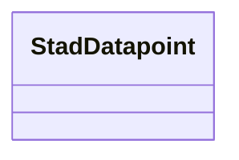

# Class: StadDatapoint


URI: [stad:Datapoint](http://purl.org/spatialai/stad/v2/core/Datapoint)





<!-- no inheritance hierarchy -->


## Slots

| Name | Cardinality and Range | Description | Inheritance | Occurrences |
| ---  | --- | --- | --- | --- |


## Usages

| used by | used in | type | used |
| ---  | --- | --- | --- |
| [HttpW3id.orgSawgraphV1Me-egad#EGAD-AggregatePFAS-Concentration](../classes/HttpW3id.orgSawgraphV1Me-egad#EGAD-AggregatePFAS-Concentration.md) | [http___w3id.org_sawgraph_v1_me_egad#methodDetectionLimit](../slots/http___w3id.org_sawgraph_v1_me_egad#methodDetectionLimit.md) | any_of[range] | [StadDatapoint](../classes/StadDatapoint.md) |
| [HttpW3id.orgSawgraphV1Me-egad#EGAD-AggregatePFAS-Concentration](../classes/HttpW3id.orgSawgraphV1Me-egad#EGAD-AggregatePFAS-Concentration.md) | [http___w3id.org_sawgraph_v1_me_egad#reportingLimit](../slots/http___w3id.org_sawgraph_v1_me_egad#reportingLimit.md) | any_of[range] | [StadDatapoint](../classes/StadDatapoint.md) |
| [HttpW3id.orgSawgraphV1Me-egad#EGAD-PFAS-Observation](../classes/HttpW3id.orgSawgraphV1Me-egad#EGAD-PFAS-Observation.md) | [coso_hasResult](../slots/coso_hasResult.md) | any_of[range] | [StadDatapoint](../classes/StadDatapoint.md) |
| [HttpW3id.orgSawgraphV1Me-egad#EGAD-SinglePFAS-Concentration](../classes/HttpW3id.orgSawgraphV1Me-egad#EGAD-SinglePFAS-Concentration.md) | [http___w3id.org_sawgraph_v1_me_egad#methodDetectionLimit](../slots/http___w3id.org_sawgraph_v1_me_egad#methodDetectionLimit.md) | any_of[range] | [StadDatapoint](../classes/StadDatapoint.md) |
| [HttpW3id.orgSawgraphV1Me-egad#EGAD-SinglePFAS-Concentration](../classes/HttpW3id.orgSawgraphV1Me-egad#EGAD-SinglePFAS-Concentration.md) | [http___w3id.org_sawgraph_v1_me_egad#reportingLimit](../slots/http___w3id.org_sawgraph_v1_me_egad#reportingLimit.md) | any_of[range] | [StadDatapoint](../classes/StadDatapoint.md) |
| [HttpW3id.orgSawgraphV1Us-wqp#Observation](../classes/HttpW3id.orgSawgraphV1Us-wqp#Observation.md) | [coso_hasResult](../slots/coso_hasResult.md) | any_of[range] | [StadDatapoint](../classes/StadDatapoint.md) |
| [MeEgadEGAD-AggregatePFAS-Concentration](../classes/MeEgadEGAD-AggregatePFAS-Concentration.md) | [me_egad_methodDetectionLimit](../slots/me_egad_methodDetectionLimit.md) | any_of[range] | [StadDatapoint](../classes/StadDatapoint.md) |
| [MeEgadEGAD-AggregatePFAS-Concentration](../classes/MeEgadEGAD-AggregatePFAS-Concentration.md) | [me_egad_reportingLimit](../slots/me_egad_reportingLimit.md) | any_of[range] | [StadDatapoint](../classes/StadDatapoint.md) |
| [MeEgadEGAD-PFAS-Observation](../classes/MeEgadEGAD-PFAS-Observation.md) | [coso_hasResult](../slots/coso_hasResult.md) | any_of[range] | [StadDatapoint](../classes/StadDatapoint.md) |
| [MeEgadEGAD-SinglePFAS-Concentration](../classes/MeEgadEGAD-SinglePFAS-Concentration.md) | [me_egad_methodDetectionLimit](../slots/me_egad_methodDetectionLimit.md) | any_of[range] | [StadDatapoint](../classes/StadDatapoint.md) |
| [MeEgadEGAD-SinglePFAS-Concentration](../classes/MeEgadEGAD-SinglePFAS-Concentration.md) | [me_egad_reportingLimit](../slots/me_egad_reportingLimit.md) | any_of[range] | [StadDatapoint](../classes/StadDatapoint.md) |


## LinkML Source

<!-- TODO: investigate https://stackoverflow.com/questions/37606292/how-to-create-tabbed-code-blocks-in-mkdocs-or-sphinx -->

### Direct

<details>

```yaml
name: stad_Datapoint
from_schema: okns:sawgraph-kg
rank: 1000
class_uri: stad:Datapoint

```
</details>

### Induced

<details>

```yaml
name: stad_Datapoint
from_schema: okns:sawgraph-kg
rank: 1000
class_uri: stad:Datapoint

```
</details>