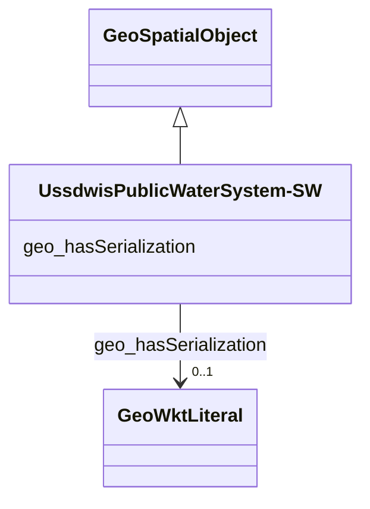

# Class: TODO -- what's a good name for this class (type)? (ussdwis_PublicWaterSystem-SW)


_No type description provided_


URI: [ussdwis:PublicWaterSystem-SW](http://sawgraph.spatialai.org/v1/us-sdwis#PublicWaterSystem-SW)





## Inheritance
* [GeoSpatialObject](../classes/GeoSpatialObject.md)
    * **UssdwisPublicWaterSystem-SW**


## Slots

| Name | Cardinality and Range | Description | Inheritance |
| ---  | --- | --- | --- |
| [geo_hasSerialization](../slots/geo_hasSerialization.md) | 0..1 <br/> [GeoWktLiteral](../classes/GeoWktLiteral.md) | No slot description provided | [GeoSpatialObject](../classes/GeoSpatialObject.md) |


## TODOs

* TODO -- Todos for this class go here
* or you can delete the todos
* if you think the class is perfect.

## Identifier and Mapping Information


### Schema Source


* from schema: sawgraph-kg


## Mappings

| Mapping Type | Mapped Value |
| ---  | ---  |
| self | ussdwis:PublicWaterSystem-SW |
| native | sawgraph-kg/:UssdwisPublicWaterSystem-SW |


## LinkML Source

<!-- TODO: investigate https://stackoverflow.com/questions/37606292/how-to-create-tabbed-code-blocks-in-mkdocs-or-sphinx -->

### Direct

<details>
```yaml
name: ussdwis_PublicWaterSystem-SW
description: No type description provided
title: TODO -- what's a good name for this class (type)?
todos:
- TODO -- Todos for this class go here
- or you can delete the todos
- if you think the class is perfect.
notes:
- Class with 1891 occurences.
from_schema: sawgraph-kg
rank: 1000
is_a: geo_SpatialObject
class_uri: ussdwis:PublicWaterSystem-SW

```
</details>

### Induced

<details>
```yaml
name: ussdwis_PublicWaterSystem-SW
description: No type description provided
title: TODO -- what's a good name for this class (type)?
todos:
- TODO -- Todos for this class go here
- or you can delete the todos
- if you think the class is perfect.
notes:
- Class with 1891 occurences.
from_schema: sawgraph-kg
rank: 1000
is_a: geo_SpatialObject
attributes:
  geo_hasSerialization:
    name: geo_hasSerialization
    description: No slot description provided
    title: No slot description provided
    todos:
    - TODO -- Todos for this slot go here
    - or you can delete the todos
    - if you think the class is perfect.
    comments:
    - 379496 occurrences with untyped subjects and object type http://www.opengis.net/ont/geosparql#wktLiteral.
    - 105691 occurrences with subject type geo_SpatialObject and object type geo_wktLiteral.
    - 8389 occurrences with subject type geo_Geometry and object type geo_wktLiteral.
    examples:
    - value: http://sawgraph.spatialai.org/v1/il-isgs-data#d.ISGS-Well.geometry.120010000300
        geo:hasSerialization POINT(-90.91358699999999 40.079858)
    - value: http://sawgraph.spatialai.org/v1/me-egad-data#egad.site.geometry.100145
        geo:hasSerialization POINT (-68.07989292 46.73707407)
    - value: http://sawgraph.spatialai.org/v1/me-egad-data#samplePoint.geometry.100410
        geo:hasSerialization POINT (-69.2930289 44.5876092)
    from_schema: sawgraph-kg
    rank: 1000
    slot_uri: geo:hasSerialization
    alias: geo_hasSerialization
    owner: ussdwis_PublicWaterSystem-SW
    domain_of:
    - geo_Geometry
    - geo_SpatialObject
    range: geo_wktLiteral
class_uri: ussdwis:PublicWaterSystem-SW

```
</details>