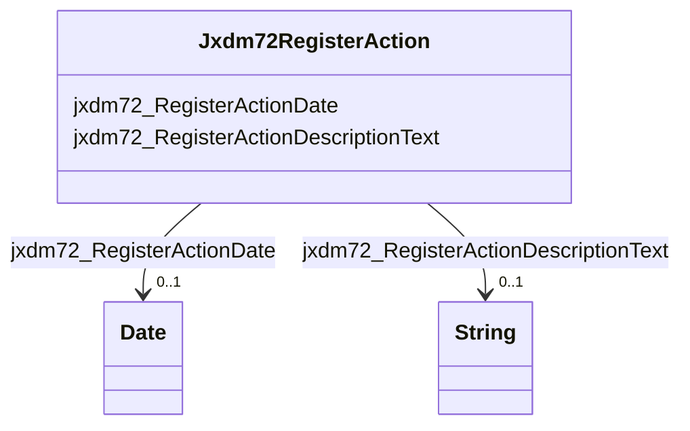

# Class: No class (type) name specified (jxdm72_RegisterAction)


_No class (type) description specified_


URI: [jxdm72:RegisterAction](http://release.niem.gov/niem/domains/jxdm/7.2/#RegisterAction)





<!-- no inheritance hierarchy -->


## Slots

| Name | Cardinality and Range | Description | Inheritance |
| ---  | --- | --- | --- |
| [jxdm72_RegisterActionDate](../slots/jxdm72_RegisterActionDate.md) | 0..1 <br/> [xsd:date](xsd:date) | No slot (predicate) description specified <br/> 421518 occurrences with subject type jxdm72_RegisterAction and object type date.<br/>19671603 occurrences with untyped subjects and object type date. | direct |
| [jxdm72_RegisterActionDescriptionText](../slots/jxdm72_RegisterActionDescriptionText.md) | 0..1 <br/> [xsd:string](xsd:string) | No slot (predicate) description specified <br/> 561095 occurrences with subject type jxdm72_RegisterAction and object type string.<br/>19671841 occurrences with untyped subjects and object type string. | direct |


## Identifier and Mapping Information


## Mappings

| Mapping Type | Mapped Value |
| ---  | ---  |
| self | jxdm72:RegisterAction |
| native | scales-kg-new/:Jxdm72RegisterAction |


## LinkML Source

<!-- TODO: investigate https://stackoverflow.com/questions/37606292/how-to-create-tabbed-code-blocks-in-mkdocs-or-sphinx -->

### Direct

<details>
```yaml
name: jxdm72_RegisterAction
conforms_to: No schema conformance document specified
description: No class (type) description specified
title: No class (type) name specified
notes:
- Class with 94929 occurrences.
rank: 1000
slots:
- jxdm72_RegisterActionDate
- jxdm72_RegisterActionDescriptionText
class_uri: jxdm72:RegisterAction

```
</details>

### Induced

<details>
```yaml
name: jxdm72_RegisterAction
conforms_to: No schema conformance document specified
description: No class (type) description specified
title: No class (type) name specified
notes:
- Class with 94929 occurrences.
rank: 1000
attributes:
  jxdm72_RegisterActionDate:
    name: jxdm72_RegisterActionDate
    description: No slot (predicate) description specified
    comments:
    - 421518 occurrences with subject type jxdm72_RegisterAction and object type date.
    - 19671603 occurrences with untyped subjects and object type date.
    examples:
    - description: jxdm72_RegisterAction → date
      object:
        example_object: '2002-02-01'
        example_object_type: date
        example_predicate: jxdm72:RegisterActionDate
        example_subject: scales/Docket/100271
        example_subject_type: jxdm72_RegisterAction
    - description: None → date
      object:
        example_object: '2016-02-02'
        example_object_type: date
        example_predicate: jxdm72:RegisterActionDate
        example_subject: scales/DocketEntry/almd;;1:16-cr-00020_de0
        example_subject_type: None
    from_schema: scales-kg-new
    rank: 1000
    slot_uri: jxdm72:RegisterActionDate
    alias: jxdm72_RegisterActionDate
    owner: jxdm72_RegisterAction
    domain_of:
    - jxdm72_RegisterAction
    range: date
  jxdm72_RegisterActionDescriptionText:
    name: jxdm72_RegisterActionDescriptionText
    description: No slot (predicate) description specified
    comments:
    - 561095 occurrences with subject type jxdm72_RegisterAction and object type string.
    - 19671841 occurrences with untyped subjects and object type string.
    examples:
    - description: jxdm72_RegisterAction → string
      object:
        example_object: BOND FORFEITURE JUDGMENT CALENDAR on 2002-09-24 00:00:00.000
        example_object_type: string
        example_predicate: jxdm72:RegisterActionDescriptionText
        example_subject: scales/Docket/100271
        example_subject_type: jxdm72_RegisterAction
    - description: None → string
      object:
        example_object: 'INDICTMENT as to 01C9DB7 (1) count(s) 1. FORFEITURE ALLEGATION.
          (cb, ) Modified on 10/6/2016 to strike forfeiture allegation pursuant to
          order this date. (ajr, ). (Entered: 02/04/2016)'
        example_object_type: string
        example_predicate: jxdm72:RegisterActionDescriptionText
        example_subject: scales/DocketEntry/almd;;1:16-cr-00020_de0
        example_subject_type: None
    from_schema: scales-kg-new
    rank: 1000
    slot_uri: jxdm72:RegisterActionDescriptionText
    alias: jxdm72_RegisterActionDescriptionText
    owner: jxdm72_RegisterAction
    domain_of:
    - jxdm72_RegisterAction
    range: string
class_uri: jxdm72:RegisterAction

```
</details>