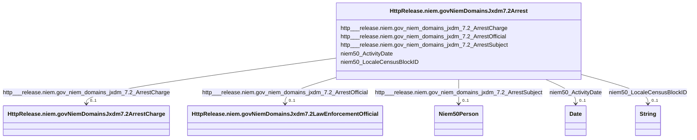

# Class: No class (type) name specified (http___release.niem.gov_niem_domains_jxdm_7.2_Arrest)


_No class (type) description specified_


This class occurs 83347 times.


URI: [http://release.niem.gov/niem/domains/jxdm/7.2/Arrest](http://release.niem.gov/niem/domains/jxdm/7.2/Arrest)





<!-- no inheritance hierarchy -->


## Slots

| Name | Cardinality and Range | Description | Inheritance | Occurrences |
| ---  | --- | --- | --- | --- |
| [http___release.niem.gov_niem_domains_jxdm_7.2_ArrestOfficial](../slots/http___release.niem.gov_niem_domains_jxdm_7.2_ArrestOfficial.md) | 0..1 <br/> [HttpRelease.niem.govNiemDomainsJxdm7.2LawEnforcementOfficial](../classes/HttpRelease.niem.govNiemDomainsJxdm7.2LawEnforcementOfficial.md) | No slot (predicate) description specified <br/>  | direct | 84716 |
| [niem50_LocaleCensusBlockID](../slots/niem50_LocaleCensusBlockID.md) | 0..1 <br/> [xsd:string](http://www.w3.org/2001/XMLSchema#string) | No slot (predicate) description specified <br/>  | direct | 71598 |
| [http___release.niem.gov_niem_domains_jxdm_7.2_ArrestSubject](../slots/http___release.niem.gov_niem_domains_jxdm_7.2_ArrestSubject.md) | 0..1 <br/> [Niem50Person](../classes/Niem50Person.md) | No slot (predicate) description specified <br/>  | direct | 83347 |
| [http___release.niem.gov_niem_domains_jxdm_7.2_ArrestCharge](../slots/http___release.niem.gov_niem_domains_jxdm_7.2_ArrestCharge.md) | 0..1 <br/> [HttpRelease.niem.govNiemDomainsJxdm7.2ArrestCharge](../classes/HttpRelease.niem.govNiemDomainsJxdm7.2ArrestCharge.md) | No slot (predicate) description specified <br/>  | direct | 83347 |
| [niem50_ActivityDate](../slots/niem50_ActivityDate.md) | 0..1 <br/> [xsd:date](http://www.w3.org/2001/XMLSchema#date) | No slot (predicate) description specified <br/>  | direct | 84279 |


## LinkML Source

<!-- TODO: investigate https://stackoverflow.com/questions/37606292/how-to-create-tabbed-code-blocks-in-mkdocs-or-sphinx -->

### Direct

<details>

```yaml
name: http___release.niem.gov_niem_domains_jxdm_7.2_Arrest
conforms_to: No schema conformance document specified
annotations:
  count:
    tag: count
    value: 83347
description: No class (type) description specified
title: No class (type) name specified
from_schema: scales-kg
rank: 1000
slots:
- http___release.niem.gov_niem_domains_jxdm_7.2_ArrestOfficial
- niem50_LocaleCensusBlockID
- http___release.niem.gov_niem_domains_jxdm_7.2_ArrestSubject
- http___release.niem.gov_niem_domains_jxdm_7.2_ArrestCharge
- niem50_ActivityDate
slot_usage:
  http___release.niem.gov_niem_domains_jxdm_7.2_ArrestCharge:
    name: http___release.niem.gov_niem_domains_jxdm_7.2_ArrestCharge
    annotations:
      http___release.niem.gov_niem_domains_jxdm_7.2_ArrestCharge:
        tag: http___release.niem.gov_niem_domains_jxdm_7.2_ArrestCharge
        value: 83347
  http___release.niem.gov_niem_domains_jxdm_7.2_ArrestOfficial:
    name: http___release.niem.gov_niem_domains_jxdm_7.2_ArrestOfficial
    annotations:
      http___release.niem.gov_niem_domains_jxdm_7.2_LawEnforcementOfficial:
        tag: http___release.niem.gov_niem_domains_jxdm_7.2_LawEnforcementOfficial
        value: 84716
  http___release.niem.gov_niem_domains_jxdm_7.2_ArrestSubject:
    name: http___release.niem.gov_niem_domains_jxdm_7.2_ArrestSubject
    annotations:
      niem50_Person:
        tag: niem50_Person
        value: 83347
  niem50_ActivityDate:
    name: niem50_ActivityDate
    annotations:
      date:
        tag: date
        value: 84279
  niem50_LocaleCensusBlockID:
    name: niem50_LocaleCensusBlockID
    annotations:
      string:
        tag: string
        value: 71598
class_uri: http://release.niem.gov/niem/domains/jxdm/7.2/Arrest

```
</details>

### Induced

<details>

```yaml
name: http___release.niem.gov_niem_domains_jxdm_7.2_Arrest
conforms_to: No schema conformance document specified
annotations:
  count:
    tag: count
    value: 83347
description: No class (type) description specified
title: No class (type) name specified
from_schema: scales-kg
rank: 1000
slot_usage:
  http___release.niem.gov_niem_domains_jxdm_7.2_ArrestCharge:
    name: http___release.niem.gov_niem_domains_jxdm_7.2_ArrestCharge
    annotations:
      http___release.niem.gov_niem_domains_jxdm_7.2_ArrestCharge:
        tag: http___release.niem.gov_niem_domains_jxdm_7.2_ArrestCharge
        value: 83347
  http___release.niem.gov_niem_domains_jxdm_7.2_ArrestOfficial:
    name: http___release.niem.gov_niem_domains_jxdm_7.2_ArrestOfficial
    annotations:
      http___release.niem.gov_niem_domains_jxdm_7.2_LawEnforcementOfficial:
        tag: http___release.niem.gov_niem_domains_jxdm_7.2_LawEnforcementOfficial
        value: 84716
  http___release.niem.gov_niem_domains_jxdm_7.2_ArrestSubject:
    name: http___release.niem.gov_niem_domains_jxdm_7.2_ArrestSubject
    annotations:
      niem50_Person:
        tag: niem50_Person
        value: 83347
  niem50_ActivityDate:
    name: niem50_ActivityDate
    annotations:
      date:
        tag: date
        value: 84279
  niem50_LocaleCensusBlockID:
    name: niem50_LocaleCensusBlockID
    annotations:
      string:
        tag: string
        value: 71598
attributes:
  http___release.niem.gov_niem_domains_jxdm_7.2_ArrestOfficial:
    name: http___release.niem.gov_niem_domains_jxdm_7.2_ArrestOfficial
    annotations:
      http___release.niem.gov_niem_domains_jxdm_7.2_LawEnforcementOfficial:
        tag: http___release.niem.gov_niem_domains_jxdm_7.2_LawEnforcementOfficial
        value: 84716
    description: No slot (predicate) description specified
    examples:
    - object:
        example_object: scales:PoliceOfficer/ga-atlanta-pd-4371
        example_object_type: http___release.niem.gov_niem_domains_jxdm_7.2_LawEnforcementOfficial
        example_predicate: http://release.niem.gov/niem/domains/jxdm/7.2/ArrestOfficial
        example_subject: scales:Arrest/ga-atlanta-pd-100720495
        example_subject_type: http___release.niem.gov_niem_domains_jxdm_7.2_Arrest
    from_schema: scales-kg
    rank: 1000
    slot_uri: http://release.niem.gov/niem/domains/jxdm/7.2/ArrestOfficial
    alias: http___release.niem.gov_niem_domains_jxdm_7.2_ArrestOfficial
    owner: http___release.niem.gov_niem_domains_jxdm_7.2_Arrest
    domain_of:
    - http___release.niem.gov_niem_domains_jxdm_7.2_Arrest
    range: http___release.niem.gov_niem_domains_jxdm_7.2_LawEnforcementOfficial
  niem50_LocaleCensusBlockID:
    name: niem50_LocaleCensusBlockID
    annotations:
      string:
        tag: string
        value: 71598
    description: No slot (predicate) description specified
    examples:
    - object:
        example_object: '131210005021'
        example_object_type: string
        example_predicate: niem50:LocaleCensusBlockID
        example_subject: scales:Arrest/ga-atlanta-pd-100720495
        example_subject_type: http___release.niem.gov_niem_domains_jxdm_7.2_Arrest
    from_schema: scales-kg
    rank: 1000
    slot_uri: niem50:LocaleCensusBlockID
    alias: niem50_LocaleCensusBlockID
    owner: http___release.niem.gov_niem_domains_jxdm_7.2_Arrest
    domain_of:
    - http___release.niem.gov_niem_domains_jxdm_7.2_Arrest
    range: string
  http___release.niem.gov_niem_domains_jxdm_7.2_ArrestSubject:
    name: http___release.niem.gov_niem_domains_jxdm_7.2_ArrestSubject
    annotations:
      niem50_Person:
        tag: niem50_Person
        value: 83347
    description: No slot (predicate) description specified
    examples:
    - object:
        example_object: scales:ArrestSubject/ga-atlanta-pd-100720495
        example_object_type: niem50_Person
        example_predicate: http://release.niem.gov/niem/domains/jxdm/7.2/ArrestSubject
        example_subject: scales:Arrest/ga-atlanta-pd-100720495
        example_subject_type: http___release.niem.gov_niem_domains_jxdm_7.2_Arrest
    from_schema: scales-kg
    rank: 1000
    slot_uri: http://release.niem.gov/niem/domains/jxdm/7.2/ArrestSubject
    alias: http___release.niem.gov_niem_domains_jxdm_7.2_ArrestSubject
    owner: http___release.niem.gov_niem_domains_jxdm_7.2_Arrest
    domain_of:
    - http___release.niem.gov_niem_domains_jxdm_7.2_Arrest
    range: niem50_Person
  http___release.niem.gov_niem_domains_jxdm_7.2_ArrestCharge:
    name: http___release.niem.gov_niem_domains_jxdm_7.2_ArrestCharge
    annotations:
      http___release.niem.gov_niem_domains_jxdm_7.2_ArrestCharge:
        tag: http___release.niem.gov_niem_domains_jxdm_7.2_ArrestCharge
        value: 83347
    description: No slot (predicate) description specified
    examples:
    - object:
        example_object: scales:ArrestCharge/ga-atlanta-pd-100720495
        example_object_type: http___release.niem.gov_niem_domains_jxdm_7.2_ArrestCharge
        example_predicate: http://release.niem.gov/niem/domains/jxdm/7.2/ArrestCharge
        example_subject: scales:Arrest/ga-atlanta-pd-100720495
        example_subject_type: http___release.niem.gov_niem_domains_jxdm_7.2_Arrest
    from_schema: scales-kg
    rank: 1000
    slot_uri: http://release.niem.gov/niem/domains/jxdm/7.2/ArrestCharge
    alias: http___release.niem.gov_niem_domains_jxdm_7.2_ArrestCharge
    owner: http___release.niem.gov_niem_domains_jxdm_7.2_Arrest
    domain_of:
    - http___release.niem.gov_niem_domains_jxdm_7.2_Arrest
    range: http___release.niem.gov_niem_domains_jxdm_7.2_ArrestCharge
  niem50_ActivityDate:
    name: niem50_ActivityDate
    annotations:
      date:
        tag: date
        value: 84279
    description: No slot (predicate) description specified
    examples:
    - object:
        example_object: '2018-04-18'
        example_object_type: date
        example_predicate: niem50:ActivityDate
        example_subject: scales:Booking/ga-fulton-01/10000019
        example_subject_type: http___release.niem.gov_niem_domains_jxdm_7.2_Booking
    - object:
        example_object: '2018-04-18'
        example_object_type: date
        example_predicate: niem50:ActivityDate
        example_subject: scales:Release/ga-fulton-01/10000019
        example_subject_type: http___release.niem.gov_niem_domains_jxdm_7.2_Release
    - object:
        example_object: '2014-05-03'
        example_object_type: date
        example_predicate: niem50:ActivityDate
        example_subject: scales:Arrest/ga-atlanta-pd-100720495
        example_subject_type: http___release.niem.gov_niem_domains_jxdm_7.2_Arrest
    from_schema: scales-kg
    rank: 1000
    slot_uri: niem50:ActivityDate
    alias: niem50_ActivityDate
    owner: http___release.niem.gov_niem_domains_jxdm_7.2_Arrest
    domain_of:
    - http___release.niem.gov_niem_domains_jxdm_7.2_Arrest
    - http___release.niem.gov_niem_domains_jxdm_7.2_Booking
    - http___release.niem.gov_niem_domains_jxdm_7.2_Release
    range: date
class_uri: http://release.niem.gov/niem/domains/jxdm/7.2/Arrest

```
</details>