# Class: No class (type) name specified (http___release.niem.gov_niem_domains_jxdm_7.2_ArrestCharge)


_No class (type) description specified_


This class occurs 83347 times.


URI: [http://release.niem.gov/niem/domains/jxdm/7.2/ArrestCharge](http://release.niem.gov/niem/domains/jxdm/7.2/ArrestCharge)

```mermaid
 classDiagram
    class HttpRelease.niem.govNiemDomainsJxdm7.2ArrestCharge
    click HttpRelease.niem.govNiemDomainsJxdm7.2ArrestCharge href "../HttpRelease.niem.govNiemDomainsJxdm7.2ArrestCharge"
      HttpRelease.niem.govNiemDomainsJxdm7.2ArrestCharge : http___fbi.gov_cjis_nibrs_2023.0_NIBRSReportCategoryCode
        
          
    
    
    HttpRelease.niem.govNiemDomainsJxdm7.2ArrestCharge --> "0..1" String : http___fbi.gov_cjis_nibrs_2023.0_NIBRSReportCategoryCode
    click String href "../String"

        
      HttpRelease.niem.govNiemDomainsJxdm7.2ArrestCharge : http___fbi.gov_cjis_nibrs_2023.0_OffenseUCRCode
        
          
    
    
    HttpRelease.niem.govNiemDomainsJxdm7.2ArrestCharge --> "0..1" String : http___fbi.gov_cjis_nibrs_2023.0_OffenseUCRCode
    click String href "../String"

        
      HttpRelease.niem.govNiemDomainsJxdm7.2ArrestCharge : http___release.niem.gov_niem_domains_jxdm_7.2_ChargeDispositionCategoryText
        
          
    
    
    HttpRelease.niem.govNiemDomainsJxdm7.2ArrestCharge --> "0..1" String : http___release.niem.gov_niem_domains_jxdm_7.2_ChargeDispositionCategoryText
    click String href "../String"

        
      HttpRelease.niem.govNiemDomainsJxdm7.2ArrestCharge : http___release.niem.gov_niem_domains_jxdm_7.2_ChargeSeverityLevelCode
        
          
    
    
    HttpRelease.niem.govNiemDomainsJxdm7.2ArrestCharge --> "0..1" String : http___release.niem.gov_niem_domains_jxdm_7.2_ChargeSeverityLevelCode
    click String href "../String"

        
      HttpRelease.niem.govNiemDomainsJxdm7.2ArrestCharge : http___release.niem.gov_niem_domains_jxdm_7.2_ChargeText
        
          
    
    
    HttpRelease.niem.govNiemDomainsJxdm7.2ArrestCharge --> "0..1" String : http___release.niem.gov_niem_domains_jxdm_7.2_ChargeText
    click String href "../String"

        
      
```





<!-- no inheritance hierarchy -->


## Slots

| Name | Cardinality and Range | Description | Inheritance | Occurrences |
| ---  | --- | --- | --- | --- |
| [http___release.niem.gov_niem_domains_jxdm_7.2_ChargeSeverityLevelCode](../slots/http___release.niem.gov_niem_domains_jxdm_7.2_ChargeSeverityLevelCode.md) | 0..1 <br/> [xsd:string](http://www.w3.org/2001/XMLSchema#string) | No slot (predicate) description specified <br/>  | direct | 81232 |
| [http___fbi.gov_cjis_nibrs_2023.0_NIBRSReportCategoryCode](../slots/http___fbi.gov_cjis_nibrs_2023.0_NIBRSReportCategoryCode.md) | 0..1 <br/> [xsd:string](http://www.w3.org/2001/XMLSchema#string) | No slot (predicate) description specified <br/>  | direct | 39440 |
| [http___fbi.gov_cjis_nibrs_2023.0_OffenseUCRCode](../slots/http___fbi.gov_cjis_nibrs_2023.0_OffenseUCRCode.md) | 0..1 <br/> [xsd:string](http://www.w3.org/2001/XMLSchema#string) | No slot (predicate) description specified <br/>  | direct | 76331 |
| [http___release.niem.gov_niem_domains_jxdm_7.2_ChargeDispositionCategoryText](../slots/http___release.niem.gov_niem_domains_jxdm_7.2_ChargeDispositionCategoryText.md) | 0..1 <br/> [xsd:string](http://www.w3.org/2001/XMLSchema#string) | No slot (predicate) description specified <br/>  | direct | 94272 |
| [http___release.niem.gov_niem_domains_jxdm_7.2_ChargeText](../slots/http___release.niem.gov_niem_domains_jxdm_7.2_ChargeText.md) | 0..1 <br/> [xsd:string](http://www.w3.org/2001/XMLSchema#string) | No slot (predicate) description specified <br/>  | direct | 126407 |


## Usages

| used by | used in | type | used |
| ---  | --- | --- | --- |
| [HttpRelease.niem.govNiemDomainsJxdm7.2Arrest](../classes/HttpRelease.niem.govNiemDomainsJxdm7.2Arrest.md) | [HttpRelease.niem.govNiemDomainsJxdm7.2ArrestCharge](../classes/HttpRelease.niem.govNiemDomainsJxdm7.2ArrestCharge.md) | range | [HttpRelease.niem.govNiemDomainsJxdm7.2ArrestCharge](../classes/HttpRelease.niem.govNiemDomainsJxdm7.2ArrestCharge.md) |


## LinkML Source

<!-- TODO: investigate https://stackoverflow.com/questions/37606292/how-to-create-tabbed-code-blocks-in-mkdocs-or-sphinx -->

### Direct

<details>

```yaml
name: http___release.niem.gov_niem_domains_jxdm_7.2_ArrestCharge
conforms_to: No schema conformance document specified
annotations:
  count:
    tag: count
    value: 83347
description: No class (type) description specified
title: No class (type) name specified
from_schema: scales-kg
rank: 1000
slots:
- http___release.niem.gov_niem_domains_jxdm_7.2_ChargeSeverityLevelCode
- http___fbi.gov_cjis_nibrs_2023.0_NIBRSReportCategoryCode
- http___fbi.gov_cjis_nibrs_2023.0_OffenseUCRCode
- http___release.niem.gov_niem_domains_jxdm_7.2_ChargeDispositionCategoryText
- http___release.niem.gov_niem_domains_jxdm_7.2_ChargeText
slot_usage:
  http___fbi.gov_cjis_nibrs_2023.0_NIBRSReportCategoryCode:
    name: http___fbi.gov_cjis_nibrs_2023.0_NIBRSReportCategoryCode
    annotations:
      string:
        tag: string
        value: 39440
  http___fbi.gov_cjis_nibrs_2023.0_OffenseUCRCode:
    name: http___fbi.gov_cjis_nibrs_2023.0_OffenseUCRCode
    annotations:
      string:
        tag: string
        value: 76331
  http___release.niem.gov_niem_domains_jxdm_7.2_ChargeDispositionCategoryText:
    name: http___release.niem.gov_niem_domains_jxdm_7.2_ChargeDispositionCategoryText
    annotations:
      string:
        tag: string
        value: 94272
  http___release.niem.gov_niem_domains_jxdm_7.2_ChargeSeverityLevelCode:
    name: http___release.niem.gov_niem_domains_jxdm_7.2_ChargeSeverityLevelCode
    annotations:
      string:
        tag: string
        value: 81232
  http___release.niem.gov_niem_domains_jxdm_7.2_ChargeText:
    name: http___release.niem.gov_niem_domains_jxdm_7.2_ChargeText
    annotations:
      string:
        tag: string
        value: 126407
class_uri: http://release.niem.gov/niem/domains/jxdm/7.2/ArrestCharge

```
</details>

### Induced

<details>

```yaml
name: http___release.niem.gov_niem_domains_jxdm_7.2_ArrestCharge
conforms_to: No schema conformance document specified
annotations:
  count:
    tag: count
    value: 83347
description: No class (type) description specified
title: No class (type) name specified
from_schema: scales-kg
rank: 1000
slot_usage:
  http___fbi.gov_cjis_nibrs_2023.0_NIBRSReportCategoryCode:
    name: http___fbi.gov_cjis_nibrs_2023.0_NIBRSReportCategoryCode
    annotations:
      string:
        tag: string
        value: 39440
  http___fbi.gov_cjis_nibrs_2023.0_OffenseUCRCode:
    name: http___fbi.gov_cjis_nibrs_2023.0_OffenseUCRCode
    annotations:
      string:
        tag: string
        value: 76331
  http___release.niem.gov_niem_domains_jxdm_7.2_ChargeDispositionCategoryText:
    name: http___release.niem.gov_niem_domains_jxdm_7.2_ChargeDispositionCategoryText
    annotations:
      string:
        tag: string
        value: 94272
  http___release.niem.gov_niem_domains_jxdm_7.2_ChargeSeverityLevelCode:
    name: http___release.niem.gov_niem_domains_jxdm_7.2_ChargeSeverityLevelCode
    annotations:
      string:
        tag: string
        value: 81232
  http___release.niem.gov_niem_domains_jxdm_7.2_ChargeText:
    name: http___release.niem.gov_niem_domains_jxdm_7.2_ChargeText
    annotations:
      string:
        tag: string
        value: 126407
attributes:
  http___release.niem.gov_niem_domains_jxdm_7.2_ChargeSeverityLevelCode:
    name: http___release.niem.gov_niem_domains_jxdm_7.2_ChargeSeverityLevelCode
    annotations:
      string:
        tag: string
        value: 81232
    description: No slot (predicate) description specified
    examples:
    - object:
        example_object: FC
        example_object_type: string
        example_predicate: http://release.niem.gov/niem/domains/jxdm/7.2/ChargeSeverityLevelCode
        example_subject: scales:ArrestCharge/ga-atlanta-pd-100830802
        example_subject_type: http___release.niem.gov_niem_domains_jxdm_7.2_ArrestCharge
    - object:
        example_object: Misdemeanor
        example_object_type: string
        example_predicate: http://release.niem.gov/niem/domains/jxdm/7.2/ChargeSeverityLevelCode
        example_subject: scales:Charge/fulton-01-10000019
        example_subject_type: http___release.niem.gov_niem_domains_jxdm_7.2_Charge
    from_schema: scales-kg
    rank: 1000
    slot_uri: http://release.niem.gov/niem/domains/jxdm/7.2/ChargeSeverityLevelCode
    alias: http___release.niem.gov_niem_domains_jxdm_7.2_ChargeSeverityLevelCode
    owner: http___release.niem.gov_niem_domains_jxdm_7.2_ArrestCharge
    domain_of:
    - http___release.niem.gov_niem_domains_jxdm_7.2_ArrestCharge
    - http___release.niem.gov_niem_domains_jxdm_7.2_Charge
    range: string
  http___fbi.gov_cjis_nibrs_2023.0_NIBRSReportCategoryCode:
    name: http___fbi.gov_cjis_nibrs_2023.0_NIBRSReportCategoryCode
    annotations:
      string:
        tag: string
        value: 39440
    description: No slot (predicate) description specified
    examples:
    - object:
        example_object: GROUP A INCIDENT REPORT
        example_object_type: string
        example_predicate: http://fbi.gov/cjis/nibrs/2023.0/NIBRSReportCategoryCode
        example_subject: scales:ArrestCharge/ga-atlanta-pd-101200863
        example_subject_type: http___release.niem.gov_niem_domains_jxdm_7.2_ArrestCharge
    from_schema: scales-kg
    rank: 1000
    slot_uri: http://fbi.gov/cjis/nibrs/2023.0/NIBRSReportCategoryCode
    alias: http___fbi.gov_cjis_nibrs_2023.0_NIBRSReportCategoryCode
    owner: http___release.niem.gov_niem_domains_jxdm_7.2_ArrestCharge
    domain_of:
    - http___release.niem.gov_niem_domains_jxdm_7.2_ArrestCharge
    range: string
  http___fbi.gov_cjis_nibrs_2023.0_OffenseUCRCode:
    name: http___fbi.gov_cjis_nibrs_2023.0_OffenseUCRCode
    annotations:
      string:
        tag: string
        value: 76331
    description: No slot (predicate) description specified
    examples:
    - object:
        example_object: LARCENY
        example_object_type: string
        example_predicate: http://fbi.gov/cjis/nibrs/2023.0/OffenseUCRCode
        example_subject: scales:ArrestCharge/ga-atlanta-pd-101200863
        example_subject_type: http___release.niem.gov_niem_domains_jxdm_7.2_ArrestCharge
    from_schema: scales-kg
    rank: 1000
    slot_uri: http://fbi.gov/cjis/nibrs/2023.0/OffenseUCRCode
    alias: http___fbi.gov_cjis_nibrs_2023.0_OffenseUCRCode
    owner: http___release.niem.gov_niem_domains_jxdm_7.2_ArrestCharge
    domain_of:
    - http___release.niem.gov_niem_domains_jxdm_7.2_ArrestCharge
    range: string
  http___release.niem.gov_niem_domains_jxdm_7.2_ChargeDispositionCategoryText:
    name: http___release.niem.gov_niem_domains_jxdm_7.2_ChargeDispositionCategoryText
    annotations:
      string:
        tag: string
        value: 94272
    description: No slot (predicate) description specified
    examples:
    - object:
        example_object: GF
        example_object_type: string
        example_predicate: http://release.niem.gov/niem/domains/jxdm/7.2/ChargeDispositionCategoryText
        example_subject: scales:ArrestCharge/ga-atlanta-pd-100720495
        example_subject_type: http___release.niem.gov_niem_domains_jxdm_7.2_ArrestCharge
    from_schema: scales-kg
    rank: 1000
    slot_uri: http://release.niem.gov/niem/domains/jxdm/7.2/ChargeDispositionCategoryText
    alias: http___release.niem.gov_niem_domains_jxdm_7.2_ChargeDispositionCategoryText
    owner: http___release.niem.gov_niem_domains_jxdm_7.2_ArrestCharge
    domain_of:
    - http___release.niem.gov_niem_domains_jxdm_7.2_ArrestCharge
    range: string
  http___release.niem.gov_niem_domains_jxdm_7.2_ChargeText:
    name: http___release.niem.gov_niem_domains_jxdm_7.2_ChargeText
    annotations:
      string:
        tag: string
        value: 126407
    description: No slot (predicate) description specified
    examples:
    - object:
        example_object: 26:7203 WILLFUL FAILURE TO FILE INCOME TAX RETURNS
        example_object_type: string
        example_predicate: http://release.niem.gov/niem/domains/jxdm/7.2/ChargeText
        example_subject: scales:/Charge/akd;;1:16-cr-00001_c0-1-3
        example_subject_type: http___release.niem.gov_niem_domains_jxdm_7.2_Charge
    - object:
        example_object: Entering Automobile
        example_object_type: string
        example_predicate: http://release.niem.gov/niem/domains/jxdm/7.2/ChargeText
        example_subject: scales:ArrestCharge/ga-atlanta-pd-100720495
        example_subject_type: http___release.niem.gov_niem_domains_jxdm_7.2_ArrestCharge
    from_schema: scales-kg
    rank: 1000
    slot_uri: http://release.niem.gov/niem/domains/jxdm/7.2/ChargeText
    alias: http___release.niem.gov_niem_domains_jxdm_7.2_ChargeText
    owner: http___release.niem.gov_niem_domains_jxdm_7.2_ArrestCharge
    domain_of:
    - http___release.niem.gov_niem_domains_jxdm_7.2_ArrestCharge
    - http___release.niem.gov_niem_domains_jxdm_7.2_Charge
    range: string
class_uri: http://release.niem.gov/niem/domains/jxdm/7.2/ArrestCharge

```
</details>