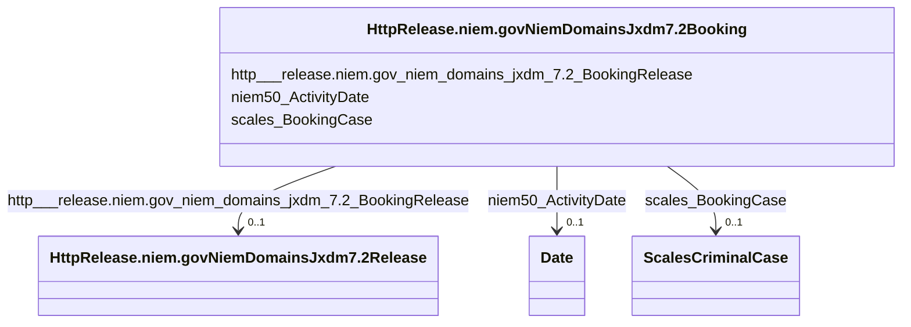

# Class: No class (type) name specified (http___release.niem.gov_niem_domains_jxdm_7.2_Booking)


_No class (type) description specified_


This class occurs 363466 times.


URI: [http://release.niem.gov/niem/domains/jxdm/7.2/Booking](http://release.niem.gov/niem/domains/jxdm/7.2/Booking)





<!-- no inheritance hierarchy -->


## Slots

| Name | Cardinality and Range | Description | Inheritance | Occurrences |
| ---  | --- | --- | --- | --- |
| [niem50_ActivityDate](../slots/niem50_ActivityDate.md) | 0..1 <br/> [xsd:date](http://www.w3.org/2001/XMLSchema#date) | No slot (predicate) description specified <br/>  | direct | 419406 |
| [http___release.niem.gov_niem_domains_jxdm_7.2_BookingRelease](../slots/http___release.niem.gov_niem_domains_jxdm_7.2_BookingRelease.md) | 0..1 <br/> [HttpRelease.niem.govNiemDomainsJxdm7.2Release](../classes/HttpRelease.niem.govNiemDomainsJxdm7.2Release.md) | No slot (predicate) description specified <br/>  | direct | 347084 |
| [scales_BookingCase](../slots/scales_BookingCase.md) | 0..1 <br/> [ScalesCriminalCase](../classes/ScalesCriminalCase.md) | No slot (predicate) description specified <br/>  | direct | 218359 |


## Usages

| used by | used in | type | used |
| ---  | --- | --- | --- |
| [HttpRelease.niem.govNiemDomainsJxdm7.2CaseDefendantParty](../classes/HttpRelease.niem.govNiemDomainsJxdm7.2CaseDefendantParty.md) | [http___release.niem.gov_niem_domains_jxdm_7.2_SubjectBooking](../slots/http___release.niem.gov_niem_domains_jxdm_7.2_SubjectBooking.md) | range | [HttpRelease.niem.govNiemDomainsJxdm7.2Booking](../classes/HttpRelease.niem.govNiemDomainsJxdm7.2Booking.md) |
| [HttpRelease.niem.govNiemDomainsJxdm7.2Charge](../classes/HttpRelease.niem.govNiemDomainsJxdm7.2Charge.md) | [http___release.niem.gov_niem_domains_jxdm_7.2_ChargeBooking](../slots/http___release.niem.gov_niem_domains_jxdm_7.2_ChargeBooking.md) | range | [HttpRelease.niem.govNiemDomainsJxdm7.2Booking](../classes/HttpRelease.niem.govNiemDomainsJxdm7.2Booking.md) |


## LinkML Source

<!-- TODO: investigate https://stackoverflow.com/questions/37606292/how-to-create-tabbed-code-blocks-in-mkdocs-or-sphinx -->

### Direct

<details>

```yaml
name: http___release.niem.gov_niem_domains_jxdm_7.2_Booking
conforms_to: No schema conformance document specified
annotations:
  count:
    tag: count
    value: 363466
description: No class (type) description specified
title: No class (type) name specified
from_schema: scales-kg
rank: 1000
slots:
- niem50_ActivityDate
- http___release.niem.gov_niem_domains_jxdm_7.2_BookingRelease
- scales_BookingCase
slot_usage:
  http___release.niem.gov_niem_domains_jxdm_7.2_BookingRelease:
    name: http___release.niem.gov_niem_domains_jxdm_7.2_BookingRelease
    annotations:
      http___release.niem.gov_niem_domains_jxdm_7.2_Release:
        tag: http___release.niem.gov_niem_domains_jxdm_7.2_Release
        value: 347084
  niem50_ActivityDate:
    name: niem50_ActivityDate
    annotations:
      date:
        tag: date
        value: 419406
  scales_BookingCase:
    name: scales_BookingCase
    annotations:
      scales_CriminalCase:
        tag: scales_CriminalCase
        value: 218359
class_uri: http://release.niem.gov/niem/domains/jxdm/7.2/Booking

```
</details>

### Induced

<details>

```yaml
name: http___release.niem.gov_niem_domains_jxdm_7.2_Booking
conforms_to: No schema conformance document specified
annotations:
  count:
    tag: count
    value: 363466
description: No class (type) description specified
title: No class (type) name specified
from_schema: scales-kg
rank: 1000
slot_usage:
  http___release.niem.gov_niem_domains_jxdm_7.2_BookingRelease:
    name: http___release.niem.gov_niem_domains_jxdm_7.2_BookingRelease
    annotations:
      http___release.niem.gov_niem_domains_jxdm_7.2_Release:
        tag: http___release.niem.gov_niem_domains_jxdm_7.2_Release
        value: 347084
  niem50_ActivityDate:
    name: niem50_ActivityDate
    annotations:
      date:
        tag: date
        value: 419406
  scales_BookingCase:
    name: scales_BookingCase
    annotations:
      scales_CriminalCase:
        tag: scales_CriminalCase
        value: 218359
attributes:
  niem50_ActivityDate:
    name: niem50_ActivityDate
    annotations:
      date:
        tag: date
        value: 419406
    description: No slot (predicate) description specified
    examples:
    - object:
        example_object: '2018-04-18'
        example_object_type: date
        example_predicate: niem50:ActivityDate
        example_subject: scales:Booking/ga-fulton-01/10000019
        example_subject_type: http___release.niem.gov_niem_domains_jxdm_7.2_Booking
    - object:
        example_object: '2018-04-18'
        example_object_type: date
        example_predicate: niem50:ActivityDate
        example_subject: scales:Release/ga-fulton-01/10000019
        example_subject_type: http___release.niem.gov_niem_domains_jxdm_7.2_Release
    - object:
        example_object: '2014-05-03'
        example_object_type: date
        example_predicate: niem50:ActivityDate
        example_subject: scales:Arrest/ga-atlanta-pd-100720495
        example_subject_type: http___release.niem.gov_niem_domains_jxdm_7.2_Arrest
    from_schema: scales-kg
    rank: 1000
    slot_uri: niem50:ActivityDate
    alias: niem50_ActivityDate
    owner: http___release.niem.gov_niem_domains_jxdm_7.2_Booking
    domain_of:
    - http___release.niem.gov_niem_domains_jxdm_7.2_Arrest
    - http___release.niem.gov_niem_domains_jxdm_7.2_Booking
    - http___release.niem.gov_niem_domains_jxdm_7.2_Release
    range: date
  http___release.niem.gov_niem_domains_jxdm_7.2_BookingRelease:
    name: http___release.niem.gov_niem_domains_jxdm_7.2_BookingRelease
    annotations:
      http___release.niem.gov_niem_domains_jxdm_7.2_Release:
        tag: http___release.niem.gov_niem_domains_jxdm_7.2_Release
        value: 347084
    description: No slot (predicate) description specified
    examples:
    - object:
        example_object: scales:Release/ga-fulton-01/10000019
        example_object_type: http___release.niem.gov_niem_domains_jxdm_7.2_Release
        example_predicate: http://release.niem.gov/niem/domains/jxdm/7.2/BookingRelease
        example_subject: scales:Booking/ga-fulton-01/10000019
        example_subject_type: http___release.niem.gov_niem_domains_jxdm_7.2_Booking
    from_schema: scales-kg
    rank: 1000
    slot_uri: http://release.niem.gov/niem/domains/jxdm/7.2/BookingRelease
    alias: http___release.niem.gov_niem_domains_jxdm_7.2_BookingRelease
    owner: http___release.niem.gov_niem_domains_jxdm_7.2_Booking
    domain_of:
    - http___release.niem.gov_niem_domains_jxdm_7.2_Booking
    range: http___release.niem.gov_niem_domains_jxdm_7.2_Release
  scales_BookingCase:
    name: scales_BookingCase
    annotations:
      scales_CriminalCase:
        tag: scales_CriminalCase
        value: 218359
    description: No slot (predicate) description specified
    examples:
    - object:
        example_object: scales:Case/ga-fulton-01-18CR000562G
        example_object_type: scales_CriminalCase
        example_predicate: scales:BookingCase
        example_subject: scales:Booking/ga-fulton-01/10000019
        example_subject_type: http___release.niem.gov_niem_domains_jxdm_7.2_Booking
    from_schema: scales-kg
    rank: 1000
    slot_uri: scales:BookingCase
    alias: scales_BookingCase
    owner: http___release.niem.gov_niem_domains_jxdm_7.2_Booking
    domain_of:
    - http___release.niem.gov_niem_domains_jxdm_7.2_Booking
    range: scales_CriminalCase
class_uri: http://release.niem.gov/niem/domains/jxdm/7.2/Booking

```
</details>