# Class: No class (type) name specified (http___release.niem.gov_niem_domains_jxdm_7.2_CaseDefendantParty)


_No class (type) description specified_


This class occurs 2949712 times.


URI: [http://release.niem.gov/niem/domains/jxdm/7.2/CaseDefendantParty](http://release.niem.gov/niem/domains/jxdm/7.2/CaseDefendantParty)

```mermaid
 classDiagram
    class HttpRelease.niem.govNiemDomainsJxdm7.2CaseDefendantParty
    click HttpRelease.niem.govNiemDomainsJxdm7.2CaseDefendantParty href "../HttpRelease.niem.govNiemDomainsJxdm7.2CaseDefendantParty"
      HttpRelease.niem.govNiemDomainsJxdm7.2CaseDefendantParty : http___release.niem.gov_niem_domains_jxdm_7.2_CaseDefenseAttorney
        
          
    
    
    HttpRelease.niem.govNiemDomainsJxdm7.2CaseDefendantParty --> "0..1" HttpRelease.niem.govNiemDomainsJxdm7.2CaseDefenseAttorney : http___release.niem.gov_niem_domains_jxdm_7.2_CaseDefenseAttorney
    click HttpRelease.niem.govNiemDomainsJxdm7.2CaseDefenseAttorney href "../HttpRelease.niem.govNiemDomainsJxdm7.2CaseDefenseAttorney"

        
      HttpRelease.niem.govNiemDomainsJxdm7.2CaseDefendantParty : http___release.niem.gov_niem_domains_jxdm_7.2_ParticipantRoleCategoryText
        
          
    
    
    HttpRelease.niem.govNiemDomainsJxdm7.2CaseDefendantParty --> "0..1" String : http___release.niem.gov_niem_domains_jxdm_7.2_ParticipantRoleCategoryText
    click String href "../String"

        
      HttpRelease.niem.govNiemDomainsJxdm7.2CaseDefendantParty : http___release.niem.gov_niem_domains_jxdm_7.2_PersonCharge
        
          
    
    
    HttpRelease.niem.govNiemDomainsJxdm7.2CaseDefendantParty --> "0..1" HttpRelease.niem.govNiemDomainsJxdm7.2Charge : http___release.niem.gov_niem_domains_jxdm_7.2_PersonCharge
    click HttpRelease.niem.govNiemDomainsJxdm7.2Charge href "../HttpRelease.niem.govNiemDomainsJxdm7.2Charge"

        
      HttpRelease.niem.govNiemDomainsJxdm7.2CaseDefendantParty : http___release.niem.gov_niem_domains_jxdm_7.2_PersonSexCode
        
          
    
    
    HttpRelease.niem.govNiemDomainsJxdm7.2CaseDefendantParty --> "0..1" String : http___release.niem.gov_niem_domains_jxdm_7.2_PersonSexCode
    click String href "../String"

        
      HttpRelease.niem.govNiemDomainsJxdm7.2CaseDefendantParty : http___release.niem.gov_niem_domains_jxdm_7.2_SubjectBooking
        
          
    
    
    HttpRelease.niem.govNiemDomainsJxdm7.2CaseDefendantParty --> "0..1" HttpRelease.niem.govNiemDomainsJxdm7.2Booking : http___release.niem.gov_niem_domains_jxdm_7.2_SubjectBooking
    click HttpRelease.niem.govNiemDomainsJxdm7.2Booking href "../HttpRelease.niem.govNiemDomainsJxdm7.2Booking"

        
      HttpRelease.niem.govNiemDomainsJxdm7.2CaseDefendantParty : niem50_EntityName
        
          
    
    
    HttpRelease.niem.govNiemDomainsJxdm7.2CaseDefendantParty --> "0..1" String : niem50_EntityName
    click String href "../String"

        
      HttpRelease.niem.govNiemDomainsJxdm7.2CaseDefendantParty : niem50_PersonFullName
        
          
    
    
    HttpRelease.niem.govNiemDomainsJxdm7.2CaseDefendantParty --> "0..1" String : niem50_PersonFullName
    click String href "../String"

        
      HttpRelease.niem.govNiemDomainsJxdm7.2CaseDefendantParty : niem50_PersonRaceText
        
          
    
    
    HttpRelease.niem.govNiemDomainsJxdm7.2CaseDefendantParty --> "0..1" String : niem50_PersonRaceText
    click String href "../String"

        
      HttpRelease.niem.govNiemDomainsJxdm7.2CaseDefendantParty : scales_hasExtraInfo
        
          
    
    
    HttpRelease.niem.govNiemDomainsJxdm7.2CaseDefendantParty --> "0..1" String : scales_hasExtraInfo
    click String href "../String"

        
      HttpRelease.niem.govNiemDomainsJxdm7.2CaseDefendantParty : scales_hasHighestOffenseLevelOpening
        
          
    
    
    HttpRelease.niem.govNiemDomainsJxdm7.2CaseDefendantParty --> "0..1" String : scales_hasHighestOffenseLevelOpening
    click String href "../String"

        
      HttpRelease.niem.govNiemDomainsJxdm7.2CaseDefendantParty : scales_hasHighestOffenseLevelTerminated
        
          
    
    
    HttpRelease.niem.govNiemDomainsJxdm7.2CaseDefendantParty --> "0..1" String : scales_hasHighestOffenseLevelTerminated
    click String href "../String"

        
      HttpRelease.niem.govNiemDomainsJxdm7.2CaseDefendantParty : scales_isReferenceToEntity
        
          
    
    
    HttpRelease.niem.govNiemDomainsJxdm7.2CaseDefendantParty --> "0..1" Uri : scales_isReferenceToEntity
    click Uri href "../Uri"

        
      
```





<!-- no inheritance hierarchy -->


## Slots

| Name | Cardinality and Range | Description | Inheritance | Occurrences |
| ---  | --- | --- | --- | --- |
| [niem50_PersonRaceText](../slots/niem50_PersonRaceText.md) | 0..1 <br/> [xsd:string](http://www.w3.org/2001/XMLSchema#string) | No slot (predicate) description specified <br/>  | direct | 363414 |
| [http___release.niem.gov_niem_domains_jxdm_7.2_SubjectBooking](../slots/http___release.niem.gov_niem_domains_jxdm_7.2_SubjectBooking.md) | 0..1 <br/> [HttpRelease.niem.govNiemDomainsJxdm7.2Booking](../classes/HttpRelease.niem.govNiemDomainsJxdm7.2Booking.md) | No slot (predicate) description specified <br/>  | direct | 363466 |
| [http___release.niem.gov_niem_domains_jxdm_7.2_PersonCharge](../slots/http___release.niem.gov_niem_domains_jxdm_7.2_PersonCharge.md) | 0..1 <br/> [HttpRelease.niem.govNiemDomainsJxdm7.2Charge](../classes/HttpRelease.niem.govNiemDomainsJxdm7.2Charge.md) | No slot (predicate) description specified <br/>  | direct | 752832 |
| [scales_isReferenceToEntity](../slots/scales_isReferenceToEntity.md) | 0..1 <br/> [xsd:anyURI](http://www.w3.org/2001/XMLSchema#anyURI) | No slot (predicate) description specified <br/>  | direct | 363466 |
| [http___release.niem.gov_niem_domains_jxdm_7.2_PersonSexCode](../slots/http___release.niem.gov_niem_domains_jxdm_7.2_PersonSexCode.md) | 0..1 <br/> [xsd:string](http://www.w3.org/2001/XMLSchema#string) | No slot (predicate) description specified <br/>  | direct | 363445 |
| [niem50_EntityName](../slots/niem50_EntityName.md) | 0..1 <br/> [xsd:string](http://www.w3.org/2001/XMLSchema#string) | No slot (predicate) description specified <br/>  | direct | 2586246 |
| [http___release.niem.gov_niem_domains_jxdm_7.2_ParticipantRoleCategoryText](../slots/http___release.niem.gov_niem_domains_jxdm_7.2_ParticipantRoleCategoryText.md) | 0..1 <br/> [xsd:string](http://www.w3.org/2001/XMLSchema#string) | No slot (predicate) description specified <br/>  | direct | 2949712 |
| [niem50_PersonFullName](../slots/niem50_PersonFullName.md) | 0..1 <br/> [xsd:string](http://www.w3.org/2001/XMLSchema#string) | No slot (predicate) description specified <br/>  | direct | 363500 |
| [scales_hasExtraInfo](../slots/scales_hasExtraInfo.md) | 0..1 <br/> [xsd:string](http://www.w3.org/2001/XMLSchema#string) | No slot (predicate) description specified <br/>  | direct | 671599 |
| [scales_hasHighestOffenseLevelTerminated](../slots/scales_hasHighestOffenseLevelTerminated.md) | 0..1 <br/> [xsd:string](http://www.w3.org/2001/XMLSchema#string) | No slot (predicate) description specified <br/>  | direct | 69523 |
| [scales_hasHighestOffenseLevelOpening](../slots/scales_hasHighestOffenseLevelOpening.md) | 0..1 <br/> [xsd:string](http://www.w3.org/2001/XMLSchema#string) | No slot (predicate) description specified <br/>  | direct | 159337 |
| [http___release.niem.gov_niem_domains_jxdm_7.2_CaseDefenseAttorney](../slots/http___release.niem.gov_niem_domains_jxdm_7.2_CaseDefenseAttorney.md) | 0..1 <br/> [HttpRelease.niem.govNiemDomainsJxdm7.2CaseDefenseAttorney](../classes/HttpRelease.niem.govNiemDomainsJxdm7.2CaseDefenseAttorney.md) | No slot (predicate) description specified <br/>  | direct | 2823772 |


## Usages

| used by | used in | type | used |
| ---  | --- | --- | --- |
| [HttpRelease.niem.govNiemDomainsJxdm7.2Charge](../classes/HttpRelease.niem.govNiemDomainsJxdm7.2Charge.md) | [http___release.niem.gov_niem_domains_jxdm_7.2_ChargeSubject](../slots/http___release.niem.gov_niem_domains_jxdm_7.2_ChargeSubject.md) | range | [HttpRelease.niem.govNiemDomainsJxdm7.2CaseDefendantParty](../classes/HttpRelease.niem.govNiemDomainsJxdm7.2CaseDefendantParty.md) |
| [ScalesCivilCase](../classes/ScalesCivilCase.md) | [HttpRelease.niem.govNiemDomainsJxdm7.2CaseDefendantParty](../classes/HttpRelease.niem.govNiemDomainsJxdm7.2CaseDefendantParty.md) | any_of[range] | [HttpRelease.niem.govNiemDomainsJxdm7.2CaseDefendantParty](../classes/HttpRelease.niem.govNiemDomainsJxdm7.2CaseDefendantParty.md) |
| [ScalesCriminalCase](../classes/ScalesCriminalCase.md) | [HttpRelease.niem.govNiemDomainsJxdm7.2CaseDefendantParty](../classes/HttpRelease.niem.govNiemDomainsJxdm7.2CaseDefendantParty.md) | any_of[range] | [HttpRelease.niem.govNiemDomainsJxdm7.2CaseDefendantParty](../classes/HttpRelease.niem.govNiemDomainsJxdm7.2CaseDefendantParty.md) |


## LinkML Source

<!-- TODO: investigate https://stackoverflow.com/questions/37606292/how-to-create-tabbed-code-blocks-in-mkdocs-or-sphinx -->

### Direct

<details>

```yaml
name: http___release.niem.gov_niem_domains_jxdm_7.2_CaseDefendantParty
conforms_to: No schema conformance document specified
annotations:
  count:
    tag: count
    value: 2949712
description: No class (type) description specified
title: No class (type) name specified
from_schema: scales-kg
rank: 1000
slots:
- niem50_PersonRaceText
- http___release.niem.gov_niem_domains_jxdm_7.2_SubjectBooking
- http___release.niem.gov_niem_domains_jxdm_7.2_PersonCharge
- scales_isReferenceToEntity
- http___release.niem.gov_niem_domains_jxdm_7.2_PersonSexCode
- niem50_EntityName
- http___release.niem.gov_niem_domains_jxdm_7.2_ParticipantRoleCategoryText
- niem50_PersonFullName
- scales_hasExtraInfo
- scales_hasHighestOffenseLevelTerminated
- scales_hasHighestOffenseLevelOpening
- http___release.niem.gov_niem_domains_jxdm_7.2_CaseDefenseAttorney
slot_usage:
  http___release.niem.gov_niem_domains_jxdm_7.2_CaseDefenseAttorney:
    name: http___release.niem.gov_niem_domains_jxdm_7.2_CaseDefenseAttorney
    annotations:
      http___release.niem.gov_niem_domains_jxdm_7.2_CaseDefenseAttorney:
        tag: http___release.niem.gov_niem_domains_jxdm_7.2_CaseDefenseAttorney
        value: 2823772
  http___release.niem.gov_niem_domains_jxdm_7.2_ParticipantRoleCategoryText:
    name: http___release.niem.gov_niem_domains_jxdm_7.2_ParticipantRoleCategoryText
    annotations:
      string:
        tag: string
        value: 2949712
  http___release.niem.gov_niem_domains_jxdm_7.2_PersonCharge:
    name: http___release.niem.gov_niem_domains_jxdm_7.2_PersonCharge
    annotations:
      http___release.niem.gov_niem_domains_jxdm_7.2_Charge:
        tag: http___release.niem.gov_niem_domains_jxdm_7.2_Charge
        value: 752832
  http___release.niem.gov_niem_domains_jxdm_7.2_PersonSexCode:
    name: http___release.niem.gov_niem_domains_jxdm_7.2_PersonSexCode
    annotations:
      string:
        tag: string
        value: 363445
  http___release.niem.gov_niem_domains_jxdm_7.2_SubjectBooking:
    name: http___release.niem.gov_niem_domains_jxdm_7.2_SubjectBooking
    annotations:
      http___release.niem.gov_niem_domains_jxdm_7.2_Booking:
        tag: http___release.niem.gov_niem_domains_jxdm_7.2_Booking
        value: 363466
  niem50_EntityName:
    name: niem50_EntityName
    annotations:
      string:
        tag: string
        value: 2586246
  niem50_PersonFullName:
    name: niem50_PersonFullName
    annotations:
      string:
        tag: string
        value: 363500
  niem50_PersonRaceText:
    name: niem50_PersonRaceText
    annotations:
      string:
        tag: string
        value: 363414
  scales_hasExtraInfo:
    name: scales_hasExtraInfo
    annotations:
      string:
        tag: string
        value: 671599
  scales_hasHighestOffenseLevelOpening:
    name: scales_hasHighestOffenseLevelOpening
    annotations:
      string:
        tag: string
        value: 159337
  scales_hasHighestOffenseLevelTerminated:
    name: scales_hasHighestOffenseLevelTerminated
    annotations:
      string:
        tag: string
        value: 69523
  scales_isReferenceToEntity:
    name: scales_isReferenceToEntity
    annotations:
      uri:
        tag: uri
        value: 363466
class_uri: http://release.niem.gov/niem/domains/jxdm/7.2/CaseDefendantParty

```
</details>

### Induced

<details>

```yaml
name: http___release.niem.gov_niem_domains_jxdm_7.2_CaseDefendantParty
conforms_to: No schema conformance document specified
annotations:
  count:
    tag: count
    value: 2949712
description: No class (type) description specified
title: No class (type) name specified
from_schema: scales-kg
rank: 1000
slot_usage:
  http___release.niem.gov_niem_domains_jxdm_7.2_CaseDefenseAttorney:
    name: http___release.niem.gov_niem_domains_jxdm_7.2_CaseDefenseAttorney
    annotations:
      http___release.niem.gov_niem_domains_jxdm_7.2_CaseDefenseAttorney:
        tag: http___release.niem.gov_niem_domains_jxdm_7.2_CaseDefenseAttorney
        value: 2823772
  http___release.niem.gov_niem_domains_jxdm_7.2_ParticipantRoleCategoryText:
    name: http___release.niem.gov_niem_domains_jxdm_7.2_ParticipantRoleCategoryText
    annotations:
      string:
        tag: string
        value: 2949712
  http___release.niem.gov_niem_domains_jxdm_7.2_PersonCharge:
    name: http___release.niem.gov_niem_domains_jxdm_7.2_PersonCharge
    annotations:
      http___release.niem.gov_niem_domains_jxdm_7.2_Charge:
        tag: http___release.niem.gov_niem_domains_jxdm_7.2_Charge
        value: 752832
  http___release.niem.gov_niem_domains_jxdm_7.2_PersonSexCode:
    name: http___release.niem.gov_niem_domains_jxdm_7.2_PersonSexCode
    annotations:
      string:
        tag: string
        value: 363445
  http___release.niem.gov_niem_domains_jxdm_7.2_SubjectBooking:
    name: http___release.niem.gov_niem_domains_jxdm_7.2_SubjectBooking
    annotations:
      http___release.niem.gov_niem_domains_jxdm_7.2_Booking:
        tag: http___release.niem.gov_niem_domains_jxdm_7.2_Booking
        value: 363466
  niem50_EntityName:
    name: niem50_EntityName
    annotations:
      string:
        tag: string
        value: 2586246
  niem50_PersonFullName:
    name: niem50_PersonFullName
    annotations:
      string:
        tag: string
        value: 363500
  niem50_PersonRaceText:
    name: niem50_PersonRaceText
    annotations:
      string:
        tag: string
        value: 363414
  scales_hasExtraInfo:
    name: scales_hasExtraInfo
    annotations:
      string:
        tag: string
        value: 671599
  scales_hasHighestOffenseLevelOpening:
    name: scales_hasHighestOffenseLevelOpening
    annotations:
      string:
        tag: string
        value: 159337
  scales_hasHighestOffenseLevelTerminated:
    name: scales_hasHighestOffenseLevelTerminated
    annotations:
      string:
        tag: string
        value: 69523
  scales_isReferenceToEntity:
    name: scales_isReferenceToEntity
    annotations:
      uri:
        tag: uri
        value: 363466
attributes:
  niem50_PersonRaceText:
    name: niem50_PersonRaceText
    annotations:
      string:
        tag: string
        value: 363414
    description: No slot (predicate) description specified
    examples:
    - object:
        example_object: White
        example_object_type: string
        example_predicate: niem50:PersonRaceText
        example_subject: scales:/JudgeEntity/SJ000002
        example_subject_type: http___release.niem.gov_niem_domains_jxdm_7.2_Judge
    - object:
        example_object: B
        example_object_type: string
        example_predicate: niem50:PersonRaceText
        example_subject: scales:Agent/ga-fulton-01/10000019
        example_subject_type: http___release.niem.gov_niem_domains_jxdm_7.2_CaseDefendantParty
    - object:
        example_object: B
        example_object_type: string
        example_predicate: niem50:PersonRaceText
        example_subject: scales:ArrestSubject/ga-atlanta-pd-100720495
        example_subject_type: niem50_Person
    from_schema: scales-kg
    rank: 1000
    slot_uri: niem50:PersonRaceText
    alias: niem50_PersonRaceText
    owner: http___release.niem.gov_niem_domains_jxdm_7.2_CaseDefendantParty
    domain_of:
    - http___release.niem.gov_niem_domains_jxdm_7.2_CaseDefendantParty
    - http___release.niem.gov_niem_domains_jxdm_7.2_Judge
    - niem50_Person
    range: string
  http___release.niem.gov_niem_domains_jxdm_7.2_SubjectBooking:
    name: http___release.niem.gov_niem_domains_jxdm_7.2_SubjectBooking
    annotations:
      http___release.niem.gov_niem_domains_jxdm_7.2_Booking:
        tag: http___release.niem.gov_niem_domains_jxdm_7.2_Booking
        value: 363466
    description: No slot (predicate) description specified
    examples:
    - object:
        example_object: scales:Booking/ga-fulton-01/10000019
        example_object_type: http___release.niem.gov_niem_domains_jxdm_7.2_Booking
        example_predicate: http://release.niem.gov/niem/domains/jxdm/7.2/SubjectBooking
        example_subject: scales:Agent/ga-fulton-01/10000019
        example_subject_type: http___release.niem.gov_niem_domains_jxdm_7.2_CaseDefendantParty
    from_schema: scales-kg
    rank: 1000
    slot_uri: http://release.niem.gov/niem/domains/jxdm/7.2/SubjectBooking
    alias: http___release.niem.gov_niem_domains_jxdm_7.2_SubjectBooking
    owner: http___release.niem.gov_niem_domains_jxdm_7.2_CaseDefendantParty
    domain_of:
    - http___release.niem.gov_niem_domains_jxdm_7.2_CaseDefendantParty
    range: http___release.niem.gov_niem_domains_jxdm_7.2_Booking
  http___release.niem.gov_niem_domains_jxdm_7.2_PersonCharge:
    name: http___release.niem.gov_niem_domains_jxdm_7.2_PersonCharge
    annotations:
      http___release.niem.gov_niem_domains_jxdm_7.2_Charge:
        tag: http___release.niem.gov_niem_domains_jxdm_7.2_Charge
        value: 752832
    description: No slot (predicate) description specified
    examples:
    - object:
        example_object: scales:/Charge/akd;;1:16-cr-00001_c0-1-3
        example_object_type: http___release.niem.gov_niem_domains_jxdm_7.2_Charge
        example_predicate: http://release.niem.gov/niem/domains/jxdm/7.2/PersonCharge
        example_subject: scales:/Agent/akd;;1:16-cr-00001_a0
        example_subject_type: http___release.niem.gov_niem_domains_jxdm_7.2_CaseDefendantParty
    - object:
        example_object: scales:Charge/ga-clayton-magistrate;;0:00-bc-00001_c0
        example_object_type: http___release.niem.gov_niem_domains_jxdm_7.2_Charge
        example_predicate: http://release.niem.gov/niem/domains/jxdm/7.2/PersonCharge
        example_subject: scales:Agent/ga-clayton-magistrate;;0:00-bc-00001_a0
        example_subject_type: scales_Party
    from_schema: scales-kg
    rank: 1000
    slot_uri: http://release.niem.gov/niem/domains/jxdm/7.2/PersonCharge
    alias: http___release.niem.gov_niem_domains_jxdm_7.2_PersonCharge
    owner: http___release.niem.gov_niem_domains_jxdm_7.2_CaseDefendantParty
    domain_of:
    - http___release.niem.gov_niem_domains_jxdm_7.2_CaseDefendantParty
    - scales_Party
    range: http___release.niem.gov_niem_domains_jxdm_7.2_Charge
  scales_isReferenceToEntity:
    name: scales_isReferenceToEntity
    annotations:
      uri:
        tag: uri
        value: 363466
    description: No slot (predicate) description specified
    examples:
    - object:
        example_object: scales:AgentParty/2DB6296D52E366F752379C777C9BE051
        example_object_type: uri
        example_predicate: scales:isReferenceToEntity
        example_subject: scales:Agent/ga-fulton-01/10000019
        example_subject_type: http___release.niem.gov_niem_domains_jxdm_7.2_CaseDefendantParty
    from_schema: scales-kg
    rank: 1000
    slot_uri: scales:isReferenceToEntity
    alias: scales_isReferenceToEntity
    owner: http___release.niem.gov_niem_domains_jxdm_7.2_CaseDefendantParty
    domain_of:
    - http___release.niem.gov_niem_domains_jxdm_7.2_CaseDefendantParty
    range: uri
  http___release.niem.gov_niem_domains_jxdm_7.2_PersonSexCode:
    name: http___release.niem.gov_niem_domains_jxdm_7.2_PersonSexCode
    annotations:
      string:
        tag: string
        value: 363445
    description: No slot (predicate) description specified
    examples:
    - object:
        example_object: 'M '
        example_object_type: string
        example_predicate: http://release.niem.gov/niem/domains/jxdm/7.2/PersonSexCode
        example_subject: scales:Agent/ga-fulton-01/10000019
        example_subject_type: http___release.niem.gov_niem_domains_jxdm_7.2_CaseDefendantParty
    - object:
        example_object: M
        example_object_type: string
        example_predicate: http://release.niem.gov/niem/domains/jxdm/7.2/PersonSexCode
        example_subject: scales:ArrestSubject/ga-atlanta-pd-100720495
        example_subject_type: niem50_Person
    from_schema: scales-kg
    rank: 1000
    slot_uri: http://release.niem.gov/niem/domains/jxdm/7.2/PersonSexCode
    alias: http___release.niem.gov_niem_domains_jxdm_7.2_PersonSexCode
    owner: http___release.niem.gov_niem_domains_jxdm_7.2_CaseDefendantParty
    domain_of:
    - http___release.niem.gov_niem_domains_jxdm_7.2_CaseDefendantParty
    - niem50_Person
    range: string
  niem50_EntityName:
    name: niem50_EntityName
    annotations:
      string:
        tag: string
        value: 2586246
    description: No slot (predicate) description specified
    examples:
    - object:
        example_object: SCALES-Party-Hash-01169B980BF3557176ECC743C5841A32
        example_object_type: string
        example_predicate: niem50:EntityName
        example_subject: scales:/Agent/akd;;1:16-cr-00001_a0
        example_subject_type: http___release.niem.gov_niem_domains_jxdm_7.2_CaseDefendantParty
    - object:
        example_object: USA
        example_object_type: string
        example_predicate: niem50:EntityName
        example_subject: scales:/Agent/akd;;1:16-cr-00001_a1
        example_subject_type: http___release.niem.gov_niem_domains_jxdm_7.2_CaseInitiatingParty
    - object:
        example_object: State of Alaska
        example_object_type: string
        example_predicate: niem50:EntityName
        example_subject: scales:/Agent/akd;;1:16-cv-00008_a7
        example_subject_type: scales_Party
    from_schema: scales-kg
    rank: 1000
    slot_uri: niem50:EntityName
    alias: niem50_EntityName
    owner: http___release.niem.gov_niem_domains_jxdm_7.2_CaseDefendantParty
    domain_of:
    - http___release.niem.gov_niem_domains_jxdm_7.2_CaseDefendantParty
    - http___release.niem.gov_niem_domains_jxdm_7.2_CaseInitiatingParty
    - scales_Party
    range: string
  http___release.niem.gov_niem_domains_jxdm_7.2_ParticipantRoleCategoryText:
    name: http___release.niem.gov_niem_domains_jxdm_7.2_ParticipantRoleCategoryText
    annotations:
      string:
        tag: string
        value: 2949712
    description: No slot (predicate) description specified
    examples:
    - object:
        example_object: Defendant
        example_object_type: string
        example_predicate: http://release.niem.gov/niem/domains/jxdm/7.2/ParticipantRoleCategoryText
        example_subject: scales:/Agent/akd;;1:16-cr-00001_a0
        example_subject_type: http___release.niem.gov_niem_domains_jxdm_7.2_CaseDefendantParty
    - object:
        example_object: Plaintiff
        example_object_type: string
        example_predicate: http://release.niem.gov/niem/domains/jxdm/7.2/ParticipantRoleCategoryText
        example_subject: scales:/Agent/akd;;1:16-cr-00001_a1
        example_subject_type: http___release.niem.gov_niem_domains_jxdm_7.2_CaseInitiatingParty
    - object:
        example_object: Amicus
        example_object_type: string
        example_predicate: http://release.niem.gov/niem/domains/jxdm/7.2/ParticipantRoleCategoryText
        example_subject: scales:/Agent/akd;;1:16-cv-00008_a7
        example_subject_type: scales_Party
    from_schema: scales-kg
    rank: 1000
    slot_uri: http://release.niem.gov/niem/domains/jxdm/7.2/ParticipantRoleCategoryText
    alias: http___release.niem.gov_niem_domains_jxdm_7.2_ParticipantRoleCategoryText
    owner: http___release.niem.gov_niem_domains_jxdm_7.2_CaseDefendantParty
    domain_of:
    - http___release.niem.gov_niem_domains_jxdm_7.2_CaseDefendantParty
    - http___release.niem.gov_niem_domains_jxdm_7.2_CaseInitiatingParty
    - scales_Party
    range: string
  niem50_PersonFullName:
    name: niem50_PersonFullName
    annotations:
      string:
        tag: string
        value: 363500
    description: No slot (predicate) description specified
    examples:
    - object:
        example_object: Timothy M. Burgess
        example_object_type: string
        example_predicate: niem50:PersonFullName
        example_subject: scales:/Agent/akd;;1:16-cr-00001_a2
        example_subject_type: None
    - object:
        example_object: Matthew McCrary Scoble
        example_object_type: string
        example_predicate: niem50:PersonFullName
        example_subject: scales:/Agent/akd;;1:16-cr-00001_a3
        example_subject_type: http___release.niem.gov_niem_domains_jxdm_7.2_CaseDefenseAttorney
    - object:
        example_object: Jack S. Schmidt
        example_object_type: string
        example_predicate: niem50:PersonFullName
        example_subject: scales:/Agent/akd;;1:16-cr-00001_a5
        example_subject_type: http___release.niem.gov_niem_domains_jxdm_7.2_CaseInitiatingAttorney
    - object:
        example_object: Mary Ann Lundquist
        example_object_type: string
        example_predicate: niem50:PersonFullName
        example_subject: scales:/Agent/akd;;1:16-cv-00008_a22
        example_subject_type: http___release.niem.gov_niem_domains_jxdm_7.2_Attorney
    - object:
        example_object: Stephen H Locher
        example_object_type: string
        example_predicate: niem50:PersonFullName
        example_subject: scales:/JudgeEntity/SJ000001
        example_subject_type: http___release.niem.gov_niem_domains_jxdm_7.2_Judge
    - object:
        example_object: BRAZELTON TROY DBA
        example_object_type: string
        example_predicate: niem50:PersonFullName
        example_subject: scales:Agent/ga-clayton-magistrate-civil;;0:00-cm-00001_a0
        example_subject_type: scales_Party
    - object:
        example_object: SCALES-Party-Hash-2DB6296D52E366F752379C777C9BE051
        example_object_type: string
        example_predicate: niem50:PersonFullName
        example_subject: scales:Agent/ga-fulton-01/10000019
        example_subject_type: http___release.niem.gov_niem_domains_jxdm_7.2_CaseDefendantParty
    - object:
        example_object: BAIRD
        example_object_type: string
        example_predicate: niem50:PersonFullName
        example_subject: scales:Judge/ga-clayton-magistrate-civil;;0:00-cm-00001_3
        example_subject_type: http___release.niem.gov_niem_domains_jxdm_7.2_CaseJudge
    from_schema: scales-kg
    rank: 1000
    slot_uri: niem50:PersonFullName
    alias: niem50_PersonFullName
    owner: http___release.niem.gov_niem_domains_jxdm_7.2_CaseDefendantParty
    domain_of:
    - http___release.niem.gov_niem_domains_jxdm_7.2_Attorney
    - http___release.niem.gov_niem_domains_jxdm_7.2_CaseDefendantParty
    - http___release.niem.gov_niem_domains_jxdm_7.2_CaseDefenseAttorney
    - http___release.niem.gov_niem_domains_jxdm_7.2_CaseInitiatingAttorney
    - http___release.niem.gov_niem_domains_jxdm_7.2_CaseJudge
    - http___release.niem.gov_niem_domains_jxdm_7.2_Judge
    - scales_Party
    range: string
  scales_hasExtraInfo:
    name: scales_hasExtraInfo
    annotations:
      string:
        tag: string
        value: 671599
    description: No slot (predicate) description specified
    examples:
    - object:
        example_object: 'doing business as

          Northstar Gift Shop'
        example_object_type: string
        example_predicate: scales:hasExtraInfo
        example_subject: scales:/Agent/akd;;1:16-cr-00004_a0
        example_subject_type: http___release.niem.gov_niem_domains_jxdm_7.2_CaseDefendantParty
    - object:
        example_object: 'Soc. Sec. #XXX-XX-0767'
        example_object_type: string
        example_predicate: scales:hasExtraInfo
        example_subject: scales:/Agent/akd;;1:16-cv-00003_a0
        example_subject_type: http___release.niem.gov_niem_domains_jxdm_7.2_CaseInitiatingParty
    - object:
        example_object: husband and wife
        example_object_type: string
        example_predicate: scales:hasExtraInfo
        example_subject: scales:/Agent/akd;;3:16-cv-00062_a4
        example_subject_type: scales_Party
    from_schema: scales-kg
    rank: 1000
    slot_uri: scales:hasExtraInfo
    alias: scales_hasExtraInfo
    owner: http___release.niem.gov_niem_domains_jxdm_7.2_CaseDefendantParty
    domain_of:
    - http___release.niem.gov_niem_domains_jxdm_7.2_CaseDefendantParty
    - http___release.niem.gov_niem_domains_jxdm_7.2_CaseInitiatingParty
    - scales_Party
    range: string
  scales_hasHighestOffenseLevelTerminated:
    name: scales_hasHighestOffenseLevelTerminated
    annotations:
      string:
        tag: string
        value: 69523
    description: No slot (predicate) description specified
    examples:
    - object:
        example_object: Misdemeanor
        example_object_type: string
        example_predicate: scales:hasHighestOffenseLevelTerminated
        example_subject: scales:/Agent/akd;;1:16-cr-00006_a0
        example_subject_type: http___release.niem.gov_niem_domains_jxdm_7.2_CaseDefendantParty
    from_schema: scales-kg
    rank: 1000
    slot_uri: scales:hasHighestOffenseLevelTerminated
    alias: scales_hasHighestOffenseLevelTerminated
    owner: http___release.niem.gov_niem_domains_jxdm_7.2_CaseDefendantParty
    domain_of:
    - http___release.niem.gov_niem_domains_jxdm_7.2_CaseDefendantParty
    range: string
  scales_hasHighestOffenseLevelOpening:
    name: scales_hasHighestOffenseLevelOpening
    annotations:
      string:
        tag: string
        value: 159337
    description: No slot (predicate) description specified
    examples:
    - object:
        example_object: Misdemeanor
        example_object_type: string
        example_predicate: scales:hasHighestOffenseLevelOpening
        example_subject: scales:/Agent/akd;;1:16-cr-00001_a0
        example_subject_type: http___release.niem.gov_niem_domains_jxdm_7.2_CaseDefendantParty
    from_schema: scales-kg
    rank: 1000
    slot_uri: scales:hasHighestOffenseLevelOpening
    alias: scales_hasHighestOffenseLevelOpening
    owner: http___release.niem.gov_niem_domains_jxdm_7.2_CaseDefendantParty
    domain_of:
    - http___release.niem.gov_niem_domains_jxdm_7.2_CaseDefendantParty
    range: string
  http___release.niem.gov_niem_domains_jxdm_7.2_CaseDefenseAttorney:
    name: http___release.niem.gov_niem_domains_jxdm_7.2_CaseDefenseAttorney
    annotations:
      http___release.niem.gov_niem_domains_jxdm_7.2_CaseDefenseAttorney:
        tag: http___release.niem.gov_niem_domains_jxdm_7.2_CaseDefenseAttorney
        value: 2823772
    description: No slot (predicate) description specified
    examples:
    - object:
        example_object: scales:/Agent/akd;;1:16-cr-00001_a3
        example_object_type: http___release.niem.gov_niem_domains_jxdm_7.2_CaseDefenseAttorney
        example_predicate: http://release.niem.gov/niem/domains/jxdm/7.2/CaseDefenseAttorney
        example_subject: scales:/Agent/akd;;1:16-cr-00001_a0
        example_subject_type: http___release.niem.gov_niem_domains_jxdm_7.2_CaseDefendantParty
    from_schema: scales-kg
    rank: 1000
    slot_uri: http://release.niem.gov/niem/domains/jxdm/7.2/CaseDefenseAttorney
    alias: http___release.niem.gov_niem_domains_jxdm_7.2_CaseDefenseAttorney
    owner: http___release.niem.gov_niem_domains_jxdm_7.2_CaseDefendantParty
    domain_of:
    - http___release.niem.gov_niem_domains_jxdm_7.2_CaseDefendantParty
    range: http___release.niem.gov_niem_domains_jxdm_7.2_CaseDefenseAttorney
class_uri: http://release.niem.gov/niem/domains/jxdm/7.2/CaseDefendantParty

```
</details>