# Class: No class (type) name specified (http___release.niem.gov_niem_domains_jxdm_7.2_CaseDefendantParty)


_No class (type) description specified_


This class occurs 8389 times.


URI: [http://release.niem.gov/niem/domains/jxdm/7.2/CaseDefendantParty](http://release.niem.gov/niem/domains/jxdm/7.2/CaseDefendantParty)

```mermaid
 classDiagram
    class HttpRelease.niem.govNiemDomainsJxdm7.2CaseDefendantParty
    click HttpRelease.niem.govNiemDomainsJxdm7.2CaseDefendantParty href "../HttpRelease.niem.govNiemDomainsJxdm7.2CaseDefendantParty"
      HttpRelease.niem.govNiemDomainsJxdm7.2CaseDefendantParty : http___release.niem.gov_niem_domains_jxdm_7.2_CaseDefenseAttorney
        
          
    
    
    HttpRelease.niem.govNiemDomainsJxdm7.2CaseDefendantParty --> "0..1" HttpRelease.niem.govNiemDomainsJxdm7.2CaseDefenseAttorney : http___release.niem.gov_niem_domains_jxdm_7.2_CaseDefenseAttorney
    click HttpRelease.niem.govNiemDomainsJxdm7.2CaseDefenseAttorney href "../HttpRelease.niem.govNiemDomainsJxdm7.2CaseDefenseAttorney"

        
      HttpRelease.niem.govNiemDomainsJxdm7.2CaseDefendantParty : http___release.niem.gov_niem_domains_jxdm_7.2_ParticipantRoleCategoryText
        
          
    
    
    HttpRelease.niem.govNiemDomainsJxdm7.2CaseDefendantParty --> "0..1" String : http___release.niem.gov_niem_domains_jxdm_7.2_ParticipantRoleCategoryText
    click String href "../String"

        
      HttpRelease.niem.govNiemDomainsJxdm7.2CaseDefendantParty : http___release.niem.gov_niem_domains_jxdm_7.2_PersonCharge
        
          
    
    
    HttpRelease.niem.govNiemDomainsJxdm7.2CaseDefendantParty --> "0..1" HttpRelease.niem.govNiemDomainsJxdm7.2Charge : http___release.niem.gov_niem_domains_jxdm_7.2_PersonCharge
    click HttpRelease.niem.govNiemDomainsJxdm7.2Charge href "../HttpRelease.niem.govNiemDomainsJxdm7.2Charge"

        
      HttpRelease.niem.govNiemDomainsJxdm7.2CaseDefendantParty : niem50_EntityName
        
          
    
    
    HttpRelease.niem.govNiemDomainsJxdm7.2CaseDefendantParty --> "0..1" String : niem50_EntityName
    click String href "../String"

        
      HttpRelease.niem.govNiemDomainsJxdm7.2CaseDefendantParty : scales_hasExtraInfo
        
          
    
    
    HttpRelease.niem.govNiemDomainsJxdm7.2CaseDefendantParty --> "0..1" String : scales_hasExtraInfo
    click String href "../String"

        
      HttpRelease.niem.govNiemDomainsJxdm7.2CaseDefendantParty : scales_hasHighestOffenseLevelOpening
        
          
    
    
    HttpRelease.niem.govNiemDomainsJxdm7.2CaseDefendantParty --> "0..1" String : scales_hasHighestOffenseLevelOpening
    click String href "../String"

        
      HttpRelease.niem.govNiemDomainsJxdm7.2CaseDefendantParty : scales_hasHighestOffenseLevelTerminated
        
          
    
    
    HttpRelease.niem.govNiemDomainsJxdm7.2CaseDefendantParty --> "0..1" String : scales_hasHighestOffenseLevelTerminated
    click String href "../String"

        
      HttpRelease.niem.govNiemDomainsJxdm7.2CaseDefendantParty : scales_hasPartyReferenceInExtraInfo
        
          
    
    
    HttpRelease.niem.govNiemDomainsJxdm7.2CaseDefendantParty --> "0..1" Uri : scales_hasPartyReferenceInExtraInfo
    click Uri href "../Uri"

        
      HttpRelease.niem.govNiemDomainsJxdm7.2CaseDefendantParty : scales_isInstanceOfEntity
        
          
    
    
    HttpRelease.niem.govNiemDomainsJxdm7.2CaseDefendantParty --> "0..1" Any : scales_isInstanceOfEntity
    click Any href "../Any"

        
      
```





<!-- no inheritance hierarchy -->


## Slots

| Name | Cardinality and Range | Description | Inheritance | Occurrences |
| ---  | --- | --- | --- | --- |
| [scales_isInstanceOfEntity](../slots/scales_isInstanceOfEntity.md) | 0..1 <br/> [xsd:anyURI](http://www.w3.org/2001/XMLSchema#anyURI)&nbsp;or&nbsp;<br />[HttpRelease.niem.govNiemDomainsJxdm7.2Judge](../classes/HttpRelease.niem.govNiemDomainsJxdm7.2Judge.md) | No slot (predicate) description specified <br/>  | direct | 1778 |
| [scales_hasPartyReferenceInExtraInfo](../slots/scales_hasPartyReferenceInExtraInfo.md) | 0..1 <br/> [xsd:anyURI](http://www.w3.org/2001/XMLSchema#anyURI) | No slot (predicate) description specified <br/>  | direct | 137 |
| [scales_hasHighestOffenseLevelOpening](../slots/scales_hasHighestOffenseLevelOpening.md) | 0..1 <br/> [xsd:string](http://www.w3.org/2001/XMLSchema#string) | No slot (predicate) description specified <br/>  | direct | 3626 |
| [niem50_EntityName](../slots/niem50_EntityName.md) | 0..1 <br/> [xsd:string](http://www.w3.org/2001/XMLSchema#string) | No slot (predicate) description specified <br/>  | direct | 8389 |
| [scales_hasExtraInfo](../slots/scales_hasExtraInfo.md) | 0..1 <br/> [xsd:string](http://www.w3.org/2001/XMLSchema#string) | No slot (predicate) description specified <br/>  | direct | 2660 |
| [http___release.niem.gov_niem_domains_jxdm_7.2_ParticipantRoleCategoryText](../slots/http___release.niem.gov_niem_domains_jxdm_7.2_ParticipantRoleCategoryText.md) | 0..1 <br/> [xsd:string](http://www.w3.org/2001/XMLSchema#string) | No slot (predicate) description specified <br/>  | direct | 8389 |
| [http___release.niem.gov_niem_domains_jxdm_7.2_CaseDefenseAttorney](../slots/http___release.niem.gov_niem_domains_jxdm_7.2_CaseDefenseAttorney.md) | 0..1 <br/> [HttpRelease.niem.govNiemDomainsJxdm7.2CaseDefenseAttorney](../classes/HttpRelease.niem.govNiemDomainsJxdm7.2CaseDefenseAttorney.md) | No slot (predicate) description specified <br/>  | direct | 11050 |
| [scales_hasHighestOffenseLevelTerminated](../slots/scales_hasHighestOffenseLevelTerminated.md) | 0..1 <br/> [xsd:string](http://www.w3.org/2001/XMLSchema#string) | No slot (predicate) description specified <br/>  | direct | 1555 |
| [http___release.niem.gov_niem_domains_jxdm_7.2_PersonCharge](../slots/http___release.niem.gov_niem_domains_jxdm_7.2_PersonCharge.md) | 0..1 <br/> [HttpRelease.niem.govNiemDomainsJxdm7.2Charge](../classes/HttpRelease.niem.govNiemDomainsJxdm7.2Charge.md) | No slot (predicate) description specified <br/>  | direct | 6280 |


## Usages

| used by | used in | type | used |
| ---  | --- | --- | --- |
| [HttpRelease.niem.govNiemDomainsJxdm7.2Case](../classes/HttpRelease.niem.govNiemDomainsJxdm7.2Case.md) | [HttpRelease.niem.govNiemDomainsJxdm7.2CaseDefendantParty](../classes/HttpRelease.niem.govNiemDomainsJxdm7.2CaseDefendantParty.md) | range | [HttpRelease.niem.govNiemDomainsJxdm7.2CaseDefendantParty](../classes/HttpRelease.niem.govNiemDomainsJxdm7.2CaseDefendantParty.md) |
| [ScalesCase](../classes/ScalesCase.md) | [HttpRelease.niem.govNiemDomainsJxdm7.2CaseDefendantParty](../classes/HttpRelease.niem.govNiemDomainsJxdm7.2CaseDefendantParty.md) | range | [HttpRelease.niem.govNiemDomainsJxdm7.2CaseDefendantParty](../classes/HttpRelease.niem.govNiemDomainsJxdm7.2CaseDefendantParty.md) |


## LinkML Source

<!-- TODO: investigate https://stackoverflow.com/questions/37606292/how-to-create-tabbed-code-blocks-in-mkdocs-or-sphinx -->

### Direct

<details>

```yaml
name: http___release.niem.gov_niem_domains_jxdm_7.2_CaseDefendantParty
conforms_to: No schema conformance document specified
annotations:
  count:
    tag: count
    value: 8389
description: No class (type) description specified
title: No class (type) name specified
from_schema: scales-kg
rank: 1000
slots:
- scales_isInstanceOfEntity
- scales_hasPartyReferenceInExtraInfo
- scales_hasHighestOffenseLevelOpening
- niem50_EntityName
- scales_hasExtraInfo
- http___release.niem.gov_niem_domains_jxdm_7.2_ParticipantRoleCategoryText
- http___release.niem.gov_niem_domains_jxdm_7.2_CaseDefenseAttorney
- scales_hasHighestOffenseLevelTerminated
- http___release.niem.gov_niem_domains_jxdm_7.2_PersonCharge
slot_usage:
  http___release.niem.gov_niem_domains_jxdm_7.2_CaseDefenseAttorney:
    name: http___release.niem.gov_niem_domains_jxdm_7.2_CaseDefenseAttorney
    annotations:
      http___release.niem.gov_niem_domains_jxdm_7.2_CaseDefenseAttorney:
        tag: http___release.niem.gov_niem_domains_jxdm_7.2_CaseDefenseAttorney
        value: 11050
  http___release.niem.gov_niem_domains_jxdm_7.2_ParticipantRoleCategoryText:
    name: http___release.niem.gov_niem_domains_jxdm_7.2_ParticipantRoleCategoryText
    annotations:
      string:
        tag: string
        value: 8389
  http___release.niem.gov_niem_domains_jxdm_7.2_PersonCharge:
    name: http___release.niem.gov_niem_domains_jxdm_7.2_PersonCharge
    annotations:
      http___release.niem.gov_niem_domains_jxdm_7.2_Charge:
        tag: http___release.niem.gov_niem_domains_jxdm_7.2_Charge
        value: 6280
  niem50_EntityName:
    name: niem50_EntityName
    annotations:
      string:
        tag: string
        value: 8389
  scales_hasExtraInfo:
    name: scales_hasExtraInfo
    annotations:
      string:
        tag: string
        value: 2660
  scales_hasHighestOffenseLevelOpening:
    name: scales_hasHighestOffenseLevelOpening
    annotations:
      string:
        tag: string
        value: 3626
  scales_hasHighestOffenseLevelTerminated:
    name: scales_hasHighestOffenseLevelTerminated
    annotations:
      string:
        tag: string
        value: 1555
  scales_hasPartyReferenceInExtraInfo:
    name: scales_hasPartyReferenceInExtraInfo
    annotations:
      uri:
        tag: uri
        value: 137
  scales_isInstanceOfEntity:
    name: scales_isInstanceOfEntity
    annotations:
      uri:
        tag: uri
        value: 1778
class_uri: http://release.niem.gov/niem/domains/jxdm/7.2/CaseDefendantParty

```
</details>

### Induced

<details>

```yaml
name: http___release.niem.gov_niem_domains_jxdm_7.2_CaseDefendantParty
conforms_to: No schema conformance document specified
annotations:
  count:
    tag: count
    value: 8389
description: No class (type) description specified
title: No class (type) name specified
from_schema: scales-kg
rank: 1000
slot_usage:
  http___release.niem.gov_niem_domains_jxdm_7.2_CaseDefenseAttorney:
    name: http___release.niem.gov_niem_domains_jxdm_7.2_CaseDefenseAttorney
    annotations:
      http___release.niem.gov_niem_domains_jxdm_7.2_CaseDefenseAttorney:
        tag: http___release.niem.gov_niem_domains_jxdm_7.2_CaseDefenseAttorney
        value: 11050
  http___release.niem.gov_niem_domains_jxdm_7.2_ParticipantRoleCategoryText:
    name: http___release.niem.gov_niem_domains_jxdm_7.2_ParticipantRoleCategoryText
    annotations:
      string:
        tag: string
        value: 8389
  http___release.niem.gov_niem_domains_jxdm_7.2_PersonCharge:
    name: http___release.niem.gov_niem_domains_jxdm_7.2_PersonCharge
    annotations:
      http___release.niem.gov_niem_domains_jxdm_7.2_Charge:
        tag: http___release.niem.gov_niem_domains_jxdm_7.2_Charge
        value: 6280
  niem50_EntityName:
    name: niem50_EntityName
    annotations:
      string:
        tag: string
        value: 8389
  scales_hasExtraInfo:
    name: scales_hasExtraInfo
    annotations:
      string:
        tag: string
        value: 2660
  scales_hasHighestOffenseLevelOpening:
    name: scales_hasHighestOffenseLevelOpening
    annotations:
      string:
        tag: string
        value: 3626
  scales_hasHighestOffenseLevelTerminated:
    name: scales_hasHighestOffenseLevelTerminated
    annotations:
      string:
        tag: string
        value: 1555
  scales_hasPartyReferenceInExtraInfo:
    name: scales_hasPartyReferenceInExtraInfo
    annotations:
      uri:
        tag: uri
        value: 137
  scales_isInstanceOfEntity:
    name: scales_isInstanceOfEntity
    annotations:
      uri:
        tag: uri
        value: 1778
attributes:
  scales_isInstanceOfEntity:
    name: scales_isInstanceOfEntity
    annotations:
      uri:
        tag: uri
        value: 1778
    description: No slot (predicate) description specified
    examples:
    - object:
        example_object: scales:/PartyEntity/SPID-GOVERNMENT-ST-025-000001969
        example_object_type: uri
        example_predicate: scales:isInstanceOfEntity
        example_subject: scales:/Agent/casd;;3:16-cv-01644_a1
        example_subject_type: http___release.niem.gov_niem_domains_jxdm_7.2_CaseDefendantParty
    - object:
        example_object: scales:/JudgeEntity/SJ002053
        example_object_type: http___release.niem.gov_niem_domains_jxdm_7.2_Judge
        example_predicate: scales:isInstanceOfEntity
        example_subject: scales:/Agent/casd;;3:17-cr-03540_a2
        example_subject_type: None
    - object:
        example_object: scales:/PartyEntity/SPID-INDUSTRY-ST-020-000011105
        example_object_type: uri
        example_predicate: scales:isInstanceOfEntity
        example_subject: scales:/Agent/casd;;3:16-cv-01645_a0
        example_subject_type: http___release.niem.gov_niem_domains_jxdm_7.2_CaseInitiatingParty
    - object:
        example_object: scales:/PartyEntity/SPID-INDUSTRY-ST-008-000022280
        example_object_type: uri
        example_predicate: scales:isInstanceOfEntity
        example_subject: scales:/Agent/casd;;3:16-cv-01645_a3
        example_subject_type: scales_Party
    from_schema: scales-kg
    rank: 1000
    slot_uri: scales:isInstanceOfEntity
    alias: scales_isInstanceOfEntity
    owner: http___release.niem.gov_niem_domains_jxdm_7.2_CaseDefendantParty
    domain_of:
    - http___release.niem.gov_niem_domains_jxdm_7.2_CaseDefendantParty
    - http___release.niem.gov_niem_domains_jxdm_7.2_CaseInitiatingParty
    - scales_Party
    range: Any
    any_of:
    - range: uri
    - range: http___release.niem.gov_niem_domains_jxdm_7.2_Judge
  scales_hasPartyReferenceInExtraInfo:
    name: scales_hasPartyReferenceInExtraInfo
    annotations:
      uri:
        tag: uri
        value: 137
    description: No slot (predicate) description specified
    examples:
    - object:
        example_object: scales:/PartyEntity/SPID-INDUSTRY-ST-010-000002068
        example_object_type: uri
        example_predicate: scales:hasPartyReferenceInExtraInfo
        example_subject: scales:/Agent/casd;;3:16-cv-01667_a1
        example_subject_type: http___release.niem.gov_niem_domains_jxdm_7.2_CaseDefendantParty
    - object:
        example_object: scales:/PartyEntity/SPID-INDUSTRY-ST-016-000023681
        example_object_type: uri
        example_predicate: scales:hasPartyReferenceInExtraInfo
        example_subject: scales:/Agent/casd;;3:16-cv-01713_a0
        example_subject_type: http___release.niem.gov_niem_domains_jxdm_7.2_CaseInitiatingParty
    from_schema: scales-kg
    rank: 1000
    slot_uri: scales:hasPartyReferenceInExtraInfo
    alias: scales_hasPartyReferenceInExtraInfo
    owner: http___release.niem.gov_niem_domains_jxdm_7.2_CaseDefendantParty
    domain_of:
    - http___release.niem.gov_niem_domains_jxdm_7.2_CaseDefendantParty
    - http___release.niem.gov_niem_domains_jxdm_7.2_CaseInitiatingParty
    range: uri
  scales_hasHighestOffenseLevelOpening:
    name: scales_hasHighestOffenseLevelOpening
    annotations:
      string:
        tag: string
        value: 3626
    description: No slot (predicate) description specified
    examples:
    - object:
        example_object: Felony
        example_object_type: string
        example_predicate: scales:hasHighestOffenseLevelOpening
        example_subject: scales:/Agent/casd;;3:17-cr-00002_a0
        example_subject_type: http___release.niem.gov_niem_domains_jxdm_7.2_CaseDefendantParty
    from_schema: scales-kg
    rank: 1000
    slot_uri: scales:hasHighestOffenseLevelOpening
    alias: scales_hasHighestOffenseLevelOpening
    owner: http___release.niem.gov_niem_domains_jxdm_7.2_CaseDefendantParty
    domain_of:
    - http___release.niem.gov_niem_domains_jxdm_7.2_CaseDefendantParty
    range: string
  niem50_EntityName:
    name: niem50_EntityName
    annotations:
      string:
        tag: string
        value: 8389
    description: No slot (predicate) description specified
    examples:
    - object:
        example_object: SCALES-Party-Hash-A832763C1FE77A32B6DE912B9C77F80C
        example_object_type: string
        example_predicate: niem50:EntityName
        example_subject: scales:/Agent/casd;;3:16-cv-01644_a0
        example_subject_type: http___release.niem.gov_niem_domains_jxdm_7.2_CaseInitiatingParty
    - object:
        example_object: USA
        example_object_type: string
        example_predicate: niem50:EntityName
        example_subject: scales:/Agent/casd;;3:16-cv-01644_a1
        example_subject_type: http___release.niem.gov_niem_domains_jxdm_7.2_CaseDefendantParty
    - object:
        example_object: Revolar, Inc.
        example_object_type: string
        example_predicate: niem50:EntityName
        example_subject: scales:/Agent/casd;;3:16-cv-01645_a3
        example_subject_type: scales_Party
    from_schema: scales-kg
    rank: 1000
    slot_uri: niem50:EntityName
    alias: niem50_EntityName
    owner: http___release.niem.gov_niem_domains_jxdm_7.2_CaseDefendantParty
    domain_of:
    - http___release.niem.gov_niem_domains_jxdm_7.2_CaseDefendantParty
    - http___release.niem.gov_niem_domains_jxdm_7.2_CaseInitiatingParty
    - scales_Party
    range: string
  scales_hasExtraInfo:
    name: scales_hasExtraInfo
    annotations:
      string:
        tag: string
        value: 2660
    description: No slot (predicate) description specified
    examples:
    - object:
        example_object: a Delaware limited liability company
        example_object_type: string
        example_predicate: scales:hasExtraInfo
        example_subject: scales:/Agent/casd;;3:16-cv-01645_a0
        example_subject_type: http___release.niem.gov_niem_domains_jxdm_7.2_CaseInitiatingParty
    - object:
        example_object: a Delaware corporation
        example_object_type: string
        example_predicate: scales:hasExtraInfo
        example_subject: scales:/Agent/casd;;3:16-cv-01645_a1
        example_subject_type: http___release.niem.gov_niem_domains_jxdm_7.2_CaseDefendantParty
    - object:
        example_object: a Delaware corporation
        example_object_type: string
        example_predicate: scales:hasExtraInfo
        example_subject: scales:/Agent/casd;;3:16-cv-01645_a3
        example_subject_type: scales_Party
    from_schema: scales-kg
    rank: 1000
    slot_uri: scales:hasExtraInfo
    alias: scales_hasExtraInfo
    owner: http___release.niem.gov_niem_domains_jxdm_7.2_CaseDefendantParty
    domain_of:
    - http___release.niem.gov_niem_domains_jxdm_7.2_CaseDefendantParty
    - http___release.niem.gov_niem_domains_jxdm_7.2_CaseInitiatingParty
    - scales_Party
    range: string
  http___release.niem.gov_niem_domains_jxdm_7.2_ParticipantRoleCategoryText:
    name: http___release.niem.gov_niem_domains_jxdm_7.2_ParticipantRoleCategoryText
    annotations:
      string:
        tag: string
        value: 8389
    description: No slot (predicate) description specified
    examples:
    - object:
        example_object: Petitioner
        example_object_type: string
        example_predicate: http://release.niem.gov/niem/domains/jxdm/7.2/ParticipantRoleCategoryText
        example_subject: scales:/Agent/casd;;3:16-cv-01644_a0
        example_subject_type: http___release.niem.gov_niem_domains_jxdm_7.2_CaseInitiatingParty
    - object:
        example_object: Respondent
        example_object_type: string
        example_predicate: http://release.niem.gov/niem/domains/jxdm/7.2/ParticipantRoleCategoryText
        example_subject: scales:/Agent/casd;;3:16-cv-01644_a1
        example_subject_type: http___release.niem.gov_niem_domains_jxdm_7.2_CaseDefendantParty
    - object:
        example_object: Counter Claimant
        example_object_type: string
        example_predicate: http://release.niem.gov/niem/domains/jxdm/7.2/ParticipantRoleCategoryText
        example_subject: scales:/Agent/casd;;3:16-cv-01645_a3
        example_subject_type: scales_Party
    from_schema: scales-kg
    rank: 1000
    slot_uri: http://release.niem.gov/niem/domains/jxdm/7.2/ParticipantRoleCategoryText
    alias: http___release.niem.gov_niem_domains_jxdm_7.2_ParticipantRoleCategoryText
    owner: http___release.niem.gov_niem_domains_jxdm_7.2_CaseDefendantParty
    domain_of:
    - http___release.niem.gov_niem_domains_jxdm_7.2_CaseDefendantParty
    - http___release.niem.gov_niem_domains_jxdm_7.2_CaseInitiatingParty
    - scales_Party
    range: string
  http___release.niem.gov_niem_domains_jxdm_7.2_CaseDefenseAttorney:
    name: http___release.niem.gov_niem_domains_jxdm_7.2_CaseDefenseAttorney
    annotations:
      http___release.niem.gov_niem_domains_jxdm_7.2_CaseDefenseAttorney:
        tag: http___release.niem.gov_niem_domains_jxdm_7.2_CaseDefenseAttorney
        value: 11050
    description: No slot (predicate) description specified
    examples:
    - object:
        example_object: scales:/Agent/casd;;3:16-cv-01644_a5
        example_object_type: http___release.niem.gov_niem_domains_jxdm_7.2_CaseDefenseAttorney
        example_predicate: http://release.niem.gov/niem/domains/jxdm/7.2/CaseDefenseAttorney
        example_subject: scales:/Agent/casd;;3:16-cv-01644_a1
        example_subject_type: http___release.niem.gov_niem_domains_jxdm_7.2_CaseDefendantParty
    from_schema: scales-kg
    rank: 1000
    slot_uri: http://release.niem.gov/niem/domains/jxdm/7.2/CaseDefenseAttorney
    alias: http___release.niem.gov_niem_domains_jxdm_7.2_CaseDefenseAttorney
    owner: http___release.niem.gov_niem_domains_jxdm_7.2_CaseDefendantParty
    domain_of:
    - http___release.niem.gov_niem_domains_jxdm_7.2_CaseDefendantParty
    range: http___release.niem.gov_niem_domains_jxdm_7.2_CaseDefenseAttorney
  scales_hasHighestOffenseLevelTerminated:
    name: scales_hasHighestOffenseLevelTerminated
    annotations:
      string:
        tag: string
        value: 1555
    description: No slot (predicate) description specified
    examples:
    - object:
        example_object: Felony
        example_object_type: string
        example_predicate: scales:hasHighestOffenseLevelTerminated
        example_subject: scales:/Agent/casd;;3:17-cr-00001_a0
        example_subject_type: http___release.niem.gov_niem_domains_jxdm_7.2_CaseDefendantParty
    from_schema: scales-kg
    rank: 1000
    slot_uri: scales:hasHighestOffenseLevelTerminated
    alias: scales_hasHighestOffenseLevelTerminated
    owner: http___release.niem.gov_niem_domains_jxdm_7.2_CaseDefendantParty
    domain_of:
    - http___release.niem.gov_niem_domains_jxdm_7.2_CaseDefendantParty
    range: string
  http___release.niem.gov_niem_domains_jxdm_7.2_PersonCharge:
    name: http___release.niem.gov_niem_domains_jxdm_7.2_PersonCharge
    annotations:
      http___release.niem.gov_niem_domains_jxdm_7.2_Charge:
        tag: http___release.niem.gov_niem_domains_jxdm_7.2_Charge
        value: 6280
    description: No slot (predicate) description specified
    examples:
    - object:
        example_object: scales:/Charge/casd;;3:17-cr-00001_c0-1
        example_object_type: http___release.niem.gov_niem_domains_jxdm_7.2_Charge
        example_predicate: http://release.niem.gov/niem/domains/jxdm/7.2/PersonCharge
        example_subject: scales:/Agent/casd;;3:17-cr-00001_a0
        example_subject_type: http___release.niem.gov_niem_domains_jxdm_7.2_CaseDefendantParty
    from_schema: scales-kg
    rank: 1000
    slot_uri: http://release.niem.gov/niem/domains/jxdm/7.2/PersonCharge
    alias: http___release.niem.gov_niem_domains_jxdm_7.2_PersonCharge
    owner: http___release.niem.gov_niem_domains_jxdm_7.2_CaseDefendantParty
    domain_of:
    - http___release.niem.gov_niem_domains_jxdm_7.2_CaseDefendantParty
    range: http___release.niem.gov_niem_domains_jxdm_7.2_Charge
class_uri: http://release.niem.gov/niem/domains/jxdm/7.2/CaseDefendantParty

```
</details>