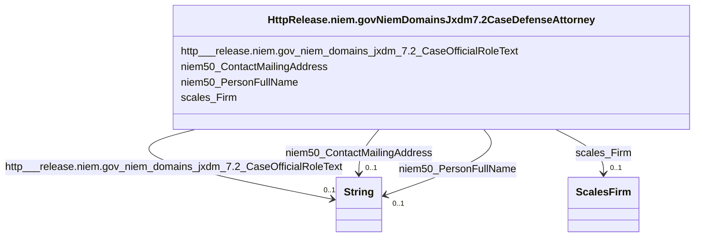

# Class: No class (type) name specified (http___release.niem.gov_niem_domains_jxdm_7.2_CaseDefenseAttorney)


_No class (type) description specified_


This class occurs 2823772 times.


URI: [http://release.niem.gov/niem/domains/jxdm/7.2/CaseDefenseAttorney](http://release.niem.gov/niem/domains/jxdm/7.2/CaseDefenseAttorney)





<!-- no inheritance hierarchy -->


## Slots

| Name | Cardinality and Range | Description | Inheritance | Occurrences |
| ---  | --- | --- | --- | --- |
| [scales_Firm](../slots/scales_Firm.md) | 0..1 <br/> [ScalesFirm](../classes/ScalesFirm.md) | No slot (predicate) description specified <br/>  | direct | 1494159 |
| [http___release.niem.gov_niem_domains_jxdm_7.2_CaseOfficialRoleText](../slots/http___release.niem.gov_niem_domains_jxdm_7.2_CaseOfficialRoleText.md) | 0..1 <br/> [xsd:string](http://www.w3.org/2001/XMLSchema#string) | No slot (predicate) description specified <br/>  | direct | 280534 |
| [niem50_PersonFullName](../slots/niem50_PersonFullName.md) | 0..1 <br/> [xsd:string](http://www.w3.org/2001/XMLSchema#string) | No slot (predicate) description specified <br/>  | direct | 2823772 |
| [niem50_ContactMailingAddress](../slots/niem50_ContactMailingAddress.md) | 0..1 <br/> [xsd:string](http://www.w3.org/2001/XMLSchema#string) | No slot (predicate) description specified <br/>  | direct | 1571811 |


## Usages

| used by | used in | type | used |
| ---  | --- | --- | --- |
| [HttpRelease.niem.govNiemDomainsJxdm7.2CaseDefendantParty](../classes/HttpRelease.niem.govNiemDomainsJxdm7.2CaseDefendantParty.md) | [HttpRelease.niem.govNiemDomainsJxdm7.2CaseDefenseAttorney](../classes/HttpRelease.niem.govNiemDomainsJxdm7.2CaseDefenseAttorney.md) | range | [HttpRelease.niem.govNiemDomainsJxdm7.2CaseDefenseAttorney](../classes/HttpRelease.niem.govNiemDomainsJxdm7.2CaseDefenseAttorney.md) |


## LinkML Source

<!-- TODO: investigate https://stackoverflow.com/questions/37606292/how-to-create-tabbed-code-blocks-in-mkdocs-or-sphinx -->

### Direct

<details>

```yaml
name: http___release.niem.gov_niem_domains_jxdm_7.2_CaseDefenseAttorney
conforms_to: No schema conformance document specified
annotations:
  count:
    tag: count
    value: 2823772
description: No class (type) description specified
title: No class (type) name specified
from_schema: scales-kg
rank: 1000
slots:
- scales_Firm
- http___release.niem.gov_niem_domains_jxdm_7.2_CaseOfficialRoleText
- niem50_PersonFullName
- niem50_ContactMailingAddress
slot_usage:
  http___release.niem.gov_niem_domains_jxdm_7.2_CaseOfficialRoleText:
    name: http___release.niem.gov_niem_domains_jxdm_7.2_CaseOfficialRoleText
    annotations:
      string:
        tag: string
        value: 280534
  niem50_ContactMailingAddress:
    name: niem50_ContactMailingAddress
    annotations:
      string:
        tag: string
        value: 1571811
  niem50_PersonFullName:
    name: niem50_PersonFullName
    annotations:
      string:
        tag: string
        value: 2823772
  scales_Firm:
    name: scales_Firm
    annotations:
      scales_Firm:
        tag: scales_Firm
        value: 1494159
class_uri: http://release.niem.gov/niem/domains/jxdm/7.2/CaseDefenseAttorney

```
</details>

### Induced

<details>

```yaml
name: http___release.niem.gov_niem_domains_jxdm_7.2_CaseDefenseAttorney
conforms_to: No schema conformance document specified
annotations:
  count:
    tag: count
    value: 2823772
description: No class (type) description specified
title: No class (type) name specified
from_schema: scales-kg
rank: 1000
slot_usage:
  http___release.niem.gov_niem_domains_jxdm_7.2_CaseOfficialRoleText:
    name: http___release.niem.gov_niem_domains_jxdm_7.2_CaseOfficialRoleText
    annotations:
      string:
        tag: string
        value: 280534
  niem50_ContactMailingAddress:
    name: niem50_ContactMailingAddress
    annotations:
      string:
        tag: string
        value: 1571811
  niem50_PersonFullName:
    name: niem50_PersonFullName
    annotations:
      string:
        tag: string
        value: 2823772
  scales_Firm:
    name: scales_Firm
    annotations:
      scales_Firm:
        tag: scales_Firm
        value: 1494159
attributes:
  scales_Firm:
    name: scales_Firm
    annotations:
      scales_Firm:
        tag: scales_Firm
        value: 1494159
    description: No slot (predicate) description specified
    examples:
    - object:
        example_object: scales:/Agent/akd;;1:16-cr-00001_a7
        example_object_type: scales_Firm
        example_predicate: scales:Firm
        example_subject: scales:/Agent/akd;;1:16-cr-00001_a3
        example_subject_type: http___release.niem.gov_niem_domains_jxdm_7.2_CaseDefenseAttorney
    - object:
        example_object: scales:/Agent/akd;;1:16-cr-00001_a9
        example_object_type: scales_Firm
        example_predicate: scales:Firm
        example_subject: scales:/Agent/akd;;1:16-cr-00001_a5
        example_subject_type: http___release.niem.gov_niem_domains_jxdm_7.2_CaseInitiatingAttorney
    - object:
        example_object: scales:/Agent/akd;;1:16-cv-00008_a28
        example_object_type: scales_Firm
        example_predicate: scales:Firm
        example_subject: scales:/Agent/akd;;1:16-cv-00008_a22
        example_subject_type: http___release.niem.gov_niem_domains_jxdm_7.2_Attorney
    from_schema: scales-kg
    rank: 1000
    slot_uri: scales:Firm
    alias: scales_Firm
    owner: http___release.niem.gov_niem_domains_jxdm_7.2_CaseDefenseAttorney
    domain_of:
    - http___release.niem.gov_niem_domains_jxdm_7.2_Attorney
    - http___release.niem.gov_niem_domains_jxdm_7.2_CaseDefenseAttorney
    - http___release.niem.gov_niem_domains_jxdm_7.2_CaseInitiatingAttorney
    range: scales_Firm
  http___release.niem.gov_niem_domains_jxdm_7.2_CaseOfficialRoleText:
    name: http___release.niem.gov_niem_domains_jxdm_7.2_CaseOfficialRoleText
    annotations:
      string:
        tag: string
        value: 280534
    description: No slot (predicate) description specified
    examples:
    - object:
        example_object: Assigned Judge
        example_object_type: string
        example_predicate: http://release.niem.gov/niem/domains/jxdm/7.2/CaseOfficialRoleText
        example_subject: scales:/Agent/akd;;1:16-cr-00001_a2
        example_subject_type: None
    - object:
        example_object: Retained
        example_object_type: string
        example_predicate: http://release.niem.gov/niem/domains/jxdm/7.2/CaseOfficialRoleText
        example_subject: scales:/Agent/akd;;1:16-cr-00001_a4
        example_subject_type: http___release.niem.gov_niem_domains_jxdm_7.2_CaseDefenseAttorney
    - object:
        example_object: Assistant US Attorney
        example_object_type: string
        example_predicate: http://release.niem.gov/niem/domains/jxdm/7.2/CaseOfficialRoleText
        example_subject: scales:/Agent/akd;;1:16-cr-00001_a5
        example_subject_type: http___release.niem.gov_niem_domains_jxdm_7.2_CaseInitiatingAttorney
    - object:
        example_object: Retained
        example_object_type: string
        example_predicate: http://release.niem.gov/niem/domains/jxdm/7.2/CaseOfficialRoleText
        example_subject: scales:/Agent/almd;;1:16-cr-00571_a20
        example_subject_type: http___release.niem.gov_niem_domains_jxdm_7.2_Attorney
    from_schema: scales-kg
    rank: 1000
    slot_uri: http://release.niem.gov/niem/domains/jxdm/7.2/CaseOfficialRoleText
    alias: http___release.niem.gov_niem_domains_jxdm_7.2_CaseOfficialRoleText
    owner: http___release.niem.gov_niem_domains_jxdm_7.2_CaseDefenseAttorney
    domain_of:
    - http___release.niem.gov_niem_domains_jxdm_7.2_Attorney
    - http___release.niem.gov_niem_domains_jxdm_7.2_CaseDefenseAttorney
    - http___release.niem.gov_niem_domains_jxdm_7.2_CaseInitiatingAttorney
    range: string
  niem50_PersonFullName:
    name: niem50_PersonFullName
    annotations:
      string:
        tag: string
        value: 2823772
    description: No slot (predicate) description specified
    examples:
    - object:
        example_object: Timothy M. Burgess
        example_object_type: string
        example_predicate: niem50:PersonFullName
        example_subject: scales:/Agent/akd;;1:16-cr-00001_a2
        example_subject_type: None
    - object:
        example_object: Matthew McCrary Scoble
        example_object_type: string
        example_predicate: niem50:PersonFullName
        example_subject: scales:/Agent/akd;;1:16-cr-00001_a3
        example_subject_type: http___release.niem.gov_niem_domains_jxdm_7.2_CaseDefenseAttorney
    - object:
        example_object: Jack S. Schmidt
        example_object_type: string
        example_predicate: niem50:PersonFullName
        example_subject: scales:/Agent/akd;;1:16-cr-00001_a5
        example_subject_type: http___release.niem.gov_niem_domains_jxdm_7.2_CaseInitiatingAttorney
    - object:
        example_object: Mary Ann Lundquist
        example_object_type: string
        example_predicate: niem50:PersonFullName
        example_subject: scales:/Agent/akd;;1:16-cv-00008_a22
        example_subject_type: http___release.niem.gov_niem_domains_jxdm_7.2_Attorney
    - object:
        example_object: Stephen H Locher
        example_object_type: string
        example_predicate: niem50:PersonFullName
        example_subject: scales:/JudgeEntity/SJ000001
        example_subject_type: http___release.niem.gov_niem_domains_jxdm_7.2_Judge
    - object:
        example_object: BRAZELTON TROY DBA
        example_object_type: string
        example_predicate: niem50:PersonFullName
        example_subject: scales:Agent/ga-clayton-magistrate-civil;;0:00-cm-00001_a0
        example_subject_type: scales_Party
    - object:
        example_object: SCALES-Party-Hash-2DB6296D52E366F752379C777C9BE051
        example_object_type: string
        example_predicate: niem50:PersonFullName
        example_subject: scales:Agent/ga-fulton-01/10000019
        example_subject_type: http___release.niem.gov_niem_domains_jxdm_7.2_CaseDefendantParty
    - object:
        example_object: BAIRD
        example_object_type: string
        example_predicate: niem50:PersonFullName
        example_subject: scales:Judge/ga-clayton-magistrate-civil;;0:00-cm-00001_3
        example_subject_type: http___release.niem.gov_niem_domains_jxdm_7.2_CaseJudge
    from_schema: scales-kg
    rank: 1000
    slot_uri: niem50:PersonFullName
    alias: niem50_PersonFullName
    owner: http___release.niem.gov_niem_domains_jxdm_7.2_CaseDefenseAttorney
    domain_of:
    - http___release.niem.gov_niem_domains_jxdm_7.2_Attorney
    - http___release.niem.gov_niem_domains_jxdm_7.2_CaseDefendantParty
    - http___release.niem.gov_niem_domains_jxdm_7.2_CaseDefenseAttorney
    - http___release.niem.gov_niem_domains_jxdm_7.2_CaseInitiatingAttorney
    - http___release.niem.gov_niem_domains_jxdm_7.2_CaseJudge
    - http___release.niem.gov_niem_domains_jxdm_7.2_Judge
    - scales_Party
    range: string
  niem50_ContactMailingAddress:
    name: niem50_ContactMailingAddress
    annotations:
      string:
        tag: string
        value: 1571811
    description: No slot (predicate) description specified
    examples:
    - object:
        example_object: '425 G Street, Suite 800

          Anchorage, AK 99501'
        example_object_type: string
        example_predicate: niem50:ContactMailingAddress
        example_subject: scales:/Agent/akd;;1:16-cr-00001_a3
        example_subject_type: http___release.niem.gov_niem_domains_jxdm_7.2_CaseDefenseAttorney
    - object:
        example_object: '709 West 9th Street, Rm 937

          P.O. Box 21627

          Juneau, AK 99801'
        example_object_type: string
        example_predicate: niem50:ContactMailingAddress
        example_subject: scales:/Agent/akd;;1:16-cr-00001_a5
        example_subject_type: http___release.niem.gov_niem_domains_jxdm_7.2_CaseInitiatingAttorney
    - object:
        example_object: '100 Cushman Street, Suite 400

          Fairbanks, AK 99701'
        example_object_type: string
        example_predicate: niem50:ContactMailingAddress
        example_subject: scales:/Agent/akd;;1:16-cv-00008_a22
        example_subject_type: http___release.niem.gov_niem_domains_jxdm_7.2_Attorney
    from_schema: scales-kg
    rank: 1000
    slot_uri: niem50:ContactMailingAddress
    alias: niem50_ContactMailingAddress
    owner: http___release.niem.gov_niem_domains_jxdm_7.2_CaseDefenseAttorney
    domain_of:
    - http___release.niem.gov_niem_domains_jxdm_7.2_Attorney
    - http___release.niem.gov_niem_domains_jxdm_7.2_CaseDefenseAttorney
    - http___release.niem.gov_niem_domains_jxdm_7.2_CaseInitiatingAttorney
    range: string
class_uri: http://release.niem.gov/niem/domains/jxdm/7.2/CaseDefenseAttorney

```
</details>