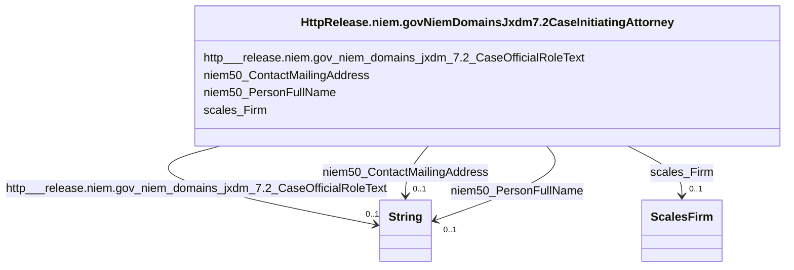

# Class: No class (type) name specified (http___release.niem.gov_niem_domains_jxdm_7.2_CaseInitiatingAttorney)


_No class (type) description specified_


This class occurs 9088 times.


URI: [http://release.niem.gov/niem/domains/jxdm/7.2/CaseInitiatingAttorney](http://release.niem.gov/niem/domains/jxdm/7.2/CaseInitiatingAttorney)





<!-- no inheritance hierarchy -->


## Slots

| Name | Cardinality and Range | Description | Inheritance | Occurrences |
| ---  | --- | --- | --- | --- |
| [http___release.niem.gov_niem_domains_jxdm_7.2_CaseOfficialRoleText](../slots/http___release.niem.gov_niem_domains_jxdm_7.2_CaseOfficialRoleText.md) | 0..1 <br/> [xsd:string](http://www.w3.org/2001/XMLSchema#string) | No slot (predicate) description specified <br/>  | direct | 5629 |
| [niem50_PersonFullName](../slots/niem50_PersonFullName.md) | 0..1 <br/> [xsd:string](http://www.w3.org/2001/XMLSchema#string) | No slot (predicate) description specified <br/>  | direct | 9088 |
| [niem50_ContactMailingAddress](../slots/niem50_ContactMailingAddress.md) | 0..1 <br/> [xsd:string](http://www.w3.org/2001/XMLSchema#string) | No slot (predicate) description specified <br/>  | direct | 7659 |
| [scales_Firm](../slots/scales_Firm.md) | 0..1 <br/> [ScalesFirm](../classes/ScalesFirm.md) | No slot (predicate) description specified <br/>  | direct | 7533 |


## Usages

| used by | used in | type | used |
| ---  | --- | --- | --- |
| [HttpRelease.niem.govNiemDomainsJxdm7.2CaseInitiatingParty](../classes/HttpRelease.niem.govNiemDomainsJxdm7.2CaseInitiatingParty.md) | [HttpRelease.niem.govNiemDomainsJxdm7.2CaseInitiatingAttorney](../classes/HttpRelease.niem.govNiemDomainsJxdm7.2CaseInitiatingAttorney.md) | range | [HttpRelease.niem.govNiemDomainsJxdm7.2CaseInitiatingAttorney](../classes/HttpRelease.niem.govNiemDomainsJxdm7.2CaseInitiatingAttorney.md) |


## LinkML Source

<!-- TODO: investigate https://stackoverflow.com/questions/37606292/how-to-create-tabbed-code-blocks-in-mkdocs-or-sphinx -->

### Direct

<details>

```yaml
name: http___release.niem.gov_niem_domains_jxdm_7.2_CaseInitiatingAttorney
conforms_to: No schema conformance document specified
annotations:
  count:
    tag: count
    value: 9088
description: No class (type) description specified
title: No class (type) name specified
from_schema: scales-kg
rank: 1000
slots:
- http___release.niem.gov_niem_domains_jxdm_7.2_CaseOfficialRoleText
- niem50_PersonFullName
- niem50_ContactMailingAddress
- scales_Firm
slot_usage:
  http___release.niem.gov_niem_domains_jxdm_7.2_CaseOfficialRoleText:
    name: http___release.niem.gov_niem_domains_jxdm_7.2_CaseOfficialRoleText
    annotations:
      string:
        tag: string
        value: 5629
  niem50_ContactMailingAddress:
    name: niem50_ContactMailingAddress
    annotations:
      string:
        tag: string
        value: 7659
  niem50_PersonFullName:
    name: niem50_PersonFullName
    annotations:
      string:
        tag: string
        value: 9088
  scales_Firm:
    name: scales_Firm
    annotations:
      scales_Firm:
        tag: scales_Firm
        value: 7533
class_uri: http://release.niem.gov/niem/domains/jxdm/7.2/CaseInitiatingAttorney

```
</details>

### Induced

<details>

```yaml
name: http___release.niem.gov_niem_domains_jxdm_7.2_CaseInitiatingAttorney
conforms_to: No schema conformance document specified
annotations:
  count:
    tag: count
    value: 9088
description: No class (type) description specified
title: No class (type) name specified
from_schema: scales-kg
rank: 1000
slot_usage:
  http___release.niem.gov_niem_domains_jxdm_7.2_CaseOfficialRoleText:
    name: http___release.niem.gov_niem_domains_jxdm_7.2_CaseOfficialRoleText
    annotations:
      string:
        tag: string
        value: 5629
  niem50_ContactMailingAddress:
    name: niem50_ContactMailingAddress
    annotations:
      string:
        tag: string
        value: 7659
  niem50_PersonFullName:
    name: niem50_PersonFullName
    annotations:
      string:
        tag: string
        value: 9088
  scales_Firm:
    name: scales_Firm
    annotations:
      scales_Firm:
        tag: scales_Firm
        value: 7533
attributes:
  http___release.niem.gov_niem_domains_jxdm_7.2_CaseOfficialRoleText:
    name: http___release.niem.gov_niem_domains_jxdm_7.2_CaseOfficialRoleText
    annotations:
      string:
        tag: string
        value: 5629
    description: No slot (predicate) description specified
    examples:
    - object:
        example_object: Assigned Judge
        example_object_type: string
        example_predicate: http://release.niem.gov/niem/domains/jxdm/7.2/CaseOfficialRoleText
        example_subject: scales:/Agent/casd;;3:16-cv-01644_a2
        example_subject_type: None
    - object:
        example_object: CJA Appointment
        example_object_type: string
        example_predicate: http://release.niem.gov/niem/domains/jxdm/7.2/CaseOfficialRoleText
        example_subject: scales:/Agent/casd;;3:17-cr-00001_a3
        example_subject_type: http___release.niem.gov_niem_domains_jxdm_7.2_CaseDefenseAttorney
    - object:
        example_object: Assistant United States Attorney
        example_object_type: string
        example_predicate: http://release.niem.gov/niem/domains/jxdm/7.2/CaseOfficialRoleText
        example_subject: scales:/Agent/casd;;3:17-cr-00001_a4
        example_subject_type: http___release.niem.gov_niem_domains_jxdm_7.2_CaseInitiatingAttorney
    - object:
        example_object: CJA Appointment
        example_object_type: string
        example_predicate: http://release.niem.gov/niem/domains/jxdm/7.2/CaseOfficialRoleText
        example_subject: scales:/Agent/casd;;3:17-cr-00006_a5
        example_subject_type: http___release.niem.gov_niem_domains_jxdm_7.2_Attorney
    from_schema: scales-kg
    rank: 1000
    slot_uri: http://release.niem.gov/niem/domains/jxdm/7.2/CaseOfficialRoleText
    alias: http___release.niem.gov_niem_domains_jxdm_7.2_CaseOfficialRoleText
    owner: http___release.niem.gov_niem_domains_jxdm_7.2_CaseInitiatingAttorney
    domain_of:
    - http___release.niem.gov_niem_domains_jxdm_7.2_Attorney
    - http___release.niem.gov_niem_domains_jxdm_7.2_CaseDefenseAttorney
    - http___release.niem.gov_niem_domains_jxdm_7.2_CaseInitiatingAttorney
    range: string
  niem50_PersonFullName:
    name: niem50_PersonFullName
    annotations:
      string:
        tag: string
        value: 9088
    description: No slot (predicate) description specified
    examples:
    - object:
        example_object: Judge Gonzalo P. Curiel
        example_object_type: string
        example_predicate: niem50:PersonFullName
        example_subject: scales:/Agent/casd;;3:16-cv-01644_a2
        example_subject_type: None
    - object:
        example_object: SCALES-Party-Hash-A832763C1FE77A32B6DE912B9C77F80C
        example_object_type: string
        example_predicate: niem50:PersonFullName
        example_subject: scales:/Agent/casd;;3:16-cv-01644_a3
        example_subject_type: http___release.niem.gov_niem_domains_jxdm_7.2_CaseInitiatingAttorney
    - object:
        example_object: Ryan A. Sausedo
        example_object_type: string
        example_predicate: niem50:PersonFullName
        example_subject: scales:/Agent/casd;;3:16-cv-01644_a5
        example_subject_type: http___release.niem.gov_niem_domains_jxdm_7.2_CaseDefenseAttorney
    - object:
        example_object: Benjamin Gilford
        example_object_type: string
        example_predicate: niem50:PersonFullName
        example_subject: scales:/Agent/casd;;3:16-cv-01645_a20
        example_subject_type: http___release.niem.gov_niem_domains_jxdm_7.2_Attorney
    - object:
        example_object: Carroll O Switzer
        example_object_type: string
        example_predicate: niem50:PersonFullName
        example_subject: scales:/JudgeEntity/SJ000002
        example_subject_type: http___release.niem.gov_niem_domains_jxdm_7.2_Judge
    from_schema: scales-kg
    rank: 1000
    slot_uri: niem50:PersonFullName
    alias: niem50_PersonFullName
    owner: http___release.niem.gov_niem_domains_jxdm_7.2_CaseInitiatingAttorney
    domain_of:
    - http___release.niem.gov_niem_domains_jxdm_7.2_Attorney
    - http___release.niem.gov_niem_domains_jxdm_7.2_CaseDefenseAttorney
    - http___release.niem.gov_niem_domains_jxdm_7.2_CaseInitiatingAttorney
    - http___release.niem.gov_niem_domains_jxdm_7.2_Judge
    range: string
  niem50_ContactMailingAddress:
    name: niem50_ContactMailingAddress
    annotations:
      string:
        tag: string
        value: 7659
    description: No slot (predicate) description specified
    examples:
    - object:
        example_object: '225 Broadway

          Suite 900

          San Diego, CA 92101-5008'
        example_object_type: string
        example_predicate: niem50:ContactMailingAddress
        example_subject: scales:/Agent/casd;;3:16-cv-01644_a4
        example_subject_type: http___release.niem.gov_niem_domains_jxdm_7.2_CaseInitiatingAttorney
    - object:
        example_object: '880 Front Street

          Room 6293

          San Diego, CA 92101'
        example_object_type: string
        example_predicate: niem50:ContactMailingAddress
        example_subject: scales:/Agent/casd;;3:16-cv-01644_a5
        example_subject_type: http___release.niem.gov_niem_domains_jxdm_7.2_CaseDefenseAttorney
    - object:
        example_object: '800 Wilshire Blvd.

          Suite 500

          Los Angeles, CA 90017'
        example_object_type: string
        example_predicate: niem50:ContactMailingAddress
        example_subject: scales:/Agent/casd;;3:16-cv-01692_a23
        example_subject_type: http___release.niem.gov_niem_domains_jxdm_7.2_Attorney
    from_schema: scales-kg
    rank: 1000
    slot_uri: niem50:ContactMailingAddress
    alias: niem50_ContactMailingAddress
    owner: http___release.niem.gov_niem_domains_jxdm_7.2_CaseInitiatingAttorney
    domain_of:
    - http___release.niem.gov_niem_domains_jxdm_7.2_Attorney
    - http___release.niem.gov_niem_domains_jxdm_7.2_CaseDefenseAttorney
    - http___release.niem.gov_niem_domains_jxdm_7.2_CaseInitiatingAttorney
    range: string
  scales_Firm:
    name: scales_Firm
    annotations:
      scales_Firm:
        tag: scales_Firm
        value: 7533
    description: No slot (predicate) description specified
    examples:
    - object:
        example_object: scales:/Agent/casd;;3:16-cv-01644_a6
        example_object_type: scales_Firm
        example_predicate: scales:Firm
        example_subject: scales:/Agent/casd;;3:16-cv-01644_a4
        example_subject_type: http___release.niem.gov_niem_domains_jxdm_7.2_CaseInitiatingAttorney
    - object:
        example_object: scales:/Agent/casd;;3:16-cv-01644_a7
        example_object_type: scales_Firm
        example_predicate: scales:Firm
        example_subject: scales:/Agent/casd;;3:16-cv-01644_a5
        example_subject_type: http___release.niem.gov_niem_domains_jxdm_7.2_CaseDefenseAttorney
    - object:
        example_object: scales:/Agent/casd;;3:16-cv-01692_a29
        example_object_type: scales_Firm
        example_predicate: scales:Firm
        example_subject: scales:/Agent/casd;;3:16-cv-01692_a23
        example_subject_type: http___release.niem.gov_niem_domains_jxdm_7.2_Attorney
    from_schema: scales-kg
    rank: 1000
    slot_uri: scales:Firm
    alias: scales_Firm
    owner: http___release.niem.gov_niem_domains_jxdm_7.2_CaseInitiatingAttorney
    domain_of:
    - http___release.niem.gov_niem_domains_jxdm_7.2_Attorney
    - http___release.niem.gov_niem_domains_jxdm_7.2_CaseDefenseAttorney
    - http___release.niem.gov_niem_domains_jxdm_7.2_CaseInitiatingAttorney
    range: scales_Firm
class_uri: http://release.niem.gov/niem/domains/jxdm/7.2/CaseInitiatingAttorney

```
</details>