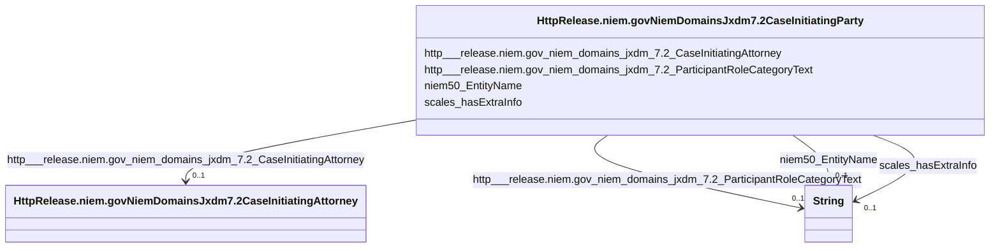

# Class: No class (type) name specified (http___release.niem.gov_niem_domains_jxdm_7.2_CaseInitiatingParty)


_No class (type) description specified_


This class occurs 1337860 times.


URI: [http://release.niem.gov/niem/domains/jxdm/7.2/CaseInitiatingParty](http://release.niem.gov/niem/domains/jxdm/7.2/CaseInitiatingParty)





<!-- no inheritance hierarchy -->


## Slots

| Name | Cardinality and Range | Description | Inheritance | Occurrences |
| ---  | --- | --- | --- | --- |
| [http___release.niem.gov_niem_domains_jxdm_7.2_CaseInitiatingAttorney](../slots/http___release.niem.gov_niem_domains_jxdm_7.2_CaseInitiatingAttorney.md) | 0..1 <br/> [HttpRelease.niem.govNiemDomainsJxdm7.2CaseInitiatingAttorney](../classes/HttpRelease.niem.govNiemDomainsJxdm7.2CaseInitiatingAttorney.md) | No slot (predicate) description specified <br/>  | direct | 2755161 |
| [niem50_EntityName](../slots/niem50_EntityName.md) | 0..1 <br/> [xsd:string](http://www.w3.org/2001/XMLSchema#string) | No slot (predicate) description specified <br/>  | direct | 1337860 |
| [http___release.niem.gov_niem_domains_jxdm_7.2_ParticipantRoleCategoryText](../slots/http___release.niem.gov_niem_domains_jxdm_7.2_ParticipantRoleCategoryText.md) | 0..1 <br/> [xsd:string](http://www.w3.org/2001/XMLSchema#string) | No slot (predicate) description specified <br/>  | direct | 1337860 |
| [scales_hasExtraInfo](../slots/scales_hasExtraInfo.md) | 0..1 <br/> [xsd:string](http://www.w3.org/2001/XMLSchema#string) | No slot (predicate) description specified <br/>  | direct | 147013 |


## Usages

| used by | used in | type | used |
| ---  | --- | --- | --- |
| [ScalesCivilCase](../classes/ScalesCivilCase.md) | [HttpRelease.niem.govNiemDomainsJxdm7.2CaseInitiatingParty](../classes/HttpRelease.niem.govNiemDomainsJxdm7.2CaseInitiatingParty.md) | any_of[range] | [HttpRelease.niem.govNiemDomainsJxdm7.2CaseInitiatingParty](../classes/HttpRelease.niem.govNiemDomainsJxdm7.2CaseInitiatingParty.md) |
| [ScalesCriminalCase](../classes/ScalesCriminalCase.md) | [HttpRelease.niem.govNiemDomainsJxdm7.2CaseInitiatingParty](../classes/HttpRelease.niem.govNiemDomainsJxdm7.2CaseInitiatingParty.md) | any_of[range] | [HttpRelease.niem.govNiemDomainsJxdm7.2CaseInitiatingParty](../classes/HttpRelease.niem.govNiemDomainsJxdm7.2CaseInitiatingParty.md) |


## LinkML Source

<!-- TODO: investigate https://stackoverflow.com/questions/37606292/how-to-create-tabbed-code-blocks-in-mkdocs-or-sphinx -->

### Direct

<details>

```yaml
name: http___release.niem.gov_niem_domains_jxdm_7.2_CaseInitiatingParty
conforms_to: No schema conformance document specified
annotations:
  count:
    tag: count
    value: 1337860
description: No class (type) description specified
title: No class (type) name specified
from_schema: scales-kg
rank: 1000
slots:
- http___release.niem.gov_niem_domains_jxdm_7.2_CaseInitiatingAttorney
- niem50_EntityName
- http___release.niem.gov_niem_domains_jxdm_7.2_ParticipantRoleCategoryText
- scales_hasExtraInfo
slot_usage:
  http___release.niem.gov_niem_domains_jxdm_7.2_CaseInitiatingAttorney:
    name: http___release.niem.gov_niem_domains_jxdm_7.2_CaseInitiatingAttorney
    annotations:
      http___release.niem.gov_niem_domains_jxdm_7.2_CaseInitiatingAttorney:
        tag: http___release.niem.gov_niem_domains_jxdm_7.2_CaseInitiatingAttorney
        value: 2755161
  http___release.niem.gov_niem_domains_jxdm_7.2_ParticipantRoleCategoryText:
    name: http___release.niem.gov_niem_domains_jxdm_7.2_ParticipantRoleCategoryText
    annotations:
      string:
        tag: string
        value: 1337860
  niem50_EntityName:
    name: niem50_EntityName
    annotations:
      string:
        tag: string
        value: 1337860
  scales_hasExtraInfo:
    name: scales_hasExtraInfo
    annotations:
      string:
        tag: string
        value: 147013
class_uri: http://release.niem.gov/niem/domains/jxdm/7.2/CaseInitiatingParty

```
</details>

### Induced

<details>

```yaml
name: http___release.niem.gov_niem_domains_jxdm_7.2_CaseInitiatingParty
conforms_to: No schema conformance document specified
annotations:
  count:
    tag: count
    value: 1337860
description: No class (type) description specified
title: No class (type) name specified
from_schema: scales-kg
rank: 1000
slot_usage:
  http___release.niem.gov_niem_domains_jxdm_7.2_CaseInitiatingAttorney:
    name: http___release.niem.gov_niem_domains_jxdm_7.2_CaseInitiatingAttorney
    annotations:
      http___release.niem.gov_niem_domains_jxdm_7.2_CaseInitiatingAttorney:
        tag: http___release.niem.gov_niem_domains_jxdm_7.2_CaseInitiatingAttorney
        value: 2755161
  http___release.niem.gov_niem_domains_jxdm_7.2_ParticipantRoleCategoryText:
    name: http___release.niem.gov_niem_domains_jxdm_7.2_ParticipantRoleCategoryText
    annotations:
      string:
        tag: string
        value: 1337860
  niem50_EntityName:
    name: niem50_EntityName
    annotations:
      string:
        tag: string
        value: 1337860
  scales_hasExtraInfo:
    name: scales_hasExtraInfo
    annotations:
      string:
        tag: string
        value: 147013
attributes:
  http___release.niem.gov_niem_domains_jxdm_7.2_CaseInitiatingAttorney:
    name: http___release.niem.gov_niem_domains_jxdm_7.2_CaseInitiatingAttorney
    annotations:
      http___release.niem.gov_niem_domains_jxdm_7.2_CaseInitiatingAttorney:
        tag: http___release.niem.gov_niem_domains_jxdm_7.2_CaseInitiatingAttorney
        value: 2755161
    description: No slot (predicate) description specified
    examples:
    - object:
        example_object: scales:/Agent/akd;;1:16-cr-00001_a5
        example_object_type: http___release.niem.gov_niem_domains_jxdm_7.2_CaseInitiatingAttorney
        example_predicate: http://release.niem.gov/niem/domains/jxdm/7.2/CaseInitiatingAttorney
        example_subject: scales:/Agent/akd;;1:16-cr-00001_a1
        example_subject_type: http___release.niem.gov_niem_domains_jxdm_7.2_CaseInitiatingParty
    from_schema: scales-kg
    rank: 1000
    slot_uri: http://release.niem.gov/niem/domains/jxdm/7.2/CaseInitiatingAttorney
    alias: http___release.niem.gov_niem_domains_jxdm_7.2_CaseInitiatingAttorney
    owner: http___release.niem.gov_niem_domains_jxdm_7.2_CaseInitiatingParty
    domain_of:
    - http___release.niem.gov_niem_domains_jxdm_7.2_CaseInitiatingParty
    range: http___release.niem.gov_niem_domains_jxdm_7.2_CaseInitiatingAttorney
  niem50_EntityName:
    name: niem50_EntityName
    annotations:
      string:
        tag: string
        value: 1337860
    description: No slot (predicate) description specified
    examples:
    - object:
        example_object: SCALES-Party-Hash-01169B980BF3557176ECC743C5841A32
        example_object_type: string
        example_predicate: niem50:EntityName
        example_subject: scales:/Agent/akd;;1:16-cr-00001_a0
        example_subject_type: http___release.niem.gov_niem_domains_jxdm_7.2_CaseDefendantParty
    - object:
        example_object: USA
        example_object_type: string
        example_predicate: niem50:EntityName
        example_subject: scales:/Agent/akd;;1:16-cr-00001_a1
        example_subject_type: http___release.niem.gov_niem_domains_jxdm_7.2_CaseInitiatingParty
    - object:
        example_object: State of Alaska
        example_object_type: string
        example_predicate: niem50:EntityName
        example_subject: scales:/Agent/akd;;1:16-cv-00008_a7
        example_subject_type: scales_Party
    from_schema: scales-kg
    rank: 1000
    slot_uri: niem50:EntityName
    alias: niem50_EntityName
    owner: http___release.niem.gov_niem_domains_jxdm_7.2_CaseInitiatingParty
    domain_of:
    - http___release.niem.gov_niem_domains_jxdm_7.2_CaseDefendantParty
    - http___release.niem.gov_niem_domains_jxdm_7.2_CaseInitiatingParty
    - scales_Party
    range: string
  http___release.niem.gov_niem_domains_jxdm_7.2_ParticipantRoleCategoryText:
    name: http___release.niem.gov_niem_domains_jxdm_7.2_ParticipantRoleCategoryText
    annotations:
      string:
        tag: string
        value: 1337860
    description: No slot (predicate) description specified
    examples:
    - object:
        example_object: Defendant
        example_object_type: string
        example_predicate: http://release.niem.gov/niem/domains/jxdm/7.2/ParticipantRoleCategoryText
        example_subject: scales:/Agent/akd;;1:16-cr-00001_a0
        example_subject_type: http___release.niem.gov_niem_domains_jxdm_7.2_CaseDefendantParty
    - object:
        example_object: Plaintiff
        example_object_type: string
        example_predicate: http://release.niem.gov/niem/domains/jxdm/7.2/ParticipantRoleCategoryText
        example_subject: scales:/Agent/akd;;1:16-cr-00001_a1
        example_subject_type: http___release.niem.gov_niem_domains_jxdm_7.2_CaseInitiatingParty
    - object:
        example_object: Amicus
        example_object_type: string
        example_predicate: http://release.niem.gov/niem/domains/jxdm/7.2/ParticipantRoleCategoryText
        example_subject: scales:/Agent/akd;;1:16-cv-00008_a7
        example_subject_type: scales_Party
    from_schema: scales-kg
    rank: 1000
    slot_uri: http://release.niem.gov/niem/domains/jxdm/7.2/ParticipantRoleCategoryText
    alias: http___release.niem.gov_niem_domains_jxdm_7.2_ParticipantRoleCategoryText
    owner: http___release.niem.gov_niem_domains_jxdm_7.2_CaseInitiatingParty
    domain_of:
    - http___release.niem.gov_niem_domains_jxdm_7.2_CaseDefendantParty
    - http___release.niem.gov_niem_domains_jxdm_7.2_CaseInitiatingParty
    - scales_Party
    range: string
  scales_hasExtraInfo:
    name: scales_hasExtraInfo
    annotations:
      string:
        tag: string
        value: 147013
    description: No slot (predicate) description specified
    examples:
    - object:
        example_object: 'doing business as

          Northstar Gift Shop'
        example_object_type: string
        example_predicate: scales:hasExtraInfo
        example_subject: scales:/Agent/akd;;1:16-cr-00004_a0
        example_subject_type: http___release.niem.gov_niem_domains_jxdm_7.2_CaseDefendantParty
    - object:
        example_object: 'Soc. Sec. #XXX-XX-0767'
        example_object_type: string
        example_predicate: scales:hasExtraInfo
        example_subject: scales:/Agent/akd;;1:16-cv-00003_a0
        example_subject_type: http___release.niem.gov_niem_domains_jxdm_7.2_CaseInitiatingParty
    - object:
        example_object: husband and wife
        example_object_type: string
        example_predicate: scales:hasExtraInfo
        example_subject: scales:/Agent/akd;;3:16-cv-00062_a4
        example_subject_type: scales_Party
    from_schema: scales-kg
    rank: 1000
    slot_uri: scales:hasExtraInfo
    alias: scales_hasExtraInfo
    owner: http___release.niem.gov_niem_domains_jxdm_7.2_CaseInitiatingParty
    domain_of:
    - http___release.niem.gov_niem_domains_jxdm_7.2_CaseDefendantParty
    - http___release.niem.gov_niem_domains_jxdm_7.2_CaseInitiatingParty
    - scales_Party
    range: string
class_uri: http://release.niem.gov/niem/domains/jxdm/7.2/CaseInitiatingParty

```
</details>