# Class: No class (type) name specified (http___release.niem.gov_niem_domains_jxdm_7.2_Charge)


_No class (type) description specified_


This class occurs 2908749 times.


URI: [http://release.niem.gov/niem/domains/jxdm/7.2/Charge](http://release.niem.gov/niem/domains/jxdm/7.2/Charge)

```mermaid
 classDiagram
    class HttpRelease.niem.govNiemDomainsJxdm7.2Charge
    click HttpRelease.niem.govNiemDomainsJxdm7.2Charge href "../HttpRelease.niem.govNiemDomainsJxdm7.2Charge"
      HttpRelease.niem.govNiemDomainsJxdm7.2Charge : http___fbi.gov_cjis_nibrs_2023.0__NIBRSReportCategoryCode
        
          
    
    
    HttpRelease.niem.govNiemDomainsJxdm7.2Charge --> "0..1" String : http___fbi.gov_cjis_nibrs_2023.0__NIBRSReportCategoryCode
    click String href "../String"

        
      HttpRelease.niem.govNiemDomainsJxdm7.2Charge : http___fbi.gov_cjis_nibrs_2023.0__OffenseUCRCode
        
          
    
    
    HttpRelease.niem.govNiemDomainsJxdm7.2Charge --> "0..1" String : http___fbi.gov_cjis_nibrs_2023.0__OffenseUCRCode
    click String href "../String"

        
      HttpRelease.niem.govNiemDomainsJxdm7.2Charge : http___fbi.gov_cjis_nibrs_2023.0_NIBRSReportCategoryCode
        
          
    
    
    HttpRelease.niem.govNiemDomainsJxdm7.2Charge --> "0..1" String : http___fbi.gov_cjis_nibrs_2023.0_NIBRSReportCategoryCode
    click String href "../String"

        
      HttpRelease.niem.govNiemDomainsJxdm7.2Charge : http___fbi.gov_cjis_nibrs_2023.0_OffenseUCRCode
        
          
    
    
    HttpRelease.niem.govNiemDomainsJxdm7.2Charge --> "0..1" String : http___fbi.gov_cjis_nibrs_2023.0_OffenseUCRCode
    click String href "../String"

        
      HttpRelease.niem.govNiemDomainsJxdm7.2Charge : http___release.niem.gov_niem_domains_jxdm_7.2_BondAmount
        
          
    
    
    HttpRelease.niem.govNiemDomainsJxdm7.2Charge --> "0..1" Float : http___release.niem.gov_niem_domains_jxdm_7.2_BondAmount
    click Float href "../Float"

        
      HttpRelease.niem.govNiemDomainsJxdm7.2Charge : http___release.niem.gov_niem_domains_jxdm_7.2_BondType
        
          
    
    
    HttpRelease.niem.govNiemDomainsJxdm7.2Charge --> "0..1" String : http___release.niem.gov_niem_domains_jxdm_7.2_BondType
    click String href "../String"

        
      HttpRelease.niem.govNiemDomainsJxdm7.2Charge : http___release.niem.gov_niem_domains_jxdm_7.2_BookingDate
        
          
    
    
    HttpRelease.niem.govNiemDomainsJxdm7.2Charge --> "0..1" Date : http___release.niem.gov_niem_domains_jxdm_7.2_BookingDate
    click Date href "../Date"

        
      HttpRelease.niem.govNiemDomainsJxdm7.2Charge : http___release.niem.gov_niem_domains_jxdm_7.2_ChargeDisposition
        
          
    
    
    HttpRelease.niem.govNiemDomainsJxdm7.2Charge --> "0..1" String : http___release.niem.gov_niem_domains_jxdm_7.2_ChargeDisposition
    click String href "../String"

        
      HttpRelease.niem.govNiemDomainsJxdm7.2Charge : http___release.niem.gov_niem_domains_jxdm_7.2_ChargeFiledCase
        
          
    
    
    HttpRelease.niem.govNiemDomainsJxdm7.2Charge --> "0..1" ScalesCriminalCase : http___release.niem.gov_niem_domains_jxdm_7.2_ChargeFiledCase
    click ScalesCriminalCase href "../ScalesCriminalCase"

        
      HttpRelease.niem.govNiemDomainsJxdm7.2Charge : http___release.niem.gov_niem_domains_jxdm_7.2_ChargeSentence
        
          
    
    
    HttpRelease.niem.govNiemDomainsJxdm7.2Charge --> "0..1" HttpRelease.niem.govNiemDomainsJxdm7.2Sentence : http___release.niem.gov_niem_domains_jxdm_7.2_ChargeSentence
    click HttpRelease.niem.govNiemDomainsJxdm7.2Sentence href "../HttpRelease.niem.govNiemDomainsJxdm7.2Sentence"

        
      HttpRelease.niem.govNiemDomainsJxdm7.2Charge : http___release.niem.gov_niem_domains_jxdm_7.2_ChargeSequenceID
        
          
    
    
    HttpRelease.niem.govNiemDomainsJxdm7.2Charge --> "0..1" String : http___release.niem.gov_niem_domains_jxdm_7.2_ChargeSequenceID
    click String href "../String"

        
      HttpRelease.niem.govNiemDomainsJxdm7.2Charge : http___release.niem.gov_niem_domains_jxdm_7.2_ChargeSeverityLevelCode
        
          
    
    
    HttpRelease.niem.govNiemDomainsJxdm7.2Charge --> "0..1" String : http___release.niem.gov_niem_domains_jxdm_7.2_ChargeSeverityLevelCode
    click String href "../String"

        
      HttpRelease.niem.govNiemDomainsJxdm7.2Charge : http___release.niem.gov_niem_domains_jxdm_7.2_ChargeText
        
          
    
    
    HttpRelease.niem.govNiemDomainsJxdm7.2Charge --> "0..1" String : http___release.niem.gov_niem_domains_jxdm_7.2_ChargeText
    click String href "../String"

        
      HttpRelease.niem.govNiemDomainsJxdm7.2Charge : http___release.niem.gov_niem_domains_jxdm_7.2_DrugCategoryCode
        
          
    
    
    HttpRelease.niem.govNiemDomainsJxdm7.2Charge --> "0..1" String : http___release.niem.gov_niem_domains_jxdm_7.2_DrugCategoryCode
    click String href "../String"

        
      HttpRelease.niem.govNiemDomainsJxdm7.2Charge : http___release.niem.gov_niem_domains_jxdm_7.2_ReleaseDate
        
          
    
    
    HttpRelease.niem.govNiemDomainsJxdm7.2Charge --> "0..1" Date : http___release.niem.gov_niem_domains_jxdm_7.2_ReleaseDate
    click Date href "../Date"

        
      HttpRelease.niem.govNiemDomainsJxdm7.2Charge : scales_hasChargeType
        
          
    
    
    HttpRelease.niem.govNiemDomainsJxdm7.2Charge --> "0..1" String : scales_hasChargeType
    click String href "../String"

        
      
```





<!-- no inheritance hierarchy -->


## Slots

| Name | Cardinality and Range | Description | Inheritance | Occurrences |
| ---  | --- | --- | --- | --- |
| [http___release.niem.gov_niem_domains_jxdm_7.2_ReleaseDate](../slots/http___release.niem.gov_niem_domains_jxdm_7.2_ReleaseDate.md) | 0..1 <br/> [xsd:date](http://www.w3.org/2001/XMLSchema#date) | No slot (predicate) description specified <br/>  | direct | 400567 |
| [http___fbi.gov_cjis_nibrs_2023.0_OffenseUCRCode](../slots/http___fbi.gov_cjis_nibrs_2023.0_OffenseUCRCode.md) | 0..1 <br/> [xsd:string](http://www.w3.org/2001/XMLSchema#string) | No slot (predicate) description specified <br/>  | direct | 742031 |
| [http___release.niem.gov_niem_domains_jxdm_7.2_ChargeSeverityLevelCode](../slots/http___release.niem.gov_niem_domains_jxdm_7.2_ChargeSeverityLevelCode.md) | 0..1 <br/> [xsd:string](http://www.w3.org/2001/XMLSchema#string) | No slot (predicate) description specified <br/>  | direct | 363485 |
| [http___release.niem.gov_niem_domains_jxdm_7.2_ChargeDisposition](../slots/http___release.niem.gov_niem_domains_jxdm_7.2_ChargeDisposition.md) | 0..1 <br/> [xsd:string](http://www.w3.org/2001/XMLSchema#string) | No slot (predicate) description specified <br/>  | direct | 389366 |
| [http___release.niem.gov_niem_domains_jxdm_7.2_ChargeText](../slots/http___release.niem.gov_niem_domains_jxdm_7.2_ChargeText.md) | 0..1 <br/> [xsd:string](http://www.w3.org/2001/XMLSchema#string) | No slot (predicate) description specified <br/>  | direct | 3248240 |
| [http___release.niem.gov_niem_domains_jxdm_7.2_BookingDate](../slots/http___release.niem.gov_niem_domains_jxdm_7.2_BookingDate.md) | 0..1 <br/> [xsd:date](http://www.w3.org/2001/XMLSchema#date) | No slot (predicate) description specified <br/>  | direct | 419406 |
| [http___release.niem.gov_niem_domains_jxdm_7.2_ChargeSentence](../slots/http___release.niem.gov_niem_domains_jxdm_7.2_ChargeSentence.md) | 0..1 <br/> [HttpRelease.niem.govNiemDomainsJxdm7.2Sentence](../classes/HttpRelease.niem.govNiemDomainsJxdm7.2Sentence.md) | No slot (predicate) description specified <br/>  | direct | 66752 |
| [http___release.niem.gov_niem_domains_jxdm_7.2_DrugCategoryCode](../slots/http___release.niem.gov_niem_domains_jxdm_7.2_DrugCategoryCode.md) | 0..1 <br/> [xsd:string](http://www.w3.org/2001/XMLSchema#string) | No slot (predicate) description specified <br/>  | direct | 45 |
| [scales_hasChargeType](../slots/scales_hasChargeType.md) | 0..1 <br/> [xsd:string](http://www.w3.org/2001/XMLSchema#string) | No slot (predicate) description specified <br/>  | direct | 389366 |
| [http___release.niem.gov_niem_domains_jxdm_7.2_ChargeFiledCase](../slots/http___release.niem.gov_niem_domains_jxdm_7.2_ChargeFiledCase.md) | 0..1 <br/> [ScalesCriminalCase](../classes/ScalesCriminalCase.md) | No slot (predicate) description specified <br/>  | direct | 218359 |
| [http___fbi.gov_cjis_nibrs_2023.0__OffenseUCRCode](../slots/http___fbi.gov_cjis_nibrs_2023.0__OffenseUCRCode.md) | 0..1 <br/> [xsd:string](http://www.w3.org/2001/XMLSchema#string) | No slot (predicate) description specified <br/>  | direct | 106041 |
| [http___release.niem.gov_niem_domains_jxdm_7.2_BondAmount](../slots/http___release.niem.gov_niem_domains_jxdm_7.2_BondAmount.md) | 0..1 <br/> [xsd:float](http://www.w3.org/2001/XMLSchema#float) | No slot (predicate) description specified <br/>  | direct | 99402 |
| [http___fbi.gov_cjis_nibrs_2023.0__NIBRSReportCategoryCode](../slots/http___fbi.gov_cjis_nibrs_2023.0__NIBRSReportCategoryCode.md) | 0..1 <br/> [xsd:string](http://www.w3.org/2001/XMLSchema#string) | No slot (predicate) description specified <br/>  | direct | 131894 |
| [http___release.niem.gov_niem_domains_jxdm_7.2_BondType](../slots/http___release.niem.gov_niem_domains_jxdm_7.2_BondType.md) | 0..1 <br/> [xsd:string](http://www.w3.org/2001/XMLSchema#string) | No slot (predicate) description specified <br/>  | direct | 105383 |
| [http___fbi.gov_cjis_nibrs_2023.0_NIBRSReportCategoryCode](../slots/http___fbi.gov_cjis_nibrs_2023.0_NIBRSReportCategoryCode.md) | 0..1 <br/> [xsd:string](http://www.w3.org/2001/XMLSchema#string) | No slot (predicate) description specified <br/>  | direct | 1289228 |
| [http___release.niem.gov_niem_domains_jxdm_7.2_ChargeSequenceID](../slots/http___release.niem.gov_niem_domains_jxdm_7.2_ChargeSequenceID.md) | 0..1 <br/> [xsd:string](http://www.w3.org/2001/XMLSchema#string) | No slot (predicate) description specified <br/>  | direct | 389366 |


## Usages

| used by | used in | type | used |
| ---  | --- | --- | --- |
| [HttpRelease.niem.govNiemDomainsJxdm7.2Case](../classes/HttpRelease.niem.govNiemDomainsJxdm7.2Case.md) | [http___release.niem.gov_niem_domains_jxdm_7.2_CaseCharge](../slots/http___release.niem.gov_niem_domains_jxdm_7.2_CaseCharge.md) | range | [HttpRelease.niem.govNiemDomainsJxdm7.2Charge](../classes/HttpRelease.niem.govNiemDomainsJxdm7.2Charge.md) |
| [HttpRelease.niem.govNiemDomainsJxdm7.2CaseDefendantParty](../classes/HttpRelease.niem.govNiemDomainsJxdm7.2CaseDefendantParty.md) | [http___release.niem.gov_niem_domains_jxdm_7.2_PersonCharge](../slots/http___release.niem.gov_niem_domains_jxdm_7.2_PersonCharge.md) | range | [HttpRelease.niem.govNiemDomainsJxdm7.2Charge](../classes/HttpRelease.niem.govNiemDomainsJxdm7.2Charge.md) |
| [ScalesAgent](../classes/ScalesAgent.md) | [http___release.niem.gov_niem_domains_jxdm_7.2_PersonCharge](../slots/http___release.niem.gov_niem_domains_jxdm_7.2_PersonCharge.md) | range | [HttpRelease.niem.govNiemDomainsJxdm7.2Charge](../classes/HttpRelease.niem.govNiemDomainsJxdm7.2Charge.md) |
| [ScalesCase](../classes/ScalesCase.md) | [http___release.niem.gov_niem_domains_jxdm_7.2_CaseCharge](../slots/http___release.niem.gov_niem_domains_jxdm_7.2_CaseCharge.md) | range | [HttpRelease.niem.govNiemDomainsJxdm7.2Charge](../classes/HttpRelease.niem.govNiemDomainsJxdm7.2Charge.md) |
| [ScalesParty](../classes/ScalesParty.md) | [http___release.niem.gov_niem_domains_jxdm_7.2_PersonCharge](../slots/http___release.niem.gov_niem_domains_jxdm_7.2_PersonCharge.md) | range | [HttpRelease.niem.govNiemDomainsJxdm7.2Charge](../classes/HttpRelease.niem.govNiemDomainsJxdm7.2Charge.md) |


## LinkML Source

<!-- TODO: investigate https://stackoverflow.com/questions/37606292/how-to-create-tabbed-code-blocks-in-mkdocs-or-sphinx -->

### Direct

<details>

```yaml
name: http___release.niem.gov_niem_domains_jxdm_7.2_Charge
conforms_to: No schema conformance document specified
annotations:
  count:
    tag: count
    value: 2908749
description: No class (type) description specified
title: No class (type) name specified
from_schema: scales-kg
rank: 1000
slots:
- http___release.niem.gov_niem_domains_jxdm_7.2_ReleaseDate
- http___fbi.gov_cjis_nibrs_2023.0_OffenseUCRCode
- http___release.niem.gov_niem_domains_jxdm_7.2_ChargeSeverityLevelCode
- http___release.niem.gov_niem_domains_jxdm_7.2_ChargeDisposition
- http___release.niem.gov_niem_domains_jxdm_7.2_ChargeText
- http___release.niem.gov_niem_domains_jxdm_7.2_BookingDate
- http___release.niem.gov_niem_domains_jxdm_7.2_ChargeSentence
- http___release.niem.gov_niem_domains_jxdm_7.2_DrugCategoryCode
- scales_hasChargeType
- http___release.niem.gov_niem_domains_jxdm_7.2_ChargeFiledCase
- http___fbi.gov_cjis_nibrs_2023.0__OffenseUCRCode
- http___release.niem.gov_niem_domains_jxdm_7.2_BondAmount
- http___fbi.gov_cjis_nibrs_2023.0__NIBRSReportCategoryCode
- http___release.niem.gov_niem_domains_jxdm_7.2_BondType
- http___fbi.gov_cjis_nibrs_2023.0_NIBRSReportCategoryCode
- http___release.niem.gov_niem_domains_jxdm_7.2_ChargeSequenceID
slot_usage:
  http___fbi.gov_cjis_nibrs_2023.0_NIBRSReportCategoryCode:
    name: http___fbi.gov_cjis_nibrs_2023.0_NIBRSReportCategoryCode
    annotations:
      string:
        tag: string
        value: 1289228
  http___fbi.gov_cjis_nibrs_2023.0_OffenseUCRCode:
    name: http___fbi.gov_cjis_nibrs_2023.0_OffenseUCRCode
    annotations:
      string:
        tag: string
        value: 742031
  http___fbi.gov_cjis_nibrs_2023.0__NIBRSReportCategoryCode:
    name: http___fbi.gov_cjis_nibrs_2023.0__NIBRSReportCategoryCode
    annotations:
      string:
        tag: string
        value: 131894
  http___fbi.gov_cjis_nibrs_2023.0__OffenseUCRCode:
    name: http___fbi.gov_cjis_nibrs_2023.0__OffenseUCRCode
    annotations:
      string:
        tag: string
        value: 106041
  http___release.niem.gov_niem_domains_jxdm_7.2_BondAmount:
    name: http___release.niem.gov_niem_domains_jxdm_7.2_BondAmount
    annotations:
      float:
        tag: float
        value: 99402
  http___release.niem.gov_niem_domains_jxdm_7.2_BondType:
    name: http___release.niem.gov_niem_domains_jxdm_7.2_BondType
    annotations:
      string:
        tag: string
        value: 105383
  http___release.niem.gov_niem_domains_jxdm_7.2_BookingDate:
    name: http___release.niem.gov_niem_domains_jxdm_7.2_BookingDate
    annotations:
      date:
        tag: date
        value: 419406
  http___release.niem.gov_niem_domains_jxdm_7.2_ChargeDisposition:
    name: http___release.niem.gov_niem_domains_jxdm_7.2_ChargeDisposition
    annotations:
      string:
        tag: string
        value: 389366
  http___release.niem.gov_niem_domains_jxdm_7.2_ChargeFiledCase:
    name: http___release.niem.gov_niem_domains_jxdm_7.2_ChargeFiledCase
    annotations:
      scales_CriminalCase:
        tag: scales_CriminalCase
        value: 218359
  http___release.niem.gov_niem_domains_jxdm_7.2_ChargeSentence:
    name: http___release.niem.gov_niem_domains_jxdm_7.2_ChargeSentence
    annotations:
      http___release.niem.gov_niem_domains_jxdm_7.2_Sentence:
        tag: http___release.niem.gov_niem_domains_jxdm_7.2_Sentence
        value: 66752
  http___release.niem.gov_niem_domains_jxdm_7.2_ChargeSequenceID:
    name: http___release.niem.gov_niem_domains_jxdm_7.2_ChargeSequenceID
    annotations:
      string:
        tag: string
        value: 389366
  http___release.niem.gov_niem_domains_jxdm_7.2_ChargeSeverityLevelCode:
    name: http___release.niem.gov_niem_domains_jxdm_7.2_ChargeSeverityLevelCode
    annotations:
      string:
        tag: string
        value: 363485
  http___release.niem.gov_niem_domains_jxdm_7.2_ChargeText:
    name: http___release.niem.gov_niem_domains_jxdm_7.2_ChargeText
    annotations:
      string:
        tag: string
        value: 3248240
  http___release.niem.gov_niem_domains_jxdm_7.2_DrugCategoryCode:
    name: http___release.niem.gov_niem_domains_jxdm_7.2_DrugCategoryCode
    annotations:
      string:
        tag: string
        value: 45
  http___release.niem.gov_niem_domains_jxdm_7.2_ReleaseDate:
    name: http___release.niem.gov_niem_domains_jxdm_7.2_ReleaseDate
    annotations:
      date:
        tag: date
        value: 400567
  scales_hasChargeType:
    name: scales_hasChargeType
    annotations:
      string:
        tag: string
        value: 389366
class_uri: http://release.niem.gov/niem/domains/jxdm/7.2/Charge

```
</details>

### Induced

<details>

```yaml
name: http___release.niem.gov_niem_domains_jxdm_7.2_Charge
conforms_to: No schema conformance document specified
annotations:
  count:
    tag: count
    value: 2908749
description: No class (type) description specified
title: No class (type) name specified
from_schema: scales-kg
rank: 1000
slot_usage:
  http___fbi.gov_cjis_nibrs_2023.0_NIBRSReportCategoryCode:
    name: http___fbi.gov_cjis_nibrs_2023.0_NIBRSReportCategoryCode
    annotations:
      string:
        tag: string
        value: 1289228
  http___fbi.gov_cjis_nibrs_2023.0_OffenseUCRCode:
    name: http___fbi.gov_cjis_nibrs_2023.0_OffenseUCRCode
    annotations:
      string:
        tag: string
        value: 742031
  http___fbi.gov_cjis_nibrs_2023.0__NIBRSReportCategoryCode:
    name: http___fbi.gov_cjis_nibrs_2023.0__NIBRSReportCategoryCode
    annotations:
      string:
        tag: string
        value: 131894
  http___fbi.gov_cjis_nibrs_2023.0__OffenseUCRCode:
    name: http___fbi.gov_cjis_nibrs_2023.0__OffenseUCRCode
    annotations:
      string:
        tag: string
        value: 106041
  http___release.niem.gov_niem_domains_jxdm_7.2_BondAmount:
    name: http___release.niem.gov_niem_domains_jxdm_7.2_BondAmount
    annotations:
      float:
        tag: float
        value: 99402
  http___release.niem.gov_niem_domains_jxdm_7.2_BondType:
    name: http___release.niem.gov_niem_domains_jxdm_7.2_BondType
    annotations:
      string:
        tag: string
        value: 105383
  http___release.niem.gov_niem_domains_jxdm_7.2_BookingDate:
    name: http___release.niem.gov_niem_domains_jxdm_7.2_BookingDate
    annotations:
      date:
        tag: date
        value: 419406
  http___release.niem.gov_niem_domains_jxdm_7.2_ChargeDisposition:
    name: http___release.niem.gov_niem_domains_jxdm_7.2_ChargeDisposition
    annotations:
      string:
        tag: string
        value: 389366
  http___release.niem.gov_niem_domains_jxdm_7.2_ChargeFiledCase:
    name: http___release.niem.gov_niem_domains_jxdm_7.2_ChargeFiledCase
    annotations:
      scales_CriminalCase:
        tag: scales_CriminalCase
        value: 218359
  http___release.niem.gov_niem_domains_jxdm_7.2_ChargeSentence:
    name: http___release.niem.gov_niem_domains_jxdm_7.2_ChargeSentence
    annotations:
      http___release.niem.gov_niem_domains_jxdm_7.2_Sentence:
        tag: http___release.niem.gov_niem_domains_jxdm_7.2_Sentence
        value: 66752
  http___release.niem.gov_niem_domains_jxdm_7.2_ChargeSequenceID:
    name: http___release.niem.gov_niem_domains_jxdm_7.2_ChargeSequenceID
    annotations:
      string:
        tag: string
        value: 389366
  http___release.niem.gov_niem_domains_jxdm_7.2_ChargeSeverityLevelCode:
    name: http___release.niem.gov_niem_domains_jxdm_7.2_ChargeSeverityLevelCode
    annotations:
      string:
        tag: string
        value: 363485
  http___release.niem.gov_niem_domains_jxdm_7.2_ChargeText:
    name: http___release.niem.gov_niem_domains_jxdm_7.2_ChargeText
    annotations:
      string:
        tag: string
        value: 3248240
  http___release.niem.gov_niem_domains_jxdm_7.2_DrugCategoryCode:
    name: http___release.niem.gov_niem_domains_jxdm_7.2_DrugCategoryCode
    annotations:
      string:
        tag: string
        value: 45
  http___release.niem.gov_niem_domains_jxdm_7.2_ReleaseDate:
    name: http___release.niem.gov_niem_domains_jxdm_7.2_ReleaseDate
    annotations:
      date:
        tag: date
        value: 400567
  scales_hasChargeType:
    name: scales_hasChargeType
    annotations:
      string:
        tag: string
        value: 389366
attributes:
  http___release.niem.gov_niem_domains_jxdm_7.2_ReleaseDate:
    name: http___release.niem.gov_niem_domains_jxdm_7.2_ReleaseDate
    annotations:
      date:
        tag: date
        value: 400567
    description: No slot (predicate) description specified
    examples:
    - object:
        example_object: '2018-04-18'
        example_object_type: date
        example_predicate: http://release.niem.gov/niem/domains/jxdm/7.2/ReleaseDate
        example_subject: scales:Charge/fulton-01-10000019
        example_subject_type: http___release.niem.gov_niem_domains_jxdm_7.2_Charge
    from_schema: scales-kg
    rank: 1000
    slot_uri: http://release.niem.gov/niem/domains/jxdm/7.2/ReleaseDate
    alias: http___release.niem.gov_niem_domains_jxdm_7.2_ReleaseDate
    owner: http___release.niem.gov_niem_domains_jxdm_7.2_Charge
    domain_of:
    - http___release.niem.gov_niem_domains_jxdm_7.2_Charge
    range: date
  http___fbi.gov_cjis_nibrs_2023.0_OffenseUCRCode:
    name: http___fbi.gov_cjis_nibrs_2023.0_OffenseUCRCode
    annotations:
      string:
        tag: string
        value: 742031
    description: No slot (predicate) description specified
    examples:
    - object:
        example_object: ALL_OTHER_OFFENSES
        example_object_type: string
        example_predicate: http://fbi.gov/cjis/nibrs/2023.0/OffenseUCRCode
        example_subject: scales:Charge/ga-clayton-magistrate;;0:02-co-00004_c1
        example_subject_type: http___release.niem.gov_niem_domains_jxdm_7.2_Charge
    from_schema: scales-kg
    rank: 1000
    slot_uri: http://fbi.gov/cjis/nibrs/2023.0/OffenseUCRCode
    alias: http___fbi.gov_cjis_nibrs_2023.0_OffenseUCRCode
    owner: http___release.niem.gov_niem_domains_jxdm_7.2_Charge
    domain_of:
    - http___release.niem.gov_niem_domains_jxdm_7.2_Charge
    range: string
  http___release.niem.gov_niem_domains_jxdm_7.2_ChargeSeverityLevelCode:
    name: http___release.niem.gov_niem_domains_jxdm_7.2_ChargeSeverityLevelCode
    annotations:
      string:
        tag: string
        value: 363485
    description: No slot (predicate) description specified
    examples:
    - object:
        example_object: Misdemeanor
        example_object_type: string
        example_predicate: http://release.niem.gov/niem/domains/jxdm/7.2/ChargeSeverityLevelCode
        example_subject: scales:Charge/fulton-01-10000019
        example_subject_type: http___release.niem.gov_niem_domains_jxdm_7.2_Charge
    from_schema: scales-kg
    rank: 1000
    slot_uri: http://release.niem.gov/niem/domains/jxdm/7.2/ChargeSeverityLevelCode
    alias: http___release.niem.gov_niem_domains_jxdm_7.2_ChargeSeverityLevelCode
    owner: http___release.niem.gov_niem_domains_jxdm_7.2_Charge
    domain_of:
    - http___release.niem.gov_niem_domains_jxdm_7.2_Charge
    range: string
  http___release.niem.gov_niem_domains_jxdm_7.2_ChargeDisposition:
    name: http___release.niem.gov_niem_domains_jxdm_7.2_ChargeDisposition
    annotations:
      string:
        tag: string
        value: 389366
    description: No slot (predicate) description specified
    examples:
    - object:
        example_object: 'Counts 1-4: 12 months 1 day imprisonment; 1 year Supervised
          Release; $600,064.00 Restitution; $100.00 Special Assessment.'
        example_object_type: string
        example_predicate: http://release.niem.gov/niem/domains/jxdm/7.2/ChargeDisposition
        example_subject: scales:Charge/akd;;1:16-cr-00001_c0-1-3
        example_subject_type: http___release.niem.gov_niem_domains_jxdm_7.2_Charge
    from_schema: scales-kg
    rank: 1000
    slot_uri: http://release.niem.gov/niem/domains/jxdm/7.2/ChargeDisposition
    alias: http___release.niem.gov_niem_domains_jxdm_7.2_ChargeDisposition
    owner: http___release.niem.gov_niem_domains_jxdm_7.2_Charge
    domain_of:
    - http___release.niem.gov_niem_domains_jxdm_7.2_Charge
    range: string
  http___release.niem.gov_niem_domains_jxdm_7.2_ChargeText:
    name: http___release.niem.gov_niem_domains_jxdm_7.2_ChargeText
    annotations:
      string:
        tag: string
        value: 3248240
    description: No slot (predicate) description specified
    examples:
    - object:
        example_object: 26:7203 WILLFUL FAILURE TO FILE INCOME TAX RETURNS
        example_object_type: string
        example_predicate: http://release.niem.gov/niem/domains/jxdm/7.2/ChargeText
        example_subject: scales:Charge/akd;;1:16-cr-00001_c0-1-3
        example_subject_type: http___release.niem.gov_niem_domains_jxdm_7.2_Charge
    from_schema: scales-kg
    rank: 1000
    slot_uri: http://release.niem.gov/niem/domains/jxdm/7.2/ChargeText
    alias: http___release.niem.gov_niem_domains_jxdm_7.2_ChargeText
    owner: http___release.niem.gov_niem_domains_jxdm_7.2_Charge
    domain_of:
    - http___release.niem.gov_niem_domains_jxdm_7.2_Charge
    range: string
  http___release.niem.gov_niem_domains_jxdm_7.2_BookingDate:
    name: http___release.niem.gov_niem_domains_jxdm_7.2_BookingDate
    annotations:
      date:
        tag: date
        value: 419406
    description: No slot (predicate) description specified
    examples:
    - object:
        example_object: '2018-04-18'
        example_object_type: date
        example_predicate: http://release.niem.gov/niem/domains/jxdm/7.2/BookingDate
        example_subject: scales:Charge/fulton-01-10000019
        example_subject_type: http___release.niem.gov_niem_domains_jxdm_7.2_Charge
    from_schema: scales-kg
    rank: 1000
    slot_uri: http://release.niem.gov/niem/domains/jxdm/7.2/BookingDate
    alias: http___release.niem.gov_niem_domains_jxdm_7.2_BookingDate
    owner: http___release.niem.gov_niem_domains_jxdm_7.2_Charge
    domain_of:
    - http___release.niem.gov_niem_domains_jxdm_7.2_Charge
    range: date
  http___release.niem.gov_niem_domains_jxdm_7.2_ChargeSentence:
    name: http___release.niem.gov_niem_domains_jxdm_7.2_ChargeSentence
    annotations:
      http___release.niem.gov_niem_domains_jxdm_7.2_Sentence:
        tag: http___release.niem.gov_niem_domains_jxdm_7.2_Sentence
        value: 66752
    description: No slot (predicate) description specified
    examples:
    - object:
        example_object: scales:Sentence/ga-clayton-state;;0:00-cr-01074_de32_s0
        example_object_type: http___release.niem.gov_niem_domains_jxdm_7.2_Sentence
        example_predicate: http://release.niem.gov/niem/domains/jxdm/7.2/ChargeSentence
        example_subject: scales:Charge/ga-clayton-state;;0:00-cr-01074_c1
        example_subject_type: http___release.niem.gov_niem_domains_jxdm_7.2_Charge
    - object:
        example_object: scales:Sentence/ga-clayton-state;;0:00-cr-01074_de34_s0
        example_object_type: http___release.niem.gov_niem_domains_jxdm_7.2_Sentence
        example_predicate: http://release.niem.gov/niem/domains/jxdm/7.2/ChargeSentence
        example_subject: scales:Charge/ga-clayton-state;;0:00-cr-01074_c2
        example_subject_type: None
    from_schema: scales-kg
    rank: 1000
    slot_uri: http://release.niem.gov/niem/domains/jxdm/7.2/ChargeSentence
    alias: http___release.niem.gov_niem_domains_jxdm_7.2_ChargeSentence
    owner: http___release.niem.gov_niem_domains_jxdm_7.2_Charge
    domain_of:
    - http___release.niem.gov_niem_domains_jxdm_7.2_Charge
    range: http___release.niem.gov_niem_domains_jxdm_7.2_Sentence
  http___release.niem.gov_niem_domains_jxdm_7.2_DrugCategoryCode:
    name: http___release.niem.gov_niem_domains_jxdm_7.2_DrugCategoryCode
    annotations:
      string:
        tag: string
        value: 45
    description: No slot (predicate) description specified
    examples:
    - object:
        example_object: U
        example_object_type: string
        example_predicate: http://release.niem.gov/niem/domains/jxdm/7.2/DrugCategoryCode
        example_subject: scales:Charge/ga-clayton-magistrate;;0:04-wa-17667_c1
        example_subject_type: http___release.niem.gov_niem_domains_jxdm_7.2_Charge
    from_schema: scales-kg
    rank: 1000
    slot_uri: http://release.niem.gov/niem/domains/jxdm/7.2/DrugCategoryCode
    alias: http___release.niem.gov_niem_domains_jxdm_7.2_DrugCategoryCode
    owner: http___release.niem.gov_niem_domains_jxdm_7.2_Charge
    domain_of:
    - http___release.niem.gov_niem_domains_jxdm_7.2_Charge
    range: string
  scales_hasChargeType:
    name: scales_hasChargeType
    annotations:
      string:
        tag: string
        value: 389366
    description: No slot (predicate) description specified
    examples:
    - object:
        example_object: pending
        example_object_type: string
        example_predicate: scales:hasChargeType
        example_subject: scales:Charge/akd;;1:16-cr-00001_c0-1-3
        example_subject_type: http___release.niem.gov_niem_domains_jxdm_7.2_Charge
    from_schema: scales-kg
    rank: 1000
    slot_uri: scales:hasChargeType
    alias: scales_hasChargeType
    owner: http___release.niem.gov_niem_domains_jxdm_7.2_Charge
    domain_of:
    - http___release.niem.gov_niem_domains_jxdm_7.2_Charge
    range: string
  http___release.niem.gov_niem_domains_jxdm_7.2_ChargeFiledCase:
    name: http___release.niem.gov_niem_domains_jxdm_7.2_ChargeFiledCase
    annotations:
      scales_CriminalCase:
        tag: scales_CriminalCase
        value: 218359
    description: No slot (predicate) description specified
    examples:
    - object:
        example_object: scales:Case/ga-fulton-01-18CR000562G
        example_object_type: scales_CriminalCase
        example_predicate: http://release.niem.gov/niem/domains/jxdm/7.2/ChargeFiledCase
        example_subject: scales:Charge/fulton-01-10000019
        example_subject_type: http___release.niem.gov_niem_domains_jxdm_7.2_Charge
    from_schema: scales-kg
    rank: 1000
    slot_uri: http://release.niem.gov/niem/domains/jxdm/7.2/ChargeFiledCase
    alias: http___release.niem.gov_niem_domains_jxdm_7.2_ChargeFiledCase
    owner: http___release.niem.gov_niem_domains_jxdm_7.2_Charge
    domain_of:
    - http___release.niem.gov_niem_domains_jxdm_7.2_Charge
    range: scales_CriminalCase
  http___fbi.gov_cjis_nibrs_2023.0__OffenseUCRCode:
    name: http___fbi.gov_cjis_nibrs_2023.0__OffenseUCRCode
    annotations:
      string:
        tag: string
        value: 106041
    description: No slot (predicate) description specified
    examples:
    - object:
        example_object: ALL_OTHER_OFFENSES
        example_object_type: string
        example_predicate: http://fbi.gov/cjis/nibrs/2023.0//OffenseUCRCode
        example_subject: scales:Charge/ga-clayton-magistrate;;0:00-co-00012_c1
        example_subject_type: http___release.niem.gov_niem_domains_jxdm_7.2_Charge
    from_schema: scales-kg
    rank: 1000
    slot_uri: http://fbi.gov/cjis/nibrs/2023.0//OffenseUCRCode
    alias: http___fbi.gov_cjis_nibrs_2023.0__OffenseUCRCode
    owner: http___release.niem.gov_niem_domains_jxdm_7.2_Charge
    domain_of:
    - http___release.niem.gov_niem_domains_jxdm_7.2_Charge
    range: string
  http___release.niem.gov_niem_domains_jxdm_7.2_BondAmount:
    name: http___release.niem.gov_niem_domains_jxdm_7.2_BondAmount
    annotations:
      float:
        tag: float
        value: 99402
    description: No slot (predicate) description specified
    examples:
    - object:
        example_object: '300.0'
        example_object_type: float
        example_predicate: http://release.niem.gov/niem/domains/jxdm/7.2/BondAmount
        example_subject: scales:Charge/fulton-01-10000019
        example_subject_type: http___release.niem.gov_niem_domains_jxdm_7.2_Charge
    from_schema: scales-kg
    rank: 1000
    slot_uri: http://release.niem.gov/niem/domains/jxdm/7.2/BondAmount
    alias: http___release.niem.gov_niem_domains_jxdm_7.2_BondAmount
    owner: http___release.niem.gov_niem_domains_jxdm_7.2_Charge
    domain_of:
    - http___release.niem.gov_niem_domains_jxdm_7.2_Charge
    range: float
  http___fbi.gov_cjis_nibrs_2023.0__NIBRSReportCategoryCode:
    name: http___fbi.gov_cjis_nibrs_2023.0__NIBRSReportCategoryCode
    annotations:
      string:
        tag: string
        value: 131894
    description: No slot (predicate) description specified
    examples:
    - object:
        example_object: GROUP A INCIDENT REPORT
        example_object_type: string
        example_predicate: http://fbi.gov/cjis/nibrs/2023.0//NIBRSReportCategoryCode
        example_subject: scales:Charge/ga-clayton-magistrate;;0:00-co-00012_c1
        example_subject_type: http___release.niem.gov_niem_domains_jxdm_7.2_Charge
    from_schema: scales-kg
    rank: 1000
    slot_uri: http://fbi.gov/cjis/nibrs/2023.0//NIBRSReportCategoryCode
    alias: http___fbi.gov_cjis_nibrs_2023.0__NIBRSReportCategoryCode
    owner: http___release.niem.gov_niem_domains_jxdm_7.2_Charge
    domain_of:
    - http___release.niem.gov_niem_domains_jxdm_7.2_Charge
    range: string
  http___release.niem.gov_niem_domains_jxdm_7.2_BondType:
    name: http___release.niem.gov_niem_domains_jxdm_7.2_BondType
    annotations:
      string:
        tag: string
        value: 105383
    description: No slot (predicate) description specified
    examples:
    - object:
        example_object: Surety Bond
        example_object_type: string
        example_predicate: http://release.niem.gov/niem/domains/jxdm/7.2/BondType
        example_subject: scales:Charge/fulton-01-10000019
        example_subject_type: http___release.niem.gov_niem_domains_jxdm_7.2_Charge
    from_schema: scales-kg
    rank: 1000
    slot_uri: http://release.niem.gov/niem/domains/jxdm/7.2/BondType
    alias: http___release.niem.gov_niem_domains_jxdm_7.2_BondType
    owner: http___release.niem.gov_niem_domains_jxdm_7.2_Charge
    domain_of:
    - http___release.niem.gov_niem_domains_jxdm_7.2_Charge
    range: string
  http___fbi.gov_cjis_nibrs_2023.0_NIBRSReportCategoryCode:
    name: http___fbi.gov_cjis_nibrs_2023.0_NIBRSReportCategoryCode
    annotations:
      string:
        tag: string
        value: 1289228
    description: No slot (predicate) description specified
    examples:
    - object:
        example_object: GROUP B ARREST REPORT
        example_object_type: string
        example_predicate: http://fbi.gov/cjis/nibrs/2023.0/NIBRSReportCategoryCode
        example_subject: scales:Charge/ga-clayton-magistrate;;0:02-co-00004_c1
        example_subject_type: http___release.niem.gov_niem_domains_jxdm_7.2_Charge
    from_schema: scales-kg
    rank: 1000
    slot_uri: http://fbi.gov/cjis/nibrs/2023.0/NIBRSReportCategoryCode
    alias: http___fbi.gov_cjis_nibrs_2023.0_NIBRSReportCategoryCode
    owner: http___release.niem.gov_niem_domains_jxdm_7.2_Charge
    domain_of:
    - http___release.niem.gov_niem_domains_jxdm_7.2_Charge
    range: string
  http___release.niem.gov_niem_domains_jxdm_7.2_ChargeSequenceID:
    name: http___release.niem.gov_niem_domains_jxdm_7.2_ChargeSequenceID
    annotations:
      string:
        tag: string
        value: 389366
    description: No slot (predicate) description specified
    examples:
    - object:
        example_object: 1-3
        example_object_type: string
        example_predicate: http://release.niem.gov/niem/domains/jxdm/7.2/ChargeSequenceID
        example_subject: scales:Charge/akd;;1:16-cr-00001_c0-1-3
        example_subject_type: http___release.niem.gov_niem_domains_jxdm_7.2_Charge
    from_schema: scales-kg
    rank: 1000
    slot_uri: http://release.niem.gov/niem/domains/jxdm/7.2/ChargeSequenceID
    alias: http___release.niem.gov_niem_domains_jxdm_7.2_ChargeSequenceID
    owner: http___release.niem.gov_niem_domains_jxdm_7.2_Charge
    domain_of:
    - http___release.niem.gov_niem_domains_jxdm_7.2_Charge
    range: string
class_uri: http://release.niem.gov/niem/domains/jxdm/7.2/Charge

```
</details>