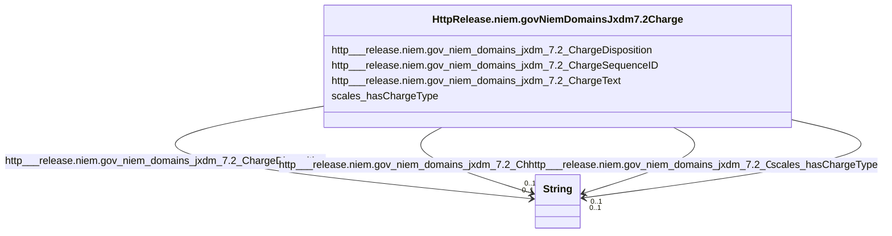

# Class: No class (type) name specified (http___release.niem.gov_niem_domains_jxdm_7.2_Charge)


_No class (type) description specified_


This class occurs 6280 times.


URI: [http://release.niem.gov/niem/domains/jxdm/7.2/Charge](http://release.niem.gov/niem/domains/jxdm/7.2/Charge)





<!-- no inheritance hierarchy -->


## Slots

| Name | Cardinality and Range | Description | Inheritance | Occurrences |
| ---  | --- | --- | --- | --- |
| [http___release.niem.gov_niem_domains_jxdm_7.2_ChargeDisposition](../slots/http___release.niem.gov_niem_domains_jxdm_7.2_ChargeDisposition.md) | 0..1 <br/> [xsd:string](http://www.w3.org/2001/XMLSchema#string) | No slot (predicate) description specified <br/>  | direct | 6280 |
| [scales_hasChargeType](../slots/scales_hasChargeType.md) | 0..1 <br/> [xsd:string](http://www.w3.org/2001/XMLSchema#string) | No slot (predicate) description specified <br/>  | direct | 6280 |
| [http___release.niem.gov_niem_domains_jxdm_7.2_ChargeSequenceID](../slots/http___release.niem.gov_niem_domains_jxdm_7.2_ChargeSequenceID.md) | 0..1 <br/> [xsd:string](http://www.w3.org/2001/XMLSchema#string) | No slot (predicate) description specified <br/>  | direct | 6280 |
| [http___release.niem.gov_niem_domains_jxdm_7.2_ChargeText](../slots/http___release.niem.gov_niem_domains_jxdm_7.2_ChargeText.md) | 0..1 <br/> [xsd:string](http://www.w3.org/2001/XMLSchema#string) | No slot (predicate) description specified <br/>  | direct | 6280 |


## Usages

| used by | used in | type | used |
| ---  | --- | --- | --- |
| [HttpRelease.niem.govNiemDomainsJxdm7.2Case](../classes/HttpRelease.niem.govNiemDomainsJxdm7.2Case.md) | [http___release.niem.gov_niem_domains_jxdm_7.2_CaseCharge](../slots/http___release.niem.gov_niem_domains_jxdm_7.2_CaseCharge.md) | range | [HttpRelease.niem.govNiemDomainsJxdm7.2Charge](../classes/HttpRelease.niem.govNiemDomainsJxdm7.2Charge.md) |
| [HttpRelease.niem.govNiemDomainsJxdm7.2CaseDefendantParty](../classes/HttpRelease.niem.govNiemDomainsJxdm7.2CaseDefendantParty.md) | [http___release.niem.gov_niem_domains_jxdm_7.2_PersonCharge](../slots/http___release.niem.gov_niem_domains_jxdm_7.2_PersonCharge.md) | range | [HttpRelease.niem.govNiemDomainsJxdm7.2Charge](../classes/HttpRelease.niem.govNiemDomainsJxdm7.2Charge.md) |
| [ScalesCase](../classes/ScalesCase.md) | [http___release.niem.gov_niem_domains_jxdm_7.2_CaseCharge](../slots/http___release.niem.gov_niem_domains_jxdm_7.2_CaseCharge.md) | range | [HttpRelease.niem.govNiemDomainsJxdm7.2Charge](../classes/HttpRelease.niem.govNiemDomainsJxdm7.2Charge.md) |


## LinkML Source

<!-- TODO: investigate https://stackoverflow.com/questions/37606292/how-to-create-tabbed-code-blocks-in-mkdocs-or-sphinx -->

### Direct

<details>

```yaml
name: http___release.niem.gov_niem_domains_jxdm_7.2_Charge
conforms_to: No schema conformance document specified
annotations:
  count:
    tag: count
    value: 6280
description: No class (type) description specified
title: No class (type) name specified
from_schema: scales-kg
rank: 1000
slots:
- http___release.niem.gov_niem_domains_jxdm_7.2_ChargeDisposition
- scales_hasChargeType
- http___release.niem.gov_niem_domains_jxdm_7.2_ChargeSequenceID
- http___release.niem.gov_niem_domains_jxdm_7.2_ChargeText
slot_usage:
  http___release.niem.gov_niem_domains_jxdm_7.2_ChargeDisposition:
    name: http___release.niem.gov_niem_domains_jxdm_7.2_ChargeDisposition
    annotations:
      string:
        tag: string
        value: 6280
  http___release.niem.gov_niem_domains_jxdm_7.2_ChargeSequenceID:
    name: http___release.niem.gov_niem_domains_jxdm_7.2_ChargeSequenceID
    annotations:
      string:
        tag: string
        value: 6280
  http___release.niem.gov_niem_domains_jxdm_7.2_ChargeText:
    name: http___release.niem.gov_niem_domains_jxdm_7.2_ChargeText
    annotations:
      string:
        tag: string
        value: 6280
  scales_hasChargeType:
    name: scales_hasChargeType
    annotations:
      string:
        tag: string
        value: 6280
class_uri: http://release.niem.gov/niem/domains/jxdm/7.2/Charge

```
</details>

### Induced

<details>

```yaml
name: http___release.niem.gov_niem_domains_jxdm_7.2_Charge
conforms_to: No schema conformance document specified
annotations:
  count:
    tag: count
    value: 6280
description: No class (type) description specified
title: No class (type) name specified
from_schema: scales-kg
rank: 1000
slot_usage:
  http___release.niem.gov_niem_domains_jxdm_7.2_ChargeDisposition:
    name: http___release.niem.gov_niem_domains_jxdm_7.2_ChargeDisposition
    annotations:
      string:
        tag: string
        value: 6280
  http___release.niem.gov_niem_domains_jxdm_7.2_ChargeSequenceID:
    name: http___release.niem.gov_niem_domains_jxdm_7.2_ChargeSequenceID
    annotations:
      string:
        tag: string
        value: 6280
  http___release.niem.gov_niem_domains_jxdm_7.2_ChargeText:
    name: http___release.niem.gov_niem_domains_jxdm_7.2_ChargeText
    annotations:
      string:
        tag: string
        value: 6280
  scales_hasChargeType:
    name: scales_hasChargeType
    annotations:
      string:
        tag: string
        value: 6280
attributes:
  http___release.niem.gov_niem_domains_jxdm_7.2_ChargeDisposition:
    name: http___release.niem.gov_niem_domains_jxdm_7.2_ChargeDisposition
    annotations:
      string:
        tag: string
        value: 6280
    description: No slot (predicate) description specified
    examples:
    - object:
        example_object: Government's oral motion to dismiss case without prejudice
          - granted
        example_object_type: string
        example_predicate: http://release.niem.gov/niem/domains/jxdm/7.2/ChargeDisposition
        example_subject: scales:/Charge/casd;;3:17-cr-00001_c0-1
        example_subject_type: http___release.niem.gov_niem_domains_jxdm_7.2_Charge
    from_schema: scales-kg
    rank: 1000
    slot_uri: http://release.niem.gov/niem/domains/jxdm/7.2/ChargeDisposition
    alias: http___release.niem.gov_niem_domains_jxdm_7.2_ChargeDisposition
    owner: http___release.niem.gov_niem_domains_jxdm_7.2_Charge
    domain_of:
    - http___release.niem.gov_niem_domains_jxdm_7.2_Charge
    range: string
  scales_hasChargeType:
    name: scales_hasChargeType
    annotations:
      string:
        tag: string
        value: 6280
    description: No slot (predicate) description specified
    examples:
    - object:
        example_object: terminated
        example_object_type: string
        example_predicate: scales:hasChargeType
        example_subject: scales:/Charge/casd;;3:17-cr-00001_c0-1
        example_subject_type: http___release.niem.gov_niem_domains_jxdm_7.2_Charge
    from_schema: scales-kg
    rank: 1000
    slot_uri: scales:hasChargeType
    alias: scales_hasChargeType
    owner: http___release.niem.gov_niem_domains_jxdm_7.2_Charge
    domain_of:
    - http___release.niem.gov_niem_domains_jxdm_7.2_Charge
    range: string
  http___release.niem.gov_niem_domains_jxdm_7.2_ChargeSequenceID:
    name: http___release.niem.gov_niem_domains_jxdm_7.2_ChargeSequenceID
    annotations:
      string:
        tag: string
        value: 6280
    description: No slot (predicate) description specified
    examples:
    - object:
        example_object: '1'
        example_object_type: string
        example_predicate: http://release.niem.gov/niem/domains/jxdm/7.2/ChargeSequenceID
        example_subject: scales:/Charge/casd;;3:17-cr-00001_c0-1
        example_subject_type: http___release.niem.gov_niem_domains_jxdm_7.2_Charge
    from_schema: scales-kg
    rank: 1000
    slot_uri: http://release.niem.gov/niem/domains/jxdm/7.2/ChargeSequenceID
    alias: http___release.niem.gov_niem_domains_jxdm_7.2_ChargeSequenceID
    owner: http___release.niem.gov_niem_domains_jxdm_7.2_Charge
    domain_of:
    - http___release.niem.gov_niem_domains_jxdm_7.2_Charge
    range: string
  http___release.niem.gov_niem_domains_jxdm_7.2_ChargeText:
    name: http___release.niem.gov_niem_domains_jxdm_7.2_ChargeText
    annotations:
      string:
        tag: string
        value: 6280
    description: No slot (predicate) description specified
    examples:
    - object:
        example_object: 18:111(a)
        example_object_type: string
        example_predicate: http://release.niem.gov/niem/domains/jxdm/7.2/ChargeText
        example_subject: scales:/Charge/casd;;3:17-cr-00001_c0-1
        example_subject_type: http___release.niem.gov_niem_domains_jxdm_7.2_Charge
    from_schema: scales-kg
    rank: 1000
    slot_uri: http://release.niem.gov/niem/domains/jxdm/7.2/ChargeText
    alias: http___release.niem.gov_niem_domains_jxdm_7.2_ChargeText
    owner: http___release.niem.gov_niem_domains_jxdm_7.2_Charge
    domain_of:
    - http___release.niem.gov_niem_domains_jxdm_7.2_Charge
    range: string
class_uri: http://release.niem.gov/niem/domains/jxdm/7.2/Charge

```
</details>