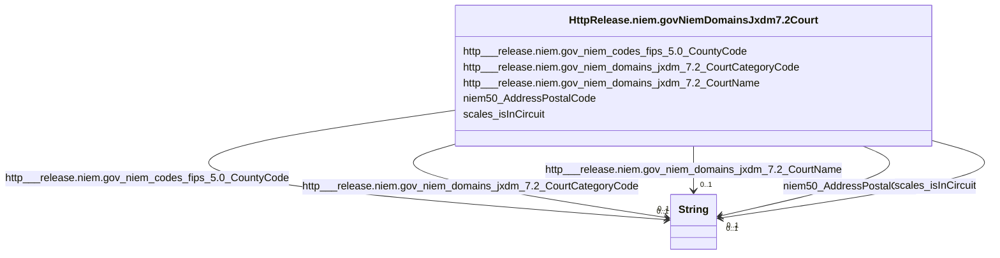

# Class: No class (type) name specified (http___release.niem.gov_niem_domains_jxdm_7.2_Court)


_No class (type) description specified_


This class occurs 94 times.


URI: [http://release.niem.gov/niem/domains/jxdm/7.2/Court](http://release.niem.gov/niem/domains/jxdm/7.2/Court)





<!-- no inheritance hierarchy -->


## Slots

| Name | Cardinality and Range | Description | Inheritance | Occurrences |
| ---  | --- | --- | --- | --- |
| [http___release.niem.gov_niem_domains_jxdm_7.2_CourtName](../slots/http___release.niem.gov_niem_domains_jxdm_7.2_CourtName.md) | 0..1 <br/> [xsd:string](http://www.w3.org/2001/XMLSchema#string) | No slot (predicate) description specified <br/>  | direct | 94 |
| [scales_isInCircuit](../slots/scales_isInCircuit.md) | 0..1 <br/> [xsd:string](http://www.w3.org/2001/XMLSchema#string) | No slot (predicate) description specified <br/>  | direct | 94 |
| [http___release.niem.gov_niem_domains_jxdm_7.2_CourtCategoryCode](../slots/http___release.niem.gov_niem_domains_jxdm_7.2_CourtCategoryCode.md) | 0..1 <br/> [xsd:string](http://www.w3.org/2001/XMLSchema#string) | No slot (predicate) description specified <br/>  | direct | 94 |
| [niem50_AddressPostalCode](../slots/niem50_AddressPostalCode.md) | 0..1 <br/> [xsd:string](http://www.w3.org/2001/XMLSchema#string) | No slot (predicate) description specified <br/>  | direct | 40932 |
| [http___release.niem.gov_niem_codes_fips_5.0_CountyCode](../slots/http___release.niem.gov_niem_codes_fips_5.0_CountyCode.md) | 0..1 <br/> [xsd:string](http://www.w3.org/2001/XMLSchema#string) | No slot (predicate) description specified <br/>  | direct | 3035 |


## Usages

| used by | used in | type | used |
| ---  | --- | --- | --- |
| [HttpRelease.niem.govNiemDomainsJxdm7.2Case](../classes/HttpRelease.niem.govNiemDomainsJxdm7.2Case.md) | [http___release.niem.gov_niem_domains_jxdm_7.2_CaseCourt](../slots/http___release.niem.gov_niem_domains_jxdm_7.2_CaseCourt.md) | range | [HttpRelease.niem.govNiemDomainsJxdm7.2Court](../classes/HttpRelease.niem.govNiemDomainsJxdm7.2Court.md) |
| [ScalesCase](../classes/ScalesCase.md) | [http___release.niem.gov_niem_domains_jxdm_7.2_CaseCourt](../slots/http___release.niem.gov_niem_domains_jxdm_7.2_CaseCourt.md) | range | [HttpRelease.niem.govNiemDomainsJxdm7.2Court](../classes/HttpRelease.niem.govNiemDomainsJxdm7.2Court.md) |


## LinkML Source

<!-- TODO: investigate https://stackoverflow.com/questions/37606292/how-to-create-tabbed-code-blocks-in-mkdocs-or-sphinx -->

### Direct

<details>

```yaml
name: http___release.niem.gov_niem_domains_jxdm_7.2_Court
conforms_to: No schema conformance document specified
annotations:
  count:
    tag: count
    value: 94
description: No class (type) description specified
title: No class (type) name specified
from_schema: scales-kg
rank: 1000
slots:
- http___release.niem.gov_niem_domains_jxdm_7.2_CourtName
- scales_isInCircuit
- http___release.niem.gov_niem_domains_jxdm_7.2_CourtCategoryCode
- niem50_AddressPostalCode
- http___release.niem.gov_niem_codes_fips_5.0_CountyCode
slot_usage:
  http___release.niem.gov_niem_codes_fips_5.0_CountyCode:
    name: http___release.niem.gov_niem_codes_fips_5.0_CountyCode
    annotations:
      string:
        tag: string
        value: 3035
  http___release.niem.gov_niem_domains_jxdm_7.2_CourtCategoryCode:
    name: http___release.niem.gov_niem_domains_jxdm_7.2_CourtCategoryCode
    annotations:
      string:
        tag: string
        value: 94
  http___release.niem.gov_niem_domains_jxdm_7.2_CourtName:
    name: http___release.niem.gov_niem_domains_jxdm_7.2_CourtName
    annotations:
      string:
        tag: string
        value: 94
  niem50_AddressPostalCode:
    name: niem50_AddressPostalCode
    annotations:
      string:
        tag: string
        value: 40932
  scales_isInCircuit:
    name: scales_isInCircuit
    annotations:
      string:
        tag: string
        value: 94
class_uri: http://release.niem.gov/niem/domains/jxdm/7.2/Court

```
</details>

### Induced

<details>

```yaml
name: http___release.niem.gov_niem_domains_jxdm_7.2_Court
conforms_to: No schema conformance document specified
annotations:
  count:
    tag: count
    value: 94
description: No class (type) description specified
title: No class (type) name specified
from_schema: scales-kg
rank: 1000
slot_usage:
  http___release.niem.gov_niem_codes_fips_5.0_CountyCode:
    name: http___release.niem.gov_niem_codes_fips_5.0_CountyCode
    annotations:
      string:
        tag: string
        value: 3035
  http___release.niem.gov_niem_domains_jxdm_7.2_CourtCategoryCode:
    name: http___release.niem.gov_niem_domains_jxdm_7.2_CourtCategoryCode
    annotations:
      string:
        tag: string
        value: 94
  http___release.niem.gov_niem_domains_jxdm_7.2_CourtName:
    name: http___release.niem.gov_niem_domains_jxdm_7.2_CourtName
    annotations:
      string:
        tag: string
        value: 94
  niem50_AddressPostalCode:
    name: niem50_AddressPostalCode
    annotations:
      string:
        tag: string
        value: 40932
  scales_isInCircuit:
    name: scales_isInCircuit
    annotations:
      string:
        tag: string
        value: 94
attributes:
  http___release.niem.gov_niem_domains_jxdm_7.2_CourtName:
    name: http___release.niem.gov_niem_domains_jxdm_7.2_CourtName
    annotations:
      string:
        tag: string
        value: 94
    description: No slot (predicate) description specified
    examples:
    - object:
        example_object: District Court, S.D. California
        example_object_type: string
        example_predicate: http://release.niem.gov/niem/domains/jxdm/7.2/CourtName
        example_subject: scales:/Court/casd
        example_subject_type: http___release.niem.gov_niem_domains_jxdm_7.2_Court
    from_schema: scales-kg
    rank: 1000
    slot_uri: http://release.niem.gov/niem/domains/jxdm/7.2/CourtName
    alias: http___release.niem.gov_niem_domains_jxdm_7.2_CourtName
    owner: http___release.niem.gov_niem_domains_jxdm_7.2_Court
    domain_of:
    - http___release.niem.gov_niem_domains_jxdm_7.2_Court
    range: string
  scales_isInCircuit:
    name: scales_isInCircuit
    annotations:
      string:
        tag: string
        value: 94
    description: No slot (predicate) description specified
    examples:
    - object:
        example_object: Ninth
        example_object_type: string
        example_predicate: scales:isInCircuit
        example_subject: scales:/Court/casd
        example_subject_type: http___release.niem.gov_niem_domains_jxdm_7.2_Court
    from_schema: scales-kg
    rank: 1000
    slot_uri: scales:isInCircuit
    alias: scales_isInCircuit
    owner: http___release.niem.gov_niem_domains_jxdm_7.2_Court
    domain_of:
    - http___release.niem.gov_niem_domains_jxdm_7.2_Court
    range: string
  http___release.niem.gov_niem_domains_jxdm_7.2_CourtCategoryCode:
    name: http___release.niem.gov_niem_domains_jxdm_7.2_CourtCategoryCode
    annotations:
      string:
        tag: string
        value: 94
    description: No slot (predicate) description specified
    examples:
    - object:
        example_object: FED
        example_object_type: string
        example_predicate: http://release.niem.gov/niem/domains/jxdm/7.2/CourtCategoryCode
        example_subject: scales:/Court/casd
        example_subject_type: http___release.niem.gov_niem_domains_jxdm_7.2_Court
    from_schema: scales-kg
    rank: 1000
    slot_uri: http://release.niem.gov/niem/domains/jxdm/7.2/CourtCategoryCode
    alias: http___release.niem.gov_niem_domains_jxdm_7.2_CourtCategoryCode
    owner: http___release.niem.gov_niem_domains_jxdm_7.2_Court
    domain_of:
    - http___release.niem.gov_niem_domains_jxdm_7.2_Court
    range: string
  niem50_AddressPostalCode:
    name: niem50_AddressPostalCode
    annotations:
      string:
        tag: string
        value: 40932
    description: No slot (predicate) description specified
    examples:
    - object:
        example_object: '91901'
        example_object_type: string
        example_predicate: niem50:AddressPostalCode
        example_subject: scales:/Court/casd
        example_subject_type: http___release.niem.gov_niem_domains_jxdm_7.2_Court
    from_schema: scales-kg
    rank: 1000
    slot_uri: niem50:AddressPostalCode
    alias: niem50_AddressPostalCode
    owner: http___release.niem.gov_niem_domains_jxdm_7.2_Court
    domain_of:
    - http___release.niem.gov_niem_domains_jxdm_7.2_Court
    range: string
  http___release.niem.gov_niem_codes_fips_5.0_CountyCode:
    name: http___release.niem.gov_niem_codes_fips_5.0_CountyCode
    annotations:
      string:
        tag: string
        value: 3035
    description: No slot (predicate) description specified
    examples:
    - object:
        example_object: '06025'
        example_object_type: string
        example_predicate: http://release.niem.gov/niem/codes/fips/5.0/CountyCode
        example_subject: scales:/Court/casd
        example_subject_type: http___release.niem.gov_niem_domains_jxdm_7.2_Court
    from_schema: scales-kg
    rank: 1000
    slot_uri: http://release.niem.gov/niem/codes/fips/5.0/CountyCode
    alias: http___release.niem.gov_niem_codes_fips_5.0_CountyCode
    owner: http___release.niem.gov_niem_domains_jxdm_7.2_Court
    domain_of:
    - http___release.niem.gov_niem_domains_jxdm_7.2_Court
    range: string
class_uri: http://release.niem.gov/niem/domains/jxdm/7.2/Court

```
</details>