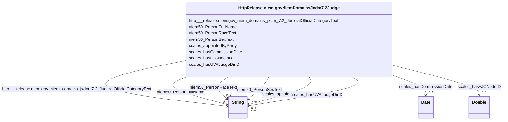

# Class: No class (type) name specified (http___release.niem.gov_niem_domains_jxdm_7.2_Judge)


_No class (type) description specified_


This class occurs 5385 times.


URI: [http://release.niem.gov/niem/domains/jxdm/7.2/Judge](http://release.niem.gov/niem/domains/jxdm/7.2/Judge)





<!-- no inheritance hierarchy -->


## Slots

| Name | Cardinality and Range | Description | Inheritance | Occurrences |
| ---  | --- | --- | --- | --- |
| [scales_appointedByParty](../slots/scales_appointedByParty.md) | 0..1 <br/> [xsd:string](http://www.w3.org/2001/XMLSchema#string) | No slot (predicate) description specified <br/>  | direct | 3912 |
| [niem50_PersonRaceText](../slots/niem50_PersonRaceText.md) | 0..1 <br/> [xsd:string](http://www.w3.org/2001/XMLSchema#string) | No slot (predicate) description specified <br/>  | direct | 3762 |
| [niem50_PersonSexText](../slots/niem50_PersonSexText.md) | 0..1 <br/> [xsd:string](http://www.w3.org/2001/XMLSchema#string) | No slot (predicate) description specified <br/>  | direct | 3762 |
| [http___release.niem.gov_niem_domains_jxdm_7.2_JudicialOfficialCategoryText](../slots/http___release.niem.gov_niem_domains_jxdm_7.2_JudicialOfficialCategoryText.md) | 0..1 <br/> [xsd:string](http://www.w3.org/2001/XMLSchema#string) | No slot (predicate) description specified <br/>  | direct | 5385 |
| [scales_hasFJCNodeID](../slots/scales_hasFJCNodeID.md) | 0..1 <br/> [xsd:double](http://www.w3.org/2001/XMLSchema#double) | No slot (predicate) description specified <br/>  | direct | 3855 |
| [scales_hasCommissionDate](../slots/scales_hasCommissionDate.md) | 0..1 <br/> [xsd:date](http://www.w3.org/2001/XMLSchema#date) | No slot (predicate) description specified <br/>  | direct | 4257 |
| [niem50_PersonFullName](../slots/niem50_PersonFullName.md) | 0..1 <br/> [xsd:string](http://www.w3.org/2001/XMLSchema#string) | No slot (predicate) description specified <br/>  | direct | 5385 |
| [scales_hasUVAJudgeDirID](../slots/scales_hasUVAJudgeDirID.md) | 0..1 <br/> [xsd:string](http://www.w3.org/2001/XMLSchema#string) | No slot (predicate) description specified <br/>  | direct | 988 |


## LinkML Source

<!-- TODO: investigate https://stackoverflow.com/questions/37606292/how-to-create-tabbed-code-blocks-in-mkdocs-or-sphinx -->

### Direct

<details>

```yaml
name: http___release.niem.gov_niem_domains_jxdm_7.2_Judge
conforms_to: No schema conformance document specified
annotations:
  count:
    tag: count
    value: 5385
description: No class (type) description specified
title: No class (type) name specified
from_schema: scales-kg
rank: 1000
slots:
- scales_appointedByParty
- niem50_PersonRaceText
- niem50_PersonSexText
- http___release.niem.gov_niem_domains_jxdm_7.2_JudicialOfficialCategoryText
- scales_hasFJCNodeID
- scales_hasCommissionDate
- niem50_PersonFullName
- scales_hasUVAJudgeDirID
slot_usage:
  http___release.niem.gov_niem_domains_jxdm_7.2_JudicialOfficialCategoryText:
    name: http___release.niem.gov_niem_domains_jxdm_7.2_JudicialOfficialCategoryText
    annotations:
      string:
        tag: string
        value: 5385
  niem50_PersonFullName:
    name: niem50_PersonFullName
    annotations:
      string:
        tag: string
        value: 5385
  niem50_PersonRaceText:
    name: niem50_PersonRaceText
    annotations:
      string:
        tag: string
        value: 3762
  niem50_PersonSexText:
    name: niem50_PersonSexText
    annotations:
      string:
        tag: string
        value: 3762
  scales_appointedByParty:
    name: scales_appointedByParty
    annotations:
      string:
        tag: string
        value: 3912
  scales_hasCommissionDate:
    name: scales_hasCommissionDate
    annotations:
      date:
        tag: date
        value: 4257
  scales_hasFJCNodeID:
    name: scales_hasFJCNodeID
    annotations:
      double:
        tag: double
        value: 3855
  scales_hasUVAJudgeDirID:
    name: scales_hasUVAJudgeDirID
    annotations:
      string:
        tag: string
        value: 988
class_uri: http://release.niem.gov/niem/domains/jxdm/7.2/Judge

```
</details>

### Induced

<details>

```yaml
name: http___release.niem.gov_niem_domains_jxdm_7.2_Judge
conforms_to: No schema conformance document specified
annotations:
  count:
    tag: count
    value: 5385
description: No class (type) description specified
title: No class (type) name specified
from_schema: scales-kg
rank: 1000
slot_usage:
  http___release.niem.gov_niem_domains_jxdm_7.2_JudicialOfficialCategoryText:
    name: http___release.niem.gov_niem_domains_jxdm_7.2_JudicialOfficialCategoryText
    annotations:
      string:
        tag: string
        value: 5385
  niem50_PersonFullName:
    name: niem50_PersonFullName
    annotations:
      string:
        tag: string
        value: 5385
  niem50_PersonRaceText:
    name: niem50_PersonRaceText
    annotations:
      string:
        tag: string
        value: 3762
  niem50_PersonSexText:
    name: niem50_PersonSexText
    annotations:
      string:
        tag: string
        value: 3762
  scales_appointedByParty:
    name: scales_appointedByParty
    annotations:
      string:
        tag: string
        value: 3912
  scales_hasCommissionDate:
    name: scales_hasCommissionDate
    annotations:
      date:
        tag: date
        value: 4257
  scales_hasFJCNodeID:
    name: scales_hasFJCNodeID
    annotations:
      double:
        tag: double
        value: 3855
  scales_hasUVAJudgeDirID:
    name: scales_hasUVAJudgeDirID
    annotations:
      string:
        tag: string
        value: 988
attributes:
  scales_appointedByParty:
    name: scales_appointedByParty
    annotations:
      string:
        tag: string
        value: 3912
    description: No slot (predicate) description specified
    examples:
    - object:
        example_object: Democratic
        example_object_type: string
        example_predicate: scales:appointedByParty
        example_subject: scales:JudgeEntity/SJ000002
        example_subject_type: http___release.niem.gov_niem_domains_jxdm_7.2_Judge
    from_schema: scales-kg
    rank: 1000
    slot_uri: scales:appointedByParty
    alias: scales_appointedByParty
    owner: http___release.niem.gov_niem_domains_jxdm_7.2_Judge
    domain_of:
    - http___release.niem.gov_niem_domains_jxdm_7.2_Judge
    range: string
  niem50_PersonRaceText:
    name: niem50_PersonRaceText
    annotations:
      string:
        tag: string
        value: 3762
    description: No slot (predicate) description specified
    examples:
    - object:
        example_object: White
        example_object_type: string
        example_predicate: niem50:PersonRaceText
        example_subject: scales:JudgeEntity/SJ000002
        example_subject_type: http___release.niem.gov_niem_domains_jxdm_7.2_Judge
    - object:
        example_object: B
        example_object_type: string
        example_predicate: niem50:PersonRaceText
        example_subject: scales:Agent/10000019_0
        example_subject_type: scales_Agent
    from_schema: scales-kg
    rank: 1000
    slot_uri: niem50:PersonRaceText
    alias: niem50_PersonRaceText
    owner: http___release.niem.gov_niem_domains_jxdm_7.2_Judge
    domain_of:
    - http___release.niem.gov_niem_domains_jxdm_7.2_Judge
    - scales_Agent
    range: string
  niem50_PersonSexText:
    name: niem50_PersonSexText
    annotations:
      string:
        tag: string
        value: 3762
    description: No slot (predicate) description specified
    examples:
    - object:
        example_object: Male
        example_object_type: string
        example_predicate: niem50:PersonSexText
        example_subject: scales:JudgeEntity/SJ000002
        example_subject_type: http___release.niem.gov_niem_domains_jxdm_7.2_Judge
    from_schema: scales-kg
    rank: 1000
    slot_uri: niem50:PersonSexText
    alias: niem50_PersonSexText
    owner: http___release.niem.gov_niem_domains_jxdm_7.2_Judge
    domain_of:
    - http___release.niem.gov_niem_domains_jxdm_7.2_Judge
    range: string
  http___release.niem.gov_niem_domains_jxdm_7.2_JudicialOfficialCategoryText:
    name: http___release.niem.gov_niem_domains_jxdm_7.2_JudicialOfficialCategoryText
    annotations:
      string:
        tag: string
        value: 5385
    description: No slot (predicate) description specified
    examples:
    - object:
        example_object: Magistrate_Judge
        example_object_type: string
        example_predicate: http://release.niem.gov/niem/domains/jxdm/7.2/JudicialOfficialCategoryText
        example_subject: scales:JudgeEntity/SJ000001
        example_subject_type: http___release.niem.gov_niem_domains_jxdm_7.2_Judge
    from_schema: scales-kg
    rank: 1000
    slot_uri: http://release.niem.gov/niem/domains/jxdm/7.2/JudicialOfficialCategoryText
    alias: http___release.niem.gov_niem_domains_jxdm_7.2_JudicialOfficialCategoryText
    owner: http___release.niem.gov_niem_domains_jxdm_7.2_Judge
    domain_of:
    - http___release.niem.gov_niem_domains_jxdm_7.2_Judge
    range: string
  scales_hasFJCNodeID:
    name: scales_hasFJCNodeID
    annotations:
      double:
        tag: double
        value: 3855
    description: No slot (predicate) description specified
    examples:
    - object:
        example_object: '1388511.0'
        example_object_type: double
        example_predicate: scales:hasFJCNodeID
        example_subject: scales:JudgeEntity/SJ000002
        example_subject_type: http___release.niem.gov_niem_domains_jxdm_7.2_Judge
    from_schema: scales-kg
    rank: 1000
    slot_uri: scales:hasFJCNodeID
    alias: scales_hasFJCNodeID
    owner: http___release.niem.gov_niem_domains_jxdm_7.2_Judge
    domain_of:
    - http___release.niem.gov_niem_domains_jxdm_7.2_Judge
    range: double
  scales_hasCommissionDate:
    name: scales_hasCommissionDate
    annotations:
      date:
        tag: date
        value: 4257
    description: No slot (predicate) description specified
    examples:
    - object:
        example_object: '2007-03-14'
        example_object_type: date
        example_predicate: scales:hasCommissionDate
        example_subject: scales:JudgeEntity/SJ000009
        example_subject_type: http___release.niem.gov_niem_domains_jxdm_7.2_Judge
    from_schema: scales-kg
    rank: 1000
    slot_uri: scales:hasCommissionDate
    alias: scales_hasCommissionDate
    owner: http___release.niem.gov_niem_domains_jxdm_7.2_Judge
    domain_of:
    - http___release.niem.gov_niem_domains_jxdm_7.2_Judge
    range: date
  niem50_PersonFullName:
    name: niem50_PersonFullName
    annotations:
      string:
        tag: string
        value: 5385
    description: No slot (predicate) description specified
    examples:
    - object:
        example_object: Timothy M. Burgess
        example_object_type: string
        example_predicate: niem50:PersonFullName
        example_subject: scales:Agent/akd;;1:16-cr-00001_a2
        example_subject_type: None
    - object:
        example_object: Matthew McCrary Scoble
        example_object_type: string
        example_predicate: niem50:PersonFullName
        example_subject: scales:Agent/akd;;1:16-cr-00001_a3
        example_subject_type: http___release.niem.gov_niem_domains_jxdm_7.2_CaseDefenseAttorney
    - object:
        example_object: Jack S. Schmidt
        example_object_type: string
        example_predicate: niem50:PersonFullName
        example_subject: scales:Agent/akd;;1:16-cr-00001_a5
        example_subject_type: http___release.niem.gov_niem_domains_jxdm_7.2_CaseInitiatingAttorney
    - object:
        example_object: Mary Ann Lundquist
        example_object_type: string
        example_predicate: niem50:PersonFullName
        example_subject: scales:Agent/akd;;1:16-cv-00008_a22
        example_subject_type: http___release.niem.gov_niem_domains_jxdm_7.2_Attorney
    - object:
        example_object: BRAZELTON TROY DBA
        example_object_type: string
        example_predicate: niem50:PersonFullName
        example_subject: scales:Agent/ga-clayton-magistrate-civil;;0:00-cm-00001_a0
        example_subject_type: scales_Party
    - object:
        example_object: BAIRD
        example_object_type: string
        example_predicate: niem50:PersonFullName
        example_subject: scales:Judge/ga-clayton-magistrate-civil;;0:00-cm-00001_3
        example_subject_type: http___release.niem.gov_niem_domains_jxdm_7.2_CaseJudge
    - object:
        example_object: Stephen H Locher
        example_object_type: string
        example_predicate: niem50:PersonFullName
        example_subject: scales:JudgeEntity/SJ000001
        example_subject_type: http___release.niem.gov_niem_domains_jxdm_7.2_Judge
    from_schema: scales-kg
    rank: 1000
    slot_uri: niem50:PersonFullName
    alias: niem50_PersonFullName
    owner: http___release.niem.gov_niem_domains_jxdm_7.2_Judge
    domain_of:
    - http___release.niem.gov_niem_domains_jxdm_7.2_Attorney
    - http___release.niem.gov_niem_domains_jxdm_7.2_CaseDefenseAttorney
    - http___release.niem.gov_niem_domains_jxdm_7.2_CaseInitiatingAttorney
    - http___release.niem.gov_niem_domains_jxdm_7.2_CaseJudge
    - http___release.niem.gov_niem_domains_jxdm_7.2_Judge
    - scales_Party
    range: string
  scales_hasUVAJudgeDirID:
    name: scales_hasUVAJudgeDirID
    annotations:
      string:
        tag: string
        value: 988
    description: No slot (predicate) description specified
    examples:
    - object:
        example_object: mag-424
        example_object_type: string
        example_predicate: scales:hasUVAJudgeDirID
        example_subject: scales:JudgeEntity/SJ000018
        example_subject_type: http___release.niem.gov_niem_domains_jxdm_7.2_Judge
    from_schema: scales-kg
    rank: 1000
    slot_uri: scales:hasUVAJudgeDirID
    alias: scales_hasUVAJudgeDirID
    owner: http___release.niem.gov_niem_domains_jxdm_7.2_Judge
    domain_of:
    - http___release.niem.gov_niem_domains_jxdm_7.2_Judge
    range: string
class_uri: http://release.niem.gov/niem/domains/jxdm/7.2/Judge

```
</details>