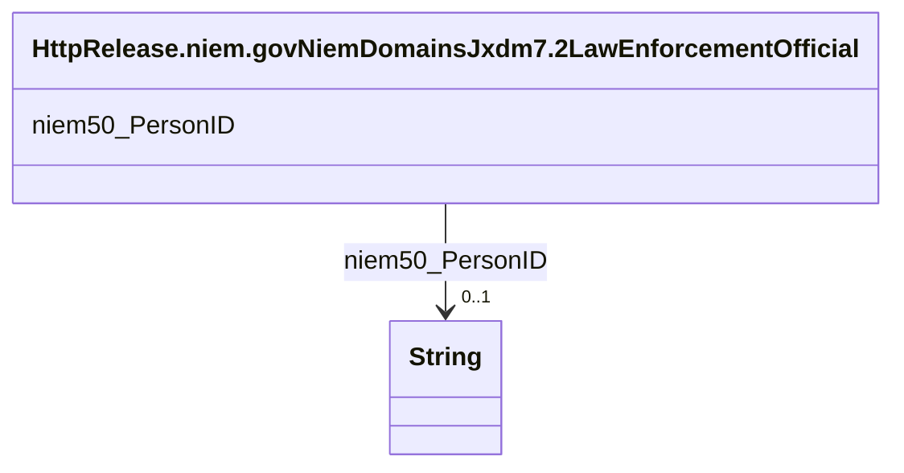

# Class: No class (type) name specified (http___release.niem.gov_niem_domains_jxdm_7.2_LawEnforcementOfficial)


_No class (type) description specified_


This class occurs 2016 times.


URI: [http://release.niem.gov/niem/domains/jxdm/7.2/LawEnforcementOfficial](http://release.niem.gov/niem/domains/jxdm/7.2/LawEnforcementOfficial)





<!-- no inheritance hierarchy -->


## Slots

| Name | Cardinality and Range | Description | Inheritance | Occurrences |
| ---  | --- | --- | --- | --- |
| [niem50_PersonID](../slots/niem50_PersonID.md) | 0..1 <br/> [xsd:string](http://www.w3.org/2001/XMLSchema#string) | No slot (predicate) description specified <br/>  | direct | 2020 |


## Usages

| used by | used in | type | used |
| ---  | --- | --- | --- |
| [HttpRelease.niem.govNiemDomainsJxdm7.2Arrest](../classes/HttpRelease.niem.govNiemDomainsJxdm7.2Arrest.md) | [http___release.niem.gov_niem_domains_jxdm_7.2_ArrestOfficial](../slots/http___release.niem.gov_niem_domains_jxdm_7.2_ArrestOfficial.md) | range | [HttpRelease.niem.govNiemDomainsJxdm7.2LawEnforcementOfficial](../classes/HttpRelease.niem.govNiemDomainsJxdm7.2LawEnforcementOfficial.md) |


## LinkML Source

<!-- TODO: investigate https://stackoverflow.com/questions/37606292/how-to-create-tabbed-code-blocks-in-mkdocs-or-sphinx -->

### Direct

<details>

```yaml
name: http___release.niem.gov_niem_domains_jxdm_7.2_LawEnforcementOfficial
conforms_to: No schema conformance document specified
annotations:
  count:
    tag: count
    value: 2016
description: No class (type) description specified
title: No class (type) name specified
from_schema: scales-kg
rank: 1000
slots:
- niem50_PersonID
slot_usage:
  niem50_PersonID:
    name: niem50_PersonID
    annotations:
      string:
        tag: string
        value: 2020
class_uri: http://release.niem.gov/niem/domains/jxdm/7.2/LawEnforcementOfficial

```
</details>

### Induced

<details>

```yaml
name: http___release.niem.gov_niem_domains_jxdm_7.2_LawEnforcementOfficial
conforms_to: No schema conformance document specified
annotations:
  count:
    tag: count
    value: 2016
description: No class (type) description specified
title: No class (type) name specified
from_schema: scales-kg
rank: 1000
slot_usage:
  niem50_PersonID:
    name: niem50_PersonID
    annotations:
      string:
        tag: string
        value: 2020
attributes:
  niem50_PersonID:
    name: niem50_PersonID
    annotations:
      string:
        tag: string
        value: 2020
    description: No slot (predicate) description specified
    examples:
    - object:
        example_object: '10'
        example_object_type: string
        example_predicate: niem50:PersonID
        example_subject: scales:PoliceOfficer/ga-atlanta-pd-10
        example_subject_type: http___release.niem.gov_niem_domains_jxdm_7.2_LawEnforcementOfficial
    from_schema: scales-kg
    rank: 1000
    slot_uri: niem50:PersonID
    alias: niem50_PersonID
    owner: http___release.niem.gov_niem_domains_jxdm_7.2_LawEnforcementOfficial
    domain_of:
    - http___release.niem.gov_niem_domains_jxdm_7.2_LawEnforcementOfficial
    range: string
class_uri: http://release.niem.gov/niem/domains/jxdm/7.2/LawEnforcementOfficial

```
</details>