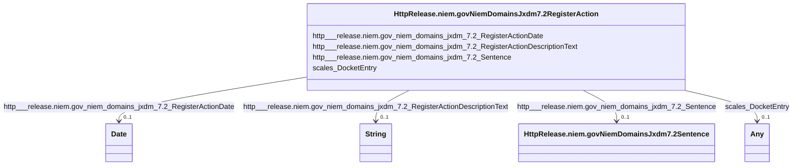

# Class: No class (type) name specified (http___release.niem.gov_niem_domains_jxdm_7.2_RegisterAction)


_No class (type) description specified_


This class occurs 28776887 times.


URI: [http://release.niem.gov/niem/domains/jxdm/7.2/RegisterAction](http://release.niem.gov/niem/domains/jxdm/7.2/RegisterAction)





<!-- no inheritance hierarchy -->


## Slots

| Name | Cardinality and Range | Description | Inheritance | Occurrences |
| ---  | --- | --- | --- | --- |
| [http___release.niem.gov_niem_domains_jxdm_7.2_RegisterActionDate](../slots/http___release.niem.gov_niem_domains_jxdm_7.2_RegisterActionDate.md) | 0..1 <br/> [xsd:date](http://www.w3.org/2001/XMLSchema#date) | No slot (predicate) description specified <br/>  | direct | 27946210 |
| [http___release.niem.gov_niem_domains_jxdm_7.2_Sentence](../slots/http___release.niem.gov_niem_domains_jxdm_7.2_Sentence.md) | 0..1 <br/> [HttpRelease.niem.govNiemDomainsJxdm7.2Sentence](../classes/HttpRelease.niem.govNiemDomainsJxdm7.2Sentence.md) | No slot (predicate) description specified <br/>  | direct | 356094 |
| [http___release.niem.gov_niem_domains_jxdm_7.2_RegisterActionDescriptionText](../slots/http___release.niem.gov_niem_domains_jxdm_7.2_RegisterActionDescriptionText.md) | 0..1 <br/> [xsd:string](http://www.w3.org/2001/XMLSchema#string) | No slot (predicate) description specified <br/>  | direct | 27944876 |
| [scales_DocketEntry](../slots/scales_DocketEntry.md) | 0..1 <br/> [xsd:anyURI](http://www.w3.org/2001/XMLSchema#anyURI)&nbsp;or&nbsp;<br />[HttpRelease.niem.govNiemDomainsJxdm7.2RegisterAction](../classes/HttpRelease.niem.govNiemDomainsJxdm7.2RegisterAction.md) | No slot (predicate) description specified <br/>  | direct | 30414852 |


## Usages

| used by | used in | type | used |
| ---  | --- | --- | --- |
| [HttpRelease.niem.govNiemDomainsJxdm7.2RegisterAction](../classes/HttpRelease.niem.govNiemDomainsJxdm7.2RegisterAction.md) | [scales_DocketEntry](../slots/scales_DocketEntry.md) | any_of[range] | [HttpRelease.niem.govNiemDomainsJxdm7.2RegisterAction](../classes/HttpRelease.niem.govNiemDomainsJxdm7.2RegisterAction.md) |
| [HttpRelease.niem.govNiemDomainsJxdm7.2RegisterOfActions](../classes/HttpRelease.niem.govNiemDomainsJxdm7.2RegisterOfActions.md) | [scales_DocketEntry](../slots/scales_DocketEntry.md) | any_of[range] | [HttpRelease.niem.govNiemDomainsJxdm7.2RegisterAction](../classes/HttpRelease.niem.govNiemDomainsJxdm7.2RegisterAction.md) |
| [ScalesCivilCase](../classes/ScalesCivilCase.md) | [scales_DocketTable](../slots/scales_DocketTable.md) | any_of[range] | [HttpRelease.niem.govNiemDomainsJxdm7.2RegisterAction](../classes/HttpRelease.niem.govNiemDomainsJxdm7.2RegisterAction.md) |
| [ScalesCriminalCase](../classes/ScalesCriminalCase.md) | [scales_DocketTable](../slots/scales_DocketTable.md) | any_of[range] | [HttpRelease.niem.govNiemDomainsJxdm7.2RegisterAction](../classes/HttpRelease.niem.govNiemDomainsJxdm7.2RegisterAction.md) |


## LinkML Source

<!-- TODO: investigate https://stackoverflow.com/questions/37606292/how-to-create-tabbed-code-blocks-in-mkdocs-or-sphinx -->

### Direct

<details>

```yaml
name: http___release.niem.gov_niem_domains_jxdm_7.2_RegisterAction
conforms_to: No schema conformance document specified
annotations:
  count:
    tag: count
    value: 28776887
description: No class (type) description specified
title: No class (type) name specified
from_schema: scales-kg
rank: 1000
slots:
- http___release.niem.gov_niem_domains_jxdm_7.2_RegisterActionDate
- http___release.niem.gov_niem_domains_jxdm_7.2_Sentence
- http___release.niem.gov_niem_domains_jxdm_7.2_RegisterActionDescriptionText
- scales_DocketEntry
slot_usage:
  http___release.niem.gov_niem_domains_jxdm_7.2_RegisterActionDate:
    name: http___release.niem.gov_niem_domains_jxdm_7.2_RegisterActionDate
    annotations:
      date:
        tag: date
        value: 27946210
  http___release.niem.gov_niem_domains_jxdm_7.2_RegisterActionDescriptionText:
    name: http___release.niem.gov_niem_domains_jxdm_7.2_RegisterActionDescriptionText
    annotations:
      string:
        tag: string
        value: 27944876
  http___release.niem.gov_niem_domains_jxdm_7.2_Sentence:
    name: http___release.niem.gov_niem_domains_jxdm_7.2_Sentence
    annotations:
      http___release.niem.gov_niem_domains_jxdm_7.2_Sentence:
        tag: http___release.niem.gov_niem_domains_jxdm_7.2_Sentence
        value: 356094
  scales_DocketEntry:
    name: scales_DocketEntry
    annotations:
      uri:
        tag: uri
        value: 30414852
class_uri: http://release.niem.gov/niem/domains/jxdm/7.2/RegisterAction

```
</details>

### Induced

<details>

```yaml
name: http___release.niem.gov_niem_domains_jxdm_7.2_RegisterAction
conforms_to: No schema conformance document specified
annotations:
  count:
    tag: count
    value: 28776887
description: No class (type) description specified
title: No class (type) name specified
from_schema: scales-kg
rank: 1000
slot_usage:
  http___release.niem.gov_niem_domains_jxdm_7.2_RegisterActionDate:
    name: http___release.niem.gov_niem_domains_jxdm_7.2_RegisterActionDate
    annotations:
      date:
        tag: date
        value: 27946210
  http___release.niem.gov_niem_domains_jxdm_7.2_RegisterActionDescriptionText:
    name: http___release.niem.gov_niem_domains_jxdm_7.2_RegisterActionDescriptionText
    annotations:
      string:
        tag: string
        value: 27944876
  http___release.niem.gov_niem_domains_jxdm_7.2_Sentence:
    name: http___release.niem.gov_niem_domains_jxdm_7.2_Sentence
    annotations:
      http___release.niem.gov_niem_domains_jxdm_7.2_Sentence:
        tag: http___release.niem.gov_niem_domains_jxdm_7.2_Sentence
        value: 356094
  scales_DocketEntry:
    name: scales_DocketEntry
    annotations:
      uri:
        tag: uri
        value: 30414852
attributes:
  http___release.niem.gov_niem_domains_jxdm_7.2_RegisterActionDate:
    name: http___release.niem.gov_niem_domains_jxdm_7.2_RegisterActionDate
    annotations:
      date:
        tag: date
        value: 27946210
    description: No slot (predicate) description specified
    examples:
    - object:
        example_object: '2016-02-03'
        example_object_type: date
        example_predicate: http://release.niem.gov/niem/domains/jxdm/7.2/RegisterActionDate
        example_subject: scales:/DocketEntry/akd;;1:16-cr-00001_de0
        example_subject_type: None
    - object:
        example_object: '2000-01-10'
        example_object_type: date
        example_predicate: http://release.niem.gov/niem/domains/jxdm/7.2/RegisterActionDate
        example_subject: scales:DocketEntry/ga-clayton-magistrate-civil;;0:00-cm-00001_de0
        example_subject_type: http___release.niem.gov_niem_domains_jxdm_7.2_RegisterAction
    from_schema: scales-kg
    rank: 1000
    slot_uri: http://release.niem.gov/niem/domains/jxdm/7.2/RegisterActionDate
    alias: http___release.niem.gov_niem_domains_jxdm_7.2_RegisterActionDate
    owner: http___release.niem.gov_niem_domains_jxdm_7.2_RegisterAction
    domain_of:
    - http___release.niem.gov_niem_domains_jxdm_7.2_RegisterAction
    range: date
  http___release.niem.gov_niem_domains_jxdm_7.2_Sentence:
    name: http___release.niem.gov_niem_domains_jxdm_7.2_Sentence
    annotations:
      http___release.niem.gov_niem_domains_jxdm_7.2_Sentence:
        tag: http___release.niem.gov_niem_domains_jxdm_7.2_Sentence
        value: 356094
    description: No slot (predicate) description specified
    examples:
    - object:
        example_object: scales:Sentence/ga-clayton-state;;0:00-cr-01074_de32_s0
        example_object_type: http___release.niem.gov_niem_domains_jxdm_7.2_Sentence
        example_predicate: http://release.niem.gov/niem/domains/jxdm/7.2/Sentence
        example_subject: scales:Agent/ga-clayton-state;;0:00-cr-01074_a1
        example_subject_type: scales_Party
    - object:
        example_object: scales:Sentence/ga-clayton-state;;0:00-cr-00001_de10_s0
        example_object_type: http___release.niem.gov_niem_domains_jxdm_7.2_Sentence
        example_predicate: http://release.niem.gov/niem/domains/jxdm/7.2/Sentence
        example_subject: scales:DocketEntry/ga-clayton-state;;0:00-cr-00001_de10
        example_subject_type: http___release.niem.gov_niem_domains_jxdm_7.2_RegisterAction
    from_schema: scales-kg
    rank: 1000
    slot_uri: http://release.niem.gov/niem/domains/jxdm/7.2/Sentence
    alias: http___release.niem.gov_niem_domains_jxdm_7.2_Sentence
    owner: http___release.niem.gov_niem_domains_jxdm_7.2_RegisterAction
    domain_of:
    - http___release.niem.gov_niem_domains_jxdm_7.2_RegisterAction
    - scales_Party
    range: http___release.niem.gov_niem_domains_jxdm_7.2_Sentence
  http___release.niem.gov_niem_domains_jxdm_7.2_RegisterActionDescriptionText:
    name: http___release.niem.gov_niem_domains_jxdm_7.2_RegisterActionDescriptionText
    annotations:
      string:
        tag: string
        value: 27944876
    description: No slot (predicate) description specified
    examples:
    - object:
        example_object: 'MISDEMEANOR INFORMATION as to 01169B9 (1) count(s) 1-4. (Attachments:
          # 1 Criminal Cover Sheet re Defendant 01169B9) (CLW, COURT STAFF) (Entered:
          02/03/2016)'
        example_object_type: string
        example_predicate: http://release.niem.gov/niem/domains/jxdm/7.2/RegisterActionDescriptionText
        example_subject: scales:/DocketEntry/akd;;1:16-cr-00001_de0
        example_subject_type: None
    - object:
        example_object: 'Contract

          against  ROBERTS  KIMBERLY'
        example_object_type: string
        example_predicate: http://release.niem.gov/niem/domains/jxdm/7.2/RegisterActionDescriptionText
        example_subject: scales:DocketEntry/ga-clayton-magistrate-civil;;0:00-cm-00001_de0
        example_subject_type: http___release.niem.gov_niem_domains_jxdm_7.2_RegisterAction
    from_schema: scales-kg
    rank: 1000
    slot_uri: http://release.niem.gov/niem/domains/jxdm/7.2/RegisterActionDescriptionText
    alias: http___release.niem.gov_niem_domains_jxdm_7.2_RegisterActionDescriptionText
    owner: http___release.niem.gov_niem_domains_jxdm_7.2_RegisterAction
    domain_of:
    - http___release.niem.gov_niem_domains_jxdm_7.2_RegisterAction
    range: string
  scales_DocketEntry:
    name: scales_DocketEntry
    annotations:
      uri:
        tag: uri
        value: 30414852
    description: No slot (predicate) description specified
    examples:
    - object:
        example_object: scales:/DocketEntry/akd;;1:16-cr-00001_de0
        example_object_type: uri
        example_predicate: scales:DocketEntry
        example_subject: scales:/DocketTable/akd;;1:16-cr-00001
        example_subject_type: http___release.niem.gov_niem_domains_jxdm_7.2_RegisterAction
    - object:
        example_object: scales:DocketEntry/ga-clayton-magistrate-civil;;0:00-cm-00001_de0
        example_object_type: http___release.niem.gov_niem_domains_jxdm_7.2_RegisterAction
        example_predicate: scales:DocketEntry
        example_subject: scales:DocketTable/ga-clayton-magistrate-civil;;0:00-cm-00001
        example_subject_type: http___release.niem.gov_niem_domains_jxdm_7.2_RegisterOfActions
    from_schema: scales-kg
    rank: 1000
    slot_uri: scales:DocketEntry
    alias: scales_DocketEntry
    owner: http___release.niem.gov_niem_domains_jxdm_7.2_RegisterAction
    domain_of:
    - http___release.niem.gov_niem_domains_jxdm_7.2_RegisterAction
    - http___release.niem.gov_niem_domains_jxdm_7.2_RegisterOfActions
    range: Any
    any_of:
    - range: uri
    - range: http___release.niem.gov_niem_domains_jxdm_7.2_RegisterAction
class_uri: http://release.niem.gov/niem/domains/jxdm/7.2/RegisterAction

```
</details>