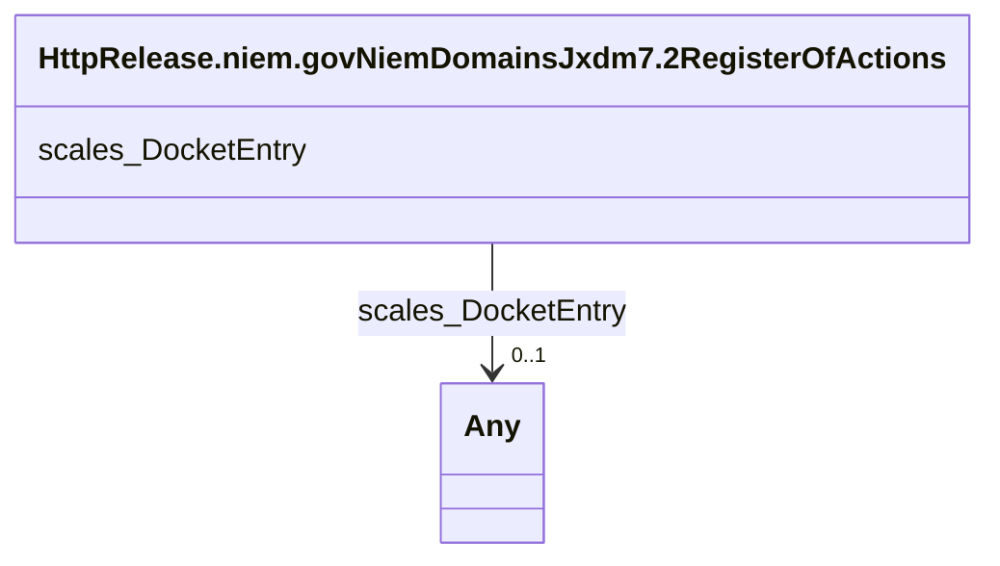

# Class: No class (type) name specified (http___release.niem.gov_niem_domains_jxdm_7.2_RegisterOfActions)


_No class (type) description specified_


This class occurs 4160501 times.


URI: [http://release.niem.gov/niem/domains/jxdm/7.2/RegisterOfActions](http://release.niem.gov/niem/domains/jxdm/7.2/RegisterOfActions)





<!-- no inheritance hierarchy -->


## Slots

| Name | Cardinality and Range | Description | Inheritance | Occurrences |
| ---  | --- | --- | --- | --- |
| [scales_DocketEntry](../slots/scales_DocketEntry.md) | 0..1 <br/> [xsd:anyURI](http://www.w3.org/2001/XMLSchema#anyURI)&nbsp;or&nbsp;<br />[HttpRelease.niem.govNiemDomainsJxdm7.2RegisterAction](../classes/HttpRelease.niem.govNiemDomainsJxdm7.2RegisterAction.md) | No slot (predicate) description specified <br/>  | direct | 27920144 |


## Usages

| used by | used in | type | used |
| ---  | --- | --- | --- |
| [ScalesCivilCase](../classes/ScalesCivilCase.md) | [scales_DocketTable](../slots/scales_DocketTable.md) | any_of[range] | [HttpRelease.niem.govNiemDomainsJxdm7.2RegisterOfActions](../classes/HttpRelease.niem.govNiemDomainsJxdm7.2RegisterOfActions.md) |
| [ScalesCriminalCase](../classes/ScalesCriminalCase.md) | [scales_DocketTable](../slots/scales_DocketTable.md) | any_of[range] | [HttpRelease.niem.govNiemDomainsJxdm7.2RegisterOfActions](../classes/HttpRelease.niem.govNiemDomainsJxdm7.2RegisterOfActions.md) |


## LinkML Source

<!-- TODO: investigate https://stackoverflow.com/questions/37606292/how-to-create-tabbed-code-blocks-in-mkdocs-or-sphinx -->

### Direct

<details>

```yaml
name: http___release.niem.gov_niem_domains_jxdm_7.2_RegisterOfActions
conforms_to: No schema conformance document specified
annotations:
  count:
    tag: count
    value: 4160501
description: No class (type) description specified
title: No class (type) name specified
from_schema: scales-kg
rank: 1000
slots:
- scales_DocketEntry
slot_usage:
  scales_DocketEntry:
    name: scales_DocketEntry
    annotations:
      http___release.niem.gov_niem_domains_jxdm_7.2_RegisterAction:
        tag: http___release.niem.gov_niem_domains_jxdm_7.2_RegisterAction
        value: 27920144
class_uri: http://release.niem.gov/niem/domains/jxdm/7.2/RegisterOfActions

```
</details>

### Induced

<details>

```yaml
name: http___release.niem.gov_niem_domains_jxdm_7.2_RegisterOfActions
conforms_to: No schema conformance document specified
annotations:
  count:
    tag: count
    value: 4160501
description: No class (type) description specified
title: No class (type) name specified
from_schema: scales-kg
rank: 1000
slot_usage:
  scales_DocketEntry:
    name: scales_DocketEntry
    annotations:
      http___release.niem.gov_niem_domains_jxdm_7.2_RegisterAction:
        tag: http___release.niem.gov_niem_domains_jxdm_7.2_RegisterAction
        value: 27920144
attributes:
  scales_DocketEntry:
    name: scales_DocketEntry
    annotations:
      http___release.niem.gov_niem_domains_jxdm_7.2_RegisterAction:
        tag: http___release.niem.gov_niem_domains_jxdm_7.2_RegisterAction
        value: 27920144
    description: No slot (predicate) description specified
    examples:
    - object:
        example_object: scales:/DocketEntry/akd;;1:16-cr-00001_de0
        example_object_type: uri
        example_predicate: scales:DocketEntry
        example_subject: scales:/DocketTable/akd;;1:16-cr-00001
        example_subject_type: http___release.niem.gov_niem_domains_jxdm_7.2_RegisterAction
    - object:
        example_object: scales:DocketEntry/ga-clayton-magistrate-civil;;0:00-cm-00001_de0
        example_object_type: http___release.niem.gov_niem_domains_jxdm_7.2_RegisterAction
        example_predicate: scales:DocketEntry
        example_subject: scales:DocketTable/ga-clayton-magistrate-civil;;0:00-cm-00001
        example_subject_type: http___release.niem.gov_niem_domains_jxdm_7.2_RegisterOfActions
    from_schema: scales-kg
    rank: 1000
    slot_uri: scales:DocketEntry
    alias: scales_DocketEntry
    owner: http___release.niem.gov_niem_domains_jxdm_7.2_RegisterOfActions
    domain_of:
    - http___release.niem.gov_niem_domains_jxdm_7.2_RegisterAction
    - http___release.niem.gov_niem_domains_jxdm_7.2_RegisterOfActions
    range: Any
    any_of:
    - range: uri
    - range: http___release.niem.gov_niem_domains_jxdm_7.2_RegisterAction
class_uri: http://release.niem.gov/niem/domains/jxdm/7.2/RegisterOfActions

```
</details>