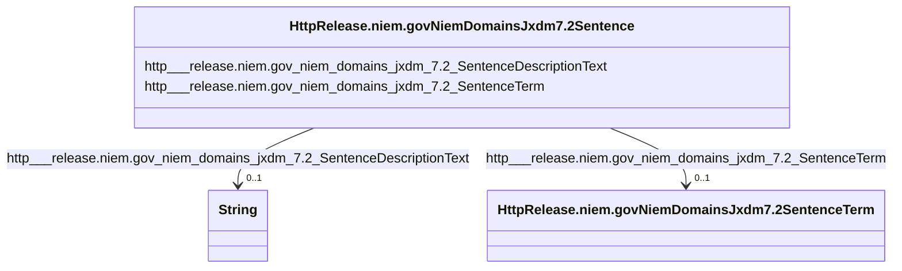

# Class: No class (type) name specified (http___release.niem.gov_niem_domains_jxdm_7.2_Sentence)


_No class (type) description specified_


This class occurs 356094 times.


URI: [http://release.niem.gov/niem/domains/jxdm/7.2/Sentence](http://release.niem.gov/niem/domains/jxdm/7.2/Sentence)





<!-- no inheritance hierarchy -->


## Slots

| Name | Cardinality and Range | Description | Inheritance | Occurrences |
| ---  | --- | --- | --- | --- |
| [http___release.niem.gov_niem_domains_jxdm_7.2_SentenceTerm](../slots/http___release.niem.gov_niem_domains_jxdm_7.2_SentenceTerm.md) | 0..1 <br/> [HttpRelease.niem.govNiemDomainsJxdm7.2SentenceTerm](../classes/HttpRelease.niem.govNiemDomainsJxdm7.2SentenceTerm.md) | No slot (predicate) description specified <br/>  | direct | 356094 |
| [http___release.niem.gov_niem_domains_jxdm_7.2_SentenceDescriptionText](../slots/http___release.niem.gov_niem_domains_jxdm_7.2_SentenceDescriptionText.md) | 0..1 <br/> [xsd:string](http://www.w3.org/2001/XMLSchema#string) | No slot (predicate) description specified <br/>  | direct | 356094 |


## Usages

| used by | used in | type | used |
| ---  | --- | --- | --- |
| [HttpRelease.niem.govNiemDomainsJxdm7.2Charge](../classes/HttpRelease.niem.govNiemDomainsJxdm7.2Charge.md) | [http___release.niem.gov_niem_domains_jxdm_7.2_ChargeSentence](../slots/http___release.niem.gov_niem_domains_jxdm_7.2_ChargeSentence.md) | range | [HttpRelease.niem.govNiemDomainsJxdm7.2Sentence](../classes/HttpRelease.niem.govNiemDomainsJxdm7.2Sentence.md) |
| [HttpRelease.niem.govNiemDomainsJxdm7.2RegisterAction](../classes/HttpRelease.niem.govNiemDomainsJxdm7.2RegisterAction.md) | [HttpRelease.niem.govNiemDomainsJxdm7.2Sentence](../classes/HttpRelease.niem.govNiemDomainsJxdm7.2Sentence.md) | range | [HttpRelease.niem.govNiemDomainsJxdm7.2Sentence](../classes/HttpRelease.niem.govNiemDomainsJxdm7.2Sentence.md) |
| [ScalesParty](../classes/ScalesParty.md) | [HttpRelease.niem.govNiemDomainsJxdm7.2Sentence](../classes/HttpRelease.niem.govNiemDomainsJxdm7.2Sentence.md) | range | [HttpRelease.niem.govNiemDomainsJxdm7.2Sentence](../classes/HttpRelease.niem.govNiemDomainsJxdm7.2Sentence.md) |


## LinkML Source

<!-- TODO: investigate https://stackoverflow.com/questions/37606292/how-to-create-tabbed-code-blocks-in-mkdocs-or-sphinx -->

### Direct

<details>

```yaml
name: http___release.niem.gov_niem_domains_jxdm_7.2_Sentence
conforms_to: No schema conformance document specified
annotations:
  count:
    tag: count
    value: 356094
description: No class (type) description specified
title: No class (type) name specified
from_schema: scales-kg
rank: 1000
slots:
- http___release.niem.gov_niem_domains_jxdm_7.2_SentenceTerm
- http___release.niem.gov_niem_domains_jxdm_7.2_SentenceDescriptionText
slot_usage:
  http___release.niem.gov_niem_domains_jxdm_7.2_SentenceDescriptionText:
    name: http___release.niem.gov_niem_domains_jxdm_7.2_SentenceDescriptionText
    annotations:
      string:
        tag: string
        value: 356094
  http___release.niem.gov_niem_domains_jxdm_7.2_SentenceTerm:
    name: http___release.niem.gov_niem_domains_jxdm_7.2_SentenceTerm
    annotations:
      http___release.niem.gov_niem_domains_jxdm_7.2_SentenceTerm:
        tag: http___release.niem.gov_niem_domains_jxdm_7.2_SentenceTerm
        value: 356094
class_uri: http://release.niem.gov/niem/domains/jxdm/7.2/Sentence

```
</details>

### Induced

<details>

```yaml
name: http___release.niem.gov_niem_domains_jxdm_7.2_Sentence
conforms_to: No schema conformance document specified
annotations:
  count:
    tag: count
    value: 356094
description: No class (type) description specified
title: No class (type) name specified
from_schema: scales-kg
rank: 1000
slot_usage:
  http___release.niem.gov_niem_domains_jxdm_7.2_SentenceDescriptionText:
    name: http___release.niem.gov_niem_domains_jxdm_7.2_SentenceDescriptionText
    annotations:
      string:
        tag: string
        value: 356094
  http___release.niem.gov_niem_domains_jxdm_7.2_SentenceTerm:
    name: http___release.niem.gov_niem_domains_jxdm_7.2_SentenceTerm
    annotations:
      http___release.niem.gov_niem_domains_jxdm_7.2_SentenceTerm:
        tag: http___release.niem.gov_niem_domains_jxdm_7.2_SentenceTerm
        value: 356094
attributes:
  http___release.niem.gov_niem_domains_jxdm_7.2_SentenceTerm:
    name: http___release.niem.gov_niem_domains_jxdm_7.2_SentenceTerm
    annotations:
      http___release.niem.gov_niem_domains_jxdm_7.2_SentenceTerm:
        tag: http___release.niem.gov_niem_domains_jxdm_7.2_SentenceTerm
        value: 356094
    description: No slot (predicate) description specified
    examples:
    - object:
        example_object: scales:Term/6.0
        example_object_type: http___release.niem.gov_niem_domains_jxdm_7.2_SentenceTerm
        example_predicate: http://release.niem.gov/niem/domains/jxdm/7.2/SentenceTerm
        example_subject: scales:Sentence/ga-clayton-state;;0:00-cr-00001_de10_s0
        example_subject_type: http___release.niem.gov_niem_domains_jxdm_7.2_Sentence
    from_schema: scales-kg
    rank: 1000
    slot_uri: http://release.niem.gov/niem/domains/jxdm/7.2/SentenceTerm
    alias: http___release.niem.gov_niem_domains_jxdm_7.2_SentenceTerm
    owner: http___release.niem.gov_niem_domains_jxdm_7.2_Sentence
    domain_of:
    - http___release.niem.gov_niem_domains_jxdm_7.2_Sentence
    range: http___release.niem.gov_niem_domains_jxdm_7.2_SentenceTerm
  http___release.niem.gov_niem_domains_jxdm_7.2_SentenceDescriptionText:
    name: http___release.niem.gov_niem_domains_jxdm_7.2_SentenceDescriptionText
    annotations:
      string:
        tag: string
        value: 356094
    description: No slot (predicate) description specified
    examples:
    - object:
        example_object: serve
        example_object_type: string
        example_predicate: http://release.niem.gov/niem/domains/jxdm/7.2/SentenceDescriptionText
        example_subject: scales:Sentence/ga-clayton-state;;0:00-cr-00001_de10_s0
        example_subject_type: http___release.niem.gov_niem_domains_jxdm_7.2_Sentence
    from_schema: scales-kg
    rank: 1000
    slot_uri: http://release.niem.gov/niem/domains/jxdm/7.2/SentenceDescriptionText
    alias: http___release.niem.gov_niem_domains_jxdm_7.2_SentenceDescriptionText
    owner: http___release.niem.gov_niem_domains_jxdm_7.2_Sentence
    domain_of:
    - http___release.niem.gov_niem_domains_jxdm_7.2_Sentence
    range: string
class_uri: http://release.niem.gov/niem/domains/jxdm/7.2/Sentence

```
</details>