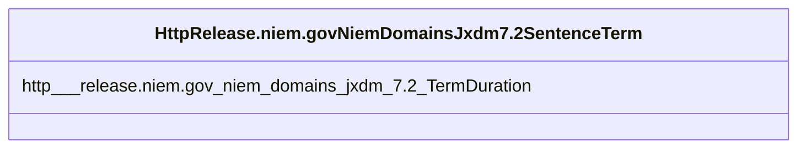

# Class: No class (type) name specified (http___release.niem.gov_niem_domains_jxdm_7.2_SentenceTerm)


_No class (type) description specified_


This class occurs 462 times.


URI: [http://release.niem.gov/niem/domains/jxdm/7.2/SentenceTerm](http://release.niem.gov/niem/domains/jxdm/7.2/SentenceTerm)





<!-- no inheritance hierarchy -->


## Slots

| Name | Cardinality and Range | Description | Inheritance | Occurrences |
| ---  | --- | --- | --- | --- |
| [http___release.niem.gov_niem_domains_jxdm_7.2_TermDuration](../slots/http___release.niem.gov_niem_domains_jxdm_7.2_TermDuration.md) | 0..1 <br/> [XsdDuration](../types/XsdDuration.md) | No slot (predicate) description specified <br/>  | direct | 462 |


## Usages

| used by | used in | type | used |
| ---  | --- | --- | --- |
| [HttpRelease.niem.govNiemDomainsJxdm7.2Sentence](../classes/HttpRelease.niem.govNiemDomainsJxdm7.2Sentence.md) | [HttpRelease.niem.govNiemDomainsJxdm7.2SentenceTerm](../classes/HttpRelease.niem.govNiemDomainsJxdm7.2SentenceTerm.md) | range | [HttpRelease.niem.govNiemDomainsJxdm7.2SentenceTerm](../classes/HttpRelease.niem.govNiemDomainsJxdm7.2SentenceTerm.md) |


## LinkML Source

<!-- TODO: investigate https://stackoverflow.com/questions/37606292/how-to-create-tabbed-code-blocks-in-mkdocs-or-sphinx -->

### Direct

<details>

```yaml
name: http___release.niem.gov_niem_domains_jxdm_7.2_SentenceTerm
conforms_to: No schema conformance document specified
annotations:
  count:
    tag: count
    value: 462
description: No class (type) description specified
title: No class (type) name specified
from_schema: scales-kg
rank: 1000
slots:
- http___release.niem.gov_niem_domains_jxdm_7.2_TermDuration
slot_usage:
  http___release.niem.gov_niem_domains_jxdm_7.2_TermDuration:
    name: http___release.niem.gov_niem_domains_jxdm_7.2_TermDuration
    annotations:
      xsd_duration:
        tag: xsd_duration
        value: 462
class_uri: http://release.niem.gov/niem/domains/jxdm/7.2/SentenceTerm

```
</details>

### Induced

<details>

```yaml
name: http___release.niem.gov_niem_domains_jxdm_7.2_SentenceTerm
conforms_to: No schema conformance document specified
annotations:
  count:
    tag: count
    value: 462
description: No class (type) description specified
title: No class (type) name specified
from_schema: scales-kg
rank: 1000
slot_usage:
  http___release.niem.gov_niem_domains_jxdm_7.2_TermDuration:
    name: http___release.niem.gov_niem_domains_jxdm_7.2_TermDuration
    annotations:
      xsd_duration:
        tag: xsd_duration
        value: 462
attributes:
  http___release.niem.gov_niem_domains_jxdm_7.2_TermDuration:
    name: http___release.niem.gov_niem_domains_jxdm_7.2_TermDuration
    annotations:
      xsd_duration:
        tag: xsd_duration
        value: 462
    description: No slot (predicate) description specified
    examples:
    - object:
        example_object: P0D
        example_object_type: xsd_duration
        example_predicate: http://release.niem.gov/niem/domains/jxdm/7.2/TermDuration
        example_subject: scales:Term/0.016666666666666666
        example_subject_type: http___release.niem.gov_niem_domains_jxdm_7.2_SentenceTerm
    from_schema: scales-kg
    rank: 1000
    slot_uri: http://release.niem.gov/niem/domains/jxdm/7.2/TermDuration
    alias: http___release.niem.gov_niem_domains_jxdm_7.2_TermDuration
    owner: http___release.niem.gov_niem_domains_jxdm_7.2_SentenceTerm
    domain_of:
    - http___release.niem.gov_niem_domains_jxdm_7.2_SentenceTerm
    range: xsd_duration
class_uri: http://release.niem.gov/niem/domains/jxdm/7.2/SentenceTerm

```
</details>