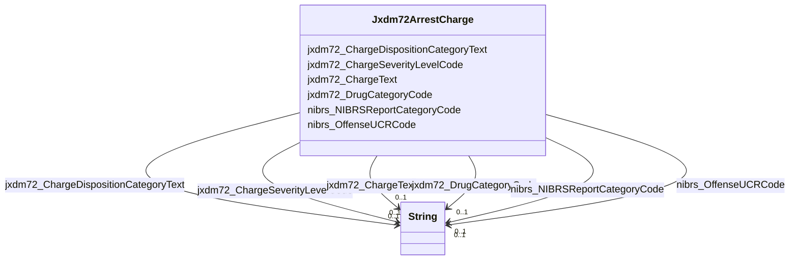

# Class: Jxdm72ArrestCharge


This class occurs 137904 times.


URI: [jxdm72:ArrestCharge](http://release.niem.gov/niem/domains/jxdm/7.2/ArrestCharge)





<!-- no inheritance hierarchy -->


## Slots

| Name | Cardinality and Range | Description | Inheritance | Occurrences |
| ---  | --- | --- | --- | --- |
| [jxdm72_DrugCategoryCode](../slots/jxdm72_DrugCategoryCode.md) | 0..1 <br/> [xsd:string](http://www.w3.org/2001/XMLSchema#string) |  <br/>  | direct | 14972 |
| [jxdm72_ChargeDispositionCategoryText](../slots/jxdm72_ChargeDispositionCategoryText.md) | 0..1 <br/> [xsd:string](http://www.w3.org/2001/XMLSchema#string) |  <br/>  | direct | 138625 |
| [jxdm72_ChargeText](../slots/jxdm72_ChargeText.md) | 0..1 <br/> [xsd:string](http://www.w3.org/2001/XMLSchema#string) |  <br/>  | direct | 140007 |
| [nibrs_NIBRSReportCategoryCode](../slots/nibrs_NIBRSReportCategoryCode.md) | 0..1 <br/> [xsd:string](http://www.w3.org/2001/XMLSchema#string) |  <br/>  | direct | 75090 |
| [nibrs_OffenseUCRCode](../slots/nibrs_OffenseUCRCode.md) | 0..1 <br/> [xsd:string](http://www.w3.org/2001/XMLSchema#string) |  <br/>  | direct | 144231 |
| [jxdm72_ChargeSeverityLevelCode](../slots/jxdm72_ChargeSeverityLevelCode.md) | 0..1 <br/> [xsd:string](http://www.w3.org/2001/XMLSchema#string) |  <br/>  | direct | 131721 |


## LinkML Source

<!-- TODO: investigate https://stackoverflow.com/questions/37606292/how-to-create-tabbed-code-blocks-in-mkdocs-or-sphinx -->

### Direct

<details>

```yaml
name: jxdm72_ArrestCharge
from_schema: okns:scales-kg
rank: 1000
slots:
- jxdm72_DrugCategoryCode
- jxdm72_ChargeDispositionCategoryText
- jxdm72_ChargeText
- nibrs_NIBRSReportCategoryCode
- nibrs_OffenseUCRCode
- jxdm72_ChargeSeverityLevelCode
class_uri: jxdm72:ArrestCharge

```
</details>

### Induced

<details>

```yaml
name: jxdm72_ArrestCharge
from_schema: okns:scales-kg
rank: 1000
attributes:
  jxdm72_DrugCategoryCode:
    name: jxdm72_DrugCategoryCode
    from_schema: okns:scales-kg
    rank: 1000
    slot_uri: jxdm72:DrugCategoryCode
    alias: jxdm72_DrugCategoryCode
    owner: jxdm72_ArrestCharge
    domain_of:
    - jxdm72_ArrestCharge
    - jxdm72_Charge
    range: string
  jxdm72_ChargeDispositionCategoryText:
    name: jxdm72_ChargeDispositionCategoryText
    from_schema: okns:scales-kg
    rank: 1000
    slot_uri: jxdm72:ChargeDispositionCategoryText
    alias: jxdm72_ChargeDispositionCategoryText
    owner: jxdm72_ArrestCharge
    domain_of:
    - jxdm72_ArrestCharge
    range: string
  jxdm72_ChargeText:
    name: jxdm72_ChargeText
    from_schema: okns:scales-kg
    rank: 1000
    slot_uri: jxdm72:ChargeText
    alias: jxdm72_ChargeText
    owner: jxdm72_ArrestCharge
    domain_of:
    - jxdm72_ArrestCharge
    - jxdm72_Charge
    range: string
  nibrs_NIBRSReportCategoryCode:
    name: nibrs_NIBRSReportCategoryCode
    from_schema: okns:scales-kg
    rank: 1000
    slot_uri: nibrs:NIBRSReportCategoryCode
    alias: nibrs_NIBRSReportCategoryCode
    owner: jxdm72_ArrestCharge
    domain_of:
    - jxdm72_ArrestCharge
    - jxdm72_Charge
    range: string
  nibrs_OffenseUCRCode:
    name: nibrs_OffenseUCRCode
    from_schema: okns:scales-kg
    rank: 1000
    slot_uri: nibrs:OffenseUCRCode
    alias: nibrs_OffenseUCRCode
    owner: jxdm72_ArrestCharge
    domain_of:
    - jxdm72_ArrestCharge
    - jxdm72_Charge
    range: string
  jxdm72_ChargeSeverityLevelCode:
    name: jxdm72_ChargeSeverityLevelCode
    from_schema: okns:scales-kg
    rank: 1000
    slot_uri: jxdm72:ChargeSeverityLevelCode
    alias: jxdm72_ChargeSeverityLevelCode
    owner: jxdm72_ArrestCharge
    domain_of:
    - jxdm72_ArrestCharge
    - jxdm72_Charge
    range: string
class_uri: jxdm72:ArrestCharge

```
</details>