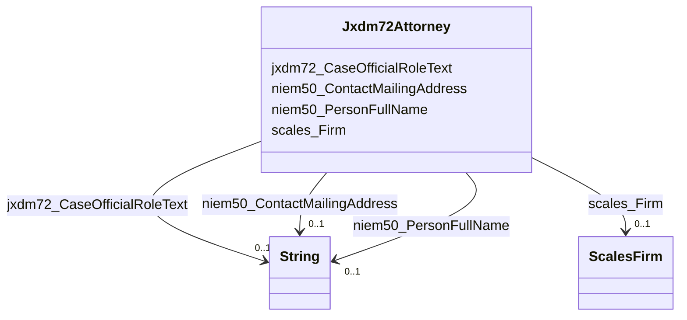

# Class: Jxdm72Attorney


This class occurs 537560 times.


URI: [jxdm72:Attorney](http://release.niem.gov/niem/domains/jxdm/7.2/Attorney)





<!-- no inheritance hierarchy -->


## Slots

| Name | Cardinality and Range | Description | Inheritance | Occurrences |
| ---  | --- | --- | --- | --- |
| [scales_Firm](../slots/scales_Firm.md) | 0..1 <br/> [ScalesFirm](../classes/ScalesFirm.md) |  <br/>  | direct | 69755 |
| [jxdm72_CaseOfficialRoleText](../slots/jxdm72_CaseOfficialRoleText.md) | 0..1 <br/> [xsd:string](http://www.w3.org/2001/XMLSchema#string) |  <br/>  | direct | 11657 |
| [niem50_PersonFullName](../slots/niem50_PersonFullName.md) | 0..1 <br/> [xsd:string](http://www.w3.org/2001/XMLSchema#string) |  <br/>  | direct | 537560 |
| [niem50_ContactMailingAddress](../slots/niem50_ContactMailingAddress.md) | 0..1 <br/> [xsd:string](http://www.w3.org/2001/XMLSchema#string) |  <br/>  | direct | 79253 |


## Usages

| used by | used in | type | used |
| ---  | --- | --- | --- |
| [ScalesParty](../classes/ScalesParty.md) | [Jxdm72Attorney](../classes/Jxdm72Attorney.md) | range | [Jxdm72Attorney](../classes/Jxdm72Attorney.md) |


## LinkML Source

<!-- TODO: investigate https://stackoverflow.com/questions/37606292/how-to-create-tabbed-code-blocks-in-mkdocs-or-sphinx -->

### Direct

<details>

```yaml
name: jxdm72_Attorney
from_schema: okns:scales-kg
rank: 1000
slots:
- scales_Firm
- jxdm72_CaseOfficialRoleText
- niem50_PersonFullName
- niem50_ContactMailingAddress
class_uri: jxdm72:Attorney

```
</details>

### Induced

<details>

```yaml
name: jxdm72_Attorney
from_schema: okns:scales-kg
rank: 1000
attributes:
  scales_Firm:
    name: scales_Firm
    from_schema: okns:scales-kg
    rank: 1000
    slot_uri: scales:Firm
    alias: scales_Firm
    owner: jxdm72_Attorney
    domain_of:
    - jxdm72_Attorney
    - jxdm72_CaseDefenseAttorney
    - jxdm72_CaseInitiatingAttorney
    range: scales_Firm
  jxdm72_CaseOfficialRoleText:
    name: jxdm72_CaseOfficialRoleText
    from_schema: okns:scales-kg
    rank: 1000
    slot_uri: jxdm72:CaseOfficialRoleText
    alias: jxdm72_CaseOfficialRoleText
    owner: jxdm72_Attorney
    domain_of:
    - jxdm72_Attorney
    - jxdm72_CaseDefenseAttorney
    - jxdm72_CaseInitiatingAttorney
    range: string
  niem50_PersonFullName:
    name: niem50_PersonFullName
    from_schema: okns:scales-kg
    rank: 1000
    slot_uri: niem50:PersonFullName
    alias: niem50_PersonFullName
    owner: jxdm72_Attorney
    domain_of:
    - jxdm72_Attorney
    - jxdm72_CaseDefendantParty
    - jxdm72_CaseDefenseAttorney
    - jxdm72_CaseInitiatingAttorney
    - jxdm72_CaseJudge
    - jxdm72_Judge
    - scales_Party
    range: string
  niem50_ContactMailingAddress:
    name: niem50_ContactMailingAddress
    from_schema: okns:scales-kg
    rank: 1000
    slot_uri: niem50:ContactMailingAddress
    alias: niem50_ContactMailingAddress
    owner: jxdm72_Attorney
    domain_of:
    - jxdm72_Attorney
    - jxdm72_CaseDefenseAttorney
    - jxdm72_CaseInitiatingAttorney
    range: string
class_uri: jxdm72:Attorney

```
</details>