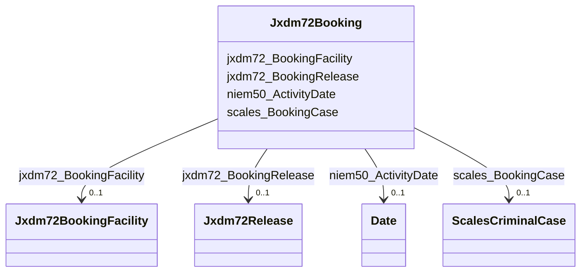

# Class: Jxdm72Booking


This class occurs 363466 times.


URI: [jxdm72:Booking](http://release.niem.gov/niem/domains/jxdm/7.2/Booking)





<!-- no inheritance hierarchy -->


## Slots

| Name | Cardinality and Range | Description | Inheritance | Occurrences |
| ---  | --- | --- | --- | --- |
| [jxdm72_BookingFacility](../slots/jxdm72_BookingFacility.md) | 0..1 <br/> [Jxdm72BookingFacility](../classes/Jxdm72BookingFacility.md) |  <br/>  | direct | 363466 |
| [niem50_ActivityDate](../slots/niem50_ActivityDate.md) | 0..1 <br/> [xsd:date](http://www.w3.org/2001/XMLSchema#date) |  <br/>  | direct | 419406 |
| [scales_BookingCase](../slots/scales_BookingCase.md) | 0..1 <br/> [ScalesCriminalCase](../classes/ScalesCriminalCase.md) |  <br/>  | direct | 218359 |
| [jxdm72_BookingRelease](../slots/jxdm72_BookingRelease.md) | 0..1 <br/> [Jxdm72Release](../classes/Jxdm72Release.md) |  <br/>  | direct | 347084 |


## Usages

| used by | used in | type | used |
| ---  | --- | --- | --- |
| [Jxdm72CaseDefendantParty](../classes/Jxdm72CaseDefendantParty.md) | [jxdm72_SubjectBooking](../slots/jxdm72_SubjectBooking.md) | range | [Jxdm72Booking](../classes/Jxdm72Booking.md) |
| [Jxdm72Charge](../classes/Jxdm72Charge.md) | [jxdm72_ChargeBooking](../slots/jxdm72_ChargeBooking.md) | range | [Jxdm72Booking](../classes/Jxdm72Booking.md) |


## LinkML Source

<!-- TODO: investigate https://stackoverflow.com/questions/37606292/how-to-create-tabbed-code-blocks-in-mkdocs-or-sphinx -->

### Direct

<details>

```yaml
name: jxdm72_Booking
from_schema: okns:scales-kg
rank: 1000
slots:
- jxdm72_BookingFacility
- niem50_ActivityDate
- scales_BookingCase
- jxdm72_BookingRelease
class_uri: jxdm72:Booking

```
</details>

### Induced

<details>

```yaml
name: jxdm72_Booking
from_schema: okns:scales-kg
rank: 1000
attributes:
  jxdm72_BookingFacility:
    name: jxdm72_BookingFacility
    from_schema: okns:scales-kg
    rank: 1000
    slot_uri: jxdm72:BookingFacility
    alias: jxdm72_BookingFacility
    owner: jxdm72_Booking
    domain_of:
    - jxdm72_Booking
    range: jxdm72_BookingFacility
  niem50_ActivityDate:
    name: niem50_ActivityDate
    from_schema: okns:scales-kg
    rank: 1000
    slot_uri: niem50:ActivityDate
    alias: niem50_ActivityDate
    owner: jxdm72_Booking
    domain_of:
    - jxdm72_Arrest
    - jxdm72_Booking
    - jxdm72_Release
    range: date
  scales_BookingCase:
    name: scales_BookingCase
    from_schema: okns:scales-kg
    rank: 1000
    slot_uri: scales:BookingCase
    alias: scales_BookingCase
    owner: jxdm72_Booking
    domain_of:
    - jxdm72_Booking
    range: scales_CriminalCase
  jxdm72_BookingRelease:
    name: jxdm72_BookingRelease
    from_schema: okns:scales-kg
    rank: 1000
    slot_uri: jxdm72:BookingRelease
    alias: jxdm72_BookingRelease
    owner: jxdm72_Booking
    domain_of:
    - jxdm72_Booking
    range: jxdm72_Release
class_uri: jxdm72:Booking

```
</details>