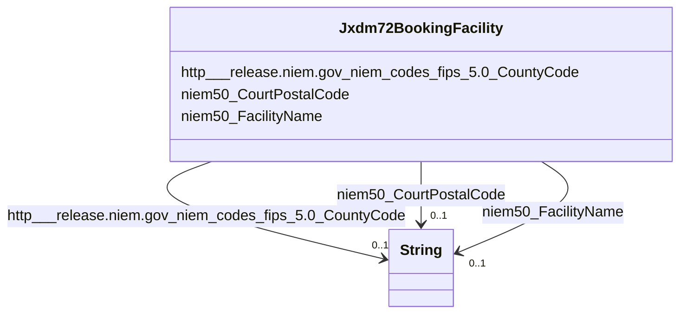

# Class: Jxdm72BookingFacility


This class occurs 1 times.


URI: [jxdm72:BookingFacility](http://release.niem.gov/niem/domains/jxdm/7.2/BookingFacility)





<!-- no inheritance hierarchy -->


## Slots

| Name | Cardinality and Range | Description | Inheritance | Occurrences |
| ---  | --- | --- | --- | --- |
| [http___release.niem.gov_niem_codes_fips_5.0_CountyCode](../slots/http___release.niem.gov_niem_codes_fips_5.0_CountyCode.md) | 0..1 <br/> [xsd:string](http://www.w3.org/2001/XMLSchema#string) |  <br/>  | direct | 1 |
| [niem50_CourtPostalCode](../slots/niem50_CourtPostalCode.md) | 0..1 <br/> [xsd:string](http://www.w3.org/2001/XMLSchema#string) |  <br/>  | direct | 1 |
| [niem50_FacilityName](../slots/niem50_FacilityName.md) | 0..1 <br/> [xsd:string](http://www.w3.org/2001/XMLSchema#string) |  <br/>  | direct | 1 |


## Usages

| used by | used in | type | used |
| ---  | --- | --- | --- |
| [Jxdm72Booking](../classes/Jxdm72Booking.md) | [Jxdm72BookingFacility](../classes/Jxdm72BookingFacility.md) | range | [Jxdm72BookingFacility](../classes/Jxdm72BookingFacility.md) |


## LinkML Source

<!-- TODO: investigate https://stackoverflow.com/questions/37606292/how-to-create-tabbed-code-blocks-in-mkdocs-or-sphinx -->

### Direct

<details>

```yaml
name: jxdm72_BookingFacility
from_schema: okns:scales-kg
rank: 1000
slots:
- http___release.niem.gov_niem_codes_fips_5.0_CountyCode
- niem50_CourtPostalCode
- niem50_FacilityName
class_uri: jxdm72:BookingFacility

```
</details>

### Induced

<details>

```yaml
name: jxdm72_BookingFacility
from_schema: okns:scales-kg
rank: 1000
attributes:
  http___release.niem.gov_niem_codes_fips_5.0_CountyCode:
    name: http___release.niem.gov_niem_codes_fips_5.0_CountyCode
    from_schema: okns:scales-kg
    rank: 1000
    slot_uri: http://release.niem.gov/niem/codes/fips/5.0/CountyCode
    alias: http___release.niem.gov_niem_codes_fips_5.0_CountyCode
    owner: jxdm72_BookingFacility
    domain_of:
    - jxdm72_BookingFacility
    - jxdm72_Court
    range: string
  niem50_CourtPostalCode:
    name: niem50_CourtPostalCode
    from_schema: okns:scales-kg
    rank: 1000
    slot_uri: niem50:CourtPostalCode
    alias: niem50_CourtPostalCode
    owner: jxdm72_BookingFacility
    domain_of:
    - jxdm72_BookingFacility
    - jxdm72_Court
    range: string
  niem50_FacilityName:
    name: niem50_FacilityName
    from_schema: okns:scales-kg
    rank: 1000
    slot_uri: niem50:FacilityName
    alias: niem50_FacilityName
    owner: jxdm72_BookingFacility
    domain_of:
    - jxdm72_BookingFacility
    range: string
class_uri: jxdm72:BookingFacility

```
</details>