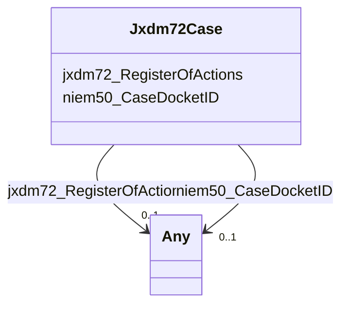

# Class: No class (type) name specified (jxdm72_Case)


_No class (type) description specified_


URI: [jxdm72:Case](http://release.niem.gov/niem/domains/jxdm/7.2/#Case)





<!-- no inheritance hierarchy -->


## Slots

| Name | Cardinality and Range | Description | Inheritance |
| ---  | --- | --- | --- |
| [niem50_CaseDocketID](../slots/niem50_CaseDocketID.md) | 0..1 <br/> [xsd:integer](xsd:integer)&nbsp;or&nbsp;<br />[xsd:string](xsd:string) | No slot (predicate) description specified <br/> 272547 occurrences with subject type scales_Case and object type string.<br/>96011 occurrences with subject type jxdm72_Case and object type integer. | direct |
| [jxdm72_RegisterOfActions](../slots/jxdm72_RegisterOfActions.md) | 0..1 <br/> [Jxdm72RegisterOfActions](../classes/Jxdm72RegisterOfActions.md)&nbsp;or&nbsp;<br />[xsd:anyURI](xsd:anyURI) | No slot (predicate) description specified <br/> 581243 occurrences with subject type scales_Case and object type uri.<br/>94929 occurrences with subject type jxdm72_Case and object type jxdm72_RegisterOfActions. | direct |


## Usages

| used by | used in | type | used |
| ---  | --- | --- | --- |
| [Jxdm72Charge](../classes/Jxdm72Charge.md) | [scales_ChargeCase](../slots/scales_ChargeCase.md) | range | [Jxdm72Case](../classes/Jxdm72Case.md) |


## Identifier and Mapping Information


## Mappings

| Mapping Type | Mapped Value |
| ---  | ---  |
| self | jxdm72:Case |
| native | scales-kg-new/:Jxdm72Case |


## LinkML Source

<!-- TODO: investigate https://stackoverflow.com/questions/37606292/how-to-create-tabbed-code-blocks-in-mkdocs-or-sphinx -->

### Direct

<details>

```yaml
name: jxdm72_Case
conforms_to: No schema conformance document specified
description: No class (type) description specified
title: No class (type) name specified
notes:
- Class with 96011 occurrences.
rank: 1000
slots:
- niem50_CaseDocketID
- jxdm72_RegisterOfActions
class_uri: jxdm72:Case

```
</details>

### Induced

<details>

```yaml
name: jxdm72_Case
conforms_to: No schema conformance document specified
description: No class (type) description specified
title: No class (type) name specified
notes:
- Class with 96011 occurrences.
rank: 1000
attributes:
  niem50_CaseDocketID:
    name: niem50_CaseDocketID
    description: No slot (predicate) description specified
    comments:
    - 272547 occurrences with subject type scales_Case and object type string.
    - 96011 occurrences with subject type jxdm72_Case and object type integer.
    examples:
    - description: scales_Case → string
      object:
        example_object: 0:15-cv-04235
        example_object_type: string
        example_predicate: niem50:CaseDocketID
        example_subject: scales/CaseCivil
        example_subject_type: scales_Case
    - description: jxdm72_Case → integer
      object:
        example_object: '100271'
        example_object_type: integer
        example_predicate: niem50:CaseDocketID
        example_subject: scales/CaseCriminal/ga/fulton/01/100271
        example_subject_type: jxdm72_Case
    from_schema: scales-kg-new
    rank: 1000
    slot_uri: niem50:CaseDocketID
    alias: niem50_CaseDocketID
    owner: jxdm72_Case
    domain_of:
    - jxdm72_Case
    - scales_Case
    range: Any
    any_of:
    - range: integer
    - range: string
  jxdm72_RegisterOfActions:
    name: jxdm72_RegisterOfActions
    description: No slot (predicate) description specified
    comments:
    - 581243 occurrences with subject type scales_Case and object type uri.
    - 94929 occurrences with subject type jxdm72_Case and object type jxdm72_RegisterOfActions.
    examples:
    - description: scales_Case → uri
      object:
        example_object: scales/DocketTable/almd;;1:16-cv-00016
        example_object_type: uri
        example_predicate: jxdm72:RegisterOfActions
        example_subject: scales/CaseCivil
        example_subject_type: scales_Case
    - description: jxdm72_Case → jxdm72_RegisterOfActions
      object:
        example_object: scales/DocketTable/DocketTable/ga-fulton-01-99233
        example_object_type: jxdm72_RegisterOfActions
        example_predicate: jxdm72:RegisterOfActions
        example_subject: scales/CaseCriminal/ga/fulton/01/99233
        example_subject_type: jxdm72_Case
    from_schema: scales-kg-new
    rank: 1000
    slot_uri: jxdm72:RegisterOfActions
    alias: jxdm72_RegisterOfActions
    owner: jxdm72_Case
    domain_of:
    - jxdm72_Case
    - scales_Case
    range: Any
    any_of:
    - range: jxdm72_RegisterOfActions
    - range: uri
class_uri: jxdm72:Case

```
</details>