# Class: Jxdm72CaseDefendantParty


This class occurs 2949712 times.


URI: [jxdm72:CaseDefendantParty](http://release.niem.gov/niem/domains/jxdm/7.2/CaseDefendantParty)

```mermaid
 classDiagram
    class Jxdm72CaseDefendantParty
    click Jxdm72CaseDefendantParty href "../Jxdm72CaseDefendantParty"
      Jxdm72CaseDefendantParty : jxdm72_CaseDefenseAttorney
        
          
    
    
    Jxdm72CaseDefendantParty --> "0..1" Jxdm72CaseDefenseAttorney : jxdm72_CaseDefenseAttorney
    click Jxdm72CaseDefenseAttorney href "../Jxdm72CaseDefenseAttorney"

        
      Jxdm72CaseDefendantParty : jxdm72_ParticipantRoleCategoryText
        
          
    
    
    Jxdm72CaseDefendantParty --> "0..1" String : jxdm72_ParticipantRoleCategoryText
    click String href "../String"

        
      Jxdm72CaseDefendantParty : jxdm72_PersonCharge
        
          
    
    
    Jxdm72CaseDefendantParty --> "0..1" Jxdm72Charge : jxdm72_PersonCharge
    click Jxdm72Charge href "../Jxdm72Charge"

        
      Jxdm72CaseDefendantParty : jxdm72_PersonSexCode
        
          
    
    
    Jxdm72CaseDefendantParty --> "0..1" String : jxdm72_PersonSexCode
    click String href "../String"

        
      Jxdm72CaseDefendantParty : jxdm72_SubjectBooking
        
          
    
    
    Jxdm72CaseDefendantParty --> "0..1" Jxdm72Booking : jxdm72_SubjectBooking
    click Jxdm72Booking href "../Jxdm72Booking"

        
      Jxdm72CaseDefendantParty : niem50_EntityName
        
          
    
    
    Jxdm72CaseDefendantParty --> "0..1" String : niem50_EntityName
    click String href "../String"

        
      Jxdm72CaseDefendantParty : niem50_PersonFullName
        
          
    
    
    Jxdm72CaseDefendantParty --> "0..1" String : niem50_PersonFullName
    click String href "../String"

        
      Jxdm72CaseDefendantParty : niem50_PersonRaceText
        
          
    
    
    Jxdm72CaseDefendantParty --> "0..1" String : niem50_PersonRaceText
    click String href "../String"

        
      Jxdm72CaseDefendantParty : scales_hasExtraInfo
        
          
    
    
    Jxdm72CaseDefendantParty --> "0..1" String : scales_hasExtraInfo
    click String href "../String"

        
      Jxdm72CaseDefendantParty : scales_hasHighestOffenseLevelOpening
        
          
    
    
    Jxdm72CaseDefendantParty --> "0..1" String : scales_hasHighestOffenseLevelOpening
    click String href "../String"

        
      Jxdm72CaseDefendantParty : scales_hasHighestOffenseLevelTerminated
        
          
    
    
    Jxdm72CaseDefendantParty --> "0..1" String : scales_hasHighestOffenseLevelTerminated
    click String href "../String"

        
      Jxdm72CaseDefendantParty : scales_isInstanceOfEntity
        
          
    
    
    Jxdm72CaseDefendantParty --> "0..1" Uri : scales_isInstanceOfEntity
    click Uri href "../Uri"

        
      
```





<!-- no inheritance hierarchy -->


## Slots

| Name | Cardinality and Range | Description | Inheritance | Occurrences |
| ---  | --- | --- | --- | --- |
| [niem50_PersonFullName](../slots/niem50_PersonFullName.md) | 0..1 <br/> [xsd:string](http://www.w3.org/2001/XMLSchema#string) |  <br/>  | direct | 363500 |
| [jxdm72_ParticipantRoleCategoryText](../slots/jxdm72_ParticipantRoleCategoryText.md) | 0..1 <br/> [xsd:string](http://www.w3.org/2001/XMLSchema#string) |  <br/>  | direct | 2949712 |
| [jxdm72_PersonCharge](../slots/jxdm72_PersonCharge.md) | 0..1 <br/> [Jxdm72Charge](../classes/Jxdm72Charge.md) |  <br/>  | direct | 752832 |
| [scales_isInstanceOfEntity](../slots/scales_isInstanceOfEntity.md) | 0..1 <br/> [xsd:anyURI](http://www.w3.org/2001/XMLSchema#anyURI) |  <br/>  | direct | 363466 |
| [jxdm72_CaseDefenseAttorney](../slots/jxdm72_CaseDefenseAttorney.md) | 0..1 <br/> [Jxdm72CaseDefenseAttorney](../classes/Jxdm72CaseDefenseAttorney.md) |  <br/>  | direct | 2823772 |
| [jxdm72_SubjectBooking](../slots/jxdm72_SubjectBooking.md) | 0..1 <br/> [Jxdm72Booking](../classes/Jxdm72Booking.md) |  <br/>  | direct | 363466 |
| [scales_hasHighestOffenseLevelOpening](../slots/scales_hasHighestOffenseLevelOpening.md) | 0..1 <br/> [xsd:string](http://www.w3.org/2001/XMLSchema#string) |  <br/>  | direct | 159337 |
| [niem50_PersonRaceText](../slots/niem50_PersonRaceText.md) | 0..1 <br/> [xsd:string](http://www.w3.org/2001/XMLSchema#string) |  <br/>  | direct | 363414 |
| [scales_hasHighestOffenseLevelTerminated](../slots/scales_hasHighestOffenseLevelTerminated.md) | 0..1 <br/> [xsd:string](http://www.w3.org/2001/XMLSchema#string) |  <br/>  | direct | 69523 |
| [jxdm72_PersonSexCode](../slots/jxdm72_PersonSexCode.md) | 0..1 <br/> [xsd:string](http://www.w3.org/2001/XMLSchema#string) |  <br/>  | direct | 363445 |
| [scales_hasExtraInfo](../slots/scales_hasExtraInfo.md) | 0..1 <br/> [xsd:string](http://www.w3.org/2001/XMLSchema#string) |  <br/>  | direct | 671599 |
| [niem50_EntityName](../slots/niem50_EntityName.md) | 0..1 <br/> [xsd:string](http://www.w3.org/2001/XMLSchema#string) |  <br/>  | direct | 2586246 |


## Usages

| used by | used in | type | used |
| ---  | --- | --- | --- |
| [Jxdm72Charge](../classes/Jxdm72Charge.md) | [jxdm72_ChargeSubject](../slots/jxdm72_ChargeSubject.md) | range | [Jxdm72CaseDefendantParty](../classes/Jxdm72CaseDefendantParty.md) |
| [ScalesCivilCase](../classes/ScalesCivilCase.md) | [Jxdm72CaseDefendantParty](../classes/Jxdm72CaseDefendantParty.md) | any_of[range] | [Jxdm72CaseDefendantParty](../classes/Jxdm72CaseDefendantParty.md) |
| [ScalesCriminalCase](../classes/ScalesCriminalCase.md) | [Jxdm72CaseDefendantParty](../classes/Jxdm72CaseDefendantParty.md) | any_of[range] | [Jxdm72CaseDefendantParty](../classes/Jxdm72CaseDefendantParty.md) |


## LinkML Source

<!-- TODO: investigate https://stackoverflow.com/questions/37606292/how-to-create-tabbed-code-blocks-in-mkdocs-or-sphinx -->

### Direct

<details>

```yaml
name: jxdm72_CaseDefendantParty
from_schema: okns:scales-kg
rank: 1000
slots:
- niem50_PersonFullName
- jxdm72_ParticipantRoleCategoryText
- jxdm72_PersonCharge
- scales_isInstanceOfEntity
- jxdm72_CaseDefenseAttorney
- jxdm72_SubjectBooking
- scales_hasHighestOffenseLevelOpening
- niem50_PersonRaceText
- scales_hasHighestOffenseLevelTerminated
- jxdm72_PersonSexCode
- scales_hasExtraInfo
- niem50_EntityName
class_uri: jxdm72:CaseDefendantParty

```
</details>

### Induced

<details>

```yaml
name: jxdm72_CaseDefendantParty
from_schema: okns:scales-kg
rank: 1000
attributes:
  niem50_PersonFullName:
    name: niem50_PersonFullName
    from_schema: okns:scales-kg
    rank: 1000
    slot_uri: niem50:PersonFullName
    alias: niem50_PersonFullName
    owner: jxdm72_CaseDefendantParty
    domain_of:
    - jxdm72_Attorney
    - jxdm72_CaseDefendantParty
    - jxdm72_CaseDefenseAttorney
    - jxdm72_CaseInitiatingAttorney
    - jxdm72_CaseJudge
    - jxdm72_Judge
    - scales_Party
    range: string
  jxdm72_ParticipantRoleCategoryText:
    name: jxdm72_ParticipantRoleCategoryText
    from_schema: okns:scales-kg
    rank: 1000
    slot_uri: jxdm72:ParticipantRoleCategoryText
    alias: jxdm72_ParticipantRoleCategoryText
    owner: jxdm72_CaseDefendantParty
    domain_of:
    - jxdm72_CaseDefendantParty
    - jxdm72_CaseInitiatingParty
    - scales_Party
    range: string
  jxdm72_PersonCharge:
    name: jxdm72_PersonCharge
    from_schema: okns:scales-kg
    rank: 1000
    slot_uri: jxdm72:PersonCharge
    alias: jxdm72_PersonCharge
    owner: jxdm72_CaseDefendantParty
    domain_of:
    - jxdm72_CaseDefendantParty
    - scales_Party
    range: jxdm72_Charge
  scales_isInstanceOfEntity:
    name: scales_isInstanceOfEntity
    from_schema: okns:scales-kg
    rank: 1000
    slot_uri: scales:isInstanceOfEntity
    alias: scales_isInstanceOfEntity
    owner: jxdm72_CaseDefendantParty
    domain_of:
    - jxdm72_CaseDefendantParty
    - scales_Party
    range: uri
  jxdm72_CaseDefenseAttorney:
    name: jxdm72_CaseDefenseAttorney
    from_schema: okns:scales-kg
    rank: 1000
    slot_uri: jxdm72:CaseDefenseAttorney
    alias: jxdm72_CaseDefenseAttorney
    owner: jxdm72_CaseDefendantParty
    domain_of:
    - jxdm72_CaseDefendantParty
    range: jxdm72_CaseDefenseAttorney
  jxdm72_SubjectBooking:
    name: jxdm72_SubjectBooking
    from_schema: okns:scales-kg
    rank: 1000
    slot_uri: jxdm72:SubjectBooking
    alias: jxdm72_SubjectBooking
    owner: jxdm72_CaseDefendantParty
    domain_of:
    - jxdm72_CaseDefendantParty
    range: jxdm72_Booking
  scales_hasHighestOffenseLevelOpening:
    name: scales_hasHighestOffenseLevelOpening
    from_schema: okns:scales-kg
    rank: 1000
    slot_uri: scales:hasHighestOffenseLevelOpening
    alias: scales_hasHighestOffenseLevelOpening
    owner: jxdm72_CaseDefendantParty
    domain_of:
    - jxdm72_CaseDefendantParty
    range: string
  niem50_PersonRaceText:
    name: niem50_PersonRaceText
    from_schema: okns:scales-kg
    rank: 1000
    slot_uri: niem50:PersonRaceText
    alias: niem50_PersonRaceText
    owner: jxdm72_CaseDefendantParty
    domain_of:
    - jxdm72_CaseDefendantParty
    - jxdm72_Judge
    - niem50_Person
    range: string
  scales_hasHighestOffenseLevelTerminated:
    name: scales_hasHighestOffenseLevelTerminated
    from_schema: okns:scales-kg
    rank: 1000
    slot_uri: scales:hasHighestOffenseLevelTerminated
    alias: scales_hasHighestOffenseLevelTerminated
    owner: jxdm72_CaseDefendantParty
    domain_of:
    - jxdm72_CaseDefendantParty
    range: string
  jxdm72_PersonSexCode:
    name: jxdm72_PersonSexCode
    from_schema: okns:scales-kg
    rank: 1000
    slot_uri: jxdm72:PersonSexCode
    alias: jxdm72_PersonSexCode
    owner: jxdm72_CaseDefendantParty
    domain_of:
    - jxdm72_CaseDefendantParty
    - niem50_Person
    range: string
  scales_hasExtraInfo:
    name: scales_hasExtraInfo
    from_schema: okns:scales-kg
    rank: 1000
    slot_uri: scales:hasExtraInfo
    alias: scales_hasExtraInfo
    owner: jxdm72_CaseDefendantParty
    domain_of:
    - jxdm72_CaseDefendantParty
    - jxdm72_CaseInitiatingParty
    - scales_Party
    range: string
  niem50_EntityName:
    name: niem50_EntityName
    from_schema: okns:scales-kg
    rank: 1000
    slot_uri: niem50:EntityName
    alias: niem50_EntityName
    owner: jxdm72_CaseDefendantParty
    domain_of:
    - jxdm72_CaseDefendantParty
    - jxdm72_CaseInitiatingParty
    - scales_Party
    range: string
class_uri: jxdm72:CaseDefendantParty

```
</details>