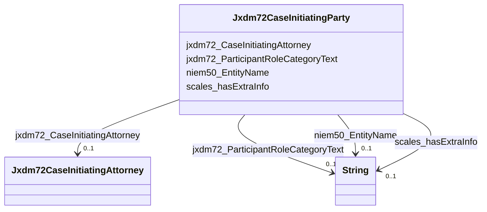

# Class: Jxdm72CaseInitiatingParty


This class occurs 1337860 times.


URI: [jxdm72:CaseInitiatingParty](http://release.niem.gov/niem/domains/jxdm/7.2/CaseInitiatingParty)





<!-- no inheritance hierarchy -->


## Slots

| Name | Cardinality and Range | Description | Inheritance | Occurrences |
| ---  | --- | --- | --- | --- |
| [scales_hasExtraInfo](../slots/scales_hasExtraInfo.md) | 0..1 <br/> [xsd:string](http://www.w3.org/2001/XMLSchema#string) |  <br/>  | direct | 147013 |
| [jxdm72_ParticipantRoleCategoryText](../slots/jxdm72_ParticipantRoleCategoryText.md) | 0..1 <br/> [xsd:string](http://www.w3.org/2001/XMLSchema#string) |  <br/>  | direct | 1337860 |
| [jxdm72_CaseInitiatingAttorney](../slots/jxdm72_CaseInitiatingAttorney.md) | 0..1 <br/> [Jxdm72CaseInitiatingAttorney](../classes/Jxdm72CaseInitiatingAttorney.md) |  <br/>  | direct | 2755161 |
| [niem50_EntityName](../slots/niem50_EntityName.md) | 0..1 <br/> [xsd:string](http://www.w3.org/2001/XMLSchema#string) |  <br/>  | direct | 1337860 |


## Usages

| used by | used in | type | used |
| ---  | --- | --- | --- |
| [ScalesCivilCase](../classes/ScalesCivilCase.md) | [Jxdm72CaseInitiatingParty](../classes/Jxdm72CaseInitiatingParty.md) | any_of[range] | [Jxdm72CaseInitiatingParty](../classes/Jxdm72CaseInitiatingParty.md) |
| [ScalesCriminalCase](../classes/ScalesCriminalCase.md) | [Jxdm72CaseInitiatingParty](../classes/Jxdm72CaseInitiatingParty.md) | any_of[range] | [Jxdm72CaseInitiatingParty](../classes/Jxdm72CaseInitiatingParty.md) |


## LinkML Source

<!-- TODO: investigate https://stackoverflow.com/questions/37606292/how-to-create-tabbed-code-blocks-in-mkdocs-or-sphinx -->

### Direct

<details>

```yaml
name: jxdm72_CaseInitiatingParty
from_schema: okns:scales-kg
rank: 1000
slots:
- scales_hasExtraInfo
- jxdm72_ParticipantRoleCategoryText
- jxdm72_CaseInitiatingAttorney
- niem50_EntityName
class_uri: jxdm72:CaseInitiatingParty

```
</details>

### Induced

<details>

```yaml
name: jxdm72_CaseInitiatingParty
from_schema: okns:scales-kg
rank: 1000
attributes:
  scales_hasExtraInfo:
    name: scales_hasExtraInfo
    from_schema: okns:scales-kg
    rank: 1000
    slot_uri: scales:hasExtraInfo
    alias: scales_hasExtraInfo
    owner: jxdm72_CaseInitiatingParty
    domain_of:
    - jxdm72_CaseDefendantParty
    - jxdm72_CaseInitiatingParty
    - scales_Party
    range: string
  jxdm72_ParticipantRoleCategoryText:
    name: jxdm72_ParticipantRoleCategoryText
    from_schema: okns:scales-kg
    rank: 1000
    slot_uri: jxdm72:ParticipantRoleCategoryText
    alias: jxdm72_ParticipantRoleCategoryText
    owner: jxdm72_CaseInitiatingParty
    domain_of:
    - jxdm72_CaseDefendantParty
    - jxdm72_CaseInitiatingParty
    - scales_Party
    range: string
  jxdm72_CaseInitiatingAttorney:
    name: jxdm72_CaseInitiatingAttorney
    from_schema: okns:scales-kg
    rank: 1000
    slot_uri: jxdm72:CaseInitiatingAttorney
    alias: jxdm72_CaseInitiatingAttorney
    owner: jxdm72_CaseInitiatingParty
    domain_of:
    - jxdm72_CaseInitiatingParty
    range: jxdm72_CaseInitiatingAttorney
  niem50_EntityName:
    name: niem50_EntityName
    from_schema: okns:scales-kg
    rank: 1000
    slot_uri: niem50:EntityName
    alias: niem50_EntityName
    owner: jxdm72_CaseInitiatingParty
    domain_of:
    - jxdm72_CaseDefendantParty
    - jxdm72_CaseInitiatingParty
    - scales_Party
    range: string
class_uri: jxdm72:CaseInitiatingParty

```
</details>