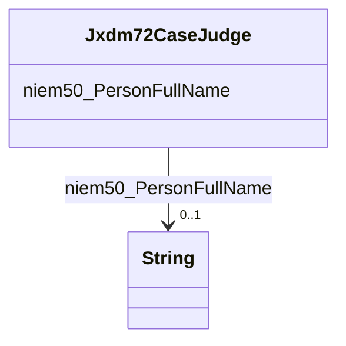

# Class: Jxdm72CaseJudge


This class occurs 3207790 times.


URI: [jxdm72:CaseJudge](http://release.niem.gov/niem/domains/jxdm/7.2/CaseJudge)





<!-- no inheritance hierarchy -->


## Slots

| Name | Cardinality and Range | Description | Inheritance | Occurrences |
| ---  | --- | --- | --- | --- |
| [niem50_PersonFullName](../slots/niem50_PersonFullName.md) | 0..1 <br/> [xsd:string](http://www.w3.org/2001/XMLSchema#string) |  <br/>  | direct | 3207790 |


## Usages

| used by | used in | type | used |
| ---  | --- | --- | --- |
| [ScalesCivilCase](../classes/ScalesCivilCase.md) | [Jxdm72CaseJudge](../classes/Jxdm72CaseJudge.md) | any_of[range] | [Jxdm72CaseJudge](../classes/Jxdm72CaseJudge.md) |
| [ScalesCriminalCase](../classes/ScalesCriminalCase.md) | [Jxdm72CaseJudge](../classes/Jxdm72CaseJudge.md) | any_of[range] | [Jxdm72CaseJudge](../classes/Jxdm72CaseJudge.md) |


## LinkML Source

<!-- TODO: investigate https://stackoverflow.com/questions/37606292/how-to-create-tabbed-code-blocks-in-mkdocs-or-sphinx -->

### Direct

<details>

```yaml
name: jxdm72_CaseJudge
from_schema: okns:scales-kg
rank: 1000
slots:
- niem50_PersonFullName
class_uri: jxdm72:CaseJudge

```
</details>

### Induced

<details>

```yaml
name: jxdm72_CaseJudge
from_schema: okns:scales-kg
rank: 1000
attributes:
  niem50_PersonFullName:
    name: niem50_PersonFullName
    from_schema: okns:scales-kg
    rank: 1000
    slot_uri: niem50:PersonFullName
    alias: niem50_PersonFullName
    owner: jxdm72_CaseJudge
    domain_of:
    - jxdm72_Attorney
    - jxdm72_CaseDefendantParty
    - jxdm72_CaseDefenseAttorney
    - jxdm72_CaseInitiatingAttorney
    - jxdm72_CaseJudge
    - jxdm72_Judge
    - scales_Party
    range: string
class_uri: jxdm72:CaseJudge

```
</details>