# Class: Jxdm72Charge


This class occurs 3285242 times.


URI: [jxdm72:Charge](http://release.niem.gov/niem/domains/jxdm/7.2/Charge)

```mermaid
 classDiagram
    class Jxdm72Charge
    click Jxdm72Charge href "../Jxdm72Charge"
      Jxdm72Charge : jxdm72_BondAmount
        
          
    
    
    Jxdm72Charge --> "0..1" Float : jxdm72_BondAmount
    click Float href "../Float"

        
      Jxdm72Charge : jxdm72_BondType
        
          
    
    
    Jxdm72Charge --> "0..1" String : jxdm72_BondType
    click String href "../String"

        
      Jxdm72Charge : jxdm72_ChargeBooking
        
          
    
    
    Jxdm72Charge --> "0..1" Jxdm72Booking : jxdm72_ChargeBooking
    click Jxdm72Booking href "../Jxdm72Booking"

        
      Jxdm72Charge : jxdm72_ChargeDisposition
        
          
    
    
    Jxdm72Charge --> "0..1" String : jxdm72_ChargeDisposition
    click String href "../String"

        
      Jxdm72Charge : jxdm72_ChargeSentence
        
          
    
    
    Jxdm72Charge --> "0..1" Jxdm72Sentence : jxdm72_ChargeSentence
    click Jxdm72Sentence href "../Jxdm72Sentence"

        
      Jxdm72Charge : jxdm72_ChargeSequenceID
        
          
    
    
    Jxdm72Charge --> "0..1" String : jxdm72_ChargeSequenceID
    click String href "../String"

        
      Jxdm72Charge : jxdm72_ChargeSeverityLevelCode
        
          
    
    
    Jxdm72Charge --> "0..1" String : jxdm72_ChargeSeverityLevelCode
    click String href "../String"

        
      Jxdm72Charge : jxdm72_ChargeSubject
        
          
    
    
    Jxdm72Charge --> "0..1" Jxdm72CaseDefendantParty : jxdm72_ChargeSubject
    click Jxdm72CaseDefendantParty href "../Jxdm72CaseDefendantParty"

        
      Jxdm72Charge : jxdm72_ChargeText
        
          
    
    
    Jxdm72Charge --> "0..1" String : jxdm72_ChargeText
    click String href "../String"

        
      Jxdm72Charge : jxdm72_DrugCategoryCode
        
          
    
    
    Jxdm72Charge --> "0..1" String : jxdm72_DrugCategoryCode
    click String href "../String"

        
      Jxdm72Charge : nibrs_NIBRSReportCategoryCode
        
          
    
    
    Jxdm72Charge --> "0..1" String : nibrs_NIBRSReportCategoryCode
    click String href "../String"

        
      Jxdm72Charge : nibrs_OffenseUCRCode
        
          
    
    
    Jxdm72Charge --> "0..1" String : nibrs_OffenseUCRCode
    click String href "../String"

        
      Jxdm72Charge : scales_hasChargeType
        
          
    
    
    Jxdm72Charge --> "0..1" String : scales_hasChargeType
    click String href "../String"

        
      
```





<!-- no inheritance hierarchy -->


## Slots

| Name | Cardinality and Range | Description | Inheritance | Occurrences |
| ---  | --- | --- | --- | --- |
| [jxdm72_DrugCategoryCode](../slots/jxdm72_DrugCategoryCode.md) | 0..1 <br/> [xsd:string](http://www.w3.org/2001/XMLSchema#string) |  <br/>  | direct | 118153 |
| [jxdm72_ChargeBooking](../slots/jxdm72_ChargeBooking.md) | 0..1 <br/> [Jxdm72Booking](../classes/Jxdm72Booking.md) |  <br/>  | direct | 363466 |
| [jxdm72_ChargeDisposition](../slots/jxdm72_ChargeDisposition.md) | 0..1 <br/> [xsd:string](http://www.w3.org/2001/XMLSchema#string) |  <br/>  | direct | 389366 |
| [jxdm72_ChargeText](../slots/jxdm72_ChargeText.md) | 0..1 <br/> [xsd:string](http://www.w3.org/2001/XMLSchema#string) |  <br/>  | direct | 3302642 |
| [jxdm72_ChargeSequenceID](../slots/jxdm72_ChargeSequenceID.md) | 0..1 <br/> [xsd:string](http://www.w3.org/2001/XMLSchema#string) |  <br/>  | direct | 389366 |
| [jxdm72_ChargeSubject](../slots/jxdm72_ChargeSubject.md) | 0..1 <br/> [Jxdm72CaseDefendantParty](../classes/Jxdm72CaseDefendantParty.md) |  <br/>  | direct | 363466 |
| [nibrs_NIBRSReportCategoryCode](../slots/nibrs_NIBRSReportCategoryCode.md) | 0..1 <br/> [xsd:string](http://www.w3.org/2001/XMLSchema#string) |  <br/>  | direct | 1595019 |
| [nibrs_OffenseUCRCode](../slots/nibrs_OffenseUCRCode.md) | 0..1 <br/> [xsd:string](http://www.w3.org/2001/XMLSchema#string) |  <br/>  | direct | 1006286 |
| [jxdm72_ChargeSeverityLevelCode](../slots/jxdm72_ChargeSeverityLevelCode.md) | 0..1 <br/> [xsd:string](http://www.w3.org/2001/XMLSchema#string) |  <br/>  | direct | 363485 |
| [scales_hasChargeType](../slots/scales_hasChargeType.md) | 0..1 <br/> [xsd:string](http://www.w3.org/2001/XMLSchema#string) |  <br/>  | direct | 389366 |
| [jxdm72_ChargeSentence](../slots/jxdm72_ChargeSentence.md) | 0..1 <br/> [Jxdm72Sentence](../classes/Jxdm72Sentence.md) |  <br/>  | direct | 151237 |
| [jxdm72_BondAmount](../slots/jxdm72_BondAmount.md) | 0..1 <br/> [xsd:float](http://www.w3.org/2001/XMLSchema#float) |  <br/>  | direct | 99402 |
| [jxdm72_BondType](../slots/jxdm72_BondType.md) | 0..1 <br/> [xsd:string](http://www.w3.org/2001/XMLSchema#string) |  <br/>  | direct | 105383 |


## Usages

| used by | used in | type | used |
| ---  | --- | --- | --- |
| [Jxdm72CaseDefendantParty](../classes/Jxdm72CaseDefendantParty.md) | [jxdm72_PersonCharge](../slots/jxdm72_PersonCharge.md) | range | [Jxdm72Charge](../classes/Jxdm72Charge.md) |
| [ScalesCriminalCase](../classes/ScalesCriminalCase.md) | [jxdm72_CaseCharge](../slots/jxdm72_CaseCharge.md) | range | [Jxdm72Charge](../classes/Jxdm72Charge.md) |
| [ScalesParty](../classes/ScalesParty.md) | [jxdm72_PersonCharge](../slots/jxdm72_PersonCharge.md) | range | [Jxdm72Charge](../classes/Jxdm72Charge.md) |


## LinkML Source

<!-- TODO: investigate https://stackoverflow.com/questions/37606292/how-to-create-tabbed-code-blocks-in-mkdocs-or-sphinx -->

### Direct

<details>

```yaml
name: jxdm72_Charge
from_schema: okns:scales-kg
rank: 1000
slots:
- jxdm72_DrugCategoryCode
- jxdm72_ChargeBooking
- jxdm72_ChargeDisposition
- jxdm72_ChargeText
- jxdm72_ChargeSequenceID
- jxdm72_ChargeSubject
- nibrs_NIBRSReportCategoryCode
- nibrs_OffenseUCRCode
- jxdm72_ChargeSeverityLevelCode
- scales_hasChargeType
- jxdm72_ChargeSentence
- jxdm72_BondAmount
- jxdm72_BondType
class_uri: jxdm72:Charge

```
</details>

### Induced

<details>

```yaml
name: jxdm72_Charge
from_schema: okns:scales-kg
rank: 1000
attributes:
  jxdm72_DrugCategoryCode:
    name: jxdm72_DrugCategoryCode
    from_schema: okns:scales-kg
    rank: 1000
    slot_uri: jxdm72:DrugCategoryCode
    alias: jxdm72_DrugCategoryCode
    owner: jxdm72_Charge
    domain_of:
    - jxdm72_ArrestCharge
    - jxdm72_Charge
    range: string
  jxdm72_ChargeBooking:
    name: jxdm72_ChargeBooking
    from_schema: okns:scales-kg
    rank: 1000
    slot_uri: jxdm72:ChargeBooking
    alias: jxdm72_ChargeBooking
    owner: jxdm72_Charge
    domain_of:
    - jxdm72_Charge
    range: jxdm72_Booking
  jxdm72_ChargeDisposition:
    name: jxdm72_ChargeDisposition
    from_schema: okns:scales-kg
    rank: 1000
    slot_uri: jxdm72:ChargeDisposition
    alias: jxdm72_ChargeDisposition
    owner: jxdm72_Charge
    domain_of:
    - jxdm72_Charge
    range: string
  jxdm72_ChargeText:
    name: jxdm72_ChargeText
    from_schema: okns:scales-kg
    rank: 1000
    slot_uri: jxdm72:ChargeText
    alias: jxdm72_ChargeText
    owner: jxdm72_Charge
    domain_of:
    - jxdm72_ArrestCharge
    - jxdm72_Charge
    range: string
  jxdm72_ChargeSequenceID:
    name: jxdm72_ChargeSequenceID
    from_schema: okns:scales-kg
    rank: 1000
    slot_uri: jxdm72:ChargeSequenceID
    alias: jxdm72_ChargeSequenceID
    owner: jxdm72_Charge
    domain_of:
    - jxdm72_Charge
    range: string
  jxdm72_ChargeSubject:
    name: jxdm72_ChargeSubject
    from_schema: okns:scales-kg
    rank: 1000
    slot_uri: jxdm72:ChargeSubject
    alias: jxdm72_ChargeSubject
    owner: jxdm72_Charge
    domain_of:
    - jxdm72_Charge
    range: jxdm72_CaseDefendantParty
  nibrs_NIBRSReportCategoryCode:
    name: nibrs_NIBRSReportCategoryCode
    from_schema: okns:scales-kg
    rank: 1000
    slot_uri: nibrs:NIBRSReportCategoryCode
    alias: nibrs_NIBRSReportCategoryCode
    owner: jxdm72_Charge
    domain_of:
    - jxdm72_ArrestCharge
    - jxdm72_Charge
    range: string
  nibrs_OffenseUCRCode:
    name: nibrs_OffenseUCRCode
    from_schema: okns:scales-kg
    rank: 1000
    slot_uri: nibrs:OffenseUCRCode
    alias: nibrs_OffenseUCRCode
    owner: jxdm72_Charge
    domain_of:
    - jxdm72_ArrestCharge
    - jxdm72_Charge
    range: string
  jxdm72_ChargeSeverityLevelCode:
    name: jxdm72_ChargeSeverityLevelCode
    from_schema: okns:scales-kg
    rank: 1000
    slot_uri: jxdm72:ChargeSeverityLevelCode
    alias: jxdm72_ChargeSeverityLevelCode
    owner: jxdm72_Charge
    domain_of:
    - jxdm72_ArrestCharge
    - jxdm72_Charge
    range: string
  scales_hasChargeType:
    name: scales_hasChargeType
    from_schema: okns:scales-kg
    rank: 1000
    slot_uri: scales:hasChargeType
    alias: scales_hasChargeType
    owner: jxdm72_Charge
    domain_of:
    - jxdm72_Charge
    range: string
  jxdm72_ChargeSentence:
    name: jxdm72_ChargeSentence
    from_schema: okns:scales-kg
    rank: 1000
    slot_uri: jxdm72:ChargeSentence
    alias: jxdm72_ChargeSentence
    owner: jxdm72_Charge
    domain_of:
    - jxdm72_Charge
    range: jxdm72_Sentence
  jxdm72_BondAmount:
    name: jxdm72_BondAmount
    from_schema: okns:scales-kg
    rank: 1000
    slot_uri: jxdm72:BondAmount
    alias: jxdm72_BondAmount
    owner: jxdm72_Charge
    domain_of:
    - jxdm72_Charge
    range: float
  jxdm72_BondType:
    name: jxdm72_BondType
    from_schema: okns:scales-kg
    rank: 1000
    slot_uri: jxdm72:BondType
    alias: jxdm72_BondType
    owner: jxdm72_Charge
    domain_of:
    - jxdm72_Charge
    range: string
class_uri: jxdm72:Charge

```
</details>