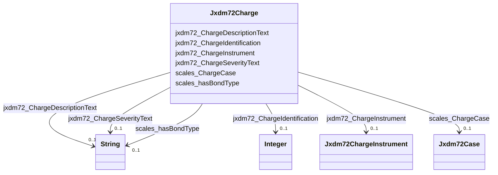

# Class: No class (type) name specified (jxdm72_Charge)


_No class (type) description specified_


URI: [jxdm72:Charge](http://release.niem.gov/niem/domains/jxdm/7.2/#Charge)





<!-- no inheritance hierarchy -->


## Slots

| Name | Cardinality and Range | Description | Inheritance |
| ---  | --- | --- | --- |
| [jxdm72_ChargeInstrument](../slots/jxdm72_ChargeInstrument.md) | 0..1 <br/> [Jxdm72ChargeInstrument](../classes/Jxdm72ChargeInstrument.md) | No slot (predicate) description specified <br/> 199210 occurrences with subject type jxdm72_Charge and object type jxdm72_ChargeInstrument. | direct |
| [scales_ChargeCase](../slots/scales_ChargeCase.md) | 0..1 <br/> [Jxdm72Case](../classes/Jxdm72Case.md) | No slot (predicate) description specified <br/> 218359 occurrences with subject type jxdm72_Charge and object type jxdm72_Case. | direct |
| [scales_hasBondType](../slots/scales_hasBondType.md) | 0..1 <br/> [xsd:string](http://www.w3.org/2001/XMLSchema#string) | No slot (predicate) description specified <br/> 76888 occurrences with subject type jxdm72_Charge and object type string. | direct |
| [jxdm72_ChargeIdentification](../slots/jxdm72_ChargeIdentification.md) | 0..1 <br/> [xsd:integer](http://www.w3.org/2001/XMLSchema#integer) | No slot (predicate) description specified <br/> 218359 occurrences with subject type jxdm72_Charge and object type integer. | direct |
| [jxdm72_ChargeDescriptionText](../slots/jxdm72_ChargeDescriptionText.md) | 0..1 <br/> [xsd:string](http://www.w3.org/2001/XMLSchema#string) | No slot (predicate) description specified <br/> 218535 occurrences with subject type jxdm72_Charge and object type string. | direct |
| [jxdm72_ChargeSeverityText](../slots/jxdm72_ChargeSeverityText.md) | 0..1 <br/> [xsd:string](http://www.w3.org/2001/XMLSchema#string) | No slot (predicate) description specified <br/> 218372 occurrences with subject type jxdm72_Charge and object type string. | direct |


## LinkML Source

<!-- TODO: investigate https://stackoverflow.com/questions/37606292/how-to-create-tabbed-code-blocks-in-mkdocs-or-sphinx -->

### Direct

<details>

```yaml
name: jxdm72_Charge
conforms_to: No schema conformance document specified
description: No class (type) description specified
title: No class (type) name specified
notes:
- Class with 218359 occurrences.
from_schema: scales-kg-new
rank: 1000
slots:
- jxdm72_ChargeInstrument
- scales_ChargeCase
- scales_hasBondType
- jxdm72_ChargeIdentification
- jxdm72_ChargeDescriptionText
- jxdm72_ChargeSeverityText
class_uri: jxdm72:Charge

```
</details>

### Induced

<details>

```yaml
name: jxdm72_Charge
conforms_to: No schema conformance document specified
description: No class (type) description specified
title: No class (type) name specified
notes:
- Class with 218359 occurrences.
from_schema: scales-kg-new
rank: 1000
attributes:
  jxdm72_ChargeInstrument:
    name: jxdm72_ChargeInstrument
    description: No slot (predicate) description specified
    comments:
    - 199210 occurrences with subject type jxdm72_Charge and object type jxdm72_ChargeInstrument.
    examples:
    - description: jxdm72_Charge → jxdm72_ChargeInstrument
      object:
        example_object: scales/ChargeInstrument/8229996
        example_object_type: jxdm72_ChargeInstrument
        example_predicate: jxdm72:ChargeInstrument
        example_subject: scales/Charge/8379993_c16887006-gafulton0110620219
        example_subject_type: jxdm72_Charge
    from_schema: scales-kg-new
    rank: 1000
    slot_uri: jxdm72:ChargeInstrument
    alias: jxdm72_ChargeInstrument
    owner: jxdm72_Charge
    domain_of:
    - jxdm72_Charge
    range: jxdm72_ChargeInstrument
  scales_ChargeCase:
    name: scales_ChargeCase
    description: No slot (predicate) description specified
    comments:
    - 218359 occurrences with subject type jxdm72_Charge and object type jxdm72_Case.
    examples:
    - description: jxdm72_Charge → jxdm72_Case
      object:
        example_object: scales/CaseCriminal/ga/fulton/01/95280
        example_object_type: jxdm72_Case
        example_predicate: scales:ChargeCase
        example_subject: scales/Charge/95280_c5457753-gafulton01237991
        example_subject_type: jxdm72_Charge
    from_schema: scales-kg-new
    rank: 1000
    slot_uri: scales:ChargeCase
    alias: scales_ChargeCase
    owner: jxdm72_Charge
    domain_of:
    - jxdm72_Charge
    range: jxdm72_Case
  scales_hasBondType:
    name: scales_hasBondType
    description: No slot (predicate) description specified
    comments:
    - 76888 occurrences with subject type jxdm72_Charge and object type string.
    examples:
    - description: jxdm72_Charge → string
      object:
        example_object: Surety Bond
        example_object_type: string
        example_predicate: scales:hasBondType
        example_subject: scales/Charge/100271_c1106145-gafulton01254716
        example_subject_type: jxdm72_Charge
    from_schema: scales-kg-new
    rank: 1000
    slot_uri: scales:hasBondType
    alias: scales_hasBondType
    owner: jxdm72_Charge
    domain_of:
    - jxdm72_Charge
    range: string
  jxdm72_ChargeIdentification:
    name: jxdm72_ChargeIdentification
    description: No slot (predicate) description specified
    comments:
    - 218359 occurrences with subject type jxdm72_Charge and object type integer.
    examples:
    - description: jxdm72_Charge → integer
      object:
        example_object: '254716'
        example_object_type: integer
        example_predicate: jxdm72:ChargeIdentification
        example_subject: scales/Charge/100271_c1106145-gafulton01254716
        example_subject_type: jxdm72_Charge
    from_schema: scales-kg-new
    rank: 1000
    slot_uri: jxdm72:ChargeIdentification
    alias: jxdm72_ChargeIdentification
    owner: jxdm72_Charge
    domain_of:
    - jxdm72_Charge
    range: integer
  jxdm72_ChargeDescriptionText:
    name: jxdm72_ChargeDescriptionText
    description: No slot (predicate) description specified
    comments:
    - 218535 occurrences with subject type jxdm72_Charge and object type string.
    examples:
    - description: jxdm72_Charge → string
      object:
        example_object: BENCH WARRANT-POSSESSION OF MARIJUANA
        example_object_type: string
        example_predicate: jxdm72:ChargeDescriptionText
        example_subject: scales/Charge/100271_c1106145-gafulton01254716
        example_subject_type: jxdm72_Charge
    from_schema: scales-kg-new
    rank: 1000
    slot_uri: jxdm72:ChargeDescriptionText
    alias: jxdm72_ChargeDescriptionText
    owner: jxdm72_Charge
    domain_of:
    - jxdm72_Charge
    range: string
  jxdm72_ChargeSeverityText:
    name: jxdm72_ChargeSeverityText
    description: No slot (predicate) description specified
    comments:
    - 218372 occurrences with subject type jxdm72_Charge and object type string.
    examples:
    - description: jxdm72_Charge → string
      object:
        example_object: Misdemeanor
        example_object_type: string
        example_predicate: jxdm72:ChargeSeverityText
        example_subject: scales/Charge/100271_c1106145-gafulton01254716
        example_subject_type: jxdm72_Charge
    from_schema: scales-kg-new
    rank: 1000
    slot_uri: jxdm72:ChargeSeverityText
    alias: jxdm72_ChargeSeverityText
    owner: jxdm72_Charge
    domain_of:
    - jxdm72_Charge
    range: string
class_uri: jxdm72:Charge

```
</details>