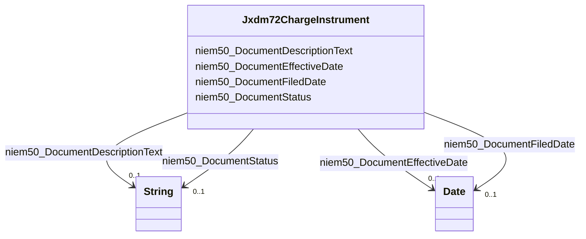

# Class: No class (type) name specified (jxdm72_ChargeInstrument)


_No class (type) description specified_


URI: [jxdm72:ChargeInstrument](http://release.niem.gov/niem/domains/jxdm/7.2/#ChargeInstrument)





<!-- no inheritance hierarchy -->


## Slots

| Name | Cardinality and Range | Description | Inheritance |
| ---  | --- | --- | --- |
| [niem50_DocumentFiledDate](../slots/niem50_DocumentFiledDate.md) | 0..1 <br/> [xsd:date](xsd:date) | No slot (predicate) description specified <br/> 86007 occurrences with subject type jxdm72_ChargeInstrument and object type date. | direct |
| [niem50_DocumentStatus](../slots/niem50_DocumentStatus.md) | 0..1 <br/> [xsd:string](xsd:string) | No slot (predicate) description specified <br/> 101588 occurrences with subject type jxdm72_ChargeInstrument and object type string. | direct |
| [niem50_DocumentEffectiveDate](../slots/niem50_DocumentEffectiveDate.md) | 0..1 <br/> [xsd:date](xsd:date) | No slot (predicate) description specified <br/> 92142 occurrences with subject type jxdm72_ChargeInstrument and object type date. | direct |
| [niem50_DocumentDescriptionText](../slots/niem50_DocumentDescriptionText.md) | 0..1 <br/> [xsd:string](xsd:string) | No slot (predicate) description specified <br/> 94949 occurrences with subject type jxdm72_ChargeInstrument and object type string. | direct |


## Usages

| used by | used in | type | used |
| ---  | --- | --- | --- |
| [Jxdm72Charge](../classes/Jxdm72Charge.md) | [Jxdm72ChargeInstrument](../classes/Jxdm72ChargeInstrument.md) | range | [Jxdm72ChargeInstrument](../classes/Jxdm72ChargeInstrument.md) |


## Identifier and Mapping Information


## Mappings

| Mapping Type | Mapped Value |
| ---  | ---  |
| self | jxdm72:ChargeInstrument |
| native | scales-kg-new/:Jxdm72ChargeInstrument |


## LinkML Source

<!-- TODO: investigate https://stackoverflow.com/questions/37606292/how-to-create-tabbed-code-blocks-in-mkdocs-or-sphinx -->

### Direct

<details>

```yaml
name: jxdm72_ChargeInstrument
conforms_to: No schema conformance document specified
description: No class (type) description specified
title: No class (type) name specified
notes:
- Class with 86007 occurrences.
rank: 1000
slots:
- niem50_DocumentFiledDate
- niem50_DocumentStatus
- niem50_DocumentEffectiveDate
- niem50_DocumentDescriptionText
class_uri: jxdm72:ChargeInstrument

```
</details>

### Induced

<details>

```yaml
name: jxdm72_ChargeInstrument
conforms_to: No schema conformance document specified
description: No class (type) description specified
title: No class (type) name specified
notes:
- Class with 86007 occurrences.
rank: 1000
attributes:
  niem50_DocumentFiledDate:
    name: niem50_DocumentFiledDate
    description: No slot (predicate) description specified
    comments:
    - 86007 occurrences with subject type jxdm72_ChargeInstrument and object type
      date.
    examples:
    - description: jxdm72_ChargeInstrument → date
      object:
        example_object: '2011-12-01'
        example_object_type: date
        example_predicate: niem50:DocumentFiledDate
        example_subject: scales/ChargeInstrument/1835274
        example_subject_type: jxdm72_ChargeInstrument
    from_schema: scales-kg-new
    rank: 1000
    slot_uri: niem50:DocumentFiledDate
    alias: niem50_DocumentFiledDate
    owner: jxdm72_ChargeInstrument
    domain_of:
    - jxdm72_ChargeInstrument
    range: date
  niem50_DocumentStatus:
    name: niem50_DocumentStatus
    description: No slot (predicate) description specified
    comments:
    - 101588 occurrences with subject type jxdm72_ChargeInstrument and object type
      string.
    examples:
    - description: jxdm72_ChargeInstrument → string
      object:
        example_object: Filed
        example_object_type: string
        example_predicate: niem50:DocumentStatus
        example_subject: scales/ChargeInstrument/1835274
        example_subject_type: jxdm72_ChargeInstrument
    from_schema: scales-kg-new
    rank: 1000
    slot_uri: niem50:DocumentStatus
    alias: niem50_DocumentStatus
    owner: jxdm72_ChargeInstrument
    domain_of:
    - jxdm72_ChargeInstrument
    range: string
  niem50_DocumentEffectiveDate:
    name: niem50_DocumentEffectiveDate
    description: No slot (predicate) description specified
    comments:
    - 92142 occurrences with subject type jxdm72_ChargeInstrument and object type
      date.
    examples:
    - description: jxdm72_ChargeInstrument → date
      object:
        example_object: '2013-09-01'
        example_object_type: date
        example_predicate: niem50:DocumentEffectiveDate
        example_subject: scales/ChargeInstrument/1835274
        example_subject_type: jxdm72_ChargeInstrument
    from_schema: scales-kg-new
    rank: 1000
    slot_uri: niem50:DocumentEffectiveDate
    alias: niem50_DocumentEffectiveDate
    owner: jxdm72_ChargeInstrument
    domain_of:
    - jxdm72_ChargeInstrument
    range: date
  niem50_DocumentDescriptionText:
    name: niem50_DocumentDescriptionText
    description: No slot (predicate) description specified
    comments:
    - 94949 occurrences with subject type jxdm72_ChargeInstrument and object type
      string.
    examples:
    - description: jxdm72_ChargeInstrument → string
      object:
        example_object: Accusation Filed
        example_object_type: string
        example_predicate: niem50:DocumentDescriptionText
        example_subject: scales/ChargeInstrument/1835274
        example_subject_type: jxdm72_ChargeInstrument
    from_schema: scales-kg-new
    rank: 1000
    slot_uri: niem50:DocumentDescriptionText
    alias: niem50_DocumentDescriptionText
    owner: jxdm72_ChargeInstrument
    domain_of:
    - jxdm72_ChargeInstrument
    range: string
class_uri: jxdm72:ChargeInstrument

```
</details>