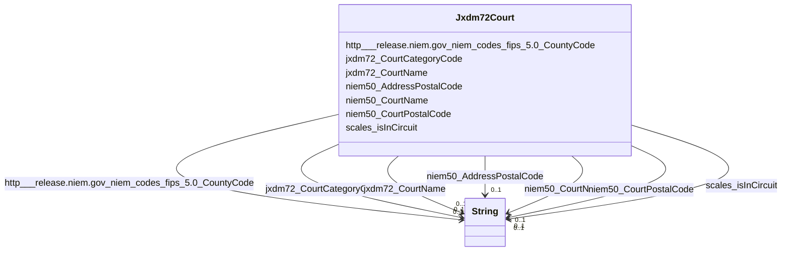

# Class: Jxdm72Court


This class occurs 95 times.


URI: [jxdm72:Court](http://release.niem.gov/niem/domains/jxdm/7.2/Court)





<!-- no inheritance hierarchy -->


## Slots

| Name | Cardinality and Range | Description | Inheritance | Occurrences |
| ---  | --- | --- | --- | --- |
| [niem50_CourtName](../slots/niem50_CourtName.md) | 0..1 <br/> [xsd:string](http://www.w3.org/2001/XMLSchema#string) |  <br/>  | direct | 1 |
| [jxdm72_CourtCategoryCode](../slots/jxdm72_CourtCategoryCode.md) | 0..1 <br/> [xsd:string](http://www.w3.org/2001/XMLSchema#string) |  <br/>  | direct | 95 |
| [jxdm72_CourtName](../slots/jxdm72_CourtName.md) | 0..1 <br/> [xsd:string](http://www.w3.org/2001/XMLSchema#string) |  <br/>  | direct | 94 |
| [scales_isInCircuit](../slots/scales_isInCircuit.md) | 0..1 <br/> [xsd:string](http://www.w3.org/2001/XMLSchema#string) |  <br/>  | direct | 94 |
| [http___release.niem.gov_niem_codes_fips_5.0_CountyCode](../slots/http___release.niem.gov_niem_codes_fips_5.0_CountyCode.md) | 0..1 <br/> [xsd:string](http://www.w3.org/2001/XMLSchema#string) |  <br/>  | direct | 3036 |
| [niem50_CourtPostalCode](../slots/niem50_CourtPostalCode.md) | 0..1 <br/> [xsd:string](http://www.w3.org/2001/XMLSchema#string) |  <br/>  | direct | 1 |
| [niem50_AddressPostalCode](../slots/niem50_AddressPostalCode.md) | 0..1 <br/> [xsd:string](http://www.w3.org/2001/XMLSchema#string) |  <br/>  | direct | 40932 |


## Usages

| used by | used in | type | used |
| ---  | --- | --- | --- |
| [ScalesCivilCase](../classes/ScalesCivilCase.md) | [jxdm72_CaseCourt](../slots/jxdm72_CaseCourt.md) | any_of[range] | [Jxdm72Court](../classes/Jxdm72Court.md) |
| [ScalesCriminalCase](../classes/ScalesCriminalCase.md) | [jxdm72_CaseCourt](../slots/jxdm72_CaseCourt.md) | any_of[range] | [Jxdm72Court](../classes/Jxdm72Court.md) |


## LinkML Source

<!-- TODO: investigate https://stackoverflow.com/questions/37606292/how-to-create-tabbed-code-blocks-in-mkdocs-or-sphinx -->

### Direct

<details>

```yaml
name: jxdm72_Court
from_schema: okns:scales-kg
rank: 1000
slots:
- niem50_CourtName
- jxdm72_CourtCategoryCode
- jxdm72_CourtName
- scales_isInCircuit
- http___release.niem.gov_niem_codes_fips_5.0_CountyCode
- niem50_CourtPostalCode
- niem50_AddressPostalCode
class_uri: jxdm72:Court

```
</details>

### Induced

<details>

```yaml
name: jxdm72_Court
from_schema: okns:scales-kg
rank: 1000
attributes:
  niem50_CourtName:
    name: niem50_CourtName
    from_schema: okns:scales-kg
    rank: 1000
    slot_uri: niem50:CourtName
    alias: niem50_CourtName
    owner: jxdm72_Court
    domain_of:
    - jxdm72_Court
    range: string
  jxdm72_CourtCategoryCode:
    name: jxdm72_CourtCategoryCode
    from_schema: okns:scales-kg
    rank: 1000
    slot_uri: jxdm72:CourtCategoryCode
    alias: jxdm72_CourtCategoryCode
    owner: jxdm72_Court
    domain_of:
    - jxdm72_Court
    range: string
  jxdm72_CourtName:
    name: jxdm72_CourtName
    from_schema: okns:scales-kg
    rank: 1000
    slot_uri: jxdm72:CourtName
    alias: jxdm72_CourtName
    owner: jxdm72_Court
    domain_of:
    - jxdm72_Court
    range: string
  scales_isInCircuit:
    name: scales_isInCircuit
    from_schema: okns:scales-kg
    rank: 1000
    slot_uri: scales:isInCircuit
    alias: scales_isInCircuit
    owner: jxdm72_Court
    domain_of:
    - jxdm72_Court
    range: string
  http___release.niem.gov_niem_codes_fips_5.0_CountyCode:
    name: http___release.niem.gov_niem_codes_fips_5.0_CountyCode
    from_schema: okns:scales-kg
    rank: 1000
    slot_uri: http://release.niem.gov/niem/codes/fips/5.0/CountyCode
    alias: http___release.niem.gov_niem_codes_fips_5.0_CountyCode
    owner: jxdm72_Court
    domain_of:
    - jxdm72_BookingFacility
    - jxdm72_Court
    range: string
  niem50_CourtPostalCode:
    name: niem50_CourtPostalCode
    from_schema: okns:scales-kg
    rank: 1000
    slot_uri: niem50:CourtPostalCode
    alias: niem50_CourtPostalCode
    owner: jxdm72_Court
    domain_of:
    - jxdm72_BookingFacility
    - jxdm72_Court
    range: string
  niem50_AddressPostalCode:
    name: niem50_AddressPostalCode
    from_schema: okns:scales-kg
    rank: 1000
    slot_uri: niem50:AddressPostalCode
    alias: niem50_AddressPostalCode
    owner: jxdm72_Court
    domain_of:
    - jxdm72_Court
    range: string
class_uri: jxdm72:Court

```
</details>