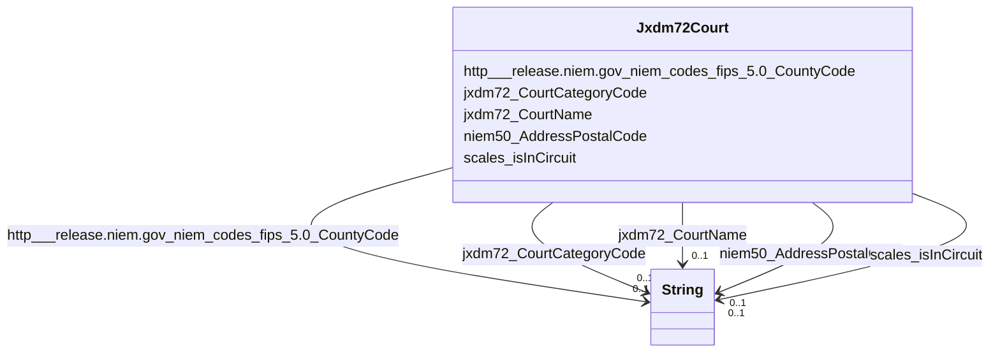

# Class: No class (type) name specified (jxdm72_Court)


_No class (type) description specified_


URI: [jxdm72:Court](http://release.niem.gov/niem/domains/jxdm/7.2/#Court)





<!-- no inheritance hierarchy -->


## Slots

| Name | Cardinality and Range | Description | Inheritance |
| ---  | --- | --- | --- |
| [jxdm72_CourtCategoryCode](../slots/jxdm72_CourtCategoryCode.md) | 0..1 <br/> [xsd:string](http://www.w3.org/2001/XMLSchema#string) | No slot (predicate) description specified <br/> 94 occurrences with subject type jxdm72_Court and object type string.<br/>94 occurrences with untyped subjects and object type string. | direct |
| [scales_isInCircuit](../slots/scales_isInCircuit.md) | 0..1 <br/> [xsd:string](http://www.w3.org/2001/XMLSchema#string) | No slot (predicate) description specified <br/> 94 occurrences with subject type jxdm72_Court and object type string.<br/>94 occurrences with untyped subjects and object type string. | direct |
| [http___release.niem.gov_niem_codes_fips_5.0_CountyCode](../slots/http___release.niem.gov_niem_codes_fips_5.0_CountyCode.md) | 0..1 <br/> [xsd:string](http://www.w3.org/2001/XMLSchema#string) | No slot (predicate) description specified <br/> 3035 occurrences with subject type jxdm72_Court and object type string. | direct |
| [jxdm72_CourtName](../slots/jxdm72_CourtName.md) | 0..1 <br/> [xsd:string](http://www.w3.org/2001/XMLSchema#string) | No slot (predicate) description specified <br/> 94 occurrences with subject type jxdm72_Court and object type string.<br/>94 occurrences with untyped subjects and object type string. | direct |
| [niem50_AddressPostalCode](../slots/niem50_AddressPostalCode.md) | 0..1 <br/> [xsd:string](http://www.w3.org/2001/XMLSchema#string) | No slot (predicate) description specified <br/> 40932 occurrences with subject type jxdm72_Court and object type string. | direct |


## Usages

| used by | used in | type | used |
| ---  | --- | --- | --- |
| [ScalesCase](../classes/ScalesCase.md) | [jxdm72_CaseCourt](../slots/jxdm72_CaseCourt.md) | range | [Jxdm72Court](../classes/Jxdm72Court.md) |


## LinkML Source

<!-- TODO: investigate https://stackoverflow.com/questions/37606292/how-to-create-tabbed-code-blocks-in-mkdocs-or-sphinx -->

### Direct

<details>

```yaml
name: jxdm72_Court
conforms_to: No schema conformance document specified
description: No class (type) description specified
title: No class (type) name specified
notes:
- Class with 94 occurrences.
from_schema: scales-kg-new
rank: 1000
slots:
- jxdm72_CourtCategoryCode
- scales_isInCircuit
- http___release.niem.gov_niem_codes_fips_5.0_CountyCode
- jxdm72_CourtName
- niem50_AddressPostalCode
class_uri: jxdm72:Court

```
</details>

### Induced

<details>

```yaml
name: jxdm72_Court
conforms_to: No schema conformance document specified
description: No class (type) description specified
title: No class (type) name specified
notes:
- Class with 94 occurrences.
from_schema: scales-kg-new
rank: 1000
attributes:
  jxdm72_CourtCategoryCode:
    name: jxdm72_CourtCategoryCode
    description: No slot (predicate) description specified
    comments:
    - 94 occurrences with subject type jxdm72_Court and object type string.
    - 94 occurrences with untyped subjects and object type string.
    examples:
    - description: jxdm72_Court → string
      object:
        example_object: FED
        example_object_type: string
        example_predicate: jxdm72:CourtCategoryCode
        example_subject: scales/Court/almd
        example_subject_type: jxdm72_Court
    - description: None → string
      object:
        example_object: FED
        example_object_type: string
        example_predicate: jxdm72:CourtCategoryCode
        example_subject: scales:Court/akd
        example_subject_type: None
    from_schema: scales-kg-new
    rank: 1000
    slot_uri: jxdm72:CourtCategoryCode
    alias: jxdm72_CourtCategoryCode
    owner: jxdm72_Court
    domain_of:
    - jxdm72_Court
    range: string
  scales_isInCircuit:
    name: scales_isInCircuit
    description: No slot (predicate) description specified
    comments:
    - 94 occurrences with subject type jxdm72_Court and object type string.
    - 94 occurrences with untyped subjects and object type string.
    examples:
    - description: jxdm72_Court → string
      object:
        example_object: Eleventh
        example_object_type: string
        example_predicate: scales:isInCircuit
        example_subject: scales/Court/almd
        example_subject_type: jxdm72_Court
    - description: None → string
      object:
        example_object: Ninth
        example_object_type: string
        example_predicate: scales:isInCircuit
        example_subject: scales:Court/akd
        example_subject_type: None
    from_schema: scales-kg-new
    rank: 1000
    slot_uri: scales:isInCircuit
    alias: scales_isInCircuit
    owner: jxdm72_Court
    domain_of:
    - jxdm72_Court
    range: string
  http___release.niem.gov_niem_codes_fips_5.0_CountyCode:
    name: http___release.niem.gov_niem_codes_fips_5.0_CountyCode
    description: No slot (predicate) description specified
    comments:
    - 3035 occurrences with subject type jxdm72_Court and object type string.
    examples:
    - description: jxdm72_Court → string
      object:
        example_object: '01001'
        example_object_type: string
        example_predicate: http://release.niem.gov/niem/codes/fips/5.0/CountyCode
        example_subject: scales/Court/almd
        example_subject_type: jxdm72_Court
    from_schema: scales-kg-new
    rank: 1000
    slot_uri: http://release.niem.gov/niem/codes/fips/5.0/CountyCode
    alias: http___release.niem.gov_niem_codes_fips_5.0_CountyCode
    owner: jxdm72_Court
    domain_of:
    - jxdm72_Court
    range: string
  jxdm72_CourtName:
    name: jxdm72_CourtName
    description: No slot (predicate) description specified
    comments:
    - 94 occurrences with subject type jxdm72_Court and object type string.
    - 94 occurrences with untyped subjects and object type string.
    examples:
    - description: jxdm72_Court → string
      object:
        example_object: District Court, M.D. Alabama
        example_object_type: string
        example_predicate: jxdm72:CourtName
        example_subject: scales/Court/almd
        example_subject_type: jxdm72_Court
    - description: None → string
      object:
        example_object: District Court, D. Alaska
        example_object_type: string
        example_predicate: jxdm72:CourtName
        example_subject: scales:Court/akd
        example_subject_type: None
    from_schema: scales-kg-new
    rank: 1000
    slot_uri: jxdm72:CourtName
    alias: jxdm72_CourtName
    owner: jxdm72_Court
    domain_of:
    - jxdm72_Court
    range: string
  niem50_AddressPostalCode:
    name: niem50_AddressPostalCode
    description: No slot (predicate) description specified
    comments:
    - 40932 occurrences with subject type jxdm72_Court and object type string.
    examples:
    - description: jxdm72_Court → string
      object:
        example_object: '35010'
        example_object_type: string
        example_predicate: niem50:AddressPostalCode
        example_subject: scales/Court/almd
        example_subject_type: jxdm72_Court
    from_schema: scales-kg-new
    rank: 1000
    slot_uri: niem50:AddressPostalCode
    alias: niem50_AddressPostalCode
    owner: jxdm72_Court
    domain_of:
    - jxdm72_Court
    range: string
class_uri: jxdm72:Court

```
</details>