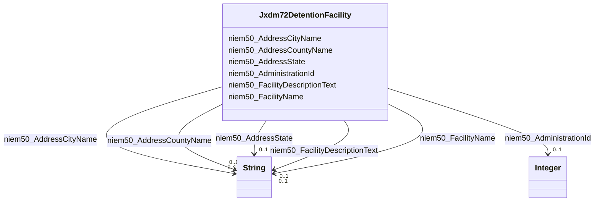

# Class: No class (type) name specified (jxdm72_DetentionFacility)


_No class (type) description specified_


URI: [jxdm72:DetentionFacility](http://release.niem.gov/niem/domains/jxdm/7.2/#DetentionFacility)





<!-- no inheritance hierarchy -->


## Slots

| Name | Cardinality and Range | Description | Inheritance |
| ---  | --- | --- | --- |
| [niem50_AddressState](../slots/niem50_AddressState.md) | 0..1 <br/> [xsd:string](xsd:string) | No slot (predicate) description specified <br/> 1 occurrences with subject type jxdm72_DetentionFacility and object type string. | direct |
| [niem50_FacilityDescriptionText](../slots/niem50_FacilityDescriptionText.md) | 0..1 <br/> [xsd:string](xsd:string) | No slot (predicate) description specified <br/> 1 occurrences with subject type jxdm72_DetentionFacility and object type string. | direct |
| [niem50_FacilityName](../slots/niem50_FacilityName.md) | 0..1 <br/> [xsd:string](xsd:string) | No slot (predicate) description specified <br/> 1 occurrences with subject type jxdm72_DetentionFacility and object type string. | direct |
| [niem50_AddressCountyName](../slots/niem50_AddressCountyName.md) | 0..1 <br/> [xsd:string](xsd:string) | No slot (predicate) description specified <br/> 1 occurrences with subject type jxdm72_DetentionFacility and object type string. | direct |
| [niem50_AdministrationId](../slots/niem50_AdministrationId.md) | 0..1 <br/> [xsd:integer](xsd:integer) | No slot (predicate) description specified <br/> 1 occurrences with subject type jxdm72_DetentionFacility and object type integer. | direct |
| [niem50_AddressCityName](../slots/niem50_AddressCityName.md) | 0..1 <br/> [xsd:string](xsd:string) | No slot (predicate) description specified <br/> 1 occurrences with subject type jxdm72_DetentionFacility and object type string. | direct |


## Identifier and Mapping Information


### Schema Source


* from schema: scales-kg-new


## Mappings

| Mapping Type | Mapped Value |
| ---  | ---  |
| self | jxdm72:DetentionFacility |
| native | scales-kg-new/:Jxdm72DetentionFacility |


## LinkML Source

<!-- TODO: investigate https://stackoverflow.com/questions/37606292/how-to-create-tabbed-code-blocks-in-mkdocs-or-sphinx -->

### Direct

<details>

```yaml
name: jxdm72_DetentionFacility
conforms_to: No schema conformance document specified
description: No class (type) description specified
title: No class (type) name specified
notes:
- Class with 1 occurrences.
from_schema: scales-kg-new
rank: 1000
slots:
- niem50_AddressState
- niem50_FacilityDescriptionText
- niem50_FacilityName
- niem50_AddressCountyName
- niem50_AdministrationId
- niem50_AddressCityName
class_uri: jxdm72:DetentionFacility

```
</details>

### Induced

<details>

```yaml
name: jxdm72_DetentionFacility
conforms_to: No schema conformance document specified
description: No class (type) description specified
title: No class (type) name specified
notes:
- Class with 1 occurrences.
from_schema: scales-kg-new
rank: 1000
attributes:
  niem50_AddressState:
    name: niem50_AddressState
    description: No slot (predicate) description specified
    comments:
    - 1 occurrences with subject type jxdm72_DetentionFacility and object type string.
    examples:
    - description: jxdm72_DetentionFacility → string
      object:
        example_object: Georgia
        example_object_type: string
        example_predicate: niem50:AddressState
        example_subject: scales/BookingDetentionFacility/ga-fulton-01
        example_subject_type: jxdm72_DetentionFacility
    from_schema: scales-kg-new
    rank: 1000
    slot_uri: niem50:AddressState
    alias: niem50_AddressState
    owner: jxdm72_DetentionFacility
    domain_of:
    - jxdm72_DetentionFacility
    range: string
  niem50_FacilityDescriptionText:
    name: niem50_FacilityDescriptionText
    description: No slot (predicate) description specified
    comments:
    - 1 occurrences with subject type jxdm72_DetentionFacility and object type string.
    examples:
    - description: jxdm72_DetentionFacility → string
      object:
        example_object: Jail
        example_object_type: string
        example_predicate: niem50:FacilityDescriptionText
        example_subject: scales/BookingDetentionFacility/ga-fulton-01
        example_subject_type: jxdm72_DetentionFacility
    from_schema: scales-kg-new
    rank: 1000
    slot_uri: niem50:FacilityDescriptionText
    alias: niem50_FacilityDescriptionText
    owner: jxdm72_DetentionFacility
    domain_of:
    - jxdm72_DetentionFacility
    range: string
  niem50_FacilityName:
    name: niem50_FacilityName
    description: No slot (predicate) description specified
    comments:
    - 1 occurrences with subject type jxdm72_DetentionFacility and object type string.
    examples:
    - description: jxdm72_DetentionFacility → string
      object:
        example_object: Fulton County Jail
        example_object_type: string
        example_predicate: niem50:FacilityName
        example_subject: scales/BookingDetentionFacility/ga-fulton-01
        example_subject_type: jxdm72_DetentionFacility
    from_schema: scales-kg-new
    rank: 1000
    slot_uri: niem50:FacilityName
    alias: niem50_FacilityName
    owner: jxdm72_DetentionFacility
    domain_of:
    - jxdm72_DetentionFacility
    range: string
  niem50_AddressCountyName:
    name: niem50_AddressCountyName
    description: No slot (predicate) description specified
    comments:
    - 1 occurrences with subject type jxdm72_DetentionFacility and object type string.
    examples:
    - description: jxdm72_DetentionFacility → string
      object:
        example_object: Fulton
        example_object_type: string
        example_predicate: niem50:AddressCountyName
        example_subject: scales/BookingDetentionFacility/ga-fulton-01
        example_subject_type: jxdm72_DetentionFacility
    from_schema: scales-kg-new
    rank: 1000
    slot_uri: niem50:AddressCountyName
    alias: niem50_AddressCountyName
    owner: jxdm72_DetentionFacility
    domain_of:
    - jxdm72_DetentionFacility
    range: string
  niem50_AdministrationId:
    name: niem50_AdministrationId
    description: No slot (predicate) description specified
    comments:
    - 1 occurrences with subject type jxdm72_DetentionFacility and object type integer.
    examples:
    - description: jxdm72_DetentionFacility → integer
      object:
        example_object: '1'
        example_object_type: integer
        example_predicate: niem50:AdministrationId
        example_subject: scales/BookingDetentionFacility/ga-fulton-01
        example_subject_type: jxdm72_DetentionFacility
    from_schema: scales-kg-new
    rank: 1000
    slot_uri: niem50:AdministrationId
    alias: niem50_AdministrationId
    owner: jxdm72_DetentionFacility
    domain_of:
    - jxdm72_DetentionFacility
    range: integer
  niem50_AddressCityName:
    name: niem50_AddressCityName
    description: No slot (predicate) description specified
    comments:
    - 1 occurrences with subject type jxdm72_DetentionFacility and object type string.
    examples:
    - description: jxdm72_DetentionFacility → string
      object:
        example_object: Atlanta
        example_object_type: string
        example_predicate: niem50:AddressCityName
        example_subject: scales/BookingDetentionFacility/ga-fulton-01
        example_subject_type: jxdm72_DetentionFacility
    from_schema: scales-kg-new
    rank: 1000
    slot_uri: niem50:AddressCityName
    alias: niem50_AddressCityName
    owner: jxdm72_DetentionFacility
    domain_of:
    - jxdm72_DetentionFacility
    range: string
class_uri: jxdm72:DetentionFacility

```
</details>