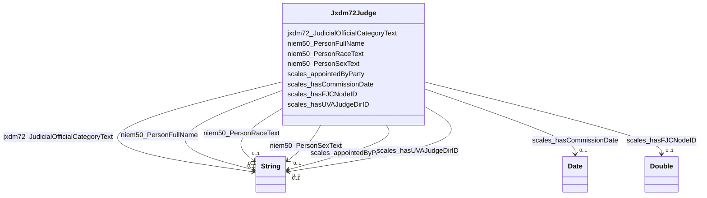

# Class: Jxdm72Judge


This class occurs 5385 times.


URI: [jxdm72:Judge](http://release.niem.gov/niem/domains/jxdm/7.2/Judge)





<!-- no inheritance hierarchy -->


## Slots

| Name | Cardinality and Range | Description | Inheritance | Occurrences |
| ---  | --- | --- | --- | --- |
| [niem50_PersonFullName](../slots/niem50_PersonFullName.md) | 0..1 <br/> [xsd:string](http://www.w3.org/2001/XMLSchema#string) |  <br/>  | direct | 5385 |
| [scales_appointedByParty](../slots/scales_appointedByParty.md) | 0..1 <br/> [xsd:string](http://www.w3.org/2001/XMLSchema#string) |  <br/>  | direct | 3912 |
| [niem50_PersonRaceText](../slots/niem50_PersonRaceText.md) | 0..1 <br/> [xsd:string](http://www.w3.org/2001/XMLSchema#string) |  <br/>  | direct | 3762 |
| [niem50_PersonSexText](../slots/niem50_PersonSexText.md) | 0..1 <br/> [xsd:string](http://www.w3.org/2001/XMLSchema#string) |  <br/>  | direct | 3762 |
| [scales_hasFJCNodeID](../slots/scales_hasFJCNodeID.md) | 0..1 <br/> [xsd:double](http://www.w3.org/2001/XMLSchema#double) |  <br/>  | direct | 3855 |
| [jxdm72_JudicialOfficialCategoryText](../slots/jxdm72_JudicialOfficialCategoryText.md) | 0..1 <br/> [xsd:string](http://www.w3.org/2001/XMLSchema#string) |  <br/>  | direct | 5385 |
| [scales_hasCommissionDate](../slots/scales_hasCommissionDate.md) | 0..1 <br/> [xsd:date](http://www.w3.org/2001/XMLSchema#date) |  <br/>  | direct | 4257 |
| [scales_hasUVAJudgeDirID](../slots/scales_hasUVAJudgeDirID.md) | 0..1 <br/> [xsd:string](http://www.w3.org/2001/XMLSchema#string) |  <br/>  | direct | 988 |


## LinkML Source

<!-- TODO: investigate https://stackoverflow.com/questions/37606292/how-to-create-tabbed-code-blocks-in-mkdocs-or-sphinx -->

### Direct

<details>

```yaml
name: jxdm72_Judge
from_schema: okns:scales-kg
rank: 1000
slots:
- niem50_PersonFullName
- scales_appointedByParty
- niem50_PersonRaceText
- niem50_PersonSexText
- scales_hasFJCNodeID
- jxdm72_JudicialOfficialCategoryText
- scales_hasCommissionDate
- scales_hasUVAJudgeDirID
class_uri: jxdm72:Judge

```
</details>

### Induced

<details>

```yaml
name: jxdm72_Judge
from_schema: okns:scales-kg
rank: 1000
attributes:
  niem50_PersonFullName:
    name: niem50_PersonFullName
    from_schema: okns:scales-kg
    rank: 1000
    slot_uri: niem50:PersonFullName
    alias: niem50_PersonFullName
    owner: jxdm72_Judge
    domain_of:
    - jxdm72_Attorney
    - jxdm72_CaseDefendantParty
    - jxdm72_CaseDefenseAttorney
    - jxdm72_CaseInitiatingAttorney
    - jxdm72_CaseJudge
    - jxdm72_Judge
    - scales_Party
    range: string
  scales_appointedByParty:
    name: scales_appointedByParty
    from_schema: okns:scales-kg
    rank: 1000
    slot_uri: scales:appointedByParty
    alias: scales_appointedByParty
    owner: jxdm72_Judge
    domain_of:
    - jxdm72_Judge
    range: string
  niem50_PersonRaceText:
    name: niem50_PersonRaceText
    from_schema: okns:scales-kg
    rank: 1000
    slot_uri: niem50:PersonRaceText
    alias: niem50_PersonRaceText
    owner: jxdm72_Judge
    domain_of:
    - jxdm72_CaseDefendantParty
    - jxdm72_Judge
    - niem50_Person
    range: string
  niem50_PersonSexText:
    name: niem50_PersonSexText
    from_schema: okns:scales-kg
    rank: 1000
    slot_uri: niem50:PersonSexText
    alias: niem50_PersonSexText
    owner: jxdm72_Judge
    domain_of:
    - jxdm72_Judge
    range: string
  scales_hasFJCNodeID:
    name: scales_hasFJCNodeID
    from_schema: okns:scales-kg
    rank: 1000
    slot_uri: scales:hasFJCNodeID
    alias: scales_hasFJCNodeID
    owner: jxdm72_Judge
    domain_of:
    - jxdm72_Judge
    range: double
  jxdm72_JudicialOfficialCategoryText:
    name: jxdm72_JudicialOfficialCategoryText
    from_schema: okns:scales-kg
    rank: 1000
    slot_uri: jxdm72:JudicialOfficialCategoryText
    alias: jxdm72_JudicialOfficialCategoryText
    owner: jxdm72_Judge
    domain_of:
    - jxdm72_Judge
    range: string
  scales_hasCommissionDate:
    name: scales_hasCommissionDate
    from_schema: okns:scales-kg
    rank: 1000
    slot_uri: scales:hasCommissionDate
    alias: scales_hasCommissionDate
    owner: jxdm72_Judge
    domain_of:
    - jxdm72_Judge
    range: date
  scales_hasUVAJudgeDirID:
    name: scales_hasUVAJudgeDirID
    from_schema: okns:scales-kg
    rank: 1000
    slot_uri: scales:hasUVAJudgeDirID
    alias: scales_hasUVAJudgeDirID
    owner: jxdm72_Judge
    domain_of:
    - jxdm72_Judge
    range: string
class_uri: jxdm72:Judge

```
</details>