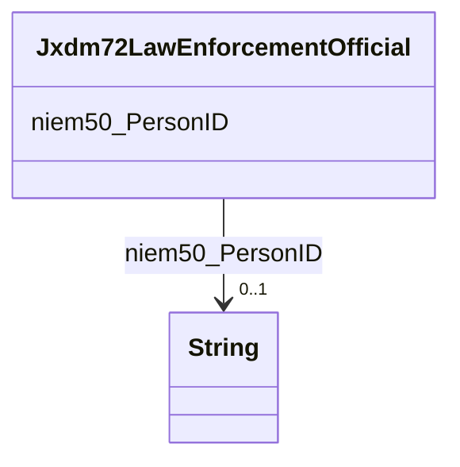

# Class: Jxdm72LawEnforcementOfficial


This class occurs 2016 times.


URI: [jxdm72:LawEnforcementOfficial](http://release.niem.gov/niem/domains/jxdm/7.2/LawEnforcementOfficial)





<!-- no inheritance hierarchy -->


## Slots

| Name | Cardinality and Range | Description | Inheritance | Occurrences |
| ---  | --- | --- | --- | --- |
| [niem50_PersonID](../slots/niem50_PersonID.md) | 0..1 <br/> [xsd:string](http://www.w3.org/2001/XMLSchema#string) |  <br/>  | direct | 2020 |


## Usages

| used by | used in | type | used |
| ---  | --- | --- | --- |
| [Jxdm72Arrest](../classes/Jxdm72Arrest.md) | [jxdm72_ArrestOfficial](../slots/jxdm72_ArrestOfficial.md) | range | [Jxdm72LawEnforcementOfficial](../classes/Jxdm72LawEnforcementOfficial.md) |


## LinkML Source

<!-- TODO: investigate https://stackoverflow.com/questions/37606292/how-to-create-tabbed-code-blocks-in-mkdocs-or-sphinx -->

### Direct

<details>

```yaml
name: jxdm72_LawEnforcementOfficial
from_schema: okns:scales-kg
rank: 1000
slots:
- niem50_PersonID
class_uri: jxdm72:LawEnforcementOfficial

```
</details>

### Induced

<details>

```yaml
name: jxdm72_LawEnforcementOfficial
from_schema: okns:scales-kg
rank: 1000
attributes:
  niem50_PersonID:
    name: niem50_PersonID
    from_schema: okns:scales-kg
    rank: 1000
    slot_uri: niem50:PersonID
    alias: niem50_PersonID
    owner: jxdm72_LawEnforcementOfficial
    domain_of:
    - jxdm72_LawEnforcementOfficial
    range: string
class_uri: jxdm72:LawEnforcementOfficial

```
</details>