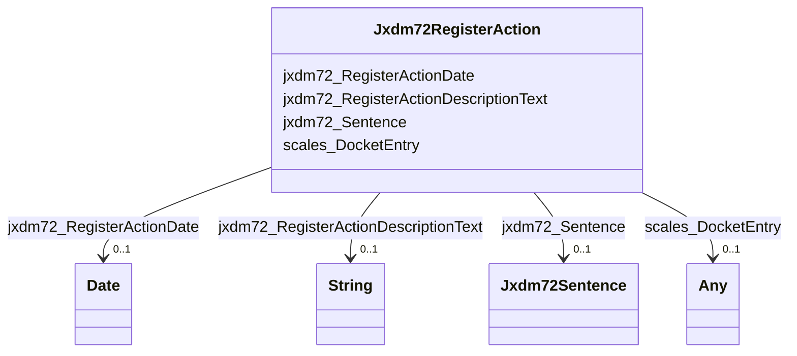

# Class: Jxdm72RegisterAction


This class occurs 28776887 times.


URI: [jxdm72:RegisterAction](http://release.niem.gov/niem/domains/jxdm/7.2/RegisterAction)





<!-- no inheritance hierarchy -->


## Slots

| Name | Cardinality and Range | Description | Inheritance | Occurrences |
| ---  | --- | --- | --- | --- |
| [jxdm72_RegisterActionDescriptionText](../slots/jxdm72_RegisterActionDescriptionText.md) | 0..1 <br/> [xsd:string](http://www.w3.org/2001/XMLSchema#string) |  <br/>  | direct | 27944887 |
| [scales_DocketEntry](../slots/scales_DocketEntry.md) | 0..1 <br/> [Jxdm72RegisterAction](../classes/Jxdm72RegisterAction.md)&nbsp;or&nbsp;<br />[xsd:anyURI](http://www.w3.org/2001/XMLSchema#anyURI) |  <br/>  | direct | 30414852 |
| [jxdm72_Sentence](../slots/jxdm72_Sentence.md) | 0..1 <br/> [Jxdm72Sentence](../classes/Jxdm72Sentence.md) |  <br/>  | direct | 356094 |
| [jxdm72_RegisterActionDate](../slots/jxdm72_RegisterActionDate.md) | 0..1 <br/> [xsd:date](http://www.w3.org/2001/XMLSchema#date) |  <br/>  | direct | 27946210 |


## Usages

| used by | used in | type | used |
| ---  | --- | --- | --- |
| [Jxdm72RegisterAction](../classes/Jxdm72RegisterAction.md) | [scales_DocketEntry](../slots/scales_DocketEntry.md) | any_of[range] | [Jxdm72RegisterAction](../classes/Jxdm72RegisterAction.md) |
| [Jxdm72RegisterOfActions](../classes/Jxdm72RegisterOfActions.md) | [scales_DocketEntry](../slots/scales_DocketEntry.md) | any_of[range] | [Jxdm72RegisterAction](../classes/Jxdm72RegisterAction.md) |
| [ScalesCivilCase](../classes/ScalesCivilCase.md) | [scales_DocketTable](../slots/scales_DocketTable.md) | any_of[range] | [Jxdm72RegisterAction](../classes/Jxdm72RegisterAction.md) |
| [ScalesCriminalCase](../classes/ScalesCriminalCase.md) | [scales_DocketTable](../slots/scales_DocketTable.md) | any_of[range] | [Jxdm72RegisterAction](../classes/Jxdm72RegisterAction.md) |


## LinkML Source

<!-- TODO: investigate https://stackoverflow.com/questions/37606292/how-to-create-tabbed-code-blocks-in-mkdocs-or-sphinx -->

### Direct

<details>

```yaml
name: jxdm72_RegisterAction
from_schema: okns:scales-kg
rank: 1000
slots:
- jxdm72_RegisterActionDescriptionText
- scales_DocketEntry
- jxdm72_Sentence
- jxdm72_RegisterActionDate
class_uri: jxdm72:RegisterAction

```
</details>

### Induced

<details>

```yaml
name: jxdm72_RegisterAction
from_schema: okns:scales-kg
rank: 1000
attributes:
  jxdm72_RegisterActionDescriptionText:
    name: jxdm72_RegisterActionDescriptionText
    from_schema: okns:scales-kg
    rank: 1000
    slot_uri: jxdm72:RegisterActionDescriptionText
    alias: jxdm72_RegisterActionDescriptionText
    owner: jxdm72_RegisterAction
    domain_of:
    - jxdm72_RegisterAction
    range: string
  scales_DocketEntry:
    name: scales_DocketEntry
    from_schema: okns:scales-kg
    rank: 1000
    slot_uri: scales:DocketEntry
    alias: scales_DocketEntry
    owner: jxdm72_RegisterAction
    domain_of:
    - jxdm72_RegisterAction
    - jxdm72_RegisterOfActions
    range: Any
    any_of:
    - range: jxdm72_RegisterAction
    - range: uri
  jxdm72_Sentence:
    name: jxdm72_Sentence
    from_schema: okns:scales-kg
    rank: 1000
    slot_uri: jxdm72:Sentence
    alias: jxdm72_Sentence
    owner: jxdm72_RegisterAction
    domain_of:
    - jxdm72_RegisterAction
    - scales_Party
    range: jxdm72_Sentence
  jxdm72_RegisterActionDate:
    name: jxdm72_RegisterActionDate
    from_schema: okns:scales-kg
    rank: 1000
    slot_uri: jxdm72:RegisterActionDate
    alias: jxdm72_RegisterActionDate
    owner: jxdm72_RegisterAction
    domain_of:
    - jxdm72_RegisterAction
    range: date
class_uri: jxdm72:RegisterAction

```
</details>